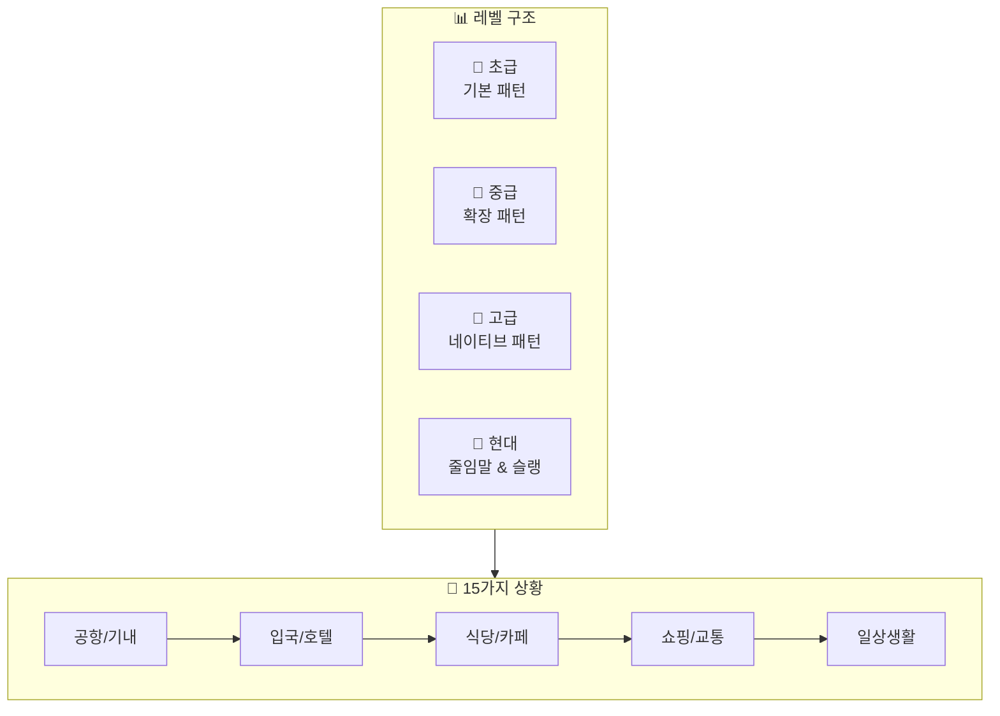
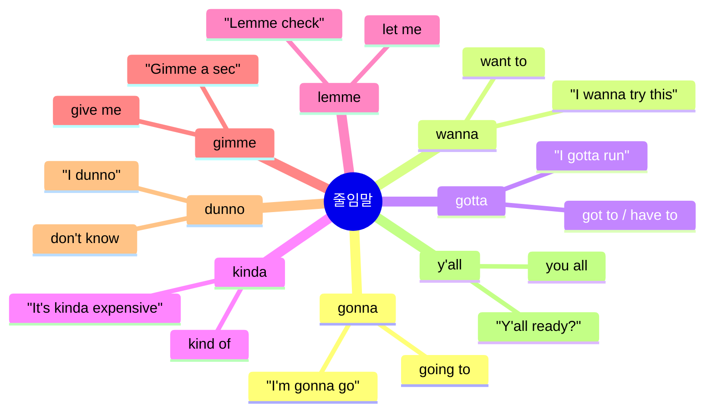
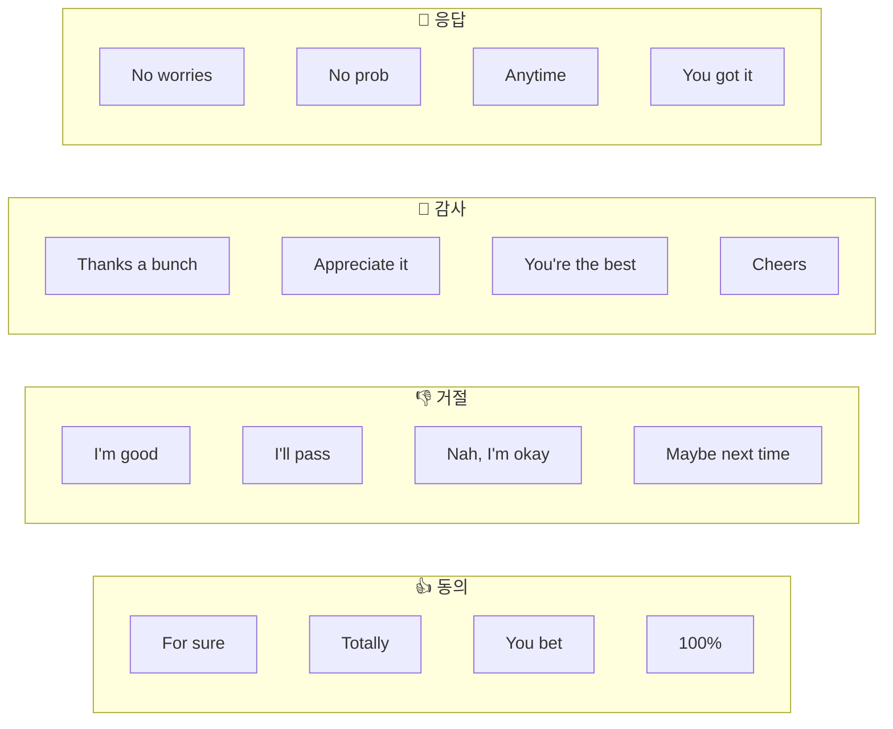
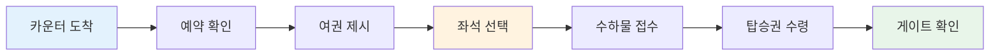
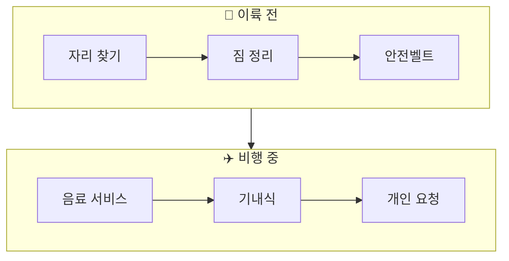
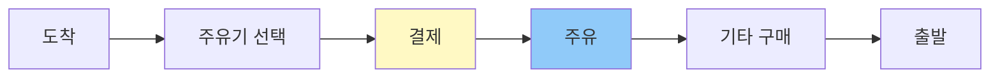
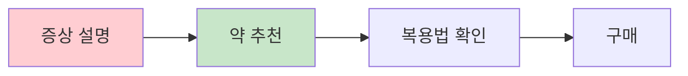
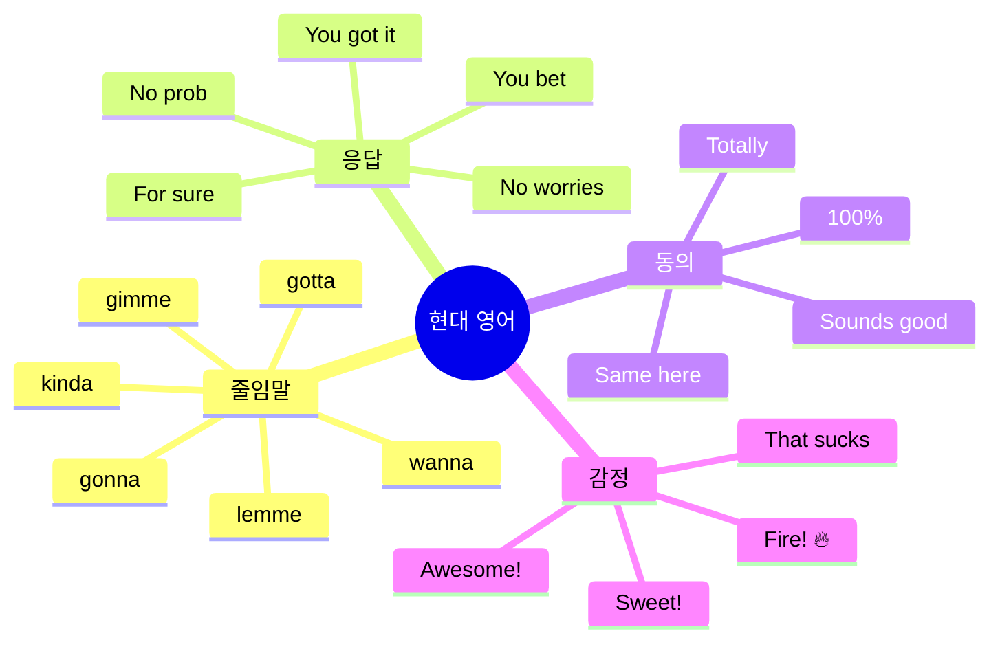
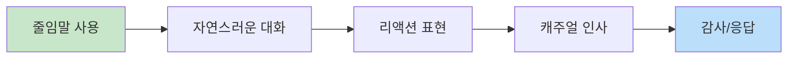

# ✈️ 여행 영어 회화 완벽 가이드
## 15가지 상황별 대화 & 레벨별 패턴 + 현대 표현

---

## 📋 목차
1. [학습 구조 개요](#학습-구조-개요)
2. [줄임말 & 현대 표현 마스터](#줄임말--현대-표현-마스터)
3. [공항 체크인](#1-공항-체크인-airport-check-in)
4. [기내 서비스](#2-기내-서비스-in-flight)
5. [입국 심사](#3-입국-심사-immigration)
6. [호텔](#4-호텔-hotel)
7. [식당](#5-식당-restaurant)
8. [카페](#6-카페-cafe)
9. [쇼핑](#7-쇼핑-shopping)
10. [교통 (택시/우버)](#8-교통-taxi--uber)
11. [관광지](#9-관광지-sightseeing)
12. [주유소](#10-주유소-gas-station)
13. [약국](#11-약국-pharmacy)
14. [편의점](#12-편의점-convenience-store)
15. [은행/환전소](#13-은행환전소-bankcurrency-exchange)
16. [미용실](#14-미용실-hair-salon)
17. [긴급상황](#15-긴급상황-emergency)

---

## 학습 구조 개요

### 전체 학습 흐름도

### 레벨별 특징

| 레벨 | 특징 | 문장 구조 | 목표 |
|:---:|------|----------|------|
| 🌱 초급 | 짧고 단순한 문장 | 주어 + 동사 + 목적어 | 기본 의사소통 |
| 🌿 중급 | 정중하고 완성된 문장 | 조동사 + 부가 표현 | 자연스러운 대화 |
| 🌳 고급 | 관용적이고 세련된 표현 | 복합 문장 + 뉘앙스 | 네이티브처럼 |
| 💬 현대 | 줄임말, 캐주얼 표현 | 일상 회화체 | 친근한 소통 |

---

## 줄임말 & 현대 표현 마스터

### 🗣️ 필수 줄임말 (Contractions)

### 📊 줄임말 비교표

| 정식 표현 | 줄임말 | 발음 | 예문 |
|----------|-------|------|------|
| going to | gonna | 거나 | I'm gonna grab a coffee. |
| want to | wanna | 워나 | I wanna check out now. |
| got to / have to | gotta | 가타 | I gotta catch my flight. |
| kind of | kinda | 카인다 | It's kinda far from here. |
| let me | lemme | 레미 | Lemme see the menu. |
| give me | gimme | 기미 | Gimme a minute. |
| don't know | dunno | 더노 | I dunno where it is. |
| you all | y'all | 얄 | Y'all have a good one! |
| because | 'cause / cuz | 커즈 | I'm late 'cause of traffic. |
| probably | prob'ly | 프라블리 | It'll prob'ly take 20 mins. |

### 🔥 현대 필수 표현 TOP 20

| 표현 | 의미 | 사용 상황 | 예문 |
|------|------|----------|------|
| **No worries** | 괜찮아요 / 천만에요 | 감사, 사과에 대한 응답 | "Thanks!" - "No worries!" |
| **My bad** | 내 잘못이야 | 가벼운 실수 시 | "Oops, my bad!" |
| **You're good** | 괜찮아요 | 상대방 안심시킬 때 | "Am I in your way?" - "You're good." |
| **I'm good** | 괜찮아요 / 됐어요 | 거절할 때 | "Want some more?" - "I'm good, thanks." |
| **For sure** | 물론이죠 / 당연하죠 | 동의할 때 | "Can you help?" - "For sure!" |
| **Sounds good** | 좋아요 | 제안 수락 | "Meet at 7?" - "Sounds good!" |
| **Got it** | 알겠어요 | 이해했을 때 | "Turn left at the corner." - "Got it." |
| **That works** | 그게 좋겠네요 | 제안 수락 | "How about tomorrow?" - "That works." |
| **All set** | 준비 완료 | 다 됐을 때 | "You're all set!" |
| **Perfect** | 완벽해요 | 만족할 때 | "Here's your order." - "Perfect!" |
| **No prob** | 문제없어요 | 부탁 수락 | "Could you...?" - "No prob!" |
| **Sure thing** | 물론이죠 | 동의/수락 | "Can I get more water?" - "Sure thing!" |
| **You bet** | 물론이죠 | 강한 동의 | "Will you be there?" - "You bet!" |
| **Sweet** | 좋아 / 멋져 | 기쁠 때 | "It's 50% off!" - "Sweet!" |
| **Awesome** | 대단해 / 좋아 | 긍정 반응 | "Awesome, thanks!" |
| **Hang on** | 잠깐만요 | 기다려달라고 할 때 | "Hang on a sec." |
| **What's up?** | 무슨 일이야? / 안녕 | 인사 | "Hey, what's up?" |
| **I feel you** | 이해해 / 공감해 | 공감할 때 | "I'm so tired." - "I feel you." |
| **Same here** | 나도 마찬가지 | 동의할 때 | "I love this place!" - "Same here!" |
| **Totally** | 완전히 / 정말 | 강조할 때 | "Totally agree!" |

### 💬 상황별 현대 표현

---

## 1. 공항 체크인 (Airport Check-in)

### 상황 흐름도

### 💬 대화 시나리오 A: 일반 체크인

#### 🌱 초급 + 💬 현대 표현

| 턴 | 👤 승객 | 👩‍✈️ 직원 |
|:---:|--------|----------|
| 1 | Hey, check in please? | Hey! Passport? |
| 2 | Here you go. | Cool. Flying to LA? |
| 3 | Yep! | Window or aisle? |
| 4 | Window's good. | Got it. Any bags? |
| 5 | Yeah, one. | Pop it on the scale. |
| 6 | Is it okay? | You're good. 20 kilos. |
| 7 | Sweet! | Here's your boarding pass. |
| 8 | What gate? | Gate 22. It's that way. |
| 9 | Thanks a bunch! | No prob! Have a good flight! |
| 10 | You too... I mean, thanks! 😅 | Haha, you're good! |

#### 🌿 중급 + 💬 현대 표현

| 턴 | 👤 승객 | 👩‍✈️ 직원 |
|:---:|--------|----------|
| 1 | Hi there! I'm gonna check in for my LA flight. | Hey! Sure thing. Passport and confirmation? |
| 2 | Here you go. The booking's under Kim. | Perfect, got it right here. |
| 3 | Any chance I could get a window seat? | Lemme check... Yeah, 14A works? |
| 4 | That works! Is it near the front? | Kinda in the middle. Best I got. |
| 5 | No worries, I'll take it. | Awesome. Checking any bags? |
| 6 | Just this one. Hopefully it's not overweight! | You're good - 21 kilos. Limit's 23. |
| 7 | Phew! What time's boarding? | Starts at 10:30. Don't be late! |
| 8 | Got it. Is there a lounge I can use? | Yeah, there's one on level 3. Show your pass. |
| 9 | Sweet, appreciate it! | You bet! Have a safe trip! |
| 10 | Thanks! Y'all have been super helpful! | Aww, thanks! Safe travels! |

### 💬 대화 시나리오 B: 문제 상황 (오버부킹/지연)

| 턴 | 👤 승객 | 👩‍✈️ 직원 |
|:---:|--------|----------|
| 1 | Hey, I'm here for the 3 PM flight to NYC. | Hi! Lemme pull that up... Oh no. |
| 2 | Uh oh. What's wrong? | So, the flight's been delayed. |
| 3 | Seriously? For how long? | Looks like 2 hours. Sorry about that. |
| 4 | Ugh, that sucks. Any reason? | Weather issues in New York, apparently. |
| 5 | Is there an earlier flight I can catch? | Lemme check... There's one at 4, but it's full. |
| 6 | Can you put me on standby? | For sure. I'll add you to the list. |
| 7 | What are my chances? | Pretty good, actually. Usually some no-shows. |
| 8 | Cool. Is there somewhere I can grab food? | Yeah, there's a food court past security. |
| 9 | Alright. You'll call me if something opens up? | Definitely. What's your cell? |
| 10 | 555-1234. Thanks for your help! | No prob! Fingers crossed! 🤞 |

### 💬 대화 시나리오 C: 업그레이드 요청

| 턴 | 👤 승객 | 👩‍✈️ 직원 |
|:---:|--------|----------|
| 1 | Hi! Quick question - any upgrade deals today? | Hey! Let's see what we got. |
| 2 | I'm kinda hoping for business class. | Hmm, it's pretty full today. |
| 3 | Dang. Worth a shot though, right? | Totally! Actually, wait... |
| 4 | Yeah? | There might be one seat left. Lemme check. |
| 5 | No way! How much extra? | It'd be $350 for the upgrade. |
| 6 | Ooh, that's kinda steep. | I feel you. It's a 10-hour flight though. |
| 7 | You make a good point... Okay, I'll do it. | Awesome! You're gonna love it. |
| 8 | Does it come with lounge access? | Yep! And priority boarding. |
| 9 | Sweet! Best decision ever. | Ha! You won't regret it. |
| 10 | Thanks so much! You're the best! | Anytime! Enjoy the flight! |

### 📋 공항 핵심 패턴 & 현대 표현

| 상황 | 정식 표현 | 💬 현대/캐주얼 표현 |
|------|----------|-------------------|
| 체크인 | I'd like to check in. | I'm gonna check in. / Check in please? |
| 좌석 요청 | Could I get a window seat? | Any chance I could get a window? |
| 확인 | Is that acceptable? | Is that cool? / That works? |
| 무게 확인 | Is it within the limit? | Am I good? / Is it okay? |
| 감사 | Thank you for your help. | Thanks a bunch! / Appreciate it! |
| 응답 | You're welcome. | No prob! / You bet! / Anytime! |

---

## 2. 기내 서비스 (In-Flight)

### 상황 흐름도

### 💬 대화 시나리오 A: 음료 & 식사

| 턴 | 👤 승객 | 👩‍✈️ 승무원 |
|:---:|--------|----------|
| 1 | Excuse me! | Yes? What can I get ya? |
| 2 | What drinks do y'all have? | We got Coke, Sprite, juice, beer, wine... |
| 3 | I'll take a Coke. | Ice? |
| 4 | Yeah, lots of ice please. | You got it! |
| 5 | Oh, and what's for dinner? | Chicken or pasta. The chicken's pretty good. |
| 6 | I'll go with the chicken then. | Smart choice! Anything else? |
| 7 | Actually, could I get some water too? | Sure thing! Still or sparkling? |
| 8 | Still's fine. | Here you go! |
| 9 | Thanks! Oh, do you have any snacks? | Yeah! Chips, cookies, or nuts? |
| 10 | Cookies sound good. Thanks so much! | No worries! Enjoy! |

### 💬 대화 시나리오 B: 문제 해결

| 턴 | 👤 승객 | 👩‍✈️ 승무원 |
|:---:|--------|----------|
| 1 | Hey, sorry to bother you... | No bother! What's up? |
| 2 | My screen's not working. | Oh no! Lemme take a look. |
| 3 | I tried turning it off and on. | Hmm, it's totally dead. My bad, let me fix this. |
| 4 | Is there another seat maybe? | Actually, yeah! 23C is empty. |
| 5 | Sweet! Is that an aisle seat? | Yep! Window's taken but aisle's free. |
| 6 | That works. Can I move now? | For sure! Need help with your stuff? |
| 7 | Nah, I'm good. Just got my backpack. | Perfect. I'll bring your meal there. |
| 8 | You're a lifesaver! | Haha, just doing my job! |
| 9 | Seriously though, appreciate it. | Anytime! Anything else you need? |
| 10 | I think I'm all set. Thanks! | Cool! Just press the call button if you need me. |

### 💬 대화 시나리오 C: 특별 요청

| 턴 | 👤 승객 | 👩‍✈️ 승무원 |
|:---:|--------|----------|
| 1 | Hi! I hate to be that person, but... | Ha! Go ahead, what do you need? |
| 2 | I'm freezing. Got any blankets? | Oh totally! Here's one. Want two? |
| 3 | One's probably fine. Thanks! | No prob! Pillow too? |
| 4 | Ooh, yes please! | Coming right up. |
| 5 | You guys are so nice on this airline. | Aww! We try! Long flight, right? |
| 6 | Yeah, 12 hours. I'm gonna try to sleep. | Good call. Want me to skip you for meals? |
| 7 | Actually yeah, that'd be great. | I'll put a note. Just flag me when you wake up. |
| 8 | Will do. Oh! What time do we land? | Around 8 AM local time. |
| 9 | Cool. And when do they turn lights off? | In about an hour. Perfect timing for sleep! |
| 10 | Awesome. Thanks for everything! | Sleep well! 😊 |

### 📋 기내 핵심 패턴 & 현대 표현

| 상황 | 정식 표현 | 💬 현대/캐주얼 표현 |
|------|----------|-------------------|
| 주문 | May I have some water? | Could I get some water? / Water please? |
| 선택 | I'll have the chicken. | I'll go with the chicken. |
| 문제 신고 | It's not working. | It's totally dead. / It's busted. |
| 감사 | Thank you very much. | You're a lifesaver! / Appreciate it! |
| 괜찮다고 | I'm fine, thank you. | I'm good. / I'm all set. |
| 사과 | I'm sorry to bother you. | Sorry to bug you. / Hate to be that person, but... |

---

## 3. 입국 심사 (Immigration)

### 💬 대화 시나리오 A: 관광 목적

| 턴 | 👮 심사관 | 👤 여행자 |
|:---:|----------|----------|
| 1 | Next! Passport. | Here you go. |
| 2 | Purpose of your visit? | Just traveling. Vacation. |
| 3 | How long you staying? | About a week. |
| 4 | Where you staying at? | Got an Airbnb downtown. |
| 5 | First time here? | Nah, second time actually. |
| 6 | What do you do for work? | I'm in tech. Software stuff. |
| 7 | Got a return ticket? | Yep, right here on my phone. |
| 8 | Traveling alone? | Yeah, solo trip this time. |
| 9 | Alright, you're good. | Thanks! |
| 10 | Enjoy your stay. | Thanks, will do! |

### 💬 대화 시나리오 B: 비즈니스 목적

| 턴 | 👮 심사관 | 👤 여행자 |
|:---:|----------|----------|
| 1 | Passport and documents. | Here's everything. |
| 2 | Business or pleasure? | Business. Got meetings this week. |
| 3 | What kind of business? | Tech conference, plus some client visits. |
| 4 | How long's the trip? | Five days total. |
| 5 | Where's the conference? | Convention center downtown. |
| 6 | Hotel? | Yeah, staying at the Marriott. |
| 7 | Got an invitation letter? | Yep, it's in there. |
| 8 | Who's your company? | Samsung. Been there 3 years. |
| 9 | Looks good. Welcome. | Appreciate it. |
| 10 | Have a good trip. | Thanks! You have a good day! |

### 💬 대화 시나리오 C: 추가 질문 상황

| 턴 | 👮 심사관 | 👤 여행자 |
|:---:|----------|----------|
| 1 | Hmm, you've been here 3 times this year. | Yeah, I really love it here. |
| 2 | That's a lot. Any specific reason? | Just vacation mostly. Got friends here too. |
| 3 | What friends? | College buddies. They live in Brooklyn. |
| 4 | You visiting them? | Yeah, gonna crash at their place for a few days. |
| 5 | Got their address? | Uh, lemme check my phone... Here. |
| 6 | What do they do? | One's a teacher, other one's in finance. |
| 7 | And what do you do back home? | Marketing manager. |
| 8 | Bringing any gifts? | Just some snacks from Korea. Nothing major. |
| 9 | Alright. Don't overstay your welcome. | Ha! I won't. Got work to get back to. |
| 10 | Okay, you're good. Next! | Thanks! |

---

## 4. 호텔 (Hotel)

### 💬 대화 시나리오 A: 체크인

| 턴 | 👤 손님 | 👨‍💼 직원 |
|:---:|--------|---------|
| 1 | Hey! Checking in. Name's Kim. | Hey! Lemme find you... Got it! |
| 2 | Sweet. What floor am I on? | 8th floor, room 812. Nice view! |
| 3 | Awesome! Is Wi-Fi free? | Yep! Password's on this card. |
| 4 | What about breakfast? | It's included. 7 to 10 in the lobby. |
| 5 | Cool. Where's the gym? | 3rd floor. Open 24/7. |
| 6 | Nice! Oh, can I get a late checkout? | Usually it's noon, but I can do 2 PM. |
| 7 | That'd be perfect. | No prob! Anything else? |
| 8 | Nah, I think I'm good. | Alright! Here's your key. |
| 9 | Just one key? | Want two? In case you lose one? |
| 10 | Ha! Good thinking. Thanks! | Enjoy your stay! |

### 💬 대화 시나리오 B: 문제 신고

| 턴 | 👤 손님 | 👨‍💼 직원 |
|:---:|--------|---------|
| 1 | Hey, got a problem with my room. | Oh no! What's going on? |
| 2 | The AC's not working. It's super hot. | Ugh, sorry about that! Lemme send someone. |
| 3 | How long will it take? | Probably 15-20 mins? |
| 4 | Is there another room I could move to? | Lemme check... Actually yeah, 910's available. |
| 5 | Same type? | Yep, same deal. Better view actually! |
| 6 | Sweet! I'll take it. | Cool, I'll have someone help with your bags. |
| 7 | Nah, I can handle it. Just got a backpack. | You sure? |
| 8 | Yeah, I'm good. Just need the new key. | Here you go! So sorry for the trouble. |
| 9 | No worries, stuff happens. | We'll comp your breakfast tomorrow. |
| 10 | Oh wow, thanks! That's really nice of you. | It's the least we can do! |

### 💬 대화 시나리오 C: 룸서비스 & 요청

| 턴 | 👤 손님 (전화) | 📞 프론트 |
|:---:|--------------|----------|
| 1 | Hey, can I order room service? | Sure thing! Whatcha want? |
| 2 | What's good? Any recommendations? | The burger's pretty fire. 🔥 |
| 3 | Ha! Okay, I'll try that. | Fries with it? |
| 4 | Yeah, and maybe a beer? | We got local craft and imports. |
| 5 | Whatever's popular. | I'll send up the IPA. It's really good. |
| 6 | Sounds good. Oh, and extra towels? | No prob! How many? |
| 7 | Like two or three? | Got it. Anything else? |
| 8 | Actually, what time's checkout? | 11 AM, but we can extend to 2 if you need. |
| 9 | Nah, 11's fine. How long for the food? | About 30 minutes. |
| 10 | Perfect. Thanks! | You got it! |

---

## 5. 식당 (Restaurant)

### 💬 대화 시나리오 A: 캐주얼 다이닝

| 턴 | 👤 손님 | 🍽️ 서버 |
|:---:|--------|---------|
| 1 | Hi! Table for two? | Hey! Sure, follow me. |
| 2 | Can we sit by the window? | That one's taken, but this one's got a nice view too. |
| 3 | Works for me! | Cool. Here's the menu. Drinks? |
| 4 | What beers do you have? | We got local stuff and the usual - Bud, Corona... |
| 5 | I'll try a local one. | Good choice! And for you, miss? |
| 6 | Just water for now. | Got it. Know what you wanna eat? |
| 7 | What's popular here? | The tacos are kinda famous. |
| 8 | Ooh! We'll do that then. | How many? They're pretty big. |
| 9 | Maybe 4 to share? | Perfect. Coming right up! |
| 10 | Thanks! Oh, any good desserts? | The churros are insane. Save room! |

### 💬 대화 시나리오 B: 특별 요청 & 알레르기

| 턴 | 👤 손님 | 🍽️ 서버 |
|:---:|--------|---------|
| 1 | Hey, quick question - I got allergies. | Oh for sure! What are you allergic to? |
| 2 | Peanuts. Like, really allergic. | Okay, I'll make sure the kitchen knows. |
| 3 | Appreciate it. What's safe to order? | The salmon's totally peanut-free. |
| 4 | Is the sauce okay too? | Lemme double-check... Yep, you're good! |
| 5 | Awesome, I'll have that. | How do you want it cooked? |
| 6 | Medium? Is that a thing for salmon? | Ha! Yeah, we can do that. |
| 7 | Cool. And a salad to start? | The Caesar's great, but it has nuts. |
| 8 | Oh, good catch. What about the garden salad? | That one's totally safe. Want that? |
| 9 | Yeah, perfect. Thanks for being so careful. | Of course! We take allergies super seriously. |
| 10 | You're awesome. Thanks! | Anytime! I'll put this in right away. |

### 💬 대화 시나리오 C: 계산 & 문제

| 턴 | 👤 손님 | 🍽️ 서버 |
|:---:|--------|---------|
| 1 | Hey, can we get the check? | Sure thing! How was everything? |
| 2 | Really good! But, um, small issue. | Oh no, what's up? |
| 3 | I think we got charged twice for drinks. | Lemme look... Oh shoot, you're right! |
| 4 | No biggie, mistakes happen. | So sorry! I'll fix it right now. |
| 5 | Can we split the bill? | Yeah! Two cards? |
| 6 | Yep. Just split it 50-50. | Easy. Here you go. |
| 7 | Do you add tip automatically? | Nope, tip's up to you! |
| 8 | What's standard here? | Usually 18-20% for good service. |
| 9 | Cool, we'll do 20. You were great! | Aww, thanks! Y'all are sweet. |
| 10 | Thanks for everything! | Come back soon! |

### 📋 식당 핵심 패턴 & 현대 표현

| 상황 | 정식 표현 | 💬 현대/캐주얼 표현 |
|------|----------|-------------------|
| 자리 요청 | Table for two, please. | Table for two? / Got room for two? |
| 추천 요청 | What do you recommend? | What's good here? / What's popular? |
| 주문 | I'll have the salmon. | I'll go with the salmon. / Gimme the salmon. |
| 계산 | May I have the check? | Can we get the check? / Check please? |
| 문제 | There seems to be an error. | I think there's a mistake. / Small issue... |

---

## 6. 카페 (Cafe)

### 💬 대화 시나리오 A: 기본 주문

| 턴 | 👤 손님 | ☕ 바리스타 |
|:---:|--------|----------|
| 1 | Hey! | What's up! What can I get ya? |
| 2 | Can I get an iced latte? | Sure! What size? |
| 3 | Uh, medium I guess? | We call it "grande" here. |
| 4 | Ha, right. Yeah, grande. | What milk? We got oat, almond, regular... |
| 5 | Oat milk sounds good. | Nice choice! Extra shot? |
| 6 | Yeah, why not. I need it today. | Long day? |
| 7 | You have no idea. 😅 | Been there! Name? |
| 8 | Kim. K-I-M. | Got it! Anything else? |
| 9 | Nah, that's it. | That'll be $6.50. |
| 10 | Here you go. Thanks! | Thanks! It'll be ready at the end! |

### 💬 대화 시나리오 B: 복잡한 주문

| 턴 | 👤 손님 | ☕ 바리스타 |
|:---:|--------|----------|
| 1 | Okay, I have a complicated order. Sorry in advance! | Ha! Hit me. I've heard it all. |
| 2 | Iced caramel macchiato, extra caramel... | Got it so far. |
| 3 | With oat milk, no whip... | Yep. |
| 4 | Two extra shots, and light ice. | Ooh, you mean business! |
| 5 | And could you do half sweet? | So like, half the pumps of syrup? |
| 6 | Yeah exactly. Is that okay? | Totally! We do custom orders all day. |
| 7 | Amazing. Oh, can I add a pastry? | Sure! Croissants are fresh today. |
| 8 | I'll take one! Warm it up? | You got it! For here or to go? |
| 9 | To go. Running late. 😬 | I feel you. Coming right up! |
| 10 | You're the best! Thanks! | Anytime! Have a good one! |

### 💬 대화 시나리오 C: 문제 & 리메이크

| 턴 | 👤 손님 | ☕ 바리스타 |
|:---:|--------|----------|
| 1 | Hey, sorry... I think this is wrong? | Oh no! What happened? |
| 2 | I ordered oat milk but this tastes like regular. | Ugh, my bad! Let me remake it. |
| 3 | Sorry to be annoying... | No, you're totally fine! We messed up. |
| 4 | It happens, no worries. | Okay, oat milk latte, right? |
| 5 | Yeah, with an extra shot. | Coming right up. Two minutes. |
| 6 | Take your time! | Here you go! On the house this time. |
| 7 | What? No, I can pay! | Nope! Our mistake, our treat. |
| 8 | That's so nice of you guys! | It's the least we can do! |
| 9 | I'll definitely come back. | Please do! And sorry again! |
| 10 | No worries at all. Y'all are great! | Thanks! Have an awesome day! |

---

## 7. 쇼핑 (Shopping)

### 💬 대화 시나리오 A: 의류 쇼핑

| 턴 | 👤 손님 | 🛍️ 점원 |
|:---:|--------|---------|
| 1 | Hey! Just browsing. | Cool! Lemme know if you need anything. |
| 2 | Actually, where are your jackets? | Back wall, to the right. |
| 3 | Thanks! (잠시 후) Do you have this in black? | Lemme check... Yeah, one left! |
| 4 | What size? | Medium. Lucky you! |
| 5 | Sweet! Can I try it on? | For sure! Fitting rooms are over there. |
| 6 | (피팅 후) It's a bit big. Got a small? | We're out of small in black. Navy though? |
| 7 | Hmm, navy could work. Lemme try. | Here you go! |
| 8 | (피팅 후) This is perfect! How much? | It's $89, but it's 30% off today. |
| 9 | Oh nice! So like $62? | Yep! Good deal, right? |
| 10 | Totally! I'll take it. | Awesome! Cash or card? |

### 💬 대화 시나리오 B: 기술 제품 쇼핑

| 턴 | 👤 손님 | 🛍️ 점원 |
|:---:|--------|---------|
| 1 | Hey, I'm looking for earbuds. | Cool! What's your budget? |
| 2 | Like, under $150? | Got some good options. Noise canceling? |
| 3 | Yeah, that'd be nice. | These Sony ones are fire. Super popular. |
| 4 | How's the battery life? | About 8 hours. 24 with the case. |
| 5 | That's solid. Can I try them? | For sure! Let me open a demo. |
| 6 | (테스트 후) Wow, the sound's great! | Right? They're honestly the best at this price. |
| 7 | Do they work with iPhone? | Yep! Bluetooth, so they work with everything. |
| 8 | Any warranty? | One year. We also sell extended for $20. |
| 9 | Nah, I'm good with the standard. | Totally. Ready to check out? |
| 10 | Yeah, let's do it! | Sweet! Follow me. |

### 💬 대화 시나리오 C: 환불 & 교환

| 턴 | 👤 손님 | 🛍️ 점원 |
|:---:|--------|---------|
| 1 | Hey, I need to return this. | Sure! What's wrong with it? |
| 2 | Doesn't fit. Too small. | Got your receipt? |
| 3 | Yeah, here. | Cool. Want to exchange or refund? |
| 4 | Do you have a larger size? | Lemme check... Shoot, we're out. |
| 5 | Ugh, really? | Yeah, sorry! I can order one though. |
| 6 | How long would that take? | Usually 3-5 days. We can ship to you. |
| 7 | Hmm, I'm leaving in 2 days. | Oh. In that case, maybe a refund? |
| 8 | Yeah, I guess so. | No problem! Same card? |
| 9 | Yeah. How long till it shows up? | 3-5 business days usually. |
| 10 | Alright. Thanks anyway! | Sorry we couldn't help more! Come back anytime! |

---

## 8. 교통 (Taxi / Uber)

### 💬 대화 시나리오 A: 일반 택시

| 턴 | 👤 승객 | 🚕 기사 |
|:---:|--------|---------|
| 1 | Hey! Downtown, please. | Sure thing. Whereabouts? |
| 2 | The Hilton on 5th Street. | Got it. Know the fastest way? |
| 3 | Nah, you're the expert! | Ha! I'll take the highway then. |
| 4 | How long you think? | Maybe 20, depends on traffic. |
| 5 | Cool. Rough estimate on price? | Prob'ly around $25-30. |
| 6 | That works. First time here. | Oh yeah? Where you from? |
| 7 | Korea. Seoul. | Nice! Here for vacation? |
| 8 | Yeah, got a week. Any tips? | Def check out the food market downtown. |
| 9 | Oh for sure! (도착) Here good? | Yep! That's $27.50. |
| 10 | Here's $35. Keep the change! | Thanks so much! Enjoy! |

### 💬 대화 시나리오 B: 우버 (Uber)

| 턴 | 👤 승객 | 🚗 기사 |
|:---:|--------|---------|
| 1 | Hey, you're my Uber? | Yep! You Kim? |
| 2 | That's me! | Cool, hop in! Going to the airport? |
| 3 | Yeah, Terminal 2. | Got it. Flight soon? |
| 4 | In like 3 hours. Should be fine, right? | Oh yeah, plenty of time. |
| 5 | Phew! Mind if I plug in my phone? | Go for it! Chargers in the back. |
| 6 | You're a lifesaver. Phone's at 5%. | Ha! Been there! |
| 7 | Is there traffic usually at this hour? | Nah, we should cruise right through. |
| 8 | Sweet. | (도착) Alright, here we are! |
| 9 | Thanks for the smooth ride! | No prob! I'll help with your bags. |
| 10 | You're awesome. I'll give you 5 stars! | Thanks! Safe travels! |

### 💬 대화 시나리오 C: 길 묻기

| 턴 | 👤 여행자 | 🚶 현지인 |
|:---:|---------|---------|
| 1 | Hey, sorry! Quick question? | Yeah, what's up? |
| 2 | How do I get to the train station? | Oh, it's like 10 minutes that way. |
| 3 | Walking? | Yeah. Straight down this street. |
| 4 | Then what? | Turn left at the Starbucks. Can't miss it. |
| 5 | Is it the big building? | Yep! Big glass thing. |
| 6 | Could I Uber there? | I mean, you could, but it's super close. |
| 7 | True. Is the area safe? | Oh yeah, totally safe. Even at night. |
| 8 | Good to know! Where's a good place to eat around there? | There's this taco spot next to the station. Bomb! |
| 9 | Bomb? | Sorry - means really good! Slang. 😅 |
| 10 | Ha! Got it. Thanks so much! | No worries! Have fun! |

---

## 9. 관광지 (Sightseeing)

### 💬 대화 시나리오 A: 티켓 구매

| 턴 | 👤 관광객 | 🎫 직원 |
|:---:|---------|---------|
| 1 | Hey! Two tickets? | Adults? |
| 2 | Yep! How much? | $25 each, so $50 total. |
| 3 | Any discounts? | Got a student ID? |
| 4 | Oh! Actually yes! | Sweet! Then it's $18 each. |
| 5 | Nice! What's included? | The main exhibit and the garden. |
| 6 | What about the special exhibit? | That's $10 extra. Worth it though. |
| 7 | Yeah? What's showing? | This Van Gogh immersive thing. It's insane. |
| 8 | Ooh! We'll add that then. | Smart choice! Photos allowed? |
| 9 | Can we take pics? | Yeah! Just no flash. |
| 10 | Perfect. Thanks! | Enjoy! It closes at 6 by the way. |

### 💬 대화 시나리오 B: 사진 부탁

| 턴 | 👤 관광객 | 📸 다른 관광객 |
|:---:|---------|--------------|
| 1 | Excuse me! Could you take our pic? | Yeah, sure! |
| 2 | Just press this button. | Got it. Ready? |
| 3 | Wait, can you get the whole building in? | Lemme back up... How's this? |
| 4 | Perfect! | Okay, 1, 2, 3! |
| 5 | One more? Vertical this time? | No prob! |
| 6 | And maybe one silly one? 😄 | Ha! Love it. Ready? |
| 7 | (확인) These are great! Thanks! | Lemme see! Aw, cute! |
| 8 | Want me to take yours? | Oh, would you? |
| 9 | For sure! Same spot? | Yeah! Just get the fountain. |
| 10 | Got it! Great pics! | Thanks! Where y'all from? |

### 💬 대화 시나리오 C: 투어 가이드

| 턴 | 👤 관광객 | 🎯 가이드 |
|:---:|---------|---------|
| 1 | Is this the 2 PM tour? | Yep! You're in the right place. |
| 2 | How long is it? | About 90 minutes. |
| 3 | Can we take breaks? | For sure! There's a rest stop halfway. |
| 4 | Cool. What's the highlight? | The rooftop view is *chef's kiss* 👨‍🍳 |
| 5 | Ha! Can't wait! | Alright everyone, let's get started! |
| 6 | (투어 중) Can I ask questions? | Please! Love questions. |
| 7 | How old is this building? | Built in 1850. One of the oldest! |
| 8 | Wow! That's amazing. | Right? So much history here. |
| 9 | (투어 후) That was awesome! | Glad you liked it! |
| 10 | Where's good to eat around here? | Oh! Try the cafe downstairs. Their pasta's 🔥 |

---

## 10. 주유소 (Gas Station)

### 상황 흐름도

### 💬 대화 시나리오 A: 셀프 주유

| 턴 | 👤 운전자 | ⛽ 직원 |
|:---:|---------|---------|
| 1 | Hey, how does this pump work? | First time? Let me show you. |
| 2 | Yeah, we don't have these in Korea. | No worries! Insert your card first. |
| 3 | Credit or debit? | Either works. Then select your grade. |
| 4 | What's regular vs premium? | Regular's fine for most cars. Cheaper too. |
| 5 | I'll go with regular then. | Cool. Just lift the nozzle and squeeze. |
| 6 | Does it stop automatically? | Yep! When it's full, it clicks off. |
| 7 | That's convenient! | Right? Let me know if you need help. |
| 8 | (주유 후) All done! Thanks! | No prob! Receipt? |
| 9 | Yeah, please. | Just press the button on the screen. |
| 10 | Got it. Thanks so much! | You bet! Safe travels! |

### 💬 대화 시나리오 B: 풀 서비스 (Full Service)

| 턴 | 👤 운전자 | ⛽ 직원 |
|:---:|---------|---------|
| 1 | Fill it up, please! | Regular or premium? |
| 2 | Regular's fine. | You got it. Pop the tank? |
| 3 | Oh right! (열기) There you go. | Thanks! Want me to check the oil? |
| 4 | Nah, I'm good. | How about windshield? |
| 5 | Sure, it's kinda dirty. | I got you. (청소) |
| 6 | Thanks! This is great service. | We try! Where you headed? |
| 7 | Road trip up the coast. | Nice! Long drive? |
| 8 | About 6 hours. | Wow! Make sure to take breaks. |
| 9 | Will do! How much? | That's $45.60. |
| 10 | Here's $50. Keep the change! | Thanks! Drive safe! |

### 💬 대화 시나리오 C: 편의시설 이용

| 턴 | 👤 운전자 | ⛽ 직원 |
|:---:|---------|---------|
| 1 | Hey, where's the bathroom? | Around the side. Key's on the counter. |
| 2 | Oh, I need a key? | Yeah, just bring it back after. |
| 3 | Got it! (돌아와서) Thanks! | No prob! Need anything else? |
| 4 | Do you guys have snacks? | Yeah, inside! Chips, candy, drinks... |
| 5 | Got any coffee? | Yep! Fresh pot just brewed. |
| 6 | Perfect. I'm dying for caffeine. | Ha! Road trip survival, right? |
| 7 | Totally. And maybe some gum? | Next to the register. |
| 8 | Cool. That's everything. | Alright, $8.50 for everything. |
| 9 | Here you go. | Thanks! Long drive ahead? |
| 10 | Yeah, another 4 hours. Wish me luck! | You got this! ☕🚗 |

---

## 11. 약국 (Pharmacy)

### 상황 흐름도

### 💬 대화 시나리오 A: 감기약 구매

| 턴 | 👤 손님 | 💊 약사 |
|:---:|--------|---------|
| 1 | Hey, I need something for a cold. | Sure! What are your symptoms? |
| 2 | Runny nose, sore throat, the works. | Sounds rough! Fever? |
| 3 | Maybe a little? I feel warm. | Got it. Try this - it covers everything. |
| 4 | Is it drowsy? I got stuff to do. | We have non-drowsy too. Want that? |
| 5 | Yeah, that'd be better. | Here you go. Take 2 every 6 hours. |
| 6 | Can I take it with food? | Yep! Actually, better with food. |
| 7 | Cool. Anything else help? | Hot tea, rest, lots of fluids. |
| 8 | I'll grab some tea too then. | Smart! Aisle 5. |
| 9 | Thanks! How much for the meds? | $12.99. Feel better! |
| 10 | Thanks! I really appreciate the help. | No prob! Come back if it doesn't get better. |

### 💬 대화 시나리오 B: 두통약 & 진통제

| 턴 | 👤 손님 | 💊 약사 |
|:---:|--------|---------|
| 1 | Got anything for a killer headache? | Ooh, how bad? |
| 2 | Pretty bad. Like a 7 out of 10. | Okay. Ibuprofen or Tylenol? |
| 3 | What's the difference? | Ibuprofen's anti-inflammatory. Tylenol's gentler. |
| 4 | Which works faster? | Ibuprofen, usually. |
| 5 | I'll take that. | How many pills? 24 or 50 count? |
| 6 | Just 24. I'm only here for a week. | Makes sense. Anything else? |
| 7 | Maybe eye drops? Dry eyes from the flight. | These are good - preservative free. |
| 8 | Perfect. That's everything. | Okay, $18.50 total. |
| 9 | Card okay? | Yep! Here's your receipt. |
| 10 | Thanks so much! | Feel better! Drink lots of water! |

### 💬 대화 시나리오 C: 처방전 받기

| 턴 | 👤 손님 | 💊 약사 |
|:---:|--------|---------|
| 1 | Hey, I have a prescription from the clinic. | Sure! Let me see. |
| 2 | Here you go. | Okay, antibiotics. Any allergies? |
| 3 | Nope, none that I know of. | Good. This'll take about 15 minutes. |
| 4 | Can I wait? | Yeah! Or I can text you when it's ready. |
| 5 | Text would be great. My number's 555-1234. | Got it! |
| 6 | (돌아와서) Hey, got your text! | Perfect timing. Here's your prescription. |
| 7 | How do I take this? | One pill twice a day. Finish all of them. |
| 8 | Even if I feel better? | Yep! Super important. Don't skip. |
| 9 | Got it. Any side effects? | Maybe upset stomach. Take with food. |
| 10 | Will do. Thanks for explaining! | Of course! Feel better soon! |

---

## 12. 편의점 (Convenience Store)

### 💬 대화 시나리오 A: 빠른 구매

| 턴 | 👤 손님 | 🏪 직원 |
|:---:|--------|---------|
| 1 | Hey! | What's up! Find everything? |
| 2 | Yeah, just this. | Cool. That's $3.50. |
| 3 | Can I pay with card? | For sure! Tap or insert? |
| 4 | Tap. | Perfect. Receipt? |
| 5 | Nah, I'm good. | Alright! Have a good one! |
| 6 | Oh wait! Do you have phone chargers? | Yeah, over there by the batteries. |
| 7 | Sweet, lemme grab one. | Take your time. |
| 8 | (돌아와서) This too. | Nice. $15.50 total now. |
| 9 | Here you go. | Thanks! Anything else? |
| 10 | Nope, that's it. Thanks! | You got it! |

### 💬 대화 시나리오 B: 길 묻기 & 추천

| 턴 | 👤 손님 | 🏪 직원 |
|:---:|--------|---------|
| 1 | Hey, is there an ATM around here? | Yeah, there's one in the back. |
| 2 | Oh, in here? Nice! | Yep! $3 fee though. |
| 3 | That's fine. (사용 후) Thanks! Also, I'm starving. | We got sandwiches, hot dogs, pizza... |
| 4 | What's good? | Honestly? The taquitos are fire. |
| 5 | For real? | Yeah, I eat them on my break all the time. |
| 6 | Sold! I'll try two. | Good choice! They're 2 for $3. |
| 7 | What a deal! And a Coke. | Slurpee instead? Same price. |
| 8 | Ooh! Yeah, let's do that. | Mix flavors if you want. |
| 9 | You can do that?! | Ha! Yeah, everyone does! |
| 10 | This is amazing. Thanks for the tips! | No prob! Come back anytime! |

### 💬 대화 시나리오 C: 새벽 시간 방문

| 턴 | 👤 손님 | 🏪 직원 |
|:---:|--------|---------|
| 1 | Hey... you guys are open 24/7? | Yep! Never close. |
| 2 | Thank god. I just got off a flight. | Oh man, jet lag? |
| 3 | So bad. Got anything with lots of caffeine? | Energy drinks are back there. Red Bull, Monster... |
| 4 | Which one's strongest? | Bang's pretty intense. |
| 5 | I'll take two. | Ha! Rough night ahead? |
| 6 | Gotta stay up to fix my sleep schedule. | Smart! Good luck with that. |
| 7 | Also, any instant noodles? | Yeah! Cup noodles, ramen... |
| 8 | Perfect. I miss Korean convenience stores. | Ours don't have those cool ones, huh? |
| 9 | Not really. But these work! | We got hot water if you wanna eat here. |
| 10 | Oh sweet! Thanks! | No prob! Microwave's over there too. |

---

## 13. 은행/환전소 (Bank/Currency Exchange)

### 💬 대화 시나리오 A: 환전

| 턴 | 👤 손님 | 💰 직원 |
|:---:|--------|---------|
| 1 | Hey, I need to exchange some money. | Sure! What currency? |
| 2 | Korean won to dollars. | How much? |
| 3 | Like 500,000 won? | Okay, today's rate is about 1,350 to 1. |
| 4 | So that's around... $370? | Exactly! $370.37 to be precise. |
| 5 | Is there a fee? | $5 flat fee. |
| 6 | That's not bad. Let's do it. | ID please? |
| 7 | Here's my passport. | Perfect. How do you want it? |
| 8 | Mix of 20s and some smaller bills? | Good idea. Easier to use. |
| 9 | Yeah, I hate breaking 100s. | Same! Here you go. Count it? |
| 10 | (세기) All good! Thanks! | You're welcome! Safe travels! |

### 💬 대화 시나리오 B: 문제 해결

| 턴 | 👤 손님 | 💰 직원 |
|:---:|--------|---------|
| 1 | Hey, I'm having trouble with my card. | Oh no! What's happening? |
| 2 | It got declined. But I have money! | Hmm, did you tell your bank you're traveling? |
| 3 | Shoot. I forgot. | That's prob'ly it. They blocked it. |
| 4 | Can I unblock it somehow? | You'd have to call your bank. |
| 5 | Ugh, that's gonna be expensive. | Do you have your banking app? |
| 6 | Yeah! | Try unblocking it there. Most apps let you. |
| 7 | Oh! Lemme check... It worked! | Nice! Try the ATM again. |
| 8 | (시도 후) Yes! It worked! | Awesome! |
| 9 | You're a genius. Thank you! | Ha! Just been there before. |
| 10 | Seriously, lifesaver. | No worries! Enjoy your trip! |

---

## 14. 미용실 (Hair Salon)

### 💬 대화 시나리오 A: 커트

| 턴 | 👤 손님 | ✂️ 미용사 |
|:---:|--------|---------|
| 1 | Hey! Do you have walk-ins? | Yeah! Actually perfect timing. |
| 2 | Sweet! I need a haircut. | Cool, have a seat! What are we doing? |
| 3 | Just a trim. Like an inch? | You got it. Any style in mind? |
| 4 | Same style, just shorter. | Easy! Wash first? |
| 5 | Yeah, please. | (샴푸 후) Pressure okay? |
| 6 | Perfect. This is so relaxing. | Ha! People always fall asleep! |
| 7 | I could totally nap right now. | (커트 중) So what brings you to town? |
| 8 | Vacation! Here for a week. | Nice! Having fun so far? |
| 9 | Yeah, loving it! | Alright, what do you think? |
| 10 | It's perfect! Exactly what I wanted. | Yay! That'll be $35. Tips appreciated! |

### 💬 대화 시나리오 B: 스타일 변화

| 턴 | 👤 손님 | ✂️ 미용사 |
|:---:|--------|---------|
| 1 | I want something different. Kinda scared though. | Totally get it. Got pics for inspo? |
| 2 | Yeah, something like this? (사진 보여줌) | Ooh! That'd look great on you! |
| 3 | You think so? | Hundred percent. Your face shape is perfect for it. |
| 4 | Okay let's do it! I trust you. | Love it! Let's go! |
| 5 | How long will it take? | About 45 minutes? |
| 6 | Cool. (중간에) How's it looking? | So good! You're gonna freak out. |
| 7 | In a good way?! | Ha! Yes, good way! |
| 8 | (완료) Oh my god! | Right?! It's so you! |
| 9 | I love it! This is exactly what I needed. | Vacation glow-up! |
| 10 | Totally! Thank you so much! | Anytime! Take lots of pics! |

---

## 15. 긴급상황 (Emergency)

### 💬 대화 시나리오 A: 분실 신고

| 턴 | 👤 여행자 | 👮 경찰/직원 |
|:---:|---------|------------|
| 1 | Hey, I need help. I lost my wallet. | Oh no! When did you last have it? |
| 2 | Like an hour ago at the market. | Did you check with the market office? |
| 3 | Not yet. I panicked and came here. | That's okay. Let's file a report first. |
| 4 | What do I need? | Just your info. Name, what was in it... |
| 5 | My credit cards are in there! | You should call to cancel those ASAP. |
| 6 | Right, right. Can I use your phone? | Sure, or use the computer over there. |
| 7 | Thanks. (취소 후) Okay, done. | Good. Any cash in the wallet? |
| 8 | Like $200. | Ugh, I'm sorry. |
| 9 | It's okay. Lesson learned. | Here's your report number. Call if it turns up. |
| 10 | Thanks for the help. I appreciate it. | Hope you find it! Good luck! |

### 💬 대화 시나리오 B: 의료 긴급

| 턴 | 👤 환자 | 👨‍⚕️ 의료진 |
|:---:|--------|----------|
| 1 | I don't feel good. Really dizzy. | Sit down, sit down. When did it start? |
| 2 | Like 20 minutes ago. Out of nowhere. | Did you eat today? |
| 3 | Um... I skipped breakfast? | That might be it. Any other symptoms? |
| 4 | Kinda nauseous too. | Okay, we're gonna check your blood sugar. |
| 5 | Is it serious? | Prob'ly just low blood sugar. Common thing. |
| 6 | Phew. I got scared. | Understandable! Here, drink this juice. |
| 7 | (마시고) Okay, feeling a little better. | Good! Your color's coming back too. |
| 8 | I should've eaten, huh. | Yeah, don't skip meals! Especially traveling. |
| 9 | Lesson learned. Thanks for helping. | No prob! Rest here for a bit. |
| 10 | Can I go in like 10 minutes? | Yeah, just take it easy. And eat something! |

### 💬 대화 시나리오 C: 길을 잃었을 때

| 턴 | 👤 여행자 | 🚶 현지인 |
|:---:|---------|---------|
| 1 | Hey, sorry! I'm totally lost. | No worries! Where you trying to go? |
| 2 | Back to my hotel. The Marriott? | Ooh, you're pretty far from there. |
| 3 | I know, I walked the wrong way for like an hour. | Ha! Been there. You need a cab or Uber. |
| 4 | Yeah prob'ly. How do I get one? | There's a taxi stand around the corner. |
| 5 | Or should I just use the app? | App's easier. They come right to you. |
| 6 | True. Is this area safe? | Yeah, totally fine. Even at night. |
| 7 | Good to know. My phone's almost dead though. | Oh! There's a cafe right there. They have outlets. |
| 8 | You're a lifesaver! | No prob! Happens to everyone. |
| 9 | I feel so dumb. | Don't! Cities are confusing. |
| 10 | Thanks so much! | Good luck finding your way! |

---

## 📊 전체 요약

### 현대 표현 & 줄임말 총정리

### 상황별 필수 현대 표현 TOP 3

| 상황 | TOP 1 | TOP 2 | TOP 3 |
|------|-------|-------|-------|
| 공항 | I'm gonna check in. | Any chance I could...? | Appreciate it! |
| 기내 | Could I get...? | You're a lifesaver! | I'm all set. |
| 호텔 | That works for me. | No worries! | Sweet! |
| 식당 | What's good here? | We're ready for the check. | Split it 50-50. |
| 카페 | What can I get ya? | On the house. | Have a good one! |
| 쇼핑 | Just browsing. | That's a deal! | I'll take it. |
| 교통 | How long you think? | Keep the change! | You got this! |
| 긴급 | I need help. | What do I do? | Appreciate the help. |

### 🎯 네이티브처럼 들리는 팁

1. **"What's up?"** 으로 인사하기
2. **"No worries"** 로 자연스럽게 응답
3. **"Gonna/Wanna"** 적극 사용
4. **"Sweet/Awesome"** 으로 리액션
5. **"You got it!"** 으로 확인

---

## 💡 학습 팁

### ✅ 현대 표현 학습법

1. **넷플릭스/유튜브** - 미국 드라마, 브이로그에서 자연스러운 표현 습득
2. **줄임말 먼저** - gonna, wanna, gotta 는 꼭 익히기
3. **리액션 연습** - Sweet! Awesome! 같은 감탄사 연습
4. **상황 상상** - 실제 상황을 머릿속으로 시뮬레이션

### ❌ 주의할 점

1. **너무 격식체만 쓰지 말 것** - 오히려 어색할 수 있음
2. **상황에 맞게** - 입국심사는 좀 더 정중하게
3. **슬랭 남용 금지** - 기본 표현부터 확실히

---

*Last Updated: 2026-01-10*

