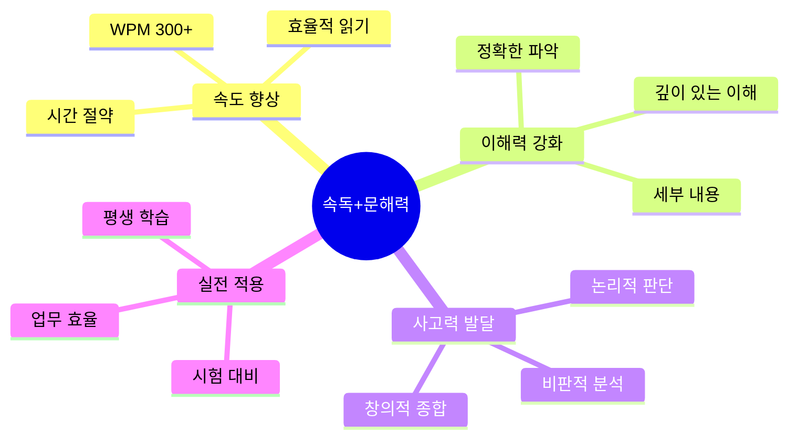
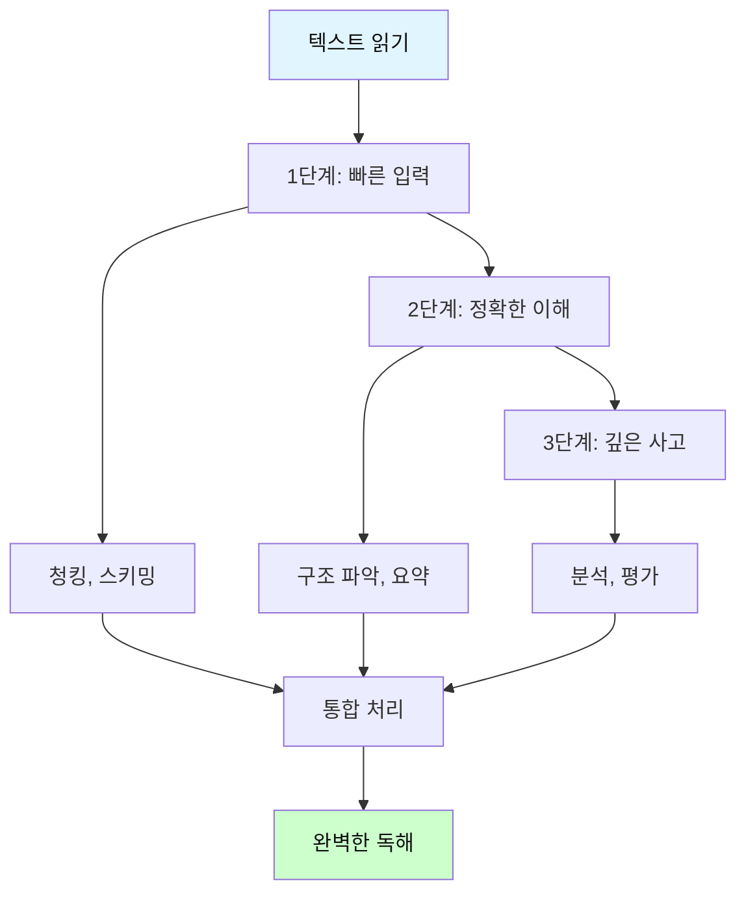
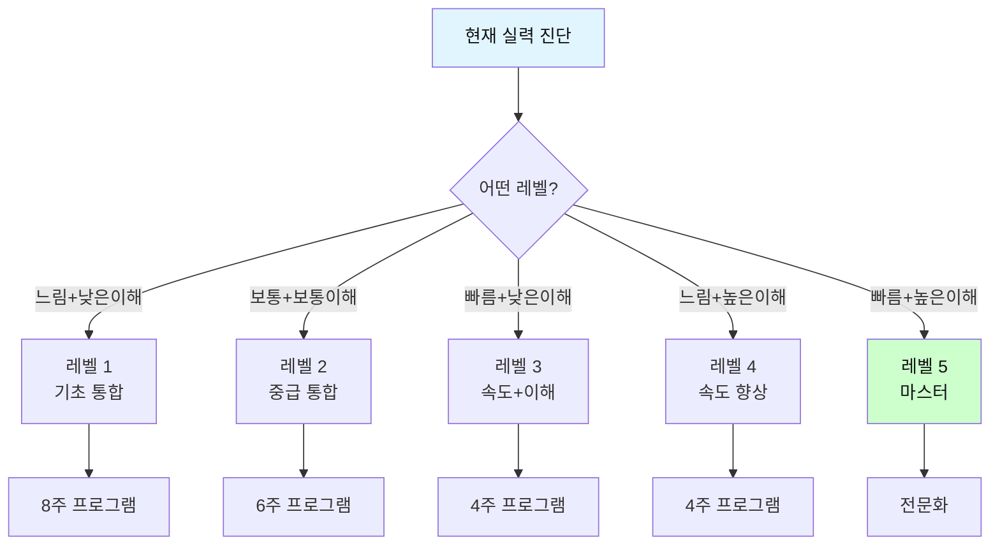
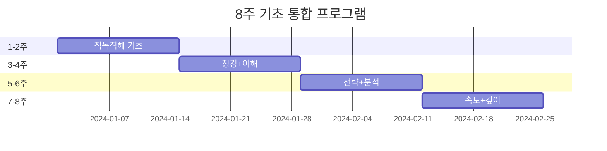
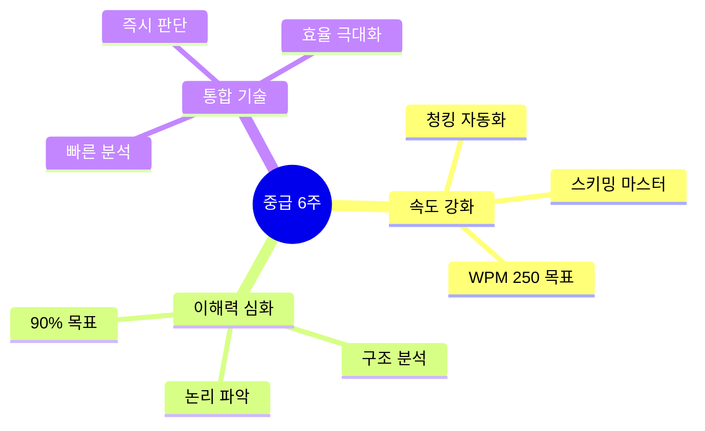
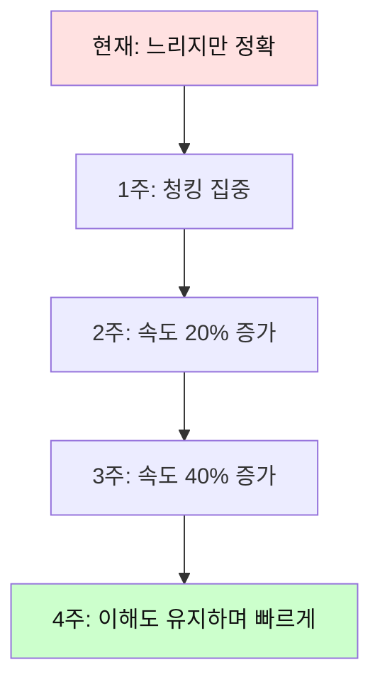
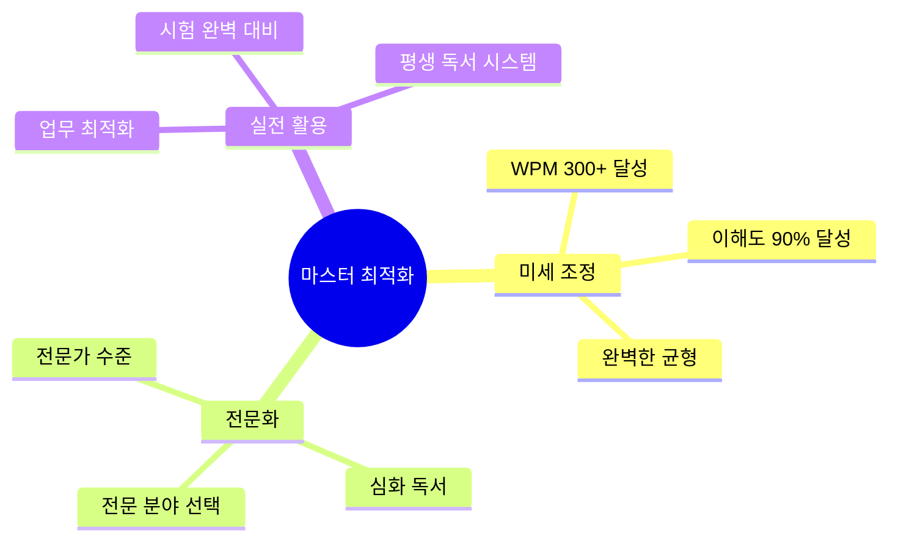
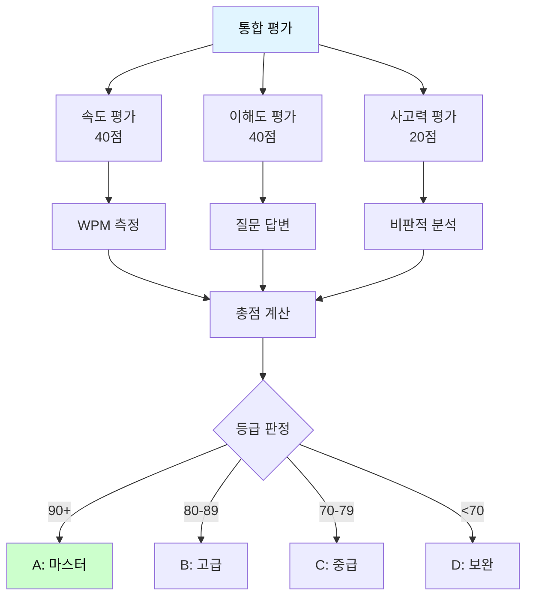
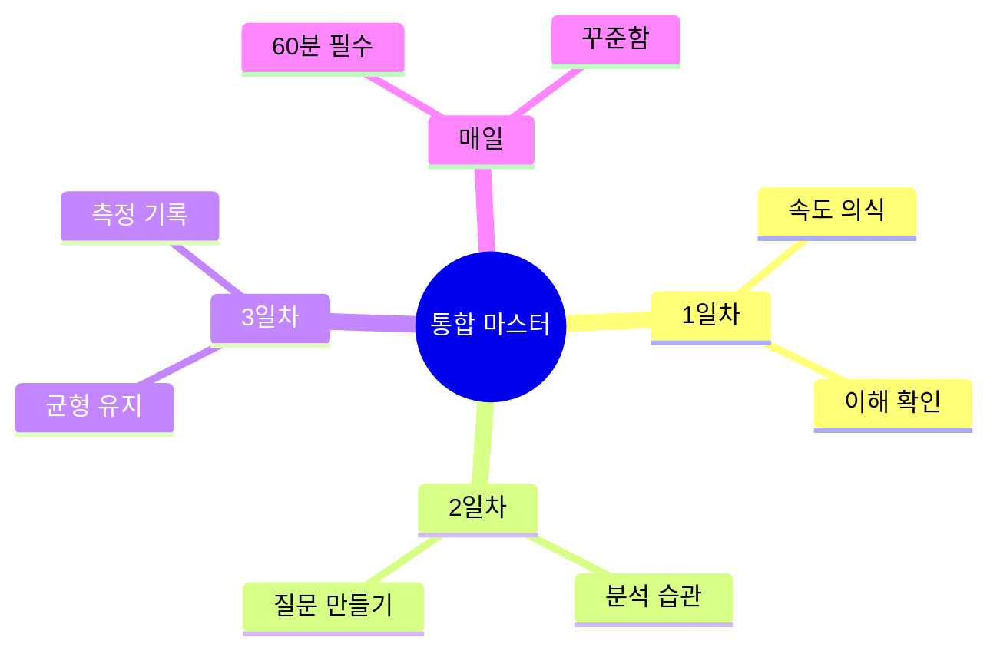

# 속독 + 문해력 통합 마스터 프로그램

> **빠른 속도**로 읽으면서 **깊이 있게** 이해하는 궁극의 독해력!
>
> WPM 향상 + 비판적 사고 + 완벽한 이해를 동시에 달성합니다.

---

## 🎯 속독-문해력의 황금 균형



---

## 📊 속독 vs 문해력 vs 통합 훈련 비교

| 구분 | 속독만 훈련 | 문해력만 훈련 | **통합 훈련** |
|------|------------|-------------|--------------|
| **속도** | WPM 400+ | WPM 150 | **WPM 300** |
| **이해도** | 60-70% | 95%+ | **90%+** |
| **깊이** | 표면적 | 매우 깊음 | **적절한 깊이** |
| **시간** | 매우 빠름 | 매우 느림 | **효율적** |
| **실용성** | 제한적 | 학문적 | **최적화** |
| **장기효과** | 보통 | 우수 | **탁월** |

**통합 훈련의 목표**: 
- ✅ 속도는 빠르게 (WPM 300+)
- ✅ 이해는 정확하게 (90%+)
- ✅ 사고는 깊이 있게

---

## 🔥 핵심 원리: 3단계 동시 처리



**핵심**: 순차적이 아니라 **동시에** 처리!

---

## 📚 레벨별 통합 훈련 로드맵



### 📋 레벨 진단표

| 현재 상태 | WPM | 이해도 | 진단 | 필요한 훈련 | 기간 |
|----------|-----|--------|------|------------|------|
| **타입 A** | <150 | <70% | 기초 부족 | 속도+이해 동시 | 8주 |
| **타입 B** | 150-200 | 70-80% | 균형 발전 | 통합 강화 | 6주 |
| **타입 C** | 200+ | <70% | 속도만 빠름 | 이해력 집중 | 4주 |
| **타입 D** | <150 | 80%+ | 이해만 좋음 | 속도 집중 | 4주 |
| **타입 E** | 200+ | 85%+ | 거의 완성 | 최적화 | 2주 |

---

## 🎓 레벨 1: 기초 통합 훈련 (8주)

**대상**: WPM <150, 이해도 <70%



### 📅 주차별 상세 계획

| 주차 | 속도 목표 | 이해도 목표 | 핵심 훈련 | 일일 시간 |
|------|----------|------------|----------|----------|
| **1-2주** | 100→130 | 60→70% | 직독직해 + 요약 | 40분 |
| **3-4주** | 130→160 | 70→75% | 청킹 + 구조 파악 | 45분 |
| **5-6주** | 160→190 | 75→80% | 스키밍 + 분석 | 50분 |
| **7-8주** | 190→220 | 80→85% | 통합 + 심화 | 60분 |

### 📝 1-2주차 통합 훈련 (일일 40분)

**Day 1 예시: 속도와 이해를 동시에**

```
┌─────────────────────────────────────┐
│ 📖 통합 훈련 루틴 (40분)            │
└─────────────────────────────────────┘

[0-10분] 속도 훈련
━━━━━━━━━━━━━━━━━━━━━━━━━━━━━━━━
활동: 청킹 연습
- 문장 20개를 청크로 나누기
- 타이머 사용 (각 30초)

예문: "The researchers discovered a new method."
청킹: [The researchers] [discovered] [a new method]
→ 빠르게 읽기 연습

[10-25분] 이해력 훈련
━━━━━━━━━━━━━━━━━━━━━━━━━━━━━━━━
활동: 단락 읽고 질문 답하기
- 200단어 단락 1개
- 2분 안에 읽기
- 5개 질문 답하기 (이해도 측정)

지문 예시:
"Many people believe that technology has made 
our lives easier. Smartphones allow us to 
communicate instantly with anyone in the world. 
Online shopping saves time and effort. However, 
some argue that technology has also created 
problems. We spend too much time on screens and 
less time with real people..."

질문:
Q1. 주제는? _______________
Q2. 긍정적 측면은? _______________
Q3. 부정적 측면은? _______________
Q4. 저자의 입장은? _______________
Q5. 구체적 예시 2가지는? _______________

[25-35분] 사고력 훈련
━━━━━━━━━━━━━━━━━━━━━━━━━━━━━━━━
활동: 비판적 질문
- 방금 읽은 내용에 대해
- 3가지 비판적 질문 만들기

예:
1. 근거가 충분한가?
2. 다른 관점은?
3. 나의 의견은?

[35-40분] 통합 정리
━━━━━━━━━━━━━━━━━━━━━━━━━━━━━━━━
활동: 한 문장 요약 + 평가
- 읽은 내용을 한 문장으로
- 오늘의 WPM 계산
- 이해도 점검
```

### 🎯 통합 훈련 실전 문제 (1-2주차)

**문제 1: 속도+이해 동시 측정**

```
┌─────────────────────────────────────┐
│ 📊 통합 테스트 (200단어, 2분)       │
└─────────────────────────────────────┘

지문:
Exercise is essential for maintaining good health. 
Regular physical activity strengthens the heart, 
improves circulation, and helps control weight. 
Doctors recommend at least 30 minutes of moderate 
exercise five days a week.

However, many people struggle to find time for 
exercise in their busy schedules. They often feel 
too tired after work or have family responsibilities. 
Some find gym memberships expensive.

Fortunately, exercise doesn't require expensive 
equipment or gym memberships. Walking, jogging, 
or cycling are free and effective. Even simple 
activities like taking stairs instead of elevators 
can make a difference. The key is consistency and 
finding activities you enjoy.

Studies show that people who exercise regularly 
have lower rates of heart disease, diabetes, and 
depression. They also report better sleep quality 
and higher energy levels. Starting small and 
gradually increasing activity is the best approach.

[나머지 50단어...]

━━━━━━━━━━━━━━━━━━━━━━━━━━━━━━━━
시작 시간: ____  끝 시간: ____
읽기 시간: ____ 분 ____ 초
WPM: 200 ÷ (  ) = ___ WPM

━━━━━━━━━━━━━━━━━━━━━━━━━━━━━━━━
[속도 평가]
✓ 2분 이내: 우수
✓ 2-3분: 보통
✓ 3분 이상: 더 연습 필요

━━━━━━━━━━━━━━━━━━━━━━━━━━━━━━━━
[이해도 질문] - 각 20점

Q1. 의사가 권장하는 운동 시간은?
   A) 20분/일  B) 30분/주 5일
   C) 1시간/일  D) 언급 없음
   답: ____

Q2. 사람들이 운동하지 못하는 이유 3가지는?
   답: ___________________________

Q3. 저자가 제시하는 해결책은?
   답: ___________________________

Q4. 운동의 효과 4가지는?
   답: ___________________________

Q5. 이 글의 구조는?
   A) 문제→해결  B) 원인→결과
   C) 비교→대조  D) 시간 순서
   답: ____

정답: Q1-B, Q2-(시간부족/피로/비용), 
     Q3-(무료운동/일상활동), 
     Q4-(심장건강/당뇨예방/우울증감소/수면개선),
     Q5-A

점수: ___/5 = ___% 이해도

━━━━━━━━━━━━━━━━━━━━━━━━━━━━━━━━
[사고력 질문] - 추가 점수

Q6. 이 글의 설득력은? (근거 있게)
   답: ___________________________

Q7. 빠진 내용이나 반론은?
   답: ___________________________

Q8. 당신은 실천할 것인가? 왜?
   답: ___________________________

━━━━━━━━━━━━━━━━━━━━━━━━━━━━━━━━
[종합 평가]

속도 점수: WPM _____ (목표: 100+)
이해도 점수: _____ % (목표: 70%+)
사고력: 우수/보통/미흡

총평: _____________________________
```

---

## 🚀 레벨 2: 중급 통합 훈련 (6주)

**대상**: WPM 150-200, 이해도 70-80%



### 📅 중급 주차별 훈련표

| 주차 | 속도 | 이해도 | 통합 기술 | 교재 | 시간 |
|------|------|--------|----------|------|------|
| **1-2주** | 150→180 | 70→75% | 청킹+요약 | 뉴스 | 45분 |
| **3-4주** | 180→210 | 75→85% | 스키밍+분석 | 에세이 | 50분 |
| **5-6주** | 210→250 | 85→90% | 통합 마스터 | 논문 | 60분 |

### 📝 중급 통합 훈련 루틴 (일일 50분)

```
┌─────────────────────────────────────┐
│ 🎯 중급 일일 루틴 (50분)            │
└─────────────────────────────────────┘

[0-15분] 속도 집중 훈련
━━━━━━━━━━━━━━━━━━━━━━━━━━━━━━━━
• 스키밍 연습 (500단어 기사 3분)
• 청킹 챌린지 (복잡한 문장 10개)
• 속도 측정 (타이머 필수)

[15-35분] 이해+분석 통합
━━━━━━━━━━━━━━━━━━━━━━━━━━━━━━━━
• 400단어 지문 정독 (5분)
• 구조 분석 (5분)
  - 서론/본론/결론 파악
  - 주장과 근거 정리
• 비판적 질문 (5분)
  - 논리적인가?
  - 근거는 충분한가?
  - 다른 관점은?
• 요약 작성 (5분)
  - 한 문장 요약
  - 핵심 3가지 정리

[35-50분] 실전 종합 테스트
━━━━━━━━━━━━━━━━━━━━━━━━━━━━━━━━
• 600단어 새 지문
• 4분 안에 읽기 (WPM 150 목표)
• 10문제 풀기 (80%+ 목표)
• 당일 평가 및 기록
```

### 🎯 중급 통합 실전 문제

**문제 세트: 속도+분석+판단 (600단어, 8분)**

```
┌─────────────────────────────────────┐
│ 📊 중급 종합 테스트                  │
└─────────────────────────────────────┘

지문: 600단어 (사회 이슈)

"Social media has transformed how people 
communicate and share information. Platforms 
like Facebook, Twitter, and Instagram connect 
billions of users worldwide, enabling instant 
communication and content sharing. This 
connectivity has brought both benefits and 
challenges to society.

On the positive side, social media democratizes 
information sharing. Anyone can publish content 
and reach a global audience without traditional 
gatekeepers like publishers or broadcasters. 
This has empowered citizen journalism, allowed 
marginalized voices to be heard, and facilitated 
social movements. During natural disasters or 
emergencies, social media provides real-time 
information and helps coordinate relief efforts.

However, significant concerns have emerged. 
The spread of misinformation and fake news has 
become a serious problem. False information can 
go viral quickly, sometimes faster than fact-
checkers can debunk it. This has real-world 
consequences, affecting elections, public health 
decisions, and social cohesion.

Privacy is another major issue. Social media 
companies collect vast amounts of personal data, 
which they use for targeted advertising. Data 
breaches have exposed millions of users' 
information. Many people don't fully understand 
what data they're sharing or how it's being used.

Mental health effects are also concerning. 
Studies link excessive social media use to 
increased anxiety, depression, and feelings of 
inadequacy. The constant comparison with others' 
curated lives can harm self-esteem, particularly 
among young people. Cyberbullying has become a 
serious problem.

Some argue for stricter regulation of social 
media platforms. They propose measures like 
requiring platforms to verify information, 
protect user privacy better, and take 
responsibility for harmful content. Others worry 
that regulation could limit free speech and 
innovation.

The debate continues, but most agree that the 
current situation is unsustainable. Finding the 
right balance between freedom and responsibility 
will be one of the defining challenges of our 
digital age."

━━━━━━━━━━━━━━━━━━━━━━━━━━━━━━━━
[1단계: 속도 측정] (4분 목표)

시작: ____ 끝: ____ 
시간: ___ 분 ___ 초
WPM: 600 ÷ (  ) = ___ WPM

목표 달성: □ 예 □ 아니오

━━━━━━━━━━━━━━━━━━━━━━━━━━━━━━━━
[2단계: 이해도 평가] (3분)

기본 이해 (각 10점):
1. 주제는? _____________________
2. 긍정적 측면 3가지: __________
3. 부정적 측면 4가지: __________
4. 해결책 제안은? ______________
5. 저자의 입장은? ______________

점수: ___/50

━━━━━━━━━━━━━━━━━━━━━━━━━━━━━━━━
[3단계: 구조 분석] (2분)

글의 구조:
□ 서론: 문제 제기
□ 본론1: 긍정적 측면
□ 본론2: 부정적 측면  
□ 본론3: 해결 방안
□ 결론: 전망

논증 방식:
□ 양면 제시 □ 일방 주장
□ 근거 충분 □ 근거 부족

점수: ___/20

━━━━━━━━━━━━━━━━━━━━━━━━━━━━━━━━
[4단계: 비판적 사고] (3분)

비판적 질문:

Q1. 저자의 주장은 논리적인가?
   □ 매우 논리적 □ 보통 □ 부족
   이유: ________________________

Q2. 제시된 근거는 충분한가?
   □ 충분 □ 보통 □ 불충분
   부족한 점: ___________________

Q3. 편향성이 있는가?
   □ 중립적 □ 약간 편향 □ 매우 편향
   어느 쪽: _____________________

Q4. 빠진 관점이나 반론은?
   답: __________________________

Q5. 당신의 의견과 근거는?
   답: __________________________

점수: ___/30

━━━━━━━━━━━━━━━━━━━━━━━━━━━━━━━━
[종합 평가]

속도: WPM ____ (목표 150+)
이해도: ___% (목표 80%+)
분석력: ___점 (목표 20/30)

총점: ___/100

등급:
90-100: A (통합 우수)
80-89: B (통합 양호)
70-79: C (보완 필요)
<70: D (재훈련)
```

---

## 🔥 레벨 3: 속도형 교정 훈련 (4주)

**대상**: WPM 200+ but 이해도 <70%
**문제**: 빠르게 읽지만 이해가 부족


### 📋 속도형 교정 전략

| 주차 | WPM 조정 | 이해도 목표 | 핵심 활동 | 시간 |
|------|----------|------------|----------|------|
| **1주** | 200→160 | 70→80% | 정독 + 요약 | 45분 |
| **2주** | 160→180 | 80→85% | 분석 + 질문 | 50분 |
| **3주** | 180→200 | 85→90% | 균형 훈련 | 55분 |
| **4주** | 200→250 | 90% 유지 | 속도 회복 | 60분 |

**핵심 원리**: 
- ❌ "빨리 읽기만" 하지 말고
- ✅ "이해하며 읽기" 훈련
- ✅ 속도는 자연스럽게 따라옴

### 📝 속도형 교정 일일 루틴

```
┌─────────────────────────────────────┐
│ 🎯 속도형 교정 루틴 (50분)          │
└─────────────────────────────────────┘

[필수 규칙]
1. 타이머는 참고만
2. 이해가 우선
3. 매 단락마다 멈춰서 생각
4. 완벽히 이해 후 다음으로

━━━━━━━━━━━━━━━━━━━━━━━━━━━━━━━━
[0-20분] 정독 훈련
━━━━━━━━━━━━━━━━━━━━━━━━━━━━━━━━
• 300단어 지문
• 천천히 읽기 (5분)
• 매 단락마다:
  - 주제문 찾기
  - 핵심 내용 말하기
  - 이해 안 되면 다시 읽기
• 전체 요약하기 (5분)
• 질문 5개 답하기 (10분)

[20-40분] 분석적 읽기
━━━━━━━━━━━━━━━━━━━━━━━━━━━━━━━━
• 새로운 400단어 지문
• 읽으면서 메모:
  - 주장은?
  - 근거는?
  - 논리는 타당한가?
  - 반론은?
• 구조도 그리기
• 비판적 평가

[40-50분] 이해도 확인
━━━━━━━━━━━━━━━━━━━━━━━━━━━━━━━━
• 10문제 테스트
• 목표: 90% 이상
• 틀린 문제 분석:
  - 왜 틀렸나?
  - 어디를 놓쳤나?
  - 어떻게 개선?
```

---

## ⚡ 레벨 4: 이해형 가속 훈련 (4주)

**대상**: WPM <150 but 이해도 80%+
**문제**: 이해는 좋지만 너무 느림



### 📋 이해형 가속 전략

| 주차 | WPM 목표 | 이해도 유지 | 핵심 기술 | 시간 |
|------|----------|------------|----------|------|
| **1주** | 120→150 | 80% 유지 | 청킹 기초 | 40분 |
| **2주** | 150→180 | 80% 유지 | 청킹 심화 | 45분 |
| **3주** | 180→210 | 80% 유지 | 스키밍 도입 | 50분 |
| **4주** | 210→250 | 85% 달성 | 통합 완성 | 55분 |

**핵심 원리**:
- ✅ 당신의 강점(이해력)은 유지
- ✅ 청킹으로 속도만 높이기
- ✅ 정확도를 희생하지 않음

---

## 🏆 레벨 5: 마스터 최적화 (2주)

**대상**: WPM 200+, 이해도 85%+



---

## 📊 통합 훈련 효과 측정

### 종합 평가 시스템



### 📋 통합 평가 기준표

| 영역 | 측정 항목 | 배점 | 평가 방법 | 목표 |
|------|----------|------|----------|------|
| **속도** | WPM | 20점 | 타이머 측정 | 250+ |
| | 청킹 능력 | 10점 | 문장 분석 | 자동화 |
| | 전략 활용 | 10점 | 상황 판단 | 적절 |
| **이해** | 기본 이해 | 20점 | 객관식 5문제 | 90%+ |
| | 심층 이해 | 10점 | 서술형 2문제 | 우수 |
| | 구조 파악 | 10점 | 분석 과제 | 정확 |
| **사고** | 비판적 분석 | 10점 | 논리 평가 | 우수 |
| | 창의적 종합 | 10점 | 새로운 견해 | 독창적 |

---

## 🎯 일일 통합 훈련 템플릿

### 완벽한 하루 독해 루틴 (60분)

```
┌─────────────────────────────────────┐
│ 📚 통합 마스터 일일 루틴            │
└─────────────────────────────────────┘

🕐 0-5분: 준비 및 워밍업
━━━━━━━━━━━━━━━━━━━━━━━━━━━━━━━━
□ 오늘의 목표 설정
□ 타이머 및 자료 준비
□ 쉬운 글 2분 읽기 (워밍업)

🕐 5-20분: 속도 집중 훈련
━━━━━━━━━━━━━━━━━━━━━━━━━━━━━━━━
□ 청킹 연습 (5분)
  - 복잡한 문장 10개
  - 빠르게 처리

□ 스키밍 연습 (5분)
  - 500단어 기사
  - 3분 안에 핵심 파악

□ 속도 챌린지 (5분)
  - 300단어 지문
  - 1분 30초 목표

🕐 20-45분: 이해+분석 통합
━━━━━━━━━━━━━━━━━━━━━━━━━━━━━━━━
□ 정독 (10분)
  - 600단어 새 지문
  - 천천히 정확하게

□ 구조 분석 (5분)
  - 서론/본론/결론
  - 주장과 근거
  - 논리 흐름

□ 비판적 사고 (10분)
  - 3가지 질문:
    1) 논리적인가?
    2) 근거 충분한가?
    3) 다른 관점은?

🕐 45-60분: 종합 평가
━━━━━━━━━━━━━━━━━━━━━━━━━━━━━━━━
□ 실전 테스트 (10분)
  - 새 지문 400단어
  - 시간 측정
  - 질문 10개

□ 자가 평가 (3분)
  - 속도: WPM ___
  - 이해도: ____%
  - 사고력: 우수/보통/미흡

□ 기록 및 계획 (2분)
  - 오늘의 성과 기록
  - 내일의 목표 설정
  - 약점 개선 계획

━━━━━━━━━━━━━━━━━━━━━━━━━━━━━━━━
체크리스트:
□ 60분 완료
□ 속도 목표 달성
□ 이해도 80% 이상
□ 비판적 사고 실천
□ 기록 완료

총평: _____________________________
```

---

## 💪 실전 통합 문제 시리즈

### 종합 실전 문제 1 (초급)

```
[800단어 지문 + 15분 제한]

속도 목표: WPM 150
이해도 목표: 80%
사고력: 기본

점수 배분:
- 속도 (30점)
- 이해 (50점)
- 사고 (20점)
```

### 종합 실전 문제 2 (중급)

```
[1200단어 지문 + 20분 제한]

속도 목표: WPM 200
이해도 목표: 85%
사고력: 심화

점수 배분:
- 속도 (35점)
- 이해 (45점)
- 사고 (20점)
```

### 종합 실전 문제 3 (고급)

```
[1500단어 지문 + 20분 제한]

속도 목표: WPM 250+
이해도 목표: 90%
사고력: 전문가

점수 배분:
- 속도 (40점)
- 이해 (40점)
- 사고 (20점)
```

---

## 🏆 최종 성공 전략

### 통합 마스터의 7가지 습관



| 습관 | 내용 | 실천 방법 | 효과 |
|------|------|----------|------|
| 1 | **속도 의식** | 항상 타이머 사용 | 속도 향상 |
| 2 | **이해 확인** | 매번 요약하기 | 이해도 보장 |
| 3 | **비판적 질문** | 3가지 질문 필수 | 사고력 발달 |
| 4 | **균형 유지** | 속도≠이해 조화 | 통합 완성 |
| 5 | **기록 관리** | 매일 진도 기록 | 동기 부여 |
| 6 | **다양성** | 여러 장르 읽기 | 전방위 실력 |
| 7 | **즐기기** | 재미있게 도전 | 지속 가능 |

---

## 📈 진도 추적 시스템

### 월간 성장 기록표

```
┌─────────────────────────────────────┐
│ 📊 통합 훈련 월간 기록표            │
└─────────────────────────────────────┘

이름: ____________  목표: ____________

주차 | WPM | 이해도 | 사고력 | 총점 | 비고
-----|-----|--------|--------|------|-----
1주  |     |    %   |   /20  | /100 |
2주  |     |    %   |   /20  | /100 |
3주  |     |    %   |   /20  | /100 |
4주  |     |    %   |   /20  | /100 |

성장률:
• 속도: 시작 ___ → 현재 ___ (+___%)
• 이해: 시작 ___% → 현재 ___% (+___%)
• 사고: 미흡 → 보통 → 우수

다음 목표: ___________________________
```

---

💪 **핵심 정리**

1. ✅ **속도와 이해는 함께**: 하나만 희생하지 않기
2. ✅ **3단계 동시 처리**: 입력+이해+사고 통합
3. ✅ **레벨별 맞춤 훈련**: 내 약점에 집중
4. ✅ **매일 60분 필수**: 꾸준함이 핵심
5. ✅ **측정과 기록**: 성장을 확인하며 동기 부여
6. ✅ **균형이 최고**: 속도 300, 이해도 90%가 목표
7. ✅ **실전에 적용**: 시험, 업무, 평생 학습에 활용

**빠르면서도 정확하게, 깊이 있게 읽는 진짜 독해력을 완성하세요! 🚀**

