# 영어 독해 마스터 가이드

## 🎯 독해의 가장 중요한 원칙

### ⚠️ 독해 혁명: 한국식 사고를 버리고 영어식 사고로!

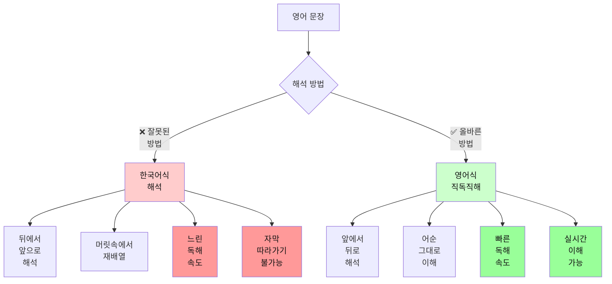

### 📊 한국식 vs 영어식 사고 비교

| 구분 | 한국식 해석 (❌) | 영어식 직독직해 (✅) |
|------|------------------|----------------------|
| **방향** | 뒤 → 앞 | 앞 → 뒤 |
| **과정** | 전체 문장 읽고 → 재배열 → 해석 | 읽으면서 → 바로바로 이해 |
| **속도** | 느림 (2배 소요) | 빠름 |
| **자막** | 따라가기 어려움 | 실시간 가능 |
| **논문** | 피곤하고 시간 오래 걸림 | 효율적 |
| **사고** | 한국어 번역 | 영어로 직접 사고 |

---

### 🔥 왜 직독직해가 필수인가?

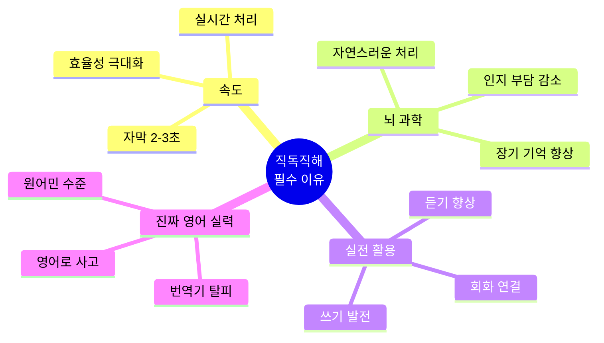

#### 1. 자막은 기다려주지 않는다
```
자막 표시 시간: 2-3초
한국식 해석: 5-7초 소요 → 이미 다음 자막으로 ❌
영어식 해석: 2-3초 소요 → 실시간 이해 가능 ✅
```

#### 2. 논문은 수십 페이지
```
10페이지 논문
한국식 해석: 2시간 → 피곤, 집중력 저하 ❌
영어식 해석: 30분 → 효율적, 핵심 파악 ✅
```

#### 3. 영어 실력의 진짜 레벨업
```
한국식 해석: 평생 번역기 ❌
영어식 해석: 영어를 영어로 사고 ✅
```

---

## 📊 독해 방식 완전 비교

### 3가지 독해 방식

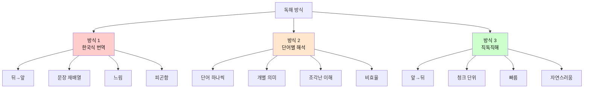

### 독해 방식 비교표

| 구분 | 방식 1: 한국식 번역 | 방식 2: 단어별 해석 | 방식 3: 직독직해 (청크) |
|------|---------------------|---------------------|------------------------|
| **읽는 방향** | 뒤 → 앞 | 단어 단위 | 앞 → 뒤 (청크 단위) |
| **처리 단위** | 전체 문장 | 단어 1개 | 의미 덩어리 3-5단어 |
| **속도** | 매우 느림 (150 WPM) | 느림 (180 WPM) | 빠름 (300+ WPM) |
| **인지 부담** | 매우 높음 | 높음 | 낮음 |
| **이해도** | 70% | 60% | 90% |
| **자막 대응** | 불가능 | 어려움 | 완벽 |
| **논문 효율** | 2시간/10p | 1.5시간/10p | 30분/10p |
| **뇌 피로도** | 매우 높음 | 높음 | 낮음 |
| **장기 기억** | 낮음 | 낮음 | 높음 |
| **회화 연결** | 안 됨 | 안 됨 | 자연스럽게 연결 |
| **추천도** | ❌❌❌ | ❌❌ | ✅✅✅ |

### 실제 예문으로 비교

```
문장: The research team discovered a new method to solve the problem.
```

#### 방식 1: 한국식 번역 (가장 나쁨 ❌)

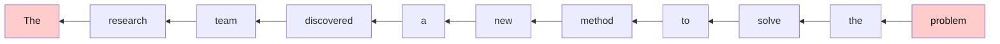

**과정**:
1. problem을 먼저 찾아 → "문제를"
2. solve를 찾아 → "해결하기 위한"
3. method를 찾아 → "방법을"
4. discovered를 찾아 → "발견했다"
5. 주어를 찾아 → "연구팀이"

**결과**: "그 연구팀이 그 문제를 해결하기 위한 새로운 방법을 발견했다"
- **시간**: 7-10초
- **피로도**: 😫😫😫
- **효율**: ❌

---

#### 방식 2: 단어별 해석 (나쁨 ❌)

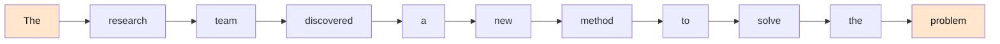

**과정**:
- The → 그
- research → 연구
- team → 팀
- discovered → 발견했다
- a → 하나의
- new → 새로운
- method → 방법
- to → ~하기 위한
- solve → 해결하다
- the → 그
- problem → 문제

**결과**: "그 연구 팀 발견했다 하나의 새로운 방법 ~하기 위한 해결하다 그 문제"
- **시간**: 5-7초
- **이해도**: 조각난 이해 😕
- **효율**: ❌

---

#### 방식 3: 직독직해 - 청크 단위 (최고! ✅)

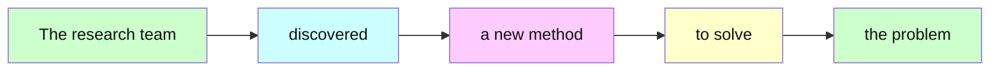

**과정 (청크 단위)**:
1. [The research team] → "그 연구팀이"
2. [discovered] → "발견했다"
3. [a new method] → "새로운 방법을"
4. [to solve] → "해결하기 위한"
5. [the problem] → "그 문제를"

**결과**: "그 연구팀이 / 발견했다 / 새로운 방법을 / 해결하기 위한 / 그 문제를"
- **시간**: 2-3초 ⚡
- **이해도**: 완벽 😊
- **효율**: ✅✅✅

---

### 왜 직독직해(청크)가 압도적으로 좋은가?

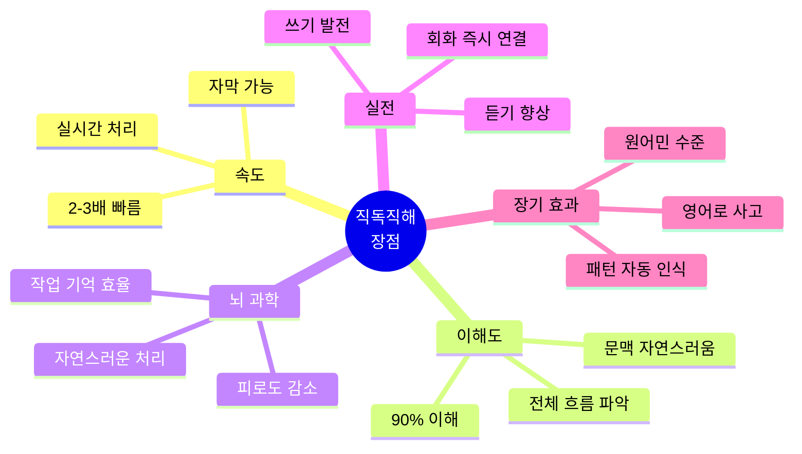

| 장점 분야 | 설명 | 효과 |
|-----------|------|------|
| **처리 속도** | 재배열 과정 제거 | 2-3배 빠름 |
| **인지 부담** | 작업 기억 효율 상승 | 피로 50% 감소 |
| **이해도** | 문맥 자연스러움 | 90% 이해 |
| **장기 기억** | 청크로 저장 | 2배 더 오래 기억 |
| **회화 연결** | 같은 방식 사용 | 즉시 말하기 가능 |
| **듣기 향상** | 실시간 처리 능력 | 듣기 점수 30% 상승 |

---

### 💡 영어식 사고 전환 트레이닝

#### 예문 1: 간단한 문장
```
문장: I love this movie.

❌ 한국식 (뒤에서 앞으로):
   this movie → 이 영화를
   love → 사랑한다
   I → 나는
   결과: "나는 이 영화를 사랑한다"
   
✅ 영어식 (앞에서 뒤로):
   I → 나는
   love → 사랑해
   this movie → 이 영화를
   결과: "나는 / 사랑해 / 이 영화를"
```

**핵심**: 영어 어순 그대로 이해하기!

#### 예문 2: 복잡한 문장
```
문장: The book that I bought yesterday was very interesting.

❌ 한국식:
   "어제 내가 산 책은 매우 흥미로웠다"
   (yesterday를 찾아서 → that I bought를 해석 → 다시 앞으로)
   
✅ 영어식:
   "그 책은 / 내가 샀던 / 어제 / 매우 흥미로웠다"
   (읽는 순서대로 바로바로 이해)
```

---

### 🎓 직독직해 훈련 3단계


| 단계 | 목표 | 방법 | 연습 시간 |
|------|------|------|-----------|
| **1단계** | 영어 어순 익히기 | 주어+동사 먼저 파악<br/>짧은 문장 반복 | 1-2주 |
| **2단계** | 청킹으로 빠르게 | 의미 단위로 끊어 읽기<br/>바로바로 이해 | 2-3주 |
| **3단계** | 실전 적용 | 자막/논문 실전 연습<br/>속도 점차 높이기 | 지속적 |

---

### 🚀 직독직해 핵심 원칙

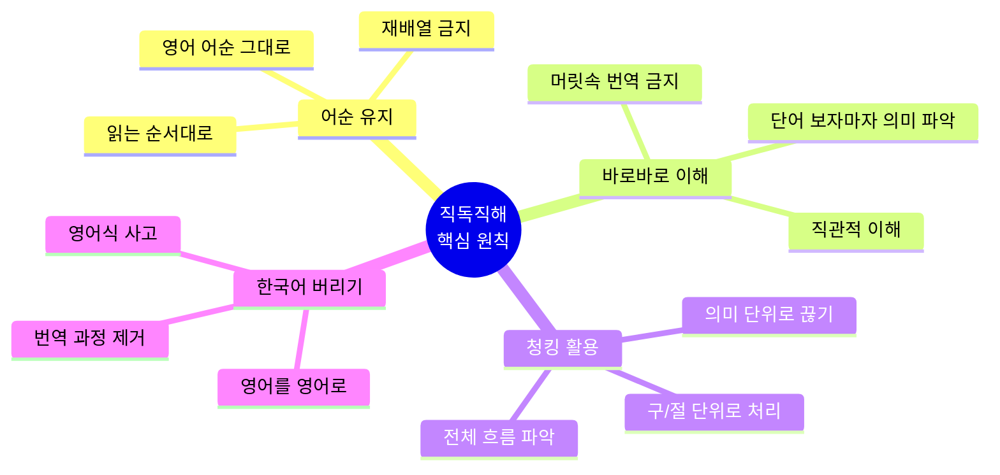

#### 원칙 1: 영어 어순을 절대 바꾸지 마라
```
I will buy a new car tomorrow.

❌ 나는 / 내일 / 새 차를 / 살 것이다 (재배열)
✅ 나는 / 살 거야 / 새 차를 / 내일 (어순 유지)
```

#### 원칙 2: 읽으면서 바로바로 이해하라
```
She loves reading books in the morning.

❌ (문장 끝까지 읽고) → (다시 처음부터 해석)
✅ 그녀는 / 사랑해 / 읽는 것을 / 책을 / 아침에
   (각 단어/구를 보는 즉시 이해)
```

#### 원칙 3: 청킹(의미 단위)으로 처리하라
```
The students / in my class / study English / every day.
학생들은 / 우리 반의 / 영어를 공부해 / 매일
```

#### 원칙 4: 한국어로 번역하지 말고 영어로 사고하라
```
I'm hungry. → (머릿속에서) "배고프다"로 번역 ❌
I'm hungry. → (머릿속에서) 배고픔 느낌 연상 ✅
```

---

### ⚡ 직독직해가 안 되는 이유와 해결법

| 문제 | 원인 | 해결법 |
|------|------|--------|
| 뒤로 돌아가서 다시 읽음 | 한국어 어순에 익숙함 | 강제로 앞으로만 읽기 연습 |
| 단어마다 번역함 | 번역 습관 | 이미지/느낌으로 연상 |
| 문장 끝까지 안 읽으면 불안 | 전체 구조 파악 욕구 | 주어+동사만으로도 이해 가능 |
| 수식어에서 헷갈림 | 수식어 처리 미숙 | 나중에 추가하는 연습 |

---

### 📖 실전 예문으로 마스터하기

#### Level 1: 기초
```
문장: He works at Google.

직독직해:
He → 그는
works → 일해
at Google → 구글에서

결과: "그는 / 일해 / 구글에서"
```

#### Level 2: 중급
```
문장: The girl wearing a red dress is my sister.

직독직해:
The girl → 그 소녀는
wearing a red dress → 빨간 드레스를 입은
is → ~이다
my sister → 내 여동생

결과: "그 소녀는 / 빨간 드레스를 입은 / ~이다 / 내 여동생"
```

#### Level 3: 고급
```
문장: Scientists believe that climate change will significantly 
      impact global food production in the coming decades.

직독직해:
Scientists believe → 과학자들은 믿는다
that → ~라고
climate change → 기후 변화가
will impact → 영향을 줄 것이다
significantly → 상당히
global food production → 세계 식량 생산에
in the coming decades → 앞으로 수십 년 동안

결과: 읽는 순서대로 바로바로 이해
```

---

## 📚 학습 목표
- 자막(영화, 드라마, 유튜브) 빠르게 읽기
- 논문(학술 논문, 기술 문서) 효율적으로 읽기
- 독해 속도 향상 및 핵심 파악 능력 강화
- **영어식 사고로 직독직해 마스터** ⭐⭐⭐

## 🗺️ 독해 학습 마인드맵

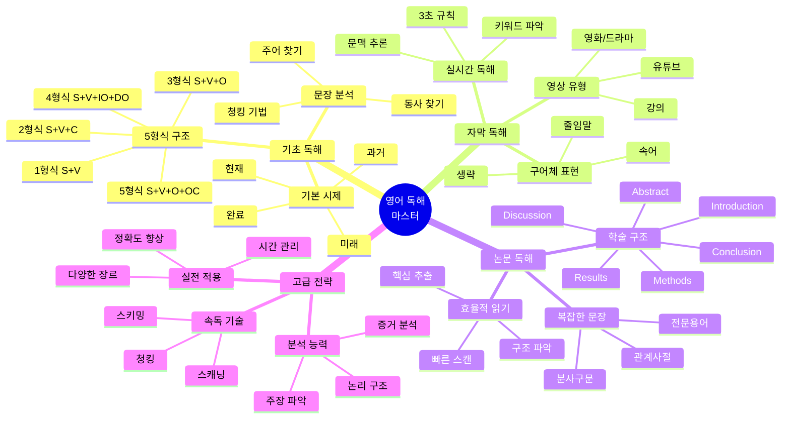

## 🎯 독해 학습 로드맵


## 📊 학습 단계별 상세 정보

| 단계 | 파일 | 기간 | 목표 | 핵심 내용 | 난이도 |
|------|------|------|------|-----------|--------|
| 1단계 | `01_기초_독해_패턴.md` | 1-2주 | 문장 구조 파악 | 5형식, 시제, 기본 구문 | ⭐ |
| 2-A단계 | `02_자막_독해_패턴.md` | 2-3주 | 실시간 자막 읽기 | 구어체, 줄임말, 3초 규칙 | ⭐⭐ |
| 2-B단계 | `03_논문_독해_패턴.md` | 3-4주 | 학술 논문 읽기 | 학술 구조, 복잡한 문법 | ⭐⭐⭐ |
| 3단계 | `04_고급_독해_전략.md` | 4-5주 | 속독 및 핵심 파악 | 스키밍, 스캐닝, 분석 | ⭐⭐⭐⭐ |
| 보충 | `05_독해_필수_문법.md` | 병행 학습 | 문법 정리 | 시제, 관계사, 분사구문 | ⭐⭐ |

## 📖 독해 유형별 접근법 비교

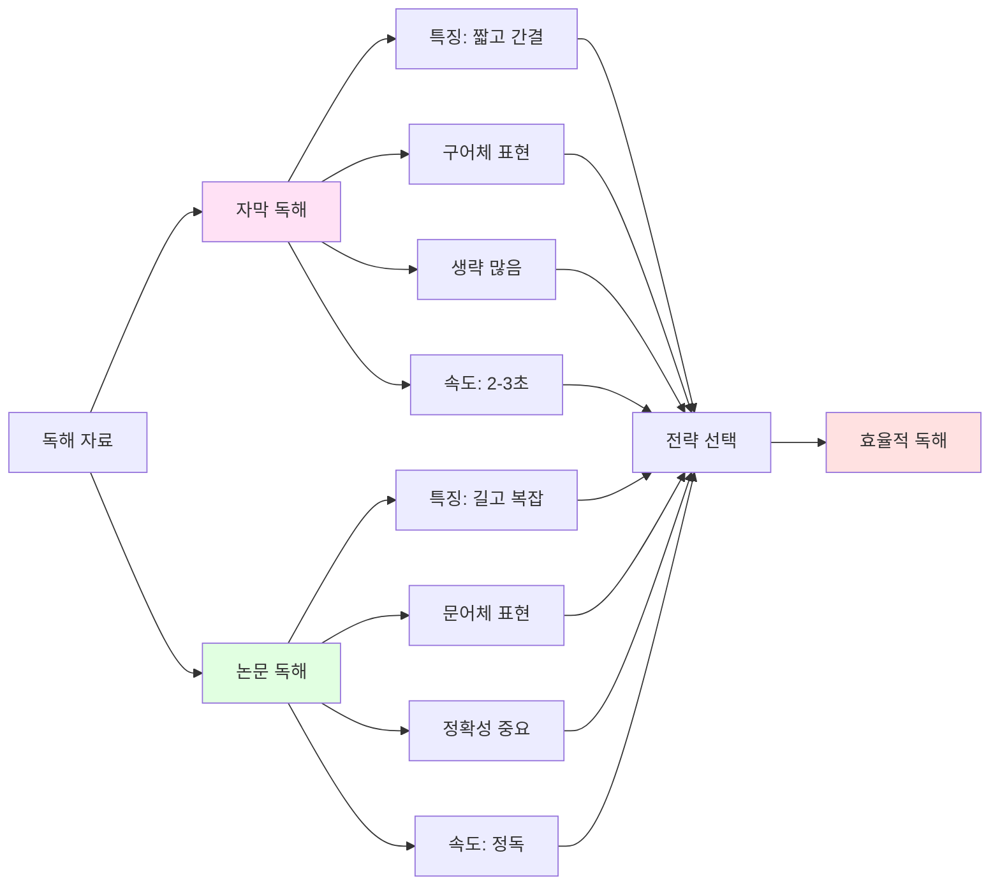

| 구분 | 자막 독해 | 논문 독해 |
|------|-----------|-----------|
| **특징** | 짧고 간결 | 길고 복잡 |
| **문체** | 구어체 | 문어체 |
| **생략** | 많음 | 적음 |
| **속도** | 빠름 (2-3초) | 느림 (정독) |
| **전략** | 문맥 파악 → 핵심 단어 → 전체 의미 | 구조 파악 → 핵심 문장 → 세부 내용 |
| **중요도** | 전체 흐름 이해 | 정확한 의미 파악 |
| **난이도** | ⭐⭐ | ⭐⭐⭐ |

## 🔧 독해 도구 및 방법론

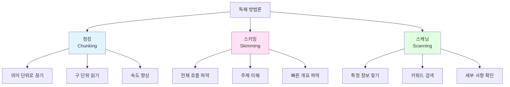

| 기법 | 목적 | 방법 | 속도 | 사용 시기 |
|------|------|------|------|-----------|
| **청킹<br/>(Chunking)** | 의미 단위로 읽기 | 구/절 단위로 끊어 읽기 | 중간 | 모든 독해 |
| **스키밍<br/>(Skimming)** | 전체 내용 파악 | 제목, 첫/마지막 문장 중심 | 빠름 | 개요 파악 시 |
| **스캐닝<br/>(Scanning)** | 특정 정보 찾기 | 키워드 중심 검색 | 매우 빠름 | 정보 검색 시 |

### 1. 청킹(Chunking) 기법 - 가장 중요!

## 🎯 청킹(Chunking)이란?

**정의**: 의미 있는 단어 덩어리(3-5단어)를 하나의 단위로 처리하는 기법

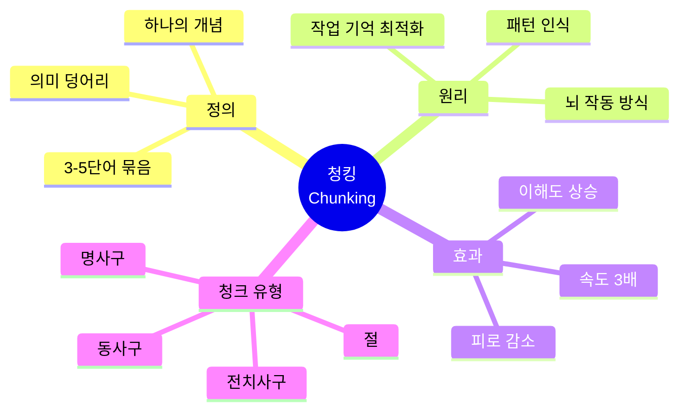

### 🧠 왜 청킹이 필수인가? (뇌과학 기반)

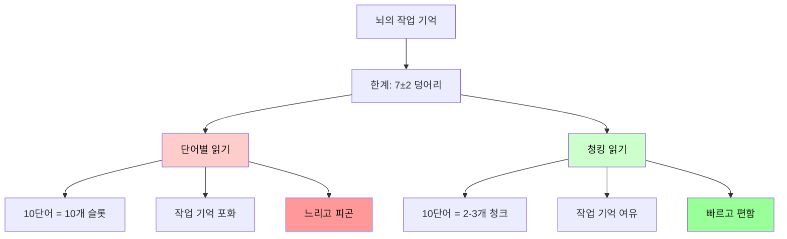

### 📊 단어 vs 청크 처리 비교

| 구분 | 단어별 읽기 | 청킹 읽기 |
|------|-------------|-----------|
| **처리 단위** | 1단어 (1개) | 3-5단어 묶음 (1개) |
| **뇌 부담** | 10단어 = 10개 슬롯 | 10단어 = 2-3개 슬롯 |
| **작업 기억** | 포화 상태 | 여유 있음 |
| **속도** | 느림 | 3배 빠름 |
| **이해도** | 조각난 이해 | 완전한 이해 |
| **피로도** | 매우 높음 | 낮음 |
| **장기 기억** | 잘 안 됨 | 잘 됨 |

### 실제 예문으로 이해하기

```
문장: The students in my class study English every day.
(10단어)
```

#### ❌ 단어별 처리 (비효율)

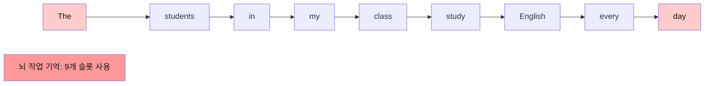

**과정**:
- The → 그
- students → 학생들
- in → ~에
- my → 나의
- class → 반
- study → 공부한다
- English → 영어를
- every → 매
- day → 일

**결과**: 
- 뇌가 9개 조각 처리 → 부담 큼 😫
- 시간: 5초
- 이해: 조각난 이해

---

#### ✅ 청킹 처리 (효율적)

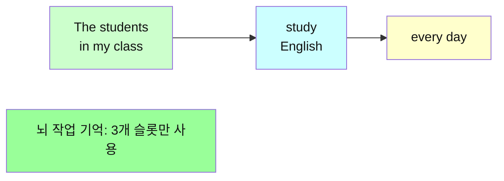

**과정 (청크 단위)**:
1. [The students in my class] → "우리 반 학생들이"
2. [study English] → "영어를 공부한다"
3. [every day] → "매일"

**결과**:
- 뇌가 3개 덩어리만 처리 → 부담 적음 😊
- 시간: 2초
- 이해: 완벽한 이해

**효과**: 속도 2.5배, 이해도 향상, 피로 50% 감소!

---

### 🎓 청킹의 과학적 원리

#### 1. 뇌의 작업 기억 (Working Memory)

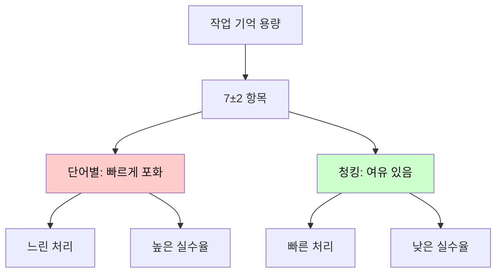

**원리**: 
- 뇌는 한 번에 7±2개 항목만 처리 가능
- 단어별: 10단어 = 10개 항목 (포화!)
- 청크별: 10단어 = 3개 청크 (여유!)

#### 2. 패턴 인식 (Pattern Recognition)

```
뇌는 패턴을 좋아합니다!

[in the morning] → 하나의 패턴으로 인식
→ 즉시 "아침에" 이해
→ 3개 단어를 1개로 처리!
```

#### 3. 장기 기억 형성

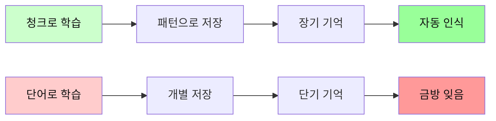

---

### 📚 청킹의 5가지 유형

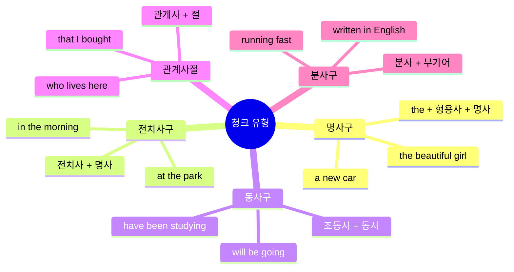

| 청크 유형 | 구조 | 예시 | 의미 단위 |
|-----------|------|------|-----------|
| **명사구** | 관사 + 형용사 + 명사 | the beautiful girl | 그 예쁜 소녀 |
| **전치사구** | 전치사 + 명사구 | in the morning | 아침에 |
| **동사구** | 조동사 + 동사 | will be going | 갈 것이다 |
| **관계사절** | 관계사 + S + V | that I bought | 내가 산 |
| **분사구** | 분사 + 목적어 | reading books | 책을 읽으면서 |

### 청킹 훈련 3단계

```mermaid
flowchart TD
    A[1단계: 인식] --> B[2단계: 연습]
    B --> C[3단계: 자동화]
    
    A --> A1[슬래시로 표시]
    A --> A2[청크 구분 연습]
    
    B --> B1[소리내어 읽기]
    B --> B2[청크 단위 끊기]
    
    C --> C1[자동 인식]
    C --> C2[빠른 처리]
    
    style A fill:#e1f5ff,color:#111
    style B fill:#fff4e1,color:#111
    style C fill:#ccffcc,color:#111
```

**1단계: 청크 인식 (1주)**
```
The book / on the table / is mine.
그 책은 / 테이블 위의 / 내 것이다
```

**2단계: 청크 연습 (2-3주)**
```
I want to buy / a new computer / for my work.
나는 사고 싶다 / 새 컴퓨터를 / 내 일을 위해
```

**3단계: 자동 인식 (지속)**
```
청크를 보면 자동으로 의미 파악!
슬래시 없이도 자연스럽게 처리
```

---

### 🚀 청킹 실전 활용

#### 자막 독해

```
자막: I'm gonna meet my friends at the cafe this afternoon.

청킹:
[I'm gonna meet] / [my friends] / [at the cafe] / [this afternoon]
나는 만날 거야 / 내 친구들을 / 카페에서 / 오늘 오후에

시간: 2초 ⚡
```

#### 논문 독해

```
논문: The researchers conducted a comprehensive study 
      on the effects of climate change on agricultural productivity.

청킹:
[The researchers] / [conducted] / [a comprehensive study] / 
[on the effects] / [of climate change] / [on agricultural productivity]

연구자들이 / 수행했다 / 포괄적인 연구를 /
그 영향에 대한 / 기후 변화의 / 농업 생산성에 대한

시간: 3초 ⚡
```

---

### 💡 청킹 vs 단어 학습

#### ❌ 단어만 외우기 (비효율)

```
단어 암기:
- beautiful: 아름다운
- girl: 소녀
- morning: 아침
- study: 공부하다

실전 적용: ??
→ 문장에서 조립 필요
→ 느리고 어색함
```

#### ✅ 청크(문장)로 외우기 (효율)

```
청크 패턴:
- the beautiful girl: 그 예쁜 소녀
- in the morning: 아침에
- study English: 영어를 공부하다
- every day: 매일

실전 적용: 즉시!
→ 바로 사용 가능
→ 빠르고 자연스러움
```

### 단어 학습 vs 문장(청크) 학습

```mermaid
graph TD
    A[학습 방법] --> B[단어 암기]
    A --> C[문장/청크 학습]
    
    B --> B1[개별 단어]
    B --> B2[뜻만 기억]
    B --> B3[실전 조립 필요]
    B --> B4[느리고 어색]
    
    C --> C1[의미 덩어리]
    C --> C2[문맥과 함께]
    C --> C3[즉시 사용 가능]
    C --> C4[빠르고 자연스러움]
    
    style B fill:#ffcccc,color:#111
    style C fill:#ccffcc,color:#111
    style B4 fill:#ff9999,color:#111
    style C4 fill:#99ff99,color:#111
```

| 구분 | 단어 암기 | 문장/청크 학습 |
|------|-----------|----------------|
| **학습 단위** | 개별 단어 | 의미 덩어리 |
| **기억 방식** | 단어 = 뜻 | 패턴 + 문맥 |
| **실전 활용** | 조립 필요 (느림) | 즉시 사용 (빠름) |
| **장기 기억** | 약함 | 강함 |
| **자연스러움** | 어색함 | 자연스러움 |
| **회화 연결** | 어려움 | 쉬움 |
| **추천도** | ❌ | ✅✅✅ |

**결론**: 단어가 아닌 문장(청크)으로 외워라!

---

**청킹 단위**:
- 전치사구: in the morning, at the park
- 명사구: the beautiful girl, a new car
- 동사구: have been studying, will be going

### 2. 스키밍(Skimming) 기법
**전체적인 흐름과 주제 파악**

```mermaid
flowchart LR
    A[시작] --> B[제목 읽기]
    B --> C[첫 문단 읽기]
    C --> D[각 단락 첫 문장]
    D --> E[마지막 문단 읽기]
    E --> F[전체 주제 파악]
    
    style A fill:#e1f5ff
    style F fill:#ffe1e1
```

### 3. 스캐닝(Scanning) 기법
**특정 정보 빠르게 찾기**

| 찾는 정보 | 찾는 방법 | 예시 |
|-----------|-----------|------|
| 숫자/날짜 | 숫자 형태 스캔 | 2024, 100%, $50 |
| 고유명사 | 대문자 시작 단어 | Seoul, Apple, NASA |
| 전문용어 | 특수 형태 단어 | algorithm, photosynthesis |
| 키워드 | 질문 관련 단어 | 질문에 나온 핵심 단어 |

## 📝 학습 프롬프트 시스템

### 자막 독해 학습 프롬프트
```
당신은 영어 자막 독해 전문 강사입니다.
다음 자막을 분석해주세요:

[자막 텍스트 입력]

다음 형식으로 설명해주세요:
1. 문장 구조 분석 (주어, 동사, 목적어)
2. 핵심 표현 및 숙어
3. 생략된 부분 복원
4. 한국어 자연스러운 번역
5. 비슷한 표현 3가지
```

### 논문 독해 학습 프롬프트
```
당신은 학술 영어 독해 전문가입니다.
다음 논문 문장을 분석해주세요:

[논문 문장 입력]

다음 형식으로 설명해주세요:
1. 문장 구조 완전 분해 (절, 구 단위)
2. 학술 표현 및 전문 용어
3. 복잡한 문법 구조 설명
4. 핵심 의미 파악
5. 유사 학술 표현 3가지
```

## 🎓 독해 문법 핵심 정리

```mermaid
mindmap
  root((독해 필수<br/>문법))
    시제
      단순시제
        현재
        과거
        미래
      완료시제
        현재완료
        과거완료
        미래완료
      진행시제
        현재진행
        과거진행
        미래진행
      완료진행
        현재완료진행
        과거완료진행
        미래완료진행
    관계사
      관계대명사
        who
        which
        that
        whose
      관계부사
        when
        where
        why
        how
    분사구문
      현재분사
        능동 의미
        동시 동작
      과거분사
        수동 의미
        완료 의미
      분사구문 해석
        시간
        이유
        조건
    가정법
      가정법 과거
        현재 사실 반대
      가정법 과거완료
        과거 사실 반대
      혼합 가정법
    수동태
      기본 수동태
      시제별 수동태
      조동사 수동태
      by 이외 전치사
    부정사동명사
      to부정사
        명사적 용법
        형용사적 용법
        부사적 용법
      동명사
        주어
        목적어
        보어
```

### 📊 독해 필수 문법 우선순위

| 순위 | 문법 항목 | 중요도 | 빈도 | 학습 시기 |
|------|-----------|--------|------|-----------|
| 1 | **시제** | ⭐⭐⭐⭐⭐ | 매우 높음 | 1단계 |
| 2 | **관계사** | ⭐⭐⭐⭐⭐ | 매우 높음 | 1-2단계 |
| 3 | **분사 구문** | ⭐⭐⭐⭐ | 높음 | 2단계 |
| 4 | **수동태** | ⭐⭐⭐⭐ | 높음 | 2단계 |
| 5 | **부정사/동명사** | ⭐⭐⭐⭐ | 높음 | 2단계 |
| 6 | **가정법** | ⭐⭐⭐ | 중간 | 3단계 |

### 독해용 문법 접근법

```mermaid
flowchart LR
    A[문법 학습] --> B{목적}
    B -->|X| C[문법을 위한 문법]
    B -->|O| D[독해 속도 향상]
    
    C --> E[문법 규칙 암기]
    C --> F[문제 풀이 위주]
    
    D --> G[패턴 인식]
    D --> H[빠른 의미 파악]
    
    E --> I[느린 독해]
    F --> I
    
    G --> J[빠른 독해]
    H --> J
    
    style C fill:#ffcccc
    style D fill:#ccffcc
    style I fill:#ffcccc
    style J fill:#ccffcc
```

## 📊 학습 진도 체크리스트

```mermaid
graph TD
    A[독해 학습 시작] --> B{기초 단계}
    B -->|완료| C{중급 단계}
    C -->|완료| D{고급 단계}
    D -->|완료| E[독해 마스터]
    
    B --> B1[✓ 5형식 구조 이해]
    B --> B2[✓ 기본 시제 파악]
    B --> B3[✓ 주요 접속사 이해]
    
    C --> C1[✓ 자막 실시간 읽기]
    C --> C2[✓ 복잡한 문장 분해]
    C --> C3[✓ 문맥 통한 추론]
    
    D --> D1[✓ 논문 빠른 독해]
    D --> D2[✓ 스키밍/스캐닝]
    D --> D3[✓ 다양한 장르 독해]
    
    style A fill:#e1f5ff
    style B fill:#fff4e1
    style C fill:#ffe1f5
    style D fill:#e1ffe1
    style E fill:#ffe1e1
```

| 단계 | 체크리스트 | 테스트 방법 | 목표 시간 |
|------|------------|-------------|-----------|
| **기초** | □ 5형식 문장 구조 이해<br/>□ 기본 시제 파악 능력<br/>□ 주요 접속사 이해 | 문장 구조 분석 20문제 | 80% 정답 |
| **중급** | □ 자막 실시간 읽기 가능<br/>□ 복잡한 문장 구조 분해 능력<br/>□ 문맥을 통한 단어 추론 | 자막 따라 읽기 테스트 | 90% 이해 |
| **고급** | □ 논문 빠르게 읽고 핵심 파악<br/>□ 스키밍/스캐닝 능숙하게 사용<br/>□ 다양한 장르 독해 가능 | 논문 10페이지 읽기 | 30분 내 |

## 🚀 빠른 독해 핵심 전략

### 자막 독해 3초 규칙

```mermaid
gantt
    title 자막 독해 3초 타임라인
    dateFormat  s
    axisFormat  %Ss
    
    section 1단계
    주어+동사 파악    :a1, 0, 1s
    
    section 2단계
    핵심 단어 인식    :a2, 1, 1s
    
    section 3단계
    전체 의미 통합    :a3, 2, 1s
```

| 시간 | 단계 | 행동 | 예시 |
|------|------|------|------|
| **0-1초** | 주어+동사 파악 | S와 V 먼저 찾기 | "I love..." |
| **1-2초** | 핵심 단어 인식 | 명사, 형용사 파악 | "...this movie" |
| **2-3초** | 전체 의미 통합 | 수식어 포함 이해 | "I love this movie so much!" |

### 논문 독해 구조 파악법

```mermaid
flowchart TD
    A[논문 시작] --> B[Abstract 읽기]
    B --> C{핵심 파악됨?}
    C -->|Yes| D[관심 섹션만 읽기]
    C -->|No| E[Introduction 읽기]
    E --> F[Methods 훑기]
    F --> G[Results 정독]
    G --> H[Discussion 읽기]
    H --> I[Conclusion 읽기]
    D --> I
    I --> J[논문 이해 완료]
    
    style A fill:#e1f5ff
    style B fill:#fff4e1
    style G fill:#ffe1e1
    style I fill:#ffe1e1
    style J fill:#ccffcc
```

| 섹션 | 중요도 | 읽는 방법 | 시간 배분 |
|------|--------|-----------|-----------|
| **Abstract** | ⭐⭐⭐⭐⭐ | 정독 (필독) | 5분 |
| **Introduction** | ⭐⭐⭐⭐ | 빠르게 읽기 | 5분 |
| **Methods** | ⭐⭐ | 훑어보기 (필요시) | 3분 |
| **Results** | ⭐⭐⭐⭐⭐ | 정독 (핵심) | 10분 |
| **Discussion** | ⭐⭐⭐⭐ | 정독 | 5분 |
| **Conclusion** | ⭐⭐⭐⭐⭐ | 정독 (필독) | 2분 |
| **합계** | - | - | **30분** |

## 💡 추천 학습 순서

1. `01_기초_독해_패턴.md` - 문장 구조 기초
2. `02_자막_독해_패턴.md` - 영상 자막 연습
3. `05_독해_필수_문법.md` - 문법 정리
4. `03_논문_독해_패턴.md` - 학술 독해
5. `04_고급_독해_전략.md` - 속독 기술

## 📱 실전 연습 방법

### 자막 독해 연습
1. Netflix, YouTube 자막 켜고 보기
2. 일시정지하며 문장 구조 분석
3. 속도 점차 높이기
4. 자막 없이 듣기 도전

### 논문 독해 연습
1. 관심 분야 짧은 논문 선택
2. Abstract만 먼저 읽기
3. 전체 구조 파악 후 정독
4. 핵심 문장 추출 연습

## 🎯 최종 목표

**자막 독해**: 실시간 자막을 읽으면서 영상 시청 가능
**논문 독해**: 10페이지 논문을 30분 내에 핵심 파악

---

💪 꾸준한 연습이 가장 중요합니다!
매일 10분씩 독해 연습으로 실력을 향상시키세요.

