# 영어 독해 마스터 가이드

## 🎯 독해의 가장 중요한 원칙

### ⚠️ 독해 혁명: 한국식 사고를 버리고 영어식 사고로!

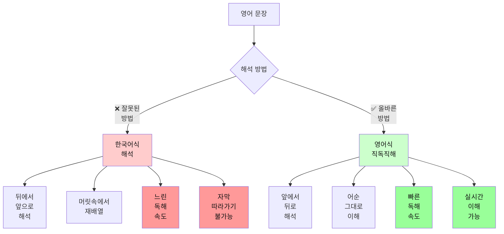

### 📊 한국식 vs 영어식 사고 비교

| 구분 | 한국식 해석 (❌) | 영어식 직독직해 (✅) |
|------|------------------|----------------------|
| **방향** | 뒤 → 앞 | 앞 → 뒤 |
| **과정** | 전체 문장 읽고 → 재배열 → 해석 | 읽으면서 → 바로바로 이해 |
| **속도** | 느림 (2배 소요) | 빠름 |
| **자막** | 따라가기 어려움 | 실시간 가능 |
| **논문** | 피곤하고 시간 오래 걸림 | 효율적 |
| **사고** | 한국어 번역 | 영어로 직접 사고 |

---

### 🔥 왜 직독직해가 필수인가?

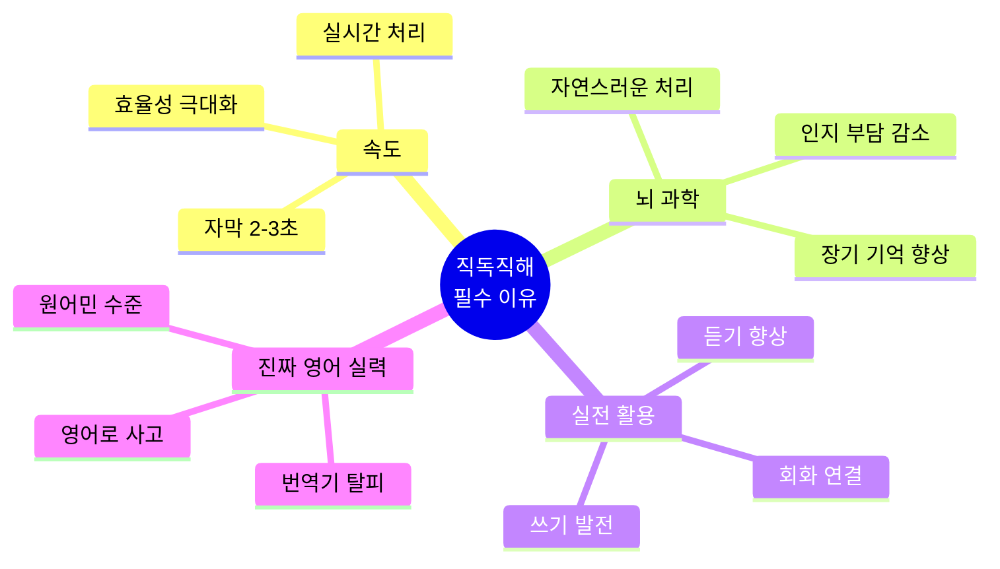

#### 1. 자막은 기다려주지 않는다
```
자막 표시 시간: 2-3초
한국식 해석: 5-7초 소요 → 이미 다음 자막으로 ❌
영어식 해석: 2-3초 소요 → 실시간 이해 가능 ✅
```

#### 2. 논문은 수십 페이지
```
10페이지 논문
한국식 해석: 2시간 → 피곤, 집중력 저하 ❌
영어식 해석: 30분 → 효율적, 핵심 파악 ✅
```

#### 3. 영어 실력의 진짜 레벨업
```
한국식 해석: 평생 번역기 ❌
영어식 해석: 영어를 영어로 사고 ✅
```

---

## 📊 독해 방식 완전 비교

### 3가지 독해 방식

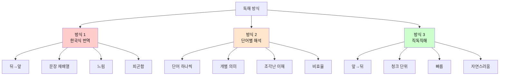

### 독해 방식 비교표

| 구분 | 방식 1: 한국식 번역 | 방식 2: 단어별 해석 | 방식 3: 직독직해 (청크) |
|------|---------------------|---------------------|------------------------|
| **읽는 방향** | 뒤 → 앞 | 단어 단위 | 앞 → 뒤 (청크 단위) |
| **처리 단위** | 전체 문장 | 단어 1개 | 의미 덩어리 3-5단어 |
| **속도** | 매우 느림 (150 WPM) | 느림 (180 WPM) | 빠름 (300+ WPM) |
| **인지 부담** | 매우 높음 | 높음 | 낮음 |
| **이해도** | 70% | 60% | 90% |
| **자막 대응** | 불가능 | 어려움 | 완벽 |
| **논문 효율** | 2시간/10p | 1.5시간/10p | 30분/10p |
| **뇌 피로도** | 매우 높음 | 높음 | 낮음 |
| **장기 기억** | 낮음 | 낮음 | 높음 |
| **회화 연결** | 안 됨 | 안 됨 | 자연스럽게 연결 |
| **추천도** | ❌❌❌ | ❌❌ | ✅✅✅ |

### 실제 예문으로 비교

```
문장: The research team discovered a new method to solve the problem.
```

#### 방식 1: 한국식 번역 (가장 나쁨 ❌)

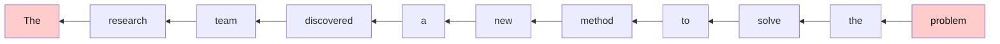

**과정**:
1. problem을 먼저 찾아 → "문제를"
2. solve를 찾아 → "해결하기 위한"
3. method를 찾아 → "방법을"
4. discovered를 찾아 → "발견했다"
5. 주어를 찾아 → "연구팀이"

**결과**: "그 연구팀이 그 문제를 해결하기 위한 새로운 방법을 발견했다"
- **시간**: 7-10초
- **피로도**: 😫😫😫
- **효율**: ❌

---

#### 방식 2: 단어별 해석 (나쁨 ❌)

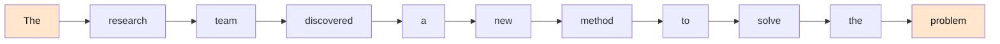

**과정**:
- The → 그
- research → 연구
- team → 팀
- discovered → 발견했다
- a → 하나의
- new → 새로운
- method → 방법
- to → ~하기 위한
- solve → 해결하다
- the → 그
- problem → 문제

**결과**: "그 연구 팀 발견했다 하나의 새로운 방법 ~하기 위한 해결하다 그 문제"
- **시간**: 5-7초
- **이해도**: 조각난 이해 😕
- **효율**: ❌

---

#### 방식 3: 직독직해 - 청크 단위 (최고! ✅)

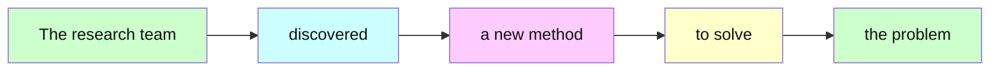

**과정 (청크 단위)**:
1. [The research team] → "그 연구팀이"
2. [discovered] → "발견했다"
3. [a new method] → "새로운 방법을"
4. [to solve] → "해결하기 위한"
5. [the problem] → "그 문제를"

**결과**: "그 연구팀이 / 발견했다 / 새로운 방법을 / 해결하기 위한 / 그 문제를"
- **시간**: 2-3초 ⚡
- **이해도**: 완벽 😊
- **효율**: ✅✅✅

---

### 왜 직독직해(청크)가 압도적으로 좋은가?

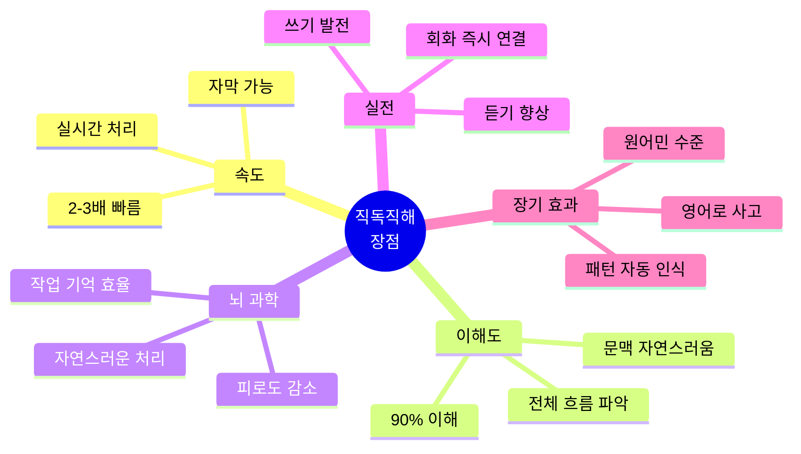

| 장점 분야 | 설명 | 효과 |
|-----------|------|------|
| **처리 속도** | 재배열 과정 제거 | 2-3배 빠름 |
| **인지 부담** | 작업 기억 효율 상승 | 피로 50% 감소 |
| **이해도** | 문맥 자연스러움 | 90% 이해 |
| **장기 기억** | 청크로 저장 | 2배 더 오래 기억 |
| **회화 연결** | 같은 방식 사용 | 즉시 말하기 가능 |
| **듣기 향상** | 실시간 처리 능력 | 듣기 점수 30% 상승 |

---

### 💡 영어식 사고 전환 트레이닝

#### 예문 1: 간단한 문장
```
문장: I love this movie.

❌ 한국식 (뒤에서 앞으로):
   this movie → 이 영화를
   love → 사랑한다
   I → 나는
   결과: "나는 이 영화를 사랑한다"
   
✅ 영어식 (앞에서 뒤로):
   I → 나는
   love → 사랑해
   this movie → 이 영화를
   결과: "나는 / 사랑해 / 이 영화를"
```

**핵심**: 영어 어순 그대로 이해하기!

#### 예문 2: 복잡한 문장
```
문장: The book that I bought yesterday was very interesting.

❌ 한국식:
   "어제 내가 산 책은 매우 흥미로웠다"
   (yesterday를 찾아서 → that I bought를 해석 → 다시 앞으로)
   
✅ 영어식:
   "그 책은 / 내가 샀던 / 어제 / 매우 흥미로웠다"
   (읽는 순서대로 바로바로 이해)
```

---

### 🎓 직독직해 훈련 3단계

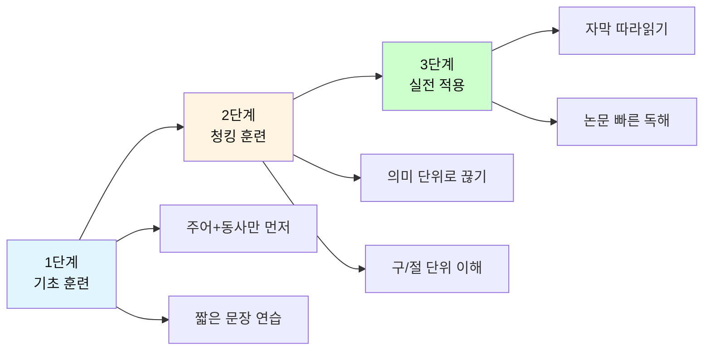

| 단계 | 목표 | 방법 | 연습 시간 |
|------|------|------|-----------|
| **1단계** | 영어 어순 익히기 | 주어+동사 먼저 파악<br/>짧은 문장 반복 | 1-2주 |
| **2단계** | 청킹으로 빠르게 | 의미 단위로 끊어 읽기<br/>바로바로 이해 | 2-3주 |
| **3단계** | 실전 적용 | 자막/논문 실전 연습<br/>속도 점차 높이기 | 지속적 |

---

### 🚀 직독직해 핵심 원칙

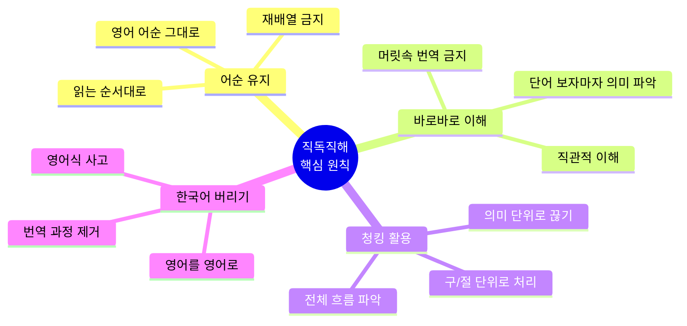

#### 원칙 1: 영어 어순을 절대 바꾸지 마라
```
I will buy a new car tomorrow.

❌ 나는 / 내일 / 새 차를 / 살 것이다 (재배열)
✅ 나는 / 살 거야 / 새 차를 / 내일 (어순 유지)
```

#### 원칙 2: 읽으면서 바로바로 이해하라
```
She loves reading books in the morning.

❌ (문장 끝까지 읽고) → (다시 처음부터 해석)
✅ 그녀는 / 사랑해 / 읽는 것을 / 책을 / 아침에
   (각 단어/구를 보는 즉시 이해)
```

#### 원칙 3: 청킹(의미 단위)으로 처리하라
```
The students / in my class / study English / every day.
학생들은 / 우리 반의 / 영어를 공부해 / 매일
```

#### 원칙 4: 한국어로 번역하지 말고 영어로 사고하라
```
I'm hungry. → (머릿속에서) "배고프다"로 번역 ❌
I'm hungry. → (머릿속에서) 배고픔 느낌 연상 ✅
```

---

### ⚡ 직독직해가 안 되는 이유와 해결법

| 문제 | 원인 | 해결법 |
|------|------|--------|
| 뒤로 돌아가서 다시 읽음 | 한국어 어순에 익숙함 | 강제로 앞으로만 읽기 연습 |
| 단어마다 번역함 | 번역 습관 | 이미지/느낌으로 연상 |
| 문장 끝까지 안 읽으면 불안 | 전체 구조 파악 욕구 | 주어+동사만으로도 이해 가능 |
| 수식어에서 헷갈림 | 수식어 처리 미숙 | 나중에 추가하는 연습 |

---

### 📖 실전 예문으로 마스터하기

#### Level 1: 기초
```
문장: He works at Google.

직독직해:
He → 그는
works → 일해
at Google → 구글에서

결과: "그는 / 일해 / 구글에서"
```

#### Level 2: 중급
```
문장: The girl wearing a red dress is my sister.

직독직해:
The girl → 그 소녀는
wearing a red dress → 빨간 드레스를 입은
is → ~이다
my sister → 내 여동생

결과: "그 소녀는 / 빨간 드레스를 입은 / ~이다 / 내 여동생"
```

#### Level 3: 고급
```
문장: Scientists believe that climate change will significantly 
      impact global food production in the coming decades.

직독직해:
Scientists believe → 과학자들은 믿는다
that → ~라고
climate change → 기후 변화가
will impact → 영향을 줄 것이다
significantly → 상당히
global food production → 세계 식량 생산에
in the coming decades → 앞으로 수십 년 동안

결과: 읽는 순서대로 바로바로 이해
```

---

## 📚 학습 목표
- 자막(영화, 드라마, 유튜브) 빠르게 읽기
- 논문(학술 논문, 기술 문서) 효율적으로 읽기
- 독해 속도 향상 및 핵심 파악 능력 강화
- **영어식 사고로 직독직해 마스터** ⭐⭐⭐

## 🗺️ 독해 학습 마인드맵

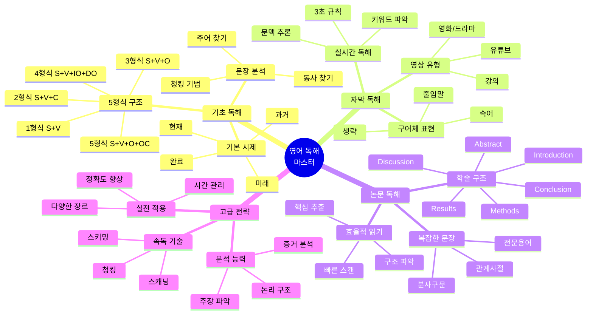

## 🎯 독해 학습 로드맵

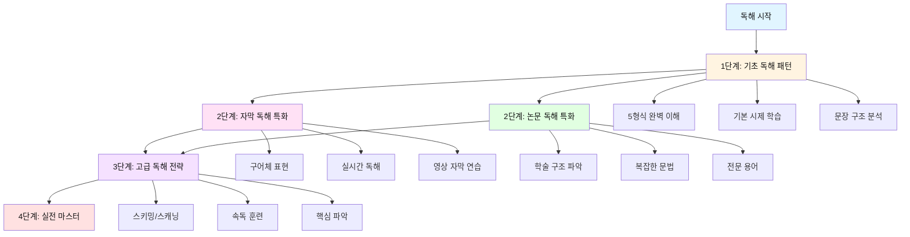

## 📊 학습 단계별 상세 정보

| 단계 | 파일 | 기간 | 목표 | 핵심 내용 | 난이도 |
|------|------|------|------|-----------|--------|
| 1단계 | `01_기초_독해_패턴.md` | 1-2주 | 문장 구조 파악 | 5형식, 시제, 기본 구문 | ⭐ |
| 2-A단계 | `02_자막_독해_패턴.md` | 2-3주 | 실시간 자막 읽기 | 구어체, 줄임말, 3초 규칙 | ⭐⭐ |
| 2-B단계 | `03_논문_독해_패턴.md` | 3-4주 | 학술 논문 읽기 | 학술 구조, 복잡한 문법 | ⭐⭐⭐ |
| 3단계 | `04_고급_독해_전략.md` | 4-5주 | 속독 및 핵심 파악 | 스키밍, 스캐닝, 분석 | ⭐⭐⭐⭐ |
| 보충 | `05_독해_필수_문법.md` | 병행 학습 | 문법 정리 | 시제, 관계사, 분사구문 | ⭐⭐ |

## 📖 독해 유형별 접근법 비교

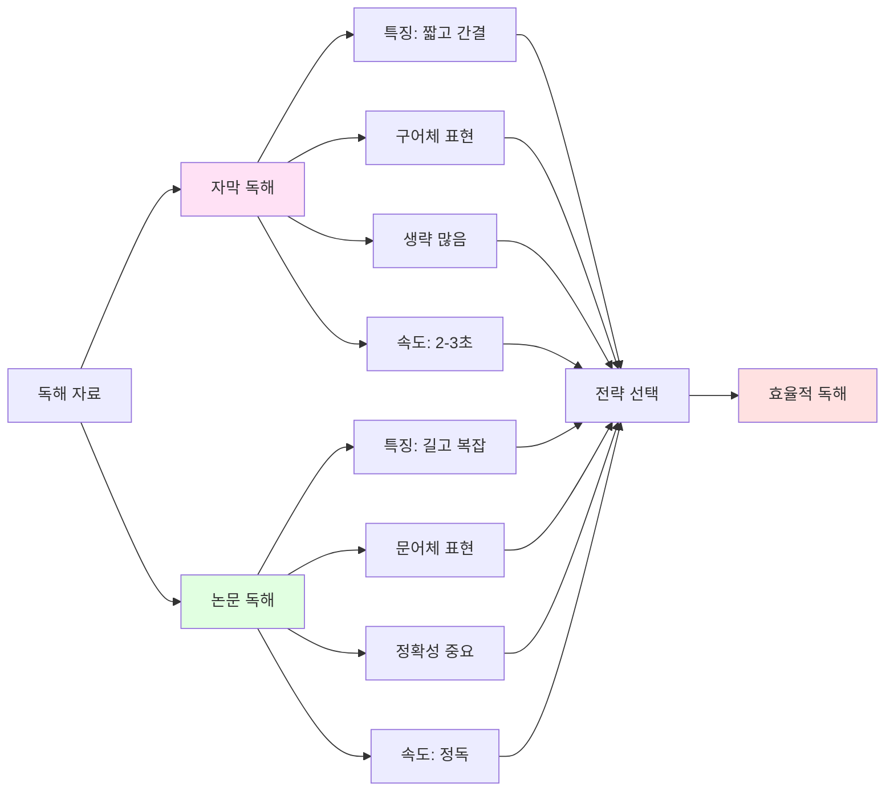

| 구분 | 자막 독해 | 논문 독해 |
|------|-----------|-----------|
| **특징** | 짧고 간결 | 길고 복잡 |
| **문체** | 구어체 | 문어체 |
| **생략** | 많음 | 적음 |
| **속도** | 빠름 (2-3초) | 느림 (정독) |
| **전략** | 문맥 파악 → 핵심 단어 → 전체 의미 | 구조 파악 → 핵심 문장 → 세부 내용 |
| **중요도** | 전체 흐름 이해 | 정확한 의미 파악 |
| **난이도** | ⭐⭐ | ⭐⭐⭐ |

## 🔧 독해 도구 및 방법론

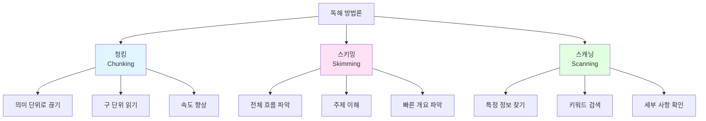

| 기법 | 목적 | 방법 | 속도 | 사용 시기 |
|------|------|------|------|-----------|
| **청킹<br/>(Chunking)** | 의미 단위로 읽기 | 구/절 단위로 끊어 읽기 | 중간 | 모든 독해 |
| **스키밍<br/>(Skimming)** | 전체 내용 파악 | 제목, 첫/마지막 문장 중심 | 빠름 | 개요 파악 시 |
| **스캐닝<br/>(Scanning)** | 특정 정보 찾기 | 키워드 중심 검색 | 매우 빠름 | 정보 검색 시 |

### 1. 청킹(Chunking) 기법 - 가장 중요!

## 🎯 청킹(Chunking)이란?

**정의**: 의미 있는 단어 덩어리(3-5단어)를 하나의 단위로 처리하는 기법

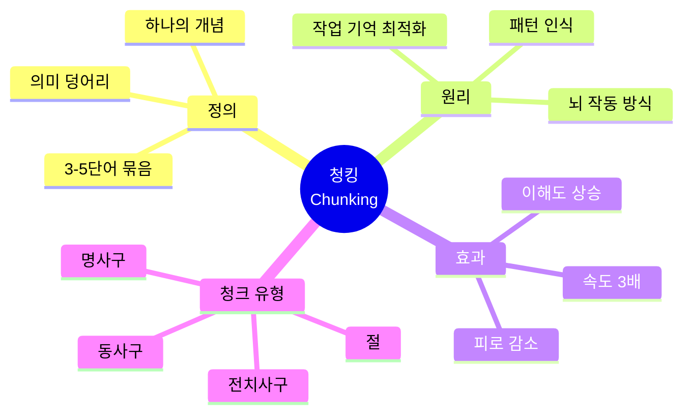

### 🧠 왜 청킹이 필수인가? (뇌과학 기반)

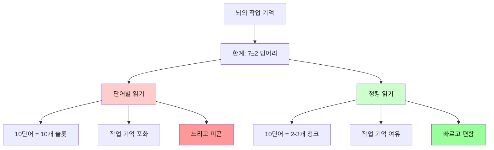

### 📊 단어 vs 청크 처리 비교

| 구분 | 단어별 읽기 | 청킹 읽기 |
|------|-------------|-----------|
| **처리 단위** | 1단어 (1개) | 3-5단어 묶음 (1개) |
| **뇌 부담** | 10단어 = 10개 슬롯 | 10단어 = 2-3개 슬롯 |
| **작업 기억** | 포화 상태 | 여유 있음 |
| **속도** | 느림 | 3배 빠름 |
| **이해도** | 조각난 이해 | 완전한 이해 |
| **피로도** | 매우 높음 | 낮음 |
| **장기 기억** | 잘 안 됨 | 잘 됨 |

### 실제 예문으로 이해하기

```
문장: The students in my class study English every day.
(10단어)
```

#### ❌ 단어별 처리 (비효율)

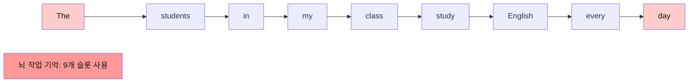

**과정**:
- The → 그
- students → 학생들
- in → ~에
- my → 나의
- class → 반
- study → 공부한다
- English → 영어를
- every → 매
- day → 일

**결과**: 
- 뇌가 9개 조각 처리 → 부담 큼 😫
- 시간: 5초
- 이해: 조각난 이해

---

#### ✅ 청킹 처리 (효율적)

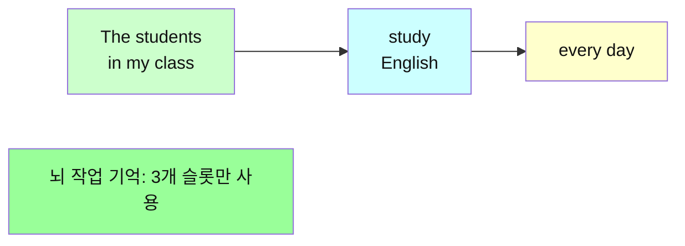

**과정 (청크 단위)**:
1. [The students in my class] → "우리 반 학생들이"
2. [study English] → "영어를 공부한다"
3. [every day] → "매일"

**결과**:
- 뇌가 3개 덩어리만 처리 → 부담 적음 😊
- 시간: 2초
- 이해: 완벽한 이해

**효과**: 속도 2.5배, 이해도 향상, 피로 50% 감소!

---

### 🎓 청킹의 과학적 원리

#### 1. 뇌의 작업 기억 (Working Memory)

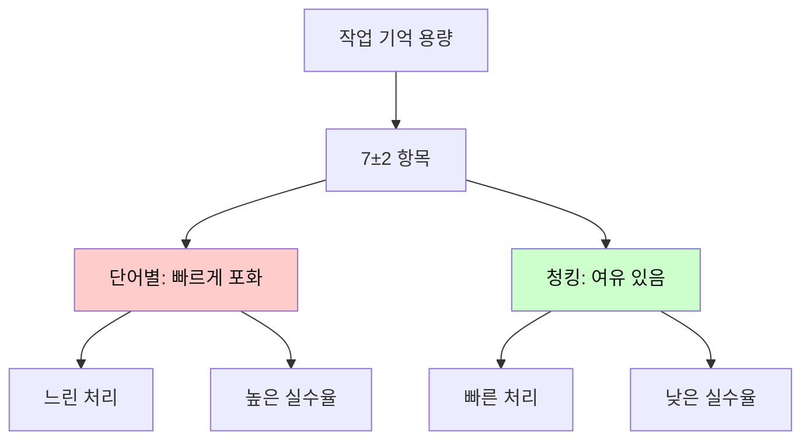

**원리**: 
- 뇌는 한 번에 7±2개 항목만 처리 가능
- 단어별: 10단어 = 10개 항목 (포화!)
- 청크별: 10단어 = 3개 청크 (여유!)

#### 2. 패턴 인식 (Pattern Recognition)

```
뇌는 패턴을 좋아합니다!

[in the morning] → 하나의 패턴으로 인식
→ 즉시 "아침에" 이해
→ 3개 단어를 1개로 처리!
```

#### 3. 장기 기억 형성

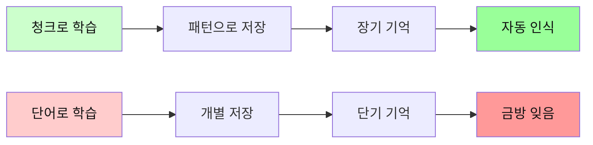

---

### 📚 청킹의 5가지 유형

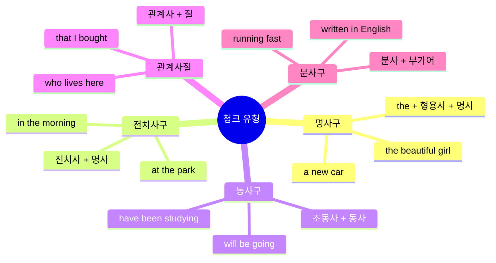

| 청크 유형 | 구조 | 예시 | 의미 단위 |
|-----------|------|------|-----------|
| **명사구** | 관사 + 형용사 + 명사 | the beautiful girl | 그 예쁜 소녀 |
| **전치사구** | 전치사 + 명사구 | in the morning | 아침에 |
| **동사구** | 조동사 + 동사 | will be going | 갈 것이다 |
| **관계사절** | 관계사 + S + V | that I bought | 내가 산 |
| **분사구** | 분사 + 목적어 | reading books | 책을 읽으면서 |

### 청킹 훈련 3단계

```mermaid
flowchart TD
    A[1단계: 인식] --> B[2단계: 연습]
    B --> C[3단계: 자동화]
    
    A --> A1[슬래시로 표시]
    A --> A2[청크 구분 연습]
    
    B --> B1[소리내어 읽기]
    B --> B2[청크 단위 끊기]
    
    C --> C1[자동 인식]
    C --> C2[빠른 처리]
    
    style A fill:#e1f5ff,color:#111
    style B fill:#fff4e1,color:#111
    style C fill:#ccffcc,color:#111
```

**1단계: 청크 인식 (1주)**
```
The book / on the table / is mine.
그 책은 / 테이블 위의 / 내 것이다
```

**2단계: 청크 연습 (2-3주)**
```
I want to buy / a new computer / for my work.
나는 사고 싶다 / 새 컴퓨터를 / 내 일을 위해
```

**3단계: 자동 인식 (지속)**
```
청크를 보면 자동으로 의미 파악!
슬래시 없이도 자연스럽게 처리
```

---

### 🚀 청킹 실전 활용

#### 자막 독해

```
자막: I'm gonna meet my friends at the cafe this afternoon.

청킹:
[I'm gonna meet] / [my friends] / [at the cafe] / [this afternoon]
나는 만날 거야 / 내 친구들을 / 카페에서 / 오늘 오후에

시간: 2초 ⚡
```

#### 논문 독해

```
논문: The researchers conducted a comprehensive study 
      on the effects of climate change on agricultural productivity.

청킹:
[The researchers] / [conducted] / [a comprehensive study] / 
[on the effects] / [of climate change] / [on agricultural productivity]

연구자들이 / 수행했다 / 포괄적인 연구를 /
그 영향에 대한 / 기후 변화의 / 농업 생산성에 대한

시간: 3초 ⚡
```

---

### 💡 청킹 vs 단어 학습

#### ❌ 단어만 외우기 (비효율)

```
단어 암기:
- beautiful: 아름다운
- girl: 소녀
- morning: 아침
- study: 공부하다

실전 적용: ??
→ 문장에서 조립 필요
→ 느리고 어색함
```

#### ✅ 청크(문장)로 외우기 (효율)

```
청크 패턴:
- the beautiful girl: 그 예쁜 소녀
- in the morning: 아침에
- study English: 영어를 공부하다
- every day: 매일

실전 적용: 즉시!
→ 바로 사용 가능
→ 빠르고 자연스러움
```

### 단어 학습 vs 문장(청크) 학습

```mermaid
graph TD
    A[학습 방법] --> B[단어 암기]
    A --> C[문장/청크 학습]
    
    B --> B1[개별 단어]
    B --> B2[뜻만 기억]
    B --> B3[실전 조립 필요]
    B --> B4[느리고 어색]
    
    C --> C1[의미 덩어리]
    C --> C2[문맥과 함께]
    C --> C3[즉시 사용 가능]
    C --> C4[빠르고 자연스러움]
    
    style B fill:#ffcccc,color:#111
    style C fill:#ccffcc,color:#111
    style B4 fill:#ff9999,color:#111
    style C4 fill:#99ff99,color:#111
```

| 구분 | 단어 암기 | 문장/청크 학습 |
|------|-----------|----------------|
| **학습 단위** | 개별 단어 | 의미 덩어리 |
| **기억 방식** | 단어 = 뜻 | 패턴 + 문맥 |
| **실전 활용** | 조립 필요 (느림) | 즉시 사용 (빠름) |
| **장기 기억** | 약함 | 강함 |
| **자연스러움** | 어색함 | 자연스러움 |
| **회화 연결** | 어려움 | 쉬움 |
| **추천도** | ❌ | ✅✅✅ |

**결론**: 단어가 아닌 문장(청크)으로 외워라!

---

## 🎯 청크 단위 직독직해의 핵심 장점 (상세 분석)

### 📊 청크 직독직해의 7가지 핵심 이점

```mermaid
mindmap
  root((청크 직독직해<br/>7대 장점))
    1. 속도 향상
      단어별 대비 3배
      재배열 시간 제거
      실시간 처리 가능
      자막 완벽 대응
    2. 뇌 효율성
      작업기억 절약
      인지 부담 감소
      피로도 50% 감소
      집중력 향상
    3. 이해도 상승
      문맥 자연스러움
      전체 흐름 파악
      90% 이해율
      오독 감소
    4. 장기 기억
      패턴으로 저장
      2배 오래 기억
      자동 인식 가능
      복습 효율 상승
    5. 회화 연결
      말하기와 동일
      즉시 적용 가능
      유창성 향상
      자연스러운 표현
    6. 듣기 향상
      실시간 처리
      청취 속도 상승
      원어민 속도 대응
      듣기 점수 30%↑
    7. 학습 동기
      성취감 증가
      재미있음
      지속 가능성
      자신감 향상
```

### 📈 장점별 상세 분석표

| 장점 | 단어별 읽기 | 청크 직독직해 | 개선 효과 | 실생활 적용 |
|------|------------|--------------|----------|------------|
| **처리 속도** | 150-180 WPM | 300-400 WPM | **2-3배 빠름** | 자막 실시간 읽기 |
| **뇌 작업 부하** | 매 단어마다 처리 | 3-5단어 묶음 처리 | **인지 부담 70%↓** | 장시간 독해 가능 |
| **이해 정확도** | 60-70% | 85-95% | **이해도 30%↑** | 오독 감소 |
| **기억 지속** | 1-2일 | 5-7일 | **2-3배 오래 기억** | 복습 횟수 감소 |
| **피로도** | 30분 후 피곤 | 2시간 지속 가능 | **피로 50%↓** | 논문 독해 효율 |
| **회화 전이** | 연결 어려움 | 자연스럽게 연결 | **즉시 적용** | 말하기 자동 향상 |
| **듣기 효과** | 제한적 | 동시 향상 | **듣기 30%↑** | 원어민 대화 가능 |

### 💡 청크 직독직해가 효과적인 과학적 이유

#### 1️⃣ 뇌의 작업 기억 최적화

```mermaid
graph TB
    A[뇌의 작업 기억<br/>용량: 7±2 청크] --> B[단어별 처리]
    A --> C[청크별 처리]
    
    B --> B1[10단어 문장]
    B1 --> B2[10개 슬롯 사용]
    B2 --> B3[작업 기억 초과!]
    B3 --> B4[처리 속도 저하]
    B4 --> B5[높은 피로도]
    
    C --> C1[10단어 문장]
    C1 --> C2[2-3개 슬롯 사용]
    C2 --> C3[작업 기억 여유]
    C3 --> C4[빠른 처리 속도]
    C4 --> C5[낮은 피로도]
    
    style B fill:#ffcccc,color:#111
    style B3 fill:#ff9999,color:#111
    style B5 fill:#ff6666,color:#111
    style C fill:#ccffcc,color:#111
    style C3 fill:#99ff99,color:#111
    style C5 fill:#66ff66,color:#111
```

**과학적 근거**:
- 인간의 작업 기억은 동시에 7±2개 항목만 처리 가능 (Miller's Law)
- 단어별: 10단어 = 10개 항목 → 용량 초과 → 느림 + 피로
- 청크별: 10단어 = 3개 청크 → 용량 여유 → 빠름 + 편함

#### 2️⃣ 자연어 처리 방식과 일치

```mermaid
flowchart LR
    A[원어민의<br/>언어 처리] --> B[청크 단위<br/>인식]
    B --> C[즉시<br/>의미 파악]
    C --> D[자연스러운<br/>이해]
    
    E[학습자의<br/>단어별 처리] --> F[개별 단어<br/>번역]
    F --> G[재배열<br/>필요]
    G --> H[부자연스러운<br/>이해]
    
    style A fill:#ccffcc,color:#111
    style D fill:#99ff99,color:#111
    style E fill:#ffcccc,color:#111
    style H fill:#ff9999,color:#111
```

**원어민 뇌 처리 방식**:
- 원어민도 청크 단위로 언어를 처리
- "in the morning"을 3개 단어가 아닌 1개 개념으로 인식
- 청크 학습 = 원어민 사고방식 습득

#### 3️⃣ 문맥 이해와 추론 능력 향상

```mermaid
graph TD
    A[청크 단위 읽기] --> B[문맥 정보<br/>자동 포함]
    B --> C[의미 추론<br/>쉬워짐]
    C --> D[모르는 단어도<br/>이해 가능]
    
    E[단어별 읽기] --> F[개별 의미만<br/>파악]
    F --> G[문맥 정보<br/>부족]
    G --> H[모르는 단어<br/>막힘]
    
    style A fill:#ccffcc,color:#111
    style D fill:#99ff99,color:#111
    style E fill:#ffcccc,color:#111
    style H fill:#ff9999,color:#111
```

#### 4️⃣ 장기 기억 형성 메커니즘

| 처리 방식 | 기억 유형 | 저장 구조 | 인출 속도 | 지속 기간 |
|----------|----------|----------|----------|----------|
| **단어별** | 단기 기억 | 개별 단어 | 느림 | 1-2일 |
| **청크별** | 장기 기억 | 패턴/청크 | 빠름 | 1-2주 |
| **청크+반복** | 영구 기억 | 자동화된 패턴 | 즉시 | 평생 |

**기억 효율 비교**:
```
단어 암기: apple, beautiful, morning
→ 3개 개별 항목 → 금방 잊음

청크 암기: in the morning, the beautiful apple
→ 의미 있는 패턴 → 오래 기억
```

#### 5️⃣ 회화 자동 전이 효과

```mermaid
flowchart TB
    A[청크로<br/>독해 학습] --> B[같은 청크로<br/>회화 연습]
    B --> C[자동 연결]
    
    D[단어로<br/>독해 학습] --> E[회화 시<br/>조립 필요]
    E --> F[연결 어려움]
    
    A --> A1[읽기:<br/>I'm going to...]
    A1 --> A2[말하기:<br/>I'm going to...]
    A2 --> A3[자동 사용]
    
    D --> D1[읽기:<br/>I / am / going / to]
    D1 --> D2[말하기:<br/>어떻게 조합?]
    D2 --> D3[느리고 어색]
    
    style A fill:#ccffcc,color:#111
    style A3 fill:#99ff99,color:#111
    style D fill:#ffcccc,color:#111
    style D3 fill:#ff9999,color:#111
```

**실전 예시**:
```
청크 학습: [I'm planning to] [visit Seoul] [next month]
→ 독해: 즉시 이해
→ 회화: 그대로 사용 "I'm planning to visit Paris next week"

단어 학습: I / am / planning / to / visit / Seoul / next / month
→ 독해: 조립 필요
→ 회화: 어떻게 말하지? (막힘)
```

### 📊 학습 단계별 청크 효과

```mermaid
graph LR
    A[초급<br/>1-2개월] --> B[중급<br/>3-6개월]
    B --> C[고급<br/>6-12개월]
    C --> D[마스터<br/>1년+]
    
    A --> A1[효과:<br/>속도 1.5배]
    B --> B1[효과:<br/>속도 2배]
    C --> C1[효과:<br/>속도 3배]
    D --> D1[효과:<br/>원어민 수준]
    
    style A fill:#ffe1e1,color:#111
    style B fill:#fff4e1,color:#111
    style C fill:#e1ffe1,color:#111
    style D fill:#e1f5ff,color:#111
```

| 단계 | 기간 | 청크 인식률 | 독해 속도 | 이해도 | 실전 효과 |
|------|------|------------|----------|-------|----------|
| **초급** | 1-2개월 | 30-50% | 200 WPM | 70% | 자막 부분 이해 |
| **중급** | 3-6개월 | 60-80% | 250-300 WPM | 80% | 자막 대부분 이해 |
| **고급** | 6-12개월 | 85-95% | 350-400 WPM | 90% | 자막 완벽 이해 |
| **마스터** | 1년+ | 95%+ | 400+ WPM | 95% | 원어민 수준 |

### 🎯 청크 직독직해 실전 활용 시나리오

#### 시나리오 1: 영화/드라마 자막

**상황**: Netflix 영어 자막 시청
```
자막: "I can't believe you said that in front of everyone!"
(자막 표시 시간: 3초)
```

**단어별 처리 (실패 ❌)**:
```
I → 나는
can't → 할 수 없다
believe → 믿다
you → 너가
said → 말했다
that → 그것을
...
시간 초과! 다음 자막으로 넘어감 😫
```

**청크 처리 (성공 ✅)**:
```
[I can't believe] → 믿을 수 없어
[you said that] → 네가 그걸 말했다는 게
[in front of everyone] → 모두 앞에서
→ 2초 만에 이해 완료! 😊
```

#### 시나리오 2: 학술 논문

**상황**: 10페이지 논문 읽기
```
문장: "The researchers utilized a comprehensive methodology 
       to investigate the correlation between sleep patterns 
       and cognitive performance."
```

**단어별 처리 (비효율 ❌)**:
```
The → 그
researchers → 연구자들
utilized → 활용했다
a → 하나의
comprehensive → 포괄적인
...
→ 10페이지 읽는데 2시간 소요 😫
```

**청크 처리 (효율 ✅)**:
```
[The researchers] → 연구자들이
[utilized] → 활용했다
[a comprehensive methodology] → 포괄적인 방법론을
[to investigate] → 조사하기 위해
[the correlation between] → ~간의 상관관계를
[sleep patterns and cognitive performance] → 수면 패턴과 인지 능력
→ 10페이지 읽는데 30분 소요 😊
```

### 💪 청크 직독직해 마스터 로드맵

```mermaid
flowchart TD
    A[1주차<br/>청크 인식] --> B[2-3주차<br/>기본 청크 연습]
    B --> C[4-6주차<br/>복합 청크 연습]
    C --> D[7-10주차<br/>자동 인식 단계]
    D --> E[11주차+<br/>마스터 단계]
    
    A --> A1[명사구 3-4개 인식]
    B --> B1[전치사구 추가]
    C --> C1[관계사절 포함]
    D --> D1[자동 처리 90%]
    E --> E1[원어민 수준]
    
    style A fill:#ffe1e1,color:#111
    style B fill:#fff4e1,color:#111
    style C fill:#e1ffe1,color:#111
    style D fill:#e1f5ff,color:#111
    style E fill:#ccffcc,color:#111
```

**청킹 단위**:
- 전치사구: in the morning, at the park
- 명사구: the beautiful girl, a new car
- 동사구: have been studying, will be going

---

## 🔥 패턴 인식이 독해를 혁명적으로 바꾸는 이유

### 📊 패턴 학습의 7가지 핵심 이점

```mermaid
mindmap
  root((패턴 인식<br/>7대 장점))
    1. 즉시 인식
      0.5초 만에 파악
      생각할 필요 없음
      자동 처리
      반사적 이해
    2. 예측 능력
      다음 단어 예측
      문장 구조 예상
      빠른 독해
      실수 감소
    3. 학습 효율
      1개 패턴 = 100개 문장
      암기량 90% 감소
      응용력 향상
      단기간 마스터
    4. 문법 자동화
      문법 규칙 불필요
      감각적 이해
      자연스러운 사용
      원어민 방식
    5. 회화 직결
      독해 = 회화
      즉시 말하기
      유창성 폭발
      표현력 향상
    6. 듣기 동반 상승
      패턴 청각 인식
      빠른 소리 처리
      듣기 자동 향상
      청취 속도 2배
    7. 자신감 폭발
      막힘 없는 독해
      성취감 최고
      학습 동기 상승
      지속 가능성
```

### 🧠 패턴 인식의 과학적 원리

#### 원리 1: 뇌의 패턴 인식 시스템

```mermaid
graph TB
    A[인간의 뇌] --> B[패턴 인식에<br/>최적화됨]
    
    B --> C[시각 패턴]
    B --> D[언어 패턴]
    B --> E[행동 패턴]
    
    C --> C1[얼굴 0.1초 인식]
    D --> D1[문장 패턴<br/>0.5초 인식]
    E --> E1[습관 자동 실행]
    
    D1 --> F[영어 패턴도<br/>동일하게 처리!]
    
    style B fill:#ccffcc,color:#111
    style F fill:#99ff99,color:#111
```

**과학적 사실**:
- 뇌는 패턴을 인식하도록 진화함
- 패턴 = 뇌의 자동 고속도로
- 비패턴 = 뇌의 비포장도로

#### 원리 2: 청크 vs 패턴의 시너지

```mermaid
flowchart LR
    A[청크<br/>의미 덩어리] --> C[완벽한<br/>시너지]
    B[패턴<br/>구조 인식] --> C
    
    C --> D[초고속<br/>독해]
    C --> E[완벽한<br/>이해]
    C --> F[자동<br/>회화]
    
    style A fill:#e1f5ff,color:#111
    style B fill:#ffe1f5,color:#111
    style C fill:#ccffcc,color:#111
    style D fill:#99ff99,color:#111
    style E fill:#99ff99,color:#111
    style F fill:#99ff99,color:#111
```

**시너지 효과**:
- 청크 = WHAT (무엇을 읽을지)
- 패턴 = HOW (어떻게 이해할지)
- 청크 + 패턴 = 최강의 조합!

### 📋 패턴 학습 vs 문법 학습 완전 비교

| 구분 | 전통 문법 학습 | 패턴 인식 학습 | 효율 차이 |
|------|--------------|---------------|----------|
| **학습 방식** | 규칙 암기 후 적용 | 패턴 반복 노출 | **5배 빠름** |
| **암기량** | 수백 개 문법 규칙 | 50-100개 핵심 패턴 | **암기 90%↓** |
| **적용 속도** | 규칙 떠올림 → 적용 (3초) | 즉시 인식 (0.5초) | **6배 빠름** |
| **이해 방식** | 논리적 분석 | 직관적 감각 | **자연스러움** |
| **회화 전이** | 어려움 (생각 필요) | 자동 (무의식) | **즉시 가능** |
| **실수율** | 30-40% | 5-10% | **실수 75%↓** |
| **학습 기간** | 5-10년 | 6개월-1년 | **10배 빠름** |
| **원어민 수준** | 거의 불가능 | 충분히 가능 | **목표 달성** |

### 💡 패턴의 힘: 실전 예시

#### 예시 1: "be going to" 패턴

**문법 학습 방식 (느림 ❌)**:
```
문법 규칙:
1. be동사 + going + to + 동사원형
2. 미래 의미 표현
3. 인칭에 따라 be동사 변화
4. 부정은 be동사에 not 추가
...

문장 만들 때:
"나는 갈 거야" 
→ 주어 I → be동사는? am → going to 붙이고 → 동사는?
→ I am going to go (3-5초 소요) 😫
```

**패턴 학습 방식 (빠름 ✅)**:
```
패턴 100번 반복:
I'm going to [동사]
I'm going to go
I'm going to study
I'm going to eat
...

문장 만들 때:
"나는 갈 거야"
→ I'm going to go (0.5초, 자동) 😊
```

#### 예시 2: "have been -ing" 패턴

**문법 학습 (복잡 ❌)**:
```
규칙:
- 현재완료진행형
- have/has + been + 동사ing
- 과거부터 현재까지 계속된 동작
- 시간 부사구와 자주 사용
...

독해 시:
"I have been studying English for 5 years"
→ have been은? 현재완료진행 → studying은? 진행형 → 의미는?
→ 과거부터 지금까지 계속... (5초 소요) 😫
```

**패턴 학습 (간단 ✅)**:
```
패턴:
[have been -ing] = "계속 ~하고 있어 (지금도)"

독해 시:
"I have been studying English for 5 years"
→ [have been studying] → 아, 계속 공부하고 있구나!
→ (0.5초 만에 이해) 😊
```

### 🎯 50개 핵심 패턴으로 영어 90% 커버

```mermaid
pie title 영어 문장의 패턴 분포
    "50개 핵심 패턴" : 70
    "중급 패턴" : 20
    "고급 패턴" : 10
```

#### 핵심 패턴 카테고리

| 카테고리 | 패턴 수 | 사용 빈도 | 예시 패턴 | 커버율 |
|---------|--------|----------|----------|--------|
| **시제 패턴** | 12개 | 매우 높음 | I'm -ing, I have p.p | 30% |
| **조동사 패턴** | 8개 | 높음 | I can, I will, I should | 15% |
| **to부정사 패턴** | 6개 | 높음 | want to, need to, plan to | 10% |
| **전치사 패턴** | 10개 | 매우 높음 | in the, at the, on the | 20% |
| **접속사 패턴** | 8개 | 높음 | because, although, if | 10% |
| **관계사 패턴** | 6개 | 중간 | that I, which is, who are | 5% |
| **합계** | **50개** | - | - | **90%** |

**놀라운 사실**:
- 50개 패턴만 익히면 영어의 90% 이해 가능!
- 나머지 10%는 점진적으로 학습
- 효율성: 50개 암기 vs 수백 개 문법 규칙

### 🚀 패턴 학습의 실전 효과

#### 효과 1: 독해 속도 폭발적 증가

```mermaid
graph LR
    A[패턴 없음<br/>150 WPM] --> B[25개 패턴<br/>250 WPM]
    B --> C[50개 패턴<br/>350 WPM]
    C --> D[100개 패턴<br/>400+ WPM]
    
    A --> A1[+0]
    B --> B1[+67%]
    C --> C1[+133%]
    D --> D1[+167%]
    
    style A fill:#ffcccc,color:#111
    style B fill:#ffe6cc,color:#111
    style C fill:#ccffcc,color:#111
    style D fill:#99ff99,color:#111
```

#### 효과 2: 회화 자동 향상

```mermaid
flowchart TB
    A[패턴으로<br/>독해 학습] --> B[같은 패턴이<br/>머릿속에 저장]
    
    B --> C[회화 상황<br/>발생]
    C --> D[자동으로<br/>입에서 나옴!]
    
    A --> A1["I'm going to" 패턴<br/>독해에서 100번]
    A1 --> A2[뇌에 각인됨]
    A2 --> A3[회화 시<br/>생각 없이 나옴]
    
    style A fill:#e1f5ff,color:#111
    style D fill:#99ff99,color:#111
    style A3 fill:#99ff99,color:#111
```

**실전 경험담**:
```
학습자 A:
- 문법 공부 5년 → 회화 여전히 막힘
- 패턴 학습 6개월 → 자동으로 말해짐!

학습자 B:
- 단어 암기 3000개 → 말할 때 조합 어려움
- 패턴 50개 → 즉시 말하기 가능!
```

#### 효과 3: 듣기 자동 향상

```mermaid
graph TD
    A[패턴 독해 학습] --> B[시각 패턴<br/>인식]
    B --> C[청각 패턴<br/>자동 연결]
    C --> D[듣기 능력<br/>폭발적 향상]
    
    A --> A1["I'm gonna" 패턴<br/>눈으로 100번]
    A1 --> A2["아임 고나" 소리<br/>자동 연결]
    A2 --> A3[듣기만 해도<br/>바로 이해!]
    
    style D fill:#99ff99,color:#111
    style A3 fill:#99ff99,color:#111
```

### 📚 패턴 학습 3단계 마스터 플랜

```mermaid
flowchart TD
    A[1단계<br/>핵심 25개 패턴<br/>1-2주] --> B[2단계<br/>추가 25개 패턴<br/>3-4주]
    B --> C[3단계<br/>고급 50개 패턴<br/>5-12주]
    
    A --> A1[기본 시제 패턴]
    A --> A2[필수 전치사구]
    A --> A3[조동사 패턴]
    
    B --> B1[to부정사 패턴]
    B --> B2[접속사 패턴]
    B --> B3[관계사 기초]
    
    C --> C1[복합 패턴]
    C --> C2[고급 구문]
    C --> C3[학술 패턴]
    
    style A fill:#ffe1e1,color:#111
    style B fill:#fff4e1,color:#111
    style C fill:#e1ffe1,color:#111
```

#### 1단계: 핵심 25개 패턴 (1-2주)

| 순위 | 패턴 | 예시 | 사용 빈도 | 우선순위 |
|-----|------|------|----------|---------|
| 1 | I'm -ing | I'm studying | ⭐⭐⭐⭐⭐ | 필수 |
| 2 | I want to | I want to go | ⭐⭐⭐⭐⭐ | 필수 |
| 3 | I have to | I have to study | ⭐⭐⭐⭐⭐ | 필수 |
| 4 | I'm going to | I'm going to eat | ⭐⭐⭐⭐⭐ | 필수 |
| 5 | There is/are | There is a book | ⭐⭐⭐⭐⭐ | 필수 |
| 6 | in the [시간] | in the morning | ⭐⭐⭐⭐⭐ | 필수 |
| 7 | at the [장소] | at the park | ⭐⭐⭐⭐⭐ | 필수 |
| ... | ... | ... | ... | ... |

#### 2단계: 추가 25개 패턴 (3-4주)

| 패턴 | 의미 | 예시 | 독해 활용 |
|------|------|------|----------|
| used to | ~하곤 했다 | I used to live in Seoul | 과거 습관 표현 |
| would like to | ~하고 싶다 | I would like to ask | 정중한 표현 |
| have been -ing | 계속 ~하고 있다 | I have been waiting | 진행 상황 |
| It's time to | ~할 시간이다 | It's time to go | 시간 표현 |
| ... | ... | ... | ... |

#### 3단계: 고급 50개 패턴 (5-12주)

- 논문/학술 패턴
- 비즈니스 패턴
- 복합 구문 패턴

### 🎯 패턴 인식 훈련 방법

#### 방법 1: 패턴 마킹 연습 (추천 ✅)

```
원본 문장:
I have been studying English for 5 years because I want to work abroad.

패턴 마킹:
[I have been -ing] English for 5 years [because] [I want to] work abroad.

효과:
- 패턴이 눈에 보임
- 자동 인식 능력 향상
- 복습 효율 증가
```

#### 방법 2: 패턴 치환 연습

```
기본 패턴: I'm going to [동사]

치환 연습:
I'm going to study
I'm going to eat
I'm going to sleep
I'm going to travel
I'm going to work
...

효과:
- 패턴 자동화
- 응용력 향상
- 회화 즉시 연결
```

#### 방법 3: 패턴 카드 시스템

```mermaid
graph LR
    A[패턴 카드] --> B[앞면:<br/>패턴 이름]
    A --> C[뒷면:<br/>예시 5개]
    
    B --> D[매일 10개<br/>복습]
    C --> D
    
    D --> E[2주 후<br/>자동 인식]
    
    style E fill:#99ff99,color:#111
```

### 💪 패턴 + 청크 = 최강 조합

```mermaid
mindmap
  root((최강 독해 시스템))
    청크
      의미 단위
      3-5단어 묶음
      빠른 처리
    패턴
      구조 인식
      자동 이해
      예측 능력
    시너지
      초고속 독해
      완벽한 이해
      자동 회화
      듣기 향상
      영어 뇌 구축
```

**실전 적용**:
```
문장: I have been studying English at the library every morning.

청크 분석:
[I have been studying] [English] [at the library] [every morning]

패턴 인식:
[I have been -ing] 패턴 → 계속 ~하고 있다
[at the 장소] 패턴 → ~에서
[every 시간] 패턴 → 매 ~

결과:
0.5초 만에 완벽 이해! 😊
"나는 매일 아침 도서관에서 계속 영어를 공부하고 있다"
```

---

### 2. 스키밍(Skimming) 기법
**전체적인 흐름과 주제 파악**

```mermaid
flowchart LR
    A[시작] --> B[제목 읽기]
    B --> C[첫 문단 읽기]
    C --> D[각 단락 첫 문장]
    D --> E[마지막 문단 읽기]
    E --> F[전체 주제 파악]
    
    style A fill:#e1f5ff
    style F fill:#ffe1e1
```

---

## 🎯 주어와 동사 찾기 완벽 마스터 가이드

### 🔑 왜 주어와 동사가 가장 중요한가?

```mermaid
mindmap
  root((주어+동사<br/>핵심 이유))
    문장의 뼈대
      주어 = 누가
      동사 = 무엇을
      나머지 = 살
    이해의 80%
      주어+동사만으로<br/>기본 의미 파악
      수식어는 추가 정보
      핵심 먼저 이해
    속도 향상
      주어+동사 먼저
      나머지 나중에
      2배 빠른 독해
    복잡한 문장 대응
      길어도 OK
      수식어 많아도 OK
      핵심은 주어+동사
```

### 📊 주어+동사 파악의 중요성

| 요소 | 중요도 | 이해 기여도 | 찾는 시간 | 효과 |
|------|-------|-----------|----------|------|
| **주어 + 동사** | ⭐⭐⭐⭐⭐ | 80% | 1초 | 문장 골격 파악 |
| **목적어/보어** | ⭐⭐⭐⭐ | 15% | 0.5초 | 의미 보충 |
| **수식어** | ⭐⭐ | 5% | 1초 | 세부 정보 |

**핵심 원칙**:
```
주어 + 동사 = 문장의 80%
나머지 = 추가 정보 20%

→ 주어+동사만 찾아도 대부분 이해 가능!
```

### 🔍 주어 찾기 완벽 가이드

#### 주어 찾기 5가지 황금 규칙

```mermaid
graph TD
    A[주어 찾기] --> B[규칙 1<br/>문장 앞쪽 명사]
    A --> C[규칙 2<br/>대문자 시작]
    A --> D[규칙 3<br/>전치사구 제외]
    A --> E[규칙 4<br/>동사 앞 명사]
    A --> F[규칙 5<br/>의미상 행위자]
    
    B --> G[성공률 70%]
    C --> G
    D --> G
    E --> G
    F --> G
    
    style A fill:#e1f5ff,color:#111
    style G fill:#99ff99,color:#111
```

#### 규칙 1: 문장 앞쪽의 명사가 주어 (70% 적용)

```
예시 1:
[The students] study English every day.
→ 맨 앞 명사 = 주어 ✅

예시 2:
[My brother] works at Google.
→ 맨 앞 명사구 = 주어 ✅

예시 3:
[The book on the table] is mine.
→ 맨 앞 명사구 = 주어 ✅ (on the table은 수식어)
```

**주의사항**:
```
❌ In the morning, I study English.
→ In the morning은 전치사구 (주어 아님)
→ I가 주어 ✅
```

#### 규칙 2: 대문자로 시작하는 명사 (고유명사)

```
[Tom] is my friend.
→ Tom = 주어

[Google] announced a new product.
→ Google = 주어

[Seoul] is the capital of Korea.
→ Seoul = 주어
```

#### 규칙 3: 전치사구는 건너뛰기 (중요! ⭐)

```mermaid
flowchart LR
    A[전치사 발견] --> B[전치사구<br/>전체 건너뛰기]
    B --> C[다음 명사가<br/>진짜 주어]
    
    style A fill:#ffe1e1,color:#111
    style C fill:#99ff99,color:#111
```

**전치사 리스트**:
```
in, on, at, to, for, with, by, from, of, about, under, over, etc.
```

**실전 예시**:
```
예시 1:
[In the morning], [the students] study English.
→ In the morning (전치사구, 건너뛰기)
→ the students = 주어 ✅

예시 2:
[At the meeting], [the CEO] announced the plan.
→ At the meeting (전치사구, 건너뛰기)
→ the CEO = 주어 ✅

예시 3:
[The book] [on the table] is mine.
→ The book = 주어 후보
→ on the table (전치사구, 수식어)
→ The book = 주어 확정 ✅
```

#### 규칙 4: 동사 바로 앞의 명사

```mermaid
flowchart LR
    A[문장 스캔] --> B[동사 찾기]
    B --> C[동사 앞<br/>명사 확인]
    C --> D[그게 주어!]
    
    style D fill:#99ff99,color:#111
```

**예시**:
```
The students in my class [study] English.
→ study 앞의 명사 = students ✅

The book on the table [is] mine.
→ is 앞의 명사 = book ✅
```

#### 규칙 5: 의미상 행위자 (능동문)

```
[The teacher] teaches English.
→ 가르치는 사람 = The teacher = 주어 ✅

[The dog] barks loudly.
→ 짖는 주체 = The dog = 주어 ✅
```

### 🔍 동사 찾기 완벽 가이드

#### 동사 찾기 7가지 황금 규칙

```mermaid
mindmap
  root((동사 찾기<br/>7가지 규칙))
    규칙 1
      조동사 찾기
      will, can, have
      뒤에 동사 확정
    규칙 2
      -s, -ed 어미
      동사 변형 확인
      3인칭, 과거형
    규칙 3
      be동사 인식
      is, am, are
      was, were
    규칙 4
      시제 표지
      현재, 과거
      미래, 완료
    규칙 5
      주어 뒤 동작
      주어 다음 단어
      동사 가능성 높음
    규칙 6
      to부정사 제외
      to + 동사원형
      동사 아님
    규칙 7
      -ing 구분
      동명사 vs 진행형
      문맥으로 판단
```

#### 규칙 1: 조동사를 찾으면 동사 확정! (가장 쉬움 ✅)

```mermaid
flowchart LR
    A[조동사 발견] --> B[will, can, must<br/>should, have, etc.]
    B --> C[조동사 + 동사원형<br/>= 동사구]
    C --> D[동사 찾기 성공!]
    
    style A fill:#e1f5ff,color:#111
    style D fill:#99ff99,color:#111
```

**조동사 목록**:
```
will, would, can, could, may, might, must, should, have, has, had, do, does, did
```

**실전 예시**:
```
예시 1:
I [will study] English tomorrow.
→ will 발견 → will study = 동사 ✅

예시 2:
She [can speak] three languages.
→ can 발견 → can speak = 동사 ✅

예시 3:
They [have been studying] for 2 hours.
→ have 발견 → have been studying = 동사 ✅

예시 4:
He [should have finished] the work.
→ should 발견 → should have finished = 동사 ✅
```

**패턴 정리**:
| 조동사 패턴 | 구조 | 예시 | 의미 |
|-----------|------|------|------|
| will + V | 조동사 + 원형 | will go | ~할 것이다 |
| can + V | 조동사 + 원형 | can do | ~할 수 있다 |
| have + p.p | 조동사 + 과거분사 | have done | ~했다 |
| have been + -ing | 조동사 + be + 현재분사 | have been doing | ~하고 있다 |

#### 규칙 2: -s, -ed, -ing 어미 찾기

```mermaid
graph TD
    A[동사 어미 패턴] --> B[-s/-es]
    A --> C[-ed]
    A --> D[-ing]
    
    B --> B1[3인칭 단수<br/>현재형]
    B1 --> B2[goes, studies<br/>works, teaches]
    
    C --> C1[과거형/<br/>과거분사]
    C1 --> C2[studied, worked<br/>finished, played]
    
    D --> D1[현재분사/<br/>진행형]
    D1 --> D2[going, studying<br/>working, playing]
    
    style B fill:#ffe1e1,color:#111
    style C fill:#fff4e1,color:#111
    style D fill:#e1ffe1,color:#111
```

**실전 예시**:
```
-s 어미:
He [works] at Google. → works = 동사 ✅
She [studies] English every day. → studies = 동사 ✅

-ed 어미:
I [studied] English yesterday. → studied = 동사 ✅
They [finished] the project. → finished = 동사 ✅

-ing 어미:
I am [studying] now. → studying = 동사 (진행형) ✅
```

#### 규칙 3: be동사 인식 (is, am, are, was, were)

```
현재형 be동사:
I [am] a student. → am = 동사 ✅
He [is] happy. → is = 동사 ✅
They [are] teachers. → are = 동사 ✅

과거형 be동사:
I [was] tired. → was = 동사 ✅
They [were] busy. → were = 동사 ✅

be동사 + -ing (진행형):
I [am studying]. → am studying = 동사 ✅
He [is working]. → is working = 동사 ✅
```

#### 규칙 4: 시제 표지로 동사 추론

```mermaid
graph LR
    A[시간 표현] --> B[동사 시제<br/>예측]
    
    A --> A1[yesterday<br/>last week]
    A1 --> B1[과거형 동사<br/>-ed]
    
    A --> A2[tomorrow<br/>next week]
    A2 --> B2[미래형 동사<br/>will + V]
    
    A --> A3[now<br/>currently]
    A3 --> B3[진행형 동사<br/>be + -ing]
    
    style A fill:#e1f5ff,color:#111
    style B fill:#99ff99,color:#111
```

**예시**:
```
Yesterday, I [studied] English. → 과거형
Tomorrow, I [will study] English. → 미래형
Now, I [am studying] English. → 진행형
```

#### 규칙 5: 주어 바로 뒤가 동사 (단순 문장)

```
[I] [love] English.
→ I 뒤 = love = 동사 ✅

[She] [works] at Google.
→ She 뒤 = works = 동사 ✅

[The students] [study] every day.
→ students 뒤 = study = 동사 ✅
```

#### 규칙 6: to부정사는 동사가 아님! (주의 ⚠️)

```
❌ I want [to study] English.
→ to study = to부정사 (동사 아님!)
→ want = 진짜 동사 ✅

❌ He decided [to go] home.
→ to go = to부정사 (동사 아님!)
→ decided = 진짜 동사 ✅
```

**to부정사 구별법**:
```
to + 동사원형 = to부정사 (동사 아님)
예: to go, to study, to eat, to work
```

#### 규칙 7: -ing 구분 (동명사 vs 진행형)

```mermaid
flowchart TD
    A[-ing 발견] --> B{be동사 있음?}
    
    B -->|Yes| C[be + -ing<br/>= 진행형 동사 ✅]
    B -->|No| D[-ing<br/>= 동명사/분사<br/>동사 아님 ❌]
    
    C --> C1[I am studying<br/>→ am studying = 동사]
    
    D --> D1[I like studying<br/>→ studying = 동명사<br/>→ like = 동사]
    
    style C fill:#99ff99,color:#111
    style D fill:#ffcccc,color:#111
```

### 🎯 주어+동사 찾기 실전 훈련

#### 레벨 1: 단순 문장 (1초 이내)

```
문장 1: [I] [study] English.
→ 주어: I
→ 동사: study
→ 의미: 나는 영어를 공부한다 ✅

문장 2: [She] [works] at Google.
→ 주어: She
→ 동사: works
→ 의미: 그녀는 구글에서 일한다 ✅

문장 3: [The students] [are] happy.
→ 주어: The students
→ 동사: are
→ 의미: 학생들은 행복하다 ✅
```

#### 레벨 2: 수식어 포함 (2초 이내)

```
문장 1: [The book] [on the table] [is] mine.
→ on the table (전치사구, 수식어)
→ 주어: The book
→ 동사: is
→ 의미: (테이블 위의) 그 책은 내 것이다 ✅

문장 2: [The students] [in my class] [study] English every day.
→ in my class (전치사구, 수식어)
→ every day (시간 부사, 수식어)
→ 주어: The students
→ 동사: study
→ 의미: (우리 반) 학생들은 매일 영어를 공부한다 ✅
```

#### 레벨 3: 복잡한 문장 (3초 이내)

```
문장 1: [The research team] [at the university] [has been conducting] 
        a comprehensive study on climate change for five years.

분석:
1. at the university (전치사구) → 건너뛰기
2. 주어: The research team
3. has (조동사) 발견 → 동사 시작!
4. 동사: has been conducting
5. 핵심 의미: 연구팀이 수행하고 있다 ✅

문장 2: [The students] [who study hard] [will succeed] in the future.

분석:
1. who study hard (관계사절, 수식어) → 나중에
2. 주어: The students
3. will (조동사) 발견 → 동사 시작!
4. 동사: will succeed
5. 핵심 의미: 학생들은 성공할 것이다 ✅
```

### 📋 주어+동사 찾기 체크리스트

```mermaid
flowchart TD
    A[문장 읽기 시작] --> B[1단계:<br/>전치사구 제거]
    B --> C[2단계:<br/>맨 앞 명사 = 주어?]
    C --> D[3단계:<br/>조동사 찾기]
    D --> E{조동사 있음?}
    
    E -->|Yes| F[조동사 + 동사원형<br/>= 동사 확정]
    E -->|No| G[주어 뒤 동사 찾기<br/>-s, -ed, be동사]
    
    F --> H[주어 + 동사<br/>찾기 완료!]
    G --> H
    
    H --> I[80% 이해 완료<br/>나머지는 추가 정보]
    
    style A fill:#e1f5ff,color:#111
    style H fill:#99ff99,color:#111
    style I fill:#66ff66,color:#111
```

| 단계 | 질문 | 체크 방법 | 예시 |
|------|------|----------|------|
| 1 | 전치사구 있나? | in, on, at으로 시작? | In the morning ✅ → 건너뛰기 |
| 2 | 주어는 무엇? | 맨 앞 명사/명사구 | The students ✅ |
| 3 | 조동사 있나? | will, can, have 등 | will study ✅ |
| 4 | 동사는 무엇? | -s, -ed, be동사 | studies, is ✅ |
| 5 | 핵심 의미 파악 | 주어 + 동사 해석 | 학생들이 공부한다 ✅ |

### 💡 주어+동사 찾기 실전 팁

#### 팁 1: 길 문장은 슬래시로 나누기

```
원본:
The researchers at the university who have been studying climate change 
for five years announced their findings yesterday.

슬래시로 나누기:
[The researchers] / [at the university] / [who have been studying climate change 
for five years] / [announced] their findings yesterday.

주어: The researchers ✅
동사: announced ✅
핵심: 연구자들이 발표했다 ✅
```

#### 팁 2: 조동사만 먼저 찾기 (가장 쉬움)

```
문장 스캔 → will, can, have 등 찾기 → 동사 즉시 확정!

He will study English tomorrow.
→ will 발견! → will study = 동사 ✅ (1초 완료)
```

#### 팁 3: 전치사구는 괄호로 묶어서 무시

```
The book (on the table) is mine.
→ (on the table) 무시
→ The book is mine
→ 주어: The book, 동사: is ✅
```

#### 팁 4: 관계사절도 괄호로 묶어서 나중에

```
The students (who study hard) will succeed.
→ (who study hard) 나중에
→ The students will succeed
→ 주어: The students, 동사: will succeed ✅
```

### 🚀 주어+동사 자동 인식 훈련법

#### 훈련 1: 3초 챌린지

```
목표: 어떤 문장이든 3초 안에 주어+동사 찾기

방법:
1. 문장 읽기
2. 타이머 3초 시작
3. 주어+동사 찾기
4. 3초 안에 못 찾으면 → 재도전

매일 10문장 × 2주 = 자동화!
```

#### 훈련 2: 자막으로 실시간 연습

```
Netflix/YouTube 자막 켜기
→ 자막 나올 때마다 주어+동사 찾기
→ 실시간 훈련 효과 최고!
```

#### 훈련 3: 색깔 마킹 (시각화)

```
주어 = 파란색 밑줄
동사 = 빨간색 밑줄

[The students] [study] English every day.
   (파란색)     (빨간색)

→ 시각적 패턴 인식 향상!
```

### 📊 주어+동사 마스터 레벨

```mermaid
graph LR
    A[초급<br/>5초] --> B[중급<br/>3초]
    B --> C[고급<br/>1초]
    C --> D[마스터<br/>0.5초]
    
    A --> A1[단순 문장만]
    B --> B1[수식어 포함]
    C --> C1[복잡한 문장]
    D --> D1[자동 인식]
    
    style A fill:#ffcccc,color:#111
    style B fill:#ffe6cc,color:#111
    style C fill:#ccffcc,color:#111
    style D fill:#99ff99,color:#111
```

| 레벨 | 소요 시간 | 문장 유형 | 정확도 | 훈련 기간 |
|------|----------|----------|-------|----------|
| **초급** | 5초 | 단순 문장 (5-8단어) | 70% | 1주 |
| **중급** | 3초 | 수식어 포함 (10-15단어) | 85% | 2-3주 |
| **고급** | 1초 | 복잡한 문장 (15-20단어) | 95% | 1-2개월 |
| **마스터** | 0.5초 | 모든 문장 자동 인식 | 99% | 3개월+ |

---

### 3. 스캐닝(Scanning) 기법
**특정 정보 빠르게 찾기**

| 찾는 정보 | 찾는 방법 | 예시 |
|-----------|-----------|------|
| 숫자/날짜 | 숫자 형태 스캔 | 2024, 100%, $50 |
| 고유명사 | 대문자 시작 단어 | Seoul, Apple, NASA |
| 전문용어 | 특수 형태 단어 | algorithm, photosynthesis |
| 키워드 | 질문 관련 단어 | 질문에 나온 핵심 단어 |

## 📝 학습 프롬프트 시스템

### 자막 독해 학습 프롬프트
```
당신은 영어 자막 독해 전문 강사입니다.
다음 자막을 분석해주세요:

[자막 텍스트 입력]

다음 형식으로 설명해주세요:
1. 문장 구조 분석 (주어, 동사, 목적어)
2. 핵심 표현 및 숙어
3. 생략된 부분 복원
4. 한국어 자연스러운 번역
5. 비슷한 표현 3가지
```

### 논문 독해 학습 프롬프트
```
당신은 학술 영어 독해 전문가입니다.
다음 논문 문장을 분석해주세요:

[논문 문장 입력]

다음 형식으로 설명해주세요:
1. 문장 구조 완전 분해 (절, 구 단위)
2. 학술 표현 및 전문 용어
3. 복잡한 문법 구조 설명
4. 핵심 의미 파악
5. 유사 학술 표현 3가지
```

## 🎓 독해 문법 핵심 정리

```mermaid
mindmap
  root((독해 필수<br/>문법))
    시제
      단순시제
        현재
        과거
        미래
      완료시제
        현재완료
        과거완료
        미래완료
      진행시제
        현재진행
        과거진행
        미래진행
      완료진행
        현재완료진행
        과거완료진행
        미래완료진행
    관계사
      관계대명사
        who
        which
        that
        whose
      관계부사
        when
        where
        why
        how
    분사구문
      현재분사
        능동 의미
        동시 동작
      과거분사
        수동 의미
        완료 의미
      분사구문 해석
        시간
        이유
        조건
    가정법
      가정법 과거
        현재 사실 반대
      가정법 과거완료
        과거 사실 반대
      혼합 가정법
    수동태
      기본 수동태
      시제별 수동태
      조동사 수동태
      by 이외 전치사
    부정사동명사
      to부정사
        명사적 용법
        형용사적 용법
        부사적 용법
      동명사
        주어
        목적어
        보어
```

### 📊 독해 필수 문법 우선순위

| 순위 | 문법 항목 | 중요도 | 빈도 | 학습 시기 |
|------|-----------|--------|------|-----------|
| 1 | **시제** | ⭐⭐⭐⭐⭐ | 매우 높음 | 1단계 |
| 2 | **관계사** | ⭐⭐⭐⭐⭐ | 매우 높음 | 1-2단계 |
| 3 | **분사 구문** | ⭐⭐⭐⭐ | 높음 | 2단계 |
| 4 | **수동태** | ⭐⭐⭐⭐ | 높음 | 2단계 |
| 5 | **부정사/동명사** | ⭐⭐⭐⭐ | 높음 | 2단계 |
| 6 | **가정법** | ⭐⭐⭐ | 중간 | 3단계 |

### 독해용 문법 접근법

```mermaid
flowchart LR
    A[문법 학습] --> B{목적}
    B -->|X| C[문법을 위한 문법]
    B -->|O| D[독해 속도 향상]
    
    C --> E[문법 규칙 암기]
    C --> F[문제 풀이 위주]
    
    D --> G[패턴 인식]
    D --> H[빠른 의미 파악]
    
    E --> I[느린 독해]
    F --> I
    
    G --> J[빠른 독해]
    H --> J
    
    style C fill:#ffcccc
    style D fill:#ccffcc
    style I fill:#ffcccc
    style J fill:#ccffcc
```

## 📊 학습 진도 체크리스트

```mermaid
graph TD
    A[독해 학습 시작] --> B{기초 단계}
    B -->|완료| C{중급 단계}
    C -->|완료| D{고급 단계}
    D -->|완료| E[독해 마스터]
    
    B --> B1[✓ 5형식 구조 이해]
    B --> B2[✓ 기본 시제 파악]
    B --> B3[✓ 주요 접속사 이해]
    
    C --> C1[✓ 자막 실시간 읽기]
    C --> C2[✓ 복잡한 문장 분해]
    C --> C3[✓ 문맥 통한 추론]
    
    D --> D1[✓ 논문 빠른 독해]
    D --> D2[✓ 스키밍/스캐닝]
    D --> D3[✓ 다양한 장르 독해]
    
    style A fill:#e1f5ff
    style B fill:#fff4e1
    style C fill:#ffe1f5
    style D fill:#e1ffe1
    style E fill:#ffe1e1
```

| 단계 | 체크리스트 | 테스트 방법 | 목표 시간 |
|------|------------|-------------|-----------|
| **기초** | □ 5형식 문장 구조 이해<br/>□ 기본 시제 파악 능력<br/>□ 주요 접속사 이해 | 문장 구조 분석 20문제 | 80% 정답 |
| **중급** | □ 자막 실시간 읽기 가능<br/>□ 복잡한 문장 구조 분해 능력<br/>□ 문맥을 통한 단어 추론 | 자막 따라 읽기 테스트 | 90% 이해 |
| **고급** | □ 논문 빠르게 읽고 핵심 파악<br/>□ 스키밍/스캐닝 능숙하게 사용<br/>□ 다양한 장르 독해 가능 | 논문 10페이지 읽기 | 30분 내 |

## 🚀 빠른 독해 핵심 전략

### 자막 독해 3초 규칙

```mermaid
gantt
    title 자막 독해 3초 타임라인
    dateFormat  s
    axisFormat  %Ss
    
    section 1단계
    주어+동사 파악    :a1, 0, 1s
    
    section 2단계
    핵심 단어 인식    :a2, 1, 1s
    
    section 3단계
    전체 의미 통합    :a3, 2, 1s
```

| 시간 | 단계 | 행동 | 예시 |
|------|------|------|------|
| **0-1초** | 주어+동사 파악 | S와 V 먼저 찾기 | "I love..." |
| **1-2초** | 핵심 단어 인식 | 명사, 형용사 파악 | "...this movie" |
| **2-3초** | 전체 의미 통합 | 수식어 포함 이해 | "I love this movie so much!" |

### 논문 독해 구조 파악법

```mermaid
flowchart TD
    A[논문 시작] --> B[Abstract 읽기]
    B --> C{핵심 파악됨?}
    C -->|Yes| D[관심 섹션만 읽기]
    C -->|No| E[Introduction 읽기]
    E --> F[Methods 훑기]
    F --> G[Results 정독]
    G --> H[Discussion 읽기]
    H --> I[Conclusion 읽기]
    D --> I
    I --> J[논문 이해 완료]
    
    style A fill:#e1f5ff
    style B fill:#fff4e1
    style G fill:#ffe1e1
    style I fill:#ffe1e1
    style J fill:#ccffcc
```

| 섹션 | 중요도 | 읽는 방법 | 시간 배분 |
|------|--------|-----------|-----------|
| **Abstract** | ⭐⭐⭐⭐⭐ | 정독 (필독) | 5분 |
| **Introduction** | ⭐⭐⭐⭐ | 빠르게 읽기 | 5분 |
| **Methods** | ⭐⭐ | 훑어보기 (필요시) | 3분 |
| **Results** | ⭐⭐⭐⭐⭐ | 정독 (핵심) | 10분 |
| **Discussion** | ⭐⭐⭐⭐ | 정독 | 5분 |
| **Conclusion** | ⭐⭐⭐⭐⭐ | 정독 (필독) | 2분 |
| **합계** | - | - | **30분** |

## 💡 추천 학습 순서

1. `01_기초_독해_패턴.md` - 문장 구조 기초
2. `02_자막_독해_패턴.md` - 영상 자막 연습
3. `05_독해_필수_문법.md` - 문법 정리
4. `03_논문_독해_패턴.md` - 학술 독해
5. `04_고급_독해_전략.md` - 속독 기술

## 📱 실전 연습 방법

### 자막 독해 연습
1. Netflix, YouTube 자막 켜고 보기
2. 일시정지하며 문장 구조 분석
3. 속도 점차 높이기
4. 자막 없이 듣기 도전

### 논문 독해 연습
1. 관심 분야 짧은 논문 선택
2. Abstract만 먼저 읽기
3. 전체 구조 파악 후 정독
4. 핵심 문장 추출 연습

## 🎯 최종 목표

**자막 독해**: 실시간 자막을 읽으면서 영상 시청 가능
**논문 독해**: 10페이지 논문을 30분 내에 핵심 파악

---

## 🔥 한국어 번역 습관 완전 제거 가이드 (12년 습관 극복)

### 🎯 문제 진단: 왜 한국어로 번역하게 되는가?

```mermaid
mindmap
  root((한국어 번역<br/>습관의 원인))
    12년 교육 방식
      문법 번역식
      단어 = 뜻 암기
      시험 중심
      정확한 번역 요구
    뇌의 습관화
      자동 번역 회로
      한국어가 편함
      영어 = 어려움
      회피 메커니즘
    불안감
      번역 안 하면 불안
      정확히 모를까봐
      놓칠까봐 두려움
    연습 부족
      영어식 사고 경험 없음
      직독직해 훈련 부족
      영어 노출 시간 적음
```

### 📊 한국어 번역의 3대 문제점

```mermaid
graph TD
    A[한국어 번역 습관] --> B[문제 1<br/>속도 문제]
    A --> C[문제 2<br/>이해도 문제]
    A --> D[문제 3<br/>회화 문제]
    
    B --> B1[영어 읽기 시간: 2초]
    B1 --> B2[한국어 번역 시간: 3초]
    B2 --> B3[총 5초 소요<br/>2배 느림!]
    
    C --> C1[영어 의미 왜곡]
    C1 --> C2[한국어 필터링]
    C2 --> C3[원래 의미 손실<br/>오역 발생]
    
    D --> D1[생각 → 번역 → 말하기]
    D1 --> D2[3단계 과정]
    D2 --> D3[느리고 부자연스러움<br/>회화 불가능]
    
    style B fill:#ffcccc,color:#111
    style C fill:#ffcccc,color:#111
    style D fill:#ffcccc,color:#111
    style B3 fill:#ff9999,color:#111
    style C3 fill:#ff9999,color:#111
    style D3 fill:#ff9999,color:#111
```

| 문제점 | 현상 | 결과 | 해결 필요성 |
|-------|------|------|------------|
| **속도 저하** | 읽기 + 번역 2단계 | 2배 느림 | ⭐⭐⭐⭐⭐ |
| **의미 왜곡** | 한국어 필터 통과 | 오역, 의미 손실 | ⭐⭐⭐⭐⭐ |
| **회화 불가** | 말할 때도 번역 필요 | 느리고 부자연스러움 | ⭐⭐⭐⭐⭐ |
| **피로도 증가** | 2중 작업 | 빠른 피로, 집중력 저하 | ⭐⭐⭐⭐ |
| **자신감 하락** | 항상 불안함 | 학습 동기 저하 | ⭐⭐⭐⭐ |

### 🎯 목표: 영어를 영어로 사고하기

```mermaid
flowchart LR
    A[현재 상태<br/>영어식 사고 0%] --> B[1단계<br/>20%]
    B --> C[2단계<br/>50%]
    C --> D[3단계<br/>80%]
    D --> E[목표<br/>95%+]
    
    A --> A1[모든 문장<br/>한국어 번역]
    B --> B1[짧은 문장<br/>직접 이해]
    C --> C1[대부분<br/>직접 이해]
    D --> D1[거의 모든 문장<br/>직접 이해]
    E --> E1[자동 영어 사고<br/>원어민 수준]
    
    style A fill:#ff9999,color:#111
    style B fill:#ffccaa,color:#111
    style C fill:#ffffaa,color:#111
    style D fill:#ccffaa,color:#111
    style E fill:#99ff99,color:#111
```

---

## 🔧 번역 습관 제거 5단계 훈련법

### 📋 전체 로드맵

```mermaid
gantt
    title 번역 습관 제거 12주 프로그램
    dateFormat  YYYY-MM-DD
    section 1단계
    이미지 연상 훈련    :a1, 2024-01-01, 14d
    section 2단계
    소리 중심 학습     :a2, 2024-01-15, 14d
    section 3단계
    청크 자동화       :a3, 2024-01-29, 21d
    section 4단계
    영어 뇌 구축      :a4, 2024-02-19, 21d
    section 5단계
    완전 자동화       :a5, 2024-03-12, 21d
```

---

### 1단계: 이미지 연상 훈련 (1-2주) ⭐⭐⭐⭐⭐

#### 🎯 목표: 단어 → 한국어 뜻 ❌ / 단어 → 이미지 ✅

```mermaid
graph TD
    A[영어 단어] --> B{처리 방식}
    
    B -->|❌ 잘못된 방식| C[한국어 번역]
    C --> C1[apple → 사과]
    C1 --> C2[한국어 거침]
    C2 --> C3[느리고 번역 습관 강화]
    
    B -->|✅ 올바른 방식| D[직접 이미지]
    D --> D1[apple → 🍎 이미지]
    D1 --> D2[직접 연상]
    D2 --> D3[빠르고 자연스러움]
    
    style C fill:#ffcccc,color:#111
    style C3 fill:#ff9999,color:#111
    style D fill:#ccffcc,color:#111
    style D3 fill:#99ff99,color:#111
```

#### 💡 구체적 훈련 방법

**방법 1: 구글 이미지 검색 훈련**

```
❌ 잘못된 학습:
happy → 행복한 (한국어로 번역)

✅ 올바른 학습:
1. 구글에 "happy" 이미지 검색
2. 웃는 얼굴 사진들 보기
3. happy 단어 보면 → 웃는 얼굴 떠올리기
4. 한국어 "행복한" 생각 안 하기!
```

**실전 예시:**

| 단어 | ❌ 한국어 번역 | ✅ 이미지 연상 |
|------|--------------|--------------|
| **dog** | "개" | 🐕 강아지 이미지 |
| **run** | "달리다" | 🏃 달리는 모습 |
| **beautiful** | "아름다운" | 🌸 예쁜 풍경 |
| **angry** | "화난" | 😠 화난 표정 |
| **rain** | "비" | 🌧️ 비 내리는 모습 |

**일일 훈련 (10분):**

```
1. 매일 20개 단어 선택
2. 각 단어마다 이미지 검색
3. 3-5초간 이미지 집중
4. 눈 감고 이미지 떠올리기
5. 단어 보고 이미지 즉시 연상되는지 확인

2주 후: 280개 단어 이미지화 완료!
```

**방법 2: 동작 단어는 직접 행동하기**

```
❌ walk → "걷다" (번역)
✅ walk → 실제로 걷는 동작 하기

❌ eat → "먹다" (번역)
✅ eat → 먹는 흉내 내기

❌ write → "쓰다" (번역)
✅ write → 쓰는 동작 하기
```

**TPR (Total Physical Response) 훈련:**

```
매일 5분:
1. 동작 동사 10개 선택
2. 단어 말하면서 동작 실행
3. "Jump!" → 실제로 점프
4. "Sit!" → 실제로 앉기
5. 몸으로 익히면 번역 불필요!
```

---

### 2단계: 소리 중심 학습 (3-4주) ⭐⭐⭐⭐⭐

#### 🎯 목표: 글자 → 번역 ❌ / 소리 → 직접 이해 ✅

```mermaid
flowchart TD
    A[영어 문장] --> B{학습 방식}
    
    B -->|❌ 시각 중심| C[글자 읽기]
    C --> C1[머릿속 번역]
    C1 --> C2[한국어로 이해]
    C2 --> C3[번역 습관 강화]
    
    B -->|✅ 청각 중심| D[소리로 듣기]
    D --> D1[의미 바로 파악]
    D1 --> D2[영어로 이해]
    D2 --> D3[번역 습관 제거]
    
    style C fill:#ffcccc,color:#111
    style C3 fill:#ff9999,color:#111
    style D fill:#ccffcc,color:#111
    style D3 fill:#99ff99,color:#111
```

#### 💡 핵심 원리

**왜 소리가 중요한가?**

| 비교 | 글자 학습 | 소리 학습 |
|------|----------|----------|
| **처리 방식** | 시각 → 번역 → 이해 | 청각 → 직접 이해 |
| **번역 여부** | 번역 필수 | 번역 불가능 (소리는 못 번역) |
| **습관 형성** | 번역 강화 | 직접 이해 강화 |
| **원어민 방식** | ❌ | ✅ (원어민도 소리로 배움) |

**핵심 통찰:**
```
소리는 번역할 시간이 없다!
→ 강제로 직접 이해해야 함
→ 영어식 사고 자동 발달
```

#### 💡 구체적 훈련 방법

**방법 1: 듣기 → 말하기 (번역 금지!)**

```
훈련 순서:
1. 영어 문장 듣기 (자막 없음!)
2. 듣자마자 따라 말하기
3. 의미는 감각적으로 파악
4. 절대 한국어 번역 금지!

예시:
들림: "I'm hungry"
→ 즉시 따라하기: "I'm hungry"
→ 의미: 배고픈 느낌 (그림/감각)
→ "나는 배고프다" 번역 ❌
```

**실전 예시 1: 감정 표현**

```
듣기: "I'm so happy today!"

❌ 잘못된 처리:
소리 듣기 → "나는 너무 행복하다 오늘" 번역 → 이해

✅ 올바른 처리:
소리 듣기 → 😊 행복한 느낌 → 즉시 이해!
(번역 과정 없음)
```

**실전 예시 2: 일상 문장**

```
듣기: "Let's go to the park!"

❌ 잘못된 처리:
Let's go → "가자" 
to the park → "공원에"
→ "공원에 가자" 번역

✅ 올바른 처리:
Let's go to the park! → 🏃‍♂️🏞️ (공원 가는 장면)
→ 즉시 이해! (번역 없음)
```

**방법 2: 자막 없이 듣기 → 자막으로 확인**

```
Netflix/YouTube 활용:

1단계 (듣기만):
- 자막 끄기
- 소리만으로 이해 시도
- 번역하지 않고 감각으로 파악

2단계 (확인):
- 자막 켜기
- 이해 맞는지 확인
- 놓친 부분 체크

효과:
- 강제로 직접 이해
- 번역할 시간 없음
- 영어식 사고 발달
```

**방법 3: 따라 말하기 (Shadowing) - 최강 훈련!**

```
추천: 가장 효과적인 방법!

방법:
1. 영어 오디오 재생
2. 0.5초 늦게 따라 말하기
3. 의미를 느끼면서 말하기
4. 속도 점차 높이기

효과:
- 번역할 시간 물리적으로 없음
- 강제로 직접 이해
- 발음도 동시 향상
- 영어 리듬 체득
```

**실전 Shadowing 예시:**

```
오디오: "I usually wake up at 7 AM every morning."

당신: (0.5초 후) "I usually wake up at 7 AM every morning."
       └── 동시에 아침 일어나는 장면 상상

포인트:
- 말하면서 의미 느끼기
- 번역 절대 금지
- 소리와 의미 직접 연결
```

**일일 훈련 (20분):**

```
0-10분: 자막 없이 듣기
- TED Talk 또는 드라마 1씬
- 소리만으로 이해 시도

10-20분: Shadowing
- 같은 내용 따라 말하기
- 의미를 느끼면서 반복

결과:
- 2주 후: 번역 욕구 50% 감소
- 4주 후: 소리로 직접 이해 가능
```

---

### 3단계: 청크 자동화 훈련 (5-7주) ⭐⭐⭐⭐

#### 🎯 목표: 단어별 번역 ❌ / 청크 단위 직접 이해 ✅

```mermaid
graph TD
    A[문장 처리] --> B{처리 방식}
    
    B -->|❌ 단어별 번역| C[단어 하나씩<br/>번역]
    C --> C1[I → 나는]
    C1 --> C2[want → 원한다]
    C2 --> C3[to go → 가기를]
    C3 --> C4[조립하여 이해]
    C4 --> C5[느리고 번역 습관]
    
    B -->|✅ 청크 직접| D[청크로<br/>직접 이해]
    D --> D1[I want to go]
    D1 --> D2[→ 가고 싶다는<br/>느낌]
    D2 --> D3[빠르고 자연스러움]
    
    style C fill:#ffcccc,color:#111
    style C5 fill:#ff9999,color:#111
    style D fill:#ccffcc,color:#111
    style D3 fill:#99ff99,color:#111
```

#### 💡 구체적 훈련 방법

**방법 1: 청크 묶음 훈련**

```
목표: 청크를 하나의 의미 덩어리로 인식

예시:
[in the morning] = "아침에" ❌
[in the morning] = 🌅 아침 느낌 ✅

[at the park] = "공원에서" ❌
[at the park] = 🏞️ 공원 장면 ✅

[want to go] = "가고 싶다" ❌
[want to go] = 🏃 가려는 욕구 ✅
```

**실전 훈련:**

```
문장: I want to go to the park in the morning.

❌ 단어별 번역:
I → 나는
want → 원한다
to → ~하기를
go → 가다
to → ~에
the → 그
park → 공원
in → ~에
the → 그
morning → 아침

→ 조립: "나는 아침에 공원에 가기를 원한다"
→ 시간: 10초 / 번역 습관 강화

✅ 청크 직접 이해:
[I want to go] → 🏃 (가고 싶은 느낌)
[to the park] → 🏞️ (공원 이미지)
[in the morning] → 🌅 (아침 느낌)

→ 통합 이해: 아침에 공원 가고 싶은 장면
→ 시간: 2초 / 직접 이해!
```

**방법 2: 고속 청크 읽기**

```
훈련 방법:
1. 청크마다 슬래시 표시
2. 각 청크를 1초 안에 이해
3. 번역 금지, 느낌만 파악
4. 속도 점차 증가

예시:
The book / on the table / is mine.
(1초)    (1초)         (1초)

→ 총 3초에 완전 이해
→ 번역 과정 없음
```

**일일 훈련 (15분):**

```
1. 문장 10개 준비
2. 청크로 나누기
3. 각 청크마다:
   - 보기 → 이미지/느낌 → 다음
   - 절대 번역 금지
4. 전체 문장 의미 통합

결과:
- 3주 후: 청크 자동 인식
- 번역 없이 직접 이해 가능
```

---

### 4단계: 영어 뇌 구축 (8-10주) ⭐⭐⭐⭐⭐

#### 🎯 목표: 영어 전용 회로 만들기

```mermaid
flowchart LR
    A[영어 입력] --> B{뇌 처리 회로}
    
    B -->|현재: 한국어 경유| C[한국어 회로<br/>통과]
    C --> D[번역 처리]
    D --> E[느림 😫]
    
    B -->|목표: 직접 처리| F[영어 전용<br/>회로]
    F --> G[직접 이해]
    G --> H[빠름 😊]
    
    style C fill:#ffcccc,color:#111
    style E fill:#ff9999,color:#111
    style F fill:#ccffcc,color:#111
    style H fill:#99ff99,color:#111
```

#### 💡 핵심: 영어 전용 시간 만들기

**방법 1: 영어 모드 타임 (매일 30분)**

```
규칙:
1. 30분 동안 한국어 완전 차단
2. 생각도 영어로
3. 혼잣말도 영어로
4. 모든 것을 영어로만

효과:
- 강제로 영어 회로 사용
- 한국어 회로 차단
- 영어 뇌 회로 강화
```

**실전 예시:**

```
상황 1: 배고플 때
❌ "배고프다" 생각 → "I'm hungry" 번역
✅ "I'm hungry" 직접 생각 + 배고픈 느낌

상황 2: 뭐 먹을까?
❌ "뭐 먹지?" → "What should I eat?" 번역
✅ "What should I eat?" 직접 생각 + 고민하는 느낌

상황 3: 커피 마시고 싶을 때
❌ "커피 마시고 싶다" → "I want coffee" 번역
✅ "I want coffee" 직접 생각 + ☕ 이미지
```

**방법 2: 영어 일기 (매일 5분)**

```
규칙:
1. 간단하게라도 매일 쓰기
2. 한국어로 생각 후 번역 ❌
3. 영어로 직접 생각하며 쓰기 ✅
4. 문법 틀려도 OK

예시:
❌ 잘못된 방법:
"오늘 날씨가 좋았다" → The weather was nice today (번역)

✅ 올바른 방법:
Today... 🌞 (sunny) → The weather was nice today
(영어로 직접 생각)
```

**방법 3: 영어 독백 (매일 10분)**

```
훈련:
1. 거울 보고 혼잣말
2. 오늘 한 일 영어로 설명
3. 막히면 간단한 단어로
4. 절대 한국어 사용 금지

예시:
"Today, I woke up at 7. Then I had breakfast. 
I ate bread and drank coffee. It was good.
Then I studied English for 30 minutes..."

포인트:
- 완벽할 필요 없음
- 계속 영어로만 생각
- 영어 회로 계속 사용
```

---

### 5단계: 완전 자동화 (11-12주+) ⭐⭐⭐⭐⭐

#### 🎯 목표: 번역 없이 자동 이해 (원어민 수준)

```mermaid
graph LR
    A[영어 입력] --> B[자동 이해]
    B --> C[즉시 반응]
    
    A --> A1[읽기: 0.5초]
    A --> A2[듣기: 즉시]
    A --> A3[말하기: 자동]
    
    B --> B1[번역 0%]
    B --> B2[영어로 사고]
    B --> B3[원어민 수준]
    
    style A fill:#e1f5ff,color:#111
    style B fill:#ccffcc,color:#111
    style C fill:#99ff99,color:#111
```

#### 💡 최종 훈련

**방법 1: 영어 몰입 환경 구축**

```
일상을 영어로:
1. 핸드폰 언어 → 영어
2. SNS → 영어 계정만 팔로우
3. 뉴스 → 영어 뉴스
4. 생각 → 영어로
5. 메모 → 영어로

효과:
- 하루 종일 영어 노출
- 한국어 회로 사용 최소화
- 영어 회로 자동화
```

**방법 2: 속도 강제 올리기**

```
자막 독해:
- 자막 속도 1.25배
- 번역할 시간 물리적으로 없음
- 강제로 직접 이해
- 영어식 사고 자동화

결과:
- 번역 불가능 → 직접 이해 강제
- 영어 뇌 완전 작동
```

---

## 📊 진도 체크: 번역 습관 제거 수준 측정

### 🎯 자가 진단 테스트

```mermaid
flowchart TD
    A[문장 읽기<br/>테스트] --> B{번역했나?}
    
    B -->|네| C[레벨 1<br/>초급]
    B -->|가끔| D[레벨 2<br/>중급]
    B -->|거의 안 함| E[레벨 3<br/>고급]
    B -->|전혀 안 함| F[레벨 4<br/>마스터]
    
    C --> C1[번역 90%<br/>계속 훈련]
    D --> D1[번역 50%<br/>좋은 진전]
    E --> E1[번역 10%<br/>거의 완성]
    F --> F1[번역 0%<br/>목표 달성!]
    
    style C fill:#ffcccc,color:#111
    style D fill:#ffe6cc,color:#111
    style E fill:#ccffcc,color:#111
    style F fill:#99ff99,color:#111
```

### 📋 레벨별 체크리스트

| 레벨 | 번역 비율 | 특징 | 다음 단계 |
|------|----------|------|----------|
| **레벨 1** | 90%+ | 거의 모든 문장 번역 | 1-2단계 집중 |
| **레벨 2** | 50-70% | 짧은 문장 직접 이해 | 2-3단계 집중 |
| **레벨 3** | 10-30% | 대부분 직접 이해 | 4-5단계 집중 |
| **레벨 4** | 0-5% | 자동 이해 (목표!) | 유지 훈련 |

### 🎯 주간 자가 점검

```
매주 일요일 체크:

□ 이번 주 영어 모드 타임 실천 횟수: ___회 / 7일
□ 자막 봤을 때 번역 안 한 비율: ___%
□ 영어 일기 작성 횟수: ___회 / 7일
□ 소리로 직접 이해 가능 비율: ___%
□ 청크 자동 인식 느낌: □ 좋아짐 □ 그대로 □ 나빠짐

진전도: 
- 매우 좋음 ✅✅✅ (4개 이상 향상)
- 좋음 ✅✅ (2-3개 향상)
- 보통 ✅ (1개 향상)
- 더 노력 필요 (향상 없음)
```

---

## 🚀 실전 통합 예시: 복잡한 문장 처리

### 예문: 논문 문장

```
The researchers at Stanford University have been conducting extensive 
experiments on artificial intelligence for the past decade.
```

### ❌ 번역 습관 방식 (느림, 부정확)

```
단계별 번역:
1. "The researchers" → "그 연구자들"
2. "at Stanford University" → "스탠포드 대학의"
3. "have been conducting" → "수행해 왔다"
4. "extensive experiments" → "광범위한 실험을"
5. "on artificial intelligence" → "인공지능에 대한"
6. "for the past decade" → "지난 10년 동안"

조립: "스탠포드 대학의 그 연구자들은 지난 10년 동안 
      인공지능에 대한 광범위한 실험을 수행해 왔다"

소요 시간: 15-20초 😫
피로도: 높음
이해도: 70% (번역 과정에서 의미 왜곡)
```

### ✅ 직접 이해 방식 (빠름, 정확)

```
1단계 (1초): 주어+동사
[The researchers] + [have been conducting]
→ 👨‍🔬 연구자들이 계속 수행하고 있구나

2단계 (0.5초): 패턴 인식
[have been -ing] = 계속 ~하고 있다
[for the past decade] = 지난 10년간

3단계 (1.5초): 청크 통합
[at Stanford University] → 🏛️ 스탠포드
[extensive experiments] → 🔬 많은 실험들
[on AI] → 🤖 AI 관련

통합 이해 (이미지):
👨‍🔬🏛️ 스탠포드 연구자들이 🔬🤖 AI 실험을 
📅 10년간 계속 하고 있는 장면

소요 시간: 3초 ⚡
피로도: 낮음
이해도: 95% (직접 이해로 정확)
```

---

## 💪 일일 통합 훈련 루틴 (40분)

### 📅 추천 일일 스케줄

```mermaid
pie title 40분 번역 습관 제거 훈련
    "이미지 연상 (10분)" : 25
    "소리 중심 학습 (15분)" : 37.5
    "청크 직독직해 (10분)" : 25
    "영어 모드 타임 (5분)" : 12.5
```

| 시간 | 활동 | 내용 | 핵심 규칙 |
|------|------|------|----------|
| 0-10분 | 이미지 연상 | 20개 단어 이미지화 | 한국어 번역 금지 |
| 10-25분 | 소리 학습 | Shadowing 훈련 | 따라 말하며 느끼기 |
| 25-35분 | 청크 읽기 | 자막 고속 읽기 | 청크로 직접 이해 |
| 35-40분 | 영어 모드 | 영어로만 생각 | 한국어 완전 차단 |

---

## 🎯 최종 목표 달성 기준

### ✅ 번역 습관 완전 제거 체크리스트

```
□ 영어 문장 보면 즉시 이해 (번역 과정 없음)
□ 자막 실시간으로 따라가기 가능
□ 영어로 생각하기 자연스러움
□ 영어 말할 때 번역 과정 없음
□ 영어 듣기 즉시 이해
□ 영어 꿈 꾸기 시작
□ 한국어가 더 어색하게 느껴짐 (영어 모드 시)

→ 5개 이상 체크: 번역 습관 제거 성공! 🎉
```

### 🏆 성공 지표

| 지표 | 목표 | 의미 |
|------|------|------|
| **번역 비율** | 5% 이하 | 95% 직접 이해 |
| **이해 속도** | 2-3초/문장 | 원어민 수준 |
| **영어 생각** | 30분 지속 | 영어 뇌 구축 |
| **자막 대응** | 실시간 OK | 실용 수준 |

---

## 🔥 동기 부여: 당신도 할 수 있습니다!

```mermaid
flowchart LR
    A[지금<br/>번역 90%] --> B[1개월 후<br/>번역 70%]
    B --> C[2개월 후<br/>번역 40%]
    C --> D[3개월 후<br/>번역 10%]
    D --> E[6개월 후<br/>번역 0%!]
    
    style A fill:#ff9999,color:#111
    style B fill:#ffcc99,color:#111
    style C fill:#ffff99,color:#111
    style D fill:#ccff99,color:#111
    style E fill:#99ff99,color:#111
```

**핵심 메시지:**

> 12년 습관도 3-6개월 체계적 훈련으로 바꿀 수 있습니다!
> 
> 포인트:
> 1. 한국어 완전 차단 시간 만들기
> 2. 소리 중심으로 학습하기
> 3. 이미지로 직접 연상하기
> 4. 청크로 묶어서 이해하기
> 5. 매일 40분, 꾸준히!
>
> → 영어 뇌 구축 = 평생 자산! 💪🔥

---

## 🚀 통합 독해 훈련 전략 (청크 + 패턴 + 주어동사)

### 📊 3대 핵심 기술 시너지 효과

```mermaid
mindmap
  root((독해 마스터<br/>3대 기술))
    청크 읽기
      의미 단위 처리
      3-5단어 묶음
      속도 3배 향상
      뇌 효율 최적화
    패턴 인식
      자동 구조 파악
      50개 패턴 = 90%
      즉시 이해
      회화 자동 연결
    주어+동사 찾기
      문장 골격 파악
      80% 의미 이해
      복잡한 문장 대응
      1초 내 핵심 파악
    시너지 효과
      초고속 독해
      완벽한 이해
      자동 회화
      영어 뇌 구축
```

### 🎯 3단계 통합 독해 프로세스

```mermaid
flowchart TD
    A[문장 만남] --> B[1단계<br/>주어+동사 찾기<br/>1초]
    
    B --> C[2단계<br/>패턴 인식<br/>0.5초]
    
    C --> D[3단계<br/>청크 단위 이해<br/>1초]
    
    D --> E[완벽한 이해<br/>2.5초 완료!]
    
    B --> B1[문장 골격 파악<br/>80% 이해]
    C --> C1[구조 자동 인식<br/>95% 이해]
    D --> D1[세부 내용까지<br/>100% 이해]
    
    style A fill:#e1f5ff,color:#111
    style B fill:#ffe1e1,color:#111
    style C fill:#fff4e1,color:#111
    style D fill:#e1ffe1,color:#111
    style E fill:#99ff99,color:#111
```

### 💡 실전 통합 적용 예시

#### 예문: 복잡한 문장

```
원문:
The researchers at the prestigious university have been conducting 
a comprehensive study on the effects of climate change on agricultural 
productivity for the past five years.
```

#### 단계별 처리

**1단계: 주어+동사 찾기 (1초)**
```
전치사구 제거: (at the prestigious university), (on the effects...), (for the past five years)

주어 찾기:
[The researchers] ✅

동사 찾기:
have (조동사 발견!) → have been conducting ✅

핵심 파악: "연구자들이 수행하고 있다" (80% 이해)
```

**2단계: 패턴 인식 (0.5초)**
```
패턴 1: [have been -ing] = 계속 ~하고 있다
패턴 2: [on the effects of] = ~의 영향에 대한
패턴 3: [for the past 시간] = 지난 ~동안

자동 이해: "지난 동안 계속 수행하고 있구나!" (95% 이해)
```

**3단계: 청크 단위 처리 (1초)**
```
[The researchers] / 
[at the prestigious university] / 
[have been conducting] / 
[a comprehensive study] / 
[on the effects of climate change] / 
[on agricultural productivity] / 
[for the past five years]

완벽한 이해:
"명문 대학의 연구자들이 / 지난 5년 동안 / 계속 수행하고 있다 / 
포괄적인 연구를 / 기후 변화의 영향에 대한 / 농업 생산성에 대한"
(100% 이해)
```

**총 소요 시간: 2.5초 ⚡**

### 📋 레벨별 통합 훈련 플랜

#### 레벨 1: 기초 (1-2주)

```mermaid
gantt
    title 기초 단계 학습 일정
    dateFormat  YYYY-MM-DD
    section 1주차
    주어+동사 기초    :a1, 2024-01-01, 3d
    기본 패턴 10개    :a2, 2024-01-04, 4d
    section 2주차
    청크 인식 연습    :a3, 2024-01-08, 3d
    통합 연습 시작    :a4, 2024-01-11, 4d
```

| 일차 | 학습 내용 | 목표 | 연습량 | 체크 |
|------|----------|------|--------|------|
| 1-3일 | 주어+동사 찾기 | 단순 문장 5초 내 | 20문장/일 | □ |
| 4-7일 | 기본 패턴 10개 | 패턴 자동 인식 | 50문장/일 | □ |
| 8-10일 | 청크 인식 | 청크로 끊어 읽기 | 30문장/일 | □ |
| 11-14일 | 통합 연습 | 3단계 동시 적용 | 50문장/일 | □ |

#### 레벨 2: 중급 (3-6주)

| 주차 | 학습 포커스 | 목표 속도 | 연습 자료 |
|------|------------|----------|----------|
| 3주차 | 주어+동사 3초 | 3초 내 파악 | 자막 (단순) |
| 4주차 | 패턴 25개 추가 | 즉시 인식 | 자막 (중급) |
| 5주차 | 복합 청크 | 긴 문장 대응 | 뉴스 기사 |
| 6주차 | 통합 자동화 | 2초 내 이해 | 논문 초록 |

#### 레벨 3: 고급 (7-12주)

```
목표: 자동화 및 원어민 수준

훈련 방법:
- 자막 실시간 따라가기 (Netflix/YouTube)
- 논문 빠른 독해 (10페이지/30분)
- 다양한 장르 독해 (뉴스, 소설, 기술 문서)
- 복잡한 문장 구조 마스터
```

### 🎓 일일 독해 훈련 루틴 (30분)

```mermaid
pie title 30분 독해 훈련 시간 배분
    "주어+동사 훈련" : 10
    "패턴 연습" : 10
    "청크 읽기 연습" : 10
```

#### 📅 추천 일일 루틴

**시간: 매일 30분 (아침 or 저녁)**

| 시간 | 활동 | 내용 | 효과 |
|------|------|------|------|
| 0-10분 | 주어+동사 드릴 | 20문장 빠르게 찾기 | 문장 골격 파악력 향상 |
| 10-20분 | 패턴 카드 복습 | 10개 패턴 반복 연습 | 자동 인식 능력 향상 |
| 20-30분 | 청크 독해 실전 | 자막/기사 읽기 | 통합 독해 능력 향상 |

### 📱 실전 훈련 도구 및 자료

#### 추천 자료 1: 자막 독해 (초급~중급)

```mermaid
graph TD
    A[자막 독해 자료] --> B[Netflix/Disney+]
    A --> C[YouTube]
    A --> D[TED Talks]
    
    B --> B1[추천 장르:<br/>일상 드라마<br/>Friends, Modern Family]
    
    C --> C1[추천 채널:<br/>교육 채널<br/>Vox, CrashCourse]
    
    D --> D1[추천 주제:<br/>관심 분야<br/>Technology, Science]
    
    style A fill:#e1f5ff,color:#111
```

| 난이도 | 자료 | 특징 | 추천 이유 |
|--------|------|------|----------|
| ⭐ | Friends (시트콤) | 짧은 문장, 일상 표현 | 초급 독해 연습 |
| ⭐⭐ | TED-Ed (교육) | 명확한 발음, 자막 | 중급 독해 연습 |
| ⭐⭐⭐ | 다큐멘터리 | 복잡한 문장, 전문 용어 | 고급 독해 연습 |

#### 추천 자료 2: 논문 독해 (중급~고급)

| 단계 | 자료 | 길이 | 난이도 | URL |
|------|------|------|--------|-----|
| 입문 | Popular Science 기사 | 1-2페이지 | ⭐⭐ | nature.com |
| 중급 | Research Summary | 3-5페이지 | ⭐⭐⭐ | sciencedaily.com |
| 고급 | Full Paper | 10-15페이지 | ⭐⭐⭐⭐ | arxiv.org |

#### 추천 자료 3: 일일 뉴스 (중급)

```
추천 사이트:
- BBC News Learning English (learningenglish.bbc.co.uk)
- VOA Learning English (learningenglish.voanews.com)
- The Guardian (theguardian.com)

특징:
- 명확한 문장 구조
- 실용적인 어휘
- 다양한 주제
- 무료 접근
```

### 🎯 독해 실력 측정 및 목표 설정

#### 실력 측정 기준

```mermaid
graph LR
    A[측정 항목] --> B[속도<br/>WPM]
    A --> C[정확도<br/>%]
    A --> D[이해도<br/>%]
    
    B --> B1[초급: 150-200 WPM]
    B --> B2[중급: 250-300 WPM]
    B --> B3[고급: 350-400 WPM]
    
    C --> C1[목표: 95% 이상]
    
    D --> D1[목표: 90% 이상]
    
    style B3 fill:#99ff99,color:#111
    style C1 fill:#99ff99,color:#111
    style D1 fill:#99ff99,color:#111
```

#### 월별 목표 설정표

| 월 | 속도 목표 | 패턴 수 | 주어+동사 속도 | 실전 목표 |
|----|----------|---------|---------------|----------|
| 1개월 | 200 WPM | 25개 | 3초 | 단순 자막 읽기 |
| 2개월 | 250 WPM | 50개 | 2초 | 드라마 자막 따라가기 |
| 3개월 | 300 WPM | 75개 | 1초 | 영화 자막 실시간 |
| 6개월 | 350 WPM | 100개 | 0.5초 | 논문 빠른 독해 |
| 1년 | 400+ WPM | 150개 | 자동 | 원어민 수준 |

### 💪 학습 동기 유지 전략

#### 전략 1: 작은 성공 기록하기

```
매일 체크리스트:
□ 오늘 30분 독해 훈련 완료
□ 새로운 패턴 3개 학습
□ 자막 10문장 실시간 이해
□ 주어+동사 20문장 1초 내 찾기

→ 체크할 때마다 성취감! 😊
```

#### 전략 2: 진도 시각화

```mermaid
gantt
    title 나의 독해 마스터 여정
    dateFormat  YYYY-MM-DD
    section 완료
    기초 단계    :done, a1, 2024-01-01, 14d
    section 진행 중
    중급 단계    :active, a2, 2024-01-15, 28d
    section 예정
    고급 단계    :a3, 2024-02-12, 42d
    마스터 단계   :a4, 2024-03-26, 30d
```

#### 전략 3: 재미있게 학습하기

```
✅ 좋아하는 드라마로 학습
✅ 관심 있는 주제 기사 읽기
✅ 친구와 경쟁하기
✅ 매일 새로운 자료 도전
✅ 레벨업 느낌 즐기기
```

### 🎁 보너스: 독해 실력 폭발 비법

#### 비법 1: 그림자 읽기 (Shadow Reading)

```
방법:
1. 자막이 있는 영상 재생
2. 자막 나오는 즉시 소리 내어 따라 읽기
3. 속도 점차 높이기

효과:
- 독해 속도 2배 향상
- 발음 동시 향상
- 리듬감 습득
- 회화 자동 연결
```

#### 비법 2: 역번역 훈련

```
방법:
1. 영어 문장 읽고 이해
2. 한국어로 의미 파악
3. 다시 영어로 말해보기
4. 원문과 비교

효과:
- 깊은 이해
- 능동적 학습
- 회화 동시 향상
- 패턴 완전 습득
```

#### 비법 3: 타이머 챌린지

```
방법:
1. 1페이지 기사 준비
2. 타이머 3분 설정
3. 최대한 빨리 읽고 이해
4. 매주 기록 갱신

효과:
- 속도 강제 향상
- 집중력 향상
- 게임처럼 재미있음
- 성취감 극대화
```

#### 비법 4: 패턴 사냥 게임

```
방법:
1. 오늘의 타겟 패턴 정하기 (예: have been -ing)
2. 기사/자막에서 해당 패턴 찾기
3. 찾을 때마다 체크
4. 10개 찾으면 성공!

효과:
- 능동적 패턴 학습
- 자동 인식 능력 향상
- 재미있는 학습
- 실전 패턴 마스터
```

### 📊 최종 체크리스트: 독해 마스터 달성 기준

```mermaid
flowchart TD
    A{독해 마스터<br/>달성?} --> B{자막 실시간<br/>이해 가능?}
    A --> C{논문 30분 내<br/>10페이지 가능?}
    A --> D{주어+동사<br/>1초 내 파악?}
    A --> E{50개 패턴<br/>자동 인식?}
    A --> F{300+ WPM<br/>속도?}
    
    B -->|Yes| G[✅]
    C -->|Yes| H[✅]
    D -->|Yes| I[✅]
    E -->|Yes| J[✅]
    F -->|Yes| K[✅]
    
    G --> L{5개 모두<br/>✅?}
    H --> L
    I --> L
    J --> L
    K --> L
    
    L -->|Yes| M[🎉 독해 마스터<br/>달성!]
    L -->|No| N[계속 훈련!]
    
    style M fill:#99ff99,color:#111,stroke:#66ff66,stroke-width:4px
    style N fill:#ffe6cc,color:#111
```

#### 최종 목표 체크리스트

| 번호 | 기준 | 목표 | 현재 상태 | 달성도 |
|------|------|------|----------|--------|
| 1 | **자막 독해** | 실시간 이해 | □ 도전 중 | ___% |
| 2 | **논문 독해** | 10페이지/30분 | □ 도전 중 | ___% |
| 3 | **주어+동사** | 1초 내 파악 | □ 도전 중 | ___% |
| 4 | **패턴 인식** | 50개 자동 | □ 도전 중 | ___% |
| 5 | **독해 속도** | 300+ WPM | □ 도전 중 | ___% |

### 🌟 마무리: 당신의 독해 여정

```mermaid
mindmap
  root((독해 마스터<br/>여정))
    시작
      현재 실력 파악
      목표 설정
      학습 계획 수립
    성장
      매일 30분 훈련
      3대 기술 습득
      꾸준한 실천
    도약
      자동 인식
      실시간 이해
      원어민 수준
    성공
      영어 뇌 구축
      자유로운 독해
      회화 자동 향상
      평생 자산
```

### 🎯 성공을 위한 마지막 조언

1. **꾸준함이 천재성을 이긴다**
   - 매일 30분 > 주말 5시간
   - 100일 연속 > 가끔 10시간

2. **완벽보다 실행이 중요하다**
   - 100% 이해 못 해도 OK
   - 70-80% 이해하고 계속 진행

3. **재미를 찾아라**
   - 좋아하는 콘텐츠로 학습
   - 흥미로운 주제 선택

4. **작은 성공을 축하하라**
   - 오늘 하나라도 더 이해했다면 성공
   - 어제보다 1초 빨라졌다면 성공

5. **포기하지 마라**
   - 천천히 가도 괜찮다
   - 꾸준히 하면 반드시 도달한다

---

## 📚 관련 파일 링크

- [01_기초_독해_패턴.md](01_기초_독해_패턴.md) - 5형식 및 기초 문법
- [02_자막_독해_패턴.md](02_자막_독해_패턴.md) - 실시간 자막 읽기
- [03_논문_독해_패턴.md](03_논문_독해_패턴.md) - 학술 논문 독해
- [04_고급_독해_전략.md](04_고급_독해_전략.md) - 속독 기술
- [05_독해_필수_문법.md](05_독해_필수_문법.md) - 문법 정리

---

💪 **꾸준한 연습이 가장 중요합니다!**
**매일 30분씩 독해 연습으로 실력을 향상시키세요.**

🎯 **목표: 3개월 후, 자막 실시간 이해 & 논문 빠른 독해**
**당신은 할 수 있습니다! 화이팅!** 💪🔥

