# 기초 독해 패턴

## 🎯 가장 중요한 독해 원칙: 직독직해

### ⚡ 독해 혁명: 한국어로 번역하지 마라!

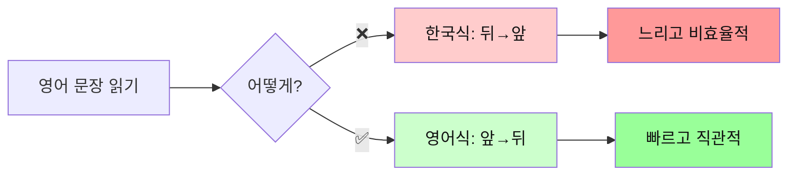

### 🔥 왜 직독직해가 필수인가?

| 한국식 해석 (❌) | 영어식 직독직해 (✅) |
|------------------|----------------------|
| 문장 끝까지 읽고 → 뒤에서 앞으로 | 읽으면서 → 바로바로 이해 |
| 머릿속에서 재배열 → 번역 | 영어 어순 그대로 이해 |
| 시간 2배 소요 | 실시간 이해 |
| 자막 못 따라감 | 자막 실시간 가능 |
| 논문 읽기 힘듦 | 논문 빠르게 읽기 |

---

### 💡 직독직해 핵심 3원칙

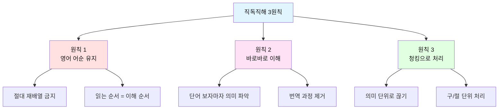

---

### 📖 실전 비교: 한국식 vs 영어식

#### 예문 1: 기초
```
문장: I love this movie.

❌ 한국식 (뒤→앞):
   this movie (이 영화를) → love (사랑한다) → I (나는)
   → "나는 이 영화를 사랑한다"
   
✅ 영어식 (앞→뒤):
   I (나는) → love (사랑해) → this movie (이 영화를)
   → "나는 / 사랑해 / 이 영화를"
```

#### 예문 2: 중급
```
문장: The book on the table is mine.

❌ 한국식:
   테이블 위의 책은 내 것이다 (전체 재배열)
   
✅ 영어식:
   그 책은 / 테이블 위의 / 내 것이다 (순서대로)
```

#### 예문 3: 고급
```
문장: She became a doctor after studying hard for many years.

❌ 한국식:
   오랜 기간 열심히 공부한 후에 그녀는 의사가 되었다
   (맨 뒤 years부터 시작해서 앞으로)
   
✅ 영어식:
   그녀는 / 되었다 / 의사가 / 공부한 후에 / 열심히 / 오랜 기간
   (읽는 순서 그대로)
```

---

### 🎓 직독직해 훈련법

#### 훈련 1: 주어+동사 즉시 파악
```
The students in my class study English every day.

1단계: 동사 찾기 → study
2단계: 주어 찾기 → students
3단계: 핵심 파악 → "학생들이 공부한다"
4단계: 수식어 추가 → "우리 반의 / 영어를 / 매일"
```

#### 훈련 2: 슬래시 끊어 읽기
```
I will buy / a new car / tomorrow.
나는 살 거야 / 새 차를 / 내일

She loves / reading books / in the morning.
그녀는 좋아해 / 책 읽는 것을 / 아침에

The movie / that I watched yesterday / was amazing.
그 영화는 / 내가 어제 본 / 놀라웠다
```

#### 훈련 3: 강제 직독직해
```
규칙: 절대 뒤로 돌아가지 않기!

연습 문장:
The researchers discovered a new method to treat the disease.

읽으면서 바로 이해:
The researchers → 연구자들은
discovered → 발견했다
a new method → 새로운 방법을
to treat → 치료하기 위한
the disease → 그 질병을
```

---

### 📊 직독직해 레벨별 목표

| 레벨 | 목표 | 방법 | 성공 기준 |
|------|------|------|-----------|
| **입문** | 주어+동사 바로 파악 | 짧은 문장 연습 | 5단어 문장 즉시 이해 |
| **초급** | 3-4개 덩어리로 끊어 읽기 | 청킹 연습 | 10단어 문장 빠르게 이해 |
| **중급** | 실시간 자막 따라가기 | 자막 연습 | 2-3초 내 이해 |
| **고급** | 논문 빠른 독해 | 복잡한 문장 연습 | 재배열 없이 1회독으로 이해 |

---

## 📚 학습 목표
- 영어 문장의 5형식 완벽 이해
- 문장 구조를 빠르게 파악하는 능력
- 기본 시제 및 문법 요소 인식
- **직독직해로 영어식 사고 훈련** ⭐⭐⭐

## 🎯 독해의 핵심: 문장 구조 파악

### 왜 문장 구조가 중요한가?

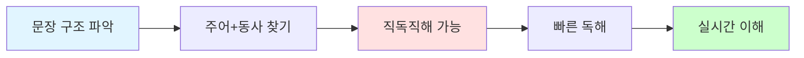

| 단계 | 행동 | 효과 |
|------|------|------|
| 1 | 문장 구조를 안다 | → 빠르게 읽을 수 있다 |
| 2 | 주어와 동사를 찾는다 | → 문장의 뼈대를 안다 |
| 3 | 핵심 요소만 파악한다 | → 전체 의미를 이해한다 |
| 4 | 영어 어순으로 이해한다 | → 직독직해가 된다 |

## 📖 영어 5형식 완전 정복

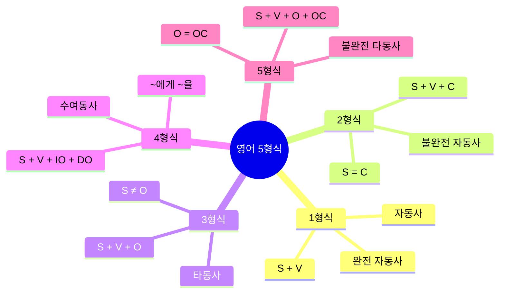

### 📊 5형식 비교표

| 형식 | 구조 | 특징 | 동사 종류 | 관계 | 예문 |
|------|------|------|-----------|------|------|
| **1형식** | S + V | 주어와 동사만 | 완전 자동사 | - | Birds fly. |
| **2형식** | S + V + C | 보어 필요 | 불완전 자동사 | S = C | She is happy. |
| **3형식** | S + V + O | 목적어 필요 | 타동사 | S ≠ O | I love you. |
| **4형식** | S + V + IO + DO | 두 개의 목적어 | 수여동사 | IO에게 DO를 | He gave me a gift. |
| **5형식** | S + V + O + OC | 목적격보어 필요 | 불완전 타동사 | O = OC | They call me Tom. |

---

### 1형식: S + V (주어 + 동사)
**패턴**: 주어가 무언가를 한다

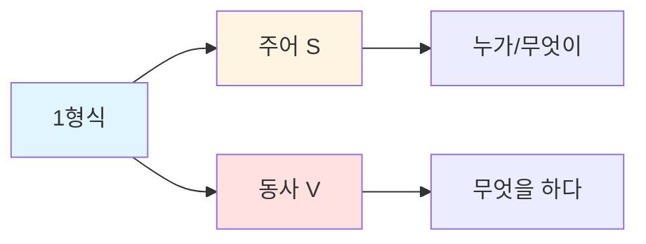

**예문 분석**:
```
The sun rises.
└─S──┘ └V┘

해가 뜬다.
```

**독해 포인트**:
- 가장 간단한 구조
- 주어(S)와 동사(V)만 있으면 완성
- 동사는 자동사

**자주 나오는 1형식 동사**:

| 동사 | 의미 | 예문 |
|------|------|------|
| appear | 나타나다 | A star appeared. (별이 나타났다) |
| exist | 존재하다 | God exists. (신은 존재한다) |
| happen | 발생하다 | Accidents happen. (사고는 일어난다) |
| occur | 일어나다 | Changes occur. (변화가 일어난다) |
| rise | 오르다 | The sun rises. (해가 뜬다) |
| fall | 떨어지다 | Leaves fall. (나뭇잎이 떨어진다) |
| live | 살다 | We live. (우리는 산다) |
| die | 죽다 | All things die. (모든 것은 죽는다) |
| work | 작동하다 | It works. (그것은 작동한다) |
| smile | 웃다 | She smiled. (그녀는 웃었다) |

**연습 문장**:
```
1. Birds fly. (새들이 날다)
2. Time passes quickly. (시간이 빠르게 지나다)
3. The accident happened yesterday. (사고가 어제 발생했다)
```

---

### 2형식: S + V + C (주어 + 동사 + 보어)
**패턴**: 주어는 ~이다/~하다

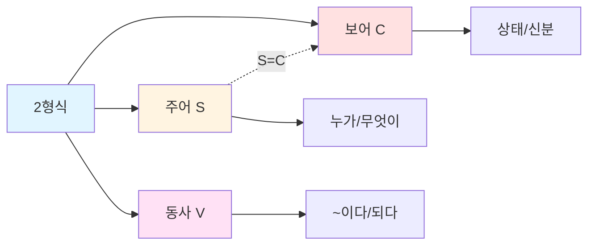

**예문 분석**:
```
She is a teacher.
└S┘ └V┘ └──C───┘
 │   │     │
 │   │     └── 선생님 (보어)
 │   └── ~이다 (동사)
 └── 그녀 (주어)

그녀는 선생님이다.
S = C (주어와 보어가 같은 사람)
```

**독해 포인트**:
- S = C 관계 (주어와 보어가 같은 대상)
- 동사는 be동사 또는 감각동사
- 보어는 명사 또는 형용사

**자주 나오는 2형식 동사**:

| 종류 | 동사 | 의미 | 예문 |
|------|------|------|------|
| **be동사** | am/is/are<br/>was/were | ~이다 | I am happy. (나는 행복하다) |
| **감각동사** | look | ~처럼 보이다 | You look tired. (너는 피곤해 보인다) |
| | sound | ~처럼 들리다 | It sounds good. (좋게 들린다) |
| | smell | ~냄새가 나다 | It smells nice. (좋은 냄새가 난다) |
| | taste | ~맛이 나다 | It tastes sweet. (달콤한 맛이 난다) |
| | feel | ~느껴지다 | I feel great. (기분이 좋다) |
| **상태동사** | become | ~이 되다 | He became angry. (그는 화났다) |
| | get | ~이 되다 | She got sick. (그녀는 아팠다) |
| | grow | ~이 되다 | They grew tired. (그들은 지쳤다) |
| | turn | ~이 되다 | Leaves turn red. (나뭇잎이 빨개진다) |
| | remain | ~로 남다 | He remained silent. (그는 침묵했다) |
| | stay | ~로 있다 | Stay calm. (침착해라) |
| | keep | ~를 유지하다 | Keep quiet. (조용히 해라) |

**연습 문장**:
```
1. He looks tired. (그는 피곤해 보인다)
   └S┘ └─V──┘ └C─┘

2. The soup smells delicious. (수프가 맛있는 냄새가 난다)
   └───S────┘ └──V───┘ └───C────┘

3. She became a doctor. (그녀는 의사가 되었다)
   └S┘ └──V───┘ └──C───┘
```

---

### 3형식: S + V + O (주어 + 동사 + 목적어)
**패턴**: 주어가 ~을/를 하다

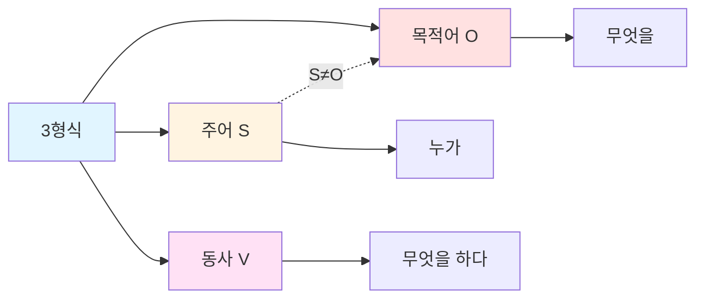

**예문 분석**:
```
I love coffee.
└S┘ └V─┘ └─O──┘
 │   │     │
 │   │     └── 커피 (목적어)
 │   └── 사랑하다 (동사)
 └── 나 (주어)

나는 커피를 사랑한다.
S ≠ O (주어와 목적어가 다른 대상)
```

**독해 포인트**:
- S ≠ O (주어와 목적어가 다른 대상)
- 동사는 타동사
- 목적어는 명사 또는 명사구

**자주 나오는 3형식 동사**:

| 동사 | 의미 | 예문 | 목적어 종류 |
|------|------|------|-------------|
| have | 가지다 | I have a car. | 사물 |
| make | 만들다 | She makes cakes. | 사물 |
| take | 가져가다 | Take this. | 사물 |
| get | 얻다 | He got a job. | 사물/기회 |
| want | 원하다 | I want water. | 사물/행동 |
| need | 필요하다 | We need time. | 사물/시간 |
| like | 좋아하다 | They like music. | 사물/활동 |
| love | 사랑하다 | I love you. | 사람/사물 |
| know | 알다 | She knows me. | 사람/정보 |
| see | 보다 | I see him. | 사람/사물 |
| hear | 듣다 | I hear you. | 사람/소리 |
| read | 읽다 | He reads books. | 사물 |
| write | 쓰다 | She writes letters. | 사물 |
| study | 공부하다 | They study English. | 과목 |

**연습 문장**:
```
1. She reads books every day. (그녀는 매일 책을 읽는다)
   └S┘ └─V──┘ └─O──┘

2. They speak English fluently. (그들은 영어를 유창하게 말한다)
   └─S─┘ └─V──┘ └──O───┘

3. We need more time. (우리는 더 많은 시간이 필요하다)
   └S┘ └─V─┘ └───O───┘
```

---

### 4형식: S + V + IO + DO (주어 + 동사 + 간접목적어 + 직접목적어)
**패턴**: 주어가 ~에게 ~을/를 하다

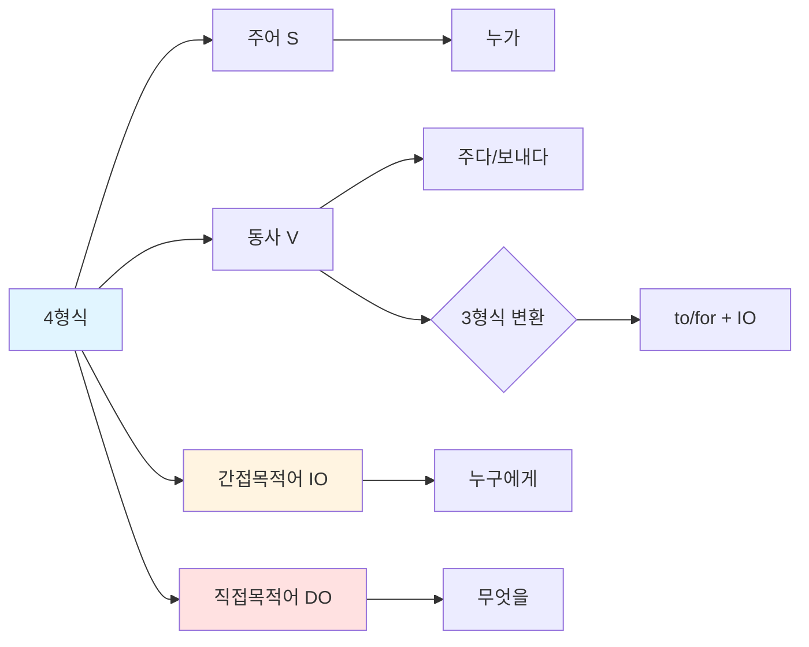

**예문 분석**:
```
He gave me a gift.
└S┘ └V─┘ └IO┘ └─DO──┘
 │   │    │      │
 │   │    │      └── 선물 (직접목적어: 무엇을)
 │   │    └── 나에게 (간접목적어: 누구에게)
 │   └── 주다 (동사)
 └── 그 (주어)

그는 나에게 선물을 주었다.

3형식 변환:
He gave a gift to me.
```

**독해 포인트**:
- IO (누구에게) + DO (무엇을)
- 전치사 to/for로 변환 가능
- 간접목적어는 사람, 직접목적어는 사물

**자주 나오는 4형식 동사**:

| 동사 | 의미 | 4형식 | 3형식 변환 | 전치사 |
|------|------|-------|------------|--------|
| give | 주다 | give IO DO | give DO to IO | to |
| send | 보내다 | send IO DO | send DO to IO | to |
| show | 보여주다 | show IO DO | show DO to IO | to |
| teach | 가르치다 | teach IO DO | teach DO to IO | to |
| tell | 말하다 | tell IO DO | tell DO to IO | to |
| lend | 빌려주다 | lend IO DO | lend DO to IO | to |
| pass | 건네다 | pass IO DO | pass DO to IO | to |
| bring | 가져다주다 | bring IO DO | bring DO to IO | to |
| buy | 사다 | buy IO DO | buy DO for IO | for |
| make | 만들다 | make IO DO | make DO for IO | for |
| cook | 요리하다 | cook IO DO | cook DO for IO | for |
| get | 가져다주다 | get IO DO | get DO for IO | for |

**전치사 구분법**:
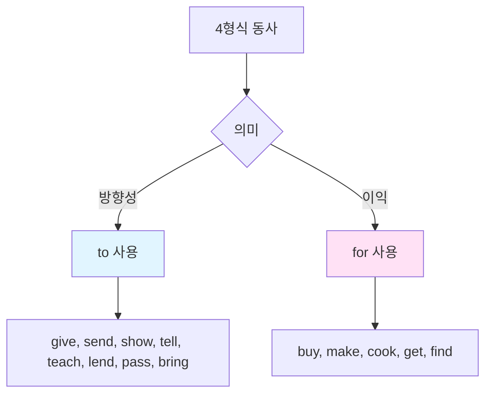

**연습 문장**:
```
1. She sent me an email. (그녀는 나에게 이메일을 보냈다)
   └S┘ └V──┘ └IO┘ └──DO──┘
   = She sent an email to me.

2. I bought her flowers. (나는 그녀에게 꽃을 샀다)
   └S┘ └─V──┘ └IO┘ └─DO──┘
   = I bought flowers for her.

3. He told us the truth. (그는 우리에게 진실을 말했다)
   └S┘ └V─┘ └IO┘ └──DO──┘
   = He told the truth to us.
```

---

### 5형식: S + V + O + OC (주어 + 동사 + 목적어 + 목적격보어)
**패턴**: 주어가 목적어를 ~하게 하다/~라고 부르다

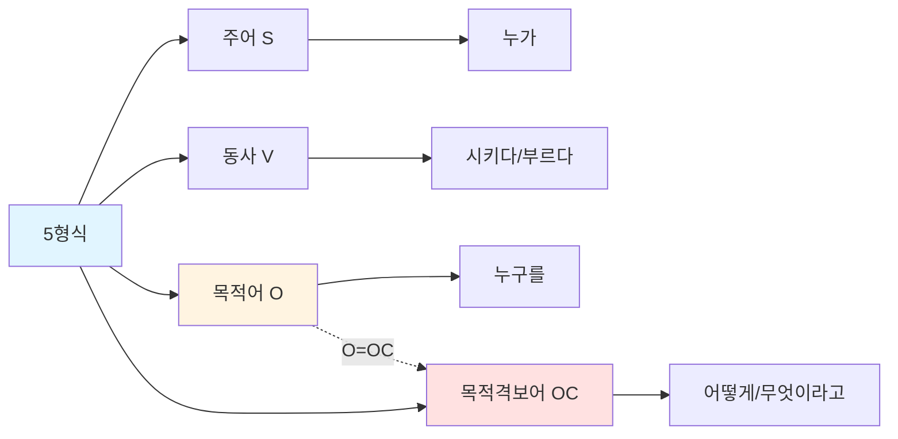

**예문 분석**:
```
They call me Tom.
└─S─┘ └V─┘ └O┘ └OC┘
  │     │    │    │
  │     │    │    └── 톰 (목적격보어)
  │     │    └── 나를 (목적어)
  │     └── 부르다 (동사)
  └── 그들 (주어)

그들은 나를 톰이라고 부른다.
O = OC (목적어와 목적격보어가 같은 사람)
```

**독해 포인트**:
- O = OC 관계 (목적어와 목적격보어가 같은 대상)
- 사역동사, 지각동사 포함
- 목적격보어는 명사, 형용사, to부정사, 원형부정사

**자주 나오는 5형식 동사**:

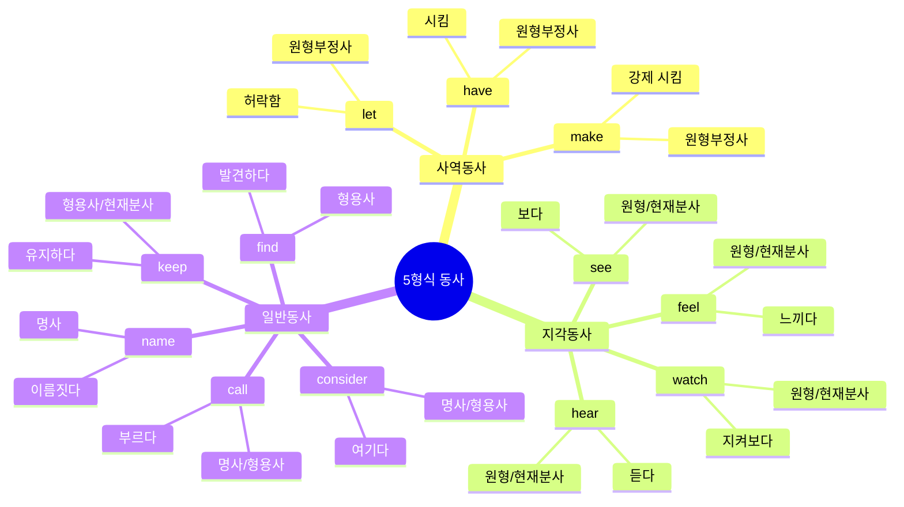

| 종류 | 동사 | 의미 | 목적격보어 | 예문 |
|------|------|------|------------|------|
| **사역동사** | make | 시키다 | 원형부정사 | He made me laugh. |
| | let | 허락하다 | 원형부정사 | Let me go. |
| | have | 시키다 | 원형부정사 | I'll have him call you. |
| **지각동사** | see | 보다 | 원형/ing | I saw him run/running. |
| | watch | 지켜보다 | 원형/ing | We watched them play/playing. |
| | hear | 듣다 | 원형/ing | I heard her sing/singing. |
| | feel | 느끼다 | 원형/ing | I felt it move/moving. |
| **일반동사** | call | 부르다 | 명사/형용사 | They call me Tom. |
| | name | 이름짓다 | 명사 | They named him John. |
| | keep | 유지하다 | 형용사 | Keep it clean. |
| | find | 발견하다 | 형용사 | I found it useful. |
| | consider | 여기다 | 명사/형용사 | I consider her smart. |
| | think | 생각하다 | 명사/형용사 | I think him honest. |
| | believe | 믿다 | 명사/형용사 | I believe it true. |

**연습 문장**:
```
1. She made me happy. (그녀는 나를 행복하게 만들었다)
   └S┘ └─V─┘ └O┘ └─OC─┘

2. I saw him running. (나는 그가 달리는 것을 봤다)
   └S┘ └V┘ └O─┘ └─OC──┘

3. We consider her talented. (우리는 그녀를 재능있다고 여긴다)
   └S┘ └──V────┘ └O─┘ └──OC───┘

4. Let me help you. (내가 널 돕게 해줘)
   └V┘ └O┘ └─OC──┘
```

---

## 🎯 독해 실전 연습: 문장 구조 빠르게 파악하기

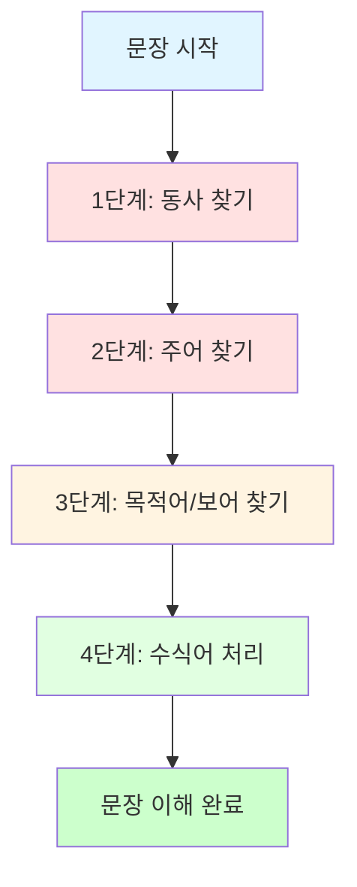

### 연습 1: 주어와 동사 먼저 찾기

```
The beautiful flowers in the garden bloom every spring.
└────────주어(S)─────────┘ └─동사(V)─┘

핵심: flowers bloom (꽃이 핀다)
```

**독해 전략 단계표**:

| 단계 | 행동 | 찾는 요소 | 결과 |
|------|------|-----------|------|
| 1단계 | 동사 찾기 | bloom | 동사 발견 |
| 2단계 | 주어 찾기 | flowers | 핵심 주어 발견 |
| 3단계 | 수식어 제거 | beautiful, in the garden | 핵심만 남김 |
| 4단계 | 의미 파악 | flowers bloom | 꽃이 핀다 |
| 5단계 | 수식어 추가 | every spring | 매년 봄마다 |

### 연습 2: 긴 문장 끊어 읽기

```
The research team / conducted a comprehensive study / 
on climate change / last year.

연구팀이 / 포괄적인 연구를 수행했다 / 
기후 변화에 대한 / 작년에
```

**청킹 전략**:
- 의미 단위로 끊어 읽기
- 전치사구 단위로 구분
- 주어-동사 먼저 파악

### 연습 3: 복잡한 문장 단순화하기

**원문**:
```
The students who studied hard passed the difficult exam.
```

**단순화 과정**:
```
1단계: 주어와 동사 찾기
   The students passed the exam.
   (학생들이 시험을 통과했다)

2단계: 관계사절 추가
   who studied hard (열심히 공부한)

3단계: 수식어 추가
   the difficult exam (어려운 시험)
```

---

## 📝 기초 시제 패턴

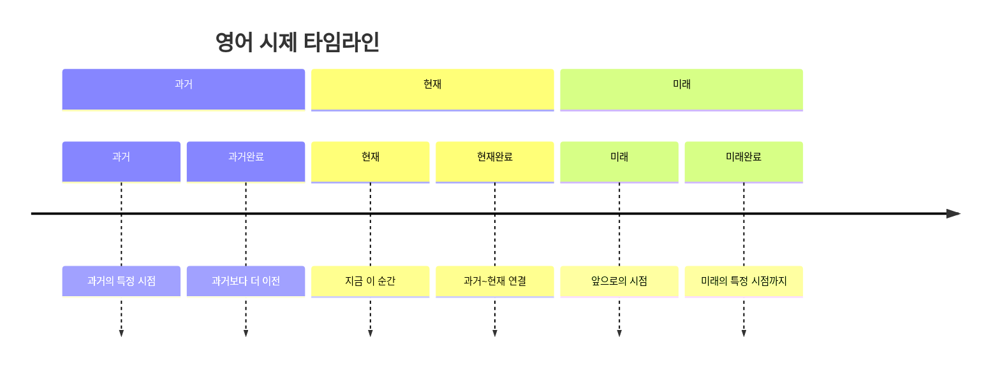

### 📊 시제 비교표

| 시제 | 형태 | 용법 | 시간 표현 | 예문 |
|------|------|------|-----------|------|
| **현재** | V/V-s | 현재 상태/습관/사실 | now, every day, always | I work here. |
| **과거** | V-ed | 과거 사실/완료 | yesterday, ago, last | I worked there. |
| **미래** | will V | 미래 계획/예정 | tomorrow, next, soon | I will work. |
| **현재진행** | am/is/are V-ing | 지금 진행 중 | now, at the moment | I am working. |
| **과거진행** | was/were V-ing | 과거 진행 중 | at that time, then | I was working. |
| **현재완료** | have/has p.p. | 과거~현재/경험/완료 | ever, never, just, yet | I have worked. |

---

### 현재 시제 (Present Tense)

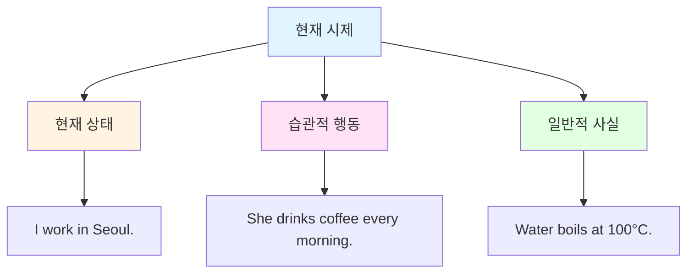

| 용법 | 설명 | 시간 표현 | 예문 |
|------|------|-----------|------|
| 현재 상태 | 지금의 상태 | now, currently | I work in Seoul. |
| 습관적 행동 | 반복되는 행동 | every day/week/year, always, usually | She drinks coffee every morning. |
| 일반적 사실 | 변하지 않는 진리 | - | Water boils at 100°C. |

---

### 과거 시제 (Past Tense)

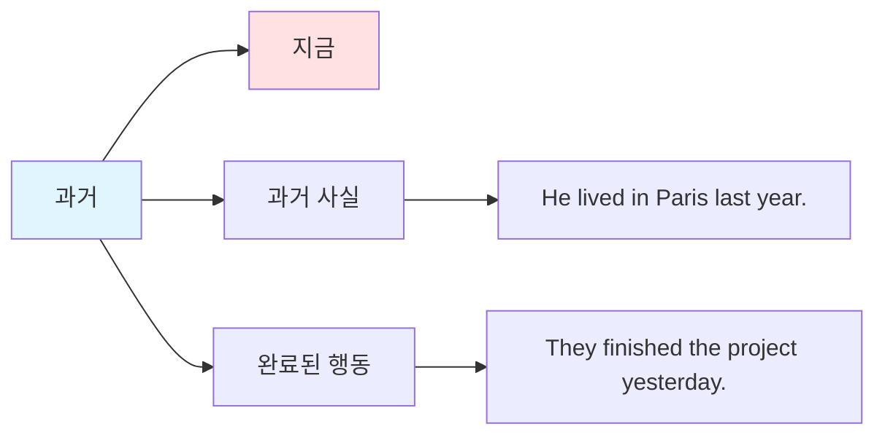

| 용법 | 설명 | 시간 표현 | 예문 |
|------|------|-----------|------|
| 과거 사실 | 과거의 상태 | yesterday, ago, last week/month/year | He lived in Paris last year. |
| 완료된 행동 | 과거에 끝난 일 | in 2020, when I was young | They finished the project yesterday. |

---

### 미래 시제 (Future Tense)

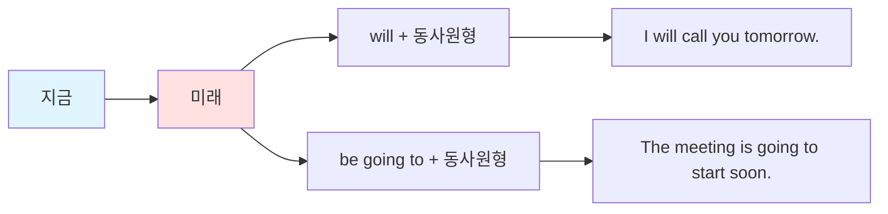

| 형태 | 용법 | 시간 표현 | 예문 |
|------|------|-----------|------|
| will V | 즉흥적 결정/예측 | tomorrow, next week, soon | I will call you tomorrow. |
| be going to V | 계획된 일/확실한 예정 | tonight, this weekend | The meeting is going to start soon. |

---

### 현재완료 (Present Perfect)

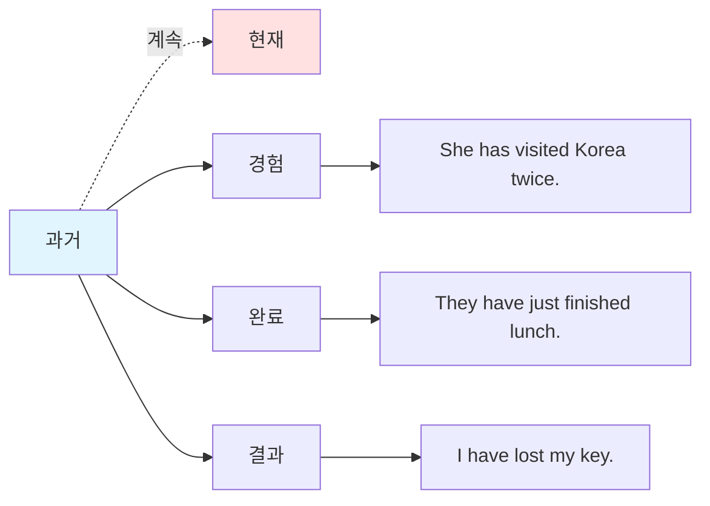

| 용법 | 설명 | 시간 표현 | 예문 |
|------|------|-----------|------|
| 계속 | 과거~현재 지속 | for, since | I have lived here for 5 years. |
| 경험 | 과거의 경험 | ever, never, once, twice | She has visited Korea twice. |
| 완료 | 방금 완료된 일 | just, already, yet | They have just finished lunch. |
| 결과 | 현재에 영향 | - | I have lost my key. (지금 없음) |

---

## 🔍 독해 필수 접속사

### 등위접속사 (and, but, or, so)

```
1. I like coffee and tea. (나는 커피와 차를 좋아한다)
   → 나열

2. He is smart but lazy. (그는 똑똑하지만 게으르다)
   → 대조

3. Study hard or you will fail. (열심히 공부해라, 그렇지 않으면 실패할 것이다)
   → 선택

4. It was raining, so I stayed home. (비가 와서 나는 집에 있었다)
   → 결과
```

### 종속접속사 (because, if, when, although)

```
1. I stayed home because it was raining. 
   (비가 와서 나는 집에 있었다)
   → 이유

2. If it rains tomorrow, I will stay home.
   (내일 비가 오면, 나는 집에 있을 것이다)
   → 조건

3. When I arrived, they were waiting.
   (내가 도착했을 때, 그들은 기다리고 있었다)
   → 시간

4. Although he is young, he is very mature.
   (그는 어리지만, 매우 성숙하다)
   → 양보
```

---

## 💡 독해 속도 향상 팁

### 1. 주어와 동사 즉시 파악
```
❌ 단어 하나씩 읽기: The / beautiful / girl / in / the / red / dress / smiled.
✅ 핵심 먼저 파악: The girl smiled. (소녀가 웃었다)
```

### 2. 수식어는 나중에
```
주문장: She bought a car.
수식: expensive (비싼), new (새로운), German (독일제)
완성: She bought an expensive new German car.
```

### 3. 전치사구 단위로 끊기
```
The book / on the table / is mine.
그 책은 / 테이블 위의 / 내 것이다
```

---

## 🎓 실전 연습 문제

### 문제 1: 형식 판별하기

다음 문장의 형식을 말하세요:

```
1. The flowers smell sweet.
2. She gave me a present.
3. I saw a movie yesterday.
4. He is a student.
5. They made him captain.
```

**정답**:
```
1. 2형식 (S + V + C)
2. 4형식 (S + V + IO + DO)
3. 3형식 (S + V + O)
4. 2형식 (S + V + C)
5. 5형식 (S + V + O + OC)
```

### 문제 2: 주어와 동사 찾기

다음 문장에서 주어와 동사를 찾으세요:

```
1. The students in my class study English every day.
2. My best friend from high school works at Google now.
3. The beautiful sunset over the ocean amazed everyone.
```

**정답**:
```
1. 주어: The students / 동사: study
2. 주어: My best friend / 동사: works
3. 주어: The beautiful sunset / 동사: amazed
```

---

## 📚 다음 단계

기초 독해 패턴을 마스터했다면:
1. `02_자막_독해_패턴.md` - 자막 특화 패턴 학습
2. `05_독해_필수_문법.md` - 심화 문법 학습
3. 매일 영어 문장 10개씩 구조 분석 연습

---

💪 **핵심 요약**
- 5형식 완벽 이해
- 주어와 동사 빠르게 찾기
- 의미 단위로 끊어 읽기
- 수식어는 나중에 처리

