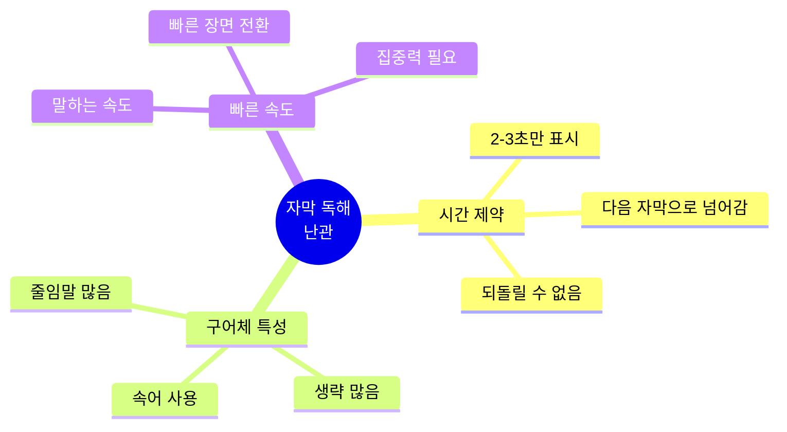
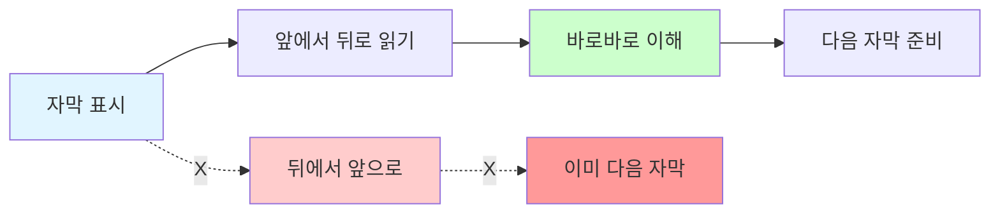
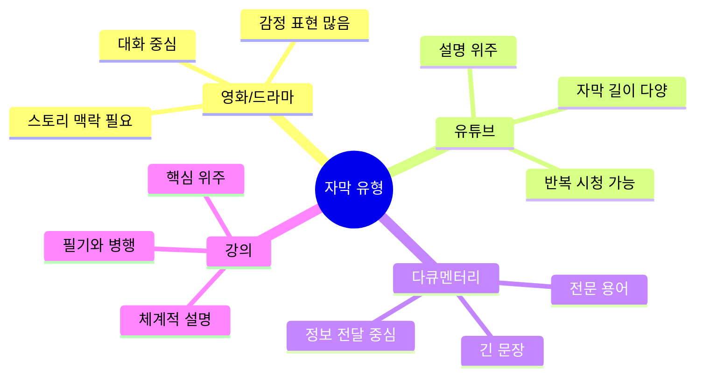
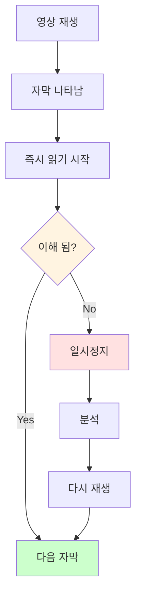
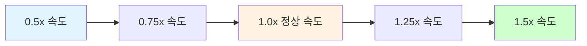

# 자막 독해 패턴 - 실시간 이해 마스터

## 🎬 자막 독해의 특징

### 자막 독해가 어려운 이유



| 특징 | 설명 | 대응 전략 |
|------|------|-----------|
| **짧은 시간** | 2-3초 내 사라짐 | 직독직해 필수 |
| **구어체** | 캐주얼한 표현 | 패턴 익히기 |
| **생략 많음** | 주어/be동사 생략 | 문맥으로 보완 |
| **빠른 전환** | 장면마다 자막 변경 | 핵심만 파악 |

---

## ⚡ 자막 독해 3초 법칙

```mermaid
gantt
    title 자막 3초 완벽 공략
    dateFormat  s
    axisFormat  %Ss
    
    section 0-1초
    주어+동사 즉시 파악    :a1, 0, 1s
    
    section 1-2초
    핵심 단어 인식    :a2, 1, 1s
    
    section 2-3초
    전체 의미 통합    :a3, 2, 1s
```



### 3초 법칙 상세

| 시간 | 단계 | 목표 | 방법 | 예시 |
|------|------|------|------|------|
| **0-1초** | 주어+동사 파악 | 문장 뼈대 | S+V 즉시 찾기 | I think... |
| **1-2초** | 핵심 단어 인식 | 주요 의미 | 명사/동사 중심 | ...you're right |
| **2-3초** | 전체 의미 통합 | 완전 이해 | 수식어 통합 | I think you're right |

---

## 🎯 자막 독해 핵심 전략

### 전략 1: 직독직해 (가장 중요!)



**예문 비교**:
```
자막: I can't believe he did that.

❌ 한국식 (실패):
   that을 보고 → did를 찾고 → he를 찾고 → believe를 찾고...
   → 5-7초 소요 → 이미 다음 자막 ❌
   
✅ 영어식 (성공):
   I → can't believe → he did → that
   "나는 / 믿을 수 없어 / 그가 했다는 게 / 그걸"
   → 2-3초 완료 → 실시간 이해 ✅
```

---

### 전략 2: 생략 복원 능력

자막에서는 많은 것이 생략됩니다!

| 생략 유형 | 원문 | 자막 표현 | 복원 방법 |
|-----------|------|-----------|-----------|
| **주어 생략** | Are you ready? | Ready? | 문맥으로 You 추가 |
| **be동사 생략** | Are you going? | Going? | 문맥으로 Are you 추가 |
| **조동사 생략** | Do you want to go? | Wanna go? | want to = wanna |
| **대명사 생략** | I don't know. | Don't know. | 화자가 I |

**예문 연습**:
```
1. "Hungry?" 
   → (Are you) hungry?
   → 너 배고파?

2. "Got it."
   → (I have) got it.
   → 알았어.

3. "Going home?"
   → (Are you) going home?
   → 집에 가?

4. "Sounds good."
   → (That) sounds good.
   → 좋은데.
```

---

### 전략 3: 청킹으로 빠르게 처리


**예문**:
```
자막: I'm gonna meet my friends at the cafe this afternoon.

청킹:
[I'm gonna meet] / [my friends] / [at the cafe] / [this afternoon]
나는 만날 거야 / 내 친구들을 / 카페에서 / 오늘 오후에

각 청크를 보자마자 이해 → 빠른 독해!
```

---

## 📚 자막 필수 줄임말 패턴

### 일상 대화 줄임말

| 정식 표현 | 줄임말 | 발음 | 의미 | 예문 |
|-----------|--------|------|------|------|
| want to | wanna | 워너 | ~하고 싶다 | I wanna go. |
| going to | gonna | 거너 | ~할 거다 | I'm gonna do it. |
| got to | gotta | 가러 | ~해야 한다 | I gotta go. |
| out of | outta | 아우러 | ~에서 나와 | Get outta here. |
| kind of | kinda | 카인더 | 좀, 약간 | It's kinda weird. |
| sort of | sorta | 소러 | 좀, 약간 | I'm sorta tired. |
| a lot of | lotta | 라러 | 많은 | A lotta people. |
| don't know | dunno | 더노 | 모르겠어 | I dunno. |
| let me | lemme | 레미 | 내가 ~할게 | Lemme see. |
| give me | gimme | 기미 | 나한테 줘 | Gimme that. |

### 의문문 줄임말

| 정식 표현 | 줄임말 | 예문 |
|-----------|--------|------|
| What are you | Whatcha | Whatcha doing? |
| What do you | Whaddya | Whaddya think? |
| What did you | Whaddid | Whaddid you say? |
| How are you | Howya | Howya doing? |
| Did you | Didja | Didja see that? |
| Would you | Wouldja | Wouldja help me? |
| Don't you | Dontcha | Dontcha know? |

---

## 🎬 자막 유형별 전략



### 유형별 대응법

| 유형 | 특징 | 독해 전략 | 난이도 |
|------|------|-----------|--------|
| **영화/드라마** | 빠른 대화, 생략 많음 | 3초 법칙, 문맥 활용 | ⭐⭐⭐⭐ |
| **유튜브** | 다양한 주제, 재생 가능 | 반복 학습, 속도 조절 | ⭐⭐⭐ |
| **다큐멘터리** | 전문 용어, 긴 문장 | 청킹, 핵심 단어 파악 | ⭐⭐⭐⭐ |
| **강의** | 체계적, 이해 중심 | 필기, 구조 파악 | ⭐⭐ |

---

## 💬 자막 패턴 200선

### 1. 인사/안부

| 자막 | 직독직해 | 의미 |
|------|----------|------|
| How's it going? | 어때 / 가는 게? | 어떻게 지내? |
| What's up? | 뭐야 / 올라온 게? | 무슨 일이야? |
| Long time no see. | 오랜 시간 / 안 봤네 | 오랜만이야 |
| How've you been? | 어땠어 / 너는 / 지냈던 게? | 어떻게 지냈어? |

### 2. 동의/반대

| 자막 | 직독직해 | 패턴 |
|------|----------|------|
| I totally agree. | 나는 / 완전히 / 동의해 | 완전 동의 |
| I don't think so. | 나는 / 생각 안 해 / 그렇게 | 그렇게 생각 안 함 |
| You're absolutely right. | 너는 / 절대적으로 / 맞아 | 네 말이 완전 맞아 |
| I'm not sure about that. | 나는 / 확신 못 해 / 그것에 대해 | 잘 모르겠는데 |

### 3. 감정 표현

| 자막 | 직독직해 | 상황 |
|------|----------|------|
| I can't believe it! | 나는 / 믿을 수 없어 / 그걸! | 놀라움 |
| That's amazing! | 그건 / 놀라워! | 감탄 |
| I'm so sorry. | 나는 / 너무 / 미안해 | 사과 |
| I'm really excited. | 나는 / 정말 / 흥분돼 | 기대 |

### 4. 요청/제안

| 자막 | 직독직해 | 용도 |
|------|----------|------|
| Could you help me? | ~할 수 있어 / 너는 / 도와줄 / 나를? | 정중한 요청 |
| Let me know. | 알려줘 / 나에게 | 정보 요청 |
| Why don't we...? | 왜 안 해 / 우리는...? | 제안 |
| How about...? | 어때...? | 제안 |

---

## 🎯 실전 자막 독해 훈련

### 훈련 1: 3초 타이머 훈련

```
준비물: 타이머, 자막 자료

방법:
1. 자막 문장 하나 선택
2. 타이머 3초 설정
3. 3초 안에 읽고 이해하기
4. 시간 내 이해 못 하면 반복

목표: 3초 안에 95% 이해
```

### 훈련 2: 실시간 자막 따라가기



### 훈련 3: 청킹 연습

```
자막: I think we should probably start working on the project soon.

단계 1: 슬래시로 끊기
I think / we should probably / start working / on the project / soon.

단계 2: 각 청크 바로 이해
나는 생각해 / 우리는 아마 해야 해 / 시작하는 걸 / 프로젝트를 / 곧

단계 3: 자연스럽게 연결
"나는 생각해 우리가 아마 시작해야 할 것 같아 프로젝트를 곧"
```

---

## 📊 자막 독해 레벨별 목표

| 레벨 | WPM<br/>(분당 단어) | 이해도 | 자막 유형 | 훈련 기간 |
|------|---------------------|--------|-----------|-----------|
| **입문** | 50-80 | 60% | 천천히 말하는 강의 | 1-2주 |
| **초급** | 80-120 | 70% | 유튜브 설명 영상 | 2-4주 |
| **중급** | 120-160 | 80% | 일반 드라마/영화 | 1-2개월 |
| **고급** | 160-200 | 90% | 빠른 대화, 코미디 | 3-6개월 |
| **마스터** | 200+ | 95%+ | 모든 유형 | 지속적 |

---

## 🎬 장르별 자막 공략법

### 로맨스/드라마

```
특징: 감정 표현, 일상 대화
핵심 패턴:
- I love you so much.
- I can't live without you.
- We need to talk.
- It's complicated.
```

### 액션/스릴러

```
특징: 짧고 강한 명령문
핵심 패턴:
- Get down!
- Watch out!
- We gotta go!
- Don't move!
```

### 코미디

```
특징: 말장난, 빠른 대화
핵심 패턴:
- You gotta be kidding me!
- That's hilarious!
- No way!
- Seriously?
```

### SF/판타지

```
특징: 전문 용어 많음
전략: 문맥으로 추론
- 모르는 단어 → 일단 넘어가기
- 스토리 흐름으로 이해
```

---

## 💡 자막 독해 향상 팁

### Tip 1: 속도 단계별 학습



### Tip 2: 반복 학습법

```
1회: 자막 보면서 시청 (이해도 60%)
2회: 자막 없이 시청 (이해도 40%)
3회: 자막 다시 보면서 (이해도 80%)
4회: 자막 없이 최종 (이해도 70%)
```

### Tip 3: 따라 말하기

```
자막 읽으면서 → 동시에 따라 말하기
효과: 속도 감각 향상, 발음 연습
```

---

## 🎯 일일 학습 계획

| 시간 | 활동 | 자료 | 목표 |
|------|------|------|------|
| **10분** | 워밍업 | 쉬운 유튜브 | 감 익히기 |
| **15분** | 집중 학습 | 드라마 1장면 | 반복 학습 |
| **10분** | 패턴 암기 | 줄임말 10개 | 패턴 익히기 |
| **10분** | 실전 연습 | 새로운 영상 | 적용하기 |

---

## 🚀 다음 단계

자막 독해를 마스터했다면:
- `03_논문_독해_패턴.md`: 학술 독해
- `04_고급_독해_전략.md`: 속독 마스터
- 매일 30분 자막 시청으로 실력 유지

---

💪 **핵심 정리**
1. 직독직해가 생명! (앞→뒤)
2. 3초 안에 이해하기
3. 생략 복원 능력
4. 청킹으로 빠르게
5. 매일 꾸준히 연습

