# 논문 독해 패턴 - 학술 자료 효율적 읽기

## 📑 논문 독해의 특징

### 논문 vs 일반 글

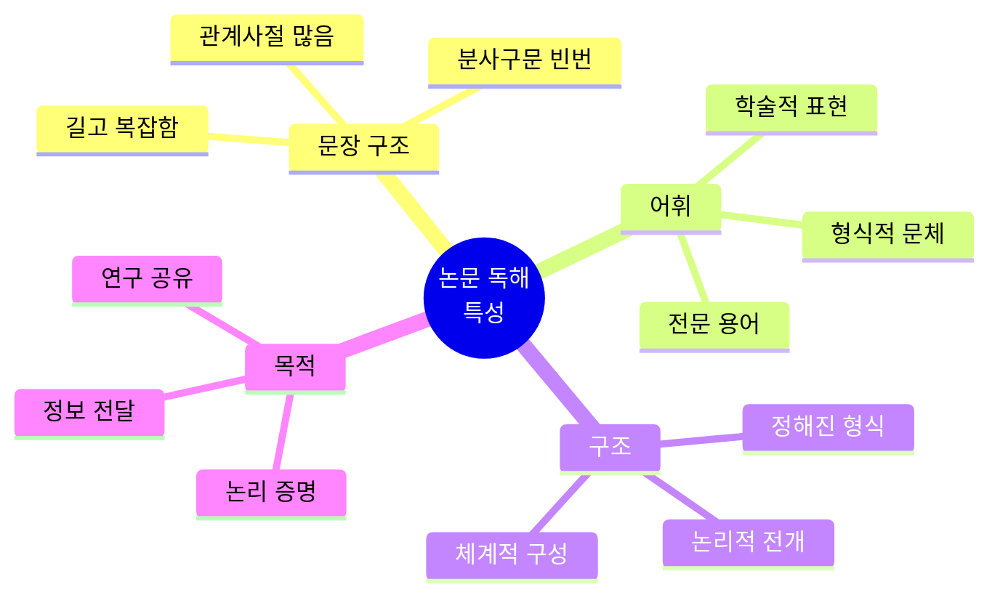

| 구분 | 일반 글 | 논문/학술 자료 |
|------|---------|----------------|
| **문장 길이** | 짧음 (10-15단어) | 김 (20-30단어 이상) |
| **문체** | 캐주얼 | 형식적 |
| **어휘** | 일상어 | 전문 용어 |
| **구조** | 자유로움 | 정형화됨 |
| **읽는 목적** | 즐거움, 정보 | 학습, 연구 |
| **독해 전략** | 전체 읽기 | 선택적 읽기 |

---

## 🎯 논문 독해 핵심 원칙

### 원칙 1: 직독직해 (논문에서 더욱 중요!) - 긴 문장이 12년 습관의 최대 적!

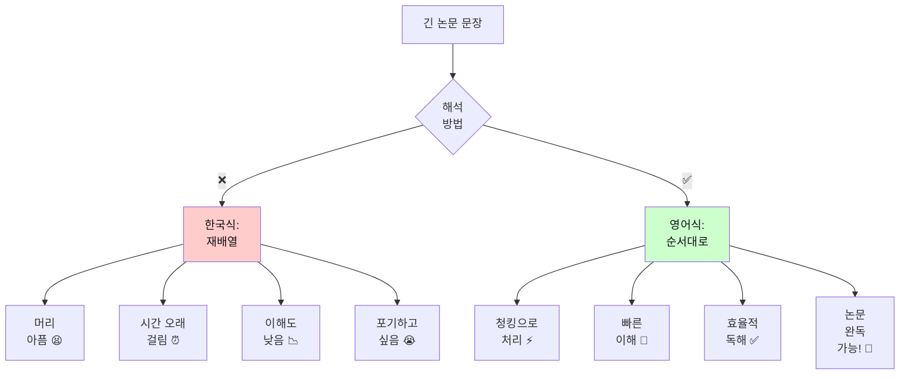

**🔥 12년 번역 습관자가 논문에서 고통받는 이유**

논문 문장 특징:
- 길이: 평균 25-35단어 (일반 글의 2배!)
- 구조: 복잡한 관계사, 분사구문, 전치사구 중첩
- 전문용어: 생소한 단어 많음

→ 번역으로는 **물리적으로 불가능!** 😱

**예문**: 논문에서 흔한 긴 문장 (32단어)
```
문장: 
The researchers conducted a comprehensive study to investigate 
the effects of climate change on agricultural productivity 
in developing countries over the past two decades.

❌ 한국식 번역 방식 (당신이 12년간 해온 방법):
1) decades 읽기 → "수십 년?"
2) two 보기 → "2?"
3) past 확인 → "지난?"
4) over 체크 → "~에 걸쳐?"
5) countries로 이동 → "나라들?"
6) developing 확인 → "개발도상?"
7) in으로 → "~의?"
8) productivity 읽기 → "생산성?"
9) agricultural 보기 → "농업?"
10) on으로 → "~에 대한?"
...계속 거꾸로 32개 단어...

⏱️ 소요 시간: 2-3분
😫 결과: 머리 아픔, 이해도 60%, 논문 포기

✅ 영어식 직독직해 (새로운 방식):
[The researchers] → 연구자들
[conducted a comprehensive study] → 포괄적 연구 수행
[to investigate the effects] → 영향 조사하려고
[of climate change] → 기후 변화의
[on agricultural productivity] → 농업 생산성에
[in developing countries] → 개발도상국에서
[over the past two decades] → 지난 20년간

⏱️ 소요 시간: 30-40초
😊 결과: 편안, 이해도 90%, 논문 계속 읽기!

📊 비교:
- 시간: 4-5배 절약
- 이해도: 1.5배 향상
- 스트레스: 10배 감소
- 완독 가능성: 100배 증가!
```

**💡 논문 직독직해의 핵심 비법:**

```
비법 1: 전문용어는 첫 번째만 정확히, 나머지는 "그것"
        "agricultural productivity" → 첫 번째: 정확히 이해
        두 번째부터: "그 생산성" 정도로만

비법 2: 전치사구 덩어리로!
        "in developing countries over the past two decades"
        → [개발도상국에서 지난 20년간] 한 덩어리!

비법 3: 관계사는 [ ] 묶고 나중에
        The study [which was conducted...] is important.
        → 일단 "The study is important" 파악!

비법 4: 완벽한 이해 < 80% 이해 + 계속 읽기
        한 문장에 3분 쓰지 말고, 30초에 80% 이해하고 넘어가세요!
```

**🎯 논문 독해 시 번역 습관자의 흔한 실수:**

```
실수 1: 한 문장을 완벽히 이해하려고 5분 씀
       → 결과: 1페이지에 30분, 10페이지 포기

실수 2: 모르는 단어마다 사전 찾기
       → 결과: 흐름 끊김, 전체 못 봄

실수 3: 완벽한 한국어 문장 만들기
       → 결과: 시간 낭비, 독해 아닌 번역 작업

올바른 방법:
       → 80% 이해로 빠르게 진행
       → 맥락으로 모르는 단어 추론
       → 어색한 이해여도 OK, 흐름 유지!
```

---

### 원칙 2: 전체가 아닌 핵심만 읽기

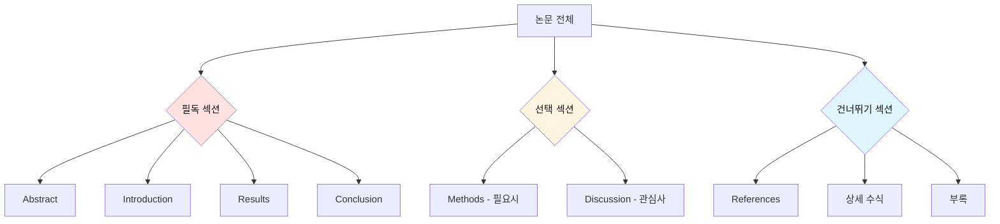

---

## 📊 논문 구조별 독해 전략

### 논문 구조 완전 분석

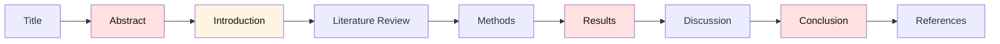

| 섹션 | 목적 | 읽는 방법 | 시간 | 중요도 |
|------|------|-----------|------|--------|
| **Title** | 주제 파악 | 정독 | 10초 | ⭐⭐⭐⭐⭐ |
| **Abstract** | 전체 요약 | 정독 (필수) | 2-3분 | ⭐⭐⭐⭐⭐ |
| **Introduction** | 배경/목적 | 빠르게 읽기 | 3-5분 | ⭐⭐⭐⭐ |
| **Literature Review** | 선행 연구 | 훑어보기 | 2-3분 | ⭐⭐⭐ |
| **Methods** | 방법론 | 건너뛰기 (필요시만) | 1-2분 | ⭐⭐ |
| **Results** | 연구 결과 | 정독 (핵심) | 5-10분 | ⭐⭐⭐⭐⭐ |
| **Discussion** | 결과 해석 | 정독 | 3-5분 | ⭐⭐⭐⭐ |
| **Conclusion** | 결론 | 정독 (필수) | 2-3분 | ⭐⭐⭐⭐⭐ |
| **References** | 참고 문헌 | 건너뛰기 | - | ⭐ |

---

## 📖 섹션별 독해 가이드

### 1. Abstract (초록) - 가장 중요!

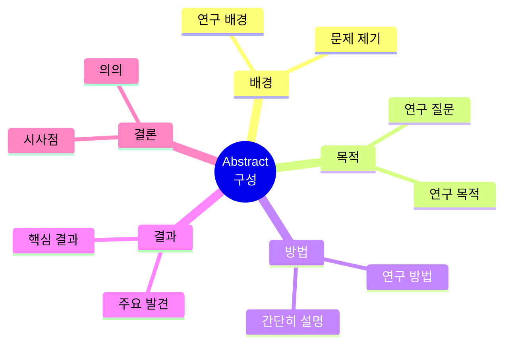

**Abstract 읽기 전략**:
1. **첫 문장**: 연구 배경 (Background)
2. **중간 부분**: 연구 방법 및 목적 (Method & Purpose)
3. **마지막 부분**: 주요 결과 및 결론 (Results & Conclusion)

**예문 및 직독직해**:
```
This study investigates the impact of social media usage 
on mental health among adolescents.

직독직해:
이 연구는 / 조사한다 / 그 영향을 / 소셜 미디어 사용의 / 
정신 건강에 / 청소년들 사이에서

핵심 파악: "소셜 미디어가 청소년 정신 건강에 미치는 영향 연구"
```

---

### 2. Introduction (서론)

**읽기 전략**: 첫 단락 + 마지막 단락 집중

| 위치 | 내용 | 읽는 방법 |
|------|------|-----------|
| **첫 단락** | 연구 배경, 문제 제기 | 정독 |
| **중간 단락** | 선행 연구, 이론적 배경 | 훑어보기 |
| **마지막 단락** | 연구 목적, 연구 질문 | 정독 |

**핵심 표현 패턴**:
```
- This paper aims to... (이 논문은 ~을 목표로 한다)
- The purpose of this study is to... (이 연구의 목적은 ~이다)
- We investigate... (우리는 ~을 조사한다)
- This research focuses on... (이 연구는 ~에 초점을 맞춘다)
```

---

### 3. Methods (방법론)

**읽기 전략**: 건너뛰거나 빠르게 훑기

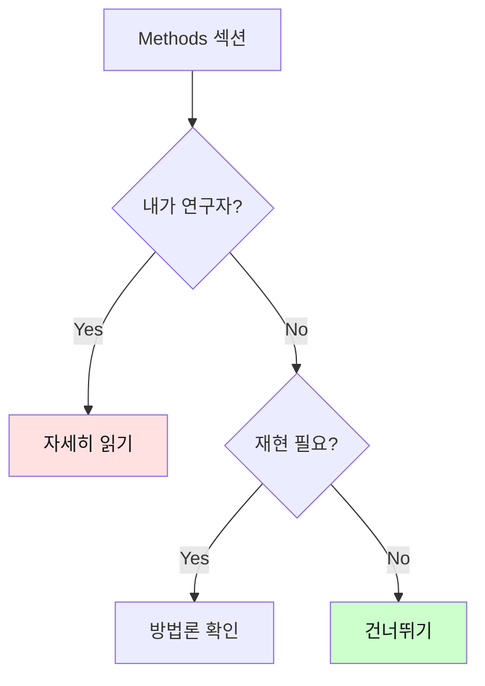

**건너뛰어도 되는 경우**:
- 단순히 내용 이해가 목적
- 전문 분야가 아님
- 시간이 제한적

**읽어야 하는 경우**:
- 같은 방법론 적용 예정
- 연구 신뢰도 확인 필요
- 전문 분야의 논문

---

### 4. Results (결과) - 핵심!

**읽기 전략**: 정독 필수

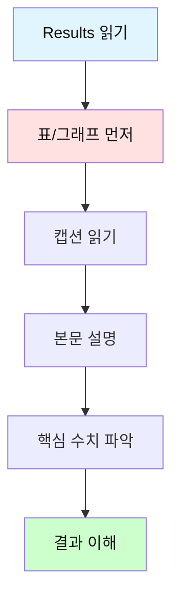

**Results 독해 순서**:
1. **도표 먼저 보기**: 시각 자료가 핵심
2. **캡션 읽기**: 도표 설명
3. **본문 읽기**: 상세 설명
4. **수치 확인**: 중요한 데이터

**핵심 표현**:
```
- The results show that... (결과는 ~를 보여준다)
- As shown in Figure 1, ... (그림 1에서 보듯이, ...)
- The data indicate that... (데이터는 ~를 나타낸다)
- Significantly, ... (중요하게도, ...)
```

---

### 5. Discussion (고찰)

**읽기 전략**: 관심 있는 부분만 선택적 읽기

| 부분 | 내용 | 읽기 전략 |
|------|------|-----------|
| **결과 해석** | 결과의 의미 | 정독 |
| **선행 연구 비교** | 다른 연구와 비교 | 훑어보기 |
| **한계점** | 연구의 제약 | 필요시 읽기 |
| **향후 연구** | 미래 방향 | 선택적 읽기 |

---

### 6. Conclusion (결론) - 필수!

**읽기 전략**: 반드시 정독

```
핵심 내용:
1. 연구 요약
2. 주요 발견
3. 시사점
4. 기여도
```

**빠른 파악법**:
- 첫 문장: 연구 요약
- 중간: 핵심 발견
- 마지막: 의의 및 시사점

---

## 🎯 논문 독해 30분 전략

```mermaid
gantt
    title 논문 10페이지 30분 공략
    dateFormat  mm
    axisFormat  %M분
    
    section 필수
    Title & Abstract    :a1, 0, 5
    Introduction 첫끝    :a2, 5, 3
    Results 정독    :a3, 8, 10
    Conclusion 정독    :a4, 18, 3
    
    section 선택
    Methods 훑기    :b1, 21, 2
    Discussion 선택    :b2, 23, 5
    
    section 여유
    재검토    :c1, 28, 2
```

| 시간 | 활동 | 섹션 | 방법 |
|------|------|------|------|
| **0-5분** | 전체 파악 | Title, Abstract | 정독 |
| **5-8분** | 배경 이해 | Introduction | 첫/끝 단락 |
| **8-18분** | 핵심 내용 | Results | 정독 + 도표 |
| **18-21분** | 결론 확인 | Conclusion | 정독 |
| **21-23분** | 방법 확인 | Methods | 훑어보기 |
| **23-28분** | 해석 이해 | Discussion | 선택적 |
| **28-30분** | 전체 복습 | - | 재검토 |

---

## 📚 논문 필수 표현 패턴

### 1. 연구 목적 표현

| 표현 | 직독직해 | 예문 |
|------|----------|------|
| This study aims to... | 이 연구는 / 목표한다 / ~하기를 | This study aims to investigate... |
| The purpose is to... | 그 목적은 / ~하는 것이다 | The purpose is to examine... |
| We investigate... | 우리는 / 조사한다 | We investigate the effects of... |
| This paper explores... | 이 논문은 / 탐구한다 | This paper explores the relationship... |

### 2. 방법론 표현

| 표현 | 의미 | 예문 |
|------|------|------|
| We conducted... | 우리는 수행했다 | We conducted a survey... |
| The data were collected... | 데이터가 수집되었다 | The data were collected from... |
| We employed... | 우리는 사용했다 | We employed a mixed-method approach... |
| Participants were... | 참가자들은 ~였다 | Participants were recruited from... |

### 3. 결과 표현

| 표현 | 의미 | 예문 |
|------|------|------|
| The results show... | 결과는 보여준다 | The results show a significant increase... |
| As shown in Figure... | 그림에서 보듯이 | As shown in Figure 1, the trend is clear... |
| Significantly, ... | 중요하게도 | Significantly, we found that... |
| The data indicate... | 데이터는 나타낸다 | The data indicate a strong correlation... |

### 4. 결론 표현

| 표현 | 의미 | 예문 |
|------|------|------|
| In conclusion, ... | 결론적으로 | In conclusion, this study demonstrates... |
| These findings suggest... | 이 발견들은 시사한다 | These findings suggest that... |
| This study contributes... | 이 연구는 기여한다 | This study contributes to our understanding... |
| Future research should... | 미래 연구는 해야한다 | Future research should explore... |

---

## 🔍 복잡한 문장 구조 공략

### 유형 1: 긴 주어

```
문장:
The impact of technology on modern education systems 
in developing countries is significant.

직독직해 전략:
1. 동사 먼저 찾기: is
2. 주어 파악: The impact (of technology on modern education systems in developing countries)
3. 보어 파악: significant

청킹:
[The impact of technology] / [on modern education systems] / 
[in developing countries] / [is significant]

그 영향은 / 기술의 / 현대 교육 시스템에 / 개발도상국의 / 중요하다
```

### 유형 2: 관계사절

```
문장:
The study, which was conducted over five years, reveals 
important findings.

직독직해:
The study / [which was conducted over five years] / reveals / important findings

그 연구는 / [5년에 걸쳐 수행된] / 밝힌다 / 중요한 발견들을

전략: 관계사절을 [ ]로 묶어서 수식어로 처리
```

### 유형 3: 분사구문

```
문장:
Using advanced statistical methods, the researchers 
analyzed the data.

직독직해:
[Using advanced statistical methods] / the researchers / analyzed / the data

[고급 통계 방법을 사용하여] / 연구자들은 / 분석했다 / 그 데이터를

전략: 분사구문을 먼저 처리한 후 주절 해석
```

---

## 💡 효율적 논문 읽기 팁

### Tip 1: SQ3R 방법

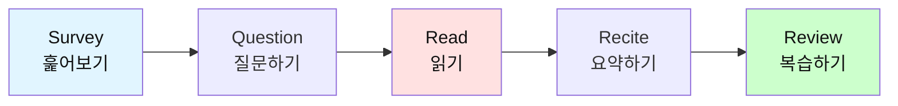

| 단계 | 행동 | 시간 |
|------|------|------|
| **Survey** | 전체 구조 파악, Abstract 읽기 | 3분 |
| **Question** | 궁금한 점 정리 | 2분 |
| **Read** | 핵심 섹션 읽기 | 15분 |
| **Recite** | 핵심 내용 요약 | 5분 |
| **Review** | 전체 복습 및 정리 | 5분 |

### Tip 2: 능동적 읽기

```
질문하면서 읽기:
- 연구 질문이 무엇인가?
- 어떤 방법을 사용했나?
- 주요 결과는 무엇인가?
- 이 연구의 한계는?
- 내 연구에 어떻게 적용?
```

### Tip 3: 메모 전략

| 섹션 | 메모 내용 |
|------|-----------|
| Abstract | 한 줄 요약 |
| Introduction | 연구 목적/질문 |
| Methods | 사용한 방법 (간단히) |
| Results | 핵심 결과 3가지 |
| Conclusion | 시사점 |

---

## 🎓 논문 독해 훈련 계획

### 4주 트레이닝

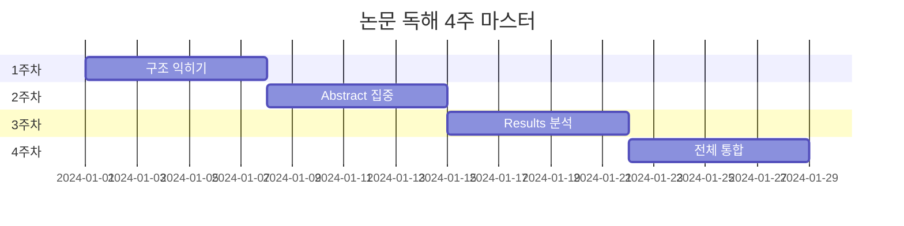

| 주차 | 목표 | 활동 | 분량 |
|------|------|------|------|
| **1주** | 논문 구조 익히기 | Abstract만 10편 읽기 | 매일 2편 |
| **2주** | 빠른 파악 능력 | 전체 훑기 연습 10편 | 매일 2편 |
| **3주** | 정독 능력 향상 | Results 집중 분석 5편 | 2일에 1편 |
| **4주** | 통합 독해 | 전체 정독 3편 | 2-3일에 1편 |

---

## 📊 논문 독해 체크리스트

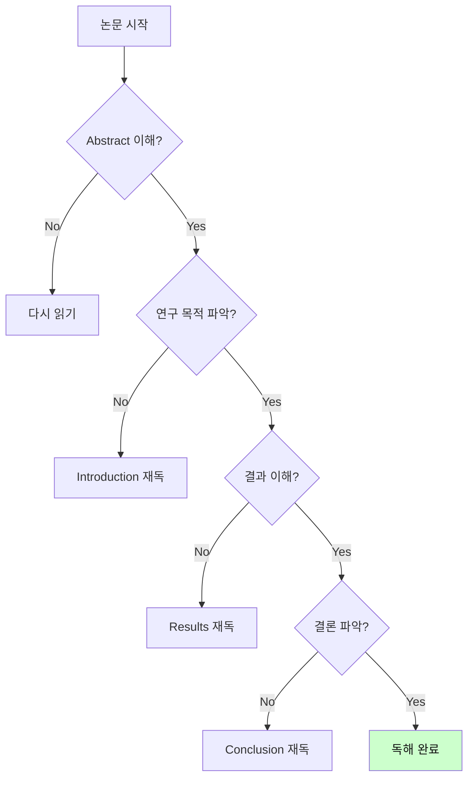

### 이해도 확인 질문

- [ ] 연구 주제가 무엇인가?
- [ ] 연구 목적/질문은?
- [ ] 어떤 방법을 사용했나?
- [ ] 주요 결과는 무엇인가?
- [ ] 결론 및 시사점은?
- [ ] 이 연구의 의의는?

---

## 🚀 고급 논문 독해 전략

### 전략 1: 비판적 읽기

```
질문 목록:
1. 연구 방법이 적절한가?
2. 결과가 주장을 뒷받침하나?
3. 한계점은 무엇인가?
4. 다른 해석은 가능한가?
5. 실제 적용 가능한가?
```

### 전략 2: 연계 읽기

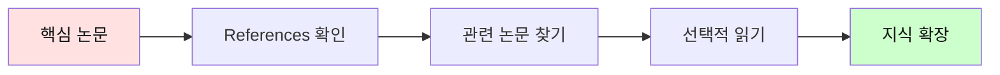

---

## 💪 실전 연습

### 연습 1: 10분 챌린지

```
목표: Abstract 10분 안에 완벽 이해

1. 타이머 10분 설정
2. Abstract 읽기
3. 핵심 3가지 뽑기:
   - 연구 목적
   - 주요 방법
   - 핵심 결과
```

### 연습 2: 30분 챌린지

```
목표: 10페이지 논문 30분 안에 핵심 파악

시간 배분:
- Abstract: 5분
- Introduction: 3분
- Results: 10분
- Conclusion: 3분
- 나머지: 9분
```

---

## 🎯 다음 단계

논문 독해를 마스터했다면:
- `04_고급_독해_전략.md`: 속독 및 고급 기술
- `05_독해_필수_문법.md`: 심화 문법
- 관심 분야 논문 매주 2-3편 읽기

---

💪 **핵심 정리**
1. 직독직해 (청킹 활용)
2. 선택적 읽기 (전체 X, 핵심 O)
3. Abstract + Results + Conclusion 집중
4. 도표/그래프 먼저 보기
5. 30분 전략 활용

