# 논문 독해 패턴 - 학술 자료 효율적 읽기

## 📑 논문 독해의 특징

### 논문 vs 일반 글

```mermaid
mindmap
  root((논문 독해<br/>특성))
    문장 구조
      길고 복잡함
      관계사절 많음
      분사구문 빈번
    어휘
      전문 용어
      학술적 표현
      형식적 문체
    구조
      정해진 형식
      논리적 전개
      체계적 구성
    목적
      정보 전달
      논리 증명
      연구 공유
```

| 구분 | 일반 글 | 논문/학술 자료 |
|------|---------|----------------|
| **문장 길이** | 짧음 (10-15단어) | 김 (20-30단어 이상) |
| **문체** | 캐주얼 | 형식적 |
| **어휘** | 일상어 | 전문 용어 |
| **구조** | 자유로움 | 정형화됨 |
| **읽는 목적** | 즐거움, 정보 | 학습, 연구 |
| **독해 전략** | 전체 읽기 | 선택적 읽기 |

---

## 🎯 논문 독해 핵심 원칙

### 원칙 1: 직독직해 (더욱 중요!)

```mermaid
flowchart TD
    A[긴 논문 문장] --> B{해석 방법}
    B -->|❌| C[한국식: 재배열]
    B -->|✅| D[영어식: 순서대로]
    
    C --> E[머리 아픔]
    C --> F[시간 오래 걸림]
    C --> G[이해도 낮음]
    
    D --> H[청킹으로 처리]
    D --> I[빠른 이해]
    D --> J[효율적 독해]
    
    style C fill:#ffcccc
    style D fill:#ccffcc
```

**예문**: 논문에서 흔한 긴 문장
```
문장: 
The researchers conducted a comprehensive study to investigate 
the effects of climate change on agricultural productivity 
in developing countries over the past two decades.

❌ 한국식 (비효율):
지난 20년간 → 개발도상국의 → 농업 생산성에 대한 → 기후 변화의 영향을 
→ 조사하기 위해 → 포괄적인 연구를 → 연구자들은 수행했다
(뒤에서 앞으로, 시간 2배 소요)

✅ 영어식 (효율):
연구자들은 / 수행했다 / 포괄적인 연구를 / 조사하기 위해 / 
그 영향을 / 기후 변화의 / 농업 생산성에 / 개발도상국의 / 
지난 20년간
(읽는 순서대로, 청킹으로 처리)
```

---

### 원칙 2: 전체가 아닌 핵심만 읽기

```mermaid
graph TD
    A[논문 전체] --> B{필독 섹션}
    A --> C{선택 섹션}
    A --> D{건너뛰기 섹션}
    
    B --> B1[Abstract]
    B --> B2[Introduction]
    B --> B3[Results]
    B --> B4[Conclusion]
    
    C --> C1[Methods - 필요시]
    C --> C2[Discussion - 관심사]
    
    D --> D1[References]
    D --> D2[상세 수식]
    D --> D3[부록]
    
    style B fill:#ffe1e1
    style C fill:#fff4e1
    style D fill:#e1f5ff
```

---

## 📊 논문 구조별 독해 전략

### 논문 구조 완전 분석


| 섹션 | 목적 | 읽는 방법 | 시간 | 중요도 |
|------|------|-----------|------|--------|
| **Title** | 주제 파악 | 정독 | 10초 | ⭐⭐⭐⭐⭐ |
| **Abstract** | 전체 요약 | 정독 (필수) | 2-3분 | ⭐⭐⭐⭐⭐ |
| **Introduction** | 배경/목적 | 빠르게 읽기 | 3-5분 | ⭐⭐⭐⭐ |
| **Literature Review** | 선행 연구 | 훑어보기 | 2-3분 | ⭐⭐⭐ |
| **Methods** | 방법론 | 건너뛰기 (필요시만) | 1-2분 | ⭐⭐ |
| **Results** | 연구 결과 | 정독 (핵심) | 5-10분 | ⭐⭐⭐⭐⭐ |
| **Discussion** | 결과 해석 | 정독 | 3-5분 | ⭐⭐⭐⭐ |
| **Conclusion** | 결론 | 정독 (필수) | 2-3분 | ⭐⭐⭐⭐⭐ |
| **References** | 참고 문헌 | 건너뛰기 | - | ⭐ |

---

## 📖 섹션별 독해 가이드

### 1. Abstract (초록) - 가장 중요!

```mermaid
mindmap
  root((Abstract<br/>구성))
    배경
      연구 배경
      문제 제기
    목적
      연구 목적
      연구 질문
    방법
      연구 방법
      간단히 설명
    결과
      주요 발견
      핵심 결과
    결론
      시사점
      의의
```

**Abstract 읽기 전략**:
1. **첫 문장**: 연구 배경 (Background)
2. **중간 부분**: 연구 방법 및 목적 (Method & Purpose)
3. **마지막 부분**: 주요 결과 및 결론 (Results & Conclusion)

**예문 및 직독직해**:
```
This study investigates the impact of social media usage 
on mental health among adolescents.

직독직해:
이 연구는 / 조사한다 / 그 영향을 / 소셜 미디어 사용의 / 
정신 건강에 / 청소년들 사이에서

핵심 파악: "소셜 미디어가 청소년 정신 건강에 미치는 영향 연구"
```

---

### 2. Introduction (서론)

**읽기 전략**: 첫 단락 + 마지막 단락 집중

| 위치 | 내용 | 읽는 방법 |
|------|------|-----------|
| **첫 단락** | 연구 배경, 문제 제기 | 정독 |
| **중간 단락** | 선행 연구, 이론적 배경 | 훑어보기 |
| **마지막 단락** | 연구 목적, 연구 질문 | 정독 |

**핵심 표현 패턴**:
```
- This paper aims to... (이 논문은 ~을 목표로 한다)
- The purpose of this study is to... (이 연구의 목적은 ~이다)
- We investigate... (우리는 ~을 조사한다)
- This research focuses on... (이 연구는 ~에 초점을 맞춘다)
```

---

### 3. Methods (방법론)

**읽기 전략**: 건너뛰거나 빠르게 훑기

```mermaid
flowchart TD
    A[Methods 섹션] --> B{내가 연구자?}
    B -->|Yes| C[자세히 읽기]
    B -->|No| D{재현 필요?}
    D -->|Yes| E[방법론 확인]
    D -->|No| F[건너뛰기]
    
    style C fill:#ffe1e1
    style F fill:#ccffcc
```

**건너뛰어도 되는 경우**:
- 단순히 내용 이해가 목적
- 전문 분야가 아님
- 시간이 제한적

**읽어야 하는 경우**:
- 같은 방법론 적용 예정
- 연구 신뢰도 확인 필요
- 전문 분야의 논문

---

### 4. Results (결과) - 핵심!

**읽기 전략**: 정독 필수

```mermaid
graph TD
    A[Results 읽기] --> B[표/그래프 먼저]
    B --> C[캡션 읽기]
    C --> D[본문 설명]
    D --> E[핵심 수치 파악]
    E --> F[결과 이해]
    
    style A fill:#e1f5ff
    style B fill:#ffe1e1
    style F fill:#ccffcc
```

**Results 독해 순서**:
1. **도표 먼저 보기**: 시각 자료가 핵심
2. **캡션 읽기**: 도표 설명
3. **본문 읽기**: 상세 설명
4. **수치 확인**: 중요한 데이터

**핵심 표현**:
```
- The results show that... (결과는 ~를 보여준다)
- As shown in Figure 1, ... (그림 1에서 보듯이, ...)
- The data indicate that... (데이터는 ~를 나타낸다)
- Significantly, ... (중요하게도, ...)
```

---

### 5. Discussion (고찰)

**읽기 전략**: 관심 있는 부분만 선택적 읽기

| 부분 | 내용 | 읽기 전략 |
|------|------|-----------|
| **결과 해석** | 결과의 의미 | 정독 |
| **선행 연구 비교** | 다른 연구와 비교 | 훑어보기 |
| **한계점** | 연구의 제약 | 필요시 읽기 |
| **향후 연구** | 미래 방향 | 선택적 읽기 |

---

### 6. Conclusion (결론) - 필수!

**읽기 전략**: 반드시 정독

```
핵심 내용:
1. 연구 요약
2. 주요 발견
3. 시사점
4. 기여도
```

**빠른 파악법**:
- 첫 문장: 연구 요약
- 중간: 핵심 발견
- 마지막: 의의 및 시사점

---

## 🎯 논문 독해 30분 전략

```mermaid
gantt
    title 논문 10페이지 30분 공략
    dateFormat  mm
    axisFormat  %M분
    
    section 필수
    Title & Abstract    :a1, 0, 5
    Introduction 첫끝    :a2, 5, 3
    Results 정독    :a3, 8, 10
    Conclusion 정독    :a4, 18, 3
    
    section 선택
    Methods 훑기    :b1, 21, 2
    Discussion 선택    :b2, 23, 5
    
    section 여유
    재검토    :c1, 28, 2
```

| 시간 | 활동 | 섹션 | 방법 |
|------|------|------|------|
| **0-5분** | 전체 파악 | Title, Abstract | 정독 |
| **5-8분** | 배경 이해 | Introduction | 첫/끝 단락 |
| **8-18분** | 핵심 내용 | Results | 정독 + 도표 |
| **18-21분** | 결론 확인 | Conclusion | 정독 |
| **21-23분** | 방법 확인 | Methods | 훑어보기 |
| **23-28분** | 해석 이해 | Discussion | 선택적 |
| **28-30분** | 전체 복습 | - | 재검토 |

---

## 📚 논문 필수 표현 패턴

### 1. 연구 목적 표현

| 표현 | 직독직해 | 예문 |
|------|----------|------|
| This study aims to... | 이 연구는 / 목표한다 / ~하기를 | This study aims to investigate... |
| The purpose is to... | 그 목적은 / ~하는 것이다 | The purpose is to examine... |
| We investigate... | 우리는 / 조사한다 | We investigate the effects of... |
| This paper explores... | 이 논문은 / 탐구한다 | This paper explores the relationship... |

### 2. 방법론 표현

| 표현 | 의미 | 예문 |
|------|------|------|
| We conducted... | 우리는 수행했다 | We conducted a survey... |
| The data were collected... | 데이터가 수집되었다 | The data were collected from... |
| We employed... | 우리는 사용했다 | We employed a mixed-method approach... |
| Participants were... | 참가자들은 ~였다 | Participants were recruited from... |

### 3. 결과 표현

| 표현 | 의미 | 예문 |
|------|------|------|
| The results show... | 결과는 보여준다 | The results show a significant increase... |
| As shown in Figure... | 그림에서 보듯이 | As shown in Figure 1, the trend is clear... |
| Significantly, ... | 중요하게도 | Significantly, we found that... |
| The data indicate... | 데이터는 나타낸다 | The data indicate a strong correlation... |

### 4. 결론 표현

| 표현 | 의미 | 예문 |
|------|------|------|
| In conclusion, ... | 결론적으로 | In conclusion, this study demonstrates... |
| These findings suggest... | 이 발견들은 시사한다 | These findings suggest that... |
| This study contributes... | 이 연구는 기여한다 | This study contributes to our understanding... |
| Future research should... | 미래 연구는 해야한다 | Future research should explore... |

---

## 🔍 복잡한 문장 구조 공략

### 유형 1: 긴 주어

```
문장:
The impact of technology on modern education systems 
in developing countries is significant.

직독직해 전략:
1. 동사 먼저 찾기: is
2. 주어 파악: The impact (of technology on modern education systems in developing countries)
3. 보어 파악: significant

청킹:
[The impact of technology] / [on modern education systems] / 
[in developing countries] / [is significant]

그 영향은 / 기술의 / 현대 교육 시스템에 / 개발도상국의 / 중요하다
```

### 유형 2: 관계사절

```
문장:
The study, which was conducted over five years, reveals 
important findings.

직독직해:
The study / [which was conducted over five years] / reveals / important findings

그 연구는 / [5년에 걸쳐 수행된] / 밝힌다 / 중요한 발견들을

전략: 관계사절을 [ ]로 묶어서 수식어로 처리
```

### 유형 3: 분사구문

```
문장:
Using advanced statistical methods, the researchers 
analyzed the data.

직독직해:
[Using advanced statistical methods] / the researchers / analyzed / the data

[고급 통계 방법을 사용하여] / 연구자들은 / 분석했다 / 그 데이터를

전략: 분사구문을 먼저 처리한 후 주절 해석
```

---

## 💡 효율적 논문 읽기 팁

### Tip 1: SQ3R 방법

```mermaid
flowchart LR
    A[Survey<br/>훑어보기] --> B[Question<br/>질문하기]
    B --> C[Read<br/>읽기]
    C --> D[Recite<br/>요약하기]
    D --> E[Review<br/>복습하기]
    
    style A fill:#e1f5ff
    style C fill:#ffe1e1
    style E fill:#ccffcc
```

| 단계 | 행동 | 시간 |
|------|------|------|
| **Survey** | 전체 구조 파악, Abstract 읽기 | 3분 |
| **Question** | 궁금한 점 정리 | 2분 |
| **Read** | 핵심 섹션 읽기 | 15분 |
| **Recite** | 핵심 내용 요약 | 5분 |
| **Review** | 전체 복습 및 정리 | 5분 |

### Tip 2: 능동적 읽기

```
질문하면서 읽기:
- 연구 질문이 무엇인가?
- 어떤 방법을 사용했나?
- 주요 결과는 무엇인가?
- 이 연구의 한계는?
- 내 연구에 어떻게 적용?
```

### Tip 3: 메모 전략

| 섹션 | 메모 내용 |
|------|-----------|
| Abstract | 한 줄 요약 |
| Introduction | 연구 목적/질문 |
| Methods | 사용한 방법 (간단히) |
| Results | 핵심 결과 3가지 |
| Conclusion | 시사점 |

---

## 🎓 논문 독해 훈련 계획

### 4주 트레이닝

```mermaid
gantt
    title 논문 독해 4주 마스터
    dateFormat  YYYY-MM-DD
    
    section 1주차
    구조 익히기    :a1, 2024-01-01, 7d
    
    section 2주차
    Abstract 집중    :a2, 2024-01-08, 7d
    
    section 3주차
    Results 분석    :a3, 2024-01-15, 7d
    
    section 4주차
    전체 통합    :a4, 2024-01-22, 7d
```

| 주차 | 목표 | 활동 | 분량 |
|------|------|------|------|
| **1주** | 논문 구조 익히기 | Abstract만 10편 읽기 | 매일 2편 |
| **2주** | 빠른 파악 능력 | 전체 훑기 연습 10편 | 매일 2편 |
| **3주** | 정독 능력 향상 | Results 집중 분석 5편 | 2일에 1편 |
| **4주** | 통합 독해 | 전체 정독 3편 | 2-3일에 1편 |

---

## 📊 논문 독해 체크리스트

```mermaid
graph TD
    A[논문 시작] --> B{Abstract 이해?}
    B -->|No| C[다시 읽기]
    B -->|Yes| D{연구 목적 파악?}
    D -->|No| E[Introduction 재독]
    D -->|Yes| F{결과 이해?}
    F -->|No| G[Results 재독]
    F -->|Yes| H{결론 파악?}
    H -->|No| I[Conclusion 재독]
    H -->|Yes| J[독해 완료]
    
    style J fill:#ccffcc
```

### 이해도 확인 질문

- [ ] 연구 주제가 무엇인가?
- [ ] 연구 목적/질문은?
- [ ] 어떤 방법을 사용했나?
- [ ] 주요 결과는 무엇인가?
- [ ] 결론 및 시사점은?
- [ ] 이 연구의 의의는?

---

## 🚀 고급 논문 독해 전략

### 전략 1: 비판적 읽기

```
질문 목록:
1. 연구 방법이 적절한가?
2. 결과가 주장을 뒷받침하나?
3. 한계점은 무엇인가?
4. 다른 해석은 가능한가?
5. 실제 적용 가능한가?
```

### 전략 2: 연계 읽기

```mermaid
graph LR
    A[핵심 논문] --> B[References 확인]
    B --> C[관련 논문 찾기]
    C --> D[선택적 읽기]
    D --> E[지식 확장]
    
    style A fill:#ffe1e1
    style E fill:#ccffcc
```

---

## 💪 실전 연습

### 연습 1: 10분 챌린지

```
목표: Abstract 10분 안에 완벽 이해

1. 타이머 10분 설정
2. Abstract 읽기
3. 핵심 3가지 뽑기:
   - 연구 목적
   - 주요 방법
   - 핵심 결과
```

### 연습 2: 30분 챌린지

```
목표: 10페이지 논문 30분 안에 핵심 파악

시간 배분:
- Abstract: 5분
- Introduction: 3분
- Results: 10분
- Conclusion: 3분
- 나머지: 9분
```

---

## 🎯 다음 단계

논문 독해를 마스터했다면:
- `04_고급_독해_전략.md`: 속독 및 고급 기술
- `05_독해_필수_문법.md`: 심화 문법
- 관심 분야 논문 매주 2-3편 읽기

---

💪 **핵심 정리**
1. 직독직해 (청킹 활용)
2. 선택적 읽기 (전체 X, 핵심 O)
3. Abstract + Results + Conclusion 집중
4. 도표/그래프 먼저 보기
5. 30분 전략 활용

