# 고급 독해 전략 - 속독 및 핵심 파악 마스터

## 🚀 고급 독해의 목표

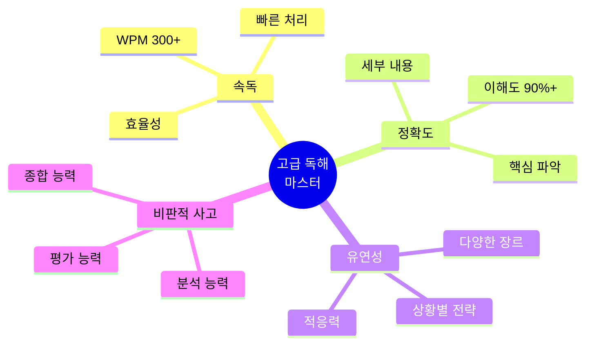

---

## 📊 독해 속도 vs 이해도

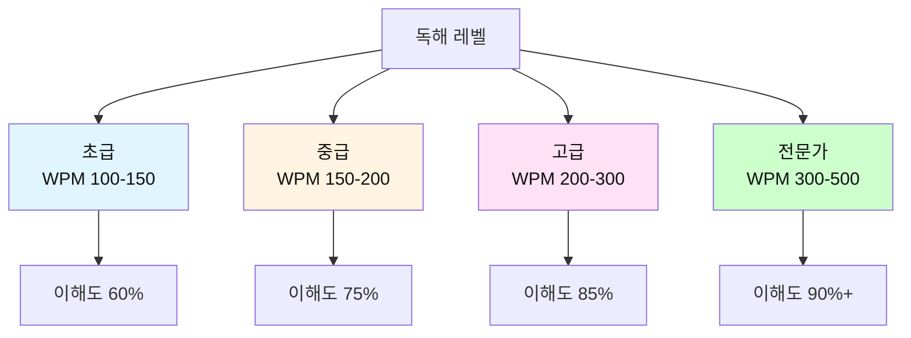

### 📋 난이도별 상세 비교표

| 레벨 | WPM | 이해도 | 읽기 방식 | 특징 | 약점 | 목표 |
|------|-----|--------|----------|------|------|------|
| **초급** | 100-150 | 60% | 단어→단어 | 번역하며 읽음 | 느림, 문맥 놓침 | 문장 단위 |
| **중급** | 150-200 | 75% | 문장→문장 | 구조 파악 시작 | 여전히 번역 | 단락 단위 |
| **고급** | 200-300 | 85% | 청크→청크 | 직독직해 가능 | 복잡한 문장 어려움 | 속독+정확도 |
| **전문가** | 300-500 | 90%+ | 전략적 읽기 | 상황별 전략 사용 | 없음 | 최적화 |

### 📊 기술별 효율성 비교

| 기술 | 속도 향상 | 이해도 | 적용 난이도 | 학습 기간 | 효과 |
|------|----------|--------|------------|----------|------|
| **직독직해** | ⭐⭐⭐ | ⭐⭐⭐⭐⭐ | 중급 | 2-3개월 | 기본 필수 |
| **청킹** | ⭐⭐⭐⭐ | ⭐⭐⭐⭐ | 중급 | 1-2개월 | 속도 2배 |
| **스키밍** | ⭐⭐⭐⭐⭐ | ⭐⭐⭐ | 고급 | 2-4주 | 시간 50% 절약 |
| **스캐닝** | ⭐⭐⭐⭐⭐ | ⭐⭐ | 초급 | 1-2주 | 정보 검색 최적 |
| **예측 독해** | ⭐⭐⭐⭐ | ⭐⭐⭐⭐ | 고급 | 3-6개월 | 문맥 파악 향상 |

### 📈 장르별 전략 비교표

| 장르 | 최적 전략 | 속도 | 이해도 목표 | 주의점 |
|------|----------|------|------------|--------|
| **뉴스** | 스키밍 | 빠름 | 70-80% | 첫 문단 집중 |
| **소설** | 정독 | 보통 | 90%+ | 감정이입 |
| **논문** | 정독+스키밍 | 느림 | 95%+ | 논리 구조 파악 |
| **이메일** | 스캐닝 | 매우 빠름 | 60-70% | 핵심만 |
| **계약서** | 정독 | 매우 느림 | 100% | 모든 단어 중요 |
| **교과서** | 정독+메모 | 느림 | 90%+ | 반복 학습 |

---

## 📚 난이도별 훈련 프로그램

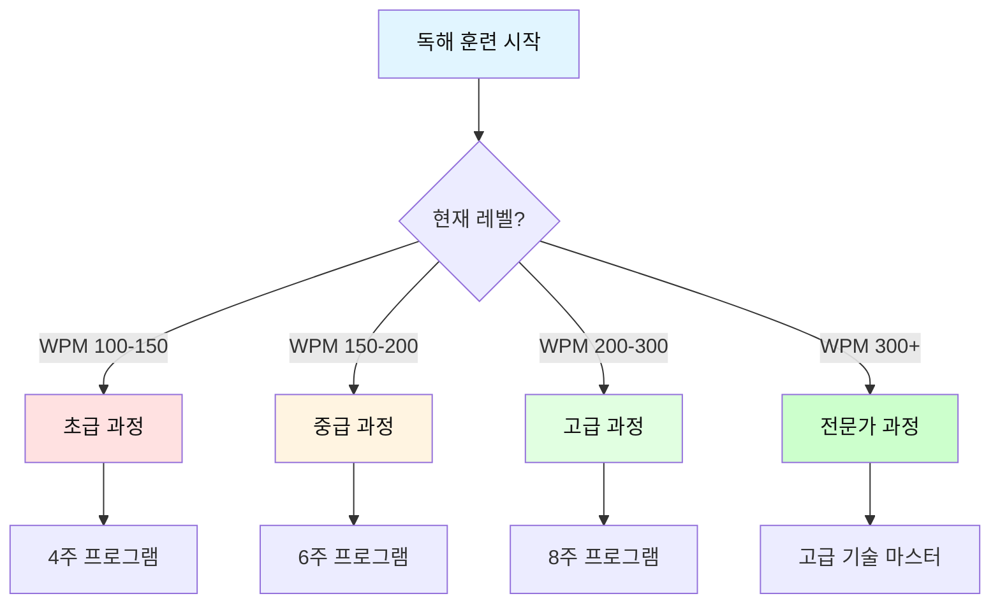

---

### 🌱 초급 과정 (WPM 100-150 → 180)

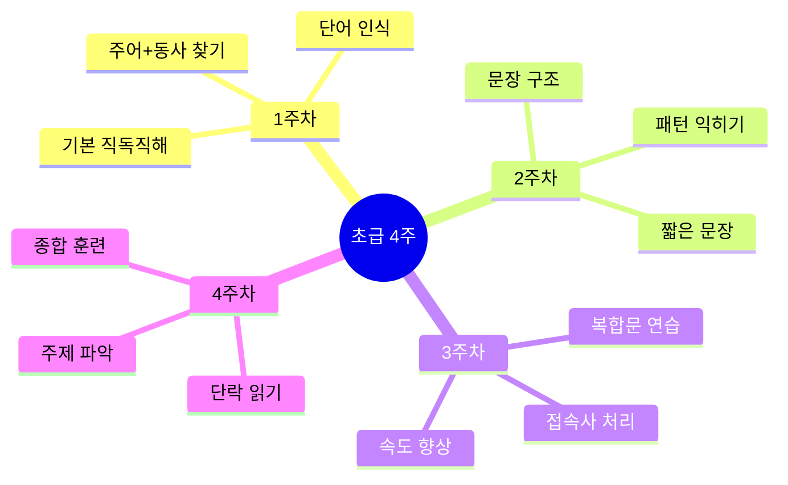

#### 📅 초급 주차별 훈련 계획

| 주차 | 목표 WPM | 핵심 기술 | 일일 시간 | 교재 |
|------|----------|----------|----------|------|
| 1주차 | 100→120 | 직독직해 기초 | 20분 | 초등 수준 글 |
| 2주차 | 120→140 | 문장 구조 파악 | 25분 | 간단한 뉴스 |
| 3주차 | 140→160 | 복합문 처리 | 30분 | 쉬운 에세이 |
| 4주차 | 160→180 | 단락 단위 읽기 | 30분 | 짧은 기사 |

#### 📝 초급 - 1주차 상세 훈련

**Day 1-2: 주어와 동사 찾기**

```
연습 예문 1:
The cat sleeps.
→ 주어: The cat / 동사: sleeps
→ 직독직해: "그 고양이가 잔다"

연습 예문 2:
I drink coffee every morning.
→ 주어: I / 동사: drink
→ 직독직해: "나는 마신다 커피를 매일 아침"
```

**훈련 방법**:
1. 문장 읽기
2. 주어 찾기 (밑줄)
3. 동사 찾기 (동그라미)
4. 나머지는 보충 정보
5. 순서대로 이해하기

**실습 문제 (10문장)**:
```
1. The dog barks loudly.
   주어: _______ / 동사: _______

2. She reads books at night.
   주어: _______ / 동사: _______

3. We play soccer on weekends.
   주어: _______ / 동사: _______

4. The sun rises in the east.
   주어: _______ / 동사: _______

5. Children love chocolate.
   주어: _______ / 동사: _______
```

**Day 3-4: 목적어와 보어 추가**

```
문장 패턴 1: 주어 + 동사 + 목적어
I love you.
→ [I] [love] [you]
→ 나는 / 사랑한다 / 너를

문장 패턴 2: 주어 + 동사 + 보어
She is happy.
→ [She] [is] [happy]
→ 그녀는 / ~이다 / 행복한
```

**Day 5-7: 수식어 처리**

```
기본문: The cat sleeps.
+ 형용사: The black cat sleeps.
+ 부사: The black cat sleeps quietly.
+ 전치사구: The black cat sleeps quietly on the sofa.

읽는 순서:
1. 핵심: cat sleeps (고양이가 잔다)
2. 추가: black (검은), quietly (조용히), on the sofa (소파에서)
```

**주간 종합 테스트**:
```
다음 단락을 읽고 질문에 답하세요. (목표: 2분 이내)

My name is Tom. I live in Seoul. I am a student. 
I study English every day. English is important. 
I want to speak English well. My teacher is kind. 
She helps me a lot.

질문:
1. What is his name? ____________
2. Where does he live? ____________
3. What does he study? ____________
4. Is his teacher kind? ____________
5. 이 단락의 주제는? ____________

(정답: 1.Tom, 2.Seoul, 3.English, 4.Yes, 5.Tom의 영어 공부)
```

---

### 🌿 중급 과정 (WPM 150-200 → 250)

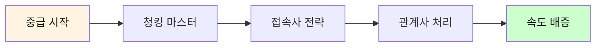

#### 📅 중급 6주 훈련 계획

| 주차 | 목표 WPM | 핵심 기술 | 일일 시간 | 교재 |
|------|----------|----------|----------|------|
| 1-2주 | 150→180 | 청킹 기초 | 30분 | 일반 뉴스 |
| 3-4주 | 180→210 | 복잡한 구조 | 35분 | 에세이 |
| 5-6주 | 210→250 | 스키밍 도입 | 40분 | 긴 기사 |

#### 📝 중급 - 청킹 집중 훈련

**청킹 패턴 마스터**

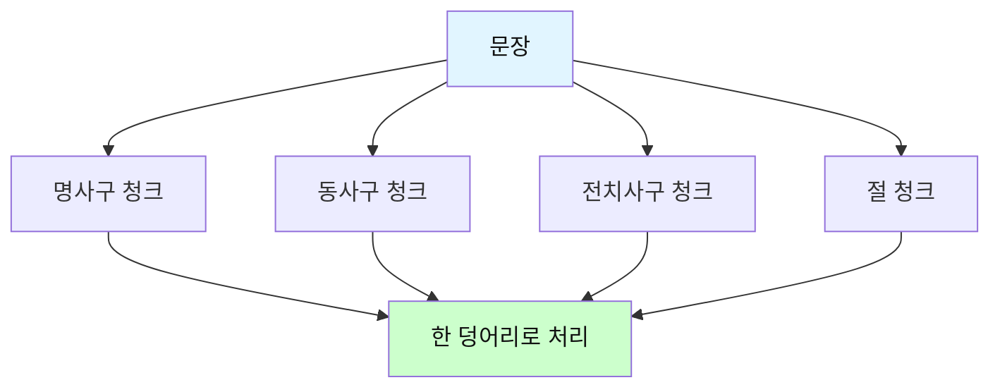

**청크 예시 1: 명사구**
```
문장: The beautiful girl with long hair smiled.

❌ 단어별: The / beautiful / girl / with / long / hair / smiled
⏱️ 7단계

✅ 청크별: [The beautiful girl with long hair] / [smiled]
⚡ 2단계

속도: 3.5배 향상!
```

**청크 예시 2: 복합 청킹**
```
문장: Scientists at Harvard University discovered a new 
      method to treat cancer using advanced technology.

청킹 분석:
[Scientists at Harvard University] - 누가
[discovered] - 뭐 했다
[a new method] - 무엇을
[to treat cancer] - 목적
[using advanced technology] - 방법

5개 청크로 즉시 이해!
```

**실습 문제: 청킹 연습**
```
다음 문장을 청크로 나누세요:

1. The company announced plans to launch a revolutionary 
   product next year.
   
   청크 1: ___________________________
   청크 2: ___________________________
   청크 3: ___________________________

2. Students who study regularly tend to achieve better 
   results than those who cram.
   
   청크 1: ___________________________
   청크 2: ___________________________
   청크 3: ___________________________
   청크 4: ___________________________
```

**중급 종합 테스트 (목표: 5분 이내, 이해도 75%+)**:
```
지문:
Climate change is one of the biggest challenges facing 
humanity today. Scientists warn that global temperatures 
are rising faster than ever before. This increase is 
primarily caused by human activities, particularly the 
burning of fossil fuels. The effects are already visible 
in melting ice caps, rising sea levels, and more frequent 
extreme weather events. Many countries are now taking 
action to reduce carbon emissions. However, experts say 
much more needs to be done to prevent catastrophic 
consequences. (87 단어)

질문:
1. 기후 변화의 주요 원인은? ____________
2. 이미 나타나는 영향 3가지는? ____________
3. 많은 국가들이 하는 일은? ____________
4. 전문가들의 의견은? ____________
5. 이 글의 전체적인 톤은? (경고적/낙관적/중립적)
```

---

### 🌳 고급 과정 (WPM 200-300 → 350)

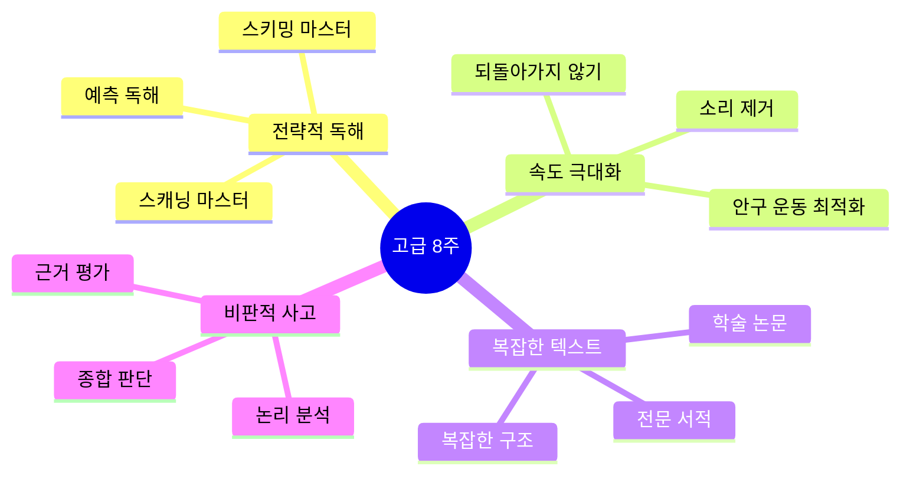

#### 📝 고급 - 스키밍 완벽 마스터

**스키밍 단계별 프로세스**

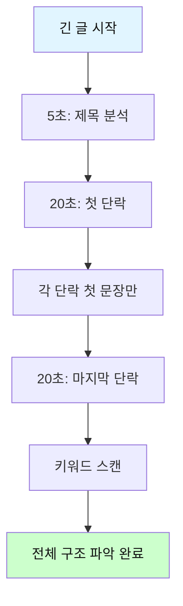

**스키밍 실습 - 500단어 기사**

```
기사 제목: The Future of Artificial Intelligence in Healthcare

[단락 1 - 첫 문장만]
Artificial intelligence is revolutionizing the healthcare 
industry in unprecedented ways.

[단락 2 - 첫 문장만]
AI-powered diagnostic tools can now detect diseases earlier 
than traditional methods.

[단락 3 - 첫 문장만]
However, there are significant ethical concerns about AI 
in healthcare.

[단락 4 - 첫 문장만]
Despite these challenges, experts predict that AI will 
become standard in hospitals within the next decade.

[마지막 단락]
The integration of AI in healthcare represents both 
immense opportunities and serious responsibilities. As we 
move forward, it is crucial to balance innovation with 
patient safety and ethical considerations.

스키밍 결과 (2분):
- 주제: AI의 의료 분야 혁명
- 긍정적 측면: 조기 진단
- 부정적 측면: 윤리적 문제
- 미래 전망: 10년 내 표준화
- 전체 톤: 균형 잡힌 시각

이해도: 75%
시간 절약: 60%
```

**고급 종합 테스트 (목표: 8분 이내, 이해도 85%+)**:
```
장문 지문 (300단어):
[여기에 복잡한 논문 스타일의 텍스트]
The phenomenon of globalization has transformed the world 
economy in fundamental ways over the past three decades. 
Trade liberalization, technological advancement, and the 
reduction of communication costs have created an 
interconnected global marketplace. Multinational 
corporations now operate across borders with unprecedented 
ease, while consumers enjoy access to products from around 
the world...

[중간 내용]

...However, critics argue that globalization has also 
widened income inequality both within and between 
countries. Manufacturing jobs have shifted to developing 
nations, leaving many workers in developed countries 
unemployed. Environmental concerns have also intensified 
as production increases...

[결론]

...In conclusion, while globalization has brought economic 
growth and consumer benefits, it has also created 
significant challenges that require thoughtful policy 
responses. The future of globalization will depend on how 
well governments and international organizations can 
balance economic efficiency with social equity and 
environmental sustainability.

비판적 독해 질문:
1. 저자의 주요 주장은? ____________
2. 긍정적 측면 3가지: ____________
3. 부정적 측면 3가지: ____________
4. 저자의 입장은? (찬성/반대/중립) ____________
5. 이 글의 논리 구조는? ____________
6. 근거는 충분한가? ____________
7. 당신의 의견은? ____________
```

---

### 🏆 전문가 과정 (WPM 300-500+)

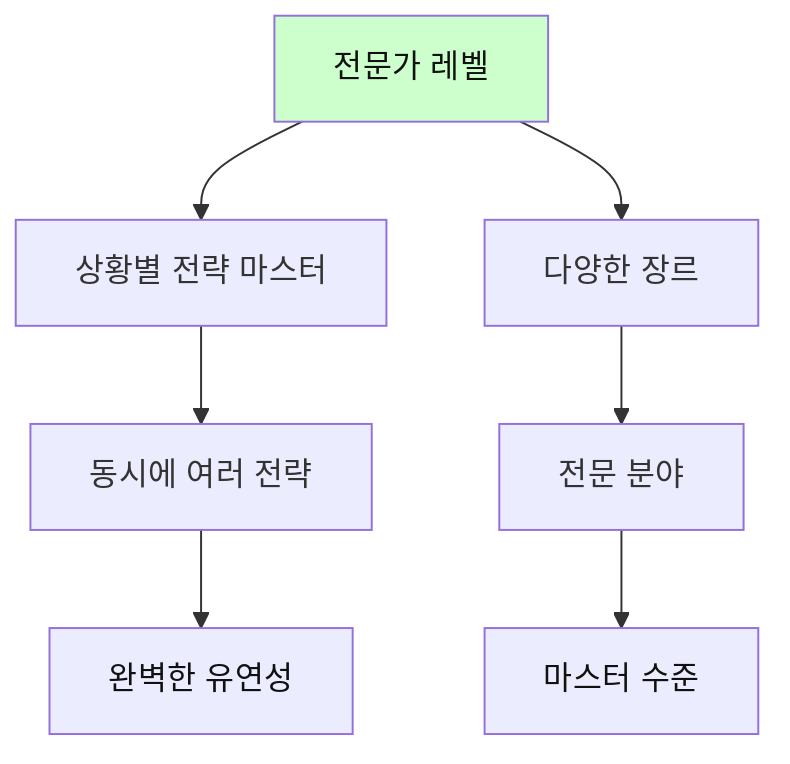

#### 전문가 기술: 다층적 독해

```
레벨 1: 표면 읽기 (What) - 내용 파악
레벨 2: 구조 읽기 (How) - 논리 구조
레벨 3: 의도 읽기 (Why) - 저자 의도
레벨 4: 비판 읽기 (Evaluation) - 평가

전문가는 동시에 4개 레벨을 처리!
```

---

## 🎯 핵심 독해 기술 3가지

### 1. 스키밍 (Skimming) - 훑어읽기


**목적**: 전체적인 내용과 구조 빠르게 파악

**방법**:
| 단계 | 행동 | 시간 |
|------|------|------|
| 1 | 제목, 부제목 읽기 | 10초 |
| 2 | 첫 문단 전체 읽기 | 30초 |
| 3 | 각 단락의 첫 문장만 | 1-2분 |
| 4 | 마지막 문단 전체 읽기 | 30초 |
| 5 | 키워드 스캔 | 1분 |

**스키밍 연습**:
```
텍스트: 5단락 기사 (500단어)

일반 읽기: 5분 소요
스키밍: 2-3분 소요
이해도: 70-80% 달성

효율: 시간 50% 절약, 핵심은 파악!
```

### 📝 스키밍 실전 훈련

**훈련 1: 뉴스 기사 스키밍 (3분)**

```
제목: "Tech Giant Announces Breakthrough in Quantum Computing"

[읽는 순서]
1. 제목 분석 (10초)
   → 주제: 양자 컴퓨팅의 돌파구
   → 키워드: Tech Giant, Breakthrough, Quantum

2. 첫 단락 (30초)
   "A leading technology company revealed yesterday that 
   it has achieved a major milestone in quantum computing, 
   potentially revolutionizing the field."
   → 핵심: 주요 기업이 큰 성과 달성

3. 각 단락 첫 문장 (1분)
   - 단락2: "The new quantum processor..."
   - 단락3: "Experts in the field..."
   - 단락4: "However, challenges remain..."
   
4. 마지막 단락 (30초)
   "While this breakthrough is significant, practical 
   applications may still be years away."
   → 결론: 의미 있지만 실용화는 아직

5. 스키밍 결과
   - 주제: ✓
   - 긍정적 내용: ✓
   - 부정적 내용: ✓
   - 전체 흐름: ✓
   이해도: 75% 달성!
```

**스키밍 자가 평가 체크리스트**:
```
□ 제목에서 주제를 파악했는가?
□ 첫 단락에서 핵심을 찾았는가?
□ 각 단락의 요점을 알았는가?
□ 전체 구조를 이해했는가?
□ 3분 이내에 완료했는가?

5개 중 4개 이상: 스키밍 성공!
```

**일일 스키밍 훈련 계획**:

| 요일 | 교재 | 분량 | 목표 시간 | 목표 이해도 |
|------|------|------|----------|------------|
| 월 | 뉴스 3개 | 각 300단어 | 각 2분 | 70%+ |
| 화 | 블로그 2개 | 각 500단어 | 각 3분 | 75%+ |
| 수 | 에세이 1개 | 800단어 | 5분 | 75%+ |
| 목 | 기사 3개 | 각 400단어 | 각 2.5분 | 70%+ |
| 금 | 리포트 1개 | 1000단어 | 6분 | 80%+ |
| 토-일 | 자유 주제 | 다양 | 편하게 | 75%+ |

---

### 2. 스캐닝 (Scanning) - 찾아읽기

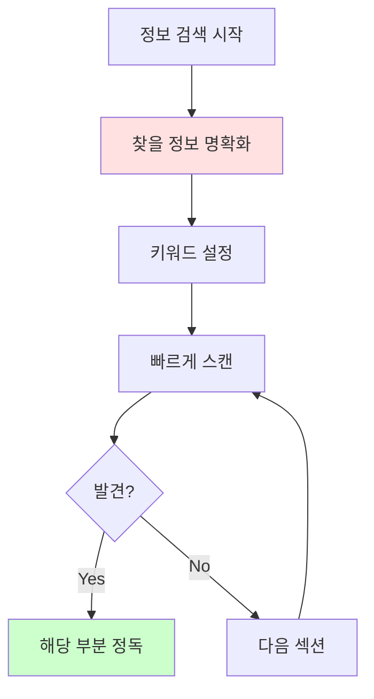

**목적**: 특정 정보 빠르게 찾기

**효과적인 스캐닝 대상**:
| 정보 유형 | 찾는 방법 | 예시 |
|-----------|-----------|------|
| **숫자/날짜** | 숫자 형태 스캔 | 2024, 50%, $100 |
| **고유명사** | 대문자 시작 | Apple, Korea, NASA |
| **전문용어** | 특수 용어 | algorithm, COVID-19 |
| **키워드** | 질문 관련 단어 | "climate change" 검색 |

**스캐닝 훈련**:
```
연습 방법:
1. 질문 먼저 읽기: "인구는 얼마인가?"
2. 키워드 설정: population, number, million
3. 텍스트 빠르게 스캔
4. 숫자 발견하면 정독
5. 답 찾기: 5 million

시간: 30초-1분
```

### 📝 스캐닝 실전 훈련

**훈련 1: 정보 찾기 스피드 퀴즈**

```
지문 (200단어):
The city of Seoul, South Korea, is home to approximately 
9.7 million people as of 2024. Founded in 1394, it has 
served as the capital for over 600 years. The city covers 
an area of 605.2 square kilometers and is divided into 
25 districts. Seoul's economy is one of the largest in 
Asia, with a GDP of $779 billion in 2023. The city is 
famous for its blend of ancient palaces like Gyeongbokgung, 
built in 1395, and modern skyscrapers like Lotte World 
Tower, standing at 555 meters tall. The Han River flows 
through the heart of the city, spanning 514 kilometers...

질문 (각 30초 이내):
1. 서울 인구는? → 9.7 million 찾기 (5초)
2. 서울이 수도가 된 연도는? → 1394 찾기 (8초)
3. 면적은? → 605.2 km² 찾기 (10초)
4. 롯데월드타워 높이는? → 555m 찾기 (12초)
5. 한강 길이는? → 514km 찾기 (15초)

총 소요 시간: 50초
정확도: 5/5 = 100%
```

**훈련 2: 키워드 다중 스캐닝**

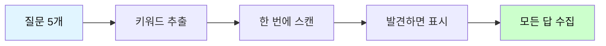

**예제**:
```
질문들:
Q1. 회의는 언제?
Q2. 참석자는 누구?
Q3. 장소는 어디?
Q4. 안건은?
Q5. 준비물은?

키워드 설정:
- 시간: when, time, o'clock, date
- 사람: who, attendees, participants
- 장소: where, location, room
- 안건: agenda, topic, discuss
- 준비물: bring, materials, required

한 번 스캔으로 5개 답 모두 찾기!
시간: 2분 → 효율적!
```

**스캐닝 레벨별 훈련표**:

| 레벨 | 속도 | 정확도 | 연습 내용 | 분량 |
|------|------|--------|----------|------|
| **입문** | 느림 | 80%+ | 숫자, 날짜 찾기 | 100단어 |
| **초급** | 보통 | 85%+ | 고유명사 찾기 | 200단어 |
| **중급** | 빠름 | 90%+ | 여러 정보 동시 | 500단어 |
| **고급** | 매우 빠름 | 95%+ | 복잡한 정보 | 1000단어+ |

**실전 스캐닝 문제 세트**:

```
지문 A (이메일):
From: john.kim@company.com
To: team@company.com
Date: January 15, 2024
Subject: Q1 Meeting Schedule

Dear Team,

Our first quarter review meeting will be held on 
February 5th at 2:00 PM in Conference Room B. 
Please prepare your department reports and bring 
your laptops. Sarah will present the sales figures, 
and Mike will discuss the new project timeline.

Regards,
John

질문 (각 20초):
1. 회의 날짜: __________
2. 회의 시간: __________
3. 회의실: __________
4. Sarah의 발표 주제: __________
5. Mike의 발표 주제: __________
```

---

### 3. 청킹 (Chunking) - 덩어리로 읽기

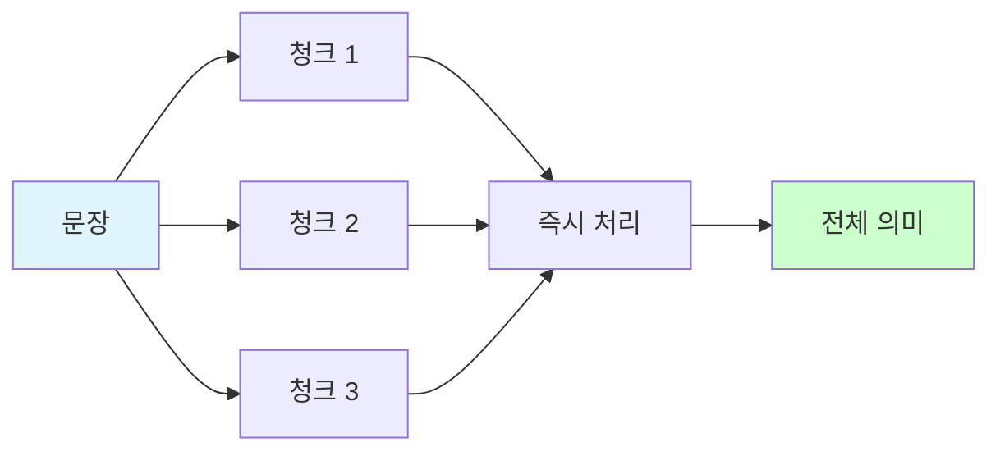

**청크 단위**:
| 청크 유형 | 설명 | 예시 |
|-----------|------|------|
| **명사구** | 명사 + 수식어 | the beautiful girl |
| **전치사구** | 전치사 + 명사 | in the morning |
| **동사구** | 조동사 + 동사 | will be going |
| **절** | 접속사 + 주어 + 동사 | because it was raining |

**청킹 훈련**:
```
문장: The researchers at the university conducted 
       a comprehensive study on climate change.

❌ 단어별: The / researchers / at / the / university / ...
⏱️ 느림

✅ 청킹: [The researchers at the university] / [conducted] / 
         [a comprehensive study] / [on climate change]
⚡ 빠름

결과: 속도 2-3배 향상!
```

### 📝 청킹 단계별 마스터 프로그램

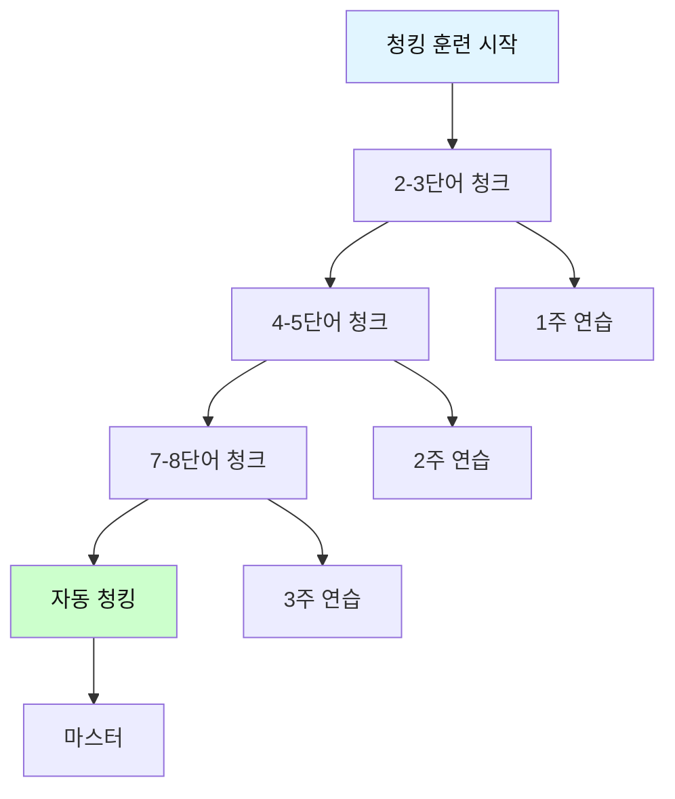

**Step 1: 2-3단어 청킹 (1주차)**

```
목표: 기본 청크 단위 익히기

예문 1:
"I love you."
청킹: [I love] [you]
2개 청크

예문 2:
"The cat sleeps well."
청킹: [The cat] [sleeps well]
2개 청크

예문 3:
"She drinks coffee every morning."
청킹: [She drinks] [coffee] [every morning]
3개 청크

일일 연습:
- 20개 문장 청킹 연습
- 소요 시간: 15분
- 1주일 후: 140개 문장 마스터
```

**Step 2: 4-5단어 청킹 (2주차)**

```
목표: 복잡한 청크 처리

예문 1:
"The beautiful girl with long hair smiled."
청킹: [The beautiful girl with long hair] [smiled]
2개 청크 (하나가 6단어!)

예문 2:
"I want to learn English as quickly as possible."
청킹: [I want to learn] [English] [as quickly as possible]
3개 청크

예문 3:
"The company announced plans to expand into Asian markets."
청킹: [The company] [announced plans] [to expand into Asian markets]
3개 청크
```

**Step 3: 자동 청킹 (3-4주차)**

```
목표: 의식하지 않고 자동으로 청킹

긴 문장 예시:
"Despite the challenging economic conditions that many 
countries are facing, experts remain optimistic about 
the prospects for global recovery in the coming year."

자동 청킹:
[Despite the challenging economic conditions] 
[that many countries are facing] 
[experts remain optimistic] 
[about the prospects for global recovery] 
[in the coming year]

5개 청크로 즉시 이해!
```

### 📊 청킹 유형별 훈련표

| 청크 유형 | 패턴 | 예시 | 난이도 | 연습량 |
|----------|------|------|--------|--------|
| **명사구** | the + adj + N | the big house | ⭐ | 매일 20개 |
| **전치사구** | prep + N | in the room | ⭐ | 매일 15개 |
| **동사구** | V + V | will be going | ⭐⭐ | 매일 15개 |
| **부정사구** | to + V | to study hard | ⭐⭐ | 매일 10개 |
| **분사구** | V-ing/V-ed + N | walking slowly | ⭐⭐⭐ | 매일 10개 |
| **관계절** | who/which + S+V | who loves me | ⭐⭐⭐ | 매일 5개 |
| **접속사절** | conj + S+V | because I'm tired | ⭐⭐⭐ | 매일 5개 |

### 🎯 청킹 실전 문제

**문제 세트 1: 기초 청킹 (10문장)**

```
다음 문장을 청크로 나누고 빠르게 읽으세요:

1. "My brother studies mathematics at university."
   청크: [___] [___] [___]
   
2. "The old man walks slowly in the park."
   청크: [___] [___] [___]
   
3. "She will visit her grandmother next weekend."
   청크: [___] [___] [___]
   
4. "I need to finish this work before tomorrow."
   청크: [___] [___] [___]
   
5. "The children are playing happily in the garden."
   청크: [___] [___] [___]
```

**문제 세트 2: 중급 청킹 (5문장)**

```
1. "The manager of the marketing department announced 
    new policies yesterday."
   청크: [___] [___] [___]

2. "Scientists working at the research center discovered 
    a breakthrough treatment."
   청크: [___] [___] [___]

3. "People who exercise regularly tend to live longer 
    and healthier lives."
   청크: [___] [___] [___]

4. "Despite facing numerous challenges, the team 
    completed the project on time."
   청크: [___] [___] [___]

5. "The government is planning to invest heavily in 
    renewable energy sources."
   청크: [___] [___] [___]
```

**문제 세트 3: 고급 청킹 (3문장)**

```
1. "Although many economists predicted a recession, 
    the economy showed surprising resilience, driven 
    by strong consumer spending and robust job growth."
   청크 개수: ___ 개
   읽는 시간: ___ 초
   
2. "The research team, which included experts from 
    five different countries, spent three years 
    analyzing data collected from thousands of 
    participants across multiple continents."
   청크 개수: ___ 개
   읽는 시간: ___ 초

3. "Companies that fail to adapt to rapidly changing 
    market conditions and emerging technologies often 
    find themselves struggling to compete with more 
    innovative rivals."
   청크 개수: ___ 개
   읽는 시간: ___ 초
```

### 💪 청킹 속도 챌린지

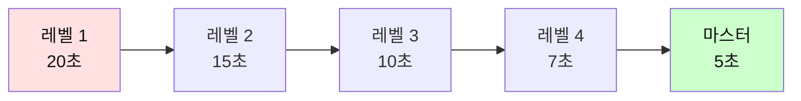

**챌린지 문장**:
```
"The innovative technology developed by the research team 
has the potential to revolutionize the way we approach 
environmental challenges in urban areas."

목표:
- 레벨 1: 20초 이내 (초급)
- 레벨 2: 15초 이내 (중급)
- 레벨 3: 10초 이내 (고급)
- 레벨 4: 7초 이내 (전문가)
- 마스터: 5초 이내 (완벽!)

당신의 기록: ___ 초
```

---

## 💡 고급 직독직해 전략

### 전략 1: 시각적 처리

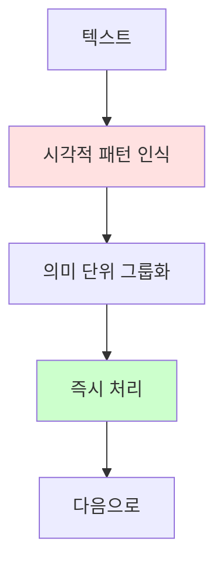

**방법**:
- 단어를 읽지 말고 "보라"
- 의미 덩어리를 이미지로 인식
- 번역 과정 완전 제거

**예문**:
```
I love coffee.

❌ 초급: 아이(I) + 러브(love) + 커피(coffee) → "나는 커피를 사랑한다"
✅ 고급: [이미지: 커피 좋아하는 나] → 즉시 이해

시간 차이: 2배
```

---

### 전략 2: 예측 독해

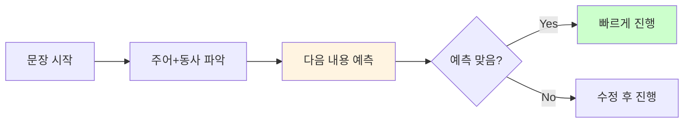

**예문**:
```
Scientists discovered...

예측: "무언가를 발견했다" → 아마도 새로운 것? 중요한 것?

Scientists discovered a new planet.

예측 맞음! → 빠르게 이해

효과: 문맥 파악 능력 향상, 속도 증가
```

---

### 전략 3: 핵심만 읽기

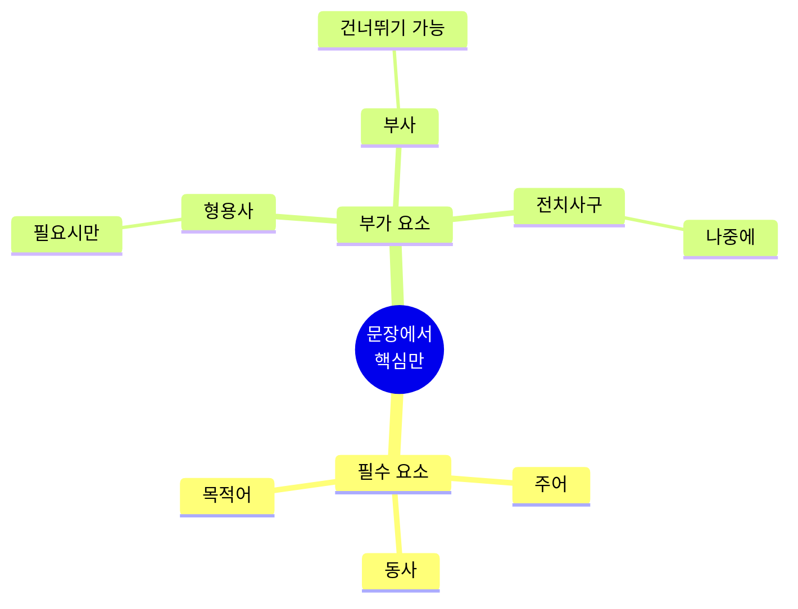

**예문 비교**:
```
원문:
The incredibly talented young scientist, who graduated 
from Harvard University with honors, recently made an 
absolutely groundbreaking discovery in the field of 
quantum physics.

핵심만 (50% 읽기):
The scientist made a discovery in quantum physics.
→ 과학자가 양자물리학에서 발견을 했다

이해도: 80% 달성
시간: 50% 절약
```

---

## 📖 상황별 독해 전략

### 상황 1: 시간 부족할 때 (빠른 파악)

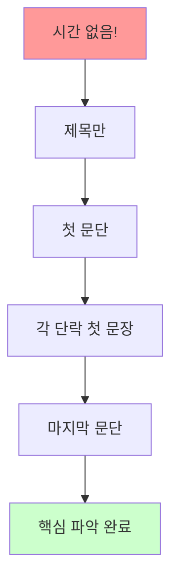

**전략**: 스키밍 집중
- 전체의 20% 읽기
- 핵심 70% 파악
- 시간 80% 절약

---

### 상황 2: 정확한 이해 필요 (정독)

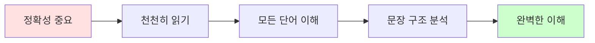

**전략**: 정독 + 분석
- 전체 100% 읽기
- 이해도 95%+ 목표
- 시간 충분히 사용

---

### 상황 3: 특정 정보 찾기

```mermaid
flowchart LR
    A[정보 검색] --> B[키워드 설정]
    B --> C[스캐닝]
    C --> D[발견]
    D --> E[해당 부분만 정독]
    
    style B fill:#fff4e1
    style E fill:#ccffcc
```

**전략**: 스캐닝 집중
- 전체의 5-10% 읽기
- 필요한 정보만 100% 파악
- 시간 90% 절약

---

## 🎓 장르별 독해 전략

### 1. 뉴스 기사

```mermaid
graph TD
    A[뉴스 기사] --> B[역삼각형 구조]
    B --> C[첫 문단: 가장 중요]
    C --> D[중간: 상세 정보]
    D --> E[끝: 배경 정보]
    
    style C fill:#ffe1e1
    style E fill:#e1f5ff
```

**전략**:
- 첫 2-3 문장에 모든 핵심
- 나머지는 선택적 읽기
- 5W1H 중심 파악

---

### 2. 소설/스토리

```mermaid
mindmap
  root((소설 읽기))
    플롯 파악
      시작
      전개
      절정
      결말
    캐릭터
      주인공
      성격
      변화
    배경
      시간
      장소
      분위기
```

**전략**:
- 전체 읽기 (스키밍 X)
- 감정이입하며 읽기
- 이미지 상상하며 읽기

---

### 3. 기술 문서

```
전략:
1. 목차 먼저 보기
2. 필요한 섹션만 선택
3. 예제 코드/다이어그램 집중
4. 단계별로 이해
```

---

### 4. 법률/계약서

```
전략:
1. 매우 천천히 정독
2. 각 조항 완벽 이해
3. 모르는 용어 즉시 검색
4. 중요 부분 하이라이트
5. 필요시 전문가 상담
```

---

## 📊 독해 속도 향상 훈련

### 4주 속독 프로그램

```mermaid
gantt
    title 속독 4주 완성
    dateFormat  YYYY-MM-DD
    
    section 1주차
    기초 체력    :a1, 2024-01-01, 7d
    
    section 2주차
    청킹 마스터    :a2, 2024-01-08, 7d
    
    section 3주차
    스키밍 스캐닝    :a3, 2024-01-15, 7d
    
    section 4주차
    통합 훈련    :a4, 2024-01-22, 7d
```

### 📅 상세 주차별 훈련 계획

| 주차 | 목표 WPM | 핵심 기술 | 일일 시간 | 훈련 내용 | 측정 지표 |
|------|----------|----------|----------|----------|----------|
| **1주** | 150 → 180 | 직독직해 강화 | 30분 | 주어+동사 파악 | 정확도 80%+ |
| **2주** | 180 → 220 | 청킹 집중 | 30분 | 3-5단어 묶기 | WPM +40 |
| **3주** | 220 → 260 | 스키밍/스캐닝 | 30분 | 전략적 읽기 | 시간 50% 단축 |
| **4주** | 260 → 300+ | 실전 통합 | 30분 | 모든 기술 적용 | 이해도 85%+ |

### 📊 일별 상세 훈련 루틴

**1주차: 직독직해 기초 다지기**

```mermaid
flowchart TD
    A[월요일] --> A1[주어+동사 찾기 20분]
    A1 --> A2[테스트 10분]
    
    B[화요일] --> B1[목적어 추가 20분]
    B1 --> B2[테스트 10분]
    
    C[수요일] --> C1[수식어 처리 20분]
    C1 --> C2[테스트 10분]
    
    D[목요일] --> D1[복합문 연습 20분]
    D1 --> D2[테스트 10분]
    
    E[금요일] --> E1[종합 훈련 20분]
    E1 --> E2[주간 평가 10분]
    
    style A fill:#e1f5ff,color:#111
    style E fill:#ccffcc,color:#111
```

| 요일 | 세부 활동 | 연습량 | 목표 |
|------|----------|--------|------|
| **월** | 주어+동사 집중 | 문장 50개 | 정확도 90% |
| **화** | 목적어/보어 추가 | 문장 40개 | 정확도 85% |
| **수** | 수식어 처리 | 문장 35개 | 정확도 80% |
| **목** | 접속사 문장 | 문장 30개 | 정확도 80% |
| **금** | 종합 테스트 | 단락 5개 | WPM 180 |

**2주차: 청킹 마스터**

```mermaid
mindmap
  root((2주차 청킹))
    월화
      2-3단어 청크
      명사구 집중
      50개 연습
    수목
      4-5단어 청크
      전치사구 추가
      40개 연습
    금
      자동 청킹
      긴 문장
      종합 평가
```

**3주차: 전략적 독해**

| 요일 | 전략 | 교재 | 분량 | 목표 시간 | 이해도 |
|------|------|------|------|----------|--------|
| **월** | 스키밍 기초 | 뉴스 | 300단어×3 | 각 2분 | 70% |
| **화** | 스키밍 심화 | 기사 | 500단어×2 | 각 3분 | 75% |
| **수** | 스캐닝 기초 | 이메일 | 200단어×5 | 각 1분 | 90% |
| **목** | 스캐닝 심화 | 리포트 | 800단어 | 5분 | 85% |
| **금** | 통합 전략 | 혼합 | 1000단어 | 6분 | 80% |

**4주차: 실전 완성**

```
Day 1-2: 시험 대비 연습
- 모의 독해 시험 3회
- 시간 제한 엄수
- 오답 분석

Day 3-4: 실무 문서 연습
- 이메일 50통 처리
- 보고서 3개 분석
- 실전 속도 향상

Day 5: 종합 평가
- 최종 WPM 측정
- 이해도 테스트
- 4주 성과 점검
```

### 🎯 진도 측정 체크리스트

**주간 자가 평가표**:

```
[1주차 체크리스트]
□ 주어+동사를 즉시 찾을 수 있다
□ 번역 없이 이해하는 문장이 늘었다
□ WPM이 30 이상 증가했다
□ 이해도가 80% 이상이다
□ 매일 30분씩 훈련했다

점수: ___/5

[2주차 체크리스트]
□ 3-5단어를 한 덩어리로 읽는다
□ 명사구, 전치사구를 바로 인식한다
□ 읽는 속도가 눈에 띄게 빨라졌다
□ WPM이 40 이상 증가했다
□ 긴 문장도 청킹으로 처리한다

점수: ___/5

[3주차 체크리스트]
□ 스키밍으로 핵심을 빠르게 파악한다
□ 스캐닝으로 정보를 즉시 찾는다
□ 상황에 맞는 전략을 선택할 수 있다
□ WPM이 40 이상 증가했다
□ 시간이 50% 이상 단축되었다

점수: ___/5

[4주차 최종 평가]
□ 목표 WPM 300 이상 달성
□ 이해도 85% 이상 유지
□ 다양한 전략을 자유롭게 사용
□ 실전 문서를 효율적으로 처리
□ 독해가 즐겁고 자신감이 생겼다

점수: ___/5

총점: ___/20
18-20: 완벽! 마스터 수준
15-17: 훌륭함! 고급 수준
12-14: 좋음! 계속 연습
9-11: 보통. 더 노력 필요
0-8: 다시 복습 필요
```

---

### 일일 훈련 루틴

```mermaid
flowchart LR
    A[10분<br/>워밍업] --> B[15분<br/>집중 훈련]
    B --> C[10분<br/>속도 측정]
    C --> D[5분<br/>복습]
    
    style A fill:#e1f5ff,color:#111
    style B fill:#ffe1e1,color:#111
    style C fill:#fff4e1,color:#111
    style D fill:#ccffcc,color:#111
```

| 시간 | 활동 | 내용 |
|------|------|------|
| **0-10분** | 워밍업 | 쉬운 글 편하게 읽기 |
| **10-25분** | 집중 훈련 | 난이도 있는 글 청킹 연습 |
| **25-35분** | 속도 측정 | 타이머 재고 WPM 측정 |
| **35-40분** | 복습 | 이해도 확인 및 정리 |

---

## 💪 독해 속도 측정법

### WPM (Words Per Minute) 계산

```
공식: WPM = (단어 수 ÷ 소요 시간(분)) × 이해도

예시:
- 글자 수: 500단어
- 소요 시간: 2분 30초 = 2.5분
- 이해도: 80% = 0.8

WPM = (500 ÷ 2.5) × 0.8 = 200 × 0.8 = 160 WPM
```

### 이해도 측정법

```
방법 1: 질문 답하기
- 글 읽은 후 질문 10개
- 맞은 개수 / 10 = 이해도

방법 2: 요약하기
- 핵심 3가지 말하기
- 정확도 자가 평가

방법 3: 다시 설명하기
- 다른 사람에게 설명
- 설명 가능 여부로 판단
```

---

## 🎯 고급 기술: 속독의 비밀

### 비밀 1: 안구 운동 최소화

```mermaid
flowchart LR
    A[일반 읽기] --> B[단어마다 멈춤]
    B --> C[시간 낭비]
    
    D[속독] --> E[3-5단어씩 묶어]
    E --> F[빠른 독해]
    
    style C fill:#ffcccc
    style F fill:#ccffcc
```

**훈련**:
- 한 번에 더 많은 단어 보기
- 주변 시야 활용
- 고정 횟수 줄이기

---

### 비밀 2: 소리 내지 않기

```
❌ 나쁜 습관: 머릿속으로 소리 내서 읽기
   → 말하는 속도에 제한 (150-200 WPM)

✅ 좋은 습관: 시각적으로만 처리
   → 생각 속도로 읽기 (300-500 WPM)
```

**훈련**:
- 의식적으로 입 다물기
- 음악 들으며 읽기
- 매우 빠르게 읽기 연습

---

### 비밀 3: 되돌아가지 않기

```mermaid
flowchart LR
    A[문장 시작] --> B[앞으로만]
    B --> C[앞으로만]
    C --> D[앞으로만]
    D --> E[끝]
    
    A -.X.-> F[뒤로 가기]
    F -.X.-> G[시간 낭비]
    
    style E fill:#ccffcc
    style G fill:#ffcccc
```

**훈련**:
- 손가락으로 가이드하며 읽기
- 강제로 앞으로만 진행
- 이해 안 돼도 일단 진행

---

## 📚 비판적 독해 (Critical Reading)

```mermaid
mindmap
  root((비판적<br/>독해))
    분석
      주장 파악
      근거 확인
      논리 구조
    평가
      신뢰성
      타당성
      편향성
    종합
      다른 견해
      자신의 의견
      결론 도출
```

### 비판적 질문 리스트

| 질문 유형 | 질문 내용 |
|-----------|-----------|
| **목적** | 저자의 목적은? |
| **주장** | 핵심 주장은? |
| **근거** | 근거가 충분한가? |
| **논리** | 논리적인가? |
| **편향** | 편향이 있는가? |
| **대안** | 다른 관점은? |

---

## 🎯 실전 적용 전략

```mermaid
mindmap
  root((실전 시나리오))
    학업
      시험
      논문
      교과서
    업무
      이메일
      보고서
      계약서
    일상
      뉴스
      소설
      블로그
```

### 시나리오 1: 시험 독해 (30분, 4지문)

```mermaid
flowchart LR
    A[30분 시작] --> B[지문1<br/>7분]
    B --> C[지문2<br/>7분]
    C --> D[지문3<br/>7분]
    D --> E[지문4<br/>7분]
    E --> F[검토<br/>2분]
    
    style A fill:#e1f5ff,color:#111
    style F fill:#ccffcc,color:#111
```

**상세 전략**:

| 단계 | 시간 | 활동 | 기술 |
|------|------|------|------|
| 1 | 1분 | 질문 먼저 읽기 | 스캐닝 준비 |
| 2 | 2분 | 지문 스키밍 | 전체 구조 파악 |
| 3 | 3분 | 답 찾기 | 스캐닝 |
| 4 | 1분 | 확인 및 마킹 | 정확도 체크 |

**예제 문제**:
```
지문 (250단어):
Climate change represents one of the most pressing 
challenges of our time. Rising global temperatures are 
causing ice caps to melt, sea levels to rise, and weather 
patterns to become increasingly unpredictable. Scientists 
warn that without immediate action, these effects will 
become irreversible within the next decade...

[나머지 내용]

The solution requires global cooperation. Countries must 
work together to reduce carbon emissions, invest in 
renewable energy, and protect natural ecosystems. While 
the challenge is immense, the cost of inaction would be 
far greater.

질문 (각 1분 30초):
1. What is the main topic of the passage?
   A) Global cooperation
   B) Climate change challenges
   C) Renewable energy
   D) Natural ecosystems

2. According to the passage, when will effects become 
   irreversible?
   A) Within 5 years
   B) Within 10 years
   C) Within 20 years
   D) Not mentioned

3. What does "pressing" mean in line 2?
   A) Urgent
   B) Heavy
   C) Printing
   D) Difficult

4. What is NOT mentioned as an effect of climate change?
   A) Melting ice caps
   B) Rising sea levels
   C) Economic recession
   D) Unpredictable weather

5. What is the author's tone?
   A) Optimistic
   B) Warning
   C) Neutral
   D) Humorous

답: 1-B, 2-B, 3-A, 4-C, 5-B
```

### 시나리오 2: 업무 이메일 (100통/일)

```mermaid
graph TD
    A[이메일 100통] --> B{우선순위 분류}
    B -->|긴급 5통| C[정독 5분]
    B -->|중요 30통| D[스키밍 30분]
    B -->|참고 65통| E[제목만 10분]
    
    C --> F[총 45분]
    D --> F
    E --> F
    
    style A fill:#ffe1e1,color:#111
    style F fill:#ccffcc,color:#111
```

**이메일 처리 전략표**:

| 우선순위 | 비율 | 전략 | 시간/통 | 총 시간 |
|----------|------|------|---------|---------|
| **긴급** | 5% | 정독 | 1분 | 5분 |
| **중요** | 30% | 스키밍 | 1분 | 30분 |
| **참고** | 65% | 제목만 | 10초 | 10분 |
| **합계** | 100% | - | - | **45분** |

*기존 2시간 → 45분 = 60% 시간 절약!*

**실전 예제**:
```
[긴급 이메일]
Subject: URGENT: Server Down - Immediate Action Required
→ 전략: 즉시 정독 (1분)

[중요 이메일]
Subject: Q4 Budget Review Meeting Tomorrow
→ 전략: 스키밍으로 핵심만 (1분)

[참고 이메일]
Subject: FYI: Company Newsletter - December Edition
→ 전략: 제목만 보고 나중에 (10초)
```

### 시나리오 3: 전문서적 (300페이지)

```mermaid
gantt
    title 한 달 1권 완독 전략
    dateFormat  YYYY-MM-DD
    
    section 1주차
    목차+요약 스키밍    :a1, 2024-01-01, 7d
    
    section 2주차
    핵심 장 정독    :a2, 2024-01-08, 7d
    
    section 3주차
    나머지 훑어보기    :a3, 2024-01-15, 7d
    
    section 4주차
    전체 복습+메모    :a4, 2024-01-22, 7d
```

**주차별 전략**:

| 주차 | 분량 | 전략 | 시간 | 목표 |
|------|------|------|------|------|
| **1주** | 전체 훑기 | 스키밍 | 3시간 | 구조 파악 |
| **2주** | 핵심 100p | 정독 | 5시간 | 깊은 이해 |
| **3주** | 나머지 200p | 선택적 읽기 | 4시간 | 보충 지식 |
| **4주** | 전체 복습 | 메모 정리 | 2시간 | 완전 습득 |

**실전 적용 예제**:
```
책: "Deep Learning" (700페이지)

1주차 (스키밍):
- Day 1: 목차 분석 (30분)
- Day 2-3: 각 장 첫/마지막 페이지 (2시간)
- Day 4-5: 다이어그램과 요약 (2시간)
- Day 6-7: 전체 구조 정리 (1시간)
→ 결과: 책의 30% 이해

2주차 (정독):
- 핵심 3-4장 선택
- 하루 20페이지씩
- 예제 코드 실습
→ 결과: 핵심 내용 80% 이해

3주차 (선택적 읽기):
- 관심 있는 부분만
- 빠르게 훑어보기
- 참고 자료로 활용
→ 결과: 전체 60% 파악

4주차 (복습):
- 노트 정리
- 핵심 개념 복습
- 실전 적용 계획
→ 결과: 완독 + 실용화
```

### 시나리오 4: 논문 읽기 (20페이지)

```
전략: Abstract → Conclusion → Introduction → Method

시간 배분:
- Abstract (초록): 5분 - 전체 요약
- Conclusion (결론): 10분 - 핵심 결과
- Introduction (서론): 15분 - 배경 이해
- Method (방법론): 필요시만 - 선택적

총 30분으로 논문 핵심 파악!
(전체 읽기: 2시간 → 75% 시간 절약)
```

### 시나리오 5: 뉴스 속보 (매일 10개)

```
전략: 첫 2문장 집중 읽기

1개당 소요 시간:
- 제목: 3초
- 첫 2문장: 20초
- 판단: 더 읽을지 결정

10개 뉴스: 5분 완료
핵심 정보: 90% 파악
```

---

## 📝 종합 평가 테스트

### 레벨 테스트 1: 초급 (목표: WPM 150, 이해도 70%)

```
지문 (150단어, 목표 시간: 1분):

My name is Sarah. I am from Canada. I live in Toronto 
with my family. Toronto is a big city. It has many tall 
buildings and beautiful parks.

I am a teacher. I teach English at a high school. I love 
my job because I enjoy helping students learn. My students 
are very kind and hardworking.

Every morning, I wake up at 6 o'clock. I eat breakfast 
and drink coffee. Then I drive to school. School starts 
at 8:30 AM. I teach five classes every day.

After work, I go home and cook dinner. I like cooking 
Italian food. In the evening, I read books or watch TV. 
I go to bed at 10 PM.

On weekends, I spend time with my family. We often visit 
parks or go shopping. Sometimes we eat at restaurants. 
I am happy with my life.

시간 측정: ____ 분 ____ 초
WPM 계산: 150 ÷ (    ) = ____ WPM

질문:
1. Where is Sarah from? __________
2. What is her job? __________
3. What time does school start? __________
4. What does she do in the evening? __________
5. Who does she spend weekends with? __________

정답: 1.Canada, 2.Teacher, 3.8:30 AM, 4.Read/Watch TV, 
      5.Family

점수: ___/5 = ___% 이해도
```

### 레벨 테스트 2: 중급 (목표: WPM 200, 이해도 80%)

```
지문 (300단어, 목표 시간: 1분 30초):

The rise of remote work has fundamentally changed how 
companies operate around the world. What began as an 
emergency response to the COVID-19 pandemic has evolved 
into a permanent shift in workplace culture. Many 
organizations have discovered that employees can be just 
as productive, if not more so, when working from home.

This transformation has brought numerous benefits. 
Employees save time and money by eliminating commutes, 
while companies can reduce overhead costs associated with 
maintaining large office spaces. Additionally, remote work 
allows companies to hire talent from anywhere in the world, 
rather than being limited to candidates within commuting 
distance of their offices.

However, challenges remain. Some employees struggle with 
the isolation of working from home and miss the social 
interactions of office life. Communication can be more 
difficult when team members are spread across different 
time zones. Companies must also invest in technology and 
cybersecurity to support remote workers effectively.

Despite these challenges, most experts believe that remote 
work is here to stay. The future will likely involve 
hybrid models, where employees split their time between 
home and office. This flexibility represents a significant 
improvement in work-life balance for many people, though 
it requires both employers and employees to adapt to new 
ways of collaborating and communicating.

시간 측정: ____ 분 ____ 초
WPM 계산: 300 ÷ (    ) = ____ WPM

질문:
1. 원격 근무의 주요 계기는?
2. 직원의 이점 2가지는?
3. 회사의 이점 2가지는?
4. 원격 근무의 도전 과제 3가지는?
5. 미래 예상되는 모델은?
6. 저자의 전체적인 입장은?

정답: 1.COVID-19, 2.시간/비용 절약+통근 제거, 
      3.오버헤드 비용 감소+글로벌 인재 채용,
      4.고립감+의사소통 어려움+기술/보안 투자 필요,
      5.하이브리드 모델, 6.긍정적이지만 현실적

점수: ___/6 = ___% 이해도
```

### 레벨 테스트 3: 고급 (목표: WPM 250, 이해도 85%)

```
지문 (500단어, 목표 시간: 2분):

Artificial intelligence has progressed from a theoretical 
concept to a practical technology that permeates nearly 
every aspect of modern life. Machine learning algorithms 
now power everything from smartphone assistants to 
sophisticated medical diagnostic systems. Yet despite 
these remarkable advances, the technology faces significant 
limitations and raises important ethical questions that 
society must address.

One fundamental challenge is the "black box" problem. 
Many AI systems, particularly deep neural networks, arrive 
at their conclusions through processes that even their 
creators cannot fully explain. This opacity becomes 
problematic when AI is used in high-stakes decisions such 
as loan approvals, hiring decisions, or criminal 
sentencing. If we cannot understand how an AI reached a 
particular decision, how can we ensure that decision is 
fair and unbiased?

Bias in AI systems represents another critical concern. 
These systems learn from historical data, which often 
reflects existing societal prejudices. For example, if an 
AI is trained on hiring data from a company that 
historically favored male candidates, the system may 
perpetuate this bias. Researchers have documented cases 
where facial recognition systems perform poorly on people 
with darker skin tones, and where language models generate 
stereotypical or offensive content.

The concentration of AI development in the hands of a few 
large technology companies also raises concerns about 
power and accountability. These companies possess the vast 
computational resources and data necessary to train 
state-of-the-art AI systems, giving them enormous influence 
over how the technology develops and is deployed. Some 
experts worry that this concentration could lead to 
monopolistic practices or the development of AI systems 
that primarily serve corporate interests rather than the 
public good.

Despite these challenges, many researchers remain 
optimistic about AI's potential to benefit humanity. They 
argue that with proper regulation, transparency 
requirements, and diverse teams working on AI development, 
we can harness its power while mitigating its risks. The 
key, they suggest, is to approach AI development 
thoughtfully and ethically, always keeping human values 
at the center of our technological progress.

시간 측정: ____ 분 ____ 초
WPM 계산: 500 ÷ (    ) = ____ WPM

비판적 독해 질문:
1. 저자의 주요 주장은? (한 문장으로)
2. "black box" 문제가 왜 중요한가?
3. AI 편향의 원인과 예시는?
4. 대기업 집중의 위험성은?
5. 저자가 제시하는 해결책은?
6. 저자의 전반적인 입장은? (찬성/반대/균형)
7. 이 글의 논리 구조는?
   A) 문제 제시 → 해결책
   B) 찬성 → 반대
   C) 현황 → 문제점 → 전망
8. 근거는 충분히 제시되었는가?
9. 빠진 관점이나 반론은?
10. 당신의 의견은?

정답 예시:
1. AI는 유용하지만 편향과 투명성 문제를 해결해야 함
2. 고위험 결정의 공정성을 보장할 수 없기 때문
3. 원인: 편향된 학습 데이터 / 예시: 채용, 얼굴인식
4. 독점 우려, 기업 이익 우선 가능성
5. 규제, 투명성, 다양한 개발팀
6. 균형 (낙관적이지만 신중함 강조)
7. C
8. 예 (구체적 예시 제시)
9. 경제적 측면, 개발도상국 관점 등
10. (자유 답변)

점수: ___/10 = ___% 이해도
```

### 레벨 테스트 4: 전문가 (목표: WPM 300+, 이해도 90%)

**스키밍 테스트 (800단어, 3분)**:
```
지문: [복잡한 학술 논문 스타일]

과제:
1. 3분 안에 스키밍
2. 핵심 주장 5가지 파악
3. 논리 구조 파악
4. 저자의 입장 판단
5. 비판적 평가

평가 기준:
- 시간: 3분 이내 (Pass/Fail)
- 핵심 파악: 5/5
- 구조 이해: 정확
- 비판적 사고: 우수

WPM: 800 ÷ 3 = 267+ WPM
종합: 전문가 수준!
```

---

## 💯 자가 진단 및 레벨 판정

### 종합 평가표

```mermaid
flowchart TD
    A[테스트 완료] --> B{WPM?}
    B -->|100-150| C[초급]
    B -->|150-200| D[중급]
    B -->|200-300| E[고급]
    B -->|300+| F[전문가]
    
    C --> C1[1개월 집중 훈련]
    D --> D1[2개월 향상 과정]
    E --> E1[고급 기술 마스터]
    F --> F1[전문 분야 확장]
    
    style A fill:#e1f5ff,color:#111
    style F fill:#ccffcc,color:#111
```

| 레벨 | WPM | 이해도 | 진단 | 처방 |
|------|-----|--------|------|------|
| **초급** | <150 | <70% | 기초 부족 | 4주 기초 과정 |
| **중급** | 150-200 | 70-80% | 발전 단계 | 6주 향상 과정 |
| **고급** | 200-300 | 80-90% | 숙련 단계 | 8주 마스터 과정 |
| **전문가** | 300+ | 90%+ | 완성 단계 | 실전 최적화 |

### 약점 진단 체크리스트

```
[ ] 단어를 모르면 멈춘다 → 문맥 추론 훈련
[ ] 번역하면서 읽는다 → 직독직해 집중
[ ] 문장 구조가 헷갈린다 → 구조 분석 연습
[ ] 속도가 느리다 → 청킹 훈련
[ ] 핵심을 못 찾는다 → 스키밍 연습
[ ] 세부 정보를 놓친다 → 스캐닝 연습
[ ] 긴 글이 부담된다 → 단계적 분량 증가
[ ] 집중이 안 된다 → 환경 개선, 시간 분할
```

---

## 💡 최종 팁 및 성공 전략

### 속독 향상을 위한 생활 습관

```mermaid
mindmap
  root((독해 마스터<br/>생활 습관))
    매일 읽기
      30분 필수
      다양한 장르
      꾸준함이 핵심
    환경 조성
      조용한 공간
      충분한 조명
      편안한 자세
      방해 요소 제거
    건강 관리
      충분한 수면
      눈 휴식 (20-20-20 규칙)
      집중력 관리
      스트레스 해소
    측정과 피드백
      주간 WPM 측정
      진도 기록
      약점 파악
      개선 계획
```

### 📊 실력 향상 추적표

**월간 성장 기록지**:

| 주차 | 날짜 | WPM | 이해도 | 훈련 시간 | 특이사항 |
|------|------|-----|--------|----------|----------|
| 1주 | / | | % | 분 | |
| 2주 | / | | % | 분 | |
| 3주 | / | | % | 분 | |
| 4주 | / | | % | 분 | |

**성장률 계산**:
```
시작 WPM: ____
현재 WPM: ____
향상률: (현재 - 시작) ÷ 시작 × 100 = ____%

목표 달성도: 현재 ÷ 목표 × 100 = ____%
```

---

## 🏆 성공 사례 및 실전 팁

### 성공 사례 1: 대학생 김영희 (4주 만에 WPM 150 → 280)

```mermaid
graph LR
    A[시작<br/>WPM 150] --> B[1주<br/>WPM 180]
    B --> C[2주<br/>WPM 210]
    C --> D[3주<br/>WPM 250]
    D --> E[4주<br/>WPM 280]
    
    style A fill:#ffe1e1,color:#111
    style E fill:#ccffcc,color:#111
```

**성공 요인**:
1. ✅ 매일 아침 30분 필수 훈련
2. ✅ 청킹 집중 연습 (2주차)
3. ✅ 다양한 텍스트로 연습
4. ✅ 주간 자가 평가 철저
5. ✅ 목표 명확 (토플 독해 만점)

**결과**: 토플 독해 28/30 → 30/30

---

### 성공 사례 2: 직장인 박준호 (업무 효율 3배 향상)

**Before**:
- 업무 이메일 처리: 2시간/일
- 영문 보고서 읽기: 1시간/건
- 스트레스: 높음

**After (8주 훈련)**:
- 업무 이메일 처리: 40분/일 (67% 단축)
- 영문 보고서 읽기: 25분/건 (58% 단축)
- 스트레스: 낮음
- WPM: 180 → 320

**핵심 전략**:
- 스키밍으로 이메일 분류
- 스캐닝으로 핵심만 추출
- 청킹으로 빠른 처리

---

### 💡 전문가의 독해 비법 10가지

```mermaid
mindmap
  root((독해 비법))
    기술
      직독직해
      청킹
      예측 독해
    습관
      매일 읽기
      시간 측정
      복습
    전략
      상황별 적용
      약점 보완
      지속 개선
```

| 번호 | 비법 | 설명 | 효과 |
|------|------|------|------|
| 1 | **손가락 가이드** | 읽는 곳에 손가락 두기 | 집중력 2배 |
| 2 | **타이머 활용** | 항상 시간 재기 | 속도 의식 |
| 3 | **질문 먼저** | 지문 전에 질문 읽기 | 효율 50% ↑ |
| 4 | **예측 게임** | 다음 내용 예측하기 | 이해도 향상 |
| 5 | **소리 제거** | 머릿속 소리 없애기 | 속도 2배 |
| 6 | **주변 시야** | 단어 주변도 보기 | 청킹 자동화 |
| 7 | **되돌아가지 않기** | 한 번에 앞으로만 | 시간 절약 |
| 8 | **메모 최소화** | 핵심만 간단히 | 흐름 유지 |
| 9 | **배경지식 활용** | 아는 것 연결하기 | 이해 빠름 |
| 10 | **즐기기** | 재미있게 읽기 | 지속 가능 |

---

### 🎯 난이도별 추천 학습 자료

**초급 (WPM 100-150)**:
```
온라인 자료:
- VOA Learning English (느린 속도)
- Breaking News English (레벨별)
- Easy English News

오프라인:
- Graded Readers (Penguin Readers Level 2-3)
- 어린이 뉴스 (Time for Kids)
- 쉬운 영어 소설

일일 목표: 500-1000단어
```

**중급 (WPM 150-200)**:
```
온라인 자료:
- BBC Learning English
- The Guardian (쉬운 기사)
- Medium (관심 분야)

오프라인:
- Young Adult 소설
- National Geographic
- 일반 뉴스 기사

일일 목표: 1500-2000단어
```

**고급 (WPM 200-300)**:
```
온라인 자료:
- The Economist
- Scientific American
- Harvard Business Review

오프라인:
- 전문 서적
- 학술 논문
- 문학 작품

일일 목표: 3000-5000단어
```

**전문가 (WPM 300+)**:
```
도전 과제:
- 학술 저널 정기 구독
- 전문 분야 원서 읽기
- 다양한 장르 섭렵
- 속독 + 깊이 있는 이해 동시에

일일 목표: 5000-10000단어
```

---

### 📱 추천 도구 및 앱

```mermaid
graph TD
    A[독해 향상 도구] --> B[속도 측정]
    A --> C[훈련 앱]
    A --> D[읽기 자료]
    
    B --> B1[ReadingSoft]
    B --> B2[Spreeder]
    
    C --> C1[Elevate]
    C --> C2[Blinkist]
    
    D --> D1[Kindle]
    D --> D2[Pocket]
    
    style A fill:#e1f5ff,color:#111
```

**속도 측정 도구**:
- ⭐ Spreeder: 온라인 속독 훈련
- ⭐ ReadingSoft: WPM 자동 측정
- ⭐ 7 Speed Reading: 종합 프로그램

**독해 훈련 앱**:
- ⭐ Elevate: 종합 인지 훈련
- ⭐ ReadTheory: 레벨별 독해
- ⭐ Blinkist: 요약 읽기 연습

**읽기 자료 앱**:
- ⭐ Kindle: 전자책 + 사전
- ⭐ Pocket: 나중에 읽기
- ⭐ Feedly: RSS 피드 구독

---

### 🚧 흔한 실수와 해결법

```mermaid
flowchart TD
    A[흔한 실수] --> B[완벽주의]
    A --> C[너무 빠르게]
    A --> D[불규칙한 연습]
    A --> E[측정 안 함]
    
    B --> B1[해결: 80% 이해로 충분]
    C --> C1[해결: 이해도 우선]
    D --> D1[해결: 매일 조금씩]
    E --> E1[해결: 주간 측정]
    
    style A fill:#ffe1e1,color:#111
    style B1 fill:#ccffcc,color:#111
    style C1 fill:#ccffcc,color:#111
    style D1 fill:#ccffcc,color:#111
    style E1 fill:#ccffcc,color:#111
```

| 실수 | 문제점 | 해결법 | 효과 |
|------|--------|--------|------|
| **모든 단어 이해하려 함** | 속도 저하 | 80% 이해로 충분 | 속도 2배 |
| **처음부터 너무 빠르게** | 이해도 급락 | 단계적 증가 | 균형 유지 |
| **불규칙한 연습** | 실력 정체 | 매일 15분이라도 | 꾸준한 향상 |
| **측정하지 않음** | 진도 모름 | 주 1회 WPM 측정 | 동기 부여 |
| **한 가지 장르만** | 편협한 능력 | 다양한 텍스트 | 전방위 실력 |
| **피로할 때 연습** | 효율 저하 | 최적 시간 선택 | 효과 극대화 |
| **되돌아가기** | 시간 낭비 | 강제로 앞으로만 | 속도 향상 |

---

### 🎓 레벨별 3개월 마스터 플랜

**초급 → 중급 (3개월)**

```mermaid
gantt
    title 초급에서 중급으로 (WPM 120 → 200)
    dateFormat  YYYY-MM-DD
    
    section 1개월
    직독직해 기초    :a1, 2024-01-01, 30d
    
    section 2개월
    청킹 마스터    :a2, 2024-01-31, 30d
    
    section 3개월
    통합 훈련    :a3, 2024-03-01, 30d
```

| 월 | WPM 목표 | 핵심 기술 | 일일 시간 | 주간 평가 |
|----|----------|----------|----------|----------|
| 1월 | 120→150 | 직독직해 | 30분 | 매주 일요일 |
| 2월 | 150→180 | 청킹 | 35분 | 매주 일요일 |
| 3월 | 180→200 | 스키밍/스캐닝 | 40분 | 매주 일요일 |

**중급 → 고급 (3개월)**

| 월 | WPM 목표 | 핵심 기술 | 일일 시간 | 도전 과제 |
|----|----------|----------|----------|----------|
| 1월 | 200→230 | 고급 청킹 | 40분 | 논문 읽기 시작 |
| 2월 | 230→260 | 전략 통합 | 45분 | 전문서적 도전 |
| 3월 | 260→300 | 속독 마스터 | 50분 | 실전 적용 |

**고급 → 전문가 (3개월)**

| 월 | WPM 목표 | 핵심 기술 | 일일 시간 | 최종 목표 |
|----|----------|----------|----------|----------|
| 1월 | 300→350 | 다층적 독해 | 60분 | 복잡한 텍스트 |
| 2월 | 350→400 | 비판적 읽기 | 60분 | 분석적 이해 |
| 3월 | 400+ | 완벽한 유연성 | 유지 | 전문 분야 마스터 |

---

## 🚀 다음 단계 및 지속적 발전

### 독해 마스터 후 할 일

```mermaid
mindmap
  root((독해 마스터 이후))
    실전 적용
      업무
      학업
      일상
    깊이 더하기
      전문 분야
      학술 논문
      문학 작품
    폭 넓히기
      다양한 장르
      다른 언어
      멀티미디어
    가르치기
      경험 공유
      튜터링
      블로그/유튜브
```

### 지속적 발전 계획

**주간 루틴**:
```
월: 뉴스 기사 10개 (30분)
화: 전문 블로그 3개 (30분)
수: 학술 논문 1편 (45분)
목: 비즈니스 자료 (30분)
금: 소설 1챕터 (30분)
토: 관심 분야 자유 (60분)
일: 복습 + 다음 주 계획 (30분)
```

**월간 도전**:
```
□ 새로운 장르 1개 시도
□ 전문서적 1권 완독
□ WPM 5 이상 향상
□ 새로운 주제 영역 개척
□ 독해 기록 점검 및 분석
```

---

## 💪 최종 핵심 정리

### 독해 마스터의 7가지 원칙

```mermaid
graph TD
    A[독해 마스터] --> B[1. 직독직해]
    A --> C[2. 청킹]
    A --> D[3. 전략적 읽기]
    
    B --> E[번역 없이]
    C --> F[덩어리로]
    D --> G[상황별 전략]
    
    A --> H[4. 꾸준한 연습]
    A --> I[5. 측정과 개선]
    A --> J[6. 다양성]
    A --> K[7. 즐기기]
    
    style A fill:#ccffcc,color:#111
```

**7가지 황금 원칙**:

1. **직독직해 체화**: 영어를 영어로 이해하기
2. **청킹 자동화**: 의미 단위로 즉시 처리
3. **전략적 접근**: 상황에 맞는 전략 선택
4. **꾸준한 연습**: 매일 30분의 마법
5. **측정과 개선**: WPM과 이해도 지속 추적
6. **다양성 추구**: 여러 장르와 난이도 섭렵
7. **즐기기**: 재미있어야 오래간다

---

### 🎯 당신의 독해 여정

```
시작 → 초급 → 중급 → 고급 → 전문가 → 마스터
  ↓      ↓      ↓      ↓        ↓        ↓
 오늘   4주    3개월   6개월    1년     평생
```

**지금 당장 시작하세요!**

```
Step 1: 현재 WPM 측정 (레벨 테스트)
Step 2: 목표 설정 (언제까지 어느 수준?)
Step 3: 훈련 계획 수립 (일일/주간 루틴)
Step 4: 실행 (오늘부터 30분)
Step 5: 측정과 조정 (주 1회 점검)
```

---

💪 **핵심 정리**

1. ✅ **스키밍, 스캐닝, 청킹 마스터**: 3대 핵심 기술
2. ✅ **직독직해 완벽 체화**: 번역 없이 이해
3. ✅ **상황별 전략 활용**: 시험/업무/학습
4. ✅ **속도와 이해도 균형**: 둘 다 중요
5. ✅ **매일 꾸준한 연습**: 30분의 마법
6. ✅ **측정과 개선**: 진도 추적 필수
7. ✅ **다양한 텍스트**: 전방위 실력 향상

**당신도 할 수 있습니다! 🚀**

