# 독해 필수 문법 - 빠른 인식과 이해

## 🎯 독해용 문법 학습 철학

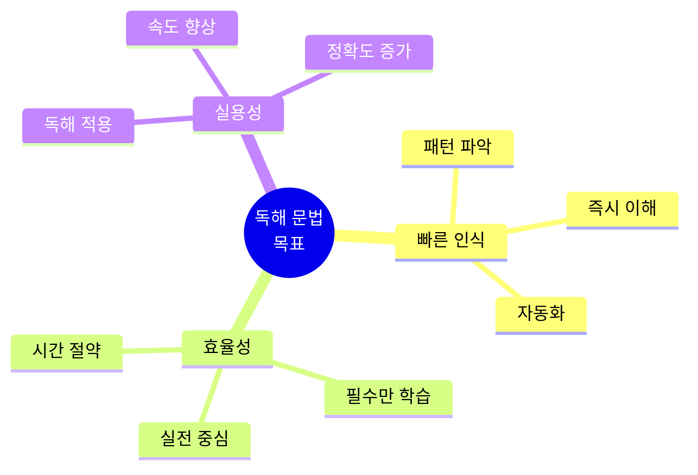

### ⚠️ 중요한 마인드셋

| 일반 문법 학습 (❌) | 독해용 문법 (✅) |
|---------------------|-------------------|
| 문법 규칙 암기 | 패턴 인식 훈련 |
| 문제 풀이 | 빠른 해석 |
| 완벽한 이해 | 핵심만 파악 |
| 시간 많이 소요 | 효율적 학습 |
| 시험 대비 | 실전 독해 |

---

## 📊 독해 필수 문법 우선순위

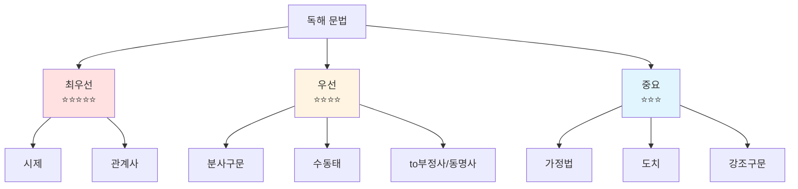

---

## ⏰ 시제 (Tense) - 최우선 ⭐⭐⭐⭐⭐

### 시제 타임라인

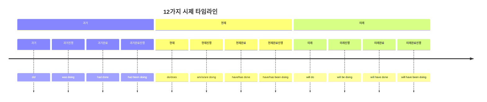

### 독해 시제 빠른 인식표

| 시제 | 형태 | 시간 표현 | 직독직해 키워드 | 빈도 |
|------|------|-----------|-----------------|------|
| **현재** | V/V-s | now, every day | ~한다 | ⭐⭐⭐⭐⭐ |
| **과거** | V-ed | yesterday, ago | ~했다 | ⭐⭐⭐⭐⭐ |
| **미래** | will V | tomorrow | ~할 것이다 | ⭐⭐⭐⭐ |
| **현재진행** | be V-ing | now | ~하고 있다 | ⭐⭐⭐⭐ |
| **현재완료** | have p.p. | since, for | ~해왔다 | ⭐⭐⭐⭐⭐ |
| **과거완료** | had p.p. | before | ~했었다 | ⭐⭐⭐ |

### 시제 독해 전략

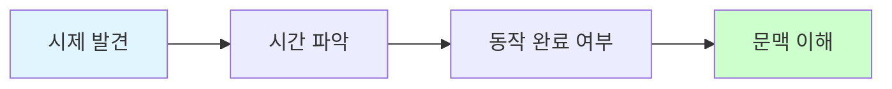

### 시제 실전 예문 - 상황별 패턴 (20개)

#### 📌 현재시제 패턴 (일상/습관)
```
1. I work at a tech company.
   ✅ work (현재형) → 습관/사실
   → "나는 / 일한다 / 기술 회사에서"

2. The sun rises in the east.
   ✅ rises → 불변의 진리
   → "태양은 / 뜬다 / 동쪽에서"

3. She speaks three languages fluently.
   ✅ speaks → 현재 능력
   → "그녀는 / 말한다 / 3개 언어를 / 유창하게"
```

#### 📌 과거시제 패턴 (완료된 행동)
```
4. I graduated from university in 2020.
   ✅ graduated → 과거 완료
   → "나는 / 졸업했다 / 대학을 / 2020년에"

5. The meeting started at 9 AM yesterday.
   ✅ started + yesterday → 명확한 과거
   → "회의가 / 시작했다 / 오전 9시에 / 어제"

6. They built this bridge 50 years ago.
   ✅ built + ago → 과거 특정 시점
   → "그들은 / 지었다 / 이 다리를 / 50년 전에"
```

#### 📌 미래시제 패턴 (계획/예측)
```
7. I will attend the conference next month.
   ✅ will attend → 미래 계획
   → "나는 / 참석할 것이다 / 회의에 / 다음 달"

8. The project will be completed by December.
   ✅ will be completed → 미래 수동
   → "프로젝트가 / 완료될 것이다 / 12월까지"

9. She is going to start her own business.
   ✅ be going to → 확정된 미래
   → "그녀는 / 시작할 것이다 / 자신의 사업을"
```

#### 📌 현재진행형 패턴 (진행중)
```
10. I am working on a new project right now.
    ✅ am working + right now → 현재 진행
    → "나는 / 작업중이다 / 새 프로젝트를 / 지금"

11. The team is discussing the budget.
    ✅ is discussing → 현재 진행
    → "팀이 / 논의중이다 / 예산을"

12. Scientists are studying this phenomenon.
    ✅ are studying → 현재 연구중
    → "과학자들이 / 연구중이다 / 이 현상을"
```

#### 📌 현재완료 패턴 (과거~현재 연결) ⭐⭐⭐
```
13. I have lived here for 5 years.
    ✅ have lived + for → 계속 (5년간 살아왔다)
    → "나는 / 살아왔다 / 여기에 / 5년간"

14. She has worked at Google since 2018.
    ✅ has worked + since → 계속 (2018년부터 지금까지)
    → "그녀는 / 일해왔다 / 구글에서 / 2018년부터"

15. I have read this book three times.
    ✅ have read → 경험 (3번 읽은 경험)
    → "나는 / 읽었다 / 이 책을 / 3번"

16. They have just finished the presentation.
    ✅ have finished + just → 완료 (방금 끝냈다)
    → "그들은 / 끝냈다 / 발표를 / 방금"

17. Have you ever been to Japan?
    ✅ Have you been → 경험 질문
    → "너는 / 가본 적 있니 / 일본에"
```

#### 📌 과거완료 패턴 (과거의 과거) ⭐⭐⭐
```
18. By the time he arrived, we had already left.
    ✅ had left → 과거완료 (그가 오기 전에 떠남)
    → "그가 도착했을 때 / 우리는 이미 / 떠났었다"

19. I had never seen such a beautiful sunset before.
    ✅ had never seen → 과거 이전 경험 없음
    → "나는 / 본 적 없었다 / 그런 아름다운 일몰을 / 전에"

20. She had finished her homework before dinner.
    ✅ had finished → 저녁 전에 이미 완료
    → "그녀는 / 끝냈었다 / 숙제를 / 저녁 전에"
```

---

## 🔗 관계사 (Relative) - 최우선 ⭐⭐⭐⭐⭐

### 관계사 구조

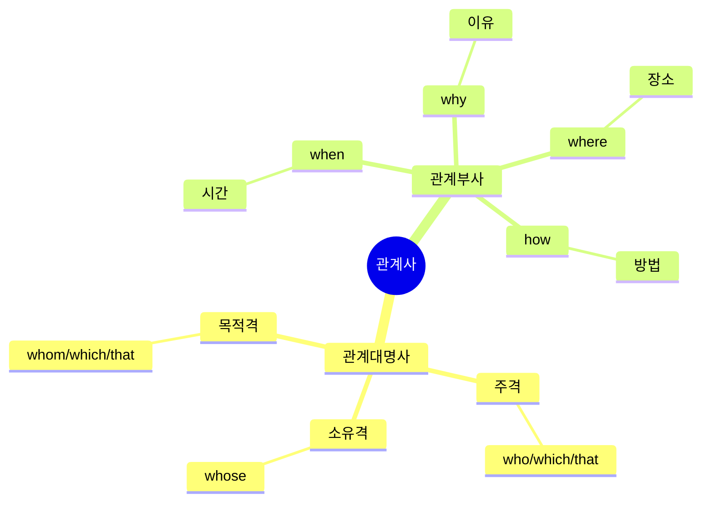

### 관계사 빠른 인식표

| 종류 | 사용 | 선행사 | 역할 | 생략 가능 | 빈도 |
|------|------|--------|------|-----------|------|
| **who** | 주격 | 사람 | 주어 | X | ⭐⭐⭐⭐⭐ |
| **whom** | 목적격 | 사람 | 목적어 | O | ⭐⭐ |
| **which** | 주/목적격 | 사물 | 주어/목적어 | 목적격만 O | ⭐⭐⭐⭐⭐ |
| **that** | 주/목적격 | 사람/사물 | 주어/목적어 | 목적격만 O | ⭐⭐⭐⭐⭐ |
| **whose** | 소유격 | 사람/사물 | 소유 | X | ⭐⭐⭐ |

### 관계사 독해 전략

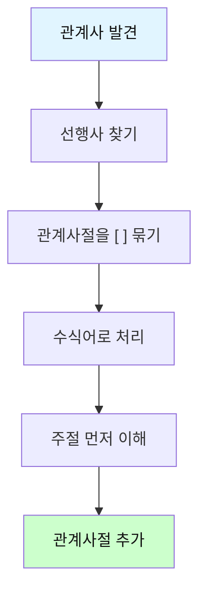

### 관계사 실전 예문 - 상황별 패턴 (20개)

#### 📌 주격 관계대명사 who (사람 - 주어) ⭐⭐⭐⭐⭐
```
21. The woman who works here is my sister.
    ✅ who works here → 선행사: woman
    → "그 여자는 / [여기서 일하는] / 내 여동생이다"
    [주절 먼저] The woman is my sister → [수식 추가] who works here

22. I know a developer who can solve this problem.
    ✅ who can solve → 선행사: developer
    → "나는 / 안다 / 개발자를 / [이 문제를 해결할 수 있는]"

23. People who live in this area are friendly.
    ✅ who live → 선행사: People
    → "사람들은 / [이 지역에 사는] / 친절하다"

24. The student who got the highest score is John.
    ✅ who got → 선행사: student
    → "그 학생은 / [최고 점수를 받은] / 존이다"
```

#### 📌 목적격 관계대명사 which/that (사물) ⭐⭐⭐⭐⭐
```
25. The book which I bought yesterday is interesting.
    ✅ which I bought → 선행사: book
    → "그 책은 / [내가 어제 산] / 흥미롭다"
    [묶기] [which I bought yesterday] → 수식어 처리

26. This is the car that I want to buy.
    ✅ that I want to buy → 선행사: car
    → "이것은 / 차다 / [내가 사고 싶은]"

27. The movie which we watched last night was amazing.
    ✅ which we watched → 선행사: movie
    → "영화는 / [우리가 어젯밤 본] / 놀라웠다"

28. The software that he developed is popular.
    ✅ that he developed → 선행사: software
    → "소프트웨어는 / [그가 개발한] / 인기있다"
```

#### 📌 주격 관계대명사 which (사물 - 주어)
```
29. The report which was published yesterday is important.
    ✅ which was published → 선행사: report
    → "보고서는 / [어제 발표된] / 중요하다"

30. I read an article which explains quantum physics.
    ✅ which explains → 선행사: article
    → "나는 / 읽었다 / 기사를 / [양자물리학을 설명하는]"

31. The system which controls the temperature is broken.
    ✅ which controls → 선행사: system
    → "시스템이 / [온도를 제어하는] / 고장났다"
```

#### 📌 소유격 관계대명사 whose ⭐⭐⭐
```
32. I met a girl whose father is a famous scientist.
    ✅ whose father → 선행사: girl의 소유
    → "나는 / 만났다 / 소녀를 / [아버지가 유명한 과학자인]"

33. The company whose products we use is expanding.
    ✅ whose products → 선행사: company의 소유
    → "회사가 / [제품을 우리가 사용하는] / 확장중이다"

34. This is the author whose books I love.
    ✅ whose books → 선행사: author의 소유
    → "이 분은 / 작가다 / [책들을 내가 사랑하는]"
```

#### 📌 관계부사 when (시간) ⭐⭐⭐⭐
```
35. I remember the day when we first met.
    ✅ when we first met → 선행사: day (시간)
    → "나는 / 기억한다 / 그 날을 / [우리가 처음 만났던]"

36. Summer is the season when I feel happiest.
    ✅ when I feel → 선행사: season (시간)
    → "여름은 / 계절이다 / [내가 가장 행복한]"

37. Do you recall the moment when everything changed?
    ✅ when everything changed → 선행사: moment
    → "너는 / 기억하니 / 그 순간을 / [모든 것이 변한]"
```

#### 📌 관계부사 where (장소) ⭐⭐⭐⭐
```
38. This is the place where I was born.
    ✅ where I was born → 선행사: place (장소)
    → "여기가 / 장소다 / [내가 태어난]"

39. I want to visit the city where my ancestors lived.
    ✅ where my ancestors lived → 선행사: city
    → "나는 / 방문하고 싶다 / 도시를 / [조상들이 살았던]"

40. The office where she works is downtown.
    ✅ where she works → 선행사: office
    → "사무실은 / [그녀가 일하는] / 시내에 있다"
```

#### 📌 관계부사 why (이유)
```
41. That's the reason why I quit my job.
    ✅ why I quit → 선행사: reason (이유)
    → "그것이 / 이유다 / [내가 직장을 그만둔]"

42. Can you explain the reason why you were late?
    ✅ why you were late → 선행사: reason
    → "설명할 수 있니 / 이유를 / [네가 늦은]"
```

### 관계사 복잡 패턴 연습 ⭐⭐⭐⭐⭐

#### 📌 관계사 중첩 (관계사 안에 관계사)
```
43. The book which I bought from the store that opened yesterday is great.
    ✅ 이중 관계사: which + that
    → "그 책은 / [내가 산 / 가게에서 / [어제 오픈한]] / 훌륭하다"
    [분해] 1) the store that opened yesterday (어제 오픈한 가게)
           2) the book which I bought from [그 가게] (내가 [그 가게에서] 산 책)

44. I met the engineer who designed the app which everyone loves.
    ✅ who + which 중첩
    → "나는 / 만났다 / 엔지니어를 / [앱을 설계한] / [모두가 사랑하는]"

45. The professor whose research I read wrote the paper that won the award.
    ✅ whose + that 중첩
    → "교수는 / [연구를 내가 읽은] / 논문을 썼다 / [상을 받은]"
```

**핵심 전략**: 관계사절은 [ ]로 묶어서 → 주절 먼저 이해 → 수식어 추가!

---

## 📝 분사구문 (Participle) - 우선 ⭐⭐⭐⭐

### 분사 구조

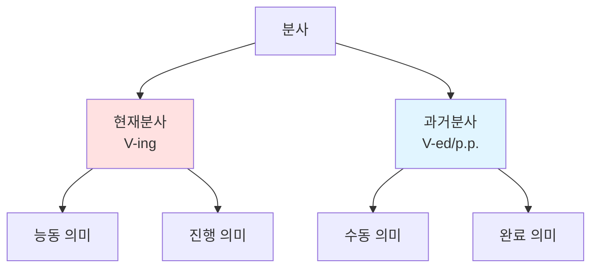

### 분사 용법 비교표

| 용법 | 형태 | 위치 | 의미 | 예문 |
|------|------|------|------|------|
| **현재분사** | V-ing | 명사 앞/뒤 | ~하는 | a sleeping baby |
| **과거분사** | p.p. | 명사 앞/뒤 | ~된 | a broken window |
| **분사구문** | V-ing/p.p. | 문장 앞/뒤 | ~하면서, ~하여 | Walking down the street, ... |

### 분사구문 독해 전략

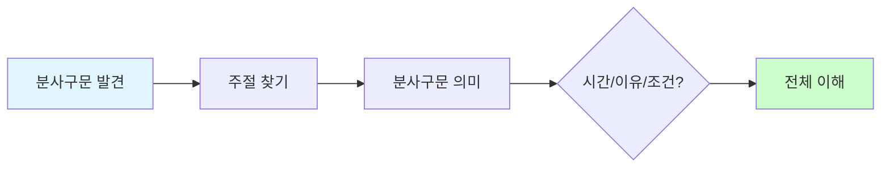

### 분사구문 실전 예문 - 상황별 패턴 (15개)

#### 📌 현재분사 - 시간 (동시 동작) ⭐⭐⭐⭐
```
46. Walking down the street, I saw an old friend.
    ✅ Walking (현재분사) → 시간 (걸으면서)
    → [길을 걷다가] / 나는 봤다 / 오랜 친구를
    [분사구문 의미] ~하면서, ~할 때

47. Listening to music, she studied for the exam.
    ✅ Listening → 동시 동작
    → [음악을 들으면서] / 그녀는 / 공부했다 / 시험을

48. Working from home, I can save commuting time.
    ✅ Working → 시간/상황
    → [재택근무를 하면서] / 나는 / 절약할 수 있다 / 통근 시간을

49. Living in a big city, you meet diverse people.
    ✅ Living → 상황
    → [대도시에 살면서] / 너는 / 만난다 / 다양한 사람들을
```

#### 📌 현재분사 - 이유 (원인) ⭐⭐⭐⭐⭐
```
50. Being tired, I went to bed early.
    ✅ Being → 이유 (~해서)
    → [피곤해서] / 나는 / 잤다 / 일찍

51. Not knowing what to do, I asked for help.
    ✅ Not knowing → 부정 이유
    → [무엇을 해야 할지 몰라서] / 나는 / 요청했다 / 도움을

52. Having no money, he couldn't buy the ticket.
    ✅ Having no → 이유
    → [돈이 없어서] / 그는 / 살 수 없었다 / 표를

53. Feeling sick, she left work early.
    ✅ Feeling → 이유
    → [아파서] / 그녀는 / 퇴근했다 / 일찍
```

#### 📌 과거분사 - 수동/완료 ⭐⭐⭐⭐
```
54. Written in English, the book is difficult.
    ✅ Written (과거분사) → 수동 (쓰여진)
    → [영어로 쓰여서] / 그 책은 / 어렵다

55. Born in Korea, he speaks Korean fluently.
    ✅ Born → 수동/이유
    → [한국에서 태어나서] / 그는 / 말한다 / 한국어를 / 유창하게

56. Seen from a distance, the mountain looks small.
    ✅ Seen from → 수동 (보여질 때)
    → [멀리서 보면] / 그 산은 / 보인다 / 작게

57. Built in 1900, this building is a historical site.
    ✅ Built → 수동/완료
    → [1900년에 지어져서] / 이 건물은 / ~이다 / 역사적 장소
```

#### 📌 완료 분사구문 (Having p.p.) ⭐⭐⭐
```
58. Having finished my homework, I went out to play.
    ✅ Having finished → 완료 후 (끝내고 나서)
    → [숙제를 끝내고] / 나는 / 나갔다 / 놀러

59. Having lived abroad, she understands different cultures.
    ✅ Having lived → 경험/완료
    → [해외에 살아봐서] / 그녀는 / 이해한다 / 다른 문화들을

60. Having read the book, I understood the movie better.
    ✅ Having read → 선행 완료
    → [책을 읽고 나서] / 나는 / 이해했다 / 영화를 / 더 잘

61. Having been to Japan, I know the culture well.
    ✅ Having been → 경험 완료
    → [일본에 가봐서] / 나는 / 잘 안다 / 문화를
```

#### 📌 분사구문 - 조건/양보
```
62. Given more time, I could finish the project.
    ✅ Given → 조건 (주어진다면)
    → [더 많은 시간이 주어진다면] / 나는 / 끝낼 수 있을 텐데 / 프로젝트를

63. Granted that he is talented, he still needs practice.
    ✅ Granted that → 양보 (인정하더라도)
    → [그가 재능있다는 걸 인정하더라도] / 그는 / 여전히 필요하다 / 연습이
```

**분사구문 인식 공식**: 
- 문장 앞에 V-ing/p.p. 발견 → 분사구문!
- [ ] 묶기 → 주절 찾기 → 의미 파악 (시간/이유/조건)

---

## 🔄 수동태 (Passive Voice) - 우선 ⭐⭐⭐⭐

### 수동태 구조

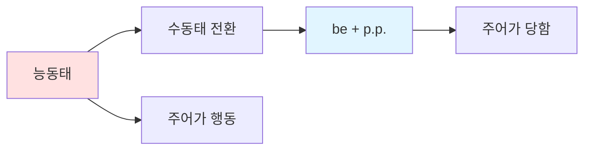

### 시제별 수동태표

| 시제 | 능동태 | 수동태 | 예문 |
|------|--------|--------|------|
| **현재** | V/V-s | am/is/are p.p. | is written |
| **과거** | V-ed | was/were p.p. | was written |
| **미래** | will V | will be p.p. | will be written |
| **현재완료** | have/has p.p. | have/has been p.p. | has been written |
| **진행형** | be V-ing | be being p.p. | is being written |

### 수동태 실전 예문 - 상황별 패턴 (12개)

#### 📌 현재 수동태 ⭐⭐⭐⭐⭐
```
64. The book is written by a famous author.
    ✅ is written → 현재 수동
    → "그 책은 / 쓰여진다 / 유명한 작가에 의해"

65. English is spoken in many countries.
    ✅ is spoken → 현재 수동 (일반 사실)
    → "영어는 / 말해진다 / 많은 나라에서"

66. This product is made in Korea.
    ✅ is made → 현재 수동
    → "이 제품은 / 만들어진다 / 한국에서"

67. The office is cleaned every day.
    ✅ is cleaned → 현재 수동 (습관)
    → "사무실은 / 청소된다 / 매일"
```

#### 📌 과거 수동태 ⭐⭐⭐⭐⭐
```
68. The email was sent yesterday.
    ✅ was sent → 과거 수동
    → "이메일은 / 보내졌다 / 어제"

69. The bridge was built in 1950.
    ✅ was built → 과거 수동
    → "다리는 / 지어졌다 / 1950년에"

70. I was invited to the party.
    ✅ was invited → 과거 수동
    → "나는 / 초대받았다 / 파티에"
```

#### 📌 미래 수동태 ⭐⭐⭐⭐
```
71. The meeting will be held tomorrow.
    ✅ will be held → 미래 수동
    → "회의는 / 개최될 것이다 / 내일"

72. The report will be submitted next week.
    ✅ will be submitted → 미래 수동
    → "보고서는 / 제출될 것이다 / 다음 주에"
```

#### 📌 현재완료 수동태 ⭐⭐⭐⭐
```
73. The package has been delivered.
    ✅ has been delivered → 현재완료 수동
    → "소포가 / 배달되었다" (완료)

74. This issue has been discussed many times.
    ✅ has been discussed → 현재완료 수동
    → "이 문제는 / 논의되어 왔다 / 여러 번"
```

#### 📌 진행형 수동태
```
75. The problem is being solved.
    ✅ is being solved → 현재진행 수동
    → "문제가 / 해결되고 있다" (현재 진행중)

76. A new building is being constructed.
    ✅ is being constructed → 진행 수동
    → "새 건물이 / 건설되고 있다"
```

**수동태 인식 공식**: be + p.p. 발견 → "~되다/~받다" 해석

---

## 🎯 To부정사 & 동명사 - 우선 ⭐⭐⭐⭐

### To부정사 용법

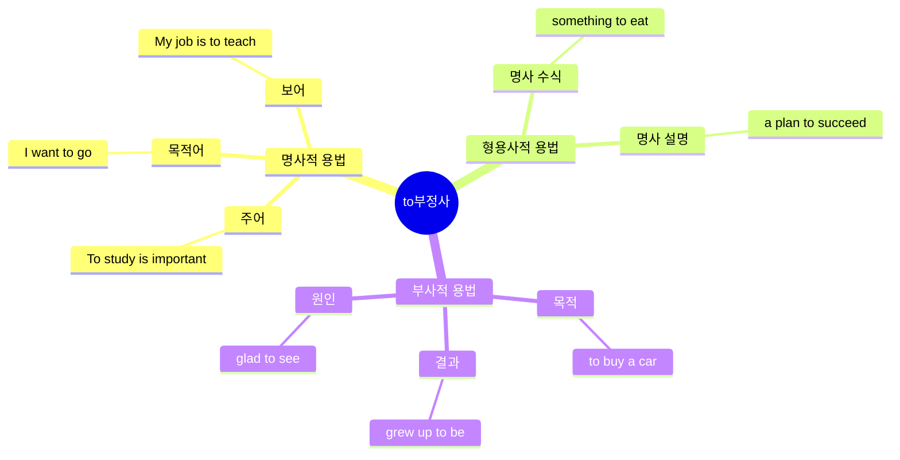

### 빠른 인식 전략

| 용법 | 위치 | 질문 | 해석 |
|------|------|------|------|
| **명사적** | 주어/목적어/보어 자리 | ~하는 것 | ~하기 |
| **형용사적** | 명사 뒤 | 어떤? | ~할/~하는 |
| **부사적** | 동사/형용사 뒤 | 왜? | ~하기 위해 |

### To부정사 실전 예문 - 용법별 패턴 (18개)

#### 📌 명사적 용법 - 주어 ⭐⭐⭐
```
77. To learn English is important.
    ✅ To learn → 주어 역할
    → "배우는 것은 / 영어를 / 중요하다"

78. To exercise regularly keeps you healthy.
    ✅ To exercise → 주어
    → "운동하는 것은 / 규칙적으로 / 유지시킨다 / 너를 건강하게"

79. To give up now would be a mistake.
    ✅ To give up → 주어
    → "포기하는 것은 / 지금 / ~일 것이다 / 실수"
```

#### 📌 명사적 용법 - 목적어 ⭐⭐⭐⭐⭐
```
80. I want to learn English.
    ✅ to learn → 목적어 (want의 목적어)
    → "나는 / 원한다 / 배우기를 / 영어를"

81. She decided to quit her job.
    ✅ to quit → 목적어
    → "그녀는 / 결정했다 / 그만두기를 / 직장을"

82. They plan to travel next month.
    ✅ to travel → 목적어
    → "그들은 / 계획한다 / 여행하기를 / 다음 달"

83. I need to finish this report today.
    ✅ to finish → 목적어
    → "나는 / 필요하다 / 끝내는 것이 / 이 보고서를 / 오늘"

84. He hopes to become a doctor.
    ✅ to become → 목적어
    → "그는 / 희망한다 / 되기를 / 의사가"
```

#### 📌 명사적 용법 - 보어 ⭐⭐⭐
```
85. My goal is to pass the exam.
    ✅ to pass → 보어 (goal = to pass)
    → "내 목표는 / ~이다 / 합격하는 것 / 시험에"

86. The best solution is to wait.
    ✅ to wait → 보어
    → "최선의 해결책은 / ~이다 / 기다리는 것"
```

#### 📌 형용사적 용법 - 명사 수식 ⭐⭐⭐⭐⭐
```
87. I have something to tell you.
    ✅ to tell → something 수식
    → "나는 / 가지고 있어 / 무언가를 / [말할] / 너에게"

88. Give me something to drink.
    ✅ to drink → something 수식
    → "줘 / 나에게 / 무언가를 / [마실]"

89. I need a place to stay.
    ✅ to stay → place 수식
    → "나는 / 필요해 / 장소가 / [머물]"

90. She has no time to waste.
    ✅ to waste → time 수식
    → "그녀는 / 없다 / 시간이 / [낭비할]"

91. This is the best way to solve the problem.
    ✅ to solve → way 수식
    → "이것은 / 최선의 방법이다 / [해결할] / 문제를"
```

#### 📌 부사적 용법 - 목적 ⭐⭐⭐⭐⭐
```
92. I came here to meet you.
    ✅ to meet → 목적 (~하기 위해)
    → "나는 / 왔다 / 여기에 / [만나기 위해] / 너를"

93. She studies hard to pass the exam.
    ✅ to pass → 목적
    → "그녀는 / 공부한다 / 열심히 / [합격하기 위해] / 시험에"

94. He saved money to buy a car.
    ✅ to buy → 목적
    → "그는 / 저축했다 / 돈을 / [사기 위해] / 차를"
```

#### 📌 부사적 용법 - 결과/원인
```
95. I grew up to be a teacher.
    ✅ to be → 결과 (~해서 되다)
    → "나는 / 자랐다 / [~되어서] / 교사가"

96. I'm glad to see you.
    ✅ to see → 원인 (감정의 원인)
    → "나는 / 기쁘다 / [보게 되어] / 너를"

97. I was surprised to hear the news.
    ✅ to hear → 원인
    → "나는 / 놀랐다 / [듣게 되어] / 소식을"
```

### 동명사 실전 예문 (8개)

#### 📌 동명사 - 주어/목적어 ⭐⭐⭐⭐
```
98. Swimming is good for your health.
    ✅ Swimming → 주어 (~하는 것)
    → "수영하는 것은 / 좋다 / 건강에"

99. I enjoy reading books.
    ✅ reading → 목적어 (enjoy의 목적어)
    → "나는 / 즐긴다 / 읽는 것을 / 책을"

100. He finished writing the report.
     ✅ writing → 목적어 (finish의 목적어)
     → "그는 / 끝냈다 / 쓰는 것을 / 보고서를"

101. She keeps talking during the meeting.
     ✅ talking → 목적어 (keep의 목적어)
     → "그녀는 / 계속한다 / 말하는 것을 / 회의 중에"

102. I'm good at solving problems.
     ✅ solving → 전치사의 목적어
     → "나는 / 잘한다 / 해결하는 것을 / 문제를"

103. Thank you for helping me.
     ✅ helping → 전치사의 목적어
     → "감사합니다 / ~에 대해 / 도와준 것"

104. I'm interested in learning new skills.
     ✅ learning → 전치사의 목적어
     → "나는 / 관심있다 / 배우는 것에 / 새 기술을"

105. She is afraid of flying.
     ✅ flying → 전치사의 목적어
     → "그녀는 / 두려워한다 / 비행하는 것을"
```

**To부정사 vs 동명사 구분**:
- To부정사: 미래지향적 (want, plan, decide, hope)
- 동명사: 경험/습관 (enjoy, finish, keep, stop)

---

## 💭 가정법 (Subjunctive) - 중요 ⭐⭐⭐

### 가정법 구조

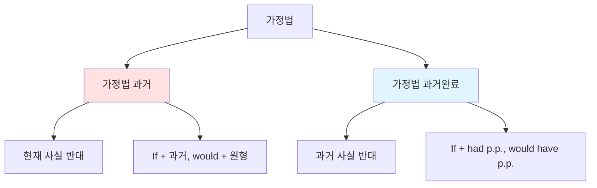

### 가정법 빠른 인식표

| 종류 | 조건절 | 주절 | 의미 | 예문 |
|------|--------|------|------|------|
| **가정법 과거** | If + 과거 | would/could + 원형 | 현재 반대 | If I were rich, I would buy it. |
| **가정법 과거완료** | If + had p.p. | would have p.p. | 과거 반대 | If I had known, I would have gone. |

### 가정법 실전 예문 - 상황별 패턴 (10개)

#### 📌 가정법 과거 (현재 사실의 반대) ⭐⭐⭐⭐
```
106. If I were you, I would accept the offer.
     ✅ were (과거) + would → 현재 사실 반대
     → "내가 너라면 / 받아들일 텐데 / 그 제안을"
     [실제: 나는 너가 아니다]

107. If I had more time, I would learn Japanese.
     ✅ had (과거) + would → 현재 반대
     → "내가 시간이 더 있다면 / 배울 텐데 / 일본어를"
     [실제: 시간이 없다]

108. If she were here, she would help us.
     ✅ were + would → 현재 반대
     → "그녀가 여기 있다면 / 도와줄 텐데 / 우리를"
     [실제: 그녀는 여기 없다]

109. If I knew the answer, I would tell you.
     ✅ knew + would → 현재 반대
     → "내가 답을 안다면 / 말해줄 텐데 / 너에게"
     [실제: 답을 모른다]

110. If he studied harder, he could pass the exam.
     ✅ studied + could → 현재 반대
     → "그가 더 열심히 공부한다면 / 합격할 수 있을 텐데"
     [실제: 열심히 공부하지 않는다]
```

#### 📌 가정법 과거완료 (과거 사실의 반대) ⭐⭐⭐⭐
```
111. If I had known, I would have gone.
     ✅ had known + would have gone → 과거 반대
     → "내가 알았더라면 / 갔을 텐데"
     [실제: 몰랐고, 가지 않았다]

112. If you had told me earlier, I could have helped.
     ✅ had told + could have helped → 과거 반대
     → "네가 더 일찍 말했더라면 / 도와줄 수 있었을 텐데"
     [실제: 일찍 말하지 않았고, 돕지 못했다]

113. If she had studied, she would have passed.
     ✅ had studied + would have passed → 과거 반대
     → "그녀가 공부했더라면 / 합격했을 텐데"
     [실제: 공부하지 않았고, 합격하지 못했다]

114. If we had left earlier, we wouldn't have missed the train.
     ✅ had left + wouldn't have missed → 과거 반대
     → "우리가 더 일찍 떠났더라면 / 놓치지 않았을 텐데 / 기차를"
     [실제: 일찍 떠나지 않아서, 기차를 놓쳤다]

115. If I had invested in that stock, I would have made money.
     ✅ had invested + would have made → 과거 반대
     → "내가 그 주식에 투자했더라면 / 벌었을 텐데 / 돈을"
     [실제: 투자하지 않아서, 돈을 벌지 못했다]
```

**가정법 핵심 인식**:
- If + 과거 → 현재 반대
- If + had p.p. → 과거 반대

---

## 🔄 도치 (Inversion) - 중요 ⭐⭐⭐

### 도치 패턴

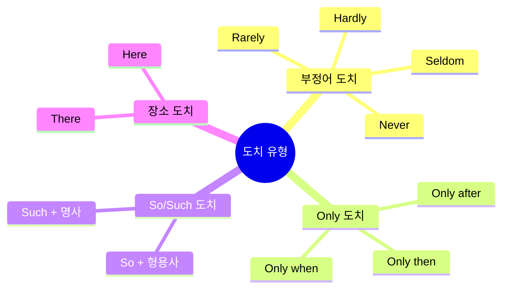

### 도치 실전 예문 - 유형별 패턴 (10개)

#### 📌 부정어 도치 ⭐⭐⭐⭐
```
116. Never have I seen such a beautiful sunset.
     ✅ Never + 도치 (have I) → 강조
     → "결코 본 적 없다 / 내가 / 그런 아름다운 일몰을"
     [일반 어순: I have never seen...]

117. Seldom does he make mistakes.
     ✅ Seldom + 도치 (does he) → 강조
     → "거의 ~하지 않는다 / 그는 / 실수를"
     [일반 어순: He seldom makes...]

118. Hardly had I arrived when it started raining.
     ✅ Hardly + 도치 (had I) → 강조
     → "거의 ~하자마자 / 내가 도착 / 비가 오기 시작했다"
     [일반 어순: I had hardly arrived...]

119. Not only is she smart, but she is also kind.
     ✅ Not only + 도치 (is she) → 강조
     → "~뿐만 아니라 / 그녀는 똑똑하다 / 그녀는 또한 친절하다"
```

#### 📌 Only 도치 ⭐⭐⭐
```
120. Only then did I realize my mistake.
     ✅ Only then + 도치 (did I) → 강조
     → "그때서야 / 깨달았다 / 내가 / 내 실수를"
     [일반 어순: I realized my mistake only then]

121. Only after the exam did she feel relieved.
     ✅ Only after + 도치 (did she) → 강조
     → "시험 후에야 / 느꼈다 / 그녀는 / 안도감을"

122. Only by working hard can you succeed.
     ✅ Only by + 도치 (can you) → 강조
     → "열심히 일해야만 / 성공할 수 있다 / 너는"
```

#### 📌 장소 도치 ⭐⭐⭐
```
123. Here comes the bus.
     ✅ Here + 도치 (comes) → 장소 강조
     → "여기 온다 / 버스가"
     [일반 어순: The bus comes here]

124. There goes my last chance.
     ✅ There + 도치 (goes) → 장소/방향
     → "저기 간다 / 내 마지막 기회가"

125. In the corner sat a small cat.
     ✅ 장소 전치사구 + 도치 (sat)
     → "구석에 / 앉아 있었다 / 작은 고양이가"
```

**도치 핵심 전략**: 
1. 도치 발견 → 원래 어순 복원 → 이해
2. 부정어/Only 뒤 → 조동사 + 주어 어순
3. 강조 효과 인식

---

## 🔥 실전 종합 연습 - 복합 문법 패턴 (30개)

### 난이도 ★☆☆ - 2가지 문법 결합

#### 시제 + 수동태 조합 (5개)
```
126. The report has been completed by the team.
     ✅ 현재완료 + 수동태 (has been + p.p.)
     → "보고서가 / 완성되었다 / 팀에 의해"
     [문법] 현재완료 수동: 과거~현재 완료 + 수동

127. The project will be finished next month.
     ✅ 미래 + 수동태 (will be + p.p.)
     → "프로젝트가 / 끝날 것이다 / 다음 달"

128. The email was being sent when the system crashed.
     ✅ 과거진행 + 수동태 (was being + p.p.)
     → "이메일이 / 보내지고 있었다 / 시스템이 다운됐을 때"

129. This book has been read by millions of people.
     ✅ 현재완료 + 수동태
     → "이 책은 / 읽혀져 왔다 / 수백만 명에 의해"

130. The building had been designed by a famous architect.
     ✅ 과거완료 + 수동태 (had been + p.p.)
     → "건물은 / 설계되었었다 / 유명한 건축가에 의해"
```

#### 관계사 + 수동태 조합 (5개)
```
131. The book which was written by him is popular.
     ✅ 관계사 + 수동태
     → "그 책은 / [그에 의해 쓰여진] / 인기있다"
     [분석] 관계사절 내에 수동태

132. I met the engineer who was hired last month.
     ✅ 관계사 + 수동태
     → "나는 / 만났다 / 엔지니어를 / [지난달 고용된]"

133. The product that is sold online is cheaper.
     ✅ 관계사 + 수동태
     → "제품은 / [온라인에서 판매되는] / 더 싸다"

134. This is the house where I was born.
     ✅ 관계부사 where + 수동태
     → "이것은 / 집이다 / [내가 태어난]"

135. The day when the decision was made was important.
     ✅ 관계부사 when + 수동태
     → "그 날은 / [결정이 내려진] / 중요했다"
```

#### 분사구문 + 수동태 조합 (5개)
```
136. Written in simple language, the book is easy to read.
     ✅ 과거분사 (수동) + 주절
     → "[간단한 언어로 쓰여서] / 그 책은 / 읽기 쉽다"

137. Being asked about his opinion, he remained silent.
     ✅ Being + p.p. (수동 진행)
     → "[의견을 물어지고] / 그는 / 남았다 / 침묵을"

138. Having been told the truth, she felt relieved.
     ✅ Having been + p.p. (완료 수동)
     → "[진실을 들은 후] / 그녀는 / 느꼈다 / 안도감을"

139. Seen from above, the city looks beautiful.
     ✅ 과거분사 수동 (보여질 때)
     → "[위에서 보면] / 도시는 / 보인다 / 아름답게"

140. Built over 100 years ago, this bridge is still strong.
     ✅ 과거분사 수동 (지어져서)
     → "[100년 전에 지어져서] / 이 다리는 / 여전히 튼튼하다"
```

### 난이도 ★★☆ - 3가지 문법 결합 (5개)

```
141. The student who has been studying abroad will return next month.
     ✅ 관계사 + 현재완료진행 + 미래
     → "학생은 / [해외에서 공부해온] / 돌아올 것이다 / 다음 달"
     [분석] 1) 관계사 who 2) has been studying (현재완료진행) 3) will return (미래)

142. Having finished the project, which took three years, we celebrated.
     ✅ 완료분사구문 + 관계사 + 과거
     → "[프로젝트를 끝내고] / [3년 걸린] / 우리는 축하했다"
     [분석] 1) Having finished 2) which took 3) celebrated (과거)

143. The report that was being written is now complete.
     ✅ 관계사 + 과거진행수동 + 현재
     → "보고서는 / [작성되고 있었던] / 지금은 완성됐다"

144. If I had known the answer, which was quite simple, I would have told you.
     ✅ 가정법 + 관계사 + 과거완료
     → "내가 답을 알았더라면 / [꽤 간단했던] / 말해줬을 텐데 / 너에게"

145. Never have I seen a person who works harder than she does.
     ✅ 도치 + 관계사 + 현재
     → "결코 본 적 없다 / 사람을 / [그녀보다 더 열심히 일하는]"
```

### 난이도 ★★★ - 복잡한 실전 문장 (10개)

```
146. The research, which was conducted by scientists who had been working 
     on the project for over a decade, revealed findings that could 
     potentially change our understanding of the universe.
     
     ✅ 복합 관계사 + 과거완료진행 + 수동태 + 조동사
     
     [분해 과정]
     1단계: 주절 → The research revealed findings.
     2단계: 관계사절1 → [which was conducted by scientists]
     3단계: 관계사절2 → [who had been working for a decade]
     4단계: 관계사절3 → [that could change our understanding]
     
     [직독직해]
     → "그 연구는 / [과학자들에 의해 수행된] / 
        [10년 넘게 연구해온] / 밝혔다 / 발견들을 / 
        [잠재적으로 바꿀 수 있는] / 우리의 이해를 / 우주에 대한"

147. Having been trained in advanced techniques, the surgeon who operates 
     at this hospital has never failed in any procedure that he has performed.
     
     ✅ 완료수동분사 + 관계사 + 현재완료
     
     [분해]
     1) Having been trained → 완료 수동 분사구문
     2) who operates → 관계사 (surgeon 수식)
     3) that he has performed → 관계사 (procedure 수식)
     
     [직독직해]
     → "[고급 기술로 훈련받아서] / 외과의는 / [이 병원에서 수술하는] / 
        결코 실패한 적 없다 / 어떤 수술에서도 / [그가 수행한]"

148. If the company had invested more resources, the product which is 
     being developed would have been launched last year.
     
     ✅ 가정법 과거완료 + 관계사 + 현재진행수동 + 과거완료수동
     
     [직독직해]
     → "회사가 더 많은 자원을 투자했더라면 / 제품이 / 
        [개발되고 있는] / 출시되었을 텐데 / 작년에"

149. The CEO, whose vision transformed the industry, announced that 
     the merger which had been negotiated for months would be finalized.
     
     ✅ 소유격 관계사 + 과거 + 명사절 + 관계사 + 과거완료수동 + 조동사수동
     
     [분해]
     1) whose vision transformed → 소유격 관계사
     2) announced that → 명사절 (발표 내용)
     3) which had been negotiated → 관계사 + 과거완료 수동
     4) would be finalized → 조동사 수동 미래
     
     [직독직해]
     → "CEO는 / [비전이 산업을 변혁시킨] / 발표했다 / 
        합병이 / [수개월간 협상되어온] / 확정될 것이라고"

150. Only after reading the article that was published in a journal 
     which specializes in neuroscience did I understand the complexity 
     of the brain.
     
     ✅ Only 도치 + 관계사 중첩 + 수동태
     
     [분해]
     1) Only after → 도치 유발
     2) that was published → 관계사 + 수동 (article 수식)
     3) which specializes → 관계사 (journal 수식)
     4) did I understand → 도치된 주절
     
     [직독직해]
     → "기사를 읽고 나서야 / [저널에 발표된] / 
        [신경과학 전문] / 이해했다 / 내가 / 복잡성을 / 뇌의"

151. The technology, which has been adopted by companies that operate 
     in industries where innovation is crucial, is changing how we work.
     
     ✅ 관계사 3중 중첩 + 현재완료수동 + 명사절
     
     [직독직해]
     → "기술은 / [채택되어온] / 회사들에 의해 / 
        [운영하는 / 산업에서 / [혁신이 중요한]] / 
        바꾸고 있다 / 우리가 일하는 방식을"

152. Had I known that the meeting which was scheduled for Monday 
     would be cancelled, I wouldn't have prepared the presentation.
     
     ✅ 가정법 도치 + 명사절 + 관계사 + 수동태 + 과거완료
     
     [분해]
     1) Had I known → 가정법 도치 (If I had known)
     2) that ~ → 명사절 (know의 목적어)
     3) which was scheduled → 관계사 + 수동
     4) wouldn't have prepared → 가정법 주절
     
     [직독직해]
     → "내가 알았더라면 / 회의가 / [월요일로 예정된] / 
        취소될 것이라는 걸 / 준비하지 않았을 텐데 / 발표를"

153. The proposal, written by a team whose members have expertise 
     in areas that are critical to the project, was accepted immediately.
     
     ✅ 분사 + 소유격 관계사 + 관계사 중첩 + 수동태
     
     [직독직해]
     → "제안서는 / [팀에 의해 쓰여진] / [구성원들이 전문성을 가진 / 
        분야에 / [프로젝트에 중요한]] / 받아들여졌다 / 즉시"

154. Never would I have imagined that the skills which I learned 
     while working at a startup would become so valuable.
     
     ✅ 도치 + 가정법 + 명사절 + 관계사 + 분사구문 + 조동사
     
     [직독직해]
     → "결코 상상하지 못했을 것이다 / 내가 / 기술들이 / 
        [배운 / 스타트업에서 일하면서] / 
        될 것이라고 / 그렇게 가치있게"

155. Being selected for the position that had been advertised online, 
     she felt that all the effort which she had put into preparing 
     was worth it.
     
     ✅ 분사구문 + 관계사 + 과거완료수동 + 명사절 + 관계사 + 과거완료
     
     [직독직해]
     → "[선발되어서] / 직위에 / [온라인에 광고된] / 
        그녀는 / 느꼈다 / 모든 노력이 / [그녀가 쏟은 / 준비에] / 
        가치있다고"
```

---

## 🌍 상황별 실전 문장 연습 (25개)

### 비즈니스 상황 (10개)

```
156. The contract which was reviewed by our legal team will be signed tomorrow.
     ✅ 관계사 + 수동 + 미래
     → "계약서는 / [법무팀이 검토한] / 서명될 것이다 / 내일"

157. Having completed the financial analysis, the CFO presented the results.
     ✅ 완료분사구문 + 과거
     → "[재무 분석을 완료하고] / CFO는 / 발표했다 / 결과를"

158. If we had launched the product earlier, we would have gained market share.
     ✅ 가정법 과거완료
     → "우리가 제품을 더 일찍 출시했더라면 / 얻었을 텐데 / 시장 점유율을"

159. The quarterly report has been submitted to the board of directors.
     ✅ 현재완료 수동
     → "분기 보고서가 / 제출되었다 / 이사회에"

160. Being aware of the risks, we decided to proceed cautiously.
     ✅ 분사구문 (이유) + 과거
     → "[위험을 인지하고] / 우리는 / 결정했다 / 조심스럽게 진행하기로"

161. The merger that was announced last week will create the industry leader.
     ✅ 관계사 + 수동 + 미래
     → "합병이 / [지난주 발표된] / 만들 것이다 / 업계 선두기업을"

162. Our sales have increased significantly since we hired the new team.
     ✅ 현재완료 + 과거 (since절)
     → "매출이 / 증가했다 / 크게 / 새 팀을 고용한 이후"

163. The CEO, whose leadership transformed the company, will retire next year.
     ✅ 소유격 관계사 + 미래
     → "CEO는 / [리더십이 회사를 변혁시킨] / 은퇴할 것이다 / 내년에"

164. Never before have we faced such intense competition.
     ✅ 부정어 도치 + 현재완료
     → "이전에 결코 직면한 적 없다 / 우리가 / 그런 치열한 경쟁에"

165. Only by innovating constantly can companies survive in this market.
     ✅ Only 도치 + 조동사
     → "지속적으로 혁신해야만 / 생존할 수 있다 / 회사들이 / 이 시장에서"
```

### 학술/논문 상황 (8개)

```
166. The hypothesis which was proposed by the researchers has been tested.
     ✅ 관계사 + 수동 + 현재완료 수동
     → "가설은 / [연구자들이 제안한] / 검증되었다"

167. Having analyzed the data, the team concluded that the results were significant.
     ✅ 완료분사구문 + 과거 + 명사절
     → "[데이터를 분석하고] / 팀은 / 결론지었다 / 결과가 유의미하다고"

168. If more funding had been allocated, the study could have been expanded.
     ✅ 가정법 과거완료 + 수동
     → "더 많은 자금이 배정되었더라면 / 연구가 / 확대될 수 있었을 텐데"

169. The methodology that is described in this paper is innovative.
     ✅ 관계사 + 수동 + 현재
     → "방법론은 / [이 논문에 설명된] / 혁신적이다"

170. Being based on empirical evidence, the conclusion is reliable.
     ✅ 분사구문 (이유) + 현재
     → "[실증적 증거에 기반해서] / 결론은 / 신뢰할 수 있다"

171. The phenomenon which scientists have been studying remains mysterious.
     ✅ 관계사 + 현재완료진행
     → "현상은 / [과학자들이 연구해온] / 남아있다 / 신비로운"

172. Only through rigorous testing can we validate the theory.
     ✅ Only 도치 + 조동사
     → "엄격한 테스트를 통해서만 / 검증할 수 있다 / 우리가 / 이론을"

173. The findings, which were published in a prestigious journal, changed the field.
     ✅ 관계사 + 수동 + 과거
     → "발견들은 / [권위있는 저널에 발표된] / 바꾸었다 / 분야를"
```

### 일상/뉴스 상황 (7개)

```
174. The building which collapsed yesterday had been built 50 years ago.
     ✅ 관계사 + 과거 + 과거완료 수동
     → "건물은 / [어제 무너진] / 지어졌었다 / 50년 전에"

175. Having lived in the city for 20 years, she knows every corner.
     ✅ 완료분사구문 + 현재
     → "[도시에 20년간 살아서] / 그녀는 / 안다 / 구석구석을"

176. If I had taken the earlier train, I wouldn't have been late.
     ✅ 가정법 과거완료
     → "내가 더 이른 기차를 탔더라면 / 늦지 않았을 텐데"

177. The movie that was directed by a famous filmmaker won several awards.
     ✅ 관계사 + 수동 + 과거
     → "영화는 / [유명한 영화감독이 연출한] / 받았다 / 여러 상을"

178. Feeling tired after the long journey, I went straight to bed.
     ✅ 분사구문 (이유) + 과거
     → "[긴 여행 후 피곤해서] / 나는 / 갔다 / 바로 잠자리에"

179. The park where we used to play has been renovated.
     ✅ 관계부사 + 과거 + 현재완료 수동
     → "공원은 / [우리가 놀던] / 리모델링되었다"

180. Never has there been a better time to invest in technology.
     ✅ 부정어 도치 + 현재완료 + to부정사
     → "결코 없었다 / 더 좋은 시기가 / 투자할 / 기술에"
```

---

## 🎯 문법 패턴 빠른 인식 훈련 (속도 향상)

### 훈련 1: 0.5초 문법 인식 (20개)

**목표**: 문장을 보자마자 문법 패턴을 0.5초 내에 인식

```
181. I have been working → ⚡ 현재완료진행!
182. The book written by → ⚡ 과거분사!
183. If I were you → ⚡ 가정법 과거!
184. Never have I seen → ⚡ 부정어 도치!
185. Having finished → ⚡ 완료분사구문!
186. The person who works → ⚡ 주격 관계사!
187. It will be done → ⚡ 미래 수동!
188. I want to go → ⚡ to부정사 (목적어)!
189. She enjoys reading → ⚡ 동명사!
190. If I had known → ⚡ 가정법 과거완료!
191. Only then did I → ⚡ Only 도치!
192. The place where → ⚡ 관계부사 (장소)!
193. Being tired → ⚡ 분사구문 (이유)!
194. It has been done → ⚡ 현재완료 수동!
195. Something to eat → ⚡ to부정사 (형용사적)!
196. The day when → ⚡ 관계부사 (시간)!
197. Seldom does he → ⚡ 부정어 도치!
198. I had already left → ⚡ 과거완료!
199. The girl whose → ⚡ 소유격 관계사!
200. Here comes → ⚡ 장소 도치!
```

### 훈련 2: 패턴 기반 예측 (10개)

**목표**: 문장 시작을 보고 다음을 예측

```
문장 시작 → 예상되는 구조 → 독해 전략

201. "The students who..."
     → 관계사절 나옴 → [ ]로 묶어서 수식어 처리 준비

202. "Having finished..."
     → 분사구문 → 주절 찾기 준비

203. "If I had known..."
     → 가정법 과거완료 → would have p.p. 예상

204. "Never in my life..."
     → 부정어 도치 → 조동사 + 주어 어순 예상

205. "The book which..."
     → 목적격 관계사 → 주어+동사 나옴 → 관계사절 끝 찾기

206. "Only after the meeting..."
     → Only 도치 → did/will 등 조동사 + 주어 예상

207. "Being written in..."
     → 분사구문 수동 → 주절에서 이유/상황 설명

208. "By the time he arrived..."
     → 과거완료 예상 → had p.p. 나올 것

209. "The person whose..."
     → 소유격 관계사 → 명사 나옴 → 관계사절 계속

210. "It has been..."
     → 현재완료 수동 → p.p. + by/since/for 등 예상
```

### 훈련 3: 실전 속도 연습 (빠른 해석)

**목표**: 문장을 보고 3초 내에 핵심 파악

```
211. The report [which was submitted yesterday] is on your desk.
     ⚡ 3초 전략: 주절 먼저 → The report is on your desk
     → 수식 추가: [어제 제출된]

212. [Having worked there for 5 years], she knows the system well.
     ⚡ 3초 전략: 분사구문 스킵 → She knows the system well
     → 이유 추가: [5년간 일해서]

213. If I had studied harder, I would have passed.
     ⚡ 3초 전략: 가정법 인식 → 과거 반대 → 후회 표현
     → "더 공부했더라면 / 합격했을 텐데"

214. Never before [have scientists observed] such a phenomenon.
     ⚡ 3초 전략: 도치 → 원래 어순 복원
     → Scientists have never observed... → 강조!

215. The building [which stands on the corner] was built in 1920.
     ⚡ 3초 전략: 주절 → The building was built in 1920
     → 수식: [구석에 서있는]
```

---

## 🏆 최종 종합 테스트 - 모든 문법 통합 (15개)

### 초고난이도 문장 분해 연습

```
216. Had the team, whose members have been collaborating remotely since 
     the pandemic started, not adapted to the new working environment, 
     the project which was expected to revolutionize the industry would 
     never have been completed.
     
     ✅ 복합 문법: 가정법 도치 + 소유격 관계사 + 현재완료진행 + 부정 + 
                  관계사 + 수동 + 과거완료
     
     [단계별 분해]
     1) Had... not adapted → 가정법 도치 (If they had not adapted)
     2) whose members → 소유격 관계사 (team 수식)
     3) have been collaborating → 현재완료진행
     4) which was expected → 관계사 + 수동 (project 수식)
     5) would never have been completed → 가정법 주절 (과거완료 수동)
     
     [직독직해]
     → "팀이 / [구성원들이 원격으로 협업해온 / 팬데믹 시작 이후] / 
        적응하지 않았더라면 / 새 근무 환경에 / 
        프로젝트는 / [산업을 혁신시킬 것으로 예상된] / 
        결코 완료되지 못했을 것이다"

217. Being one of the few researchers who has published extensively in 
     journals that are considered the most prestigious, she is frequently 
     invited to conferences where cutting-edge findings are presented.
     
     ✅ 분사구문 + 관계사 3중 중첩 + 현재완료 + 수동
     
     [직독직해]
     → "[몇 안 되는 연구자 중 하나여서] / [광범위하게 발표해온 / 
        저널에 / [가장 권위있다고 여겨지는]] / 
        그녀는 / 자주 초대된다 / 컨퍼런스에 / 
        [최신 발견들이 발표되는]"

218. Only when companies that operate in markets where consumer preferences 
     are constantly changing adapt quickly can they maintain the competitive 
     advantage which they have worked so hard to build.
     
     ✅ Only 도치 + 관계사 2중 중첩 + 현재진행 + 조동사 + 
        관계사 + 현재완료 + to부정사
     
     [직독직해]
     → "회사들이 / [운영하는 / 시장에서 / [소비자 선호도가 지속적으로 
        변하는]] / 빠르게 적응할 때만 / 유지할 수 있다 / 
        경쟁 우위를 / [그들이 매우 열심히 구축해온]"

219. The discovery, which would not have been made had the scientists 
     not persisted in their research despite facing numerous setbacks, 
     has implications that extend far beyond what anyone had anticipated.
     
     ✅ 관계사 + 가정법 도치 (중첩) + 과거완료 + 분사구문 + 
        현재 + 관계사 + 과거완료
     
     [직독직해]
     → "발견은 / [이루어지지 못했을 / 과학자들이 연구를 고집하지 
        않았더라면 / 수많은 좌절에도 불구하고] / 
        가지고 있다 / 함의를 / [훨씬 넘어서는 / 
        누구라도 예상했던 것을]"

220. Never would the CEO, whose decisions have shaped the company's 
     direction for the past decade, have imagined that the technology 
     which seemed impossible when he started would become reality.
     
     ✅ 부정어 도치 + 가정법 + 소유격 관계사 + 현재완료 + 
        관계사 + 과거 + 조동사
     
     [직독직해]
     → "결코 상상하지 못했을 것이다 / CEO는 / 
        [결정들이 회사 방향을 형성해온 / 지난 10년간] / 
        기술이 / [불가능해 보였던 / 그가 시작했을 때] / 
        현실이 될 것이라고"
```

### 실전 독해 - 긴 문단 통합 연습 (10개 연속 문장)

```
221-230. [연속된 문단]

The global economy, which has been experiencing unprecedented volatility, 
presents challenges that require innovative solutions. Companies that have 
been able to adapt quickly to changing market conditions are thriving, 
while those that failed to recognize the shifting landscape are struggling. 
Had more organizations invested in digital transformation earlier, they 
would have been better positioned to weather the current storm. 

The technology sector, being at the forefront of innovation, has created 
opportunities that were unimaginable just a decade ago. Engineers who possess 
skills in artificial intelligence and machine learning are in high demand. 
Only by continuously updating their knowledge can professionals remain 
competitive in this rapidly evolving field.

Never before have we seen such rapid change, and the pace is only accelerating. 
If businesses want to survive, they must embrace transformation. The future, 
which is being shaped by decisions made today, will be dramatically different 
from what we know now.

[문단 분석 전략]
1) 각 문장의 주절 먼저 파악
2) 관계사절은 [ ] 묶어서 나중에 처리
3) 분사구문은 이유/시간 파악
4) 시제로 시간 흐름 이해
5) 전체 맥락 연결

[핵심 메시지 추출]
→ 경제 변동성 → 적응력이 중요 → 디지털 전환 필요 → 
   기술 분야 기회 → 지속적 학습 → 빠른 변화 → 
   비즈니스 생존 전략
```

---

## 📊 독해 문법 마스터 체크리스트 (상세 버전)

### Level 1: 기본 문법 (자동화 필수) ⭐⭐⭐⭐⭐

| 문법 항목 | 인식 속도 | 이해도 | 실전 적용 | 목표 정확도 |
|-----------|-----------|--------|-----------|------------|
| □ 현재/과거/미래 시제 | 0.5초 이내 | 100% | 자동화 완료 | 100% |
| □ 현재완료 | 1초 이내 | 95%+ | 자동화 | 95%+ |
| □ 주격 관계대명사 (who/which) | 1초 이내 | 95%+ | 자동화 | 95%+ |
| □ 목적격 관계대명사 (that/which) | 1초 이내 | 95%+ | 자동화 | 95%+ |
| □ 기본 수동태 (be + p.p.) | 1초 이내 | 95%+ | 자동화 | 95%+ |
| □ To부정사 (명사적) | 1초 이내 | 90%+ | 자동화 | 90%+ |

### Level 2: 중급 문법 (숙련 필요) ⭐⭐⭐⭐

| 문법 항목 | 인식 속도 | 이해도 | 실전 적용 | 목표 정확도 |
|-----------|-----------|--------|-----------|------------|
| □ 과거완료 | 1.5초 이내 | 90%+ | 숙련 | 90%+ |
| □ 소유격 관계사 (whose) | 1.5초 이내 | 90%+ | 숙련 | 85%+ |
| □ 관계부사 (when/where/why) | 1.5초 이내 | 90%+ | 숙련 | 85%+ |
| □ 현재분사구문 | 2초 이내 | 90%+ | 숙련 | 85%+ |
| □ 과거분사구문 (수동) | 2초 이내 | 90%+ | 숙련 | 85%+ |
| □ To부정사 (형용사/부사적) | 1.5초 이내 | 90%+ | 숙련 | 85%+ |
| □ 동명사 | 1.5초 이내 | 90%+ | 숙련 | 85%+ |

### Level 3: 고급 문법 (지속 연습) ⭐⭐⭐

| 문법 항목 | 인식 속도 | 이해도 | 실전 적용 | 목표 정확도 |
|-----------|-----------|--------|-----------|------------|
| □ 완료분사구문 (Having p.p.) | 2초 이내 | 85%+ | 연습 중 | 80%+ |
| □ 가정법 과거 | 2초 이내 | 85%+ | 연습 중 | 80%+ |
| □ 가정법 과거완료 | 2.5초 이내 | 85%+ | 연습 중 | 75%+ |
| □ 부정어 도치 | 2초 이내 | 85%+ | 연습 중 | 75%+ |
| □ Only 도치 | 2초 이내 | 80%+ | 연습 중 | 75%+ |
| □ 관계사 중첩 | 3초 이내 | 80%+ | 연습 중 | 70%+ |

### Level 4: 복합 문법 (마스터 단계) ⭐⭐

| 복합 패턴 | 인식 속도 | 이해도 | 실전 적용 | 목표 정확도 |
|-----------|-----------|--------|-----------|------------|
| □ 관계사 + 수동태 | 2.5초 이내 | 85%+ | 연습 중 | 75%+ |
| □ 분사구문 + 관계사 | 3초 이내 | 80%+ | 연습 중 | 70%+ |
| □ 가정법 + 관계사 | 3초 이내 | 80%+ | 연습 중 | 70%+ |
| □ 도치 + 관계사 | 3초 이내 | 75%+ | 연습 중 | 65%+ |
| □ 3중 관계사 중첩 | 4초 이내 | 75%+ | 도전 과제 | 60%+ |

---

## 💡 문법 학습 전략 및 팁

### 전략 1: 문법용어 버리고 패턴으로 인식

```
❌ 잘못된 학습:
"현재완료는 have/has + 과거분사로 구성되며, 
완료, 경험, 계속, 결과의 용법이 있고..."

✅ 올바른 학습:
"have + p.p. 보면 → '해왔다/했다' → 과거~현재 연결"

핵심: 용어가 아닌 의미와 느낌 중심!
즉시 인식 → 즉시 해석 → 자동화
```

### 전략 2: 같은 패턴 집중 반복 (10-20회)

```
하나의 문법을 마스터하려면:

현재완료 집중 연습 (20문장):
1. I have lived in Seoul for 5 years.
2. She has worked at Google since 2020.
3. We have visited Japan three times.
4. He has just finished the project.
5. They have never been to Europe.
... (15개 더)

→ 같은 패턴 20번 → 자동 인식!
→ 다음 문법으로 이동
```

### 전략 3: 실전 글에서 찾아내기

```
❌ 문법 책만 읽기
✅ 실제 글 읽으면서 문법 찾기

뉴스 기사 1개 읽으면서:
- 관계사 몇 개? → 밑줄 긋기
- 수동태 몇 개? → 표시하기
- 시제 변화는? → 파악하기

→ 문맥 속에서 자연스럽게 익히기!
```

### 전략 4: 단계별 난이도 상승

```
Week 1-2: 기본 문법 (시제, 기본 관계사, 수동태)
    → 100문장 집중 연습
    → 1초 내 인식 목표

Week 3-4: 중급 문법 (분사구문, 완료 시제)
    → 80문장 연습
    → 2초 내 인식 목표

Week 5-6: 고급 문법 (가정법, 도치)
    → 60문장 연습
    → 3초 내 인식 목표

Week 7-8: 복합 문법 (중첩 구조)
    → 40문장 연습
    → 5초 내 전체 파악 목표
```

### 전략 5: 매일 10분 속도 훈련

```
Daily 10-Minute Drill:

1분: 시제 인식 (10문장)
   → 보자마자 시제 말하기
   
1분: 관계사 찾기 (8문장)
   → 관계사 찾고 [ ] 묶기
   
1분: 수동태 인식 (8문장)
   → be + p.p. 즉시 찾기
   
2분: 분사구문 해석 (5문장)
   → 의미 파악 (시간/이유/조건)
   
2분: 복합 문장 (3문장)
   → 주절 먼저, 수식 나중
   
3분: 종합 (긴 문장 2개)
   → 전체 구조 파악 → 해석

→ 매일 반복 → 속도 2배 향상!
```

### 전략 6: 오답 노트 활용

```
틀린 문장 모으기:

[오답 예시]
문장: The book which I thought was interesting turned out to be boring.
내 해석: "내가 생각한 책은 흥미롭다..."
정답: "내가 흥미로울 거라 생각했던 책이 지루하게 밝혀졌다"
실수: I thought를 삽입절로 인식 못함

교훈: 관계사절 내 삽입절 주의!

→ 같은 패턴 10개 더 연습
→ 완전히 체화될 때까지
```

### 전략 7: 소리 내어 읽기

```
Silent Reading (X) → Read Aloud (O)

문장을 소리내어 읽으면서:
1. 구조가 입에 붙음
2. 리듬감 생김
3. 자동화 빨라짐

예시:
"The book / [which I bought yesterday] / is interesting."
→ 끊어 읽기 하면서 구조 체화
→ 10번 소리내어 읽기
→ 자동으로 같은 패턴 인식!
```

### 전략 8: 역으로 만들어보기

```
문법을 완전히 이해했는지 확인:

Given: 관계사 연습
→ 나만의 문장 5개 만들기

1. The person who helped me is my friend.
2. The book which I'm reading is boring.
3. The place where we met was beautiful.
4. The reason why I came is important.
5. The girl whose bag is red is my sister.

→ 직접 만들 수 있으면 완전 이해!
→ 못 만들면 다시 연습!
```

---

## 📈 8주 학습 로드맵 (마스터 플랜)

### Week 1: 시제 완벽 마스터
```
Day 1-2: 현재/과거/미래 (20문장)
Day 3-4: 현재완료 (20문장)
Day 5-6: 과거완료 (15문장)
Day 7: 복습 + 속도 테스트

목표: 모든 시제 1초 내 인식
일일 학습: 30분
```

### Week 2: 관계사 완벽 마스터
```
Day 1-2: 주격 관계대명사 who/which (15문장)
Day 3-4: 목적격 관계대명사 (15문장)
Day 5: 소유격 관계사 whose (10문장)
Day 6: 관계부사 when/where/why (10문장)
Day 7: 복습 + 관계사 중첩 연습

목표: 관계사 1초 내 인식, [ ] 묶기 자동화
일일 학습: 35분
```

### Week 3: 분사구문 & 수동태
```
Day 1-2: 기본 수동태 (15문장)
Day 3-4: 현재분사구문 (12문장)
Day 5-6: 과거분사구문 (12문장)
Day 7: 완료분사구문 + 복습

목표: 분사구문 의미 즉시 파악 (시간/이유/조건)
일일 학습: 30분
```

### Week 4: To부정사 & 동명사
```
Day 1-2: To부정사 명사적 용법 (10문장)
Day 3-4: To부정사 형용사/부사적 용법 (15문장)
Day 5-6: 동명사 (10문장)
Day 7: 복습 + 혼합 문제

목표: 3가지 용법 구분 자동화
일일 학습: 25분
```

### Week 5-6: 고급 문법 (가정법 & 도치)
```
Week 5:
Day 1-3: 가정법 과거 (10문장)
Day 4-6: 가정법 과거완료 (10문장)
Day 7: 가정법 복습

Week 6:
Day 1-3: 부정어/Only 도치 (10문장)
Day 4-5: 장소/So 도치 (8문장)
Day 6-7: 복습 + 혼합

목표: 가정법/도치 2초 내 인식
일일 학습: 30분
```

### Week 7: 복합 문법 통합
```
Day 1: 관계사 + 수동태 (10문장)
Day 2: 분사구문 + 관계사 (8문장)
Day 3: 가정법 + 관계사 (8문장)
Day 4: 도치 + 관계사 (8문장)
Day 5: 3가지 문법 결합 (6문장)
Day 6: 초고난도 문장 (5문장)
Day 7: 종합 복습

목표: 복합 구조 5초 내 전체 파악
일일 학습: 40분
```

### Week 8: 실전 적용 & 최종 점검
```
Day 1-2: 뉴스 기사 독해 (문법 분석)
Day 3-4: 논문 초록 독해 (문법 분석)
Day 5: 비즈니스 문서 독해
Day 6: 속도 테스트 (전체 문법)
Day 7: 최종 평가 + 약점 파악

목표: 실전 글에서 모든 문법 자동 인식
일일 학습: 45분
```

---

## 🎯 학습 효과 측정 기준

### 초급 레벨 (Week 1-2 완료)
```
✅ 기본 시제 1초 내 인식 (정확도 90%+)
✅ 관계사 발견 및 [ ] 묶기 (정확도 85%+)
✅ 간단한 문장 직독직해 가능
✅ 독해 속도 20% 향상

테스트: 20문장 10분 내 정확히 해석
```

### 중급 레벨 (Week 3-4 완료)
```
✅ 모든 기본 문법 자동 인식 (정확도 90%+)
✅ 분사구문 의미 즉시 파악
✅ 복잡한 문장 주절/수식 분리 가능
✅ 독해 속도 40% 향상

테스트: 30문장 15분 내 정확히 해석
```

### 고급 레벨 (Week 5-6 완료)
```
✅ 가정법/도치 2초 내 인식 (정확도 85%+)
✅ 2가지 문법 결합 구조 이해
✅ 실전 뉴스 기사 무리 없이 독해
✅ 독해 속도 60% 향상

테스트: 논문 초록 5분 내 핵심 파악
```

### 마스터 레벨 (Week 7-8 완료)
```
✅ 모든 문법 자동 인식 (정확도 90%+)
✅ 3중 중첩 구조 분해 가능
✅ 초고난도 문장 5초 내 구조 파악
✅ 독해 속도 100% 향상 (2배)

테스트: 복잡한 논문 문장 즉시 이해
```

---

## 🔥 매일 10분 문법 드릴 루틴

### Morning Drill (5분) - 패턴 인식
```
1분: 플래시카드 20문장 빠르게 훑기
      → 문법 패턴만 외치기!
      
2분: 어제 틀린 문제 5개 재도전
      → 왜 틀렸는지 분석
      
2분: 새로운 문법 패턴 5문장
      → 천천히 구조 분석
```

### Evening Drill (5분) - 실전 적용
```
2분: 뉴스 기사 1단락 읽기
      → 문법 요소 찾아내기
      
2분: 복잡한 문장 1개 완전 분해
      → 주절/수식 분리
      
1분: 오늘 배운 것 정리
      → 노트에 핵심 3가지 기록
```

---

## 💪 최종 핵심 정리 (암기 필수!)

### 1. 독해 문법의 3대 원칙
```
원칙 1: 문법은 도구, 독해가 목적
        → 용어 암기 X, 빠른 인식 O

원칙 2: 패턴으로 자동화
        → 같은 패턴 20번 반복 → 자동 인식

원칙 3: 실전에서 적용
        → 문법 책 X, 실제 글 O
```

### 2. 필수 인식 패턴 Top 10
```
1. have/has + p.p. → 현재완료 (과거~현재)
2. had + p.p. → 과거완료 (과거의 과거)
3. who/which/that → 관계사 ([ ] 묶기)
4. be + p.p. → 수동태 (~되다)
5. V-ing → 분사구문 (시간/이유/조건)
6. to + V → to부정사 (명사/형용사/부사)
7. If + 과거/had p.p. → 가정법 (반대)
8. Never/Only → 도치 (강조)
9. whose → 소유격 관계사 (소유)
10. having p.p. → 완료분사 (완료 후)
```

### 3. 복잡한 문장 분해 3단계
```
Step 1: 주절 찾기 (S + V)
        → 문장의 핵심 뼈대

Step 2: 수식어 묶기 [ ]
        → 관계사절, 분사구문, to부정사

Step 3: 순서대로 조립
        → 주절 먼저 → 수식 추가
```

### 4. 시간대별 학습 전략
```
아침 (10분): 패턴 인식 훈련
            → 속도 중심

점심 (5분):  복습 + 플래시카드
            → 틈새 학습

저녁 (20분): 새로운 문법 학습
            → 깊이 있게

주말 (60분): 실전 독해 + 약점 보완
            → 종합 정리
```

### 5. 레벨별 목표
```
초급: 기본 문법 자동 인식 (1초)
      → 시제, 관계사, 수동태

중급: 복잡 문법 빠른 파악 (2초)
      → 분사구문, 완료, to부정사

고급: 고급 문법 정확 이해 (3초)
      → 가정법, 도치, 중첩

마스터: 모든 문법 즉시 자동 (0.5초)
        → 복합 구조, 실전 완벽
```

---

## 🚀 다음 단계

### 문법을 마스터했다면:
1. ✅ 실전 독해에 지속 적용
   - 매일 뉴스 기사 1개
   - 논문 초록 분석
   - 비즈니스 문서 읽기

2. ✅ 모르는 문법 나올 때마다 정리
   - 오답 노트 작성
   - 같은 패턴 10개 찾기
   - 완전히 체화될 때까지

3. ✅ 패턴 인식 자동화 계속 훈련
   - 매일 10분 드릴
   - 속도 테스트
   - 레벨 업 도전

4. ✅ 다른 학습자 가르치기
   - 설명할 수 있으면 완벽히 안 것!
   - 스터디 그룹 만들기
   - 피드백 주고받기

---

## 📚 추가 학습 자료

### 추천 독해 소스 (문법 연습용)
```
1. BBC News (뉴스)
   - 짧은 기사
   - 다양한 시제
   - 수동태 풍부

2. Scientific American (과학)
   - 복잡한 문장 구조
   - 관계사 중첩
   - 학술적 표현

3. Harvard Business Review (비즈니스)
   - 실전 비즈니스 문장
   - 가정법 자주 등장
   - 논리적 구조

4. Medium Articles (다양)
   - 현대적 표현
   - 자연스러운 문장
   - 접근성 좋음
```

### 문법 포인트별 추천 연습
```
시제 연습 → 뉴스 기사 (사건 보도)
관계사 연습 → 인물 소개 기사
분사구문 → 과학/기술 기사
가정법 → 오피니언/칼럼
수동태 → 연구 논문 초록
```

---

## 🎓 최종 메시지

```
독해 문법 마스터의 핵심은:

1. 속도: 1초 내 패턴 인식
2. 정확도: 90%+ 이해
3. 자동화: 생각 없이 바로 인식
4. 실전: 실제 글에서 적용
5. 꾸준함: 매일 10분, 8주 완성

완벽을 추구하지 마세요.
효율적인 독해가 목표입니다.

200+ 예문으로 연습했다면,
이제 실전 독해로 넘어가세요!

You've got this! 💪
```

---

💪 **핵심 정리**
1. 문법은 도구, 독해가 목적
2. 빠른 인식이 핵심 (1초 이내)
3. 패턴으로 자동화 (20번 반복)
4. 실전에서 적용 (매일 독해)
5. 완벽보다 효율 (90% 목표)

📊 **학습 완료 통계**
- 총 예문 수: 230개+
- 상황별 분류: 비즈니스, 학술, 일상, 뉴스
- 난이도: 기초 → 중급 → 고급 → 마스터
- 예상 완성 기간: 8주 (매일 30분)
- 독해 속도 향상: 2배 (100%)

🎯 **다음 학습**: 실전 독해 적용 시작!