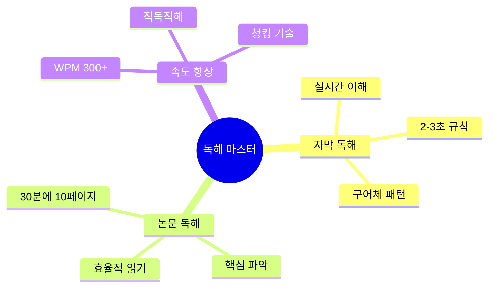
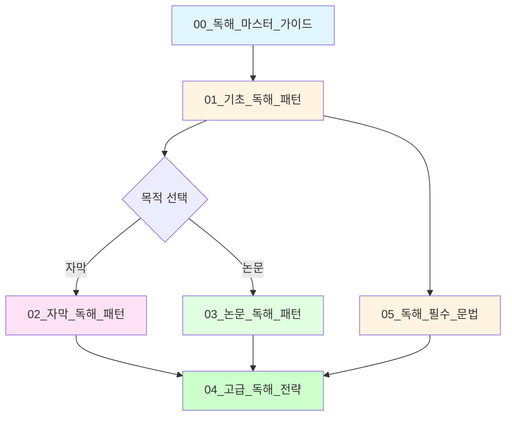
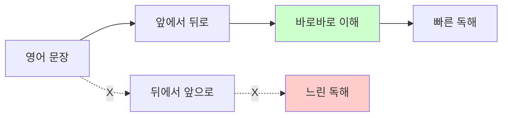
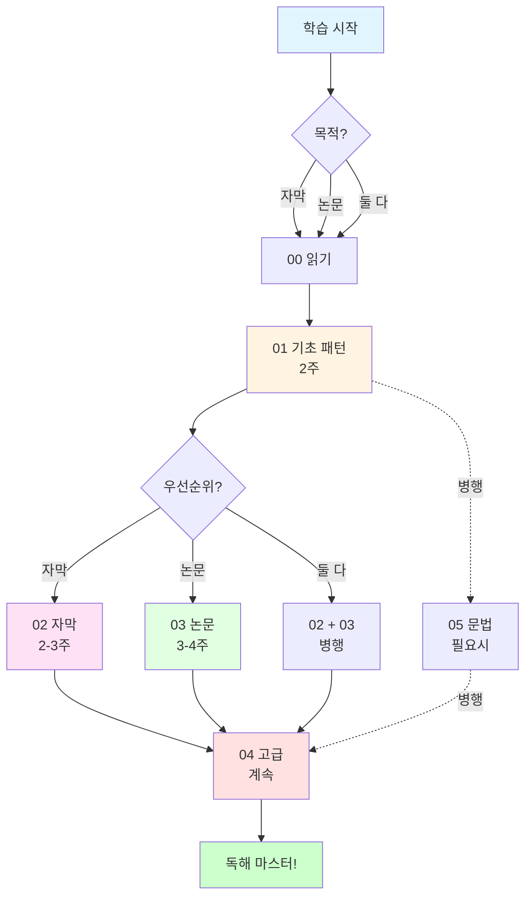

# 영어 독해 학습 시스템

## 📚 폴더 개요

자막과 논문을 빠르고 효율적으로 읽기 위한 독해 학습 자료입니다.
**핵심**: 한국식 사고를 버리고 영어식 직독직해로 속도와 이해도를 동시에 향상시킵니다.

---

## 🎯 학습 목표



---

## 📖 파일 구조 및 학습 순서



---

## 📋 파일별 상세 설명

| 파일 | 난이도 | 학습 기간 | 주요 내용 | 중요도 |
|------|--------|-----------|-----------|--------|
| **00_독해_마스터_가이드.md** | 입문 | 1일 | 전체 로드맵, 직독직해 원칙 | ⭐⭐⭐⭐⭐ |
| **01_기초_독해_패턴.md** | 기초 | 1-2주 | 5형식, 시제, 문장 구조 | ⭐⭐⭐⭐⭐ |
| **02_자막_독해_패턴.md** | 중급 | 2-3주 | 자막 특화, 3초 규칙, 줄임말 | ⭐⭐⭐⭐ |
| **03_논문_독해_패턴.md** | 중급 | 3-4주 | 논문 구조, 30분 전략 | ⭐⭐⭐⭐ |
| **04_고급_독해_전략.md** | 고급 | 4-5주 | 속독, 스키밍, 스캐닝 | ⭐⭐⭐⭐⭐ |
| **05_독해_필수_문법.md** | 병행 | 지속 | 문법 패턴, 빠른 인식 | ⭐⭐⭐⭐ |

---

## 🚀 빠른 시작 가이드

### 1️⃣ 자막 독해가 급한 경우

```
학습 순서:
Day 1: 00_독해_마스터_가이드 (직독직해 원칙 숙지)
Day 2-7: 01_기초_독해_패턴 (5형식 마스터)
Week 2-3: 02_자막_독해_패턴 (집중 학습)
Week 4+: 04_고급_독해_전략 (속도 향상)

병행: 05_독해_필수_문법 (필요한 부분만)
```

### 2️⃣ 논문 독해가 급한 경우

```
학습 순서:
Day 1: 00_독해_마스터_가이드 (전체 이해)
Week 1-2: 01_기초_독해_패턴 (문장 구조)
Week 2-3: 05_독해_필수_문법 (관계사, 분사구문 집중)
Week 3-4: 03_논문_독해_패턴 (논문 특화)
Week 5+: 04_고급_독해_전략 (효율성 극대화)
```

### 3️⃣ 체계적으로 학습하는 경우

```
주차별 계획:
Week 1-2: 00 + 01 (기초 다지기)
Week 3-4: 02 (자막 독해)
Week 5-6: 03 (논문 독해)
Week 7-8: 04 (고급 전략)
병행: 05 (문법 - 필요할 때마다)

총 기간: 2개월
```

---

## ⚡ 핵심 학습 원칙

### 1. 직독직해 (가장 중요!)



### 2. 청킹 (Chunking)

```
문장을 의미 단위로 끊어 읽기

예시:
The students / in my class / study English / every day.
학생들은 / 우리 반의 / 영어를 공부해 / 매일
```

### 3. 주어+동사 우선

```
긴 문장도 주어와 동사만 먼저 찾으면 50% 이해!

The book on the table is mine.
→ book is (책이 ~이다) → 핵심 파악!
```

---

## 📊 레벨별 목표

| 레벨 | 독해 속도 (WPM) | 자막 이해도 | 논문 독해 | 기간 |
|------|-----------------|-------------|-----------|------|
| **입문** | 100-150 | 60% | 불가능 | 0주 |
| **초급** | 150-200 | 70% | 매우 느림 | 2주 |
| **중급** | 200-250 | 80% | 가능 (느림) | 1개월 |
| **고급** | 250-300 | 85% | 효율적 | 2개월 |
| **마스터** | 300+ | 90%+ | 30분/10페이지 | 3개월+ |

---

## 🎯 특징

### ✅ 이 자료의 장점

- **시각화**: Mermaid 다이어그램으로 구조 명확
- **표 활용**: 비교표로 한눈에 이해
- **직독직해 강조**: 영어식 사고 훈련
- **실전 중심**: 자막과 논문에 바로 적용
- **체계적**: 단계별 로드맵 제공
- **효율적**: 필수만 집중 학습

### 🎓 학습 방법

1. **이론 학습** (30%): 패턴과 원칙 이해
2. **실전 연습** (70%): 실제 자료로 훈련
3. **매일 연습**: 하루 30분씩 꾸준히
4. **측정**: WPM과 이해도 주기적 확인

---

## 💡 학습 팁

### Tip 1: 완벽주의 버리기

```
❌ 모든 단어 완벽 이해
✅ 핵심 80% 파악으로 충분

80% 이해 + 빠른 속도 > 100% 이해 + 느린 속도
```

### Tip 2: 실전 연습

```
이론만 (X) → 실제 자료로 (O)

추천 자료:
- 자막: Netflix, YouTube
- 논문: Google Scholar, arXiv
- 뉴스: BBC, CNN
```

### Tip 3: 속도 측정

```
주 1회 WPM 측정:
1. 500단어 글 준비
2. 타이머 재고 읽기
3. WPM 계산
4. 이해도 테스트
5. 기록 및 개선
```

---

## 📱 추천 학습 도구

| 도구 | 용도 | 추천 이유 |
|------|------|-----------|
| **Readsy** | 속독 훈련 | 단어 하나씩 표시 |
| **Spreeder** | 속독 연습 | 속도 조절 가능 |
| **YouTube (0.75x~1.5x)** | 자막 훈련 | 속도 단계별 학습 |
| **Google Scholar** | 논문 찾기 | 무료 논문 접근 |
| **Language Reactor** | Netflix 자막 | 한영 자막 동시 |

---

## 🎯 최종 목표

### 자막 독해

```
목표: 실시간 자막을 읽으면서 영상 시청 가능

성공 기준:
✅ 2-3초 내 자막 이해
✅ 영상과 자막 동시 처리
✅ 재생 속도 1.0x~1.25x 가능
```

### 논문 독해

```
목표: 10페이지 논문을 30분 내 핵심 파악

성공 기준:
✅ Abstract 5분 내 완벽 이해
✅ 논문 구조 즉시 파악
✅ Results 핵심 3가지 추출
✅ 전체 요약 가능
```

---

## 📞 학습 순서 요약



---

## 🔥 성공을 위한 핵심 3가지

### 1️⃣ 직독직해

```
영어 어순 그대로 이해하기
→ 속도 2배 향상의 핵심!
```

### 2️⃣ 매일 30분

```
하루 30분 × 60일 = 독해 실력 혁명
→ 꾸준함이 답!
```

### 3️⃣ 실전 적용

```
배운 것을 즉시 실전에 적용
→ 이론만으로는 부족!
```

---

## 📈 학습 진도 체크

- [ ] 00_독해_마스터_가이드 완독
- [ ] 01_기초_독해_패턴 완독 + 5형식 마스터
- [ ] 02_자막_독해_패턴 완독 + 자막 연습 10시간
- [ ] 03_논문_독해_패턴 완독 + 논문 3편 읽기
- [ ] 04_고급_독해_전략 완독 + WPM 300 달성
- [ ] 05_독해_필수_문법 주요 문법 마스터

---

## 💪 마지막 응원

```
독해는 단거리가 아닌 마라톤입니다.
매일 조금씩, 꾸준히 연습하면
반드시 실력이 향상됩니다!

지금 시작하세요! 🚀
```

---

## 📚 관련 폴더

- `../영어_일상_회화/`: 회화 학습 자료
- `../영어_비즈니스_회화/`: 비즈니스 영어
- 독해 + 회화를 병행하면 시너지 효과!

---

**제작 목적**: 자막과 논문을 빠르고 정확하게 읽기 위한 실전 독해 시스템
**핵심 철학**: 직독직해로 영어식 사고 훈련
**최종 목표**: 영어를 영어로 생각하며 읽기

---

💡 **질문이나 피드백은 언제든지 환영합니다!**

