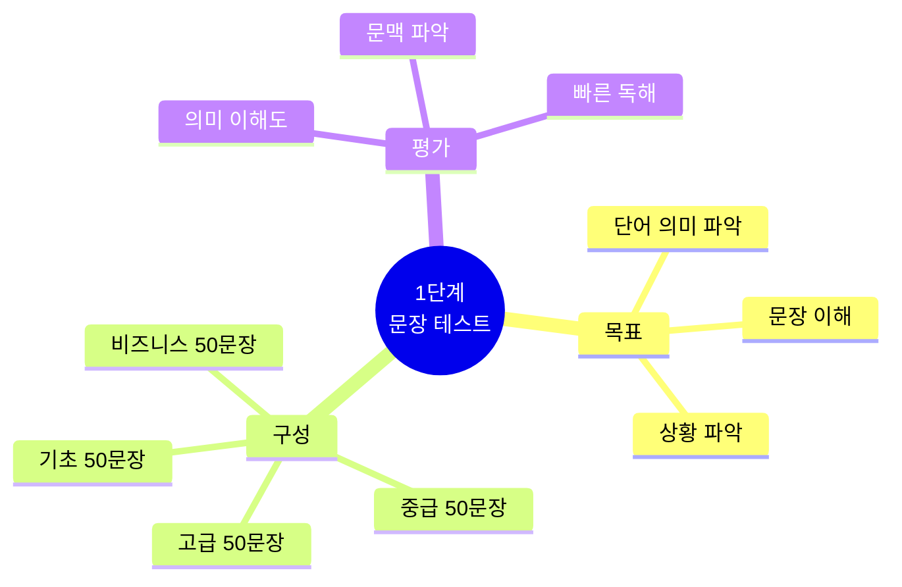
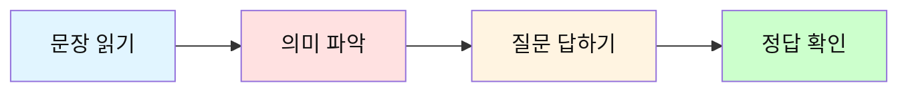
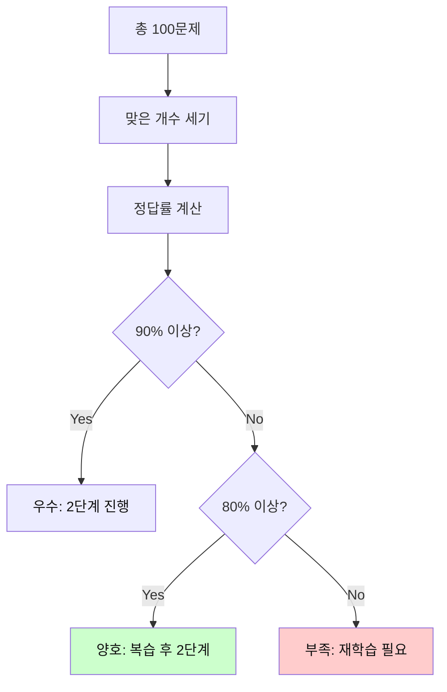
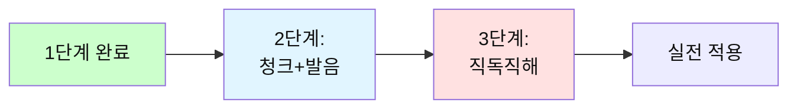

# 전설의 500단어 - 1단계 문장 테스트

## 🎯 1단계 테스트의 목적

500단어를 사용한 **실전 문장**을 읽고 이해하는 능력을 테스트합니다.
단어의 의미를 알고 있는지, 문장 전체를 이해할 수 있는지 확인합니다.



---

## 📝 테스트 방법

### 진행 순서



**지시사항:**
1. 각 문장을 읽고 의미를 파악하세요
2. 문장 아래의 질문에 답하세요
3. 정답을 확인하고 이해도를 체크하세요

---

## 🔥 기초 레벨 (001-100 단어 사용)

### 일상 대화 - 인사와 안부

**문장 1:**
```
I have a good day today.
```

**질문:** 이 사람의 하루는 어떤가요?

<details>
<summary>정답 보기</summary>

오늘 좋은 하루를 보내고 있습니다.

</details>

---

**문장 2:**
```
Can you help me with this problem?
```

**질문:** 이 사람은 무엇을 원하나요?

<details>
<summary>정답 보기</summary>

이 문제에 대한 도움을 원합니다.

</details>

---

**문장 3:**
```
I need to go home now.
```

**질문:** 이 사람은 지금 무엇을 해야 하나요?

<details>
<summary>정답 보기</summary>

지금 집에 가야 합니다.

</details>

---

**문장 4:**
```
Let me know when you are free.
```

**질문:** 이 사람은 상대방의 무엇을 알고 싶어 하나요?

<details>
<summary>정답 보기</summary>

상대방이 언제 시간이 있는지 알고 싶어 합니다.

</details>

---

**문장 5:**
```
This is the best way to do it.
```

**질문:** 화자는 이 방법에 대해 어떻게 생각하나요?

<details>
<summary>정답 보기</summary>

이것이 최고의 방법이라고 생각합니다.

</details>

---

### 일상 대화 - 요청과 제안

**문장 6:**
```
I want to see you tomorrow.
```

**질문:** 화자는 언제 만나고 싶어 하나요?

<details>
<summary>정답 보기</summary>

내일 만나고 싶어 합니다.

</details>

---

**문장 7:**
```
We need to find a better solution.
```

**질문:** 무엇을 찾아야 하나요?

<details>
<summary>정답 보기</summary>

더 나은 해결책을 찾아야 합니다.

</details>

---

**문장 8:**
```
Can you show me how to use this?
```

**질문:** 이 사람은 무엇을 배우고 싶어 하나요?

<details>
<summary>정답 보기</summary>

이것을 사용하는 방법을 배우고 싶어 합니다.

</details>

---

**문장 9:**
```
Let's work together on this project.
```

**질문:** 화자는 무엇을 제안하나요?

<details>
<summary>정답 보기</summary>

이 프로젝트를 함께 하자고 제안합니다.

</details>

---

**문장 10:**
```
I think this is a good idea.
```

**질문:** 화자의 의견은 무엇인가요?

<details>
<summary>정답 보기</summary>

이것이 좋은 아이디어라고 생각합니다.

</details>

---

### 일상 대화 - 시간과 장소

**문장 11:**
```
What time do you want to meet?
```

**질문:** 화자는 무엇을 확인하고 있나요?

<details>
<summary>정답 보기</summary>

만날 시간을 확인하고 있습니다.

</details>

---

**문장 12:**
```
I will be there in 10 minutes.
```

**질문:** 이 사람은 언제 도착하나요?

<details>
<summary>정답 보기</summary>

10분 후에 도착합니다.

</details>

---

**문장 13:**
```
Where do you live now?
```

**질문:** 화자는 무엇을 묻고 있나요?

<details>
<summary>정답 보기</summary>

현재 어디에 사는지 묻고 있습니다.

</details>

---

**문장 14:**
```
This place is very good for our meeting.
```

**질문:** 이 장소는 무엇에 적합한가요?

<details>
<summary>정답 보기</summary>

회의하기에 매우 좋습니다.

</details>

---

**문장 15:**
```
I have time after 3 PM today.
```

**질문:** 이 사람은 언제 시간이 있나요?

<details>
<summary>정답 보기</summary>

오늘 오후 3시 이후에 시간이 있습니다.

</details>

---

### 일상 대화 - 감정과 상태

**문장 16:**
```
I feel very happy about this.
```

**질문:** 화자의 감정은 어떤가요?

<details>
<summary>정답 보기</summary>

이것에 대해 매우 행복합니다.

</details>

---

**문장 17:**
```
This work is too hard for me.
```

**질문:** 이 일에 대한 화자의 생각은?

<details>
<summary>정답 보기</summary>

이 일이 자신에게 너무 어렵다고 생각합니다.

</details>

---

**문장 18:**
```
I don't know what to do next.
```

**질문:** 화자의 상태는 어떤가요?

<details>
<summary>정답 보기</summary>

다음에 무엇을 해야 할지 모르는 상태입니다.

</details>

---

**문장 19:**
```
You look very tired today.
```

**질문:** 상대방은 어떻게 보이나요?

<details>
<summary>정답 보기</summary>

오늘 매우 피곤해 보입니다.

</details>

---

**문장 20:**
```
I'm so glad to see you here.
```

**질문:** 화자는 어떤 감정인가요?

<details>
<summary>정답 보기</summary>

여기서 상대방을 만나서 매우 기쁩니다.

</details>

---

### 일상 대화 - 의견과 생각

**문장 21:**
```
I think we should start now.
```

**질문:** 화자의 제안은 무엇인가요?

<details>
<summary>정답 보기</summary>

지금 시작해야 한다고 생각합니다.

</details>

---

**문장 22:**
```
That's a really good point.
```

**질문:** 화자는 상대방의 의견을 어떻게 평가하나요?

<details>
<summary>정답 보기</summary>

정말 좋은 지적이라고 평가합니다.

</details>

---

**문장 23:**
```
I don't agree with your idea.
```

**질문:** 화자는 상대방의 아이디어에 동의하나요?

<details>
<summary>정답 보기</summary>

동의하지 않습니다.

</details>

---

**문장 24:**
```
We need to think about this more.
```

**질문:** 무엇을 더 해야 하나요?

<details>
<summary>정답 보기</summary>

이것에 대해 더 생각해야 합니다.

</details>

---

**문장 25:**
```
Your answer is right.
```

**질문:** 상대방의 답은 어떤가요?

<details>
<summary>정답 보기</summary>

올바릅니다.

</details>

---

### 일상 대화 - 계획과 미래

**문장 26:**
```
I will call you later.
```

**질문:** 화자는 언제 전화할 건가요?

<details>
<summary>정답 보기</summary>

나중에 전화할 것입니다.

</details>

---

**문장 27:**
```
We can meet next week.
```

**질문:** 언제 만날 수 있나요?

<details>
<summary>정답 보기</summary>

다음 주에 만날 수 있습니다.

</details>

---

**문장 28:**
```
I'm going to start a new job soon.
```

**질문:** 화자는 곧 무엇을 할 건가요?

<details>
<summary>정답 보기</summary>

새 직장을 시작할 것입니다.

</details>

---

**문장 29:**
```
Let's make a plan for tomorrow.
```

**질문:** 무엇을 만들자고 제안하나요?

<details>
<summary>정답 보기</summary>

내일을 위한 계획을 만들자고 제안합니다.

</details>

---

**문장 30:**
```
I hope to see you again.
```

**질문:** 화자는 무엇을 바라나요?

<details>
<summary>정답 보기</summary>

다시 만나기를 바랍니다.

</details>

---

### 일상 대화 - 질문과 확인

**문장 31:**
```
Do you have any questions about this?
```

**질문:** 화자는 무엇을 확인하나요?

<details>
<summary>정답 보기</summary>

이것에 대한 질문이 있는지 확인합니다.

</details>

---

**문장 32:**
```
Can I ask you something?
```

**질문:** 화자는 무엇을 하려고 하나요?

<details>
<summary>정답 보기</summary>

무언가를 물어보려고 합니다.

</details>

---

**문장 33:**
```
Is this the right way to do it?
```

**질문:** 화자는 무엇을 확인하고 싶어 하나요?

<details>
<summary>정답 보기</summary>

이것이 올바른 방법인지 확인하고 싶어 합니다.

</details>

---

**문장 34:**
```
How long will it take?
```

**질문:** 화자는 무엇을 묻고 있나요?

<details>
<summary>정답 보기</summary>

얼마나 걸릴지 묻고 있습니다.

</details>

---

**문장 35:**
```
What do you mean by that?
```

**질문:** 화자는 무엇을 이해하고 싶어 하나요?

<details>
<summary>정답 보기</summary>

그것이 무슨 의미인지 이해하고 싶어 합니다.

</details>

---

### 일상 대화 - 설명과 이유

**문장 36:**
```
This is how it works.
```

**질문:** 화자는 무엇을 하고 있나요?

<details>
<summary>정답 보기</summary>

작동 방식을 설명하고 있습니다.

</details>

---

**문장 37:**
```
I can't come because I'm busy.
```

**질문:** 왜 올 수 없나요?

<details>
<summary>정답 보기</summary>

바빠서 올 수 없습니다.

</details>

---

**문장 38:**
```
That's why I need your help.
```

**질문:** 화자는 왜 도움이 필요한가요?

<details>
<summary>정답 보기</summary>

그것이 도움이 필요한 이유입니다.

</details>

---

**문장 39:**
```
Let me tell you about my day.
```

**질문:** 화자는 무엇에 대해 말하려고 하나요?

<details>
<summary>정답 보기</summary>

자신의 하루에 대해 말하려고 합니다.

</details>

---

**문장 40:**
```
The problem is that we don't have time.
```

**질문:** 문제는 무엇인가요?

<details>
<summary>정답 보기</summary>

시간이 없다는 것입니다.

</details>

---

### 일상 대화 - 가능성과 능력

**문장 41:**
```
I can do this by myself.
```

**질문:** 화자는 어떻게 할 수 있나요?

<details>
<summary>정답 보기</summary>

혼자서 할 수 있습니다.

</details>

---

**문장 42:**
```
We may need more people for this.
```

**질문:** 무엇이 필요할 수 있나요?

<details>
<summary>정답 보기</summary>

이것을 위해 더 많은 사람이 필요할 수 있습니다.

</details>

---

**문장 43:**
```
You should try this new way.
```

**질문:** 화자는 무엇을 권유하나요?

<details>
<summary>정답 보기</summary>

이 새로운 방법을 시도해보라고 권유합니다.

</details>

---

**문장 44:**
```
I could help you if you want.
```

**질문:** 화자는 무엇을 제안하나요?

<details>
<summary>정답 보기</summary>

원한다면 도와줄 수 있다고 제안합니다.

</details>

---

**문장 45:**
```
This might be a good idea.
```

**질문:** 화자는 이것을 어떻게 평가하나요?

<details>
<summary>정답 보기</summary>

좋은 아이디어일 수 있다고 평가합니다.

</details>

---

### 일상 대화 - 비교와 선택

**문장 46:**
```
This one is better than that one.
```

**질문:** 어느 것이 더 나은가요?

<details>
<summary>정답 보기</summary>

이것이 저것보다 더 낫습니다.

</details>

---

**문장 47:**
```
I like the first idea more.
```

**질문:** 화자는 어느 것을 더 좋아하나요?

<details>
<summary>정답 보기</summary>

첫 번째 아이디어를 더 좋아합니다.

</details>

---

**문장 48:**
```
Which way do you think is best?
```

**질문:** 화자는 무엇을 묻고 있나요?

<details>
<summary>정답 보기</summary>

어느 방법이 최고라고 생각하는지 묻고 있습니다.

</details>

---

**문장 49:**
```
Both options are good for us.
```

**질문:** 옵션들은 어떤가요?

<details>
<summary>정답 보기</summary>

두 옵션 모두 우리에게 좋습니다.

</details>

---

**문장 50:**
```
I want to choose the easy way.
```

**질문:** 화자는 어떤 방법을 선택하고 싶어 하나요?

<details>
<summary>정답 보기</summary>

쉬운 방법을 선택하고 싶어 합니다.

</details>

---

## 🔥 중급 레벨 (101-200 단어 사용)

### 업무 상황 - 회의와 논의

**문장 51:**
```
We need to discuss this issue in our next meeting.
```

**질문:** 언제 이 문제를 논의할 건가요?

<details>
<summary>정답 보기</summary>

다음 회의에서 논의할 것입니다.

</details>

---

**문장 52:**
```
The team is working very hard on this project.
```

**질문:** 팀의 상태는 어떤가요?

<details>
<summary>정답 보기</summary>

이 프로젝트에 매우 열심히 일하고 있습니다.

</details>

---

**문장 53:**
```
I think we should consider all the alternatives.
```

**질문:** 화자는 무엇을 고려해야 한다고 생각하나요?

<details>
<summary>정답 보기</summary>

모든 대안을 고려해야 한다고 생각합니다.

</details>

---

**문장 54:**
```
This approach seems quite effective for our needs.
```

**질문:** 이 접근법은 어떤가요?

<details>
<summary>정답 보기</summary>

우리 필요에 꽤 효과적인 것 같습니다.

</details>

---

**문장 55:**
```
Let's review the results carefully before making a decision.
```

**질문:** 결정을 내리기 전에 무엇을 해야 하나요?

<details>
<summary>정답 보기</summary>

결과를 신중하게 검토해야 합니다.

</details>

---

**문장 56:**
```
The current situation requires immediate attention.
```

**질문:** 현재 상황은 무엇을 필요로 하나요?

<details>
<summary>정답 보기</summary>

즉각적인 주의가 필요합니다.

</details>

---

**문장 57:**
```
I'm still working on the report you requested.
```

**질문:** 화자는 무엇을 하고 있나요?

<details>
<summary>정답 보기</summary>

요청받은 보고서를 아직 작업 중입니다.

</details>

---

**문장 58:**
```
We should probably start the meeting a bit earlier.
```

**질문:** 화자는 무엇을 제안하나요?

<details>
<summary>정답 보기</summary>

회의를 조금 더 일찍 시작하자고 제안합니다.

</details>

---

**문장 59:**
```
This is particularly important for our long-term goals.
```

**질문:** 이것은 무엇에 특히 중요한가요?

<details>
<summary>정답 보기</summary>

우리의 장기 목표에 특히 중요합니다.

</details>

---

**문장 60:**
```
Everyone agrees that this is the right direction.
```

**질문:** 사람들의 의견은 어떤가요?

<details>
<summary>정답 보기</summary>

모두 이것이 올바른 방향이라고 동의합니다.

</details>

---

### 업무 상황 - 문제와 해결

**문장 61:**
```
I'm having some difficulty understanding this process.
```

**질문:** 화자는 어떤 어려움이 있나요?

<details>
<summary>정답 보기</summary>

이 과정을 이해하는 데 어려움이 있습니다.

</details>

---

**문장 62:**
```
We found a simple solution to this complex problem.
```

**질문:** 무엇을 찾았나요?

<details>
<summary>정답 보기</summary>

이 복잡한 문제에 대한 간단한 해결책을 찾았습니다.

</details>

---

**문장 63:**
```
The main issue is that we don't have enough resources.
```

**질문:** 주요 문제는 무엇인가요?

<details>
<summary>정답 보기</summary>

충분한 자원이 없다는 것입니다.

</details>

---

**문장 64:**
```
Let me take a closer look at this before responding.
```

**질문:** 화자는 응답하기 전에 무엇을 할 건가요?

<details>
<summary>정답 보기</summary>

이것을 더 자세히 살펴볼 것입니다.

</details>

---

**문장 65:**
```
This method has proven to be very successful in the past.
```

**질문:** 이 방법은 어떤가요?

<details>
<summary>정답 보기</summary>

과거에 매우 성공적이었음이 입증되었습니다.

</details>

---

**문장 66:**
```
We're currently facing several challenges with the new system.
```

**질문:** 현재 어떤 상황인가요?

<details>
<summary>정답 보기</summary>

새 시스템과 관련하여 여러 도전에 직면하고 있습니다.

</details>

---

**문장 67:**
```
I believe we can overcome these obstacles together.
```

**질문:** 화자는 무엇을 믿나요?

<details>
<summary>정답 보기</summary>

함께 이러한 장애물을 극복할 수 있다고 믿습니다.

</details>

---

**문장 68:**
```
The team needs additional support to complete this task.
```

**질문:** 팀은 무엇이 필요한가요?

<details>
<summary>정답 보기</summary>

이 작업을 완료하기 위해 추가 지원이 필요합니다.

</details>

---

**문장 69:**
```
We should address this problem as soon as possible.
```

**질문:** 이 문제를 언제 다뤄야 하나요?

<details>
<summary>정답 보기</summary>

가능한 한 빨리 다뤄야 합니다.

</details>

---

**문장 70:**
```
I'm confident that we'll find a way to fix this.
```

**질문:** 화자의 태도는 어떤가요?

<details>
<summary>정답 보기</summary>

이것을 고칠 방법을 찾을 것이라고 확신합니다.

</details>

---

### 업무 상황 - 계획과 일정

**문장 71:**
```
The project deadline is next Friday afternoon.
```

**질문:** 프로젝트 마감일은 언제인가요?

<details>
<summary>정답 보기</summary>

다음 주 금요일 오후입니다.

</details>

---

**문장 72:**
```
We're planning to launch the new product in early March.
```

**질문:** 언제 새 제품을 출시할 계획인가요?

<details>
<summary>정답 보기</summary>

3월 초에 출시할 계획입니다.

</details>

---

**문장 73:**
```
I'll be available for a call between 2 and 4 PM.
```

**질문:** 화자는 언제 통화가 가능한가요?

<details>
<summary>정답 보기</summary>

오후 2시에서 4시 사이에 가능합니다.

</details>

---

**문장 74:**
```
The meeting has been rescheduled to next Tuesday.
```

**질문:** 회의는 언제로 변경되었나요?

<details>
<summary>정답 보기</summary>

다음 주 화요일로 변경되었습니다.

</details>

---

**문장 75:**
```
We need at least two weeks to complete the analysis.
```

**질문:** 분석을 완료하는 데 얼마나 걸리나요?

<details>
<summary>정답 보기</summary>

최소 2주가 필요합니다.

</details>

---

**문장 76:**
```
I'm currently working on three different projects simultaneously.
```

**질문:** 화자는 몇 개의 프로젝트를 하고 있나요?

<details>
<summary>정답 보기</summary>

동시에 3개의 다른 프로젝트를 하고 있습니다.

</details>

---

**문장 77:**
```
Let's schedule a follow-up meeting for next month.
```

**질문:** 언제 후속 회의를 잡자고 제안하나요?

<details>
<summary>정답 보기</summary>

다음 달에 잡자고 제안합니다.

</details>

---

**문장 78:**
```
The training session will take approximately three hours.
```

**질문:** 교육 세션은 얼마나 걸리나요?

<details>
<summary>정답 보기</summary>

대략 3시간 걸립니다.

</details>

---

**문장 79:**
```
We're running slightly behind schedule this week.
```

**질문:** 현재 일정은 어떤가요?

<details>
<summary>정답 보기</summary>

이번 주에 일정보다 약간 늦어지고 있습니다.

</details>

---

**문장 80:**
```
I plan to finish this by the end of the day.
```

**질문:** 화자는 언제까지 끝낼 계획인가요?

<details>
<summary>정답 보기</summary>

오늘 끝까지 끝낼 계획입니다.

</details>

---

### 업무 상황 - 의견과 제안

**문장 81:**
```
In my opinion, this is the most efficient approach.
```

**질문:** 화자의 의견은 무엇인가요?

<details>
<summary>정답 보기</summary>

이것이 가장 효율적인 접근법이라고 생각합니다.

</details>

---

**문장 82:**
```
I strongly recommend that we proceed with this plan.
```

**질문:** 화자는 무엇을 강력히 권고하나요?

<details>
<summary>정답 보기</summary>

이 계획을 진행하기를 강력히 권고합니다.

</details>

---

**문장 83:**
```
Perhaps we should try a different strategy this time.
```

**질문:** 화자는 무엇을 제안하나요?

<details>
<summary>정답 보기</summary>

이번에는 다른 전략을 시도해보자고 제안합니다.

</details>

---

**문장 84:**
```
From my perspective, both options have their advantages.
```

**질문:** 화자의 관점에서 옵션들은 어떤가요?

<details>
<summary>정답 보기</summary>

두 옵션 모두 장점이 있습니다.

</details>

---

**문장 85:**
```
I completely agree with your assessment of the situation.
```

**질문:** 화자는 상대방의 평가에 동의하나요?

<details>
<summary>정답 보기</summary>

상황에 대한 평가에 완전히 동의합니다.

</details>

---

**문장 86:**
```
We might want to consider the long-term implications.
```

**질문:** 무엇을 고려하고 싶어 하나요?

<details>
<summary>정답 보기</summary>

장기적인 영향을 고려하고 싶어 합니다.

</details>

---

**문장 87:**
```
I suggest we gather more information before deciding.
```

**질문:** 결정하기 전에 무엇을 하자고 제안하나요?

<details>
<summary>정답 보기</summary>

더 많은 정보를 수집하자고 제안합니다.

</details>

---

**문장 88:**
```
That's an interesting point that deserves further discussion.
```

**질문:** 그 지적은 어떤가요?

<details>
<summary>정답 보기</summary>

추가 논의가 필요한 흥미로운 지적입니다.

</details>

---

**문장 89:**
```
I'm not entirely convinced that this will work.
```

**질문:** 화자는 어떻게 생각하나요?

<details>
<summary>정답 보기</summary>

이것이 효과가 있을지 완전히 확신하지 못합니다.

</details>

---

**문장 90:**
```
We should definitely explore this opportunity further.
```

**질문:** 이 기회에 대해 무엇을 해야 하나요?

<details>
<summary>정답 보기</summary>

확실히 더 탐구해야 합니다.

</details>

---

### 업무 상황 - 결과와 성과

**문장 91:**
```
The results exceeded our initial expectations significantly.
```

**질문:** 결과는 어땠나요?

<details>
<summary>정답 보기</summary>

초기 기대를 크게 초과했습니다.

</details>

---

**문장 92:**
```
We successfully completed all the assigned tasks on time.
```

**질문:** 작업들은 어떻게 완료되었나요?

<details>
<summary>정답 보기</summary>

할당된 모든 작업을 제시간에 성공적으로 완료했습니다.

</details>

---

**문장 93:**
```
The new system is performing much better than expected.
```

**질문:** 새 시스템은 어떤가요?

<details>
<summary>정답 보기</summary>

예상보다 훨씬 더 잘 작동하고 있습니다.

</details>

---

**문장 94:**
```
This achievement demonstrates the team's dedication and skill.
```

**질문:** 이 성과는 무엇을 보여주나요?

<details>
<summary>정답 보기</summary>

팀의 헌신과 기술을 보여줍니다.

</details>

---

**문장 95:**
```
We've made significant progress since our last update.
```

**질문:** 지난 업데이트 이후 어떤가요?

<details>
<summary>정답 보기</summary>

상당한 진전을 이루었습니다.

</details>

---

**문장 96:**
```
The feedback from clients has been overwhelmingly positive.
```

**질문:** 고객들의 피드백은 어떤가요?

<details>
<summary>정답 보기</summary>

압도적으로 긍정적입니다.

</details>

---

**문장 97:**
```
I'm pleased to report that everything went smoothly.
```

**질문:** 화자는 무엇을 보고하나요?

<details>
<summary>정답 보기</summary>

모든 것이 순조롭게 진행되었다고 보고합니다.

</details>

---

**문장 98:**
```
The data clearly shows improvement in all key areas.
```

**질문:** 데이터는 무엇을 보여주나요?

<details>
<summary>정답 보기</summary>

모든 주요 영역에서 개선을 명확히 보여줍니다.

</details>

---

**문장 99:**
```
This outcome validates our decision to change the approach.
```

**질문:** 이 결과는 무엇을 입증하나요?

<details>
<summary>정답 보기</summary>

접근법을 변경하기로 한 우리 결정을 입증합니다.

</details>

---

**문장 100:**
```
We're very satisfied with the overall quality of the work.
```

**질문:** 작업의 품질에 대해 어떻게 생각하나요?

<details>
<summary>정답 보기</summary>

전반적인 품질에 매우 만족합니다.

</details>

---

## 📊 1단계 테스트 점수 계산

### 채점 방법



### 점수 기록

**나의 점수:**
- 기초 레벨 (1-50): _____ / 50 (____%)
- 중급 레벨 (51-100): _____ / 50 (____%)
- **총점**: _____ / 100 (____%)

### 평가 기준

| 점수 | 평가 | 다음 단계 |
|------|------|-----------|
| **90-100%** | 우수 | 즉시 2단계 진행 |
| **80-89%** | 양호 | 틀린 부분 복습 후 2단계 |
| **70-79%** | 보통 | 해당 단어 재학습 후 재시험 |
| **70% 미만** | 부족 | 단어 학습부터 다시 시작 |

---

## 🎯 약점 분석

### 틀린 문제 체크리스트

**기초 레벨에서 틀린 문제 번호:**
- [ ] _____, _____, _____, _____, _____

**중급 레벨에서 틀린 문제 번호:**
- [ ] _____, _____, _____, _____, _____

### 복습 계획

```
📌 복습 우선순위:

1. 틀린 문제의 단어 다시 학습
2. 해당 단어가 포함된 청크 패턴 복습
3. 비슷한 문장으로 추가 연습
4. 1주일 후 같은 문제 재시험
```

---

## 🚀 다음 단계



**1단계를 통과하셨나요?**
- ✅ 90% 이상: [2단계 청크+발음 테스트](./전설의_500단어_2단계_청크발음_테스트.md)로 이동
- ⚠️ 80-89%: 틀린 부분 복습 후 2단계 진행
- ❌ 80% 미만: 단어 학습 파일로 돌아가기

---

**관련 파일:**
- 📕 [001-100 단어](./전설의_500단어_1-100.md)
- 📗 [101-200 단어](./전설의_500단어_101-200.md)
- 📙 [201-300 단어](./전설의_500단어_201-300.md)
- 📘 [301-400 단어](./전설의_500단어_301-400.md)
- 📔 [401-500 단어](./전설의_500단어_401-500.md)

