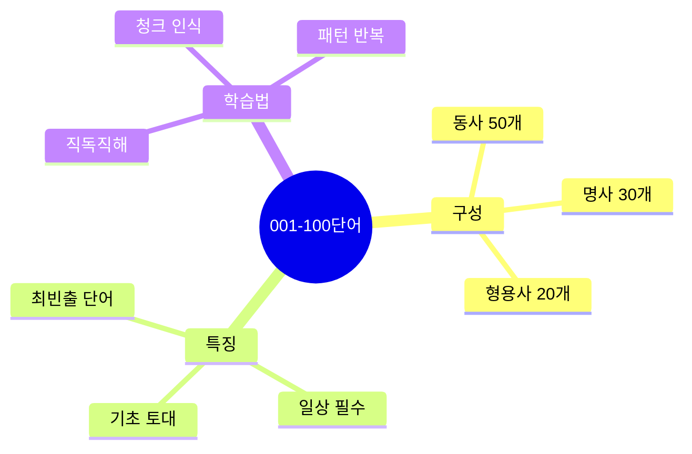
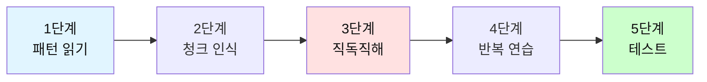
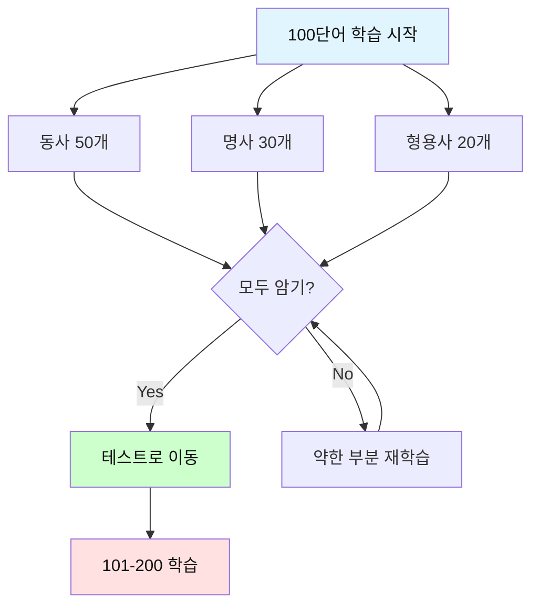

# 전설의 500단어 (001-100) - 문장 패턴으로 마스터

## 🎯 이 파일의 목적

단어 하나하나를 외우는 것이 아니라, **실제 문장 패턴 속에서** 100개 핵심 단어를 익힙니다.
각 단어는 3개의 필수 패턴 문장과 함께 제공되어 **청크 단위로 자동 암기**됩니다.



---

## 📚 학습 방법

### 단계별 학습법



| 단계 | 방법 | 시간 | 목표 |
|------|------|------|------|
| **1단계** | 패턴 문장 읽기 | 1분 | 3개 패턴 이해 |
| **2단계** | 슬래시로 청크 구분 | 30초 | 청크 인식 |
| **3단계** | 직독직해로 해석 | 1분 | 어순대로 이해 |
| **4단계** | 소리내어 반복 | 2분 | 자동화 |
| **5단계** | 스스로 문장 만들기 | 1분 | 실전 적용 |

---

## 🔥 동사 (Verbs) 001-050

### 001. **have** [해브] - 가지다, 하다

**청크 패턴 3개**:
```
1. I have / a question.
   나는 가지고 있어 / 질문을

2. We have to / finish / this project / today.
   우리는 해야 해 / 끝내야 / 이 프로젝트를 / 오늘

3. She has been / living here / for 5 years.
   그녀는 살아왔다 / 여기에 / 5년간
```

---

### 002. **make** [메이크] - 만들다, 시키다

**청크 패턴 3개**:
```
1. Let's make / a plan / for tomorrow.
   만들자 / 계획을 / 내일을 위한

2. This news / made me / happy.
   이 소식이 / 만들었다 나를 / 행복하게

3. I want to make / a difference / in the world.
   나는 만들고 싶다 / 변화를 / 세상에
```

---

### 003. **get** [겟] - 얻다, 되다, 도착하다

**청크 패턴 3개**:
```
1. I need to get / some coffee / before the meeting.
   나는 필요해 얻을 / 커피를 / 회의 전에

2. She's getting / better / every day.
   그녀는 되고 있다 / 더 좋아지고 / 매일

3. What time / did you get / to the office?
   몇 시에 / 너는 도착했니 / 사무실에?
```

---

### 004. **take** [테이크] - 가져가다, 걸리다

**청크 패턴 3개**:
```
1. It takes / about 30 minutes / to get there.
   걸린다 / 약 30분 / 거기 가는데

2. Can you take / this report / to the manager?
   너 가져갈 수 있니 / 이 보고서를 / 매니저에게?

3. I'll take / a break / for 10 minutes.
   나는 가질 거야 / 휴식을 / 10분간
```

---

### 005. **go** [고] - 가다

**청크 패턴 3개**:
```
1. Let's go / to lunch / together.
   가자 / 점심 먹으러 / 함께

2. How's it going / with the project?
   어떻게 되가니 / 프로젝트는?

3. I'm going to / start / a new job / next month.
   나는 할 거야 / 시작할 / 새 직장을 / 다음 달에
```

---

### 006. **know** [노] - 알다

**청크 패턴 3개**:
```
1. Do you know / how to use / this software?
   너 아니 / 사용하는 방법을 / 이 소프트웨어를?

2. I don't know / the answer / yet.
   나는 모르겠어 / 답을 / 아직

3. Let me know / if you need / any help.
   나한테 알려줘 / 만약 네가 필요하면 / 어떤 도움이라도
```

---

### 007. **think** [씽크] - 생각하다

**청크 패턴 3개**:
```
1. I think / this is / a good idea.
   나는 생각해 / 이것이 / 좋은 아이디어라고

2. What do you think / about this proposal?
   너는 어떻게 생각하니 / 이 제안에 대해?

3. I'm thinking of / changing / my career.
   나는 생각 중이야 / 바꾸는 것을 / 내 커리어를
```

---

### 008. **see** [씨] - 보다, 만나다

**청크 패턴 3개**:
```
1. I see / what you mean.
   나는 본다 / 네가 의미하는 것을

2. Can I see / you / tomorrow morning?
   내가 볼 수 있을까 / 너를 / 내일 아침에?

3. I saw / him / at the conference / yesterday.
   나는 봤어 / 그를 / 컨퍼런스에서 / 어제
```

---

### 009. **want** [원트] - 원하다

**청크 패턴 3개**:
```
1. I want to / learn / more about / this topic.
   나는 원해 / 배우기를 / 더 많이 / 이 주제에 대해

2. Do you want / some help / with that?
   너 원하니 / 도움을 / 그것과 함께?

3. She wants us / to finish / by Friday.
   그녀는 원해 우리가 / 끝내기를 / 금요일까지
```

---

### 010. **need** [니드] - 필요하다

**청크 패턴 3개**:
```
1. We need to / discuss / this issue / in detail.
   우리는 필요해 / 논의할 / 이 문제를 / 자세히

2. I need / more time / to finish / this task.
   나는 필요해 / 더 많은 시간이 / 끝내기 위해 / 이 작업을

3. Do you need / anything else / from me?
   너 필요하니 / 다른 어떤 것 / 나로부터?
```

---

### 011. **work** [워크] - 일하다, 작동하다

**청크 패턴 3개**:
```
1. I work / at / a tech company.
   나는 일해 / ~에 / 기술 회사

2. Does this solution / work / for you?
   이 해결책이 / 작동하니 / 너에게?

3. We've been working / on this project / for months.
   우리는 일해왔어 / 이 프로젝트에 / 몇 달 동안
```

---

### 012. **use** [유즈] - 사용하다

**청크 패턴 3개**:
```
1. How do you use / this feature?
   어떻게 너는 사용하니 / 이 기능을?

2. We can use / this data / to improve / our service.
   우리는 사용할 수 있어 / 이 데이터를 / 향상시키기 위해 / 우리 서비스를

3. I used to / work / in marketing.
   나는 했었어 / 일하기를 / 마케팅에서
```

---

### 013. **find** [파인드] - 찾다, 발견하다

**청크 패턴 3개**:
```
1. I can't find / my phone.
   나는 못 찾겠어 / 내 폰을

2. We found / a solution / to the problem.
   우리는 찾았어 / 해결책을 / 그 문제에 대한

3. It's hard to find / good talent / these days.
   어려워 찾기가 / 좋은 인재를 / 요즘
```

---

### 014. **give** [기브] - 주다

**청크 패턴 3개**:
```
1. Can you give me / a hand / with this?
   너 줄 수 있니 / 도움을 / 이것과 함께?

2. I'll give / you / a call / later.
   나는 줄게 / 너에게 / 전화를 / 나중에

3. She gave / a presentation / about AI.
   그녀는 했어 / 발표를 / AI에 대한
```

---

### 015. **tell** [텔] - 말하다

**청크 패턴 3개**:
```
1. Can you tell me / how to get there?
   너 말해줄 수 있니 / 어떻게 가는지를 / 거기에?

2. I told him / about the meeting.
   나는 말했어 / 그에게 / 회의에 대해

3. Let me tell you / something important.
   내가 말할게 / 너에게 / 중요한 무언가를
```

---

### 016. **come** [컴] - 오다

**청크 패턴 3개**:
```
1. Come here / for a second.
   이리 와 / 잠깐

2. When did you come / to Korea?
   언제 너는 왔니 / 한국에?

3. The idea came / to me / suddenly.
   그 아이디어가 떠올랐어 / 나에게 / 갑자기
```

---

### 017. **look** [룩] - 보다, ~처럼 보이다

**청크 패턴 3개**:
```
1. Look at / this chart.
   봐 / 이 차트를

2. You look / tired / today.
   너 보여 / 피곤해 / 오늘

3. I'm looking for / a new job.
   나는 찾고 있어 / 새 직장을
```

---

### 018. **do** [두] - 하다

**청크 패턴 3개**:
```
1. What do you do / for a living?
   너 뭐하니 / 직업으로?

2. I did / my best / on the project.
   나는 했어 / 최선을 / 프로젝트에

3. Do you have / any questions?
   너 있니 / 어떤 질문?
```

---

### 019. **say** [세이] - 말하다

**청크 패턴 3개**:
```
1. What did / you say? / I didn't hear / you.
   뭐라고 / 너 말했어? / 나는 안 들었어 / 너를

2. They say / this restaurant / is really good.
   사람들이 말해 / 이 식당이 / 정말 좋다고

3. I have to say, / I'm impressed / by your work.
   말해야겠어, / 나는 감명받았어 / 네 일에
```

---

### 020. **help** [헬프] - 돕다

**청크 패턴 3개**:
```
1. Can you help me / with this problem?
   너 도와줄 수 있니 / 이 문제와 함께?

2. This tool / helps us / save time.
   이 도구가 / 돕는다 우리를 / 시간을 절약하도록

3. I can't help / thinking about / the meeting.
   나는 할 수 없어 / 생각하지 않을 수 / 회의에 대해
```

---

### 021. **ask** [애스크] - 묻다, 요청하다

**청크 패턴 3개**:
```
1. Let me ask / you / a question.
   내가 물어볼게 / 너에게 / 질문을

2. She asked me / to review / the document.
   그녀는 요청했어 나에게 / 검토하기를 / 문서를

3. Feel free / to ask / if you need / anything.
   자유롭게 해 / 묻기를 / 만약 네가 필요하면 / 무엇이든
```

---

### 022. **try** [트라이] - 시도하다, 노력하다

**청크 패턴 3개**:
```
1. Let's try / a different approach.
   시도해보자 / 다른 접근을

2. I'll try / to finish / by tomorrow.
   나는 노력할게 / 끝내기를 / 내일까지

3. Have you tried / turning it off / and on again?
   너 시도해봤니 / 꺼보기를 / 그리고 다시 켜보기를?
```

---

### 023. **call** [콜] - 전화하다, 부르다

**청크 패턴 3개**:
```
1. I'll call you / later / this afternoon.
   나는 전화할게 너에게 / 나중에 / 오늘 오후

2. They call / this approach / "agile development."
   그들은 부른다 / 이 접근을 / "애자일 개발"이라고

3. Can you call / the client / and confirm?
   너 전화할 수 있니 / 고객에게 / 그리고 확인해줄?
```

---

### 024. **feel** [필] - 느끼다

**청크 패턴 3개**:
```
1. I feel / confident / about this decision.
   나는 느껴 / 확신을 / 이 결정에 대해

2. How do you feel / about / the new policy?
   너 어떻게 느끼니 / ~에 대해 / 새로운 정책?

3. Don't feel / bad / about asking / for help.
   느끼지 마 / 나쁘게 / 묻는 것에 대해 / 도움을
```

---

### 025. **become** [비컴] - 되다

**청크 패턴 3개**:
```
1. She became / the CEO / last year.
   그녀는 되었어 / CEO가 / 작년에

2. It's becoming / more important / to learn / new skills.
   되고 있어 / 더 중요해지고 / 배우는 것이 / 새로운 기술들을

3. This has become / a major issue / for us.
   이것은 되었어 / 주요 이슈가 / 우리에게
```

---

### 026. **leave** [리브] - 떠나다, 남기다

**청크 패턴 3개**:
```
1. What time / do you leave / the office?
   몇 시에 / 너는 떠나니 / 사무실을?

2. Please leave / a message / after the beep.
   남겨주세요 / 메시지를 / 삐 소리 후에

3. I left / my laptop / at home.
   나는 남겨두었어 / 내 노트북을 / 집에
```

---

### 027. **show** [쇼] - 보여주다

**청크 패턴 3개**:
```
1. Let me show / you / how it works.
   내가 보여줄게 / 너에게 / 어떻게 작동하는지

2. The data shows / that / customers prefer / this feature.
   그 데이터는 보여줘 / ~라는 것을 / 고객들이 선호한다 / 이 기능을

3. Can you show me / the report / you mentioned?
   너 보여줄 수 있니 나에게 / 보고서를 / 네가 언급한?
```

---

### 028. **mean** [민] - 의미하다

**청크 패턴 3개**:
```
1. What does / this error message / mean?
   무엇을 의미하니 / 이 에러 메시지가?

2. I didn't mean / to interrupt / you.
   나는 의도하지 않았어 / 방해하는 것을 / 너를

3. This means / we have to / start over.
   이것은 의미해 / 우리가 해야 한다는 것을 / 다시 시작하기를
```

---

### 029. **put** [풋] - 놓다, 두다

**청크 패턴 3개**:
```
1. Put the files / on my desk.
   놓아라 파일들을 / 내 책상 위에

2. How should I put / this / in the report?
   어떻게 내가 넣어야 하나 / 이것을 / 보고서에?

3. She put / a lot of effort / into this project.
   그녀는 넣었어 / 많은 노력을 / 이 프로젝트에
```

---

### 030. **start** [스타트] - 시작하다

**청크 패턴 3개**:
```
1. Let's start / the meeting / now.
   시작하자 / 회의를 / 지금

2. When did you start / working here?
   언제 너는 시작했니 / 여기서 일하기를?

3. I need to start / looking for / a new apartment.
   나는 시작해야 해 / 찾기를 / 새 아파트를
```

---

### 031. **turn** [턴] - 돌다, 바꾸다

**청크 패턴 3개**:
```
1. Turn left / at the corner.
   돌아 왼쪽으로 / 모퉁이에서

2. Can you turn on / the light?
   너 켤 수 있니 / 불을?

3. This project / turned out / really well.
   이 프로젝트는 / 결과가 나왔어 / 정말 잘
```

---

### 032. **run** [런] - 달리다, 운영하다

**청크 패턴 3개**:
```
1. I run / every morning / before work.
   나는 달려 / 매일 아침 / 출근 전에

2. She runs / her own business.
   그녀는 운영해 / 자신의 사업을

3. The program / is running / smoothly / now.
   그 프로그램은 / 돌아가고 있어 / 부드럽게 / 지금
```

---

### 033. **move** [무브] - 움직이다, 이동하다

**청크 패턴 3개**:
```
1. We need to move / quickly / on this.
   우리는 움직여야 해 / 빠르게 / 이것에

2. I'm moving / to a new apartment / next month.
   나는 이사가 / 새 아파트로 / 다음 달에

3. Let's move / this discussion / to tomorrow.
   옮기자 / 이 논의를 / 내일로
```

---

### 034. **live** [리브] - 살다

**청크 패턴 3개**:
```
1. Where do you live?
   어디에 너는 사니?

2. I've been living here / for 3 years.
   나는 살아왔어 여기에 / 3년간

3. He lives / in Seoul / with his family.
   그는 산다 / 서울에 / 가족과 함께
```

---

### 035. **believe** [빌리브] - 믿다

**청크 패턴 3개**:
```
1. I believe / you / can do this.
   나는 믿어 / 너를 / 할 수 있다고 이것을

2. Do you believe / in / second chances?
   너 믿니 / ~를 / 두 번째 기회?

3. I can't believe / it's already / Friday.
   나는 못 믿겠어 / 벌써 / 금요일이라는 것을
```

---

### 036. **bring** [브링] - 가져오다

**청크 패턴 3개**:
```
1. Bring / your laptop / to the meeting.
   가져와 / 너의 노트북을 / 회의에

2. This will bring / great results.
   이것은 가져올 거야 / 좋은 결과를

3. Who brought / the snacks?
   누가 가져왔니 / 간식을?
```

---

### 037. **happen** [해픈] - 일어나다

**청크 패턴 3개**:
```
1. What happened / at the meeting?
   무슨 일이 일어났니 / 회의에서?

2. These things / happen / sometimes.
   이런 일들은 / 일어나 / 때때로

3. It won't happen / again.
   일어나지 않을 거야 / 다시
```

---

### 038. **write** [라이트] - 쓰다

**청크 패턴 3개**:
```
1. I need to write / an email / to the client.
   나는 써야 해 / 이메일을 / 고객에게

2. She writes / very well.
   그녀는 써 / 아주 잘

3. Can you write down / your phone number?
   너 적어줄 수 있니 / 네 전화번호를?
```

---

### 039. **provide** [프로바이드] - 제공하다

**청크 패턴 3개**:
```
1. We provide / technical support / 24/7.
   우리는 제공해 / 기술 지원을 / 24시간

2. Can you provide / more details / about this?
   너 제공할 수 있니 / 더 자세한 내용을 / 이것에 대한?

3. This report / provides / valuable insights.
   이 보고서는 / 제공한다 / 가치 있는 통찰을
```

---

### 040. **sit** [싯] - 앉다

**청크 패턴 3개**:
```
1. Please sit down.
   앉아주세요

2. Where should I sit?
   어디에 내가 앉아야 하나?

3. I've been sitting / here / for 2 hours.
   나는 앉아있었어 / 여기에 / 2시간 동안
```

---

### 041. **stand** [스탠드] - 서다

**청크 패턴 3개**:
```
1. Stand up / please.
   일어나세요

2. I can't stand / this heat.
   나는 견딜 수 없어 / 이 더위를

3. What does / this acronym / stand for?
   무엇을 의미하니 / 이 약어가?
```

---

### 042. **lose** [루즈] - 잃다, 지다

**청크 패턴 3개**:
```
1. I lost / my keys / somewhere.
   나는 잃어버렸어 / 내 열쇠를 / 어디엔가

2. Don't lose / hope.
   잃지 마 / 희망을

3. We can't afford / to lose / this client.
   우리는 여유가 없어 / 잃을 / 이 고객을
```

---

### 043. **pay** [페이] - 지불하다

**청크 패턴 3개**:
```
1. How much / did you pay / for this?
   얼마를 / 너는 지불했니 / 이것에?

2. I'll pay / for lunch / today.
   내가 낼게 / 점심을 / 오늘

3. You need to pay / attention / to the details.
   너는 기울여야 해 / 주의를 / 세부사항에
```

---

### 044. **meet** [밋] - 만나다

**청크 패턴 3개**:
```
1. Nice to meet / you.
   만나서 반가워 / 너를

2. Let's meet / at 3 PM / tomorrow.
   만나자 / 오후 3시에 / 내일

3. I met / the new CEO / yesterday.
   나는 만났어 / 새 CEO를 / 어제
```

---

### 045. **include** [인클루드] - 포함하다

**청크 패턴 3개**:
```
1. This price / includes / tax.
   이 가격은 / 포함해 / 세금을

2. Make sure / to include / all the details.
   확실히 해 / 포함하기를 / 모든 세부사항을

3. The team / includes / five members.
   그 팀은 / 포함한다 / 다섯 명의 멤버를
```

---

### 046. **continue** [컨티뉴] - 계속하다

**청크 패턴 3개**:
```
1. Please continue / with your presentation.
   계속하세요 / 당신의 발표를

2. We'll continue / this discussion / tomorrow.
   우리는 계속할 거야 / 이 논의를 / 내일

3. The meeting / continued / for 3 hours.
   회의는 / 계속됐어 / 3시간 동안
```

---

### 047. **set** [셋] - 설정하다, 놓다

**청크 패턴 3개**:
```
1. Let's set / a deadline / for this.
   정하자 / 마감일을 / 이것의

2. I need to set up / a meeting / with the team.
   나는 설정해야 해 / 회의를 / 팀과

3. The sun / sets / at 6 PM / today.
   해는 / 진다 / 오후 6시에 / 오늘
```

---

### 048. **learn** [런] - 배우다

**청크 패턴 3개**:
```
1. I want to learn / more / about this.
   나는 배우고 싶어 / 더 / 이것에 대해

2. We learned / a lot / from this project.
   우리는 배웠어 / 많이 / 이 프로젝트로부터

3. It's never / too late / to learn / something new.
   절대 아니야 / 너무 늦는 것은 / 배우기에 / 새로운 것을
```

---

### 049. **change** [체인지] - 바꾸다, 변화하다

**청크 패턴 3개**:
```
1. We need to change / our strategy.
   우리는 바꿔야 해 / 우리 전략을

2. Things are changing / rapidly / in this industry.
   상황이 변하고 있어 / 빠르게 / 이 산업에서

3. Can I change / my appointment / to tomorrow?
   내가 바꿀 수 있나 / 내 약속을 / 내일로?
```

---

### 050. **add** [애드] - 추가하다

**청크 패턴 3개**:
```
1. Can you add / me / to the meeting?
   너 추가해줄 수 있니 / 나를 / 회의에?

2. I'd like to add / one more thing.
   나는 추가하고 싶어 / 한 가지 더

3. This feature / adds / great value / to our product.
   이 기능은 / 추가한다 / 큰 가치를 / 우리 제품에
```

---

## 🔥 명사 (Nouns) 051-080

### 051. **time** [타임] - 시간

**청크 패턴 3개**:
```
1. I don't have / enough time / to finish this.
   나는 없어 / 충분한 시간이 / 이것을 끝낼

2. What time / is the meeting?
   몇 시야 / 회의가?

3. This is / the first time / I've seen / this error.
   이것은 / 첫 번째야 / 내가 본 / 이 에러를
```

---

### 052. **way** [웨이] - 방법, 길

**청크 패턴 3개**:
```
1. Is there / a better way / to do this?
   있니 / 더 나은 방법이 / 이것을 하는?

2. That's the way / we've always / done it.
   그것이 방법이야 / 우리가 항상 / 해왔던

3. By the way, / did you hear / the news?
   그건 그렇고, / 너 들었니 / 그 소식을?
```

---

### 053. **problem** [프라블럼] - 문제

**청크 패턴 3개**:
```
1. We have / a problem / with the system.
   우리는 있어 / 문제가 / 시스템과 함께

2. No problem, / I can help / with that.
   문제없어, / 나는 도울 수 있어 / 그것과 함께

3. Let's solve / this problem / together.
   해결하자 / 이 문제를 / 함께
```

---

### 054. **question** [퀘스천] - 질문

**청크 패턴 3개**:
```
1. I have / a question / about this report.
   나는 있어 / 질문이 / 이 보고서에 대한

2. Good question! / Let me think / about it.
   좋은 질문이야! / 내가 생각해볼게 / 그것에 대해

3. Feel free / to ask / any questions.
   자유롭게 해 / 물어보기를 / 어떤 질문이라도
```

---

### 055. **work** [워크] - 일, 작업

**청크 패턴 3개**:
```
1. I have / a lot of work / to do / today.
   나는 있어 / 많은 일이 / 해야 할 / 오늘

2. Good work / on the presentation!
   좋은 일이야 / 발표에 대해!

3. The work / is almost / done.
   그 작업은 / 거의 / 완료됐어
```

---

### 056. **information** [인포메이션] - 정보

**청크 패턴 3개**:
```
1. I need / more information / about this.
   나는 필요해 / 더 많은 정보가 / 이것에 대한

2. This information / is / confidential.
   이 정보는 / ~이다 / 기밀의

3. Where can I find / this information?
   어디서 내가 찾을 수 있나 / 이 정보를?
```

---

### 057. **thing** [씽] - 것

**청크 패턴 3개**:
```
1. One more thing / before we finish.
   한 가지 더 / 우리가 끝내기 전에

2. These things / take time.
   이런 것들은 / 시간이 걸려

3. That's / the most important thing.
   그것이 / 가장 중요한 것이야
```

---

### 058. **year** [이어] - 년

**청크 패턴 3개**:
```
1. I've worked here / for 5 years.
   나는 일해왔어 여기서 / 5년간

2. This year / has been / challenging.
   올해는 / ~이었어 / 도전적인

3. Next year, / we'll launch / a new product.
   내년에, / 우리는 출시할 거야 / 새 제품을
```

---

### 059. **day** [데이] - 날, 일

**청크 패턴 3개**:
```
1. Have / a nice day!
   가져 / 좋은 하루를!

2. I work / from home / these days.
   나는 일해 / 집에서 / 요즘

3. One day, / I'll start / my own business.
   언젠가, / 나는 시작할 거야 / 내 사업을
```

---

### 060. **part** [파트] - 부분

**청크 패턴 3개**:
```
1. This is / an important part / of the process.
   이것은 / 중요한 부분이야 / 그 과정의

2. I'm part / of / the marketing team.
   나는 속해 / ~에 / 마케팅 팀

3. For the most part, / it went / well.
   대부분, / 진행됐어 / 잘
```

---

### 061. **number** [넘버] - 숫자, 번호

**청크 패턴 3개**:
```
1. Can I have / your phone number?
   받을 수 있나 / 네 전화번호를?

2. The number / of users / is increasing.
   숫자가 / 사용자의 / 증가하고 있어

3. We need / to reduce / this number.
   우리는 필요해 / 줄일 / 이 숫자를
```

---

### 062. **point** [포인트] - 요점, 점

**청크 패턴 3개**:
```
1. That's / a good point.
   그것은 / 좋은 지적이야

2. Let me make / a point / about this.
   내가 말할게 / 요점을 / 이것에 대한

3. At this point, / we need / to make / a decision.
   이 시점에, / 우리는 필요해 / 만들 / 결정을
```

---

### 063. **company** [컴퍼니] - 회사

**청크 패턴 3개**:
```
1. I work / for / a tech company.
   나는 일해 / ~을 위해 / 기술 회사

2. Our company / is growing / rapidly.
   우리 회사는 / 성장하고 있어 / 빠르게

3. Which company / do you work for?
   어느 회사에 / 너는 일하니?
```

---

### 064. **group** [그룹] - 그룹, 집단

**청크 패턴 3개**:
```
1. Let's work / in small groups.
   일하자 / 작은 그룹으로

2. This group / is responsible for / marketing.
   이 그룹은 / 책임진다 / 마케팅을

3. We need / to form / a working group.
   우리는 필요해 / 만들 / 작업 그룹을
```

---

### 065. **case** [케이스] - 경우, 사례

**청크 패턴 3개**:
```
1. In this case, / we should / wait.
   이 경우에, / 우리는 해야 해 / 기다리기를

2. That's / a special case.
   그것은 / 특별한 경우야

3. Just in case, / bring / an umbrella.
   혹시 모르니, / 가져와 / 우산을
```

---

### 066. **system** [시스템] - 시스템, 체계

**청크 패턴 3개**:
```
1. The system / is down / right now.
   시스템이 / 다운됐어 / 지금

2. We need / a better system / for this.
   우리는 필요해 / 더 나은 시스템이 / 이것을 위한

3. How does / this system / work?
   어떻게 / 이 시스템이 / 작동하니?
```

---

### 067. **program** [프로그램] - 프로그램

**청크 패턴 3개**:
```
1. This program / helps / beginners / learn coding.
   이 프로그램은 / 돕는다 / 초보자들이 / 코딩을 배우도록

2. We're developing / a new program / for clients.
   우리는 개발하고 있어 / 새 프로그램을 / 고객들을 위한

3. The training program / starts / next week.
   그 교육 프로그램은 / 시작해 / 다음 주에
```

---

### 068. **service** [서비스] - 서비스

**청크 패턴 3개**:
```
1. Our service / is available / 24/7.
   우리 서비스는 / 이용 가능해 / 24시간

2. Customer service / is / very important.
   고객 서비스는 / ~이다 / 매우 중요한

3. This service / provides / real-time updates.
   이 서비스는 / 제공한다 / 실시간 업데이트를
```

---

### 069. **project** [프로젝트] - 프로젝트

**청크 패턴 3개**:
```
1. We're working on / a new project.
   우리는 작업하고 있어 / 새 프로젝트에

2. The project / will finish / by Friday.
   프로젝트는 / 끝날 거야 / 금요일까지

3. This project / requires / more resources.
   이 프로젝트는 / 필요로 해 / 더 많은 자원을
```

---

### 070. **place** [플레이스] - 장소

**청크 패턴 3개**:
```
1. This is / a great place / to work.
   이곳은 / 훌륭한 장소야 / 일하기에

2. Let's find / a quiet place / to talk.
   찾자 / 조용한 장소를 / 대화하기 위한

3. Everything / is in place / now.
   모든 것이 / 제자리에 있어 / 지금
```

---

### 071. **data** [데이터] - 데이터

**청크 패턴 3개**:
```
1. We need / to analyze / the data.
   우리는 필요해 / 분석할 / 데이터를

2. This data / shows / interesting trends.
   이 데이터는 / 보여줘 / 흥미로운 추세를

3. Where did / you get / this data?
   어디서 / 너는 얻었니 / 이 데이터를?
```

---

### 072. **result** [리절트] - 결과

**청크 패턴 3개**:
```
1. The results / were / better than expected.
   결과는 / ~이었어 / 예상보다 나은

2. As a result, / we need / to change / our plan.
   그 결과, / 우리는 필요해 / 바꿀 / 우리 계획을

3. We'll see / the results / next week.
   우리는 볼 거야 / 결과를 / 다음 주에
```

---

### 073. **example** [이그잼플] - 예시

**청크 패턴 3개**:
```
1. For example, / we could try / this approach.
   예를 들어, / 우리는 시도할 수 있어 / 이 접근을

2. Can you give me / an example?
   너 줄 수 있니 / 예시를?

3. This is / a good example / of / best practices.
   이것은 / 좋은 예시야 / ~의 / 모범 사례
```

---

### 074. **issue** [이슈] - 이슈, 문제

**청크 패턴 3개**:
```
1. We need / to address / this issue / immediately.
   우리는 필요해 / 다룰 / 이 문제를 / 즉시

2. There's / a technical issue / with the server.
   있어 / 기술적 문제가 / 서버에

3. This is / a critical issue / for us.
   이것은 / 중요한 이슈야 / 우리에게
```

---

### 075. **report** [리포트] - 보고서

**청크 패턴 3개**:
```
1. I need / to write / a report / by tomorrow.
   나는 필요해 / 작성할 / 보고서를 / 내일까지

2. The report / shows / positive results.
   보고서는 / 보여줘 / 긍정적인 결과를

3. Have you read / the latest report?
   너 읽었니 / 최신 보고서를?
```

---

### 076. **team** [팀] - 팀

**청크 패턴 3개**:
```
1. I'm / part of / the development team.
   나는 / 속해 / 개발 팀에

2. Our team / is working / on this / together.
   우리 팀은 / 작업하고 있어 / 이것에 / 함께

3. Let's have / a team meeting / tomorrow.
   갖자 / 팀 회의를 / 내일
```

---

### 077. **idea** [아이디어] - 아이디어

**청크 패턴 3개**:
```
1. That's / a great idea!
   그것은 / 훌륭한 아이디어야!

2. I have / an idea / about this.
   나는 있어 / 아이디어가 / 이것에 대한

3. Let's brainstorm / some ideas / together.
   아이디어를 짜내자 / 몇 가지 아이디어를 / 함께
```

---

### 078. **level** [레벨] - 수준, 단계

**청크 패턴 3개**:
```
1. We need / to raise / the quality level.
   우리는 필요해 / 높일 / 품질 수준을

2. At this level, / you should know / the basics.
   이 단계에서는, / 너는 알아야 해 / 기본을

3. The stress level / is / quite high / these days.
   스트레스 수준이 / ~이다 / 꽤 높은 / 요즘
```

---

### 079. **process** [프로세스] - 과정, 프로세스

**청크 패턴 3개**:
```
1. This is / a long process.
   이것은 / 긴 과정이야

2. We need / to improve / our processes.
   우리는 필요해 / 개선할 / 우리 프로세스들을

3. The approval process / takes / about 2 weeks.
   승인 과정은 / 걸려 / 약 2주
```

---

### 080. **change** [체인지] - 변화

**청크 패턴 3개**:
```
1. We need / to make / some changes.
   우리는 필요해 / 만들 / 몇 가지 변화를

2. This change / will improve / efficiency.
   이 변화는 / 개선할 거야 / 효율성을

3. Change / is / inevitable / in business.
   변화는 / ~이다 / 불가피한 / 비즈니스에서
```

---

## 🔥 형용사 (Adjectives) 081-100

### 081. **good** [굿] - 좋은

**청크 패턴 3개**:
```
1. That's / a good idea.
   그것은 / 좋은 아이디어야

2. Good job / on the presentation!
   잘했어 / 발표!

3. This is / good enough / for now.
   이것은 / 충분히 좋아 / 지금은
```

---

### 082. **new** [뉴] - 새로운

**청크 패턴 3개**:
```
1. We have / a new member / on the team.
   우리는 있어 / 새 멤버가 / 팀에

2. I'm learning / a new skill.
   나는 배우고 있어 / 새 기술을

3. The new system / is / much better.
   새 시스템은 / ~이다 / 훨씬 나은
```

---

### 083. **first** [퍼스트] - 첫 번째의

**청크 패턴 3개**:
```
1. This is / my first time / here.
   이것은 / 내 첫 번째야 / 여기

2. First of all, / let me introduce / myself.
   우선, / 내가 소개할게 / 나를

3. Who finished / first?
   누가 끝냈니 / 첫 번째로?
```

---

### 084. **last** [라스트] - 마지막의

**청크 패턴 3개**:
```
1. This is / our last chance.
   이것은 / 우리 마지막 기회야

2. Last week, / we launched / the new feature.
   지난주에, / 우리는 출시했어 / 새 기능을

3. Who spoke / last?
   누가 말했니 / 마지막으로?
```

---

### 085. **long** [롱] - 긴

**청크 패턴 3개**:
```
1. It's / a long process.
   그것은 / 긴 과정이야

2. How long / will it take?
   얼마나 오래 / 걸릴까?

3. I've been waiting / for a long time.
   나는 기다려왔어 / 오랫동안
```

---

### 086. **great** [그레이트] - 훌륭한

**청크 패턴 3개**:
```
1. That's / a great idea!
   그것은 / 훌륭한 아이디어야!

2. You did / a great job.
   너는 했어 / 훌륭한 일을

3. It would be great / if you could help.
   좋을 거야 / 만약 네가 도와줄 수 있다면
```

---

### 087. **little** [리틀] - 작은, 적은

**청크 패턴 3개**:
```
1. I have / a little question.
   나는 있어 / 작은 질문이

2. Can you wait / a little longer?
   너 기다릴 수 있니 / 조금 더?

3. There's / very little time / left.
   있어 / 매우 적은 시간이 / 남은
```

---

### 088. **own** [오운] - 자신의

**청크 패턴 3개**:
```
1. I have / my own office.
   나는 있어 / 내 자신의 사무실이

2. She started / her own business.
   그녀는 시작했어 / 그녀 자신의 사업을

3. Do it / in your own way.
   해라 / 네 자신의 방식으로
```

---

### 089. **other** [아더] - 다른

**청크 패턴 3개**:
```
1. Do you have / any other questions?
   너 있니 / 다른 질문들이?

2. Let's try / the other approach.
   시도해보자 / 다른 접근을

3. On the other hand, / this could work.
   반면에, / 이것은 효과가 있을 수 있어
```

---

### 090. **high** [하이] - 높은

**청크 패턴 3개**:
```
1. The quality / is / very high.
   품질이 / ~이다 / 매우 높은

2. We have / high expectations / for this project.
   우리는 있어 / 높은 기대를 / 이 프로젝트에 대한

3. Prices are / too high.
   가격이 / 너무 높아
```

---

### 091. **different** [디퍼런트] - 다른

**청크 패턴 3개**:
```
1. This is / different from / what I expected.
   이것은 / 다르다 / 내가 기대한 것과

2. Let's try / a different approach.
   시도해보자 / 다른 접근을

3. Everyone has / different opinions.
   모두가 있어 / 다른 의견을
```

---

### 092. **large** [라지] - 큰

**청크 패턴 3개**:
```
1. We need / a large room / for the meeting.
   우리는 필요해 / 큰 방이 / 회의를 위한

2. The company / is quite large.
   회사가 / 꽤 크다

3. This is / a large investment.
   이것은 / 큰 투자야
```

---

### 093. **small** [스몰] - 작은

**청크 패턴 3개**:
```
1. Let's start / with small steps.
   시작하자 / 작은 단계들로

2. It's / a small problem.
   그것은 / 작은 문제야

3. We're / a small team / of / 5 people.
   우리는 / 작은 팀이야 / ~의 / 5명
```

---

### 094. **next** [넥스트] - 다음의

**청크 패턴 3개**:
```
1. Next time, / we'll do / better.
   다음번에, / 우리는 할 거야 / 더 잘

2. What's / the next step?
   무엇이 / 다음 단계니?

3. See you / next week!
   보자 / 다음 주에!
```

---

### 095. **early** [얼리] - 이른, 일찍

**청크 패턴 3개**:
```
1. I came / early / today.
   나는 왔어 / 일찍 / 오늘

2. It's / too early / to tell.
   ~이다 / 너무 이르다 / 말하기에

3. The early bird / catches / the worm.
   일찍 일어나는 새가 / 잡는다 / 벌레를
```

---

### 096. **important** [임포턴트] - 중요한

**청크 패턴 3개**:
```
1. This is / very important.
   이것은 / 매우 중요해

2. It's important / to understand / the basics.
   중요해 / 이해하는 것이 / 기본을

3. The most important thing / is / quality.
   가장 중요한 것은 / ~이다 / 품질
```

---

### 097. **possible** [파서블] - 가능한

**청크 패턴 3개**:
```
1. Is it possible / to finish / by tomorrow?
   가능한가 / 끝내는 것이 / 내일까지?

2. We'll do / everything possible / to help.
   우리는 할 거야 / 가능한 모든 것을 / 돕기 위해

3. It's not possible / right now.
   가능하지 않아 / 지금은
```

---

### 098. **ready** [레디] - 준비된

**청크 패턴 3개**:
```
1. Are you ready / for the meeting?
   너 준비됐니 / 회의에?

2. The report / is ready / now.
   보고서가 / 준비됐어 / 지금

3. Get ready / to present.
   준비해 / 발표할
```

---

### 099. **clear** [클리어] - 명확한, 분명한

**청크 패턴 3개**:
```
1. Is that / clear / to everyone?
   그것이 / 명확한가 / 모두에게?

2. We need / a clear plan.
   우리는 필요해 / 명확한 계획이

3. Let me make / this / clear.
   내가 만들게 / 이것을 / 명확하게
```

---

### 100. **available** [어베일러블] - 이용 가능한

**청크 패턴 3개**:
```
1. Are you available / tomorrow?
   너 시간 있니 / 내일?

2. This service / is available / 24/7.
   이 서비스는 / 이용 가능해 / 24시간

3. The data / is not available / yet.
   데이터가 / 이용 가능하지 않아 / 아직
```

---

## 🎯 001-100 학습 완료 체크



### 진도 체크리스트

- [ ] 동사 001-010 완료
- [ ] 동사 011-020 완료
- [ ] 동사 021-030 완료
- [ ] 동사 031-040 완료
- [ ] 동사 041-050 완료
- [ ] 명사 051-060 완료
- [ ] 명사 061-070 완료
- [ ] 명사 071-080 완료
- [ ] 형용사 081-090 완료
- [ ] 형용사 091-100 완료
- [ ] **전체 복습 완료**

---

## 📝 다음 학습

**다음 파일로 이동하세요:**
- 📘 [전설의_500단어_101-200.md](./전설의_500단어_101-200.md) - 형용사/부사 학습

**테스트 보기:**
- 📝 [전설의_500단어_테스트.md](./전설의_500단어_테스트.md) - 한영 분리 테스트

---

💪 **100단어 완료 축하합니다!**
- 동사 50개 + 명사 30개 + 형용사 20개 = 총 100단어
- 패턴 300개 학습 완료
- 이제 101-200으로 넘어가세요!

