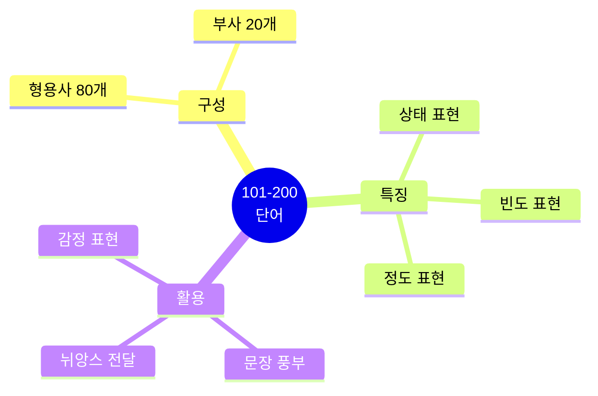
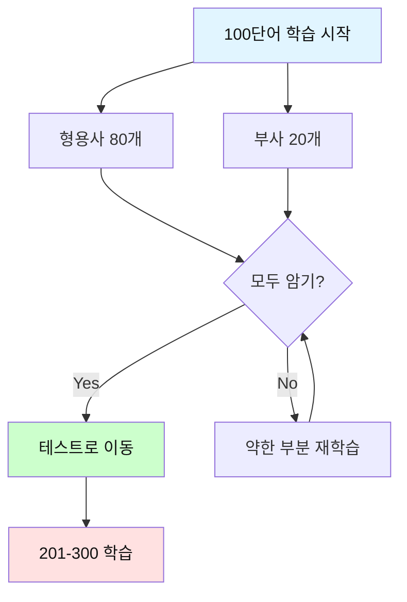

# 전설의 500단어 (101-200) - 형용사 & 부사 마스터

## 🎯 이 파일의 목적

**101-200번 단어**는 주로 **형용사와 부사**로 구성됩니다.
실전에서 가장 많이 사용되는 표현들을 청크 패턴으로 익힙니다.



---

## 🔥 형용사 (Adjectives) 101-180

### 101. **real** [리얼] - 진짜의, 실제의

**청크 패턴 3개**:
```
1. This is / a real problem.
   이것은 / 진짜 문제야

2. We need / real solutions.
   우리는 필요해 / 실제 해결책이

3. Is this / for real?
   이것은 / 진짜야?
```

---

### 102. **big** [빅] - 큰

**청크 패턴 3개**:
```
1. This is / a big opportunity.
   이것은 / 큰 기회야

2. We have / a big meeting / tomorrow.
   우리는 있어 / 큰 회의가 / 내일

3. That's / a big deal.
   그것은 / 큰 일이야
```

---

### 103. **right** [라이트] - 올바른, 오른쪽의

**청크 패턴 3개**:
```
1. That's / the right answer.
   그것이 / 올바른 답이야

2. Am I doing / this / right?
   내가 하고 있나 / 이것을 / 올바르게?

3. Turn right / at the corner.
   돌아 오른쪽으로 / 모퉁이에서
```

---

### 104. **best** [베스트] - 최고의

**청크 패턴 3개**:
```
1. This is / the best solution.
   이것이 / 최고의 해결책이야

2. I did / my best.
   나는 했어 / 최선을

3. What's / the best way / to do this?
   무엇이 / 최고의 방법이니 / 이것을 하는?
```

---

### 105. **better** [베터] - 더 나은

**청크 패턴 3개**:
```
1. This option / is / better / than that one.
   이 옵션이 / ~이다 / 더 나은 / 저것보다

2. We need / to do / better / next time.
   우리는 필요해 / 할 / 더 잘 / 다음번에

3. I'm feeling / better / today.
   나는 느끼고 있어 / 더 나은 / 오늘
```

---

### 106. **sure** [슈어] - 확실한

**청크 패턴 3개**:
```
1. Are you sure / about this?
   너 확신하니 / 이것에 대해?

2. I'm not sure / what to do.
   나는 확실하지 않아 / 무엇을 해야 할지

3. Make sure / to check / the details.
   확실히 해 / 확인하기를 / 세부사항을
```

---

### 107. **free** [프리] - 자유로운, 무료의

**청크 패턴 3개**:
```
1. Are you free / tomorrow?
   너 시간 있니 / 내일?

2. This service / is / completely free.
   이 서비스는 / ~이다 / 완전히 무료

3. Feel free / to ask / questions.
   자유롭게 해 / 물어보기를 / 질문들을
```

---

### 108. **main** [메인] - 주요한

**청크 패턴 3개**:
```
1. What's / the main issue / here?
   무엇이 / 주요 이슈니 / 여기서?

2. This is / our main goal.
   이것이 / 우리 주요 목표야

3. The main reason / is / cost.
   주요 이유는 / ~이다 / 비용
```

---

### 109. **whole** [홀] - 전체의

**청크 패턴 3개**:
```
1. The whole team / is working / on this.
   전체 팀이 / 작업하고 있어 / 이것에

2. I spent / the whole day / on this task.
   나는 보냈어 / 하루 전체를 / 이 작업에

3. This affects / the whole company.
   이것은 영향을 미쳐 / 전체 회사에
```

---

### 110. **full** [풀] - 가득 찬, 전체의

**청크 패턴 3개**:
```
1. I'm full / of ideas.
   나는 가득해 / 아이디어로

2. The schedule / is / full / today.
   일정이 / ~이다 / 가득 찬 / 오늘

3. Can I have / your full name?
   받을 수 있나 / 네 전체 이름을?
```

---

### 111. **young** [영] - 젊은

**청크 패턴 3개**:
```
1. She's / very young / for a CEO.
   그녀는 / 매우 젊어 / CEO치고는

2. We need / young talent.
   우리는 필요해 / 젊은 인재가

3. When I was young, / I worked / in sales.
   내가 젊었을 때, / 나는 일했어 / 영업에서
```

---

### 112. **old** [올드] - 오래된, 나이 든

**청크 패턴 3개**:
```
1. This is / an old system.
   이것은 / 오래된 시스템이야

2. How old / is / this building?
   얼마나 오래됐니 / ~인가 / 이 빌딩?

3. The old way / doesn't work / anymore.
   옛날 방식은 / 작동하지 않아 / 더 이상
```

---

### 113. **few** [퓨] - 적은, 몇 개의

**청크 패턴 3개**:
```
1. I have / a few questions.
   나는 있어 / 몇 가지 질문이

2. Only a few people / know / about this.
   오직 소수의 사람들만 / 알아 / 이것에 대해

3. In a few days, / we'll launch / the product.
   며칠 안에, / 우리는 출시할 거야 / 제품을
```

---

### 114. **public** [퍼블릭] - 공개적인, 공공의

**청크 패턴 3개**:
```
1. This is / public information.
   이것은 / 공개 정보야

2. We'll make / a public announcement / soon.
   우리는 할 거야 / 공개 발표를 / 곧

3. Public opinion / is / important.
   대중 의견은 / ~이다 / 중요한
```

---

### 115. **bad** [배드] - 나쁜

**청크 패턴 3개**:
```
1. That's not / a bad idea.
   그것은 아니야 / 나쁜 아이디어

2. I have / bad news.
   나는 있어 / 나쁜 소식이

3. This is / a bad time / to call.
   이것은 / 나쁜 시간이야 / 전화하기에
```

---

### 116. **same** [세임] - 같은

**청크 패턴 3개**:
```
1. We have / the same problem.
   우리는 있어 / 같은 문제가

2. At the same time, / we should / consider / other options.
   동시에, / 우리는 해야 해 / 고려할 / 다른 옵션들을

3. It's / the same / as before.
   그것은 / 같아 / 전과
```

---

### 117. **able** [에이블] - 할 수 있는

**청크 패턴 3개**:
```
1. Are you able / to attend / the meeting?
   너 할 수 있니 / 참석할 / 회의에?

2. We're able / to provide / support.
   우리는 할 수 있어 / 제공할 / 지원을

3. I wasn't able / to finish / on time.
   나는 할 수 없었어 / 끝낼 / 제시간에
```

---

### 118. **white** [화이트] - 하얀

**청크 패턴 3개**:
```
1. I prefer / the white background.
   나는 선호해 / 하얀 배경을

2. Please write / in / white paper.
   적어주세요 / ~에 / 백서

3. The white version / looks / better.
   하얀 버전이 / 보여 / 더 나은
```

---

### 119. **least** [리스트] - 최소의

**청크 패턴 3개**:
```
1. At least, / we tried.
   적어도, / 우리는 시도했어

2. This is / the least / we can do.
   이것이 / 최소야 / 우리가 할 수 있는

3. We need / at least / 3 people / for this.
   우리는 필요해 / 적어도 / 3명이 / 이것을 위해
```

---

### 120. **local** [로컬] - 지역의

**청크 패턴 3개**:
```
1. We support / local businesses.
   우리는 지원해 / 지역 사업들을

2. This is / a local issue.
   이것은 / 지역 문제야

3. Contact / your local office.
   연락해 / 너의 지역 사무실에
```

---

### 121. **national** [내셔널] - 국가의

**청크 패턴 3개**:
```
1. This is / a national priority.
   이것은 / 국가 우선순위야

2. We operate / at / the national level.
   우리는 운영해 / ~에서 / 국가 수준

3. National standards / must be / followed.
   국가 기준은 / 반드시 ~이어야 해 / 따라야
```

---

### 122. **social** [소셜] - 사회의

**청크 패턴 3개**:
```
1. Follow us / on social media.
   팔로우해 / 소셜 미디어에서

2. Social skills / are / important / in business.
   사회적 기술은 / ~이다 / 중요한 / 비즈니스에서

3. This has / social implications.
   이것은 있어 / 사회적 영향이
```

---

### 123. **hard** [하드] - 어려운, 열심히

**청크 패턴 3개**:
```
1. This is / a hard decision.
   이것은 / 어려운 결정이야

2. I'm working / hard / on this.
   나는 일하고 있어 / 열심히 / 이것에

3. It's not that / hard.
   그것은 그렇게 / 어렵지 않아
```

---

### 124. **easy** [이지] - 쉬운

**청크 패턴 3개**:
```
1. This task / is / easy / to complete.
   이 작업은 / ~이다 / 쉬운 / 완료하기

2. It's not / as easy / as it looks.
   그것은 아니야 / 그만큼 쉬운 / 보이는 것만큼

3. Take it easy.
   편하게 해 (진정해)
```

---

### 125. **strong** [스트롱] - 강한

**청크 패턴 3개**:
```
1. We need / a strong leader.
   우리는 필요해 / 강한 리더가

2. This is / a strong argument.
   이것은 / 강한 주장이야

3. The team / has / a strong foundation.
   팀은 / 가지고 있어 / 강한 기반을
```

---

### 126. **simple** [심플] - 간단한

**청크 패턴 3개**:
```
1. Keep it / simple.
   유지해 / 간단하게

2. It's / a simple solution.
   그것은 / 간단한 해결책이야

3. The process / is quite simple.
   과정은 / 꽤 간단해
```

---

### 127. **quick** [퀵] - 빠른

**청크 패턴 3개**:
```
1. I have / a quick question.
   나는 있어 / 빠른 질문이 (간단한 질문)

2. We need / a quick solution.
   우리는 필요해 / 빠른 해결책이

3. This is / a quick process.
   이것은 / 빠른 과정이야
```

---

### 128. **slow** [슬로우] - 느린

**청크 패턴 3개**:
```
1. The system / is / too slow.
   시스템이 / ~이다 / 너무 느린

2. Progress / has been / slow.
   진행이 / ~이었어 / 느린

3. Let's take it / slow.
   가져가자 / 천천히
```

---

### 129. **late** [레이트] - 늦은

**청크 패턴 3개**:
```
1. Sorry, / I'm late.
   미안해, / 나 늦었어

2. It's too late / to change / the plan.
   너무 늦었어 / 바꾸기엔 / 계획을

3. Better late / than never.
   늦은 게 / 안 하는 것보다 나아
```

---

### 130. **close** [클로즈] - 가까운

**청크 패턴 3개**:
```
1. We're getting / close / to the deadline.
   우리는 되고 있어 / 가까워지고 / 마감일에

2. This is / a close call.
   이것은 / 아슬아슬한 상황이야

3. We work / in close collaboration.
   우리는 일해 / 긴밀한 협력으로
```

---

### 131. **open** [오픈] - 열린, 개방적인

**청크 패턴 3개**:
```
1. I'm open / to suggestions.
   나는 열려 있어 / 제안에

2. We have / an open position.
   우리는 있어 / 빈자리가

3. Keep / an open mind.
   유지해 / 열린 마음을
```

---

### 132. **deep** [딥] - 깊은

**청크 패턴 3개**:
```
1. This requires / deep knowledge.
   이것은 필요로 해 / 깊은 지식을

2. We need / a deep understanding / of the issue.
   우리는 필요해 / 깊은 이해가 / 그 문제에 대한

3. It's / a deep topic.
   그것은 / 깊은 주제야
```

---

### 133. **wide** [와이드] - 넓은

**청크 패턴 3개**:
```
1. We offer / a wide range / of services.
   우리는 제공해 / 넓은 범위를 / 서비스의

2. This has / wide implications.
   이것은 있어 / 광범위한 영향이

3. The gap / is / too wide.
   격차가 / ~이다 / 너무 넓은
```

---

### 134. **low** [로우] - 낮은

**청크 패턴 3개**:
```
1. The price / is / very low.
   가격이 / ~이다 / 매우 낮은

2. We have / low expectations.
   우리는 있어 / 낮은 기대가

3. Keep / a low profile.
   유지해 / 낮은 프로필을 (조용히 해)
```

---

### 135. **hot** [핫] - 뜨거운

**청크 패턴 3개**:
```
1. This is / a hot topic / right now.
   이것은 / 뜨거운 주제야 / 지금

2. The coffee / is / too hot.
   커피가 / ~이다 / 너무 뜨거운

3. We're in / hot water.
   우리는 있어 / 곤란한 상황에
```

---

### 136. **cold** [콜드] - 추운, 차가운

**청크 패턴 3개**:
```
1. The response / was / cold.
   반응이 / ~이었어 / 차가운

2. It's / cold / outside.
   ~이다 / 추운 / 밖에

3. Let's call / cold customers.
   전화하자 / 잠재 고객에게
```

---

### 137. **fine** [파인] - 좋은, 괜찮은

**청크 패턴 3개**:
```
1. Everything / is / fine.
   모든 것이 / ~이다 / 괜찮은

2. That's fine / with me.
   그것은 괜찮아 / 나에게

3. The details / look / fine.
   세부사항이 / 보여 / 좋은
```

---

### 138. **particular** [파티큘러] - 특정한

**청크 패턴 3개**:
```
1. Do you have / any particular / preference?
   너 있니 / 어떤 특정한 / 선호?

2. In this particular case, / we should / wait.
   이 특정한 경우에, / 우리는 해야 해 / 기다리기를

3. Nothing / in particular.
   아무것도 / 특별한 것
```

---

### 139. **central** [센트럴] - 중심의

**청크 패턴 3개**:
```
1. This is / central / to our strategy.
   이것은 / 중심이야 / 우리 전략의

2. The central office / handles / this.
   중앙 사무실이 / 처리해 / 이것을

3. Location / is central / to success.
   위치는 / 중심이야 / 성공의
```

---

### 140. **single** [싱글] - 단일의, 하나의

**청크 패턴 3개**:
```
1. Not a single person / showed up.
   한 명도 / 나타나지 않았어

2. This is / a single issue.
   이것은 / 단일 이슈야

3. Every single day, / I work / on this.
   매일, / 나는 일해 / 이것에
```

---

### 141. **private** [프라이빗] - 사적인

**청크 패턴 3개**:
```
1. This is / private information.
   이것은 / 개인 정보야

2. Can we talk / in private?
   우리 얘기할 수 있나 / 사적으로?

3. It's / a private matter.
   그것은 / 사적인 문제야
```

---

### 142. **general** [제너럴] - 일반적인

**청크 패턴 3개**:
```
1. In general, / this works / well.
   일반적으로, / 이것은 작동해 / 잘

2. This is / the general idea.
   이것이 / 일반적인 아이디어야

3. The general consensus / is / positive.
   일반적인 합의는 / ~이다 / 긍정적인
```

---

### 143. **common** [카먼] - 흔한, 공통의

**청크 패턴 3개**:
```
1. This is / a common mistake.
   이것은 / 흔한 실수야

2. We have / common goals.
   우리는 있어 / 공통 목표가

3. It's more common / than you think.
   그것은 더 흔해 / 네가 생각하는 것보다
```

---

### 144. **special** [스페셜] - 특별한

**청크 패턴 3개**:
```
1. This is / a special occasion.
   이것은 / 특별한 경우야

2. We have / a special offer / today.
   우리는 있어 / 특별 제안이 / 오늘

3. You're / special / to us.
   너는 / 특별해 / 우리에게
```

---

### 145. **similar** [시밀러] - 비슷한

**청크 패턴 3개**:
```
1. This is / similar / to our approach.
   이것은 / 비슷해 / 우리 접근과

2. We faced / similar challenges / before.
   우리는 직면했어 / 비슷한 도전에 / 전에

3. The results / are / similar.
   결과가 / ~이다 / 비슷한
```

---

### 146. **total** [토탈] - 전체의

**청크 패턴 3개**:
```
1. What's / the total cost?
   무엇이 / 전체 비용이니?

2. In total, / we have / 50 employees.
   전체적으로, / 우리는 있어 / 50명의 직원이

3. This is / a total success.
   이것은 / 완전한 성공이야
```

---

### 147. **final** [파이널] - 최종의

**청크 패턴 3개**:
```
1. This is / the final decision.
   이것이 / 최종 결정이야

2. We're in / the final stage.
   우리는 있어 / 최종 단계에

3. What's / your final answer?
   무엇이 / 네 최종 답이니?
```

---

### 148. **recent** [리슨트] - 최근의

**청크 패턴 3개**:
```
1. In recent years, / things have changed.
   최근 몇 년간, / 상황이 변했어

2. The recent update / fixed / the issue.
   최근 업데이트가 / 고쳤어 / 그 문제를

3. This is / based on / recent data.
   이것은 / 기반해 / 최근 데이터에
```

---

### 149. **current** [커런트] - 현재의

**청크 패턴 3개**:
```
1. What's / the current status?
   무엇이 / 현재 상태니?

2. Under / current circumstances, / we should wait.
   ~에서 / 현재 상황 / 우리는 기다려야 해

3. The current system / needs / improvement.
   현재 시스템은 / 필요로 해 / 개선을
```

---

### 150. **future** [퓨처] - 미래의

**청크 패턴 3개**:
```
1. We're planning / for / the future.
   우리는 계획하고 있어 / ~을 위해 / 미래를

2. Future developments / will / change / everything.
   미래 발전은 / ~할 거야 / 바꿀 / 모든 것을

3. What are / your future plans?
   무엇이니 / 네 미래 계획은?
```

---

### 151. **past** [패스트] - 과거의

**청크 패턴 3개**:
```
1. In the past, / we did / things / differently.
   과거에는, / 우리는 했어 / 일을 / 다르게

2. Let's learn / from / past mistakes.
   배우자 / ~로부터 / 과거 실수

3. This is / all / in the past / now.
   이것은 / 모두 / 과거에 / 이제
```

---

### 152. **certain** [서튼] - 확실한

**청크 패턴 3개**:
```
1. I'm certain / about this.
   나는 확신해 / 이것에 대해

2. Under certain conditions, / this works.
   특정 조건 하에서, / 이것은 작동해

3. Are you certain / that / this is correct?
   너 확신하니 / ~라는 것을 / 이것이 맞다?
```

---

### 153. **serious** [시리어스] - 심각한

**청크 패턴 3개**:
```
1. This is / a serious problem.
   이것은 / 심각한 문제야

2. We need / to be / serious / about this.
   우리는 필요해 / ~할 / 진지한 / 이것에 대해

3. Are you serious / about / quitting?
   너 진심이야 / ~에 대해 / 그만두는 것?
```

---

### 154. **personal** [퍼스널] - 개인적인

**청크 패턴 3개**:
```
1. This is / a personal matter.
   이것은 / 개인적인 문제야

2. May I ask / a personal question?
   물어봐도 될까 / 개인적인 질문을?

3. Personal development / is / important.
   개인 개발은 / ~이다 / 중요한
```

---

### 155. **natural** [내추럴] - 자연스러운

**청크 패턴 3개**:
```
1. It's / natural / to feel / nervous.
   ~이다 / 자연스러운 / 느끼는 것이 / 긴장을

2. This is / a natural process.
   이것은 / 자연스러운 과정이야

3. He has / natural talent.
   그는 있어 / 타고난 재능이
```

---

### 156. **perfect** [퍼펙트] - 완벽한

**청크 패턴 3개**:
```
1. Nobody / is / perfect.
   아무도 / ~이다 / 완벽한

2. This is / the perfect time / to start.
   이것은 / 완벽한 시간이야 / 시작하기에

3. Practice / makes / perfect.
   연습이 / 만들어 / 완벽을
```

---

### 157. **direct** [다이렉트] - 직접적인

**청크 패턴 3개**:
```
1. I'll be / direct / with you.
   나는 할게 / 직접적인 / 너에게

2. We need / a direct approach.
   우리는 필요해 / 직접적인 접근이

3. This has / a direct impact / on sales.
   이것은 있어 / 직접적인 영향이 / 판매에
```

---

### 158. **basic** [베이직] - 기본적인

**청크 패턴 3개**:
```
1. These are / the basic requirements.
   이것들이 / 기본 요구사항이야

2. Let's start / with / the basics.
   시작하자 / ~와 함께 / 기본

3. Basic knowledge / is / essential.
   기본 지식은 / ~이다 / 필수적인
```

---

### 159. **positive** [파지티브] - 긍정적인

**청크 패턴 3개**:
```
1. Let's stay / positive / about this.
   유지하자 / 긍정적으로 / 이것에 대해

2. The feedback / was / positive.
   피드백이 / ~이었어 / 긍정적인

3. We need / a positive attitude.
   우리는 필요해 / 긍정적인 태도가
```

---

### 160. **negative** [네거티브] - 부정적인

**청크 패턴 3개**:
```
1. Don't be / negative.
   되지 마 / 부정적으로

2. The test results / were / negative.
   테스트 결과가 / ~이었어 / 음성인

3. Negative feedback / helps us / improve.
   부정적 피드백이 / 돕는다 우리를 / 개선하도록
```

---

### 161. **international** [인터내셔널] - 국제적인

**청크 패턴 3개**:
```
1. We operate / on / an international level.
   우리는 운영해 / ~에서 / 국제 수준

2. This is / an international standard.
   이것은 / 국제 표준이야

3. International trade / is growing.
   국제 무역이 / 성장하고 있어
```

---

### 162. **global** [글로벌] - 세계적인

**청크 패턴 3개**:
```
1. This is / a global issue.
   이것은 / 세계적인 이슈야

2. We have / a global presence.
   우리는 있어 / 세계적인 입지가

3. Global markets / are changing.
   세계 시장이 / 변하고 있어
```

---

### 163. **digital** [디지털] - 디지털의

**청크 패턴 3개**:
```
1. We're going / digital.
   우리는 가고 있어 / 디지털로

2. Digital transformation / is / essential / today.
   디지털 전환은 / ~이다 / 필수적인 / 오늘날

3. This is / a digital solution.
   이것은 / 디지털 솔루션이야
```

---

### 164. **physical** [피지컬] - 물리적인

**청크 패턴 3개**:
```
1. We need / physical copies.
   우리는 필요해 / 물리적 사본이

2. Physical health / is / important.
   신체 건강은 / ~이다 / 중요한

3. This requires / physical presence.
   이것은 필요로 해 / 물리적 출석을
```

---

### 165. **financial** [파이낸셜] - 재정적인

**청크 패턴 3개**:
```
1. We have / financial constraints.
   우리는 있어 / 재정적 제약이

2. The financial report / looks / good.
   재무 보고서가 / 보여 / 좋은

3. Financial stability / is / crucial.
   재정 안정성은 / ~이다 / 중요한
```

---

### 166. **medical** [메디컬] - 의학적인

**청크 패턴 3개**:
```
1. I need / medical attention.
   나는 필요해 / 의학적 치료가

2. This is / a medical emergency.
   이것은 / 의학적 응급상황이야

3. Medical records / are / confidential.
   의료 기록은 / ~이다 / 기밀인
```

---

### 167. **legal** [리걸] - 법적인

**청크 패턴 3개**:
```
1. We need / legal advice.
   우리는 필요해 / 법적 조언이

2. This is / legal / and compliant.
   이것은 / 법적이야 / 그리고 규정을 준수하는

3. The legal team / will review / this.
   법무팀이 / 검토할 거야 / 이것을
```

---

### 168. **political** [폴리티컬] - 정치적인

**청크 패턴 3개**:
```
1. This is / a political decision.
   이것은 / 정치적 결정이야

2. We avoid / political topics / at work.
   우리는 피해 / 정치적 주제를 / 직장에서

3. Political factors / affect / the market.
   정치적 요인이 / 영향을 미쳐 / 시장에
```

---

### 169. **technical** [테크니컬] - 기술적인

**청크 패턴 3개**:
```
1. This is / a technical issue.
   이것은 / 기술적 문제야

2. We need / technical support.
   우리는 필요해 / 기술 지원이

3. Technical skills / are / required.
   기술 능력이 / ~이다 / 필요한
```

---

### 170. **practical** [프랙티컬] - 실용적인

**청크 패턴 3개**:
```
1. Let's be / practical / about this.
   되자 / 실용적으로 / 이것에 대해

2. This is / a practical solution.
   이것은 / 실용적인 해결책이야

3. Practical experience / is / valuable.
   실무 경험은 / ~이다 / 가치 있는
```

---

### 171. **critical** [크리티컬] - 중요한, 비판적인

**청크 패턴 3개**:
```
1. This is / critical / to our success.
   이것은 / 중요해 / 우리 성공에

2. We're at / a critical point.
   우리는 있어 / 중요한 시점에

3. Critical thinking / is / essential.
   비판적 사고는 / ~이다 / 필수적인
```

---

### 172. **effective** [이펙티브] - 효과적인

**청크 패턴 3개**:
```
1. This is / an effective method.
   이것은 / 효과적인 방법이야

2. We need / more effective / communication.
   우리는 필요해 / 더 효과적인 / 의사소통이

3. The solution / was / very effective.
   해결책이 / ~이었어 / 매우 효과적인
```

---

### 173. **efficient** [이피션트] - 효율적인

**청크 패턴 3개**:
```
1. We need / a more efficient / process.
   우리는 필요해 / 더 효율적인 / 과정이

2. This system / is / very efficient.
   이 시스템은 / ~이다 / 매우 효율적인

3. Efficient use / of time / is / important.
   효율적인 사용이 / 시간의 / ~이다 / 중요한
```

---

### 174. **active** [액티브] - 활동적인

**청크 패턴 3개**:
```
1. Stay / active / in the community.
   유지해 / 활동적으로 / 커뮤니티에서

2. We need / active participation.
   우리는 필요해 / 적극적인 참여가

3. The project / is / still active.
   프로젝트가 / ~이다 / 여전히 활성화된
```

---

### 175. **responsible** [리스판서블] - 책임 있는

**청크 패턴 3개**:
```
1. Who's responsible / for this?
   누가 책임지나 / 이것에 대해?

2. Be responsible / for / your actions.
   책임져 / ~에 대해 / 네 행동

3. This is / a responsible decision.
   이것은 / 책임 있는 결정이야
```

---

### 176. **successful** [석세스풀] - 성공적인

**청크 패턴 3개**:
```
1. The project / was / very successful.
   프로젝트가 / ~이었어 / 매우 성공적인

2. We're / a successful company.
   우리는 / 성공적인 회사야

3. Success comes / from / hard work.
   성공은 온다 / ~로부터 / 열심히 일하는 것
```

---

### 177. **powerful** [파워풀] - 강력한

**청크 패턴 3개**:
```
1. This is / a powerful tool.
   이것은 / 강력한 도구야

2. We have / a powerful team.
   우리는 있어 / 강력한 팀이

3. That was / a powerful presentation.
   그것은 / 강력한 발표였어
```

---

### 178. **useful** [유스풀] - 유용한

**청크 패턴 3개**:
```
1. This is / very useful / information.
   이것은 / 매우 유용한 / 정보야

2. Your feedback / was / useful.
   네 피드백은 / ~이었어 / 유용한

3. It would be useful / to have / more data.
   유용할 거야 / 가지는 것이 / 더 많은 데이터를
```

---

### 179. **careful** [케어풀] - 조심스러운

**청크 패턴 3개**:
```
1. Be careful / with / this equipment.
   조심해 / ~와 함께 / 이 장비

2. We need / to be / more careful.
   우리는 필요해 / ~할 / 더 조심스러운

3. After careful consideration, / we decided / to proceed.
   신중한 고려 후에, / 우리는 결정했어 / 진행하기로
```

---

### 180. **comfortable** [컴포터블] - 편안한

**청크 패턴 3개**:
```
1. Are you comfortable / with this plan?
   너 편안하니 / 이 계획과 함께?

2. The office / is / comfortable.
   사무실이 / ~이다 / 편안한

3. I'm not comfortable / sharing / that information.
   나는 편안하지 않아 / 공유하는 것이 / 그 정보를
```

---

## 🔥 부사 (Adverbs) 181-200

### 181. **also** [올소] - 또한

**청크 패턴 3개**:
```
1. I also think / this is / a good idea.
   나도 생각해 / 이것이 / 좋은 아이디어라고

2. We're also working / on / another project.
   우리는 또한 작업하고 있어 / ~에 / 다른 프로젝트

3. This also applies / to / previous cases.
   이것은 또한 적용돼 / ~에 / 이전 사례들
```

---

### 182. **very** [베리] - 매우

**청크 패턴 3개**:
```
1. This is / very important.
   이것은 / 매우 중요해

2. I'm very pleased / with / the results.
   나는 매우 기뻐 / ~에 대해 / 결과

3. Thank you / very much.
   감사해 / 매우 많이
```

---

### 183. **well** [웰] - 잘

**청크 패턴 3개**:
```
1. This works / well / for us.
   이것은 작동해 / 잘 / 우리에게

2. Well, / let me think / about it.
   글쎄, / 내가 생각해볼게 / 그것에 대해

3. You did / very well.
   너는 했어 / 매우 잘
```

---

### 184. **still** [스틸] - 여전히, 아직

**청크 패턴 3개**:
```
1. I'm still working / on it.
   나는 여전히 작업하고 있어 / 그것에

2. We still have / time / to fix this.
   우리는 아직 있어 / 시간이 / 이것을 고칠

3. Are you still / interested / in this?
   너 여전히 / 관심 있니 / 이것에?
```

---

### 185. **just** [저스트] - 단지, 방금

**청크 패턴 3개**:
```
1. I just need / one more day.
   나는 단지 필요해 / 하루 더

2. We just finished / the meeting.
   우리는 방금 끝냈어 / 회의를

3. It's just / a suggestion.
   그것은 단지 / 제안이야
```

---

### 186. **only** [온리] - 단지, 오직

**청크 패턴 3개**:
```
1. This is / the only way.
   이것이 / 유일한 방법이야

2. We have / only 2 days / left.
   우리는 있어 / 오직 2일만 / 남은

3. I'm only trying / to help.
   나는 단지 시도하고 있어 / 돕기를
```

---

### 187. **now** [나우] - 지금

**청크 패턴 3개**:
```
1. We need / to act / now.
   우리는 필요해 / 행동할 / 지금

2. Right now, / I'm busy.
   지금 당장, / 나는 바빠

3. From now on, / we'll do / things / differently.
   지금부터, / 우리는 할 거야 / 일을 / 다르게
```

---

### 188. **then** [덴] - 그때, 그러면

**청크 패턴 3개**:
```
1. First / finish this, / then / move to / the next task.
   먼저 / 끝내 이것을, / 그런 다음 / 이동해 / 다음 작업으로

2. Back then, / things were / different.
   그때는, / 상황이 / 달랐어

3. If you agree, / then / we can proceed.
   만약 네가 동의하면, / 그러면 / 우리는 진행할 수 있어
```

---

### 189. **here** [히어] - 여기

**청크 패턴 3개**:
```
1. Come here / please.
   이리 와 / 제발

2. Here's / the report / you requested.
   여기 있어 / 보고서가 / 네가 요청한

3. We're here / to help.
   우리는 여기 있어 / 돕기 위해
```

---

### 190. **there** [데어] - 거기

**청크 패턴 3개**:
```
1. There's / a problem / with the system.
   있어 / 문제가 / 시스템에

2. We'll get there / eventually.
   우리는 도착할 거야 거기에 / 결국

3. There you go.
   자 여기 있어
```

---

### 191. **always** [올웨이즈] - 항상

**청크 패턴 3개**:
```
1. I always check / my email / in the morning.
   나는 항상 확인해 / 내 이메일을 / 아침에

2. We've always / done it / this way.
   우리는 항상 / 해왔어 / 이런 방식으로

3. Quality / is always / our priority.
   품질은 / 항상 / 우리 우선순위야
```

---

### 192. **never** [네버] - 결코 ~않다

**청크 패턴 3개**:
```
1. I never / said that.
   나는 결코 / 말하지 않았어 그것을

2. Never give up.
   절대 포기하지 마

3. This has never / happened / before.
   이것은 결코 / 일어나지 않았어 / 전에
```

---

### 193. **often** [오픈] - 자주

**청크 패턴 3개**:
```
1. We often / discuss / this issue.
   우리는 자주 / 논의해 / 이 문제를

2. How often / do you / check / the data?
   얼마나 자주 / 너는 / 확인하니 / 데이터를?

3. This happens / quite often.
   이것은 일어나 / 꽤 자주
```

---

### 194. **usually** [유주얼리] - 보통

**청크 패턴 3개**:
```
1. I usually / arrive / at 9 AM.
   나는 보통 / 도착해 / 오전 9시에

2. We usually / have / meetings / on Mondays.
   우리는 보통 / 가져 / 회의를 / 월요일에

3. This usually / takes / about an hour.
   이것은 보통 / 걸려 / 약 한 시간
```

---

### 195. **sometimes** [섬타임즈] - 때때로

**청크 패턴 3개**:
```
1. Sometimes, / I work / from home.
   때때로, / 나는 일해 / 집에서

2. This approach / sometimes / fails.
   이 접근은 / 때때로 / 실패해

3. We all / make mistakes / sometimes.
   우리 모두 / 실수해 / 때때로
```

---

### 196. **really** [리얼리] - 정말로

**청크 패턴 3개**:
```
1. I really appreciate / your help.
   나는 정말로 감사해 / 네 도움을

2. This is / really important.
   이것은 / 정말로 중요해

3. Do you really think / that / will work?
   너 정말로 생각하니 / 그것이 / 작동할 거라고?
```

---

### 197. **actually** [액츄얼리] - 실제로

**청크 패턴 3개**:
```
1. Actually, / I have / a different opinion.
   사실, / 나는 있어 / 다른 의견이

2. This actually / works / better / than expected.
   이것은 실제로 / 작동해 / 더 잘 / 예상보다

3. What actually / happened?
   무엇이 실제로 / 일어났니?
```

---

### 198. **probably** [프라버블리] - 아마도

**청크 패턴 3개**:
```
1. I'll probably / finish / by tomorrow.
   나는 아마도 / 끝낼 거야 / 내일까지

2. This is probably / the best option.
   이것은 아마도 / 최선의 옵션이야

3. You probably / already know / this.
   너는 아마도 / 이미 알 거야 / 이것을
```

---

### 199. **maybe** [메이비] - 어쩌면

**청크 패턴 3개**:
```
1. Maybe / we should / try / a different approach.
   어쩌면 / 우리는 해야 해 / 시도할 / 다른 접근을

2. Maybe / next time.
   어쩌면 / 다음번에

3. I'll think / about it, / maybe.
   나는 생각해볼게 / 그것에 대해, / 어쩌면
```

---

### 200. **together** [투게더] - 함께

**청크 패턴 3개**:
```
1. Let's work / together / on this.
   일하자 / 함께 / 이것에

2. We're / in this / together.
   우리는 / 있어 이것에 / 함께

3. Put / these two parts / together.
   놓아 / 이 두 부분을 / 함께
```

---

## 🎯 101-200 학습 완료 체크



### 진도 체크리스트

- [ ] 형용사 101-110 완료
- [ ] 형용사 111-120 완료
- [ ] 형용사 121-130 완료
- [ ] 형용사 131-140 완료
- [ ] 형용사 141-150 완료
- [ ] 형용사 151-160 완료
- [ ] 형용사 161-170 완료
- [ ] 형용사 171-180 완료
- [ ] 부사 181-190 완료
- [ ] 부사 191-200 완료
- [ ] **전체 복습 완료**

---

## 📝 다음 학습

**다음 파일로 이동하세요:**
- 📘 [전설의_500단어_201-300.md](./전설의_500단어_201-300.md) - 부사/전치사/접속사 학습

**이전 학습 복습:**
- 📕 [전설의_500단어_001-100.md](./전설의_500단어_001-100.md) - 동사/명사 복습

**테스트 보기:**
- 📝 [전설의_500단어_테스트.md](./전설의_500단어_테스트.md) - 한영 분리 테스트

---

💪 **200단어 완료 축하합니다!**
- 형용사 80개 + 부사 20개 = 총 100단어
- 누적: 200단어 완료
- 패턴 600개 학습 완료
- 이제 201-300으로 넘어가세요!

