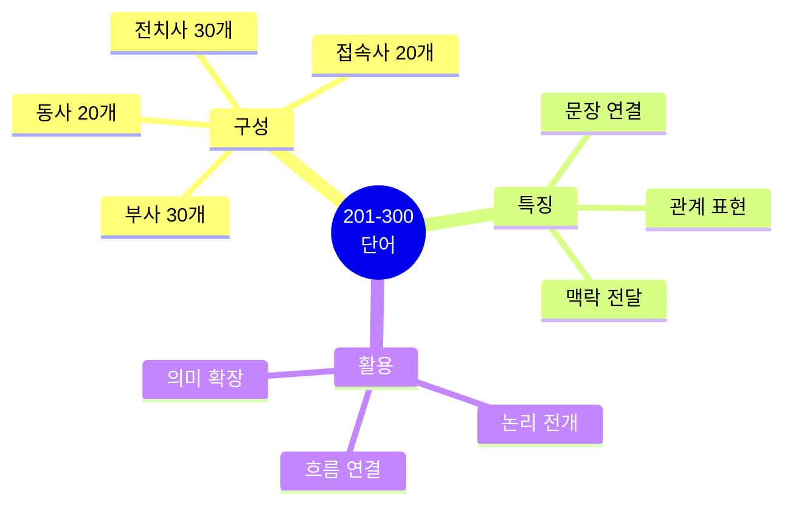
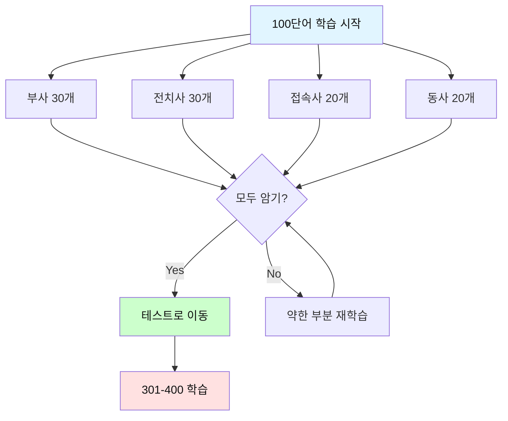

# 전설의 500단어 (201-300) - 부사 & 전치사/접속사 & 동사

## 🎯 이 파일의 목적

**201-300번 단어**는 **부사, 전치사/접속사, 동사**로 구성됩니다.
문장을 연결하고 관계를 표현하는 필수 단어들입니다.



---

## 🔥 부사 (Adverbs) 201-230

### 201. **again** [어겐] - 다시

**청크 패턴 3개**:
```
1. Let's try / again.
   시도하자 / 다시

2. I'll say it / again.
   나는 말할게 / 다시

3. This happened / again / today.
   이것이 일어났어 / 다시 / 오늘
```

---

### 202. **almost** [올모스트] - 거의

**청크 패턴 3개**:
```
1. We're almost / done.
   우리는 거의 / 완료했어

2. Almost everyone / attended / the meeting.
   거의 모든 사람이 / 참석했어 / 회의에

3. It's almost / time / to go.
   거의 / 시간이야 / 갈
```

---

### 203. **already** [올레디] - 이미

**청크 패턴 3개**:
```
1. I already / finished / the report.
   나는 이미 / 끝냈어 / 보고서를

2. We've already / discussed / this.
   우리는 이미 / 논의했어 / 이것을

3. It's already / too late.
   이미 / 너무 늦었어
```

---

### 204. **yet** [옛] - 아직 (부정문), 그러나

**청크 패턴 3개**:
```
1. I haven't finished / yet.
   나는 끝내지 않았어 / 아직

2. Have you decided / yet?
   너 결정했니 / 아직?

3. Simple / yet / effective.
   간단한 / 그러나 / 효과적인
```

---

### 205. **enough** [이너프] - 충분히

**청크 패턴 3개**:
```
1. Is this / good enough?
   이것은 / 충분히 좋아?

2. We don't have / enough time.
   우리는 없어 / 충분한 시간이

3. That's enough / for today.
   충분해 / 오늘은
```

---

### 206. **quite** [콰이트] - 꽤

**청크 패턴 3개**:
```
1. This is / quite difficult.
   이것은 / 꽤 어려워

2. I'm quite sure / about this.
   나는 꽤 확신해 / 이것에 대해

3. Not quite / what I expected.
   꽤 아니야 / 내가 기대한 것과
```

---

### 207. **rather** [래더] - 다소, 오히려

**청크 패턴 3개**:
```
1. This is / rather complicated.
   이것은 / 다소 복잡해

2. I'd rather / wait / until tomorrow.
   나는 오히려 / 기다릴래 / 내일까지

3. Rather than / complaining, / let's / fix it.
   ~하기보다는 / 불평하는 것 / ~하자 / 고치기를
```

---

### 208. **soon** [순] - 곧

**청크 패턴 3개**:
```
1. I'll be there / soon.
   나는 거기 있을게 / 곧

2. We'll launch / this / soon.
   우리는 출시할 거야 / 이것을 / 곧

3. As soon as / possible.
   가능한 한 / 빨리
```

---

### 209. **however** [하우에버] - 그러나

**청크 패턴 3개**:
```
1. However, / we need / to be / careful.
   그러나, / 우리는 필요해 / ~할 / 조심스러운

2. The plan / is good; / however, / it's expensive.
   계획은 / 좋아; / 그러나, / 비싸

3. We can, / however, / try / a different approach.
   우리는 할 수 있어, / 그러나, / 시도할 / 다른 접근을
```

---

### 210. **therefore** [데어포] - 그러므로

**청크 패턴 3개**:
```
1. Therefore, / we should / wait.
   그러므로, / 우리는 해야 해 / 기다리기를

2. The costs / are too high, / therefore / we can't proceed.
   비용이 / 너무 높아, / 그러므로 / 우리는 진행할 수 없어

3. I was sick, / and therefore / couldn't attend.
   나는 아팠어, / 그래서 / 참석할 수 없었어
```

---

### 211. **especially** [이스페셜리] - 특히

**청크 패턴 3개**:
```
1. This is important, / especially / for new members.
   이것은 중요해, / 특히 / 새 멤버들에게

2. I like / all fruits, / especially / apples.
   나는 좋아해 / 모든 과일을, / 특히 / 사과를

3. Be careful, / especially / with / the details.
   조심해, / 특히 / ~와 함께 / 세부사항
```

---

### 212. **exactly** [이그잭틀리] - 정확히

**청크 패턴 3개**:
```
1. That's exactly / what I mean.
   그것이 정확히 / 내가 의미하는 것이야

2. I don't know / exactly / when / it will finish.
   나는 모르겠어 / 정확히 / 언제 / 끝날지

3. Exactly / how much / do we need?
   정확히 / 얼마나 많이 / 우리는 필요해?
```

---

### 213. **mostly** [모스틀리] - 대부분

**청크 패턴 3개**:
```
1. We're mostly / done / with the project.
   우리는 대부분 / 완료했어 / 프로젝트를

2. The feedback / was mostly / positive.
   피드백이 / 대부분 / 긍정적이었어

3. I work / mostly / from home.
   나는 일해 / 대부분 / 집에서
```

---

### 214. **simply** [심플리] - 간단히, 단순히

**청크 패턴 3개**:
```
1. Simply / put, / we need / more time.
   간단히 / 말하면, / 우리는 필요해 / 더 많은 시간이

2. This is / simply / not acceptable.
   이것은 / 단순히 / 받아들일 수 없어

3. You can / simply / ignore / this message.
   너는 할 수 있어 / 단순히 / 무시할 / 이 메시지를
```

---

### 215. **clearly** [클리어리] - 명확히

**청크 패턴 3개**:
```
1. Clearly, / we need / a new approach.
   명백히, / 우리는 필요해 / 새로운 접근이

2. I can / clearly / see / the problem.
   나는 할 수 있어 / 명확히 / 볼 / 문제를

3. State / your opinion / clearly.
   진술해 / 네 의견을 / 명확히
```

---

### 216. **recently** [리슨틀리] - 최근에

**청크 패턴 3개**:
```
1. We recently / launched / a new product.
   우리는 최근에 / 출시했어 / 새 제품을

2. Have you heard / from him / recently?
   너 들었니 / 그로부터 / 최근에?

3. Until recently, / this wasn't / possible.
   최근까지, / 이것은 아니었어 / 가능한
```

---

### 217. **directly** [다이렉틀리] - 직접적으로

**청크 패턴 3개**:
```
1. Please contact / me / directly.
   연락해주세요 / 나에게 / 직접적으로

2. This directly / affects / our revenue.
   이것은 직접적으로 / 영향을 미쳐 / 우리 수익에

3. Go / directly / to the manager.
   가 / 직접 / 매니저에게
```

---

### 218. **immediately** [이미디어틀리] - 즉시

**청크 패턴 3개**:
```
1. We need / to act / immediately.
   우리는 필요해 / 행동할 / 즉시

2. I'll send it / immediately.
   나는 보낼게 / 즉시

3. Respond / immediately / to urgent emails.
   응답해 / 즉시 / 긴급 이메일에
```

---

### 219. **finally** [파이널리] - 마침내

**청크 패턴 3개**:
```
1. We finally / finished / the project.
   우리는 마침내 / 끝냈어 / 프로젝트를

2. Finally, / I'd like to / thank / everyone.
   마지막으로, / 나는 하고 싶어 / 감사할 / 모두에게

3. It's finally / ready.
   마침내 / 준비됐어
```

---

### 220. **completely** [컴플리틀리] - 완전히

**청크 패턴 3개**:
```
1. I completely / agree / with you.
   나는 완전히 / 동의해 / 너와

2. This is / completely / different.
   이것은 / 완전히 / 달라

3. The system / is completely / down.
   시스템이 / 완전히 / 다운됐어
```

---

### 221. **highly** [하이리] - 매우, 고도로

**청크 패턴 3개**:
```
1. This is / highly / recommended.
   이것은 / 매우 / 추천돼

2. I highly / doubt / that.
   나는 매우 / 의심해 / 그것을

3. She's / highly / qualified / for this position.
   그녀는 / 매우 / 자격이 있어 / 이 직위에
```

---

### 222. **particularly** [파티큘러리] - 특히

**청크 패턴 3개**:
```
1. This is / particularly / important / now.
   이것은 / 특히 / 중요해 / 지금

2. I'm not / particularly / interested / in this.
   나는 아니야 / 특별히 / 관심 있는 / 이것에

3. Particularly / in / this case, / we should / wait.
   특히 / ~에서 / 이 경우 / 우리는 해야 해 / 기다리기를
```

---

### 223. **certainly** [서튼리] - 확실히

**청크 패턴 3개**:
```
1. I will certainly / attend / the meeting.
   나는 확실히 / 참석할 거야 / 회의에

2. This certainly / makes sense.
   이것은 확실히 / 말이 돼

3. Certainly, / I can / help / with that.
   물론이죠, / 나는 할 수 있어 / 도울 / 그것과 함께
```

---

### 224. **carefully** [케어풀리] - 조심스럽게

**청크 패턴 3개**:
```
1. Read / this / carefully.
   읽어 / 이것을 / 조심스럽게

2. We carefully / considered / all options.
   우리는 조심스럽게 / 고려했어 / 모든 옵션을

3. Handle / this / carefully.
   다뤄 / 이것을 / 조심스럽게
```

---

### 225. **successfully** [석세스풀리] - 성공적으로

**청크 패턴 3개**:
```
1. We successfully / completed / the project.
   우리는 성공적으로 / 완료했어 / 프로젝트를

2. The test / was / successfully / passed.
   테스트가 / ~이었어 / 성공적으로 / 통과된

3. Can we / successfully / implement / this?
   우리는 할 수 있나 / 성공적으로 / 구현할 / 이것을?
```

---

### 226. **previously** [프리비어슬리] - 이전에

**청크 패턴 3개**:
```
1. As previously / mentioned, / we need / more time.
   이전에 / 언급한 것처럼, / 우리는 필요해 / 더 많은 시간이

2. I previously / worked / at Google.
   나는 이전에 / 일했어 / 구글에서

3. This was / previously / discussed.
   이것은 / 이전에 / 논의됐어
```

---

### 227. **currently** [커런틀리] - 현재

**청크 패턴 3개**:
```
1. We're currently / working / on this issue.
   우리는 현재 / 작업하고 있어 / 이 문제에

2. Currently, / the system / is unavailable.
   현재, / 시스템이 / 이용 불가능해

3. What are you / currently / doing?
   무엇을 너는 / 현재 / 하고 있니?
```

---

### 228. **typically** [티피컬리] - 일반적으로

**청크 패턴 3개**:
```
1. This typically / takes / 2-3 days.
   이것은 일반적으로 / 걸려 / 2-3일

2. We typically / meet / on Mondays.
   우리는 일반적으로 / 만나 / 월요일에

3. Typically, / this / is not / a problem.
   일반적으로, / 이것은 / 아니야 / 문제
```

---

### 229. **eventually** [이벤추얼리] - 결국

**청크 패턴 3개**:
```
1. We'll / eventually / get there.
   우리는 / 결국 / 도착할 거야 거기에

2. Eventually, / things / will improve.
   결국, / 상황이 / 나아질 거야

3. This will / eventually / be / resolved.
   이것은 / 결국 / ~될 거야 / 해결된
```

---

### 230. **unfortunately** [언포춘어틀리] - 불행히도

**청크 패턴 3개**:
```
1. Unfortunately, / we can't / accept / your request.
   불행히도, / 우리는 할 수 없어 / 받아들일 / 네 요청을

2. Unfortunately, / the meeting / was canceled.
   불행히도, / 회의가 / 취소됐어

3. This, / unfortunately, / is not / possible.
   이것은, / 불행히도, / 아니야 / 가능한
```

---

## 🔥 전치사 (Prepositions) 231-260

### 231. **of** [오브] - ~의

**청크 패턴 3개**:
```
1. The end / of the month.
   끝 / 달의

2. One of / the best / solutions.
   하나 / 최고의 / 해결책들 중

3. Because of / this issue, / we need / to wait.
   때문에 / 이 문제 / 우리는 필요해 / 기다릴
```

---

### 232. **in** [인] - ~에, ~안에

**청크 패턴 3개**:
```
1. I'll be / in the office / tomorrow.
   나는 있을게 / 사무실에 / 내일

2. In my opinion, / this / is / the best choice.
   내 의견으로는, / 이것이 / ~이다 / 최선의 선택

3. We'll finish / in 2 weeks.
   우리는 끝낼 거야 / 2주 안에
```

---

### 233. **to** [투] - ~에, ~로

**청크 패턴 3개**:
```
1. I need / to go / to the meeting.
   나는 필요해 / 갈 / 회의에

2. Send / this / to the client.
   보내 / 이것을 / 고객에게

3. From Monday / to Friday.
   월요일부터 / 금요일까지
```

---

### 234. **for** [포] - ~를 위해, ~동안

**청크 패턴 3개**:
```
1. This is / for you.
   이것은 / 너를 위한 거야

2. I've worked here / for 5 years.
   나는 일해왔어 여기서 / 5년간

3. Thanks / for your help.
   감사해 / 네 도움에
```

---

### 235. **on** [온] - ~위에, ~에 대해

**청크 패턴 3개**:
```
1. Put it / on the desk.
   놓아 / 책상 위에

2. The meeting / is / on Monday.
   회의가 / ~이다 / 월요일에

3. I'm working / on this project.
   나는 작업하고 있어 / 이 프로젝트에
```

---

### 236. **at** [앳] - ~에

**청크 패턴 3개**:
```
1. I'll see you / at 3 PM.
   나는 볼게 / 오후 3시에

2. I'm / at the office / now.
   나는 / 사무실에 / 지금

3. Look at / this data.
   봐 / 이 데이터를
```

---

### 237. **from** [프롬] - ~로부터

**청크 패턴 3개**:
```
1. I'm from / Korea.
   나는 출신이야 / 한국

2. This email / is from / the manager.
   이 이메일은 / ~로부터야 / 매니저

3. From my perspective, / this works.
   내 관점에서, / 이것은 작동해
```

---

### 238. **with** [위드] - ~와 함께

**청크 패턴 3개**:
```
1. I agree / with you.
   나는 동의해 / 너와

2. Can you help me / with this?
   너 도와줄 수 있니 / 이것과 함께?

3. I'm working / with the team.
   나는 작업하고 있어 / 팀과 함께
```

---

### 239. **by** [바이] - ~에 의해, ~까지

**청크 패턴 3개**:
```
1. This was written / by the CEO.
   이것은 작성됐어 / CEO에 의해

2. I need this / by Friday.
   나는 필요해 이것을 / 금요일까지

3. We travel / by train.
   우리는 여행해 / 기차로
```

---

### 240. **about** [어바웃] - ~에 대해

**청크 패턴 3개**:
```
1. Let's talk / about this / later.
   얘기하자 / 이것에 대해 / 나중에

2. What's / this / about?
   무엇에 대한 거야 / 이것은?

3. I'm worried / about / the deadline.
   나는 걱정돼 / ~에 대해 / 마감일
```

---

### 241. **as** [애즈] - ~로서, ~처럼

**청크 패턴 3개**:
```
1. I work / as / a developer.
   나는 일해 / ~로서 / 개발자

2. As I said / before, / we need / more time.
   내가 말한 것처럼 / 전에, / 우리는 필요해 / 더 많은 시간이

3. This works / as expected.
   이것은 작동해 / 예상대로
```

---

### 242. **into** [인투] - ~안으로

**청크 패턴 3개**:
```
1. Let's go / into / more detail.
   가자 / ~으로 / 더 자세히

2. Translate / this / into Korean.
   번역해 / 이것을 / 한국어로

3. We're looking / into / the issue.
   우리는 조사하고 있어 / ~을 / 문제를
```

---

### 243. **through** [쓰루] - ~를 통해

**청크 패턴 3개**:
```
1. We went / through / all the options.
   우리는 검토했어 / ~를 / 모든 옵션들

2. You can reach me / through email.
   너는 연락할 수 있어 / 이메일을 통해

3. We're halfway / through / the project.
   우리는 중간에 있어 / ~를 통과한 / 프로젝트
```

---

### 244. **during** [듀링] - ~동안

**청크 패턴 3개**:
```
1. I'll be / out of office / during the meeting.
   나는 있을 거야 / 부재중 / 회의 동안

2. During / this time, / we should / focus.
   ~동안 / 이 시간 / 우리는 해야 해 / 집중할

3. This happened / during / the update.
   이것이 일어났어 / ~동안 / 업데이트
```

---

### 245. **before** [비포] - ~ 전에

**청크 패턴 3개**:
```
1. Finish this / before / Friday.
   끝내 이것을 / ~전에 / 금요일

2. I've seen / this / before.
   나는 봤어 / 이것을 / 전에

3. Before we proceed, / let's / review.
   우리가 진행하기 전에, / ~하자 / 검토하기를
```

---

### 246. **after** [애프터] - ~ 후에

**청크 패턴 3개**:
```
1. Let's talk / after / the meeting.
   얘기하자 / ~후에 / 회의

2. After careful consideration, / we decided.
   신중한 고려 후에, / 우리는 결정했어

3. I'll call you / after lunch.
   나는 전화할게 / 점심 후에
```

---

### 247. **between** [비트윈] - ~사이에

**청크 패턴 3개**:
```
1. Choose / between / these two options.
   선택해 / ~사이에 / 이 두 옵션

2. The meeting / is / between 2 and 3 PM.
   회의가 / ~이다 / 오후 2시와 3시 사이

3. This stays / between us.
   이것은 유지돼 / 우리 사이에
```

---

### 248. **under** [언더] - ~아래에

**청크 패턴 3개**:
```
1. Under / these circumstances, / we should / wait.
   ~아래에 / 이 상황들 / 우리는 해야 해 / 기다리기를

2. This is / under review.
   이것은 / 검토 중이야

3. Under / the new policy, / this / is required.
   ~하에 / 새 정책 / 이것은 / 필요해
```

---

### 249. **over** [오버] - ~위에, ~이상

**청크 패턴 3개**:
```
1. Let's discuss / this / over coffee.
   논의하자 / 이것을 / 커피 마시며

2. Over / the past year, / we've grown.
   ~동안 / 지난 1년 / 우리는 성장했어

3. This costs / over / $1000.
   이것은 든다 / ~이상 / 1000달러
```

---

### 250. **against** [어게인스트] - ~에 반대하여

**청크 패턴 3개**:
```
1. I'm / against / this idea.
   나는 / 반대해 / 이 아이디어에

2. This is / against / the rules.
   이것은 / 반대야 / 규칙에

3. We're competing / against / major companies.
   우리는 경쟁하고 있어 / ~에 대항하여 / 주요 회사들
```

---

### 251. **within** [위딘] - ~이내에

**청크 패턴 3개**:
```
1. We'll respond / within 24 hours.
   우리는 응답할 거야 / 24시간 이내에

2. This is / within / our budget.
   이것은 / ~이내야 / 우리 예산

3. Everything / is / within / normal range.
   모든 것이 / ~이다 / ~이내 / 정상 범위
```

---

### 252. **without** [위다웃] - ~없이

**청크 패턴 3개**:
```
1. We can't proceed / without / approval.
   우리는 진행할 수 없어 / ~없이 / 승인

2. Without / your help, / we couldn't / have done this.
   ~없이 / 네 도움 / 우리는 할 수 없었을 거야 / 이것을 한

3. This works / without / any issues.
   이것은 작동해 / ~없이 / 어떤 문제
```

---

### 253. **among** [어멍] - ~ 사이에 (셋 이상)

**청크 패턴 3개**:
```
1. Among / the options, / this / is best.
   ~ 사이에 / 옵션들 / 이것이 / 최고야

2. This is / common / among developers.
   이것은 / 흔해 / 개발자들 사이에

3. Among other things, / we need / to improve / communication.
   다른 것들 중에서, / 우리는 필요해 / 개선할 / 의사소통을
```

---

### 254. **across** [어크로스] - ~를 가로질러

**청크 패턴 3개**:
```
1. This applies / across / all departments.
   이것은 적용돼 / ~를 가로질러 / 모든 부서

2. We work / across / different time zones.
   우리는 일해 / ~를 가로질러 / 다른 시간대

3. Across / the industry, / this is / standard practice.
   ~를 가로질러 / 업계 / 이것은 / 표준 관행이야
```

---

### 255. **above** [어보브] - ~ 위에

**청크 패턴 3개**:
```
1. See / the chart / above.
   봐 / 차트를 / 위의

2. Above all, / we need / quality.
   무엇보다도, / 우리는 필요해 / 품질이

3. This is / above / my pay grade.
   이것은 / ~위야 / 내 급여 등급
```

---

### 256. **below** [빌로우] - ~ 아래에

**청크 패턴 3개**:
```
1. See / details / below.
   봐 / 세부사항을 / 아래

2. This is / below / expectations.
   이것은 / ~아래야 / 기대

3. Temperatures / dropped / below freezing.
   온도가 / 떨어졌어 / 영하 아래로
```

---

### 257. **around** [어라운드] - ~주위에

**청크 패턴 3개**:
```
1. Let's meet / around 3 PM.
   만나자 / 약 오후 3시에

2. There are / many options / around.
   있어 / 많은 옵션이 / 주위에

3. We work / around / the clock.
   우리는 일해 / ~주위에 / 시계 (24시간)
```

---

### 258. **toward** [토워드] - ~를 향해

**청크 패턴 3개**:
```
1. We're moving / toward / a solution.
   우리는 움직이고 있어 / ~를 향해 / 해결책

2. Her attitude / toward / work / is positive.
   그녀의 태도는 / ~향한 / 일 / 긍정적이야

3. This is / a step / toward / improvement.
   이것은 / 한 단계야 / ~를 향한 / 개선
```

---

### 259. **upon** [어폰] - ~위에 (격식)

**청크 패턴 3개**:
```
1. Upon arrival, / please / check in.
   도착하면, / 제발 / 체크인해

2. This depends / upon / the outcome.
   이것은 의존해 / ~에 / 결과

3. Once upon / a time...
   옛날 옛적에...
```

---

### 260. **beyond** [비욘드] - ~ 너머에

**청크 패턴 3개**:
```
1. This is / beyond / my control.
   이것은 / ~너머야 / 내 통제

2. We need / to look / beyond / the obvious.
   우리는 필요해 / 볼 / ~너머를 / 명백한 것

3. This goes / beyond / expectations.
   이것은 간다 / ~너머를 / 기대
```

---

## 🔥 접속사 (Conjunctions) 261-280

### 261. **and** [앤드] - 그리고

**청크 패턴 3개**:
```
1. I like / coffee / and tea.
   나는 좋아해 / 커피 / 그리고 차를

2. Read / this / and / tell me / your thoughts.
   읽어 / 이것을 / 그리고 / 말해줘 / 네 생각을

3. Fast / and / efficient.
   빠른 / 그리고 / 효율적인
```

---

### 262. **but** [벗] - 그러나

**청크 패턴 3개**:
```
1. I like / the idea, / but / it's too expensive.
   나는 좋아해 / 아이디어를, / 그러나 / 너무 비싸

2. Not today, / but / maybe tomorrow.
   오늘은 아니야, / 하지만 / 어쩌면 내일

3. It's small / but / powerful.
   작아 / 하지만 / 강력해
```

---

### 263. **or** [오어] - 또는

**청크 패턴 3개**:
```
1. Coffee / or tea?
   커피 / 또는 차?

2. We can / meet today / or tomorrow.
   우리는 만날 수 있어 / 오늘 / 또는 내일

3. Do it / now / or / never.
   해 / 지금 / 아니면 / 절대
```

---

### 264. **so** [소] - 그래서

**청크 패턴 3개**:
```
1. I was busy, / so / I couldn't / attend.
   나는 바빴어, / 그래서 / 나는 할 수 없었어 / 참석할

2. So, / what's / the plan?
   그래서, / 무엇이 / 계획이니?

3. It's late, / so / let's / finish / tomorrow.
   늦었어, / 그래서 / ~하자 / 끝내기를 / 내일
```

---

### 265. **if** [이프] - 만약

**청크 패턴 3개**:
```
1. If you need / help, / let me know.
   만약 네가 필요하면 / 도움이, / 내게 알려줘

2. I'll go / if / the weather / is good.
   나는 갈게 / 만약 / 날씨가 / 좋으면

3. If possible, / finish / by Friday.
   만약 가능하면, / 끝내 / 금요일까지
```

---

### 266. **because** [비커즈] - 왜냐하면

**청크 패턴 3개**:
```
1. I'm late / because / there was / traffic.
   나는 늦었어 / 왜냐하면 / 있었기 때문에 / 교통 체증이

2. We chose / this / because / it's / the best.
   우리는 선택했어 / 이것을 / 왜냐하면 / 그것이 / 최고이기 때문에

3. Because of / this, / we need / to change / the plan.
   ~때문에 / 이것 / 우리는 필요해 / 바꿀 / 계획을
```

---

### 267. **when** [웬] - ~할 때

**청크 패턴 3개**:
```
1. Call me / when / you arrive.
   전화해 / ~할 때 / 네가 도착할

2. When / is / the deadline?
   언제 / ~이니 / 마감일?

3. I remember / when / we started / this project.
   나는 기억해 / ~할 때를 / 우리가 시작한 / 이 프로젝트를
```

---

### 268. **while** [와일] - ~하는 동안

**청크 패턴 3개**:
```
1. Can you wait / while / I finish / this?
   너 기다릴 수 있니 / ~하는 동안 / 내가 끝낼 / 이것을?

2. While / this is good, / we can / do better.
   ~하는 동안 / 이것이 좋지만, / 우리는 할 수 있어 / 더 잘

3. I worked / here / for a while.
   나는 일했어 / 여기서 / 잠시 동안
```

---

### 269. **although** [올도우] - 비록 ~이지만

**청크 패턴 3개**:
```
1. Although / it's difficult, / we'll / try.
   비록 / 어렵지만, / 우리는 / 시도할 거야

2. I like / the idea, / although / it needs / work.
   나는 좋아해 / 아이디어를, / 비록 / 필요하지만 / 작업이

3. Although / small, / this company / is successful.
   비록 / 작지만, / 이 회사는 / 성공적이야
```

---

### 270. **since** [신스] - ~이래로, ~때문에

**청크 패턴 3개**:
```
1. I've worked here / since 2020.
   나는 일해왔어 여기서 / 2020년 이래로

2. Since / you're here, / let's / discuss / this.
   ~때문에 / 네가 여기 있으니, / ~하자 / 논의하기를 / 이것을

3. How long / has it been / since / we met?
   얼마나 오래 / 됐니 / ~이래로 / 우리가 만난?
```

---

### 271. **until** [언틸] - ~까지

**청크 패턴 3개**:
```
1. Wait / until / I'm ready.
   기다려 / ~까지 / 내가 준비될

2. This is / on hold / until / further notice.
   이것은 / 보류야 / ~까지 / 추가 통지

3. We won't know / until / tomorrow.
   우리는 모를 거야 / ~까지 / 내일
```

---

### 272. **unless** [언레스] - ~하지 않는 한

**청크 패턴 3개**:
```
1. We can't proceed / unless / you approve.
   우리는 진행할 수 없어 / ~하지 않는 한 / 네가 승인하지

2. Unless / there are / objections, / we'll / continue.
   ~하지 않는 한 / 있지 / 반대가, / 우리는 / 계속할 거야

3. Don't call me / unless / it's urgent.
   전화하지 마 / ~하지 않는 한 / 긴급하지
```

---

### 273. **whether** [웨더] - ~인지 아닌지

**청크 패턴 3개**:
```
1. I don't know / whether / this / will work.
   나는 모르겠어 / ~인지 / 이것이 / 작동할

2. Whether / you like it / or not, / we need / to do this.
   ~이든 / 네가 좋아하든 / 아니든, / 우리는 필요해 / 할 / 이것을

3. Let me know / whether / you can / attend.
   내게 알려줘 / ~인지 / 너가 할 수 있는지 / 참석할
```

---

### 274. **though** [도우] - 비록 ~이지만

**청크 패턴 3개**:
```
1. It's difficult, / though / not impossible.
   어려워, / 하지만 / 불가능하지는 않아

2. Even though / it's expensive, / it's / worth it.
   비록 / 비싸지만, / 그것은 / 가치 있어

3. I'll try, / though / I'm not / sure.
   나는 시도할게, / 비록 / 나는 아니지만 / 확신하는
```

---

### 275. **than** [댄] - ~보다

**청크 패턴 3개**:
```
1. This is / better / than / that.
   이것이 / 더 나아 / ~보다 / 저것

2. More / than 100 people / attended.
   더 / 100명보다 많은 사람들이 / 참석했어

3. Rather than / complain, / let's / fix it.
   ~보다는 / 불평하는 것 / ~하자 / 고치기를
```

---

### 276. **once** [원스] - 일단 ~하면

**청크 패턴 3개**:
```
1. Once / you're done, / let me know.
   일단 / 네가 끝나면, / 내게 알려줘

2. I went / there / once.
   나는 갔어 / 거기에 / 한 번

3. Once again, / thank you / for your help.
   다시 한번, / 감사해 / 네 도움에
```

---

### 277. **whereas** [웨어애즈] - 반면에

**청크 패턴 3개**:
```
1. This is / expensive, / whereas / that / is cheap.
   이것은 / 비싸, / 반면에 / 저것은 / 싸

2. I like / tea, / whereas / he prefers / coffee.
   나는 좋아해 / 차를, / 반면에 / 그는 선호해 / 커피를

3. This works / well, / whereas / the old method / didn't.
   이것은 작동해 / 잘, / 반면에 / 옛 방법은 / 안 했어
```

---

### 278. **meanwhile** [민와일] - 그 사이에

**청크 패턴 3개**:
```
1. Meanwhile, / we should / continue / working.
   그 사이에, / 우리는 해야 해 / 계속할 / 작업하기를

2. You work / on this; / meanwhile, / I'll / check / the data.
   너는 일해 / 이것에; / 그 사이에, / 나는 / 확인할게 / 데이터를

3. Meanwhile, / things / have changed.
   그 사이에, / 상황이 / 변했어
```

---

### 279. **wherever** [웨어에버] - 어디든지

**청크 패턴 3개**:
```
1. You can work / from / wherever / you want.
   너는 일할 수 있어 / ~로부터 / 어디든지 / 네가 원하는

2. Wherever / you go, / stay connected.
   어디든지 / 네가 가든, / 연결돼 있어

3. Put it / wherever / there's / space.
   놓아 / 어디든지 / 있는 곳에 / 공간이
```

---

### 280. **nevertheless** [네버더레스] - 그럼에도 불구하고

**청크 패턴 3개**:
```
1. It's difficult; / nevertheless, / we should / try.
   어려워; / 그럼에도 불구하고, / 우리는 해야 해 / 시도할

2. The cost / is high; / nevertheless, / it's / necessary.
   비용이 / 높아; / 그럼에도 불구하고, / 그것은 / 필요해

3. Nevertheless, / we decided / to proceed.
   그럼에도 불구하고, / 우리는 결정했어 / 진행하기로
```

---

## 🔥 동사 (Verbs) 281-300

### 281. **create** [크리에이트] - 만들다, 창조하다

**청크 패턴 3개**:
```
1. Let's create / a new document.
   만들자 / 새 문서를

2. This creates / many opportunities.
   이것은 만들어 / 많은 기회를

3. We need / to create / a plan.
   우리는 필요해 / 만들 / 계획을
```

---

### 282. **build** [빌드] - 건설하다, 만들다

**청크 패턴 3개**:
```
1. We're building / a new system.
   우리는 만들고 있어 / 새 시스템을

2. Let's build / on / this success.
   만들어가자 / ~위에 / 이 성공

3. Building trust / takes time.
   신뢰를 쌓는 것은 / 시간이 걸려
```

---

### 283. **develop** [디벨럽] - 개발하다

**청크 패턴 3개**:
```
1. We're developing / a new product.
   우리는 개발하고 있어 / 새 제품을

2. He developed / this feature / last year.
   그는 개발했어 / 이 기능을 / 작년에

3. Let's develop / a strategy.
   개발하자 / 전략을
```

---

### 284. **offer** [오퍼] - 제공하다

**청크 패턴 3개**:
```
1. We offer / free shipping.
   우리는 제공해 / 무료 배송을

2. Can I offer / some advice?
   내가 제공할 수 있나 / 조언을?

3. This company / offers / great benefits.
   이 회사는 / 제공해 / 좋은 복지를
```

---

### 285. **consider** [컨시더] - 고려하다

**청크 패턴 3개**:
```
1. Please consider / this option.
   고려해주세요 / 이 옵션을

2. I'm considering / changing / jobs.
   나는 고려하고 있어 / 바꾸는 것을 / 직업을

3. All things / considered, / this / is / the best choice.
   모든 것을 / 고려하면, / 이것이 / ~이다 / 최선의 선택
```

---

### 286. **require** [리콰이어] - 필요로 하다

**청크 패턴 3개**:
```
1. This requires / immediate attention.
   이것은 필요로 해 / 즉각적인 주의를

2. What do you require / for this project?
   무엇을 너는 필요로 하니 / 이 프로젝트에?

3. As required / by law.
   ~대로 / 법에 의해 요구되는
```

---

### 287. **appear** [어피어] - 나타나다

**청크 패턴 3개**:
```
1. A message / appeared / on the screen.
   메시지가 / 나타났어 / 화면에

2. It appears / that / we have / a problem.
   보여 / ~라는 것이 / 우리가 있다 / 문제가

3. He didn't appear / at the meeting.
   그는 나타나지 않았어 / 회의에
```

---

### 288. **produce** [프로듀스] - 생산하다

**청크 패턴 3개**:
```
1. We produce / high-quality / products.
   우리는 생산해 / 고품질의 / 제품들을

2. This process / produces / excellent results.
   이 프로세스는 / 생산해 / 훌륭한 결과를

3. Can you produce / the documents?
   너 제출할 수 있니 / 문서들을?
```

---

### 289. **allow** [얼라우] - 허용하다

**청크 패턴 3개**:
```
1. This allows us / to work / more efficiently.
   이것은 허용해 우리가 / 일할 / 더 효율적으로

2. Please allow / 2-3 business days / for processing.
   허용해주세요 / 2-3 영업일을 / 처리를 위해

3. We don't allow / smoking / in the office.
   우리는 허용하지 않아 / 흡연을 / 사무실에서
```

---

### 290. **suggest** [서제스트] - 제안하다

**청크 패턴 3개**:
```
1. I suggest / we take / a break.
   나는 제안해 / 우리가 가질 것을 / 휴식을

2. What do you suggest?
   무엇을 너는 제안하니?

3. The data / suggests / that / this works.
   데이터는 / 제안해 / ~라는 것을 / 이것이 작동한다
```

---

### 291. **expect** [익스펙트] - 기대하다

**청크 패턴 3개**:
```
1. I expect / this / to be / ready / by Friday.
   나는 기대해 / 이것이 / ~일 것을 / 준비된 / 금요일까지

2. What can we expect / from / this meeting?
   무엇을 우리는 기대할 수 있나 / ~로부터 / 이 회의?

3. As expected, / the results / are / positive.
   예상대로, / 결과가 / ~이다 / 긍정적인
```

---

### 292. **remember** [리멤버] - 기억하다

**청크 패턴 3개**:
```
1. I remember / when / we started / this.
   나는 기억해 / ~할 때를 / 우리가 시작한 / 이것을

2. Remember / to send / the email.
   기억해 / 보낼 것을 / 이메일을

3. Do you remember / me?
   너 기억하니 / 나를?
```

---

### 293. **understand** [언더스탠드] - 이해하다

**청크 패턴 3개**:
```
1. I understand / your concern.
   나는 이해해 / 네 걱정을

2. Do you understand / what I mean?
   너 이해하니 / 내가 의미하는 것을?

3. This is / hard / to understand.
   이것은 / 어려워 / 이해하기
```

---

### 294. **explain** [익스플레인] - 설명하다

**청크 패턴 3개**:
```
1. Can you explain / this / to me?
   너 설명해줄 수 있니 / 이것을 / 나에게?

2. Let me explain / how / this works.
   내가 설명할게 / 어떻게 / 이것이 작동하는지

3. This explains / why / it failed.
   이것은 설명해 / 왜 / 실패했는지
```

---

### 295. **discuss** [디스커스] - 논의하다

**청크 패턴 3개**:
```
1. Let's discuss / this / in detail.
   논의하자 / 이것을 / 자세히

2. We discussed / several options.
   우리는 논의했어 / 여러 옵션을

3. We need / to discuss / the budget.
   우리는 필요해 / 논의할 / 예산을
```

---

### 296. **agree** [어그리] - 동의하다

**청크 패턴 3개**:
```
1. I agree / with / your point.
   나는 동의해 / ~와 / 네 지적

2. Can we agree / on / a deadline?
   우리 합의할 수 있나 / ~에 / 마감일?

3. Everyone / agreed / to proceed.
   모두가 / 동의했어 / 진행하기로
```

---

### 297. **decide** [디사이드] - 결정하다

**청크 패턴 3개**:
```
1. We need / to decide / soon.
   우리는 필요해 / 결정할 / 곧

2. Have you decided / what / to do?
   너 결정했니 / 무엇을 / 할지?

3. I decided / to accept / the offer.
   나는 결정했어 / 받아들이기로 / 제안을
```

---

### 298. **follow** [팔로우] - 따르다

**청크 패턴 3개**:
```
1. Please follow / these instructions.
   따라주세요 / 이 지시사항들을

2. I'll follow up / with you / tomorrow.
   나는 후속 조치할게 / 너와 / 내일

3. Follow / the process / carefully.
   따라 / 과정을 / 조심스럽게
```

---

### 299. **reach** [리치] - 도달하다

**청크 패턴 3개**:
```
1. We reached / our goal.
   우리는 도달했어 / 우리 목표에

2. You can reach me / at / this number.
   너는 연락할 수 있어 / ~로 / 이 번호

3. When will we reach / the office?
   언제 우리는 도착할까 / 사무실에?
```

---

### 300. **support** [서포트] - 지원하다

**청크 패턴 3개**:
```
1. We support / all major / platforms.
   우리는 지원해 / 모든 주요 / 플랫폼을

2. Thank you / for supporting / us.
   감사해 / 지원해줘서 / 우리를

3. The team / supports / this decision.
   팀은 / 지원해 / 이 결정을
```

---

## 🎯 201-300 학습 완료 체크



### 진도 체크리스트

- [ ] 부사 201-230 완료
- [ ] 전치사 231-260 완료
- [ ] 접속사 261-280 완료
- [ ] 동사 281-300 완료
- [ ] **전체 복습 완료**

---

## 📝 다음 학습

**다음 파일로 이동하세요:**
- 📘 [전설의_500단어_301-400.md](./전설의_500단어_301-400.md) - 동사/명사 학습

**이전 학습 복습:**
- 📕 [전설의_500단어_001-100.md](./전설의_500단어_001-100.md) - 동사/명사
- 📗 [전설의_500단어_101-200.md](./전설의_500단어_101-200.md) - 형용사/부사

**테스트 보기:**
- 📝 [전설의_500단어_테스트.md](./전설의_500단어_테스트.md) - 한영 분리 테스트

---

💪 **300단어 완료 축하합니다!**
- 부사 30개 + 전치사 30개 + 접속사 20개 + 동사 20개 = 총 100단어
- 누적: 300단어 완료
- 패턴 900개 학습 완료
- 이제 301-400으로 넘어가세요!

