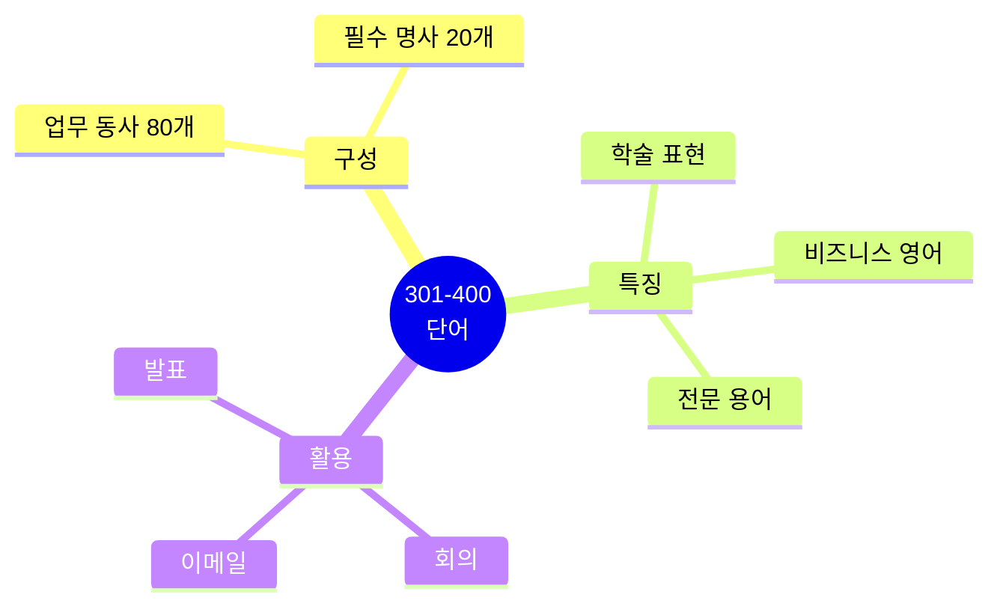
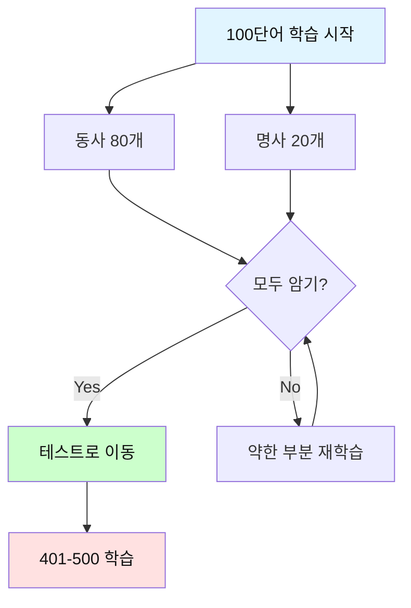

# 전설의 500단어 (301-400) - 업무 동사 & 필수 명사

## 🎯 이 파일의 목적

**301-400번 단어**는 **업무 동사 80개 + 필수 명사 20개**로 구성됩니다.
비즈니스와 학술 영어에서 자주 사용되는 핵심 동사들입니다.



---

## 🔥 동사 (Verbs) 301-380

### 301. **focus** [포커스] - 집중하다

**청크 패턴 3개**:
```
1. Let's focus / on / the main issue.
   집중하자 / ~에 / 주요 문제

2. We need / to focus / our efforts / here.
   우리는 필요해 / 집중할 / 우리 노력을 / 여기에

3. Stay focused / on / the goal.
   유지해 집중을 / ~에 / 목표
```

---

### 302. **achieve** [어치브] - 달성하다

**청크 패턴 3개**:
```
1. We achieved / our target / this quarter.
   우리는 달성했어 / 우리 목표를 / 이번 분기에

2. How can we achieve / this?
   어떻게 우리는 달성할 수 있나 / 이것을?

3. This achievement / is / remarkable.
   이 성취는 / ~이다 / 주목할 만한
```

---

### 303. **ensure** [인슈어] - 보장하다

**청크 패턴 3개**:
```
1. Please ensure / that / everything / is ready.
   보장해주세요 / ~라는 것을 / 모든 것이 / 준비된

2. We need / to ensure / quality.
   우리는 필요해 / 보장할 / 품질을

3. This ensures / smooth operation.
   이것은 보장해 / 원활한 운영을
```

---

### 304. **maintain** [메인테인] - 유지하다

**청크 패턴 3개**:
```
1. We need / to maintain / high standards.
   우리는 필요해 / 유지할 / 높은 기준을

2. Maintain / regular communication.
   유지해 / 정기적인 의사소통을

3. This system / is easy / to maintain.
   이 시스템은 / 쉬워 / 유지하기
```

---

### 305. **improve** [임프루브] - 개선하다

**청크 패턴 3개**:
```
1. We're constantly / improving / our service.
   우리는 지속적으로 / 개선하고 있어 / 우리 서비스를

2. How can we improve / this process?
   어떻게 우리는 개선할 수 있나 / 이 과정을?

3. There's / room / for improvement.
   있어 / 여지가 / 개선의
```

---

### 306. **increase** [인크리스] - 증가시키다

**청크 패턴 3개**:
```
1. Sales / have increased / by 20%.
   매출이 / 증가했어 / 20%

2. We need / to increase / productivity.
   우리는 필요해 / 증가시킬 / 생산성을

3. The number / is increasing / steadily.
   숫자가 / 증가하고 있어 / 꾸준히
```

---

### 307. **reduce** [리듀스] - 줄이다

**청크 패턴 3개**:
```
1. We need / to reduce / costs.
   우리는 필요해 / 줄일 / 비용을

2. This reduces / the risk.
   이것은 줄여 / 위험을

3. Reduce / the time / spent / on meetings.
   줄여 / 시간을 / 소비된 / 회의에
```

---

### 308. **manage** [매니지] - 관리하다

**청크 패턴 3개**:
```
1. I manage / a team / of 10 people.
   나는 관리해 / 팀을 / 10명의

2. Can you manage / this project?
   너 관리할 수 있니 / 이 프로젝트를?

3. Time management / is / crucial.
   시간 관리는 / ~이다 / 중요한
```

---

### 309. **organize** [오거나이즈] - 조직하다

**청크 패턴 3개**:
```
1. Let's organize / a meeting / next week.
   조직하자 / 회의를 / 다음 주에

2. I need / to organize / my files.
   나는 필요해 / 정리할 / 내 파일들을

3. This is / well organized.
   이것은 / 잘 조직돼 있어
```

---

### 310. **plan** [플랜] - 계획하다

**청크 패턴 3개**:
```
1. We're planning / a new launch / next month.
   우리는 계획하고 있어 / 새 출시를 / 다음 달에

2. What do you plan / to do?
   무엇을 너는 계획하니 / 할?

3. Good planning / is / essential.
   좋은 계획은 / ~이다 / 필수적인
```

---

### 311. **prepare** [프리페어] - 준비하다

**청크 패턴 3개**:
```
1. I need / to prepare / for the presentation.
   나는 필요해 / 준비할 / 발표를 위해

2. Are you prepared / for the meeting?
   너 준비됐니 / 회의에?

3. Preparation / is / key.
   준비는 / ~이다 / 핵심
```

---

### 312. **implement** [임플리먼트] - 실행하다

**청크 패턴 3개**:
```
1. We'll implement / the new policy / next month.
   우리는 실행할 거야 / 새 정책을 / 다음 달에

2. How will we implement / this?
   어떻게 우리는 실행할까 / 이것을?

3. Implementation / takes / time.
   실행은 / 걸려 / 시간이
```

---

### 313. **conduct** [컨덕트] - 수행하다

**청크 패턴 3개**:
```
1. We conducted / a survey / last month.
   우리는 수행했어 / 설문조사를 / 지난달에

2. How should we conduct / this meeting?
   어떻게 우리는 수행해야 하나 / 이 회의를?

3. Proper conduct / is / important.
   적절한 행동은 / ~이다 / 중요한
```

---

### 314. **review** [리뷰] - 검토하다

**청크 패턴 3개**:
```
1. Please review / this document / carefully.
   검토해주세요 / 이 문서를 / 조심스럽게

2. We need / to review / our strategy.
   우리는 필요해 / 검토할 / 우리 전략을

3. The review / is / complete.
   검토가 / ~이다 / 완료된
```

---

### 315. **analyze** [애널라이즈] - 분석하다

**청크 패턴 3개**:
```
1. Let's analyze / the data.
   분석하자 / 데이터를

2. We need / to analyze / the situation.
   우리는 필요해 / 분석할 / 상황을

3. Detailed analysis / is / required.
   상세한 분석이 / ~이다 / 필요한
```

---

### 316. **monitor** [모니터] - 감시하다

**청크 패턴 3개**:
```
1. We monitor / the system / 24/7.
   우리는 감시해 / 시스템을 / 24시간

2. Please monitor / the progress.
   감시해주세요 / 진행을

3. Continuous monitoring / is / essential.
   지속적인 감시는 / ~이다 / 필수적인
```

---

### 317. **measure** [메저] - 측정하다

**청크 패턴 3개**:
```
1. How do we measure / success?
   어떻게 우리는 측정하나 / 성공을?

2. We need / to measure / the results.
   우리는 필요해 / 측정할 / 결과를

3. These metrics / measure / performance.
   이 측정값들은 / 측정해 / 성과를
```

---

### 318. **evaluate** [이밸류에이트] - 평가하다

**청크 패턴 3개**:
```
1. We need / to evaluate / all options.
   우리는 필요해 / 평가할 / 모든 옵션들을

2. How do you evaluate / this proposal?
   어떻게 너는 평가하니 / 이 제안을?

3. Regular evaluation / is / important.
   정기적인 평가는 / ~이다 / 중요한
```

---

### 319. **identify** [아이덴티파이] - 식별하다

**청크 패턴 3개**:
```
1. We need / to identify / the problem.
   우리는 필요해 / 식별할 / 문제를

2. Can you identify / the cause?
   너 식별할 수 있니 / 원인을?

3. Identifying risks / is / crucial.
   위험을 식별하는 것은 / ~이다 / 중요한
```

---

### 320. **determine** [디터민] - 결정하다

**청크 패턴 3개**:
```
1. We need / to determine / the best approach.
   우리는 필요해 / 결정할 / 최선의 접근을

2. This determines / our next step.
   이것은 결정해 / 우리 다음 단계를

3. I'm determined / to succeed.
   나는 결심했어 / 성공하기로
```

---

### 321. **establish** [이스태블리쉬] - 설립하다

**청크 패턴 3개**:
```
1. We established / this company / in 2010.
   우리는 설립했어 / 이 회사를 / 2010년에

2. Let's establish / clear goals.
   확립하자 / 명확한 목표를

3. Well-established / procedures / are / in place.
   잘 확립된 / 절차들이 / ~이다 / 제자리에
```

---

### 322. **facilitate** [퍼실리테이트] - 촉진하다

**청크 패턴 3개**:
```
1. This tool / facilitates / communication.
   이 도구는 / 촉진해 / 의사소통을

2. We need / to facilitate / the process.
   우리는 필요해 / 촉진할 / 과정을

3. A facilitator / will / guide / the meeting.
   진행자가 / ~할 거야 / 안내할 / 회의를
```

---

### 323. **coordinate** [코디네이트] - 조정하다

**청크 패턴 3개**:
```
1. I coordinate / the project / schedule.
   나는 조정해 / 프로젝트 / 일정을

2. We need / to coordinate / our efforts.
   우리는 필요해 / 조정할 / 우리 노력들을

3. Good coordination / is / essential.
   좋은 조정은 / ~이다 / 필수적인
```

---

### 324. **collaborate** [콜래버레이트] - 협력하다

**청크 패턴 3개**:
```
1. We collaborate / with / several companies.
   우리는 협력해 / ~와 / 여러 회사들

2. Let's collaborate / on this project.
   협력하자 / 이 프로젝트에

3. Collaboration / drives / innovation.
   협력은 / 이끌어 / 혁신을
```

---

### 325. **communicate** [커뮤니케이트] - 의사소통하다

**청크 패턴 3개**:
```
1. We need / to communicate / clearly.
   우리는 필요해 / 의사소통할 / 명확히

2. He communicates / well / with the team.
   그는 의사소통해 / 잘 / 팀과

3. Effective communication / is / key.
   효과적인 의사소통은 / ~이다 / 핵심
```

---

### 326. **demonstrate** [데먼스트레이트] - 시연하다

**청크 패턴 3개**:
```
1. Let me demonstrate / how / this works.
   내가 시연할게 / 어떻게 / 이것이 작동하는지

2. This demonstrates / our commitment.
   이것은 보여줘 / 우리 헌신을

3. A live demo / will be / provided.
   라이브 데모가 / ~될 거야 / 제공된
```

---

### 327. **participate** [파티시페이트] - 참여하다

**청크 패턴 3개**:
```
1. Everyone / should participate / in the meeting.
   모두가 / 참여해야 해 / 회의에

2. We participated / in / the conference.
   우리는 참여했어 / ~에 / 컨퍼런스

3. Active participation / is / encouraged.
   적극적인 참여는 / ~이다 / 권장되는
```

---

### 328. **contribute** [컨트리뷰트] - 기여하다

**청크 패턴 3개**:
```
1. Everyone / contributed / to the success.
   모두가 / 기여했어 / 성공에

2. How can I contribute / to the project?
   어떻게 내가 기여할 수 있나 / 프로젝트에?

3. Your contribution / is / valuable.
   네 기여는 / ~이다 / 가치 있는
```

---

### 329. **distribute** [디스트리뷰트] - 배포하다

**청크 패턴 3개**:
```
1. Please distribute / these documents / to the team.
   배포해주세요 / 이 문서들을 / 팀에게

2. We distribute / globally.
   우리는 배포해 / 전 세계적으로

3. Distribution / takes / 2-3 days.
   배포는 / 걸려 / 2-3일
```

---

### 330. **deliver** [딜리버] - 전달하다

**청크 패턴 3개**:
```
1. We deliver / on time.
   우리는 전달해 / 제시간에

2. Can you deliver / this / by Friday?
   너 전달할 수 있니 / 이것을 / 금요일까지?

3. Delivery / is / guaranteed.
   배달은 / ~이다 / 보장된
```

---

### 331. **obtain** [옵테인] - 얻다

**청크 패턴 3개**:
```
1. We need / to obtain / approval / first.
   우리는 필요해 / 얻을 / 승인을 / 먼저

2. How can I obtain / this information?
   어떻게 내가 얻을 수 있나 / 이 정보를?

3. Permission / must be / obtained.
   허가가 / 반드시 ~되어야 해 / 얻어진
```

---

### 332. **acquire** [어콰이어] - 획득하다

**청크 패턴 3개**:
```
1. We acquired / a new company / last year.
   우리는 인수했어 / 새 회사를 / 작년에

2. He's acquiring / new skills.
   그는 획득하고 있어 / 새 기술을

3. This acquisition / is / strategic.
   이 인수는 / ~이다 / 전략적인
```

---

### 333. **operate** [오퍼레이트] - 운영하다

**청크 패턴 3개**:
```
1. We operate / in 50 countries.
   우리는 운영해 / 50개국에서

2. How do you operate / this machine?
   어떻게 너는 작동하니 / 이 기계를?

3. Operations / run / smoothly.
   운영이 / 진행돼 / 원활히
```

---

### 334. **generate** [제너레이트] - 생성하다

**청크 패턴 3개**:
```
1. This generates / revenue.
   이것은 생성해 / 수익을

2. We need / to generate / new ideas.
   우리는 필요해 / 생성할 / 새 아이디어들을

3. Report generation / is / automated.
   보고서 생성은 / ~이다 / 자동화된
```

---

### 335. **utilize** [유틸라이즈] - 활용하다

**청크 패턴 3개**:
```
1. We utilize / advanced technology.
   우리는 활용해 / 고급 기술을

2. How can we utilize / this resource?
   어떻게 우리는 활용할 수 있나 / 이 자원을?

3. Efficient utilization / is / important.
   효율적인 활용은 / ~이다 / 중요한
```

---

### 336. **process** [프로세스] - 처리하다

**청크 패턴 3개**:
```
1. We're processing / your request.
   우리는 처리하고 있어 / 네 요청을

2. How long / does it take / to process?
   얼마나 오래 / 걸리나 / 처리하는 데?

3. Processing / takes / 3-5 business days.
   처리는 / 걸려 / 3-5 영업일
```

---

### 337. **complete** [컴플리트] - 완료하다

**청크 패턴 3개**:
```
1. I completed / the task / on time.
   나는 완료했어 / 작업을 / 제시간에

2. When will this / be completed?
   언제 이것이 / 완료될까?

3. The project / is / nearly complete.
   프로젝트가 / ~이다 / 거의 완료된
```

---

### 338. **apply** [어플라이] - 적용하다, 신청하다

**청크 패턴 3개**:
```
1. This rule / applies / to everyone.
   이 규칙은 / 적용돼 / 모두에게

2. I applied / for / the position.
   나는 신청했어 / ~을 / 직위를

3. Apply / these changes / immediately.
   적용해 / 이 변경사항들을 / 즉시
```

---

### 339. **confirm** [컨펌] - 확인하다

**청크 패턴 3개**:
```
1. Please confirm / your attendance.
   확인해주세요 / 네 참석을

2. I can confirm / that / this / is correct.
   나는 확인할 수 있어 / ~라는 것을 / 이것이 / 맞다

3. Confirmation / has been / sent.
   확인이 / ~되었어 / 전송된
```

---

### 340. **verify** [베리파이] - 검증하다

**청크 패턴 3개**:
```
1. We need / to verify / the information.
   우리는 필요해 / 검증할 / 정보를

2. Can you verify / this data?
   너 검증할 수 있니 / 이 데이터를?

3. Verification / is / required.
   검증이 / ~이다 / 필요한
```

---

### 341. **approve** [어프루브] - 승인하다

**청크 패턴 3개**:
```
1. The manager / approved / the request.
   매니저가 / 승인했어 / 요청을

2. We need / approval / before / proceeding.
   우리는 필요해 / 승인이 / 전에 / 진행하기

3. Your request / has been / approved.
   네 요청이 / ~되었어 / 승인된
```

---

### 342. **recommend** [레커멘드] - 추천하다

**청크 패턴 3개**:
```
1. I recommend / trying / this approach.
   나는 추천해 / 시도하기를 / 이 접근을

2. This is / highly / recommended.
   이것은 / 매우 / 추천돼

3. Based on / the data, / I recommend / waiting.
   ~을 기반으로 / 데이터 / 나는 추천해 / 기다리기를
```

---

### 343. **propose** [프로포즈] - 제안하다

**청크 패턴 3개**:
```
1. I propose / we meet / next week.
   나는 제안해 / 우리가 만날 것을 / 다음 주에

2. This is / a proposed / solution.
   이것은 / 제안된 / 해결책이야

3. The proposal / needs / review.
   제안이 / 필요해 / 검토가
```

---

### 344. **respond** [리스판드] - 응답하다

**청크 패턴 3개**:
```
1. Please respond / by Friday.
   응답해주세요 / 금요일까지

2. How should we respond / to this?
   어떻게 우리는 응답해야 하나 / 이것에?

3. Quick response / is / appreciated.
   빠른 응답은 / ~이다 / 감사한
```

---

### 345. **address** [어드레스] - 다루다

**청크 패턴 3개**:
```
1. We need / to address / this issue / immediately.
   우리는 필요해 / 다룰 / 이 문제를 / 즉시

2. How will we address / these concerns?
   어떻게 우리는 다룰까 / 이 우려들을?

3. The problem / has been / addressed.
   문제가 / ~되었어 / 다루어진
```

---

### 346. **resolve** [리졸브] - 해결하다

**청크 패턴 3개**:
```
1. We resolved / the conflict / successfully.
   우리는 해결했어 / 갈등을 / 성공적으로

2. This issue / needs / to be resolved / quickly.
   이 문제는 / 필요해 / 해결될 / 빠르게

3. Resolution / takes / time.
   해결은 / 걸려 / 시간이
```

---

### 347. **update** [업데이트] - 업데이트하다

**청크 패턴 3개**:
```
1. Please update / the document.
   업데이트해주세요 / 문서를

2. I'll update you / on / the progress.
   나는 업데이트할게 / ~에 대해 / 진행

3. The system / updates / automatically.
   시스템이 / 업데이트돼 / 자동으로
```

---

### 348. **track** [트랙] - 추적하다

**청크 패턴 3개**:
```
1. We track / all expenses.
   우리는 추적해 / 모든 비용을

2. Can you track / the shipment?
   너 추적할 수 있니 / 배송을?

3. Progress tracking / is / important.
   진행 추적은 / ~이다 / 중요한
```

---

### 349. **access** [액세스] - 접근하다

**청크 패턴 3개**:
```
1. You can access / the files / here.
   너는 접근할 수 있어 / 파일들에 / 여기서

2. I don't have / access / to that system.
   나는 없어 / 접근권이 / 그 시스템에

3. Access / is / restricted.
   접근은 / ~이다 / 제한된
```

---

### 350. **upload** [업로드] - 업로드하다

**청크 패턴 3개**:
```
1. Please upload / the document / to the system.
   업로드해주세요 / 문서를 / 시스템에

2. I'll upload / the files / later.
   나는 업로드할게 / 파일들을 / 나중에

3. Upload / complete.
   업로드 / 완료
```

---

### 351. **download** [다운로드] - 다운로드하다

**청크 패턴 3개**:
```
1. You can download / the report / from here.
   너는 다운로드할 수 있어 / 보고서를 / 여기서

2. I downloaded / all the files / yesterday.
   나는 다운로드했어 / 모든 파일들을 / 어제

3. Download / is / in progress.
   다운로드가 / ~이다 / 진행 중
```

---

### 352. **transfer** [트랜스퍼] - 전송하다

**청크 패턴 3개**:
```
1. Transfer / the files / to the new server.
   전송해 / 파일들을 / 새 서버로

2. I was transferred / to / another department.
   나는 이동됐어 / ~로 / 다른 부서

3. File transfer / is / complete.
   파일 전송이 / ~이다 / 완료된
```

---

### 353. **schedule** [스케줄] - 일정을 잡다

**청크 패턴 3개**:
```
1. Let's schedule / a meeting / for tomorrow.
   일정을 잡자 / 회의를 / 내일로

2. This is scheduled / for / next week.
   이것은 예정돼 있어 / ~로 / 다음 주

3. The schedule / is / flexible.
   일정은 / ~이다 / 유연한
```

---

### 354. **postpone** [포스트폰] - 연기하다

**청크 패턴 3개**:
```
1. We need / to postpone / the meeting.
   우리는 필요해 / 연기할 / 회의를

2. Can we postpone / this / until next week?
   우리 연기할 수 있나 / 이것을 / 다음 주까지?

3. The launch / has been / postponed.
   출시가 / ~되었어 / 연기된
```

---

### 355. **cancel** [캔슬] - 취소하다

**청크 패턴 3개**:
```
1. I need / to cancel / my appointment.
   나는 필요해 / 취소할 / 내 약속을

2. The meeting / was canceled.
   회의가 / 취소됐어

3. Cancellation / is / not allowed.
   취소는 / ~이다 / 허용되지 않는
```

---

### 356. **replace** [리플레이스] - 교체하다

**청크 패턴 3개**:
```
1. We need / to replace / the old system.
   우리는 필요해 / 교체할 / 옛 시스템을

2. This replaces / the previous version.
   이것은 교체해 / 이전 버전을

3. Replacement / is / available.
   교체가 / ~이다 / 가능한
```

---

### 357. **submit** [서브밋] - 제출하다

**청크 패턴 3개**:
```
1. Please submit / your report / by Friday.
   제출해주세요 / 네 보고서를 / 금요일까지

2. I submitted / the application / yesterday.
   나는 제출했어 / 신청서를 / 어제

3. Submission / deadline / is / tomorrow.
   제출 / 마감일은 / ~이다 / 내일
```

---

### 358. **publish** [퍼블리쉬] - 게시하다

**청크 패턴 3개**:
```
1. We'll publish / the results / next week.
   우리는 게시할 거야 / 결과를 / 다음 주에

2. This article / was published / in 2020.
   이 기사는 / 게시됐어 / 2020년에

3. Publication / is / pending.
   게시가 / ~이다 / 보류 중
```

---

### 359. **modify** [모디파이] - 수정하다

**청크 패턴 3개**:
```
1. We need / to modify / the plan.
   우리는 필요해 / 수정할 / 계획을

2. Can you modify / this section?
   너 수정할 수 있니 / 이 부분을?

3. Modifications / are / needed.
   수정이 / ~이다 / 필요한
```

---

### 360. **adjust** [어저스트] - 조정하다

**청크 패턴 3개**:
```
1. Let's adjust / the timeline.
   조정하자 / 일정을

2. We adjusted / our strategy.
   우리는 조정했어 / 우리 전략을

3. Adjustments / will be / made.
   조정이 / ~될 거야 / 이루어진
```

---

### 361. **optimize** [옵티마이즈] - 최적화하다

**청크 패턴 3개**:
```
1. We're optimizing / the process.
   우리는 최적화하고 있어 / 과정을

2. This code / needs / optimization.
   이 코드는 / 필요해 / 최적화가

3. Optimal performance / is / achieved.
   최적 성능이 / ~이다 / 달성된
```

---

### 362. **integrate** [인티그레이트] - 통합하다

**청크 패턴 3개**:
```
1. We integrated / the new system.
   우리는 통합했어 / 새 시스템을

2. This integrates / with / existing tools.
   이것은 통합돼 / ~와 / 기존 도구들

3. Integration / is / seamless.
   통합은 / ~이다 / 매끄러운
```

---

### 363. **migrate** [마이그레이트] - 이전하다

**청크 패턴 3개**:
```
1. We're migrating / to the cloud.
   우리는 이전하고 있어 / 클라우드로

2. Data migration / takes / time.
   데이터 이전은 / 걸려 / 시간이

3. Migration / is / complete.
   이전이 / ~이다 / 완료된
```

---

### 364. **deploy** [디플로이] - 배포하다

**청크 패턴 3개**:
```
1. We deployed / the update / last night.
   우리는 배포했어 / 업데이트를 / 어젯밤에

2. When will this / be deployed?
   언제 이것이 / 배포될까?

3. Deployment / is / scheduled.
   배포가 / ~이다 / 예정된
```

---

### 365. **launch** [론치] - 출시하다

**청크 패턴 3개**:
```
1. We're launching / a new product / next month.
   우리는 출시하고 있어 / 새 제품을 / 다음 달에

2. The launch / was / successful.
   출시가 / ~이었어 / 성공적인

3. Launch date / is / confirmed.
   출시일이 / ~이다 / 확정된
```

---

### 366. **upgrade** [업그레이드] - 업그레이드하다

**청크 패턴 3개**:
```
1. We upgraded / the system / last week.
   우리는 업그레이드했어 / 시스템을 / 지난주에

2. This requires / an upgrade.
   이것은 필요로 해 / 업그레이드를

3. Free upgrade / is / available.
   무료 업그레이드가 / ~이다 / 가능한
```

---

### 367. **maintain** [메인테인] - 유지보수하다

**청크 패턴 3개**:
```
1. We maintain / the system / regularly.
   우리는 유지보수해 / 시스템을 / 정기적으로

2. Regular maintenance / is / required.
   정기 유지보수가 / ~이다 / 필요한

3. Maintenance / window / is / Sunday night.
   유지보수 / 시간은 / ~이다 / 일요일 밤
```

---

### 368. **troubleshoot** [트러블슈트] - 문제 해결하다

**청크 패턴 3개**:
```
1. I'm troubleshooting / the issue / now.
   나는 문제 해결하고 있어 / 문제를 / 지금

2. Troubleshooting / takes / time.
   문제 해결은 / 걸려 / 시간이

3. Check / the troubleshooting guide.
   확인해 / 문제 해결 가이드를
```

---

### 369. **execute** [익스큐트] - 실행하다

**청크 패턴 3개**:
```
1. Execute / the script / now.
   실행해 / 스크립트를 / 지금

2. The plan / was executed / perfectly.
   계획이 / 실행됐어 / 완벽하게

3. Execution / is / automatic.
   실행은 / ~이다 / 자동적인
```

---

### 370. **terminate** [터미네이트] - 종료하다

**청크 패턴 3개**:
```
1. Terminate / the process.
   종료해 / 프로세스를

2. The contract / was terminated.
   계약이 / 종료됐어

3. Termination / is / effective / immediately.
   종료가 / ~이다 / 효력이 있는 / 즉시
```

---

### 371. **restore** [리스토어] - 복원하다

**청크 패턴 3개**:
```
1. We need / to restore / the backup.
   우리는 필요해 / 복원할 / 백업을

2. The system / has been / restored.
   시스템이 / ~되었어 / 복원된

3. Restoration / takes / 2 hours.
   복원은 / 걸려 / 2시간
```

---

### 372. **archive** [아카이브] - 보관하다

**청크 패턴 3개**:
```
1. Archive / old files / regularly.
   보관해 / 오래된 파일들을 / 정기적으로

2. This has been / archived.
   이것은 / 보관됐어

3. Archives / are / available / online.
   보관소가 / ~이다 / 이용 가능한 / 온라인에
```

---

### 373. **export** [익스포트] - 내보내다

**청크 패턴 3개**:
```
1. Export / the data / to Excel.
   내보내 / 데이터를 / 엑셀로

2. I exported / the report / yesterday.
   나는 내보냈어 / 보고서를 / 어제

3. Export / is / complete.
   내보내기가 / ~이다 / 완료된
```

---

### 374. **import** [임포트] - 가져오다

**청크 패턴 3개**:
```
1. Import / the file / first.
   가져와 / 파일을 / 먼저

2. We import / data / daily.
   우리는 가져와 / 데이터를 / 매일

3. Import / failed.
   가져오기가 / 실패했어
```

---

### 375. **format** [포맷] - 형식화하다

**청크 패턴 3개**:
```
1. Format / the document / properly.
   형식화해 / 문서를 / 적절히

2. This is / not / formatted / correctly.
   이것은 / 아니야 / 형식화된 / 올바르게

3. Auto-format / is / enabled.
   자동 형식화가 / ~이다 / 활성화된
```

---

### 376. **validate** [밸리데이트] - 검증하다

**청크 패턴 3개**:
```
1. Validate / the input / before / submitting.
   검증해 / 입력을 / 전에 / 제출하기

2. This needs / validation.
   이것은 필요해 / 검증이

3. Validation / passed.
   검증이 / 통과했어
```

---

### 377. **authenticate** [오쎈티케이트] - 인증하다

**청크 패턴 3개**:
```
1. Please authenticate / your identity.
   인증해주세요 / 네 신원을

2. Users / must authenticate / first.
   사용자들은 / 반드시 인증해야 해 / 먼저

3. Authentication / failed.
   인증이 / 실패했어
```

---

### 378. **authorize** [오쏘라이즈] - 승인하다, 권한을 주다

**청크 패턴 3개**:
```
1. You're not / authorized / to access / this.
   너는 아니야 / 승인된 / 접근할 / 이것에

2. Who authorized / this change?
   누가 승인했니 / 이 변경을?

3. Authorization / is / required.
   승인이 / ~이다 / 필요한
```

---

### 379. **encrypt** [인크립트] - 암호화하다

**청크 패턴 3개**:
```
1. All data / is encrypted.
   모든 데이터는 / 암호화돼

2. We encrypt / sensitive information.
   우리는 암호화해 / 민감한 정보를

3. Encryption / is / automatic.
   암호화는 / ~이다 / 자동적인
```

---

### 380. **notify** [노티파이] - 알리다

**청크 패턴 3개**:
```
1. I'll notify you / when / it's ready.
   나는 알릴게 / 언제 / 준비되면

2. Please notify / the team / immediately.
   알려주세요 / 팀에게 / 즉시

3. Notifications / are / enabled.
   알림이 / ~이다 / 활성화된
```

---

## 🔥 명사 (Nouns) 381-400

### 381. **strategy** [스트래터지] - 전략

**청크 패턴 3개**:
```
1. We need / a new strategy.
   우리는 필요해 / 새 전략이

2. Our strategy / is / working / well.
   우리 전략은 / ~이다 / 작동하는 / 잘

3. Let's discuss / the strategy / tomorrow.
   논의하자 / 전략을 / 내일
```

---

### 382. **approach** [어프로치] - 접근법

**청크 패턴 3개**:
```
1. This is / a different approach.
   이것은 / 다른 접근법이야

2. What approach / should we take?
   어떤 접근법을 / 우리는 취해야 하나?

3. The approach / is / innovative.
   접근법이 / ~이다 / 혁신적인
```

---

### 383. **solution** [솔루션] - 해결책

**청크 패턴 3개**:
```
1. We found / a solution / to the problem.
   우리는 찾았어 / 해결책을 / 문제에 대한

2. This solution / works / well.
   이 해결책은 / 작동해 / 잘

3. Simple solutions / are / often / the best.
   간단한 해결책이 / ~이다 / 종종 / 최고
```

---

### 384. **benefit** [베네핏] - 혜택

**청크 패턴 3개**:
```
1. This offers / many benefits.
   이것은 제공해 / 많은 혜택을

2. What are / the benefits / of this?
   무엇이 / 혜택들이니 / 이것의?

3. Benefits / include / free shipping.
   혜택이 / 포함해 / 무료 배송을
```

---

### 385. **advantage** [어드밴티지] - 이점

**청크 패턴 3개**:
```
1. This gives us / a competitive advantage.
   이것은 준다 우리에게 / 경쟁 우위를

2. Take advantage / of / this opportunity.
   활용해 / ~을 / 이 기회

3. The advantages / are / clear.
   이점들은 / ~이다 / 명확한
```

---

### 386. **opportunity** [어퍼튜니티] - 기회

**청크 패턴 3개**:
```
1. This is / a great opportunity.
   이것은 / 훌륭한 기회야

2. We have / many opportunities / ahead.
   우리는 있어 / 많은 기회가 / 앞에

3. Don't miss / this opportunity.
   놓치지 마 / 이 기회를
```

---

### 387. **challenge** [챌린지] - 도전

**청크 패턴 3개**:
```
1. We face / many challenges.
   우리는 직면해 / 많은 도전에

2. This is / a significant challenge.
   이것은 / 중요한 도전이야

3. Challenges / create / opportunities.
   도전이 / 만들어 / 기회를
```

---

### 388. **risk** [리스크] - 위험

**청크 패턴 3개**:
```
1. We need / to minimize / the risk.
   우리는 필요해 / 최소화할 / 위험을

2. What are / the risks / involved?
   무엇이 / 위험들이니 / 관련된?

3. High risk, / high reward.
   높은 위험, / 높은 보상
```

---

### 389. **requirement** [리콰이어먼트] - 요구사항

**청크 패턴 3개**:
```
1. What are / the requirements?
   무엇이 / 요구사항들이니?

2. This meets / all requirements.
   이것은 충족해 / 모든 요구사항을

3. Requirements / are / clearly / stated.
   요구사항이 / ~이다 / 명확히 / 진술된
```

---

### 390. **objective** [오브젝티브] - 목표

**청크 패턴 3개**:
```
1. Our objective / is / to grow / 20%.
   우리 목표는 / ~이다 / 성장하는 것 / 20%

2. We achieved / our objectives.
   우리는 달성했어 / 우리 목표들을

3. Clear objectives / are / important.
   명확한 목표가 / ~이다 / 중요한
```

---

### 391. **priority** [프라이오리티] - 우선순위

**청크 패턴 3개**:
```
1. This is / our top priority.
   이것이 / 우리 최우선 순위야

2. Set / clear priorities.
   정해 / 명확한 우선순위를

3. Priorities / may change.
   우선순위가 / 바뀔 수 있어
```

---

### 392. **deadline** [데드라인] - 마감일

**청크 패턴 3개**:
```
1. When is / the deadline?
   언제니 / 마감일이?

2. We met / the deadline.
   우리는 맞췄어 / 마감일을

3. Deadlines / are / strict.
   마감일은 / ~이다 / 엄격한
```

---

### 393. **timeline** [타임라인] - 일정표

**청크 패턴 3개**:
```
1. What's / the timeline / for this?
   무엇이 / 일정이니 / 이것의?

2. The timeline / is / aggressive.
   일정이 / ~이다 / 빡빡한

3. We need / a realistic timeline.
   우리는 필요해 / 현실적인 일정이
```

---

### 394. **milestone** [마일스톤] - 이정표

**청크 패턴 3개**:
```
1. We reached / an important milestone.
   우리는 도달했어 / 중요한 이정표에

2. Track / key milestones.
   추적해 / 주요 이정표를

3. This is / a major milestone.
   이것은 / 주요 이정표야
```

---

### 395. **resource** [리소스] - 자원

**청크 패턴 3개**:
```
1. We need / more resources.
   우리는 필요해 / 더 많은 자원이

2. Resources / are / limited.
   자원이 / ~이다 / 제한된

3. Allocate / resources / wisely.
   할당해 / 자원을 / 현명하게
```

---

### 396. **budget** [버젯] - 예산

**청크 패턴 3개**:
```
1. What's / the budget / for this?
   무엇이 / 예산이니 / 이것의?

2. We're / over budget.
   우리는 / 예산 초과야

3. Budget / approval / is / needed.
   예산 / 승인이 / ~이다 / 필요한
```

---

### 397. **cost** [코스트] - 비용

**청크 패턴 3개**:
```
1. What's / the total cost?
   무엇이 / 전체 비용이니?

2. We need / to reduce / costs.
   우리는 필요해 / 줄일 / 비용을

3. Cost / is / a major factor.
   비용이 / ~이다 / 주요 요인
```

---

### 398. **revenue** [레버뉴] - 수익

**청크 패턴 3개**:
```
1. Revenue / increased / by 15%.
   수익이 / 증가했어 / 15%

2. We need / more revenue / streams.
   우리는 필요해 / 더 많은 수익 / 원천이

3. Revenue / targets / were met.
   수익 / 목표가 / 달성됐어
```

---

### 399. **profit** [프라핏] - 이익

**청크 패턴 3개**:
```
1. We made / a profit / this quarter.
   우리는 만들었어 / 이익을 / 이번 분기에

2. Profit margins / are / improving.
   이익 마진이 / ~이다 / 개선되고 있는

3. Non-profit / organization.
   비영리 / 조직
```

---

### 400. **impact** [임팩트] - 영향

**청크 패턴 3개**:
```
1. This has / a big impact / on sales.
   이것은 있어 / 큰 영향이 / 판매에

2. What's / the impact / of this change?
   무엇이 / 영향이니 / 이 변화의?

3. Impact / analysis / is / needed.
   영향 / 분석이 / ~이다 / 필요한
```

---

## 🎯 301-400 학습 완료 체크



### 진도 체크리스트

- [ ] 동사 301-310 완료
- [ ] 동사 311-320 완료
- [ ] 동사 321-330 완료
- [ ] 동사 331-340 완료
- [ ] 동사 341-350 완료
- [ ] 동사 351-360 완료
- [ ] 동사 361-370 완료
- [ ] 동사 371-380 완료
- [ ] 명사 381-400 완료
- [ ] **전체 복습 완료**

---

## 📝 다음 학습

**다음 파일로 이동하세요:**
- 📘 [전설의_500단어_401-500.md](./전설의_500단어_401-500.md) - 최종 명사 학습

**이전 학습 복습:**
- 📕 [전설의_500단어_001-100.md](./전설의_500단어_001-100.md) - 동사/명사/형용사
- 📗 [전설의_500단어_101-200.md](./전설의_500단어_101-200.md) - 형용사/부사
- 📙 [전설의_500단어_201-300.md](./전설의_500단어_201-300.md) - 부사/전치사/접속사/동사

**테스트 보기:**
- 📝 [전설의_500단어_테스트.md](./전설의_500단어_테스트.md) - 한영 분리 테스트

---

💪 **400단어 완료 축하합니다!**
- 동사 80개 + 명사 20개 = 총 100단어
- 누적: 400단어 완료
- 패턴 1,200개 학습 완료
- 이제 마지막 401-500으로 넘어가세요!

