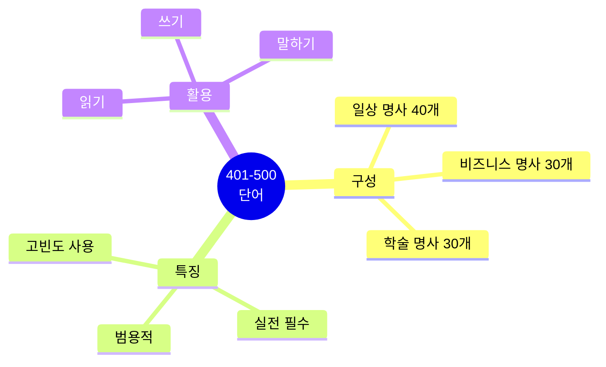
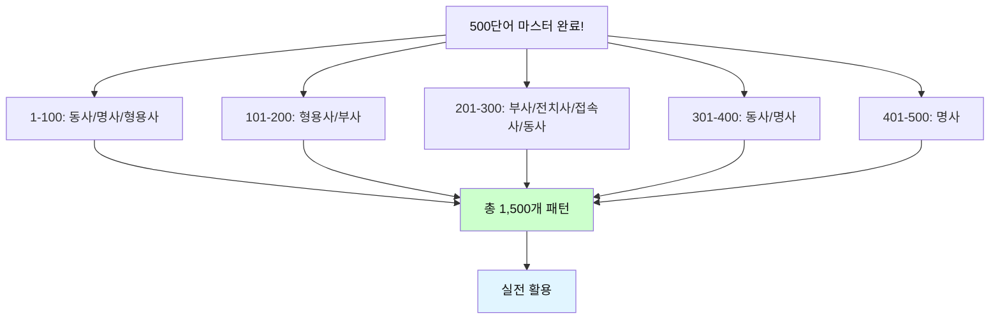

# 전설의 500단어 (401-500) - 필수 명사 마스터

## 🎯 이 파일의 목적

**401-500번 단어**는 **필수 명사 100개**로 구성됩니다.
일상, 비즈니스, 학술 모든 영역에서 자주 사용되는 핵심 명사들입니다.



---

## 🔥 명사 (Nouns) 401-500

### 401. **value** [밸류] - 가치

**청크 패턴 3개**:
```
1. This adds / great value / to customers.
   이것은 추가해 / 큰 가치를 / 고객들에게

2. What's / the value / of this?
   무엇이 / 가치니 / 이것의?

3. We provide / value / for money.
   우리는 제공해 / 가치를 / 돈에 대한
```

---

### 402. **quality** [퀄리티] - 품질

**청크 패턴 3개**:
```
1. Quality / is / our priority.
   품질이 / ~이다 / 우리 우선순위

2. High quality / materials / are used.
   고품질 / 재료가 / 사용돼

3. Quality control / is / strict.
   품질 관리는 / ~이다 / 엄격한
```

---

### 403. **experience** [익스피리언스] - 경험

**청크 패턴 3개**:
```
1. I have / 5 years / of experience.
   나는 있어 / 5년의 / 경험이

2. This provides / great experience.
   이것은 제공해 / 훌륭한 경험을

3. Experience / matters.
   경험이 / 중요해
```

---

### 404. **knowledge** [놀리지] - 지식

**청크 패턴 3개**:
```
1. He has / deep knowledge / of / the system.
   그는 있어 / 깊은 지식이 / ~의 / 시스템

2. Knowledge / is / power.
   지식은 / ~이다 / 힘

3. Share / your knowledge / with the team.
   공유해 / 네 지식을 / 팀과
```

---

### 405. **skill** [스킬] - 기술

**청크 패턴 3개**:
```
1. This requires / technical skills.
   이것은 필요로 해 / 기술적 능력을

2. She has / excellent / communication skills.
   그녀는 있어 / 훌륭한 / 의사소통 능력이

3. Skill development / is / continuous.
   능력 개발은 / ~이다 / 지속적인
```

---

### 406. **ability** [어빌리티] - 능력

**청크 패턴 3개**:
```
1. He has / the ability / to lead.
   그는 있어 / 능력이 / 이끌

2. This tests / your abilities.
   이것은 테스트해 / 네 능력들을

3. Ability / varies / by person.
   능력은 / 다르다 / 사람에 따라
```

---

### 407. **method** [메쏘드] - 방법

**청크 패턴 3개**:
```
1. This is / the best method.
   이것이 / 최선의 방법이야

2. We use / various methods.
   우리는 사용해 / 다양한 방법을

3. The method / is / proven.
   방법은 / ~이다 / 입증된
```

---

### 408. **purpose** [퍼퍼스] - 목적

**청크 패턴 3개**:
```
1. What's / the purpose / of this meeting?
   무엇이 / 목적이니 / 이 회의의?

2. For / security purposes / only.
   ~을 위해 / 보안 목적 / 만

3. Find / your purpose.
   찾아 / 네 목적을
```

---

### 409. **reason** [리즌] - 이유

**청크 패턴 3개**:
```
1. What's / the reason / for this?
   무엇이 / 이유니 / 이것의?

2. There are / several reasons.
   있어 / 여러 이유가

3. For / this reason, / we should / wait.
   ~을 위해 / 이 이유 / 우리는 해야 해 / 기다리기를
```

---

### 410. **factor** [팩터] - 요인

**청크 패턴 3개**:
```
1. This is / an important factor.
   이것은 / 중요한 요인이야

2. Many factors / affect / the decision.
   많은 요인이 / 영향을 미쳐 / 결정에

3. Consider / all factors.
   고려해 / 모든 요인을
```

---

### 411. **element** [엘리먼트] - 요소

**청크 패턴 3개**:
```
1. This is / a key element / of success.
   이것은 / 핵심 요소야 / 성공의

2. All elements / are / important.
   모든 요소가 / ~이다 / 중요한

3. Break down / into / smaller elements.
   나눠 / ~으로 / 더 작은 요소들
```

---

### 412. **aspect** [애스펙트] - 측면

**청크 패턴 3개**:
```
1. Consider / all aspects / of the problem.
   고려해 / 모든 측면을 / 문제의

2. This aspect / is / critical.
   이 측면은 / ~이다 / 중요한

3. From / this aspect, / it looks / good.
   ~에서 / 이 측면 / 보여 / 좋은
```

---

### 413. **feature** [피처] - 기능, 특징

**청크 패턴 3개**:
```
1. This is / a new feature.
   이것은 / 새 기능이야

2. Key features / include / automation.
   주요 기능이 / 포함해 / 자동화를

3. The feature / is / ready.
   기능이 / ~이다 / 준비된
```

---

### 414. **function** [펑션] - 기능

**청크 패턴 3개**:
```
1. This function / is / useful.
   이 기능은 / ~이다 / 유용한

2. It functions / well / under pressure.
   그것은 작동해 / 잘 / 압력 하에서

3. Basic functions / are / covered.
   기본 기능이 / ~이다 / 다뤄진
```

---

### 415. **performance** [퍼포먼스] - 성과, 성능

**청크 패턴 3개**:
```
1. Performance / has improved / significantly.
   성과가 / 개선됐어 / 상당히

2. System performance / is / excellent.
   시스템 성능은 / ~이다 / 훌륭한

3. We evaluate / performance / regularly.
   우리는 평가해 / 성과를 / 정기적으로
```

---

### 416. **efficiency** [이피션시] - 효율성

**청크 패턴 3개**:
```
1. We need / to improve / efficiency.
   우리는 필요해 / 개선할 / 효율성을

2. High efficiency / is / achieved.
   높은 효율성이 / ~이다 / 달성된

3. Efficiency / is / key.
   효율성이 / ~이다 / 핵심
```

---

### 417. **capacity** [커패시티] - 용량, 능력

**청크 패턴 3개**:
```
1. We're at / full capacity.
   우리는 있어 / 최대 용량

2. This increases / our capacity.
   이것은 증가시켜 / 우리 능력을

3. Capacity / planning / is / important.
   용량 / 계획은 / ~이다 / 중요한
```

---

### 418. **scope** [스코프] - 범위

**청크 패턴 3개**:
```
1. This is / outside / the scope.
   이것은 / 밖이야 / 범위

2. Project scope / is / defined.
   프로젝트 범위가 / ~이다 / 정의된

3. Let's expand / the scope.
   확장하자 / 범위를
```

---

### 419. **range** [레인지] - 범위

**청크 패턴 3개**:
```
1. We offer / a wide range / of products.
   우리는 제공해 / 넓은 범위를 / 제품의

2. The range / is / impressive.
   범위가 / ~이다 / 인상적인

3. Within / the price range.
   ~이내에 / 가격 범위
```

---

### 420. **scale** [스케일] - 규모

**청크 패턴 3개**:
```
1. We operate / on / a large scale.
   우리는 운영해 / ~에서 / 큰 규모

2. Scale / this / to 100 users.
   확장해 / 이것을 / 100명의 사용자로

3. The scale / is / massive.
   규모가 / ~이다 / 엄청난
```

---

### 421. **rate** [레이트] - 비율, 속도

**청크 패턴 3개**:
```
1. The success rate / is / high.
   성공 비율이 / ~이다 / 높은

2. At this rate, / we'll finish / early.
   이 속도로, / 우리는 끝낼 거야 / 일찍

3. Growth rate / is / 20% / annually.
   성장률이 / ~이다 / 20% / 연간
```

---

### 422. **trend** [트렌드] - 추세

**청크 패턴 3개**:
```
1. This is / the latest trend.
   이것은 / 최신 추세야

2. Market trends / are / changing.
   시장 추세가 / ~이다 / 변하고 있는

3. Follow / the trends.
   따라 / 추세를
```

---

### 423. **pattern** [패턴] - 패턴

**청크 패턴 3개**:
```
1. I see / a pattern / here.
   나는 본다 / 패턴을 / 여기서

2. Behavior patterns / are / predictable.
   행동 패턴이 / ~이다 / 예측 가능한

3. This follows / a common pattern.
   이것은 따라 / 일반적인 패턴을
```

---

### 424. **standard** [스탠더드] - 기준

**청크 패턴 3개**:
```
1. This meets / industry standards.
   이것은 충족해 / 업계 기준을

2. Set / high standards.
   정해 / 높은 기준을

3. Standard procedure / applies.
   표준 절차가 / 적용돼
```

---

### 425. **policy** [폴리시] - 정책

**청크 패턴 3개**:
```
1. This is / our company policy.
   이것이 / 우리 회사 정책이야

2. Policy / changes / are / coming.
   정책 / 변화가 / ~이다 / 다가오는

3. Follow / the policy.
   따라 / 정책을
```

---

### 426. **procedure** [프로시저] - 절차

**청크 패턴 3개**:
```
1. Follow / the standard procedure.
   따라 / 표준 절차를

2. This procedure / is / mandatory.
   이 절차는 / ~이다 / 필수적인

3. Procedures / are / in place.
   절차가 / ~이다 / 마련된
```

---

### 427. **guideline** [가이드라인] - 지침

**청크 패턴 3개**:
```
1. Follow / these guidelines.
   따라 / 이 지침들을

2. Guidelines / are / provided.
   지침이 / ~이다 / 제공된

3. This is / within / the guidelines.
   이것은 / ~이내야 / 지침
```

---

### 428. **framework** [프레임워크] - 체계

**청크 패턴 3개**:
```
1. We use / this framework.
   우리는 사용해 / 이 프레임워크를

2. The framework / provides / structure.
   프레임워크가 / 제공해 / 구조를

3. Build / within / the framework.
   만들어 / ~이내에 / 프레임워크
```

---

### 429. **structure** [스트럭처] - 구조

**청크 패턴 3개**:
```
1. The structure / is / clear.
   구조가 / ~이다 / 명확한

2. We restructured / the team.
   우리는 재구성했어 / 팀을

3. Organizational structure / matters.
   조직 구조가 / 중요해
```

---

### 430. **model** [모델] - 모델

**청크 패턴 3개**:
```
1. This is / a successful model.
   이것은 / 성공적인 모델이야

2. We use / this business model.
   우리는 사용해 / 이 비즈니스 모델을

3. The model / works / well.
   모델이 / 작동해 / 잘
```

---

### 431. **version** [버전] - 버전

**청크 패턴 3개**:
```
1. This is / version 2.0.
   이것은 / 버전 2.0이야

2. The latest version / is / available.
   최신 버전이 / ~이다 / 이용 가능한

3. Which version / do you have?
   어느 버전을 / 너는 있니?
```

---

### 432. **option** [옵션] - 선택사항

**청크 패턴 3개**:
```
1. We have / several options.
   우리는 있어 / 여러 선택사항이

2. What are / the options?
   무엇이 / 선택사항들이니?

3. This option / is / better.
   이 선택사항이 / ~이다 / 더 나은
```

---

### 433. **alternative** [얼터너티브] - 대안

**청크 패턴 3개**:
```
1. Do we have / any alternatives?
   우리는 있니 / 어떤 대안이?

2. This is / a good alternative.
   이것은 / 좋은 대안이야

3. Consider / all alternatives.
   고려해 / 모든 대안을
```

---

### 434. **situation** [시추에이션] - 상황

**청크 패턴 3개**:
```
1. This is / a difficult situation.
   이것은 / 어려운 상황이야

2. The situation / has changed.
   상황이 / 변했어

3. How do we handle / this situation?
   어떻게 우리는 다루나 / 이 상황을?
```

---

### 435. **condition** [컨디션] - 조건, 상태

**청크 패턴 3개**:
```
1. Under / these conditions, / we should / wait.
   ~하에 / 이 조건들 / 우리는 해야 해 / 기다리기를

2. The condition / is / excellent.
   상태가 / ~이다 / 훌륭한

3. Terms / and conditions / apply.
   조항 / 그리고 조건이 / 적용돼
```

---

### 436. **status** [스테이터스] - 상태

**청크 패턴 3개**:
```
1. What's / the current status?
   무엇이 / 현재 상태니?

2. Status / update / is / needed.
   상태 / 업데이트가 / ~이다 / 필요한

3. Check / the status / regularly.
   확인해 / 상태를 / 정기적으로
```

---

### 437. **progress** [프로그레스] - 진행

**청크 패턴 3개**:
```
1. We're making / good progress.
   우리는 만들고 있어 / 좋은 진전을

2. Track / the progress / daily.
   추적해 / 진행을 / 매일

3. Progress / is / steady.
   진행이 / ~이다 / 꾸준한
```

---

### 438. **improvement** [임프루브먼트] - 개선

**청크 패턴 3개**:
```
1. We see / significant improvement.
   우리는 봐 / 상당한 개선을

2. There's / room / for improvement.
   있어 / 여지가 / 개선의

3. Continuous improvement / is / our goal.
   지속적 개선이 / ~이다 / 우리 목표
```

---

### 439. **development** [디벨럽먼트] - 개발

**청크 패턴 3개**:
```
1. Product development / is / ongoing.
   제품 개발이 / ~이다 / 진행 중

2. This is / in development.
   이것은 / 개발 중이야

3. Development / takes / time.
   개발은 / 걸려 / 시간이
```

---

### 440. **growth** [그로스] - 성장

**청크 패턴 3개**:
```
1. We achieved / 20% growth / this year.
   우리는 달성했어 / 20% 성장을 / 올해

2. Growth / is / our priority.
   성장이 / ~이다 / 우리 우선순위

3. Sustainable growth / is / important.
   지속 가능한 성장이 / ~이다 / 중요한
```

---

### 441. **innovation** [이노베이션] - 혁신

**청크 패턴 3개**:
```
1. Innovation / drives / success.
   혁신이 / 이끌어 / 성공을

2. This is / an innovative solution.
   이것은 / 혁신적인 해결책이야

3. We encourage / innovation.
   우리는 장려해 / 혁신을
```

---

### 442. **technology** [테크놀로지] - 기술

**청크 패턴 3개**:
```
1. We use / advanced technology.
   우리는 사용해 / 고급 기술을

2. Technology / is changing / rapidly.
   기술이 / 변하고 있어 / 빠르게

3. New technology / is / coming.
   새 기술이 / ~이다 / 다가오는
```

---

### 443. **platform** [플랫폼] - 플랫폼

**청크 패턴 3개**:
```
1. Our platform / supports / multiple devices.
   우리 플랫폼은 / 지원해 / 여러 기기를

2. This is / a powerful platform.
   이것은 / 강력한 플랫폼이야

3. Platform / integration / is / complete.
   플랫폼 / 통합이 / ~이다 / 완료된
```

---

### 444. **application** [애플리케이션] - 애플리케이션, 적용

**청크 패턴 3개**:
```
1. Download / the application / here.
   다운로드해 / 애플리케이션을 / 여기서

2. This has / many applications.
   이것은 있어 / 많은 적용이

3. Application / deadline / is / Friday.
   신청 / 마감일은 / ~이다 / 금요일
```

---

### 445. **interface** [인터페이스] - 인터페이스

**청크 패턴 3개**:
```
1. The user interface / is / intuitive.
   사용자 인터페이스가 / ~이다 / 직관적인

2. We redesigned / the interface.
   우리는 재설계했어 / 인터페이스를

3. Interface / is / important.
   인터페이스가 / ~이다 / 중요한
```

---

### 446. **network** [네트워크] - 네트워크

**청크 패턴 3개**:
```
1. The network / is / down.
   네트워크가 / ~이다 / 다운된

2. Build / a strong network.
   만들어 / 강한 네트워크를

3. Network / speed / is / fast.
   네트워크 / 속도가 / ~이다 / 빠른
```

---

### 447. **database** [데이터베이스] - 데이터베이스

**청크 패턴 3개**:
```
1. The database / is / updated / regularly.
   데이터베이스가 / ~이다 / 업데이트된 / 정기적으로

2. We migrated / the database / yesterday.
   우리는 이전했어 / 데이터베이스를 / 어제

3. Database / backup / is / complete.
   데이터베이스 / 백업이 / ~이다 / 완료된
```

---

### 448. **security** [시큐리티] - 보안

**청크 패턴 3개**:
```
1. Security / is / our top priority.
   보안이 / ~이다 / 우리 최우선 순위

2. We implement / strict security / measures.
   우리는 구현해 / 엄격한 보안 / 조치를

3. Security / check / is / required.
   보안 / 검사가 / ~이다 / 필요한
```

---

### 449. **privacy** [프라이버시] - 사생활

**청크 패턴 3개**:
```
1. We protect / your privacy.
   우리는 보호해 / 네 사생활을

2. Privacy / policy / is / available.
   개인정보 / 정책이 / ~이다 / 이용 가능한

3. Privacy / matters.
   사생활이 / 중요해
```

---

### 450. **access** [액세스] - 접근

**청크 패턴 3개**:
```
1. Access / is / restricted.
   접근이 / ~이다 / 제한된

2. You have / full access / to all files.
   너는 있어 / 전체 접근권이 / 모든 파일에

3. Access / denied.
   접근 / 거부됨
```

---

### 451. **permission** [퍼미션] - 허가

**청크 패턴 3개**:
```
1. You need / permission / to proceed.
   너는 필요해 / 허가가 / 진행하기 위해

2. Permission / was / granted.
   허가가 / ~되었어 / 부여된

3. Ask for / permission / first.
   요청해 / 허가를 / 먼저
```

---

### 452. **account** [어카운트] - 계정

**청크 패턴 3개**:
```
1. Create / a new account.
   만들어 / 새 계정을

2. Your account / is / active.
   네 계정이 / ~이다 / 활성화된

3. Account / settings / can be / changed.
   계정 / 설정이 / 될 수 있어 / 변경된
```

---

### 453. **user** [유저] - 사용자

**청크 패턴 3개**:
```
1. We have / 10,000 users.
   우리는 있어 / 10,000명의 사용자가

2. User / experience / is / important.
   사용자 / 경험이 / ~이다 / 중요한

3. Users / can / customize / settings.
   사용자들은 / 할 수 있어 / 맞춤 설정할 / 설정을
```

---

### 454. **customer** [커스터머] - 고객

**청크 패턴 3개**:
```
1. Customer / satisfaction / is / key.
   고객 / 만족이 / ~이다 / 핵심

2. We value / our customers.
   우리는 소중히 여겨 / 우리 고객들을

3. Customer / support / is / available / 24/7.
   고객 / 지원이 / ~이다 / 이용 가능한 / 24시간
```

---

### 455. **client** [클라이언트] - 의뢰인

**청크 패턴 3개**:
```
1. The client / requested / changes.
   의뢰인이 / 요청했어 / 변경을

2. We met / with the client / yesterday.
   우리는 만났어 / 의뢰인과 / 어제

3. Client / feedback / is / positive.
   의뢰인 / 피드백이 / ~이다 / 긍정적인
```

---

### 456. **partner** [파트너] - 파트너

**청크 패턴 3개**:
```
1. We work / with / local partners.
   우리는 일해 / ~와 함께 / 지역 파트너들

2. Our partners / provide / support.
   우리 파트너들이 / 제공해 / 지원을

3. Partnership / is / valuable.
   파트너십이 / ~이다 / 가치 있는
```

---

### 457. **supplier** [서플라이어] - 공급자

**청크 패턴 3개**:
```
1. We changed / suppliers / last month.
   우리는 바꿨어 / 공급자를 / 지난달에

2. Suppliers / deliver / on time.
   공급자들이 / 배달해 / 제시간에

3. Find / reliable suppliers.
   찾아 / 믿을 만한 공급자를
```

---

### 458. **vendor** [벤더] - 판매자

**청크 패턴 3개**:
```
1. Choose / a certified vendor.
   선택해 / 인증된 판매자를

2. Multiple vendors / are / available.
   여러 판매자가 / ~이다 / 이용 가능한

3. Vendor / management / is / important.
   판매자 / 관리가 / ~이다 / 중요한
```

---

### 459. **competitor** [컴페티터] - 경쟁자

**청크 패턴 3개**:
```
1. Our competitors / are / strong.
   우리 경쟁자들이 / ~이다 / 강한

2. We outperform / our competitors.
   우리는 능가해 / 우리 경쟁자들을

3. Competitor / analysis / is / needed.
   경쟁자 / 분석이 / ~이다 / 필요한
```

---

### 460. **market** [마켓] - 시장

**청크 패턴 3개**:
```
1. The market / is / growing.
   시장이 / ~이다 / 성장하고 있는

2. We entered / a new market / last year.
   우리는 진입했어 / 새 시장에 / 작년에

3. Market / research / is / essential.
   시장 / 조사가 / ~이다 / 필수적인
```

---

### 461. **industry** [인더스트리] - 산업

**청크 패턴 3개**:
```
1. This is / common / in the industry.
   이것은 / 흔해 / 업계에서

2. Industry / standards / must be / followed.
   업계 / 기준이 / 반드시 ~되어야 해 / 따라야

3. The tech industry / is / booming.
   기술 산업이 / ~이다 / 호황인
```

---

### 462. **sector** [섹터] - 부문

**청크 패턴 3개**:
```
1. We operate / in / multiple sectors.
   우리는 운영해 / ~에서 / 여러 부문

2. The private sector / is / growing.
   민간 부문이 / ~이다 / 성장하고 있는

3. Sector / analysis / is / complete.
   부문 / 분석이 / ~이다 / 완료된
```

---

### 463. **field** [필드] - 분야

**청크 패턴 3개**:
```
1. She's an expert / in this field.
   그녀는 전문가야 / 이 분야에

2. This field / is / expanding / rapidly.
   이 분야는 / ~이다 / 확장되고 있는 / 빠르게

3. Field / research / is / required.
   현장 / 조사가 / ~이다 / 필요한
```

---

### 464. **area** [에어리어] - 영역

**청크 패턴 3개**:
```
1. This is / my area / of expertise.
   이것은 / 내 영역이야 / 전문성의

2. Problem areas / have been / identified.
   문제 영역이 / ~되었어 / 식별된

3. All areas / are / covered.
   모든 영역이 / ~이다 / 다뤄진
```

---

### 465. **region** [리전] - 지역

**청크 패턴 3개**:
```
1. We operate / in / the Asian region.
   우리는 운영해 / ~에서 / 아시아 지역

2. This region / is / growing / fast.
   이 지역은 / ~이다 / 성장하고 있는 / 빠르게

3. Regional / differences / exist.
   지역적 / 차이가 / 존재해
```

---

### 466. **location** [로케이션] - 위치

**청크 패턴 3개**:
```
1. The location / is / perfect.
   위치가 / ~이다 / 완벽한

2. Share / your location / with us.
   공유해 / 네 위치를 / 우리와

3. Location / tracking / is / enabled.
   위치 / 추적이 / ~이다 / 활성화된
```

---

### 467. **position** [포지션] - 위치, 직위

**청크 패턴 3개**:
```
1. This is / a senior position.
   이것은 / 고위 직위야

2. We're in / a good position / to succeed.
   우리는 있어 / 좋은 위치에 / 성공할

3. Position / yourself / strategically.
   위치시켜 / 너 자신을 / 전략적으로
```

---

### 468. **role** [롤] - 역할

**청크 패턴 3개**:
```
1. What's / your role / in this project?
   무엇이 / 네 역할이니 / 이 프로젝트에서?

2. Roles / are / clearly defined.
   역할이 / ~이다 / 명확히 정의된

3. Play / an important role.
   해 / 중요한 역할을
```

---

### 469. **responsibility** [리스판서빌리티] - 책임

**청크 패턴 3개**:
```
1. This is / your responsibility.
   이것은 / 네 책임이야

2. Take / responsibility / for your actions.
   가져 / 책임을 / 네 행동에 대한

3. Responsibilities / are / assigned.
   책임이 / ~이다 / 할당된
```

---

### 470. **duty** [듀티] - 의무

**청크 패턴 3개**:
```
1. It's / my duty / to inform you.
   ~이다 / 내 의무 / 알리는 것이 너에게

2. Duties / include / reporting.
   의무가 / 포함해 / 보고를

3. On duty / tonight.
   당직 / 오늘 밤
```

---

### 471. **task** [태스크] - 작업

**청크 패턴 3개**:
```
1. This is / a complex task.
   이것은 / 복잡한 작업이야

2. Complete / all tasks / by Friday.
   완료해 / 모든 작업을 / 금요일까지

3. Task / management / is / important.
   작업 / 관리가 / ~이다 / 중요한
```

---

### 472. **assignment** [어사인먼트] - 과제

**청크 패턴 3개**:
```
1. The assignment / is / due / tomorrow.
   과제가 / ~이다 / 마감인 / 내일

2. I completed / the assignment / early.
   나는 완료했어 / 과제를 / 일찍

3. Assignment / details / are / provided.
   과제 / 세부사항이 / ~이다 / 제공된
```

---

### 473. **activity** [액티비티] - 활동

**청크 패턴 3개**:
```
1. Team-building activities / are / planned.
   팀 구축 활동이 / ~이다 / 계획된

2. Monitor / all activities / carefully.
   감시해 / 모든 활동을 / 조심스럽게

3. Activity / levels / are / high.
   활동 / 수준이 / ~이다 / 높은
```

---

### 474. **operation** [오퍼레이션] - 운영

**청크 패턴 3개**:
```
1. Operations / run / smoothly.
   운영이 / 진행돼 / 원활히

2. This is / a complex operation.
   이것은 / 복잡한 운영이야

3. Daily operations / continue / as normal.
   일일 운영이 / 계속돼 / 정상적으로
```

---

### 475. **production** [프로덕션] - 생산

**청크 패턴 3개**:
```
1. Production / has increased / by 30%.
   생산이 / 증가했어 / 30%

2. We're in / production / now.
   우리는 있어 / 생산 중 / 지금

3. Production / costs / are / high.
   생산 / 비용이 / ~이다 / 높은
```

---

### 476. **supply** [서플라이] - 공급

**청크 패턴 3개**:
```
1. Supply / meets / demand.
   공급이 / 충족해 / 수요를

2. We have / limited supply.
   우리는 있어 / 제한된 공급이

3. Supply / chain / is / efficient.
   공급 / 사슬이 / ~이다 / 효율적인
```

---

### 477. **demand** [디맨드] - 수요

**청크 패턴 3개**:
```
1. Demand / is / increasing.
   수요가 / ~이다 / 증가하고 있는

2. High demand / for / this product.
   높은 수요 / ~을 위한 / 이 제품

3. Meet / customer demand.
   충족해 / 고객 수요를
```

---

### 478. **inventory** [인벤토리] - 재고

**청크 패턴 3개**:
```
1. Check / the inventory / levels.
   확인해 / 재고 / 수준을

2. Inventory / is / low.
   재고가 / ~이다 / 낮은

3. Inventory / management / is / automated.
   재고 / 관리가 / ~이다 / 자동화된
```

---

### 479. **stock** [스탁] - 재고, 주식

**청크 패턴 3개**:
```
1. We're out / of stock.
   우리는 나갔어 / 재고가

2. Stock / prices / rose / yesterday.
   주가가 / 올랐어 / 어제

3. In stock / now.
   재고 있어 / 지금
```

---

### 480. **asset** [애셋] - 자산

**청크 패턴 3개**:
```
1. This is / a valuable asset.
   이것은 / 가치 있는 자산이야

2. Total assets / exceed / $1 million.
   전체 자산이 / 초과해 / 100만 달러

3. Asset / management / is / critical.
   자산 / 관리가 / ~이다 / 중요한
```

---

### 481. **investment** [인베스트먼트] - 투자

**청크 패턴 3개**:
```
1. This requires / significant investment.
   이것은 필요로 해 / 상당한 투자를

2. Investment / in technology / is / growing.
   투자가 / 기술에 / ~이다 / 성장하고 있는

3. Good investment / returns.
   좋은 투자 / 수익
```

---

### 482. **expense** [익스펜스] - 비용

**청크 패턴 3개**:
```
1. Travel expenses / are / reimbursed.
   여행 경비가 / ~이다 / 상환된

2. We need / to reduce / expenses.
   우리는 필요해 / 줄일 / 경비를

3. Expense / report / is / due / Monday.
   경비 / 보고서가 / ~이다 / 마감인 / 월요일
```

---

### 483. **payment** [페이먼트] - 지불

**청크 패턴 3개**:
```
1. Payment / is / due / by Friday.
   지불이 / ~이다 / 마감인 / 금요일까지

2. We accept / multiple payment / methods.
   우리는 받아들여 / 여러 지불 / 방법을

3. Payment / received.
   지불 / 받음
```

---

### 484. **transaction** [트랜잭션] - 거래

**청크 패턴 3개**:
```
1. All transactions / are / secure.
   모든 거래가 / ~이다 / 안전한

2. This transaction / is / complete.
   이 거래는 / ~이다 / 완료된

3. Transaction / history / is / available.
   거래 / 내역이 / ~이다 / 이용 가능한
```

---

### 485. **contract** [컨트랙트] - 계약

**청크 패턴 3개**:
```
1. Sign / the contract / today.
   서명해 / 계약서에 / 오늘

2. Contract / terms / are / clear.
   계약 / 조항이 / ~이다 / 명확한

3. The contract / expires / next month.
   계약이 / 만료돼 / 다음 달에
```

---

### 486. **agreement** [어그리먼트] - 합의

**청크 패턴 3개**:
```
1. We reached / an agreement.
   우리는 도달했어 / 합의에

2. Agreement / was / signed / yesterday.
   합의가 / ~되었어 / 서명된 / 어제

3. In agreement / with / the terms.
   합의하여 / ~와 / 조건들
```

---

### 487. **deal** [딜] - 거래

**청크 패턴 3개**:
```
1. We closed / the deal / yesterday.
   우리는 마무리했어 / 거래를 / 어제

2. This is / a good deal.
   이것은 / 좋은 거래야

3. Let's make / a deal.
   만들자 / 거래를
```

---

### 488. **offer** [오퍼] - 제안

**청크 패턴 3개**:
```
1. We received / an offer.
   우리는 받았어 / 제안을

2. This is / our best offer.
   이것이 / 우리 최선의 제안이야

3. Special offer / expires / tomorrow.
   특별 제안이 / 만료돼 / 내일
```

---

### 489. **bid** [비드] - 입찰

**청크 패턴 3개**:
```
1. We submitted / a bid / yesterday.
   우리는 제출했어 / 입찰을 / 어제

2. The winning bid / was / $500,000.
   낙찰된 입찰이 / ~이었어 / 50만 달러

3. Bid / deadline / is / Friday.
   입찰 / 마감일은 / ~이다 / 금요일
```

---

### 490. **proposal** [프로포절] - 제안서

**청크 패턴 3개**:
```
1. Submit / your proposal / by Monday.
   제출해 / 네 제안서를 / 월요일까지

2. The proposal / was / accepted.
   제안서가 / ~되었어 / 받아들여진

3. Proposal / details / are / attached.
   제안서 / 세부사항이 / ~이다 / 첨부된
```

---

### 491. **estimate** [에스티메이트] - 견적

**청크 패턴 3개**:
```
1. Can you provide / an estimate?
   너 제공할 수 있니 / 견적을?

2. The estimate / is / $10,000.
   견적이 / ~이다 / 1만 달러

3. Rough estimate / only.
   대략적인 견적 / 만
```

---

### 492. **quote** [쿼트] - 견적, 인용

**청크 패턴 3개**:
```
1. Request / a quote / online.
   요청해 / 견적을 / 온라인으로

2. This is / a famous quote.
   이것은 / 유명한 인용이야

3. Quote / is / valid / for 30 days.
   견적이 / ~이다 / 유효한 / 30일간
```

---

### 493. **reference** [레퍼런스] - 참조

**청크 패턴 3개**:
```
1. See / the reference / section.
   봐 / 참조 / 섹션을

2. Provide / three references.
   제공해 / 세 개의 추천서를

3. For / future reference.
   ~을 위해 / 향후 참조
```

---

### 494. **document** [다큐먼트] - 문서

**청크 패턴 3개**:
```
1. Review / all documents / carefully.
   검토해 / 모든 문서를 / 조심스럽게

2. Documents / are / attached.
   문서가 / ~이다 / 첨부된

3. Sign / the documents / here.
   서명해 / 문서들에 / 여기
```

---

### 495. **record** [레코드] - 기록

**청크 패턴 3개**:
```
1. Keep / accurate records.
   유지해 / 정확한 기록을

2. This is / a record / high.
   이것은 / 기록적인 / 최고야

3. Records / are / maintained / properly.
   기록이 / ~이다 / 유지된 / 적절히
```

---

### 496. **file** [파일] - 파일

**청크 패턴 3개**:
```
1. Upload / the files / here.
   업로드해 / 파일들을 / 여기

2. File / size / is / too large.
   파일 / 크기가 / ~이다 / 너무 큰

3. Save / the file / before / closing.
   저장해 / 파일을 / 전에 / 닫기
```

---

### 497. **folder** [폴더] - 폴더

**청크 패턴 3개**:
```
1. Create / a new folder.
   만들어 / 새 폴더를

2. Files / are / organized / in folders.
   파일들이 / ~이다 / 정리된 / 폴더들에

3. Shared folder / is / accessible.
   공유 폴더가 / ~이다 / 접근 가능한
```

---

### 498. **backup** [백업] - 백업

**청크 패턴 3개**:
```
1. Create / a backup / daily.
   만들어 / 백업을 / 매일

2. Backup / is / complete.
   백업이 / ~이다 / 완료된

3. Restore / from / backup.
   복원해 / ~로부터 / 백업
```

---

### 499. **error** [에러] - 오류

**청크 패턴 3개**:
```
1. An error / occurred.
   오류가 / 발생했어

2. Fix / the error / immediately.
   고쳐 / 오류를 / 즉시

3. Error / message / is / displayed.
   오류 / 메시지가 / ~이다 / 표시된
```

---

### 500. **feedback** [피드백] - 피드백

**청크 패턴 3개**:
```
1. Please provide / feedback.
   제공해주세요 / 피드백을

2. Your feedback / is / valuable.
   네 피드백은 / ~이다 / 가치 있는

3. Feedback / has been / received.
   피드백이 / ~되었어 / 받아진
```

---

## 🎉 축하합니다! 500단어 완료!



### 최종 진도 체크리스트

- [ ] 명사 401-410 완료
- [ ] 명사 411-420 완료
- [ ] 명사 421-430 완료
- [ ] 명사 431-440 완료
- [ ] 명사 441-450 완료
- [ ] 명사 451-460 완료
- [ ] 명사 461-470 완료
- [ ] 명사 471-480 완료
- [ ] 명사 481-490 완료
- [ ] 명사 491-500 완료
- [ ] **전체 500단어 복습 완료**

---

## 📝 학습 완료 후 다음 단계

**이전 학습 복습:**
- 📕 [전설의_500단어_001-100.md](./전설의_500단어_001-100.md) - 동사/명사/형용사
- 📗 [전설의_500단어_101-200.md](./전설의_500단어_101-200.md) - 형용사/부사
- 📙 [전설의_500단어_201-300.md](./전설의_500단어_201-300.md) - 부사/전치사/접속사/동사
- 📘 [전설의_500단어_301-400.md](./전설의_500단어_301-400.md) - 동사/명사

**테스트 보기:**
- 📝 [전설의_500단어_테스트.md](./전설의_500단어_테스트.md) - 한영 분리 테스트

---

## 🏆 500단어 마스터 달성!

```
✅ 동사 150개 완료
✅ 명사 150개 완료
✅ 형용사 100개 완료
✅ 부사 50개 완료
✅ 전치사/접속사 50개 완료

= 총 500단어
= 1,500개 패턴
= 영어 마스터의 핵심!
```

---

💪 **500단어 완전 마스터 축하합니다!**

이제 당신은:
- 500개 핵심 단어를 패턴으로 습득했습니다
- 1,500개 실전 문장 패턴을 익혔습니다
- 청크 단위 직독직해가 가능합니다
- 일상, 비즈니스, 학술 영어를 자유롭게 구사할 수 있습니다

**다음 학습**: 테스트 파일로 이동하여 실력을 점검하세요!

