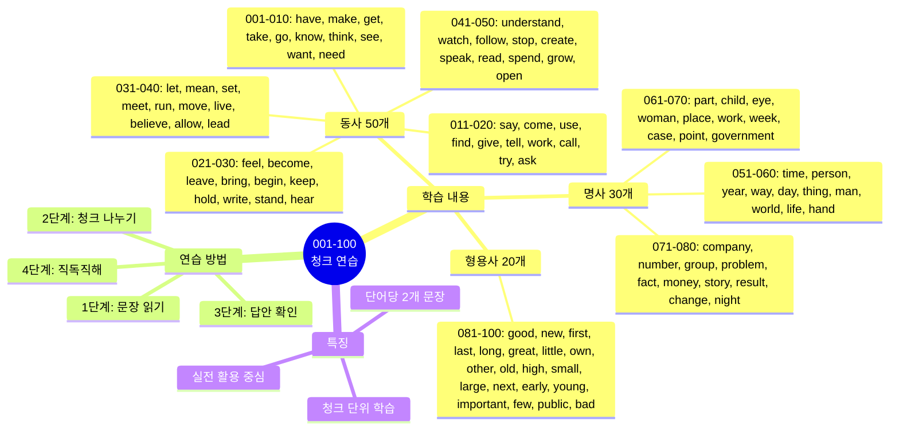
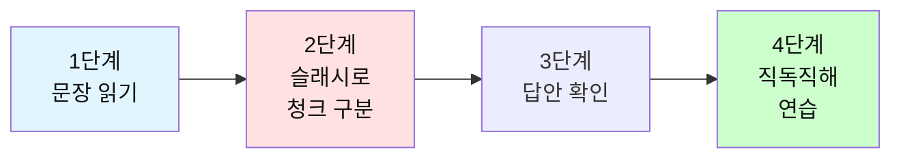

# 전설의 500단어 - 청크 나누기 연습 (001-100)

## 🎯 학습 구조 마인드맵



## 🎯 테스트 사용 방법

### 학습 단계


### 연습 방법

1. **문장 읽기**: 영어 문장을 소리내어 읽어보세요
2. **청크 나누기**: 의미 단위로 슬래시(/)로 구분해보세요
3. **답안 확인**: 제시된 청크 구분과 비교하세요
4. **직독직해**: 청크 순서대로 한국어로 해석하세요

---

## 📝 동사 (001-050)

이 파일은 **동사 50개 + 명사 30개 + 형용사 20개** = 총 100단어를 다룹니다.

**각 단어마다 2개의 문장으로 연습합니다.**

---

## 🔵 필수 동사 50개

### 001. have

**문장 1**
```
I have a question.
```

**여러분의 청크:**
```
_________________________________
```

**답안:**
```
I have / a question.
나는 가지고 있어 / 질문을
```

---

**문장 2**
```
We have to finish this project today.
```

**여러분의 청크:**
```
_________________________________
```

**답안:**
```
We have to / finish / this project / today.
우리는 해야 해 / 끝내야 / 이 프로젝트를 / 오늘
```

---

### 002. make

**문장 1**
```
Let's make a plan for tomorrow.
```

**여러분의 청크:**
```
_________________________________
```

**답안:**
```
Let's make / a plan / for tomorrow.
만들자 / 계획을 / 내일을 위한
```

---

**문장 2**
```
This news made me happy.
```

**여러분의 청크:**
```
_________________________________
```

**답안:**
```
This news / made me / happy.
이 소식이 / 만들었다 나를 / 행복하게
```

---

### 003. get

**문장 1**
```
I need to get some coffee before the meeting.
```

**여러분의 청크:**
```
_________________________________
```

**답안:**
```
I need to get / some coffee / before the meeting.
나는 필요해 얻을 / 커피를 / 회의 전에
```

---

**문장 2**
```
She's getting better every day.
```

**여러분의 청크:**
```
_________________________________
```

**답안:**
```
She's getting / better / every day.
그녀는 되고 있다 / 더 좋아지고 / 매일
```

---

### 004. take

**문장 1**
```
It takes about 30 minutes to get there.
```

**여러분의 청크:**
```
_________________________________
```

**답안:**
```
It takes / about 30 minutes / to get there.
걸린다 / 약 30분 / 거기 가는데
```

---

**문장 2**
```
Can you take this report to the manager?
```

**여러분의 청크:**
```
_________________________________
```

**답안:**
```
Can you take / this report / to the manager?
너 가져갈 수 있니 / 이 보고서를 / 매니저에게?
```

---

### 005. go

**문장 1**
```
Let's go to lunch together.
```

**여러분의 청크:**
```
_________________________________
```

**답안:**
```
Let's go / to lunch / together.
가자 / 점심 먹으러 / 함께
```

---

**문장 2**
```
How's it going with the project?
```

**여러분의 청크:**
```
_________________________________
```

**답안:**
```
How's it going / with the project?
어떻게 되가니 / 프로젝트는?
```

---

### 006. know

**문장 1**
```
Do you know how to use this software?
```

**여러분의 청크:**
```
_________________________________
```

**답안:**
```
Do you know / how to use / this software?
너 아니 / 사용하는 방법을 / 이 소프트웨어를?
```

---

**문장 2**
```
I don't know the answer yet.
```

**여러분의 청크:**
```
_________________________________
```

**답안:**
```
I don't know / the answer / yet.
나는 모르겠어 / 답을 / 아직
```

---

### 007. think

**문장 1**
```
I think this is a good idea.
```

**여러분의 청크:**
```
_________________________________
```

**답안:**
```
I think / this is / a good idea.
나는 생각해 / 이것이 / 좋은 아이디어라고
```

---

**문장 2**
```
What do you think about this proposal?
```

**여러분의 청크:**
```
_________________________________
```

**답안:**
```
What do you think / about this proposal?
너는 어떻게 생각하니 / 이 제안에 대해?
```

---

### 008. see

**문장 1**
```
I see what you mean.
```

**여러분의 청크:**
```
_________________________________
```

**답안:**
```
I see / what you mean.
나는 본다 / 네가 의미하는 것을
```

---

**문장 2**
```
Can I see you tomorrow morning?
```

**여러분의 청크:**
```
_________________________________
```

**답안:**
```
Can I see / you / tomorrow morning?
내가 볼 수 있을까 / 너를 / 내일 아침에?
```

---

### 009. want

**문장 1**
```
I want to learn more about this topic.
```

**여러분의 청크:**
```
_________________________________
```

**답안:**
```
I want to / learn / more about / this topic.
나는 원해 / 배우기를 / 더 많이 / 이 주제에 대해
```

---

**문장 2**
```
Do you want some help with that?
```

**여러분의 청크:**
```
_________________________________
```

**답안:**
```
Do you want / some help / with that?
너 원하니 / 도움을 / 그것과 함께?
```

---

### 010. need

**문장 1**
```
We need to discuss this issue in detail.
```

**여러분의 청크:**
```
_________________________________
```

**답안:**
```
We need to / discuss / this issue / in detail.
우리는 필요해 / 논의할 / 이 문제를 / 자세히
```

---

**문장 2**
```
I need more time to finish this task.
```

**여러분의 청크:**
```
_________________________________
```

**답안:**
```
I need / more time / to finish / this task.
나는 필요해 / 더 많은 시간이 / 끝내기 위해 / 이 작업을
```

---

### 011. say

**문장 1**
```
What did she say about the meeting?
```

**여러분의 청크:**
```
_________________________________
```

**답안:**
```
What did she say / about the meeting?
그녀가 뭐라고 말했니 / 회의에 대해?
```

---

**문장 2**
```
I'd say this is the best option.
```

**여러분의 청크:**
```
_________________________________
```

**답안:**
```
I'd say / this is / the best option.
나는 말하겠어 / 이것이 / 최선의 선택이라고
```

---

### 012. come

**문장 1**
```
Can you come to my office?
```

**여러분의 청크:**
```
_________________________________
```

**답안:**
```
Can you come / to my office?
너 올 수 있니 / 내 사무실로?
```

---

**문장 2**
```
The results came out yesterday.
```

**여러분의 청크:**
```
_________________________________
```

**답안:**
```
The results / came out / yesterday.
결과가 / 나왔다 / 어제
```

---

### 013. use

**문장 1**
```
How do you use this feature?
```

**여러분의 청크:**
```
_________________________________
```

**답안:**
```
How do you use / this feature?
어떻게 사용하니 / 이 기능을?
```

---

**문장 2**
```
We can use the conference room.
```

**여러분의 청크:**
```
_________________________________
```

**답안:**
```
We can use / the conference room.
우리는 사용할 수 있어 / 회의실을
```

---

### 014. find

**문장 1**
```
I can't find my keys anywhere.
```

**여러분의 청크:**
```
_________________________________
```

**답안:**
```
I can't find / my keys / anywhere.
나는 찾을 수 없어 / 내 열쇠를 / 어디에도
```

---

**문장 2**
```
Did you find the information you needed?
```

**여러분의 청크:**
```
_________________________________
```

**답안:**
```
Did you find / the information / you needed?
너 찾았니 / 정보를 / 네가 필요했던?
```

---

### 015. give

**문장 1**
```
Can you give me a hand with this?
```

**여러분의 청크:**
```
_________________________________
```

**답안:**
```
Can you give me / a hand / with this?
너 줄 수 있니 나에게 / 도움을 / 이것과 함께?
```

---

**문장 2**
```
She gave a great presentation.
```

**여러분의 청크:**
```
_________________________________
```

**답안:**
```
She gave / a great presentation.
그녀는 했어 / 훌륭한 발표를
```

---

### 016. tell

**문장 1**
```
Can you tell me the way to the station?
```

**여러분의 청크:**
```
_________________________________
```

**답안:**
```
Can you tell me / the way / to the station?
너 말해줄 수 있니 나에게 / 길을 / 역으로 가는?
```

---

**문장 2**
```
I told him about the changes.
```

**여러분의 청크:**
```
_________________________________
```

**답안:**
```
I told him / about the changes.
나는 말했어 그에게 / 변경사항에 대해
```

---

### 017. work

**문장 1**
```
I work at a tech company.
```

**여러분의 청크:**
```
_________________________________
```

**답안:**
```
I work / at a tech company.
나는 일해 / 기술 회사에서
```

---

**문장 2**
```
This solution works perfectly.
```

**여러분의 청크:**
```
_________________________________
```

**답안:**
```
This solution / works / perfectly.
이 해결책은 / 작동해 / 완벽하게
```

---

### 018. call

**문장 1**
```
I'll call you later today.
```

**여러분의 청크:**
```
_________________________________
```

**답안:**
```
I'll call you / later / today.
나는 전화할게 너에게 / 나중에 / 오늘
```

---

**문장 2**
```
They called off the meeting.
```

**여러분의 청크:**
```
_________________________________
```

**답안:**
```
They called off / the meeting.
그들은 취소했어 / 회의를
```

---

### 019. try

**문장 1**
```
Let's try a different approach.
```

**여러분의 청크:**
```
_________________________________
```

**답안:**
```
Let's try / a different approach.
시도해보자 / 다른 접근법을
```

---

**문장 2**
```
I'm trying to understand the issue.
```

**여러분의 청크:**
```
_________________________________
```

**답안:**
```
I'm trying to / understand / the issue.
나는 노력 중이야 / 이해하려고 / 문제를
```

---

### 020. ask

**문장 1**
```
Can I ask you a question?
```

**여러분의 청크:**
```
_________________________________
```

**답안:**
```
Can I ask you / a question?
내가 물어볼 수 있을까 너에게 / 질문을?
```

---

**문장 2**
```
She asked me to help her.
```

**여러분의 청크:**
```
_________________________________
```

**답안:**
```
She asked me / to help her.
그녀는 요청했어 나에게 / 그녀를 도와달라고
```

---

### 021. feel

**문장 1**
```
I feel much better now.
```

**여러분의 청크:**
```
_________________________________
```

**답안:**
```
I feel / much better / now.
나는 느껴 / 훨씬 더 나아 / 지금
```

---

**문장 2**
```
How do you feel about this decision?
```

**여러분의 청크:**
```
_________________________________
```

**답안:**
```
How do you feel / about this decision?
어떻게 느끼니 / 이 결정에 대해?
```

---

### 022. become

**문장 1**
```
She wants to become a manager.
```

**여러분의 청크:**
```
_________________________________
```

**답안:**
```
She wants to / become / a manager.
그녀는 원해 / 되기를 / 매니저가
```

---

**문장 2**
```
It's becoming more popular.
```

**여러분의 청크:**
```
_________________________________
```

**답안:**
```
It's becoming / more popular.
그것은 되고 있어 / 더 인기있게
```

---

### 023. leave

**문장 1**
```
What time do you leave work?
```

**여러분의 청크:**
```
_________________________________
```

**답안:**
```
What time / do you leave / work?
몇 시에 / 너는 떠나니 / 직장을?
```

---

**문장 2**
```
Don't leave without saying goodbye.
```

**여러분의 청크:**
```
_________________________________
```

**답안:**
```
Don't leave / without saying / goodbye.
떠나지 마 / 말하지 않고 / 안녕이라고
```

---

### 024. bring

**문장 1**
```
Please bring your laptop to the meeting.
```

**여러분의 청크:**
```
_________________________________
```

**답안:**
```
Please bring / your laptop / to the meeting.
가져와 주세요 / 네 노트북을 / 회의에
```

---

**문장 2**
```
This change will bring many benefits.
```

**여러분의 청크:**
```
_________________________________
```

**답안:**
```
This change / will bring / many benefits.
이 변화는 / 가져올 거야 / 많은 이익을
```

---

### 025. begin

**문장 1**
```
Let's begin with the basics.
```

**여러분의 청크:**
```
_________________________________
```

**답안:**
```
Let's begin / with the basics.
시작하자 / 기본부터
```

---

**문장 2**
```
The meeting will begin at 2 PM.
```

**여러분의 청크:**
```
_________________________________
```

**답안:**
```
The meeting / will begin / at 2 PM.
회의는 / 시작할 거야 / 오후 2시에
```

---

### 026. keep

**문장 1**
```
Keep up the good work!
```

**여러분의 청크:**
```
_________________________________
```

**답안:**
```
Keep up / the good work!
유지해 / 좋은 일을!
```

---

**문장 2**
```
I'll keep you updated.
```

**여러분의 청크:**
```
_________________________________
```

**답안:**
```
I'll keep you / updated.
나는 유지할 거야 너를 / 업데이트된 상태로
```

---

### 027. hold

**문장 1**
```
Can you hold this for a moment?
```

**여러분의 청크:**
```
_________________________________
```

**답안:**
```
Can you hold / this / for a moment?
너 잡아줄 수 있니 / 이것을 / 잠시?
```

---

**문장 2**
```
We're holding a meeting next week.
```

**여러분의 청크:**
```
_________________________________
```

**답안:**
```
We're holding / a meeting / next week.
우리는 개최할 거야 / 회의를 / 다음 주에
```

---

### 028. write

**문장 1**
```
I need to write a report.
```

**여러분의 청크:**
```
_________________________________
```

**답안:**
```
I need to / write / a report.
나는 필요해 / 쓸 / 보고서를
```

---

**문장 2**
```
She writes very clearly.
```

**여러분의 청크:**
```
_________________________________
```

**답안:**
```
She writes / very clearly.
그녀는 써 / 매우 명확하게
```

---

### 029. stand

**문장 1**
```
Please stand up.
```

**여러분의 청크:**
```
_________________________________
```

**답안:**
```
Please / stand up.
제발 / 일어서
```

---

**문장 2**
```
I can't stand this noise.
```

**여러분의 청크:**
```
_________________________________
```

**답안:**
```
I can't stand / this noise.
나는 견딜 수 없어 / 이 소음을
```

---

### 030. hear

**문장 1**
```
Did you hear the news?
```

**여러분의 청크:**
```
_________________________________
```

**답안:**
```
Did you hear / the news?
너 들었니 / 소식을?
```

---

**문장 2**
```
I hear you're moving to a new office.
```

**여러분의 청크:**
```
_________________________________
```

**답안:**
```
I hear / you're moving / to a new office.
나는 듣다 / 네가 이사한다고 / 새 사무실로
```

---

### 031. let

**문장 1**
```
Let me check my schedule.
```

**여러분의 청크:**
```
_________________________________
```

**답안:**
```
Let me check / my schedule.
나에게 확인하게 해줘 / 내 일정을
```

---

**문장 2**
```
Don't let this opportunity pass.
```

**여러분의 청크:**
```
_________________________________
```

**답안:**
```
Don't let / this opportunity / pass.
하지 마 / 이 기회가 / 지나가게
```

---

### 032. mean

**문장 1**
```
What does this word mean?
```

**여러분의 청크:**
```
_________________________________
```

**답안:**
```
What does / this word / mean?
무엇을 하니 / 이 단어가 / 의미하는?
```

---

**문장 2**
```
I didn't mean to hurt you.
```

**여러분의 청크:**
```
_________________________________
```

**답안:**
```
I didn't mean to / hurt you.
나는 의도하지 않았어 / 너를 상처입히려고
```

---

### 033. set

**문장 1**
```
Let's set a meeting time.
```

**여러분의 청크:**
```
_________________________________
```

**답안:**
```
Let's set / a meeting time.
정하자 / 회의 시간을
```

---

**문장 2**
```
The sun sets in the west.
```

**여러분의 청크:**
```
_________________________________
```

**답안:**
```
The sun / sets / in the west.
태양은 / 진다 / 서쪽으로
```

---

### 034. meet

**문장 1**
```
Nice to meet you.
```

**여러분의 청크:**
```
_________________________________
```

**답안:**
```
Nice / to meet you.
반가워 / 너를 만나서
```

---

**문장 2**
```
Let's meet at the coffee shop.
```

**여러분의 청크:**
```
_________________________________
```

**답안:**
```
Let's meet / at the coffee shop.
만나자 / 커피숍에서
```

---

### 035. run

**문장 1**
```
I run every morning.
```

**여러분의 청크:**
```
_________________________________
```

**답안:**
```
I run / every morning.
나는 뛰어 / 매일 아침
```

---

**문장 2**
```
Who runs this department?
```

**여러분의 청크:**
```
_________________________________
```

**답안:**
```
Who runs / this department?
누가 운영하니 / 이 부서를?
```

---

### 036. move

**문장 1**
```
We're moving to a new office.
```

**여러분의 청크:**
```
_________________________________
```

**답안:**
```
We're moving / to a new office.
우리는 이사해 / 새 사무실로
```

---

**문장 2**
```
Let's move on to the next topic.
```

**여러분의 청크:**
```
_________________________________
```

**답안:**
```
Let's move on / to the next topic.
넘어가자 / 다음 주제로
```

---

### 037. live

**문장 1**
```
I live near the office.
```

**여러분의 청크:**
```
_________________________________
```

**답안:**
```
I live / near the office.
나는 살아 / 사무실 근처에
```

---

**문장 2**
```
She has lived here for 10 years.
```

**여러분의 청크:**
```
_________________________________
```

**답안:**
```
She has lived / here / for 10 years.
그녀는 살아왔어 / 여기에 / 10년간
```

---

### 038. believe

**문장 1**
```
I believe we can do this.
```

**여러분의 청크:**
```
_________________________________
```

**답안:**
```
I believe / we can do / this.
나는 믿어 / 우리가 할 수 있다고 / 이것을
```

---

**문장 2**
```
Do you believe in teamwork?
```

**여러분의 청크:**
```
_________________________________
```

**답안:**
```
Do you believe / in teamwork?
너 믿니 / 팀워크를?
```

---

### 039. allow

**문장 1**
```
Please allow me to explain.
```

**여러분의 청크:**
```
_________________________________
```

**답안:**
```
Please allow me / to explain.
허락해주세요 나에게 / 설명하는 것을
```

---

**문장 2**
```
This system allows remote access.
```

**여러분의 청크:**
```
_________________________________
```

**답안:**
```
This system / allows / remote access.
이 시스템은 / 허용해 / 원격 접속을
```

---

### 040. lead

**문장 1**
```
She leads the marketing team.
```

**여러분의 청크:**
```
_________________________________
```

**답안:**
```
She leads / the marketing team.
그녀는 이끌어 / 마케팅 팀을
```

---

**문장 2**
```
This road leads to the city center.
```

**여러분의 청크:**
```
_________________________________
```

**답안:**
```
This road / leads / to the city center.
이 길은 / 이어져 / 도심으로
```

---

### 041. understand

**문장 1**
```
I understand your concern.
```

**여러분의 청크:**
```
_________________________________
```

**답안:**
```
I understand / your concern.
나는 이해해 / 네 우려를
```

---

**문장 2**
```
Do you understand the instructions?
```

**여러분의 청크:**
```
_________________________________
```

**답안:**
```
Do you understand / the instructions?
너 이해하니 / 지시사항들을?
```

---

### 042. watch

**문장 1**
```
Let's watch the presentation.
```

**여러분의 청크:**
```
_________________________________
```

**답안:**
```
Let's watch / the presentation.
보자 / 발표를
```

---

**문장 2**
```
Watch out for the deadline.
```

**여러분의 청크:**
```
_________________________________
```

**답안:**
```
Watch out / for the deadline.
조심해 / 마감일을
```

---

### 043. follow

**문장 1**
```
Please follow the instructions.
```

**여러분의 청크:**
```
_________________________________
```

**답안:**
```
Please follow / the instructions.
따라주세요 / 지시사항들을
```

---

**문장 2**
```
I'll follow up on this.
```

**여러분의 청크:**
```
_________________________________
```

**답안:**
```
I'll follow up / on this.
나는 후속 조치할 거야 / 이것에 대해
```

---

### 044. stop

**문장 1**
```
Please stop talking.
```

**여러분의 청크:**
```
_________________________________
```

**답안:**
```
Please / stop talking.
제발 / 그만 말해
```

---

**문장 2**
```
The project stopped due to budget issues.
```

**여러분의 청크:**
```
_________________________________
```

**답안:**
```
The project / stopped / due to budget issues.
프로젝트가 / 중단됐어 / 예산 문제로
```

---

### 045. create

**문장 1**
```
Let's create a new document.
```

**여러분의 청크:**
```
_________________________________
```

**답안:**
```
Let's create / a new document.
만들자 / 새 문서를
```

---

**문장 2**
```
This tool helps create presentations.
```

**여러분의 청크:**
```
_________________________________
```

**답안:**
```
This tool / helps create / presentations.
이 도구는 / 만드는 것을 도와 / 프레젠테이션을
```

---

### 046. speak

**문장 1**
```
Can you speak more slowly?
```

**여러분의 청크:**
```
_________________________________
```

**답안:**
```
Can you speak / more slowly?
너 말할 수 있니 / 더 천천히?
```

---

**문장 2**
```
She speaks three languages.
```

**여러분의 청크:**
```
_________________________________
```

**답안:**
```
She speaks / three languages.
그녀는 말해 / 세 개 언어를
```

---

### 047. read

**문장 1**
```
I read the report yesterday.
```

**여러분의 청크:**
```
_________________________________
```

**답안:**
```
I read / the report / yesterday.
나는 읽었어 / 보고서를 / 어제
```

---

**문장 2**
```
Please read this carefully.
```

**여러분의 청크:**
```
_________________________________
```

**답안:**
```
Please read / this / carefully.
읽어주세요 / 이것을 / 신중하게
```

---

### 048. spend

**문장 1**
```
I spend a lot of time on this.
```

**여러분의 청크:**
```
_________________________________
```

**답안:**
```
I spend / a lot of time / on this.
나는 써 / 많은 시간을 / 이것에
```

---

**문장 2**
```
How much did you spend?
```

**여러분의 청크:**
```
_________________________________
```

**답안:**
```
How much / did you spend?
얼마나 / 너는 썼니?
```

---

### 049. grow

**문장 1**
```
Our company is growing fast.
```

**여러분의 청크:**
```
_________________________________
```

**답안:**
```
Our company / is growing / fast.
우리 회사는 / 성장하고 있어 / 빠르게
```

---

**문장 2**
```
I want to grow my skills.
```

**여러분의 청크:**
```
_________________________________
```

**답안:**
```
I want to / grow / my skills.
나는 원해 / 키우기를 / 내 기술을
```

---

### 050. open

**문장 1**
```
Please open the window.
```

**여러분의 청크:**
```
_________________________________
```

**답안:**
```
Please / open / the window.
제발 / 열어 / 창문을
```

---

**문장 2**
```
The store opens at 9 AM.
```

**여러분의 청크:**
```
_________________________________
```

**답안:**
```
The store / opens / at 9 AM.
가게는 / 열어 / 오전 9시에
```

---

## 🟢 필수 명사 30개 (051-080)

### 051. time

**문장 1**
```
We don't have much time left.
```

**여러분의 청크:**
```
_________________________________
```

**답안:**
```
We don't have / much time / left.
우리는 가지고 있지 않아 / 많은 시간을 / 남은
```

---

**문장 2**
```
What time is the meeting?
```

**여러분의 청크:**
```
_________________________________
```

**답안:**
```
What time / is the meeting?
몇 시니 / 회의는?
```

---

### 052. person

**문장 1**
```
She's the right person for this job.
```

**여러분의 청크:**
```
_________________________________
```

**답안:**
```
She's / the right person / for this job.
그녀는 / 적합한 사람이야 / 이 직업에
```

---

**문장 2**
```
Every person has their own style.
```

**여러분의 청크:**
```
_________________________________
```

**답안:**
```
Every person / has / their own style.
모든 사람은 / 가지고 있어 / 그들 자신의 스타일을
```

---

### 053. year

**문장 1**
```
I've worked here for three years.
```

**여러분의 청크:**
```
_________________________________
```

**답안:**
```
I've worked here / for three years.
나는 일해왔어 여기서 / 3년간
```

---

**문장 2**
```
Happy New Year!
```

**여러분의 청크:**
```
_________________________________
```

**답안:**
```
Happy / New Year!
행복한 / 새해!
```

---

### 054. way

**문장 1**
```
Is this the right way to the station?
```

**여러분의 청크:**
```
_________________________________
```

**답안:**
```
Is this / the right way / to the station?
이것이니 / 올바른 길 / 역으로 가는?
```

---

**문장 2**
```
There's no way to solve this quickly.
```

**여러분의 청크:**
```
_________________________________
```

**답안:**
```
There's / no way / to solve this / quickly.
없어 / 방법이 / 이것을 해결할 / 빠르게
```

---

### 055. day

**문장 1**
```
Have a nice day!
```

**여러분의 청크:**
```
_________________________________
```

**답안:**
```
Have / a nice day!
가져 / 좋은 하루를!
```

---

**문장 2**
```
I work 8 hours a day.
```

**여러분의 청크:**
```
_________________________________
```

**답안:**
```
I work / 8 hours / a day.
나는 일해 / 8시간 / 하루에
```

---

### 056. thing

**문장 1**
```
The most important thing is quality.
```

**여러분의 청크:**
```
_________________________________
```

**답안:**
```
The most important thing / is / quality.
가장 중요한 것은 / ~이야 / 품질
```

---

**문장 2**
```
I have a few things to discuss.
```

**여러분의 청크:**
```
_________________________________
```

**답안:**
```
I have / a few things / to discuss.
나는 가지고 있어 / 몇 가지 것들을 / 논의할
```

---

### 057. man

**문장 1**
```
The man in the blue suit is our CEO.
```

**여러분의 청크:**
```
_________________________________
```

**답안:**
```
The man / in the blue suit / is our CEO.
남자는 / 파란 정장을 입은 / 우리 CEO야
```

---

**문장 2**
```
He's a man of his word.
```

**여러분의 청크:**
```
_________________________________
```

**답안:**
```
He's / a man / of his word.
그는 / 사람이야 / 자신의 말을 지키는
```

---

### 058. world

**문장 1**
```
The world is changing rapidly.
```

**여러분의 청크:**
```
_________________________________
```

**답안:**
```
The world / is changing / rapidly.
세계는 / 변하고 있어 / 빠르게
```

---

**문장 2**
```
Welcome to the real world.
```

**여러분의 청크:**
```
_________________________________
```

**답안:**
```
Welcome / to the real world.
환영해 / 현실 세계에
```

---

### 059. life

**문장 1**
```
Work-life balance is important.
```

**여러분의 청크:**
```
_________________________________
```

**답안:**
```
Work-life balance / is / important.
일과 삶의 균형은 / ~이야 / 중요한
```

---

**문장 2**
```
That's life.
```

**여러분의 청크:**
```
_________________________________
```

**답안:**
```
That's / life.
그것이 / 인생이야
```

---

### 060. hand

**문장 1**
```
Can you give me a hand?
```

**여러분의 청크:**
```
_________________________________
```

**답안:**
```
Can you give me / a hand?
너 줄 수 있니 나에게 / 도움을?
```

---

**문장 2**
```
Raise your hand if you have a question.
```

**여러분의 청크:**
```
_________________________________
```

**답안:**
```
Raise your hand / if you have / a question.
들어 네 손을 / 만약 네가 가지고 있으면 / 질문을
```

---

### 061. part

**문장 1**
```
This is an important part of the project.
```

**여러분의 청크:**
```
_________________________________
```

**답안:**
```
This is / an important part / of the project.
이것은 / 중요한 부분이야 / 프로젝트의
```

---

**문장 2**
```
I want to be part of the team.
```

**여러분의 청크:**
```
_________________________________
```

**답안:**
```
I want to / be part of / the team.
나는 원해 / 일부가 되기를 / 팀의
```

---

### 062. child

**문장 1**
```
She has two children.
```

**여러분의 청크:**
```
_________________________________
```

**답안:**
```
She has / two children.
그녀는 가지고 있어 / 두 명의 아이들을
```

---

**문장 2**
```
Every child deserves education.
```

**여러분의 청크:**
```
_________________________________
```

**답안:**
```
Every child / deserves / education.
모든 아이는 / 받을 자격이 있어 / 교육을
```

---

### 063. eye

**문장 1**
```
Keep your eyes on the screen.
```

**여러분의 청크:**
```
_________________________________
```

**답안:**
```
Keep / your eyes / on the screen.
유지해 / 네 눈을 / 화면에
```

---

**문장 2**
```
She has beautiful eyes.
```

**여러분의 청크:**
```
_________________________________
```

**답안:**
```
She has / beautiful eyes.
그녀는 가지고 있어 / 아름다운 눈을
```

---

### 064. woman

**문장 1**
```
She is a successful woman.
```

**여러분의 청크:**
```
_________________________________
```

**답안:**
```
She is / a successful woman.
그녀는 / 성공한 여성이야
```

---

**문장 2**
```
The woman in red is our director.
```

**여러분의 청크:**
```
_________________________________
```

**답안:**
```
The woman / in red / is our director.
여성은 / 빨간색 옷을 입은 / 우리 이사야
```

---

### 065. place

**문장 1**
```
This is a great place to work.
```

**여러분의 청크:**
```
_________________________________
```

**답안:**
```
This is / a great place / to work.
이것은 / 훌륭한 장소야 / 일하기에
```

---

**문장 2**
```
Let's meet at the usual place.
```

**여러분의 청크:**
```
_________________________________
```

**답안:**
```
Let's meet / at the usual place.
만나자 / 평소 장소에서
```

---

### 066. work

**문장 1**
```
I have a lot of work to do.
```

**여러분의 청크:**
```
_________________________________
```

**답안:**
```
I have / a lot of work / to do.
나는 가지고 있어 / 많은 일을 / 해야 할
```

---

**문장 2**
```
Great work on the project!
```

**여러분의 청크:**
```
_________________________________
```

**답안:**
```
Great work / on the project!
훌륭한 일이야 / 프로젝트에서!
```

---

### 067. week

**문장 1**
```
I'll see you next week.
```

**여러분의 청크:**
```
_________________________________
```

**답안:**
```
I'll see you / next week.
나는 볼 거야 너를 / 다음 주에
```

---

**문장 2**
```
This week has been very busy.
```

**여러분의 청크:**
```
_________________________________
```

**답안:**
```
This week / has been / very busy.
이번 주는 / 되어왔어 / 매우 바빴게
```

---

### 068. case

**문장 1**
```
In this case, we need to wait.
```

**여러분의 청크:**
```
_________________________________
```

**답안:**
```
In this case, / we need to / wait.
이 경우에는, / 우리는 필요해 / 기다릴
```

---

**문장 2**
```
Just in case, bring an umbrella.
```

**여러분의 청크:**
```
_________________________________
```

**답안:**
```
Just in case, / bring / an umbrella.
만약을 위해, / 가져와 / 우산을
```

---

### 069. point

**문장 1**
```
That's a good point.
```

**여러분의 청크:**
```
_________________________________
```

**답안:**
```
That's / a good point.
그것은 / 좋은 지적이야
```

---

**문장 2**
```
Let me point out the main issues.
```

**여러분의 청크:**
```
_________________________________
```

**답안:**
```
Let me point out / the main issues.
나에게 지적하게 해줘 / 주요 문제들을
```

---

### 070. government

**문장 1**
```
The government announced new policies.
```

**여러분의 청크:**
```
_________________________________
```

**답안:**
```
The government / announced / new policies.
정부가 / 발표했어 / 새 정책들을
```

---

**문장 2**
```
We need government support.
```

**여러분의 청크:**
```
_________________________________
```

**답안:**
```
We need / government support.
우리는 필요해 / 정부 지원이
```

---

### 071. company

**문장 1**
```
Which company do you work for?
```

**여러분의 청크:**
```
_________________________________
```

**답안:**
```
Which company / do you work for?
어느 회사에 / 너는 일하니?
```

---

**문장 2**
```
Our company is growing rapidly.
```

**여러분의 청크:**
```
_________________________________
```

**답안:**
```
Our company / is growing / rapidly.
우리 회사는 / 성장하고 있어 / 빠르게
```

---

### 072. number

**문장 1**
```
What's your phone number?
```

**여러분의 청크:**
```
_________________________________
```

**답안:**
```
What's / your phone number?
뭐니 / 네 전화번호는?
```

---

**문장 2**
```
The number of users is increasing.
```

**여러분의 청크:**
```
_________________________________
```

**답안:**
```
The number / of users / is increasing.
숫자가 / 사용자들의 / 증가하고 있어
```

---

### 073. group

**문장 1**
```
Let's work in groups.
```

**여러분의 청크:**
```
_________________________________
```

**답안:**
```
Let's work / in groups.
일하자 / 그룹으로
```

---

**문장 2**
```
This group is very productive.
```

**여러분의 청크:**
```
_________________________________
```

**답안:**
```
This group / is / very productive.
이 그룹은 / ~이야 / 매우 생산적인
```

---

### 074. problem

**문장 1**
```
We have a problem with the system.
```

**여러분의 청크:**
```
_________________________________
```

**답안:**
```
We have / a problem / with the system.
우리는 가지고 있어 / 문제를 / 시스템에
```

---

**문장 2**
```
No problem, I can help.
```

**여러분의 청크:**
```
_________________________________
```

**답안:**
```
No problem, / I can help.
문제없어, / 나는 도울 수 있어
```

---

### 075. fact

**문장 1**
```
That's a fact.
```

**여러분의 청크:**
```
_________________________________
```

**답안:**
```
That's / a fact.
그것은 / 사실이야
```

---

**문장 2**
```
In fact, I agree with you.
```

**여러분의 청크:**
```
_________________________________
```

**답안:**
```
In fact, / I agree / with you.
사실, / 나는 동의해 / 너와
```

---

### 076. money

**문장 1**
```
How much money do you need?
```

**여러분의 청크:**
```
_________________________________
```

**답안:**
```
How much money / do you need?
얼마나 많은 돈을 / 너는 필요하니?
```

---

**문장 2**
```
Money isn't everything.
```

**여러분의 청크:**
```
_________________________________
```

**답안:**
```
Money / isn't / everything.
돈은 / 아니야 / 전부가
```

---

### 077. story

**문장 1**
```
That's an interesting story.
```

**여러분의 청크:**
```
_________________________________
```

**답안:**
```
That's / an interesting story.
그것은 / 흥미로운 이야기야
```

---

**문장 2**
```
Let me tell you a story.
```

**여러분의 청크:**
```
_________________________________
```

**답안:**
```
Let me tell you / a story.
나에게 말하게 해줘 너에게 / 이야기를
```

---

### 078. result

**문장 1**
```
The results are very promising.
```

**여러분의 청크:**
```
_________________________________
```

**답안:**
```
The results / are / very promising.
결과들은 / ~이야 / 매우 유망한
```

---

**문장 2**
```
As a result, we decided to proceed.
```

**여러분의 청크:**
```
_________________________________
```

**답안:**
```
As a result, / we decided / to proceed.
결과적으로, / 우리는 결정했어 / 진행하기로
```

---

### 079. change

**문장 1**
```
We need to make some changes.
```

**여러분의 청크:**
```
_________________________________
```

**답안:**
```
We need to / make / some changes.
우리는 필요해 / 만들 / 몇 가지 변화를
```

---

**문장 2**
```
Change is inevitable.
```

**여러분의 청크:**
```
_________________________________
```

**답안:**
```
Change / is / inevitable.
변화는 / ~이야 / 불가피한
```

---

### 080. night

**문장 1**
```
Good night!
```

**여러분의 청크:**
```
_________________________________
```

**답안:**
```
Good / night!
좋은 / 밤 되세요!
```

---

**문장 2**
```
I work at night.
```

**여러분의 청크:**
```
_________________________________
```

**답안:**
```
I work / at night.
나는 일해 / 밤에
```

---

## 🔴 필수 형용사 20개 (081-100)

### 081. good

**문장 1**
```
This is a good opportunity for us.
```

**여러분의 청크:**
```
_________________________________
```

**답안:**
```
This is / a good opportunity / for us.
이것은 / 좋은 기회야 / 우리에게
```

---

**문장 2**
```
She's really good at problem solving.
```

**여러분의 청크:**
```
_________________________________
```

**답안:**
```
She's really good / at problem solving.
그녀는 정말 잘해 / 문제 해결을
```

---

### 082. new

**문장 1**
```
We're launching a new product next month.
```

**여러분의 청크:**
```
_________________________________
```

**답안:**
```
We're launching / a new product / next month.
우리는 출시할 거야 / 새 제품을 / 다음 달에
```

---

**문장 2**
```
I need to learn new skills.
```

**여러분의 청크:**
```
_________________________________
```

**답안:**
```
I need to / learn / new skills.
나는 필요해 / 배울 / 새로운 기술들을
```

---

### 083. first

**문장 1**
```
This is my first time here.
```

**여러분의 청크:**
```
_________________________________
```

**답안:**
```
This is / my first time / here.
이것은 / 내 첫 번째 시간이야 / 여기
```

---

**문장 2**
```
First, let's review the agenda.
```

**여러분의 청크:**
```
_________________________________
```

**답안:**
```
First, / let's review / the agenda.
먼저, / 검토하자 / 안건을
```

---

### 084. last

**문장 1**
```
This is the last chance we have.
```

**여러분의 청크:**
```
_________________________________
```

**답안:**
```
This is / the last chance / we have.
이것은 / 마지막 기회야 / 우리가 가진
```

---

**문장 2**
```
I saw him last week.
```

**여러분의 청크:**
```
_________________________________
```

**답안:**
```
I saw him / last week.
나는 봤어 그를 / 지난주에
```

---

### 085. long

**문장 1**
```
It's been a long day.
```

**여러분의 청크:**
```
_________________________________
```

**답안:**
```
It's been / a long day.
그것은 되었어 / 긴 하루가
```

---

**문장 2**
```
How long will it take?
```

**여러분의 청크:**
```
_________________________________
```

**답안:**
```
How long / will it take?
얼마나 오래 / 걸릴까?
```

---

### 086. great

**문장 1**
```
That's a great idea!
```

**여러분의 청크:**
```
_________________________________
```

**답안:**
```
That's / a great idea!
그것은 / 훌륭한 아이디어야!
```

---

**문장 2**
```
She did a great job on the project.
```

**여러분의 청크:**
```
_________________________________
```

**답안:**
```
She did / a great job / on the project.
그녀는 했어 / 훌륭한 일을 / 프로젝트에서
```

---

### 087. little

**문장 1**
```
Can I have a little more time?
```

**여러분의 청크:**
```
_________________________________
```

**답안:**
```
Can I have / a little more time?
내가 가질 수 있을까 / 조금 더 많은 시간을?
```

---

**문장 2**
```
Every little bit helps.
```

**여러분의 청크:**
```
_________________________________
```

**답안:**
```
Every little bit / helps.
모든 작은 것이 / 도움이 돼
```

---

### 088. own

**문장 1**
```
I have my own office now.
```

**여러분의 청크:**
```
_________________________________
```

**답안:**
```
I have / my own office / now.
나는 가지고 있어 / 내 자신의 사무실을 / 이제
```

---

**문장 2**
```
She owns a small business.
```

**여러분의 청크:**
```
_________________________________
```

**답안:**
```
She owns / a small business.
그녀는 소유해 / 작은 사업을
```

---

### 089. other

**문장 1**
```
Do you have any other questions?
```

**여러분의 청크:**
```
_________________________________
```

**답안:**
```
Do you have / any other questions?
너 가지고 있니 / 다른 질문들을?
```

---

**문장 2**
```
Let's try the other option.
```

**여러분의 청크:**
```
_________________________________
```

**답안:**
```
Let's try / the other option.
시도해보자 / 다른 선택을
```

---

### 090. old

**문장 1**
```
This is an old tradition.
```

**여러분의 청크:**
```
_________________________________
```

**답안:**
```
This is / an old tradition.
이것은 / 오래된 전통이야
```

---

**문장 2**
```
How old is this building?
```

**여러분의 청크:**
```
_________________________________
```

**답안:**
```
How old / is this building?
얼마나 오래됐니 / 이 건물은?
```

---

### 091. high

**문장 1**
```
The quality is very high.
```

**여러분의 청크:**
```
_________________________________
```

**답안:**
```
The quality / is / very high.
품질은 / ~이야 / 매우 높은
```

---

**문장 2**
```
We have high expectations.
```

**여러분의 청크:**
```
_________________________________
```

**답안:**
```
We have / high expectations.
우리는 가지고 있어 / 높은 기대를
```

---

### 092. small

**문장 1**
```
It's a small problem.
```

**여러분의 청크:**
```
_________________________________
```

**답안:**
```
It's / a small problem.
그것은 / 작은 문제야
```

---

**문장 2**
```
We need to start small.
```

**여러분의 청크:**
```
_________________________________
```

**답안:**
```
We need to / start / small.
우리는 필요해 / 시작할 / 작게
```

---

### 093. large

**문장 1**
```
This is a large project.
```

**여러분의 청크:**
```
_________________________________
```

**답안:**
```
This is / a large project.
이것은 / 큰 프로젝트야
```

---

**문장 2**
```
We have a large team.
```

**여러분의 청크:**
```
_________________________________
```

**답안:**
```
We have / a large team.
우리는 가지고 있어 / 큰 팀을
```

---

### 094. next

**문장 1**
```
See you next week.
```

**여러분의 청크:**
```
_________________________________
```

**답안:**
```
See you / next week.
봐 너를 / 다음 주에
```

---

**문장 2**
```
What's the next step?
```

**여러분의 청크:**
```
_________________________________
```

**답안:**
```
What's / the next step?
뭐니 / 다음 단계는?
```

---

### 095. early

**문장 1**
```
I arrived early today.
```

**여러분의 청크:**
```
_________________________________
```

**답안:**
```
I arrived / early / today.
나는 도착했어 / 일찍 / 오늘
```

---

**문장 2**
```
It's too early to decide.
```

**여러분의 청크:**
```
_________________________________
```

**답안:**
```
It's / too early / to decide.
그것은 / 너무 이르다 / 결정하기에
```

---

### 096. young

**문장 1**
```
She's very young.
```

**여러분의 청크:**
```
_________________________________
```

**답안:**
```
She's / very young.
그녀는 / 매우 젊어
```

---

**문장 2**
```
The company needs young talent.
```

**여러분의 청크:**
```
_________________________________
```

**답안:**
```
The company / needs / young talent.
회사는 / 필요해 / 젊은 인재가
```

---

### 097. important

**문장 1**
```
This is very important.
```

**여러분의 청크:**
```
_________________________________
```

**답안:**
```
This is / very important.
이것은 / 매우 중요해
```

---

**문장 2**
```
It's important to stay focused.
```

**여러분의 청크:**
```
_________________________________
```

**답안:**
```
It's important / to stay / focused.
중요해 / 유지하는 것이 / 집중된 상태를
```

---

### 098. few

**문장 1**
```
I have a few questions.
```

**여러분의 청크:**
```
_________________________________
```

**답안:**
```
I have / a few questions.
나는 가지고 있어 / 몇 가지 질문들을
```

---

**문장 2**
```
Few people know about this.
```

**여러분의 청크:**
```
_________________________________
```

**답안:**
```
Few people / know / about this.
적은 사람들이 / 알아 / 이것에 대해
```

---

### 099. public

**문장 1**
```
This is public information.
```

**여러분의 청크:**
```
_________________________________
```

**답안:**
```
This is / public information.
이것은 / 공개 정보야
```

---

**문장 2**
```
The event is open to the public.
```

**여러분의 청크:**
```
_________________________________
```

**답안:**
```
The event / is open / to the public.
행사는 / 열려있어 / 대중에게
```

---

### 100. bad

**문장 1**
```
That's not a bad idea.
```

**여러분의 청크:**
```
_________________________________
```

**답안:**
```
That's not / a bad idea.
그것은 아니야 / 나쁜 아이디어가
```

---

**문장 2**
```
I feel bad about what happened.
```

**여러분의 청크:**
```
_________________________________
```

**답안:**
```
I feel bad / about what happened.
나는 안 좋게 느껴 / 일어난 일에 대해
```

---

## 🎯 청크 나누기 핵심 팁

### 청크란?
- **의미 단위**: 함께 이해되는 단어 묶음
- **호흡 단위**: 한 번에 읽을 수 있는 덩어리
- **이해 단위**: 바로 해석 가능한 그룹

### 청크 나누는 기준

1. **주어 + 동사**: I have / We need to
2. **동사 + 목적어**: finish this / learn more
3. **전치사구**: in the office / for 5 years
4. **to 부정사구**: to finish / to learn
5. **접속사 앞뒤**: and / but / because

---

## 📝 학습 기록

### 진도 체크리스트
- [ ] 동사 001-010 연습 완료
- [ ] 동사 011-020 연습 완료
- [ ] 동사 021-030 연습 완료
- [ ] 동사 031-040 연습 완료
- [ ] 동사 041-050 연습 완료
- [ ] 명사 051-060 연습 완료
- [ ] 명사 061-070 연습 완료
- [ ] 명사 071-080 연습 완료
- [ ] 형용사 081-090 연습 완료
- [ ] 형용사 091-100 연습 완료

---

## 🎓 다음 파일

**계속 학습하기:**
- 📘 [청크 연습 101-200](./전설의_500단어_청크_연습_101-200.md) - 형용사/부사
- 📘 [청크 연습 201-300](./전설의_500단어_청크_연습_201-300.md) - 전치사/접속사
- 📘 [청크 연습 301-400](./전설의_500단어_청크_연습_301-400.md) - 동사/명사
- 📘 [청크 연습 401-500](./전설의_500단어_청크_연습_401-500.md) - 형용사/부사/명사

---

**💪 매일 10개씩 연습하면 10일이면 100단어 마스터!**

*청크 나누기는 개인차가 있을 수 있습니다. 제시된 답안은 기본 청크이며, 자신에게 편한 방식으로 조정해도 좋습니다.*

**Last Updated: 2026-01-11**
