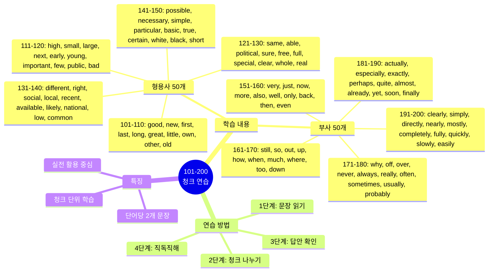
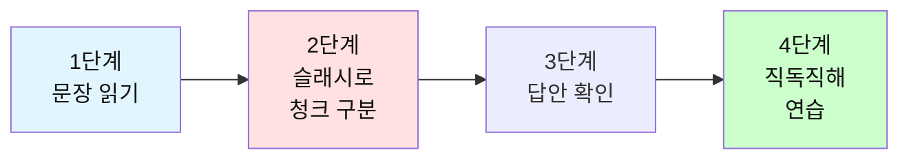

# 전설의 500단어 - 청크 나누기 연습 (101-200)

## 🎯 학습 구조 마인드맵



## 🎯 테스트 사용 방법

### 학습 단계


### 연습 방법

1. **문장 읽기**: 영어 문장을 소리내어 읽어보세요
2. **청크 나누기**: 의미 단위로 슬래시(/)로 구분해보세요
3. **답안 확인**: 제시된 청크 구분과 비교하세요
4. **직독직해**: 청크 순서대로 한국어로 해석하세요

---

## 📝 이 파일의 구성

**형용사 50개 + 부사 50개** = 총 100단어

**각 단어마다 2개의 문장으로 연습합니다.**

---

## 🔴 필수 형용사 50개 (101-150)

### 101. good

**문장 1**
```
This is a good opportunity for us.
```

**여러분의 청크:**
```
_________________________________
```

**답안:**
```
This is / a good opportunity / for us.
이것은 / 좋은 기회야 / 우리에게
```

---

**문장 2**
```
She's really good at problem solving.
```

**여러분의 청크:**
```
_________________________________
```

**답안:**
```
She's really good / at problem solving.
그녀는 정말 잘해 / 문제 해결을
```

---

### 102. new

**문장 1**
```
We're launching a new product next month.
```

**여러분의 청크:**
```
_________________________________
```

**답안:**
```
We're launching / a new product / next month.
우리는 출시할 거야 / 새 제품을 / 다음 달에
```

---

**문장 2**
```
I need to learn new skills.
```

**여러분의 청크:**
```
_________________________________
```

**답안:**
```
I need to / learn / new skills.
나는 필요해 / 배울 / 새로운 기술들을
```

---

### 103. first

**문장 1**
```
This is my first time here.
```

**여러분의 청크:**
```
_________________________________
```

**답안:**
```
This is / my first time / here.
이것은 / 내 첫 번째 시간이야 / 여기
```

---

**문장 2**
```
First, let's review the agenda.
```

**여러분의 청크:**
```
_________________________________
```

**답안:**
```
First, / let's review / the agenda.
먼저, / 검토하자 / 안건을
```

---

### 104. last

**문장 1**
```
This is the last chance we have.
```

**여러분의 청크:**
```
_________________________________
```

**답안:**
```
This is / the last chance / we have.
이것은 / 마지막 기회야 / 우리가 가진
```

---

**문장 2**
```
I saw him last week.
```

**여러분의 청크:**
```
_________________________________
```

**답안:**
```
I saw him / last week.
나는 봤어 그를 / 지난주에
```

---

### 105. long

**문장 1**
```
It's been a long day.
```

**여러분의 청크:**
```
_________________________________
```

**답안:**
```
It's been / a long day.
그것은 되었어 / 긴 하루가
```

---

**문장 2**
```
How long will it take?
```

**여러분의 청크:**
```
_________________________________
```

**답안:**
```
How long / will it take?
얼마나 오래 / 걸릴까?
```

---

### 106. great

**문장 1**
```
That's a great idea!
```

**여러분의 청크:**
```
_________________________________
```

**답안:**
```
That's / a great idea!
그것은 / 훌륭한 아이디어야!
```

---

**문장 2**
```
She did a great job on the project.
```

**여러분의 청크:**
```
_________________________________
```

**답안:**
```
She did / a great job / on the project.
그녀는 했어 / 훌륭한 일을 / 프로젝트에서
```

---

### 107. little

**문장 1**
```
Can I have a little more time?
```

**여러분의 청크:**
```
_________________________________
```

**답안:**
```
Can I have / a little more time?
내가 가질 수 있을까 / 조금 더 많은 시간을?
```

---

**문장 2**
```
Every little bit helps.
```

**여러분의 청크:**
```
_________________________________
```

**답안:**
```
Every little bit / helps.
모든 작은 것이 / 도움이 돼
```

---

### 108. own

**문장 1**
```
I have my own office now.
```

**여러분의 청크:**
```
_________________________________
```

**답안:**
```
I have / my own office / now.
나는 가지고 있어 / 내 자신의 사무실을 / 이제
```

---

**문장 2**
```
She owns a small business.
```

**여러분의 청크:**
```
_________________________________
```

**답안:**
```
She owns / a small business.
그녀는 소유해 / 작은 사업을
```

---

### 109. other

**문장 1**
```
Do you have any other questions?
```

**여러분의 청크:**
```
_________________________________
```

**답안:**
```
Do you have / any other questions?
너 가지고 있니 / 다른 질문들을?
```

---

**문장 2**
```
Let's try the other option.
```

**여러분의 청크:**
```
_________________________________
```

**답안:**
```
Let's try / the other option.
시도해보자 / 다른 선택을
```

---

### 110. old

**문장 1**
```
This is an old tradition.
```

**여러분의 청크:**
```
_________________________________
```

**답안:**
```
This is / an old tradition.
이것은 / 오래된 전통이야
```

---

**문장 2**
```
How old is this building?
```

**여러분의 청크:**
```
_________________________________
```

**답안:**
```
How old / is this building?
얼마나 오래됐니 / 이 건물은?
```

---

### 111. high

**문장 1**
```
The quality is very high.
```

**여러분의 청크:**
```
_________________________________
```

**답안:**
```
The quality / is / very high.
품질은 / ~이야 / 매우 높은
```

---

**문장 2**
```
We have high expectations.
```

**여러분의 청크:**
```
_________________________________
```

**답안:**
```
We have / high expectations.
우리는 가지고 있어 / 높은 기대를
```

---

### 112. small

**문장 1**
```
It's a small problem.
```

**여러분의 청크:**
```
_________________________________
```

**답안:**
```
It's / a small problem.
그것은 / 작은 문제야
```

---

**문장 2**
```
We need to start small.
```

**여러분의 청크:**
```
_________________________________
```

**답안:**
```
We need to / start / small.
우리는 필요해 / 시작할 / 작게
```

---

### 113. large

**문장 1**
```
This is a large project.
```

**여러분의 청크:**
```
_________________________________
```

**답안:**
```
This is / a large project.
이것은 / 큰 프로젝트야
```

---

**문장 2**
```
We have a large team.
```

**여러분의 청크:**
```
_________________________________
```

**답안:**
```
We have / a large team.
우리는 가지고 있어 / 큰 팀을
```

---

### 114. next

**문장 1**
```
See you next week.
```

**여러분의 청크:**
```
_________________________________
```

**답안:**
```
See you / next week.
봐 너를 / 다음 주에
```

---

**문장 2**
```
What's the next step?
```

**여러분의 청크:**
```
_________________________________
```

**답안:**
```
What's / the next step?
뭐니 / 다음 단계는?
```

---

### 115. early

**문장 1**
```
I arrived early today.
```

**여러분의 청크:**
```
_________________________________
```

**답안:**
```
I arrived / early / today.
나는 도착했어 / 일찍 / 오늘
```

---

**문장 2**
```
It's too early to decide.
```

**여러분의 청크:**
```
_________________________________
```

**답안:**
```
It's / too early / to decide.
그것은 / 너무 이르다 / 결정하기에
```

---

### 116. young

**문장 1**
```
She's very young.
```

**여러분의 청크:**
```
_________________________________
```

**답안:**
```
She's / very young.
그녀는 / 매우 젊어
```

---

**문장 2**
```
The company needs young talent.
```

**여러분의 청크:**
```
_________________________________
```

**답안:**
```
The company / needs / young talent.
회사는 / 필요해 / 젊은 인재가
```

---

### 117. important

**문장 1**
```
This is very important.
```

**여러분의 청크:**
```
_________________________________
```

**답안:**
```
This is / very important.
이것은 / 매우 중요해
```

---

**문장 2**
```
It's important to stay focused.
```

**여러분의 청크:**
```
_________________________________
```

**답안:**
```
It's important / to stay / focused.
중요해 / 유지하는 것이 / 집중된 상태를
```

---

### 118. few

**문장 1**
```
I have a few questions.
```

**여러분의 청크:**
```
_________________________________
```

**답안:**
```
I have / a few questions.
나는 가지고 있어 / 몇 가지 질문들을
```

---

**문장 2**
```
Few people know about this.
```

**여러분의 청크:**
```
_________________________________
```

**답안:**
```
Few people / know / about this.
적은 사람들이 / 알아 / 이것에 대해
```

---

### 119. public

**문장 1**
```
This is public information.
```

**여러분의 청크:**
```
_________________________________
```

**답안:**
```
This is / public information.
이것은 / 공개 정보야
```

---

**문장 2**
```
The event is open to the public.
```

**여러분의 청크:**
```
_________________________________
```

**답안:**
```
The event / is open / to the public.
행사는 / 열려있어 / 대중에게
```

---

### 120. bad

**문장 1**
```
That's not a bad idea.
```

**여러분의 청크:**
```
_________________________________
```

**답안:**
```
That's not / a bad idea.
그것은 아니야 / 나쁜 아이디어가
```

---

**문장 2**
```
I feel bad about what happened.
```

**여러분의 청크:**
```
_________________________________
```

**답안:**
```
I feel bad / about what happened.
나는 안 좋게 느껴 / 일어난 일에 대해
```

---

### 121. same

**문장 1**
```
We have the same problem.
```

**여러분의 청크:**
```
_________________________________
```

**답안:**
```
We have / the same problem.
우리는 가지고 있어 / 같은 문제를
```

---

**문장 2**
```
At the same time, we need to be careful.
```

**여러분의 청크:**
```
_________________________________
```

**답안:**
```
At the same time, / we need to / be careful.
동시에, / 우리는 필요해 / 조심할
```

---

### 122. able

**문장 1**
```
Are you able to come tomorrow?
```

**여러분의 청크:**
```
_________________________________
```

**답안:**
```
Are you able to / come / tomorrow?
너 할 수 있니 / 오는 것을 / 내일?
```

---

**문장 2**
```
She's able to handle this situation.
```

**여러분의 청크:**
```
_________________________________
```

**답안:**
```
She's able to / handle / this situation.
그녀는 할 수 있어 / 다루는 것을 / 이 상황을
```

---

### 123. political

**문장 1**
```
This is a political issue.
```

**여러분의 청크:**
```
_________________________________
```

**답안:**
```
This is / a political issue.
이것은 / 정치적 문제야
```

---

**문장 2**
```
He has political experience.
```

**여러분의 청크:**
```
_________________________________
```

**답안:**
```
He has / political experience.
그는 가지고 있어 / 정치적 경험을
```

---

### 124. sure

**문장 1**
```
I'm not sure about that.
```

**여러분의 청크:**
```
_________________________________
```

**답안:**
```
I'm not sure / about that.
나는 확신하지 못해 / 그것에 대해
```

---

**문장 2**
```
Make sure you double-check everything.
```

**여러분의 청크:**
```
_________________________________
```

**답안:**
```
Make sure / you double-check / everything.
확실히 해 / 네가 재확인하는 것을 / 모든 것을
```

---

### 125. free

**문장 1**
```
Are you free this afternoon?
```

**여러분의 청크:**
```
_________________________________
```

**답안:**
```
Are you free / this afternoon?
너 시간 있니 / 오늘 오후에?
```

---

**문장 2**
```
This service is completely free.
```

**여러분의 청크:**
```
_________________________________
```

**답안:**
```
This service / is / completely free.
이 서비스는 / ~이야 / 완전히 무료인
```

---

### 126. full

**문장 1**
```
The room is full.
```

**여러분의 청크:**
```
_________________________________
```

**답안:**
```
The room / is / full.
방은 / ~이야 / 가득 찬
```

---

**문장 2**
```
Please give me your full attention.
```

**여러분의 청크:**
```
_________________________________
```

**답안:**
```
Please give me / your full attention.
주세요 나에게 / 네 완전한 주의를
```

---

### 127. special

**문장 1**
```
This is a special occasion.
```

**여러분의 청크:**
```
_________________________________
```

**답안:**
```
This is / a special occasion.
이것은 / 특별한 경우야
```

---

**문장 2**
```
We have a special offer today.
```

**여러분의 청크:**
```
_________________________________
```

**답안:**
```
We have / a special offer / today.
우리는 가지고 있어 / 특별한 제안을 / 오늘
```

---

### 128. clear

**문장 1**
```
Is that clear to everyone?
```

**여러분의 청크:**
```
_________________________________
```

**답안:**
```
Is that clear / to everyone?
그것이 명확하니 / 모두에게?
```

---

**문장 2**
```
Let me make this clear.
```

**여러분의 청크:**
```
_________________________________
```

**답안:**
```
Let me make / this / clear.
나에게 만들게 해줘 / 이것을 / 명확하게
```

---

### 129. whole

**문장 1**
```
The whole team is here.
```

**여러분의 청크:**
```
_________________________________
```

**답안:**
```
The whole team / is / here.
전체 팀이 / 있어 / 여기
```

---

**문장 2**
```
I spent the whole day working.
```

**여러분의 청크:**
```
_________________________________
```

**답안:**
```
I spent / the whole day / working.
나는 보냈어 / 하루 종일을 / 일하면서
```

---

### 130. real

**문장 1**
```
This is a real problem.
```

**여러분의 청크:**
```
_________________________________
```

**답안:**
```
This is / a real problem.
이것은 / 진짜 문제야
```

---

**문장 2**
```
Is this story real?
```

**여러분의 청크:**
```
_________________________________
```

**답안:**
```
Is / this story / real?
~이니 / 이 이야기가 / 진짜?
```

---

### 131. different

**문장 1**
```
We need a different approach.
```

**여러분의 청크:**
```
_________________________________
```

**답안:**
```
We need / a different approach.
우리는 필요해 / 다른 접근법이
```

---

**문장 2**
```
Everyone has different opinions.
```

**여러분의 청크:**
```
_________________________________
```

**답안:**
```
Everyone has / different opinions.
모두가 가지고 있어 / 다른 의견들을
```

---

### 132. right

**문장 1**
```
You're absolutely right.
```

**여러분의 청크:**
```
_________________________________
```

**답안:**
```
You're / absolutely right.
너는 / 완전히 옳아
```

---

**문장 2**
```
Is this the right way?
```

**여러분의 청크:**
```
_________________________________
```

**답안:**
```
Is this / the right way?
이것이니 / 올바른 길?
```

---

### 133. social

**문장 1**
```
Social media is very powerful.
```

**여러분의 청크:**
```
_________________________________
```

**답안:**
```
Social media / is / very powerful.
소셜 미디어는 / ~이야 / 매우 강력한
```

---

**문장 2**
```
We have good social skills.
```

**여러분의 청크:**
```
_________________________________
```

**답안:**
```
We have / good social skills.
우리는 가지고 있어 / 좋은 사회적 기술을
```

---

### 134. local

**문장 1**
```
Support your local businesses.
```

**여러분의 청크:**
```
_________________________________
```

**답안:**
```
Support / your local businesses.
지원해 / 네 지역 사업들을
```

---

**문장 2**
```
This is a local issue.
```

**여러분의 청크:**
```
_________________________________
```

**답안:**
```
This is / a local issue.
이것은 / 지역 문제야
```

---

### 135. recent

**문장 1**
```
Have you seen the recent report?
```

**여러분의 청크:**
```
_________________________________
```

**답안:**
```
Have you seen / the recent report?
너 봤니 / 최근 보고서를?
```

---

**문장 2**
```
This is a recent development.
```

**여러분의 청크:**
```
_________________________________
```

**답안:**
```
This is / a recent development.
이것은 / 최근 발전이야
```

---

### 136. available

**문장 1**
```
Are you available tomorrow?
```

**여러분의 청크:**
```
_________________________________
```

**답안:**
```
Are you available / tomorrow?
너 시간 있니 / 내일?
```

---

**문장 2**
```
This service is available 24/7.
```

**여러분의 청크:**
```
_________________________________
```

**답안:**
```
This service / is available / 24/7.
이 서비스는 / 이용 가능해 / 24시간 연중무휴
```

---

### 137. likely

**문장 1**
```
It's likely to rain tomorrow.
```

**여러분의 청크:**
```
_________________________________
```

**답안:**
```
It's likely to / rain / tomorrow.
~일 것 같아 / 비가 올 / 내일
```

---

**문장 2**
```
She's the most likely candidate.
```

**여러분의 청크:**
```
_________________________________
```

**답안:**
```
She's / the most likely candidate.
그녀는 / 가장 가능성 높은 후보야
```

---

### 138. national

**문장 1**
```
This is a national holiday.
```

**여러분의 청크:**
```
_________________________________
```

**답안:**
```
This is / a national holiday.
이것은 / 국경일이야
```

---

**문장 2**
```
We need national support.
```

**여러분의 청크:**
```
_________________________________
```

**답안:**
```
We need / national support.
우리는 필요해 / 국가적 지원이
```

---

### 139. low

**문장 1**
```
The price is very low.
```

**여러분의 청크:**
```
_________________________________
```

**답안:**
```
The price / is / very low.
가격이 / ~이야 / 매우 낮은
```

---

**문장 2**
```
We have low expectations.
```

**여러분의 청크:**
```
_________________________________
```

**답안:**
```
We have / low expectations.
우리는 가지고 있어 / 낮은 기대를
```

---

### 140. common

**문장 1**
```
This is a common problem.
```

**여러분의 청크:**
```
_________________________________
```

**답안:**
```
This is / a common problem.
이것은 / 흔한 문제야
```

---

**문장 2**
```
We have a common goal.
```

**여러분의 청크:**
```
_________________________________
```

**답안:**
```
We have / a common goal.
우리는 가지고 있어 / 공통의 목표를
```

---

### 141. possible

**문장 1**
```
Is it possible to finish by tomorrow?
```

**여러분의 청크:**
```
_________________________________
```

**답안:**
```
Is it possible / to finish / by tomorrow?
가능하니 / 끝내는 것이 / 내일까지?
```

---

**문장 2**
```
We'll do everything possible.
```

**여러분의 청크:**
```
_________________________________
```

**답안:**
```
We'll do / everything possible.
우리는 할 거야 / 가능한 모든 것을
```

---

### 142. necessary

**문장 1**
```
Is this really necessary?
```

**여러분의 청크:**
```
_________________________________
```

**답안:**
```
Is this / really necessary?
이것이 / 정말 필요하니?
```

---

**문장 2**
```
It's necessary to make changes.
```

**여러분의 청크:**
```
_________________________________
```

**답안:**
```
It's necessary / to make / changes.
필요해 / 만드는 것이 / 변화를
```

---

### 143. simple

**문장 1**
```
The solution is very simple.
```

**여러분의 청크:**
```
_________________________________
```

**답안:**
```
The solution / is / very simple.
해결책은 / ~이야 / 매우 간단한
```

---

**문장 2**
```
Let me explain in simple terms.
```

**여러분의 청크:**
```
_________________________________
```

**답안:**
```
Let me explain / in simple terms.
나에게 설명하게 해줘 / 간단한 말로
```

---

### 144. particular

**문장 1**
```
Do you have any particular preference?
```

**여러분의 청크:**
```
_________________________________
```

**답안:**
```
Do you have / any particular preference?
너 가지고 있니 / 특별한 선호를?
```

---

**문장 2**
```
This particular case is interesting.
```

**여러분의 청크:**
```
_________________________________
```

**답안:**
```
This particular case / is / interesting.
이 특별한 경우는 / ~이야 / 흥미로운
```

---

### 145. basic

**문장 1**
```
These are the basic requirements.
```

**여러분의 청크:**
```
_________________________________
```

**답안:**
```
These are / the basic requirements.
이것들은 / 기본 요구사항들이야
```

---

**문장 2**
```
I need basic information.
```

**여러분의 청크:**
```
_________________________________
```

**답안:**
```
I need / basic information.
나는 필요해 / 기본 정보가
```

---

### 146. true

**문장 1**
```
Is this story true?
```

**여러분의 청크:**
```
_________________________________
```

**답안:**
```
Is / this story / true?
~이니 / 이 이야기가 / 진실인?
```

---

**문장 2**
```
That's true!
```

**여러분의 청크:**
```
_________________________________
```

**답안:**
```
That's / true!
그것은 / 사실이야!
```

---

### 147. certain

**문장 1**
```
I'm certain about this.
```

**여러분의 청크:**
```
_________________________________
```

**답안:**
```
I'm certain / about this.
나는 확신해 / 이것에 대해
```

---

**문장 2**
```
Certain conditions must be met.
```

**여러분의 청크:**
```
_________________________________
```

**답안:**
```
Certain conditions / must be met.
특정 조건들이 / 충족되어야 해
```

---

### 148. white

**문장 1**
```
She's wearing a white shirt.
```

**여러분의 청크:**
```
_________________________________
```

**답안:**
```
She's wearing / a white shirt.
그녀는 입고 있어 / 흰색 셔츠를
```

---

**문장 2**
```
The walls are painted white.
```

**여러분의 청크:**
```
_________________________________
```

**답안:**
```
The walls / are painted / white.
벽들은 / 칠해져 있어 / 흰색으로
```

---

### 149. black

**문장 1**
```
He always wears black.
```

**여러분의 청크:**
```
_________________________________
```

**답안:**
```
He always wears / black.
그는 항상 입어 / 검은색을
```

---

**문장 2**
```
I need a black pen.
```

**여러분의 청크:**
```
_________________________________
```

**답안:**
```
I need / a black pen.
나는 필요해 / 검은색 펜이
```

---

### 150. short

**문장 1**
```
This is a short meeting.
```

**여러분의 청크:**
```
_________________________________
```

**답안:**
```
This is / a short meeting.
이것은 / 짧은 회의야
```

---

**문장 2**
```
I'll keep it short.
```

**여러분의 청크:**
```
_________________________________
```

**답안:**
```
I'll keep it / short.
나는 유지할 거야 그것을 / 짧게
```

---

## 🟡 필수 부사 50개 (151-200)

### 151. very

**문장 1**
```
This is very important.
```

**여러분의 청크:**
```
_________________________________
```

**답안:**
```
This is / very important.
이것은 / 매우 중요해
```

---

**문장 2**
```
I'm very pleased with the results.
```

**여러분의 청크:**
```
_________________________________
```

**답안:**
```
I'm very pleased / with the results.
나는 매우 기뻐 / 결과에
```

---

### 152. just

**문장 1**
```
I just finished the report.
```

**여러분의 청크:**
```
_________________________________
```

**답안:**
```
I just finished / the report.
나는 막 끝냈어 / 보고서를
```

---

**문장 2**
```
Just let me know when you're ready.
```

**여러분의 청크:**
```
_________________________________
```

**답안:**
```
Just let me know / when you're ready.
그냥 알려줘 나에게 / 네가 준비됐을 때
```

---

### 153. now

**문장 1**
```
We need to decide now.
```

**여러분의 청크:**
```
_________________________________
```

**답안:**
```
We need to / decide / now.
우리는 필요해 / 결정할 / 지금
```

---

**문장 2**
```
Right now, I'm working on a project.
```

**여러분의 청크:**
```
_________________________________
```

**답안:**
```
Right now, / I'm working on / a project.
바로 지금, / 나는 작업 중이야 / 프로젝트를
```

---

### 154. more

**문장 1**
```
Can you give me more details?
```

**여러분의 청크:**
```
_________________________________
```

**답안:**
```
Can you give me / more details?
너 줄 수 있니 나에게 / 더 많은 세부사항을?
```

---

**문장 2**
```
I need more time to think.
```

**여러분의 청크:**
```
_________________________________
```

**답안:**
```
I need / more time / to think.
나는 필요해 / 더 많은 시간이 / 생각할
```

---

### 155. also

**문장 1**
```
I also agree with this plan.
```

**여러분의 청크:**
```
_________________________________
```

**답안:**
```
I also agree / with this plan.
나도 동의해 / 이 계획에
```

---

**문장 2**
```
She's also working on the project.
```

**여러분의 청크:**
```
_________________________________
```

**답안:**
```
She's also working / on the project.
그녀도 작업 중이야 / 프로젝트를
```

---

### 156. well

**문장 1**
```
Everything is going well.
```

**여러분의 청크:**
```
_________________________________
```

**답안:**
```
Everything / is going / well.
모든 것이 / 되고 있어 / 잘
```

---

**문장 2**
```
She speaks English very well.
```

**여러분의 청크:**
```
_________________________________
```

**답안:**
```
She speaks / English / very well.
그녀는 말해 / 영어를 / 매우 잘
```

---

### 157. only

**문장 1**
```
I only have five minutes.
```

**여러분의 청크:**
```
_________________________________
```

**답안:**
```
I only have / five minutes.
나는 단지 가지고 있어 / 5분만
```

---

**문장 2**
```
This is the only way.
```

**여러분의 청크:**
```
_________________________________
```

**답안:**
```
This is / the only way.
이것은 / 유일한 방법이야
```

---

### 158. back

**문장 1**
```
I'll be back in 10 minutes.
```

**여러분의 청크:**
```
_________________________________
```

**답안:**
```
I'll be back / in 10 minutes.
나는 돌아올 거야 / 10분 안에
```

---

**문장 2**
```
Can you call me back?
```

**여러분의 청크:**
```
_________________________________
```

**답안:**
```
Can you call me / back?
너 전화할 수 있니 나에게 / 다시?
```

---

### 159. then

**문장 1**
```
First this, then that.
```

**여러분의 청크:**
```
_________________________________
```

**답안:**
```
First this, / then / that.
먼저 이것, / 그런 다음 / 저것
```

---

**문장 2**
```
I was busy back then.
```

**여러분의 청크:**
```
_________________________________
```

**답안:**
```
I was busy / back then.
나는 바빴어 / 그때
```

---

### 160. even

**문장 1**
```
Even I can do this.
```

**여러분의 청크:**
```
_________________________________
```

**답안:**
```
Even I / can do / this.
심지어 나도 / 할 수 있어 / 이것을
```

---

**문장 2**
```
It's even better than before.
```

**여러분의 청크:**
```
_________________________________
```

**답안:**
```
It's even better / than before.
그것은 더욱 나아 / 이전보다
```

---

### 161. still

**문장 1**
```
I'm still working on it.
```

**여러분의 청크:**
```
_________________________________
```

**답안:**
```
I'm still working / on it.
나는 아직도 작업 중이야 / 그것을
```

---

**문장 2**
```
Are you still there?
```

**여러분의 청크:**
```
_________________________________
```

**답안:**
```
Are you / still there?
너 있니 / 아직 거기에?
```

---

### 162. so

**문장 1**
```
This is so important.
```

**여러분의 청크:**
```
_________________________________
```

**답안:**
```
This is / so important.
이것은 / 너무 중요해
```

---

**문장 2**
```
So, what do you think?
```

**여러분의 청크:**
```
_________________________________
```

**답안:**
```
So, / what do you think?
그래서, / 너는 어떻게 생각하니?
```

---

### 163. out

**문장 1**
```
Let's go out for lunch.
```

**여러분의 청크:**
```
_________________________________
```

**답안:**
```
Let's go out / for lunch.
나가자 / 점심 먹으러
```

---

**문장 2**
```
Check it out!
```

**여러분의 청크:**
```
_________________________________
```

**답안:**
```
Check / it out!
확인해봐 / 그것을!
```

---

### 164. up

**문장 1**
```
Wake up early.
```

**여러분의 청크:**
```
_________________________________
```

**답안:**
```
Wake up / early.
일어나 / 일찍
```

---

**문장 2**
```
The price went up.
```

**여러분의 청크:**
```
_________________________________
```

**답안:**
```
The price / went up.
가격이 / 올랐어
```

---

### 165. how

**문장 1**
```
How are you?
```

**여러분의 청크:**
```
_________________________________
```

**답안:**
```
How / are you?
어때 / 너는?
```

---

**문장 2**
```
Show me how to do this.
```

**여러분의 청크:**
```
_________________________________
```

**답안:**
```
Show me / how to do / this.
보여줘 나에게 / 하는 방법을 / 이것을
```

---

### 166. when

**문장 1**
```
When is the meeting?
```

**여러분의 청크:**
```
_________________________________
```

**답안:**
```
When / is the meeting?
언제니 / 회의는?
```

---

**문장 2**
```
Let me know when you're ready.
```

**여러분의 청크:**
```
_________________________________
```

**답안:**
```
Let me know / when you're ready.
알려줘 나에게 / 네가 준비됐을 때
```

---

### 167. much

**문장 1**
```
How much is this?
```

**여러분의 청크:**
```
_________________________________
```

**답안:**
```
How much / is this?
얼마니 / 이것은?
```

---

**문장 2**
```
Thank you so much.
```

**여러분의 청크:**
```
_________________________________
```

**답안:**
```
Thank you / so much.
감사합니다 / 매우
```

---

### 168. where

**문장 1**
```
Where is the office?
```

**여러분의 청크:**
```
_________________________________
```

**답안:**
```
Where / is the office?
어디니 / 사무실은?
```

---

**문장 2**
```
I don't know where to start.
```

**여러분의 청크:**
```
_________________________________
```

**답안:**
```
I don't know / where to start.
나는 모르겠어 / 어디서 시작할지
```

---

### 169. too

**문장 1**
```
This is too expensive.
```

**여러분의 청크:**
```
_________________________________
```

**답안:**
```
This is / too expensive.
이것은 / 너무 비싸
```

---

**문장 2**
```
I want to come too.
```

**여러분의 청크:**
```
_________________________________
```

**답안:**
```
I want to / come / too.
나는 원해 / 오기를 / 또한
```

---

### 170. down

**문장 1**
```
Sit down, please.
```

**여러분의 청크:**
```
_________________________________
```

**답안:**
```
Sit down, / please.
앉아, / 제발
```

---

**문장 2**
```
The system is down.
```

**여러분의 청크:**
```
_________________________________
```

**답안:**
```
The system / is down.
시스템이 / 다운됐어
```

---

### 171. why

**문장 1**
```
Why did you do that?
```

**여러분의 청크:**
```
_________________________________
```

**답안:**
```
Why / did you do / that?
왜 / 너는 했니 / 그것을?
```

---

**문장 2**
```
That's why I'm here.
```

**여러분의 청크:**
```
_________________________________
```

**답안:**
```
That's why / I'm here.
그것이 이유야 / 내가 여기 있는
```

---

### 172. off

**문장 1**
```
Turn off the light.
```

**여러분의 청크:**
```
_________________________________
```

**답안:**
```
Turn off / the light.
꺼 / 불을
```

---

**문장 2**
```
I have the day off.
```

**여러분의 청크:**
```
_________________________________
```

**답안:**
```
I have / the day off.
나는 가지고 있어 / 휴일을
```

---

### 173. over

**문장 1**
```
The meeting is over.
```

**여러분의 청크:**
```
_________________________________
```

**답안:**
```
The meeting / is over.
회의는 / 끝났어
```

---

**문장 2**
```
Come over here.
```

**여러분의 청크:**
```
_________________________________
```

**답안:**
```
Come over / here.
와 / 여기로
```

---

### 174. never

**문장 1**
```
I've never been to Japan.
```

**여러분의 청크:**
```
_________________________________
```

**답안:**
```
I've never been / to Japan.
나는 가본 적 없어 / 일본에
```

---

**문장 2**
```
Never give up!
```

**여러분의 청크:**
```
_________________________________
```

**답안:**
```
Never / give up!
절대 / 포기하지 마!
```

---

### 175. always

**문장 1**
```
I always check my email in the morning.
```

**여러분의 청크:**
```
_________________________________
```

**답안:**
```
I always check / my email / in the morning.
나는 항상 확인해 / 내 이메일을 / 아침에
```

---

**문장 2**
```
You can always count on me.
```

**여러분의 청크:**
```
_________________________________
```

**답안:**
```
You can always / count on me.
너는 항상 할 수 있어 / 나를 믿는 것을
```

---

### 176. really

**문장 1**
```
I really appreciate your help.
```

**여러분의 청크:**
```
_________________________________
```

**답안:**
```
I really appreciate / your help.
나는 정말 감사해 / 네 도움을
```

---

**문장 2**
```
Is this really necessary?
```

**여러분의 청크:**
```
_________________________________
```

**답안:**
```
Is this / really necessary?
이것이 / 정말 필요하니?
```

---

### 177. often

**문장 1**
```
How often do you exercise?
```

**여러분의 청크:**
```
_________________________________
```

**답안:**
```
How often / do you exercise?
얼마나 자주 / 너는 운동하니?
```

---

**문장 2**
```
I often work from home.
```

**여러분의 청크:**
```
_________________________________
```

**답안:**
```
I often work / from home.
나는 자주 일해 / 집에서
```

---

### 178. sometimes

**문장 1**
```
Sometimes I work late.
```

**여러분의 청크:**
```
_________________________________
```

**답안:**
```
Sometimes / I work / late.
가끔 / 나는 일해 / 늦게까지
```

---

**문장 2**
```
We sometimes go out for lunch.
```

**여러분의 청크:**
```
_________________________________
```

**답안:**
```
We sometimes / go out / for lunch.
우리는 가끔 / 나가 / 점심 먹으러
```

---

### 179. usually

**문장 1**
```
I usually leave work at 6 PM.
```

**여러분의 청크:**
```
_________________________________
```

**답안:**
```
I usually leave / work / at 6 PM.
나는 보통 떠나 / 직장을 / 오후 6시에
```

---

**문장 2**
```
She's usually very punctual.
```

**여러분의 청크:**
```
_________________________________
```

**답안:**
```
She's usually / very punctual.
그녀는 보통 / 매우 시간을 잘 지켜
```

---

### 180. probably

**문장 1**
```
He's probably stuck in traffic.
```

**여러분의 청크:**
```
_________________________________
```

**답안:**
```
He's probably / stuck / in traffic.
그는 아마도 / 갇혀있어 / 교통 체증에
```

---

**문장 2**
```
This will probably take an hour.
```

**여러분의 청크:**
```
_________________________________
```

**답안:**
```
This will probably take / an hour.
이것은 아마도 걸릴 거야 / 한 시간
```

---

### 181. actually

**문장 1**
```
Actually, I have a better idea.
```

**여러분의 청크:**
```
_________________________________
```

**답안:**
```
Actually, / I have / a better idea.
사실, / 나는 가지고 있어 / 더 나은 아이디어를
```

---

**문장 2**
```
This is actually quite simple.
```

**여러분의 청크:**
```
_________________________________
```

**답안:**
```
This is / actually / quite simple.
이것은 / 사실 / 꽤 간단해
```

---

### 182. especially

**문장 1**
```
I love traveling, especially to Asia.
```

**여러분의 청크:**
```
_________________________________
```

**답안:**
```
I love traveling, / especially / to Asia.
나는 여행하는 것을 좋아해, / 특히 / 아시아로
```

---

**문장 2**
```
This is especially important for beginners.
```

**여러분의 청크:**
```
_________________________________
```

**답안:**
```
This is / especially important / for beginners.
이것은 / 특히 중요해 / 초보자들에게
```

---

### 183. exactly

**문장 1**
```
That's exactly what I meant.
```

**여러분의 청크:**
```
_________________________________
```

**답안:**
```
That's exactly / what I meant.
그것이 정확히 / 내가 의미했던 것이야
```

---

**문장 2**
```
What exactly do you need?
```

**여러분의 청크:**
```
_________________________________
```

**답안:**
```
What exactly / do you need?
정확히 무엇을 / 너는 필요하니?
```

---

### 184. perhaps

**문장 1**
```
Perhaps we should wait.
```

**여러분의 청크:**
```
_________________________________
```

**답안:**
```
Perhaps / we should wait.
아마도 / 우리는 기다려야 해
```

---

**문장 2**
```
This is perhaps the best option.
```

**여러분의 청크:**
```
_________________________________
```

**답안:**
```
This is / perhaps / the best option.
이것은 / 아마도 / 최선의 선택이야
```

---

### 185. quite

**문장 1**
```
This is quite important.
```

**여러분의 청크:**
```
_________________________________
```

**답안:**
```
This is / quite important.
이것은 / 꽤 중요해
```

---

**문장 2**
```
I'm quite sure about this.
```

**여러분의 청크:**
```
_________________________________
```

**답안:**
```
I'm quite sure / about this.
나는 꽤 확신해 / 이것에 대해
```

---

### 186. almost

**문장 1**
```
We're almost done.
```

**여러분의 청크:**
```
_________________________________
```

**답안:**
```
We're / almost done.
우리는 / 거의 끝났어
```

---

**문장 2**
```
It's almost time to go.
```

**여러분의 청크:**
```
_________________________________
```

**답안:**
```
It's / almost time / to go.
거의 / 시간이야 / 갈
```

---

### 187. already

**문장 1**
```
I've already finished.
```

**여러분의 청크:**
```
_________________________________
```

**답안:**
```
I've already / finished.
나는 이미 / 끝냈어
```

---

**문장 2**
```
Are you leaving already?
```

**여러분의 청크:**
```
_________________________________
```

**답안:**
```
Are you leaving / already?
너 떠나니 / 벌써?
```

---

### 188. yet

**문장 1**
```
I haven't finished yet.
```

**여러분의 청크:**
```
_________________________________
```

**답안:**
```
I haven't finished / yet.
나는 끝내지 못했어 / 아직
```

---

**문장 2**
```
Is he here yet?
```

**여러분의 청크:**
```
_________________________________
```

**답안:**
```
Is he / here / yet?
그가 / 여기 / 아직?
```

---

### 189. soon

**문장 1**
```
I'll be there soon.
```

**여러분의 청크:**
```
_________________________________
```

**답안:**
```
I'll be there / soon.
나는 거기 있을 거야 / 곧
```

---

**문장 2**
```
See you soon!
```

**여러분의 청크:**
```
_________________________________
```

**답안:**
```
See you / soon!
봐 너를 / 곧!
```

---

### 190. finally

**문장 1**
```
Finally, we're done!
```

**여러분의 청크:**
```
_________________________________
```

**답안:**
```
Finally, / we're done!
마침내, / 우리는 끝났어!
```

---

**문장 2**
```
I finally understand.
```

**여러분의 청크:**
```
_________________________________
```

**답안:**
```
I finally / understand.
나는 드디어 / 이해해
```

---

### 191. clearly

**문장 1**
```
She explained it very clearly.
```

**여러분의 청크:**
```
_________________________________
```

**답안:**
```
She explained it / very clearly.
그녀는 설명했어 그것을 / 매우 명확하게
```

---

**문장 2**
```
Clearly, we need to make changes.
```

**여러분의 청크:**
```
_________________________________
```

**답안:**
```
Clearly, / we need to / make changes.
명백히, / 우리는 필요해 / 변화를 만들
```

---

### 192. simply

**문장 1**
```
Simply click here.
```

**여러분의 청크:**
```
_________________________________
```

**답안:**
```
Simply / click here.
간단히 / 여기를 클릭해
```

---

**문장 2**
```
I simply don't understand.
```

**여러분의 청크:**
```
_________________________________
```

**답안:**
```
I simply / don't understand.
나는 정말 / 이해하지 못해
```

---

### 193. directly

**문장 1**
```
Contact me directly.
```

**여러분의 청크:**
```
_________________________________
```

**답안:**
```
Contact me / directly.
연락해 나에게 / 직접
```

---

**문장 2**
```
Go directly to the office.
```

**여러분의 청크:**
```
_________________________________
```

**답안:**
```
Go directly / to the office.
가 직접 / 사무실로
```

---

### 194. nearly

**문장 1**
```
It's nearly time.
```

**여러분의 청크:**
```
_________________________________
```

**답안:**
```
It's / nearly time.
거의 / 시간이야
```

---

**문장 2**
```
We're nearly there.
```

**여러분의 청크:**
```
_________________________________
```

**답안:**
```
We're / nearly there.
우리는 / 거의 다 왔어
```

---

### 195. mostly

**문장 1**
```
I mostly work from home.
```

**여러분의 청크:**
```
_________________________________
```

**답안:**
```
I mostly work / from home.
나는 주로 일해 / 집에서
```

---

**문장 2**
```
It's mostly correct.
```

**여러분의 청크:**
```
_________________________________
```

**답안:**
```
It's / mostly correct.
그것은 / 대부분 맞아
```

---

### 196. completely

**문장 1**
```
I completely agree.
```

**여러분의 청크:**
```
_________________________________
```

**답안:**
```
I completely / agree.
나는 완전히 / 동의해
```

---

**문장 2**
```
This is completely different.
```

**여러분의 청크:**
```
_________________________________
```

**답안:**
```
This is / completely different.
이것은 / 완전히 달라
```

---

### 197. fully

**문장 1**
```
I fully understand your concern.
```

**여러분의 청크:**
```
_________________________________
```

**답안:**
```
I fully understand / your concern.
나는 완전히 이해해 / 네 우려를
```

---

**문장 2**
```
The project is fully funded.
```

**여러분의 청크:**
```
_________________________________
```

**답안:**
```
The project / is fully funded.
프로젝트는 / 완전히 자금이 지원돼
```

---

### 198. quickly

**문장 1**
```
Please respond quickly.
```

**여러분의 청크:**
```
_________________________________
```

**답안:**
```
Please respond / quickly.
응답해주세요 / 빠르게
```

---

**문장 2**
```
Time passes quickly.
```

**여러분의 청크:**
```
_________________________________
```

**답안:**
```
Time / passes / quickly.
시간이 / 지나가 / 빠르게
```

---

### 199. slowly

**문장 1**
```
Please speak slowly.
```

**여러분의 청크:**
```
_________________________________
```

**답안:**
```
Please speak / slowly.
말해주세요 / 천천히
```

---

**문장 2**
```
The project is moving slowly.
```

**여러분의 청크:**
```
_________________________________
```

**답안:**
```
The project / is moving / slowly.
프로젝트가 / 진행되고 있어 / 천천히
```

---

### 200. easily

**문장 1**
```
You can easily fix this.
```

**여러분의 청크:**
```
_________________________________
```

**답안:**
```
You can easily / fix / this.
너는 쉽게 할 수 있어 / 고치는 것을 / 이것을
```

---

**문장 2**
```
This problem is easily solved.
```

**여러분의 청크:**
```
_________________________________
```

**답안:**
```
This problem / is easily solved.
이 문제는 / 쉽게 해결돼
```

---

## 📝 학습 기록

### 진도 체크리스트
- [ ] 형용사 101-110 연습 완료
- [ ] 형용사 111-120 연습 완료
- [ ] 형용사 121-130 연습 완료
- [ ] 형용사 131-140 연습 완료
- [ ] 형용사 141-150 연습 완료
- [ ] 부사 151-160 연습 완료
- [ ] 부사 161-170 연습 완료
- [ ] 부사 171-180 연습 완료
- [ ] 부사 181-190 연습 완료
- [ ] 부사 191-200 연습 완료

---

## 🎓 다음 파일

**계속 학습하기:**
- 📘 [청크 연습 001-100](./전설의_500단어_청크_연습_001-100.md) - 동사/명사/형용사
- 📘 [청크 연습 201-300](./전설의_500단어_청크_연습_201-300.md) - 전치사/접속사/대명사
- 📘 [청크 연습 301-400](./전설의_500단어_청크_연습_301-400.md) - 동사/명사
- 📘 [청크 연습 401-500](./전설의_500단어_청크_연습_401-500.md) - 형용사/부사/명사

---

**💪 매일 10개씩 연습하면 10일이면 100단어 마스터!**

*청크 나누기는 개인차가 있을 수 있습니다. 제시된 답안은 기본 청크이며, 자신에게 편한 방식으로 조정해도 좋습니다.*

**Last Updated: 2026-01-11**
