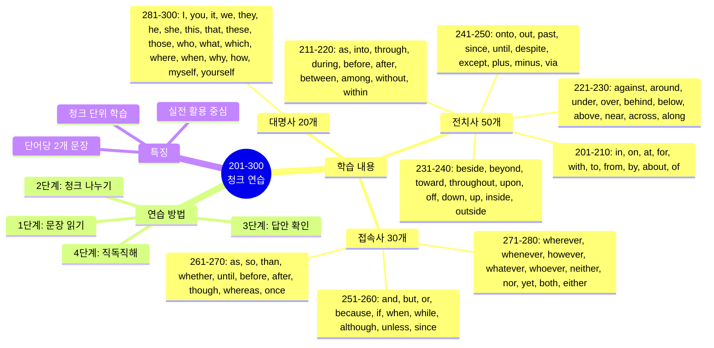
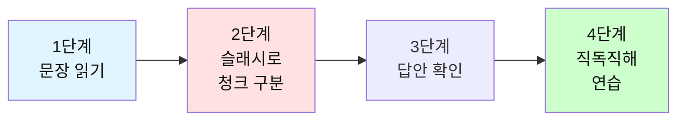

# 전설의 500단어 - 청크 나누기 연습 (201-300)

## 🎯 학습 구조 마인드맵



## 🎯 테스트 사용 방법

### 학습 단계


### 연습 방법

1. **문장 읽기**: 영어 문장을 소리내어 읽어보세요
2. **청크 나누기**: 의미 단위로 슬래시(/)로 구분해보세요
3. **답안 확인**: 제시된 청크 구분과 비교하세요
4. **직독직해**: 청크 순서대로 한국어로 해석하세요

---

## 📝 이 파일의 구성

**전치사 50개 + 접속사 30개 + 대명사 20개** = 총 100단어

**각 단어마다 2개의 문장으로 연습합니다.**

---

## 🟢 필수 전치사 50개 (201-250)

### 201. in

**문장 1**
```
I'll be back in 10 minutes.
```

**여러분의 청크:**
```
_________________________________
```

**답안:**
```
I'll be back / in 10 minutes.
나는 돌아올 거야 / 10분 안에
```

---

**문장 2**
```
She works in the marketing department.
```

**여러분의 청크:**
```
_________________________________
```

**답안:**
```
She works / in the marketing department.
그녀는 일해 / 마케팅 부서에서
```

---

### 202. on

**문장 1**
```
The meeting is on Monday.
```

**여러분의 청크:**
```
_________________________________
```

**답안:**
```
The meeting is / on Monday.
회의는 / 월요일에 있어
```

---

**문장 2**
```
Put it on the table.
```

**여러분의 청크:**
```
_________________________________
```

**답안:**
```
Put it / on the table.
놓아 그것을 / 테이블 위에
```

---

### 203. at

**문장 1**
```
Let's meet at 3 PM.
```

**여러분의 청크:**
```
_________________________________
```

**답안:**
```
Let's meet / at 3 PM.
만나자 / 오후 3시에
```

---

**문장 2**
```
She's at the office right now.
```

**여러분의 청크:**
```
_________________________________
```

**답안:**
```
She's / at the office / right now.
그녀는 있어 / 사무실에 / 바로 지금
```

---

### 204. for

**문장 1**
```
This is for you.
```

**여러분의 청크:**
```
_________________________________
```

**답안:**
```
This is / for you.
이것은 / 너를 위한 거야
```

---

**문장 2**
```
I've been waiting for an hour.
```

**여러분의 청크:**
```
_________________________________
```

**답안:**
```
I've been waiting / for an hour.
나는 기다려왔어 / 한 시간 동안
```

---

### 205. with

**문장 1**
```
I agree with your opinion.
```

**여러분의 청크:**
```
_________________________________
```

**답안:**
```
I agree / with your opinion.
나는 동의해 / 네 의견에
```

---

**문장 2**
```
Can I go with you?
```

**여러분의 청크:**
```
_________________________________
```

**답안:**
```
Can I go / with you?
내가 갈 수 있을까 / 너와 함께?
```

---

### 206. to

**문장 1**
```
I need to go to the bank.
```

**여러분의 청크:**
```
_________________________________
```

**답안:**
```
I need to / go / to the bank.
나는 필요해 / 가야 / 은행에
```

---

**문장 2**
```
From Monday to Friday.
```

**여러분의 청크:**
```
_________________________________
```

**답안:**
```
From Monday / to Friday.
월요일부터 / 금요일까지
```

---

### 207. from

**문장 1**
```
Where are you from?
```

**여러분의 청크:**
```
_________________________________
```

**답안:**
```
Where are you / from?
너는 어디 출신이니 / 어디로부터?
```

---

**문장 2**
```
I learned a lot from this experience.
```

**여러분의 청크:**
```
_________________________________
```

**답안:**
```
I learned / a lot / from this experience.
나는 배웠어 / 많이 / 이 경험으로부터
```

---

### 208. by

**문장 1**
```
Please finish this by Friday.
```

**여러분의 청크:**
```
_________________________________
```

**답안:**
```
Please finish / this / by Friday.
끝내주세요 / 이것을 / 금요일까지
```

---

**문장 2**
```
This report was written by Sarah.
```

**여러분의 청크:**
```
_________________________________
```

**답안:**
```
This report / was written / by Sarah.
이 보고서는 / 쓰여졌어 / 사라에 의해
```

---

### 209. about

**문장 1**
```
What's this meeting about?
```

**여러분의 청크:**
```
_________________________________
```

**답안:**
```
What's / this meeting / about?
뭐니 / 이 회의는 / 무엇에 관한?
```

---

**문장 2**
```
I'm worried about the deadline.
```

**여러분의 청크:**
```
_________________________________
```

**답안:**
```
I'm worried / about the deadline.
나는 걱정돼 / 마감일에 대해
```

---

### 210. of

**문장 1**
```
This is one of the best solutions.
```

**여러분의 청크:**
```
_________________________________
```

**답안:**
```
This is / one of / the best solutions.
이것은 / 하나야 / 최선의 해결책들 중
```

---

**문장 2**
```
The cost of living is high here.
```

**여러분의 청크:**
```
_________________________________
```

**답안:**
```
The cost / of living / is high / here.
비용이 / 생활의 / 높아 / 여기
```

---

### 211. as

**문장 1**
```
As I mentioned before, this is important.
```

**여러분의 청크:**
```
_________________________________
```

**답안:**
```
As I mentioned / before, / this is important.
내가 언급했듯이 / 전에, / 이것은 중요해
```

---

**문장 2**
```
She works as a manager.
```

**여러분의 청크:**
```
_________________________________
```

**답안:**
```
She works / as a manager.
그녀는 일해 / 매니저로
```

---

### 212. into

**문장 1**
```
Let's go into the details.
```

**여러분의 청크:**
```
_________________________________
```

**답안:**
```
Let's go / into the details.
가자 / 세부사항으로
```

---

**문장 2**
```
She walked into the room.
```

**여러분의 청크:**
```
_________________________________
```

**답안:**
```
She walked / into the room.
그녀는 걸어갔어 / 방 안으로
```

---

### 213. through

**문장 1**
```
We went through all the documents.
```

**여러분의 청크:**
```
_________________________________
```

**답안:**
```
We went through / all the documents.
우리는 살펴봤어 / 모든 문서들을
```

---

**문장 2**
```
The project succeeded through teamwork.
```

**여러분의 청크:**
```
_________________________________
```

**답안:**
```
The project / succeeded / through teamwork.
프로젝트는 / 성공했어 / 팀워크를 통해
```

---

### 214. during

**문장 1**
```
I fell asleep during the meeting.
```

**여러분의 청크:**
```
_________________________________
```

**답안:**
```
I fell asleep / during the meeting.
나는 잠들었어 / 회의 중에
```

---

**문장 2**
```
Please stay focused during the presentation.
```

**여러분의 청크:**
```
_________________________________
```

**답안:**
```
Please stay focused / during the presentation.
집중해주세요 / 발표 중에
```

---

### 215. before

**문장 1**
```
Check everything before you leave.
```

**여러분의 청크:**
```
_________________________________
```

**답안:**
```
Check everything / before you leave.
모든 것을 확인해 / 네가 떠나기 전에
```

---

**문장 2**
```
I've never seen this before.
```

**여러분의 청크:**
```
_________________________________
```

**답안:**
```
I've never seen / this / before.
나는 본 적 없어 / 이것을 / 전에
```

---

### 216. after

**문장 1**
```
Let's talk after the meeting.
```

**여러분의 청크:**
```
_________________________________
```

**답안:**
```
Let's talk / after the meeting.
이야기하자 / 회의 후에
```

---

**문장 2**
```
After all, we succeeded.
```

**여러분의 청크:**
```
_________________________________
```

**답안:**
```
After all, / we succeeded.
결국, / 우리는 성공했어
```

---

### 217. between

**문장 1**
```
The meeting is between 2 and 3 PM.
```

**여러분의 청크:**
```
_________________________________
```

**답안:**
```
The meeting is / between 2 and 3 PM.
회의는 / 오후 2시와 3시 사이야
```

---

**문장 2**
```
This is between you and me.
```

**여러분의 청크:**
```
_________________________________
```

**답안:**
```
This is / between you and me.
이것은 / 너와 나 사이야
```

---

### 218. among

**문장 1**
```
She's popular among her colleagues.
```

**여러분의 청크:**
```
_________________________________
```

**답안:**
```
She's popular / among her colleagues.
그녀는 인기있어 / 그녀의 동료들 사이에서
```

---

**문장 2**
```
Among other things, we need to improve quality.
```

**여러분의 청크:**
```
_________________________________
```

**답안:**
```
Among other things, / we need to / improve quality.
무엇보다도, / 우리는 필요해 / 품질을 개선할
```

---

### 219. without

**문장 1**
```
Don't leave without saying goodbye.
```

**여러분의 청크:**
```
_________________________________
```

**답안:**
```
Don't leave / without saying / goodbye.
떠나지 마 / 말하지 않고 / 안녕이라고
```

---

**문장 2**
```
I can't live without coffee.
```

**여러분의 청크:**
```
_________________________________
```

**답안:**
```
I can't live / without coffee.
나는 살 수 없어 / 커피 없이
```

---

### 220. within

**문장 1**
```
Please respond within 24 hours.
```

**여러분의 청크:**
```
_________________________________
```

**답안:**
```
Please respond / within 24 hours.
응답해주세요 / 24시간 이내에
```

---

**문장 2**
```
It's within walking distance.
```

**여러분의 청크:**
```
_________________________________
```

**답안:**
```
It's / within walking distance.
그것은 / 걸어갈 수 있는 거리 내에 있어
```

---

### 221. against

**문장 1**
```
I'm against this idea.
```

**여러분의 청크:**
```
_________________________________
```

**답안:**
```
I'm against / this idea.
나는 반대해 / 이 아이디어에
```

---

**문장 2**
```
Lean against the wall.
```

**여러분의 청크:**
```
_________________________________
```

**답안:**
```
Lean / against the wall.
기대 / 벽에
```

---

### 222. around

**문장 1**
```
Let me show you around the office.
```

**여러분의 청크:**
```
_________________________________
```

**답안:**
```
Let me show you / around the office.
나에게 보여주게 해줘 너에게 / 사무실을 둘러
```

---

**문장 2**
```
The meeting is around 2 PM.
```

**여러분의 청크:**
```
_________________________________
```

**답안:**
```
The meeting is / around 2 PM.
회의는 / 약 오후 2시야
```

---

### 223. under

**문장 1**
```
The file is under the desk.
```

**여러분의 청크:**
```
_________________________________
```

**답안:**
```
The file is / under the desk.
파일은 / 책상 아래에 있어
```

---

**문장 2**
```
This is under discussion.
```

**여러분의 청크:**
```
_________________________________
```

**답안:**
```
This is / under discussion.
이것은 / 논의 중이야
```

---

### 224. over

**문장 1**
```
The meeting is over.
```

**여러분의 청크:**
```
_________________________________
```

**답안:**
```
The meeting / is over.
회의는 / 끝났어
```

---

**문장 2**
```
We discussed this over lunch.
```

**여러분의 청크:**
```
_________________________________
```

**답안:**
```
We discussed / this / over lunch.
우리는 논의했어 / 이것을 / 점심 먹으면서
```

---

### 225. behind

**문장 1**
```
The truth is behind this story.
```

**여러분의 청크:**
```
_________________________________
```

**답안:**
```
The truth / is / behind this story.
진실은 / 있어 / 이 이야기 뒤에
```

---

**문장 2**
```
We're behind schedule.
```

**여러분의 청크:**
```
_________________________________
```

**답안:**
```
We're / behind schedule.
우리는 / 일정보다 늦어
```

---

### 226. below

**문장 1**
```
See the chart below.
```

**여러분의 청크:**
```
_________________________________
```

**답안:**
```
See / the chart / below.
봐 / 차트를 / 아래의
```

---

**문장 2**
```
The temperature is below zero.
```

**여러분의 청크:**
```
_________________________________
```

**답안:**
```
The temperature / is / below zero.
온도가 / ~이야 / 영하인
```

---

### 227. above

**문장 1**
```
As mentioned above, this is important.
```

**여러분의 청크:**
```
_________________________________
```

**답안:**
```
As mentioned / above, / this is important.
언급됐듯이 / 위에서, / 이것은 중요해
```

---

**문장 2**
```
The quality is above average.
```

**여러분의 청크:**
```
_________________________________
```

**답안:**
```
The quality / is / above average.
품질이 / ~이야 / 평균 이상인
```

---

### 228. near

**문장 1**
```
I live near the office.
```

**여러분의 청크:**
```
_________________________________
```

**답안:**
```
I live / near the office.
나는 살아 / 사무실 근처에
```

---

**문장 2**
```
The deadline is near.
```

**여러분의 청크:**
```
_________________________________
```

**답안:**
```
The deadline / is near.
마감일이 / 가까워
```

---

### 229. across

**문장 1**
```
The office is across the street.
```

**여러분의 청크:**
```
_________________________________
```

**답안:**
```
The office is / across the street.
사무실은 / 길 건너편에 있어
```

---

**문장 2**
```
This issue occurs across all departments.
```

**여러분의 청크:**
```
_________________________________
```

**답안:**
```
This issue / occurs / across all departments.
이 문제는 / 발생해 / 모든 부서에 걸쳐
```

---

### 230. along

**문장 1**
```
Walk along this street.
```

**여러분의 청크:**
```
_________________________________
```

**답안:**
```
Walk / along this street.
걸어 / 이 거리를 따라
```

---

**문장 2**
```
I'll bring my laptop along.
```

**여러분의 청크:**
```
_________________________________
```

**답안:**
```
I'll bring / my laptop / along.
나는 가져올 거야 / 내 노트북을 / 함께
```

---

### 231. beside

**문장 1**
```
Sit beside me.
```

**여러분의 청크:**
```
_________________________________
```

**답안:**
```
Sit / beside me.
앉아 / 내 옆에
```

---

**문장 2**
```
That's beside the point.
```

**여러분의 청크:**
```
_________________________________
```

**답안:**
```
That's / beside the point.
그것은 / 요점에서 벗어나
```

---

### 232. beyond

**문장 1**
```
This is beyond my control.
```

**여러분의 청크:**
```
_________________________________
```

**답안:**
```
This is / beyond my control.
이것은 / 내 통제를 벗어나
```

---

**문장 2**
```
We need to look beyond the numbers.
```

**여러분의 청크:**
```
_________________________________
```

**답안:**
```
We need to / look / beyond the numbers.
우리는 필요해 / 보는 것이 / 숫자 너머를
```

---

### 233. toward

**문장 1**
```
We're moving toward a solution.
```

**여러분의 청크:**
```
_________________________________
```

**답안:**
```
We're moving / toward a solution.
우리는 나아가고 있어 / 해결책을 향해
```

---

**문장 2**
```
She walked toward the door.
```

**여러분의 청크:**
```
_________________________________
```

**답안:**
```
She walked / toward the door.
그녀는 걸었어 / 문을 향해
```

---

### 234. throughout

**문장 1**
```
This applies throughout the company.
```

**여러분의 청크:**
```
_________________________________
```

**답안:**
```
This applies / throughout the company.
이것은 적용돼 / 회사 전체에
```

---

**문장 2**
```
I worked throughout the night.
```

**여러분의 청크:**
```
_________________________________
```

**답안:**
```
I worked / throughout the night.
나는 일했어 / 밤새도록
```

---

### 235. upon

**문장 1**
```
Once upon a time...
```

**여러분의 청크:**
```
_________________________________
```

**답안:**
```
Once upon / a time...
옛날 옛적에 / 한 번
```

---

**문장 2**
```
The decision depends upon many factors.
```

**여러분의 청크:**
```
_________________________________
```

**답안:**
```
The decision / depends / upon many factors.
결정은 / 달려있어 / 많은 요인들에
```

---

### 236. off

**문장 1**
```
Turn off the light.
```

**여러분의 청크:**
```
_________________________________
```

**답안:**
```
Turn off / the light.
꺼 / 불을
```

---

**문장 2**
```
I have the day off.
```

**여러분의 청크:**
```
_________________________________
```

**답안:**
```
I have / the day off.
나는 가지고 있어 / 휴일을
```

---

### 237. down

**문장 1**
```
Sit down, please.
```

**여러분의 청크:**
```
_________________________________
```

**답안:**
```
Sit down, / please.
앉아, / 제발
```

---

**문장 2**
```
Write down these notes.
```

**여러분의 청크:**
```
_________________________________
```

**답안:**
```
Write down / these notes.
적어 / 이 노트들을
```

---

### 238. up

**문장 1**
```
Look up the information.
```

**여러분의 청크:**
```
_________________________________
```

**답안:**
```
Look up / the information.
찾아봐 / 정보를
```

---

**문장 2**
```
The price went up.
```

**여러분의 청크:**
```
_________________________________
```

**답안:**
```
The price / went up.
가격이 / 올랐어
```

---

### 239. inside

**문장 1**
```
Wait inside the building.
```

**여러분의 청크:**
```
_________________________________
```

**답안:**
```
Wait / inside the building.
기다려 / 건물 안에서
```

---

**문장 2**
```
The answer is inside this file.
```

**여러분의 청크:**
```
_________________________________
```

**답안:**
```
The answer / is / inside this file.
답은 / 있어 / 이 파일 안에
```

---

### 240. outside

**문장 1**
```
Let's meet outside.
```

**여러분의 청크:**
```
_________________________________
```

**답안:**
```
Let's meet / outside.
만나자 / 밖에서
```

---

**문장 2**
```
This is outside my expertise.
```

**여러분의 청크:**
```
_________________________________
```

**답안:**
```
This is / outside my expertise.
이것은 / 내 전문 분야 밖이야
```

---

### 241. onto

**문장 1**
```
Put the file onto the desk.
```

**여러분의 청크:**
```
_________________________________
```

**답안:**
```
Put / the file / onto the desk.
놓아 / 파일을 / 책상 위에
```

---

**문장 2**
```
Let's move onto the next topic.
```

**여러분의 청크:**
```
_________________________________
```

**답안:**
```
Let's move onto / the next topic.
넘어가자 / 다음 주제로
```

---

### 242. out

**문장 1**
```
Let's go out for lunch.
```

**여러분의 청크:**
```
_________________________________
```

**답안:**
```
Let's go out / for lunch.
나가자 / 점심 먹으러
```

---

**문장 2**
```
The project turned out well.
```

**여러분의 청크:**
```
_________________________________
```

**답안:**
```
The project / turned out / well.
프로젝트가 / 결과가 나왔어 / 잘
```

---

### 243. past

**문장 1**
```
It's half past two.
```

**여러분의 청크:**
```
_________________________________
```

**답안:**
```
It's / half past two.
~이야 / 2시 반
```

---

**문장 2**
```
Let's look past our differences.
```

**여러분의 청크:**
```
_________________________________
```

**답안:**
```
Let's look past / our differences.
넘어서 보자 / 우리의 차이점들을
```

---

### 244. since

**문장 1**
```
I've been here since Monday.
```

**여러분의 청크:**
```
_________________________________
```

**답안:**
```
I've been here / since Monday.
나는 여기 있었어 / 월요일부터
```

---

**문장 2**
```
Since you're here, let's talk.
```

**여러분의 청크:**
```
_________________________________
```

**답안:**
```
Since you're here, / let's talk.
네가 여기 있으니까, / 이야기하자
```

---

### 245. until

**문장 1**
```
Wait until I come back.
```

**여러분의 청크:**
```
_________________________________
```

**답안:**
```
Wait / until I come back.
기다려 / 내가 돌아올 때까지
```

---

**문장 2**
```
The office is open until 6 PM.
```

**여러분의 청크:**
```
_________________________________
```

**답안:**
```
The office / is open / until 6 PM.
사무실은 / 열려있어 / 오후 6시까지
```

---

### 246. despite

**문장 1**
```
Despite the rain, we went out.
```

**여러분의 청크:**
```
_________________________________
```

**답안:**
```
Despite the rain, / we went out.
비에도 불구하고, / 우리는 나갔어
```

---

**문장 2**
```
She succeeded despite many challenges.
```

**여러분의 청크:**
```
_________________________________
```

**답안:**
```
She succeeded / despite many challenges.
그녀는 성공했어 / 많은 도전에도 불구하고
```

---

### 247. except

**문장 1**
```
Everyone except me knows this.
```

**여러분의 청크:**
```
_________________________________
```

**답안:**
```
Everyone / except me / knows this.
모두가 / 나를 제외하고 / 알아 이것을
```

---

**문장 2**
```
I work every day except Sunday.
```

**여러분의 청크:**
```
_________________________________
```

**답안:**
```
I work / every day / except Sunday.
나는 일해 / 매일 / 일요일을 제외하고
```

---

### 248. plus

**문장 1**
```
Two plus two equals four.
```

**여러분의 청크:**
```
_________________________________
```

**답안:**
```
Two plus two / equals / four.
2 더하기 2는 / 같아 / 4와
```

---

**문장 2**
```
It costs $100 plus tax.
```

**여러분의 청크:**
```
_________________________________
```

**답안:**
```
It costs / $100 / plus tax.
그것은 비용이 들어 / 100달러 / 세금 포함
```

---

### 249. minus

**문장 1**
```
Five minus three equals two.
```

**여러분의 청크:**
```
_________________________________
```

**답안:**
```
Five minus three / equals / two.
5 빼기 3은 / 같아 / 2와
```

---

**문장 2**
```
The temperature is minus 5 degrees.
```

**여러분의 청크:**
```
_________________________________
```

**답안:**
```
The temperature / is / minus 5 degrees.
온도가 / ~이야 / 영하 5도인
```

---

### 250. via

**문장 1**
```
Send it via email.
```

**여러분의 청크:**
```
_________________________________
```

**답안:**
```
Send it / via email.
보내 그것을 / 이메일로
```

---

**문장 2**
```
We'll travel to Seoul via Tokyo.
```

**여러분의 청크:**
```
_________________________________
```

**답안:**
```
We'll travel / to Seoul / via Tokyo.
우리는 여행할 거야 / 서울로 / 도쿄를 경유해
```

---

## 🟣 필수 접속사 30개 (251-280)

### 251. and

**문장 1**
```
I like coffee and tea.
```

**여러분의 청크:**
```
_________________________________
```

**답안:**
```
I like / coffee and tea.
나는 좋아해 / 커피와 차를
```

---

**문장 2**
```
She's smart and hardworking.
```

**여러분의 청크:**
```
_________________________________
```

**답안:**
```
She's / smart and hardworking.
그녀는 / 똑똑하고 근면해
```

---

### 252. but

**문장 1**
```
I want to help, but I'm busy.
```

**여러분의 청크:**
```
_________________________________
```

**답안:**
```
I want to help, / but / I'm busy.
나는 돕고 싶어, / 하지만 / 나는 바빠
```

---

**문장 2**
```
It's expensive but worth it.
```

**여러분의 청크:**
```
_________________________________
```

**답안:**
```
It's expensive / but / worth it.
그것은 비싸 / 하지만 / 가치있어
```

---

### 253. or

**문장 1**
```
Coffee or tea?
```

**여러분의 청크:**
```
_________________________________
```

**답안:**
```
Coffee / or / tea?
커피 / 아니면 / 차?
```

---

**문장 2**
```
We can meet today or tomorrow.
```

**여러분의 청크:**
```
_________________________________
```

**답안:**
```
We can meet / today or tomorrow.
우리는 만날 수 있어 / 오늘 또는 내일
```

---

### 254. because

**문장 1**
```
I'm late because of the traffic.
```

**여러분의 청크:**
```
_________________________________
```

**답안:**
```
I'm late / because of / the traffic.
나는 늦었어 / ~ 때문에 / 교통 체증
```

---

**문장 2**
```
She left early because she was sick.
```

**여러분의 청크:**
```
_________________________________
```

**답안:**
```
She left early / because / she was sick.
그녀는 일찍 떠났어 / 왜냐하면 / 그녀가 아팠기 때문에
```

---

### 255. if

**문장 1**
```
If you need help, just ask.
```

**여러분의 청크:**
```
_________________________________
```

**답안:**
```
If you need help, / just ask.
만약 네가 도움이 필요하면, / 그냥 물어봐
```

---

**문장 2**
```
I'll go if I have time.
```

**여러분의 청크:**
```
_________________________________
```

**답안:**
```
I'll go / if I have time.
나는 갈 거야 / 만약 내가 시간이 있으면
```

---

### 256. when

**문장 1**
```
When is the meeting?
```

**여러분의 청크:**
```
_________________________________
```

**답안:**
```
When / is the meeting?
언제니 / 회의는?
```

---

**문장 2**
```
Call me when you arrive.
```

**여러분의 청크:**
```
_________________________________
```

**답안:**
```
Call me / when you arrive.
전화해 나에게 / 네가 도착하면
```

---

### 257. while

**문장 1**
```
I'll work while you're away.
```

**여러분의 청크:**
```
_________________________________
```

**답안:**
```
I'll work / while you're away.
나는 일할 거야 / 네가 없는 동안
```

---

**문장 2**
```
While it's true, we need more evidence.
```

**여러분의 청크:**
```
_________________________________
```

**답안:**
```
While it's true, / we need / more evidence.
그것이 사실이긴 하지만, / 우리는 필요해 / 더 많은 증거가
```

---

### 258. although

**문장 1**
```
Although it's difficult, we must try.
```

**여러분의 청크:**
```
_________________________________
```

**답안:**
```
Although it's difficult, / we must try.
비록 어렵지만, / 우리는 시도해야 해
```

---

**문장 2**
```
She came, although she was tired.
```

**여러분의 청크:**
```
_________________________________
```

**답안:**
```
She came, / although / she was tired.
그녀는 왔어, / 비록 / 그녀가 피곤했지만
```

---

### 259. unless

**문장 1**
```
I won't go unless you come.
```

**여러분의 청크:**
```
_________________________________
```

**답안:**
```
I won't go / unless you come.
나는 가지 않을 거야 / 네가 오지 않는 한
```

---

**문장 2**
```
Unless we act now, it's too late.
```

**여러분의 청크:**
```
_________________________________
```

**답안:**
```
Unless we act now, / it's too late.
우리가 지금 행동하지 않으면, / 너무 늦어
```

---

### 260. since

**문장 1**
```
Since you're here, let's begin.
```

**여러분의 청크:**
```
_________________________________
```

**답안:**
```
Since you're here, / let's begin.
네가 여기 있으니까, / 시작하자
```

---

**문장 2**
```
I've known him since childhood.
```

**여러분의 청크:**
```
_________________________________
```

**답안:**
```
I've known him / since childhood.
나는 알아왔어 그를 / 어린 시절부터
```

---

### 261. as

**문장 1**
```
As you know, this is important.
```

**여러분의 청크:**
```
_________________________________
```

**답안:**
```
As you know, / this is important.
네가 아는 것처럼, / 이것은 중요해
```

---

**문장 2**
```
Do as I say.
```

**여러분의 청크:**
```
_________________________________
```

**답안:**
```
Do / as I say.
해 / 내가 말하는 대로
```

---

### 262. so

**문장 1**
```
I was tired, so I went home.
```

**여러분의 청크:**
```
_________________________________
```

**답안:**
```
I was tired, / so / I went home.
나는 피곤했어, / 그래서 / 나는 집에 갔어
```

---

**문장 2**
```
So, what's your decision?
```

**여러분의 청크:**
```
_________________________________
```

**답안:**
```
So, / what's your decision?
그래서, / 네 결정은 뭐니?
```

---

### 263. than

**문장 1**
```
This is better than before.
```

**여러분의 청크:**
```
_________________________________
```

**답안:**
```
This is better / than before.
이것은 더 나아 / 이전보다
```

---

**문장 2**
```
She works harder than anyone.
```

**여러분의 청크:**
```
_________________________________
```

**답안:**
```
She works harder / than anyone.
그녀는 더 열심히 일해 / 누구보다
```

---

### 264. whether

**문장 1**
```
I don't know whether to go or stay.
```

**여러분의 청크:**
```
_________________________________
```

**답안:**
```
I don't know / whether to go or stay.
나는 모르겠어 / 가야 할지 머물러야 할지
```

---

**문장 2**
```
Whether you like it or not, this is happening.
```

**여러분의 청크:**
```
_________________________________
```

**답안:**
```
Whether you like it or not, / this is happening.
네가 좋아하든 안 하든, / 이것은 일어나고 있어
```

---

### 265. until

**문장 1**
```
Wait until I come back.
```

**여러분의 청크:**
```
_________________________________
```

**답안:**
```
Wait / until I come back.
기다려 / 내가 돌아올 때까지
```

---

**문장 2**
```
Until now, everything was fine.
```

**여러분의 청크:**
```
_________________________________
```

**답안:**
```
Until now, / everything was fine.
지금까지는, / 모든 것이 괜찮았어
```

---

### 266. before

**문장 1**
```
Check before you submit.
```

**여러분의 청크:**
```
_________________________________
```

**답안:**
```
Check / before you submit.
확인해 / 네가 제출하기 전에
```

---

**문장 2**
```
I've seen this before.
```

**여러분의 청크:**
```
_________________________________
```

**답안:**
```
I've seen / this / before.
나는 봤어 / 이것을 / 전에
```

---

### 267. after

**문장 1**
```
After you finish, send me the file.
```

**여러분의 청크:**
```
_________________________________
```

**답안:**
```
After you finish, / send me / the file.
네가 끝내면, / 보내줘 나에게 / 파일을
```

---

**문장 2**
```
Let's talk after lunch.
```

**여러분의 청크:**
```
_________________________________
```

**답안:**
```
Let's talk / after lunch.
이야기하자 / 점심 후에
```

---

### 268. though

**문장 1**
```
It's expensive, though worth it.
```

**여러분의 청크:**
```
_________________________________
```

**답안:**
```
It's expensive, / though / worth it.
그것은 비싸, / 비록 / 가치있지만
```

---

**문장 2**
```
Though difficult, we'll succeed.
```

**여러분의 청크:**
```
_________________________________
```

**답안:**
```
Though difficult, / we'll succeed.
비록 어렵지만, / 우리는 성공할 거야
```

---

### 269. whereas

**문장 1**
```
I prefer tea, whereas she likes coffee.
```

**여러분의 청크:**
```
_________________________________
```

**답안:**
```
I prefer tea, / whereas / she likes coffee.
나는 차를 선호해, / 반면에 / 그녀는 커피를 좋아해
```

---

**문장 2**
```
This is simple, whereas that is complex.
```

**여러분의 청크:**
```
_________________________________
```

**답안:**
```
This is simple, / whereas / that is complex.
이것은 간단해, / 반면에 / 저것은 복잡해
```

---

### 270. once

**문장 1**
```
Once you start, don't stop.
```

**여러분의 청크:**
```
_________________________________
```

**답안:**
```
Once you start, / don't stop.
일단 네가 시작하면, / 멈추지 마
```

---

**문장 2**
```
I've been there once.
```

**여러분의 청크:**
```
_________________________________
```

**답안:**
```
I've been there / once.
나는 거기 가봤어 / 한 번
```

---

### 271. wherever

**문장 1**
```
I'll follow you wherever you go.
```

**여러분의 청크:**
```
_________________________________
```

**답안:**
```
I'll follow you / wherever you go.
나는 따를 거야 너를 / 네가 어디를 가든
```

---

**문장 2**
```
Wherever possible, use simple language.
```

**여러분의 청크:**
```
_________________________________
```

**답안:**
```
Wherever possible, / use / simple language.
가능한 곳마다, / 사용해 / 간단한 언어를
```

---

### 272. whenever

**문장 1**
```
Call me whenever you need help.
```

**여러분의 청크:**
```
_________________________________
```

**답안:**
```
Call me / whenever you need help.
전화해 나에게 / 네가 도움이 필요할 때마다
```

---

**문장 2**
```
Whenever I see her, she's smiling.
```

**여러분의 청크:**
```
_________________________________
```

**답안:**
```
Whenever I see her, / she's smiling.
내가 그녀를 볼 때마다, / 그녀는 웃고 있어
```

---

### 273. however

**문장 1**
```
However, we need more time.
```

**여러분의 청크:**
```
_________________________________
```

**답안:**
```
However, / we need / more time.
하지만, / 우리는 필요해 / 더 많은 시간이
```

---

**문장 2**
```
You can do it however you want.
```

**여러분의 청크:**
```
_________________________________
```

**답안:**
```
You can do it / however you want.
너는 할 수 있어 그것을 / 네가 원하는 대로
```

---

### 274. whatever

**문장 1**
```
Whatever happens, stay calm.
```

**여러분의 청크:**
```
_________________________________
```

**답안:**
```
Whatever happens, / stay calm.
무슨 일이 일어나든, / 침착해
```

---

**문장 2**
```
Do whatever you think is best.
```

**여러분의 청크:**
```
_________________________________
```

**답안:**
```
Do / whatever you think / is best.
해 / 네가 생각하는 것을 / 최선인
```

---

### 275. whoever

**문장 1**
```
Whoever did this will be punished.
```

**여러분의 청크:**
```
_________________________________
```

**답안:**
```
Whoever did this / will be punished.
이것을 한 사람은 누구든 / 처벌받을 거야
```

---

**문장 2**
```
Give it to whoever needs it.
```

**여러분의 청크:**
```
_________________________________
```

**답안:**
```
Give it / to whoever needs it.
줘 그것을 / 그것이 필요한 누구에게든
```

---

### 276. neither

**문장 1**
```
Neither option is perfect.
```

**여러분의 청크:**
```
_________________________________
```

**답안:**
```
Neither option / is / perfect.
어느 선택도 / 아니야 / 완벽한
```

---

**문장 2**
```
I like neither coffee nor tea.
```

**여러분의 청크:**
```
_________________________________
```

**답안:**
```
I like / neither coffee nor tea.
나는 좋아하지 않아 / 커피도 차도
```

---

### 277. nor

**문장 1**
```
I don't like coffee, nor do I like tea.
```

**여러분의 청크:**
```
_________________________________
```

**답안:**
```
I don't like coffee, / nor / do I like tea.
나는 커피를 좋아하지 않아, / 또한 / 차도 좋아하지 않아
```

---

**문장 2**
```
He's neither rich nor poor.
```

**여러분의 청크:**
```
_________________________________
```

**답안:**
```
He's / neither rich nor poor.
그는 / 부자도 가난하지도 않아
```

---

### 278. yet

**문장 1**
```
It's difficult, yet possible.
```

**여러분의 청크:**
```
_________________________________
```

**답안:**
```
It's difficult, / yet / possible.
그것은 어려워, / 하지만 / 가능해
```

---

**문장 2**
```
Have you finished yet?
```

**여러분의 청크:**
```
_________________________________
```

**답안:**
```
Have you finished / yet?
너 끝냈니 / 아직?
```

---

### 279. both

**문장 1**
```
Both options are good.
```

**여러분의 청크:**
```
_________________________________
```

**답안:**
```
Both options / are / good.
두 선택 모두 / ~이야 / 좋은
```

---

**문장 2**
```
I like both coffee and tea.
```

**여러분의 청크:**
```
_________________________________
```

**답안:**
```
I like / both coffee and tea.
나는 좋아해 / 커피와 차 둘 다
```

---

### 280. either

**문장 1**
```
Either option is fine.
```

**여러분의 청크:**
```
_________________________________
```

**답안:**
```
Either option / is / fine.
어느 선택이든 / ~이야 / 괜찮은
```

---

**문장 2**
```
You can choose either this or that.
```

**여러분의 청크:**
```
_________________________________
```

**답안:**
```
You can choose / either this or that.
너는 선택할 수 있어 / 이것이든 저것이든
```

---

## 🔵 필수 대명사 20개 (281-300)

### 281. I

**문장 1**
```
I think this is important.
```

**여러분의 청크:**
```
_________________________________
```

**답안:**
```
I think / this is / important.
나는 생각해 / 이것이 / 중요하다고
```

---

**문장 2**
```
Can I help you?
```

**여러분의 청크:**
```
_________________________________
```

**답안:**
```
Can I help / you?
내가 도울 수 있을까 / 너를?
```

---

### 282. you

**문장 1**
```
You did a great job!
```

**여러분의 청크:**
```
_________________________________
```

**답안:**
```
You did / a great job!
너는 했어 / 훌륭한 일을!
```

---

**문장 2**
```
What do you think?
```

**여러분의 청크:**
```
_________________________________
```

**답안:**
```
What do you think?
너는 어떻게 생각하니?
```

---

### 283. it

**문장 1**
```
It's getting late.
```

**여러분의 청크:**
```
_________________________________
```

**답안:**
```
It's getting / late.
그것은 되고 있어 / 늦게
```

---

**문장 2**
```
I don't like it.
```

**여러분의 청크:**
```
_________________________________
```

**답안:**
```
I don't like / it.
나는 좋아하지 않아 / 그것을
```

---

### 284. we

**문장 1**
```
We need to talk.
```

**여러분의 청크:**
```
_________________________________
```

**답안:**
```
We need to / talk.
우리는 필요해 / 이야기할
```

---

**문장 2**
```
Can we reschedule?
```

**여러분의 청크:**
```
_________________________________
```

**답안:**
```
Can we / reschedule?
우리가 할 수 있을까 / 일정 변경을?
```

---

### 285. they

**문장 1**
```
They agreed to the proposal.
```

**여러분의 청크:**
```
_________________________________
```

**답안:**
```
They agreed / to the proposal.
그들은 동의했어 / 제안에
```

---

**문장 2**
```
Where are they now?
```

**여러분의 청크:**
```
_________________________________
```

**답안:**
```
Where are they / now?
그들은 어디 있니 / 지금?
```

---

### 286. he

**문장 1**
```
He's the project manager.
```

**여러분의 청크:**
```
_________________________________
```

**답안:**
```
He's / the project manager.
그는 / 프로젝트 매니저야
```

---

**문장 2**
```
Where is he?
```

**여러분의 청크:**
```
_________________________________
```

**답안:**
```
Where / is he?
어디에 / 그는 있니?
```

---

### 287. she

**문장 1**
```
She's very talented.
```

**여러분의 청크:**
```
_________________________________
```

**답안:**
```
She's / very talented.
그녀는 / 매우 재능있어
```

---

**문장 2**
```
What did she say?
```

**여러분의 청크:**
```
_________________________________
```

**답안:**
```
What did she say?
그녀가 뭐라고 말했니?
```

---

### 288. this

**문장 1**
```
This is very important.
```

**여러분의 청크:**
```
_________________________________
```

**답안:**
```
This is / very important.
이것은 / 매우 중요해
```

---

**문장 2**
```
I like this idea.
```

**여러분의 청크:**
```
_________________________________
```

**답안:**
```
I like / this idea.
나는 좋아해 / 이 아이디어를
```

---

### 289. that

**문장 1**
```
That's a good point.
```

**여러분의 청크:**
```
_________________________________
```

**답안:**
```
That's / a good point.
그것은 / 좋은 지적이야
```

---

**문장 2**
```
I don't think that's right.
```

**여러분의 청크:**
```
_________________________________
```

**답안:**
```
I don't think / that's right.
나는 생각하지 않아 / 그것이 옳다고
```

---

### 290. these

**문장 1**
```
These are the files you need.
```

**여러분의 청크:**
```
_________________________________
```

**답안:**
```
These are / the files / you need.
이것들은 / 파일들이야 / 네가 필요한
```

---

**문장 2**
```
I like these ideas.
```

**여러분의 청크:**
```
_________________________________
```

**답안:**
```
I like / these ideas.
나는 좋아해 / 이 아이디어들을
```

---

### 291. those

**문장 1**
```
Those are my books.
```

**여러분의 청크:**
```
_________________________________
```

**답안:**
```
Those are / my books.
저것들은 / 내 책들이야
```

---

**문장 2**
```
I prefer those options.
```

**여러분의 청크:**
```
_________________________________
```

**답안:**
```
I prefer / those options.
나는 선호해 / 저 선택들을
```

---

### 292. who

**문장 1**
```
Who is in charge?
```

**여러분의 청크:**
```
_________________________________
```

**답안:**
```
Who / is in charge?
누가 / 담당이니?
```

---

**문장 2**
```
The person who called earlier.
```

**여러분의 청크:**
```
_________________________________
```

**답안:**
```
The person / who called / earlier.
사람은 / 전화했던 / 일찍
```

---

### 293. what

**문장 1**
```
What do you mean?
```

**여러분의 청크:**
```
_________________________________
```

**답안:**
```
What / do you mean?
무엇을 / 너는 의미하니?
```

---

**문장 2**
```
I know what you're thinking.
```

**여러분의 청크:**
```
_________________________________
```

**답안:**
```
I know / what you're thinking.
나는 알아 / 네가 생각하고 있는 것을
```

---

### 294. which

**문장 1**
```
Which one do you prefer?
```

**여러분의 청크:**
```
_________________________________
```

**답안:**
```
Which one / do you prefer?
어느 것을 / 너는 선호하니?
```

---

**문장 2**
```
The option which works best.
```

**여러분의 청크:**
```
_________________________________
```

**답안:**
```
The option / which works best.
선택은 / 가장 잘 작동하는
```

---

### 295. where

**문장 1**
```
Where is the meeting room?
```

**여러분의 청크:**
```
_________________________________
```

**답안:**
```
Where / is the meeting room?
어디에 / 회의실이 있니?
```

---

**문장 2**
```
This is where we work.
```

**여러분의 청크:**
```
_________________________________
```

**답안:**
```
This is / where we work.
이것이 / 우리가 일하는 곳이야
```

---

### 296. when

**문장 1**
```
When is the deadline?
```

**여러분의 청크:**
```
_________________________________
```

**답안:**
```
When / is the deadline?
언제니 / 마감일이?
```

---

**문장 2**
```
I remember when we first met.
```

**여러분의 청크:**
```
_________________________________
```

**답안:**
```
I remember / when we first met.
나는 기억해 / 우리가 처음 만났을 때를
```

---

### 297. why

**문장 1**
```
Why did you do that?
```

**여러분의 청크:**
```
_________________________________
```

**답안:**
```
Why / did you do / that?
왜 / 너는 했니 / 그것을?
```

---

**문장 2**
```
That's why I called.
```

**여러분의 청크:**
```
_________________________________
```

**답안:**
```
That's why / I called.
그것이 이유야 / 내가 전화한
```

---

### 298. how

**문장 1**
```
How are you doing?
```

**여러분의 청크:**
```
_________________________________
```

**답안:**
```
How / are you doing?
어때 / 너는 지내니?
```

---

**문장 2**
```
I know how to fix this.
```

**여러분의 청크:**
```
_________________________________
```

**답안:**
```
I know / how to fix / this.
나는 알아 / 고치는 방법을 / 이것을
```

---

### 299. myself

**문장 1**
```
I did it myself.
```

**여러분의 청크:**
```
_________________________________
```

**답안:**
```
I did it / myself.
나는 했어 그것을 / 스스로
```

---

**문장 2**
```
I'm proud of myself.
```

**여러분의 청크:**
```
_________________________________
```

**답안:**
```
I'm proud / of myself.
나는 자랑스러워 / 나 자신이
```

---

### 300. yourself

**문장 1**
```
Believe in yourself.
```

**여러분의 청크:**
```
_________________________________
```

**답안:**
```
Believe / in yourself.
믿어 / 너 자신을
```

---

**문장 2**
```
Did you do this yourself?
```

**여러분의 청크:**
```
_________________________________
```

**답안:**
```
Did you do / this / yourself?
너 했니 / 이것을 / 스스로?
```

---

## 📝 학습 기록

### 진도 체크리스트
- [ ] 전치사 201-210 연습 완료
- [ ] 전치사 211-220 연습 완료
- [ ] 전치사 221-230 연습 완료
- [ ] 전치사 231-240 연습 완료
- [ ] 전치사 241-250 연습 완료
- [ ] 접속사 251-260 연습 완료
- [ ] 접속사 261-270 연습 완료
- [ ] 접속사 271-280 연습 완료
- [ ] 대명사 281-290 연습 완료
- [ ] 대명사 291-300 연습 완료

---

## 🎓 다음 파일

**계속 학습하기:**
- 📘 [청크 연습 001-100](./전설의_500단어_청크_연습_001-100.md) - 동사/명사/형용사
- 📘 [청크 연습 101-200](./전설의_500단어_청크_연습_101-200.md) - 형용사/부사
- 📘 [청크 연습 301-400](./전설의_500단어_청크_연습_301-400.md) - 동사/명사
- 📘 [청크 연습 401-500](./전설의_500단어_청크_연습_401-500.md) - 형용사/부사/명사

---

**💪 매일 10개씩 연습하면 10일이면 100단어 마스터!**

*청크 나누기는 개인차가 있을 수 있습니다. 제시된 답안은 기본 청크이며, 자신에게 편한 방식으로 조정해도 좋습니다.*

**Last Updated: 2026-01-11**
