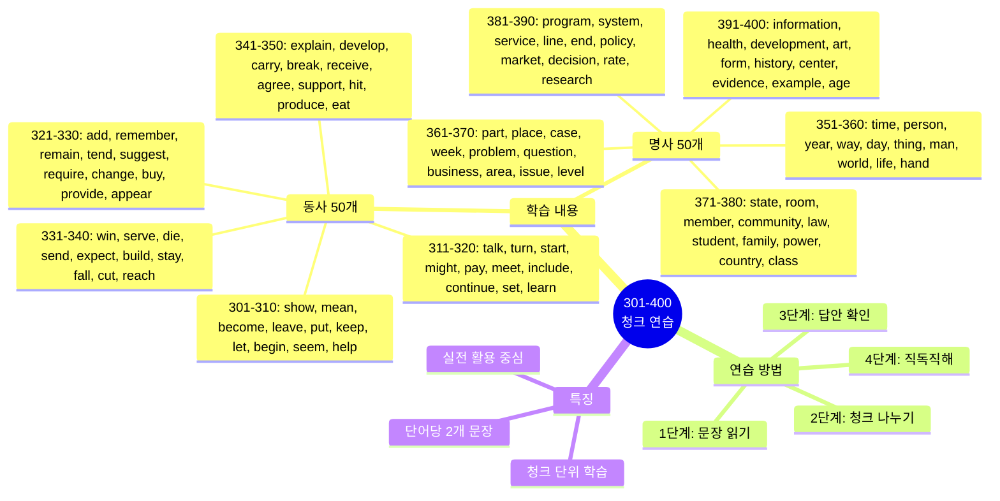
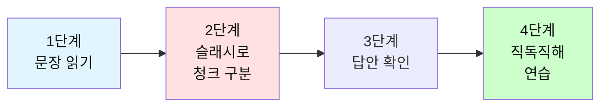

# 전설의 500단어 - 청크 나누기 연습 (301-400)

## 🎯 학습 구조 마인드맵



## 🎯 테스트 사용 방법

### 학습 단계


### 연습 방법

1. **문장 읽기**: 영어 문장을 소리내어 읽어보세요
2. **청크 나누기**: 의미 단위로 슬래시(/)로 구분해보세요
3. **답안 확인**: 제시된 청크 구분과 비교하세요
4. **직독직해**: 청크 순서대로 한국어로 해석하세요

---

## 📝 이 파일의 구성

**동사 50개 + 명사 50개** = 총 100단어

**각 단어마다 2개의 문장으로 연습합니다.**

---

## 🔴 필수 동사 50개 (301-350)

### 301. show

**문장 1**
```
Can you show me how to do this?
```

**여러분의 청크:**
```
_________________________________
```

**답안:**
```
Can you show me / how to do / this?
너 보여줄 수 있니 나에게 / 하는 방법을 / 이것을?
```

---

**문장 2**
```
The data shows a clear trend.
```

**여러분의 청크:**
```
_________________________________
```

**답안:**
```
The data / shows / a clear trend.
데이터가 / 보여줘 / 명확한 추세를
```

---

### 302. mean

**문장 1**
```
What does this word mean?
```

**여러분의 청크:**
```
_________________________________
```

**답안:**
```
What does / this word / mean?
무엇을 하니 / 이 단어가 / 의미하는?
```

---

**문장 2**
```
I didn't mean to hurt you.
```

**여러분의 청크:**
```
_________________________________
```

**답안:**
```
I didn't mean to / hurt you.
나는 의도하지 않았어 / 너를 상처입히려고
```

---

### 303. become

**문장 1**
```
She wants to become a manager.
```

**여러분의 청크:**
```
_________________________________
```

**답안:**
```
She wants to / become / a manager.
그녀는 원해 / 되기를 / 매니저가
```

---

**문장 2**
```
It's becoming more popular.
```

**여러분의 청크:**
```
_________________________________
```

**답안:**
```
It's becoming / more popular.
그것은 되고 있어 / 더 인기있게
```

---

### 304. leave

**문장 1**
```
What time do you leave work?
```

**여러분의 청크:**
```
_________________________________
```

**답안:**
```
What time / do you leave / work?
몇 시에 / 너는 떠나니 / 직장을?
```

---

**문장 2**
```
Don't leave without saying goodbye.
```

**여러분의 청크:**
```
_________________________________
```

**답안:**
```
Don't leave / without saying / goodbye.
떠나지 마 / 말하지 않고 / 안녕이라고
```

---

### 305. put

**문장 1**
```
Put your phone on silent mode.
```

**여러분의 청크:**
```
_________________________________
```

**답안:**
```
Put / your phone / on silent mode.
놓아 / 네 전화기를 / 무음 모드에
```

---

**문장 2**
```
She put a lot of effort into this.
```

**여러분의 청크:**
```
_________________________________
```

**답안:**
```
She put / a lot of effort / into this.
그녀는 넣었어 / 많은 노력을 / 이것에
```

---

### 306. keep

**문장 1**
```
Keep up the good work!
```

**여러분의 청크:**
```
_________________________________
```

**답안:**
```
Keep up / the good work!
유지해 / 좋은 일을!
```

---

**문장 2**
```
I'll keep you updated.
```

**여러분의 청크:**
```
_________________________________
```

**답안:**
```
I'll keep you / updated.
나는 유지할 거야 너를 / 업데이트된 상태로
```

---

### 307. let

**문장 1**
```
Let me check my schedule.
```

**여러분의 청크:**
```
_________________________________
```

**답안:**
```
Let me check / my schedule.
나에게 확인하게 해줘 / 내 일정을
```

---

**문장 2**
```
Don't let this opportunity pass.
```

**여러분의 청크:**
```
_________________________________
```

**답안:**
```
Don't let / this opportunity / pass.
하지 마 / 이 기회가 / 지나가게
```

---

### 308. begin

**문장 1**
```
Let's begin with the basics.
```

**여러분의 청크:**
```
_________________________________
```

**답안:**
```
Let's begin / with the basics.
시작하자 / 기본부터
```

---

**문장 2**
```
The meeting will begin at 2 PM.
```

**여러분의 청크:**
```
_________________________________
```

**답안:**
```
The meeting / will begin / at 2 PM.
회의는 / 시작할 거야 / 오후 2시에
```

---

### 309. seem

**문장 1**
```
This seems like a good idea.
```

**여러분의 청크:**
```
_________________________________
```

**답안:**
```
This seems / like a good idea.
이것은 보여 / 좋은 아이디어처럼
```

---

**문장 2**
```
You seem tired today.
```

**여러분의 청크:**
```
_________________________________
```

**답안:**
```
You seem / tired / today.
너는 보여 / 피곤해 / 오늘
```

---

### 310. help

**문장 1**
```
Can you help me with this?
```

**여러분의 청크:**
```
_________________________________
```

**답안:**
```
Can you help me / with this?
너 도와줄 수 있니 나를 / 이것과 함께?
```

---

**문장 2**
```
This will help improve efficiency.
```

**여러분의 청크:**
```
_________________________________
```

**답안:**
```
This will help / improve / efficiency.
이것은 도울 거야 / 향상시키는 것을 / 효율성을
```

---

### 311. talk

**문장 1**
```
Can we talk about this?
```

**여러분의 청크:**
```
_________________________________
```

**답안:**
```
Can we talk / about this?
우리 이야기할 수 있을까 / 이것에 대해?
```

---

**문장 2**
```
Let's talk after the meeting.
```

**여러분의 청크:**
```
_________________________________
```

**답안:**
```
Let's talk / after the meeting.
이야기하자 / 회의 후에
```

---

### 312. turn

**문장 1**
```
Turn left at the corner.
```

**여러분의 청크:**
```
_________________________________
```

**답안:**
```
Turn left / at the corner.
좌회전해 / 모퉁이에서
```

---

**문장 2**
```
It's your turn to present.
```

**여러분의 청크:**
```
_________________________________
```

**답안:**
```
It's your turn / to present.
네 차례야 / 발표할
```

---

### 313. start

**문장 1**
```
Let's start the meeting.
```

**여러분의 청크:**
```
_________________________________
```

**답안:**
```
Let's start / the meeting.
시작하자 / 회의를
```

---

**문장 2**
```
What time do you start work?
```

**여러분의 청크:**
```
_________________________________
```

**답안:**
```
What time / do you start / work?
몇 시에 / 너는 시작하니 / 일을?
```

---

### 314. might

**문장 1**
```
This might be a problem.
```

**여러분의 청크:**
```
_________________________________
```

**답안:**
```
This might be / a problem.
이것은 될 수 있어 / 문제가
```

---

**문장 2**
```
You might want to check this.
```

**여러분의 청크:**
```
_________________________________
```

**답안:**
```
You might want to / check / this.
너는 원할 수 있어 / 확인하기를 / 이것을
```

---

### 315. pay

**문장 1**
```
How much do I need to pay?
```

**여러분의 청크:**
```
_________________________________
```

**답안:**
```
How much / do I need to / pay?
얼마나 / 내가 필요하니 / 지불할?
```

---

**문장 2**
```
Pay attention to the details.
```

**여러분의 청크:**
```
_________________________________
```

**답안:**
```
Pay attention / to the details.
주의를 기울여 / 세부사항에
```

---

### 316. meet

**문장 1**
```
Nice to meet you.
```

**여러분의 청크:**
```
_________________________________
```

**답안:**
```
Nice / to meet you.
반가워 / 너를 만나서
```

---

**문장 2**
```
Let's meet at the coffee shop.
```

**여러분의 청크:**
```
_________________________________
```

**답안:**
```
Let's meet / at the coffee shop.
만나자 / 커피숍에서
```

---

### 317. include

**문장 1**
```
The price includes tax.
```

**여러분의 청크:**
```
_________________________________
```

**답안:**
```
The price / includes / tax.
가격은 / 포함해 / 세금을
```

---

**문장 2**
```
Please include me in the discussion.
```

**여러분의 청크:**
```
_________________________________
```

**답안:**
```
Please include me / in the discussion.
포함시켜주세요 나를 / 논의에
```

---

### 318. continue

**문장 1**
```
Let's continue this tomorrow.
```

**여러분의 청크:**
```
_________________________________
```

**답안:**
```
Let's continue / this / tomorrow.
계속하자 / 이것을 / 내일
```

---

**문장 2**
```
The meeting will continue after lunch.
```

**여러분의 청크:**
```
_________________________________
```

**답안:**
```
The meeting / will continue / after lunch.
회의는 / 계속될 거야 / 점심 후에
```

---

### 319. set

**문장 1**
```
Let's set a meeting time.
```

**여러분의 청크:**
```
_________________________________
```

**답안:**
```
Let's set / a meeting time.
정하자 / 회의 시간을
```

---

**문장 2**
```
The sun sets in the west.
```

**여러분의 청크:**
```
_________________________________
```

**답안:**
```
The sun / sets / in the west.
태양은 / 진다 / 서쪽으로
```

---

### 320. learn

**문장 1**
```
I want to learn English.
```

**여러분의 청크:**
```
_________________________________
```

**답안:**
```
I want to / learn / English.
나는 원해 / 배우기를 / 영어를
```

---

**문장 2**
```
We learn from our mistakes.
```

**여러분의 청크:**
```
_________________________________
```

**답안:**
```
We learn / from our mistakes.
우리는 배워 / 우리의 실수로부터
```

---

### 321. add

**문장 1**
```
Add this to the list.
```

**여러분의 청크:**
```
_________________________________
```

**답안:**
```
Add / this / to the list.
추가해 / 이것을 / 목록에
```

---

**문장 2**
```
Let me add one more thing.
```

**여러분의 청크:**
```
_________________________________
```

**답안:**
```
Let me add / one more thing.
나에게 추가하게 해줘 / 한 가지 더
```

---

### 322. remember

**문장 1**
```
Do you remember me?
```

**여러분의 청크:**
```
_________________________________
```

**답안:**
```
Do you remember / me?
너 기억하니 / 나를?
```

---

**문장 2**
```
Remember to send the email.
```

**여러분의 청크:**
```
_________________________________
```

**답안:**
```
Remember to / send / the email.
기억해 / 보내는 것을 / 이메일을
```

---

### 323. remain

**문장 1**
```
Please remain seated.
```

**여러분의 청크:**
```
_________________________________
```

**답안:**
```
Please / remain seated.
제발 / 앉아 있어
```

---

**문장 2**
```
This remains to be seen.
```

**여러분의 청크:**
```
_________________________________
```

**답안:**
```
This remains / to be seen.
이것은 남아있어 / 지켜봐야 할
```

---

### 324. tend

**문장 1**
```
I tend to agree with you.
```

**여러분의 청크:**
```
_________________________________
```

**답안:**
```
I tend to / agree / with you.
나는 경향이 있어 / 동의하는 / 너와
```

---

**문장 2**
```
People tend to forget this.
```

**여러분의 청크:**
```
_________________________________
```

**답안:**
```
People tend to / forget / this.
사람들은 경향이 있어 / 잊는 / 이것을
```

---

### 325. suggest

**문장 1**
```
I suggest we take a break.
```

**여러분의 청크:**
```
_________________________________
```

**답안:**
```
I suggest / we take / a break.
나는 제안해 / 우리가 가지기를 / 휴식을
```

---

**문장 2**
```
What do you suggest?
```

**여러분의 청크:**
```
_________________________________
```

**답안:**
```
What / do you suggest?
무엇을 / 너는 제안하니?
```

---

### 326. require

**문장 1**
```
This job requires experience.
```

**여러분의 청크:**
```
_________________________________
```

**답안:**
```
This job / requires / experience.
이 직업은 / 요구해 / 경험을
```

---

**문장 2**
```
All students are required to attend.
```

**여러분의 청크:**
```
_________________________________
```

**답안:**
```
All students / are required to / attend.
모든 학생들은 / 요구돼 / 참석하는 것이
```

---

### 327. change

**문장 1**
```
We need to change the plan.
```

**여러분의 청크:**
```
_________________________________
```

**답안:**
```
We need to / change / the plan.
우리는 필요해 / 바꿀 / 계획을
```

---

**문장 2**
```
Things change over time.
```

**여러분의 청크:**
```
_________________________________
```

**답안:**
```
Things / change / over time.
일들은 / 변해 / 시간이 지나면서
```

---

### 328. buy

**문장 1**
```
I need to buy some supplies.
```

**여러분의 청크:**
```
_________________________________
```

**답안:**
```
I need to / buy / some supplies.
나는 필요해 / 사는 것이 / 일부 용품들을
```

---

**문장 2**
```
Where did you buy this?
```

**여러분의 청크:**
```
_________________________________
```

**답안:**
```
Where / did you buy / this?
어디서 / 너는 샀니 / 이것을?
```

---

### 329. provide

**문장 1**
```
We provide 24-hour support.
```

**여러분의 청크:**
```
_________________________________
```

**답안:**
```
We provide / 24-hour support.
우리는 제공해 / 24시간 지원을
```

---

**문장 2**
```
Please provide more information.
```

**여러분의 청크:**
```
_________________________________
```

**답안:**
```
Please provide / more information.
제공해주세요 / 더 많은 정보를
```

---

### 330. appear

**문장 1**
```
A new window will appear.
```

**여러분의 청크:**
```
_________________________________
```

**답안:**
```
A new window / will appear.
새 창이 / 나타날 거야
```

---

**문장 2**
```
It appears to be working.
```

**여러분의 청크:**
```
_________________________________
```

**답안:**
```
It appears to / be working.
보이는데 / 작동하고 있는 것
```

---

### 331. win

**문장 1**
```
Who will win the game?
```

**여러분의 청크:**
```
_________________________________
```

**답안:**
```
Who / will win / the game?
누가 / 이길까 / 경기를?
```

---

**문장 2**
```
We won the contract.
```

**여러분의 청크:**
```
_________________________________
```

**답안:**
```
We won / the contract.
우리는 땄어 / 계약을
```

---

### 332. serve

**문장 1**
```
This will serve our purpose.
```

**여러분의 청크:**
```
_________________________________
```

**답안:**
```
This will serve / our purpose.
이것은 충족시킬 거야 / 우리의 목적을
```

---

**문장 2**
```
Lunch is served at noon.
```

**여러분의 청크:**
```
_________________________________
```

**답안:**
```
Lunch / is served / at noon.
점심은 / 제공돼 / 정오에
```

---

### 333. die

**문장 1**
```
The battery is dying.
```

**여러분의 청크:**
```
_________________________________
```

**답안:**
```
The battery / is dying.
배터리가 / 죽어가고 있어
```

---

**문장 2**
```
Old habits die hard.
```

**여러분의 청크:**
```
_________________________________
```

**답안:**
```
Old habits / die / hard.
오래된 습관은 / 죽어 / 어렵게
```

---

### 334. send

**문장 1**
```
Please send me the file.
```

**여러분의 청크:**
```
_________________________________
```

**답안:**
```
Please send me / the file.
보내주세요 나에게 / 파일을
```

---

**문장 2**
```
I'll send you an email.
```

**여러분의 청크:**
```
_________________________________
```

**답안:**
```
I'll send you / an email.
나는 보낼 거야 너에게 / 이메일을
```

---

### 335. expect

**문장 1**
```
What do you expect?
```

**여러분의 청크:**
```
_________________________________
```

**답안:**
```
What / do you expect?
무엇을 / 너는 기대하니?
```

---

**문장 2**
```
I expect to finish by Friday.
```

**여러분의 청크:**
```
_________________________________
```

**답안:**
```
I expect to / finish / by Friday.
나는 기대해 / 끝내기를 / 금요일까지
```

---

### 336. build

**문장 1**
```
We need to build trust.
```

**여러분의 청크:**
```
_________________________________
```

**답안:**
```
We need to / build / trust.
우리는 필요해 / 쌓을 / 신뢰를
```

---

**문장 2**
```
They're building a new office.
```

**여러분의 청크:**
```
_________________________________
```

**답안:**
```
They're building / a new office.
그들은 짓고 있어 / 새 사무실을
```

---

### 337. stay

**문장 1**
```
Please stay focused.
```

**여러분의 청크:**
```
_________________________________
```

**답안:**
```
Please / stay focused.
제발 / 집중해 있어
```

---

**문장 2**
```
How long will you stay?
```

**여러분의 청크:**
```
_________________________________
```

**답안:**
```
How long / will you stay?
얼마나 오래 / 너는 머물 거니?
```

---

### 338. fall

**문장 1**
```
Sales are falling.
```

**여러분의 청크:**
```
_________________________________
```

**답안:**
```
Sales / are falling.
매출이 / 떨어지고 있어
```

---

**문장 2**
```
Don't fall behind schedule.
```

**여러분의 청크:**
```
_________________________________
```

**답안:**
```
Don't fall behind / schedule.
뒤처지지 마 / 일정에서
```

---

### 339. cut

**문장 1**
```
We need to cut costs.
```

**여러분의 청크:**
```
_________________________________
```

**답안:**
```
We need to / cut / costs.
우리는 필요해 / 줄일 / 비용을
```

---

**문장 2**
```
Cut this into pieces.
```

**여러분의 청크:**
```
_________________________________
```

**답안:**
```
Cut / this / into pieces.
자르 / 이것을 / 조각들로
```

---

### 340. reach

**문장 1**
```
We reached an agreement.
```

**여러분의 청크:**
```
_________________________________
```

**답안:**
```
We reached / an agreement.
우리는 도달했어 / 합의에
```

---

**문장 2**
```
You can reach me by email.
```

**여러분의 청크:**
```
_________________________________
```

**답안:**
```
You can reach me / by email.
너는 연락할 수 있어 나에게 / 이메일로
```

---

### 341. explain

**문장 1**
```
Can you explain this?
```

**여러분의 청크:**
```
_________________________________
```

**답안:**
```
Can you explain / this?
너 설명할 수 있니 / 이것을?
```

---

**문장 2**
```
Let me explain the process.
```

**여러분의 청크:**
```
_________________________________
```

**답안:**
```
Let me explain / the process.
나에게 설명하게 해줘 / 과정을
```

---

### 342. develop

**문장 1**
```
We're developing a new product.
```

**여러분의 청크:**
```
_________________________________
```

**답안:**
```
We're developing / a new product.
우리는 개발하고 있어 / 새 제품을
```

---

**문장 2**
```
Skills develop over time.
```

**여러분의 청크:**
```
_________________________________
```

**답안:**
```
Skills / develop / over time.
기술들은 / 발전해 / 시간이 지나면서
```

---

### 343. carry

**문장 1**
```
Can you carry this?
```

**여러분의 청크:**
```
_________________________________
```

**답안:**
```
Can you carry / this?
너 나를 수 있니 / 이것을?
```

---

**문장 2**
```
Carry on with your work.
```

**여러분의 청크:**
```
_________________________________
```

**답안:**
```
Carry on / with your work.
계속해 / 네 일을
```

---

### 344. break

**문장 1**
```
Let's take a break.
```

**여러분의 청크:**
```
_________________________________
```

**답안:**
```
Let's take / a break.
가지자 / 휴식을
```

---

**문장 2**
```
Don't break the rules.
```

**여러분의 청크:**
```
_________________________________
```

**답안:**
```
Don't break / the rules.
어기지 마 / 규칙들을
```

---

### 345. receive

**문장 1**
```
Did you receive my email?
```

**여러분의 청크:**
```
_________________________________
```

**답안:**
```
Did you receive / my email?
너 받았니 / 내 이메일을?
```

---

**문장 2**
```
We received good feedback.
```

**여러분의 청크:**
```
_________________________________
```

**답안:**
```
We received / good feedback.
우리는 받았어 / 좋은 피드백을
```

---

### 346. agree

**문장 1**
```
I agree with you.
```

**여러분의 청크:**
```
_________________________________
```

**답안:**
```
I agree / with you.
나는 동의해 / 너와
```

---

**문장 2**
```
We all agreed on this plan.
```

**여러분의 청크:**
```
_________________________________
```

**답안:**
```
We all agreed / on this plan.
우리 모두 동의했어 / 이 계획에
```

---

### 347. support

**문장 1**
```
We support this initiative.
```

**여러분의 청크:**
```
_________________________________
```

**답안:**
```
We support / this initiative.
우리는 지원해 / 이 계획을
```

---

**문장 2**
```
Thank you for your support.
```

**여러분의 청크:**
```
_________________________________
```

**답안:**
```
Thank you / for your support.
감사합니다 / 당신의 지원에 대해
```

---

### 348. hit

**문장 1**
```
We hit our target.
```

**여러분의 청크:**
```
_________________________________
```

**답안:**
```
We hit / our target.
우리는 달성했어 / 우리의 목표를
```

---

**문장 2**
```
The news hit me hard.
```

**여러분의 청크:**
```
_________________________________
```

**답안:**
```
The news / hit me / hard.
소식이 / 충격을 줬어 나에게 / 세게
```

---

### 349. produce

**문장 1**
```
We produce high-quality products.
```

**여러분의 청크:**
```
_________________________________
```

**답안:**
```
We produce / high-quality products.
우리는 생산해 / 고품질 제품들을
```

---

**문장 2**
```
This will produce good results.
```

**여러분의 청크:**
```
_________________________________
```

**답안:**
```
This will produce / good results.
이것은 만들어낼 거야 / 좋은 결과들을
```

---

### 350. eat

**문장 1**
```
Let's eat lunch together.
```

**여러분의 청크:**
```
_________________________________
```

**답안:**
```
Let's eat / lunch / together.
먹자 / 점심을 / 함께
```

---

**문장 2**
```
Have you eaten yet?
```

**여러분의 청크:**
```
_________________________________
```

**답안:**
```
Have you eaten / yet?
너 먹었니 / 아직?
```

---

## 🟢 필수 명사 50개 (351-400)

### 351. time

**문장 1**
```
We don't have much time left.
```

**여러분의 청크:**
```
_________________________________
```

**답안:**
```
We don't have / much time / left.
우리는 가지고 있지 않아 / 많은 시간을 / 남은
```

---

**문장 2**
```
What time is the meeting?
```

**여러분의 청크:**
```
_________________________________
```

**답안:**
```
What time / is the meeting?
몇 시니 / 회의는?
```

---

### 352. person

**문장 1**
```
She's the right person for this job.
```

**여러분의 청크:**
```
_________________________________
```

**답안:**
```
She's / the right person / for this job.
그녀는 / 적합한 사람이야 / 이 직업에
```

---

**문장 2**
```
Every person has their own style.
```

**여러분의 청크:**
```
_________________________________
```

**답안:**
```
Every person / has / their own style.
모든 사람은 / 가지고 있어 / 그들 자신의 스타일을
```

---

### 353. year

**문장 1**
```
I've worked here for three years.
```

**여러분의 청크:**
```
_________________________________
```

**답안:**
```
I've worked here / for three years.
나는 일해왔어 여기서 / 3년간
```

---

**문장 2**
```
Happy New Year!
```

**여러분의 청크:**
```
_________________________________
```

**답안:**
```
Happy / New Year!
행복한 / 새해!
```

---

### 354. way

**문장 1**
```
Is this the right way to the station?
```

**여러분의 청크:**
```
_________________________________
```

**답안:**
```
Is this / the right way / to the station?
이것이니 / 올바른 길 / 역으로 가는?
```

---

**문장 2**
```
There's no way to solve this quickly.
```

**여러분의 청크:**
```
_________________________________
```

**답안:**
```
There's / no way / to solve this / quickly.
없어 / 방법이 / 이것을 해결할 / 빠르게
```

---

### 355. day

**문장 1**
```
Have a nice day!
```

**여러분의 청크:**
```
_________________________________
```

**답안:**
```
Have / a nice day!
가져 / 좋은 하루를!
```

---

**문장 2**
```
I work 8 hours a day.
```

**여러분의 청크:**
```
_________________________________
```

**답안:**
```
I work / 8 hours / a day.
나는 일해 / 8시간 / 하루에
```

---

### 356. thing

**문장 1**
```
The most important thing is quality.
```

**여러분의 청크:**
```
_________________________________
```

**답안:**
```
The most important thing / is / quality.
가장 중요한 것은 / ~이야 / 품질
```

---

**문장 2**
```
I have a few things to discuss.
```

**여러분의 청크:**
```
_________________________________
```

**답안:**
```
I have / a few things / to discuss.
나는 가지고 있어 / 몇 가지 것들을 / 논의할
```

---

### 357. man

**문장 1**
```
The man in the blue suit is our CEO.
```

**여러분의 청크:**
```
_________________________________
```

**답안:**
```
The man / in the blue suit / is our CEO.
남자는 / 파란 정장을 입은 / 우리 CEO야
```

---

**문장 2**
```
He's a man of his word.
```

**여러분의 청크:**
```
_________________________________
```

**답안:**
```
He's / a man / of his word.
그는 / 사람이야 / 자신의 말을 지키는
```

---

### 358. world

**문장 1**
```
The world is changing rapidly.
```

**여러분의 청크:**
```
_________________________________
```

**답안:**
```
The world / is changing / rapidly.
세계는 / 변하고 있어 / 빠르게
```

---

**문장 2**
```
Welcome to the real world.
```

**여러분의 청크:**
```
_________________________________
```

**답안:**
```
Welcome / to the real world.
환영해 / 현실 세계에
```

---

### 359. life

**문장 1**
```
Work-life balance is important.
```

**여러분의 청크:**
```
_________________________________
```

**답안:**
```
Work-life balance / is / important.
일과 삶의 균형은 / ~이야 / 중요한
```

---

**문장 2**
```
That's life.
```

**여러분의 청크:**
```
_________________________________
```

**답안:**
```
That's / life.
그것이 / 인생이야
```

---

### 360. hand

**문장 1**
```
Can you give me a hand?
```

**여러분의 청크:**
```
_________________________________
```

**답안:**
```
Can you give me / a hand?
너 줄 수 있니 나에게 / 도움을?
```

---

**문장 2**
```
Raise your hand if you have a question.
```

**여러분의 청크:**
```
_________________________________
```

**답안:**
```
Raise your hand / if you have / a question.
들어 네 손을 / 만약 네가 가지고 있으면 / 질문을
```

---

### 361. part

**문장 1**
```
This is an important part of the project.
```

**여러분의 청크:**
```
_________________________________
```

**답안:**
```
This is / an important part / of the project.
이것은 / 중요한 부분이야 / 프로젝트의
```

---

**문장 2**
```
I want to be part of the team.
```

**여러분의 청크:**
```
_________________________________
```

**답안:**
```
I want to / be part of / the team.
나는 원해 / 일부가 되기를 / 팀의
```

---

### 362. place

**문장 1**
```
This is a great place to work.
```

**여러분의 청크:**
```
_________________________________
```

**답안:**
```
This is / a great place / to work.
이것은 / 훌륭한 장소야 / 일하기에
```

---

**문장 2**
```
Let's meet at the usual place.
```

**여러분의 청크:**
```
_________________________________
```

**답안:**
```
Let's meet / at the usual place.
만나자 / 평소 장소에서
```

---

### 363. case

**문장 1**
```
In this case, we need to wait.
```

**여러분의 청크:**
```
_________________________________
```

**답안:**
```
In this case, / we need to / wait.
이 경우에는, / 우리는 필요해 / 기다릴
```

---

**문장 2**
```
Just in case, bring an umbrella.
```

**여러분의 청크:**
```
_________________________________
```

**답안:**
```
Just in case, / bring / an umbrella.
만약을 위해, / 가져와 / 우산을
```

---

### 364. week

**문장 1**
```
I'll see you next week.
```

**여러분의 청크:**
```
_________________________________
```

**답안:**
```
I'll see you / next week.
나는 볼 거야 너를 / 다음 주에
```

---

**문장 2**
```
This week has been very busy.
```

**여러분의 청크:**
```
_________________________________
```

**답안:**
```
This week / has been / very busy.
이번 주는 / 되어왔어 / 매우 바빴게
```

---

### 365. problem

**문장 1**
```
We have a problem with the system.
```

**여러분의 청크:**
```
_________________________________
```

**답안:**
```
We have / a problem / with the system.
우리는 가지고 있어 / 문제를 / 시스템에
```

---

**문장 2**
```
No problem, I can help.
```

**여러분의 청크:**
```
_________________________________
```

**답안:**
```
No problem, / I can help.
문제없어, / 나는 도울 수 있어
```

---

### 366. question

**문장 1**
```
Can I ask you a question?
```

**여러분의 청크:**
```
_________________________________
```

**답안:**
```
Can I ask you / a question?
내가 물어볼 수 있을까 너에게 / 질문을?
```

---

**문장 2**
```
That's a good question.
```

**여러분의 청크:**
```
_________________________________
```

**답안:**
```
That's / a good question.
그것은 / 좋은 질문이야
```

---

### 367. business

**문장 1**
```
How's business?
```

**여러분의 청크:**
```
_________________________________
```

**답안:**
```
How's / business?
어때 / 사업이?
```

---

**문장 2**
```
This is a business opportunity.
```

**여러분의 청크:**
```
_________________________________
```

**답안:**
```
This is / a business opportunity.
이것은 / 사업 기회야
```

---

### 368. area

**문장 1**
```
This area needs improvement.
```

**여러분의 청크:**
```
_________________________________
```

**답안:**
```
This area / needs / improvement.
이 영역은 / 필요해 / 개선이
```

---

**문장 2**
```
I live in this area.
```

**여러분의 청크:**
```
_________________________________
```

**답안:**
```
I live / in this area.
나는 살아 / 이 지역에
```

---

### 369. issue

**문장 1**
```
We need to address this issue.
```

**여러분의 청크:**
```
_________________________________
```

**답안:**
```
We need to / address / this issue.
우리는 필요해 / 다룰 / 이 문제를
```

---

**문장 2**
```
This is a sensitive issue.
```

**여러분의 청크:**
```
_________________________________
```

**답안:**
```
This is / a sensitive issue.
이것은 / 민감한 문제야
```

---

### 370. level

**문장 1**
```
What's your English level?
```

**여러분의 청크:**
```
_________________________________
```

**답안:**
```
What's / your English level?
뭐니 / 네 영어 수준은?
```

---

**문장 2**
```
We need to raise the level.
```

**여러분의 청크:**
```
_________________________________
```

**답안:**
```
We need to / raise / the level.
우리는 필요해 / 높일 / 수준을
```

---

### 371. state

**문장 1**
```
What's the current state?
```

**여러분의 청크:**
```
_________________________________
```

**답안:**
```
What's / the current state?
뭐니 / 현재 상태는?
```

---

**문장 2**
```
The system is in a good state.
```

**여러분의 청크:**
```
_________________________________
```

**답안:**
```
The system / is / in a good state.
시스템은 / 있어 / 좋은 상태에
```

---

### 372. room

**문장 1**
```
The meeting room is available.
```

**여러분의 청크:**
```
_________________________________
```

**답안:**
```
The meeting room / is available.
회의실은 / 이용 가능해
```

---

**문장 2**
```
There's room for improvement.
```

**여러분의 청크:**
```
_________________________________
```

**답안:**
```
There's / room / for improvement.
있어 / 여지가 / 개선의
```

---

### 373. member

**문장 1**
```
She's a team member.
```

**여러분의 청크:**
```
_________________________________
```

**답안:**
```
She's / a team member.
그녀는 / 팀 멤버야
```

---

**문장 2**
```
All members are welcome.
```

**여러분의 청크:**
```
_________________________________
```

**답안:**
```
All members / are welcome.
모든 멤버들은 / 환영받아
```

---

### 374. community

**문장 1**
```
We serve the community.
```

**여러분의 청크:**
```
_________________________________
```

**답안:**
```
We serve / the community.
우리는 봉사해 / 지역사회를
```

---

**문장 2**
```
This is a great community.
```

**여러분의 청크:**
```
_________________________________
```

**답안:**
```
This is / a great community.
이것은 / 훌륭한 커뮤니티야
```

---

### 375. law

**문장 1**
```
We must follow the law.
```

**여러분의 청크:**
```
_________________________________
```

**답안:**
```
We must follow / the law.
우리는 따라야 해 / 법을
```

---

**문장 2**
```
It's against the law.
```

**여러분의 청크:**
```
_________________________________
```

**답안:**
```
It's / against the law.
그것은 / 법에 위반이야
```

---

### 376. student

**문장 1**
```
I'm a university student.
```

**여러분의 청크:**
```
_________________________________
```

**답안:**
```
I'm / a university student.
나는 / 대학생이야
```

---

**문장 2**
```
All students must attend.
```

**여러분의 청크:**
```
_________________________________
```

**답안:**
```
All students / must attend.
모든 학생들은 / 참석해야 해
```

---

### 377. family

**문장 1**
```
Family is important.
```

**여러분의 청크:**
```
_________________________________
```

**답안:**
```
Family / is / important.
가족은 / ~이야 / 중요한
```

---

**문장 2**
```
I have a large family.
```

**여러분의 청크:**
```
_________________________________
```

**답안:**
```
I have / a large family.
나는 가지고 있어 / 큰 가족을
```

---

### 378. power

**문장 1**
```
Knowledge is power.
```

**여러분의 청크:**
```
_________________________________
```

**답안:**
```
Knowledge / is / power.
지식은 / ~이야 / 힘
```

---

**문장 2**
```
The power is out.
```

**여러분의 청크:**
```
_________________________________
```

**답안:**
```
The power / is out.
전기가 / 나갔어
```

---

### 379. country

**문장 1**
```
Which country are you from?
```

**여러분의 청크:**
```
_________________________________
```

**답안:**
```
Which country / are you from?
어느 나라 / 너는 출신이니?
```

---

**문장 2**
```
This is a beautiful country.
```

**여러분의 청크:**
```
_________________________________
```

**답안:**
```
This is / a beautiful country.
이것은 / 아름다운 나라야
```

---

### 380. class

**문장 1**
```
I have an English class.
```

**여러분의 청크:**
```
_________________________________
```

**답안:**
```
I have / an English class.
나는 있어 / 영어 수업이
```

---

**문장 2**
```
This is a world-class product.
```

**여러분의 청크:**
```
_________________________________
```

**답안:**
```
This is / a world-class product.
이것은 / 세계적 수준의 제품이야
```

---

### 381. program

**문장 1**
```
We launched a new program.
```

**여러분의 청크:**
```
_________________________________
```

**답안:**
```
We launched / a new program.
우리는 시작했어 / 새 프로그램을
```

---

**문장 2**
```
This is a training program.
```

**여러분의 청크:**
```
_________________________________
```

**답안:**
```
This is / a training program.
이것은 / 훈련 프로그램이야
```

---

### 382. system

**문장 1**
```
The system is down right now.
```

**여러분의 청크:**
```
_________________________________
```

**답안:**
```
The system / is down / right now.
시스템이 / 다운됐어 / 바로 지금
```

---

**문장 2**
```
We need a better system.
```

**여러분의 청크:**
```
_________________________________
```

**답안:**
```
We need / a better system.
우리는 필요해 / 더 나은 시스템이
```

---

### 383. service

**문장 1**
```
Customer service is very important.
```

**여러분의 청크:**
```
_________________________________
```

**답안:**
```
Customer service / is / very important.
고객 서비스는 / ~이야 / 매우 중요한
```

---

**문장 2**
```
We offer 24-hour service.
```

**여러분의 청크:**
```
_________________________________
```

**답안:**
```
We offer / 24-hour service.
우리는 제공해 / 24시간 서비스를
```

---

### 384. line

**문장 1**
```
Please wait in line.
```

**여러분의 청크:**
```
_________________________________
```

**답안:**
```
Please wait / in line.
기다려주세요 / 줄을 서서
```

---

**문장 2**
```
Draw a straight line.
```

**여러분의 청크:**
```
_________________________________
```

**답안:**
```
Draw / a straight line.
그려 / 직선을
```

---

### 385. end

**문장 1**
```
This is the end of the meeting.
```

**여러분의 청크:**
```
_________________________________
```

**답안:**
```
This is / the end / of the meeting.
이것은 / 끝이야 / 회의의
```

---

**문장 2**
```
In the end, we succeeded.
```

**여러분의 청크:**
```
_________________________________
```

**답안:**
```
In the end, / we succeeded.
결국, / 우리는 성공했어
```

---

### 386. policy

**문장 1**
```
What's the company policy?
```

**여러분의 청크:**
```
_________________________________
```

**답안:**
```
What's / the company policy?
뭐니 / 회사 정책은?
```

---

**문장 2**
```
We have a strict policy.
```

**여러분의 청크:**
```
_________________________________
```

**답안:**
```
We have / a strict policy.
우리는 가지고 있어 / 엄격한 정책을
```

---

### 387. market

**문장 1**
```
The market is growing.
```

**여러분의 청크:**
```
_________________________________
```

**답안:**
```
The market / is growing.
시장이 / 성장하고 있어
```

---

**문장 2**
```
We need to enter this market.
```

**여러분의 청크:**
```
_________________________________
```

**답안:**
```
We need to / enter / this market.
우리는 필요해 / 진입할 / 이 시장에
```

---

### 388. decision

**문장 1**
```
This is a difficult decision.
```

**여러분의 청크:**
```
_________________________________
```

**답안:**
```
This is / a difficult decision.
이것은 / 어려운 결정이야
```

---

**문장 2**
```
Who made this decision?
```

**여러분의 청크:**
```
_________________________________
```

**답안:**
```
Who made / this decision?
누가 내렸니 / 이 결정을?
```

---

### 389. rate

**문장 1**
```
The success rate is high.
```

**여러분의 청크:**
```
_________________________________
```

**답안:**
```
The success rate / is / high.
성공률이 / ~이야 / 높은
```

---

**문장 2**
```
What's the interest rate?
```

**여러분의 청크:**
```
_________________________________
```

**답안:**
```
What's / the interest rate?
뭐니 / 이자율이?
```

---

### 390. research

**문장 1**
```
We need to do more research.
```

**여러분의 청크:**
```
_________________________________
```

**답안:**
```
We need to / do / more research.
우리는 필요해 / 하는 것이 / 더 많은 연구를
```

---

**문장 2**
```
The research shows promising results.
```

**여러분의 청크:**
```
_________________________________
```

**답안:**
```
The research / shows / promising results.
연구가 / 보여줘 / 유망한 결과들을
```

---

### 391. information

**문장 1**
```
I need more information about this.
```

**여러분의 청크:**
```
_________________________________
```

**답안:**
```
I need / more information / about this.
나는 필요해 / 더 많은 정보가 / 이것에 대한
```

---

**문장 2**
```
Where can I find this information?
```

**여러분의 청크:**
```
_________________________________
```

**답안:**
```
Where can I find / this information?
어디서 찾을 수 있을까 / 이 정보를?
```

---

### 392. health

**문장 1**
```
Health is wealth.
```

**여러분의 청크:**
```
_________________________________
```

**답안:**
```
Health / is / wealth.
건강은 / ~이야 / 재산
```

---

**문장 2**
```
We care about your health.
```

**여러분의 청크:**
```
_________________________________
```

**답안:**
```
We care / about your health.
우리는 신경써 / 당신의 건강에 대해
```

---

### 393. development

**문장 1**
```
This is a new development.
```

**여러분의 청크:**
```
_________________________________
```

**답안:**
```
This is / a new development.
이것은 / 새로운 발전이야
```

---

**문장 2**
```
Professional development is important.
```

**여러분의 청크:**
```
_________________________________
```

**답안:**
```
Professional development / is / important.
전문성 개발은 / ~이야 / 중요한
```

---

### 394. art

**문장 1**
```
Art is subjective.
```

**여러분의 청크:**
```
_________________________________
```

**답안:**
```
Art / is / subjective.
예술은 / ~이야 / 주관적인
```

---

**문장 2**
```
I love modern art.
```

**여러분의 청크:**
```
_________________________________
```

**답안:**
```
I love / modern art.
나는 좋아해 / 현대 예술을
```

---

### 395. form

**문장 1**
```
Please fill out this form.
```

**여러분의 청크:**
```
_________________________________
```

**답안:**
```
Please fill out / this form.
작성해주세요 / 이 양식을
```

---

**문장 2**
```
This is a form of art.
```

**여러분의 청크:**
```
_________________________________
```

**답안:**
```
This is / a form / of art.
이것은 / 형태야 / 예술의
```

---

### 396. history

**문장 1**
```
History repeats itself.
```

**여러분의 청크:**
```
_________________________________
```

**답안:**
```
History / repeats / itself.
역사는 / 반복해 / 그 자체를
```

---

**문장 2**
```
I study world history.
```

**여러분의 청크:**
```
_________________________________
```

**답안:**
```
I study / world history.
나는 공부해 / 세계사를
```

---

### 397. center

**문장 1**
```
The office is in the city center.
```

**여러분의 청크:**
```
_________________________________
```

**답안:**
```
The office is / in the city center.
사무실은 / 도심에 있어
```

---

**문장 2**
```
This is the center of attention.
```

**여러분의 청크:**
```
_________________________________
```

**답안:**
```
This is / the center / of attention.
이것은 / 중심이야 / 관심의
```

---

### 398. evidence

**문장 1**
```
We need more evidence.
```

**여러분의 청크:**
```
_________________________________
```

**답안:**
```
We need / more evidence.
우리는 필요해 / 더 많은 증거가
```

---

**문장 2**
```
The evidence is clear.
```

**여러분의 청크:**
```
_________________________________
```

**답안:**
```
The evidence / is / clear.
증거는 / ~이야 / 명확한
```

---

### 399. example

**문장 1**
```
Can you give me an example?
```

**여러분의 청크:**
```
_________________________________
```

**답안:**
```
Can you give me / an example?
너 줄 수 있니 나에게 / 예를?
```

---

**문장 2**
```
For example, this case.
```

**여러분의 청크:**
```
_________________________________
```

**답안:**
```
For example, / this case.
예를 들어, / 이 경우
```

---

### 400. age

**문장 1**
```
What's your age?
```

**여러분의 청크:**
```
_________________________________
```

**답안:**
```
What's / your age?
뭐니 / 네 나이는?
```

---

**문장 2**
```
We live in the digital age.
```

**여러분의 청크:**
```
_________________________________
```

**답안:**
```
We live / in the digital age.
우리는 살아 / 디지털 시대에
```

---

## 📝 학습 기록

### 진도 체크리스트
- [ ] 동사 301-310 연습 완료
- [ ] 동사 311-320 연습 완료
- [ ] 동사 321-330 연습 완료
- [ ] 동사 331-340 연습 완료
- [ ] 동사 341-350 연습 완료
- [ ] 명사 351-360 연습 완료
- [ ] 명사 361-370 연습 완료
- [ ] 명사 371-380 연습 완료
- [ ] 명사 381-390 연습 완료
- [ ] 명사 391-400 연습 완료

---

## 🎓 다음 파일

**계속 학습하기:**
- 📘 [청크 연습 001-100](./전설의_500단어_청크_연습_001-100.md) - 동사/명사/형용사
- 📘 [청크 연습 101-200](./전설의_500단어_청크_연습_101-200.md) - 형용사/부사
- 📘 [청크 연습 201-300](./전설의_500단어_청크_연습_201-300.md) - 전치사/접속사/대명사
- 📘 [청크 연습 401-500](./전설의_500단어_청크_연습_401-500.md) - 형용사/부사/명사

---

**💪 매일 10개씩 연습하면 10일이면 100단어 마스터!**

*청크 나누기는 개인차가 있을 수 있습니다. 제시된 답안은 기본 청크이며, 자신에게 편한 방식으로 조정해도 좋습니다.*

**Last Updated: 2026-01-11**
