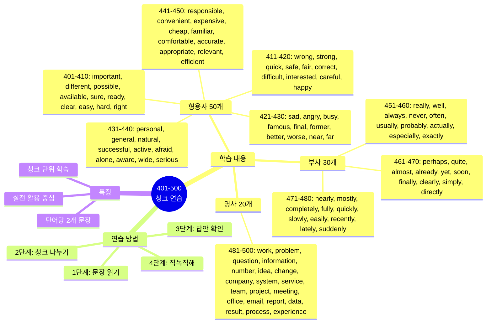
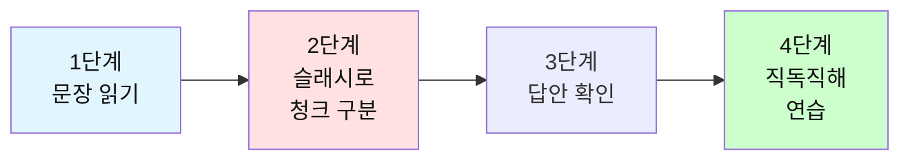

# 전설의 500단어 - 청크 나누기 연습 (401-500)

## 🎯 학습 구조 마인드맵



## 🎯 테스트 사용 방법

### 학습 단계


### 연습 방법

1. **문장 읽기**: 영어 문장을 소리내어 읽어보세요
2. **청크 나누기**: 의미 단위로 슬래시(/)로 구분해보세요
3. **답안 확인**: 제시된 청크 구분과 비교하세요
4. **직독직해**: 청크 순서대로 한국어로 해석하세요

---

## 📝 이 파일의 구성

**형용사 50개 + 부사 30개 + 명사 20개** = 총 100단어

**각 단어마다 2개의 문장으로 연습합니다.**

---

## 🔵 필수 형용사 50개 (401-450)

### 401. important

**문장 1**
```
This is a very important meeting.
```

**여러분의 청크:**
```
_________________________________
```

**답안:**
```
This is / a very important meeting.
이것은 / 매우 중요한 회의야
```

---

**문장 2**
```
It's important to stay focused.
```

**여러분의 청크:**
```
_________________________________
```

**답안:**
```
It's important / to stay / focused.
중요해 / 유지하는 것이 / 집중된 상태를
```

---

### 402. different

**문장 1**
```
We need a different approach.
```

**여러분의 청크:**
```
_________________________________
```

**답안:**
```
We need / a different approach.
우리는 필요해 / 다른 접근법이
```

---

**문장 2**
```
Everyone has different opinions.
```

**여러분의 청크:**
```
_________________________________
```

**답안:**
```
Everyone has / different opinions.
모두가 가지고 있어 / 다른 의견들을
```

---

### 403. possible

**문장 1**
```
Is it possible to finish by tomorrow?
```

**여러분의 청크:**
```
_________________________________
```

**답안:**
```
Is it possible / to finish / by tomorrow?
가능하니 / 끝내는 것이 / 내일까지?
```

---

**문장 2**
```
We'll do everything possible.
```

**여러분의 청크:**
```
_________________________________
```

**답안:**
```
We'll do / everything possible.
우리는 할 거야 / 가능한 모든 것을
```

---

### 404. available

**문장 1**
```
Are you available tomorrow?
```

**여러분의 청크:**
```
_________________________________
```

**답안:**
```
Are you available / tomorrow?
너 시간 있니 / 내일?
```

---

**문장 2**
```
This service is available 24/7.
```

**여러분의 청크:**
```
_________________________________
```

**답안:**
```
This service / is available / 24/7.
이 서비스는 / 이용 가능해 / 24시간 연중무휴
```

---

### 405. sure

**문장 1**
```
I'm not sure about that.
```

**여러분의 청크:**
```
_________________________________
```

**답안:**
```
I'm not sure / about that.
나는 확신하지 못해 / 그것에 대해
```

---

**문장 2**
```
Make sure you double-check everything.
```

**여러분의 청크:**
```
_________________________________
```

**답안:**
```
Make sure / you double-check / everything.
확실히 해 / 네가 재확인하는 것을 / 모든 것을
```

---

### 406. ready

**문장 1**
```
Are you ready to start?
```

**여러분의 청크:**
```
_________________________________
```

**답안:**
```
Are you ready / to start?
너 준비됐니 / 시작할?
```

---

**문장 2**
```
The report is ready for review.
```

**여러분의 청크:**
```
_________________________________
```

**답안:**
```
The report / is ready / for review.
보고서는 / 준비됐어 / 검토를 위해
```

---

### 407. clear

**문장 1**
```
Is that clear to everyone?
```

**여러분의 청크:**
```
_________________________________
```

**답안:**
```
Is that clear / to everyone?
그것이 명확하니 / 모두에게?
```

---

**문장 2**
```
Let me make this clear.
```

**여러분의 청크:**
```
_________________________________
```

**답안:**
```
Let me make / this / clear.
나에게 만들게 해줘 / 이것을 / 명확하게
```

---

### 408. easy

**문장 1**
```
This is easier than I thought.
```

**여러분의 청크:**
```
_________________________________
```

**답안:**
```
This is / easier / than I thought.
이것은 / 더 쉬워 / 내가 생각했던 것보다
```

---

**문장 2**
```
It's not easy to explain.
```

**여러분의 청크:**
```
_________________________________
```

**답안:**
```
It's not easy / to explain.
쉽지 않아 / 설명하는 것이
```

---

### 409. hard

**문장 1**
```
She works really hard.
```

**여러분의 청크:**
```
_________________________________
```

**답안:**
```
She works / really hard.
그녀는 일해 / 정말 열심히
```

---

**문장 2**
```
This is a hard decision to make.
```

**여러분의 청크:**
```
_________________________________
```

**답안:**
```
This is / a hard decision / to make.
이것은 / 어려운 결정이야 / 내리기에
```

---

### 410. right

**문장 1**
```
You're absolutely right.
```

**여러분의 청크:**
```
_________________________________
```

**답안:**
```
You're / absolutely right.
너는 / 완전히 옳아
```

---

**문장 2**
```
Is this the right way?
```

**여러분의 청크:**
```
_________________________________
```

**답안:**
```
Is this / the right way?
이것이니 / 올바른 길?
```

---

### 411. wrong

**문장 1**
```
Something is wrong with this.
```

**여러분의 청크:**
```
_________________________________
```

**답안:**
```
Something / is wrong / with this.
무언가가 / 잘못됐어 / 이것에
```

---

**문장 2**
```
I was wrong about that.
```

**여러분의 청크:**
```
_________________________________
```

**답안:**
```
I was wrong / about that.
나는 틀렸어 / 그것에 대해
```

---

### 412. strong

**문장 1**
```
We have a strong team.
```

**여러분의 청크:**
```
_________________________________
```

**답안:**
```
We have / a strong team.
우리는 가지고 있어 / 강한 팀을
```

---

**문장 2**
```
This is a strong argument.
```

**여러분의 청크:**
```
_________________________________
```

**답안:**
```
This is / a strong argument.
이것은 / 강력한 주장이야
```

---

### 413. quick

**문장 1**
```
Let me ask a quick question.
```

**여러분의 청크:**
```
_________________________________
```

**답안:**
```
Let me ask / a quick question.
나에게 물어보게 해줘 / 빠른 질문을
```

---

**문장 2**
```
We need a quick decision.
```

**여러분의 청크:**
```
_________________________________
```

**답안:**
```
We need / a quick decision.
우리는 필요해 / 빠른 결정이
```

---

### 414. safe

**문장 1**
```
Is it safe here?
```

**여러분의 청크:**
```
_________________________________
```

**답안:**
```
Is it / safe / here?
~이니 / 안전한 / 여기?
```

---

**문장 2**
```
Keep it in a safe place.
```

**여러분의 청크:**
```
_________________________________
```

**답안:**
```
Keep it / in a safe place.
보관해 그것을 / 안전한 장소에
```

---

### 415. fair

**문장 1**
```
That's not fair!
```

**여러분의 청크:**
```
_________________________________
```

**답안:**
```
That's not / fair!
그것은 아니야 / 공정한!
```

---

**문장 2**
```
Let's be fair about this.
```

**여러분의 청크:**
```
_________________________________
```

**답안:**
```
Let's be fair / about this.
공정하게 하자 / 이것에 대해
```

---

### 416. correct

**문장 1**
```
Is this answer correct?
```

**여러분의 청크:**
```
_________________________________
```

**답안:**
```
Is / this answer / correct?
~이니 / 이 답이 / 맞는?
```

---

**문장 2**
```
Please correct any errors.
```

**여러분의 청크:**
```
_________________________________
```

**답안:**
```
Please correct / any errors.
수정해주세요 / 모든 오류들을
```

---

### 417. difficult

**문장 1**
```
This is a difficult situation.
```

**여러분의 청크:**
```
_________________________________
```

**답안:**
```
This is / a difficult situation.
이것은 / 어려운 상황이야
```

---

**문장 2**
```
It's difficult to explain.
```

**여러분의 청크:**
```
_________________________________
```

**답안:**
```
It's difficult / to explain.
어려워 / 설명하는 것이
```

---

### 418. interested

**문장 1**
```
I'm interested in this project.
```

**여러분의 청크:**
```
_________________________________
```

**답안:**
```
I'm interested / in this project.
나는 관심있어 / 이 프로젝트에
```

---

**문장 2**
```
Are you interested?
```

**여러분의 청크:**
```
_________________________________
```

**답안:**
```
Are you / interested?
너는 / 관심있니?
```

---

### 419. careful

**문장 1**
```
Be careful with this.
```

**여러분의 청크:**
```
_________________________________
```

**답안:**
```
Be careful / with this.
조심해 / 이것을
```

---

**문장 2**
```
Please review this carefully.
```

**여러분의 청크:**
```
_________________________________
```

**답안:**
```
Please review / this / carefully.
검토해주세요 / 이것을 / 조심스럽게
```

---

### 420. happy

**문장 1**
```
I'm happy to help.
```

**여러분의 청크:**
```
_________________________________
```

**답안:**
```
I'm happy / to help.
나는 기뻐 / 도울 수 있어서
```

---

**문장 2**
```
Happy birthday!
```

**여러분의 청크:**
```
_________________________________
```

**답안:**
```
Happy / birthday!
행복한 / 생일!
```

---

### 421. sad

**문장 1**
```
I'm sad to hear that.
```

**여러분의 청크:**
```
_________________________________
```

**답안:**
```
I'm sad / to hear that.
나는 슬퍼 / 그것을 듣게 되어서
```

---

**문장 2**
```
That's a sad story.
```

**여러분의 청크:**
```
_________________________________
```

**답안:**
```
That's / a sad story.
그것은 / 슬픈 이야기야
```

---

### 422. angry

**문장 1**
```
Don't be angry with me.
```

**여러분의 청크:**
```
_________________________________
```

**답안:**
```
Don't be angry / with me.
화내지 마 / 나에게
```

---

**문장 2**
```
He looks angry.
```

**여러분의 청크:**
```
_________________________________
```

**답안:**
```
He looks / angry.
그는 보여 / 화난
```

---

### 423. busy

**문장 1**
```
I'm too busy right now.
```

**여러분의 청크:**
```
_________________________________
```

**답안:**
```
I'm / too busy / right now.
나는 / 너무 바빠 / 바로 지금
```

---

**문장 2**
```
It's been a busy week.
```

**여러분의 청크:**
```
_________________________________
```

**답안:**
```
It's been / a busy week.
그것은 되었어 / 바쁜 주가
```

---

### 424. famous

**문장 1**
```
She's a famous singer.
```

**여러분의 청크:**
```
_________________________________
```

**답안:**
```
She's / a famous singer.
그녀는 / 유명한 가수야
```

---

**문장 2**
```
This place is famous for coffee.
```

**여러분의 청크:**
```
_________________________________
```

**답안:**
```
This place / is famous / for coffee.
이 장소는 / 유명해 / 커피로
```

---

### 425. final

**문장 1**
```
This is my final offer.
```

**여러분의 청크:**
```
_________________________________
```

**답안:**
```
This is / my final offer.
이것은 / 내 최종 제안이야
```

---

**문장 2**
```
The final decision is yours.
```

**여러분의 청크:**
```
_________________________________
```

**답안:**
```
The final decision / is / yours.
최종 결정은 / ~이야 / 네 것
```

---

### 426. former

**문장 1**
```
He's my former boss.
```

**여러분의 청크:**
```
_________________________________
```

**답안:**
```
He's / my former boss.
그는 / 내 전 상사야
```

---

**문장 2**
```
The former system was better.
```

**여러분의 청크:**
```
_________________________________
```

**답안:**
```
The former system / was / better.
이전 시스템이 / ~였어 / 더 나은
```

---

### 427. better

**문장 1**
```
This is much better.
```

**여러분의 청크:**
```
_________________________________
```

**답안:**
```
This is / much better.
이것은 / 훨씬 나아
```

---

**문장 2**
```
Better late than never.
```

**여러분의 청크:**
```
_________________________________
```

**답안:**
```
Better / late / than never.
더 나아 / 늦는 것이 / 절대 안 하는 것보다
```

---

### 428. worse

**문장 1**
```
Things are getting worse.
```

**여러분의 청크:**
```
_________________________________
```

**답안:**
```
Things / are getting / worse.
일들이 / 되고 있어 / 더 나쁘게
```

---

**문장 2**
```
It could be worse.
```

**여러분의 청크:**
```
_________________________________
```

**답안:**
```
It could be / worse.
그것은 될 수 있어 / 더 나쁜
```

---

### 429. near

**문장 1**
```
The office is near the station.
```

**여러분의 청크:**
```
_________________________________
```

**답안:**
```
The office is / near the station.
사무실은 / 역 근처에 있어
```

---

**문장 2**
```
The deadline is near.
```

**여러분의 청크:**
```
_________________________________
```

**답안:**
```
The deadline / is near.
마감일이 / 가까워
```

---

### 430. far

**문장 1**
```
Is it far from here?
```

**여러분의 청크:**
```
_________________________________
```

**답안:**
```
Is it / far / from here?
~이니 / 멀 / 여기서?
```

---

**문장 2**
```
So far, everything is good.
```

**여러분의 청크:**
```
_________________________________
```

**답안:**
```
So far, / everything is / good.
지금까지는, / 모든 것이 / 좋아
```

---

### 431. personal

**문장 1**
```
This is a personal matter.
```

**여러분의 청크:**
```
_________________________________
```

**답안:**
```
This is / a personal matter.
이것은 / 개인적인 문제야
```

---

**문장 2**
```
May I ask a personal question?
```

**여러분의 청크:**
```
_________________________________
```

**답안:**
```
May I ask / a personal question?
내가 물어봐도 될까 / 개인적인 질문을?
```

---

### 432. general

**문장 1**
```
In general, I agree.
```

**여러분의 청크:**
```
_________________________________
```

**답안:**
```
In general, / I agree.
일반적으로, / 나는 동의해
```

---

**문장 2**
```
This is a general rule.
```

**여러분의 청크:**
```
_________________________________
```

**답안:**
```
This is / a general rule.
이것은 / 일반적인 규칙이야
```

---

### 433. natural

**문장 1**
```
It's a natural reaction.
```

**여러분의 청크:**
```
_________________________________
```

**답안:**
```
It's / a natural reaction.
그것은 / 자연스러운 반응이야
```

---

**문장 2**
```
She's a natural leader.
```

**여러분의 청크:**
```
_________________________________
```

**답안:**
```
She's / a natural leader.
그녀는 / 타고난 리더야
```

---

### 434. successful

**문장 1**
```
The project was successful.
```

**여러분의 청크:**
```
_________________________________
```

**답안:**
```
The project / was / successful.
프로젝트는 / ~였어 / 성공적인
```

---

**문장 2**
```
She's a successful businesswoman.
```

**여러분의 청크:**
```
_________________________________
```

**답안:**
```
She's / a successful businesswoman.
그녀는 / 성공한 사업가야
```

---

### 435. active

**문장 1**
```
She's very active in the community.
```

**여러분의 청크:**
```
_________________________________
```

**답안:**
```
She's very active / in the community.
그녀는 매우 활발해 / 지역사회에서
```

---

**문장 2**
```
Stay active and healthy.
```

**여러분의 청크:**
```
_________________________________
```

**답안:**
```
Stay / active and healthy.
유지해 / 활동적이고 건강하게
```

---

### 436. afraid

**문장 1**
```
Don't be afraid to ask.
```

**여러분의 청크:**
```
_________________________________
```

**답안:**
```
Don't be afraid / to ask.
두려워하지 마 / 물어보는 것을
```

---

**문장 2**
```
I'm afraid I can't help.
```

**여러분의 청크:**
```
_________________________________
```

**답안:**
```
I'm afraid / I can't help.
유감이지만 / 나는 도울 수 없어
```

---

### 437. alone

**문장 1**
```
I want to be alone.
```

**여러분의 청크:**
```
_________________________________
```

**답안:**
```
I want to / be alone.
나는 원해 / 혼자 있기를
```

---

**문장 2**
```
You're not alone in this.
```

**여러분의 청크:**
```
_________________________________
```

**답안:**
```
You're not alone / in this.
너는 혼자가 아니야 / 이것에서
```

---

### 438. aware

**문장 1**
```
Are you aware of this issue?
```

**여러분의 청크:**
```
_________________________________
```

**답안:**
```
Are you aware / of this issue?
너 알고 있니 / 이 문제를?
```

---

**문장 2**
```
I wasn't aware of that.
```

**여러분의 청크:**
```
_________________________________
```

**답안:**
```
I wasn't aware / of that.
나는 알지 못했어 / 그것을
```

---

### 439. wide

**문장 1**
```
We offer a wide range of services.
```

**여러분의 청크:**
```
_________________________________
```

**답안:**
```
We offer / a wide range / of services.
우리는 제공해 / 넓은 범위를 / 서비스의
```

---

**문장 2**
```
The door is wide open.
```

**여러분의 청크:**
```
_________________________________
```

**답안:**
```
The door / is / wide open.
문은 / ~이야 / 활짝 열린
```

---

### 440. serious

**문장 1**
```
This is a serious problem.
```

**여러분의 청크:**
```
_________________________________
```

**답안:**
```
This is / a serious problem.
이것은 / 심각한 문제야
```

---

**문장 2**
```
I'm serious about this.
```

**여러분의 청크:**
```
_________________________________
```

**답안:**
```
I'm serious / about this.
나는 진지해 / 이것에 대해
```

---

### 441. responsible

**문장 1**
```
Who is responsible for this?
```

**여러분의 청크:**
```
_________________________________
```

**답안:**
```
Who / is responsible / for this?
누가 / 책임이 있니 / 이것에 대해?
```

---

**문장 2**
```
I'm responsible for the project.
```

**여러분의 청크:**
```
_________________________________
```

**답안:**
```
I'm responsible / for the project.
나는 책임져 / 프로젝트를
```

---

### 442. convenient

**문장 1**
```
Is this time convenient for you?
```

**여러분의 청크:**
```
_________________________________
```

**답안:**
```
Is / this time / convenient / for you?
~이니 / 이 시간이 / 편한 / 너에게?
```

---

**문장 2**
```
This is a convenient location.
```

**여러분의 청크:**
```
_________________________________
```

**답안:**
```
This is / a convenient location.
이것은 / 편리한 위치야
```

---

### 443. expensive

**문장 1**
```
This is too expensive.
```

**여러분의 청크:**
```
_________________________________
```

**답안:**
```
This is / too expensive.
이것은 / 너무 비싸
```

---

**문장 2**
```
We need a less expensive option.
```

**여러분의 청크:**
```
_________________________________
```

**답안:**
```
We need / a less expensive option.
우리는 필요해 / 덜 비싼 선택이
```

---

### 444. cheap

**문장 1**
```
I found a cheap hotel.
```

**여러분의 청크:**
```
_________________________________
```

**답안:**
```
I found / a cheap hotel.
나는 찾았어 / 저렴한 호텔을
```

---

**문장 2**
```
This is surprisingly cheap.
```

**여러분의 청크:**
```
_________________________________
```

**답안:**
```
This is / surprisingly cheap.
이것은 / 놀랍게도 싸
```

---

### 445. familiar

**문장 1**
```
This looks familiar.
```

**여러분의 청크:**
```
_________________________________
```

**답안:**
```
This looks / familiar.
이것은 보여 / 익숙한
```

---

**문장 2**
```
Are you familiar with this system?
```

**여러분의 청크:**
```
_________________________________
```

**답안:**
```
Are you familiar / with this system?
너 익숙하니 / 이 시스템에?
```

---

### 446. comfortable

**문장 1**
```
Make yourself comfortable.
```

**여러분의 청크:**
```
_________________________________
```

**답안:**
```
Make yourself / comfortable.
편하게 해 네 자신을 / 편안하게
```

---

**문장 2**
```
I'm comfortable with this plan.
```

**여러분의 청크:**
```
_________________________________
```

**답안:**
```
I'm comfortable / with this plan.
나는 편해 / 이 계획에
```

---

### 447. accurate

**문장 1**
```
Is this information accurate?
```

**여러분의 청크:**
```
_________________________________
```

**답안:**
```
Is / this information / accurate?
~이니 / 이 정보가 / 정확한?
```

---

**문장 2**
```
We need accurate data.
```

**여러분의 청크:**
```
_________________________________
```

**답안:**
```
We need / accurate data.
우리는 필요해 / 정확한 데이터가
```

---

### 448. appropriate

**문장 1**
```
Is this appropriate?
```

**여러분의 청크:**
```
_________________________________
```

**답안:**
```
Is / this / appropriate?
~이니 / 이것이 / 적절한?
```

---

**문장 2**
```
Please take appropriate action.
```

**여러분의 청크:**
```
_________________________________
```

**답안:**
```
Please take / appropriate action.
취해주세요 / 적절한 조치를
```

---

### 449. relevant

**문장 1**
```
This is relevant to our discussion.
```

**여러분의 청크:**
```
_________________________________
```

**답안:**
```
This is relevant / to our discussion.
이것은 관련있어 / 우리의 논의에
```

---

**문장 2**
```
Please provide relevant information.
```

**여러분의 청크:**
```
_________________________________
```

**답안:**
```
Please provide / relevant information.
제공해주세요 / 관련 정보를
```

---

### 450. efficient

**문장 1**
```
This is a very efficient system.
```

**여러분의 청크:**
```
_________________________________
```

**답안:**
```
This is / a very efficient system.
이것은 / 매우 효율적인 시스템이야
```

---

**문장 2**
```
We need to be more efficient.
```

**여러분의 청크:**
```
_________________________________
```

**답안:**
```
We need to / be / more efficient.
우리는 필요해 / ~일 / 더 효율적인
```

---

## 🟡 필수 부사 30개 (451-480)

### 451. really

**문장 1**
```
I really appreciate your help.
```

**여러분의 청크:**
```
_________________________________
```

**답안:**
```
I really appreciate / your help.
나는 정말 감사해 / 네 도움을
```

---

**문장 2**
```
Is this really necessary?
```

**여러분의 청크:**
```
_________________________________
```

**답안:**
```
Is this / really necessary?
이것이 / 정말 필요하니?
```

---

### 452. well

**문장 1**
```
Everything is going well.
```

**여러분의 청크:**
```
_________________________________
```

**답안:**
```
Everything / is going / well.
모든 것이 / 되고 있어 / 잘
```

---

**문장 2**
```
She speaks English very well.
```

**여러분의 청크:**
```
_________________________________
```

**답안:**
```
She speaks / English / very well.
그녀는 말해 / 영어를 / 매우 잘
```

---

### 453. always

**문장 1**
```
I always check my email in the morning.
```

**여러분의 청크:**
```
_________________________________
```

**답안:**
```
I always check / my email / in the morning.
나는 항상 확인해 / 내 이메일을 / 아침에
```

---

**문장 2**
```
You can always count on me.
```

**여러분의 청크:**
```
_________________________________
```

**답안:**
```
You can always / count on me.
너는 항상 할 수 있어 / 나를 믿는 것을
```

---

### 454. never

**문장 1**
```
I've never been to Japan.
```

**여러분의 청크:**
```
_________________________________
```

**답안:**
```
I've never been / to Japan.
나는 가본 적 없어 / 일본에
```

---

**문장 2**
```
Never give up!
```

**여러분의 청크:**
```
_________________________________
```

**답안:**
```
Never / give up!
절대 / 포기하지 마!
```

---

### 455. often

**문장 1**
```
How often do you exercise?
```

**여러분의 청크:**
```
_________________________________
```

**답안:**
```
How often / do you exercise?
얼마나 자주 / 너는 운동하니?
```

---

**문장 2**
```
I often work from home.
```

**여러분의 청크:**
```
_________________________________
```

**답안:**
```
I often work / from home.
나는 자주 일해 / 집에서
```

---

### 456. usually

**문장 1**
```
I usually leave work at 6 PM.
```

**여러분의 청크:**
```
_________________________________
```

**답안:**
```
I usually leave / work / at 6 PM.
나는 보통 떠나 / 직장을 / 오후 6시에
```

---

**문장 2**
```
She's usually very punctual.
```

**여러분의 청크:**
```
_________________________________
```

**답안:**
```
She's usually / very punctual.
그녀는 보통 / 매우 시간을 잘 지켜
```

---

### 457. probably

**문장 1**
```
He's probably stuck in traffic.
```

**여러분의 청크:**
```
_________________________________
```

**답안:**
```
He's probably / stuck / in traffic.
그는 아마도 / 갇혀있어 / 교통 체증에
```

---

**문장 2**
```
This will probably take an hour.
```

**여러분의 청크:**
```
_________________________________
```

**답안:**
```
This will probably take / an hour.
이것은 아마도 걸릴 거야 / 한 시간
```

---

### 458. actually

**문장 1**
```
Actually, I have a better idea.
```

**여러분의 청크:**
```
_________________________________
```

**답안:**
```
Actually, / I have / a better idea.
사실, / 나는 가지고 있어 / 더 나은 아이디어를
```

---

**문장 2**
```
This is actually quite simple.
```

**여러분의 청크:**
```
_________________________________
```

**답안:**
```
This is / actually / quite simple.
이것은 / 사실 / 꽤 간단해
```

---

### 459. especially

**문장 1**
```
I love traveling, especially to Asia.
```

**여러분의 청크:**
```
_________________________________
```

**답안:**
```
I love traveling, / especially / to Asia.
나는 여행하는 것을 좋아해, / 특히 / 아시아로
```

---

**문장 2**
```
This is especially important for beginners.
```

**여러분의 청크:**
```
_________________________________
```

**답안:**
```
This is / especially important / for beginners.
이것은 / 특히 중요해 / 초보자들에게
```

---

### 460. exactly

**문장 1**
```
That's exactly what I meant.
```

**여러분의 청크:**
```
_________________________________
```

**답안:**
```
That's exactly / what I meant.
그것이 정확히 / 내가 의미했던 것이야
```

---

**문장 2**
```
What exactly do you need?
```

**여러분의 청크:**
```
_________________________________
```

**답안:**
```
What exactly / do you need?
정확히 무엇을 / 너는 필요하니?
```

---

### 461. perhaps

**문장 1**
```
Perhaps we should wait.
```

**여러분의 청크:**
```
_________________________________
```

**답안:**
```
Perhaps / we should wait.
아마도 / 우리는 기다려야 해
```

---

**문장 2**
```
This is perhaps the best option.
```

**여러분의 청크:**
```
_________________________________
```

**답안:**
```
This is / perhaps / the best option.
이것은 / 아마도 / 최선의 선택이야
```

---

### 462. quite

**문장 1**
```
This is quite important.
```

**여러분의 청크:**
```
_________________________________
```

**답안:**
```
This is / quite important.
이것은 / 꽤 중요해
```

---

**문장 2**
```
I'm quite sure about this.
```

**여러분의 청크:**
```
_________________________________
```

**답안:**
```
I'm quite sure / about this.
나는 꽤 확신해 / 이것에 대해
```

---

### 463. almost

**문장 1**
```
We're almost done.
```

**여러분의 청크:**
```
_________________________________
```

**답안:**
```
We're / almost done.
우리는 / 거의 끝났어
```

---

**문장 2**
```
It's almost time to go.
```

**여러분의 청크:**
```
_________________________________
```

**답안:**
```
It's / almost time / to go.
거의 / 시간이야 / 갈
```

---

### 464. already

**문장 1**
```
I've already finished.
```

**여러분의 청크:**
```
_________________________________
```

**답안:**
```
I've already / finished.
나는 이미 / 끝냈어
```

---

**문장 2**
```
Are you leaving already?
```

**여러분의 청크:**
```
_________________________________
```

**답안:**
```
Are you leaving / already?
너 떠나니 / 벌써?
```

---

### 465. yet

**문장 1**
```
I haven't finished yet.
```

**여러분의 청크:**
```
_________________________________
```

**답안:**
```
I haven't finished / yet.
나는 끝내지 못했어 / 아직
```

---

**문장 2**
```
Is he here yet?
```

**여러분의 청크:**
```
_________________________________
```

**답안:**
```
Is he / here / yet?
그가 / 여기 / 아직?
```

---

### 466. soon

**문장 1**
```
I'll be there soon.
```

**여러분의 청크:**
```
_________________________________
```

**답안:**
```
I'll be there / soon.
나는 거기 있을 거야 / 곧
```

---

**문장 2**
```
See you soon!
```

**여러분의 청크:**
```
_________________________________
```

**답안:**
```
See you / soon!
봐 너를 / 곧!
```

---

### 467. finally

**문장 1**
```
Finally, we're done!
```

**여러분의 청크:**
```
_________________________________
```

**답안:**
```
Finally, / we're done!
마침내, / 우리는 끝났어!
```

---

**문장 2**
```
I finally understand.
```

**여러분의 청크:**
```
_________________________________
```

**답안:**
```
I finally / understand.
나는 드디어 / 이해해
```

---

### 468. clearly

**문장 1**
```
She explained it very clearly.
```

**여러분의 청크:**
```
_________________________________
```

**답안:**
```
She explained it / very clearly.
그녀는 설명했어 그것을 / 매우 명확하게
```

---

**문장 2**
```
Clearly, we need to make changes.
```

**여러분의 청크:**
```
_________________________________
```

**답안:**
```
Clearly, / we need to / make changes.
명백히, / 우리는 필요해 / 변화를 만들
```

---

### 469. simply

**문장 1**
```
Simply click here.
```

**여러분의 청크:**
```
_________________________________
```

**답안:**
```
Simply / click here.
간단히 / 여기를 클릭해
```

---

**문장 2**
```
I simply don't understand.
```

**여러분의 청크:**
```
_________________________________
```

**답안:**
```
I simply / don't understand.
나는 정말 / 이해하지 못해
```

---

### 470. directly

**문장 1**
```
Contact me directly.
```

**여러분의 청크:**
```
_________________________________
```

**답안:**
```
Contact me / directly.
연락해 나에게 / 직접
```

---

**문장 2**
```
Go directly to the office.
```

**여러분의 청크:**
```
_________________________________
```

**답안:**
```
Go directly / to the office.
가 직접 / 사무실로
```

---

### 471. nearly

**문장 1**
```
It's nearly time.
```

**여러분의 청크:**
```
_________________________________
```

**답안:**
```
It's / nearly time.
거의 / 시간이야
```

---

**문장 2**
```
We're nearly there.
```

**여러분의 청크:**
```
_________________________________
```

**답안:**
```
We're / nearly there.
우리는 / 거의 다 왔어
```

---

### 472. mostly

**문장 1**
```
I mostly work from home.
```

**여러분의 청크:**
```
_________________________________
```

**답안:**
```
I mostly work / from home.
나는 주로 일해 / 집에서
```

---

**문장 2**
```
It's mostly correct.
```

**여러분의 청크:**
```
_________________________________
```

**답안:**
```
It's / mostly correct.
그것은 / 대부분 맞아
```

---

### 473. completely

**문장 1**
```
I completely agree.
```

**여러분의 청크:**
```
_________________________________
```

**답안:**
```
I completely / agree.
나는 완전히 / 동의해
```

---

**문장 2**
```
This is completely different.
```

**여러분의 청크:**
```
_________________________________
```

**답안:**
```
This is / completely different.
이것은 / 완전히 달라
```

---

### 474. fully

**문장 1**
```
I fully understand your concern.
```

**여러분의 청크:**
```
_________________________________
```

**답안:**
```
I fully understand / your concern.
나는 완전히 이해해 / 네 우려를
```

---

**문장 2**
```
The project is fully funded.
```

**여러분의 청크:**
```
_________________________________
```

**답안:**
```
The project / is fully funded.
프로젝트는 / 완전히 자금이 지원돼
```

---

### 475. quickly

**문장 1**
```
Please respond quickly.
```

**여러분의 청크:**
```
_________________________________
```

**답안:**
```
Please respond / quickly.
응답해주세요 / 빠르게
```

---

**문장 2**
```
Time passes quickly.
```

**여러분의 청크:**
```
_________________________________
```

**답안:**
```
Time / passes / quickly.
시간이 / 지나가 / 빠르게
```

---

### 476. slowly

**문장 1**
```
Please speak slowly.
```

**여러분의 청크:**
```
_________________________________
```

**답안:**
```
Please speak / slowly.
말해주세요 / 천천히
```

---

**문장 2**
```
The project is moving slowly.
```

**여러분의 청크:**
```
_________________________________
```

**답안:**
```
The project / is moving / slowly.
프로젝트가 / 진행되고 있어 / 천천히
```

---

### 477. easily

**문장 1**
```
You can easily fix this.
```

**여러분의 청크:**
```
_________________________________
```

**답안:**
```
You can easily / fix / this.
너는 쉽게 할 수 있어 / 고치는 것을 / 이것을
```

---

**문장 2**
```
This problem is easily solved.
```

**여러분의 청크:**
```
_________________________________
```

**답안:**
```
This problem / is easily solved.
이 문제는 / 쉽게 해결돼
```

---

### 478. recently

**문장 1**
```
I recently started a new job.
```

**여러분의 청크:**
```
_________________________________
```

**답안:**
```
I recently started / a new job.
나는 최근에 시작했어 / 새 직장을
```

---

**문장 2**
```
Have you seen her recently?
```

**여러분의 청크:**
```
_________________________________
```

**답안:**
```
Have you seen her / recently?
너 봤니 그녀를 / 최근에?
```

---

### 479. lately

**문장 1**
```
How have you been lately?
```

**여러분의 청크:**
```
_________________________________
```

**답안:**
```
How have you been / lately?
어떻게 지냈니 / 최근에?
```

---

**문장 2**
```
I've been busy lately.
```

**여러분의 청크:**
```
_________________________________
```

**답안:**
```
I've been busy / lately.
나는 바빴어 / 최근에
```

---

### 480. suddenly

**문장 1**
```
Suddenly, everything changed.
```

**여러분의 청크:**
```
_________________________________
```

**답안:**
```
Suddenly, / everything changed.
갑자기, / 모든 것이 변했어
```

---

**문장 2**
```
The system suddenly stopped working.
```

**여러분의 청크:**
```
_________________________________
```

**답안:**
```
The system / suddenly stopped / working.
시스템이 / 갑자기 멈췄어 / 작동하는 것을
```

---

## 🟢 필수 명사 20개 (481-500)

### 481. work

**문장 1**
```
I have a lot of work to do.
```

**여러분의 청크:**
```
_________________________________
```

**답안:**
```
I have / a lot of work / to do.
나는 가지고 있어 / 많은 일을 / 해야 할
```

---

**문장 2**
```
Great work on the project!
```

**여러분의 청크:**
```
_________________________________
```

**답안:**
```
Great work / on the project!
훌륭한 일이야 / 프로젝트에서!
```

---

### 482. problem

**문장 1**
```
We have a problem with the system.
```

**여러분의 청크:**
```
_________________________________
```

**답안:**
```
We have / a problem / with the system.
우리는 가지고 있어 / 문제를 / 시스템에
```

---

**문장 2**
```
No problem, I can help.
```

**여러분의 청크:**
```
_________________________________
```

**답안:**
```
No problem, / I can help.
문제없어, / 나는 도울 수 있어
```

---

### 483. question

**문장 1**
```
Can I ask you a question?
```

**여러분의 청크:**
```
_________________________________
```

**답안:**
```
Can I ask you / a question?
내가 물어볼 수 있을까 너에게 / 질문을?
```

---

**문장 2**
```
That's a good question.
```

**여러분의 청크:**
```
_________________________________
```

**답안:**
```
That's / a good question.
그것은 / 좋은 질문이야
```

---

### 484. information

**문장 1**
```
I need more information about this.
```

**여러분의 청크:**
```
_________________________________
```

**답안:**
```
I need / more information / about this.
나는 필요해 / 더 많은 정보가 / 이것에 대한
```

---

**문장 2**
```
Where can I find this information?
```

**여러분의 청크:**
```
_________________________________
```

**답안:**
```
Where can I find / this information?
어디서 찾을 수 있을까 / 이 정보를?
```

---

### 485. number

**문장 1**
```
What's your phone number?
```

**여러분의 청크:**
```
_________________________________
```

**답안:**
```
What's / your phone number?
뭐니 / 네 전화번호는?
```

---

**문장 2**
```
The number of users is increasing.
```

**여러분의 청크:**
```
_________________________________
```

**답안:**
```
The number / of users / is increasing.
숫자가 / 사용자들의 / 증가하고 있어
```

---

### 486. idea

**문장 1**
```
That's a brilliant idea!
```

**여러분의 청크:**
```
_________________________________
```

**답안:**
```
That's / a brilliant idea!
그것은 / 훌륭한 아이디어야!
```

---

**문장 2**
```
I have no idea what you mean.
```

**여러분의 청크:**
```
_________________________________
```

**답안:**
```
I have / no idea / what you mean.
나는 가지고 있지 않아 / 아이디어를 / 네가 의미하는 것에 대한
```

---

### 487. change

**문장 1**
```
We need to make some changes.
```

**여러분의 청크:**
```
_________________________________
```

**답안:**
```
We need to / make / some changes.
우리는 필요해 / 만들 / 몇 가지 변화를
```

---

**문장 2**
```
Change is inevitable.
```

**여러분의 청크:**
```
_________________________________
```

**답안:**
```
Change / is / inevitable.
변화는 / ~이야 / 불가피한
```

---

### 488. company

**문장 1**
```
Which company do you work for?
```

**여러분의 청크:**
```
_________________________________
```

**답안:**
```
Which company / do you work for?
어느 회사에 / 너는 일하니?
```

---

**문장 2**
```
Our company is growing rapidly.
```

**여러분의 청크:**
```
_________________________________
```

**답안:**
```
Our company / is growing / rapidly.
우리 회사는 / 성장하고 있어 / 빠르게
```

---

### 489. system

**문장 1**
```
The system is down right now.
```

**여러분의 청크:**
```
_________________________________
```

**답안:**
```
The system / is down / right now.
시스템이 / 다운됐어 / 바로 지금
```

---

**문장 2**
```
We need a better system.
```

**여러분의 청크:**
```
_________________________________
```

**답안:**
```
We need / a better system.
우리는 필요해 / 더 나은 시스템이
```

---

### 490. service

**문장 1**
```
Customer service is very important.
```

**여러분의 청크:**
```
_________________________________
```

**답안:**
```
Customer service / is / very important.
고객 서비스는 / ~이야 / 매우 중요한
```

---

**문장 2**
```
We offer 24-hour service.
```

**여러분의 청크:**
```
_________________________________
```

**답안:**
```
We offer / 24-hour service.
우리는 제공해 / 24시간 서비스를
```

---

### 491. team

**문장 1**
```
Our team is working hard on this.
```

**여러분의 청크:**
```
_________________________________
```

**답안:**
```
Our team / is working hard / on this.
우리 팀은 / 열심히 일하고 있어 / 이것을
```

---

**문장 2**
```
Welcome to the team!
```

**여러분의 청크:**
```
_________________________________
```

**답안:**
```
Welcome / to the team!
환영해 / 팀에!
```

---

### 492. project

**문장 1**
```
This project is due next week.
```

**여러분의 청크:**
```
_________________________________
```

**답안:**
```
This project / is due / next week.
이 프로젝트는 / 마감이야 / 다음 주에
```

---

**문장 2**
```
How's the project going?
```

**여러분의 청크:**
```
_________________________________
```

**답안:**
```
How's / the project / going?
어때 / 프로젝트가 / 되어가니?
```

---

### 493. meeting

**문장 1**
```
The meeting starts at 2 PM.
```

**여러분의 청크:**
```
_________________________________
```

**답안:**
```
The meeting / starts / at 2 PM.
회의는 / 시작해 / 오후 2시에
```

---

**문장 2**
```
Can we schedule a meeting?
```

**여러분의 청크:**
```
_________________________________
```

**답안:**
```
Can we schedule / a meeting?
우리가 일정 잡을 수 있을까 / 회의를?
```

---

### 494. office

**문장 1**
```
I'll be in the office all day.
```

**여러분의 청크:**
```
_________________________________
```

**답안:**
```
I'll be / in the office / all day.
나는 있을 거야 / 사무실에 / 하루 종일
```

---

**문장 2**
```
Our office is on the 5th floor.
```

**여러분의 청크:**
```
_________________________________
```

**답안:**
```
Our office / is / on the 5th floor.
우리 사무실은 / 있어 / 5층에
```

---

### 495. email

**문장 1**
```
I'll send you an email later.
```

**여러분의 청크:**
```
_________________________________
```

**답안:**
```
I'll send you / an email / later.
나는 보낼 거야 너에게 / 이메일을 / 나중에
```

---

**문장 2**
```
Did you get my email?
```

**여러분의 청크:**
```
_________________________________
```

**답안:**
```
Did you get / my email?
너 받았니 / 내 이메일을?
```

---

### 496. report

**문장 1**
```
The report is ready for review.
```

**여러분의 청크:**
```
_________________________________
```

**답안:**
```
The report / is ready / for review.
보고서는 / 준비됐어 / 검토를 위해
```

---

**문장 2**
```
Can you send me the report?
```

**여러분의 청크:**
```
_________________________________
```

**답안:**
```
Can you send me / the report?
너 보낼 수 있니 나에게 / 보고서를?
```

---

### 497. data

**문장 1**
```
We need more data to analyze.
```

**여러분의 청크:**
```
_________________________________
```

**답안:**
```
We need / more data / to analyze.
우리는 필요해 / 더 많은 데이터가 / 분석할
```

---

**문장 2**
```
The data shows interesting trends.
```

**여러분의 청크:**
```
_________________________________
```

**답안:**
```
The data / shows / interesting trends.
데이터가 / 보여줘 / 흥미로운 추세들을
```

---

### 498. result

**문장 1**
```
The results are very promising.
```

**여러분의 청크:**
```
_________________________________
```

**답안:**
```
The results / are / very promising.
결과들은 / ~이야 / 매우 유망한
```

---

**문장 2**
```
As a result, we decided to proceed.
```

**여러분의 청크:**
```
_________________________________
```

**답안:**
```
As a result, / we decided / to proceed.
결과적으로, / 우리는 결정했어 / 진행하기로
```

---

### 499. process

**문장 1**
```
This is a complex process.
```

**여러분의 청크:**
```
_________________________________
```

**답안:**
```
This is / a complex process.
이것은 / 복잡한 과정이야
```

---

**문장 2**
```
We need to improve the process.
```

**여러분의 청크:**
```
_________________________________
```

**답안:**
```
We need to / improve / the process.
우리는 필요해 / 개선할 / 과정을
```

---

### 500. experience

**문장 1**
```
Do you have any experience with this?
```

**여러분의 청크:**
```
_________________________________
```

**답안:**
```
Do you have / any experience / with this?
너 가지고 있니 / 어떤 경험을 / 이것과 함께?
```

---

**문장 2**
```
This was a great learning experience.
```

**여러분의 청크:**
```
_________________________________
```

**답안:**
```
This was / a great learning experience.
이것은 / 훌륭한 배움의 경험이었어
```

---

## 🎉 축하합니다! 500단어 완성!

당신은 이제 **전설의 500단어**를 모두 청크 단위로 연습했습니다!

---

## 📝 학습 기록

### 진도 체크리스트
- [ ] 형용사 401-410 연습 완료
- [ ] 형용사 411-420 연습 완료
- [ ] 형용사 421-430 연습 완료
- [ ] 형용사 431-440 연습 완료
- [ ] 형용사 441-450 연습 완료
- [ ] 부사 451-460 연습 완료
- [ ] 부사 461-470 연습 완료
- [ ] 부사 471-480 연습 완료
- [ ] 명사 481-490 연습 완료
- [ ] 명사 491-500 연습 완료

---

## 🎓 전체 파일 목록

**전체 청크 연습 파일:**
- 📘 [청크 연습 001-100](./전설의_500단어_청크_연습_001-100.md) - 동사/명사/형용사
- 📘 [청크 연습 101-200](./전설의_500단어_청크_연습_101-200.md) - 형용사/부사
- 📘 [청크 연습 201-300](./전설의_500단어_청크_연습_201-300.md) - 전치사/접속사/대명사
- 📘 [청크 연습 301-400](./전설의_500단어_청크_연습_301-400.md) - 동사/명사
- 📘 [청크 연습 401-500](./전설의_500단어_청크_연습_401-500.md) - 형용사/부사/명사 (현재 파일)

---

## 💡 다음 단계

### 1. 복습 전략
- **1주차**: 001-100 집중 연습
- **2주차**: 101-200 집중 연습
- **3주차**: 201-300 집중 연습
- **4주차**: 301-400 집중 연습
- **5주차**: 401-500 집중 연습
- **6주차**: 전체 복습

### 2. 실전 적용
- 매일 10개 단어씩 실제 문장 만들기
- 영어 뉴스/기사에서 배운 단어 찾기
- 회화에서 청크 단위로 말하기 연습

### 3. 테스트
- 📝 [전설의 500단어 테스트](./전설의_500단어_테스트.md)로 실력 확인

---

**💪 50일간 매일 10개씩 연습하면 500단어 완전 마스터!**

**축하합니다! 당신은 이제 영어 독해의 핵심 500단어를 청크 단위로 이해할 수 있습니다!**

*청크 나누기는 개인차가 있을 수 있습니다. 제시된 답안은 기본 청크이며, 자신에게 편한 방식으로 조정해도 좋습니다.*

**Last Updated: 2026-01-11**
