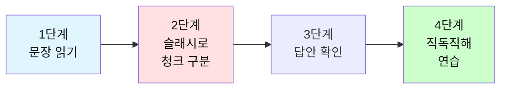
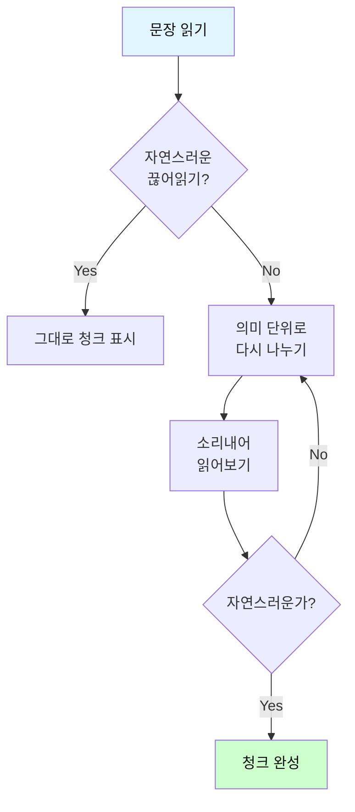
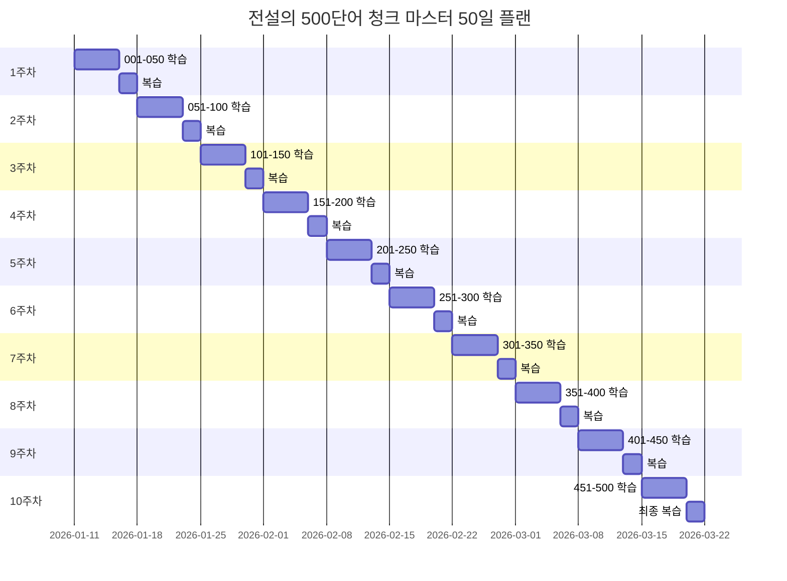

# 전설의 500단어 - 청크 나누기 연습 테스트

## 🎯 테스트 사용 방법

### 학습 단계


### 연습 방법

1. **문장 읽기**: 영어 문장을 소리내어 읽어보세요
2. **청크 나누기**: 의미 단위로 슬래시(/)로 구분해보세요
3. **답안 확인**: 제시된 청크 구분과 비교하세요
4. **직독직해**: 청크 순서대로 한국어로 해석하세요

---

## 📚 500단어 청크 연습 파일 목록

전설의 500단어를 **100개씩 5개 파일**로 나누어 제공합니다.

### 📘 파일별 구성

| 파일 | 단어 범위 | 구성 | 링크 |
|------|----------|------|------|
| **001-100** | 001-100 | 동사 50개 + 명사 30개 + 형용사 20개 | [바로가기](./전설의_500단어_청크_연습_001-100.md) |
| **101-200** | 101-200 | 형용사 50개 + 부사 50개 | [바로가기](./전설의_500단어_청크_연습_101-200.md) |
| **201-300** | 201-300 | 전치사 50개 + 접속사 30개 + 대명사 20개 | [바로가기](./전설의_500단어_청크_연습_201-300.md) |
| **301-400** | 301-400 | 동사 50개 + 명사 50개 | [바로가기](./전설의_500단어_청크_연습_301-400.md) |
| **401-500** | 401-500 | 형용사 50개 + 부사 30개 + 명사 20개 | [바로가기](./전설의_500단어_청크_연습_401-500.md) |

---

## 🎯 청크 나누기 팁

### 청크란?
- **의미 단위**: 함께 이해되는 단어 묶음
- **호흡 단위**: 한 번에 읽을 수 있는 덩어리
- **이해 단위**: 바로 해석 가능한 그룹

### 청크 나누는 기준

1. **주어 + 동사**: I have / We need to
2. **동사 + 목적어**: finish this / learn more
3. **전치사구**: in the office / for 5 years
4. **to 부정사구**: to finish / to learn
5. **접속사 앞뒤**: and / but / because

### 연습 방법



---

## 📝 학습 기록

### 전체 진도 체크리스트
- [ ] 001-100 연습 완료 (동사/명사/형용사)
- [ ] 101-200 연습 완료 (형용사/부사)
- [ ] 201-300 연습 완료 (전치사/접속사/대명사)
- [ ] 301-400 연습 완료 (동사/명사)
- [ ] 401-500 연습 완료 (형용사/부사/명사)

### 복습 주기
1. **1일차**: 신규 단어 10개 학습
2. **2일차**: 어제 단어 복습 + 신규 10개
3. **3일차**: 이틀 전 단어 복습 + 신규 10개
4. **7일차**: 주간 전체 복습
5. **30일차**: 월간 전체 복습

---

## 💡 직독직해 연습 포인트

### 영어 어순 익히기
```
영어: I / want to / learn / English.
     ↓      ↓       ↓        ↓
한국어: 나는 / 원해 / 배우기를 / 영어를
```

### 핵심 원칙
1. **뒤에서 앞으로 해석하지 말 것**
2. **청크 순서대로 이해하기**
3. **영어 어순에 익숙해지기**
4. **빠른 이해가 목표**

---

## 📊 학습 로드맵

### 50일 완성 플랜



---

## 🎓 다음 단계

**원본 파일로 더 많은 단어 학습:**
- 📘 [전설의_500단어_1-100.md](./전설의_500단어_1-100.md) - 동사/명사 100개
- 📘 [전설의_500단어_101-200.md](./전설의_500단어_101-200.md) - 형용사/부사 100개
- 📘 [전설의_500단어_201-300.md](./전설의_500단어_201-300.md) - 전치사/접속사 100개
- 📘 [전설의_500단어_301-400.md](./전설의_500단어_301-400.md) - 동사/명사 100개
- 📘 [전설의_500단어_401-500.md](./전설의_500단어_401-500.md) - 형용사 100개

**테스트로 실력 확인:**
- 📝 [전설의 500단어 테스트](./전설의_500단어_테스트.md) - 종합 테스트

---

## 🌟 학습 팁

### 효과적인 청크 연습법

1. **소리내어 읽기**: 청크 단위로 끊어서 읽으세요
2. **의미 파악**: 각 청크의 의미를 즉시 이해하세요
3. **반복 연습**: 같은 문장을 5번 이상 반복하세요
4. **속도 향상**: 점차 빠르게 읽는 연습을 하세요
5. **실전 적용**: 실제 영어 문장에서 청크를 찾아보세요

### 청크 크기 조절

```
초급: I have / a question.
      (2개 청크)

중급: I have / a question / about the project.
      (3개 청크)

고급: I have / a question / about the project / that we discussed / yesterday.
      (5개 청크)
```

---

## 📈 진도 추적

### 일일 학습 기록표

| 날짜 | 학습 범위 | 완료 여부 | 복습 필요 |
|------|----------|----------|----------|
| Day 1 | 001-010 | ☐ | ☐ |
| Day 2 | 011-020 | ☐ | ☐ |
| Day 3 | 021-030 | ☐ | ☐ |
| Day 4 | 031-040 | ☐ | ☐ |
| Day 5 | 041-050 | ☐ | ☐ |
| ... | ... | ... | ... |

---

## 💪 성공을 위한 조언

### 학습 마인드셋

1. **완벽보다 진행**: 100% 이해하려 하지 말고 계속 진행하세요
2. **꾸준함이 핵심**: 매일 10개씩이 하루 100개보다 효과적입니다
3. **실수는 배움**: 틀린 청크 구분도 학습 과정입니다
4. **실전 적용**: 배운 것을 실제로 사용해보세요
5. **즐기기**: 재미있게 학습하는 것이 가장 중요합니다

---

**💪 매일 10개씩 연습하면 50일이면 500단어 마스터!**

*청크 나누기는 개인차가 있을 수 있습니다. 제시된 답안은 기본 청크이며, 자신에게 편한 방식으로 조정해도 좋습니다.*

**Last Updated: 2026-01-11**

---

## 📞 추가 학습 자료

### 관련 파일
- 📖 [독해 마스터 가이드](./00_독해_마스터_가이드.md)
- 📖 [기초 독해 패턴](./01_기초_독해_패턴.md)
- 📖 [자막 독해 패턴](./02_자막_독해_패턴.md)
- 📖 [논문 독해 패턴](./03_논문_독해_패턴.md)
- 📖 [고급 독해 전략](./04_고급_독해_전략.md)
- 📖 [독해 필수 문법](./05_독해_필수_문법.md)

---

**🎉 500단어 청크 마스터가 되어 영어 독해의 달인이 되세요!**
