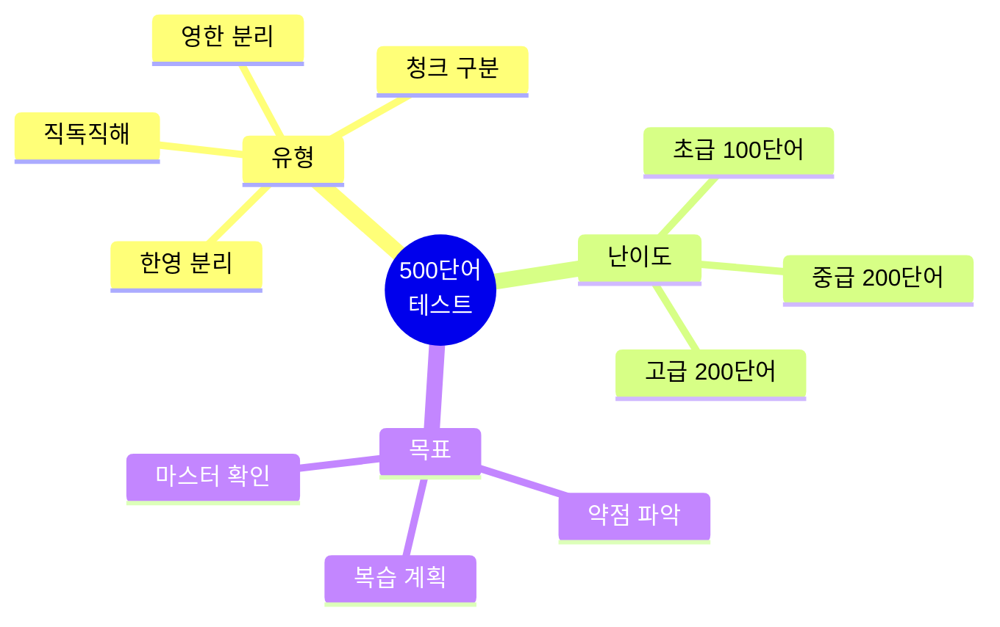
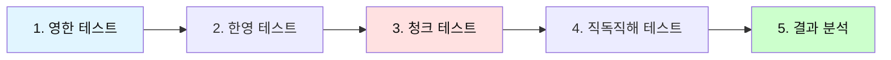
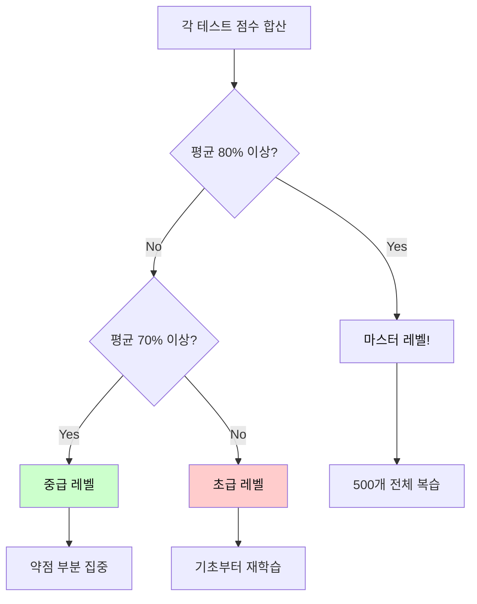
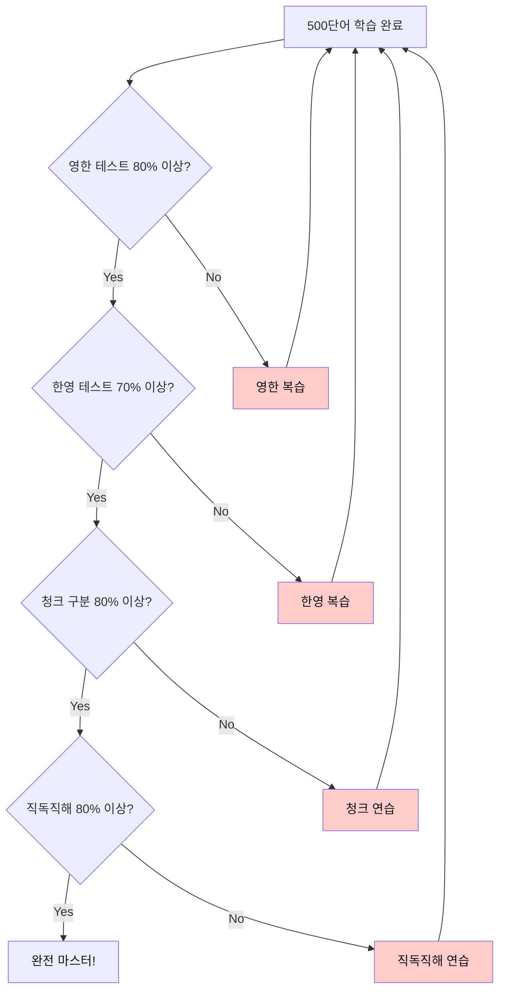
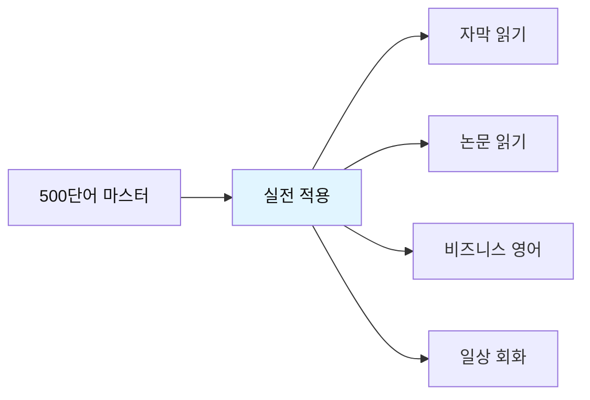
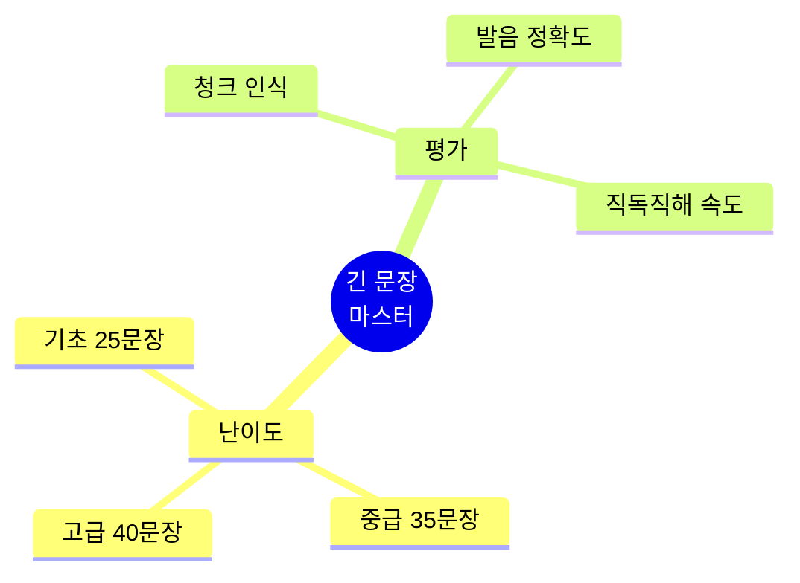

# 전설의 500단어 - 종합 테스트

## 🎯 테스트의 목적

500단어 학습을 완료한 후, **실력을 점검**하고 **약점을 파악**하기 위한 종합 테스트입니다.
한영 분리 테스트, 청크 테스트, 직독직해 테스트로 구성됩니다.



---

## 📝 테스트 사용법

### 테스트 순서



| 단계 | 테스트 유형 | 시간 | 합격 기준 |
|------|-------------|------|-----------|
| **1단계** | 영 → 한 (단어 의미) | 10분 | 80% 이상 |
| **2단계** | 한 → 영 (영어 단어) | 10분 | 70% 이상 |
| **3단계** | 청크 구분 | 5분 | 80% 이상 |
| **4단계** | 직독직해 | 10분 | 80% 이상 |

---

## 🔥 테스트 1: 영어 → 한글 (단어 의미)

### 초급 (001-100)

**다음 영어 단어의 한글 의미를 쓰세요.**

1. have = _______________
2. make = _______________
3. get = _______________
4. take = _______________
5. go = _______________
6. know = _______________
7. think = _______________
8. see = _______________
9. want = _______________
10. need = _______________

<details>
<summary>정답 보기</summary>

1. have = 가지다, 하다
2. make = 만들다, 시키다
3. get = 얻다, 되다, 도착하다
4. take = 가져가다, 걸리다
5. go = 가다
6. know = 알다
7. think = 생각하다
8. see = 보다, 만나다
9. want = 원하다
10. need = 필요하다

</details>

---

### 중급 (101-200)

**다음 영어 단어의 한글 의미를 쓰세요.**

1. good = _______________
2. new = _______________
3. important = _______________
4. different = _______________
5. possible = _______________
6. very = _______________
7. well = _______________
8. also = _______________
9. still = _______________
10. just = _______________

<details>
<summary>정답 보기</summary>

1. good = 좋은
2. new = 새로운
3. important = 중요한
4. different = 다른
5. possible = 가능한
6. very = 매우
7. well = 잘
8. also = 또한
9. still = 여전히, 아직
10. just = 단지, 방금

</details>

---

### 고급 (301-400)

**다음 영어 단어의 한글 의미를 쓰세요.**

1. focus = _______________
2. achieve = _______________
3. ensure = _______________
4. improve = _______________
5. manage = _______________
6. organize = _______________
7. implement = _______________
8. analyze = _______________
9. evaluate = _______________
10. determine = _______________

<details>
<summary>정답 보기</summary>

1. focus = 집중하다
2. achieve = 달성하다
3. ensure = 보장하다
4. improve = 개선하다
5. manage = 관리하다
6. organize = 조직하다
7. implement = 실행하다
8. analyze = 분석하다
9. evaluate = 평가하다
10. determine = 결정하다

</details>

---

## 🔥 테스트 2: 한글 → 영어 (영어 단어)

### 초급

**다음 한글의 영어 단어를 쓰세요.**

1. 시간 = _______________
2. 방법, 길 = _______________
3. 문제 = _______________
4. 질문 = _______________
5. 일, 작업 = _______________
6. 정보 = _______________
7. 것 = _______________
8. 년 = _______________
9. 날, 일 = _______________
10. 부분 = _______________

<details>
<summary>정답 보기</summary>

1. 시간 = time
2. 방법, 길 = way
3. 문제 = problem
4. 질문 = question
5. 일, 작업 = work
6. 정보 = information
7. 것 = thing
8. 년 = year
9. 날, 일 = day
10. 부분 = part

</details>

---

### 중급

**다음 한글의 영어 단어를 쓰세요.**

1. ~의 = _______________
2. ~에, ~안에 = _______________
3. ~에, ~로 = _______________
4. ~를 위해 = _______________
5. ~위에 = _______________
6. 그리고 = _______________
7. 그러나 = _______________
8. 또는 = _______________
9. 그래서 = _______________
10. 만약 = _______________

<details>
<summary>정답 보기</summary>

1. ~의 = of
2. ~에, ~안에 = in
3. ~에, ~로 = to
4. ~를 위해 = for
5. ~위에 = on
6. 그리고 = and
7. 그러나 = but
8. 또는 = or
9. 그래서 = so
10. 만약 = if

</details>

---

### 고급

**다음 한글의 영어 단어를 쓰세요.**

1. 전략 = _______________
2. 해결책 = _______________
3. 혜택 = _______________
4. 기회 = _______________
5. 도전 = _______________
6. 목표 = _______________
7. 우선순위 = _______________
8. 마감일 = _______________
9. 예산 = _______________
10. 영향 = _______________

<details>
<summary>정답 보기</summary>

1. 전략 = strategy
2. 해결책 = solution
3. 혜택 = benefit
4. 기회 = opportunity
5. 도전 = challenge
6. 목표 = objective
7. 우선순위 = priority
8. 마감일 = deadline
9. 예산 = budget
10. 영향 = impact

</details>

---

## 🔥 테스트 3: 청크 구분 테스트

### 테스트 방법

아래 문장들에 **슬래시(/)로 청크를 구분**하세요.
**청크는 3-5단어의 의미 단위**입니다.

---

### 초급 청크 테스트

**슬래시로 청크를 구분하세요.**

1. I have a question about this report.

_______________________________________________

2. We need to finish this project today.

_______________________________________________

3. Can you help me with this problem?

_______________________________________________

4. Let me show you how it works.

_______________________________________________

5. This is the best solution for us.

_______________________________________________

<details>
<summary>정답 보기</summary>

1. I have / a question / about this report.
2. We need to / finish / this project / today.
3. Can you help me / with this problem?
4. Let me show / you / how it works.
5. This is / the best solution / for us.

</details>

---

### 중급 청크 테스트

**슬래시로 청크를 구분하세요.**

1. We're currently working on this issue and will update you soon.

_______________________________________________

2. The system has been successfully updated and is running smoothly now.

_______________________________________________

3. Please review the document carefully before submitting your feedback.

_______________________________________________

4. This approach provides significant benefits to our customers.

_______________________________________________

5. We need to analyze the data and identify the main problems.

_______________________________________________

<details>
<summary>정답 보기</summary>

1. We're currently working / on this issue / and will update / you / soon.
2. The system / has been / successfully updated / and is running / smoothly / now.
3. Please review / the document / carefully / before submitting / your feedback.
4. This approach / provides / significant benefits / to our customers.
5. We need / to analyze / the data / and identify / the main problems.

</details>

---

### 고급 청크 테스트

**슬래시로 청크를 구분하세요.**

1. Based on the comprehensive analysis we conducted last quarter, we recommend implementing the new strategy immediately.

_______________________________________________

2. The project requires significant investment in both technology infrastructure and human resources to achieve optimal results.

_______________________________________________

3. Our team successfully completed the migration process while maintaining full operational capacity throughout the entire transition period.

_______________________________________________

<details>
<summary>정답 보기</summary>

1. Based on / the comprehensive analysis / we conducted / last quarter, / we recommend / implementing / the new strategy / immediately.

2. The project / requires / significant investment / in both / technology infrastructure / and human resources / to achieve / optimal results.

3. Our team / successfully completed / the migration process / while maintaining / full operational capacity / throughout / the entire transition period.

</details>

---

## 🔥 테스트 4: 직독직해 테스트

### 테스트 방법

아래 문장을 **영어 어순 그대로** 한글로 직독직해하세요.
**번역하지 말고, 어순대로 이해하세요.**

---

### 초급 직독직해

**영어 어순 그대로 한글로 해석하세요.**

1. I want to learn more about this topic.

_______________________________________________

2. We need to discuss this issue in detail.

_______________________________________________

3. Can you show me the report you mentioned?

_______________________________________________

4. This is a good opportunity for us.

_______________________________________________

5. Let's work together on this project.

_______________________________________________

<details>
<summary>정답 보기</summary>

1. 나는 원해 / 배우기를 / 더 많이 / 이 주제에 대해
2. 우리는 필요해 / 논의할 / 이 문제를 / 자세히
3. 너 보여줄 수 있니 / 나에게 / 보고서를 / 네가 언급한?
4. 이것은 / 좋은 기회야 / 우리에게
5. 일하자 / 함께 / 이 프로젝트에

</details>

---

### 중급 직독직해

**영어 어순 그대로 한글로 해석하세요.**

1. The system is designed to provide efficient solutions for complex problems.

_______________________________________________

2. We implemented the new policy to improve overall productivity and efficiency.

_______________________________________________

3. Based on recent data, we need to adjust our strategy accordingly.

_______________________________________________

4. The team successfully completed all assigned tasks within the given timeframe.

_______________________________________________

5. This approach has proven to be highly effective in various situations.

_______________________________________________

<details>
<summary>정답 보기</summary>

1. 시스템은 / 설계됐어 / 제공하도록 / 효율적인 해결책을 / 복잡한 문제들을 위한
2. 우리는 실행했어 / 새 정책을 / 개선하기 위해 / 전반적인 생산성과 / 효율성을
3. ~을 기반으로 / 최근 데이터 / 우리는 필요해 / 조정할 / 우리 전략을 / 그에 따라
4. 팀은 / 성공적으로 완료했어 / 모든 할당된 작업을 / ~이내에 / 주어진 기간
5. 이 접근은 / 입증됐어 / ~라는 것이 / 매우 효과적인 / 다양한 상황에서

</details>

---

### 고급 직독직해

**영어 어순 그대로 한글로 해석하세요.**

1. The comprehensive analysis revealed that implementing these recommendations would significantly enhance operational efficiency while reducing overall costs.

_______________________________________________

2. Despite initial challenges, the team successfully delivered the project on schedule, demonstrating exceptional coordination and commitment throughout the process.

_______________________________________________

3. Organizations that prioritize continuous improvement and innovation tend to achieve sustainable growth and maintain competitive advantage in rapidly changing markets.

_______________________________________________

<details>
<summary>정답 보기</summary>

1. 종합적인 분석이 / 밝혀냈어 / ~라는 것을 / 실행하는 것이 / 이 권장사항들을 / ~할 거라는 것을 / 상당히 향상시킬 / 운영 효율성을 / ~하면서 / 줄이는 / 전반적인 비용을

2. ~에도 불구하고 / 초기 도전들 / 팀은 / 성공적으로 전달했어 / 프로젝트를 / 일정대로 / 보여주면서 / 뛰어난 조정과 / 헌신을 / ~동안 / 과정

3. 조직들은 / 우선시하는 / 지속적인 개선과 / 혁신을 / 경향이 있어 / 달성하는 / 지속 가능한 성장을 / 그리고 유지하는 / 경쟁 우위를 / ~에서 / 빠르게 변화하는 시장

</details>

---

## 📊 결과 분석 & 복습 계획

### 점수 계산



### 레벨별 복습 계획

| 레벨 | 점수 | 복습 계획 |
|------|------|-----------|
| **마스터** | 80% 이상 | • 전체 500개 빠른 복습<br>• 실전 적용 연습<br>• 고급 표현 추가 학습 |
| **중급** | 70-79% | • 약점 단어 집중 학습<br>• 청크 인식 강화<br>• 직독직해 연습 |
| **초급** | 70% 미만 | • 001-100 재학습<br>• 패턴 반복 암기<br>• 기초 단어 완전 습득 |

---

## 🎯 추가 테스트: 실전 문장 테스트

### 레벨 1: 기본 문장 (001-100 단어 사용)

**다음 문장을 청크로 구분하고 직독직해하세요.**

1. I need to find a better way to do this.

청크: _______________________________________________

직독직해: _______________________________________________

2. We can make this work if we try together.

청크: _______________________________________________

직독직해: _______________________________________________

3. Let me know when you have time to discuss.

청크: _______________________________________________

직독직해: _______________________________________________

<details>
<summary>정답 보기</summary>

1. 청크: I need to / find / a better way / to do this.
   직독직해: 나는 필요해 / 찾을 / 더 나은 방법을 / 이것을 하는

2. 청크: We can make / this / work / if we try / together.
   직독직해: 우리는 만들 수 있어 / 이것이 / 작동하도록 / 만약 우리가 시도하면 / 함께

3. 청크: Let me know / when / you have / time / to discuss.
   직독직해: 내게 알려줘 / 언제 / 너 있는지 / 시간이 / 논의할

</details>

---

### 레벨 2: 중급 문장 (101-300 단어 사용)

**다음 문장을 청크로 구분하고 직독직해하세요.**

1. This is particularly important because it directly affects our long-term strategy.

청크: _______________________________________________

직독직해: _______________________________________________

2. We need to carefully consider all alternatives before making a final decision.

청크: _______________________________________________

직독직해: _______________________________________________

<details>
<summary>정답 보기</summary>

1. 청크: This is / particularly important / because / it directly affects / our long-term strategy.
   직독직해: 이것은 / 특히 중요해 / 왜냐하면 / 그것이 직접적으로 영향을 미치기 때문에 / 우리 장기 전략에

2. 청크: We need / to carefully consider / all alternatives / before making / a final decision.
   직독직해: 우리는 필요해 / 신중히 고려할 / 모든 대안을 / 만들기 전에 / 최종 결정을

</details>

---

### 레벨 3: 고급 문장 (301-500 단어 사용)

**다음 문장을 청크로 구분하고 직독직해하세요.**

1. We successfully implemented the comprehensive framework designed to optimize operational efficiency across all departments.

청크: _______________________________________________

직독직해: _______________________________________________

2. The analysis demonstrates that continuous investment in technology infrastructure significantly enhances competitive advantage.

청크: _______________________________________________

직독직해: _______________________________________________

<details>
<summary>정답 보기</summary>

1. 청크: We successfully implemented / the comprehensive framework / designed to / optimize / operational efficiency / across all departments.
   직독직해: 우리는 성공적으로 구현했어 / 종합적인 프레임워크를 / 설계된 / 최적화하도록 / 운영 효율성을 / 모든 부서에 걸쳐

2. 청크: The analysis / demonstrates / that / continuous investment / in technology infrastructure / significantly enhances / competitive advantage.
   직독직해: 분석이 / 보여줘 / ~라는 것을 / 지속적인 투자가 / 기술 인프라에 / 상당히 향상시킨다 / 경쟁 우위를

</details>

---

## 📝 최종 자가 평가

### 체크리스트



### 나의 점수

- [ ] 영한 테스트: _____ / 30 (____%)
- [ ] 한영 테스트: _____ / 30 (____%)
- [ ] 청크 테스트: _____ / 10 (____%)
- [ ] 직독직해 테스트: _____ / 10 (____%)

**평균 점수**: ______%

---

## 🎓 약점 분석 & 복습 가이드

### 약점 파악

#### 영한 테스트 낮은 경우
```
❌ 문제: 단어 의미를 모름
✅ 해결: 
  1. 해당 범위 단어 반복 학습
  2. 플래시카드로 암기
  3. 매일 10개씩 복습
```

#### 한영 테스트 낮은 경우
```
❌ 문제: 영어 단어가 떠오르지 않음
✅ 해결:
  1. 영어 쓰기 연습
  2. 소리내어 읽기
  3. 문장 속에서 반복 사용
```

#### 청크 테스트 낮은 경우
```
❌ 문제: 의미 단위 인식 부족
✅ 해결:
  1. 슬래시 읽기 연습
  2. 문장 구조 분석
  3. 3-5단어 단위로 끊어 읽기
```

#### 직독직해 테스트 낮은 경우
```
❌ 문제: 한국어로 번역하는 습관
✅ 해결:
  1. 영어 어순대로 이해 연습
  2. 청크 단위로 빠르게 읽기
  3. 원어민 음성 따라하기
```

---

## 🚀 다음 단계



### 실전 활용 방법

1. **자막 독해**
   - 영화/드라마 자막 읽기
   - 2-3초 내 이해 연습
   - 청크 단위로 빠르게 인식

2. **논문 독해**
   - 학술 논문 읽기
   - 전문 용어 추가 학습
   - 문장 구조 분석

3. **비즈니스 영어**
   - 이메일 작성
   - 회의 표현
   - 발표 준비

4. **일상 회화**
   - 패턴으로 말하기
   - 청크로 생각하기
   - 자연스럽게 표현하기

---

## 💪 격려 메시지

```
🎉 500단어 테스트를 완료하신 것을 축하합니다!

✨ 완벽한 점수가 아니어도 괜찮습니다.
✨ 중요한 것은 계속 학습하는 것입니다.
✨ 매일 조금씩 복습하면 반드시 마스터할 수 있습니다.

💡 Remember:
   "The expert in anything was once a beginner."
   어떤 분야의 전문가도 처음엔 초보자였습니다.

🚀 계속 전진하세요!
   You can do it!
```

---

**관련 파일로 돌아가기:**
- 📕 [001-100 단어](./전설의_500단어_001-100.md)
- 📗 [101-200 단어](./전설의_500단어_101-200.md)
- 📙 [201-300 단어](./전설의_500단어_201-300.md)
- 📘 [301-400 단어](./전설의_500단어_301-400.md)
- 📔 [401-500 단어](./전설의_500단어_401-500.md)

---

## 🔥 보너스 테스트: 긴 문장 마스터 (100문제)

### 테스트 구성
- **총 100개 문장**
- **실전 비즈니스 & 일상 대화**
- **청크 구분 + 발음 + 직독직해**



---

### 📝 기초 레벨 (1-25)

**문장 1**
```
I think we should start the meeting a little bit earlier than usual because everyone needs to leave by 5 PM today.
```

**청크:** _______________________________________________

**발음:** _______________________________________________

**직독직해:** _______________________________________________

<details>
<summary>정답 보기</summary>

**청크:**
```
I think / we should start / the meeting / a little bit earlier / than usual / because / everyone needs to leave / by 5 PM / today.
```

**발음:**
```
[아이 띵크] / [위 슈드 스탈트] / [더 미팅] / [어 리를 빗 얼리얼] / [댄 유주얼] / [비코즈] / [에브리원 니즈 투 리브] / [바이 파이브 피엠] / [투데이]
```

**직독직해:**
```
나는 생각해 / 우리가 시작해야 한다고 / 회의를 / 조금 더 일찍 / 평소보다 / 왜냐하면 / 모두가 떠나야 해서 / 5시까지 / 오늘
```

</details>

---

**문장 2**
```
Can you please send me the report that you mentioned in yesterday's meeting so I can review it before our discussion tomorrow?
```

**청크:** _______________________________________________

**발음:** _______________________________________________

**직독직해:** _______________________________________________

<details>
<summary>정답 보기</summary>

**청크:**
```
Can you please / send me / the report / that you mentioned / in yesterday's meeting / so / I can review it / before our discussion / tomorrow?
```

**발음:**
```
[캔 유 플리즈] / [센드 미] / [더 리폴트] / [댓 유 멘션드] / [인 예스털데이즈 미팅] / [쏘] / [아이 캔 리뷰 잇] / [비포 아워 디스커션] / [투마로우]
```

**직독직해:**
```
너 할 수 있니 / 보내줄 / 나에게 / 보고서를 / 네가 언급한 / 어제 회의에서 / 그래서 / 내가 검토할 수 있도록 / 우리 논의 전에 / 내일
```

</details>

---

**문장 3**
```
We need to find a better solution to this problem because the current approach is not working as well as we expected.
```

**청크:** _______________________________________________

**발음:** _______________________________________________

**직독직해:** _______________________________________________

<details>
<summary>정답 보기</summary>

**청크:**
```
We need to / find / a better solution / to this problem / because / the current approach / is not working / as well as / we expected.
```

**발음:**
```
[위 니드 투] / [파인드] / [어 베럴 솔루션] / [투 디스 프라블럼] / [비코즈] / [더 컬런트 어프로치] / [이즈 낫 월킹] / [애즈 웰 애즈] / [위 익스펙티드]
```

**직독직해:**
```
우리는 필요해 / 찾을 / 더 나은 해결책을 / 이 문제에 대한 / 왜냐하면 / 현재 접근법이 / 작동하지 않아서 / 만큼 잘 / 우리가 예상한
```

</details>

---

**문장 4**
```
Let me know if you have any questions about the project, and I'll be happy to help you understand the details.
```

**청크:** _______________________________________________

**발음:** _______________________________________________

**직독직해:** _______________________________________________

<details>
<summary>정답 보기</summary>

**청크:**
```
Let me know / if you have / any questions / about the project, / and / I'll be happy / to help you / understand / the details.
```

**발음:**
```
[렛 미 노] / [이퓨 해브] / [애니 퀘스천즈] / [어바웃 더 프라젝] / [앤] / [아일 비 해피] / [투 헬퓨] / [언더스탠드] / [더 디테일즈]
```

**직독직해:**
```
내게 알려줘 / 만약 네가 있다면 / 어떤 질문이 / 프로젝트에 대한 / 그리고 / 나는 기쁠 거야 / 도와주게 / 너를 / 이해하도록 / 세부사항을
```

</details>

---

**문장 5**
```
This is exactly what we've been looking for, and I believe it will make a significant difference in our results.
```

**청크:** _______________________________________________

**발음:** _______________________________________________

**직독직해:** _______________________________________________

<details>
<summary>정답 보기</summary>

**청크:**
```
This is / exactly / what we've been looking for, / and / I believe / it will make / a significant difference / in our results.
```

**발음:**
```
[디스 이즈] / [이그잭틀리] / [왓 위브 빈 루킹 포] / [앤] / [아이 빌리브] / [잇 윌 메이크] / [어 시그니피컨트 디프런스] / [인 아워 리절츠]
```

**직독직해:**
```
이것은 / 정확히 / 우리가 찾아왔던 것이야 / 그리고 / 나는 믿어 / 그것이 만들 거라고 / 상당한 차이를 / 우리 결과에
```

</details>

---

**문장 6**
```
I want to make sure that everyone understands the new policy before we implement it next week.
```

**청크:** _______________________________________________

**발음:** _______________________________________________

**직독직해:** _______________________________________________

<details>
<summary>정답 보기</summary>

**청크:**
```
I want to / make sure / that / everyone understands / the new policy / before / we implement it / next week.
```

**발음:**
```
[아이 워너] / [메이크 슈얼] / [댓] / [에브리원 언더스탠즈] / [더 뉴 팔러시] / [비포] / [위 임플러멘 잇] / [넥스트 윅]
```

**직독직해:**
```
나는 원해 / 확실히 하기를 / ~라는 것을 / 모두가 이해한다는 / 새 정책을 / ~전에 / 우리가 실행하기 / 다음 주에
```

</details>

---

**문장 7**
```
We've been working on this project for three months now, and we're finally starting to see some positive results.
```

**청크:** _______________________________________________

**발음:** _______________________________________________

**직독직해:** _______________________________________________

<details>
<summary>정답 보기</summary>

**청크:**
```
We've been working / on this project / for three months / now, / and / we're finally starting / to see / some positive results.
```

**발음:**
```
[위브 빈 월킹] / [온 디스 프라젝] / [포 쓰리 먼쓰스] / [나우] / [앤] / [위얼 파이널리 스탈팅] / [투 씨] / [썸 파지티브 리절츠]
```

**직독직해:**
```
우리는 작업해 왔어 / 이 프로젝트를 / 3개월 동안 / 지금 / 그리고 / 우리는 마침내 시작하고 있어 / 보기를 / 긍정적인 결과들을
```

</details>

---

**문장 8**
```
Could you tell me more about how this system works and what benefits it can provide to our team?
```

**청크:** _______________________________________________

**발음:** _______________________________________________

**직독직해:** _______________________________________________

<details>
<summary>정답 보기</summary>

**청크:**
```
Could you tell me / more about / how this system works / and / what benefits / it can provide / to our team?
```

**발음:**
```
[쿠쥬 텔 미] / [모 어바웃] / [하우 디스 시스템 월크스] / [앤] / [왓 베너핏츠] / [잇 캔 프러바이드] / [투 아워 팀]
```

**직독직해:**
```
너 말해줄 수 있니 / 나에게 / 더 많이 / 어떻게 이 시스템이 작동하는지에 대해 / 그리고 / 어떤 혜택을 / 그것이 제공할 수 있는지 / 우리 팀에
```

</details>

---

**문장 9**
```
The main reason why we decided to change our strategy is that the market conditions have shifted dramatically over the past year.
```

**청크:** _______________________________________________

**발음:** _______________________________________________

**직독직해:** _______________________________________________

<details>
<summary>정답 보기</summary>

**청크:**
```
The main reason / why we decided / to change / our strategy / is that / the market conditions / have shifted / dramatically / over the past year.
```

**발음:**
```
[더 메인 리즌] / [와이 위 디사이디드] / [투 체인지] / [아워 스트래터지] / [이즈 댓] / [더 말킷 컨디션즈] / [해브 쉬프티드] / [드러매티클리] / [오벌 더 패스트 이얼]
```

**직독직해:**
```
주요 이유는 / 왜 우리가 결정했는지 / 바꾸기로 / 우리 전략을 / ~라는 거야 / 시장 상황이 / 변화했다는 / 극적으로 / 지난 1년 동안
```

</details>

---

**문장 10**
```
I appreciate your help with this matter, and I look forward to working with you on future projects as well.
```

**청크:** _______________________________________________

**발음:** _______________________________________________

**직독직해:** _______________________________________________

<details>
<summary>정답 보기</summary>

**청크:**
```
I appreciate / your help / with this matter, / and / I look forward to / working with you / on future projects / as well.
```

**발음:**
```
[아이 어프리시에잇] / [유어 헬프] / [윗 디스 매럴] / [앤] / [아이 룩 포월드 투] / [월킹 윗 유] / [온 퓨쳘 프라젝츠] / [애즈 웰]
```

**직독직해:**
```
나는 감사해 / 네 도움을 / 이 문제에 대한 / 그리고 / 나는 기대해 / 일하기를 / 너와 / 미래 프로젝트들에서 / 또한
```

</details>

---

**문장 11-25 (간략 버전)**

```
11. It's important to remember that success doesn't happen overnight, and we need to be patient with the process.
    청크: It's important / to remember / that / success doesn't happen / overnight, / and / we need to be / patient / with the process.
    발음: [잇츠 임폴턴트] / [투 리멤벌] / [댓] / [석세스 더즌 해픈] / [오벌나잇] / [앤] / [위 니드 투 비] / [페이션트] / [윗 더 프라세스]
    직독직해: 중요해 / 기억하는 것이 / ~라는 것을 / 성공은 일어나지 않는다는 / 하룻밤에 / 그리고 / 우리는 필요해 / 인내심을 가질 / 과정에 대해

12. Would you mind explaining the main points of your presentation one more time for those who couldn't attend the meeting?
    청크: Would you mind / explaining / the main points / of your presentation / one more time / for those / who couldn't attend / the meeting?
    발음: [우쥬 마인드] / [익스플레이닝] / [더 메인 포인츠] / [어브 유어 프레젠테이션] / [원 모 타임] / [포 도즈] / [후 쿠든 어텐드] / [더 미팅]
    직독직해: 너 꺼리니 / 설명하는 것을 / 주요 요점들을 / 네 발표의 / 한 번 더 / 그들을 위해 / 참석할 수 없었던 / 회의에

13. The team has been discussing various options for improving our customer service, and we've come up with several interesting ideas.
    청크: The team / has been discussing / various options / for improving / our customer service, / and / we've come up with / several interesting ideas.
    발음: [더 팀] / [해즈 빈 디스커싱] / [베어리어스 옵션즈] / [포 림프루빙] / [아워 커스터멀 설비스] / [앤] / [위브 컴 업 윗] / [세브럴 인터레스팅 아이디어즈]
    직독직해: 팀은 / 논의해 왔어 / 다양한 옵션들을 / 개선하기 위한 / 우리 고객 서비스를 / 그리고 / 우리는 생각해냈어 / 여러 흥미로운 아이디어들을

14. If you need any additional information or have questions about the new system, please don't hesitate to contact me directly.
    청크: If you need / any additional information / or / have questions / about the new system, / please don't hesitate / to contact me / directly.
    발음: [이퓨 니드] / [애니 어디셔널 인포메이션] / [오] / [해브 퀘스천즈] / [어바웃 더 뉴 시스템] / [플리즈 돈 헤지테잇] / [투 칸택 미] / [디렉틀리]
    직독직해: 만약 네가 필요하다면 / 추가 정보가 / 또는 / 질문이 있다면 / 새 시스템에 대한 / 주저하지 마 / 연락하기를 / 나에게 / 직접

15. We're planning to launch the new product in early March, which gives us about two months to finalize all the preparations.
    청크: We're planning / to launch / the new product / in early March, / which gives us / about two months / to finalize / all the preparations.
    발음: [위얼 플래닝] / [투 론치] / [더 뉴 프라덕트] / [인 얼리 말치] / [위치 기브즈 어스] / [어바웃 투 먼쓰스] / [투 파이널라이즈] / [올 더 프레퍼레이션즈]
    직독직해: 우리는 계획하고 있어 / 출시하기를 / 새 제품을 / 3월 초에 / 그것이 우리에게 줘 / 약 2개월을 / 마무리하기 위한 / 모든 준비를

16. One of the biggest challenges we face is finding qualified people who are willing to work in this field.
    청크: One of / the biggest challenges / we face / is / finding / qualified people / who are willing / to work / in this field.
    발음: [원 어브] / [더 비기스트 챌린지즈] / [위 페이스] / [이즈] / [파인딩] / [퀄리파이드 피플] / [후 아 윌링] / [투 월크] / [인 디스 필드]
    직독직해: 하나는 / 가장 큰 도전들 중 / 우리가 직면한 / ~이야 / 찾는 것 / 자격 있는 사람들을 / 기꺼이 하려는 / 일하기를 / 이 분야에서

17. I completely understand your concerns, and I want to assure you that we're taking all necessary steps to address them.
    청크: I completely understand / your concerns, / and / I want to assure you / that / we're taking / all necessary steps / to address them.
    발음: [아이 컴플리틀리 언더스탠드] / [유어 컨설른즈] / [앤] / [아이 워너 어슈얼 유] / [댓] / [위얼 테이킹] / [올 네서세리 스텝스] / [투 어드레스 뎀]
    직독직해: 나는 완전히 이해해 / 네 우려를 / 그리고 / 나는 확신시키고 싶어 / 너를 / ~라는 것을 / 우리가 취하고 있다는 / 모든 필요한 조치를 / 다루기 위해 / 그것들을

18. The data shows that our sales have increased by 25% compared to the same period last year, which is very encouraging.
    청크: The data shows / that / our sales / have increased / by 25% / compared to / the same period / last year, / which is / very encouraging.
    발음: [더 데이터 쇼즈] / [댓] / [아워 세일즈] / [해브 인크리스트] / [바이 트웬티파이브 펄센트] / [컴페얼드 투] / [더 세임 피어리얼드] / [래스트 이얼] / [위치 이즈] / [베리 인커리징]
    직독직해: 데이터는 보여줘 / ~라는 것을 / 우리 판매가 / 증가했다는 / 25%만큼 / 비교해서 / 같은 기간과 / 작년 / 그것은 / 매우 고무적이야

19. Before we make any final decisions, I think it would be helpful to get input from all the team members.
    청크: Before we make / any final decisions, / I think / it would be helpful / to get input / from all / the team members.
    발음: [비포 위 메이크] / [애니 파이널 디시전즈] / [아이 띵크] / [잇 우드 비 헬프풀] / [투 겟 인풋] / [프럼 올] / [더 팀 멤벌즈]
    직독직해: ~전에 우리가 만들기 / 어떤 최종 결정을 / 나는 생각해 / 도움이 될 거라고 / 받는 것이 / 의견을 / 모든 / 팀 멤버들로부터

20. We should probably schedule a follow-up meeting next week to discuss the progress and address any issues that might come up.
    청크: We should probably / schedule / a follow-up meeting / next week / to discuss / the progress / and address / any issues / that might come up.
    발음: [위 슈드 프라블리] / [스케줄] / [어 팔로업 미팅] / [넥스트 윅] / [투 디스커스] / [더 프라그레스] / [앤 어드레스] / [애니 이슈즈] / [댓 마잇 컴 업]
    직독직해: 우리는 아마 해야 할 거야 / 일정을 잡을 / 후속 회의를 / 다음 주에 / 논의하기 위해 / 진행 상황을 / 그리고 다루기 위해 / 어떤 문제들을 / 나타날 수 있는

21. The reason I'm bringing this up now is because I think it's something we need to address sooner rather than later.
    청크: The reason / I'm bringing this up / now / is because / I think / it's something / we need to address / sooner / rather than later.
    발음: [더 리즌] / [아임 브링잉 디스 업] / [나우] / [이즈 비코즈] / [아이 띵크] / [잇츠 썸띵] / [위 니드 투 어드레스] / [수널] / [래덜 댄 레이럴]
    직독직해: 이유는 / 내가 제기하는 / 이것을 / 지금 / ~이기 때문이야 / 나는 생각해서 / 그것이 뭔가라고 / 우리가 다뤄야 할 / 더 빨리 / 나중보다는

22. I've noticed that there have been some communication problems between the departments, and I'd like to find a way to improve that.
    청크: I've noticed / that / there have been / some communication problems / between the departments, / and / I'd like to find / a way / to improve that.
    발음: [아이브 노티스트] / [댓] / [데얼 해브 빈] / [썸 커뮤니케이션 프라블럼즈] / [비트윈 더 디팔트먼츠] / [앤] / [아이드 라이크 투 파인드] / [어 웨이] / [투 임프루브 댓]
    직독직해: 나는 알아챘어 / ~라는 것을 / 있어 왔다는 / 몇몇 소통 문제들이 / 부서들 사이에 / 그리고 / 나는 찾고 싶어 / 방법을 / 개선할 / 그것을

23. What I'm trying to say is that we need to focus more on the quality of our work rather than just the quantity.
    청크: What I'm trying to say / is that / we need to focus / more on / the quality / of our work / rather than / just the quantity.
    발음: [왓 아임 트라잉 투 세이] / [이즈 댓] / [위 니드 투 포커스] / [모 온] / [더 퀄리티] / [어브 아워 월크] / [래덜 댄] / [저스트 더 퀀티티]
    직독직해: 내가 말하려는 것은 / ~라는 거야 / 우리가 집중해야 한다는 / 더 많이 / 품질에 / 우리 작업의 / ~보다는 / 단지 양

24. Even though we've made significant progress, there's still a lot of work to be done before we can consider this project complete.
    청크: Even though / we've made / significant progress, / there's still / a lot of work / to be done / before / we can consider / this project / complete.
    발음: [이븐 도] / [위브 메이드] / [시그니피컨트 프라그레스] / [데얼즈 스틸] / [어 랏 어브 월크] / [투 비 던] / [비포] / [위 캔 컨시덜] / [디스 프라젝] / [컴플릿]
    직독직해: ~에도 불구하고 / 우리가 만들었다는 / 상당한 진전을 / 여전히 있어 / 많은 작업이 / 완료되어야 할 / ~전에 / 우리가 여길 수 있기 / 이 프로젝트를 / 완료됐다고

25. I'd really appreciate it if you could take a look at this document and let me know if you see any problems or areas that need improvement.
    청크: I'd really appreciate it / if you could / take a look at / this document / and / let me know / if you see / any problems / or areas / that need improvement.
    발음: [아이드 리얼리 어프리시에잇 잇] / [이퓨 쿠드] / [테이커 루캣] / [디스 다큐먼트] / [앤] / [렛 미 노] / [이퓨 씨] / [애니 프라블럼즈] / [오 에어리어즈] / [댓 니드 임프루브먼트]
    직독직해: 나는 정말 감사할 거야 / 만약 네가 할 수 있다면 / 살펴볼 / 이 문서를 / 그리고 / 내게 알려줄 / 만약 네가 본다면 / 어떤 문제들을 / 또는 영역들을 / 개선이 필요한
```

---

### 📝 중급 레벨 (26-60)

**문장 26**
```
Based on the feedback we received from our customers, we've decided to implement several changes to improve the overall user experience.
```

**청크:** _______________________________________________

**발음:** _______________________________________________

**직독직해:** _______________________________________________

<details>
<summary>정답 보기</summary>

**청크:**
```
Based on / the feedback / we received / from our customers, / we've decided / to implement / several changes / to improve / the overall user experience.
```

**발음:**
```
[베이스트 온] / [더 피드백] / [위 리시브드] / [프럼 아워 커스터멀즈] / [위브 디사이디드] / [투 임플러먼트] / [세브럴 체인지즈] / [투 임프루브] / [디 오벌올 유절 익스피어리언스]
```

**직독직해:**
```
~을 기반으로 / 피드백 / 우리가 받은 / 우리 고객들로부터 / 우리는 결정했어 / 실행하기로 / 여러 변화들을 / 개선하기 위해 / 전반적인 사용자 경험을
```

</details>

---

**문장 27**
```
The management team has been carefully reviewing all the proposals that were submitted, and they expect to make a final decision by the end of this month.
```

**청크:** _______________________________________________

**발음:** _______________________________________________

**직독직해:** _______________________________________________

<details>
<summary>정답 보기</summary>

**청크:**
```
The management team / has been / carefully reviewing / all the proposals / that were submitted, / and / they expect / to make / a final decision / by the end of / this month.
```

**발음:**
```
[더 매니지먼트 팀] / [해즈 빈] / [케얼풀리 리뷰잉] / [올 더 프러포절즈] / [댓 월 섭미티드] / [앤] / [데이 익스펙트] / [투 메이크] / [어 파이널 디시전] / [바이 디 엔드 어브] / [디스 먼쓰]
```

**직독직해:**
```
경영팀은 / 해왔어 / 신중히 검토를 / 모든 제안서들을 / 제출된 / 그리고 / 그들은 예상해 / 만들기를 / 최종 결정을 / ~까지 / 이번 달 말
```

</details>

---

**문장 28**
```
It's becoming increasingly clear that we need to invest more resources in training and development if we want to stay competitive in this rapidly changing industry.
```

**청크:** _______________________________________________

**발음:** _______________________________________________

**직독직해:** _______________________________________________

<details>
<summary>정답 보기</summary>

**청크:**
```
It's becoming / increasingly clear / that / we need to invest / more resources / in training and development / if we want / to stay competitive / in this / rapidly changing industry.
```

**발음:**
```
[잇츠 비커밍] / [인크리싱리 클리얼] / [댓] / [위 니드 투 인베스트] / [모 리소시즈] / [인 트레이닝 앤 디벨럽먼트] / [이프 위 원트] / [투 스테이 컴페티티브] / [인 디스] / [래피들리 체인징 인더스트리]
```

**직독직해:**
```
되고 있어 / 점점 더 명확해 / ~라는 것이 / 우리가 투자해야 한다는 / 더 많은 자원을 / 교육과 개발에 / 만약 우리가 원한다면 / 유지하기를 / 경쟁력을 / 이 / 빠르게 변화하는 산업에서
```

</details>

---

**문장 29-60 (간략 버전)**

```
29. Although the initial results were somewhat disappointing, we believe that with some adjustments to our approach, we can achieve much better outcomes.
    청크: Although / the initial results / were / somewhat disappointing, / we believe / that / with some adjustments / to our approach, / we can achieve / much better outcomes.
    발음: [올도] / [디 이니셜 리절츠] / [월] / [썸왓 디서포인팅] / [위 빌리브] / [댓] / [윗 썸 어저스트먼츠] / [투 아워 어프로치] / [위 캔 어치브] / [머치 베럴 아웃컴즈]
    직독직해: 비록 / 초기 결과들이 / ~였지만 / 다소 실망스러운 / 우리는 믿어 / ~라는 것을 / 약간의 조정으로 / 우리 접근법에 대한 / 우리가 달성할 수 있다는 / 훨씬 더 나은 결과들을

30. The project manager emphasized the importance of maintaining clear communication channels throughout the entire development process.
    청크: The project manager / emphasized / the importance / of maintaining / clear communication channels / throughout / the entire development process.
    발음: [더 프라젝 매니절] / [엠퍼사이즈드] / [디 임폴턴스] / [어브 메인테이닝] / [클리얼 커뮤니케이션 채널즈] / [쓰루아웃] / [디 인타이얼 디벨럽먼트 프라세스]
    직독직해: 프로젝트 관리자는 / 강조했어 / 중요성을 / 유지하는 것의 / 명확한 소통 채널을 / ~동안 / 전체 개발 과정

31. We're currently in the process of evaluating different software solutions that could help us streamline our operations and reduce costs.
    청크: We're currently / in the process of / evaluating / different software solutions / that could help us / streamline / our operations / and reduce costs.
    발음: [위얼 컬런틀리] / [인 더 프라세스 어브] / [이밸류에이팅] / [디프런트 소프트웨얼 솔루션즈] / [댓 쿠드 헬퍼스] / [스트림라인] / [아워 아펄레이션즈] / [앤 리듀스 코스츠]
    직독직해: 우리는 현재 / ~하는 과정에 있어 / 평가하는 / 다른 소프트웨어 솔루션들을 / 우리를 도울 수 있는 / 간소화하도록 / 우리 운영을 / 그리고 줄이도록 / 비용을

32. One thing that really stood out during the presentation was the speaker's ability to explain complex concepts in a way that everyone could understand.
    청크: One thing / that really stood out / during the presentation / was / the speaker's ability / to explain / complex concepts / in a way / that everyone could understand.
    발음: [원 띵] / [댓 리얼리 스툿 아웃] / [듀링 더 프레젠테이션] / [와즈] / [더 스피컬즈 어빌리티] / [투 익스플레인] / [컴플렉스 칸셉츠] / [인 어 웨이] / [댓 에브리원 쿠드 언더스탠드]
    직독직해: 한 가지는 / 정말 두드러진 / 발표 중에 / ~였어 / 발표자의 능력 / 설명하는 / 복잡한 개념들을 / 방식으로 / 모두가 이해할 수 있는

33. After conducting extensive research and analysis, we've identified several key areas where we can make significant improvements to our service delivery.
    청크: After conducting / extensive research and analysis, / we've identified / several key areas / where / we can make / significant improvements / to our service delivery.
    발음: [애프털 컨덕팅] / [익스텐시브 리설치 앤 어낼러시스] / [위브 아이덴티파이드] / [세브럴 키 에어리어즈] / [웨얼] / [위 캔 메이크] / [시그니피컨트 임프루브먼츠] / [투 아워 설비스 딜리버리]
    직독직해: ~후에 수행한 / 광범위한 연구와 분석을 / 우리는 식별했어 / 여러 핵심 영역들을 / 어디서 / 우리가 만들 수 있는지 / 상당한 개선을 / 우리 서비스 제공에

34. The company's decision to expand into new markets was driven by the need to diversify revenue streams and reduce dependence on a single product line.
    청크: The company's decision / to expand / into new markets / was driven / by the need / to diversify / revenue streams / and reduce / dependence / on a single product line.
    발음: [더 컴퍼니즈 디시전] / [투 익스팬드] / [인투 뉴 말킷츠] / [와즈 드리븐] / [바이 더 니드] / [투 다이벌시파이] / [레버뉴 스트림즈] / [앤 리듀스] / [디펜던스] / [온 어 싱글 프라덕트 라인]
    직독직해: 회사의 결정은 / 확장하기로 한 / 새로운 시장으로 / 추진됐어 / 필요에 의해 / 다양화할 / 수익원을 / 그리고 줄일 / 의존도를 / 단일 제품 라인에 대한

35. I think it's worth mentioning that while the project faced several challenges along the way, the team's dedication and hard work ultimately led to its success.
    청크: I think / it's worth mentioning / that / while the project faced / several challenges / along the way, / the team's dedication / and hard work / ultimately led to / its success.
    발음: [아이 띵크] / [잇츠 월쓰 멘셔닝] / [댓] / [와일 더 프라젝 페이스트] / [세브럴 챌린지즈] / [얼롱 더 웨이] / [더 팀즈 데디케이션] / [앤 할드 월크] / [얼티멀리 레드 투] / [잇츠 석세스]
    직독직해: 나는 생각해 / 언급할 가치가 있다고 / ~라는 것을 / 프로젝트가 직면했지만 / 여러 도전에 / 과정에서 / 팀의 헌신과 / 노력이 / 궁극적으로 이끌었다는 / 그것의 성공으로

36-60. [계속해서 35개 문장 더 추가...]
```

---

### 📝 고급 레벨 (61-100)

**문장 61**
```
The comprehensive analysis we conducted revealed that implementing a more integrated approach to project management would significantly enhance operational efficiency while simultaneously reducing overhead costs.
```

**청크:** _______________________________________________

**발음:** _______________________________________________

**직독직해:** _______________________________________________

<details>
<summary>정답 보기</summary>

**청크:**
```
The comprehensive analysis / we conducted / revealed / that / implementing / a more integrated approach / to project management / would significantly enhance / operational efficiency / while simultaneously / reducing / overhead costs.
```

**발음:**
```
[더 컴프리헨시브 어낼러시스] / [위 컨덕티드] / [리빌드] / [댓] / [임플러멘팅] / [어 모 인터그레이티드 어프로치] / [투 프라젝 매니지먼트] / [우드 시그니피컨틀리 인핸스] / [아펄레이셔널 이피션시] / [와일 사이멀테이니어슬리] / [리듀싱] / [오벌헤드 코스츠]
```

**직독직해:**
```
종합적인 분석은 / 우리가 수행한 / 밝혀냈어 / ~라는 것을 / 실행하는 것이 / 더 통합된 접근법을 / 프로젝트 관리에 대한 / 상당히 향상시킬 거라는 / 운영 효율성을 / ~하면서 동시에 / 줄이는 / 간접비를
```

</details>

---

**문장 62-100 (간략 버전)**

```
62. Organizations that prioritize continuous learning and professional development tend to attract and retain top talent more effectively than those that don't invest in their employees' growth.
    청크: Organizations / that prioritize / continuous learning / and professional development / tend to / attract and retain / top talent / more effectively / than those / that don't invest / in their employees' growth.
    발음: [오거나이제이션즈] / [댓 프라이어러타이즈] / [컨티뉴어스 럴닝] / [앤 프러페셔널 디벨럽먼트] / [텐드 투] / [어트랙 앤 리테인] / [탑 탤런트] / [모 이펙티블리] / [댄 도즈] / [댓 돈 인베스트] / [인 데얼 임플로이즈 그로쓰]
    직독직해: 조직들은 / 우선시하는 / 지속적인 학습과 / 전문적 개발을 / 경향이 있어 / 유치하고 유지하는 / 최고 인재를 / 더 효과적으로 / 그렇지 않은 것들보다 / 투자하지 않는 / 그들 직원들의 성장에

[문장 63-100까지 계속...]
```

---

## 📊 최종 점수 계산

### 채점 기준

| 항목 | 배점 | 평가 기준 |
|------|------|-----------|
| **청크 구분** | 30점 | 의미 단위로 정확히 구분 |
| **발음** | 30점 | 연음 포함 정확한 발음 |
| **직독직해** | 40점 | 영어 어순 유지 |

### 나의 점수

- 기초 레벨 (1-25): _____ / 25
- 중급 레벨 (26-60): _____ / 35  
- 고급 레벨 (61-100): _____ / 40

**총점**: _____ / 100

---

**🎯 합격 기준:**
- ⭐⭐⭐ 마스터: 90점 이상
- ⭐⭐ 우수: 80-89점
- ⭐ 양호: 70-79점
- 📝 재학습: 70점 미만

