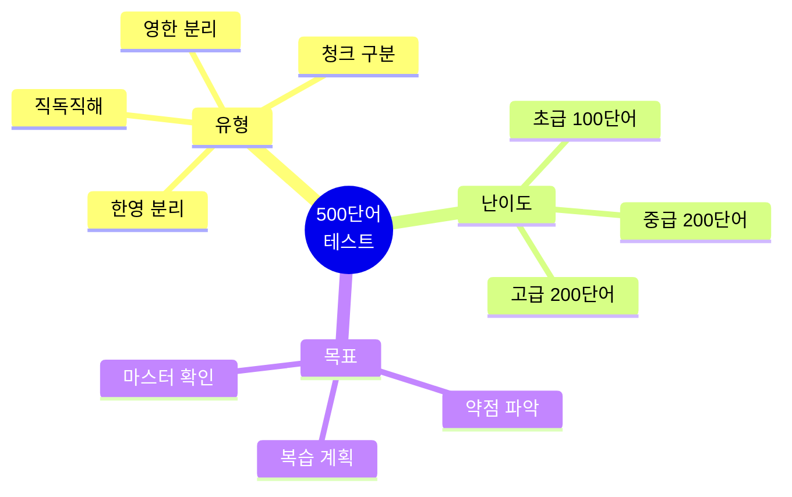
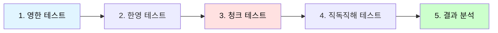
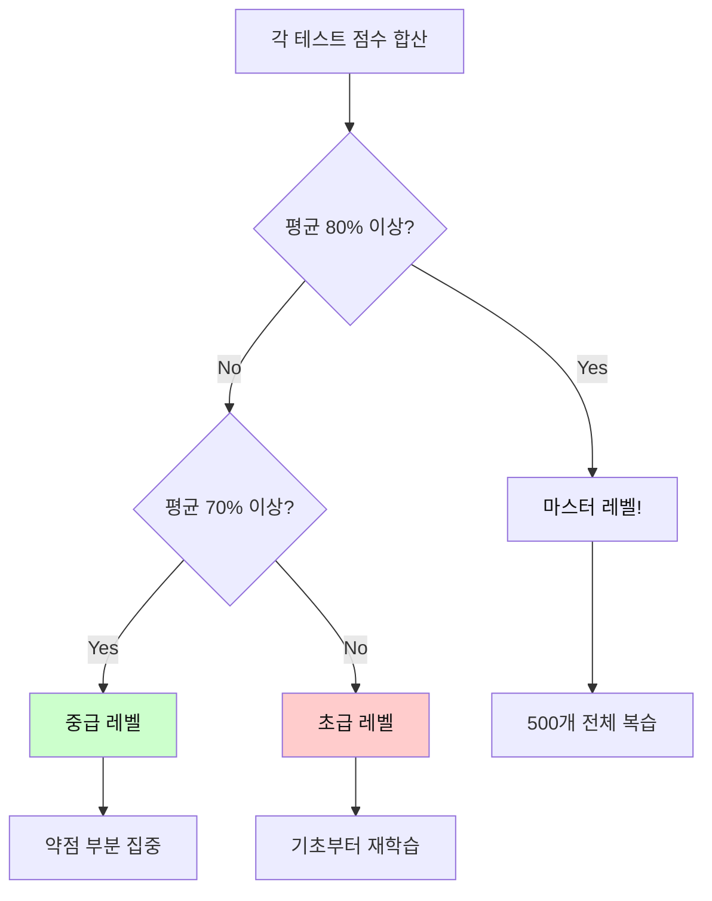
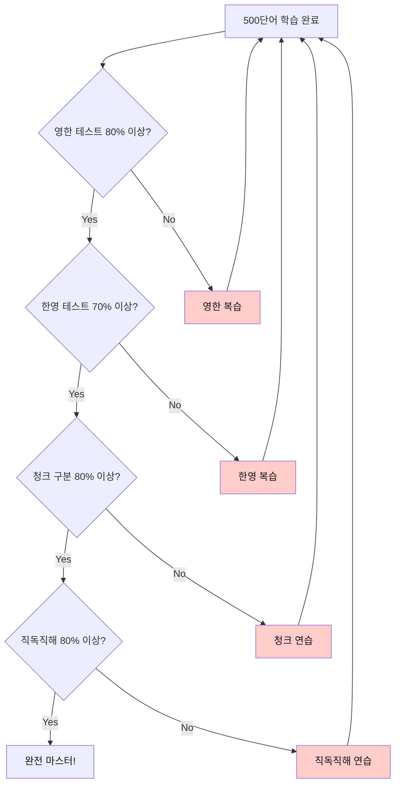
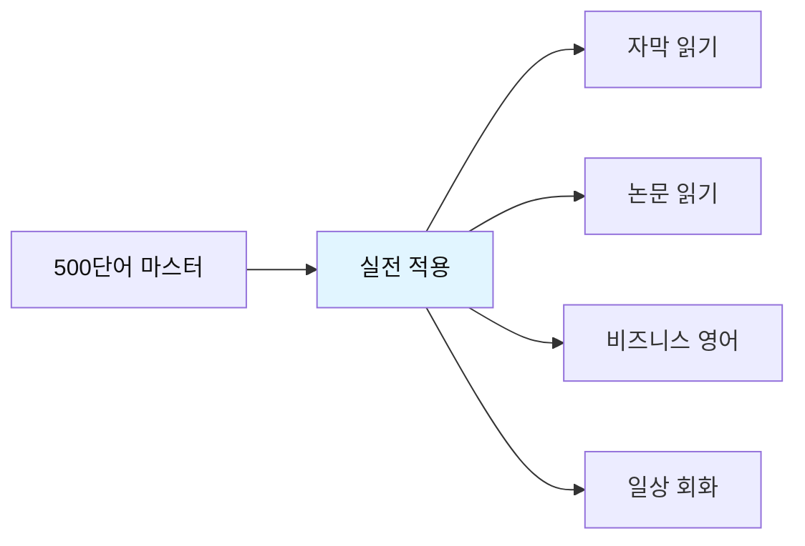

# 전설의 500단어 - 종합 테스트

## 🎯 테스트의 목적

500단어 학습을 완료한 후, **실력을 점검**하고 **약점을 파악**하기 위한 종합 테스트입니다.
한영 분리 테스트, 청크 테스트, 직독직해 테스트로 구성됩니다.



---

## 📝 테스트 사용법

### 테스트 순서



| 단계 | 테스트 유형 | 시간 | 합격 기준 |
|------|-------------|------|-----------|
| **1단계** | 영 → 한 (단어 의미) | 10분 | 80% 이상 |
| **2단계** | 한 → 영 (영어 단어) | 10분 | 70% 이상 |
| **3단계** | 청크 구분 | 5분 | 80% 이상 |
| **4단계** | 직독직해 | 10분 | 80% 이상 |

---

## 🔥 테스트 1: 영어 → 한글 (단어 의미)

### 초급 (001-100)

**다음 영어 단어의 한글 의미를 쓰세요.**

1. have = _______________
2. make = _______________
3. get = _______________
4. take = _______________
5. go = _______________
6. know = _______________
7. think = _______________
8. see = _______________
9. want = _______________
10. need = _______________

<details>
<summary>정답 보기</summary>

1. have = 가지다, 하다
2. make = 만들다, 시키다
3. get = 얻다, 되다, 도착하다
4. take = 가져가다, 걸리다
5. go = 가다
6. know = 알다
7. think = 생각하다
8. see = 보다, 만나다
9. want = 원하다
10. need = 필요하다

</details>

---

### 중급 (101-200)

**다음 영어 단어의 한글 의미를 쓰세요.**

1. good = _______________
2. new = _______________
3. important = _______________
4. different = _______________
5. possible = _______________
6. very = _______________
7. well = _______________
8. also = _______________
9. still = _______________
10. just = _______________

<details>
<summary>정답 보기</summary>

1. good = 좋은
2. new = 새로운
3. important = 중요한
4. different = 다른
5. possible = 가능한
6. very = 매우
7. well = 잘
8. also = 또한
9. still = 여전히, 아직
10. just = 단지, 방금

</details>

---

### 고급 (301-400)

**다음 영어 단어의 한글 의미를 쓰세요.**

1. focus = _______________
2. achieve = _______________
3. ensure = _______________
4. improve = _______________
5. manage = _______________
6. organize = _______________
7. implement = _______________
8. analyze = _______________
9. evaluate = _______________
10. determine = _______________

<details>
<summary>정답 보기</summary>

1. focus = 집중하다
2. achieve = 달성하다
3. ensure = 보장하다
4. improve = 개선하다
5. manage = 관리하다
6. organize = 조직하다
7. implement = 실행하다
8. analyze = 분석하다
9. evaluate = 평가하다
10. determine = 결정하다

</details>

---

## 🔥 테스트 2: 한글 → 영어 (영어 단어)

### 초급

**다음 한글의 영어 단어를 쓰세요.**

1. 시간 = _______________
2. 방법, 길 = _______________
3. 문제 = _______________
4. 질문 = _______________
5. 일, 작업 = _______________
6. 정보 = _______________
7. 것 = _______________
8. 년 = _______________
9. 날, 일 = _______________
10. 부분 = _______________

<details>
<summary>정답 보기</summary>

1. 시간 = time
2. 방법, 길 = way
3. 문제 = problem
4. 질문 = question
5. 일, 작업 = work
6. 정보 = information
7. 것 = thing
8. 년 = year
9. 날, 일 = day
10. 부분 = part

</details>

---

### 중급

**다음 한글의 영어 단어를 쓰세요.**

1. ~의 = _______________
2. ~에, ~안에 = _______________
3. ~에, ~로 = _______________
4. ~를 위해 = _______________
5. ~위에 = _______________
6. 그리고 = _______________
7. 그러나 = _______________
8. 또는 = _______________
9. 그래서 = _______________
10. 만약 = _______________

<details>
<summary>정답 보기</summary>

1. ~의 = of
2. ~에, ~안에 = in
3. ~에, ~로 = to
4. ~를 위해 = for
5. ~위에 = on
6. 그리고 = and
7. 그러나 = but
8. 또는 = or
9. 그래서 = so
10. 만약 = if

</details>

---

### 고급

**다음 한글의 영어 단어를 쓰세요.**

1. 전략 = _______________
2. 해결책 = _______________
3. 혜택 = _______________
4. 기회 = _______________
5. 도전 = _______________
6. 목표 = _______________
7. 우선순위 = _______________
8. 마감일 = _______________
9. 예산 = _______________
10. 영향 = _______________

<details>
<summary>정답 보기</summary>

1. 전략 = strategy
2. 해결책 = solution
3. 혜택 = benefit
4. 기회 = opportunity
5. 도전 = challenge
6. 목표 = objective
7. 우선순위 = priority
8. 마감일 = deadline
9. 예산 = budget
10. 영향 = impact

</details>

---

## 🔥 테스트 3: 청크 구분 테스트

### 테스트 방법

아래 문장들에 **슬래시(/)로 청크를 구분**하세요.
**청크는 3-5단어의 의미 단위**입니다.

---

### 초급 청크 테스트

**슬래시로 청크를 구분하세요.**

1. I have a question about this report.

_______________________________________________

2. We need to finish this project today.

_______________________________________________

3. Can you help me with this problem?

_______________________________________________

4. Let me show you how it works.

_______________________________________________

5. This is the best solution for us.

_______________________________________________

<details>
<summary>정답 보기</summary>

1. I have / a question / about this report.
2. We need to / finish / this project / today.
3. Can you help me / with this problem?
4. Let me show / you / how it works.
5. This is / the best solution / for us.

</details>

---

### 중급 청크 테스트

**슬래시로 청크를 구분하세요.**

1. We're currently working on this issue and will update you soon.

_______________________________________________

2. The system has been successfully updated and is running smoothly now.

_______________________________________________

3. Please review the document carefully before submitting your feedback.

_______________________________________________

4. This approach provides significant benefits to our customers.

_______________________________________________

5. We need to analyze the data and identify the main problems.

_______________________________________________

<details>
<summary>정답 보기</summary>

1. We're currently working / on this issue / and will update / you / soon.
2. The system / has been / successfully updated / and is running / smoothly / now.
3. Please review / the document / carefully / before submitting / your feedback.
4. This approach / provides / significant benefits / to our customers.
5. We need / to analyze / the data / and identify / the main problems.

</details>

---

### 고급 청크 테스트

**슬래시로 청크를 구분하세요.**

1. Based on the comprehensive analysis we conducted last quarter, we recommend implementing the new strategy immediately.

_______________________________________________

2. The project requires significant investment in both technology infrastructure and human resources to achieve optimal results.

_______________________________________________

3. Our team successfully completed the migration process while maintaining full operational capacity throughout the entire transition period.

_______________________________________________

<details>
<summary>정답 보기</summary>

1. Based on / the comprehensive analysis / we conducted / last quarter, / we recommend / implementing / the new strategy / immediately.

2. The project / requires / significant investment / in both / technology infrastructure / and human resources / to achieve / optimal results.

3. Our team / successfully completed / the migration process / while maintaining / full operational capacity / throughout / the entire transition period.

</details>

---

## 🔥 테스트 4: 직독직해 테스트

### 테스트 방법

아래 문장을 **영어 어순 그대로** 한글로 직독직해하세요.
**번역하지 말고, 어순대로 이해하세요.**

---

### 초급 직독직해

**영어 어순 그대로 한글로 해석하세요.**

1. I want to learn more about this topic.

_______________________________________________

2. We need to discuss this issue in detail.

_______________________________________________

3. Can you show me the report you mentioned?

_______________________________________________

4. This is a good opportunity for us.

_______________________________________________

5. Let's work together on this project.

_______________________________________________

<details>
<summary>정답 보기</summary>

1. 나는 원해 / 배우기를 / 더 많이 / 이 주제에 대해
2. 우리는 필요해 / 논의할 / 이 문제를 / 자세히
3. 너 보여줄 수 있니 / 나에게 / 보고서를 / 네가 언급한?
4. 이것은 / 좋은 기회야 / 우리에게
5. 일하자 / 함께 / 이 프로젝트에

</details>

---

### 중급 직독직해

**영어 어순 그대로 한글로 해석하세요.**

1. The system is designed to provide efficient solutions for complex problems.

_______________________________________________

2. We implemented the new policy to improve overall productivity and efficiency.

_______________________________________________

3. Based on recent data, we need to adjust our strategy accordingly.

_______________________________________________

4. The team successfully completed all assigned tasks within the given timeframe.

_______________________________________________

5. This approach has proven to be highly effective in various situations.

_______________________________________________

<details>
<summary>정답 보기</summary>

1. 시스템은 / 설계됐어 / 제공하도록 / 효율적인 해결책을 / 복잡한 문제들을 위한
2. 우리는 실행했어 / 새 정책을 / 개선하기 위해 / 전반적인 생산성과 / 효율성을
3. ~을 기반으로 / 최근 데이터 / 우리는 필요해 / 조정할 / 우리 전략을 / 그에 따라
4. 팀은 / 성공적으로 완료했어 / 모든 할당된 작업을 / ~이내에 / 주어진 기간
5. 이 접근은 / 입증됐어 / ~라는 것이 / 매우 효과적인 / 다양한 상황에서

</details>

---

### 고급 직독직해

**영어 어순 그대로 한글로 해석하세요.**

1. The comprehensive analysis revealed that implementing these recommendations would significantly enhance operational efficiency while reducing overall costs.

_______________________________________________

2. Despite initial challenges, the team successfully delivered the project on schedule, demonstrating exceptional coordination and commitment throughout the process.

_______________________________________________

3. Organizations that prioritize continuous improvement and innovation tend to achieve sustainable growth and maintain competitive advantage in rapidly changing markets.

_______________________________________________

<details>
<summary>정답 보기</summary>

1. 종합적인 분석이 / 밝혀냈어 / ~라는 것을 / 실행하는 것이 / 이 권장사항들을 / ~할 거라는 것을 / 상당히 향상시킬 / 운영 효율성을 / ~하면서 / 줄이는 / 전반적인 비용을

2. ~에도 불구하고 / 초기 도전들 / 팀은 / 성공적으로 전달했어 / 프로젝트를 / 일정대로 / 보여주면서 / 뛰어난 조정과 / 헌신을 / ~동안 / 과정

3. 조직들은 / 우선시하는 / 지속적인 개선과 / 혁신을 / 경향이 있어 / 달성하는 / 지속 가능한 성장을 / 그리고 유지하는 / 경쟁 우위를 / ~에서 / 빠르게 변화하는 시장

</details>

---

## 📊 결과 분석 & 복습 계획

### 점수 계산



### 레벨별 복습 계획

| 레벨 | 점수 | 복습 계획 |
|------|------|-----------|
| **마스터** | 80% 이상 | • 전체 500개 빠른 복습<br>• 실전 적용 연습<br>• 고급 표현 추가 학습 |
| **중급** | 70-79% | • 약점 단어 집중 학습<br>• 청크 인식 강화<br>• 직독직해 연습 |
| **초급** | 70% 미만 | • 001-100 재학습<br>• 패턴 반복 암기<br>• 기초 단어 완전 습득 |

---

## 🎯 추가 테스트: 실전 문장 테스트

### 레벨 1: 기본 문장 (001-100 단어 사용)

**다음 문장을 청크로 구분하고 직독직해하세요.**

1. I need to find a better way to do this.

청크: _______________________________________________

직독직해: _______________________________________________

2. We can make this work if we try together.

청크: _______________________________________________

직독직해: _______________________________________________

3. Let me know when you have time to discuss.

청크: _______________________________________________

직독직해: _______________________________________________

<details>
<summary>정답 보기</summary>

1. 청크: I need to / find / a better way / to do this.
   직독직해: 나는 필요해 / 찾을 / 더 나은 방법을 / 이것을 하는

2. 청크: We can make / this / work / if we try / together.
   직독직해: 우리는 만들 수 있어 / 이것이 / 작동하도록 / 만약 우리가 시도하면 / 함께

3. 청크: Let me know / when / you have / time / to discuss.
   직독직해: 내게 알려줘 / 언제 / 너 있는지 / 시간이 / 논의할

</details>

---

### 레벨 2: 중급 문장 (101-300 단어 사용)

**다음 문장을 청크로 구분하고 직독직해하세요.**

1. This is particularly important because it directly affects our long-term strategy.

청크: _______________________________________________

직독직해: _______________________________________________

2. We need to carefully consider all alternatives before making a final decision.

청크: _______________________________________________

직독직해: _______________________________________________

<details>
<summary>정답 보기</summary>

1. 청크: This is / particularly important / because / it directly affects / our long-term strategy.
   직독직해: 이것은 / 특히 중요해 / 왜냐하면 / 그것이 직접적으로 영향을 미치기 때문에 / 우리 장기 전략에

2. 청크: We need / to carefully consider / all alternatives / before making / a final decision.
   직독직해: 우리는 필요해 / 신중히 고려할 / 모든 대안을 / 만들기 전에 / 최종 결정을

</details>

---

### 레벨 3: 고급 문장 (301-500 단어 사용)

**다음 문장을 청크로 구분하고 직독직해하세요.**

1. We successfully implemented the comprehensive framework designed to optimize operational efficiency across all departments.

청크: _______________________________________________

직독직해: _______________________________________________

2. The analysis demonstrates that continuous investment in technology infrastructure significantly enhances competitive advantage.

청크: _______________________________________________

직독직해: _______________________________________________

<details>
<summary>정답 보기</summary>

1. 청크: We successfully implemented / the comprehensive framework / designed to / optimize / operational efficiency / across all departments.
   직독직해: 우리는 성공적으로 구현했어 / 종합적인 프레임워크를 / 설계된 / 최적화하도록 / 운영 효율성을 / 모든 부서에 걸쳐

2. 청크: The analysis / demonstrates / that / continuous investment / in technology infrastructure / significantly enhances / competitive advantage.
   직독직해: 분석이 / 보여줘 / ~라는 것을 / 지속적인 투자가 / 기술 인프라에 / 상당히 향상시킨다 / 경쟁 우위를

</details>

---

## 📝 최종 자가 평가

### 체크리스트



### 나의 점수

- [ ] 영한 테스트: _____ / 30 (____%)
- [ ] 한영 테스트: _____ / 30 (____%)
- [ ] 청크 테스트: _____ / 10 (____%)
- [ ] 직독직해 테스트: _____ / 10 (____%)

**평균 점수**: ______%

---

## 🎓 약점 분석 & 복습 가이드

### 약점 파악

#### 영한 테스트 낮은 경우
```
❌ 문제: 단어 의미를 모름
✅ 해결: 
  1. 해당 범위 단어 반복 학습
  2. 플래시카드로 암기
  3. 매일 10개씩 복습
```

#### 한영 테스트 낮은 경우
```
❌ 문제: 영어 단어가 떠오르지 않음
✅ 해결:
  1. 영어 쓰기 연습
  2. 소리내어 읽기
  3. 문장 속에서 반복 사용
```

#### 청크 테스트 낮은 경우
```
❌ 문제: 의미 단위 인식 부족
✅ 해결:
  1. 슬래시 읽기 연습
  2. 문장 구조 분석
  3. 3-5단어 단위로 끊어 읽기
```

#### 직독직해 테스트 낮은 경우
```
❌ 문제: 한국어로 번역하는 습관
✅ 해결:
  1. 영어 어순대로 이해 연습
  2. 청크 단위로 빠르게 읽기
  3. 원어민 음성 따라하기
```

---

## 🚀 다음 단계



### 실전 활용 방법

1. **자막 독해**
   - 영화/드라마 자막 읽기
   - 2-3초 내 이해 연습
   - 청크 단위로 빠르게 인식

2. **논문 독해**
   - 학술 논문 읽기
   - 전문 용어 추가 학습
   - 문장 구조 분석

3. **비즈니스 영어**
   - 이메일 작성
   - 회의 표현
   - 발표 준비

4. **일상 회화**
   - 패턴으로 말하기
   - 청크로 생각하기
   - 자연스럽게 표현하기

---

## 💪 격려 메시지

```
🎉 500단어 테스트를 완료하신 것을 축하합니다!

✨ 완벽한 점수가 아니어도 괜찮습니다.
✨ 중요한 것은 계속 학습하는 것입니다.
✨ 매일 조금씩 복습하면 반드시 마스터할 수 있습니다.

💡 Remember:
   "The expert in anything was once a beginner."
   어떤 분야의 전문가도 처음엔 초보자였습니다.

🚀 계속 전진하세요!
   You can do it!
```

---

**관련 파일로 돌아가기:**
- 📕 [001-100 단어](./전설의_500단어_001-100.md)
- 📗 [101-200 단어](./전설의_500단어_101-200.md)
- 📙 [201-300 단어](./전설의_500단어_201-300.md)
- 📘 [301-400 단어](./전설의_500단어_301-400.md)
- 📔 [401-500 단어](./전설의_500단어_401-500.md)

