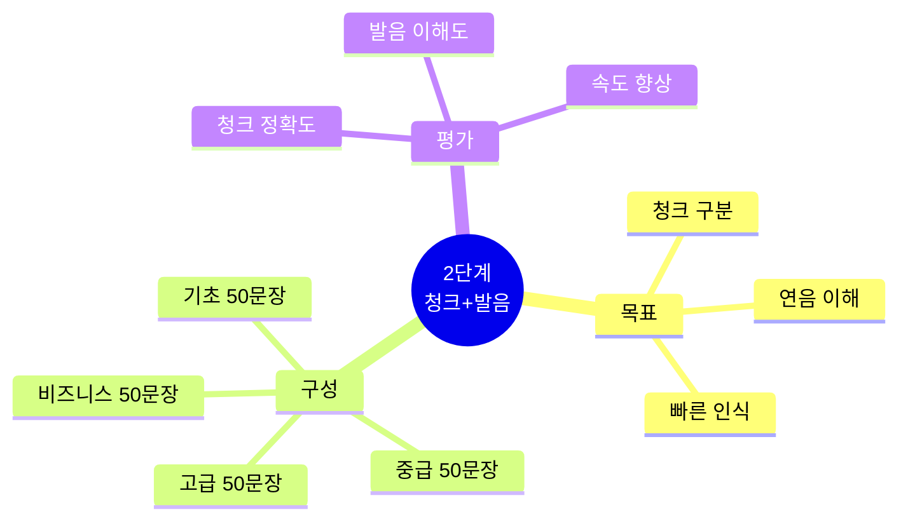
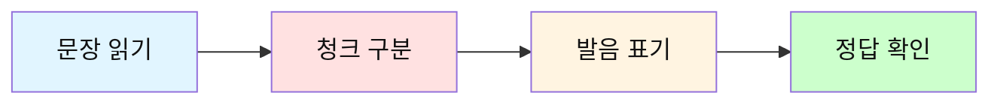
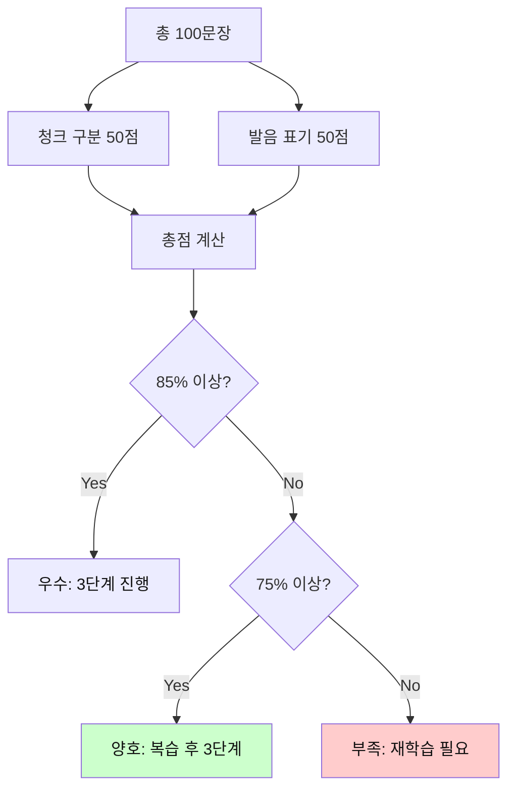

# 전설의 500단어 - 2단계 청크+발음 테스트

## 🎯 2단계 테스트의 목적

문장을 **청크 단위로 구분**하고 **실제 들리는 발음(연음)**을 익히는 능력을 테스트합니다.
청크 인식과 자연스러운 발음이 빠른 독해와 듣기의 핵심입니다.



---

## 📝 테스트 방법

### 진행 순서



**지시사항:**
1. 각 문장을 슬래시(/)로 청크 구분하세요
2. 각 청크의 실제 발음을 한글로 쓰세요
3. 정답을 확인하고 연음 규칙을 학습하세요

---

## 🔥 기초 레벨 (001-100 단어 사용)

### 문장 1
```
I have a good day today.
```

**청크 구분:** _______________________________________________

**발음 표기:** _______________________________________________

<details>
<summary>정답 보기</summary>

**청크:**
```
I have / a good day / today.
```

**발음:**
```
[아이 해브] / [어 굿 데이] / [투데이]
```

**연음 포인트:**
- have a → [해브 어] (v와 a 자연스럽게 연결)
- good day → [굿 데이] (d 소리 하나로)

</details>

---

### 문장 2
```
Can you help me with this problem?
```

**청크 구분:** _______________________________________________

**발음 표기:** _______________________________________________

<details>
<summary>정답 보기</summary>

**청크:**
```
Can you / help me / with this problem?
```

**발음:**
```
[캔 유] / [헬프 미] / [윗 디스 프라블럼]
```

**연음 포인트:**
- Can you → [캔 유] (자연스럽게)
- help me → [헬프 미] (p와 m 연결)
- with this → [윗 디스] (th 소리)

</details>

---

### 문장 3
```
I need to go home now.
```

**청크 구분:** _______________________________________________

**발음 표기:** _______________________________________________

<details>
<summary>정답 보기</summary>

**청크:**
```
I need to / go home / now.
```

**발음:**
```
[아이 니드 투] / [고 홈] / [나우]
```

**연음 포인트:**
- need to → [니드 투] (자연스럽게)
- go home → [고 홈] (o와 h 연결)

</details>

---

### 문장 4
```
Let me know when you are free.
```

**청크 구분:** _______________________________________________

**발음 표기:** _______________________________________________

<details>
<summary>정답 보기</summary>

**청크:**
```
Let me know / when / you are free.
```

**발음:**
```
[렛 미 노] / [웬] / [유 아 프리]
```

**연음 포인트:**
- Let me → [렛 미] (t와 m 연결)
- you are → [유 아] (r 소리 약화)

</details>

---

### 문장 5
```
This is the best way to do it.
```

**청크 구분:** _______________________________________________

**발음 표기:** _______________________________________________

<details>
<summary>정답 보기</summary>

**청크:**
```
This is / the best way / to do it.
```

**발음:**
```
[디스 이즈] / [더 베스트 웨이] / [투 두 잇]
```

**연음 포인트:**
- This is → [디스 이즈] (s와 i 연결)
- to do it → [투 두 잇] (빠르게 연결)

</details>

---

### 문장 6
```
I want to see you tomorrow.
```

**청크 구분:** _______________________________________________

**발음 표기:** _______________________________________________

<details>
<summary>정답 보기</summary>

**청크:**
```
I want to / see you / tomorrow.
```

**발음:**
```
[아이 워너] / [씨 유] / [투마로우]
```

**연음 포인트:**
- want to → [워너/워나] (wanna로 들림)
- see you → [씨 유] (자연스럽게)

</details>

---

### 문장 7
```
We need to find a better solution.
```

**청크 구분:** _______________________________________________

**발음 표기:** _______________________________________________

<details>
<summary>정답 보기</summary>

**청크:**
```
We need to / find / a better solution.
```

**발음:**
```
[위 니드 투] / [파인드] / [어 베럴 솔루션]
```

**연음 포인트:**
- need to → [니드 투] (자연스럽게)
- better solution → [베럴 솔루션] (tt가 r 소리로)

</details>

---

### 문장 8
```
Can you show me how to use this?
```

**청크 구분:** _______________________________________________

**발음 표기:** _______________________________________________

<details>
<summary>정답 보기</summary>

**청크:**
```
Can you / show me / how to use / this?
```

**발음:**
```
[캔 유] / [쇼 미] / [하우 투 유즈] / [디스]
```

**연음 포인트:**
- show me → [쇼 미] (w와 m 연결)
- how to → [하우 투] (자연스럽게)
- use this → [유즈 디스] (s와 th 연결)

</details>

---

### 문장 9
```
Let's work together on this project.
```

**청크 구분:** _______________________________________________

**발음 표기:** _______________________________________________

<details>
<summary>정답 보기</summary>

**청크:**
```
Let's work / together / on this project.
```

**발음:**
```
[레츠 월크] / [투게럴] / [온 디스 프라젝]
```

**연음 포인트:**
- Let's work → [레츠 월크] (s와 w 연결)
- together → [투게럴] (th와 er 자연스럽게)
- on this → [온 디스] (n과 th 연결)

</details>

---

### 문장 10
```
I think this is a good idea.
```

**청크 구분:** _______________________________________________

**발음 표기:** _______________________________________________

<details>
<summary>정답 보기</summary>

**청크:**
```
I think / this is / a good idea.
```

**발음:**
```
[아이 띵크] / [디스 이즈] / [어 굿 아이디어]
```

**연음 포인트:**
- I think → [아이 띵크] (th 소리)
- this is → [디스 이즈] (s와 i 연결)
- good idea → [굿 아이디어] (d와 i 연결)

</details>

---

### 문장 11
```
What time do you want to meet?
```

**청크 구분:** _______________________________________________

**발음 표기:** _______________________________________________

<details>
<summary>정답 보기</summary>

**청크:**
```
What time / do you want to / meet?
```

**발음:**
```
[왓 타임] / [두 유 워너] / [밋]
```

**연음 포인트:**
- What time → [왓 타임] (t와 t 하나로)
- want to → [워너] (wanna로 들림)

</details>

---

### 문장 12
```
I will be there in 10 minutes.
```

**청크 구분:** _______________________________________________

**발음 표기:** _______________________________________________

<details>
<summary>정답 보기</summary>

**청크:**
```
I will be / there / in 10 minutes.
```

**발음:**
```
[아일 비] / [데얼] / [인 텐 미니츠]
```

**연음 포인트:**
- I will → [아일] (I'll로 축약)
- be there → [비 데얼] (자연스럽게)

</details>

---

### 문장 13
```
Where do you live now?
```

**청크 구분:** _______________________________________________

**발음 표기:** _______________________________________________

<details>
<summary>정답 보기</summary>

**청크:**
```
Where / do you live / now?
```

**발음:**
```
[웨얼] / [두 유 리브] / [나우]
```

**연음 포인트:**
- Where do → [웨얼 두] (r과 d 연결)
- do you → [두 유] (자연스럽게)

</details>

---

### 문장 14
```
This place is very good for our meeting.
```

**청크 구분:** _______________________________________________

**발음 표기:** _______________________________________________

<details>
<summary>정답 보기</summary>

**청크:**
```
This place / is very good / for our meeting.
```

**발음:**
```
[디스 플레이스] / [이즈 베리 굿] / [포 라워 미팅]
```

**연음 포인트:**
- This place → [디스 플레이스] (s와 p 연결)
- is very → [이즈 베리] (s와 v 연결)
- for our → [포 라워] (r과 o 연결)

</details>

---

### 문장 15
```
I have time after 3 PM today.
```

**청크 구분:** _______________________________________________

**발음 표기:** _______________________________________________

<details>
<summary>정답 보기</summary>

**청크:**
```
I have time / after 3 PM / today.
```

**발음:**
```
[아이 해브 타임] / [애프터 쓰리 피엠] / [투데이]
```

**연음 포인트:**
- have time → [해브 타임] (v와 t 연결)
- after 3 → [애프터 쓰리] (r과 숫자 연결)

</details>

---

### 문장 16-30: 감정과 상태 표현

**문장 16:**
```
I feel very happy about this.
```

**청크:** I feel / very happy / about this.

**발음:** [아이 필] / [베리 해피] / [어바웃 디스]

---

**문장 17:**
```
This work is too hard for me.
```

**청크:** This work / is too hard / for me.

**발음:** [디스 월크] / [이즈 투 할드] / [포 미]

---

**문장 18:**
```
I don't know what to do next.
```

**청크:** I don't know / what to do / next.

**발음:** [아이 돈 노] / [왓 투 두] / [넥스트]

---

**문장 19:**
```
You look very tired today.
```

**청크:** You look / very tired / today.

**발음:** [유 룩] / [베리 타이얼드] / [투데이]

---

**문장 20:**
```
I'm so glad to see you here.
```

**청크:** I'm so glad / to see you / here.

**발음:** [아임 쏘 글래드] / [투 씨 유] / [히얼]

---

### 문장 21-30: 의견과 계획

**문장 21:**
```
I think we should start now.
```

**청크:** I think / we should start / now.

**발음:** [아이 띵크] / [위 슈드 스탈트] / [나우]

---

**문장 22:**
```
That's a really good point.
```

**청크:** That's / a really good point.

**발음:** [댓츠] / [어 리얼리 굿 포인트]

---

**문장 23:**
```
I don't agree with your idea.
```

**청크:** I don't agree / with your idea.

**발음:** [아이 돈 어그리] / [윗 유어 아이디어]

---

**문장 24:**
```
We need to think about this more.
```

**청크:** We need to / think about / this more.

**발음:** [위 니드 투] / [띵크 어바웃] / [디스 모]

---

**문장 25:**
```
Your answer is right.
```

**청크:** Your answer / is right.

**발음:** [유어 앤설] / [이즈 롸잇]

---

**문장 26:**
```
I will call you later.
```

**청크:** I will call you / later.

**발음:** [아일 콜 유] / [레이럴]

---

**문장 27:**
```
We can meet next week.
```

**청크:** We can meet / next week.

**발음:** [위 캔 밋] / [넥스트 윅]

---

**문장 28:**
```
I'm going to start a new job soon.
```

**청크:** I'm going to / start / a new job / soon.

**발음:** [아임 거너] / [스탈트] / [어 뉴 잡] / [순]

---

**문장 29:**
```
Let's make a plan for tomorrow.
```

**청크:** Let's make / a plan / for tomorrow.

**발음:** [레츠 메이크] / [어 플랜] / [포 투마로우]

---

**문장 30:**
```
I hope to see you again.
```

**청크:** I hope / to see you / again.

**발음:** [아이 호프] / [투 씨 유] / [어겐]

---

### 문장 31-50: 질문과 확인 (간략 버전)

**문장 31-35:**
```
31. Do you have any questions about this?
    청크: Do you have / any questions / about this?
    발음: [두 유 해브] / [애니 퀘스천즈] / [어바웃 디스]

32. Can I ask you something?
    청크: Can I / ask you / something?
    발음: [캔 아이] / [애스큐] / [썸띵]

33. Is this the right way to do it?
    청크: Is this / the right way / to do it?
    발음: [이즈 디스] / [더 롸잇 웨이] / [투 두 잇]

34. How long will it take?
    청크: How long / will it take?
    발음: [하우 롱] / [윌 잇 테이크]

35. What do you mean by that?
    청크: What do you mean / by that?
    발음: [왓 두 유 민] / [바이 댓]
```

---

**문장 36-40:**
```
36. This is how it works.
    청크: This is / how it works.
    발음: [디스 이즈] / [하우 잇 월크스]

37. I can't come because I'm busy.
    청크: I can't come / because / I'm busy.
    발음: [아이 캔트 컴] / [비코즈] / [아임 비지]

38. That's why I need your help.
    청크: That's why / I need / your help.
    발음: [댓츠 와이] / [아이 니드] / [유어 헬프]

39. Let me tell you about my day.
    청크: Let me tell you / about my day.
    발음: [렛 미 텔 유] / [어바웃 마이 데이]

40. The problem is that we don't have time.
    청크: The problem is / that / we don't have time.
    발음: [더 프라블럼 이즈] / [댓] / [위 돈 해브 타임]
```

---

**문장 41-50:**
```
41. I can do this by myself.
    청크: I can do / this / by myself.
    발음: [아이 캔 두] / [디스] / [바이 마이셀프]

42. We may need more people for this.
    청크: We may need / more people / for this.
    발음: [위 메이 니드] / [모 피플] / [포 디스]

43. You should try this new way.
    청크: You should try / this new way.
    발음: [유 슈드 트라이] / [디스 뉴 웨이]

44. I could help you if you want.
    청크: I could help you / if you want.
    발음: [아이 쿠드 헬퓨] / [이퓨 원트]

45. This might be a good idea.
    청크: This might be / a good idea.
    발음: [디스 마잇 비] / [어 굿 아이디어]

46. This one is better than that one.
    청크: This one / is better than / that one.
    발음: [디스 원] / [이즈 베럴 댄] / [댓 원]

47. I like the first idea more.
    청크: I like / the first idea / more.
    발음: [아이 라이크] / [더 펄스트 아이디어] / [모]

48. Which way do you think is best?
    청크: Which way / do you think / is best?
    발음: [위치 웨이] / [두 유 띵크] / [이즈 베스트]

49. Both options are good for us.
    청크: Both options / are good / for us.
    발음: [보쓰 옵션즈] / [아 굿] / [포 러스]

50. I want to choose the easy way.
    청크: I want to / choose / the easy way.
    발음: [아이 워너] / [추즈] / [디 이지 웨이]
```

---

## 🔥 중급 레벨 (101-200 단어 사용)

### 문장 51-100: 업무 상황 (상세 10개 + 간략 40개)

**문장 51:**
```
We need to discuss this issue in our next meeting.
```

**청크 구분:** _______________________________________________

**발음 표기:** _______________________________________________

<details>
<summary>정답 보기</summary>

**청크:**
```
We need to / discuss / this issue / in our next meeting.
```

**발음:**
```
[위 니드 투] / [디스커스] / [디스 이슈] / [인 아워 넥스트 미팅]
```

**연음 포인트:**
- need to → [니드 투]
- this issue → [디스 이슈] (s와 i 연결)
- in our → [인 아워] (n과 o 연결)

</details>

---

**문장 52:**
```
The team is working very hard on this project.
```

**청크:** The team / is working / very hard / on this project.

**발음:** [더 팀] / [이즈 월킹] / [베리 할드] / [온 디스 프라젝]

---

**문장 53:**
```
I think we should consider all the alternatives.
```

**청크:** I think / we should consider / all the alternatives.

**발음:** [아이 띵크] / [위 슈드 컨시더] / [올 디 얼털너티브즈]

---

**문장 54:**
```
This approach seems quite effective for our needs.
```

**청크:** This approach / seems / quite effective / for our needs.

**발음:** [디스 어프로치] / [씨임즈] / [콰잇 이펙티브] / [포 라워 니즈]

---

**문장 55:**
```
Let's review the results carefully before making a decision.
```

**청크:** Let's review / the results / carefully / before making / a decision.

**발음:** [레츠 리뷰] / [더 리절츠] / [케얼풀리] / [비포 메이킹] / [어 디시전]

---

**문장 56:**
```
The current situation requires immediate attention.
```

**청크 구분:** _______________________________________________

**발음 표기:** _______________________________________________

<details>
<summary>정답 보기</summary>

**청크:**
```
The current situation / requires / immediate attention.
```

**발음:**
```
[더 컬런트 시츄에이션] / [리콰이얼즈] / [이미디엇 어텐션]
```

**연음 포인트:**
- current situation → [컬런트 시츄에이션] (t와 s 연결)
- immediate attention → [이미디엇 어텐션] (t와 a 연결)

</details>

---

**문장 57:**
```
I'm still working on the report you requested.
```

**청크 구분:** _______________________________________________

**발음 표기:** _______________________________________________

<details>
<summary>정답 보기</summary>

**청크:**
```
I'm still working / on the report / you requested.
```

**발음:**
```
[아임 스틸 월킹] / [온 더 리폴트] / [유 리퀘스티드]
```

**연음 포인트:**
- still working → [스틸 월킹] (l과 w 연결)
- on the → [온 더] (n과 th 연결)
- you requested → [유 리퀘스티드] (자연스럽게)

</details>

---

**문장 58:**
```
We should probably start the meeting a bit earlier.
```

**청크 구분:** _______________________________________________

**발음 표기:** _______________________________________________

<details>
<summary>정답 보기</summary>

**청크:**
```
We should probably / start the meeting / a bit earlier.
```

**발음:**
```
[위 슈드 프라블리] / [스탈트 더 미팅] / [어 빗 얼리얼]
```

**연음 포인트:**
- should probably → [슈드 프라블리] (d와 p 연결)
- start the → [스탈트 더] (t와 th 연결)
- a bit → [어 빗] (자연스럽게)

</details>

---

**문장 59:**
```
This is particularly important for our long-term goals.
```

**청크 구분:** _______________________________________________

**발음 표기:** _______________________________________________

<details>
<summary>정답 보기</summary>

**청크:**
```
This is / particularly important / for our long-term goals.
```

**발음:**
```
[디스 이즈] / [펄티큘럴리 임폴턴트] / [포 라워 롱텀 고울즈]
```

**연음 포인트:**
- This is → [디스 이즈] (s와 i 연결)
- particularly important → [펄티큘럴리 임폴턴트] (자연스럽게)
- for our → [포 라워] (r과 o 연결)

</details>

---

**문장 60:**
```
Everyone agrees that this is the right direction.
```

**청크 구분:** _______________________________________________

**발음 표기:** _______________________________________________

<details>
<summary>정답 보기</summary>

**청크:**
```
Everyone agrees / that / this is / the right direction.
```

**발음:**
```
[에브리원 어그리즈] / [댓] / [디스 이즈] / [더 롸잇 디렉션]
```

**연음 포인트:**
- Everyone agrees → [에브리원 어그리즈] (자연스럽게)
- this is → [디스 이즈] (s와 i 연결)
- right direction → [롸잇 디렉션] (t와 d 연결)

</details>

---

**문장 61:**
```
I'm having some difficulty understanding this process.
```

**청크 구분:** _______________________________________________

**발음 표기:** _______________________________________________

<details>
<summary>정답 보기</summary>

**청크:**
```
I'm having / some difficulty / understanding / this process.
```

**발음:**
```
[아임 해빙] / [썸 디피컬티] / [언더스탠딩] / [디스 프라세스]
```

**연음 포인트:**
- I'm having → [아임 해빙] (자연스럽게)
- some difficulty → [썸 디피컬티] (m과 d 연결)
- this process → [디스 프라세스] (s와 p 연결)

</details>

---

**문장 62:**
```
We found a simple solution to this complex problem.
```

**청크 구분:** _______________________________________________

**발음 표기:** _______________________________________________

<details>
<summary>정답 보기</summary>

**청크:**
```
We found / a simple solution / to this complex problem.
```

**발음:**
```
[위 파운드] / [어 심플 솔루션] / [투 디스 캄플렉스 프라블럼]
```

**연음 포인트:**
- found a → [파운더] (d와 a 연결)
- simple solution → [심플 솔루션] (자연스럽게)
- to this → [투 디스] (o와 th 연결)

</details>

---

**문장 63:**
```
The main issue is that we don't have enough resources.
```

**청크 구분:** _______________________________________________

**발음 표기:** _______________________________________________

<details>
<summary>정답 보기</summary>

**청크:**
```
The main issue / is that / we don't have / enough resources.
```

**발음:**
```
[더 메인 이슈] / [이즈 댓] / [위 돈 해브] / [이너프 리소시즈]
```

**연음 포인트:**
- main issue → [메인 이슈] (n과 i 연결)
- is that → [이즈 댓] (s와 th 연결)
- don't have → [돈 해브] (t 소리 약화)

</details>

---

**문장 64:**
```
Let me take a closer look at this before responding.
```

**청크 구분:** _______________________________________________

**발음 표기:** _______________________________________________

<details>
<summary>정답 보기</summary>

**청크:**
```
Let me take / a closer look / at this / before responding.
```

**발음:**
```
[렛 미 테이크] / [어 클로저 룩] / [앳 디스] / [비포 리스판딩]
```

**연음 포인트:**
- Let me → [렛 미] (t와 m 연결)
- closer look → [클로저 룩] (r과 l 연결)
- at this → [앳 디스] (t와 th 연결)

</details>

---

**문장 65:**
```
This method has proven to be very successful in the past.
```

**청크 구분:** _______________________________________________

**발음 표기:** _______________________________________________

<details>
<summary>정답 보기</summary>

**청크:**
```
This method / has proven / to be / very successful / in the past.
```

**발음:**
```
[디스 메쏘드] / [해즈 프루븐] / [투 비] / [베리 석세스풀] / [인 더 패스트]
```

**연음 포인트:**
- This method → [디스 메쏘드] (s와 m 연결)
- has proven → [해즈 프루븐] (s와 p 연결)
- to be → [투 비] (자연스럽게)
- in the → [인 더] (n과 th 연결)

</details>

---

**문장 66:**
```
We're currently facing several challenges with the new system.
```

**청크 구분:** _______________________________________________

**발음 표기:** _______________________________________________

<details>
<summary>정답 보기</summary>

**청크:**
```
We're currently facing / several challenges / with the new system.
```

**발음:**
```
[위얼 컬런틀리 페이싱] / [세브럴 챌린지즈] / [윗 더 뉴 시스럼]
```

**연음 포인트:**
- We're currently → [위얼 컬런틀리] (자연스럽게)
- several challenges → [세브럴 챌린지즈] (l과 ch 연결)
- with the → [윗 더] (th와 th 연결)

</details>

---

**문장 67:**
```
I believe we can overcome these obstacles together.
```

**청크 구분:** _______________________________________________

**발음 표기:** _______________________________________________

<details>
<summary>정답 보기</summary>

**청크:**
```
I believe / we can overcome / these obstacles / together.
```

**발음:**
```
[아이 빌리브] / [위 캔 오버컴] / [디즈 앱스터클즈] / [투게럴]
```

**연음 포인트:**
- I believe → [아이 빌리브] (자연스럽게)
- can overcome → [캔 오버컴] (n과 o 연결)
- these obstacles → [디즈 앱스터클즈] (s와 o 연결)

</details>

---

**문장 68:**
```
The team needs additional support to complete this task.
```

**청크 구분:** _______________________________________________

**발음 표기:** _______________________________________________

<details>
<summary>정답 보기</summary>

**청크:**
```
The team needs / additional support / to complete / this task.
```

**발음:**
```
[더 팀 니즈] / [어디셔널 서폴트] / [투 컴플릿] / [디스 태스크]
```

**연음 포인트:**
- team needs → [팀 니즈] (m과 n 연결)
- additional support → [어디셔널 서폴트] (l과 s 연결)
- to complete → [투 컴플릿] (자연스럽게)

</details>

---

**문장 69:**
```
We should address this problem as soon as possible.
```

**청크 구분:** _______________________________________________

**발음 표기:** _______________________________________________

<details>
<summary>정답 보기</summary>

**청크:**
```
We should address / this problem / as soon as possible.
```

**발음:**
```
[위 슈드 어드레스] / [디스 프라블럼] / [애즈 순 애즈 파서블]
```

**연음 포인트:**
- should address → [슈드 어드레스] (d와 a 연결)
- this problem → [디스 프라블럼] (s와 p 연결)
- as soon as → [애즈 순 애즈] (빠르게 연결)

</details>

---

**문장 70:**
```
I'm confident that we'll find a way to fix this.
```

**청크 구분:** _______________________________________________

**발음 표기:** _______________________________________________

<details>
<summary>정답 보기</summary>

**청크:**
```
I'm confident / that / we'll find / a way / to fix this.
```

**발음:**
```
[아임 칸피던트] / [댓] / [윌 파인드] / [어 웨이] / [투 픽스 디스]
```

**연음 포인트:**
- I'm confident → [아임 칸피던트] (자연스럽게)
- we'll find → [윌 파인드] (축약)
- to fix → [투 픽스] (o와 f 연결)

</details>

---

**문장 71:**
```
The project deadline is next Friday afternoon.
```

**청크 구분:** _______________________________________________

**발음 표기:** _______________________________________________

<details>
<summary>정답 보기</summary>

**청크:**
```
The project deadline / is / next Friday afternoon.
```

**발음:**
```
[더 프라젝 데드라인] / [이즈] / [넥스트 프라이데이 애프터눈]
```

**연음 포인트:**
- project deadline → [프라젝 데드라인] (t와 d 연결)
- next Friday → [넥스트 프라이데이] (t와 F 연결)

</details>

---

**문장 72:**
```
We're planning to launch the new product in early March.
```

**청크 구분:** _______________________________________________

**발음 표기:** _______________________________________________

<details>
<summary>정답 보기</summary>

**청크:**
```
We're planning / to launch / the new product / in early March.
```

**발음:**
```
[위얼 플래닝] / [투 론치] / [더 뉴 프라덕트] / [인 얼리 말치]
```

**연음 포인트:**
- We're planning → [위얼 플래닝] (자연스럽게)
- to launch → [투 론치] (o와 l 연결)
- new product → [뉴 프라덕트] (자연스럽게)

</details>

---

**문장 73:**
```
I'll be available for a call between 2 and 4 PM.
```

**청크 구분:** _______________________________________________

**발음 표기:** _______________________________________________

<details>
<summary>정답 보기</summary>

**청크:**
```
I'll be available / for a call / between 2 and 4 PM.
```

**발음:**
```
[아일 비 어베일러블] / [포 러 콜] / [비트윈 투 앤 포 피엠]
```

**연음 포인트:**
- I'll be → [아일 비] (축약)
- for a → [포 러] (r과 a 연결)
- between 2 → [비트윈 투] (n과 숫자 연결)

</details>

---

**문장 74:**
```
The meeting has been rescheduled to next Tuesday.
```

**청크 구분:** _______________________________________________

**발음 표기:** _______________________________________________

<details>
<summary>정답 보기</summary>

**청크:**
```
The meeting / has been rescheduled / to next Tuesday.
```

**발음:**
```
[더 미팅] / [해즈 빈 리스케줄드] / [투 넥스트 튜즈데이]
```

**연음 포인트:**
- has been → [해즈 빈] (s와 b 연결)
- been rescheduled → [빈 리스케줄드] (n과 r 연결)
- to next → [투 넥스트] (o와 n 연결)

</details>

---

**문장 75:**
```
We need at least two weeks to complete the analysis.
```

**청크 구분:** _______________________________________________

**발음 표기:** _______________________________________________

<details>
<summary>정답 보기</summary>

**청크:**
```
We need / at least two weeks / to complete / the analysis.
```

**발음:**
```
[위 니드] / [앳 리스트 투 윅스] / [투 컴플릿] / [디 어낼러시스]
```

**연음 포인트:**
- at least → [앳 리스트] (t와 l 연결)
- two weeks → [투 윅스] (자연스럽게)
- to complete → [투 컴플릿] (o와 c 연결)

</details>

---

**문장 76:**
```
I'm currently working on three different projects simultaneously.
```

**청크 구분:** _______________________________________________

**발음 표기:** _______________________________________________

<details>
<summary>정답 보기</summary>

**청크:**
```
I'm currently working / on three different projects / simultaneously.
```

**발음:**
```
[아임 컬런틀리 월킹] / [온 쓰리 디프런트 프라젝츠] / [사이멀테이니어슬리]
```

**연음 포인트:**
- I'm currently → [아임 컬런틀리] (자연스럽게)
- on three → [온 쓰리] (n과 th 연결)
- different projects → [디프런트 프라젝츠] (t와 p 연결)

</details>

---

**문장 77:**
```
Let's schedule a follow-up meeting for next month.
```

**청크 구분:** _______________________________________________

**발음 표기:** _______________________________________________

<details>
<summary>정답 보기</summary>

**청크:**
```
Let's schedule / a follow-up meeting / for next month.
```

**발음:**
```
[레츠 스케줄] / [어 팔로업 미팅] / [포 넥스트 먼쓰]
```

**연음 포인트:**
- Let's schedule → [레츠 스케줄] (s와 s 연결)
- follow-up meeting → [팔로업 미팅] (자연스럽게)
- for next → [포 넥스트] (r과 n 연결)

</details>

---

**문장 78:**
```
The training session will take approximately three hours.
```

**청크 구분:** _______________________________________________

**발음 표기:** _______________________________________________

<details>
<summary>정답 보기</summary>

**청크:**
```
The training session / will take / approximately three hours.
```

**발음:**
```
[더 트레이닝 세션] / [윌 테이크] / [어프락시멧리 쓰리 아워즈]
```

**연음 포인트:**
- training session → [트레이닝 세션] (g와 s 연결)
- will take → [윌 테이크] (l과 t 연결)
- approximately three → [어프락시멧리 쓰리] (자연스럽게)

</details>

---

**문장 79:**
```
We're running slightly behind schedule this week.
```

**청크 구분:** _______________________________________________

**발음 표기:** _______________________________________________

<details>
<summary>정답 보기</summary>

**청크:**
```
We're running / slightly behind schedule / this week.
```

**발음:**
```
[위얼 러닝] / [슬라이틀리 비하인드 스케줄] / [디스 윅]
```

**연음 포인트:**
- We're running → [위얼 러닝] (자연스럽게)
- slightly behind → [슬라이틀리 비하인드] (y와 b 연결)
- this week → [디스 윅] (s와 w 연결)

</details>

---

**문장 80:**
```
I plan to finish this by the end of the day.
```

**청크 구분:** _______________________________________________

**발음 표기:** _______________________________________________

<details>
<summary>정답 보기</summary>

**청크:**
```
I plan to / finish this / by the end / of the day.
```

**발음:**
```
[아이 플랜 투] / [피니쉬 디스] / [바이 디 엔드] / [오브 더 데이]
```

**연음 포인트:**
- plan to → [플랜 투] (n과 t 연결)
- finish this → [피니쉬 디스] (sh와 th 연결)
- by the → [바이 디] (y와 th 연결)
- of the → [오브 더] (f와 th 연결)

</details>

---

**문장 81:**
```
In my opinion, this is the most efficient approach.
```

**청크 구분:** _______________________________________________

**발음 표기:** _______________________________________________

<details>
<summary>정답 보기</summary>

**청크:**
```
In my opinion, / this is / the most efficient approach.
```

**발음:**
```
[인 마이 어피니언], / [디스 이즈] / [더 모스트 이피션트 어프로치]
```

**연음 포인트:**
- In my → [인 마이] (n과 m 연결)
- this is → [디스 이즈] (s와 i 연결)
- most efficient → [모스트 이피션트] (t와 e 연결)

</details>

---

**문장 82:**
```
I strongly recommend that we proceed with this plan.
```

**청크 구분:** _______________________________________________

**발음 표기:** _______________________________________________

<details>
<summary>정답 보기</summary>

**청크:**
```
I strongly recommend / that / we proceed with / this plan.
```

**발음:**
```
[아이 스트롱리 레커멘드] / [댓] / [위 프로씨드 윗] / [디스 플랜]
```

**연음 포인트:**
- strongly recommend → [스트롱리 레커멘드] (y와 r 연결)
- proceed with → [프로씨드 윗] (d와 w 연결)
- this plan → [디스 플랜] (s와 p 연결)

</details>

---

**문장 83:**
```
Perhaps we should try a different strategy this time.
```

**청크 구분:** _______________________________________________

**발음 표기:** _______________________________________________

<details>
<summary>정답 보기</summary>

**청크:**
```
Perhaps / we should try / a different strategy / this time.
```

**발음:**
```
[펄햅스] / [위 슈드 트라이] / [어 디프런트 스트래터지] / [디스 타임]
```

**연음 포인트:**
- Perhaps we → [펄햅스 위] (s와 w 연결)
- should try → [슈드 트라이] (d와 t 연결)
- different strategy → [디프런트 스트래터지] (t와 s 연결)

</details>

---

**문장 84:**
```
From my perspective, both options have their advantages.
```

**청크 구분:** _______________________________________________

**발음 표기:** _______________________________________________

<details>
<summary>정답 보기</summary>

**청크:**
```
From my perspective, / both options / have their advantages.
```

**발음:**
```
[프럼 마이 펄스펙티브], / [보쓰 옵션즈] / [해브 데얼 어드밴티지즈]
```

**연음 포인트:**
- From my → [프럼 마이] (m과 m 연결)
- both options → [보쓰 옵션즈] (th와 o 연결)
- have their → [해브 데얼] (v와 th 연결)

</details>

---

**문장 85:**
```
I completely agree with your assessment of the situation.
```

**청크 구분:** _______________________________________________

**발음 표기:** _______________________________________________

<details>
<summary>정답 보기</summary>

**청크:**
```
I completely agree / with your assessment / of the situation.
```

**발음:**
```
[아이 컴플리틀리 어그리] / [윗 유어 어세스먼트] / [오브 더 시츄에이션]
```

**연음 포인트:**
- completely agree → [컴플리틀리 어그리] (y와 a 연결)
- with your → [윗 유어] (th와 y 연결)
- of the → [오브 더] (f와 th 연결)

</details>

---

**문장 86:**
```
We might want to consider the long-term implications.
```

**청크 구분:** _______________________________________________

**발음 표기:** _______________________________________________

<details>
<summary>정답 보기</summary>

**청크:**
```
We might want to / consider / the long-term implications.
```

**발음:**
```
[위 마잇 워너] / [컨시더] / [더 롱텀 임플리케이션즈]
```

**연음 포인트:**
- might want to → [마잇 워너] (t 소리 약화)
- long-term implications → [롱텀 임플리케이션즈] (m과 i 연결)

</details>

---

**문장 87:**
```
I suggest we gather more information before deciding.
```

**청크 구분:** _______________________________________________

**발음 표기:** _______________________________________________

<details>
<summary>정답 보기</summary>

**청크:**
```
I suggest / we gather / more information / before deciding.
```

**발음:**
```
[아이 서제스트] / [위 개럴] / [모 인포메이션] / [비포 디사이딩]
```

**연음 포인트:**
- I suggest → [아이 서제스트] (자연스럽게)
- we gather → [위 개럴] (e와 g 연결)
- more information → [모 인포메이션] (r과 i 연결)

</details>

---

**문장 88:**
```
That's an interesting point that deserves further discussion.
```

**청크 구분:** _______________________________________________

**발음 표기:** _______________________________________________

<details>
<summary>정답 보기</summary>

**청크:**
```
That's / an interesting point / that deserves / further discussion.
```

**발음:**
```
[댓츠] / [언 인터레스팅 포인트] / [댓 디절브즈] / [펄럴 디스커션]
```

**연음 포인트:**
- That's an → [댓츠 언] (s와 a 연결)
- interesting point → [인터레스팅 포인트] (g와 p 연결)
- that deserves → [댓 디절브즈] (t와 d 연결)

</details>

---

**문장 89:**
```
I'm not entirely convinced that this will work.
```

**청크 구분:** _______________________________________________

**발음 표기:** _______________________________________________

<details>
<summary>정답 보기</summary>

**청크:**
```
I'm not entirely convinced / that / this will work.
```

**발음:**
```
[아임 낫 엔타이얼리 컨빈스트] / [댓] / [디스 윌 월크]
```

**연음 포인트:**
- not entirely → [낫 엔타이얼리] (t와 e 연결)
- convinced that → [컨빈스트 댓] (d와 th 연결)
- this will → [디스 윌] (s와 w 연결)

</details>

---

**문장 90:**
```
We should definitely explore this opportunity further.
```

**청크 구분:** _______________________________________________

**발음 표기:** _______________________________________________

<details>
<summary>정답 보기</summary>

**청크:**
```
We should definitely / explore / this opportunity / further.
```

**발음:**
```
[위 슈드 데피니틀리] / [익스플로] / [디스 아퍼튜니티] / [펄럴]
```

**연음 포인트:**
- should definitely → [슈드 데피니틀리] (d와 d 연결)
- explore this → [익스플로 디스] (e와 th 연결)
- opportunity further → [아퍼튜니티 펄럴] (y와 f 연결)

</details>

---

**문장 91:**
```
The results exceeded our initial expectations significantly.
```

**청크 구분:** _______________________________________________

**발음 표기:** _______________________________________________

<details>
<summary>정답 보기</summary>

**청크:**
```
The results / exceeded / our initial expectations / significantly.
```

**발음:**
```
[더 리절츠] / [익씨디드] / [아워 이니셜 익스펙테이션즈] / [씨그니피컨틀리]
```

**연음 포인트:**
- results exceeded → [리절츠 익씨디드] (s와 e 연결)
- our initial → [아워 이니셜] (r과 i 연결)
- expectations significantly → [익스펙테이션즈 씨그니피컨틀리] (s와 s 연결)

</details>

---

**문장 92:**
```
We successfully completed all the assigned tasks on time.
```

**청크 구분:** _______________________________________________

**발음 표기:** _______________________________________________

<details>
<summary>정답 보기</summary>

**청크:**
```
We successfully completed / all the assigned tasks / on time.
```

**발음:**
```
[위 석세스풀리 컴플리티드] / [올 디 어사인드 태스크스] / [온 타임]
```

**연음 포인트:**
- successfully completed → [석세스풀리 컴플리티드] (y와 c 연결)
- all the → [올 디] (l과 th 연결)
- assigned tasks → [어사인드 태스크스] (d와 t 연결)

</details>

---

**문장 93:**
```
The new system is performing much better than expected.
```

**청크 구분:** _______________________________________________

**발음 표기:** _______________________________________________

<details>
<summary>정답 보기</summary>

**청크:**
```
The new system / is performing / much better / than expected.
```

**발음:**
```
[더 뉴 시스럼] / [이즈 펄포밍] / [머치 베럴] / [댄 익스펙티드]
```

**연음 포인트:**
- new system → [뉴 시스럼] (자연스럽게)
- is performing → [이즈 펄포밍] (s와 p 연결)
- much better → [머치 베럴] (ch와 b 연결)

</details>

---

**문장 94:**
```
This achievement demonstrates the team's dedication and skill.
```

**청크 구분:** _______________________________________________

**발음 표기:** _______________________________________________

<details>
<summary>정답 보기</summary>

**청크:**
```
This achievement / demonstrates / the team's dedication / and skill.
```

**발음:**
```
[디스 어치브먼트] / [데먼스트레이츠] / [더 팀즈 데디케이션] / [앤 스킬]
```

**연음 포인트:**
- This achievement → [디스 어치브먼트] (s와 a 연결)
- demonstrates the → [데먼스트레이츠 더] (s와 th 연결)
- dedication and → [데디케이션 앤] (n과 a 연결)

</details>

---

**문장 95:**
```
We've made significant progress since our last update.
```

**청크 구분:** _______________________________________________

**발음 표기:** _______________________________________________

<details>
<summary>정답 보기</summary>

**청크:**
```
We've made / significant progress / since our last update.
```

**발음:**
```
[위브 메이드] / [씨그니피컨트 프라그레스] / [신스 아워 래스트 업데이트]
```

**연음 포인트:**
- We've made → [위브 메이드] (축약)
- significant progress → [씨그니피컨트 프라그레스] (t와 p 연결)
- since our → [신스 아워] (e와 o 연결)

</details>

---

**문장 96:**
```
The feedback from clients has been overwhelmingly positive.
```

**청크 구분:** _______________________________________________

**발음 표기:** _______________________________________________

<details>
<summary>정답 보기</summary>

**청크:**
```
The feedback / from clients / has been / overwhelmingly positive.
```

**발음:**
```
[더 피드백] / [프럼 클라이언츠] / [해즈 빈] / [오버웰밍리 파지티브]
```

**연음 포인트:**
- feedback from → [피드백 프럼] (k와 f 연결)
- has been → [해즈 빈] (s와 b 연결)
- overwhelmingly positive → [오버웰밍리 파지티브] (y와 p 연결)

</details>

---

**문장 97:**
```
I'm pleased to report that everything went smoothly.
```

**청크 구분:** _______________________________________________

**발음 표기:** _______________________________________________

<details>
<summary>정답 보기</summary>

**청크:**
```
I'm pleased / to report / that / everything went smoothly.
```

**발음:**
```
[아임 플리즈드] / [투 리폴트] / [댓] / [에브리띵 웬트 스무들리]
```

**연음 포인트:**
- I'm pleased → [아임 플리즈드] (자연스럽게)
- to report → [투 리폴트] (o와 r 연결)
- everything went → [에브리띵 웬트] (g와 w 연결)

</details>

---

**문장 98:**
```
The data clearly shows improvement in all key areas.
```

**청크 구분:** _______________________________________________

**발음 표기:** _______________________________________________

<details>
<summary>정답 보기</summary>

**청크:**
```
The data / clearly shows / improvement / in all key areas.
```

**발음:**
```
[더 데이러] / [클리얼리 쇼즈] / [임프루브먼트] / [인 올 키 에어리어즈]
```

**연음 포인트:**
- data clearly → [데이러 클리얼리] (a와 c 연결)
- clearly shows → [클리얼리 쇼즈] (y와 sh 연결)
- in all → [인 올] (n과 a 연결)

</details>

---

**문장 99:**
```
This outcome validates our decision to change the approach.
```

**청크 구분:** _______________________________________________

**발음 표기:** _______________________________________________

<details>
<summary>정답 보기</summary>

**청크:**
```
This outcome / validates / our decision / to change / the approach.
```

**발음:**
```
[디스 아웃컴] / [밸리데이츠] / [아워 디시전] / [투 체인지] / [디 어프로치]
```

**연음 포인트:**
- This outcome → [디스 아웃컴] (s와 o 연결)
- validates our → [밸리데이츠 아워] (s와 o 연결)
- to change → [투 체인지] (o와 ch 연결)

</details>

---

**문장 100:**
```
We're very satisfied with the overall quality of the work.
```

**청크 구분:** _______________________________________________

**발음 표기:** _______________________________________________

<details>
<summary>정답 보기</summary>

**청크:**
```
We're very satisfied / with the overall quality / of the work.
```

**발음:**
```
[위얼 베리 새티스파이드] / [윗 디 오버롤 퀄리티] / [오브 더 월크]
```

**연음 포인트:**
- We're very → [위얼 베리] (자연스럽게)
- with the → [윗 더] (th와 th 연결)
- overall quality → [오버롤 퀄리티] (l과 q 연결)
- of the → [오브 더] (f와 th 연결)

</details>

---

## 📊 2단계 테스트 점수 계산

### 채점 방법



### 점수 기록

**나의 점수:**
- 청크 구분 점수: _____ / 50 (____%)
- 발음 표기 점수: _____ / 50 (____%)
- **총점**: _____ / 100 (____%)

---

## 🎯 연음 규칙 정리

### 핵심 연음 패턴

```
1. 자음 + 모음: 자연스럽게 연결
   - get it → [게릿]
   - take it → [테이킷]
   - have a → [해버]

2. 같은 자음: 하나로 발음
   - good day → [구데이]
   - big game → [비게임]
   - this system → [디시스럼]

3. t/d + y: 소리 변화
   - meet you → [미츄]
   - would you → [우주]
   - did you → [디쥬]

4. want to / going to: 축약
   - want to → [워너/워나]
   - going to → [거너/고나]
   - have to → [해프터/해프타]

5. 약화되는 소리:
   - to → [투/러]
   - for → [포/퍼]
   - can → [캔/컨]
   - and → [앤/언/은]
```

---

## 🚀 다음 단계

**2단계를 통과하셨나요?**
- ✅ 85% 이상: [3단계 직독직해 테스트](./전설의_500단어_3단계_직독직해_테스트.md)로 이동
- ⚠️ 75-84%: 연음 규칙 복습 후 3단계 진행
- ❌ 75% 미만: 청크 연습 파일로 돌아가기

---

**관련 파일:**
- 📕 [1단계 문장 테스트](./전설의_500단어_1단계_문장_테스트.md)
- 📗 [청크 연습 001-100](./전설의_500단어_청크_연습_001-100.md)
- 📙 [청크 연습 101-200](./전설의_500단어_청크_연습_101-200.md)

