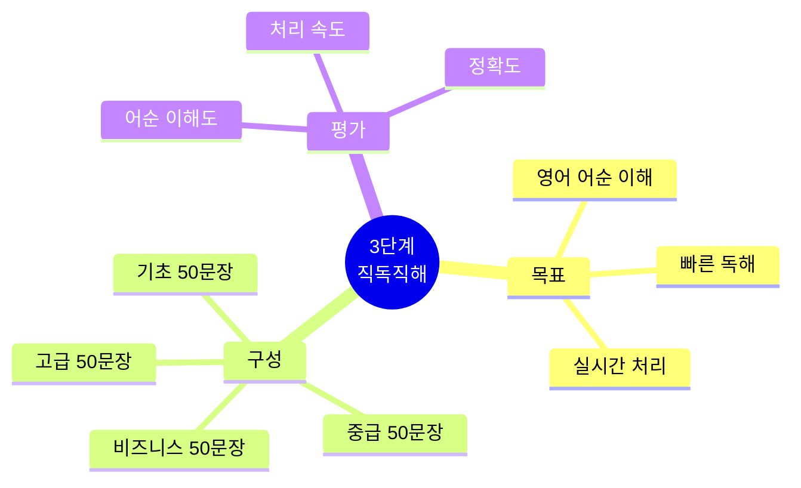
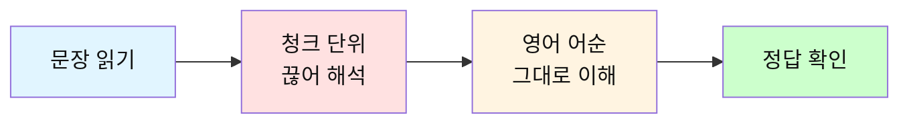
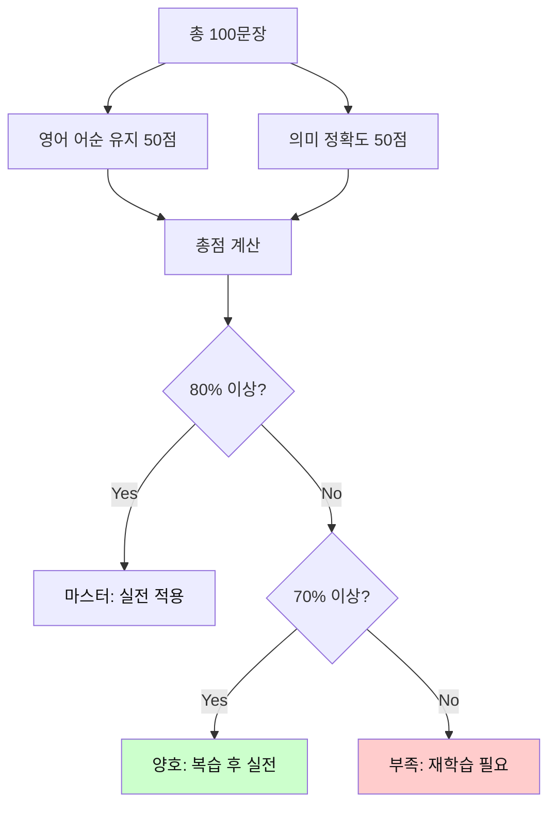
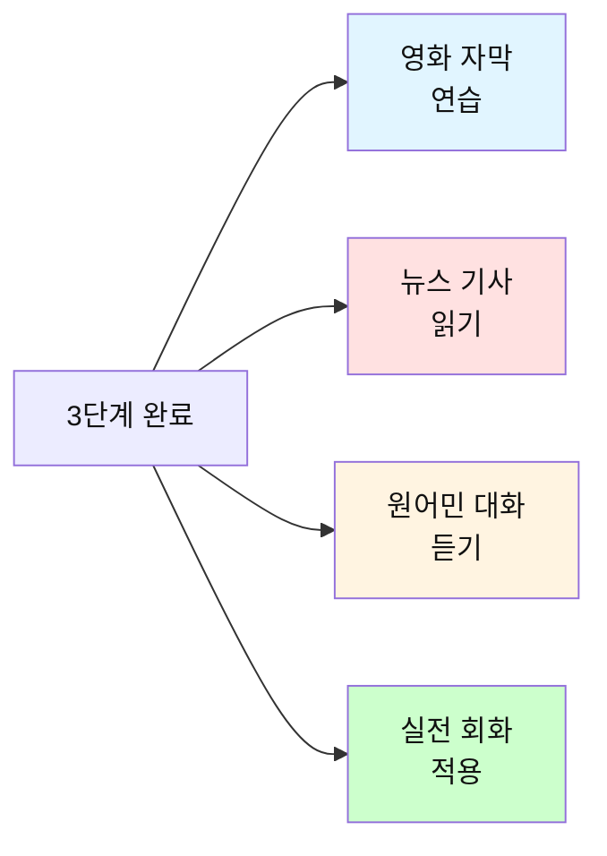

# 전설의 500단어 - 3단계 직독직해 테스트

## 🎯 3단계 테스트의 목적

문장을 **영어 어순 그대로** 이해하는 직독직해 능력을 테스트합니다.
한국어로 번역하지 말고, 영어 순서대로 빠르게 이해하는 것이 목표입니다.



---

## 📝 테스트 방법

### 진행 순서



**지시사항:**
1. 각 문장을 영어 어순 그대로 해석하세요
2. 한국어로 완벽하게 번역하지 마세요
3. 청크 단위로 빠르게 의미를 파악하세요

**중요:** 
- ❌ "나는 학교에 갔다" (한국어 어순)
- ✅ "나는 갔어 / 학교에" (영어 어순)

---

## 🔥 기초 레벨 (001-100 단어 사용)

### 문장 1
```
I have a good day today.
```

**청크 구분:** _______________________________________________

**발음:** _______________________________________________

**직독직해:** _______________________________________________

<details>
<summary>정답 보기</summary>

**청크:**
```
I have / a good day / today.
```

**발음:**
```
[아이 해브] / [어 굿 데이] / [투데이]
```

**직독직해:**
```
나는 있어 / 좋은 하루를 / 오늘
```

**청크별 해석:**
- I have → 나는 있어
- a good day → 좋은 하루를
- today → 오늘

</details>

---

### 문장 2
```
Can you help me with this problem?
```

**청크 구분:** _______________________________________________

**발음:** _______________________________________________

**직독직해:** _______________________________________________

<details>
<summary>정답 보기</summary>

**청크:**
```
Can you / help me / with this problem?
```

**발음:**
```
[캔 유] / [헬프 미] / [윗 디스 프라블럼]
```

**직독직해:**
```
너 할 수 있니 / 도와줄 / 나를 / 이 문제로?
```

**청크별 해석:**
- Can you → 너 할 수 있니
- help me → 도와줄 / 나를
- with this problem → 이 문제로

</details>

---

### 문장 3
```
I need to go home now.
```

**청크 구분:** _______________________________________________

**발음:** _______________________________________________

**직독직해:** _______________________________________________

<details>
<summary>정답 보기</summary>

**청크:**
```
I need to / go home / now.
```

**발음:**
```
[아이 니드 투] / [고 홈] / [나우]
```

**직독직해:**
```
나는 필요해 / 가기를 / 집에 / 지금
```

**청크별 해석:**
- I need to → 나는 필요해
- go home → 가기를 / 집에
- now → 지금

</details>

---

### 문장 4
```
Let me know when you are free.
```

**청크 구분:** _______________________________________________

**발음:** _______________________________________________

**직독직해:** _______________________________________________

<details>
<summary>정답 보기</summary>

**청크:**
```
Let me know / when / you are free.
```

**발음:**
```
[렛 미 노] / [웬] / [유 아 프리]
```

**직독직해:**
```
내게 알려줘 / 언제 / 너 있는지 / 시간이
```

**청크별 해석:**
- Let me know → 내게 알려줘
- when → 언제
- you are free → 너 있는지 / 시간이

</details>

---

### 문장 5
```
This is the best way to do it.
```

**청크 구분:** _______________________________________________

**발음:** _______________________________________________

**직독직해:** _______________________________________________

<details>
<summary>정답 보기</summary>

**청크:**
```
This is / the best way / to do it.
```

**발음:**
```
[디스 이즈] / [더 베스트 웨이] / [투 두 잇]
```

**직독직해:**
```
이것은 / 최고의 방법이야 / 하는 / 그것을
```

**청크별 해석:**
- This is → 이것은
- the best way → 최고의 방법이야
- to do it → 하는 / 그것을

</details>

---

### 문장 6
```
I want to see you tomorrow.
```

**청크 구분:** _______________________________________________

**발음:** _______________________________________________

**직독직해:** _______________________________________________

<details>
<summary>정답 보기</summary>

**청크:**
```
I want to / see you / tomorrow.
```

**발음:**
```
[아이 워너] / [씨 유] / [투마로우]
```

**직독직해:**
```
나는 원해 / 보기를 / 너를 / 내일
```

**청크별 해석:**
- I want to → 나는 원해
- see you → 보기를 / 너를
- tomorrow → 내일

</details>

---

### 문장 7
```
We need to find a better solution.
```

**청크 구분:** _______________________________________________

**발음:** _______________________________________________

**직독직해:** _______________________________________________

<details>
<summary>정답 보기</summary>

**청크:**
```
We need to / find / a better solution.
```

**발음:**
```
[위 니드 투] / [파인드] / [어 베럴 솔루션]
```

**직독직해:**
```
우리는 필요해 / 찾을 / 더 나은 해결책을
```

**청크별 해석:**
- We need to → 우리는 필요해
- find → 찾을
- a better solution → 더 나은 해결책을

</details>

---

### 문장 8
```
Can you show me how to use this?
```

**청크 구분:** _______________________________________________

**발음:** _______________________________________________

**직독직해:** _______________________________________________

<details>
<summary>정답 보기</summary>

**청크:**
```
Can you / show me / how to use / this?
```

**발음:**
```
[캔 유] / [쇼 미] / [하우 투 유즈] / [디스]
```

**직독직해:**
```
너 보여줄 수 있니 / 나에게 / 어떻게 / 사용하는지 / 이것을?
```

**청크별 해석:**
- Can you show me → 너 보여줄 수 있니 / 나에게
- how to use → 어떻게 / 사용하는지
- this → 이것을

</details>

---

### 문장 9
```
Let's work together on this project.
```

**청크 구분:** _______________________________________________

**발음:** _______________________________________________

**직독직해:** _______________________________________________

<details>
<summary>정답 보기</summary>

**청크:**
```
Let's work / together / on this project.
```

**발음:**
```
[레츠 월크] / [투게럴] / [온 디스 프라젝]
```

**직독직해:**
```
일하자 / 함께 / 이 프로젝트에
```

**청크별 해석:**
- Let's work → 일하자
- together → 함께
- on this project → 이 프로젝트에

</details>

---

### 문장 10
```
I think this is a good idea.
```

**청크 구분:** _______________________________________________

**발음:** _______________________________________________

**직독직해:** _______________________________________________

<details>
<summary>정답 보기</summary>

**청크:**
```
I think / this is / a good idea.
```

**발음:**
```
[아이 띵크] / [디스 이즈] / [어 굿 아이디어]
```

**직독직해:**
```
나는 생각해 / 이것이 / 좋은 아이디어라고
```

**청크별 해석:**
- I think → 나는 생각해
- this is → 이것이
- a good idea → 좋은 아이디어라고

</details>

---

### 문장 11-50 (간략 버전)

**문장 11-20:**
```
11. What time do you want to meet?
    청크: What time / do you want to / meet?
    발음: [왓 타임] / [두 유 워너] / [밋]
    직독직해: 몇 시에 / 너는 원해 / 만나기를?

12. I will be there in 10 minutes.
    청크: I will be / there / in 10 minutes.
    발음: [아일 비] / [데얼] / [인 텐 미니츠]
    직독직해: 나는 있을 거야 / 거기에 / 10분 안에

13. Where do you live now?
    청크: Where / do you live / now?
    발음: [웨얼] / [두 유 리브] / [나우]
    직독직해: 어디에 / 너는 사니 / 지금?

14. This place is very good for our meeting.
    청크: This place / is very good / for our meeting.
    발음: [디스 플레이스] / [이즈 베리 굿] / [포 라워 미팅]
    직독직해: 이 장소는 / 매우 좋아 / 우리 회의에

15. I have time after 3 PM today.
    청크: I have time / after 3 PM / today.
    발음: [아이 해브 타임] / [애프터 쓰리 피엠] / [투데이]
    직독직해: 나는 시간이 있어 / 3시 이후에 / 오늘

16. I feel very happy about this.
    청크: I feel / very happy / about this.
    발음: [아이 필] / [베리 해피] / [어바웃 디스]
    직독직해: 나는 느껴 / 매우 행복하게 / 이것에 대해

17. This work is too hard for me.
    청크: This work / is too hard / for me.
    발음: [디스 월크] / [이즈 투 할드] / [포 미]
    직독직해: 이 일은 / 너무 어려워 / 나에게

18. I don't know what to do next.
    청크: I don't know / what to do / next.
    발음: [아이 돈 노] / [왓 투 두] / [넥스트]
    직독직해: 나는 모르겠어 / 무엇을 / 할지 / 다음에

19. You look very tired today.
    청크: You look / very tired / today.
    발음: [유 룩] / [베리 타이얼드] / [투데이]
    직독직해: 너 보여 / 매우 피곤해 / 오늘

20. I'm so glad to see you here.
    청크: I'm so glad / to see you / here.
    발음: [아임 쏘 글래드] / [투 씨 유] / [히얼]
    직독직해: 나는 너무 기뻐 / 보게 돼서 / 너를 / 여기서
```

---

**문장 21-30:**
```
21. I think we should start now.
    청크: I think / we should start / now.
    발음: [아이 띵크] / [위 슈드 스탈트] / [나우]
    직독직해: 나는 생각해 / 우리가 해야 한다고 / 시작을 / 지금

22. That's a really good point.
    청크: That's / a really good point.
    발음: [댓츠] / [어 리얼리 굿 포인트]
    직독직해: 그것은 / 정말 좋은 지적이야

23. I don't agree with your idea.
    청크: I don't agree / with your idea.
    발음: [아이 돈 어그리] / [윗 유어 아이디어]
    직독직해: 나는 동의하지 않아 / 네 아이디어에

24. We need to think about this more.
    청크: We need to / think about / this more.
    발음: [위 니드 투] / [띵크 어바웃] / [디스 모]
    직독직해: 우리는 필요해 / 생각할 / 이것에 대해 / 더

25. Your answer is right.
    청크: Your answer / is right.
    발음: [유어 앤설] / [이즈 롸잇]
    직독직해: 네 답은 / 맞아

26. I will call you later.
    청크: I will call you / later.
    발음: [아일 콜 유] / [레이럴]
    직독직해: 나는 전화할게 / 너에게 / 나중에

27. We can meet next week.
    청크: We can meet / next week.
    발음: [위 캔 밋] / [넥스트 윅]
    직독직해: 우리는 만날 수 있어 / 다음 주에

28. I'm going to start a new job soon.
    청크: I'm going to / start / a new job / soon.
    발음: [아임 거너] / [스탈트] / [어 뉴 잡] / [순]
    직독직해: 나는 할 거야 / 시작을 / 새 직장을 / 곧

29. Let's make a plan for tomorrow.
    청크: Let's make / a plan / for tomorrow.
    발음: [레츠 메이크] / [어 플랜] / [포 투마로우]
    직독직해: 만들자 / 계획을 / 내일을 위한

30. I hope to see you again.
    청크: I hope / to see you / again.
    발음: [아이 호프] / [투 씨 유] / [어겐]
    직독직해: 나는 바라 / 보기를 / 너를 / 다시
```

---

**문장 31-40:**
```
31. Do you have any questions about this?
    청크: Do you have / any questions / about this?
    발음: [두 유 해브] / [애니 퀘스천즈] / [어바웃 디스]
    직독직해: 너 있니 / 어떤 질문이 / 이것에 대한?

32. Can I ask you something?
    청크: Can I / ask you / something?
    발음: [캔 아이] / [애스큐] / [썸띵]
    직독직해: 내가 물어봐도 될까 / 너에게 / 뭔가를?

33. Is this the right way to do it?
    청크: Is this / the right way / to do it?
    발음: [이즈 디스] / [더 롸잇 웨이] / [투 두 잇]
    직독직해: 이것이 / 올바른 방법이니 / 하는 / 그것을?

34. How long will it take?
    청크: How long / will it take?
    발음: [하우 롱] / [윌 잇 테이크]
    직독직해: 얼마나 오래 / 걸릴까?

35. What do you mean by that?
    청크: What do you mean / by that?
    발음: [왓 두 유 민] / [바이 댓]
    직독직해: 무엇을 / 너는 의미하니 / 그것으로?

36. This is how it works.
    청크: This is / how it works.
    발음: [디스 이즈] / [하우 잇 월크스]
    직독직해: 이것이 / 방법이야 / 그것이 작동하는

37. I can't come because I'm busy.
    청크: I can't come / because / I'm busy.
    발음: [아이 캔트 컴] / [비코즈] / [아임 비지]
    직독직해: 나는 올 수 없어 / 왜냐하면 / 나는 바빠서

38. That's why I need your help.
    청크: That's why / I need / your help.
    발음: [댓츠 와이] / [아이 니드] / [유어 헬프]
    직독직해: 그것이 이유야 / 내가 필요한 / 네 도움이

39. Let me tell you about my day.
    청크: Let me tell you / about my day.
    발음: [렛 미 텔 유] / [어바웃 마이 데이]
    직독직해: 내가 말할게 / 너에게 / 내 하루에 대해

40. The problem is that we don't have time.
    청크: The problem is / that / we don't have time.
    발음: [더 프라블럼 이즈] / [댓] / [위 돈 해브 타임]
    직독직해: 문제는 / ~라는 거야 / 우리가 시간이 없다는
```

---

**문장 41-50:**
```
41. I can do this by myself.
    청크: I can do / this / by myself.
    발음: [아이 캔 두] / [디스] / [바이 마이셀프]
    직독직해: 나는 할 수 있어 / 이것을 / 혼자서

42. We may need more people for this.
    청크: We may need / more people / for this.
    발음: [위 메이 니드] / [모 피플] / [포 디스]
    직독직해: 우리는 필요할 수 있어 / 더 많은 사람들이 / 이것을 위해

43. You should try this new way.
    청크: You should try / this new way.
    발음: [유 슈드 트라이] / [디스 뉴 웨이]
    직독직해: 너는 해야 해 / 시도를 / 이 새로운 방법을

44. I could help you if you want.
    청크: I could help you / if you want.
    발음: [아이 쿠드 헬퓨] / [이퓨 원트]
    직독직해: 나는 도울 수 있어 / 너를 / 만약 네가 원한다면

45. This might be a good idea.
    청크: This might be / a good idea.
    발음: [디스 마잇 비] / [어 굿 아이디어]
    직독직해: 이것은 / ~일 수 있어 / 좋은 아이디어

46. This one is better than that one.
    청크: This one / is better than / that one.
    발음: [디스 원] / [이즈 베럴 댄] / [댓 원]
    직독직해: 이것이 / 더 나아 / 저것보다

47. I like the first idea more.
    청크: I like / the first idea / more.
    발음: [아이 라이크] / [더 펄스트 아이디어] / [모]
    직독직해: 나는 좋아해 / 첫 번째 아이디어를 / 더

48. Which way do you think is best?
    청크: Which way / do you think / is best?
    발음: [위치 웨이] / [두 유 띵크] / [이즈 베스트]
    직독직해: 어느 방법을 / 너는 생각하니 / 최고라고?

49. Both options are good for us.
    청크: Both options / are good / for us.
    발음: [보쓰 옵션즈] / [아 굿] / [포 러스]
    직독직해: 두 옵션 모두 / 좋아 / 우리에게

50. I want to choose the easy way.
    청크: I want to / choose / the easy way.
    발음: [아이 워너] / [추즈] / [디 이지 웨이]
    직독직해: 나는 원해 / 선택하기를 / 쉬운 방법을
```

---

## 🔥 중급 레벨 (101-200 단어 사용)

### 문장 51
```
We need to discuss this issue in our next meeting.
```

**청크 구분:** _______________________________________________

**발음:** _______________________________________________

**직독직해:** _______________________________________________

<details>
<summary>정답 보기</summary>

**청크:**
```
We need to / discuss / this issue / in our next meeting.
```

**발음:**
```
[위 니드 투] / [디스커스] / [디스 이슈] / [인 아워 넥스트 미팅]
```

**직독직해:**
```
우리는 필요해 / 논의할 / 이 문제를 / 우리 다음 회의에서
```

**청크별 해석:**
- We need to → 우리는 필요해
- discuss this issue → 논의할 / 이 문제를
- in our next meeting → 우리 다음 회의에서

</details>

---

### 문장 52
```
The team is working very hard on this project.
```

**청크 구분:** _______________________________________________

**발음:** _______________________________________________

**직독직해:** _______________________________________________

<details>
<summary>정답 보기</summary>

**청크:**
```
The team / is working / very hard / on this project.
```

**발음:**
```
[더 팀] / [이즈 월킹] / [베리 할드] / [온 디스 프라젝]
```

**직독직해:**
```
팀은 / 일하고 있어 / 매우 열심히 / 이 프로젝트에
```

**청크별 해석:**
- The team → 팀은
- is working very hard → 일하고 있어 / 매우 열심히
- on this project → 이 프로젝트에

</details>

---

### 문장 53
```
I think we should consider all the alternatives.
```

**청크 구분:** _______________________________________________

**발음:** _______________________________________________

**직독직해:** _______________________________________________

<details>
<summary>정답 보기</summary>

**청크:**
```
I think / we should consider / all the alternatives.
```

**발음:**
```
[아이 띵크] / [위 슈드 컨시덜] / [올 디 얼털너티브즈]
```

**직독직해:**
```
나는 생각해 / 우리가 고려해야 한다고 / 모든 대안들을
```

**청크별 해석:**
- I think → 나는 생각해
- we should consider → 우리가 고려해야 한다고
- all the alternatives → 모든 대안들을

</details>

---

### 문장 54
```
This approach seems quite effective for our needs.
```

**청크 구분:** _______________________________________________

**발음:** _______________________________________________

**직독직해:** _______________________________________________

<details>
<summary>정답 보기</summary>

**청크:**
```
This approach / seems / quite effective / for our needs.
```

**발음:**
```
[디스 어프로치] / [심즈] / [콰잇 이펙티브] / [포 라워 니즈]
```

**직독직해:**
```
이 접근법은 / 보여 / 꽤 효과적인 것으로 / 우리 필요에
```

**청크별 해석:**
- This approach → 이 접근법은
- seems quite effective → 보여 / 꽤 효과적인 것으로
- for our needs → 우리 필요에

</details>

---

### 문장 55
```
Let's review the results carefully before making a decision.
```

**청크 구분:** _______________________________________________

**발음:** _______________________________________________

**직독직해:** _______________________________________________

<details>
<summary>정답 보기</summary>

**청크:**
```
Let's review / the results / carefully / before making / a decision.
```

**발음:**
```
[레츠 리뷰] / [더 리절츠] / [케얼풀리] / [비포 메이킹] / [어 디시전]
```

**직독직해:**
```
검토하자 / 결과를 / 신중하게 / 만들기 전에 / 결정을
```

**청크별 해석:**
- Let's review the results → 검토하자 / 결과를
- carefully → 신중하게
- before making a decision → 만들기 전에 / 결정을

</details>

---

### 문장 56-100 (상세 버전 계속)

**문장 56:**
```
The current situation requires immediate attention.
```

**청크 구분:** _______________________________________________

**발음:** _______________________________________________

**직독직해:** _______________________________________________

<details>
<summary>정답 보기</summary>

**청크:**
```
The current situation / requires / immediate attention.
```

**발음:**
```
[더 컬런트 시추에이션] / [리콰이얼즈] / [이미디엇 어텐션]
```

**직독직해:**
```
현재 상황은 / 필요로 해 / 즉각적인 주의를
```

**청크별 해석:**
- The current situation → 현재 상황은
- requires → 필요로 해
- immediate attention → 즉각적인 주의를

</details>

---

**문장 57:**
```
I'm still working on the report you requested.
```

**청크 구분:** _______________________________________________

**발음:** _______________________________________________

**직독직해:** _______________________________________________

<details>
<summary>정답 보기</summary>

**청크:**
```
I'm still working / on the report / you requested.
```

**발음:**
```
[아임 스틸 월킹] / [온 더 리폴트] / [유 리퀘스티드]
```

**직독직해:**
```
나는 아직 작업 중이야 / 보고서를 / 네가 요청한
```

**청크별 해석:**
- I'm still working → 나는 아직 작업 중이야
- on the report → 보고서를
- you requested → 네가 요청한

</details>

---

**문장 58:**
```
We should probably start the meeting a bit earlier.
```

**청크 구분:** _______________________________________________

**발음:** _______________________________________________

**직독직해:** _______________________________________________

<details>
<summary>정답 보기</summary>

**청크:**
```
We should probably / start / the meeting / a bit earlier.
```

**발음:**
```
[위 슈드 프라블리] / [스탈트] / [더 미팅] / [어 빗 얼리얼]
```

**직독직해:**
```
우리는 아마 해야 할 거야 / 시작을 / 회의를 / 조금 더 일찍
```

**청크별 해석:**
- We should probably → 우리는 아마 해야 할 거야
- start the meeting → 시작을 / 회의를
- a bit earlier → 조금 더 일찍

</details>

---

**문장 59:**
```
This is particularly important for our long-term goals.
```

**청크 구분:** _______________________________________________

**발음:** _______________________________________________

**직독직해:** _______________________________________________

<details>
<summary>정답 보기</summary>

**청크:**
```
This is / particularly important / for our long-term goals.
```

**발음:**
```
[디스 이즈] / [펄티큘럴리 임폴턴트] / [포 라워 롱텀 골즈]
```

**직독직해:**
```
이것은 / 특히 중요해 / 우리 장기 목표에
```

**청크별 해석:**
- This is → 이것은
- particularly important → 특히 중요해
- for our long-term goals → 우리 장기 목표에

</details>

---

**문장 60:**
```
Everyone agrees that this is the right direction.
```

**청크 구분:** _______________________________________________

**발음:** _______________________________________________

**직독직해:** _______________________________________________

<details>
<summary>정답 보기</summary>

**청크:**
```
Everyone agrees / that / this is / the right direction.
```

**발음:**
```
[에브리원 어그리즈] / [댓] / [디스 이즈] / [더 롸잇 디렉션]
```

**직독직해:**
```
모두가 동의해 / ~라는 것에 / 이것이 / 올바른 방향이라는
```

**청크별 해석:**
- Everyone agrees → 모두가 동의해
- that this is → ~라는 것에 / 이것이
- the right direction → 올바른 방향이라는

</details>

---

**문장 61-100:**

```
61. I'm having some difficulty understanding this process.
    청크: I'm having / some difficulty / understanding / this process.
    발음: [아임 해빙] / [썸 디피컬티] / [언더스탠딩] / [디스 프라세스]
    직독직해: 나는 겪고 있어 / 약간의 어려움을 / 이해하는 데 / 이 과정을

62. We found a simple solution to this complex problem.
    청크: We found / a simple solution / to this complex problem.
    발음: [위 파운드] / [어 심플 솔루션] / [투 디스 컴플렉스 프라블럼]
    직독직해: 우리는 찾았어 / 간단한 해결책을 / 이 복잡한 문제에 대한

63. The main issue is that we don't have enough resources.
    청크: The main issue is / that / we don't have / enough resources.
    발음: [더 메인 이슈 이즈] / [댓] / [위 돈 해브] / [이넙 리소시즈]
    직독직해: 주요 문제는 / ~라는 거야 / 우리가 충분한 자원이 없다는

64. Let me take a closer look at this before responding.
    청크: Let me take / a closer look / at this / before responding.
    발음: [렛 미 테이크] / [어 클로설 룩] / [앳 디스] / [비포 리스판딩]
    직독직해: 내가 볼게 / 더 자세히 / 이것을 / 응답하기 전에

65. This method has proven to be very successful in the past.
    청크: This method / has proven / to be very successful / in the past.
    발음: [디스 메쏘드] / [해즈 프루븐] / [투 비 베리 석세스풀] / [인 더 패스트]
    직독직해: 이 방법은 / 입증됐어 / ~라는 것이 / 매우 성공적이라는 / 과거에

66. We're currently facing several challenges with the new system.
    청크: We're currently facing / several challenges / with the new system.
    발음: [위얼 컬런틀리 페이싱] / [세브럴 챌린지즈] / [윗 더 뉴 시스템]
    직독직해: 우리는 현재 직면하고 있어 / 여러 도전에 / 새 시스템과 관련하여

67. I believe we can overcome these obstacles together.
    청크: I believe / we can overcome / these obstacles / together.
    발음: [아이 빌리브] / [위 캔 오벌컴] / [디즈 압스터클즈] / [투게럴]
    직독직해: 나는 믿어 / 우리가 극복할 수 있다고 / 이 장애물들을 / 함께

68. The team needs additional support to complete this task.
    청크: The team needs / additional support / to complete / this task.
    발음: [더 팀 니즈] / [어디셔널 서폴트] / [투 컴플릿] / [디스 태스크]
    직독직해: 팀은 필요해 / 추가 지원이 / 완료하기 위해 / 이 작업을

69. We should address this problem as soon as possible.
    청크: We should address / this problem / as soon as possible.
    발음: [위 슈드 어드레스] / [디스 프라블럼] / [애즈 순 애즈 파서블]
    직독직해: 우리는 해야 해 / 다룰 / 이 문제를 / 가능한 한 빨리

70. I'm confident that we'll find a way to fix this.
    청크: I'm confident / that / we'll find / a way / to fix this.
    발음: [아임 칸피던트] / [댓] / [윌 파인드] / [어 웨이] / [투 픽스 디스]
    직독직해: 나는 확신해 / ~라는 것을 / 우리가 찾을 거라는 / 방법을 / 고치는 / 이것을

71. The project deadline is next Friday afternoon.
    청크: The project deadline / is / next Friday afternoon.
    발음: [더 프라젝 데드라인] / [이즈] / [넥스트 프라이데이 애프털눈]
    직독직해: 프로젝트 마감일은 / 다음 주 금요일 오후야

72. We're planning to launch the new product in early March.
    청크: We're planning / to launch / the new product / in early March.
    발음: [위얼 플래닝] / [투 론치] / [더 뉴 프라덕트] / [인 얼리 말치]
    직독직해: 우리는 계획하고 있어 / 출시하기를 / 새 제품을 / 3월 초에

73. I'll be available for a call between 2 and 4 PM.
    청크: I'll be available / for a call / between 2 and 4 PM.
    발음: [아일 비 어베일러블] / [포 러 콜] / [비트윈 투 앤 포 피엠]
    직독직해: 나는 가능할 거야 / 통화가 / 2시와 4시 사이에

74. The meeting has been rescheduled to next Tuesday.
    청크: The meeting / has been rescheduled / to next Tuesday.
    발음: [더 미팅] / [해즈 빈 리스케줄드] / [투 넥스트 츄즈데이]
    직독직해: 회의가 / 재조정됐어 / 다음 주 화요일로

75. We need at least two weeks to complete the analysis.
    청크: We need / at least two weeks / to complete / the analysis.
    발음: [위 니드] / [앳 리스트 투 윅스] / [투 컴플릿] / [디 어낼러시스]
    직독직해: 우리는 필요해 / 최소 2주가 / 완료하기 위해 / 분석을

76. I'm currently working on three different projects simultaneously.
    청크: I'm currently working / on three different projects / simultaneously.
    발음: [아임 컬런틀리 월킹] / [온 쓰리 디프런트 프라젝츠] / [사이멀테이니어슬리]
    직독직해: 나는 현재 작업 중이야 / 3개의 다른 프로젝트를 / 동시에

77. Let's schedule a follow-up meeting for next month.
    청크: Let's schedule / a follow-up meeting / for next month.
    발음: [레츠 스케줄] / [어 팔로업 미팅] / [포 넥스트 먼쓰]
    직독직해: 일정을 잡자 / 후속 회의를 / 다음 달에

78. The training session will take approximately three hours.
    청크: The training session / will take / approximately three hours.
    발음: [더 트레이닝 세션] / [윌 테이크] / [어프락시멀리 쓰리 아월즈]
    직독직해: 교육 세션은 / 걸릴 거야 / 대략 3시간

79. We're running slightly behind schedule this week.
    청크: We're running / slightly behind schedule / this week.
    발음: [위얼 러닝] / [슬라잇리 비하인드 스케줄] / [디스 윅]
    직독직해: 우리는 진행 중이야 / 약간 늦게 / 일정보다 / 이번 주에

80. I plan to finish this by the end of the day.
    청크: I plan / to finish / this / by the end of the day.
    발음: [아이 플랜] / [투 피니쉬] / [디스] / [바이 디 엔드 어브 더 데이]
    직독직해: 나는 계획해 / 끝내기를 / 이것을 / 오늘 끝까지

81. In my opinion, this is the most efficient approach.
    청크: In my opinion, / this is / the most efficient approach.
    발음: [인 마이 어피니언] / [디스 이즈] / [더 모스트 이피션트 어프로치]
    직독직해: 내 의견으로는, / 이것이 / 가장 효율적인 접근법이야

82. I strongly recommend that we proceed with this plan.
    청크: I strongly recommend / that / we proceed / with this plan.
    발음: [아이 스트롱리 레커멘드] / [댓] / [위 프러시드] / [윗 디스 플랜]
    직독직해: 나는 강력히 권고해 / ~라는 것을 / 우리가 진행해야 한다는 / 이 계획을

83. Perhaps we should try a different strategy this time.
    청크: Perhaps / we should try / a different strategy / this time.
    발음: [펄햅스] / [위 슈드 트라이] / [어 디프런트 스트래터지] / [디스 타임]
    직독직해: 아마도 / 우리는 해야 할 거야 / 시도를 / 다른 전략을 / 이번에

84. From my perspective, both options have their advantages.
    청크: From my perspective, / both options / have / their advantages.
    발음: [프럼 마이 펄스펙티브] / [보쓰 옵션즈] / [해브] / [데얼 어드밴티지즈]
    직독직해: 내 관점에서, / 두 옵션 모두 / 있어 / 그들의 장점이

85. I completely agree with your assessment of the situation.
    청크: I completely agree / with your assessment / of the situation.
    발음: [아이 컴플리틀리 어그리] / [윗 유어 어세스먼트] / [어브 더 시추에이션]
    직독직해: 나는 완전히 동의해 / 네 평가에 / 상황에 대한

86. We might want to consider the long-term implications.
    청크: We might want / to consider / the long-term implications.
    발음: [위 마잇 원트] / [투 컨시덜] / [더 롱텀 임플리케이션즈]
    직독직해: 우리는 원할 수 있어 / 고려하기를 / 장기적 영향을

87. I suggest we gather more information before deciding.
    청크: I suggest / we gather / more information / before deciding.
    발음: [아이 서제스트] / [위 개덜] / [모 인포메이션] / [비포 디사이딩]
    직독직해: 나는 제안해 / 우리가 수집하기를 / 더 많은 정보를 / 결정하기 전에

88. That's an interesting point that deserves further discussion.
    청크: That's / an interesting point / that deserves / further discussion.
    발음: [댓츠] / [언 인터레스팅 포인트] / [댓 디절브즈] / [펄덜 디스커션]
    직독직해: 그것은 / 흥미로운 지적이야 / 필요로 하는 / 추가 논의를

89. I'm not entirely convinced that this will work.
    청크: I'm not entirely convinced / that / this will work.
    발음: [아임 낫 인타이얼리 컨빈스트] / [댓] / [디스 윌 월크]
    직독직해: 나는 완전히 확신하지 못해 / ~라는 것을 / 이것이 효과가 있을 거라는

90. We should definitely explore this opportunity further.
    청크: We should definitely / explore / this opportunity / further.
    발음: [위 슈드 데피니틀리] / [익스플로] / [디스 아펄투니티] / [펄덜]
    직독직해: 우리는 확실히 해야 해 / 탐구를 / 이 기회를 / 더

91. The results exceeded our initial expectations significantly.
    청크: The results / exceeded / our initial expectations / significantly.
    발음: [더 리절츠] / [익시디드] / [아워 이니셜 익스펙테이션즈] / [시그니피컨틀리]
    직독직해: 결과는 / 초과했어 / 우리 초기 기대를 / 상당히

92. We successfully completed all the assigned tasks on time.
    청크: We successfully completed / all the assigned tasks / on time.
    발음: [위 석세스풀리 컴플리티드] / [올 디 어사인드 태스크스] / [온 타임]
    직독직해: 우리는 성공적으로 완료했어 / 모든 할당된 작업을 / 제시간에

93. The new system is performing much better than expected.
    청크: The new system / is performing / much better / than expected.
    발음: [더 뉴 시스템] / [이즈 펄포밍] / [머치 베럴] / [댄 익스펙티드]
    직독직해: 새 시스템은 / 작동하고 있어 / 훨씬 더 잘 / 예상보다

94. This achievement demonstrates the team's dedication and skill.
    청크: This achievement / demonstrates / the team's dedication / and skill.
    발음: [디스 어치브먼트] / [데먼스트레이츠] / [더 팀즈 데디케이션] / [앤 스킬]
    직독직해: 이 성과는 / 보여줘 / 팀의 헌신과 / 기술을

95. We've made significant progress since our last update.
    청크: We've made / significant progress / since our last update.
    발음: [위브 메이드] / [시그니피컨트 프라그레스] / [신스 아워 래스트 업데이트]
    직독직해: 우리는 이뤘어 / 상당한 진전을 / 우리 마지막 업데이트 이후

96. The feedback from clients has been overwhelmingly positive.
    청크: The feedback / from clients / has been / overwhelmingly positive.
    발음: [더 피드백] / [프럼 클라이언츠] / [해즈 빈] / [오벌웰밍리 파지티브]
    직독직해: 피드백은 / 고객들로부터의 / 있었어 / 압도적으로 긍정적

97. I'm pleased to report that everything went smoothly.
    청크: I'm pleased / to report / that / everything went smoothly.
    발음: [아임 플리즈드] / [투 리폴트] / [댓] / [에브리띵 웬트 스무들리]
    직독직해: 나는 기뻐 / 보고하게 돼서 / ~라는 것을 / 모든 것이 순조롭게 진행됐다는

98. The data clearly shows improvement in all key areas.
    청크: The data / clearly shows / improvement / in all key areas.
    발음: [더 데이터] / [클리얼리 쇼즈] / [임프루브먼트] / [인 올 키 에어리어즈]
    직독직해: 데이터는 / 명확히 보여줘 / 개선을 / 모든 주요 영역에서

99. This outcome validates our decision to change the approach.
    청크: This outcome / validates / our decision / to change / the approach.
    발음: [디스 아웃컴] / [밸리데이츠] / [아워 디시전] / [투 체인지] / [디 어프로치]
    직독직해: 이 결과는 / 입증해 / 우리 결정을 / 바꾸기로 한 / 접근법을

100. We're very satisfied with the overall quality of the work.
     청크: We're very satisfied / with the overall quality / of the work.
     발음: [위얼 베리 새티스파이드] / [윗 디 오벌올 퀄리티] / [어브 더 월크]
     직독직해: 우리는 매우 만족해 / 전반적인 품질에 / 작업의
```

---

## 📊 3단계 테스트 점수 계산

### 채점 방법



### 점수 기록

**나의 점수:**
- 영어 어순 유지: _____ / 50 (____%)
- 의미 정확도: _____ / 50 (____%)
- **총점**: _____ / 100 (____%)

---

## 🎯 직독직해 핵심 원칙

### ✅ 올바른 직독직해

```
예문: I want to see you tomorrow.

❌ 잘못된 방법 (한국어 어순):
   "나는 내일 너를 보고 싶다"

✅ 올바른 방법 (영어 어순):
   "나는 원해 / 보기를 / 너를 / 내일"
```

### 핵심 규칙

```
1. 주어 → 동사 순서 유지
   - I think → 나는 생각해 (✅)
   - 나는 ~라고 생각한다 (❌)

2. 동사 → 목적어 순서 유지
   - see you → 보기를 / 너를 (✅)
   - 너를 보다 (❌)

3. 전치사구는 뒤에서 수식
   - in the morning → 아침에 (✅)
   - 아침의 (❌)

4. 접속사 that 이후도 어순 유지
   - I think that he is right
   - 나는 생각해 / ~라고 / 그가 / 맞다고 (✅)
```

---

## 🚀 실전 적용

**3단계를 통과하셨나요?**
- ✅ 80% 이상: 실전 대화/독해에 적용 가능!
- ⚠️ 70-79%: 어순 연습 더 필요
- ❌ 70% 미만: 청크 연습부터 다시

### 다음 단계



---

**관련 파일:**
- 📕 [1단계 문장 테스트](./전설의_500단어_1단계_문장_테스트.md)
- 📗 [2단계 청크+발음 테스트](./전설의_500단어_2단계_청크발음_테스트.md)
- 📙 [종합 테스트](./전설의_500단어_테스트.md)

