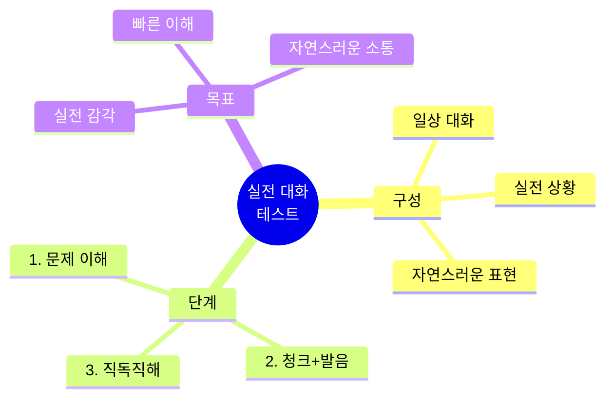
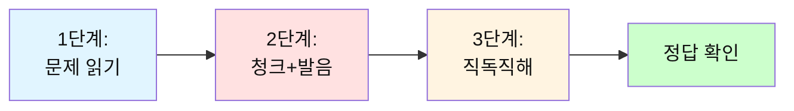
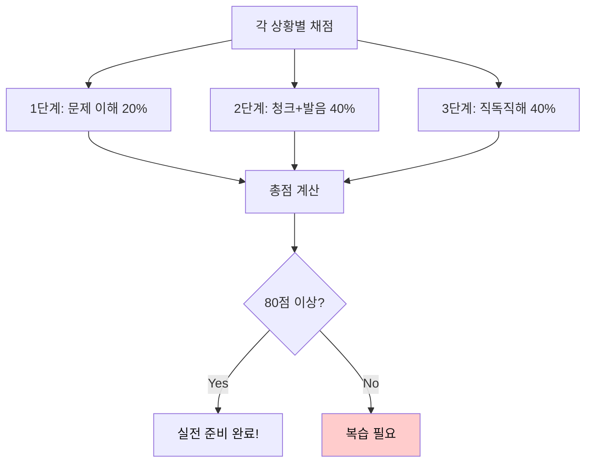
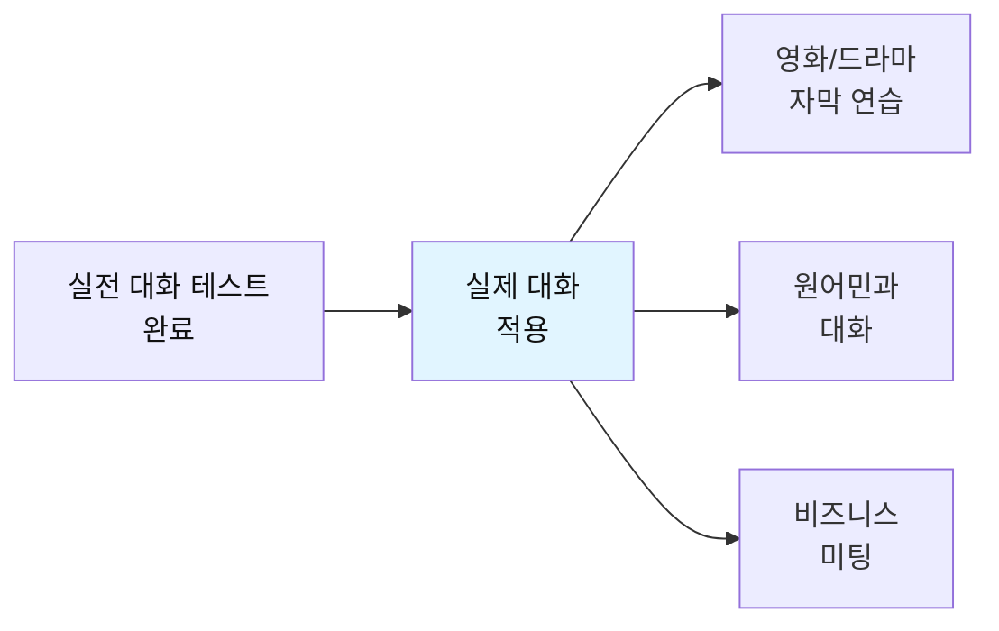
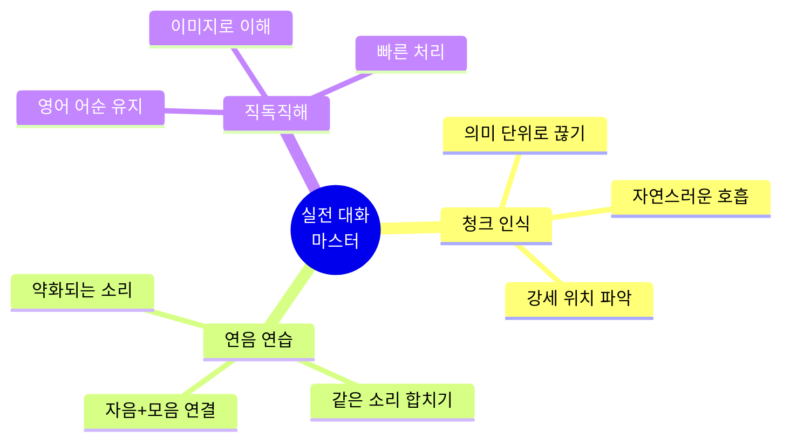

# 전설의 500단어 - 실전 일상 대화 테스트

## 🎯 테스트의 목적

500단어를 **실제 일상 대화**에서 어떻게 사용하는지 테스트합니다.
**문제 이해 → 청크 구분(발음/연음) → 직독직해** 3단계로 실전 감각을 익힙니다.



---

## 📝 테스트 사용법

### 3단계 학습 시스템



| 단계 | 내용 | 목표 |
|------|------|------|
| **1단계** | 대화 문장 읽기 | 상황 파악 |
| **2단계** | 청크 구분 + 발음(연음) | 소리로 이해 |
| **3단계** | 영어 어순 직독직해 | 빠른 이해 |

---

## 🔥 레벨 1: 기초 일상 대화 (001-100 단어 사용)

### 상황 1: 아침 인사

**대화:**
```
A: Good morning! How are you today?
B: I'm good, thanks. How about you?
```

---

#### 1단계: 문제 이해

**질문:** 두 사람은 무엇을 하고 있나요?

<details>
<summary>정답 보기</summary>

아침 인사를 나누고 안부를 묻고 있습니다.

</details>

---

#### 2단계: 청크 구분 + 발음 (연음)

**A의 대사를 청크로 구분하고 발음을 써보세요:**

```
Good morning! How are you today?
```

<details>
<summary>정답 보기</summary>

**청크:**
```
Good morning! / How are you / today?
```

**발음 (연음):**
```
[굿 모닝] / [하우 아 유] / [투데이]
```

**연음 포인트:**
- How are you → [하우 아 유] (are you가 연결됨)

</details>

---

#### 3단계: 직독직해

**B의 대사를 영어 어순 그대로 해석하세요:**

```
I'm good, thanks. How about you?
```

<details>
<summary>정답 보기</summary>

```
나는 / 좋아, / 고마워. / 어때 / 너는?
```

</details>

---

### 상황 2: 도움 요청

**대화:**
```
A: Can you help me with this?
B: Sure! What do you need?
```

---

#### 1단계: 문제 이해

**질문:** A는 B에게 무엇을 원하나요?

<details>
<summary>정답 보기</summary>

도움을 요청하고 있습니다.

</details>

---

#### 2단계: 청크 구분 + 발음 (연음)

**A의 대사를 청크로 구분하고 발음을 써보세요:**

```
Can you help me with this?
```

<details>
<summary>정답 보기</summary>

**청크:**
```
Can you / help me / with this?
```

**발음 (연음):**
```
[캔 유] / [헬프 미] / [윗 디스]
```

**연음 포인트:**
- Can you → [캔 유] (자연스럽게 연결)
- help me → [헬프 미] (p와 m이 연결)
- with this → [윗 디스] (th 소리 주의)

</details>

---

#### 3단계: 직독직해

**B의 대사를 영어 어순 그대로 해석하세요:**

```
Sure! What do you need?
```

<details>
<summary>정답 보기</summary>

```
물론이지! / 무엇을 / 너는 필요해?
```

</details>

---

### 상황 3: 시간 약속

**대화:**
```
A: Do you have time to meet tomorrow?
B: Let me check my schedule.
```

---

#### 1단계: 문제 이해

**질문:** A는 B에게 무엇을 제안하나요?

<details>
<summary>정답 보기</summary>

내일 만날 시간이 있는지 묻고 있습니다.

</details>

---

#### 2단계: 청크 구분 + 발음 (연음)

**A의 대사를 청크로 구분하고 발음을 써보세요:**

```
Do you have time to meet tomorrow?
```

<details>
<summary>정답 보기</summary>

**청크:**
```
Do you have / time / to meet / tomorrow?
```

**발음 (연음):**
```
[두 유 해브] / [타임] / [투 밋] / [투마로우]
```

**연음 포인트:**
- Do you have → [두 유 해브] (자연스럽게 흐름)
- to meet → [투 밋] (t와 m 연결)

</details>

---

#### 3단계: 직독직해

**B의 대사를 영어 어순 그대로 해석하세요:**

```
Let me check my schedule.
```

<details>
<summary>정답 보기</summary>

```
내가 확인할게 / 내 일정을
```

</details>

---

### 상황 4: 의견 묻기

**대화:**
```
A: What do you think about this idea?
B: I think it's really good!
```

---

#### 1단계: 문제 이해

**질문:** A는 B에게 무엇을 원하나요?

<details>
<summary>정답 보기</summary>

이 아이디어에 대한 B의 의견을 묻고 있습니다.

</details>

---

#### 2단계: 청크 구분 + 발음 (연음)

**A의 대사를 청크로 구분하고 발음을 써보세요:**

```
What do you think about this idea?
```

<details>
<summary>정답 보기</summary>

**청크:**
```
What do you think / about / this idea?
```

**발음 (연음):**
```
[왓 두 유 띵크] / [어바웃] / [디스 아이디어]
```

**연음 포인트:**
- What do you → [왓 두 유] (빠르게 연결)
- think about → [띵크 어바웃] (k 소리 약화)
- this idea → [디스 아이디어] (s와 i 연결)

</details>

---

#### 3단계: 직독직해

**B의 대사를 영어 어순 그대로 해석하세요:**

```
I think it's really good!
```

<details>
<summary>정답 보기</summary>

```
나는 생각해 / 그것이 / 정말 / 좋다고!
```

</details>

---

### 상황 5: 제안하기

**대화:**
```
A: Let's go get some coffee.
B: Sounds great! Where do you want to go?
```

---

#### 1단계: 문제 이해

**질문:** A는 무엇을 제안하나요?

<details>
<summary>정답 보기</summary>

커피를 마시러 가자고 제안하고 있습니다.

</details>

---

#### 2단계: 청크 구분 + 발음 (연음)

**A의 대사를 청크로 구분하고 발음을 써보세요:**

```
Let's go get some coffee.
```

<details>
<summary>정답 보기</summary>

**청크:**
```
Let's go / get / some coffee.
```

**발음 (연음):**
```
[레츠 고우] / [겟] / [썸 카피]
```

**연음 포인트:**
- Let's go → [레츠 고우] (t와 g 연결)
- get some → [겟 썸] (t 소리 약화)

</details>

---

#### 3단계: 직독직해

**B의 대사를 영어 어순 그대로 해석하세요:**

```
Sounds great! Where do you want to go?
```

<details>
<summary>정답 보기</summary>

```
좋게 들려! / 어디로 / 너는 원해 / 가기를?
```

</details>

---

## 🔥 레벨 2: 중급 일상 대화 (101-200 단어 사용)

### 상황 6: 계획 논의

**대화:**
```
A: We need to finish this project by Friday.
B: That's going to be difficult, but we can try.
```

---

#### 1단계: 문제 이해

**질문:** 두 사람이 논의하는 주제는 무엇인가요?

<details>
<summary>정답 보기</summary>

금요일까지 프로젝트를 끝내야 하는 상황을 논의하고 있습니다.

</details>

---

#### 2단계: 청크 구분 + 발음 (연음)

**A의 대사를 청크로 구분하고 발음을 써보세요:**

```
We need to finish this project by Friday.
```

<details>
<summary>정답 보기</summary>

**청크:**
```
We need to / finish / this project / by Friday.
```

**발음 (연음):**
```
[위 니드 투] / [피니쉬] / [디스 프라젝] / [바이 프라이데이]
```

**연음 포인트:**
- We need to → [위 니드 투] (need to가 [니드 투]로 연결)
- finish this → [피니쉬 디스] (sh와 th 연결)
- by Friday → [바이 프라이데이] (자연스럽게)

</details>

---

#### 3단계: 직독직해

**B의 대사를 영어 어순 그대로 해석하세요:**

```
That's going to be difficult, but we can try.
```

<details>
<summary>정답 보기</summary>

```
그것은 / ~할 거야 / 어려운 / 하지만 / 우리는 할 수 있어 / 시도를
```

</details>

---

### 상황 7: 문제 해결

**대화:**
```
A: I'm having trouble with this report.
B: Let me take a look. Maybe I can help.
```

---

#### 1단계: 문제 이해

**질문:** A는 어떤 문제가 있나요?

<details>
<summary>정답 보기</summary>

보고서 작성에 어려움을 겪고 있습니다.

</details>

---

#### 2단계: 청크 구분 + 발음 (연음)

**A의 대사를 청크로 구분하고 발음을 써보세요:**

```
I'm having trouble with this report.
```

<details>
<summary>정답 보기</summary>

**청크:**
```
I'm having / trouble / with this report.
```

**발음 (연음):**
```
[아임 해빙] / [트러블] / [윗 디스 리폴트]
```

**연음 포인트:**
- I'm having → [아임 해빙] (자연스럽게 연결)
- with this → [윗 디스] (th 소리)
- this report → [디스 리폴트] (s와 r 연결)

</details>

---

#### 3단계: 직독직해

**B의 대사를 영어 어순 그대로 해석하세요:**

```
Let me take a look. Maybe I can help.
```

<details>
<summary>정답 보기</summary>

```
내가 볼게 / 한번. / 어쩌면 / 나는 도울 수 있어.
```

</details>

---

### 상황 8: 의견 제시

**대화:**
```
A: This approach seems too complicated.
B: I agree. We should try something simpler.
```

---

#### 1단계: 문제 이해

**질문:** A와 B는 현재 접근법에 대해 어떻게 생각하나요?

<details>
<summary>정답 보기</summary>

너무 복잡하다고 생각하며, 더 간단한 방법을 찾아야 한다고 동의합니다.

</details>

---

#### 2단계: 청크 구분 + 발음 (연음)

**A의 대사를 청크로 구분하고 발음을 써보세요:**

```
This approach seems too complicated.
```

<details>
<summary>정답 보기</summary>

**청크:**
```
This approach / seems / too complicated.
```

**발음 (연음):**
```
[디스 어프로우치] / [씨임즈] / [투 캄플리케이티드]
```

**연음 포인트:**
- This approach → [디스 어프로우치] (s와 a 연결)
- seems too → [씨임즈 투] (s와 t 연결)

</details>

---

#### 3단계: 직독직해

**B의 대사를 영어 어순 그대로 해석하세요:**

```
I agree. We should try something simpler.
```

<details>
<summary>정답 보기</summary>

```
나는 동의해. / 우리는 해야 해 / 시도를 / 뭔가 / 더 간단한
```

</details>

---

### 상황 9: 일정 확인

**대화:**
```
A: Are you free next Tuesday afternoon?
B: Let me check. Yes, I'm available after 2 PM.
```

---

#### 1단계: 문제 이해

**질문:** A는 B에게 무엇을 확인하나요?

<details>
<summary>정답 보기</summary>

다음 주 화요일 오후에 시간이 있는지 확인하고 있습니다.

</details>

---

#### 2단계: 청크 구분 + 발음 (연음)

**A의 대사를 청크로 구분하고 발음을 써보세요:**

```
Are you free next Tuesday afternoon?
```

<details>
<summary>정답 보기</summary>

**청크:**
```
Are you free / next Tuesday / afternoon?
```

**발음 (연음):**
```
[아 유 프리] / [넥스트 튜즈데이] / [애프터눈]
```

**연음 포인트:**
- Are you → [아 유] (r 소리 약화)
- you free → [유 프리] (자연스럽게)
- next Tuesday → [넥스트 튜즈데이] (t와 T 연결)

</details>

---

#### 3단계: 직독직해

**B의 대사를 영어 어순 그대로 해석하세요:**

```
Let me check. Yes, I'm available after 2 PM.
```

<details>
<summary>정답 보기</summary>

```
내가 확인할게. / 응, / 나는 가능해 / 2시 이후에
```

</details>

---

### 상황 10: 제안 받아들이기

**대화:**
```
A: Would you like to join our team meeting?
B: Sure, I'd be happy to. What time does it start?
```

---

#### 1단계: 문제 이해

**질문:** A는 B에게 무엇을 제안하나요?

<details>
<summary>정답 보기</summary>

팀 회의에 참여할 것을 제안하고 있습니다.

</details>

---

#### 2단계: 청크 구분 + 발음 (연음)

**A의 대사를 청크로 구분하고 발음을 써보세요:**

```
Would you like to join our team meeting?
```

<details>
<summary>정답 보기</summary>

**청크:**
```
Would you like to / join / our team meeting?
```

**발음 (연음):**
```
[우주 라이크 투] / [조인] / [아워 팀 미팅]
```

**연음 포인트:**
- Would you → [우주] (d 소리 거의 탈락)
- like to → [라이크 투] (자연스럽게)
- our team → [아워 팀] (r과 t 연결)

</details>

---

#### 3단계: 직독직해

**B의 대사를 영어 어순 그대로 해석하세요:**

```
Sure, I'd be happy to. What time does it start?
```

<details>
<summary>정답 보기</summary>

```
물론이지, / 나는 / 기쁠 거야. / 몇 시에 / 그것은 시작해?
```

</details>

---

## 🔥 레벨 3: 고급 일상 대화 (201-300 단어 사용)

### 상황 11: 업무 협의

**대화:**
```
A: We should consider all the options before making a decision.
B: Absolutely. Let's analyze each alternative carefully.
```

---

#### 1단계: 문제 이해

**질문:** 두 사람은 어떤 과정을 거치려고 하나요?

<details>
<summary>정답 보기</summary>

결정을 내리기 전에 모든 옵션을 고려하고 각 대안을 신중히 분석하려고 합니다.

</details>

---

#### 2단계: 청크 구분 + 발음 (연음)

**A의 대사를 청크로 구분하고 발음을 써보세요:**

```
We should consider all the options before making a decision.
```

<details>
<summary>정답 보기</summary>

**청크:**
```
We should consider / all the options / before making / a decision.
```

**발음 (연음):**
```
[위 슈드 컨시더] / [올 디 옵션즈] / [비포 메이킹] / [어 디시전]
```

**연음 포인트:**
- should consider → [슈드 컨시더] (d와 c 연결)
- all the → [올 디] (l과 th 연결)
- before making → [비포 메이킹] (e와 m 연결)
- a decision → [어 디시전] (자연스럽게)

</details>

---

#### 3단계: 직독직해

**B의 대사를 영어 어순 그대로 해석하세요:**

```
Absolutely. Let's analyze each alternative carefully.
```

<details>
<summary>정답 보기</summary>

```
완전히 동의해. / 분석하자 / 각 대안을 / 신중하게.
```

</details>

---

### 상황 12: 문제 진단

**대화:**
```
A: The system keeps crashing. We need to find the root cause.
B: I'll investigate the issue and get back to you with my findings.
```

---

#### 1단계: 문제 이해

**질문:** 현재 어떤 문제가 발생했고, B는 무엇을 하려고 하나요?

<details>
<summary>정답 보기</summary>

시스템이 계속 다운되고 있으며, B는 문제를 조사하여 결과를 보고하려고 합니다.

</details>

---

#### 2단계: 청크 구분 + 발음 (연음)

**A의 대사를 청크로 구분하고 발음을 써보세요:**

```
The system keeps crashing. We need to find the root cause.
```

<details>
<summary>정답 보기</summary>

**청크:**
```
The system / keeps crashing. / We need to / find / the root cause.
```

**발음 (연음):**
```
[더 시스럼] / [킵스 크래슁]. / [위 니드 투] / [파인] / [더 룻 코즈]
```

**연음 포인트:**
- The system → [더 시스럼] (e와 s 연결)
- keeps crashing → [킵스 크래슁] (s와 c 연결)
- need to → [니드 투] (자연스럽게)
- root cause → [룻 코즈] (t와 c 연결)

</details>

---

#### 3단계: 직독직해

**B의 대사를 영어 어순 그대로 해석하세요:**

```
I'll investigate the issue and get back to you with my findings.
```

<details>
<summary>정답 보기</summary>

```
나는 조사할게 / 문제를 / 그리고 돌아올게 / 너에게 / 내 발견들과 함께
```

</details>

---

### 상황 13: 피드백 제공

**대화:**
```
A: Your presentation was excellent. The data really supported your argument.
B: Thank you! I spent a lot of time preparing the research.
```

---

#### 1단계: 문제 이해

**질문:** A는 B의 발표에 대해 어떻게 평가하나요?

<details>
<summary>정답 보기</summary>

훌륭했다고 평가하며, 특히 데이터가 주장을 잘 뒷받침했다고 말합니다.

</details>

---

#### 2단계: 청크 구분 + 발음 (연음)

**A의 대사를 청크로 구분하고 발음을 써보세요:**

```
Your presentation was excellent. The data really supported your argument.
```

<details>
<summary>정답 보기</summary>

**청크:**
```
Your presentation / was excellent. / The data / really supported / your argument.
```

**발음 (연음):**
```
[유어 프레젠테이션] / [워즈 엑설런트]. / [더 데이러] / [리얼리 서폴티드] / [유어 아규먼트]
```

**연음 포인트:**
- Your presentation → [유어 프레젠테이션] (r과 p 연결)
- was excellent → [워즈 엑설런트] (s와 e 연결)
- really supported → [리얼리 서폴티드] (y와 s 연결)
- your argument → [유어 아규먼트] (r과 a 연결)

</details>

---

#### 3단계: 직독직해

**B의 대사를 영어 어순 그대로 해석하세요:**

```
Thank you! I spent a lot of time preparing the research.
```

<details>
<summary>정답 보기</summary>

```
고마워요! / 나는 보냈어 / 많은 시간을 / 준비하면서 / 연구를
```

</details>

---

### 상황 14: 계획 수정

**대화:**
```
A: Given the current situation, we might need to adjust our timeline.
B: I understand. Should we schedule a meeting to discuss the changes?
```

---

#### 1단계: 문제 이해

**질문:** A가 제안하는 것은 무엇이고, B는 어떻게 반응하나요?

<details>
<summary>정답 보기</summary>

A는 현재 상황을 고려하여 일정을 조정해야 할 수도 있다고 말하고, B는 변경사항을 논의하기 위한 회의를 제안합니다.

</details>

---

#### 2단계: 청크 구분 + 발음 (연음)

**A의 대사를 청크로 구분하고 발음을 써보세요:**

```
Given the current situation, we might need to adjust our timeline.
```

<details>
<summary>정답 보기</summary>

**청크:**
```
Given / the current situation, / we might need to / adjust / our timeline.
```

**발음 (연음):**
```
[기븐] / [더 컬런트 시츄에이션], / [위 마잇 니드 투] / [어저스트] / [아워 타임라인]
```

**연음 포인트:**
- Given the → [기븐 더] (n과 th 연결)
- current situation → [컬런트 시츄에이션] (t와 s 연결)
- might need to → [마잇 니드 투] (자연스럽게)
- our timeline → [아워 타임라인] (r과 t 연결)

</details>

---

#### 3단계: 직독직해

**B의 대사를 영어 어순 그대로 해석하세요:**

```
I understand. Should we schedule a meeting to discuss the changes?
```

<details>
<summary>정답 보기</summary>

```
나는 이해해. / 우리 일정을 잡을까 / 회의를 / 논의하기 위해 / 변경사항들을?
```

</details>

---

### 상황 15: 결과 공유

**대화:**
```
A: The test results indicate that our approach is working effectively.
B: That's great news! We should continue monitoring the progress closely.
```

---

#### 1단계: 문제 이해

**질문:** 테스트 결과는 어떠했고, 다음 단계는 무엇인가요?

<details>
<summary>정답 보기</summary>

접근법이 효과적으로 작동하고 있으며, 진행 상황을 면밀히 모니터링해야 합니다.

</details>

---

#### 2단계: 청크 구분 + 발음 (연음)

**A의 대사를 청크로 구분하고 발음을 써보세요:**

```
The test results indicate that our approach is working effectively.
```

<details>
<summary>정답 보기</summary>

**청크:**
```
The test results / indicate / that / our approach / is working / effectively.
```

**발음 (연음):**
```
[더 테스트 리절츠] / [인디케잇] / [댓] / [아워 어프로우치] / [이즈 월킹] / [이펙티블리]
```

**연음 포인트:**
- test results → [테스트 리절츠] (t와 r 연결)
- results indicate → [리절츠 인디케잇] (s와 i 연결)
- our approach → [아워 어프로우치] (r과 a 연결)
- is working → [이즈 월킹] (s와 w 연결)

</details>

---

#### 3단계: 직독직해

**B의 대사를 영어 어순 그대로 해석하세요:**

```
That's great news! We should continue monitoring the progress closely.
```

<details>
<summary>정답 보기</summary>

```
그것은 / 좋은 소식이야! / 우리는 해야 해 / 계속 모니터링할 / 진행 상황을 / 면밀히
```

</details>

---

## 🔥 레벨 4: 비즈니스 대화 (301-400 단어 사용)

### 상황 16: 전략 회의

**대화:**
```
A: We need to focus on improving customer satisfaction and retention rates.
B: I agree. Let's implement a comprehensive feedback system to achieve that goal.
```

---

#### 1단계: 문제 이해

**질문:** 회의의 주요 목표는 무엇이고, 어떤 해결책을 제시하나요?

<details>
<summary>정답 보기</summary>

고객 만족도와 유지율을 개선하는 것이 목표이며, 종합적인 피드백 시스템을 구현하자고 제안합니다.

</details>

---

#### 2단계: 청크 구분 + 발음 (연음)

**A의 대사를 청크로 구분하고 발음을 써보세요:**

```
We need to focus on improving customer satisfaction and retention rates.
```

<details>
<summary>정답 보기</summary>

**청크:**
```
We need to / focus on / improving / customer satisfaction / and retention rates.
```

**발음 (연음):**
```
[위 니드 투] / [포커스 온] / [임프루빙] / [커스터머 새티스팩션] / [앤 리텐션 레잇츠]
```

**연음 포인트:**
- need to → [니드 투] (자연스럽게)
- focus on → [포커스 온] (s와 o 연결)
- customer satisfaction → [커스터머 새티스팩션] (r과 s 연결)
- and retention → [앤 리텐션] (d와 r 연결)

</details>

---

#### 3단계: 직독직해

**B의 대사를 영어 어순 그대로 해석하세요:**

```
I agree. Let's implement a comprehensive feedback system to achieve that goal.
```

<details>
<summary>정답 보기</summary>

```
나는 동의해. / 구현하자 / 종합적인 / 피드백 시스템을 / 달성하기 위해 / 그 목표를
```

</details>

---

### 상황 17: 성과 평가

**대화:**
```
A: The team successfully delivered the project ahead of schedule.
B: Excellent work! This demonstrates strong coordination and commitment.
```

---

#### 1단계: 문제 이해

**질문:** 팀의 성과는 어떠했고, 그것이 보여주는 것은 무엇인가요?

<details>
<summary>정답 보기</summary>

팀이 일정보다 앞서 프로젝트를 완료했으며, 이는 강력한 조정력과 헌신을 보여줍니다.

</details>

---

#### 2단계: 청크 구분 + 발음 (연음)

**A의 대사를 청크로 구분하고 발음을 써보세요:**

```
The team successfully delivered the project ahead of schedule.
```

<details>
<summary>정답 보기</summary>

**청크:**
```
The team / successfully delivered / the project / ahead of schedule.
```

**발음 (연음):**
```
[더 팀] / [석세스풀리 딜리버드] / [더 프라젝] / [어헤드 오브 스케줄]
```

**연음 포인트:**
- The team → [더 팀] (e와 t 연결)
- successfully delivered → [석세스풀리 딜리버드] (y와 d 연결)
- ahead of → [어헤드 오브] (d와 o 연결)
- of schedule → [오브 스케줄] (자연스럽게)

</details>

---

#### 3단계: 직독직해

**B의 대사를 영어 어순 그대로 해석하세요:**

```
Excellent work! This demonstrates strong coordination and commitment.
```

<details>
<summary>정답 보기</summary>

```
훌륭한 일이야! / 이것은 보여줘 / 강력한 조정력과 / 헌신을
```

</details>

---

### 상황 18: 문제 해결 제안

**대화:**
```
A: We're facing significant challenges with the current infrastructure.
B: Let's organize a task force to evaluate potential solutions and develop an action plan.
```

---

#### 1단계: 문제 이해

**질문:** 현재 어떤 문제가 있고, B는 어떤 해결 방법을 제안하나요?

<details>
<summary>정답 보기</summary>

현재 인프라에 상당한 문제가 있으며, 태스크포스를 구성하여 잠재적 해결책을 평가하고 실행 계획을 개발하자고 제안합니다.

</details>

---

#### 2단계: 청크 구분 + 발음 (연음)

**A의 대사를 청크로 구분하고 발음을 써보세요:**

```
We're facing significant challenges with the current infrastructure.
```

<details>
<summary>정답 보기</summary>

**청크:**
```
We're facing / significant challenges / with / the current infrastructure.
```

**발음 (연음):**
```
[위얼 페이싱] / [씨그니피컨트 챌린지즈] / [윗] / [더 컬런트 인프러스트럭쳐]
```

**연음 포인트:**
- We're facing → [위얼 페이싱] (자연스럽게)
- significant challenges → [씨그니피컨트 챌린지즈] (t와 ch 연결)
- current infrastructure → [컬런트 인프러스트럭쳐] (t와 i 연결)

</details>

---

#### 3단계: 직독직해

**B의 대사를 영어 어순 그대로 해석하세요:**

```
Let's organize a task force to evaluate potential solutions and develop an action plan.
```

<details>
<summary>정답 보기</summary>

```
조직하자 / 태스크포스를 / 평가하기 위해 / 잠재적 해결책들을 / 그리고 개발하기 위해 / 실행 계획을
```

</details>

---

### 상황 19: 우선순위 설정

**대화:**
```
A: Given our limited resources, we must prioritize the most critical tasks.
B: Absolutely. Let's identify the key objectives and allocate resources accordingly.
```

---

#### 1단계: 문제 이해

**질문:** 왜 우선순위를 설정해야 하고, 다음 단계는 무엇인가요?

<details>
<summary>정답 보기</summary>

제한된 자원 때문에 가장 중요한 작업의 우선순위를 정해야 하며, 핵심 목표를 파악하고 그에 따라 자원을 배분해야 합니다.

</details>

---

#### 2단계: 청크 구분 + 발음 (연음)

**A의 대사를 청크로 구분하고 발음을 써보세요:**

```
Given our limited resources, we must prioritize the most critical tasks.
```

<details>
<summary>정답 보기</summary>

**청크:**
```
Given / our limited resources, / we must prioritize / the most critical tasks.
```

**발음 (연음):**
```
[기븐] / [아워 리미티드 리소시즈], / [위 머스트 프라이오리타이즈] / [더 모스트 크리티컬 태스크스]
```

**연음 포인트:**
- our limited → [아워 리미티드] (r과 l 연결)
- limited resources → [리미티드 리소시즈] (d와 r 연결)
- must prioritize → [머스트 프라이오리타이즈] (t와 p 연결)
- most critical → [모스트 크리티컬] (t와 c 연결)

</details>

---

#### 3단계: 직독직해

**B의 대사를 영어 어순 그대로 해석하세요:**

```
Absolutely. Let's identify the key objectives and allocate resources accordingly.
```

<details>
<summary>정답 보기</summary>

```
완전히 동의해. / 파악하자 / 핵심 목표들을 / 그리고 배분하자 / 자원을 / 그에 따라
```

</details>

---

### 상황 20: 최종 결정

**대화:**
```
A: Based on the analysis, I recommend we proceed with the proposed strategy.
B: I concur. Let's ensure all stakeholders are informed and aligned before implementation.
```

---

#### 1단계: 문제 이해

**질문:** A의 권고사항은 무엇이고, B가 강조하는 것은 무엇인가요?

<details>
<summary>정답 보기</summary>

제안된 전략을 진행하라고 권고하며, B는 실행 전에 모든 이해관계자들이 정보를 받고 동의하도록 해야 한다고 강조합니다.

</details>

---

#### 2단계: 청크 구분 + 발음 (연음)

**A의 대사를 청크로 구분하고 발음을 써보세요:**

```
Based on the analysis, I recommend we proceed with the proposed strategy.
```

<details>
<summary>정답 보기</summary>

**청크:**
```
Based on / the analysis, / I recommend / we proceed with / the proposed strategy.
```

**발음 (연음):**
```
[베이스드 온] / [디 어낼러시스], / [아이 레커멘드] / [위 프로씨드 윗] / [더 프로포우즈드 스트래터지]
```

**연음 포인트:**
- Based on → [베이스드 온] (d와 o 연결)
- on the → [온 더] (n과 th 연결)
- recommend we → [레커멘드 위] (d와 w 연결)
- proceed with → [프로씨드 윗] (d와 w 연결)
- proposed strategy → [프로포우즈드 스트래터지] (d와 s 연결)

</details>

---

#### 3단계: 직독직해

**B의 대사를 영어 어순 그대로 해석하세요:**

```
I concur. Let's ensure all stakeholders are informed and aligned before implementation.
```

<details>
<summary>정답 보기</summary>

```
나는 동의해. / 확실히 하자 / 모든 이해관계자들이 / 정보를 받고 / 동의하도록 / 실행 전에
```

</details>

---

## 📊 실전 테스트 점수 계산

### 채점 기준



### 레벨별 목표 점수

| 레벨 | 목표 점수 | 평가 |
|------|----------|------|
| **레벨 1** (기초) | 90% 이상 | 기본 대화 완벽 습득 |
| **레벨 2** (중급) | 85% 이상 | 일상 대화 자유롭게 |
| **레벨 3** (고급) | 80% 이상 | 복잡한 대화 이해 |
| **레벨 4** (비즈니스) | 75% 이상 | 전문적 대화 가능 |

---

## 🎯 학습 팁

### 청크 + 발음 마스터하기

```
💡 연음 규칙 핵심:

1. 자음 + 모음: 자연스럽게 연결
   - get it → [게릿]
   - take it → [테이킷]

2. 같은 자음: 하나로 발음
   - good day → [구데이]
   - big game → [비게임]

3. t/d + y: 소리 변화
   - meet you → [미츄]
   - would you → [우주]

4. 약화되는 소리:
   - to → [투/러]
   - for → [포/퍼]
   - can → [캔/컨]
```

### 직독직해 연습법

```
✅ 올바른 방법:
1. 영어 어순 그대로 이해
2. 청크 단위로 빠르게 처리
3. 번역하지 말고 이미지화

❌ 피해야 할 방법:
1. 한국어로 완벽하게 번역
2. 문장 끝까지 기다림
3. 단어 하나하나 해석
```

---

## 🚀 다음 단계



### 실전 적용 체크리스트

- [ ] 레벨 1 (기초) 90% 이상 달성
- [ ] 레벨 2 (중급) 85% 이상 달성
- [ ] 레벨 3 (고급) 80% 이상 달성
- [ ] 레벨 4 (비즈니스) 75% 이상 달성
- [ ] 연음 자연스럽게 발음 가능
- [ ] 청크 단위로 빠르게 이해
- [ ] 영어 어순으로 직독직해 가능

---

## 💪 마무리

```
🎉 실전 대화 테스트를 완료하신 것을 축하합니다!

✨ 이제 실제 대화에서 자신있게 사용하세요!
✨ 청크로 듣고, 청크로 말하세요!
✨ 연음을 자연스럽게 구사하세요!

💡 Remember:
   "Practice makes perfect, but perfect practice makes permanent."
   연습이 완벽을 만들지만, 완벽한 연습이 영구적으로 만듭니다.

🚀 You're ready for real conversations!
```

---

---

## 🎭 실전 상황별 전설의 대화 (6턴 이상)

### 📋 상황별 대화 목록

| 번호 | 상황 | 난이도 | 턴 수 |
|------|------|--------|-------|
| 1 | 레스토랑 예약 및 주문 | ⭐⭐ | 8턴 |
| 2 | 직장 동료와 프로젝트 논의 | ⭐⭐⭐ | 8턴 |
| 3 | 여행 계획 상담 | ⭐⭐ | 8턴 |
| 4 | 고객 불만 처리 | ⭐⭐⭐⭐ | 10턴 |

---

## 🍽️ 상황 1: 레스토랑 예약 및 주문 (8턴)

### 대화 전체

```
A: Good evening! Do you have a reservation?
B: Yes, I booked a table for two under the name Kim.
A: Perfect! Let me check. Yes, here it is. Please follow me.
B: Thank you. Could we have a table by the window?
A: Of course! Here's your table. Can I get you something to drink?
B: I'd like a glass of red wine, please. What do you recommend?
A: Our house wine is excellent. It pairs well with most dishes.
B: Sounds great! I'll have that. And could we see the menu?
```

---

### 턴 1: A - Good evening! Do you have a reservation?

#### 📝 원문
```
Good evening! Do you have a reservation?
```

#### 🔤 청크 구분
```
Good evening! / Do you have / a reservation?
```

#### 🗣️ 발음 (연음)
```
[굿 이브닝!] / [두 유 해브] / [어 레저베이션?]
```

**연음 포인트:**
- Good evening → [굿 이브닝] (d와 e 연결)
- Do you → [두 유] (자연스럽게 연결)
- have a → [해브 어] (v와 a 연결)

#### 🎯 직독직해
```
좋은 저녁! / 당신은 가지고 있나요 / 예약을?
```

---

### 턴 2: B - Yes, I booked a table for two under the name Kim.

#### 📝 원문
```
Yes, I booked a table for two under the name Kim.
```

#### 🔤 청크 구분
```
Yes, / I booked / a table / for two / under the name / Kim.
```

#### 🗣️ 발음 (연음)
```
[예스,] / [아이 북트] / [어 테이블] / [포 투] / [언더 더 네임] / [킴.]
```

**연음 포인트:**
- I booked → [아이 북트] (자연스럽게)
- booked a → [북트 어] (d와 a 연결)
- for two → [포 투] (r 약화)
- under the → [언더 더] (r과 th 연결)

#### 🎯 직독직해
```
네, / 나는 예약했어요 / 테이블을 / 2명용 / 이름으로 / 김.
```

---

### 턴 3: A - Perfect! Let me check. Yes, here it is. Please follow me.

#### 📝 원문
```
Perfect! Let me check. Yes, here it is. Please follow me.
```

#### 🔤 청크 구분
```
Perfect! / Let me check. / Yes, / here it is. / Please / follow me.
```

#### 🗣️ 발음 (연음)
```
[펄펙트!] / [렛 미 첵.] / [예스,] / [히어 릿 이즈.] / [플리즈] / [팔로우 미.]
```

**연음 포인트:**
- Let me → [렛 미] (t와 m 연결)
- here it → [히어 릿] (r과 i 연결)
- it is → [릿 이즈] (t와 i 연결)
- follow me → [팔로우 미] (자연스럽게)

#### 🎯 직독직해
```
완벽해요! / 제가 확인할게요. / 네, / 여기 있네요. / 부탁드려요 / 저를 따라오세요.
```

---

### 턴 4: B - Thank you. Could we have a table by the window?

#### 📝 원문
```
Thank you. Could we have a table by the window?
```

#### 🔤 청크 구분
```
Thank you. / Could we have / a table / by the window?
```

#### 🗣️ 발음 (연음)
```
[땡큐.] / [쿠드 위 해브] / [어 테이블] / [바이 더 윈도우?]
```

**연음 포인트:**
- Could we → [쿠드 위] (d와 w 연결)
- we have → [위 해브] (자연스럽게)
- have a → [해브 어] (v와 a 연결)
- by the → [바이 더] (y와 th 연결)

#### 🎯 직독직해
```
감사합니다. / 우리가 가질 수 있을까요 / 테이블을 / 창가 옆에?
```

---

### 턴 5: A - Of course! Here's your table. Can I get you something to drink?

#### 📝 원문
```
Of course! Here's your table. Can I get you something to drink?
```

#### 🔤 청크 구분
```
Of course! / Here's / your table. / Can I get you / something / to drink?
```

#### 🗣️ 발음 (연음)
```
[오브 코스!] / [히얼즈] / [유어 테이블.] / [캔 아이 겟 츄] / [썸띵] / [투 드링크?]
```

**연음 포인트:**
- Of course → [오브 코스] (f와 c 연결)
- Here's your → [히얼즈 유어] (s와 y 연결)
- get you → [겟 츄] (t와 y가 ch 소리로)
- something to → [썸띵 투] (자연스럽게)

#### 🎯 직독직해
```
물론이죠! / 여기 있어요 / 당신의 테이블. / 제가 가져다 드릴까요 / 뭔가를 / 마실?
```

---

### 턴 6: B - I'd like a glass of red wine, please. What do you recommend?

#### 📝 원문
```
I'd like a glass of red wine, please. What do you recommend?
```

#### 🔤 청크 구분
```
I'd like / a glass / of red wine, / please. / What do you / recommend?
```

#### 🗣️ 발음 (연음)
```
[아이드 라이크] / [어 글래스] / [오브 레드 와인,] / [플리즈.] / [왓 두 유] / [레커멘드?]
```

**연음 포인트:**
- I'd like → [아이드 라이크] (자연스럽게)
- a glass → [어 글래스] (자연스럽게)
- of red → [오브 레드] (f와 r 연결)
- What do you → [왓 두 유] (빠르게 연결)

#### 🎯 직독직해
```
나는 원해요 / 한 잔을 / 레드 와인의, / 부탁드려요. / 무엇을 / 당신은 추천하나요?
```

---

### 턴 7: A - Our house wine is excellent. It pairs well with most dishes.

#### 📝 원문
```
Our house wine is excellent. It pairs well with most dishes.
```

#### 🔤 청크 구분
```
Our house wine / is excellent. / It pairs well / with / most dishes.
```

#### 🗣️ 발음 (연음)
```
[아워 하우스 와인] / [이즈 엑설런트.] / [잇 페얼즈 웰] / [윗] / [모스트 디쉬즈.]
```

**연음 포인트:**
- Our house → [아워 하우스] (r과 h 연결)
- is excellent → [이즈 엑설런트] (s와 e 연결)
- pairs well → [페얼즈 웰] (s와 w 연결)
- with most → [윗 모스트] (th와 m 연결)

#### 🎯 직독직해
```
우리 하우스 와인은 / 훌륭해요. / 그것은 잘 어울려요 / ~와 / 대부분의 요리들.
```

---

### 턴 8: B - Sounds great! I'll have that. And could we see the menu?

#### 📝 원문
```
Sounds great! I'll have that. And could we see the menu?
```

#### 🔤 청크 구분
```
Sounds great! / I'll have / that. / And / could we see / the menu?
```

#### 🗣️ 발음 (연음)
```
[사운즈 그레잇!] / [아일 해브] / [댓.] / [앤드] / [쿠드 위 씨] / [더 메뉴?]
```

**연음 포인트:**
- Sounds great → [사운즈 그레잇] (s와 g 연결)
- I'll have → [아일 해브] (자연스럽게)
- could we → [쿠드 위] (d와 w 연결)
- we see → [위 씨] (자연스럽게)

#### 🎯 직독직해
```
좋게 들려요! / 나는 가질게요 / 그것을. / 그리고 / 우리가 볼 수 있을까요 / 메뉴를?
```

---

## 💼 상황 2: 직장 동료와 프로젝트 논의 (8턴)

### 대화 전체

```
A: Hey, do you have a minute? I need to discuss the project timeline.
B: Sure! I was actually going to talk to you about that too.
A: Great. I'm concerned we might not meet the Friday deadline.
B: I know. The client keeps requesting additional features.
A: Exactly. Should we schedule a meeting with the team to reassess?
B: That's a good idea. How about tomorrow afternoon at 2?
A: Perfect. I'll send out the meeting invite right away.
B: Thanks! I'll prepare some data to show our current progress.
```

---

### 턴 1: A - Hey, do you have a minute? I need to discuss the project timeline.

#### 📝 원문
```
Hey, do you have a minute? I need to discuss the project timeline.
```

#### 🔤 청크 구분
```
Hey, / do you have / a minute? / I need to / discuss / the project timeline.
```

#### 🗣️ 발음 (연음)
```
[헤이,] / [두 유 해브] / [어 미닛?] / [아이 니드 투] / [디스커스] / [더 프라젝 타임라인.]
```

**연음 포인트:**
- do you → [두 유] (자연스럽게)
- have a → [해브 어] (v와 a 연결)
- need to → [니드 투] (자연스럽게)
- the project → [더 프라젝] (e와 p 연결)

#### 🎯 직독직해
```
이봐, / 너 가지고 있어 / 잠깐 시간? / 나는 필요해 / 논의할 / 프로젝트 일정을.
```

---

### 턴 2: B - Sure! I was actually going to talk to you about that too.

#### 📝 원문
```
Sure! I was actually going to talk to you about that too.
```

#### 🔤 청크 구분
```
Sure! / I was actually / going to / talk to you / about that / too.
```

#### 🗣️ 발음 (연음)
```
[슈얼!] / [아이 워즈 액츄얼리] / [고잉 투] / [톡 투 유] / [어바웃 댓] / [투.]
```

**연음 포인트:**
- was actually → [워즈 액츄얼리] (s와 a 연결)
- going to → [고잉 투] (자연스럽게)
- talk to you → [톡 투 유] (k와 t, t와 y 연결)
- about that → [어바웃 댓] (t와 th 연결)

#### 🎯 직독직해
```
물론이지! / 나는 실제로 있었어 / ~할 예정 / 너에게 말할 / 그것에 대해 / 역시.
```

---

### 턴 3: A - Great. I'm concerned we might not meet the Friday deadline.

#### 📝 원문
```
Great. I'm concerned we might not meet the Friday deadline.
```

#### 🔤 청크 구분
```
Great. / I'm concerned / we might not / meet / the Friday deadline.
```

#### 🗣️ 발음 (연음)
```
[그레잇.] / [아임 컨설른드] / [위 마잇 낫] / [밋] / [더 프라이데이 데드라인.]
```

**연음 포인트:**
- I'm concerned → [아임 컨설른드] (자연스럽게)
- might not → [마잇 낫] (t와 n 연결)
- meet the → [밋 더] (t와 th 연결)
- Friday deadline → [프라이데이 데드라인] (자연스럽게)

#### 🎯 직독직해
```
좋아. / 나는 걱정돼 / 우리가 못 할까봐 / 맞추지 / 금요일 마감을.
```

---

### 턴 4: B - I know. The client keeps requesting additional features.

#### 📝 원문
```
I know. The client keeps requesting additional features.
```

#### 🔤 청크 구분
```
I know. / The client / keeps requesting / additional features.
```

#### 🗣️ 발음 (연음)
```
[아이 노우.] / [더 클라이언트] / [킵스 리퀘스팅] / [어디셔널 피쳐즈.]
```

**연음 포인트:**
- The client → [더 클라이언트] (e와 c 연결)
- keeps requesting → [킵스 리퀘스팅] (s와 r 연결)
- additional features → [어디셔널 피쳐즈] (l과 f 연결)

#### 🎯 직독직해
```
나도 알아. / 고객이 / 계속 요청해 / 추가 기능들을.
```

---

### 턴 5: A - Exactly. Should we schedule a meeting with the team to reassess?

#### 📝 원문
```
Exactly. Should we schedule a meeting with the team to reassess?
```

#### 🔤 청크 구분
```
Exactly. / Should we / schedule / a meeting / with the team / to reassess?
```

#### 🗣️ 발음 (연음)
```
[이그잭틀리.] / [슈드 위] / [스케줄] / [어 미팅] / [윗 더 팀] / [투 리어세스?]
```

**연음 포인트:**
- Should we → [슈드 위] (d와 w 연결)
- schedule a → [스케줄 어] (e와 a 연결)
- with the → [윗 더] (th와 th 연결)
- team to → [팀 투] (m과 t 연결)

#### 🎯 직독직해
```
정확해. / 우리 해야 할까 / 일정을 잡을 / 회의를 / 팀과 함께 / 재평가하기 위해?
```

---

### 턴 6: B - That's a good idea. How about tomorrow afternoon at 2?

#### 📝 원문
```
That's a good idea. How about tomorrow afternoon at 2?
```

#### 🔤 청크 구분
```
That's / a good idea. / How about / tomorrow afternoon / at 2?
```

#### 🗣️ 발음 (연음)
```
[댓츠] / [어 굿 아이디어.] / [하우 어바웃] / [투마로우 애프터눈] / [앳 투?]
```

**연음 포인트:**
- That's a → [댓츠 어] (s와 a 연결)
- good idea → [굿 아이디어] (d와 i 연결)
- How about → [하우 어바웃] (자연스럽게)
- afternoon at → [애프터눈 앳] (n과 a 연결)

#### 🎯 직독직해
```
그것은 / 좋은 아이디어야. / 어때 / 내일 오후 / 2시에?
```

---

### 턴 7: A - Perfect. I'll send out the meeting invite right away.

#### 📝 원문
```
Perfect. I'll send out the meeting invite right away.
```

#### 🔤 청크 구분
```
Perfect. / I'll send out / the meeting invite / right away.
```

#### 🗣️ 발음 (연음)
```
[펄펙트.] / [아일 센다웃] / [더 미팅 인바잇] / [라잇 어웨이.]
```

**연음 포인트:**
- I'll send → [아일 센드] (자연스럽게)
- send out → [센다웃] (d와 o 연결)
- meeting invite → [미팅 인바잇] (g와 i 연결)
- right away → [라잇 어웨이] (t와 a 연결)

#### 🎯 직독직해
```
완벽해. / 나는 보낼게 / 회의 초대를 / 바로.
```

---

### 턴 8: B - Thanks! I'll prepare some data to show our current progress.

#### 📝 원문
```
Thanks! I'll prepare some data to show our current progress.
```

#### 🔤 청크 구분
```
Thanks! / I'll prepare / some data / to show / our current progress.
```

#### 🗣️ 발음 (연음)
```
[땡크스!] / [아일 프리페얼] / [썸 데이러] / [투 쇼우] / [아워 컬런트 프로그레스.]
```

**연음 포인트:**
- I'll prepare → [아일 프리페얼] (자연스럽게)
- some data → [썸 데이러] (자연스럽게)
- to show → [투 쇼우] (자연스럽게)
- our current → [아워 컬런트] (r과 c 연결)

#### 🎯 직독직해
```
고마워! / 나는 준비할게 / 약간의 데이터를 / 보여주기 위해 / 우리의 현재 진행 상황을.
```

---

## ✈️ 상황 3: 여행 계획 상담 (8턴)

### 대화 전체

```
A: Hi! I'm planning a trip to Europe next month. Can you help me?
B: Of course! Which countries are you interested in visiting?
A: I'd love to see France, Italy, and maybe Spain.
B: That sounds wonderful! How many days do you have for the trip?
A: About two weeks. I want to experience the culture and try local food.
B: Perfect timing! I recommend spending 5 days in each country.
A: That makes sense. What about accommodation? Any suggestions?
B: I can arrange hotels in city centers with easy access to attractions.
```

---

### 턴 1: A - Hi! I'm planning a trip to Europe next month. Can you help me?

#### 📝 원문
```
Hi! I'm planning a trip to Europe next month. Can you help me?
```

#### 🔤 청크 구분
```
Hi! / I'm planning / a trip / to Europe / next month. / Can you / help me?
```

#### 🗣️ 발음 (연음)
```
[하이!] / [아임 플래닝] / [어 트립] / [투 유럽] / [넥스트 먼쓰.] / [캔 유] / [헬프 미?]
```

**연음 포인트:**
- I'm planning → [아임 플래닝] (자연스럽게)
- a trip → [어 트립] (자연스럽게)
- to Europe → [투 유럽] (자연스럽게)
- Can you → [캔 유] (자연스럽게)
- help me → [헬프 미] (p와 m 연결)

#### 🎯 직독직해
```
안녕! / 나는 계획 중이야 / 여행을 / 유럽으로 / 다음 달. / 너는 할 수 있어 / 나를 도와줄?
```

---

### 턴 2: B - Of course! Which countries are you interested in visiting?

#### 📝 원문
```
Of course! Which countries are you interested in visiting?
```

#### 🔤 청크 구분
```
Of course! / Which countries / are you / interested in / visiting?
```

#### 🗣️ 발음 (연음)
```
[오브 코스!] / [위치 컨트리즈] / [아 유] / [인터레스티드 인] / [비지팅?]
```

**연음 포인트:**
- Of course → [오브 코스] (f와 c 연결)
- Which countries → [위치 컨트리즈] (자연스럽게)
- are you → [아 유] (r 약화)
- interested in → [인터레스티드 인] (d와 i 연결)

#### 🎯 직독직해
```
물론이죠! / 어떤 나라들을 / 당신은 / 관심 있어 / 방문하는 것에?
```

---

### 턴 3: A - I'd love to see France, Italy, and maybe Spain.

#### 📝 원문
```
I'd love to see France, Italy, and maybe Spain.
```

#### 🔤 청크 구분
```
I'd love to / see / France, / Italy, / and maybe / Spain.
```

#### 🗣️ 발음 (연음)
```
[아이드 러브 투] / [씨] / [프랜스,] / [이탈리,] / [앤 메이비] / [스페인.]
```

**연음 포인트:**
- I'd love to → [아이드 러브 투] (자연스럽게)
- love to see → [러브 투 씨] (자연스럽게)
- and maybe → [앤 메이비] (d와 m 연결)

#### 🎯 직독직해
```
나는 정말 원해 / 보기를 / 프랑스, / 이탈리아, / 그리고 아마도 / 스페인.
```

---

### 턴 4: B - That sounds wonderful! How many days do you have for the trip?

#### 📝 원문
```
That sounds wonderful! How many days do you have for the trip?
```

#### 🔤 청크 구분
```
That sounds / wonderful! / How many days / do you have / for the trip?
```

#### 🗣️ 발음 (연음)
```
[댓 사운즈] / [원더풀!] / [하우 메니 데이즈] / [두 유 해브] / [포 더 트립?]
```

**연음 포인트:**
- That sounds → [댓 사운즈] (t와 s 연결)
- How many → [하우 메니] (자연스럽게)
- do you → [두 유] (자연스럽게)
- for the → [포 더] (r과 th 연결)

#### 🎯 직독직해
```
그것은 들려 / 멋지게! / 얼마나 많은 날들을 / 당신은 가지고 있어 / 여행을 위해?
```

---

### 턴 5: A - About two weeks. I want to experience the culture and try local food.

#### 📝 원문
```
About two weeks. I want to experience the culture and try local food.
```

#### 🔤 청크 구분
```
About / two weeks. / I want to / experience / the culture / and try / local food.
```

#### 🗣️ 발음 (연음)
```
[어바웃] / [투 윅스.] / [아이 원투] / [익스피리언스] / [더 컬쳐] / [앤 트라이] / [로컬 푸드.]
```

**연음 포인트:**
- want to → [원투] (t와 t 연결되어 하나로)
- experience the → [익스피리언스 더] (e와 th 연결)
- and try → [앤 트라이] (d와 t 연결)
- local food → [로컬 푸드] (자연스럽게)

#### 🎯 직독직해
```
약 / 2주. / 나는 원해 / 경험하기를 / 문화를 / 그리고 시도하기를 / 현지 음식을.
```

---

### 턴 6: B - Perfect timing! I recommend spending 5 days in each country.

#### 📝 원문
```
Perfect timing! I recommend spending 5 days in each country.
```

#### 🔤 청크 구분
```
Perfect timing! / I recommend / spending / 5 days / in each country.
```

#### 🗣️ 발음 (연음)
```
[펄펙트 타이밍!] / [아이 레커멘드] / [스펜딩] / [파이브 데이즈] / [인 이치 컨트리.]
```

**연음 포인트:**
- Perfect timing → [펄펙트 타이밍] (t와 t 연결)
- I recommend → [아이 레커멘드] (자연스럽게)
- 5 days → [파이브 데이즈] (자연스럽게)
- in each → [인 이치] (n과 e 연결)

#### 🎯 직독직해
```
완벽한 타이밍! / 나는 추천해 / 보내기를 / 5일을 / 각 나라에서.
```

---

### 턴 7: A - That makes sense. What about accommodation? Any suggestions?

#### 📝 원문
```
That makes sense. What about accommodation? Any suggestions?
```

#### 🔤 청크 구분
```
That makes sense. / What about / accommodation? / Any suggestions?
```

#### 🗣️ 발음 (연음)
```
[댓 메익스 센스.] / [왓 어바웃] / [어카머데이션?] / [애니 서제스천즈?]
```

**연음 포인트:**
- makes sense → [메익스 센스] (s와 s 연결)
- What about → [왓 어바웃] (t와 a 연결)
- Any suggestions → [애니 서제스천즈] (자연스럽게)

#### 🎯 직독직해
```
그것은 말이 되네. / 어때 / 숙박은? / 어떤 제안 있어?
```

---

### 턴 8: B - I can arrange hotels in city centers with easy access to attractions.

#### 📝 원문
```
I can arrange hotels in city centers with easy access to attractions.
```

#### 🔤 청크 구분
```
I can arrange / hotels / in city centers / with easy access / to attractions.
```

#### 🗣️ 발음 (연음)
```
[아이 캔 어레인지] / [호텔즈] / [인 시티 센터즈] / [윗 이지 액세스] / [투 어트랙션즈.]
```

**연음 포인트:**
- can arrange → [캔 어레인지] (n과 a 연결)
- in city → [인 시티] (n과 c 연결)
- with easy → [윗 이지] (th와 e 연결)
- access to → [액세스 투] (s와 t 연결)

#### 🎯 직독직해
```
나는 할 수 있어 / 배치할 / 호텔들을 / 도심에 / 쉬운 접근과 함께 / 관광지로의.
```

---

## 😤 상황 4: 고객 불만 처리 (10턴)

### 대화 전체

```
A: Hello, I'd like to speak with a manager. I'm very disappointed with your service.
B: I'm so sorry to hear that. I'm the manager. Can you tell me what happened?
A: I ordered a product two weeks ago, and it still hasn't arrived.
B: I sincerely apologize for the delay. Let me look up your order right away.
A: This is unacceptable. I paid for express shipping!
B: You're absolutely right to be upset. I can see the order was delayed at our warehouse.
A: What are you going to do about it?
B: I'll personally ensure it ships today with overnight delivery at no extra charge.
A: And what about compensation for this inconvenience?
B: Of course. I'll refund your shipping fee and provide a 20% discount on your next purchase.
```

---

### 턴 1: A - Hello, I'd like to speak with a manager. I'm very disappointed with your service.

#### 📝 원문
```
Hello, I'd like to speak with a manager. I'm very disappointed with your service.
```

#### 🔤 청크 구분
```
Hello, / I'd like to / speak with / a manager. / I'm very disappointed / with your service.
```

#### 🗣️ 발음 (연음)
```
[헬로우,] / [아이드 라이크 투] / [스픽 윗] / [어 매니저.] / [아임 베리 디서포인티드] / [윗 유어 설비스.]
```

**연음 포인트:**
- I'd like to → [아이드 라이크 투] (자연스럽게)
- speak with → [스픽 윗] (k와 w 연결)
- with a → [윗 어] (th와 a 연결)
- I'm very → [아임 베리] (자연스럽게)
- with your → [윗 유어] (th와 y 연결)

#### 🎯 직독직해
```
안녕하세요, / 나는 원해 / 말하기를 / 매니저와. / 나는 매우 실망했어 / 당신의 서비스에.
```

---

### 턴 2: B - I'm so sorry to hear that. I'm the manager. Can you tell me what happened?

#### 📝 원문
```
I'm so sorry to hear that. I'm the manager. Can you tell me what happened?
```

#### 🔤 청크 구분
```
I'm so sorry / to hear that. / I'm the manager. / Can you / tell me / what happened?
```

#### 🗣️ 발음 (연음)
```
[아임 소 쏘리] / [투 히얼 댓.] / [아임 더 매니저.] / [캔 유] / [텔 미] / [왓 해픈드?]
```

**연음 포인트:**
- I'm so → [아임 소] (자연스럽게)
- to hear → [투 히얼] (자연스럽게)
- hear that → [히얼 댓] (r과 th 연결)
- Can you → [캔 유] (자연스럽게)
- tell me → [텔 미] (l과 m 연결)

#### 🎯 직독직해
```
나는 너무 미안해 / 듣게 되어 / 그것을. / 나는 매니저야. / 당신은 할 수 있어 / 나에게 말할 / 무슨 일이 있었는지?
```

---

### 턴 3: A - I ordered a product two weeks ago, and it still hasn't arrived.

#### 📝 원문
```
I ordered a product two weeks ago, and it still hasn't arrived.
```

#### 🔤 청크 구분
```
I ordered / a product / two weeks ago, / and / it still hasn't / arrived.
```

#### 🗣️ 발음 (연음)
```
[아이 올더드] / [어 프라덕트] / [투 윅스 어고우,] / [앤드] / [잇 스틸 해즌트] / [어라이브드.]
```

**연음 포인트:**
- I ordered → [아이 올더드] (자연스럽게)
- ordered a → [올더드 어] (d와 a 연결)
- weeks ago → [윅스 어고우] (s와 a 연결)
- still hasn't → [스틸 해즌트] (자연스럽게)

#### 🎯 직독직해
```
나는 주문했어 / 제품을 / 2주 전에, / 그리고 / 그것은 여전히 안 했어 / 도착을.
```

---

### 턴 4: B - I sincerely apologize for the delay. Let me look up your order right away.

#### 📝 원문
```
I sincerely apologize for the delay. Let me look up your order right away.
```

#### 🔤 청크 구분
```
I sincerely apologize / for the delay. / Let me / look up / your order / right away.
```

#### 🗣️ 발음 (연음)
```
[아이 신시얼리 어팔러자이즈] / [포 더 딜레이.] / [렛 미] / [룩 업] / [유어 올더] / [라잇 어웨이.]
```

**연음 포인트:**
- sincerely apologize → [신시얼리 어팔러자이즈] (y와 a 연결)
- for the → [포 더] (r과 th 연결)
- Let me → [렛 미] (t와 m 연결)
- look up → [룩 업] (자연스럽게)
- right away → [라잇 어웨이] (t와 a 연결)

#### 🎯 직독직해
```
나는 진심으로 사과해 / 지연에 대해. / 내가 할게 / 찾아볼 / 당신의 주문을 / 바로.
```

---

### 턴 5: A - This is unacceptable. I paid for express shipping!

#### 📝 원문
```
This is unacceptable. I paid for express shipping!
```

#### 🔤 청크 구분
```
This is / unacceptable. / I paid for / express shipping!
```

#### 🗣️ 발음 (연음)
```
[디스 이즈] / [언액셉터블.] / [아이 페이드 포] / [익스프레스 쉬핑!]
```

**연음 포인트:**
- This is → [디스 이즈] (s와 i 연결)
- paid for → [페이드 포] (d와 f 연결)
- express shipping → [익스프레스 쉬핑] (s와 sh 연결)

#### 🎯 직독직해
```
이것은 / 받아들일 수 없어. / 나는 지불했어 / 특급 배송을!
```

---

### 턴 6: B - You're absolutely right to be upset. I can see the order was delayed at our warehouse.

#### 📝 원문
```
You're absolutely right to be upset. I can see the order was delayed at our warehouse.
```

#### 🔤 청크 구분
```
You're absolutely right / to be upset. / I can see / the order / was delayed / at our warehouse.
```

#### 🗣️ 발음 (연음)
```
[유얼 앱솔루틀리 라잇] / [투 비 업셋.] / [아이 캔 씨] / [디 올더] / [워즈 딜레이드] / [앳 아워 웨얼하우스.]
```

**연음 포인트:**
- You're absolutely → [유얼 앱솔루틀리] (자연스럽게)
- right to → [라잇 투] (t와 t 연결)
- to be → [투 비] (자연스럽게)
- can see → [캔 씨] (n과 s 연결)
- was delayed → [워즈 딜레이드] (s와 d 연결)
- at our → [앳 아워] (t와 o 연결)

#### 🎯 직독직해
```
당신은 완전히 맞아 / 화낼 / 나는 볼 수 있어 / 주문이 / 지연되었다는 것을 / 우리 창고에서.
```

---

### 턴 7: A - What are you going to do about it?

#### 📝 원문
```
What are you going to do about it?
```

#### 🔤 청크 구분
```
What are you / going to do / about it?
```

#### 🗣️ 발음 (연음)
```
[왓 아 유] / [고잉 투 두] / [어바웃 잇?]
```

**연음 포인트:**
- What are you → [왓 아 유] (t와 a, r 약화)
- going to → [고잉 투] (자연스럽게)
- about it → [어바웃 잇] (t와 i 연결)

#### 🎯 직독직해
```
무엇을 / 당신은 할 거야 / 그것에 대해?
```

---

### 턴 8: B - I'll personally ensure it ships today with overnight delivery at no extra charge.

#### 📝 원문
```
I'll personally ensure it ships today with overnight delivery at no extra charge.
```

#### 🔤 청크 구분
```
I'll personally / ensure / it ships today / with overnight delivery / at no extra charge.
```

#### 🗣️ 발음 (연음)
```
[아일 펄서널리] / [인슈얼] / [잇 쉽스 투데이] / [윗 오버나잇 딜리버리] / [앳 노 엑스트러 차지.]
```

**연음 포인트:**
- I'll personally → [아일 펄서널리] (자연스럽게)
- it ships → [잇 쉽스] (t와 sh 연결)
- ships today → [쉽스 투데이] (s와 t 연결)
- with overnight → [윗 오버나잇] (th와 o 연결)
- at no → [앳 노] (t와 n 연결)

#### 🎯 직독직해
```
나는 개인적으로 할게 / 확실히 할 / 그것이 배송되도록 / 오늘 익일 배송으로 / 추가 비용 없이.
```

---

### 턴 9: A - And what about compensation for this inconvenience?

#### 📝 원문
```
And what about compensation for this inconvenience?
```

#### 🔤 청크 구분
```
And / what about / compensation / for this inconvenience?
```

#### 🗣️ 발음 (연음)
```
[앤드] / [왓 어바웃] / [캄펜세이션] / [포 디스 인컨비니언스?]
```

**연음 포인트:**
- what about → [왓 어바웃] (t와 a 연결)
- for this → [포 디스] (r과 th 연결)
- this inconvenience → [디스 인컨비니언스] (s와 i 연결)

#### 🎯 직독직해
```
그리고 / 어때 / 보상은 / 이 불편함에 대한?
```

---

### 턴 10: B - Of course. I'll refund your shipping fee and provide a 20% discount on your next purchase.

#### 📝 원문
```
Of course. I'll refund your shipping fee and provide a 20% discount on your next purchase.
```

#### 🔤 청크 구분
```
Of course. / I'll refund / your shipping fee / and provide / a 20% discount / on your next purchase.
```

#### 🗣️ 발음 (연음)
```
[오브 코스.] / [아일 리펀드] / [유어 쉬핑 피] / [앤 프로바이드] / [어 트웬티 퍼센트 디스카운트] / [온 유어 넥스트 펄처스.]
```

**연음 포인트:**
- Of course → [오브 코스] (f와 c 연결)
- I'll refund → [아일 리펀드] (자연스럽게)
- shipping fee → [쉬핑 피] (자연스럽게)
- and provide → [앤 프로바이드] (d와 p 연결)
- discount on → [디스카운트 온] (t와 o 연결)
- on your → [온 유어] (n과 y 연결)

#### 🎯 직독직해
```
물론이죠. / 나는 환불할게 / 당신의 배송비를 / 그리고 제공할게 / 20% 할인을 / 당신의 다음 구매에.
```

---

## 📊 상황별 학습 체크리스트

### 레스토랑 예약 및 주문
- [ ] 예약 확인 표현 익히기
- [ ] 요청 표현 (Could we...?) 마스터
- [ ] 추천 묻고 답하기
- [ ] 연음: would you, could we, I'd like

### 직장 동료와 프로젝트 논의
- [ ] 업무 관련 표현 익히기
- [ ] 일정 조율 표현
- [ ] 우려 표현하기 (I'm concerned...)
- [ ] 연음: going to, need to, should we

### 여행 계획 상담
- [ ] 여행 관련 어휘 익히기
- [ ] 추천 표현 (I recommend...)
- [ ] 기간/일정 표현
- [ ] 연음: interested in, want to, makes sense

### 고객 불만 처리
- [ ] 사과 표현 다양하게
- [ ] 문제 해결 제안하기
- [ ] 보상 관련 표현
- [ ] 연음: I'm sorry, absolutely, personally

---

## 🎯 실전 적용 팁



### 💡 학습 순서

1. **1단계**: 전체 대화 듣기 (상황 파악)
2. **2단계**: 각 턴별로 청크 구분 연습
3. **3단계**: 연음 규칙 적용하여 발음
4. **4단계**: 직독직해로 빠르게 이해
5. **5단계**: 역할극으로 실전 연습

---

**관련 파일:**
- 📕 [001-100 단어](./전설의_500단어_1-100.md)
- 📗 [101-200 단어](./전설의_500단어_101-200.md)
- 📙 [201-300 단어](./전설의_500단어_201-300.md)
- 📘 [301-400 단어](./전설의_500단어_301-400.md)
- 📔 [종합 테스트](./전설의_500단어_테스트.md)

