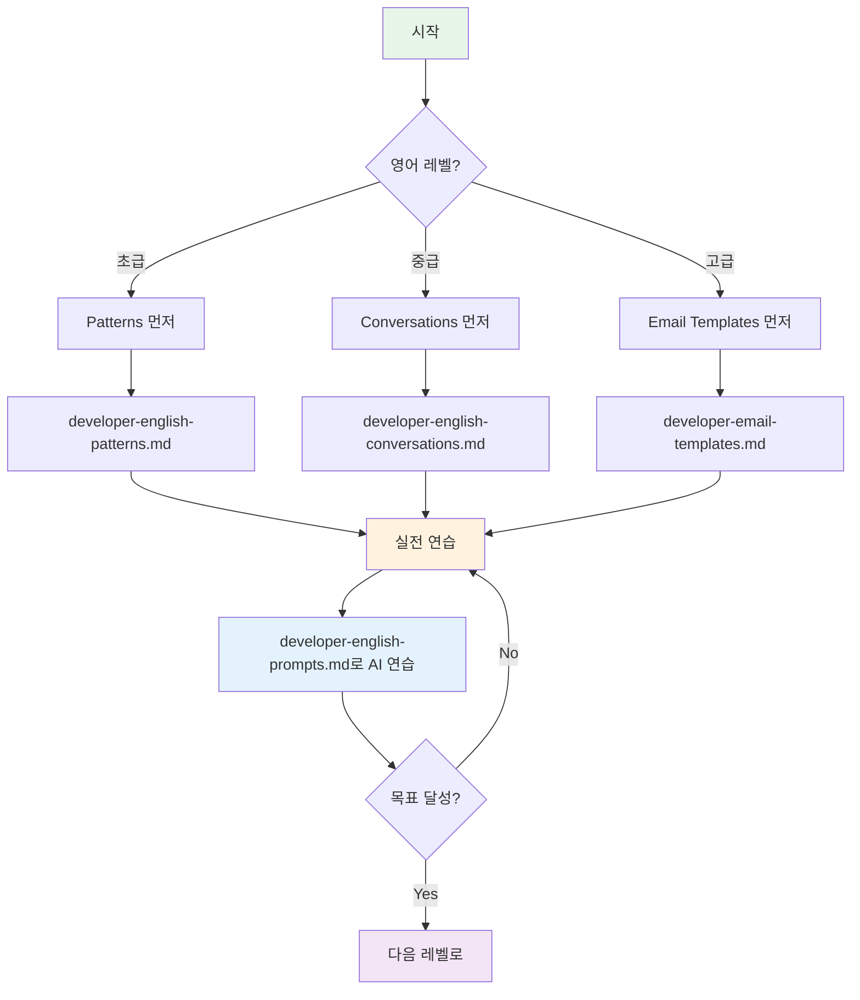

# 💻 개발자를 위한 비즈니스 영어 완벽 가이드

> **Full Stack + AI 개발자를 위한 실전 영어 학습 시스템**  
> 코드 리뷰부터 기술 프레젠테이션까지, 모든 것을 커버합니다.

---

## 🎯 이 가이드를 만든 이유

개발자는 일반 비즈니스 영어와는 다른 특수한 영어가 필요합니다:
- 기술 용어를 정확하게 사용
- 복잡한 시스템을 명확하게 설명
- 코드 리뷰에서 건설적으로 피드백
- 비기술자에게 기술을 쉽게 설명
- AI/ML 모델을 비즈니스 언어로 번역

이 가이드는 **실전에서 바로 쓸 수 있는** 표현과 패턴을 제공합니다.

---

## 📚 파일 구조 및 학습 로드맵



---

## 📖 파일별 사용 가이드

### 1. developer-english-patterns.md
**패턴 200개로 기초 다지기**

```
📊 난이도: ⭐⭐☆☆☆ (기초)
⏱️ 학습 시간: 4주
🎯 목표: 자주 쓰는 표현 암기
```

**언제 사용:**
- 영어로 말할 때 표현이 안 떠오를 때
- 이메일 쓸 때 적절한 표현 찾을 때
- 특정 상황별 표현 빠르게 찾을 때

**학습 방법:**
1. 하루 10개씩 학습 (20일이면 완료)
2. 상황별로 자주 쓰는 TOP 5 먼저 암기
3. 실제 업무에서 바로 사용해보기

**예시:**
```
상황: 코드 리뷰에서 피드백

❌ "This code is bad."
✅ "I suggest we refactor this for better readability."

패턴 #19: I suggest we [개선].
```

---

### 2. developer-english-conversations.md
**8가지 실전 대화 시나리오**

```
📊 난이도: ⭐⭐⭐☆☆ (중급)
⏱️ 학습 시간: 8주 (주 1개 시나리오)
🎯 목표: 자연스러운 대화 흐름 익히기
```

**포함된 시나리오:**
1. 스프린트 플래닝
2. 데일리 스탠드업
3. 코드 리뷰 미팅
4. 기술 아키텍처 논의
5. AI/ML 프로젝트 리뷰
6. 클라이언트 기술 상담
7. 버그 트리아지 미팅
8. 레트로스펙티브

**학습 방법:**
1. 초급 → 중급 → 고급 순서로
2. 역할을 바꿔가며 연습
3. 녹음해서 들어보기
4. ChatGPT와 역할극

**예시 활용:**
```
스프린트 플래닝 연습 (30분)
1. 초급 대화 읽기 (5분)
2. 중급 대화 읽기 (5분)
3. 역할 바꿔 읽기 (10분)
4. 핵심 패턴 암기 (5분)
5. ChatGPT와 연습 (5분)
```

---

### 3. developer-email-templates.md
**42개 실전 이메일 템플릿**

```
📊 난이도: ⭐⭐⭐⭐☆ (중상급)
⏱️ 학습 시간: 필요할 때마다 참고
🎯 목표: 프로페셔널한 이메일 작성
```

**카테고리:**
- 기술 제안 (8개)
- 버그 리포트 (6개)
- 프로젝트 업데이트 (6개)
- 코드 리뷰 피드백 (6개)
- 릴리즈 노트 (4개)
- AI/ML 프로젝트 (6개)
- 클라이언트 소통 (6개)

**사용 방법:**
1. 상황에 맞는 템플릿 찾기
2. 자신의 상황에 맞게 수정
3. 주요 구조와 표현 익히기
4. 다음번엔 템플릿 없이 작성

**예시:**
```
긴급 버그 리포트 이메일

✅ Subject에 긴급성 표시
✅ 첫 문장에 핵심 요약
✅ 영향도 구체적으로
✅ 조치 사항 명확히
✅ 타임라인 제시

템플릿 #9 참고
```

---

### 4. developer-english-prompts.md
**AI와 함께하는 맞춤형 학습**

```
📊 난이도: ⭐⭐⭐⭐⭐ (맞춤형)
⏱️ 학습 시간: 지속적
🎯 목표: 실전 시뮬레이션 연습
```

**22개 학습 프롬프트:**
- 코드 리뷰 연습 (2개)
- 기술 면접 시뮬레이션 (2개)
- 프로젝트 발표 연습 (2개)
- 버그 리포팅 연습 (2개)
- 아키텍처 논의 연습 (2개)
- AI/ML 설명 연습 (2개)
- 클라이언트 소통 연습 (2개)
- 이메일 작성 연습 (2개)
- 발음 교정 (1개)
- 맞춤형 플랜 (1개)
- 실수 분석 (1개)
- 단어 암기 (1개)
- 게임화 학습 (1개)
- 진도 평가 (1개)

**활용 예시:**
```
코드 리뷰 영어 연습 (30분)

1. Prompt #1 복사
2. ChatGPT에 붙여넣기
3. AI가 주니어 개발자 역할
4. 내가 리뷰 코멘트 작성
5. AI가 피드백
6. 3회 반복

주 3회 × 4주 = 능숙해짐
```

---

## 🗓️ 4주 집중 학습 플랜

### Week 1: 기초 다지기
**목표:** 자주 쓰는 표현 암기

| 요일 | 학습 내용 | 시간 | 파일 |
|:---:|----------|:----:|-----|
| 월 | 코드 작성 패턴 (1-30) | 30분 | patterns.md |
| 화 | 버그 디버깅 패턴 (31-50) | 30분 | patterns.md |
| 수 | 아키텍처 패턴 (51-70) | 30분 | patterns.md |
| 목 | 성능 최적화 패턴 (71-90) | 30분 | patterns.md |
| 금 | 복습 + 실전 적용 | 30분 | - |
| 토 | 테스팅 패턴 (91-110) | 30분 | patterns.md |
| 일 | 주간 복습 | 1시간 | - |

**체크포인트:**
- [ ] 50개 패턴 암기
- [ ] 실제 코드 리뷰에 5번 사용
- [ ] 이메일에 10번 사용

---

### Week 2: 대화 연습
**목표:** 자연스러운 대화 흐름

| 요일 | 학습 내용 | 시간 | 파일 |
|:---:|----------|:----:|-----|
| 월 | 스프린트 플래닝 대화 | 45분 | conversations.md |
| 화 | 스탠드업 대화 | 30분 | conversations.md |
| 수 | 코드 리뷰 대화 | 45분 | conversations.md |
| 목 | 아키텍처 논의 | 45분 | conversations.md |
| 금 | ChatGPT 역할극 | 45분 | prompts.md |
| 토 | 버그 트리아지 대화 | 45분 | conversations.md |
| 일 | 주간 복습 | 1시간 | - |

**체크포인트:**
- [ ] 5개 시나리오 연습
- [ ] 각 시나리오 3회 이상 반복
- [ ] 실제 회의에서 1번 사용

---

### Week 3: 글쓰기 마스터
**목표:** 프로페셔널한 이메일 작성

| 요일 | 학습 내용 | 시간 | 파일 |
|:---:|----------|:----:|-----|
| 월 | 기술 제안 이메일 (3개) | 1시간 | email-templates.md |
| 화 | 버그 리포트 (3개) | 1시간 | email-templates.md |
| 수 | 프로젝트 업데이트 (3개) | 1시간 | email-templates.md |
| 목 | 코드 리뷰 피드백 (3개) | 1시간 | email-templates.md |
| 금 | 실전 이메일 작성 | 1시간 | prompts.md #15, #16 |
| 토 | 클라이언트 이메일 (3개) | 1시간 | email-templates.md |
| 일 | 주간 복습 + 평가 | 1시간 | - |

**체크포인트:**
- [ ] 10개 템플릿 숙지
- [ ] 실전 이메일 5개 작성
- [ ] 동료 피드백 받기

---

### Week 4: 실전 적용
**목표:** 종합 연습 및 평가

| 요일 | 학습 내용 | 시간 | 파일 |
|:---:|----------|:----:|-----|
| 월 | 기술 면접 시뮬레이션 | 1시간 | prompts.md #3, #4 |
| 화 | 프로젝트 발표 연습 | 1시간 | prompts.md #5, #6 |
| 수 | 클라이언트 미팅 연습 | 1시간 | prompts.md #13, #14 |
| 목 | AI 프로젝트 설명 | 1시간 | prompts.md #11, #12 |
| 금 | 종합 평가 테스트 | 1시간 | prompts.md #22 |
| 토 | 약점 보완 | 1시간 | - |
| 일 | 4주 총 복습 | 2시간 | - |

**최종 체크리스트:**
- [ ] 코드 리뷰 영어로 자신감
- [ ] 기술 이메일 10분 안에 작성
- [ ] 5분 기술 설명 가능
- [ ] 영어 회의 80% 이해
- [ ] 다음 4주 플랜 수립

---

## 🎯 레벨별 학습 전략

### 🟢 초급 (TOEIC 600 이하)
**현재 상태:**
- 기본 문법은 아는데 말이 안 나옴
- 이메일 쓸 때 1시간 걸림
- 회의에서 듣기만 함

**추천 학습:**
1. **Patterns부터 시작** (4주)
   - 매일 10개씩
   - 소리 내서 읽기
   - 문장 만들기 연습

2. **간단한 이메일** (2주)
   - 템플릿 따라하기
   - 3줄 이메일부터
   - 매일 1개씩 작성

3. **ChatGPT 연습** (지속)
   - Prompt #20 (단어 암기)
   - Prompt #21 (퀴즈)
   - 부담 없이 재미있게

**목표:**
3개월 후 → 기본 업무 영어 소통 가능

---

### 🟡 중급 (TOEIC 600-800)
**현재 상태:**
- 간단한 소통은 가능
- 복잡한 설명은 어려움
- 이메일 30분 걸림

**추천 학습:**
1. **Conversations 집중** (4주)
   - 시나리오별 연습
   - 역할극으로 체화
   - 실전에서 바로 적용

2. **전문 이메일** (3주)
   - 각 카테고리 3개씩
   - 자신만의 템플릿 만들기
   - 실제 업무에 사용

3. **발표 연습** (지속)
   - Prompt #5, #6
   - 녹음해서 듣기
   - 주 1회 발표 연습

**목표:**
3개월 후 → 자신감 있게 기술 소통

---

### 🔴 고급 (TOEIC 800+)
**현재 상태:**
- 기본 소통 문제없음
- 더 세련된 표현 필요
- 설득력 있는 발표 원함

**추천 학습:**
1. **고급 대화 패턴** (2주)
   - 고급 버전만 집중
   - 뉘앙스 차이 이해
   - 네이티브처럼 표현

2. **전략적 글쓰기** (3주)
   - 설득력 있는 제안서
   - RFC 작성 연습
   - 임팩트 있는 이메일

3. **프레젠테이션 마스터** (지속)
   - Prompt #5 (AI 프로젝트)
   - Prompt #6 (아키텍처)
   - 컨퍼런스 발표 준비

**목표:**
3개월 후 → 해외 컨퍼런스 발표 가능

---

## 💡 효과적인 학습 팁

### 1. 실전 적용이 최고의 학습
```
❌ 패턴만 외우기
✅ 오늘 배운 표현 바로 사용하기

예시:
오늘 학습: "I suggest we refactor this."
오늘 적용: 동료 PR에 코멘트로 사용
```

### 2. 완벽보다 일관성
```
❌ 주말에 5시간 몰아서
✅ 매일 30분씩

이유: 언어는 꾸준함이 핵심
```

### 3. 피드백 루프
```
1. 학습
2. 실전 사용
3. 피드백 받기
4. 개선
5. 반복
```

### 4. AI 적극 활용
```
ChatGPT/Claude로:
- 문법 체크
- 표현 개선
- 역할극 연습
- 즉각 피드백
```

### 5. 두려움 극복
```
실수는 배움의 기회
완벽한 영어는 없음
의사소통이 목표
```

---

## 🚀 다음 단계

### 3개월 후
- [ ] 해외 컨퍼런스 발표 신청
- [ ] 영어 기술 블로그 시작
- [ ] 오픈소스 프로젝트 영어로 기여
- [ ] 글로벌 팀과 협업

### 6개월 후
- [ ] 영어 기술 면접 통과
- [ ] 기술 컨퍼런스 발표
- [ ] 영어 멘토링 시작
- [ ] 해외 취업 고려

### 1년 후
- [ ] 영어로 일하는 것이 자연스러움
- [ ] 기술 영어로 책/강의
- [ ] 글로벌 개발자 네트워크
- [ ] 원하는 커리어 달성

---

## 📞 도움이 필요하신가요?

### 추가 리소스
- [기본 비즈니스 영어](./business-english-guide.md)
- [일반 비즈니스 패턴](./business-english-patterns-basic.md)
- [프롬프트 시스템](./business-english-prompts.md)

### 피드백 환영
이 가이드가 도움이 되었나요?
개선 아이디어가 있으신가요?
GitHub에 이슈나 PR을 남겨주세요!

---

## 📈 성공 사례

```
💬 "4주 학습 후 첫 영어 코드 리뷰 성공!"
   - 김개발, Full Stack Engineer

💬 "이제 해외 클라이언트와 자신감 있게 소통해요"
   - 박백엔드, Backend Developer

💬 "AI 프로젝트를 영어로 발표했어요"
   - 이머신, ML Engineer

💬 "글로벌 기업 합격! 이 가이드 덕분입니다"
   - 최풀스택, Senior Engineer
```

---

## 🎉 시작하세요!

**지금 바로 시작하는 법:**

1. ✅ 자신의 레벨 확인
2. ✅ Week 1 플랜 시작
3. ✅ 첫 번째 파일 열기
4. ✅ 10개 패턴 학습
5. ✅ 오늘 바로 사용

**첫 번째 표현:**
```
"I'm working on improving my technical English.
Let's start with code review comments!"
```

---

*Happy Coding in English! 💻🌍*

*Last Updated: 2026-01-10*


