# 📧 비즈니스 이메일 템플릿 50선

> **실전 비즈니스 이메일 작성 완벽 가이드**  
> 상황별 이메일 템플릿과 핵심 표현 정리

---

## 📋 목차
1. [이메일 구조와 기본 규칙](#이메일-구조와-기본-규칙)
2. [요청 이메일](#-요청-이메일-templates-1-10)
3. [보고 이메일](#-보고-이메일-templates-11-20)
4. [협조/확인 이메일](#-협조확인-이메일-templates-21-30)
5. [사과/문제해결 이메일](#-사과문제해결-이메일-templates-31-40)
6. [네트워킹/관계 이메일](#-네트워킹관계-이메일-templates-41-50)

---

## 이메일 구조와 기본 규칙

### 이메일 기본 구조

```mermaid
flowchart TB
    subgraph 이메일["📧 이메일 구조"]
        A[Subject Line] --> B[Greeting]
        B --> C[Opening]
        C --> D[Body]
        D --> E[Call to Action]
        E --> F[Closing]
        F --> G[Signature]
    end
    
    style A fill:#e3f2fd
    style D fill:#fff3e0
    style G fill:#e8f5e9
```

### 핵심 규칙

| 항목 | 규칙 | 예시 |
|:---:|------|------|
| Subject | 명확하고 구체적으로 | ✅ "Q4 Budget Approval - Action Required by Nov 15" |
| Opening | 목적 바로 전달 | "I'm writing to request..." |
| Body | 간결하게, 단락 구분 | 핵심 내용 3줄 이내 |
| CTA | 명확한 다음 단계 | "Please confirm by Friday." |
| Closing | 공손하게 마무리 | "Thank you for your attention." |

### 공손함 레벨 가이드

```mermaid
flowchart LR
    A["🔵 일반"] --> B["🟢 공손"]
    B --> C["🟡 매우 공손"]
    C --> D["🔴 최고 공손"]
    
    A --- A1["Can you...?"]
    B --- B1["Could you please...?"]
    C --- C1["Would you be able to...?"]
    D --- D1["I was wondering if you might..."]
```



---

## 📨 요청 이메일 (Templates 1-10)

### Template 1: 정보 요청

```
Subject: Request for Q4 Sales Data

Dear [Name],

I hope this email finds you well.

I'm reaching out to request the Q4 sales data for our upcoming board presentation. Specifically, I need:

• Regional breakdown by market
• Month-over-month comparison
• Top 10 product performance

Would it be possible to share this information by November 10th? If you need additional context, please don't hesitate to reach out.

Thank you for your assistance.

Best regards,
[Your Name]
```

### Template 2: 미팅 요청

```
Subject: Meeting Request: Project Alpha Review

Dear [Name],

I hope you're doing well.

I'd like to schedule a meeting to review the Project Alpha timeline and discuss next steps. Here are some proposed times:

• Tuesday, Nov 14 at 2:00 PM
• Wednesday, Nov 15 at 10:00 AM
• Thursday, Nov 16 at 3:00 PM

The meeting should take approximately 45 minutes. Please let me know which time works best for you, or suggest an alternative if none of these are convenient.

I look forward to our discussion.

Best regards,
[Your Name]
```

### Template 3: 승인 요청

```
Subject: Approval Required: Marketing Budget Increase

Dear [Name],

I'm writing to request approval for an additional $15,000 in marketing budget for Q4.

Background:
Our recent campaign has exceeded expectations, generating a 35% increase in leads. To capitalize on this momentum, we need additional funds for:

• Extended digital advertising ($8,000)
• Additional content production ($5,000)
• Event sponsorship ($2,000)

Expected ROI: Based on current performance, this investment should generate an additional $45,000 in revenue.

Please let me know if you need any further information. I'm happy to discuss this in person if helpful.

Thank you for considering this request.

Best regards,
[Your Name]
```

### Template 4: 협조 요청

```
Subject: Request for Support: Client Presentation

Dear [Name],

I hope this message finds you well.

I'm preparing a presentation for our key client, ABC Corp, scheduled for November 20th. I would greatly appreciate your assistance with the following:

1. Latest product roadmap highlights
2. Customer success metrics from similar clients
3. Technical specifications overview

Could you please share these materials by November 15th? This will give me adequate time to incorporate them into the presentation.

I understand your schedule is busy, so please let me know if this timeline presents any challenges.

Thank you in advance for your support.

Best regards,
[Your Name]
```

### Template 5: 피드백 요청

```
Subject: Feedback Request: Proposal Draft

Dear [Name],

I've completed the initial draft of the Johnson & Partners proposal and would value your feedback before we finalize it.

Key areas I'd appreciate your input on:
• Pricing strategy (Section 3)
• Implementation timeline (Section 4)
• Risk mitigation approach (Section 5)

The document is attached for your review. Could you please share your thoughts by end of day Wednesday?

I'm also happy to set up a quick call if you'd prefer to discuss your feedback verbally.

Thank you for your time and expertise.

Best regards,
[Your Name]
```

### Template 6: 마감 연장 요청

```
Subject: Request: Deadline Extension for Quarterly Report

Dear [Name],

I'm writing to request a deadline extension for the quarterly report, currently due November 15th.

Due to unexpected data discrepancies that require additional validation, I need an extra three business days to ensure accuracy. The revised completion date would be November 20th.

I apologize for any inconvenience this may cause. Please rest assured that this extension will allow us to deliver a thorough and accurate report.

Please let me know if this extension is feasible, or if we need to discuss alternatives.

Thank you for your understanding.

Best regards,
[Your Name]
```

### Template 7: 자료 요청

```
Subject: Document Request: Contract Archives

Dear [Name],

I'm currently reviewing our vendor relationships and need access to the following archived contracts:

1. XYZ Supplies Agreement (2022)
2. Tech Services Master Agreement (2023)
3. Original Marketing Agency Contract (2021)

These documents will help me ensure continuity as we negotiate renewals.

Could you please send these files or let me know the best way to access them? I'd appreciate receiving them by November 12th if possible.

Thank you for your help.

Best regards,
[Your Name]
```

### Template 8: 견적 요청

```
Subject: Request for Quote: Office Equipment

Dear [Name],

We are interested in purchasing the following items for our expanding team:

• 20 ergonomic office chairs (Model: ErgoMax Pro)
• 10 standing desks (adjustable, 60" width)
• 5 conference room tables (8-person capacity)

Could you please provide a detailed quote including:
- Unit pricing and volume discounts
- Delivery timeline
- Installation services (if available)
- Payment terms

We'd like to make a decision by November 30th. Thank you in advance for your prompt response.

Best regards,
[Your Name]
```

### Template 9: 휴가 요청

```
Subject: Time Off Request: November 24-28

Dear [Name],

I would like to request time off from November 24th through November 28th for personal travel.

I have ensured that:
• All critical deliverables will be completed before I leave
• [Colleague Name] will cover any urgent matters during my absence
• I will be available by email for emergencies

Please let me know if you have any concerns or need additional information.

Thank you for your consideration.

Best regards,
[Your Name]
```

### Template 10: 추천서 요청

```
Subject: Reference Request

Dear [Name],

I hope this email finds you well.

I am applying for a Senior Marketing Manager position at [Company Name] and would be honored if you could serve as a professional reference.

Given our collaboration on [specific project], I believe you could speak to my skills in [relevant skills]. The recruiter may contact you in the coming weeks.

If you're comfortable providing a reference, I'd be happy to provide any additional information that might be helpful.

Please let me know if this is possible. I completely understand if your schedule doesn't permit.

Thank you for considering this request.

Best regards,
[Your Name]
```

---

## 📊 보고 이메일 (Templates 11-20)

### Template 11: 프로젝트 상태 업데이트

```
Subject: Project Update: Alpha Launch - Week of Nov 13

Dear Team,

Here's the weekly status update for Project Alpha:

**Status: On Track 🟢**

Completed this week:
✅ User acceptance testing (100%)
✅ Security audit passed
✅ Marketing materials approved

In progress:
🔄 Final bug fixes (85% complete)
🔄 Training documentation (70% complete)

Next week's focus:
• Complete bug fixes by Tuesday
• Conduct final stakeholder review
• Begin soft launch preparation

Risks/Issues:
⚠️ Minor delay in vendor delivery - mitigation plan in place

Please reach out if you have questions. Full details in the attached report.

Best regards,
[Your Name]
```

### Template 12: 회의 결과 보고

```
Subject: Meeting Summary: Client Strategy Session - Nov 12

Dear Stakeholders,

Here's a summary of today's client strategy session:

**Attendees:** [Names]

**Key Decisions:**
1. Proceed with Option B for the product launch
2. Budget approved at $50,000
3. Launch date confirmed: December 1st

**Action Items:**
| Item | Owner | Deadline |
|------|-------|----------|
| Finalize creative assets | Sarah | Nov 15 |
| Complete technical setup | John | Nov 18 |
| Client approval sign-off | [Name] | Nov 20 |

**Next Meeting:** November 19th at 2:00 PM

Please reply if I've missed anything or if you have corrections.

Best regards,
[Your Name]
```

### Template 13: 월간 실적 보고

```
Subject: Monthly Performance Report: October 2026

Dear [Name],

Please find below the October performance summary:

**Key Highlights:**
• Revenue: $1.2M (+15% vs target)
• New Customers: 45 (+28% YoY)
• Customer Satisfaction: 92%

**Achievements:**
• Exceeded quarterly sales target by 12%
• Launched two new product features
• Reduced support ticket response time by 25%

**Challenges:**
• Higher-than-expected churn in SMB segment
• Vendor delays affecting Q4 inventory

**Outlook:**
We're well-positioned for a strong Q4. Focus areas include customer retention and inventory management.

Detailed report attached. Happy to discuss at your convenience.

Best regards,
[Your Name]
```

### Template 14: 문제 발생 보고

```
Subject: Issue Report: System Outage - Immediate Attention Required

Dear [Name],

I'm writing to inform you of a critical issue that occurred today.

**Issue:** E-commerce platform outage
**Time:** 2:30 PM - 4:15 PM EST
**Impact:** Estimated $15,000 in lost sales

**Root Cause:**
Database server overload during peak traffic period.

**Actions Taken:**
1. Immediate failover to backup servers (completed)
2. Customer communication sent (completed)
3. Root cause analysis initiated (in progress)

**Preventive Measures:**
• Infrastructure upgrade scheduled for this weekend
• Additional monitoring alerts implemented

I'll provide a full post-mortem report by end of week. Please let me know if you need additional information.

Best regards,
[Your Name]
```

### Template 15: 경쟁사 분석 보고

```
Subject: Competitive Intelligence Report: Q4 2026

Dear Leadership Team,

Attached is our quarterly competitive analysis. Key findings:

**Market Changes:**
• Competitor A launched a new product line at 10% lower pricing
• Competitor B announced expansion into APAC markets
• Industry average growth rate: 8%

**Our Position:**
• Market share: Stable at 23%
• Brand awareness: Increased 5% vs Q3
• Product superiority ratings: Above average in 3/5 categories

**Recommendations:**
1. Accelerate feature development in AI capabilities
2. Consider strategic partnership for APAC expansion
3. Evaluate pricing strategy for enterprise segment

Full analysis with supporting data attached. Available for detailed discussion.

Best regards,
[Your Name]
```

### Template 16: 출장 결과 보고

```
Subject: Trip Report: Tokyo Partner Meetings - Nov 5-8

Dear [Name],

Here's a summary of my Tokyo business trip:

**Meetings Conducted:**
1. **ABC Corporation** - Discussed potential 3-year partnership
   - Very positive reception; expect proposal request by Nov 20
   
2. **XYZ Ltd** - Contract renewal discussion
   - Requesting 5% discount; recommending we counter at 3%
   
3. **Tech Japan Inc** - New lead introduction
   - Strong interest in our enterprise solution; demo scheduled

**Overall Assessment:**
Productive trip with strong pipeline development. Estimated potential value: $500K+ over next 18 months.

**Follow-up Actions:**
• Send ABC partnership proposal by Nov 18
• Prepare XYZ counter-offer by Nov 12
• Coordinate demo schedule with Tech Japan

Expense report to follow separately.

Best regards,
[Your Name]
```

### Template 17: 예산 보고

```
Subject: Q4 Budget Utilization Report

Dear Finance Team,

Please find the Q4 budget status as of November 10:

**Budget Overview:**
| Category | Allocated | Spent | Remaining |
|----------|-----------|-------|-----------|
| Personnel | $200,000 | $180,000 | $20,000 |
| Marketing | $50,000 | $42,000 | $8,000 |
| Technology | $30,000 | $28,500 | $1,500 |
| Travel | $15,000 | $12,000 | $3,000 |

**Status:** 87% utilized with 6 weeks remaining

**Notes:**
• Personnel underspend due to delayed hiring
• Technology nearly depleted; may need reallocation
• Marketing on track for year-end campaigns

Please advise if budget reallocation is possible for technology needs.

Best regards,
[Your Name]
```

### Template 18: 고객 피드백 보고

```
Subject: Customer Feedback Summary: Product Launch

Dear Product Team,

Here's the compiled customer feedback from our recent launch:

**Overall Sentiment:** Positive (78% favorable)

**Top Praise:**
• User interface improvements (mentioned 45 times)
• Performance speed (mentioned 32 times)
• New feature X (mentioned 28 times)

**Areas for Improvement:**
• Mobile app stability (18 complaints)
• Documentation gaps (12 mentions)
• Pricing concerns (8 mentions)

**Verbatim Highlights:**
> "Best update in years. Makes my workflow so much easier."
> "Love the new design, but crashes on my iPhone occasionally."

**Recommended Actions:**
1. Priority bug fix for mobile stability
2. Update documentation for new features
3. Create FAQ addressing pricing questions

Full feedback data attached.

Best regards,
[Your Name]
```

### Template 19: 리스크 평가 보고

```
Subject: Risk Assessment Report: Project Beta

Dear Steering Committee,

Attached is the risk assessment for Project Beta:

**High-Risk Items:**

🔴 **Vendor Dependency**
- Impact: High | Probability: Medium
- Mitigation: Identifying backup vendors

🔴 **Resource Constraints**
- Impact: High | Probability: High
- Mitigation: Requesting additional headcount

**Medium-Risk Items:**

🟡 **Technology Integration**
- Impact: Medium | Probability: Medium
- Mitigation: Early testing phase initiated

🟡 **Timeline Pressure**
- Impact: Medium | Probability: Medium
- Mitigation: Buffer time built into schedule

**Recommendation:**
Proceed with enhanced monitoring. Weekly risk reviews recommended.

Happy to discuss in detail at our next steering committee meeting.

Best regards,
[Your Name]
```

### Template 20: 분기 실적 보고

```
Subject: Q3 2026 Performance Summary

Dear Board Members,

Q3 2026 Executive Summary:

**Financial Performance:**
• Revenue: $4.8M (target: $4.5M) ✅
• Gross Margin: 42% (target: 40%) ✅
• Operating Expenses: $2.1M (budget: $2.0M) ⚠️

**Key Achievements:**
• Launched in 3 new markets
• Added 12 enterprise clients
• Reduced churn by 15%

**Challenges:**
• Higher marketing spend than planned
• Two key departures in engineering

**Q4 Outlook:**
• Revenue target: $5.2M
• Focus: Customer retention and cost optimization
• Key initiative: Product 2.0 launch

Full presentation deck attached for the board meeting.

Best regards,
[Your Name]
```

---

## 🤝 협조/확인 이메일 (Templates 21-30)

### Template 21: 일정 확인

```
Subject: Confirmation: Strategy Meeting - Nov 15 at 2 PM

Dear [Name],

This email confirms our meeting scheduled for:

📅 Date: Wednesday, November 15, 2026
⏰ Time: 2:00 PM - 3:30 PM EST
📍 Location: Conference Room A / Zoom Link: [link]

**Agenda:**
1. Q4 strategy review (30 min)
2. Budget discussion (30 min)
3. Action planning (30 min)

**Please bring:**
• Updated project status
• Preliminary budget estimates

Let me know if anything needs to change. Otherwise, see you there!

Best regards,
[Your Name]
```

### Template 22: 수신 확인

```
Subject: RE: Contract Proposal - Received

Dear [Name],

Thank you for sending the contract proposal. I confirm receipt of:

✅ Master Services Agreement (20 pages)
✅ Statement of Work (5 pages)
✅ Pricing Schedule (2 pages)

I'll review these documents and provide feedback by November 18th. If I have questions during review, I'll reach out.

Thank you for your prompt delivery.

Best regards,
[Your Name]
```

### Template 23: 합의 확인

```
Subject: Confirmation of Agreement: Partnership Terms

Dear [Name],

Thank you for our productive discussion today. I'd like to confirm our agreed terms:

**Partnership Terms:**
• Duration: 2 years, renewable annually
• Revenue share: 70/30 split
• Exclusivity: Non-exclusive in APAC
• Launch date: January 15, 2027

**Next Steps:**
1. Your legal team drafts formal agreement (by Nov 20)
2. Our review and comments (by Nov 25)
3. Final signatures (by Dec 5)

Please reply to confirm these terms are accurate. If I've missed anything, let me know and I'll update.

Looking forward to this partnership!

Best regards,
[Your Name]
```

### Template 24: 참석 확인

```
Subject: RSVP: Annual Company Conference - Dec 10

Dear [Name],

I am pleased to confirm my attendance at the Annual Company Conference.

**Event Details:**
📅 Date: December 10, 2026
📍 Location: Grand Ballroom, Hilton Downtown
⏰ Time: 9:00 AM - 5:00 PM

**Dietary Requirements:** Vegetarian
**Session Preference:** Morning Track A, Afternoon Track B

Please let me know if you need any additional information.

Looking forward to the event!

Best regards,
[Your Name]
```

### Template 25: 완료 확인

```
Subject: Task Completed: Website Migration

Dear [Name],

I'm pleased to confirm that the website migration has been completed successfully.

**Completed Items:**
✅ Data migration (all 50,000 records verified)
✅ URL redirects configured
✅ SSL certificates installed
✅ Performance testing passed

**Results:**
• Page load time: 1.8 seconds (target: <2 seconds)
• No broken links detected
• All forms functioning properly

**Documentation:**
• Migration report attached
• New admin credentials sent separately

Please review and let me know if you notice any issues.

Best regards,
[Your Name]
```

### Template 26: 변경 사항 확인

```
Subject: Confirmation: Updated Project Scope

Dear [Name],

Following our discussion, I'm confirming the following scope changes:

**Original Scope:**
• 3 landing pages
• Basic analytics integration
• Mobile-responsive design

**Updated Scope:**
• 5 landing pages (+2)
• Advanced analytics with dashboard
• Mobile-responsive + AMP versions

**Impact:**
• Timeline: Extended by 2 weeks (new deadline: Dec 15)
• Budget: Additional $5,000

Please reply to confirm your approval of these changes. I'll proceed once confirmed.

Best regards,
[Your Name]
```

### Template 27: 가격 확인

```
Subject: Price Confirmation: Order #12345

Dear [Name],

Thank you for your order. Please confirm the following pricing:

**Order Summary:**
| Item | Qty | Unit Price | Total |
|------|-----|------------|-------|
| Product A | 100 | $50 | $5,000 |
| Product B | 50 | $75 | $3,750 |
| Shipping | - | - | $200 |
| **Total** | - | - | **$8,950** |

**Applied Discounts:**
• Volume discount: 10% (-$875)
• **Final Total: $8,075**

**Payment Terms:** Net 30

Please reply to confirm these details. We'll process your order upon confirmation.

Best regards,
[Your Name]
```

### Template 28: 배송 확인

```
Subject: Shipment Confirmation: Order #12345

Dear [Name],

Great news! Your order has been shipped.

**Shipping Details:**
• Order Number: #12345
• Carrier: FedEx
• Tracking Number: 1234567890
• Estimated Delivery: November 15, 2026

**What's in this shipment:**
• 100x Product A
• 50x Product B

**Track your package:** [Tracking Link]

Please contact us if you have any questions or concerns about your delivery.

Thank you for your business!

Best regards,
[Your Name]
```

### Template 29: 면접 일정 확인

```
Subject: Interview Confirmation: Marketing Manager Position

Dear [Name],

Thank you for your interest in the Marketing Manager position. I'm pleased to confirm your interview:

**Interview Details:**
📅 Date: Thursday, November 16, 2026
⏰ Time: 10:00 AM EST
📍 Format: Video call (Zoom link below)
⏱️ Duration: Approximately 45 minutes

**Zoom Link:** [link]
**Meeting ID:** 123 456 7890

**Interviewers:**
• Sarah Johnson, VP Marketing
• Michael Chen, HR Director

**What to prepare:**
• Portfolio of recent campaigns
• Examples of successful projects

Please reply to confirm your attendance. If you need to reschedule, let me know as soon as possible.

We look forward to meeting you!

Best regards,
[Your Name]
```

### Template 30: 계약 조건 확인

```
Subject: Contract Terms Confirmation

Dear [Name],

Before we proceed to final signing, please confirm the following contract terms:

**Key Terms:**
• Service: Enterprise Software License
• Duration: 3 years (Jan 1, 2027 - Dec 31, 2029)
• Annual Fee: $120,000
• Payment Schedule: Quarterly in advance
• Support Level: Premium (24/7)

**Special Conditions:**
• Price lock for first 2 years
• Option to add users at pro-rated cost
• Early termination clause: 90 days notice + 6 months penalty

Please review and reply with any corrections by November 20th. Otherwise, we'll proceed with contract preparation.

Thank you!

Best regards,
[Your Name]
```

---

## 🔧 사과/문제해결 이메일 (Templates 31-40)

### Template 31: 지연 사과

```
Subject: Apology: Delayed Delivery of Project Materials

Dear [Name],

I sincerely apologize for the delay in delivering the project materials that were due yesterday.

**What happened:**
An unexpected technical issue with our file system prevented timely delivery.

**What we've done:**
• Issue has been resolved
• Materials are now ready
• Files attached to this email

**Prevention:**
We've implemented backup protocols to prevent this from happening again.

I understand this may have impacted your schedule, and I take full responsibility. Please let me know if there's anything I can do to mitigate any inconvenience caused.

Thank you for your patience and understanding.

Sincerely,
[Your Name]
```

### Template 32: 서비스 오류 사과

```
Subject: Our Apology: Service Disruption on November 12

Dear Valued Customer,

We sincerely apologize for the service disruption you experienced on November 12.

**Incident Summary:**
• Duration: 2:30 PM - 4:15 PM EST
• Affected Services: Online portal, mobile app
• Impact: Users unable to access accounts

**What happened:**
A server configuration error during routine maintenance caused unexpected downtime.

**What we're doing:**
• Root cause identified and fixed
• Enhanced testing procedures implemented
• Additional monitoring systems deployed

**Compensation:**
As a gesture of our commitment to you, we're crediting your account with one month of free service.

We value your business and are committed to preventing future disruptions. If you have any concerns, please contact our support team at support@company.com.

Thank you for your patience.

Sincerely,
[Your Name]
Customer Success Team
```

### Template 33: 실수 인정 및 정정

```
Subject: Correction: Error in Previous Report

Dear [Name],

I need to bring to your attention an error in the quarterly report I sent yesterday.

**The Error:**
The Q3 revenue figure was incorrectly stated as $4.5M. The correct figure is $4.2M.

**Impact:**
This affects the year-to-date growth calculation, which should be 18% (not 22%).

**Corrected Report:**
Please find the corrected report attached. All other figures remain accurate.

**How this happened:**
A formula error in the spreadsheet caused the miscalculation. I've now implemented a verification checklist to prevent similar errors.

I apologize for any confusion this may have caused. Please discard the previous version and use the attached corrected report.

Thank you for your understanding.

Best regards,
[Your Name]
```

### Template 34: 클레임 대응

```
Subject: RE: Complaint About Product Quality

Dear [Name],

Thank you for bringing this issue to our attention. I'm truly sorry about your experience with our product.

**Your Concern:**
Product received with visible defects and not meeting quality standards.

**Our Response:**
We take quality very seriously, and this falls short of our standards. Here's what we're doing:

1. **Immediate Action:**
   - Replacement product shipped today (tracking: [number])
   - Expedited shipping at no cost
   
2. **Compensation:**
   - Full refund for the defective product
   - 20% discount on your next order

3. **Investigation:**
   - Quality team reviewing this batch
   - Enhanced inspection protocols being implemented

Please keep or dispose of the defective product as you prefer – no need to return it.

Again, I sincerely apologize for this experience. We value your business and are committed to making this right.

Best regards,
[Your Name]
```

### Template 35: 미팅 불참 사과

```
Subject: Apology: Missed Meeting Today

Dear [Name],

I sincerely apologize for missing our scheduled meeting this afternoon.

**What happened:**
An urgent client emergency required my immediate attention, and I failed to notify you in advance. This was unprofessional, and I take full responsibility.

**Making it right:**
I'd like to reschedule at your earliest convenience. I'm available:
• Tomorrow (Wednesday) any time after 10 AM
• Thursday morning before noon
• Friday afternoon

Please let me know what works for you. I'll ensure my calendar is blocked and protected for our rescheduled meeting.

Again, I apologize for any inconvenience this caused.

Best regards,
[Your Name]
```

### Template 36: 청구 오류 사과

```
Subject: Apology and Correction: Billing Error

Dear [Name],

We recently identified a billing error on your account and want to address it immediately.

**The Error:**
Your November invoice incorrectly charged $1,500 instead of $1,200.

**Correction:**
• Credit of $300 applied to your account
• Corrected invoice attached
• Credit will appear within 2-3 business days

**Why this happened:**
A system update caused pricing to default incorrectly. We've since fixed the issue and audited all affected accounts.

We apologize for any inconvenience. If you have questions about your billing, please contact our finance team directly at finance@company.com.

Thank you for your patience and understanding.

Best regards,
[Your Name]
```

### Template 37: 프로젝트 지연 통보

```
Subject: Important: Project Timeline Update

Dear [Name],

I need to inform you of an unavoidable delay in the project timeline.

**Original Deadline:** November 30, 2026
**Revised Deadline:** December 15, 2026

**Reason for Delay:**
Critical third-party API integration encountered unexpected compatibility issues requiring additional development time.

**What we've done:**
• Added additional developer resources
• Daily standups to accelerate progress
• Alternative solutions being explored in parallel

**Impact Mitigation:**
We're prioritizing core features for an interim release on the original date, with full functionality by the revised deadline.

I understand this impacts your planning, and I apologize for the inconvenience. I'm available to discuss in detail and address any concerns.

Best regards,
[Your Name]
```

### Template 38: 커뮤니케이션 실수 사과

```
Subject: Apology: Miscommunication Regarding Project Scope

Dear [Name],

I want to apologize for the confusion caused by my earlier communication about the project scope.

**The Miscommunication:**
I incorrectly stated that the additional features were included in the original quote. After reviewing our agreement, I realize this was my error.

**Clarification:**
• Original scope: Features A, B, C (as quoted)
• Additional features: D, E (require separate quote)

**Our Offer:**
Given my miscommunication, I'd like to offer the additional features at a 25% discount as a gesture of goodwill.

I should have been more careful in my initial communication, and I take responsibility for this confusion. Please let me know how you'd like to proceed.

Thank you for your understanding.

Best regards,
[Your Name]
```

### Template 39: 품질 문제 대응

```
Subject: Response to Quality Concerns - Action Plan

Dear [Name],

Thank you for sharing your concerns about product quality. We take this feedback very seriously.

**Your Concerns:**
• Inconsistent product performance
• Documentation gaps
• Support response times

**Our Action Plan:**

1. **Immediate (This Week):**
   - Enhanced QA testing for your account
   - Dedicated support contact assigned
   
2. **Short-term (30 Days):**
   - Updated documentation delivered
   - Bi-weekly quality review meetings
   
3. **Long-term:**
   - Product improvements in next release
   - Ongoing quality monitoring dashboard

**Your dedicated contact:** [Name], [email], [phone]

I personally commit to ensuring your experience improves. Let's schedule a call this week to discuss further.

Best regards,
[Your Name]
```

### Template 40: 고객 불만 해결

```
Subject: Resolution: Your Recent Experience

Dear [Name],

I've personally reviewed your case and want to ensure we resolve this to your complete satisfaction.

**Summary of Issue:**
Your service was interrupted for 3 days due to our billing system error.

**Resolution:**
• Service fully restored as of this morning
• Credit applied: $500 (representing 2 months of service)
• Account flagged for priority support

**Additional Commitment:**
• Direct line to my team for future issues
• Quarterly account review to prevent recurrence
• First notification of any system changes

I understand we fell short of your expectations, and I'm personally committed to rebuilding your trust. Please contact me directly at [phone/email] if you have any further concerns.

Thank you for your patience. We value your business.

Sincerely,
[Your Name]
[Title]
```

---

## 🌐 네트워킹/관계 이메일 (Templates 41-50)

### Template 41: 첫 소개 이메일

```
Subject: Introduction: [Your Name] from [Company]

Dear [Name],

I hope this email finds you well. My name is [Your Name], and I'm the [Title] at [Company].

I came across your recent article on [topic] and was impressed by your insights on [specific point]. Your perspective on [topic] resonated with our work at [Company].

I'm reaching out because I believe there might be interesting synergies between our organizations. We specialize in [brief description], and I'd love to explore potential collaboration opportunities.

Would you be open to a brief 15-minute call to exchange ideas? I'm flexible on timing and happy to work around your schedule.

Thank you for considering. I look forward to hearing from you.

Best regards,
[Your Name]
[Title]
[Company]
[LinkedIn Profile]
```

### Template 42: 이벤트 후 후속 연락

```
Subject: Great Meeting You at [Event Name]

Dear [Name],

It was a pleasure meeting you at [Event Name] yesterday. I really enjoyed our conversation about [topic discussed].

As mentioned, I wanted to share:
• [Resource/article you discussed]
• [Link to your company's relevant offering]

I'd love to continue our conversation and explore how we might work together. Would you be available for a coffee or virtual chat next week?

I'm free:
• Tuesday, 2-4 PM
• Wednesday, 10 AM-12 PM
• Thursday, any time after 3 PM

Let me know what works best for you.

Looking forward to staying in touch!

Best regards,
[Your Name]
```

### Template 43: 축하 이메일

```
Subject: Congratulations on Your Promotion!

Dear [Name],

I just saw the announcement about your promotion to [New Title] – congratulations!

This recognition is well-deserved. Your work on [specific project/achievement] has been impressive, and I'm confident you'll excel in your new role.

If there's ever anything I can do to support you in this new chapter, please don't hesitate to reach out.

Let's catch up soon – I'd love to hear about your plans for the new role.

Warm regards,
[Your Name]
```

### Template 44: 추천 감사

```
Subject: Thank You for the Referral

Dear [Name],

I wanted to personally thank you for referring [Client/Person Name] to us.

Your referral means a great deal. We've connected with [Client/Person Name] and are excited about the potential opportunity. Rest assured, we'll take excellent care of them.

Is there anything I can do for you in return? I'm always happy to make introductions or provide referrals to anyone in my network who might benefit from your services.

Thank you again for thinking of us. Your support is truly appreciated.

Best regards,
[Your Name]
```

### Template 45: 재연결 이메일

```
Subject: Reconnecting After [Event/Time]

Dear [Name],

I hope this message finds you well. It's been a while since we last connected at [event/context], and I wanted to reach out.

I've been following [Company Name]'s progress – congratulations on [recent achievement]. It's exciting to see the growth.

I'm reaching out because [reason - new opportunity, changed circumstances, etc.]. I'd love to catch up and hear about what you've been working on.

Would you have time for a quick coffee or call in the coming weeks?

Looking forward to reconnecting!

Best regards,
[Your Name]
```

### Template 46: 멘토 요청

```
Subject: Request for Guidance

Dear [Name],

I've long admired your career journey and leadership in [industry/field]. Your approach to [specific aspect] has been particularly inspiring to me.

I'm at a point in my career where I'm [situation - considering transition, facing challenge, seeking growth], and I believe your perspective would be invaluable.

Would you be open to a brief conversation to share your insights? I'm seeking guidance on [specific topic], and even 20 minutes of your time would be tremendously helpful.

I completely understand if your schedule doesn't permit. Either way, I wanted to express my appreciation for the example you've set in our industry.

Thank you for considering.

Respectfully,
[Your Name]
```

### Template 47: 소개 요청

```
Subject: Introduction Request: [Person/Company]

Dear [Name],

I hope you're doing well!

I noticed you're connected with [Person/Company] on LinkedIn. We're exploring [opportunity/partnership], and I believe [Person/Company] could be a great fit.

Would you be comfortable making an introduction? I'd be happy to provide a brief note you could forward, or any other format that works for you.

If you don't feel comfortable or don't know them well enough, I completely understand – no pressure at all.

Thank you for considering!

Best regards,
[Your Name]
```

### Template 48: 파트너십 제안

```
Subject: Partnership Opportunity: [Brief Description]

Dear [Name],

I'm reaching out because I believe there's a compelling opportunity for [Company A] and [Company B] to collaborate.

**The Opportunity:**
Our companies serve complementary markets, and together we could [specific benefit - expand reach, offer bundled solutions, etc.].

**Proposed Collaboration:**
• [Specific proposal 1]
• [Specific proposal 2]
• [Specific proposal 3]

**Why This Makes Sense:**
• Your strength in [area] + our strength in [area]
• Combined customer base of [number]
• Estimated [benefit/revenue potential]

I'd love to explore this further. Would you be open to a discovery call to discuss possibilities?

Best regards,
[Your Name]
```

### Template 49: 연말 감사 인사

```
Subject: Thank You for a Great Year

Dear [Name],

As the year comes to a close, I wanted to take a moment to express my sincere appreciation for our partnership.

**Highlights of Our Collaboration:**
• Successfully launched [project/initiative]
• Achieved [specific result] together
• Strengthened our working relationship

Working with you and your team has been a pleasure. Your professionalism, expertise, and commitment to excellence made a real difference in our success this year.

I'm excited about the opportunities ahead in the new year and look forward to continuing our collaboration.

Wishing you and your family a wonderful holiday season and a prosperous new year!

Warm regards,
[Your Name]
```

### Template 50: 퇴사 알림

```
Subject: Career Update: Moving On

Dear [Name],

I wanted to personally inform you that I'll be leaving [Company] effective [Date] to pursue a new opportunity at [New Company/situation].

Working with you over the past [duration] has been a genuine pleasure. I've learned so much from [specific experience], and I'm grateful for our collaboration.

**Transition:**
• [Colleague Name] will be taking over my responsibilities
• They can be reached at [email]
• I'll ensure a smooth handover before my departure

**Staying Connected:**
I'd love to keep in touch! You can reach me at:
• Personal email: [email]
• LinkedIn: [profile link]
• Mobile: [phone]

Thank you for everything. I hope our paths cross again soon.

Best regards,
[Your Name]
```

---

## 📊 빠른 참조 가이드

### 이메일 시작 표현

| 상황 | 표현 |
|------|------|
| 일반 | I hope this email finds you well. |
| 후속 | Following up on our conversation... |
| 요청 | I'm writing to request... |
| 보고 | I wanted to update you on... |
| 감사 | Thank you for your email regarding... |

### 이메일 마무리 표현

| 상황 | 표현 |
|------|------|
| 답변 요청 | I look forward to hearing from you. |
| 도움 제안 | Please don't hesitate to reach out if you need anything. |
| 감사 | Thank you for your time and consideration. |
| 기대 | Looking forward to our discussion. |
| 확인 요청 | Please confirm receipt of this email. |

### 톤별 맺음말

| 톤 | 맺음말 |
|:---:|-------|
| Formal | Sincerely, / Respectfully, |
| Business | Best regards, / Kind regards, |
| Friendly | Best, / Thanks, / Cheers, |

---

*Last Updated: 2026-01-10*

