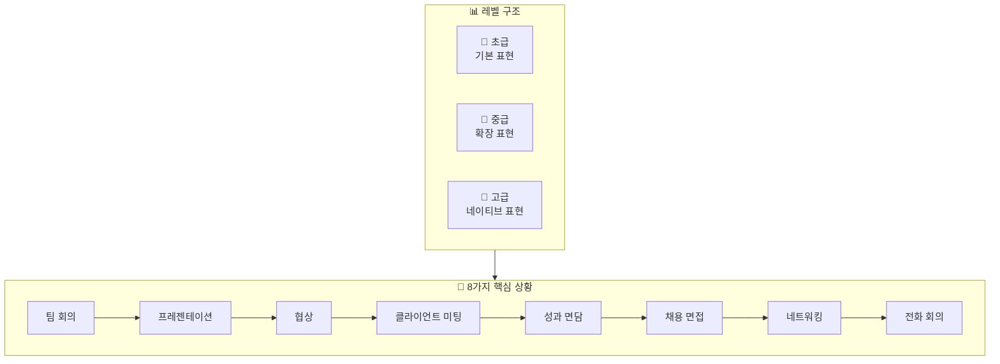
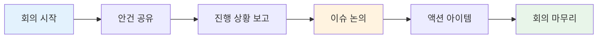
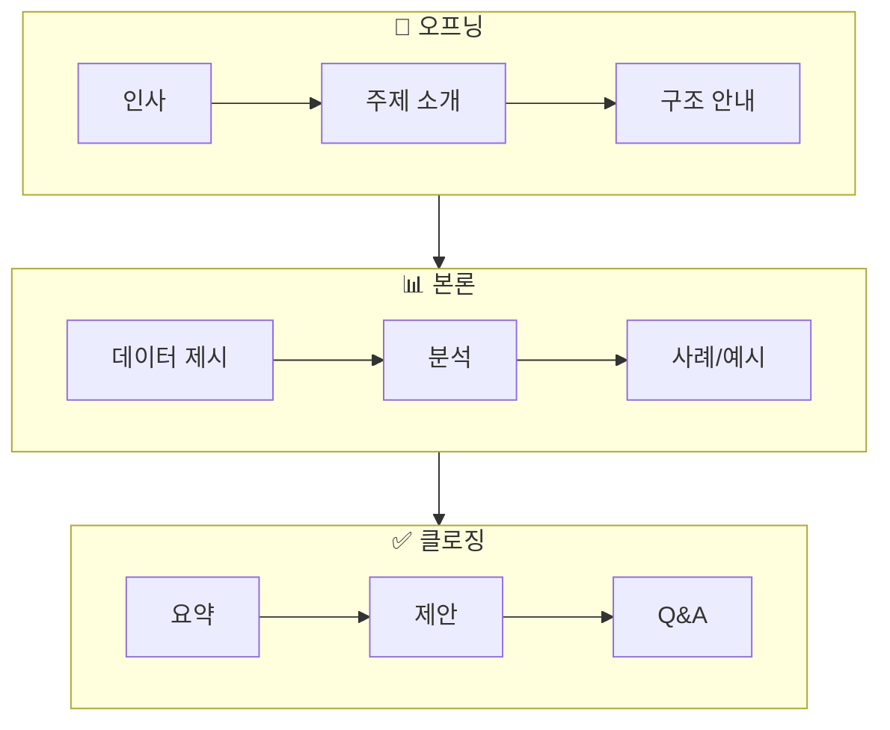
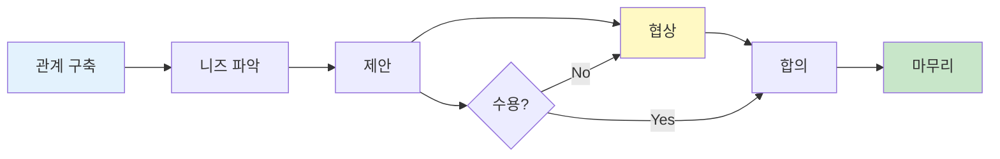
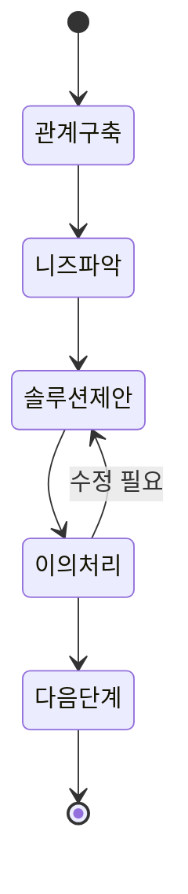
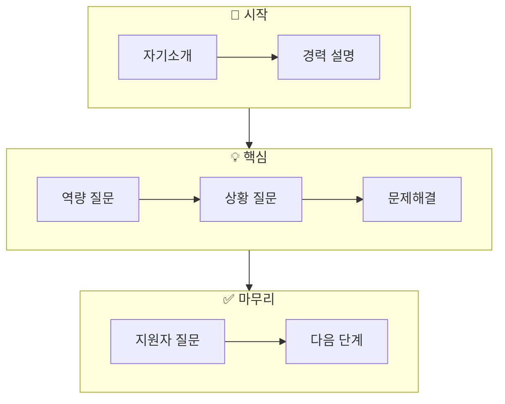
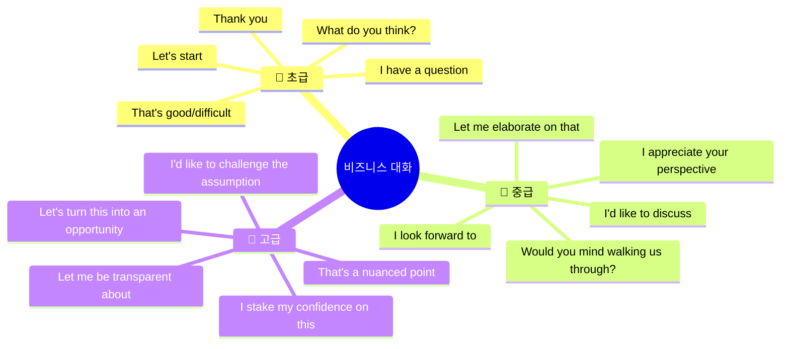

# 💼 비즈니스 영어 상황별 대화 가이드

> **실전 비즈니스 상황별 10턴 대화 완벽 가이드**  
> 회의, 프레젠테이션, 협상, 클라이언트 미팅 등 핵심 상황 마스터

---

## 📋 목차
1. [학습 구조 개요](#학습-구조-개요)
2. [상황 1: 정기 팀 회의](#1-정기-팀-회의-team-meeting)
3. [상황 2: 프레젠테이션](#2-프레젠테이션-presentation)
4. [상황 3: 협상](#3-협상-negotiation)
5. [상황 4: 클라이언트 미팅](#4-클라이언트-미팅-client-meeting)
6. [상황 5: 성과 면담](#5-성과-면담-performance-review)
7. [상황 6: 채용 면접](#6-채용-면접-job-interview)
8. [상황 7: 네트워킹 이벤트](#7-네트워킹-이벤트-networking)
9. [상황 8: 전화 회의](#8-전화-회의-conference-call)

---

## 학습 구조 개요

### 전체 학습 흐름도

### 레벨별 특징

| 레벨 | 특징 | 문장 구조 | 목표 |
|:---:|------|----------|------|
| 🌱 초급 | 간단하고 직접적인 표현 | 기본 문형 | 기본 업무 소통 |
| 🌿 중급 | 정중하고 완성된 표현 | 조동사 + 부가 표현 | 프로페셔널한 대화 |
| 🌳 고급 | 세련되고 외교적인 표현 | 복합 문장 + 뉘앙스 | 임원급 커뮤니케이션 |

---

## 1. 정기 팀 회의 (Team Meeting)

### 상황 흐름도

### 💬 10턴 대화

#### 🌱 초급 버전

| 턴 | 👔 팀장 | 👤 팀원 |
|:---:|--------|--------|
| 1 | Good morning, everyone. Let's start the meeting. | Good morning. |
| 2 | First, let's check last week's progress. John, how's the project? | The project is going well. We finished the design. |
| 3 | Good. Any problems? | Yes, we have a small issue with the budget. |
| 4 | What's the problem? | We need more money for materials. |
| 5 | How much more? | About $5,000. |
| 6 | I see. Let's discuss this later. Sarah, your update? | The marketing plan is ready. |
| 7 | Great. When can we launch? | Next week, if the budget is approved. |
| 8 | OK. Any other issues? | No, we're fine. |
| 9 | Good. John will fix the budget issue. Sarah will prepare the launch. | Understood. |
| 10 | Thank you, everyone. See you next week. | Thank you. Have a good day. |

#### 🌿 중급 버전

| 턴 | 👔 팀장 | 👤 팀원 |
|:---:|--------|--------|
| 1 | Good morning, everyone. Thank you for joining. Let's get started with today's agenda. | Good morning. Thanks for having us. |
| 2 | Let's begin with project updates. John, would you mind giving us a status update? | Of course. I'm happy to report that we've completed the design phase ahead of schedule. |
| 3 | That's excellent news. Were there any challenges along the way? | Yes, we encountered some budget constraints that we need to address. |
| 4 | Could you elaborate on the budget situation? | We're looking at approximately $5,000 additional for materials to maintain quality. |
| 5 | I understand. Let's flag this for follow-up. Sarah, what's the status on marketing? | The marketing plan is finalized and ready for execution. I'd like to walk you through the key points. |
| 6 | Please do. What are the main highlights? | We're focusing on digital channels with a phased rollout starting next week. |
| 7 | That sounds solid. Are there any dependencies we should be aware of? | The launch timeline depends on the budget approval for John's project. |
| 8 | Noted. I'll expedite the budget review. Any other items to discuss? | I'd like to suggest we increase our check-in frequency during the launch period. |
| 9 | Good suggestion. Let's have daily stand-ups next week. John, please prepare a revised budget. | Will do. I'll have it ready by Wednesday. |
| 10 | Perfect. Thank you all for your contributions. Let's reconvene next Monday. | Thank you. Looking forward to it. |

#### 🌳 고급 버전

| 턴 | 👔 팀장 | 👤 팀원 |
|:---:|--------|--------|
| 1 | Good morning, everyone. I appreciate you carving out time for this. Let's dive into today's agenda and make this as efficient as possible. | Good morning. Glad to be here. |
| 2 | I'd like to kick things off with project updates. John, would you mind walking us through where we stand? | Absolutely. I'm pleased to share that we've not only completed the design phase but managed to do so three days ahead of schedule. |
| 3 | That's exceptional work. I imagine it wasn't without its challenges. What hurdles did you face? | The primary challenge has been resource allocation. We've identified a gap in our materials budget that warrants discussion. |
| 4 | I'd like to understand the scope of this. What are we looking at in terms of numbers? | We're looking at roughly $5,000 to maintain our quality standards. I've prepared a detailed breakdown if you'd like to review it. |
| 5 | That would be helpful. Let's circle back on this after Sarah's update. Sarah, where do we stand on the go-to-market strategy? | The strategy is fully baked and ready for execution. I've stress-tested it against various scenarios and I'm confident in our approach. |
| 6 | That's reassuring. What's your recommended timeline, and what are the critical success factors? | We're targeting a soft launch next Wednesday, with a full rollout the following Monday. The key dependency is resolving John's budget situation. |
| 7 | Understood. I'm committed to fast-tracking the budget approval. What's our contingency if there are delays? | I've built in a one-week buffer. We can pivot to a limited launch if necessary, though I'd prefer to avoid that. |
| 8 | Good foresight. Is there anything else that's keeping anyone up at night? | I'd recommend we increase our touchpoints during the launch window. Perhaps daily syncs to address issues in real-time. |
| 9 | I couldn't agree more. Let's implement daily stand-ups starting Monday. John, I'll need that revised budget by COB Wednesday. | Absolutely. I'll also include a risk mitigation plan alongside the budget revision. |
| 10 | Outstanding. This has been a productive session. Let's maintain this momentum. Same time next week, unless anything urgent comes up. | Thank you. I'm feeling optimistic about where we're headed. |

### 📋 핵심 패턴 정리

| 기능 | 🌱 초급 | 🌿 중급 | 🌳 고급 |
|------|--------|--------|--------|
| 회의 시작 | Let's start the meeting. | Let's get started with today's agenda. | Let's dive into today's agenda. |
| 업데이트 요청 | How's the project? | Would you mind giving us a status update? | Would you mind walking us through where we stand? |
| 문제 보고 | We have a problem. | We encountered some challenges. | We've identified a gap that warrants discussion. |
| 후속 조치 | Let's discuss this later. | Let's flag this for follow-up. | Let's circle back on this. |
| 회의 마무리 | See you next week. | Let's reconvene next Monday. | Let's maintain this momentum. |

---

## 2. 프레젠테이션 (Presentation)

### 상황 흐름도

### 💬 10턴 프레젠테이션

#### 🌱 초급 버전

| 턴 | 발표자 | 청중 반응 |
|:---:|--------|----------|
| 1 | Good morning. Thank you for coming. Today I will talk about our Q3 results. | (주목) |
| 2 | First, I will show you the sales numbers. Then, I will explain our challenges. | (고개 끄덕임) |
| 3 | Here is our sales chart. As you can see, sales went up 15% this quarter. | (관심) |
| 4 | This is good news. Our new product did very well in the market. | (메모) |
| 5 | But we also had some problems. Our costs went up by 10%. | (우려 표현) |
| 6 | The main reason is higher material prices. We need to find cheaper suppliers. | Question: What about labor costs? |
| 7 | Good question. Labor costs stayed the same. Only material costs went up. | (이해) |
| 8 | For next quarter, we plan to cut costs by 5%. | Question: How will you do that? |
| 9 | We will find new suppliers and improve our processes. | (고개 끄덕임) |
| 10 | That's all. Thank you for listening. Any more questions? | Thank you. Very informative. |

#### 🌿 중급 버전

| 턴 | 발표자 | 청중 반응 |
|:---:|--------|----------|
| 1 | Good morning, everyone. I appreciate you taking the time to join this presentation. Today, I'll be sharing our Q3 performance analysis. | (주목) |
| 2 | My presentation is divided into three parts: first, our revenue highlights; second, cost analysis; and finally, our strategic outlook. | (메모) |
| 3 | Let me start with the good news. As this chart indicates, we achieved a 15% increase in sales, exceeding our target by 3 percentage points. | Impressive results. |
| 4 | This growth was primarily driven by our new product line, which captured 20% of the market within its first quarter. | (관심) |
| 5 | However, I'd like to draw your attention to some challenges. Our operational costs increased by 10%, putting pressure on margins. | Question: What's driving the cost increase? |
| 6 | Excellent question. The primary driver is a 15% surge in raw material prices, particularly steel and aluminum. | (우려 표현) |
| 7 | We've already initiated discussions with alternative suppliers to mitigate this impact going forward. | Question: What's the timeline for cost reduction? |
| 8 | We're targeting a 5% reduction by Q4, with full implementation by early next year. Let me share our action plan. | (메모) |
| 9 | In summary, strong revenue growth offset by cost pressures. Our focus for Q4 is operational efficiency without compromising quality. | (고개 끄덕임) |
| 10 | That concludes my presentation. I'd be happy to take any questions or discuss specific areas in more detail. | Thank you. Very comprehensive analysis. |

#### 🌳 고급 버전

| 턴 | 발표자 | 청중 반응 |
|:---:|--------|----------|
| 1 | Good morning. Before I begin, I want to acknowledge the exceptional effort our teams have put in this quarter. The results I'm about to share are a testament to that dedication. | (주목) |
| 2 | Over the next 20 minutes, I'll take you through a comprehensive view of our Q3 performance – not just the numbers, but the story behind them and what they mean for our strategic direction. | (관심) |
| 3 | Let's start with what I consider a remarkable achievement. We didn't just meet our revenue targets – we exceeded them by 15%, representing the strongest quarter in our company's five-year history. | That's outstanding. |
| 4 | But beyond the headline numbers, what excites me most is the composition of this growth. Our new product line, launched just 90 days ago, already commands a 20% market share. | Question: What drove such rapid adoption? |
| 5 | Great observation. The answer lies in our customer-centric approach. We spent 18 months listening to customer pain points before designing this product. That investment is paying dividends. | (메모) |
| 6 | Now, let me be transparent about the challenges. Our success came with cost pressures – a 10% increase in operational expenses that we need to address proactively. | What's your mitigation strategy? |
| 7 | I appreciate you asking that directly. We're implementing a three-pronged approach: supplier diversification, process optimization, and strategic automation. I have full confidence this will yield a 5% reduction by Q4. | (이해) |
| 8 | What keeps me optimistic is not just our plan, but our track record. Three years ago, we faced similar pressures and emerged stronger. History suggests we'll do the same here. | (고개 끄덕임) |
| 9 | To conclude, Q3 validated our strategy. The road ahead requires discipline on costs without sacrificing the innovation that got us here. I'm bullish on our trajectory. | (호응) |
| 10 | Thank you for your attention and engagement. I welcome any questions, challenges, or alternative perspectives. This is a dialogue, not a monologue. | Excellent presentation. Very insightful. |

---

## 3. 협상 (Negotiation)

### 상황 흐름도

### 💬 10턴 협상 대화

#### 🌱 초급 버전

| 턴 | 구매자 | 판매자 |
|:---:|--------|--------|
| 1 | Thank you for meeting with us. We want to talk about the contract. | Thank you for coming. We're happy to discuss. |
| 2 | We like your product. But the price is too high. | What price were you thinking? |
| 3 | We want a 20% discount. | That's difficult. We can offer 10%. |
| 4 | 10% is not enough. We're buying a lot. | How much are you planning to order? |
| 5 | 1,000 units per month for one year. | That's a big order. We can do 15%. |
| 6 | Can you include free shipping? | We can do free shipping if you pay upfront. |
| 7 | We prefer to pay in 30 days. | OK, 30 days is fine, but shipping will cost extra. |
| 8 | How much for shipping? | $500 per month. |
| 9 | That works. Can we sign today? | Yes, I'll prepare the contract. |
| 10 | Great. Thank you for the deal. | Thank you. Looking forward to working with you. |

#### 🌿 중급 버전

| 턴 | 구매자 | 판매자 |
|:---:|--------|--------|
| 1 | Thank you for taking the time to meet. We're excited about the potential partnership. | The pleasure is ours. We've heard great things about your company. |
| 2 | We've reviewed your proposal and we're impressed with the quality. However, we need to discuss pricing. | We're certainly open to discussion. What did you have in mind? |
| 3 | Given our projected volume, we believe a 20% discount would be fair for both parties. | I understand your position. While 20% is challenging, we might have some flexibility. Can you share more about your volume commitments? |
| 4 | We're looking at 1,000 units monthly with a 12-month commitment. That's significant volume. | That's definitely substantial. Based on those numbers, I can offer 15% with potential for more as volume increases. |
| 5 | That's a good start. What additional terms would get us closer to our target? | If you could commit to a two-year agreement, I could bump that to 18%. |
| 6 | We'd need some flexibility on payment terms to consider a longer commitment. | What terms are you looking for? |
| 7 | Net 45 would help with our cash flow management. | Net 30 is our standard, but I could approve Net 45 for orders over 500 units. |
| 8 | That works. One more thing – what about shipping costs? | For this volume, I can offer discounted shipping at $300 monthly. |
| 9 | If you can include shipping at no cost, we have a deal. | Tell you what – free shipping for the first year, then we revisit. |
| 10 | That's fair. I believe we have the foundation for a strong partnership. | Agreed. I'll have our legal team draft the agreement by end of week. |

#### 🌳 고급 버전

| 턴 | 구매자 | 판매자 |
|:---:|--------|--------|
| 1 | I appreciate you making time for this discussion. Before we dive into specifics, I'd like to understand your company's priorities for partnerships like ours. | Thank you for that approach. We value partners who think long-term. Our priority is building relationships, not just transactions. |
| 2 | That resonates with us. We've been impressed with your product quality, which is why we're here. That said, the current pricing presents challenges for our business case. | I understand. We've invested significantly in quality, which is reflected in our pricing. But we're always open to creative structuring. What challenges are you facing? |
| 3 | Our board has approved a budget that requires approximately 20% cost reduction to make the numbers work. I want to be transparent about our constraints. | I appreciate the candor. While 20% is beyond our standard flexibility, let's explore how we might bridge that gap through value creation rather than pure price reduction. |
| 4 | I'm listening. What did you have in mind? | If you could commit to 1,000 units monthly over 24 months, we could structure this with volume tiers that progressively approach your target. Year one at 15%, escalating to 20% in year two based on performance. |
| 5 | That's creative thinking. However, a 24-month commitment introduces risk for us. How can we mitigate that? | Fair point. We could include a performance clause – if we miss quality benchmarks or delivery commitments, you get an early exit option at month 18. |
| 6 | That addresses one concern. We'd also need favorable payment terms to justify the longer commitment. | What structure would work for your cash flow needs? |
| 7 | Net 60 would provide the flexibility we need. I realize that's aggressive, but we're offering significant volume commitment in return. | Net 60 stretches our standard terms, but I can make it work if you agree to automatic ACH payments and provide a corporate guarantee. |
| 8 | We can work with that. The final piece is logistics. Shipping costs on this volume could materially impact our savings. | Here's my proposal: complimentary shipping for the duration of the agreement, provided monthly orders meet the 1,000 unit threshold. |
| 9 | I think we're aligned on all major points. Before I commit, I need to confirm with my CFO, but I'm optimistic this will close by end of week. | I understand the need for internal alignment. I'll hold these terms until Friday. If there's anything that helps move the decision, I'm a phone call away. |
| 10 | Thank you for your flexibility and partnership approach. This sets the foundation for a relationship that will benefit both organizations. | The feeling is mutual. Regardless of outcome, I've enjoyed this negotiation. It's been refreshingly collaborative. |

---

## 4. 클라이언트 미팅 (Client Meeting)

### 상황 흐름도

### 💬 10턴 클라이언트 미팅 대화

#### 🌿 중급 버전

| 턴 | 서비스 제공자 | 클라이언트 |
|:---:|-------------|----------|
| 1 | Thank you for meeting with us today, Ms. Johnson. How has your quarter been going? | It's been busy but productive. Thank you for asking. |
| 2 | I'm glad to hear that. I've been reviewing your account and wanted to discuss some opportunities I've identified. | I'd be interested to hear your thoughts. |
| 3 | Based on your growth trajectory, I believe our premium support package could add significant value to your operations. | We've considered premium support before. What makes this the right time? |
| 4 | Great question. Your transaction volume has increased 40% this year. Our data shows companies at your scale see 25% fewer issues with premium support. | Those numbers are compelling. What's the investment required? |
| 5 | The premium package is $2,000 monthly, which typically pays for itself within three months through reduced downtime. | That's higher than I expected. What flexibility do you have? |
| 6 | I understand budget considerations. If you commit annually, I can offer a 15% discount, bringing it to $1,700 monthly. | That's more workable. What exactly is included? |
| 7 | You'd get 24/7 dedicated support, a named account manager – that would be me – and priority response times of under 2 hours. | The dedicated support is appealing. Can we try it for a quarter before committing annually? |
| 8 | Absolutely. We offer a 90-day pilot at the monthly rate. If you convert to annual, we'll credit the difference. | That sounds reasonable. What's the process to get started? |
| 9 | I can have the agreement ready by tomorrow. Implementation takes about a week, and I'll personally oversee the transition. | Let's proceed with the pilot. I'll discuss the annual option with my team after we see results. |
| 10 | Perfect. I'll send over the paperwork today. Thank you for your trust in us. Is there anything else I can help with? | That covers it for today. Thank you for the proactive approach. |

---

## 5. 성과 면담 (Performance Review)

### 💬 10턴 성과 면담 대화

#### 🌿 중급 버전

| 턴 | 매니저 | 직원 |
|:---:|--------|------|
| 1 | Thanks for making time for our quarterly review, Sarah. How do you feel about your performance this quarter? | I feel pretty good overall, though there are areas I'd like to improve. |
| 2 | I appreciate that self-awareness. Let's start with the positives. Your project delivery has been exceptional. | Thank you. I worked hard on improving my project management skills. |
| 3 | It shows. The client feedback on the Anderson project was outstanding. They specifically mentioned your responsiveness. | That's great to hear. I made client communication a priority. |
| 4 | Now, let's discuss growth opportunities. I've noticed some challenges with cross-team collaboration. | I agree. I've been so focused on my deliverables that I haven't engaged enough with other teams. |
| 5 | I'm glad you recognize that. Collaboration will be crucial as you move toward more senior roles. | What would you suggest to improve in this area? |
| 6 | I'd recommend attending other teams' stand-ups and volunteering for cross-functional projects. | That makes sense. I'd like to join the Q1 product launch team if possible. |
| 7 | I'll make that happen. Now, let's talk about your goals for next quarter. What do you want to achieve? | I'd like to lead a project independently and improve my presentation skills. |
| 8 | Those are excellent goals. For the project lead opportunity, the Thompson account could be a good fit. | I'd appreciate that opportunity. What would success look like? |
| 9 | Delivering on time and budget, while maintaining client satisfaction scores above 90%. | I'm confident I can achieve that. I'll create a detailed plan. |
| 10 | Perfect. Let's schedule a check-in in 6 weeks to monitor progress. Thank you, Sarah. Keep up the great work. | Thank you for the feedback and opportunities. I'm excited about next quarter. |

---

## 6. 채용 면접 (Job Interview)

### 상황 흐름도

### 💬 10턴 채용 면접 대화

#### 🌿 중급 버전

| 턴 | 면접관 | 지원자 |
|:---:|--------|--------|
| 1 | Thanks for coming in today. Please, tell me about yourself and what brought you to this opportunity. | Thank you for having me. I'm a marketing professional with 5 years of experience in digital marketing. I'm excited about this role because of your company's innovative approach. |
| 2 | What specific aspects of our company attracted you? | Your recent campaign for the eco-friendly product line really stood out. The storytelling approach aligned with my passion for purpose-driven marketing. |
| 3 | That's great to hear. Can you walk me through your most successful campaign? | At my current company, I led a product launch that generated 3 million impressions and a 25% increase in sales within 90 days. |
| 4 | Impressive results. What was your specific role in achieving those outcomes? | I developed the overall strategy, managed the creative team, and coordinated with sales on timing and messaging. |
| 5 | Tell me about a time you faced a significant challenge at work. How did you handle it? | During that campaign, our main ad platform had a policy change that affected our targeting. I quickly pivoted our strategy to alternative channels and actually improved our ROI. |
| 6 | How do you stay current with digital marketing trends? | I follow industry leaders on LinkedIn, attend webinars, and recently completed a certification in data analytics to strengthen my skills. |
| 7 | Where do you see yourself in five years? | I'd like to be leading a marketing team, driving strategy for major initiatives. This role feels like the right step toward that goal. |
| 8 | What questions do you have for me about the role or company? | I'd love to understand the team structure and what success looks like in this position during the first year. |
| 9 | The team is 12 people, and success means hitting our lead generation targets while building brand awareness in new markets. | That's helpful context. What's the timeline for the hiring decision? |
| 10 | We're interviewing through next week and hope to make a decision within two weeks. Thank you for coming in – it was a pleasure meeting you. | Thank you for the opportunity. I'm very excited about this position and look forward to hearing from you. |

---

## 7. 네트워킹 이벤트 (Networking)

### 💬 10턴 네트워킹 대화

#### 🌿 중급 버전

| 턴 | 참가자 A | 참가자 B |
|:---:|---------|---------|
| 1 | Hi, I don't think we've met. I'm Michael from Acme Solutions. | Nice to meet you, Michael. I'm Lisa from TechStart. Great event, isn't it? |
| 2 | It really is. The keynote was particularly insightful. What did you think? | I found the part about AI in business quite relevant to what we're working on. |
| 3 | Oh, interesting. What does your company do? | We're a startup focused on AI-powered customer service solutions. What about Acme? |
| 4 | We're in enterprise software, actually. Your work sounds fascinating. How long have you been at TechStart? | About two years. I joined as employee number 15, and we're now at 80. |
| 5 | That's impressive growth. What's been the biggest challenge in scaling? | Maintaining our culture while growing so fast. We've had to be intentional about it. |
| 6 | I can relate. We went through similar growing pains. How are you addressing it? | Lots of communication and keeping our core values front and center in hiring decisions. |
| 7 | That's smart. I'm curious – are you looking for enterprise partnerships? | Actually, yes. We're starting to move up-market. Is that something Acme explores? |
| 8 | We do. We're always looking for innovative solutions to integrate. Do you have a card? | I do. And I'd love to learn more about Acme's integration capabilities. |
| 9 | Happy to share. Would you be open to a follow-up call next week? | Absolutely. Tuesday or Wednesday would work well for me. |
| 10 | Let's aim for Tuesday at 2 PM. I'll send you a calendar invite. Great meeting you, Lisa. | Likewise, Michael. I'm looking forward to our conversation. Enjoy the rest of the event. |

---

## 8. 전화 회의 (Conference Call)

### 💬 10턴 전화 회의 대화

#### 🌿 중급 버전

| 턴 | 회의 주재자 | 참석자들 |
|:---:|------------|---------|
| 1 | Good morning, everyone. Can everyone hear me okay? | Yes, all good here. / Clear from my end. / Can hear you fine. |
| 2 | Great. Let me do a quick roll call. Sarah from Marketing? | Here. |
| 3 | John from Operations? | Present. Apologies for the background noise – I'm joining from the airport. |
| 4 | No worries, John. Thanks for joining despite traveling. Let's dive in. The main topic today is the Q4 launch timeline. | (Silence indicating attention) |
| 5 | Sarah, can you update us on the marketing readiness? | We're about 80% ready. Creative assets are done, but we're waiting on final product specs for the website copy. |
| 6 | John, when can marketing expect those specs? | Sorry, you cut out for a second. Could you repeat that? |
| 7 | Of course. When will marketing receive the final product specs? | We should have everything finalized by end of day Thursday. |
| 8 | That works. Sarah, will Thursday give you enough time? | It'll be tight, but yes. We can launch website updates over the weekend. |
| 9 | Perfect. Any other concerns or blockers we should discuss? | One thing from my end – can we get 10 minutes on the executive call tomorrow to align on messaging? |
| 10 | Absolutely. I'll add you to the agenda. Anything else? (Silence) Great. Thanks everyone. Let's keep the momentum going. Talk soon. | Thanks, everyone. / Good call. / Bye for now. |

---

## 📊 전체 요약

### 레벨별 핵심 패턴 총정리

### 상황별 가장 중요한 패턴 TOP 3

| 상황 | TOP 1 | TOP 2 | TOP 3 |
|------|-------|-------|-------|
| 팀 회의 | Let's get started | Can you give us a status update? | Let's flag this for follow-up |
| 프레젠테이션 | Let me walk you through | The key takeaway is | I'd be happy to take questions |
| 협상 | We're looking for a win-win | What flexibility do you have? | I think we have a deal |
| 클라이언트 미팅 | I've identified some opportunities | What challenges are you facing? | Thank you for your trust |
| 성과 면담 | Let's discuss growth opportunities | What would success look like? | Keep up the great work |
| 채용 면접 | Tell me about yourself | Walk me through your experience | What questions do you have? |
| 네트워킹 | What brings you here? | I'd love to learn more | Let's follow up next week |
| 전화 회의 | Can everyone hear me? | Could you repeat that? | Any other concerns or blockers? |

---

## 💡 학습 팁

### ✅ 효과적인 학습 방법

1. **상황별 반복** - 같은 상황을 초급→중급→고급으로 연습
2. **역할 바꿔 연습** - 양쪽 역할 모두 연습하기
3. **녹음해서 듣기** - 자신의 표현을 객관적으로 평가
4. **핵심 패턴 암기** - 상황별 TOP 3 패턴부터 시작
5. **실전 적용** - 실제 업무 상황에서 즉시 사용

### 📅 4주 학습 로드맵

| 주차 | 학습 상황 | 목표 |
|:---:|----------|------|
| 1주 | 팀 회의 + 프레젠테이션 | 일상 업무 소통 마스터 |
| 2주 | 협상 + 클라이언트 미팅 | 외부 커뮤니케이션 강화 |
| 3주 | 성과 면담 + 채용 면접 | HR 관련 대화 연습 |
| 4주 | 네트워킹 + 전화 회의 | 전체 복습 및 실전 적용 |

---

*Last Updated: 2026-01-10*

