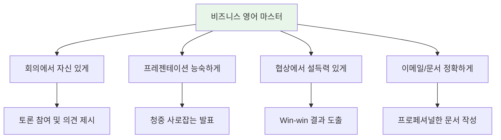
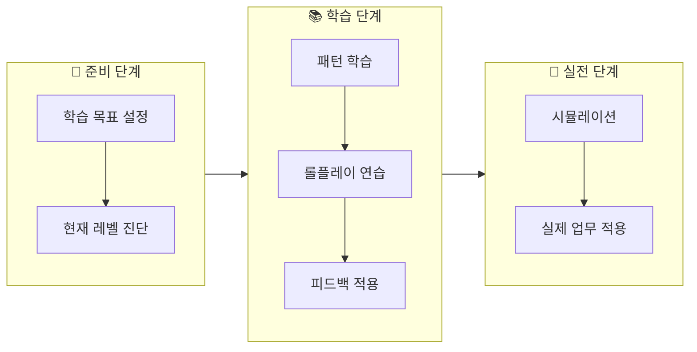
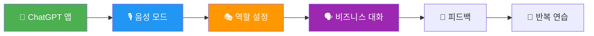

# 💼 화상 비즈니스 영어 학습 가이드

> **ChatGPT와 함께하는 1:1 비즈니스 영어 회화 마스터**  
> 실전 비즈니스 상황에서 자신감 있게 영어로 소통하기

---

## 📋 목차
1. [학습 가이드 개요](#학습-가이드-개요)
2. [ChatGPT 활용법](#chatgpt-활용법)
3. [상황별 회화 프롬프트](#상황별-회화-프롬프트)
4. [레벨별 학습 계획](#레벨별-학습-계획)
5. [발음 및 억양 연습](#발음-및-억양-연습)
6. [학습 완료 체크리스트](#학습-완료-체크리스트)

---

## 학습 가이드 개요

### 🎯 학습 목표



### 📊 레벨별 학습 로드맵

| 단계 | 레벨 | 목표 | 기간 |
|:---:|:---:|------|:---:|
| 1 | 초급 | 기본 업무 소통 | 4주 |
| 2 | 중급 | 미팅/프레젠테이션 | 6주 |
| 3 | 고급 | 협상/리더십 | 6주 |
| 4 | 마스터 | 글로벌 비즈니스 | 4주 |

### 학습 흐름도



---

## ChatGPT 활용법

### 🎙️ 음성 모드 활용

| 기능 | 활용법 | 효과 |
|------|--------|------|
| **실시간 대화** | ChatGPT 앱에서 음성 버튼 탭 | 실제 회의처럼 연습 |
| **발음 피드백** | 음성으로 말하고 교정 요청 | 발음 개선 |
| **속도 조절** | "Speak more slowly" 요청 | 청취력 향상 |
| **반복 청취** | "Can you repeat that?" | 듣기 연습 |

### 📱 효과적인 학습 설정



---

## 상황별 회화 프롬프트

### 🎭 기본 튜터 설정

```
당신은 저의 비즈니스 영어 회화 튜터입니다.

📌 기본 규칙:
1. 모든 대화는 영어로 진행해주세요
2. 비즈니스에 적합한 표현을 사용해주세요
3. 제가 틀린 표현을 쓰면 즉시 교정해주세요
4. 더 프로페셔널한 표현이 있으면 알려주세요
5. 저의 레벨: 중급 (업무 회화 가능)

지금부터 비즈니스 영어 회화를 연습하겠습니다.
준비되면 "Let's begin!"이라고 말해주세요.
```

### 💼 상황 1: 팀 미팅

```
🎭 역할: 팀 리더 / 프로젝트 매니저

상황: 주간 팀 회의를 진행합니다.
- 참석자: 5명의 팀원
- 목적: 프로젝트 진행 상황 공유 및 이슈 논의
- 시간: 30분

연습할 내용:
1. 회의 시작 및 안건 공유
2. 팀원에게 업데이트 요청
3. 이슈 논의 및 해결책 도출
4. 액션 아이템 정리
5. 회의 마무리

대화가 끝나면 제가 사용한 표현을 평가해주세요.
더 프로페셔널한 표현도 제안해주세요.

시작해주세요!
```

### 📊 상황 2: 프레젠테이션

```
🎭 역할: 청중 (경영진)

상황: 분기 실적 프레젠테이션을 합니다.
- 청중: CEO 포함 경영진 5명
- 시간: 15분 발표 + 5분 Q&A
- 내용: Q3 실적 및 Q4 계획

연습할 내용:
1. 강력한 오프닝
2. 데이터 기반 설명
3. 핵심 메시지 전달
4. Q&A 대응
5. 설득력 있는 마무리

ChatGPT는 경영진으로서 질문하고 반응해주세요.
까다로운 질문도 포함해주세요!

제 발표가 끝나면 피드백을 주세요.
시작: "Good afternoon, everyone."
```

### 🤝 상황 3: 클라이언트 미팅

```
🎭 역할: 클라이언트 (까다로운 타입)

상황: 중요 클라이언트와 계약 갱신 미팅입니다.
- 클라이언트: 주요 거래처, 연간 매출 20%
- 이슈: 서비스 품질 불만, 가격 재협상 요청
- 목표: 관계 유지 및 계약 갱신

연습할 상황:
1. 관계 구축 (Small talk)
2. 불만 경청 및 대응
3. 해결책 제시
4. 가격 협상
5. 합의 도출

난이도 선택:
- Easy: 클라이언트가 협조적
- Normal: 클라이언트가 요구사항 많음
- Hard: 클라이언트가 계약 해지 고려 중

난이도를 선택해주세요!
```

### 💰 상황 4: 협상

```
🎭 역할: 협상 상대방 (벤더/파트너)

상황: 공급 계약 협상을 진행합니다.
- 상대방: 주요 공급업체
- 쟁점: 가격, 납기, 품질 보증
- 목표: 15% 원가 절감

협상 진행:
1. 관계 구축
2. 니즈 파악
3. 제안 및 반제안
4. 타협점 도출
5. 합의 및 마무리

ChatGPT 가이드라인:
- 처음엔 5% 이상 할인 불가 입장
- 대량 주문 시 추가 할인 여지 있음
- Win-win 해결책 모색

시작해주세요!
```

### 📞 상황 5: 화상 회의 (Conference Call)

```
🎭 역할: 참석자들 (다국적 팀)

상황: 글로벌 팀과 화상 회의입니다.
- 참석자: 미국, 유럽, 아시아 팀 (6명)
- 목적: 글로벌 출시 전략 논의
- 도전: 시차, 문화 차이, 기술 이슈

연습할 상황:
1. 미팅 시작 및 출석 확인
2. 오디오/비디오 이슈 대응
3. 시차를 고려한 스케줄 조율
4. 문화적 차이 존중하며 토론
5. 합의 및 다음 단계 정리

ChatGPT는 다양한 억양과 커뮤니케이션 스타일로 연기해주세요!
```

### 👔 상황 6: 면접 (면접자)

```
🎭 역할: 면접관 (HR + 팀장)

상황: 외국계 회사 면접입니다.
- 포지션: Senior Marketing Manager
- 면접관: HR Director + Marketing VP
- 형식: 영어 인터뷰

예상 질문:
1. Tell me about yourself.
2. Why are you interested in this position?
3. Tell me about a challenging project.
4. How do you handle conflict?
5. Where do you see yourself in 5 years?
6. What questions do you have?

ChatGPT는 현실적인 면접관으로:
- Follow-up 질문하기
- 답변에 대한 즉각 반응
- 마지막에 피드백 제공

시작해주세요!
```

### 📧 상황 7: 이메일 작성 연습

```
🎭 역할: 비즈니스 이메일 코치

상황별 이메일 작성 연습:

1. 미팅 요청 이메일
2. 사과 이메일
3. 협상/제안 이메일
4. 불만 대응 이메일
5. 프로젝트 업데이트 이메일

연습 방식:
1. 상황 설명을 드립니다
2. 제가 이메일을 작성합니다
3. ChatGPT가 평가합니다:
   - 문법/어휘 체크
   - 톤 적절성 평가
   - 개선 제안
   - 모범 답안 제시

시작할 상황을 선택해주세요!
```

### 🌐 상황 8: 해외 출장

```
🎭 역할: 상황에 맞는 다양한 역할

상황: 미국 본사 출장 (3일)

Day 1:
- 공항 체크인
- 비행기 (기내 서비스)
- 호텔 체크인
- 환영 만찬

Day 2:
- 아침 미팅
- 본사 투어
- 경영진 프레젠테이션
- 비즈니스 디너

Day 3:
- 협상 미팅
- 마무리 및 공항

각 상황에서 적절한 영어 사용!
비즈니스 + 소셜 영어 모두 연습합니다.

시작!
```

---

## 레벨별 학습 계획

### 📚 초급 (4주 과정)

```mermaid
gantt
    title 초급 학습 계획 (4주)
    dateFormat  X
    axisFormat %s주차
    
    section 기초
    인사/소개 표현     :1, 2
    전화 응대 기본     :2, 3
    
    section 업무
    이메일 기초        :2, 3
    미팅 기본 표현     :3, 4
    
    section 실전
    종합 롤플레이      :4, 5
```



#### 주차별 학습 내용

| 주차 | 학습 주제 | 목표 패턴 | 실습 |
|:---:|----------|:--------:|------|
| 1주 | 인사/자기소개 | 25개 | 자기소개 연습 |
| 2주 | 전화/이메일 기초 | 30개 | 전화 롤플레이 |
| 3주 | 미팅 기본 표현 | 30개 | 미팅 참석자 역할 |
| 4주 | 종합 복습 | 전체 | 하루 시뮬레이션 |

### 📚 중급 (6주 과정)

#### 주차별 학습 내용

| 주차 | 학습 주제 | 목표 패턴 | 실습 |
|:---:|----------|:--------:|------|
| 1주 | 미팅 진행/참여 | 30개 | 미팅 리더 역할 |
| 2주 | 프레젠테이션 기초 | 30개 | 5분 발표 연습 |
| 3주 | 클라이언트 미팅 | 25개 | 클라이언트 응대 |
| 4주 | 피드백/보고 | 25개 | 상사에게 보고 |
| 5주 | 문제 해결 | 20개 | 위기 대응 연습 |
| 6주 | 종합 실전 | 전체 | 하루 시뮬레이션 |

### 📚 고급 (6주 과정)

#### 주차별 학습 내용

| 주차 | 학습 주제 | 목표 패턴 | 실습 |
|:---:|----------|:--------:|------|
| 1주 | 협상 기술 | 30개 | 가격 협상 |
| 2주 | 설득/주장 | 30개 | 제안 프레젠테이션 |
| 3주 | 리더십 표현 | 30개 | 팀 동기부여 |
| 4주 | 위기 관리 | 25개 | 위기 대응 시뮬레이션 |
| 5주 | 외교적 표현 | 30개 | 민감한 피드백 전달 |
| 6주 | 종합 마스터 | 전체 | 복합 시뮬레이션 |

### 📚 마스터 (4주 과정)

#### 주차별 학습 내용

| 주차 | 학습 주제 | 목표 패턴 | 실습 |
|:---:|----------|:--------:|------|
| 1주 | 글로벌 비즈니스 | 25개 | 해외 파트너 미팅 |
| 2주 | 임원급 커뮤니케이션 | 25개 | 이사회 발표 |
| 3주 | 복잡한 협상 | 25개 | M&A 협상 시뮬레이션 |
| 4주 | 전체 마스터 | 전체 | 해외 출장 시뮬레이션 |

---

## 발음 및 억양 연습

### 🎤 비즈니스 영어 발음 연습

```
[비즈니스 영어 발음 연습]

📌 규칙:
1. 문장을 읽어주세요 (자연스러운 속도)
2. 저는 따라 말합니다
3. 발음, 억양, 강세 피드백
4. 3번 반복 후 다음으로

오늘의 표현 5개:
1. "I'd like to schedule a meeting."
2. "Could you elaborate on that point?"
3. "We need to address this issue immediately."
4. "I appreciate your feedback."
5. "Let's circle back to that later."

━━━━━━━━━━━━━━━━━━━━━━━━━━━━

발음 포인트:
- 연음 (연결 발음)
- 강세 위치
- 억양 패턴
- 적절한 포즈

시작!
```

### 🔤 비즈니스 영어 핵심 발음

| 발음 | 틀리기 쉬운 단어 | 올바른 발음 |
|------|-----------------|------------|
| **-tion** | presentation, negotiation | /ʃən/ |
| **th-** | think, through | 혀를 이 사이에 |
| **-ed** | scheduled, discussed | /d/ or /t/ or /ɪd/ |
| **stress** | DEvelop, preSENT | 강세 위치 중요 |

### 🎵 억양 연습

```
[비즈니스 영어 억양 연습]

📌 목표: 프로페셔널하고 자신감 있는 억양

━━━━━━━━━━━━━━━━━━━━━━━━━━━━

[패턴 1] 질문의 억양
- Yes/No 질문: 끝이 올라감 ↗
  "Can you send me the report?"
  
- Wh- 질문: 끝이 내려감 ↘
  "What time is the meeting?"

[패턴 2] 강조 억양
- 핵심 단어에 강세
  "This is VERY important."
  "We NEED to act NOW."

[패턴 3] 목록 억양
- 중간은 올라가고, 마지막은 내려감
  "We discussed marketing↗, sales↗, and finance↘."

각 패턴을 연습해주세요!
```

---

## 학습 완료 체크리스트

### ✅ 일일 학습 완료 프롬프트

```
오늘 학습을 마무리합니다.

다음을 정리해주세요:
1. 오늘 배운 핵심 표현 5개
2. 제가 자주 틀린 부분
3. 내일 복습할 표현
4. 오늘 대화 점수 (10점 만점)
5. 개선을 위한 구체적 팁

마지막으로 격려의 말도 해주세요! 💪
```

### ✅ 주간 점검 체크리스트

```
[주간 학습 점검]

📊 이번 주 학습 현황:

| 항목 | 목표 | 달성 |
|------|------|------|
| 패턴 학습 | 30개 | __개 |
| 롤플레이 | 5회 | __회 |
| 이메일 작성 | 3개 | __개 |

📈 이번 주 성과:
- 가장 잘한 것:
- 개선할 점:
- 다음 주 목표:

피드백을 바탕으로 다음 주 학습 계획을 세워주세요!
```

### ✅ 월간 실력 점검

```
[월간 실력 점검 테스트]

📌 종합 테스트 (30분)

[Part 1] 패턴 테스트 (10문제, 5분)
- 빈칸 채우기 5문제
- 한→영 변환 5문제

[Part 2] 롤플레이 (15분)
- 무작위 비즈니스 상황 3개
- 각 상황 5분씩

[Part 3] 이메일 작성 (10분)
- 주어진 상황에 맞는 이메일 1개

━━━━━━━━━━━━━━━━━━━━━━━━━━━━

총점: ___/100

등급:
- 90점 이상: Excellent (승급 추천)
- 80점 이상: Good (현재 레벨 유지)
- 70점 이상: Satisfactory (추가 연습 필요)
- 70점 미만: Needs Improvement (복습 권장)

시작해주세요!
```

---

## 💡 Pro Tips

### ✅ 효과적인 학습법

1. **매일 30분** - 짧더라도 매일 꾸준히
2. **음성으로 연습** - 타이핑보다 말하기
3. **실제 업무에 적용** - 배운 표현 바로 사용
4. **피드백 기록** - 개선점 노트 정리
5. **단계적 난이도** - 쉬운 것부터 차근차근

### 🎯 상황별 집중 포인트

| 상황 | 집중해야 할 것 |
|------|---------------|
| 미팅 | 명확한 의사 전달 |
| 프레젠테이션 | 자신감, 청중 연결 |
| 협상 | 논리적 주장, 유연성 |
| 이메일 | 간결함, 공손함 |
| 네트워킹 | 관계 구축, 편안함 |

### ❌ 피해야 할 것들

1. 완벽주의 - 틀려도 말하기
2. 직역 - 영어식 사고 연습
3. 회피 - 어려운 상황 피하지 않기
4. 급함 - 차분하게 말하기

---

## 📱 Quick Start

지금 바로 시작하세요! 아래 프롬프트를 복사해서 ChatGPT에 붙여넣으세요:

```
안녕하세요! 저는 비즈니스 영어 회화를 연습하고 싶습니다.

📌 저의 정보:
- 영어 레벨: 중급 (업무 회화 가능)
- 연습 시간: 30분
- 오늘 주제: 팀 미팅 진행

📌 요청사항:
1. 영어로 대화해주세요
2. 비즈니스에 적합한 표현 사용
3. 틀리면 바로 교정해주세요
4. 더 프로페셔널한 표현 제안
5. 마지막에 종합 피드백

오늘 저는 팀 리더로서 주간 회의를 진행합니다.
참석자는 5명의 팀원입니다.

지금 회의를 시작하겠습니다!
"Good morning, everyone. Let's get started."
```

---

## 📚 학습 자료 연결

이 가이드와 함께 활용하세요:

| 자료 | 내용 | 난이도 |
|------|------|:------:|
| [기초 패턴 200](business-english-patterns-basic.md) | 신입/초급 표현 | ⭐ |
| [중급 패턴 200](business-english-patterns-intermediate.md) | 중급 표현 | ⭐⭐ |
| [고급 패턴 200](business-english-patterns-advanced.md) | 임원급 표현 | ⭐⭐⭐ |
| [상황별 대화](business-english-conversations.md) | 10턴 대화 예시 | ⭐⭐ |
| [이메일 템플릿](business-email-templates.md) | 50개 이메일 예시 | ⭐⭐ |
| [학습 프롬프트](business-english-prompts.md) | ChatGPT 활용법 | All |

---

*Global Business Communication Made Easy! 🌍*

*Last Updated: 2026-01-10*

