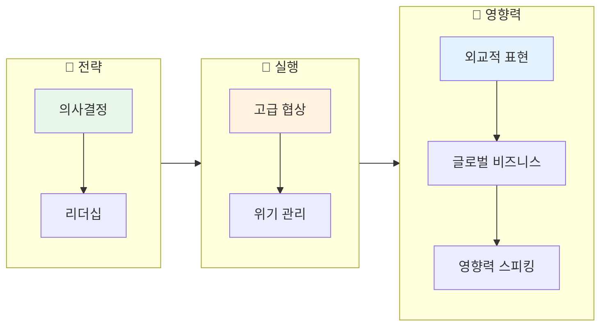
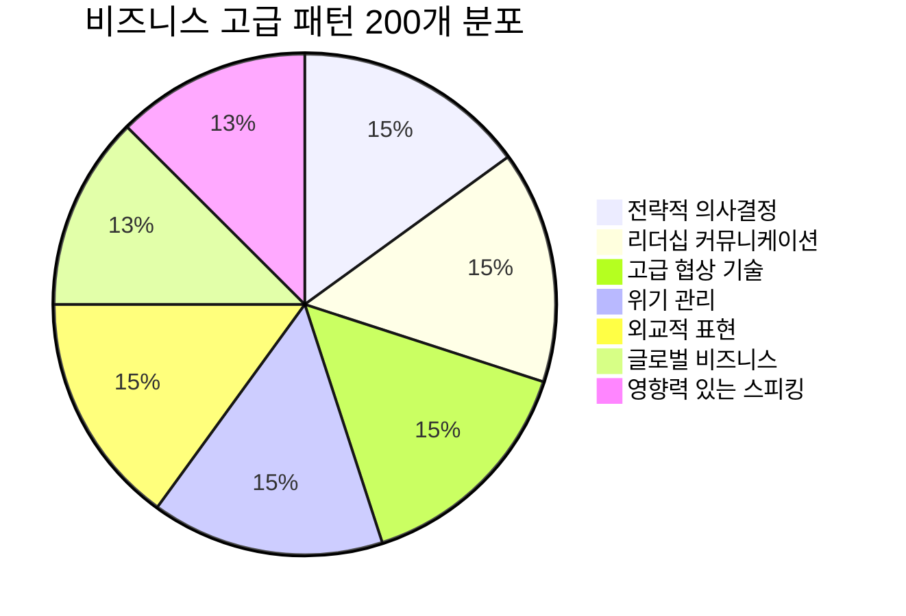
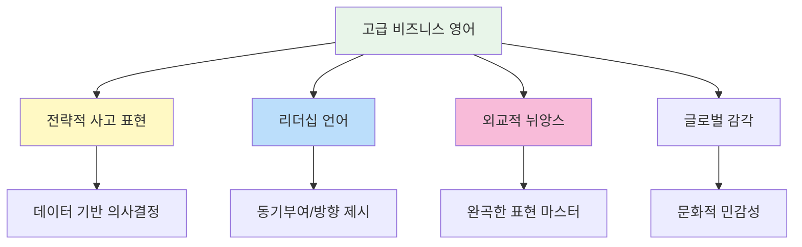

# 🎯 비즈니스 영어 고급 패턴 200선

> **글로벌 비즈니스 리더를 위한 전문 영어 표현**  
> 임원/매니저급 수준의 고급 비즈니스 회화 패턴 (중상급~고급)

---

## 📋 목차
1. [전략적 의사결정](#-전략적-의사결정-patterns-1-30)
2. [리더십 커뮤니케이션](#-리더십-커뮤니케이션-patterns-31-60)
3. [고급 협상 기술](#-고급-협상-기술-patterns-61-90)
4. [위기 관리](#-위기-관리-patterns-91-120)
5. [외교적 표현](#-외교적-표현-patterns-121-150)
6. [글로벌 비즈니스](#-글로벌-비즈니스-patterns-151-175)
7. [영향력 있는 스피킹](#-영향력-있는-스피킹-patterns-176-200)

---

## 학습 흐름도

---

## 🎯 전략적 의사결정 (Patterns 1-30)

### 비전 제시 (1-12)

| No. | 패턴 | 예문 | 한국어 뜻 |
|:---:|------|------|----------|
| 1 | Our vision is to [비전]. | Our vision is to become the market leader by 2027. | 우리의 비전은 ~입니다. |
| 2 | We need to think strategically about [주제]. | We need to think strategically about our market positioning. | ~에 대해 전략적으로 생각해야 합니다. |
| 3 | The big picture here is [내용]. | The big picture here is digital transformation. | 큰 그림은 ~입니다. |
| 4 | In the long run, [결과]. | In the long run, this will strengthen our competitive advantage. | 장기적으로 ~할 것입니다. |
| 5 | We must position ourselves for [목표]. | We must position ourselves for sustainable growth. | ~를 위해 입지를 다져야 합니다. |
| 6 | This aligns with our strategic objectives. | This initiative aligns with our strategic objectives. | 이것은 전략적 목표와 일치합니다. |
| 7 | We're at a pivotal moment. | We're at a pivotal moment in our company's history. | 중대한 전환점에 있습니다. |
| 8 | The landscape is shifting. | The competitive landscape is shifting rapidly. | 환경이 변화하고 있습니다. |
| 9 | We need to be proactive rather than reactive. | We need to be proactive rather than reactive to market changes. | 대응적이 아닌 선제적이어야 합니다. |
| 10 | Let's take a step back and look at this holistically. | Let's take a step back and look at this holistically. | 한 발 물러서 전체적으로 봅시다. |
| 11 | We need to differentiate ourselves. | We need to differentiate ourselves from competitors. | 차별화가 필요합니다. |
| 12 | This is a game-changer for our industry. | This technology is a game-changer for our industry. | 이것은 업계의 판도를 바꿉니다. |

### 의사결정 프레임워크 (13-22)

| No. | 패턴 | 예문 | 한국어 뜻 |
|:---:|------|------|----------|
| 13 | Let's weigh the trade-offs. | Let's weigh the trade-offs before making a decision. | 장단점을 따져봅시다. |
| 14 | What are the implications of [결정]? | What are the implications of this decision on our cash flow? | ~의 영향은 무엇인가요? |
| 15 | We need to consider the opportunity cost. | We need to consider the opportunity cost of not acting. | 기회비용을 고려해야 합니다. |
| 16 | From a risk-reward standpoint... | From a risk-reward standpoint, this makes sense. | 위험-보상 관점에서... |
| 17 | Let's do a cost-benefit analysis. | Let's do a cost-benefit analysis before proceeding. | 비용-편익 분석을 합시다. |
| 18 | We need to assess the feasibility. | We need to assess the feasibility of this proposal. | 실행 가능성을 평가해야 합니다. |
| 19 | What's the ROI on this investment? | What's the expected ROI on this investment? | 이 투자의 ROI는 무엇인가요? |
| 20 | This requires due diligence. | This acquisition requires thorough due diligence. | 철저한 실사가 필요합니다. |
| 21 | Let's scenario-plan for different outcomes. | Let's scenario-plan for different market conditions. | 다양한 결과를 시나리오로 계획합시다. |
| 22 | We need a contingency plan. | We need a contingency plan in case things don't go as expected. | 비상 계획이 필요합니다. |

### 결정 커뮤니케이션 (23-30)

| No. | 패턴 | 예문 | 한국어 뜻 |
|:---:|------|------|----------|
| 23 | After careful consideration, we've decided to [결정]. | After careful consideration, we've decided to expand overseas. | 신중한 검토 후, ~하기로 결정했습니다. |
| 24 | The rationale behind this decision is [이유]. | The rationale behind this decision is market demand. | 이 결정의 근거는 ~입니다. |
| 25 | This is not a decision we've taken lightly. | This is not a decision we've taken lightly. | 가볍게 내린 결정이 아닙니다. |
| 26 | While there are risks, the potential upside is significant. | While there are risks, the potential upside is significant. | 위험이 있지만, 잠재적 이점이 큽니다. |
| 27 | We've explored all options and believe this is the best path forward. | We've explored all options and believe this is the best path. | 모든 선택지를 검토했고 이것이 최선입니다. |
| 28 | I'm fully committed to this direction. | I'm fully committed to this strategic direction. | 이 방향에 전적으로 동의합니다. |
| 29 | I stand behind this decision. | I stand behind this decision and take full responsibility. | 이 결정을 지지하며 책임지겠습니다. |
| 30 | Let's move forward with confidence. | Let's move forward with confidence in our strategy. | 자신감을 갖고 진행합시다. |

---

## 👔 리더십 커뮤니케이션 (Patterns 31-60)

### 팀 동기부여 (31-42)

| No. | 패턴 | 예문 | 한국어 뜻 |
|:---:|------|------|----------|
| 31 | I believe in this team's ability to [능력]. | I believe in this team's ability to deliver results. | 이 팀이 ~할 수 있다고 믿습니다. |
| 32 | Together, we can achieve [목표]. | Together, we can achieve remarkable things. | 함께라면 ~를 달성할 수 있습니다. |
| 33 | This is our moment to shine. | This is our moment to shine and prove ourselves. | 우리가 빛날 때입니다. |
| 34 | I have every confidence in you. | I have every confidence in your ability to lead this. | 당신을 전적으로 신뢰합니다. |
| 35 | Your contribution makes a real difference. | Your contribution makes a real difference to our success. | 여러분의 기여가 실질적 변화를 만듭니다. |
| 36 | I want to acknowledge [성과]. | I want to acknowledge the hard work everyone has put in. | ~를 인정하고 싶습니다. |
| 37 | We've come a long way, but the best is yet to come. | We've come a long way, but the best is yet to come. | 많이 왔지만, 최고는 아직입니다. |
| 38 | I'm proud to be part of this team. | I'm proud to be part of this amazing team. | 이 팀의 일원임이 자랑스럽습니다. |
| 39 | Let's rally together on this. | Let's rally together on this challenge. | 이 도전에 함께 힘을 모읍시다. |
| 40 | I need your best efforts on this. | I need your best efforts on this critical project. | 최선을 다해주세요. |
| 41 | This is a team effort. | This success is a team effort. | 이것은 팀의 노력입니다. |
| 42 | Everyone's voice matters here. | Everyone's voice matters here, so please speak up. | 모든 분의 의견이 중요합니다. |

### 방향 제시 (43-52)

| No. | 패턴 | 예문 | 한국어 뜻 |
|:---:|------|------|----------|
| 43 | Our priority right now is [우선순위]. | Our priority right now is customer retention. | 현재 우선순위는 ~입니다. |
| 44 | I'd like to set clear expectations. | I'd like to set clear expectations for this quarter. | 명확한 기대치를 설정하고 싶습니다. |
| 45 | Here's how I see us moving forward. | Here's how I see us moving forward as a team. | 앞으로 나아갈 방향입니다. |
| 46 | Let me be clear about [내용]. | Let me be clear about our objectives. | ~에 대해 분명히 하겠습니다. |
| 47 | I want to clarify our approach to [주제]. | I want to clarify our approach to this initiative. | ~에 대한 접근법을 명확히 하겠습니다. |
| 48 | The direction we're taking is [방향]. | The direction we're taking is customer-centric. | 우리가 취하는 방향은 ~입니다. |
| 49 | I'm asking each of you to [요청]. | I'm asking each of you to step up your commitment. | 각자 ~해주시길 부탁드립니다. |
| 50 | We need to hold ourselves accountable. | We need to hold ourselves accountable for results. | 결과에 대해 책임져야 합니다. |
| 51 | Excellence is non-negotiable. | Excellence in delivery is non-negotiable. | 우수함은 타협 대상이 아닙니다. |
| 52 | I expect nothing less than [기대]. | I expect nothing less than your full commitment. | ~를 기대합니다. |

### 어려운 메시지 전달 (53-60)

| No. | 패턴 | 예문 | 한국어 뜻 |
|:---:|------|------|----------|
| 53 | I have to be honest with you. | I have to be honest with you about our situation. | 솔직히 말씀드려야 합니다. |
| 54 | This is not easy to say, but... | This is not easy to say, but we need to make changes. | 말하기 어렵지만... |
| 55 | I know this is difficult news. | I know this is difficult news, but we'll get through it. | 어려운 소식인 것 알고 있습니다. |
| 56 | We're facing some tough decisions. | We're facing some tough decisions as a company. | 어려운 결정들에 직면해 있습니다. |
| 57 | I understand this may be concerning. | I understand this may be concerning, and I'm here to address it. | 우려되실 수 있다는 점 이해합니다. |
| 58 | I won't sugarcoat this. | I won't sugarcoat this – the situation is serious. | 미화하지 않겠습니다. |
| 59 | We need to have a candid conversation. | We need to have a candid conversation about performance. | 솔직한 대화가 필요합니다. |
| 60 | I'm committed to transparency. | I'm committed to transparency even when it's uncomfortable. | 불편해도 투명성을 유지하겠습니다. |

---

## 🤝 고급 협상 기술 (Patterns 61-90)

### 협상 포지셔닝 (61-72)

| No. | 패턴 | 예문 | 한국어 뜻 |
|:---:|------|------|----------|
| 61 | We're looking for a win-win outcome. | We're looking for a win-win outcome for both parties. | 상호 이익이 되는 결과를 원합니다. |
| 62 | Our position on this is [입장]. | Our position on this is non-negotiable regarding quality. | 이에 대한 우리 입장은 ~입니다. |
| 63 | This is a deal-breaker for us. | Payment terms shorter than 30 days is a deal-breaker. | 이것은 협상 결렬 요인입니다. |
| 64 | We have some flexibility on [항목]. | We have some flexibility on the timeline. | ~에 대해서는 유연합니다. |
| 65 | This is our best and final offer. | This is our best and final offer. | 이것이 최종 제안입니다. |
| 66 | Let's find common ground. | Let's find common ground we can both accept. | 공통점을 찾아봅시다. |
| 67 | I hear what you're saying, and... | I hear what you're saying, and I'd like to propose... | 말씀하시는 바를 이해하고... |
| 68 | What would it take to [결과]? | What would it take to close this deal today? | ~하려면 무엇이 필요할까요? |
| 69 | Let's put everything on the table. | Let's put everything on the table and work through it. | 모든 것을 공개하고 논의합시다. |
| 70 | We're prepared to walk away if necessary. | We're prepared to walk away if we can't reach agreement. | 필요하다면 협상을 중단할 준비가 되어 있습니다. |
| 71 | Time is of the essence. | Time is of the essence in this negotiation. | 시간이 중요합니다. |
| 72 | Let's not lose sight of the bigger picture. | Let's not lose sight of the bigger picture here. | 큰 그림을 놓치지 맙시다. |

### 고급 설득 기법 (73-82)

| No. | 패턴 | 예문 | 한국어 뜻 |
|:---:|------|------|----------|
| 73 | Consider the alternative. | Consider the alternative if we don't act now. | 대안을 고려해 보세요. |
| 74 | The risk of not acting is [위험]. | The risk of not acting is losing market share. | 행동하지 않을 때의 위험은 ~입니다. |
| 75 | This is a limited-time opportunity. | This is a limited-time opportunity we shouldn't miss. | 이것은 한정된 기회입니다. |
| 76 | Our track record speaks for itself. | Our track record speaks for itself – we deliver results. | 우리 실적이 증명합니다. |
| 77 | The market is moving in this direction. | The market is moving in this direction, and we should too. | 시장이 이 방향으로 움직이고 있습니다. |
| 78 | This positions you for [이점]. | This positions you for long-term success. | 이것이 ~를 위한 위치를 잡아줍니다. |
| 79 | Let me paint a picture of [비전]. | Let me paint a picture of what success looks like. | ~의 그림을 그려보겠습니다. |
| 80 | I'd like to share what others in your situation have done. | I'd like to share what others have done in similar situations. | 비슷한 상황의 다른 분들 사례를 공유드리겠습니다. |
| 81 | The numbers don't lie. | The numbers don't lie – this is working. | 숫자는 거짓말하지 않습니다. |
| 82 | Think about the upside potential. | Think about the upside potential if this succeeds. | 성공 시의 잠재력을 생각해 보세요. |

### 협상 마무리 (83-90)

| No. | 패턴 | 예문 | 한국어 뜻 |
|:---:|------|------|----------|
| 83 | I think we're close to an agreement. | I think we're close to an agreement. | 합의에 가까워진 것 같습니다. |
| 84 | Let me summarize where we are. | Let me summarize where we are in the negotiation. | 현재 상황을 정리해 보겠습니다. |
| 85 | Can we agree on [항목]? | Can we agree on the payment terms? | ~에 합의할 수 있을까요? |
| 86 | If we agree to [조건], would you accept [조건]? | If we agree to faster delivery, would you accept a higher price? | ~에 동의하면, ~를 수락하시겠어요? |
| 87 | Let's lock this in. | We're aligned. Let's lock this in. | 이것을 확정합시다. |
| 88 | I'm prepared to sign if [조건]. | I'm prepared to sign if we can agree on the warranty. | ~에 합의하면 서명할 준비가 되어 있습니다. |
| 89 | Let's formalize this agreement. | Let's formalize this agreement in writing. | 이 합의를 공식화합시다. |
| 90 | I look forward to a successful partnership. | I look forward to a successful and long-term partnership. | 성공적인 파트너십을 기대합니다. |

---

## 🚨 위기 관리 (Patterns 91-120)

### 위기 인식 (91-102)

| No. | 패턴 | 예문 | 한국어 뜻 |
|:---:|------|------|----------|
| 91 | We have a situation that requires immediate attention. | We have a situation that requires immediate attention. | 즉각적인 주의가 필요한 상황입니다. |
| 92 | This is a critical issue. | This is a critical issue that could impact our reputation. | 이것은 중대한 문제입니다. |
| 93 | We need to act quickly. | We need to act quickly to contain this situation. | 신속히 행동해야 합니다. |
| 94 | Time is not on our side. | Time is not on our side – we need to move now. | 시간이 촉박합니다. |
| 95 | This could have serious consequences if not addressed. | This could have serious consequences if not addressed immediately. | 대처하지 않으면 심각한 결과가 있을 수 있습니다. |
| 96 | We're in damage control mode. | We're in damage control mode right now. | 현재 피해 통제 모드입니다. |
| 97 | Let's assess the severity of the situation. | Let's assess the severity of the situation first. | 상황의 심각성을 먼저 평가합시다. |
| 98 | We need to get ahead of this. | We need to get ahead of this before it escalates. | 확대되기 전에 선제 대응해야 합니다. |
| 99 | This requires executive attention. | This requires immediate executive attention. | 경영진의 관심이 필요합니다. |
| 100 | We're convening an emergency meeting. | We're convening an emergency meeting to address this. | 긴급 회의를 소집하고 있습니다. |
| 101 | All hands on deck. | This is an all-hands-on-deck situation. | 전원 총동원 상황입니다. |
| 102 | Let's establish a war room. | Let's establish a war room to coordinate our response. | 상황실을 설치합시다. |

### 위기 대응 (103-112)

| No. | 패턴 | 예문 | 한국어 뜻 |
|:---:|------|------|----------|
| 103 | Our immediate priority is [우선순위]. | Our immediate priority is customer safety. | 당장의 우선순위는 ~입니다. |
| 104 | We need to contain the situation. | We need to contain the situation before it spreads. | 상황을 봉쇄해야 합니다. |
| 105 | Let's identify the root cause. | Let's identify the root cause before making decisions. | 근본 원인을 파악합시다. |
| 106 | Who needs to be informed? | Who needs to be informed about this immediately? | 누구에게 알려야 합니까? |
| 107 | We need to control the narrative. | We need to control the narrative before speculation grows. | 추측이 확산되기 전에 메시지를 통제해야 합니다. |
| 108 | Let's prepare a statement. | Let's prepare a public statement for the media. | 성명서를 준비합시다. |
| 109 | We're working around the clock to resolve this. | We're working around the clock to resolve this issue. | 이 문제 해결을 위해 24시간 일하고 있습니다. |
| 110 | I'm taking personal responsibility for this. | I'm taking personal responsibility for this matter. | 이 건에 대해 개인적으로 책임지겠습니다. |
| 111 | We're bringing in external experts. | We're bringing in external experts to assist. | 외부 전문가를 투입하고 있습니다. |
| 112 | Let's document everything. | Let's document everything for the record. | 모든 것을 기록으로 남깁시다. |

### 위기 후 관리 (113-120)

| No. | 패턴 | 예문 | 한국어 뜻 |
|:---:|------|------|----------|
| 113 | We've learned valuable lessons from this. | We've learned valuable lessons from this experience. | 이 경험에서 귀중한 교훈을 얻었습니다. |
| 114 | Let's conduct a thorough review. | Let's conduct a thorough review of what happened. | 철저한 검토를 합시다. |
| 115 | We're implementing safeguards to prevent recurrence. | We're implementing safeguards to prevent recurrence. | 재발 방지 조치를 시행하고 있습니다. |
| 116 | Trust needs to be rebuilt. | We understand that trust needs to be rebuilt. | 신뢰를 회복해야 합니다. |
| 117 | We're committed to making this right. | We're committed to making this right for all affected. | 영향받은 모든 분들에게 바로잡겠습니다. |
| 118 | This will not happen again. | We're taking steps to ensure this will not happen again. | 이런 일이 다시 발생하지 않도록 하겠습니다. |
| 119 | We're emerging stronger from this. | We're emerging stronger and more resilient from this. | 이를 통해 더 강해지고 있습니다. |
| 120 | Let's turn this into an opportunity for improvement. | Let's turn this into an opportunity for improvement. | 이것을 개선의 기회로 삼읍시다. |

---

## 🎭 외교적 표현 (Patterns 121-150)

### 부정적 의견의 완곡한 표현 (121-135)

| No. | 패턴 | 예문 | 한국어 뜻 |
|:---:|------|------|----------|
| 121 | With all due respect, [의견]. | With all due respect, I see this differently. | 실례지만, ~입니다. |
| 122 | I appreciate your perspective, however... | I appreciate your perspective, however I have concerns. | 관점은 존중하지만... |
| 123 | That's an interesting point, although... | That's an interesting point, although we may face challenges. | 흥미로운 지적이지만... |
| 124 | I'm not entirely convinced that [의견]. | I'm not entirely convinced that this is the best approach. | ~라고 완전히 납득되지 않습니다. |
| 125 | Perhaps we should reconsider [것]. | Perhaps we should reconsider our approach. | ~를 재고해야 할 것 같습니다. |
| 126 | I wonder if we might explore [대안]. | I wonder if we might explore alternative options. | ~를 살펴볼 수 있을지 궁금합니다. |
| 127 | There may be merit in a different approach. | There may be merit in a different approach to this. | 다른 접근법에 장점이 있을 수 있습니다. |
| 128 | I have some reservations about [것]. | I have some reservations about the proposed timeline. | ~에 대해 약간의 우려가 있습니다. |
| 129 | This might not be the optimal solution. | This might not be the optimal solution for our needs. | 이것이 최적의 해결책이 아닐 수 있습니다. |
| 130 | I'd like to play devil's advocate here. | I'd like to play devil's advocate for a moment. | 반대 입장에서 말씀드리겠습니다. |
| 131 | Let me push back a little on that. | Let me push back a little on that assumption. | 그 점에 대해 조금 반론을 제기하겠습니다. |
| 132 | I see it somewhat differently. | I see the situation somewhat differently. | 저는 조금 다르게 봅니다. |
| 133 | That's one way to look at it. | That's one way to look at it, but consider this... | 그것도 한 가지 관점이지만... |
| 134 | I'm not sure that's entirely accurate. | I'm not sure that characterization is entirely accurate. | 그것이 완전히 정확한지 모르겠습니다. |
| 135 | There might be some considerations we're overlooking. | There might be some considerations we're overlooking. | 우리가 놓치고 있는 점이 있을 수 있습니다. |

### 정중한 거절 (136-145)

| No. | 패턴 | 예문 | 한국어 뜻 |
|:---:|------|------|----------|
| 136 | I wish I could, but unfortunately... | I wish I could help, but unfortunately I'm committed elsewhere. | 그러고 싶지만, 안타깝게도... |
| 137 | This isn't something we're able to do at this time. | This isn't something we're able to accommodate at this time. | 현재로서는 어렵습니다. |
| 138 | While I appreciate the offer, I'm afraid I must decline. | While I appreciate the offer, I'm afraid I must decline. | 제안은 감사하지만, 거절해야 할 것 같습니다. |
| 139 | This doesn't align with our current priorities. | This doesn't align with our current strategic priorities. | 현재 우선순위와 맞지 않습니다. |
| 140 | I need to respectfully decline. | I need to respectfully decline this opportunity. | 정중히 거절해야 합니다. |
| 141 | We're not in a position to commit to that. | We're not in a position to commit to that at the moment. | 현재 그것에 전념할 수 있는 상황이 아닙니다. |
| 142 | I don't think this is the right fit for us. | I don't think this partnership is the right fit for us. | 우리에게 맞지 않는 것 같습니다. |
| 143 | Perhaps this is something to revisit later. | Perhaps this is something to revisit at a later date. | 나중에 다시 검토해볼 사안 같습니다. |
| 144 | Let's keep this in mind for future opportunities. | Let's keep this in mind for future opportunities. | 향후 기회를 위해 기억해두겠습니다. |
| 145 | I'm going to have to pass on this one. | I'm going to have to pass on this one for now. | 이번에는 패스해야 할 것 같습니다. |

### 민감한 주제 다루기 (146-150)

| No. | 패턴 | 예문 | 한국어 뜻 |
|:---:|------|------|----------|
| 146 | This is a sensitive matter that requires discretion. | This is a sensitive matter that requires discretion. | 신중한 처리가 필요한 민감한 사안입니다. |
| 147 | I need to address something delicate. | I need to address something delicate with you. | 민감한 문제를 말씀드려야 합니다. |
| 148 | This should be kept confidential. | This information should be kept strictly confidential. | 이것은 기밀로 유지되어야 합니다. |
| 149 | Let's handle this privately. | Let's handle this privately rather than in a group setting. | 개인적으로 처리합시다. |
| 150 | I trust this will remain between us. | I trust this conversation will remain between us. | 이 대화가 우리끼리만 있기를 바랍니다. |

---

## 🌍 글로벌 비즈니스 (Patterns 151-175)

### 문화 간 커뮤니케이션 (151-162)

| No. | 패턴 | 예문 | 한국어 뜻 |
|:---:|------|------|----------|
| 151 | I appreciate the cultural context here. | I appreciate the cultural context of your approach. | 여기서 문화적 맥락을 이해합니다. |
| 152 | Please let me know if I've misunderstood anything. | Please let me know if I've misunderstood any cultural nuances. | 제가 잘못 이해한 것이 있으면 알려주세요. |
| 153 | We value building relationships before business. | We value building relationships before diving into business. | 비즈니스 전에 관계 구축을 중시합니다. |
| 154 | I'd like to understand your business customs. | I'd like to understand your local business customs. | 현지 비즈니스 관행을 이해하고 싶습니다. |
| 155 | What's the appropriate protocol for [상황]? | What's the appropriate protocol for this meeting? | ~에 대한 적절한 프로토콜이 무엇인가요? |
| 156 | I want to be respectful of your traditions. | I want to be respectful of your business traditions. | 귀사의 전통을 존중하고 싶습니다. |
| 157 | Let me know if anything is unclear due to language. | Let me know if anything is unclear due to language barriers. | 언어 때문에 불분명한 것이 있으면 알려주세요. |
| 158 | I appreciate your patience as I learn your ways. | I appreciate your patience as I learn your business culture. | 배우는 동안 인내해 주셔서 감사합니다. |
| 159 | Different perspectives bring value. | Different cultural perspectives bring value to our partnership. | 다양한 관점이 가치를 가져옵니다. |
| 160 | Let's bridge our different approaches. | Let's bridge our different approaches to find common ground. | 다른 접근법을 연결해봅시다. |
| 161 | I'm mindful of time zone differences. | I'm mindful of time zone differences in scheduling. | 시차를 고려하고 있습니다. |
| 162 | Thank you for accommodating our schedule. | Thank you for accommodating our schedule across time zones. | 일정을 맞춰주셔서 감사합니다. |

### 국제 비즈니스 실무 (163-175)

| No. | 패턴 | 예문 | 한국어 뜻 |
|:---:|------|------|----------|
| 163 | We're looking to expand into [시장]. | We're looking to expand into the Asian market. | ~시장으로 확장하려 합니다. |
| 164 | What are the regulatory requirements in [지역]? | What are the regulatory requirements in Europe? | ~의 규제 요건은 무엇인가요? |
| 165 | We need to localize our approach for [시장]. | We need to localize our marketing for the Japanese market. | ~시장에 맞게 현지화해야 합니다. |
| 166 | Let's consider the exchange rate implications. | Let's consider the exchange rate implications of this deal. | 환율 영향을 고려합시다. |
| 167 | We'll need to navigate the local regulations. | We'll need to navigate the local regulations carefully. | 현지 규정을 주의 깊게 따라야 합니다. |
| 168 | This requires a local partnership. | Entering this market requires a local partnership. | 이것은 현지 파트너십이 필요합니다. |
| 169 | What's the market potential in [지역]? | What's the market potential in Southeast Asia? | ~의 시장 잠재력은 어떤가요? |
| 170 | We need boots on the ground. | We need boots on the ground to understand this market. | 현지 인력이 필요합니다. |
| 171 | Let's discuss the go-to-market strategy. | Let's discuss the go-to-market strategy for this region. | 이 지역의 시장 진출 전략을 논의합시다. |
| 172 | We're committed to being a responsible global citizen. | We're committed to being a responsible global corporate citizen. | 책임감 있는 글로벌 기업이 되겠습니다. |
| 173 | Compliance is paramount in international business. | Compliance with local laws is paramount in international business. | 국제 비즈니스에서 규정 준수가 중요합니다. |
| 174 | Let's ensure we have local legal counsel. | Let's ensure we have local legal counsel before proceeding. | 진행 전에 현지 법률 자문을 확보합시다. |
| 175 | This partnership bridges our markets. | This partnership bridges our markets and creates synergies. | 이 파트너십이 시장을 연결합니다. |

---

## 🎤 영향력 있는 스피킹 (Patterns 176-200)

### 강력한 오프닝 (176-185)

| No. | 패턴 | 예문 | 한국어 뜻 |
|:---:|------|------|----------|
| 176 | Let me start with a question. | Let me start with a provocative question. | 질문으로 시작하겠습니다. |
| 177 | Imagine a world where [비전]. | Imagine a world where sustainability drives profit. | ~한 세상을 상상해 보세요. |
| 178 | What if I told you that [충격적 사실]? | What if I told you that 80% of customers prefer this? | ~라면 어떻겠습니까? |
| 179 | The single most important thing is [내용]. | The single most important thing is customer trust. | 가장 중요한 한 가지는 ~입니다. |
| 180 | We stand at a crossroads. | We stand at a crossroads as an industry. | 우리는 기로에 서 있습니다. |
| 181 | The future belongs to those who [행동]. | The future belongs to those who innovate. | 미래는 ~하는 자의 것입니다. |
| 182 | Let me tell you a story. | Let me tell you a story that illustrates my point. | 이야기를 하나 들려드리겠습니다. |
| 183 | I've spent [기간] thinking about [주제]. | I've spent 20 years thinking about this problem. | ~에 대해 ~동안 생각해왔습니다. |
| 184 | Today, I want to challenge your thinking. | Today, I want to challenge your thinking about leadership. | 오늘 여러분의 생각에 도전하고 싶습니다. |
| 185 | There's never been a more important time for [주제]. | There's never been a more important time for innovation. | ~에 이보다 중요한 때는 없었습니다. |

### 강력한 클로징 (186-195)

| No. | 패턴 | 예문 | 한국어 뜻 |
|:---:|------|------|----------|
| 186 | The choice is clear. | The choice is clear – we must act now. | 선택은 명확합니다. |
| 187 | The time for action is now. | The time for action is now, not tomorrow. | 행동할 때는 지금입니다. |
| 188 | I urge you to [행동]. | I urge you to embrace this opportunity. | ~하시길 촉구합니다. |
| 189 | Let's make history together. | Let's make history together with this initiative. | 함께 역사를 만들어 봅시다. |
| 190 | This is our defining moment. | This is our defining moment as a company. | 이것이 우리의 결정적 순간입니다. |
| 191 | I leave you with this thought. | I leave you with this thought to consider. | 이 생각을 남기고 마치겠습니다. |
| 192 | The ball is in our court. | The ball is in our court – let's not drop it. | 이제 우리에게 달렸습니다. |
| 193 | Excellence is not optional; it's essential. | Excellence is not optional; it's essential for survival. | 우수함은 선택이 아닌 필수입니다. |
| 194 | Let's turn vision into reality. | Let's work together to turn vision into reality. | 비전을 현실로 만들어 봅시다. |
| 195 | I challenge each of you to [행동]. | I challenge each of you to think bigger. | 각자 ~하시길 도전합니다. |

### 영향력 표현 (196-200)

| No. | 패턴 | 예문 | 한국어 뜻 |
|:---:|------|------|----------|
| 196 | My reputation is on the line with this. | My reputation is on the line with this recommendation. | 제 명성이 이것에 걸려 있습니다. |
| 197 | I stake my career on this. | I stake my career on this being the right decision. | 이것에 제 경력을 걸겠습니다. |
| 198 | Mark my words. | Mark my words – this will transform our industry. | 제 말을 기억하세요. |
| 199 | History will judge us by [기준]. | History will judge us by our actions today. | 역사는 ~로 우리를 판단할 것입니다. |
| 200 | This is my commitment to you. | This is my personal commitment to you and this company. | 이것이 여러분에 대한 제 약속입니다. |

---

## 📊 전체 패턴 분포

---

## 💡 학습 팁

### 🎯 고급 비즈니스 영어 학습 포인트

### ⭐ Executive Level 필수 표현 TOP 20

| 순위 | 표현 | 사용 상황 |
|:---:|------|---------|
| 1 | Let's weigh the trade-offs | 의사결정 |
| 2 | From a risk-reward standpoint | 분석적 사고 |
| 3 | This is a game-changer | 영향력 강조 |
| 4 | We're looking for a win-win | 협상 |
| 5 | I stake my reputation on this | 강한 확신 |
| 6 | With all due respect | 외교적 반대 |
| 7 | The big picture here is | 전략적 시야 |
| 8 | I'm committed to transparency | 신뢰 구축 |
| 9 | Time is of the essence | 긴급성 강조 |
| 10 | This is a deal-breaker | 협상 한계 |
| 11 | Let's get ahead of this | 위기 관리 |
| 12 | I have every confidence in you | 동기부여 |
| 13 | The future belongs to those who | 비전 제시 |
| 14 | We need to think strategically | 전략적 접근 |
| 15 | Let's not lose sight of | 방향 유지 |
| 16 | Consider the alternative | 설득 |
| 17 | This requires executive attention | 에스컬레이션 |
| 18 | I appreciate the cultural context | 글로벌 비즈니스 |
| 19 | My commitment to you is | 약속 |
| 20 | Let's turn vision into reality | 클로징 |

### 📅 4주 마스터 플랜

| 주차 | 학습 주제 | 목표 패턴 | 실습 |
|:---:|----------|:--------:|------|
| 1주 | 전략적 의사결정 + 리더십 | 1-60 | 전략 발표 연습 |
| 2주 | 고급 협상 + 위기 관리 | 61-120 | 협상 롤플레이 |
| 3주 | 외교적 표현 | 121-150 | 민감한 피드백 연습 |
| 4주 | 글로벌 + 영향력 스피킹 | 151-200 + 전체 복습 | 스피치 발표 |

---

*Last Updated: 2026-01-10*

