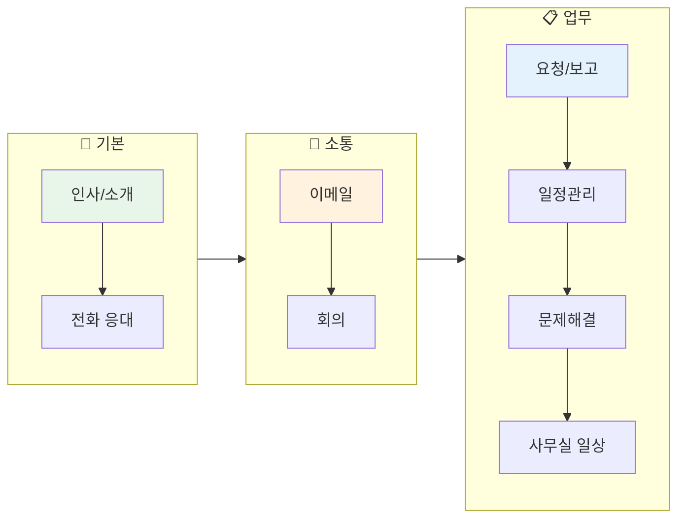
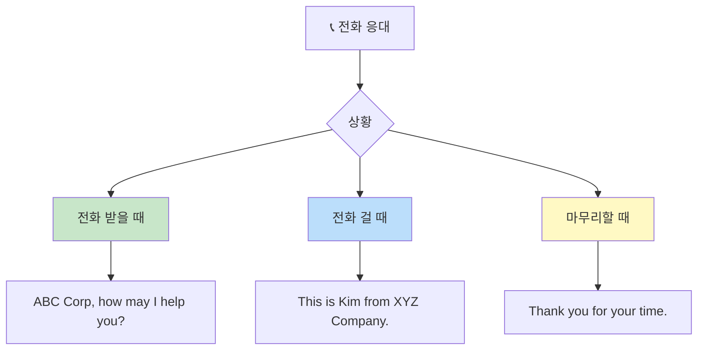
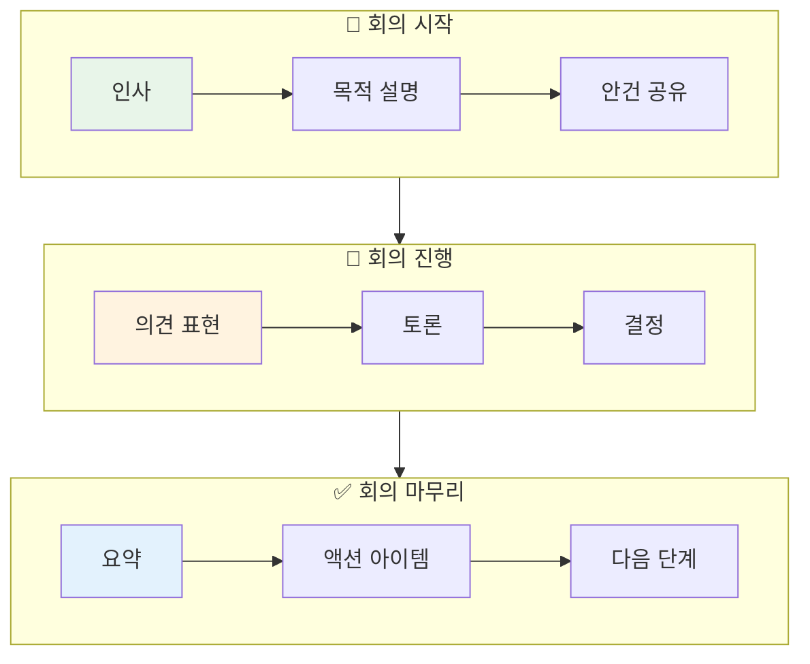
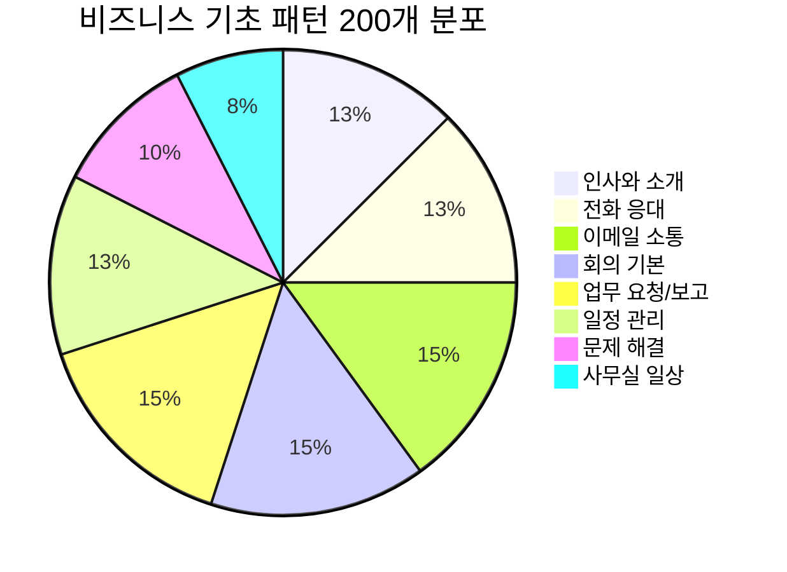
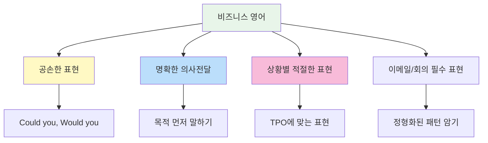

# 💼 비즈니스 영어 기초 패턴 200선

> **직장 생활에서 바로 쓰는 필수 비즈니스 영어 표현**  
> 신입~경력 2년차 수준의 기본 업무 회화 패턴 (초급~중급)

---

## 📋 목차
1. [인사와 소개](#-인사와-소개-patterns-1-25)
2. [전화 응대](#-전화-응대-patterns-26-50)
3. [이메일 소통](#-이메일-소통-patterns-51-80)
4. [회의 기본](#-회의-기본-patterns-81-110)
5. [업무 요청/보고](#-업무-요청보고-patterns-111-140)
6. [일정 관리](#-일정-관리-patterns-141-165)
7. [문제 해결](#-문제-해결-patterns-166-185)
8. [사무실 일상](#-사무실-일상-patterns-186-200)

---

## 학습 흐름도

---

## 👋 인사와 소개 (Patterns 1-25)

### 기본 인사 (1-10)

| No. | 패턴 | 예문 | 한국어 뜻 |
|:---:|------|------|----------|
| 1 | Good morning/afternoon. | Good morning, everyone. | 좋은 아침/오후입니다. |
| 2 | Nice to meet you. | Nice to meet you. I'm Kim from Marketing. | 만나서 반갑습니다. |
| 3 | How are you doing? | How are you doing today? | 오늘 어떠세요? |
| 4 | Thank you for coming. | Thank you for coming to our meeting. | 와주셔서 감사합니다. |
| 5 | It's a pleasure to meet you. | It's a pleasure to finally meet you in person. | 만나뵙게 되어 기쁩니다. |
| 6 | I've heard a lot about you. | I've heard a lot about you from our team. | 많이 들었습니다. |
| 7 | How was your weekend? | How was your weekend? Do anything fun? | 주말 잘 보내셨어요? |
| 8 | Have a good day. | Have a good day. See you tomorrow! | 좋은 하루 되세요. |
| 9 | Take care. | Take care. Have a safe trip! | 잘 가세요. |
| 10 | See you at the meeting. | See you at the meeting later. | 회의에서 봬요. |

### 자기소개 (11-18)

| No. | 패턴 | 예문 | 한국어 뜻 |
|:---:|------|------|----------|
| 11 | I'm [이름] from [부서]. | I'm Kim from the Marketing team. | ~부서의 ~입니다. |
| 12 | I work in the [부서] department. | I work in the Sales department. | ~부서에서 일합니다. |
| 13 | I'm in charge of [업무]. | I'm in charge of customer service. | ~를 담당하고 있습니다. |
| 14 | I'm responsible for [업무]. | I'm responsible for the project budget. | ~를 책임지고 있습니다. |
| 15 | I've been with the company for [기간]. | I've been with the company for 2 years. | ~동안 회사에 있었습니다. |
| 16 | I joined the company in [년도]. | I joined the company in 2024. | ~년에 입사했습니다. |
| 17 | My role involves [업무]. | My role involves coordinating with vendors. | 제 역할은 ~입니다. |
| 18 | I report to [직함]. | I report to the Marketing Director. | ~에게 보고합니다. |

### 타인 소개 (19-25)

| No. | 패턴 | 예문 | 한국어 뜻 |
|:---:|------|------|----------|
| 19 | Let me introduce [사람]. | Let me introduce our new team member. | ~를 소개하겠습니다. |
| 20 | This is [이름], our [직함]. | This is Sarah, our Project Manager. | ~는 우리 ~입니다. |
| 21 | I'd like you to meet [사람]. | I'd like you to meet our CEO. | ~를 만나보세요. |
| 22 | [이름] will be joining our team. | Tom will be joining our team next week. | ~가 팀에 합류합니다. |
| 23 | [이름] is here to discuss [주제]. | John is here to discuss the partnership. | ~가 ~를 논의하러 왔습니다. |
| 24 | [이름] specializes in [분야]. | She specializes in digital marketing. | ~는 ~를 전문으로 합니다. |
| 25 | Have you met [이름]? | Have you met our new manager? | ~를 만나셨나요? |

---

## 📞 전화 응대 (Patterns 26-50)

### 전화 받기 (26-35)

| No. | 패턴 | 예문 | 한국어 뜻 |
|:---:|------|------|----------|
| 26 | [회사명], how may I help you? | ABC Corp, how may I help you? | ~입니다, 무엇을 도와드릴까요? |
| 27 | [이름] speaking. | Kim speaking. How can I help you? | ~입니다. |
| 28 | May I ask who's calling? | May I ask who's calling, please? | 누구시라고 할까요? |
| 29 | May I ask what this is regarding? | May I ask what this is regarding? | 어떤 건으로 전화하셨나요? |
| 30 | Just a moment, please. | Just a moment, please. I'll transfer you. | 잠시만요. |
| 31 | I'll put you through to [사람/부서]. | I'll put you through to Sales. | ~로 연결해 드리겠습니다. |
| 32 | Please hold. | Please hold while I check. | 잠시 기다려 주세요. |
| 33 | I'm afraid [사람] is not available. | I'm afraid she's in a meeting right now. | ~가 지금 자리에 없습니다. |
| 34 | Would you like to leave a message? | Would you like to leave a message? | 메시지를 남기시겠어요? |
| 35 | Can I take a message? | Can I take a message for you? | 메시지 남겨드릴까요? |

### 전화 걸기 (36-45)

| No. | 패턴 | 예문 | 한국어 뜻 |
|:---:|------|------|----------|
| 36 | This is [이름] from [회사]. | This is Kim from XYZ Company. | ~회사의 ~입니다. |
| 37 | I'm calling about [건]. | I'm calling about your inquiry. | ~건으로 전화드렸습니다. |
| 38 | I'm returning your call. | I'm returning your call from earlier. | 전화 회신드립니다. |
| 39 | Is [이름] available? | Is Mr. Park available to speak? | ~씨 통화 가능하신가요? |
| 40 | Could I speak to [사람]? | Could I speak to the person in charge? | ~와 통화할 수 있을까요? |
| 41 | I'd like to schedule a call with [사람]. | I'd like to schedule a call with your manager. | ~와 통화 일정을 잡고 싶습니다. |
| 42 | Could you tell [사람] I called? | Could you tell him I called? | ~에게 제가 전화했다고 전해주세요. |
| 43 | I'll call back later. | I'll call back later this afternoon. | 나중에 다시 전화드리겠습니다. |
| 44 | When would be a good time to call? | When would be a good time to call back? | 언제 다시 전화드리면 될까요? |
| 45 | Thank you for taking my call. | Thank you for taking my call. | 전화 받아주셔서 감사합니다. |

### 통화 마무리 (46-50)

| No. | 패턴 | 예문 | 한국어 뜻 |
|:---:|------|------|----------|
| 46 | Thank you for your time. | Thank you for your time today. | 시간 내주셔서 감사합니다. |
| 47 | I'll get back to you on that. | I'll get back to you on that by tomorrow. | 그 건은 다시 연락드리겠습니다. |
| 48 | Please feel free to call anytime. | Please feel free to call if you have questions. | 언제든지 전화주세요. |
| 49 | I'll send you an email to confirm. | I'll send you an email to confirm the details. | 확인 메일 보내드리겠습니다. |
| 50 | Have a great day. | Have a great day. Goodbye. | 좋은 하루 되세요. |

---

## 📧 이메일 소통 (Patterns 51-80)

### 이메일 시작 (51-60)

| No. | 패턴 | 예문 | 한국어 뜻 |
|:---:|------|------|----------|
| 51 | I hope this email finds you well. | I hope this email finds you well. | 안녕하세요. (이메일 인사) |
| 52 | Thank you for your email. | Thank you for your email regarding the project. | 이메일 감사합니다. |
| 53 | I'm writing to [목적]. | I'm writing to follow up on our meeting. | ~를 위해 연락드립니다. |
| 54 | I'm reaching out to [목적]. | I'm reaching out to discuss the proposal. | ~를 위해 연락드립니다. |
| 55 | Following up on [건]. | Following up on our conversation yesterday. | ~에 대해 후속 연락드립니다. |
| 56 | As per our discussion. | As per our discussion, I'm sending the report. | 논의대로. |
| 57 | As requested. | As requested, please find the attached file. | 요청하신 대로. |
| 58 | Further to our meeting. | Further to our meeting, here are the action items. | 회의에 이어서. |
| 59 | In reference to [건]. | In reference to your inquiry about pricing. | ~와 관련하여. |
| 60 | Regarding [건]. | Regarding the contract renewal. | ~에 관해서. |

### 요청하기 (61-70)

| No. | 패턴 | 예문 | 한국어 뜻 |
|:---:|------|------|----------|
| 61 | Could you please [동사]? | Could you please send me the files? | ~해주시겠어요? |
| 62 | Would you be able to [동사]? | Would you be able to review this by Friday? | ~할 수 있으신가요? |
| 63 | I would appreciate it if you could [동사]. | I would appreciate it if you could confirm. | ~해주시면 감사하겠습니다. |
| 64 | Would it be possible to [동사]? | Would it be possible to reschedule? | ~가 가능할까요? |
| 65 | I was wondering if you could [동사]. | I was wondering if you could help me with this. | ~해주실 수 있을까 해서요. |
| 66 | Please let me know [내용]. | Please let me know your availability. | ~알려주세요. |
| 67 | I'd like to request [내용]. | I'd like to request a meeting with you. | ~를 요청드립니다. |
| 68 | May I ask for [내용]? | May I ask for your feedback on this? | ~를 부탁드려도 될까요? |
| 69 | When you have a chance, could you [동사]? | When you have a chance, could you review this? | 시간 되실 때 ~해주시겠어요? |
| 70 | At your earliest convenience. | Please respond at your earliest convenience. | 빠른 시일 내에. |

### 이메일 마무리 (71-80)

| No. | 패턴 | 예문 | 한국어 뜻 |
|:---:|------|------|----------|
| 71 | Please let me know if you have any questions. | Please let me know if you have any questions. | 질문 있으시면 알려주세요. |
| 72 | Feel free to contact me if you need anything. | Feel free to contact me if you need anything. | 필요하시면 연락주세요. |
| 73 | I look forward to hearing from you. | I look forward to hearing from you soon. | 연락 기다리겠습니다. |
| 74 | Thank you for your attention to this matter. | Thank you for your attention to this matter. | 이 건에 관심 가져주셔서 감사합니다. |
| 75 | Thank you in advance. | Thank you in advance for your help. | 미리 감사드립니다. |
| 76 | Best regards. | Best regards, Kim | 감사합니다. (맺음말) |
| 77 | Kind regards. | Kind regards, Kim | 감사합니다. (맺음말) |
| 78 | Looking forward to your reply. | Looking forward to your reply. | 답변 기다리겠습니다. |
| 79 | Please don't hesitate to reach out. | Please don't hesitate to reach out if needed. | 필요하시면 주저 말고 연락주세요. |
| 80 | I appreciate your time. | I appreciate your time and consideration. | 시간 내주셔서 감사합니다. |

---

## 🏢 회의 기본 (Patterns 81-110)

### 회의 시작 (81-90)

| No. | 패턴 | 예문 | 한국어 뜻 |
|:---:|------|------|----------|
| 81 | Let's get started. | Let's get started with today's meeting. | 시작하겠습니다. |
| 82 | Thank you all for joining. | Thank you all for joining today's meeting. | 참석해 주셔서 감사합니다. |
| 83 | The purpose of this meeting is to [목적]. | The purpose of this meeting is to discuss Q4 goals. | 이 회의의 목적은 ~입니다. |
| 84 | Today we'll be discussing [주제]. | Today we'll be discussing the new project plan. | 오늘은 ~에 대해 논의하겠습니다. |
| 85 | Let me share the agenda. | Let me share the agenda for today. | 안건을 공유하겠습니다. |
| 86 | Before we begin, does anyone have questions? | Before we begin, does anyone have questions? | 시작하기 전에 질문 있으신가요? |
| 87 | Shall we start with [주제]? | Shall we start with the sales report? | ~부터 시작할까요? |
| 88 | Let's go around and introduce ourselves. | Let's go around and introduce ourselves briefly. | 돌아가며 자기소개 해주세요. |
| 89 | I'd like to start by [동사]-ing. | I'd like to start by reviewing last week's progress. | ~로 시작하겠습니다. |
| 90 | First, let me give you some background. | First, let me give you some background on this issue. | 먼저 배경을 설명드리겠습니다. |

### 의견 표현 (91-100)

| No. | 패턴 | 예문 | 한국어 뜻 |
|:---:|------|------|----------|
| 91 | I think [의견]. | I think we should focus on customer feedback. | ~라고 생각합니다. |
| 92 | In my opinion, [의견]. | In my opinion, this approach is more efficient. | 제 생각에는, ~입니다. |
| 93 | From my perspective, [의견]. | From my perspective, we need more data. | 제 관점에서는, ~입니다. |
| 94 | I believe [의견]. | I believe this will help increase sales. | ~라고 믿습니다. |
| 95 | I'd like to suggest [제안]. | I'd like to suggest a different approach. | ~를 제안합니다. |
| 96 | May I add something? | May I add something to that point? | 덧붙여도 될까요? |
| 97 | I agree with [사람/의견]. | I agree with Sarah's point about timing. | ~에 동의합니다. |
| 98 | I see your point, but [의견]. | I see your point, but we should also consider cost. | 말씀은 이해하지만, ~입니다. |
| 99 | That's a good point. | That's a good point. I hadn't thought of that. | 좋은 지적입니다. |
| 100 | What do you think about [주제]? | What do you think about this proposal? | ~에 대해 어떻게 생각하세요? |

### 회의 마무리 (101-110)

| No. | 패턴 | 예문 | 한국어 뜻 |
|:---:|------|------|----------|
| 101 | Let's wrap up. | Let's wrap up for today. | 마무리하겠습니다. |
| 102 | To summarize, [요약]. | To summarize, we'll focus on three main tasks. | 요약하면, ~입니다. |
| 103 | Let me recap the action items. | Let me recap the action items from today. | 액션 아이템을 정리하겠습니다. |
| 104 | [사람] will be responsible for [업무]. | John will be responsible for the report. | ~가 ~를 담당합니다. |
| 105 | The deadline is [날짜]. | The deadline is next Friday. | 마감일은 ~입니다. |
| 106 | Any other questions before we end? | Any other questions before we end? | 끝내기 전에 다른 질문 있나요? |
| 107 | Thank you for your time. | Thank you for your time today. | 시간 내주셔서 감사합니다. |
| 108 | I'll send out the meeting notes. | I'll send out the meeting notes by EOD. | 회의록 보내드리겠습니다. |
| 109 | Let's schedule a follow-up meeting. | Let's schedule a follow-up meeting next week. | 후속 회의 일정을 잡겠습니다. |
| 110 | Meeting adjourned. | Meeting adjourned. Thank you, everyone. | 회의를 마치겠습니다. |

---

## 📋 업무 요청/보고 (Patterns 111-140)

### 업무 요청하기 (111-125)

| No. | 패턴 | 예문 | 한국어 뜻 |
|:---:|------|------|----------|
| 111 | Could you [동사]? | Could you send me the report? | ~해주시겠어요? |
| 112 | Would you mind [동사]-ing? | Would you mind reviewing this document? | ~해주실 수 있나요? |
| 113 | I need you to [동사]. | I need you to finish this by Friday. | ~해주셔야 합니다. |
| 114 | Can you take care of [업무]? | Can you take care of the client meeting? | ~를 맡아주실 수 있나요? |
| 115 | I'd like you to [동사]. | I'd like you to prepare a presentation. | ~해주셨으면 합니다. |
| 116 | Please make sure to [동사]. | Please make sure to double-check the numbers. | 꼭 ~해주세요. |
| 117 | When you get a chance, please [동사]. | When you get a chance, please update the file. | 시간 되면 ~해주세요. |
| 118 | Could you get this done by [시간]? | Could you get this done by tomorrow? | ~까지 완료해주실 수 있나요? |
| 119 | I was hoping you could help me with [업무]. | I was hoping you could help me with this analysis. | ~를 도와주셨으면 해서요. |
| 120 | Would it be possible to [동사]? | Would it be possible to extend the deadline? | ~가 가능할까요? |
| 121 | I'd appreciate your help with [업무]. | I'd appreciate your help with the budget review. | ~를 도와주시면 감사하겠습니다. |
| 122 | Can I ask you a favor? | Can I ask you a favor regarding the project? | 부탁 하나 드려도 될까요? |
| 123 | Could you prioritize [업무]? | Could you prioritize the customer inquiry? | ~를 우선 처리해주실 수 있나요? |
| 124 | I need this ASAP. | I need this report ASAP. | 급히 필요합니다. |
| 125 | This is urgent. | This is urgent. Please respond immediately. | 긴급한 사안입니다. |

### 업무 보고하기 (126-140)

| No. | 패턴 | 예문 | 한국어 뜻 |
|:---:|------|------|----------|
| 126 | I'd like to update you on [건]. | I'd like to update you on the project status. | ~에 대해 업데이트 드립니다. |
| 127 | I wanted to report that [내용]. | I wanted to report that we met the deadline. | ~를 보고드리고 싶었습니다. |
| 128 | The current status is [내용]. | The current status is on track. | 현재 상태는 ~입니다. |
| 129 | I've completed [업무]. | I've completed the quarterly analysis. | ~를 완료했습니다. |
| 130 | The task is [상태]. | The task is 80% complete. | 업무가 ~한 상태입니다. |
| 131 | We're on schedule. | We're on schedule for the launch. | 일정대로 진행 중입니다. |
| 132 | We're ahead of/behind schedule. | We're slightly behind schedule. | 일정보다 앞서/뒤쳐져 있습니다. |
| 133 | I've attached [문서]. | I've attached the report for your review. | ~를 첨부했습니다. |
| 134 | Please find attached [문서]. | Please find attached the meeting minutes. | 첨부 파일 확인해 주세요. |
| 135 | Here's a summary of [내용]. | Here's a summary of this week's progress. | ~의 요약입니다. |
| 136 | I'll keep you posted on [건]. | I'll keep you posted on the developments. | ~에 대해 계속 알려드리겠습니다. |
| 137 | Just to let you know, [내용]. | Just to let you know, the client approved the proposal. | 알려드리자면, ~입니다. |
| 138 | For your information (FYI), [내용]. | FYI, the meeting has been moved to 3 PM. | 참고로, ~입니다. |
| 139 | I'm happy to report that [내용]. | I'm happy to report that we exceeded our target. | ~를 보고드리게 되어 기쁩니다. |
| 140 | Unfortunately, [내용]. | Unfortunately, we encountered a delay. | 안타깝게도, ~입니다. |

---

## 📅 일정 관리 (Patterns 141-165)

### 일정 잡기 (141-152)

| No. | 패턴 | 예문 | 한국어 뜻 |
|:---:|------|------|----------|
| 141 | When are you available? | When are you available this week? | 언제 시간 되세요? |
| 142 | What time works for you? | What time works best for you? | 몇 시가 좋으세요? |
| 143 | I'd like to schedule a meeting. | I'd like to schedule a meeting with you. | 미팅을 잡고 싶습니다. |
| 144 | Can we set up a call? | Can we set up a call for tomorrow? | 통화 일정을 잡을 수 있을까요? |
| 145 | Does [시간] work for you? | Does 2 PM on Tuesday work for you? | ~시가 괜찮으신가요? |
| 146 | How about [시간]? | How about meeting at 3 PM? | ~는 어떠세요? |
| 147 | Let me check my calendar. | Let me check my calendar and get back to you. | 일정 확인해보겠습니다. |
| 148 | I'm available on [날짜/시간]. | I'm available on Friday afternoon. | ~에 시간이 됩니다. |
| 149 | I'm free from [시간] to [시간]. | I'm free from 2 to 4 PM. | ~부터 ~까지 가능합니다. |
| 150 | Let's pencil in [시간]. | Let's pencil in Thursday at 10 AM. | 일단 ~로 잡아두죠. |
| 151 | I'll send you a calendar invite. | I'll send you a calendar invite shortly. | 캘린더 초대 보내드리겠습니다. |
| 152 | Please confirm the meeting. | Please confirm the meeting by tomorrow. | 미팅 확인 부탁드립니다. |

### 일정 변경 (153-165)

| No. | 패턴 | 예문 | 한국어 뜻 |
|:---:|------|------|----------|
| 153 | Can we reschedule? | Can we reschedule our meeting? | 일정 변경 가능할까요? |
| 154 | I need to push back [일정]. | I need to push back the deadline. | ~를 미뤄야 할 것 같습니다. |
| 155 | Something came up. | I'm sorry, something came up. | 급한 일이 생겼습니다. |
| 156 | I won't be able to make it. | I won't be able to make it to the meeting. | 참석이 어려울 것 같습니다. |
| 157 | Can we move it to [시간]? | Can we move it to next Monday? | ~로 옮길 수 있을까요? |
| 158 | I apologize for the short notice. | I apologize for the short notice. | 갑작스러운 연락 죄송합니다. |
| 159 | The meeting has been postponed. | The meeting has been postponed to next week. | 회의가 연기되었습니다. |
| 160 | The meeting has been cancelled. | The meeting has been cancelled due to a conflict. | 회의가 취소되었습니다. |
| 161 | I need to request a deadline extension. | I need to request a deadline extension. | 마감 연장을 요청드립니다. |
| 162 | Would it be possible to extend the deadline? | Would it be possible to extend the deadline by a week? | 마감을 연장할 수 있을까요? |
| 163 | I'm running late. | I'm running late. I'll be there in 10 minutes. | 늦을 것 같습니다. |
| 164 | I'll be a few minutes late. | I'll be a few minutes late to the meeting. | 몇 분 늦을 것 같습니다. |
| 165 | Sorry for the delay. | Sorry for the delay. I'm on my way. | 지연되어 죄송합니다. |

---

## 🔧 문제 해결 (Patterns 166-185)

### 문제 제기 (166-175)

| No. | 패턴 | 예문 | 한국어 뜻 |
|:---:|------|------|----------|
| 166 | We have an issue with [문제]. | We have an issue with the system. | ~에 문제가 있습니다. |
| 167 | There seems to be a problem with [것]. | There seems to be a problem with the data. | ~에 문제가 있는 것 같습니다. |
| 168 | I'm concerned about [문제]. | I'm concerned about the timeline. | ~가 걱정됩니다. |
| 169 | I'd like to address [문제]. | I'd like to address the quality issue. | ~를 해결하고 싶습니다. |
| 170 | We need to talk about [문제]. | We need to talk about the budget shortfall. | ~에 대해 이야기해야 합니다. |
| 171 | I've noticed that [문제]. | I've noticed that there are some errors. | ~라는 것을 발견했습니다. |
| 172 | Something doesn't seem right with [것]. | Something doesn't seem right with the numbers. | ~가 이상한 것 같습니다. |
| 173 | We ran into a problem. | We ran into a problem with the vendor. | 문제가 발생했습니다. |
| 174 | This is not working as expected. | This is not working as expected. | 예상대로 작동하지 않습니다. |
| 175 | We need to find a solution for [문제]. | We need to find a solution for this ASAP. | ~에 대한 해결책을 찾아야 합니다. |

### 해결책 제시 (176-185)

| No. | 패턴 | 예문 | 한국어 뜻 |
|:---:|------|------|----------|
| 176 | I suggest we [해결책]. | I suggest we hire additional staff. | ~하는 것을 제안합니다. |
| 177 | One solution would be to [해결책]. | One solution would be to outsource. | 한 가지 해결책은 ~입니다. |
| 178 | What if we [해결책]? | What if we extend the deadline? | ~하면 어떨까요? |
| 179 | How about [해결책]? | How about splitting the tasks? | ~는 어떨까요? |
| 180 | Let's try [해결책]. | Let's try a different approach. | ~를 시도해 봅시다. |
| 181 | I recommend [해결책]. | I recommend reviewing the process. | ~를 권장합니다. |
| 182 | We could [해결책]. | We could allocate more resources. | ~할 수 있습니다. |
| 183 | Let me look into it. | Let me look into it and get back to you. | 알아보겠습니다. |
| 184 | I'll take care of it. | Don't worry, I'll take care of it. | 제가 처리하겠습니다. |
| 185 | Let's figure out a workaround. | Let's figure out a workaround for now. | 임시 해결책을 찾아봅시다. |

---

## 🏠 사무실 일상 (Patterns 186-200)

### 일상 대화 (186-195)

| No. | 패턴 | 예문 | 한국어 뜻 |
|:---:|------|------|----------|
| 186 | Do you have a minute? | Do you have a minute to talk? | 잠깐 시간 되세요? |
| 187 | Can I ask you something? | Can I ask you something about the project? | 여쭤볼 게 있는데요. |
| 188 | I'm heading to lunch. Want to join? | I'm heading to lunch. Want to join me? | 점심 먹으러 가는데 같이 가실래요? |
| 189 | I'll be out of office [기간]. | I'll be out of office next week. | ~동안 자리를 비웁니다. |
| 190 | I'm working from home today. | I'm working from home today. | 오늘 재택근무합니다. |
| 191 | I'm taking the day off. | I'm taking the day off tomorrow. | 내일 휴가입니다. |
| 192 | Can I leave early today? | Can I leave early today? I have an appointment. | 오늘 일찍 퇴근해도 될까요? |
| 193 | I'll be in late tomorrow. | I'll be in late tomorrow morning. | 내일 늦게 출근합니다. |
| 194 | Have a good evening. | Have a good evening. See you tomorrow! | 좋은 저녁 되세요. |
| 195 | See you on Monday. | Have a great weekend! See you on Monday. | 월요일에 봬요. |

### 감사와 칭찬 (196-200)

| No. | 패턴 | 예문 | 한국어 뜻 |
|:---:|------|------|----------|
| 196 | Thank you for your help. | Thank you for your help with the report. | 도움 감사합니다. |
| 197 | I appreciate your hard work. | I appreciate your hard work on this project. | 수고에 감사드립니다. |
| 198 | Great job on [업무]. | Great job on the presentation! | ~잘하셨어요! |
| 199 | You did an excellent job. | You did an excellent job handling the client. | 정말 잘하셨습니다. |
| 200 | I couldn't have done it without you. | I couldn't have done it without your support. | 당신 없이는 못했을 거예요. |

---

## 📊 전체 패턴 분포

---

## 💡 학습 팁

### 🎯 비즈니스 영어 학습 포인트

### ⭐ 가장 많이 쓰는 표현 TOP 15

| 순위 | 표현 | 사용 상황 |
|:---:|------|---------|
| 1 | Could you please...? | 정중한 요청 |
| 2 | I'd like to... | 희망 표현 |
| 3 | Thank you for... | 감사 표현 |
| 4 | Let me know if... | 후속 안내 |
| 5 | I'm writing to... | 이메일 시작 |
| 6 | As per our discussion | 회의 후속 |
| 7 | Please find attached | 첨부 안내 |
| 8 | I'd like to update you on | 보고 시작 |
| 9 | When are you available? | 일정 조율 |
| 10 | Let's get started | 회의 시작 |
| 11 | To summarize | 요약할 때 |
| 12 | I'll get back to you | 후속 약속 |
| 13 | I appreciate your... | 감사 표현 |
| 14 | We have an issue with | 문제 제기 |
| 15 | Have a good day | 인사 마무리 |

### 📅 주간 학습 계획

| 요일 | 학습 주제 | 목표 패턴 |
|:---:|----------|:--------:|
| 월 | 인사와 소개 | 1-25 |
| 화 | 전화 응대 | 26-50 |
| 수 | 이메일 소통 | 51-80 |
| 목 | 회의 기본 | 81-110 |
| 금 | 업무 요청/보고 | 111-140 |
| 토 | 일정 관리 | 141-165 |
| 일 | 문제 해결 + 사무실 일상 | 166-200 + 복습 |

---

*Last Updated: 2026-01-10*

