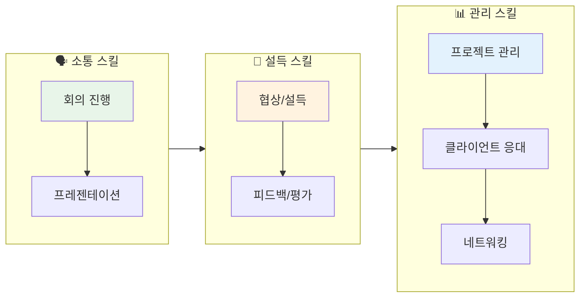
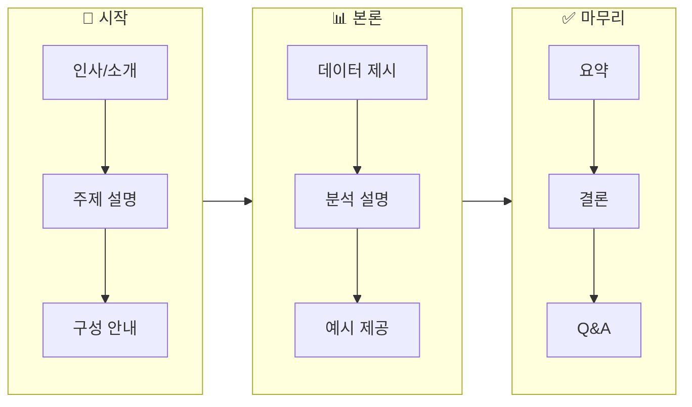
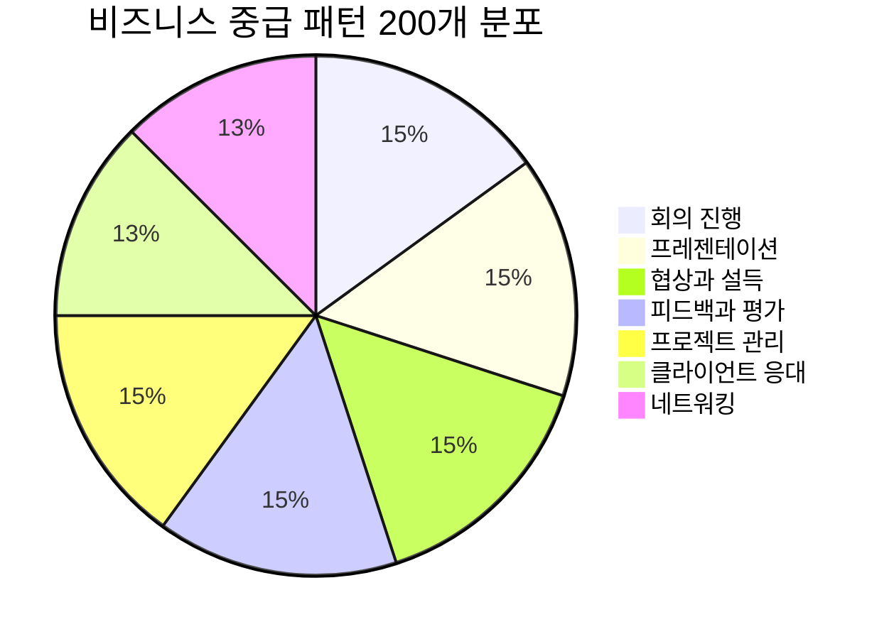
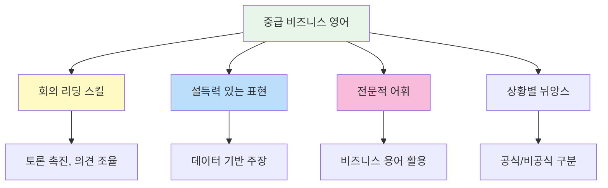

# 📈 비즈니스 영어 중급 패턴 200선

> **프로페셔널하게 업무를 수행하는 중급 비즈니스 영어**  
> 경력 3~7년차 수준의 실무 회화 패턴 (중급~중상급)

---

## 📋 목차
1. [회의 진행](#-회의-진행-patterns-1-30)
2. [프레젠테이션](#-프레젠테이션-patterns-31-60)
3. [협상과 설득](#-협상과-설득-patterns-61-90)
4. [피드백과 평가](#-피드백과-평가-patterns-91-120)
5. [프로젝트 관리](#-프로젝트-관리-patterns-121-150)
6. [클라이언트 응대](#-클라이언트-응대-patterns-151-175)
7. [네트워킹](#-네트워킹-patterns-176-200)

---

## 학습 흐름도

---

## 🏛️ 회의 진행 (Patterns 1-30)

### 회의 주재하기 (1-12)

| No. | 패턴 | 예문 | 한국어 뜻 |
|:---:|------|------|----------|
| 1 | I'd like to call this meeting to order. | I'd like to call this meeting to order. | 회의를 시작하겠습니다. |
| 2 | Let's stay on track. | We're running short on time. Let's stay on track. | 주제에 집중합시다. |
| 3 | Let's table that for now. | That's a good point, but let's table that for now. | 그건 일단 보류합시다. |
| 4 | Can we circle back to that later? | Can we circle back to that topic at the end? | 나중에 다시 논의할까요? |
| 5 | I'd like to move on to the next item. | I'd like to move on to the next agenda item. | 다음 안건으로 넘어가겠습니다. |
| 6 | Let's hear from [사람]. | Let's hear from the Marketing team. | ~의 의견을 들어봅시다. |
| 7 | Does anyone have anything to add? | Before we move on, does anyone have anything to add? | 추가할 의견 있으신가요? |
| 8 | Let's take a vote on this. | Let's take a vote on this proposal. | 투표로 결정합시다. |
| 9 | Are we all in agreement? | Are we all in agreement on this approach? | 모두 동의하시나요? |
| 10 | Let's take a five-minute break. | Let's take a five-minute break and reconvene. | 5분 휴식합시다. |
| 11 | We need to reach a consensus. | We need to reach a consensus on this issue. | 합의가 필요합니다. |
| 12 | Let's make a decision and move forward. | We've discussed enough. Let's make a decision. | 결정하고 진행합시다. |

### 토론 촉진하기 (13-22)

| No. | 패턴 | 예문 | 한국어 뜻 |
|:---:|------|------|----------|
| 13 | What are your thoughts on this? | What are your thoughts on this strategy? | 이에 대해 어떻게 생각하세요? |
| 14 | I'd like to get everyone's input. | I'd like to get everyone's input on this. | 모든 분의 의견을 듣고 싶습니다. |
| 15 | Let's brainstorm some ideas. | Let's brainstorm some ideas for the campaign. | 아이디어를 브레인스토밍 해봅시다. |
| 16 | Has anyone considered [대안]? | Has anyone considered outsourcing this? | ~를 고려해 보셨나요? |
| 17 | Can you elaborate on that? | Interesting point. Can you elaborate on that? | 좀 더 자세히 설명해 주시겠어요? |
| 18 | Could you clarify what you mean by [것]? | Could you clarify what you mean by "scalable"? | ~가 무슨 뜻인지 명확히 해주시겠어요? |
| 19 | Let's look at this from a different angle. | Let's look at this from the customer's perspective. | 다른 각도에서 살펴봅시다. |
| 20 | What are the pros and cons? | What are the pros and cons of each option? | 장단점이 무엇인가요? |
| 21 | Let's weigh the options. | Let's weigh the options before deciding. | 선택지들을 비교해봅시다. |
| 22 | What's the impact on [것]? | What's the impact on our timeline? | ~에 어떤 영향이 있나요? |

### 의견 충돌 관리 (23-30)

| No. | 패턴 | 예문 | 한국어 뜻 |
|:---:|------|------|----------|
| 23 | I see where you're coming from, but... | I see where you're coming from, but we have constraints. | 말씀하시는 바는 이해하지만... |
| 24 | Let's find a middle ground. | Let's find a middle ground that works for everyone. | 중간점을 찾아봅시다. |
| 25 | Can we compromise on this? | Can we compromise on the budget allocation? | 이 부분에서 타협할 수 있을까요? |
| 26 | I respect your opinion, however... | I respect your opinion, however I have concerns. | 의견은 존중하지만... |
| 27 | Let's agree to disagree for now. | Let's agree to disagree and revisit this later. | 의견 차이를 인정하고 넘어갑시다. |
| 28 | We're not going to solve this today. | We're not going to solve this today. Let's schedule a follow-up. | 오늘 해결하기 어려울 것 같습니다. |
| 29 | Let's focus on what we agree on. | Let's focus on what we agree on first. | 동의하는 부분에 집중합시다. |
| 30 | Perhaps we can revisit this later. | Perhaps we can revisit this when we have more data. | 나중에 다시 논의하죠. |

---

## 📊 프레젠테이션 (Patterns 31-60)

### 프레젠테이션 시작 (31-42)

| No. | 패턴 | 예문 | 한국어 뜻 |
|:---:|------|------|----------|
| 31 | Thank you for giving me the opportunity to present. | Thank you for giving me the opportunity to present today. | 발표 기회를 주셔서 감사합니다. |
| 32 | Today, I'll be talking about [주제]. | Today, I'll be talking about our Q4 results. | 오늘은 ~에 대해 말씀드리겠습니다. |
| 33 | My presentation is divided into [수] parts. | My presentation is divided into three parts. | 발표는 ~부분으로 나뉩니다. |
| 34 | I'll start by [동사]-ing. | I'll start by giving you some background. | ~로 시작하겠습니다. |
| 35 | Feel free to ask questions at any time. | Feel free to ask questions at any time. | 언제든 질문하세요. |
| 36 | I'll take questions at the end. | I'll take questions at the end of the presentation. | 질문은 끝나고 받겠습니다. |
| 37 | Let me begin by [동사]-ing. | Let me begin by sharing some key statistics. | ~로 시작하겠습니다. |
| 38 | As you can see on this slide... | As you can see on this slide, sales increased by 20%. | 이 슬라이드에서 보시듯이... |
| 39 | This chart shows [내용]. | This chart shows our growth over the past year. | 이 차트는 ~를 보여줍니다. |
| 40 | Let me walk you through [내용]. | Let me walk you through the timeline. | ~를 설명해 드리겠습니다. |
| 41 | I'd like to draw your attention to [것]. | I'd like to draw your attention to this trend. | ~에 주목해 주세요. |
| 42 | The key takeaway here is [내용]. | The key takeaway here is customer satisfaction improved. | 핵심 포인트는 ~입니다. |

### 프레젠테이션 전개 (43-52)

| No. | 패턴 | 예문 | 한국어 뜻 |
|:---:|------|------|----------|
| 43 | Moving on to [주제]. | Moving on to our marketing strategy. | ~로 넘어가겠습니다. |
| 44 | Now, let's look at [것]. | Now, let's look at the competitive landscape. | 이제 ~를 살펴봅시다. |
| 45 | This brings me to my next point. | This brings me to my next point about costs. | 다음 요점으로 넘어가겠습니다. |
| 46 | Building on that point... | Building on that point, we also found that... | 그 점에 덧붙여... |
| 47 | To give you an example... | To give you an example, our client XYZ... | 예를 들어... |
| 48 | In other words... | In other words, we need to act now. | 다시 말해서... |
| 49 | This is significant because... | This is significant because it affects revenue. | 이것이 중요한 이유는... |
| 50 | The data suggests that... | The data suggests that demand is increasing. | 데이터에 따르면... |
| 51 | According to our research... | According to our research, 80% prefer option A. | 우리 연구에 따르면... |
| 52 | As I mentioned earlier... | As I mentioned earlier, timing is crucial. | 앞서 말씀드렸듯이... |

### 프레젠테이션 마무리 (53-60)

| No. | 패턴 | 예문 | 한국어 뜻 |
|:---:|------|------|----------|
| 53 | To summarize the main points... | To summarize the main points of my presentation... | 주요 포인트를 요약하면... |
| 54 | In conclusion... | In conclusion, I believe this is the right approach. | 결론적으로... |
| 55 | The bottom line is [내용]. | The bottom line is we need to increase investment. | 핵심은 ~입니다. |
| 56 | I'd like to leave you with [생각]. | I'd like to leave you with this thought. | ~를 남기고 싶습니다. |
| 57 | Thank you for your attention. | Thank you for your attention. | 경청해 주셔서 감사합니다. |
| 58 | Are there any questions? | Are there any questions or comments? | 질문 있으신가요? |
| 59 | I'd be happy to answer any questions. | I'd be happy to answer any questions you may have. | 질문에 답변드리겠습니다. |
| 60 | Let's open the floor for discussion. | Let's open the floor for discussion. | 토론을 시작하겠습니다. |

---

## 🤝 협상과 설득 (Patterns 61-90)

### 협상 시작 (61-72)

| No. | 패턴 | 예문 | 한국어 뜻 |
|:---:|------|------|----------|
| 61 | Let's discuss the terms. | Let's discuss the terms of the agreement. | 조건을 논의해 봅시다. |
| 62 | We're here to find a mutually beneficial solution. | We're here to find a mutually beneficial solution. | 상호 이익이 되는 해결책을 찾고자 합니다. |
| 63 | What are your main priorities? | What are your main priorities in this deal? | 주요 우선순위가 무엇인가요? |
| 64 | Our primary concern is [것]. | Our primary concern is the delivery timeline. | 가장 중요한 것은 ~입니다. |
| 65 | We're looking for [것]. | We're looking for a long-term partnership. | ~를 원합니다. |
| 66 | What would work best for you? | What would work best for you in terms of payment? | 어떤 게 가장 좋으시겠어요? |
| 67 | We're open to discussion on [것]. | We're open to discussion on pricing. | ~에 대해 논의할 의향이 있습니다. |
| 68 | Is there any flexibility on [것]? | Is there any flexibility on the deadline? | ~에 대해 유연성이 있나요? |
| 69 | We'd like to propose [제안]. | We'd like to propose a revised timeline. | ~를 제안드립니다. |
| 70 | Our initial offer is [제안]. | Our initial offer is $50,000. | 저희 첫 제안은 ~입니다. |
| 71 | How does that sound to you? | How does that sound to you? | 어떻게 생각하세요? |
| 72 | What are your thoughts on this proposal? | What are your thoughts on this proposal? | 이 제안에 대해 어떻게 생각하세요? |

### 설득하기 (73-82)

| No. | 패턴 | 예문 | 한국어 뜻 |
|:---:|------|------|----------|
| 73 | Let me explain why this makes sense. | Let me explain why this makes sense for both of us. | 왜 이것이 합리적인지 설명드리겠습니다. |
| 74 | The benefit of this approach is [이점]. | The benefit of this approach is faster time-to-market. | 이 접근법의 장점은 ~입니다. |
| 75 | This will help us achieve [목표]. | This will help us achieve our quarterly targets. | 이것이 ~를 달성하는 데 도움이 됩니다. |
| 76 | Consider the long-term benefits. | Consider the long-term benefits of this partnership. | 장기적 이점을 고려해 주세요. |
| 77 | From a cost perspective, [이유]. | From a cost perspective, this saves us 20%. | 비용 측면에서 ~입니다. |
| 78 | The data supports this decision. | The data supports this decision. Here's the evidence. | 데이터가 이 결정을 뒷받침합니다. |
| 79 | Other companies have seen success with [방법]. | Other companies have seen success with this approach. | 다른 회사들도 ~로 성공했습니다. |
| 80 | I strongly recommend [추천]. | I strongly recommend we proceed with option B. | ~를 강력히 권장합니다. |
| 81 | This is our best option because [이유]. | This is our best option because of the ROI. | ~때문에 이것이 최선입니다. |
| 82 | I'm confident that [확신]. | I'm confident that this will deliver results. | ~라고 확신합니다. |

### 합의 도출 (83-90)

| No. | 패턴 | 예문 | 한국어 뜻 |
|:---:|------|------|----------|
| 83 | Can we meet in the middle? | Can we meet in the middle on the price? | 중간에서 만날 수 있을까요? |
| 84 | What if we [대안]? | What if we split the difference? | ~하면 어떨까요? |
| 85 | I can offer [양보]. | I can offer a 5% discount if you commit today. | ~를 제안할 수 있습니다. |
| 86 | We can agree to [조건] if you [조건]. | We can agree to faster delivery if you order in bulk. | ~하시면 ~에 동의할 수 있습니다. |
| 87 | Let's shake on it. | Sounds good. Let's shake on it. | 합의했습니다. |
| 88 | I think we have a deal. | I think we have a deal. | 합의가 된 것 같습니다. |
| 89 | Let's put this in writing. | Great. Let's put this in writing. | 문서로 작성합시다. |
| 90 | I'll have the contract drawn up. | I'll have the contract drawn up by tomorrow. | 계약서를 작성하겠습니다. |

---

## 💬 피드백과 평가 (Patterns 91-120)

### 긍정적 피드백 (91-102)

| No. | 패턴 | 예문 | 한국어 뜻 |
|:---:|------|------|----------|
| 91 | I'm impressed with [것]. | I'm impressed with your attention to detail. | ~에 감명받았습니다. |
| 92 | You've done an excellent job on [것]. | You've done an excellent job on this project. | ~를 훌륭하게 해냈습니다. |
| 93 | I really appreciate your [것]. | I really appreciate your dedication. | ~에 정말 감사드립니다. |
| 94 | Your contribution was invaluable. | Your contribution to this project was invaluable. | 기여가 매우 소중했습니다. |
| 95 | This exceeds my expectations. | This report exceeds my expectations. | 기대 이상입니다. |
| 96 | I'd like to commend you for [것]. | I'd like to commend you for your leadership. | ~에 대해 칭찬하고 싶습니다. |
| 97 | You've made significant progress. | You've made significant progress this quarter. | 큰 발전을 이루셨습니다. |
| 98 | Keep up the great work. | Keep up the great work. You're on the right track. | 계속 잘 해주세요. |
| 99 | You've shown great initiative. | You've shown great initiative in solving this problem. | 훌륭한 주도성을 보여주셨습니다. |
| 100 | Your work speaks for itself. | Your work speaks for itself. Outstanding job. | 결과물이 스스로 말해주네요. |
| 101 | I can see the improvement. | I can see the improvement in your presentations. | 발전이 보입니다. |
| 102 | This is exactly what we needed. | This is exactly what we needed. Well done. | 바로 이겁니다. 잘하셨어요. |

### 건설적 피드백 (103-115)

| No. | 패턴 | 예문 | 한국어 뜻 |
|:---:|------|------|----------|
| 103 | I have some suggestions for improvement. | I have some suggestions for improvement. | 개선을 위한 제안이 있습니다. |
| 104 | One area to work on is [분야]. | One area to work on is communication. | 개선할 영역은 ~입니다. |
| 105 | Have you considered [대안]? | Have you considered a different approach? | ~를 고려해 보셨나요? |
| 106 | I think there's room for improvement in [분야]. | I think there's room for improvement in time management. | ~에 개선 여지가 있습니다. |
| 107 | Let me give you some constructive feedback. | Let me give you some constructive feedback on this. | 건설적인 피드백을 드리겠습니다. |
| 108 | This could be stronger if [조건]. | This could be stronger if you add more data. | ~하면 더 강력해질 것입니다. |
| 109 | I'd recommend focusing more on [것]. | I'd recommend focusing more on client needs. | ~에 더 집중하시길 권장합니다. |
| 110 | Next time, try [제안]. | Next time, try to be more concise. | 다음에는 ~해보세요. |
| 111 | The issue I see is [문제]. | The issue I see is the lack of structure. | 제가 보는 문제는 ~입니다. |
| 112 | We need to address [문제]. | We need to address the quality concerns. | ~를 해결해야 합니다. |
| 113 | I'd like to see more [것]. | I'd like to see more proactive communication. | ~가 더 있었으면 합니다. |
| 114 | This needs more work. | This section needs more work before submission. | 이 부분은 더 작업이 필요합니다. |
| 115 | Let's discuss how to improve this. | Let's discuss how to improve this going forward. | 개선 방법을 논의합시다. |

### 성과 평가 (116-120)

| No. | 패턴 | 예문 | 한국어 뜻 |
|:---:|------|------|----------|
| 116 | Let's review your performance. | Let's review your performance this quarter. | 성과를 검토해봅시다. |
| 117 | You've met/exceeded expectations. | You've exceeded expectations in customer service. | 기대를 충족/초과했습니다. |
| 118 | There are areas where you can grow. | There are areas where you can grow professionally. | 성장할 영역이 있습니다. |
| 119 | Let's set goals for the next quarter. | Let's set goals for the next quarter together. | 다음 분기 목표를 정합시다. |
| 120 | I have confidence in your potential. | I have confidence in your potential to lead. | 당신의 잠재력을 신뢰합니다. |

---

## 📋 프로젝트 관리 (Patterns 121-150)

### 프로젝트 기획 (121-132)

| No. | 패턴 | 예문 | 한국어 뜻 |
|:---:|------|------|----------|
| 121 | The scope of this project is [범위]. | The scope of this project is limited to Phase 1. | 이 프로젝트의 범위는 ~입니다. |
| 122 | Our goal is to [목표]. | Our goal is to launch by Q3. | 목표는 ~입니다. |
| 123 | The key milestones are [마일스톤]. | The key milestones are design completion and testing. | 주요 마일스톤은 ~입니다. |
| 124 | The deliverables include [산출물]. | The deliverables include a final report and prototype. | 산출물에는 ~가 포함됩니다. |
| 125 | We'll need [자원] to complete this. | We'll need additional resources to complete this. | 이를 완료하려면 ~가 필요합니다. |
| 126 | The estimated timeline is [기간]. | The estimated timeline is six months. | 예상 기간은 ~입니다. |
| 127 | The budget for this project is [예산]. | The budget for this project is $100,000. | 이 프로젝트 예산은 ~입니다. |
| 128 | Let's identify potential risks. | Let's identify potential risks early on. | 잠재적 위험을 파악합시다. |
| 129 | We need to establish clear roles. | We need to establish clear roles and responsibilities. | 역할을 명확히 해야 합니다. |
| 130 | Let's create a project timeline. | Let's create a project timeline with deadlines. | 프로젝트 일정표를 만들어봅시다. |
| 131 | The success criteria are [기준]. | The success criteria are user adoption and ROI. | 성공 기준은 ~입니다. |
| 132 | Let's align on expectations. | Let's align on expectations before we start. | 기대치를 맞춰봅시다. |

### 진행 관리 (133-142)

| No. | 패턴 | 예문 | 한국어 뜻 |
|:---:|------|------|----------|
| 133 | Where are we on [항목]? | Where are we on the design phase? | ~는 어디까지 진행되었나요? |
| 134 | Can you give me a status update? | Can you give me a status update on the project? | 진행 상황 업데이트해 주시겠어요? |
| 135 | We're on track to meet the deadline. | We're on track to meet the October deadline. | 마감일을 맞출 예정입니다. |
| 136 | We're running into some delays. | We're running into some delays due to vendor issues. | 약간의 지연이 발생하고 있습니다. |
| 137 | We need to escalate this issue. | We need to escalate this issue to management. | 이 문제를 상부에 보고해야 합니다. |
| 138 | Let's reprioritize the tasks. | Let's reprioritize the tasks based on urgency. | 작업 우선순위를 재조정합시다. |
| 139 | We need to allocate more resources. | We need to allocate more resources to this phase. | 더 많은 자원을 배분해야 합니다. |
| 140 | This is a blocker. | This approval delay is a blocker for us. | 이것이 진행을 막고 있습니다. |
| 141 | Let's have a checkpoint meeting. | Let's have a checkpoint meeting next week. | 점검 회의를 갖읍시다. |
| 142 | We need to adjust our approach. | We need to adjust our approach based on feedback. | 접근 방식을 조정해야 합니다. |

### 프로젝트 마무리 (143-150)

| No. | 패턴 | 예문 | 한국어 뜻 |
|:---:|------|------|----------|
| 143 | We've reached a major milestone. | We've reached a major milestone with the launch. | 중요한 마일스톤에 도달했습니다. |
| 144 | The project is complete. | The project is complete and within budget. | 프로젝트가 완료되었습니다. |
| 145 | Let's conduct a post-mortem. | Let's conduct a post-mortem to capture learnings. | 회고 미팅을 합시다. |
| 146 | What went well? | What went well during this project? | 무엇이 잘 되었나요? |
| 147 | What could we improve? | What could we improve for next time? | 무엇을 개선할 수 있을까요? |
| 148 | The key lessons learned are [교훈]. | The key lessons learned are communication and planning. | 핵심 교훈은 ~입니다. |
| 149 | I'd like to thank the team for [것]. | I'd like to thank the team for their dedication. | ~에 대해 팀에게 감사드립니다. |
| 150 | Let's celebrate this achievement. | Let's celebrate this achievement as a team. | 이 성과를 축하합시다. |

---

## 🤵 클라이언트 응대 (Patterns 151-175)

### 관계 구축 (151-162)

| No. | 패턴 | 예문 | 한국어 뜻 |
|:---:|------|------|----------|
| 151 | Thank you for choosing us. | Thank you for choosing us as your partner. | 저희를 선택해 주셔서 감사합니다. |
| 152 | We value your business. | We value your business and look forward to working with you. | 귀사와의 비즈니스를 소중히 여깁니다. |
| 153 | Your satisfaction is our priority. | Your satisfaction is our top priority. | 고객 만족이 최우선입니다. |
| 154 | How can we better serve you? | How can we better serve your needs? | 어떻게 하면 더 잘 도와드릴 수 있을까요? |
| 155 | We're committed to [약속]. | We're committed to delivering quality results. | ~를 약속드립니다. |
| 156 | We appreciate your feedback. | We appreciate your feedback and will act on it. | 피드백에 감사드립니다. |
| 157 | We'd love to hear your thoughts. | We'd love to hear your thoughts on our service. | 의견을 듣고 싶습니다. |
| 158 | Is there anything else we can help with? | Is there anything else we can help you with today? | 도움드릴 다른 것이 있을까요? |
| 159 | Please don't hesitate to reach out. | Please don't hesitate to reach out if you need anything. | 언제든지 연락주세요. |
| 160 | We're here to support you. | We're here to support you every step of the way. | 저희가 도와드리겠습니다. |
| 161 | Let's schedule a check-in call. | Let's schedule a regular check-in call. | 정기 점검 통화를 잡읍시다. |
| 162 | I wanted to personally follow up. | I wanted to personally follow up on your inquiry. | 직접 후속 연락을 드리고 싶었습니다. |

### 문제 대응 (163-175)

| No. | 패턴 | 예문 | 한국어 뜻 |
|:---:|------|------|----------|
| 163 | I apologize for the inconvenience. | I apologize for the inconvenience this has caused. | 불편을 끼쳐 드려 죄송합니다. |
| 164 | We take this matter seriously. | We take this matter seriously and will investigate. | 이 문제를 심각하게 받아들이고 있습니다. |
| 165 | Let me look into this for you. | Let me look into this for you right away. | 바로 확인해 보겠습니다. |
| 166 | I'll make sure this gets resolved. | I'll make sure this gets resolved promptly. | 신속히 해결되도록 하겠습니다. |
| 167 | Thank you for bringing this to our attention. | Thank you for bringing this to our attention. | 알려주셔서 감사합니다. |
| 168 | We're working to fix this issue. | We're working to fix this issue as quickly as possible. | 최대한 빨리 해결하고 있습니다. |
| 169 | I understand your frustration. | I understand your frustration and I'm here to help. | 불만스러우신 점 이해합니다. |
| 170 | Here's what we can do. | Here's what we can do to make this right. | 이렇게 해결해 드릴 수 있습니다. |
| 171 | As a gesture of goodwill, [보상]. | As a gesture of goodwill, we'd like to offer a discount. | 선의의 표시로, ~를 드리겠습니다. |
| 172 | We'll keep you updated on the progress. | We'll keep you updated on the progress. | 진행 상황을 알려드리겠습니다. |
| 173 | Is there anything else I can clarify? | Is there anything else I can clarify for you? | 추가로 설명드릴 것이 있을까요? |
| 174 | I'll personally oversee this. | I'll personally oversee this to ensure resolution. | 제가 직접 관리하겠습니다. |
| 175 | Please accept our sincere apologies. | Please accept our sincere apologies for the error. | 진심으로 사과드립니다. |

---

## 🌐 네트워킹 (Patterns 176-200)

### 첫 만남 (176-188)

| No. | 패턴 | 예문 | 한국어 뜻 |
|:---:|------|------|----------|
| 176 | What brings you here today? | What brings you to this conference? | 어떻게 오시게 되었나요? |
| 177 | What do you do? | So, what do you do? | 어떤 일을 하시나요? |
| 178 | How long have you been in [분야]? | How long have you been in marketing? | ~분야에 얼마나 계셨나요? |
| 179 | That sounds interesting. | That sounds really interesting. Tell me more. | 흥미롭네요. 더 말씀해 주세요. |
| 180 | I'd love to learn more about [것]. | I'd love to learn more about your company. | ~에 대해 더 알고 싶습니다. |
| 181 | What's your take on [주제]? | What's your take on the industry trends? | ~에 대해 어떻게 생각하세요? |
| 182 | Have you heard of [것]? | Have you heard of this new technology? | ~에 대해 들어보셨나요? |
| 183 | Who else do you know here? | Who else do you know at this event? | 여기 아는 분이 계신가요? |
| 184 | I should introduce you to [사람]. | I should introduce you to our CEO. | ~를 소개해 드릴게요. |
| 185 | May I have your business card? | May I have your business card? | 명함 하나 받을 수 있을까요? |
| 186 | Here's my card. | Here's my card. Feel free to reach out. | 여기 제 명함입니다. |
| 187 | Let's connect on LinkedIn. | Let's connect on LinkedIn. | LinkedIn에서 연결합시다. |
| 188 | I'll send you my contact details. | I'll send you my contact details via email. | 연락처를 보내드리겠습니다. |

### 관계 유지 (189-200)

| No. | 패턴 | 예문 | 한국어 뜻 |
|:---:|------|------|----------|
| 189 | It was great meeting you. | It was great meeting you at the conference. | 만나서 반가웠습니다. |
| 190 | Let's keep in touch. | Let's definitely keep in touch. | 연락하고 지내요. |
| 191 | I enjoyed our conversation. | I enjoyed our conversation about AI trends. | 대화 즐거웠습니다. |
| 192 | Following up on our meeting. | Following up on our meeting last week. | 지난 미팅에 후속 연락드립니다. |
| 193 | I'd like to continue our discussion. | I'd like to continue our discussion over coffee. | 대화를 이어가고 싶습니다. |
| 194 | Would you be open to [제안]? | Would you be open to a collaboration? | ~에 관심 있으신가요? |
| 195 | I thought of you when [상황]. | I thought of you when I saw this article. | ~할 때 생각났습니다. |
| 196 | Let me know if there's anything I can do. | Let me know if there's anything I can do to help. | 도움이 필요하시면 알려주세요. |
| 197 | I'd be happy to make an introduction. | I'd be happy to make an introduction for you. | 기꺼이 소개해 드리겠습니다. |
| 198 | Let's grab coffee sometime. | Let's grab coffee sometime and catch up. | 언제 커피 한잔 해요. |
| 199 | I look forward to our next meeting. | I look forward to our next meeting. | 다음 만남을 기대합니다. |
| 200 | Best of luck with [것]. | Best of luck with your new venture. | ~잘 되시길 바랍니다. |

---

## 📊 전체 패턴 분포

---

## 💡 학습 팁

### 🎯 중급 비즈니스 영어 학습 포인트

### ⭐ 가장 많이 쓰는 표현 TOP 20

| 순위 | 표현 | 사용 상황 |
|:---:|------|---------|
| 1 | I'd like to... | 정중한 의사 표현 |
| 2 | Let me walk you through... | 설명할 때 |
| 3 | The key takeaway is... | 핵심 전달 |
| 4 | Can you elaborate on that? | 추가 설명 요청 |
| 5 | Let's circle back to... | 주제 재방문 |
| 6 | I see where you're coming from | 이해 표현 |
| 7 | Let's find a middle ground | 타협 제안 |
| 8 | The data suggests that... | 근거 제시 |
| 9 | We're on track to... | 진행 상황 보고 |
| 10 | I have some suggestions for improvement | 건설적 피드백 |
| 11 | What are your thoughts on...? | 의견 요청 |
| 12 | Let's take a vote on this | 결정 방식 |
| 13 | This is significant because... | 중요성 강조 |
| 14 | I apologize for the inconvenience | 사과 표현 |
| 15 | We value your business | 고객 감사 |
| 16 | Let's conduct a post-mortem | 회고 제안 |
| 17 | What brings you here? | 네트워킹 시작 |
| 18 | Let's keep in touch | 관계 유지 |
| 19 | I'd be happy to make an introduction | 도움 제안 |
| 20 | In conclusion... | 마무리 |

### 📅 4주 학습 계획

| 주차 | 학습 주제 | 목표 패턴 |
|:---:|----------|:--------:|
| 1주 | 회의 진행 + 프레젠테이션 | 1-60 |
| 2주 | 협상/설득 + 피드백/평가 | 61-120 |
| 3주 | 프로젝트 관리 | 121-150 |
| 4주 | 클라이언트 응대 + 네트워킹 | 151-200 + 전체 복습 |

---

*Last Updated: 2026-01-10*

