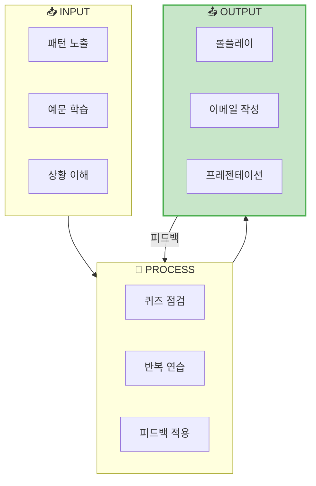
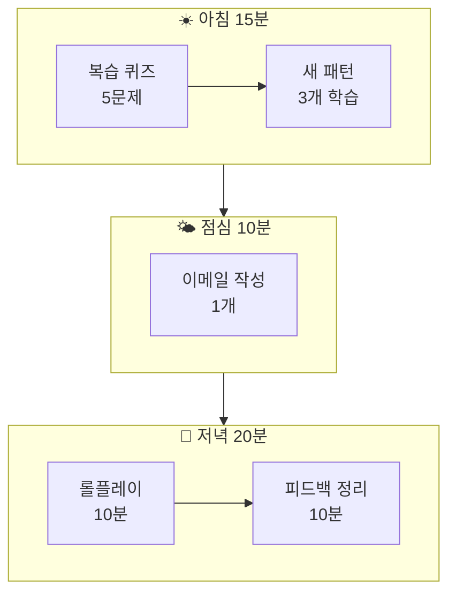

# 🎮 ChatGPT 비즈니스 영어 학습 프롬프트 시스템

> **AI를 활용한 체계적인 비즈니스 영어 학습 시스템**  
> 패턴 암기, 롤플레이, 피드백까지 완벽한 학습 사이클

---

## 📋 목차

1. [학습 시스템 설계 철학](#학습-시스템-설계-철학)
2. [레벨 1: 패턴 암기 퀴즈](#레벨-1-패턴-암기-퀴즈)
3. [레벨 2: 비즈니스 롤플레이](#레벨-2-비즈니스-롤플레이)
4. [레벨 3: 이메일 작성 연습](#레벨-3-이메일-작성-연습)
5. [레벨 4: 프레젠테이션 연습](#레벨-4-프레젠테이션-연습)
6. [레벨 5: 실전 시뮬레이션](#레벨-5-실전-시뮬레이션)
7. [일일 학습 플로우](#일일-학습-플로우)

---

## 학습 시스템 설계 철학

### 🎯 학습 사이클



### 📊 레벨별 학습 구조

| 레벨 | 학습 유형 | 목표 | 예상 시간 |
|:---:|----------|------|:--------:|
| Lv.1 | 패턴 암기 | 핵심 표현 기억 | 10분 |
| Lv.2 | 롤플레이 | 대화 흐름 익히기 | 15분 |
| Lv.3 | 이메일 작성 | 문서 작성 능력 | 15분 |
| Lv.4 | 프레젠테이션 | 발표 스킬 | 20분 |
| Lv.5 | 실전 시뮬레이션 | 종합 적용 | 30분 |

---

# 레벨 1: 패턴 암기 퀴즈

## 🎯 목표: 비즈니스 핵심 패턴 정확히 기억하기

### Quiz 1: 빈칸 채우기

```
[비즈니스 영어 빈칸 채우기 퀴즈]

📌 규칙:
1. 영어 문장에서 빈칸을 채우세요
2. 5문제 연속 진행
3. 맞으면 ✅ (+10점) / 틀리면 ❌ (정답 공개)
4. 마지막에 총점 공개

오늘의 주제: 회의 표현
난이도: ⭐⭐ (중급)

━━━━━━━━━━━━━━━━━━━━━━━━━━━━

예시:
Q1. "Let's _____ started with today's agenda."
    (a) make  (b) get  (c) have  (d) take

정답: (b) get - "Let's get started"는 회의 시작 표현

한 문제씩 보여주고, 제가 답하면 다음 문제로!
시작해주세요!
```

### Quiz 2: 한→영 변환

```
[비즈니스 한→영 변환 퀴즈]

📌 규칙:
1. 한국어 비즈니스 문장을 영어로 말하세요
2. 3초 안에 대답!
3. 정답과 비교 후 피드백
4. 10문제 후 점수 공개

난이도: ⭐⭐ (중급)
주제: 회의 및 업무 요청

━━━━━━━━━━━━━━━━━━━━━━━━━━━━

예시:
Q: "이 건에 대해 업데이트 드리고 싶습니다."
A: (내 대답)
정답: "I'd like to update you on this matter."

채점 기준:
- 완벽 일치: ✅ 10점
- 의미 통함: ⚠️ 7점  
- 틀림: ❌ 0점

시작!
```

### Quiz 3: 상황 매칭

```
[비즈니스 상황 매칭 퀴즈]

📌 규칙:
1. 비즈니스 상황을 설명하면, 가장 적절한 표현을 고르세요
2. 4지선다 객관식
3. 정답 + 왜 그게 맞는지 설명

━━━━━━━━━━━━━━━━━━━━━━━━━━━━

예시:
상황: 클라이언트에게 정중하게 미팅을 요청하고 싶습니다.

(a) "I want to meet you."
(b) "We need to have a meeting."
(c) "I'd like to schedule a meeting at your convenience."
(d) "Give me a meeting time."

정답: (c) - 가장 정중하고 프로페셔널한 표현

이런 형식으로 10문제 진행해주세요!
```

### Quiz 4: 공손함 레벨 업그레이드

```
[공손함 레벨 업그레이드 퀴즈]

📌 목표: 같은 의미를 더 공손하게 표현하기

━━━━━━━━━━━━━━━━━━━━━━━━━━━━

주어진 문장을 더 공손한 버전으로 바꾸세요:

예시:
원문: "Send me the report."
레벨 업: "Could you please send me the report?"
프로 레벨: "Would it be possible to send me the report at your earliest convenience?"

연습 문장들:
1. "I want a meeting."
2. "Tell me the price."
3. "You need to finish this today."
4. "What's your schedule?"
5. "I need more time."

각 문장을 3단계로 업그레이드해주세요:
- Level 1: 일반
- Level 2: 공손
- Level 3: 매우 공손

시작!
```

---

# 레벨 2: 비즈니스 롤플레이

## 🎯 목표: 실제 비즈니스 상황에서 자연스럽게 대화하기

### Roleplay 1: 정기 팀 미팅

```
[롤플레이: 정기 팀 미팅]

🎭 역할 설정:
- ChatGPT: 팀원들과 상사 역할
- 나: 프로젝트 매니저 역할

📋 상황:
월간 프로젝트 진행 상황 회의입니다.
- 참석자: 5명
- 목적: Q4 프로젝트 업데이트 및 이슈 논의

━━━━━━━━━━━━━━━━━━━━━━━━━━━━

진행 방식:
1. 내가 회의를 시작하고 진행합니다
2. ChatGPT는 다양한 팀원 역할로 질문하고 보고합니다
3. 10턴 대화 후 피드백

연습할 표현:
- 회의 시작/마무리
- 상태 업데이트 요청
- 이슈 논의 및 해결

시작 신호로 "Good morning, everyone. Let's get started."라고 말해주세요!
```

### Roleplay 2: 클라이언트 미팅

```
[롤플레이: 클라이언트 미팅]

🎭 역할 설정:
- ChatGPT: 클라이언트 (까다로운 타입)
- 나: 영업/계정 담당자

📋 상황:
중요 클라이언트가 서비스에 불만을 표시했습니다.
- 문제: 지연된 배송과 품질 이슈
- 목표: 관계 회복 및 계약 유지

━━━━━━━━━━━━━━━━━━━━━━━━━━━━

난이도 조절:
- Easy: 클라이언트가 협조적
- Normal: 클라이언트가 약간 불만
- Hard: 클라이언트가 매우 화남

난이도를 선택해주세요!

연습할 표현:
- 사과 표현
- 해결책 제시
- 신뢰 회복
```

### Roleplay 3: 급여 협상

```
[롤플레이: 급여/조건 협상]

🎭 역할 설정:
- ChatGPT: HR 담당자 또는 상사
- 나: 직원 (급여 인상 요청)

📋 상황:
연말 성과 평가 후 급여 협상 미팅입니다.
- 현재 연봉: $80,000
- 요청 금액: 15% 인상
- 나의 성과: 목표 120% 달성

━━━━━━━━━━━━━━━━━━━━━━━━━━━━

협상 포인트:
1. 성과 강조
2. 시장 가치 언급
3. 미래 기여 약속

ChatGPT는 현실적으로 반응해주세요:
- 처음엔 예산 제약 언급
- 점차 협상 여지 제시
- 최종 타협점 도출

시작: "Thank you for taking the time to meet with me."
```

### Roleplay 4: 프로젝트 위기 상황

```
[롤플레이: 프로젝트 위기 관리]

🎭 역할 설정:
- ChatGPT: 상사 및 이해관계자들
- 나: 프로젝트 리더

📋 상황:
주요 프로젝트에 심각한 문제가 발생했습니다.
- 문제: 핵심 벤더가 계약 취소
- 영향: 출시일 2주 지연 예상
- 미팅: 경영진에게 상황 보고

━━━━━━━━━━━━━━━━━━━━━━━━━━━━

연습할 스킬:
- 나쁜 소식 전달
- 해결책 제시
- 책임감 있는 태도
- 질문에 침착하게 대응

경영진은 압박하는 질문을 할 것입니다.
침착하고 프로페셔널하게 대응하세요!

시작!
```

### Roleplay 5: 면접관 역할

```
[롤플레이: 면접 (면접관)]

🎭 역할 설정:
- ChatGPT: 지원자
- 나: 면접관 (채용 담당자)

📋 상황:
시니어 마케팅 매니저 포지션 면접입니다.
- 지원자: 8년 경력, 타사에서 이직
- 평가 항목: 리더십, 전략적 사고, 문화 적합성

━━━━━━━━━━━━━━━━━━━━━━━━━━━━

면접 진행:
1. 인사 및 아이스브레이킹 (2분)
2. 경력 관련 질문 (10분)
3. 시나리오 질문 (5분)
4. 지원자 질문 (3분)

ChatGPT는 다양한 유형의 지원자로 연기해주세요:
- Good: 완벽하게 준비된 지원자
- Normal: 평균적인 지원자
- Challenge: 경험은 있지만 커뮤니케이션이 약한 지원자

시작!
```

---

# 레벨 3: 이메일 작성 연습

## 🎯 목표: 비즈니스 이메일 작성 능력 향상

### Email Practice 1: 요청 이메일

```
[이메일 작성 연습: 요청 이메일]

📌 상황:
다른 부서에 긴급한 데이터를 요청해야 합니다.
- 받는 사람: 재무팀 John Smith
- 필요한 것: Q3 매출 보고서
- 마감: 금요일까지
- 이유: 경영진 발표 준비

━━━━━━━━━━━━━━━━━━━━━━━━━━━━

[작성 가이드]
필수 포함 요소:
✅ 명확한 제목
✅ 정중한 인사
✅ 요청 목적
✅ 구체적 요청 사항
✅ 마감일
✅ 감사 표현

내가 이메일을 작성하면:
1. 문법/어휘 오류 체크
2. 톤/공손함 레벨 평가
3. 개선 제안
4. 모범 답안 제시

시작해주세요!
```

### Email Practice 2: 사과 이메일

```
[이메일 작성 연습: 사과 이메일]

📌 상황:
클라이언트에게 약속한 배송이 3일 지연되었습니다.
- 받는 사람: VIP 고객 Sarah Johnson
- 문제: 시스템 오류로 인한 배송 지연
- 필요한 것: 신뢰 회복, 보상 제안

━━━━━━━━━━━━━━━━━━━━━━━━━━━━

[작성 가이드]
필수 포함 요소:
✅ 진심어린 사과
✅ 문제 인정
✅ 원인 설명 (변명 아님)
✅ 해결책/보상 제안
✅ 재발 방지 약속

주의:
❌ 변명하지 않기
❌ 다른 사람 탓하지 않기
❌ 너무 길게 쓰지 않기

내 이메일을 작성하고 피드백을 받겠습니다!
```

### Email Practice 3: 협상 이메일

```
[이메일 작성 연습: 협상/제안 이메일]

📌 상황:
벤더에게 가격 인하를 요청해야 합니다.
- 받는 사람: 주요 벤더 담당자
- 현재 가격: 유닛당 $50
- 목표 가격: 유닛당 $42 (16% 할인)
- 레버리지: 대량 주문 약속

━━━━━━━━━━━━━━━━━━━━━━━━━━━━

[작성 가이드]
필수 포함 요소:
✅ 관계 가치 언급
✅ 논리적 근거 제시
✅ 상호 이익 강조
✅ 대안/타협점 제시
✅ 명확한 요청

톤:
- 요구가 아닌 제안
- 파트너십 강조
- Win-win 접근

이메일 작성 후 평가해주세요!
```

### Email Practice 4: 안 좋은 소식 전달

```
[이메일 작성 연습: 안 좋은 소식 전달]

📌 상황:
프로젝트 마감이 2주 연기되어야 함을 팀에 알려야 합니다.
- 받는 사람: 프로젝트 팀 전체
- 원인: 핵심 인력 이탈
- 영향: 클라이언트 일정 조정 필요

━━━━━━━━━━━━━━━━━━━━━━━━━━━━

[작성 가이드]
필수 포함 요소:
✅ 상황 명확히 전달
✅ 영향 범위 설명
✅ 대응 계획 제시
✅ 책임 인정
✅ 지원 요청

구조:
1. 핵심 메시지 먼저
2. 배경 설명
3. 영향 분석
4. 해결 방안
5. 다음 단계

작성해주세요!
```

---

# 레벨 4: 프레젠테이션 연습

## 🎯 목표: 영어 프레젠테이션 스킬 향상

### Presentation Practice 1: 오프닝 연습

```
[프레젠테이션 연습: 강력한 오프닝]

📌 상황:
경영진에게 새로운 제품 전략을 발표합니다.
- 청중: C-level 임원 5명
- 시간: 20분
- 목표: 예산 승인 받기

━━━━━━━━━━━━━━━━━━━━━━━━━━━━

[연습 포인트]
다음 3가지 오프닝 방식을 연습:

1. Hook 방식:
   "What if I told you that we're leaving $5 million on the table?"

2. Story 방식:
   "Last month, I met a customer who..."

3. Data 방식:
   "According to recent data, 78% of our competitors..."

각 방식으로 오프닝을 작성하고 피드백받기!
ChatGPT는 청중 역할로 반응해주세요.
```

### Presentation Practice 2: Q&A 대응

```
[프레젠테이션 연습: Q&A 대응]

📌 상황:
발표 후 질의응답 시간입니다.
ChatGPT가 다양한 유형의 질문을 던집니다.

━━━━━━━━━━━━━━━━━━━━━━━━━━━━

질문 유형:
1. 명확화 요청 - "Can you elaborate on...?"
2. 도전적 질문 - "How do you justify...?"
3. 숫자 확인 - "What's the expected ROI?"
4. 리스크 질문 - "What if this fails?"
5. 실행 관련 - "How will this be implemented?"

연습 규칙:
- ChatGPT가 질문하면 즉시 대답
- 모르면 "I'll get back to you on that"
- 5개 질문 후 종합 피드백

발표 주제를 알려주시면 시작합니다!
```

### Presentation Practice 3: 전체 발표 시뮬레이션

```
[프레젠테이션 전체 시뮬레이션]

📌 시나리오:
월간 성과 보고를 합니다.
- 청중: 팀장급 10명
- 시간: 15분 + Q&A 5분
- 내용: 영업 실적, 마케팅 성과, 다음 달 계획

━━━━━━━━━━━━━━━━━━━━━━━━━━━━

발표 구조:
[Opening] 1-2분
- 인사 및 목적

[Body] 10분
- Part 1: 영업 실적 (3분)
- Part 2: 마케팅 성과 (3분)
- Part 3: 다음 달 계획 (4분)

[Closing] 2-3분
- 요약 및 Call to Action

[Q&A] 5분

ChatGPT는:
- 중간중간 청중 반응 제공
- Q&A 시간에 질문
- 마지막에 종합 피드백

시작: "Good afternoon, everyone."
```

---

# 레벨 5: 실전 시뮬레이션

## 🎯 목표: 종합적인 비즈니스 상황 대처 능력

### Simulation 1: 하루 종합 시뮬레이션

```
[실전 시뮬레이션: 바쁜 업무일]

📌 시나리오:
오늘 하루 동안 여러 비즈니스 상황을 처리해야 합니다.

━━━━━━━━━━━━━━━━━━━━━━━━━━━━

[9:00 AM] 긴급 이메일 작성
- 클라이언트에게 미팅 재조정 요청

[10:00 AM] 팀 스탠드업 미팅
- 진행 상황 공유 및 이슈 논의

[11:00 AM] 전화 협상
- 벤더와 가격 협상

[2:00 PM] 경영진 보고
- 프로젝트 상태 프레젠테이션

[4:00 PM] 1:1 면담
- 팀원 성과 피드백

━━━━━━━━━━━━━━━━━━━━━━━━━━━━

진행 방식:
1. 각 상황을 순서대로 진행
2. 중간 교정 없이 완료
3. 모든 상황 후 종합 피드백

점수 산정:
- 각 상황 20점 (총 100점)
- 80점 이상: Pass
- 60-79점: Conditional Pass
- 60점 미만: Retry

시작!
```

### Simulation 2: 위기 관리 시뮬레이션

```
[실전 시뮬레이션: 위기 관리]

📌 시나리오:
회사에 심각한 위기가 발생했습니다.
- 문제: 제품 결함으로 인한 대규모 리콜 필요
- 영향: 고객 5,000명, 예상 손실 $2M
- 당신의 역할: 위기 대응 팀 리더

━━━━━━━━━━━━━━━━━━━━━━━━━━━━

대응해야 할 상황들:

[즉시] 경영진 브리핑
- 상황 보고 및 초기 대응 제안

[1시간 후] 언론 대응
- 기자 질문에 답변

[2시간 후] 고객 커뮤니케이션
- 사과문 작성

[3시간 후] 팀 지시
- 대응 계획 공유

ChatGPT는 각 상황의 상대방 역할:
- 압박하는 경영진
- 공격적인 기자
- 화난 고객
- 불안한 팀원

침착하게 대응하세요!
```

### Simulation 3: 해외 출장 시뮬레이션

```
[실전 시뮬레이션: 해외 출장]

📌 시나리오:
미국 본사에 출장 가서 여러 미팅을 진행합니다.

━━━━━━━━━━━━━━━━━━━━━━━━━━━━

[Day 1]
- 공항 체크인 및 비행기
- 호텔 체크인
- 환영 만찬 (소셜 대화)

[Day 2]
- 아침 팀 미팅
- 점심 네트워킹
- 오후 경영진 프레젠테이션
- 저녁 클라이언트 디너

[Day 3]
- 협상 미팅
- 마무리 및 출발

각 상황에서 적절한 영어 사용!
비즈니스 + 소셜 영어 모두 필요합니다.

시작!
```

---

# 일일 학습 플로우

## 📅 추천 일일 루틴



---

## 🌅 아침 15분 프롬프트

```
[아침 비즈니스 영어 세션]

📌 Quick Start!

━━━━━━━━━━━━━━━━━━━━━━━━━━━━

[Step 1] 복습 퀴즈 (5분)
- 어제 배운 표현 5개
- 빈칸 채우기 or 한→영 변환

[Step 2] 오늘의 새 표현 (8분)
- 새 패턴 3개 소개
- 예문 각 2개씩 따라하기

[Step 3] 빠른 점검 (2분)
- 새 패턴으로 문장 3개 만들기

━━━━━━━━━━━━━━━━━━━━━━━━━━━━

오늘의 주제: 회의 표현
난이도: 중급

시작!
```

---

## 🌙 저녁 20분 프롬프트

```
[저녁 비즈니스 영어 세션]

📌 Deep Practice!

━━━━━━━━━━━━━━━━━━━━━━━━━━━━

[Step 1] 미니 롤플레이 (10분)
- 오늘 주제 관련 상황
- 5턴 대화 연습

[Step 2] 피드백 & 정리 (10분)
- 오늘 잘한 표현 3개
- 개선할 표현 3개
- 내일 복습할 것

━━━━━━━━━━━━━━━━━━━━━━━━━━━━

오늘 연습할 상황: 클라이언트 미팅

시작!
```

---

## 🎮 포인트 & 레벨 시스템

```
[비즈니스 영어 레벨 시스템]

📊 점수 획득:

| 활동 | 포인트 |
|------|--------|
| 퀴즈 정답 | +10 |
| 롤플레이 완료 | +50 |
| 이메일 작성 | +30 |
| 프레젠테이션 | +100 |
| 일일 목표 달성 | +100 |

📈 레벨:

| 레벨 | 포인트 | 칭호 |
|------|--------|------|
| Lv.1 | 0 | Intern |
| Lv.2 | 500 | Associate |
| Lv.3 | 1500 | Professional |
| Lv.4 | 3000 | Senior |
| Lv.5 | 5000 | Manager |
| Lv.6 | 10000 | Executive |
```

---

## 🚀 Quick Start

```
[오늘 학습 시작!]

안녕하세요! 비즈니스 영어 학습을 시작합니다.

📌 오늘의 학습 모드를 선택하세요:

1️⃣ [패턴 퀴즈] - 빠른 암기 점검 (10분)
2️⃣ [롤플레이] - 대화 연습 (15분)
3️⃣ [이메일 작성] - 문서 작성 연습 (15분)
4️⃣ [프레젠테이션] - 발표 연습 (20분)
5️⃣ [종합 시뮬레이션] - 실전 연습 (30분)
6️⃣ [맞춤 학습] - 원하는 주제로

━━━━━━━━━━━━━━━━━━━━━━━━━━━━

현재 레벨: [레벨 확인]
오늘 목표: 패턴 5개 마스터 + 롤플레이 1회

숫자를 입력하여 시작하세요!
```

---

*AI와 함께하는 체계적인 비즈니스 영어 학습! 🌟*

*Last Updated: 2026-01-10*

