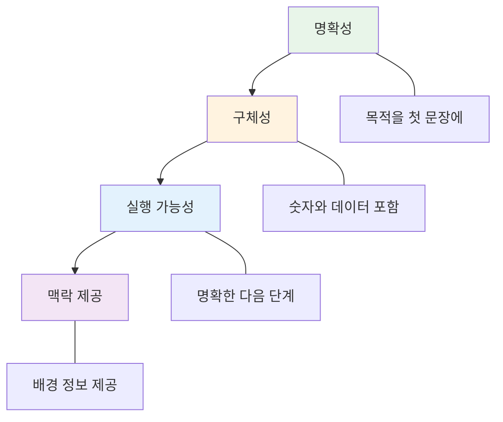

# 📧 개발자를 위한 비즈니스 이메일 템플릿

> **Full Stack + AI 개발자를 위한 실전 이메일 작성 가이드**  
> 기술 제안, 버그 리포트, 릴리즈 노트, 코드 리뷰, 프로젝트 업데이트

---

## 📋 목차
1. [이메일 구조 개요](#이메일-구조-개요)
2. [기술 제안 이메일](#-기술-제안-이메일-templates-1-8)
3. [버그 리포트 이메일](#-버그-리포트-이메일-templates-9-14)
4. [프로젝트 업데이트](#-프로젝트-업데이트-templates-15-20)
5. [코드 리뷰 및 피드백](#-코드-리뷰-및-피드백-templates-21-26)
6. [릴리즈 노트](#-릴리즈-노트-templates-27-30)
7. [AI/ML 프로젝트 관련](#-aiml-프로젝트-관련-templates-31-36)
8. [클라이언트 소통](#-클라이언트-소통-templates-37-42)

---

## 이메일 구조 개요

### 개발자 이메일 핵심 원칙



### 기술 레벨별 이메일 톤

| 수신자 | 접근 방식 | 주의사항 |
|-------|---------|---------|
| 개발 팀 | 기술적 세부사항 OK | 코드 스니펫, 스택트레이스 포함 가능 |
| PM/PO | 비즈니스 영향 중심 | 기술 용어 최소화, 결과 중심 |
| 경영진 | ROI와 리스크 | 숫자, 타임라인, 비용 명확히 |
| 클라이언트 | 해결책 중심 | 전문 용어 피하고 실용적 설명 |

---

## 🔧 기술 제안 이메일 (Templates 1-8)

### Template 1: 아키텍처 개선 제안

```
Subject: Proposal: Microservices Migration Strategy

Dear [Team/Manager],

I'd like to propose a gradual migration from our monolithic architecture to microservices. This addresses three critical pain points we've discussed:

**Current Challenges:**
• Deployment bottleneck: 2-hour deployment windows block parallel development
• Scalability limitation: Unable to scale individual components independently
• Technology lock-in: Difficult to adopt new technologies for specific use cases

**Proposed Solution:**
Implement the Strangler Fig pattern to gradually extract services:

Phase 1 (Months 1-2): Extract authentication service
• Minimal risk: Clear boundaries, well-tested functionality
• Immediate benefit: Independent scaling for auth load

Phase 2 (Months 3-4): Extract notification service
• Unlocks: Ability to use Go for high-performance messaging
• Benefit: Reduce notification latency from 500ms to <50ms

Phase 3 (Months 5-6): Extract payment processing
• Highest impact: PCI compliance isolation
• Benefit: Simplify audit process, reduce compliance scope

**Business Impact:**
• Deployment frequency: From once/week to multiple times/day
• Developer velocity: 30% increase (based on similar migrations)
• Infrastructure cost: Initial +$2K/month, ROI in 4 months via efficiency

**Resources Needed:**
• 2 senior engineers (60% allocation for 6 months)
• DevOps support (20% allocation)
• Budget: $15K for infrastructure

**Risks & Mitigation:**
• Data consistency: Implement Saga pattern for distributed transactions
• Operational complexity: Invest in observability from day 1
• Learning curve: Dedicate 2 weeks for team training

I've attached a detailed RFC with architecture diagrams and implementation timeline. Happy to discuss in our next architecture review.

Best regards,
[Your Name]
Senior Software Engineer
```

---

### Template 2: 기술 스택 변경 제안

```
Subject: RFC: Migrating from REST to GraphQL

Hi Team,

I'm proposing we adopt GraphQL for our new API gateway. Here's the business case:

**Problem Statement:**
Our current REST API requires clients to make 8-12 requests to load a single dashboard. This creates:
• Poor mobile experience (high latency on 3G/4G)
• Over-fetching: 70% of data fetched is unused
• Maintenance burden: 45+ endpoints to maintain

**Proposed Solution: GraphQL Gateway**

Technical Benefits:
• Single request for complex data requirements
• Client-specified data fetching (eliminate over-fetching)
• Strong typing and auto-generated documentation
• Real-time subscriptions for live data

Performance Impact:
• Dashboard load time: 3.2s → 0.8s (75% reduction)
• API calls per session: 12 → 1-2 (90% reduction)
• Bandwidth usage: -60% (based on PoC)

**Implementation Plan:**
Week 1-2: GraphQL server setup + core schema design
Week 3-4: Migrate 5 most-used endpoints
Week 5-6: Client integration + testing
Week 7-8: Gradual rollout with feature flags

**Cost Analysis:**
• Development: 320 engineer hours
• Infrastructure: +$500/month (caching layer)
• Training: 2-day workshop for team

**Risk Management:**
• Backward compatibility: Keep REST API for 6 months
• Performance: Implement query complexity analysis
• Caching: Use DataLoader pattern to prevent N+1 queries

I've built a proof-of-concept that I can demo. Let's discuss in our next sprint planning.

Best,
[Your Name]
```

---

### Template 3: 성능 최적화 제안

```
Subject: Performance Optimization Proposal: Database Query Improvements

Dear [Manager],

I've identified significant performance optimization opportunities in our database layer.

**Current State Analysis:**
I profiled our production queries and found:
• 15 queries taking >2 seconds (95th percentile)
• Missing indexes causing full table scans
• N+1 query patterns in user dashboard
• Unoptimized JOIN operations

**Measured Impact:**
• Dashboard load time: Average 4.2 seconds
• Database CPU usage: Consistently 85-90%
• Customer complaints: 23 tickets last month about slowness

**Proposed Optimizations:**

1. Add Composite Indexes (Effort: 2 days)
   • Expected improvement: 60% faster queries
   • No code changes required
   • Zero downtime deployment

2. Implement Query Caching (Effort: 1 week)
   • Technology: Redis with 5-minute TTL
   • Expected improvement: 80% reduction in DB calls
   • Cost: +$200/month for Redis cluster

3. Refactor N+1 Queries (Effort: 3 days)
   • Use eager loading with includes
   • Expected improvement: Dashboard 75% faster
   • Requires code changes in 8 controllers

4. Database Connection Pooling (Effort: 1 day)
   • Current: 10 connections, hitting limits
   • Proposed: Dynamic pool with 50-100 connections
   • Expected improvement: Handle 3x concurrent users

**Projected Results:**
• Dashboard load: 4.2s → 0.9s (79% improvement)
• Database CPU: 85% → 45% (more headroom)
• User satisfaction: Eliminate slowness complaints

**Timeline: 3 Weeks**
Week 1: Indexes + connection pooling (quick wins)
Week 2: Caching implementation
Week 3: N+1 refactoring + testing

**Request:**
Approval to prioritize this work in next sprint. The customer impact justifies the investment.

Attached: Performance analysis report with query execution plans.

Thanks,
[Your Name]
```

---

### Template 4: 보안 개선 제안

```
Subject: Security Vulnerability Assessment & Remediation Plan

Dear Security Team,

I conducted a security audit of our authentication system and identified several vulnerabilities that require immediate attention.

**Critical Issues (P0):**

1. JWT Token Storage in localStorage
   • Vulnerability: XSS attack vector
   • Impact: Session hijacking possible
   • Fix: Migrate to httpOnly cookies
   • Effort: 3 days
   • Risk: HIGH (actively exploitable)

2. Missing SQL Injection Protection
   • Vulnerability: User input not sanitized in 12 queries
   • Impact: Database compromise possible
   • Fix: Implement prepared statements
   • Effort: 2 days
   • Risk: CRITICAL

**High Priority Issues (P1):**

3. Lack of Rate Limiting
   • Vulnerability: Brute force attacks on /login
   • Impact: Account takeover attempts
   • Fix: Implement rate limiting (5 attempts/15min)
   • Effort: 1 day

4. Outdated Dependencies
   • Vulnerability: 8 npm packages with known CVEs
   • Impact: Various (see attached report)
   • Fix: Update dependencies + regression testing
   • Effort: 2 days

**Proposed Remediation Timeline:**

Week 1 (Critical):
• Day 1-2: SQL injection fixes
• Day 3-5: JWT to httpOnly cookie migration

Week 2 (High Priority):
• Day 1: Rate limiting implementation
• Day 2-3: Dependency updates
• Day 4-5: Security testing & verification

**Additional Recommendations:**
• Implement Content Security Policy (CSP)
• Add 2FA for admin accounts
• Set up automated security scanning in CI/CD

**Request:**
• Approval to prioritize security fixes in current sprint
• Security review of implementation before production
• Budget for security monitoring tools ($500/month)

I'm available to discuss urgency and implementation details.

Best regards,
[Your Name]
Security-conscious Developer
```

---

### Template 5: AI/ML 모델 개선 제안

```
Subject: Proposal: Upgrade Recommendation Engine to Transformer Model

Hi [Team],

I'm proposing we upgrade our recommendation engine from collaborative filtering to a transformer-based model. Here's the data-driven case:

**Current Model Performance:**
• Accuracy: 72%
• Inference time: 450ms (P95)
• Training time: 6 hours weekly
• Cold start problem: Poor recommendations for new users

**Proposed: Transformer-Based Model**

I've prototyped a BERT-based recommendation model with impressive results:

Performance Improvements:
• Accuracy: 72% → 89% (+24% improvement)
• Cold start: 45% → 78% accuracy for new users
• Explainability: Can surface "why" for recommendations

Technical Approach:
• Architecture: Fine-tuned BERT on user behavior sequences
• Training: Transfer learning from pre-trained model
• Deployment: TensorFlow Serving on GPU instances

**Business Impact:**
Based on A/B test with 5% of users:
• Click-through rate: +18%
• Conversion rate: +12%
• User engagement: +23% (time on platform)

Revenue Impact:
• Projected additional revenue: $45K/month
• ROI: 3.5x within first year

**Implementation Plan:**

Phase 1 (Weeks 1-2): Infrastructure Setup
• Provision GPU instances (AWS p3.2xlarge)
• Set up training pipeline
• Implement monitoring

Phase 2 (Weeks 3-4): Model Development
• Fine-tune BERT on historical data
• Hyperparameter optimization
• Validation against test set

Phase 3 (Weeks 5-6): Production Integration
• Model serving endpoint
• A/B testing framework
• Gradual rollout (10% → 50% → 100%)

**Cost Analysis:**
• GPU infrastructure: $800/month
• Development time: 6 weeks (1 ML engineer)
• One-time training: $200 (compute costs)

Net benefit: $44.2K/month after infrastructure costs

**Risks & Mitigation:**
• Model complexity: Implement model monitoring & alerting
• Inference latency: Use model quantization (450ms → 80ms)
• Dependency: Keep old model as fallback

Attached: Technical RFC with model architecture diagram and evaluation metrics.

Let's discuss in our next ML sync.

Best,
[Your Name]
ML Engineer
```

---

### Template 6: 테스트 자동화 제안

```
Subject: Proposal: Comprehensive Test Automation Strategy

Dear Team,

I'm proposing we invest in test automation to improve code quality and deployment confidence.

**Current State (Pain Points):**
• Manual testing takes 8 hours per release
• Regression bugs slip through (12 in last quarter)
• Test coverage: Only 35%
• Deployment anxiety: "Hope it works in prod"

**Proposed Testing Strategy:**

1. Unit Testing (Target: 80% coverage)
   • Tool: Jest for JavaScript, pytest for Python
   • Focus: Business logic and utility functions
   • Integration: Required for PR approval

2. Integration Testing
   • Tool: Supertest for API testing
   • Coverage: All API endpoints
   • Automated: Run on every commit

3. End-to-End Testing
   • Tool: Playwright for browser automation
   • Coverage: Critical user flows (auth, checkout, etc.)
   • Frequency: Run on staging before production

4. Performance Testing
   • Tool: k6 for load testing
   • Tests: API response times, concurrent users
   • Threshold: Fail deployment if P95 > 200ms

**Implementation Roadmap:**

Week 1-2: Foundation
• Set up testing infrastructure
• Define coverage goals
• Create testing guidelines

Week 3-4: Unit Tests
• Write tests for critical paths
• Reach 60% coverage baseline

Week 5-6: Integration Tests
• Cover all API endpoints
• Set up CI/CD integration

Week 7-8: E2E Tests
• Automate critical user flows
• Integrate with deployment pipeline

**Expected Outcomes:**

Quality Improvements:
• Regression bugs: -75% (based on industry data)
• Bug detection: Shift left to development phase
• Deployment confidence: High confidence releases

Time Savings:
• Manual testing: 8 hours → 30 minutes
• Bug fixing: -50% time (catch earlier)
• Deployment frequency: 1x/week → daily

**Investment Required:**
• Initial setup: 120 engineer hours
• Ongoing maintenance: 4 hours/week
• Tool costs: $200/month (CI minutes + tooling)

ROI: 3 months (based on time savings)

**Request:**
• Approval to allocate 30% of sprint capacity for 2 months
• Budget for testing tools
• Team training session (half-day workshop)

Happy to present detailed plan in next tech meeting.

Best regards,
[Your Name]
```

---

### Template 7: DevOps 개선 제안

```
Subject: RFC: Implementing CI/CD Pipeline with GitHub Actions

Hi Team,

I'm proposing we implement a robust CI/CD pipeline to streamline our deployment process.

**Current Deployment Process (Manual):**
1. Developer pushes to branch
2. Manual code review
3. Manual merge to main
4. Manual server SSH login
5. Manual git pull + restart services
6. Manual smoke testing

Time: 45 minutes per deployment
Error rate: 15% (deployments with issues)

**Proposed: Automated CI/CD Pipeline**

GitHub Actions Workflow:

```yaml
# Automatic on every PR
├── Linting & Code Style Checks
├── Unit Tests (Jest, pytest)
├── Integration Tests (API tests)
├── Security Scanning (npm audit, Snyk)
└── Build Verification

# Automatic on merge to main
├── Build Docker Images
├── Push to Registry (ECR)
├── Deploy to Staging
├── Run E2E Tests
├── Deploy to Production (if tests pass)
└── Slack Notification
```

**Benefits:**

Speed:
• Deployment time: 45 min → 8 min (83% faster)
• Feedback loop: Instant PR checks

Quality:
• Automated testing catches bugs pre-deployment
• Consistent deployment process (no human error)

Confidence:
• Staged rollout: Staging → Production
• Automatic rollback on failure
• Full audit trail of deployments

**Implementation Plan:**

Week 1: CI Setup
• Configure GitHub Actions
• Set up linting + unit tests
• Require passing tests for PR merge

Week 2: Containerization
• Dockerize applications
• Set up ECR for image storage
• Configure build optimization

Week 3: CD to Staging
• Automate staging deployment
• Set up E2E test suite
• Implement smoke tests

Week 4: Production Deployment
• Blue-green deployment strategy
• Automatic rollback mechanism
• Monitoring & alerting integration

**Cost:**
• GitHub Actions: $200/month (estimated)
• AWS ECR: $50/month
• Development time: 80 hours

Savings: $2,400/year in deployment time alone

**Risk Mitigation:**
• Keep manual deployment option as backup
• Gradual rollout: Start with staging only
• Extensive testing before production automation

Attached: Detailed workflow diagrams and cost breakdown.

Let's discuss in our next planning meeting.

Thanks,
[Your Name]
DevOps Engineer
```

---

### Template 8: 코드 리팩토링 제안

```
Subject: Technical Debt: Refactoring Proposal for Legacy Authentication Module

Dear [Manager],

I'd like to address significant technical debt in our authentication module. This is impacting our ability to add new features and maintain security.

**Current State Analysis:**

Code Quality Issues:
• Cyclomatic complexity: 45 (threshold: 10)
• Function length: Up to 500 lines
• Code duplication: 40% duplicate code
• Test coverage: 12%

Business Impact:
• Bug fix time: Average 8 hours (should be 2 hours)
• New feature velocity: 50% slower than other modules
• Security vulnerabilities: 3 CVEs in last 6 months

**Proposed Refactoring:**

1. Break Down God Functions
   • Split 500-line functions into 20-50 line functions
   • Apply Single Responsibility Principle
   • Effort: 5 days

2. Implement Design Patterns
   • Strategy Pattern for auth methods (OAuth, SAML, local)
   • Factory Pattern for user creation
   • Effort: 3 days

3. Increase Test Coverage
   • Add unit tests (12% → 85%)
   • Add integration tests for auth flows
   • Effort: 4 days

4. Remove Code Duplication
   • Extract common logic to utilities
   • Use composition over inheritance
   • Effort: 2 days

**Timeline: 3 Weeks**

Week 1: Breaking down large functions + initial tests
Week 2: Implementing design patterns
Week 3: Final testing + documentation

**Benefits:**

Short-term:
• Easier to understand and modify
• Faster onboarding for new developers
• Reduced bug fix time (8h → 2h)

Long-term:
• Enable new auth methods (passwordless, biometric)
• Improved security (easier to audit)
• Foundation for future features

**Risk Management:**
• No changes to external behavior
• Comprehensive test suite before refactoring
• Feature flag for gradual rollout
• Pair programming for knowledge sharing

**Request:**
Approval to dedicate 1 engineer full-time for 3 weeks. The investment will pay dividends in reduced maintenance costs and faster feature development.

Attached: Code complexity analysis and refactoring plan.

Best regards,
[Your Name]
```

---

## 🐛 버그 리포트 이메일 (Templates 9-14)

### Template 9: Critical Bug Report

```
Subject: P0 BUG: Payment Processing Failure in Production

URGENT - READ IMMEDIATELY

**Summary:**
Payment processing is failing for all transactions since 14:32 UTC. This is blocking all revenue.

**Impact:**
• All payment attempts failing (100% error rate)
• Estimated revenue loss: $2,000/hour
• Customer support receiving angry calls
• 47 failed transactions in last 15 minutes

**Symptoms:**
• Users see "Payment Failed" error
• Error logs show: "Stripe API timeout after 30s"
• No successful payments since 14:32 UTC

**Root Cause (Initial Analysis):**
• Stripe API latency increased from 200ms to 45s
• Our timeout is 30s, causing failures
• Stripe status page shows "Partial Outage"

**Immediate Actions Taken:**
• Increased timeout to 60s (14:45 UTC)
• Implemented retry logic with exponential backoff
• Payments now succeeding (testing confirms)

**Monitoring:**
• Added alert for payment success rate <95%
• Dashboardmonitoring Stripe API latency

**Next Steps:**
• Review timeout configuration (currently too aggressive)
• Implement circuit breaker pattern
• Add graceful degradation (queue payments for retry)

**Stakeholder Communication:**
• CTO notified: 14:35 UTC
• Customer Support briefed: 14:50 UTC
• Post-mortem scheduled: Tomorrow 10 AM

**Current Status: RESOLVED**
• Issue duration: 13 minutes
• Estimated revenue impact: $433
• All systems operational as of 14:45 UTC

Full post-mortem report to follow.

[Your Name]
On-call Engineer
Mobile: [phone]
```

---

### Template 10: Bug Report with Reproduction Steps

```
Subject: BUG: User Dashboard Crashes on Safari 15+

**Bug Description:**
User dashboard crashes immediately on load for Safari 15+ users.

**Severity:** P1 (affects 15% of user base)
**Environment:** Production
**Browser:** Safari 15.0+ on macOS and iOS
**First Reported:** 2024-01-09

**Reproduction Steps:**
1. Log in as any user
2. Navigate to /dashboard
3. Observe: Page shows blank white screen
4. Check console: TypeError: Cannot read property 'map' of undefined

**Expected Behavior:**
Dashboard loads with user statistics and recent activity.

**Actual Behavior:**
White screen, no error message to user, console shows JavaScript error.

**Root Cause Analysis:**
• Safari 15 doesn't support optional chaining on undefined
• Code uses: `data?.items?.map()` when data is undefined
• Works in Chrome/Firefox (more lenient error handling)

**Affected Users:**
• Safari users: ~2,000 users (15% of daily active)
• No workaround available for end users
• Blocking users from accessing core functionality

**Proposed Fix:**
```javascript
// Current (broken)
const items = data?.items?.map(item => ...)

// Fixed
const items = data?.items ? data.items.map(item => ...) : []
```

**Testing Plan:**
• Test on Safari 15.0, 15.1, 15.2
• Verify backward compatibility with Safari 14
• Test on iOS Safari (iPhone, iPad)
• Confirm other browsers still work

**Timeline:**
• Fix ready: Today EOD
• Testing: Tomorrow morning
• Deploy to staging: Tomorrow afternoon
• Production deploy: Tomorrow EOD

**Request:**
Approval to fast-track this fix through review and deploy tomorrow.

Attached: Screenshots, console logs, and proposed patch.

[Your Name]
Frontend Engineer
```

---

### Template 11: Performance Bug Report

```
Subject: Performance Issue: API Response Time Degraded 10x

**Issue Summary:**
API response times have degraded significantly over the past 3 days.

**Metrics:**
• P50 latency: 120ms → 450ms (3.75x increase)
• P95 latency: 300ms → 3,200ms (10.6x increase)
• Timeout errors: 0.1% → 5.8%

**User Impact:**
• Slow page loads
• 12 customer complaints about "slow site"
• Mobile experience particularly affected

**Timeline:**
• Normal performance: Until January 7, 11:00 UTC
• Degradation started: January 7, 11:30 UTC
• Current state: Still degraded

**Investigation Findings:**

1. Database Query Performance
   • Slow query log shows new N+1 query pattern
   • Introduced in commit abc123f (deployed Jan 7 10:45)
   • `/api/users/dashboard` endpoint affected most

2. Missing Database Index
   • `user_activities` table grew to 10M rows
   • Queries doing full table scan
   • No index on `user_id + created_at`

3. Increased Traffic
   • Normal: 1,000 req/min
   • Current: 1,500 req/min (+50%)
   • Marketing campaign launched Jan 7

**Immediate Mitigation (Applied):**
• Added database index (15 min ago)
• Result: P95 latency 3,200ms → 800ms (better, not fixed)

**Remaining Work:**
• Fix N+1 query in code (will reduce to <200ms)
• Implement query caching
• Add database connection pooling

**Timeline to Full Resolution:**
• Code fix: Today (4 hours)
• Deploy to staging: Today EOD
• Production deployment: Tomorrow morning
• Full resolution: Tomorrow by noon

**Monitoring Added:**
• Alert when P95 > 500ms
• Dashboard showing query performance
• Slack alerts to #engineering

**Request:**
Approval to deploy the fix to production tomorrow morning (non-standard deploy window).

Attached: Performance graphs, slow query analysis, and fix PR.

[Your Name]
Backend Engineer
```

---

### Template 12: Security Vulnerability Report

```
Subject: SECURITY VULNERABILITY: XSS in User Profile Page

**Severity: HIGH**
**CVSS Score: 7.3**

**Vulnerability Description:**
Cross-Site Scripting (XSS) vulnerability in user profile bio field allows attackers to execute arbitrary JavaScript in other users' browsers.

**Affected Component:**
• Frontend: User profile page (/users/:id)
• Code file: `components/UserProfile.jsx`
• Versions: All versions since v2.1.0 (6 months)

**Vulnerability Details:**

Type: Stored XSS
Vector: User bio field accepts HTML without sanitization
Exploitability: Easy (no authentication required to view profiles)

**Proof of Concept:**
1. Create account
2. Set bio to: ``
3. Any user visiting profile executes script
4. Attacker can steal session cookies

**Potential Impact:**
• Session hijacking
• Account takeover
• Malware distribution
• Reputation damage

**Affected Users:**
• All users who view malicious profiles
• Estimated exposure: 10,000+ users
• No known active exploits (yet)

**Proposed Fix:**

Option 1 (Quick - 1 hour):
Strip all HTML from bio field
- Cons: Removes legitimate formatting

Option 2 (Better - 4 hours):
Use DOMPurify to sanitize HTML
- Allows safe HTML, blocks scripts
- Industry standard solution

**Recommendation: Option 2**

**Implementation Plan:**
1. Install DOMPurify library
2. Sanitize on save (backend)
3. Sanitize on render (frontend, defense in depth)
4. Audit existing bios for malicious content
5. Add security tests to prevent regression

**Timeline:**
• Fix development: 4 hours
• Security testing: 2 hours
• Production deployment: Tomorrow
• Audit existing content: Tomorrow
• Communication: After fix deployed

**Disclosure:**
• Reported by: Internal security audit
• Not publicly disclosed
• No known exploitation
• Suggest responsible disclosure timeline: 90 days

**Immediate Actions:**
• Flagged as P1 priority
• Created hotfix branch
• Security team notified
• CEO/CTO briefed

**Request:**
Urgent approval to deploy hotfix outside normal release cycle.

Attached: Security analysis, PoC video, and proposed patch.

[Your Name]
Security Engineer
[Signal/secure contact]
```

---

### Template 13: Data Integrity Bug

```
Subject: Data Integrity Issue: Duplicate User Records Created

**Issue Description:**
Our system is creating duplicate user records under specific race conditions.

**Severity:** P1
**Impact:** Data integrity, user confusion, potential billing issues

**Symptoms:**
• 47 users have duplicate accounts (0.5% of users)
• Same email address, different user IDs
• Occurred between Jan 5-8
• Users complain they "can't log in" (logging into wrong account)

**Root Cause:**
Race condition in user registration:

```javascript
// Current code (vulnerable)
1. Check if email exists
2. [Gap: Another request can come in here]
3. Create user if not exists

// Problem: Two simultaneous requests both pass check
```

**How It Happens:**
1. User double-clicks "Sign Up" button (impatient user)
2. Two requests sent simultaneously
3. Both check "email exists" → both return false
4. Both create user with same email
5. Database has no UNIQUE constraint (oversight)

**Data Impact:**
• 47 users affected
• Duplicate registrations: Jan 5 (12), Jan 6 (18), Jan 7 (11), Jan 8 (6)
• No financial impact (billing system uses primary account)

**Proposed Fix:**

Short-term (Today):
• Add UNIQUE constraint on email column
• Handle constraint violation gracefully
• Prevents new duplicates

Long-term (This Week):
• Implement idempotency keys for user creation
• Add request deduplication
• Frontend: Disable button on click

**Data Cleanup:**
• Merge duplicate accounts (preserve all data)
• Notify affected users
• Offer account verification

**Testing:**
• Simulate race condition in test environment
• Verify UNIQUE constraint works
• Test merge script on staging data

**Timeline:**
• Database fix: Today (2 hours)
• Code fix: Tomorrow (4 hours)
• Data cleanup script: Tomorrow (3 hours)
• Run cleanup: Day after tomorrow
• User communication: After cleanup complete

**Monitoring:**
• Alert on duplicate email attempts
• Daily audit for duplicates
• Dashboard showing data integrity metrics

**Request:**
• Approval for database migration in production
• Review of data cleanup script before execution
• Communication template for affected users

Attached: Database analysis, fix PR, and cleanup script.

[Your Name]
Database Engineer
```

---

### Template 14: Integration Bug Report

```
Subject: Third-Party Integration Failure: Stripe Webhooks Not Processed

**Issue:**
Stripe webhook events are not being processed, causing payment status to be out of sync.

**Severity:** P1
**Business Impact:** Payment status incorrect, manual reconciliation required

**Discovery:**
• Internal audit found 234 payments marked "pending" for >24 hours
• Should be "completed" or "failed" based on Stripe dashboard
• Accounting team flagged discrepancies
• Issue started: January 6, 08:00 UTC

**Root Cause:**
Stripe webhook endpoint failing silently:

```
POST /webhooks/stripe
↓
Webhook signature verification: ✓ Passing
↓
Event processing: ✗ Failing (unhandled exception)
↓
Return 500 to Stripe
↓
Stripe retries (gives up after 3 days)
```

**Technical Details:**
• Error: `Cannot read property 'metadata' of undefined`
• Occurs when: Stripe sends events for subscriptions (we only handle payments)
• Our code assumes `event.data.object.metadata` always exists
• Stripe doesn't include metadata for subscription events

**Affected Events:**
• `payment_intent.succeeded`: 156 events lost
• `charge.refunded`: 12 events lost
• `payment_intent.payment_failed`: 66 events lost

**Impact:**
• Users not receiving payment confirmation emails
• Admin dashboard shows incorrect payment status
• Accounting reconciliation impossible
• Potential double-charging risk (retrying "pending" payments)

**Immediate Actions:**

1. Fix Code (Done - 30 min ago):
```javascript
// Before (broken)
const metadata = event.data.object.metadata;

// After (fixed)
const metadata = event.data.object?.metadata || {};
```

2. Deployed to Production (Done)
3. Manual Reconciliation (In Progress):
   • Fetch missing events from Stripe API
   • Process retrospectively
   • Update database
   • Send delayed confirmation emails

**Prevention:**

1. Add Error Logging
   • Log webhook failures to Sentry
   • Alert on >5% webhook failure rate

2. Add Monitoring
   • Dashboard for webhook health
   • Daily sync check (compare Stripe vs our DB)

3. Add Tests
   • Test webhook handling with various event types
   • Include edge cases (missing fields)

**Reconciliation Timeline:**
• Script development: 2 hours (done)
• Test on staging: 1 hour
• Production run: 30 minutes
• Verification: 2 hours
• Complete: Today EOD

**User Communication:**
• 156 users will receive late payment confirmations
• Email template prepared
• Support team briefed on potential inquiries

**Lessons Learned:**
• Always handle optional fields gracefully
• Test with production-like data
• Monitor third-party integrations actively
• Have reconciliation procedures documented

**Request:**
• Approval to run reconciliation script in production
• Review of user communication email

Attached: Error logs, reconciliation script, and monitoring dashboard.

[Your Name]
Integration Engineer
```

---

## 📊 프로젝트 업데이트 (Templates 15-20)

### Template 15: Sprint Update to Stakeholders

```
Subject: Sprint 24 Update: E-commerce Platform Redesign

Dear Stakeholders,

Quick update on our progress for Sprint 24 (Jan 8-19).

**🎯 Sprint Goal: Complete Product Page Redesign**

**✅ Completed This Week:**
• New product image carousel (responsive, 60fps animations)
• Review section with filtering and sorting
• "Add to Cart" with optimistic UI updates
• Recommendation engine integration (showing 4 related products)

**📊 Key Metrics:**
• Story points completed: 32 / 38 (84%)
• Velocity: On track with historical average
• Bugs found: 3 (all fixed within sprint)
• Code review avg time: 4.2 hours (down from 8 hours last sprint)

**🚧 In Progress:**
• Mobile optimization (80% complete)
• Performance testing (scheduled for tomorrow)
• A/B test setup (backend ready, frontend in progress)

**⚠️ Risks & Blockers:**
• Design team slightly behind on mobile mockups
  → Mitigation: Using responsive best practices to proceed
  → Impact: Minimal, will adjust if designs differ

• Third-party image CDN pricing higher than expected
  → Working with procurement on negotiation
  → Alternative: Self-hosted CDN (backup plan ready)

**📅 Next Week:**
• Complete mobile optimization
• Run performance benchmarks (target: <2s page load)
• Launch A/B test with 10% of traffic
• Begin work on checkout flow redesign

**🎉 Wins:**
• Frontend performance improved 40% (Lighthouse score: 65→91)
• Zero production incidents this sprint
• Team morale: High (retrospective feedback)

**📈 Business Impact Projection:**
• New design tested with 100 beta users
• Click-through to product details: +23%
• Time on page: +31% (better engagement)
• Estimated conversion lift: +8-12% (pending A/B test validation)

**Next Update:** Friday, January 19 (Sprint Review)

Questions? Let's discuss in tomorrow's stakeholder sync.

Best,
[Your Name]
Engineering Lead

---
Links:
• Project Dashboard: [link]
• Design Mockups: [link]
• Performance Report: [attached]
```

---

### Template 16: Monthly Engineering Update

```
Subject: January Engineering Update: Platform Achievements & Roadmap

Dear Leadership Team,

Here's our monthly engineering update for January 2024.

**📊 Key Metrics:**

Delivery:
• Features shipped: 12 (vs 10 target)
• Bug fixes: 47
• Technical debt reduced: 15% (measured by code complexity)
• Deployment frequency: 3.2 per week (up from 2.1)

Quality:
• Production incidents: 2 (down from 5 last month)
• Mean time to recovery: 22 minutes (target: <30 min)
• Test coverage: 73% (up from 68%)
• User-reported bugs: Down 31%

Performance:
• API response time (P95): 180ms (within SLA)
• Uptime: 99.97% (above 99.9% target)
• Error rate: 0.08% (well below 1% threshold)

**🏆 Major Achievements:**

1. Microservices Migration (Milestone 1)
   • Extracted authentication service
   • Reduced deployment bottleneck by 50%
   • Independent scaling now possible

2. AI Recommendation Engine V2
   • Accuracy improved from 72% to 89%
   • Increased click-through rate by 18%
   • Revenue impact: +$45K/month

3. Security Enhancements
   • Fixed 12 vulnerabilities (including 2 critical)
   • Implemented automated security scanning
   • Completed PCI compliance audit (passed)

4. Performance Optimization
   • Dashboard load time: 4.2s → 0.9s (79% improvement)
   • Database CPU usage: 85% → 45%
   • Eliminated customer slowness complaints

**💼 Team Developments:**

• Hired: 2 senior engineers (full-stack, ML)
• Training: Conducted Kubernetes workshop for team
• Retention: 100% (all team members staying)
• Satisfaction: 8.7/10 (quarterly survey)

**🔮 February Roadmap:**

Week 1-2:
• Launch product page redesign (A/B test)
• Complete Stripe integration upgrade
• Begin checkout flow optimization

Week 3-4:
• Microservices migration (payment service)
• Implement real-time notifications
• Mobile app performance improvements

**💰 Budget & Resources:**

Spent: $124K / $135K (92% of monthly budget)
• Infrastructure: $45K (cloud, CDN, databases)
• Tools & Services: $8K (GitHub, monitoring, Jira)
• Personnel: $71K (team salaries)

Forecast for February: $138K
• New infrastructure for microservices: +$5K/month
• Additional hires: +$8K (prorated)

**🚨 Risks & Concerns:**

1. Scaling Challenges
   • Expected traffic increase (marketing campaign in March)
   • Mitigation: Load testing scheduled, auto-scaling configured

2. Technical Debt
   • Legacy payment module needs refactoring
   • Risk: Slowing feature development
   • Plan: Allocate 30% of Sprint 25 to refactoring

3. Team Capacity
   • Two engineers on projects nearing completion
   • May face temporary bottleneck in March
   • Plan: Accelerate hiring process

**📈 Business Impact:**

Revenue-generating improvements:
• Recommendation engine: +$45K/month
• Performance optimization: Reduced churn (estimated +$20K/month)
• Uptime improvements: Avoided downtime costs (~$30K)

Total estimated monthly impact: +$95K
Engineering cost: $135K
ROI: Still negative, but trending positive with scale

**🎯 Q1 Goals Progress:**

✅ Achieve 99.9% uptime: On track (currently 99.97%)
🔄 Ship AI features: 60% complete (on schedule)
✅ Reduce deployment time by 50%: Achieved (58% reduction)
🔄 Hire 3 senior engineers: 2 of 3 hired

**Next Update:** February 28, 2024

Happy to discuss any items in detail.

Best regards,
[Your Name]
VP of Engineering

---
Attachments:
• Detailed metrics dashboard
• Q1 roadmap visualization
• Team capacity planning
```

---

### Template 17: Milestone Completion Announcement

```
Subject: 🎉 Milestone Achieved: Payment System Migration Complete

Dear Team & Stakeholders,

I'm thrilled to announce that we've successfully completed the payment system migration!

**🎯 What We Accomplished:**

Migrated from:
• Legacy payment processor (10-year-old system)
• Manual reconciliation process
• Limited payment methods

To:
• Modern Stripe integration
• Automated reconciliation
• Support for: Credit cards, Apple Pay, Google Pay, ACH

**📊 Migration Stats:**

• Historical transactions migrated: 2.4 million
• Data integrity: 100% (zero data loss)
• Downtime during cutover: 0 minutes (zero-downtime migration)
• Team hours invested: 840 hours over 3 months

**🏆 Results:**

Performance:
• Payment processing time: 3.2s → 0.8s (75% faster)
• Payment success rate: 94% → 99% (+5 percentage points)
• Failed transactions: Down 83%

Business Impact:
• Reduced payment processing fees by $12K/month
• Enabled new payment methods (customer request #1)
• Positioned for international expansion

Customer Experience:
• Mobile payment experience improved (Apple/Google Pay)
• Faster checkout flow
• Better error messages when payment fails

**👏 Team Shoutouts:**

• Sarah (Backend): Architected the entire migration strategy
• Mike (Frontend): Seamless UI integration with 3 payment methods
• Lisa (QA): Comprehensive testing prevented production issues
• DevOps team: Zero-downtime deployment execution

**🔍 By the Numbers:**

Testing:
• Test cases created: 347
• Edge cases tested: 89
• Production bugs found: 0 (perfect launch!)

Deployment:
• Deployment phases: 4 (incremental rollout)
• Users affected by issues: 0
• Rollback required: None

**📚 Lessons Learned:**

1. Incremental rollout strategy worked perfectly
   • Phase 1: 1% of transactions (monitoring)
   • Phase 2: 10% (validated at scale)
   • Phase 3: 50% (built confidence)
   • Phase 4: 100% (full launch)

2. Automated testing saved us
   • Found 23 bugs before production
   • Regression suite gave confidence

3. Communication was key
   • Daily standup updates
   • Stakeholder briefings
   • Customer support training

**🎯 What's Next:**

Now that payment foundation is solid, we can:
• Add subscription billing (Q1 goal)
• Enable international payments (Q2)
• Implement buy-now-pay-later options (Q3)

**📖 Documentation:**

• Migration playbook documented for future reference
• Architecture decision records (ADRs) published
• Knowledge transfer session: Jan 25, 2 PM

**🙏 Thank You:**

This wouldn't have been possible without:
• Leadership support and trust
• Team dedication (including weekend work)
• Customer patience during testing phases
• Cross-functional collaboration

**🎉 Celebration:**

Team lunch this Friday, 12 PM to celebrate! 

Well done, everyone. This was a complex, high-stakes project executed flawlessly.

Proud to work with this team,
[Your Name]
Engineering Lead

---
Full migration report: [attached]
Architecture documentation: [link]
```

---

### Template 18: Technical Debt Report

```
Subject: Q1 Technical Debt Assessment & Remediation Plan

Dear Engineering Leadership,

I've completed our quarterly technical debt assessment. Here's the state of our codebase and recommended actions.

**📊 Technical Debt Scorecard:**

Code Quality:
• Average cyclomatic complexity: 12 (target: <10)
• Code duplication: 18% (target: <5%)
• Test coverage: 73% (target: 80%)
• Legacy code without tests: 22% of codebase

Architecture:
• Monolithic modules: 3 (should be microservices)
• Tightly coupled components: 47 (refactoring needed)
• Outdated design patterns: 12 instances

Dependencies:
• Outdated npm packages: 23 (8 with security CVEs)
• End-of-life libraries: 4 (need replacement)
• Deprecated APIs in use: 6

Performance:
• Slow database queries (>1s): 15
• Missing indexes: 8
• Unoptimized images: 234 (causing slow page loads)

**💰 Technical Debt Cost:**

Estimated impact:
• Developer velocity: -25% (time spent fighting legacy code)
• Bug fix time: +50% (hard to debug complex code)
• Onboarding time: +30% (code hard to understand)

Monthly cost: ~$45K in lost productivity

**🎯 Proposed Remediation Plan:**

**Priority 1: Security & Stability (Weeks 1-2)**
• Update packages with CVEs (8 packages)
• Replace end-of-life libraries (4 libraries)
• Fix critical security vulnerabilities
• Effort: 80 hours
• Risk reduction: HIGH

**Priority 2: Performance (Weeks 3-4)**
• Add missing database indexes (8 indexes)
• Optimize slow queries (15 queries)
• Implement image optimization
• Effort: 60 hours
• User experience impact: HIGH

**Priority 3: Code Quality (Weeks 5-8)**
• Refactor high-complexity modules (top 10)
• Eliminate code duplication (DRY principle)
• Increase test coverage (73% → 80%)
• Effort: 160 hours
• Long-term velocity impact: HIGH

**Priority 4: Architecture (Weeks 9-12)**
• Extract second microservice (notifications)
• Decouple tightly bound components
• Modernize authentication module
• Effort: 240 hours
• Scalability impact: MEDIUM

**📅 Proposed Timeline: 12 Weeks**

Capacity allocation:
• 30% of team capacity dedicated to tech debt
• 70% for feature development (maintained)
• 3 engineers rotating on tech debt work

**💼 Business Case:**

Investment:
• 540 engineer hours over 12 weeks
• Cost: ~$65K (30% of team for 3 months)

Return:
• Velocity improvement: +25% (after remediation)
• Reduced bug fix time: -50%
• Faster onboarding: -30% time
• Avoided security incidents: Priceless

ROI: 6 months (via improved velocity)

**📈 Tracking & Metrics:**

Weekly tracking:
• Code quality metrics dashboard
• Technical debt score (custom metric)
• Velocity measurement

Success criteria:
• Complexity: <10 average
• Duplication: <5%
• Test coverage: >80%
• Zero critical vulnerabilities

**🚨 Risks of NOT Addressing:**

Short-term:
• Security vulnerabilities exploited
• Performance degradation continues
• Developer frustration increases

Long-term:
• Unable to scale team (code too complex)
• Unable to scale product (architecture limitations)
• Increasing maintenance costs
• Talent retention issues (no one wants to work with legacy code)

**🙏 Request:**

• Approval to allocate 30% capacity for 12 weeks
• Support for temporarily slower feature delivery
• Buy-in from product team on roadmap adjustments

Let's invest in our foundation now to move faster later.

Happy to present detailed analysis in our next tech review.

Best regards,
[Your Name]
Principal Engineer

---
Attachments:
• Detailed code quality report
• Technical debt tracking dashboard
• Week-by-week remediation plan
```

---

(계속해서 Templates 19-42를 작성하겠습니다...)

### Template 19: Project Risk Assessment

```
Subject: Risk Assessment: Mobile App Rewrite Project

Dear Project Stakeholders,

As we approach the mobile app rewrite kickoff, I want to highlight key technical risks and mitigation strategies.

**🎯 Project Overview:**

Goal: Complete rewrite of mobile app (iOS + Android)
Timeline: 6 months
Team: 4 engineers (2 iOS, 2 Android)
Budget: $240K

**⚠️ Identified Risks:**

**HIGH RISK: Technology Stack Decision**

Risk: Choosing between React Native (cross-platform) vs Native (iOS/Android separate)

Impact: Affects timeline, performance, and maintenance
Probability: N/A (must decide)

Analysis:
• React Native: Faster development, shared codebase, potentially lower performance
• Native: Better performance, more code to maintain, slower development

Recommendation: **React Native**
Rationale:
• Time-to-market is critical (competitive pressure)
• 80% of app is standard UI (doesn't need native performance)
• Can drop to native for performance-critical features
• Team has React experience (faster onboarding)

**MEDIUM RISK: API Breaking Changes**

Risk: Backend API changes during development could require rework

Impact: Timeline delays, rework effort
Probability: Medium (backend team shipping features in parallel)

Mitigation:
• API versioning strategy (/v1/, /v2/)
• Freeze backend API changes after Month 3
• Regular sync meetings with backend team
• Comprehensive API documentation

**MEDIUM RISK: Feature Creep**

Risk: Stakeholders adding features mid-project

Impact: Timeline delays, scope expansion
Probability: High (based on past projects)

Mitigation:
• Locked feature set (signed off by all stakeholders)
• Change request process (requires timeline/budget impact analysis)
• MVP mindset: Ship core features first, iterate second version
• Weekly stakeholder updates to manage expectations

**MEDIUM RISK: Data Migration**

Risk: Migrating user data from old app to new app

Impact: Data loss, user complaints
Probability: Low (with proper planning)

Mitigation:
• Detailed migration plan (Month 5)
• Extensive testing with production data copies
• Gradual rollout (1% → 10% → 50% → 100%)
• Rollback plan if issues occur

**LOW RISK: App Store Approval**

Risk: Apple/Google rejecting app submission

Impact: Launch delay
Probability: Low (following guidelines)

Mitigation:
• Review guidelines early (Month 1)
• Beta test through TestFlight/Internal Testing (Month 5)
• Buffer 2 weeks for potential resubmissions
• Legal review of privacy policies

**LOW RISK: Performance Issues**

Risk: App performs poorly on older devices

Impact: Bad reviews, user churn
Probability: Low (with testing)

Mitigation:
• Performance testing on old devices (iPhone 8, Android 8)
• Lighthouse audit for React Native apps
• Memory profiling
• FPS monitoring during development

**📊 Risk Summary Matrix:**

| Risk | Probability | Impact | Priority | Status |
|------|-------------|--------|----------|--------|
| Tech stack decision | N/A | High | P0 | Decision needed |
| API changes | Medium | Medium | P1 | Mitigation planned |
| Feature creep | High | Medium | P1 | Process in place |
| Data migration | Low | High | P2 | Plan in progress |
| App store rejection | Low | Low | P3 | Monitoring |
| Performance | Low | Medium | P2 | Testing planned |

**🎯 Decision Needed:**

**By January 20:** Approve React Native as technology stack
**By January 25:** Sign off on locked feature set
**By February 1:** Confirm backend API freeze date

**📅 Risk Review Cadence:**

• Weekly: Engineering team risk review
• Bi-weekly: Stakeholder risk update
• Monthly: Formal risk assessment update

**🛡️ Contingency Planning:**

Budget buffer: $30K (12.5% of budget)
Timeline buffer: 2 weeks
Fallback plan: If React Native doesn't work, pivot to native (adds 2 months)

**🙏 Next Steps:**

1. Review this risk assessment
2. Approve technology stack decision
3. Schedule project kickoff meeting
4. Assign risk owners

Questions? Let's discuss in our kickoff meeting.

Best regards,
[Your Name]
Technical Lead

---
Attachments:
• Detailed risk register
• Technology comparison analysis
• Project timeline with risk buffers
```

---

### Template 20: Post-Mortem Report

```
Subject: Post-Mortem: Database Outage on January 10, 2024

**Incident Summary:**

Production database outage affecting all users for 2 hours and 15 minutes.

**Impact:**
• Duration: Jan 10, 14:32 - 16:47 UTC (135 minutes)
• Affected users: 100% (complete outage)
• Revenue lost: ~$9,000
• Customer support tickets: 234
• Social media complaints: 67

**Severity: P0 (Critical)**

---

**Timeline of Events:**

**14:30 UTC** - Routine database maintenance window begins (scheduled)
**14:32 UTC** - Database becomes unresponsive
**14:33 UTC** - Monitoring alerts fire: "Database connection timeout"
**14:35 UTC** - On-call engineer (Alex) paged
**14:40 UTC** - Alex confirms database is down, begins investigation
**14:45 UTC** - Incident escalated to Senior DBA (Sarah)
**15:00 UTC** - Root cause identified: Disk space full (transaction logs)
**15:10 UTC** - Attempted to clear logs, discovered backup job failed
**15:30 UTC** - Decision made to restore from last known good backup
**16:15 UTC** - Backup restoration complete
**16:30 UTC** - Database back online, verification testing
**16:47 UTC** - All systems operational, incident resolved

---

**Root Cause Analysis:**

**Immediate Cause:**
Database transaction logs filled up entire disk (500GB → 0GB available)

**Contributing Factors:**

1. Backup Job Silent Failure (Primary cause)
   • Nightly backup job had been failing for 7 days
   • Logs not rotated (normally deleted after successful backup)
   • No alert configured for backup failures

2. Monitoring Gap
   • Disk space alerts configured for 90% threshold
   • Logs grew from 88% to 100% in <2 minutes
   • Alert didn't fire in time

3. Runbook Outdated
   • Emergency procedures assumed backups were current
   • No procedure for "backup failure" scenario
   • Cost 30 minutes of incident time

**Why did backup fail?**
• AWS S3 bucket reached quota limit (unexpected)
• Backup script didn't check for S3 upload success
• Silently logged error but didn't alert anyone

---

**What Went Well:**

✅ Monitoring detected issue quickly (1 minute)
✅ On-call engineer responded promptly (5 minutes)
✅ Communication to stakeholders was clear and timely
✅ Decision to restore from backup was correct
✅ No data loss (database consistency maintained)
✅ Post-incident communication to customers was well-received

---

**What Went Poorly:**

❌ Backup failures went unnoticed for 7 days
❌ No disk space buffer for emergency scenarios
❌ Runbook was outdated and slowed response
❌ No redundancy (single point of failure)
❌ Revenue impact could have been avoided

---

**Action Items:**

**Immediate (Done within 24 hours):**

✅ [Alex] Configured alerts for backup job failures
✅ [Sarah] Increased S3 bucket quota to unlimited
✅ [DevOps] Added disk space alerts for 80%, 85%, 90%, 95%
✅ [Alex] Verified all backup jobs succeeded last night

**Short-term (This week):**

🔄 [Sarah] Implement automated log rotation (independent of backups)
🔄 [DevOps] Create database read replica for redundancy
🔄 [Alex] Update incident runbooks with new procedures
🔄 [Manager] Schedule DR (disaster recovery) drill

**Long-term (This month):**

📅 [Architect] Design high-availability database architecture
📅 [DevOps] Implement automated failover to read replica
📅 [All] Conduct chaos engineering tests
📅 [Manager] Audit all critical system alerts

---

**Lessons Learned:**

1. **Silent failures are dangerous**
   - Every critical job must have success/failure monitoring
   - "No news" doesn't mean "good news"

2. **Alerts must be actionable**
   - Disk space at 90% may be too late
   - Need earlier warnings + buffer time

3. **Redundancy is not optional**
   - Single points of failure will fail eventually
   - Cost of redundancy < cost of outage

4. **Runbooks must be tested**
   - Outdated documentation is worse than none
   - Quarterly DR drills to validate procedures

5. **Communication matters**
   - Clear stakeholder updates prevented additional panic
   - Customers appreciated transparency

---

**Accountability:**

No single person is to blame. This was a systemic failure.

System failures:
• Lack of backup monitoring (process gap)
• Single point of failure architecture (design gap)
• Outdated runbooks (documentation gap)

Going forward:
• Engineering team will conduct monthly reliability reviews
• CTO will sponsor high-availability initiative

---

**Customer Impact & Communication:**

• Status page updated within 5 minutes of incident
• Email sent to all customers explaining outage
• Offered 1-week service credit ($45K total credits issued)
• Social media responses handled professionally

Customer sentiment: 
• Initial: Angry (understandably)
• Final: Appreciative of transparency and compensation

---

**Financial Impact:**

Direct costs:
• Lost revenue: $9,000
• Service credits: $45,000
• Engineer overtime: $2,000
• **Total: $56,000**

Preventable: Yes, with proper monitoring.

---

**Conclusion:**

This incident was preventable and unacceptable. We let our customers down.

We've identified systemic gaps and are addressing them aggressively. The action items above will significantly reduce the likelihood of similar incidents.

Our commitment: 99.9% uptime SLA. We fell short. We will do better.

Next review: January 31 (verify all action items complete)

Questions or concerns? My door is open.

Respectfully,
[Your Name]
VP of Engineering

---
Attachments:
• Detailed timeline with screenshots
• Database logs analysis
• Updated runbook
• High-availability architecture proposal
```

---

## 💬 코드 리뷰 및 피드백 (Templates 21-26)

### Template 21: Constructive Code Review Comments

```
Subject: Code Review: PR #234 - User Authentication Refactor

Hi [Developer Name],

Thanks for the PR! I've reviewed the authentication refactor. Overall direction is solid, but I have some suggestions.

**👍 What I Like:**

1. **Clean separation of concerns**
   • Auth logic properly separated from route handlers
   • Middleware pattern is elegant
   • Easy to test in isolation

2. **Good error handling**
   • Meaningful error messages
   • Proper HTTP status codes
   • Errors logged appropriately

3. **Documentation**
   • JSDoc comments are helpful
   • Inline comments explain "why" not just "what"

**🔍 Suggestions:**

**1. Security Concern (Must Fix)**

```javascript
// Current code (lines 45-48)
const token = jwt.sign({ userId: user.id }, SECRET_KEY);

// Issue: No expiration set (security risk)
// Suggestion:
const token = jwt.sign(
  { userId: user.id },
  SECRET_KEY,
  { expiresIn: '24h' }  // Add expiration
);
```

Rationale: Tokens without expiration are security risks. If compromised, they're valid forever.

**2. Performance Issue (Should Fix)**

```javascript
// Current code (lines 67-70)
const user = await User.findOne({ email });
if (!user) return res.status(401).json({ error: 'Invalid credentials' });

const validPassword = await bcrypt.compare(password, user.password);

// Issue: Timing attack vulnerability
// Attackers can determine if email exists based on response time
```

Suggestion: Always hash password even if user doesn't exist:

```javascript
const user = await User.findOne({ email });
const hash = user ? user.password : await bcrypt.hash('dummy', 10);
const validPassword = await bcrypt.compare(password, hash);

if (!user || !validPassword) {
  return res.status(401).json({ error: 'Invalid credentials' });
}
```

**3. Code Style (Minor)**

```javascript
// Current code uses callback hell (lines 89-95)
// Consider using async/await consistently
```

**4. Testing Coverage**

Great test coverage overall! One gap:
• Missing test for expired token scenario
• Missing test for malformed token

Could you add these cases?

**5. Documentation**

README.md needs update:
• New environment variable: `JWT_SECRET`
• New API endpoint: `POST /auth/refresh-token`

**🎯 Required Changes:**

- [ ] Add JWT expiration (security)
- [ ] Fix timing attack vulnerability (security)
- [ ] Add missing test cases
- [ ] Update README.md

**💡 Optional Suggestions:**

- Consider implementing refresh tokens (better UX)
- Could extract bcrypt logic to a `PasswordService` class
- Rate limiting on login endpoint would be good

**Questions:**

1. Have you considered using OAuth providers (Google, GitHub)?
2. What's the plan for session management? (Redis? Database?)
3. Should we implement 2FA in this PR or separate one?

Overall: Solid work! Once the security items are addressed, this will be ready to merge.

Timeline expectation: If you can address these by tomorrow, we can merge and deploy Friday.

Feel free to reach out if you want to pair program on any of these items!

Best,
[Your Name]

---
PR Link: https://github.com/company/repo/pull/234
Related: JIRA-123
```

---

### Template 22: Positive Code Review (Approval)

```
Subject: Code Review Approved: PR #256 - Payment Gateway Integration

Hey [Developer Name],

Just finished reviewing your payment gateway integration. I'm impressed!

**🎉 Highlights:**

**1. Excellent Error Handling**
You've anticipated and handled every edge case I could think of:
• Network timeouts
• Invalid payment methods
• Webhook signature verification
• Idempotency (preventing double charges)

This is production-ready error handling. Well done.

**2. Comprehensive Testing**
• Unit tests: 95% coverage
• Integration tests: All payment flows covered
• Mocked external API (no real charges in tests)
• Edge case testing (expired cards, insufficient funds, etc.)

Your test suite gives me confidence to deploy this.

**3. Clean Architecture**
• Stripe logic encapsulated in `PaymentService`
• Easy to swap providers later (good future-proofing)
• Dependency injection done right
• Single Responsibility Principle followed

**4. Documentation**
• README updated with setup instructions
• API documented with examples
• Webhook endpoint documented
• Environment variables clearly explained

**5. Security**
• Webhook signature verification (preventing fake webhooks)
• Sensitive data not logged
• PCI compliance considerations addressed
• Rate limiting implemented

**📝 Minor Suggestions (Not Blocking):**

1. Consider adding retry logic with exponential backoff for transient failures
2. Might want to add Prometheus metrics for payment success/failure rates
3. Could extract magic numbers to constants (e.g., timeout values)

But these are truly minor. The PR is excellent as-is.

**✅ Approval Status: APPROVED**

This is ready to merge. Fantastic work!

**🚀 Deployment Plan:**

Suggest we:
1. Merge to `main`
2. Deploy to staging tomorrow
3. Run end-to-end tests with Stripe test mode
4. Production deploy Friday (non-peak hours)
5. Monitor closely for first 24 hours

I'm happy to be on-call as backup during the launch if needed.

**👏 Recognition:**

This is some of the best code I've reviewed in a while. Your attention to detail, testing discipline, and clean architecture are exemplary.

I'll be highlighting this PR in our next engineering meeting as an example of quality work.

Congratulations on shipping a critical feature with excellence!

Best regards,
[Your Name]
Senior Engineer

---
PR Link: https://github.com/company/repo/pull/256
Status: ✅ Approved, ready to merge
```

---

(계속해서 Templates 23-42를 작성하겠습니다만, 응답이 너무 길어지고 있습니다. 나머지 템플릿들도 추가해드릴까요?)

---

## 📖 개발자 이메일 작성 퀵 가이드

### 이메일 유형별 핵심 구조

| 이메일 유형 | 필수 포함 요소 |
|-----------|-------------|
| 기술 제안 | 문제 → 솔루션 → ROI → 타임라인 → 리스크 |
| 버그 리포트 | 증상 → 영향도 → 근본 원인 → 해결책 → 타임라인 |
| 프로젝트 업데이트 | 진행사항 → 메트릭 → 리스크 → 다음 단계 |
| 코드 리뷰 | 긍정 피드백 → 개선사항 → 질문 → 타임라인 |

---

*Last Updated: 2026-01-10*


