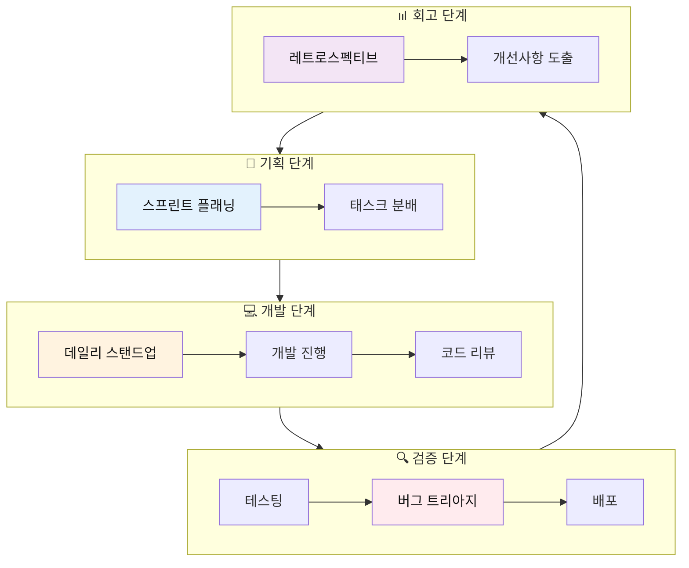
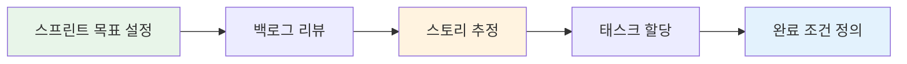

# 💻 개발자를 위한 비즈니스 영어 대화 가이드

> **Full Stack + AI 개발자를 위한 실전 비즈니스 회화**  
> 스프린트 플래닝, 코드 리뷰, 기술 미팅, AI 프로젝트 논의 완벽 가이드

---

## 📋 목차
1. [학습 구조 개요](#학습-구조-개요)
2. [상황 1: 스프린트 플래닝](#1-스프린트-플래닝-sprint-planning)
3. [상황 2: 데일리 스탠드업](#2-데일리-스탠드업-daily-standup)
4. [상황 3: 코드 리뷰 미팅](#3-코드-리뷰-미팅-code-review)
5. [상황 4: 기술 아키텍처 논의](#4-기술-아키텍처-논의-technical-architecture)
6. [상황 5: AI/ML 프로젝트 리뷰](#5-aiml-프로젝트-리뷰)
7. [상황 6: 클라이언트 기술 상담](#6-클라이언트-기술-상담-technical-consultation)
8. [상황 7: 버그 트리아지 미팅](#7-버그-트리아지-미팅-bug-triage)
9. [상황 8: 레트로스펙티브](#8-레트로스펙티브-retrospective)

---

## 학습 구조 개요

### 개발 워크플로우 전체 흐름도



### 개발자 소통 레벨

| 레벨 | 특징 | 사용 상황 | 예시 |
|:---:|------|----------|------|
| 🟢 기술적 | 구체적 기술 용어 사용 | 팀 내부 소통 | "Let's refactor this with the factory pattern." |
| 🟡 하이브리드 | 기술+비즈니스 혼합 | 크로스 팀 소통 | "This API will reduce latency by 30%." |
| 🔴 비즈니스 | 비즈니스 가치 중심 | 클라이언트/임원 소통 | "This feature will improve user retention." |

---

## 1. 스프린트 플래닝 (Sprint Planning)

### 상황 흐름도



### 💬 10턴 대화

#### 🌿 중급 버전 (팀 내부)

| 턴 | 👔 스크럼 마스터 | 👨‍💻 개발자 |
|:---:|------------|---------|
| 1 | Good morning, team. Let's kick off Sprint 15 planning. Our velocity last sprint was 32 points. | Morning. That's solid considering we had production issues. |
| 2 | Exactly. Let's review the product backlog. Top priority is the payment gateway integration. Thoughts on complexity? | I'd estimate that at 8 points. We need to handle multiple payment providers and implement retry logic. |
| 3 | Makes sense. Sarah, you worked on similar integrations before. What's your take? | I agree with 8 points. We should also allocate time for security testing and PCI compliance review. |
| 4 | Good point. Let's add a subtask for security audit. Next item: the AI recommendation engine optimization. | That's tricky. The current model is underperforming. I'd say 13 points - we need to retrain with new data and optimize inference time. |
| 5 | 13 points is significant. Can we break it down into smaller stories? | We could split it: data pipeline improvements (5 points), model retraining (5 points), and inference optimization (3 points). |
| 6 | Perfect. That gives us more flexibility. What about the frontend refactoring for the dashboard? | I can take that. It's mainly moving from class components to hooks. I'd estimate 5 points if we include unit tests. |
| 7 | Great. So far we're at 31 points. That leaves room for bug fixes. Any critical bugs we should prioritize? | There's a P1 bug where users can't upload files over 10MB. That's blocking several clients. |
| 8 | Definitely adding that. Estimated effort? | It's a quick fix in the backend - probably 2 points. The issue is in how we're chunking file uploads. |
| 9 | Okay, so we're at 33 points total. That's within our velocity. Any concerns about dependencies or blockers? | The AI optimization depends on the data team finishing their cleanup by Wednesday. We should confirm that. |
| 10 | I'll sync with the data team today. Let's confirm our sprint goal: "Improve payment reliability and AI performance." Everyone aligned? | Sounds good. Let's get started. I'll create the subtasks in Jira. |

#### 🌳 고급 버전 (크로스 팀)

| 턴 | 👔 테크 리드 | 👨‍💻 풀스택 개발자 |
|:---:|---------|--------------|
| 1 | Thanks for joining sprint planning, everyone. Before we dive into user stories, I want to align on our north star for this sprint. | I appreciate that context. Are we still prioritizing the platform stability work, or has that shifted? |
| 2 | Great question. Leadership wants us to balance stability with feature velocity. We're targeting 70% features, 30% tech debt. | That's a healthy balance. Last sprint we accumulated debt around our microservices communication layer. Can we address that? |
| 3 | Absolutely. In fact, I've flagged that as a strategic initiative. Let's walk through what you're seeing and quantify the impact. | The inter-service latency has increased 40% over three months. It's affecting the user experience, especially on the dashboard load times. |
| 4 | That's significant. What's driving the latency increase? | Two factors: we're not using connection pooling effectively, and our service mesh configuration is suboptimal. I'd recommend we invest in both. |
| 5 | I like that you've diagnosed the root cause. What's the effort to remediate, and more importantly, what's the business impact of fixing it? | Engineering effort is roughly one sprint for both fixes. Business impact: we can improve page load by 2 seconds, which our data shows increases conversion by 15%. |
| 6 | That's a compelling case. I'm comfortable allocating resources to that. Let's make it a dedicated epic with measurable success criteria. What do you need? | I'll need collaboration with DevOps for the service mesh changes, and ideally a backend engineer to pair on the connection pooling refactor. |
| 7 | I can assign Marcus from the platform team. He's got bandwidth and deep expertise in that area. Now, let's talk about the AI features on the roadmap. | The recommendation engine improvements, right? I've been prototyping with a transformer-based model that shows 25% better accuracy in our tests. |
| 8 | That's impressive. What's the production readiness timeline? Are there infrastructure implications we should anticipate? | We'd need to spin up GPU instances for inference, which has cost implications. Ballpark $2K/month. But the model should be production-ready in two sprints with proper testing. |
| 9 | The ROI on improved recommendations justifies that cost. Let's build a phased rollout plan - beta test with 10% of users first. Sound good? | Perfect approach. I'll coordinate with the ML team on the infrastructure requirements and create a detailed implementation plan. |
| 10 | Excellent. So our sprint commitment: latency optimization, payment gateway, and groundwork for the AI rollout. This positions us well for the Q4 goals. Everyone comfortable with scope? | I'm comfortable. This feels ambitious but achievable. I'll flag any risks as they emerge. |

### 📋 핵심 패턴 정리

| 기능 | 기술 표현 | 비즈니스 표현 |
|------|---------|-------------|
| 난이도 추정 | I'd estimate 8 story points. | This will take about a week. |
| 기술 복잡도 설명 | We need to implement retry logic and handle edge cases. | We need to ensure reliability. |
| 종속성 언급 | This depends on the data team's cleanup. | We need input from another team first. |
| 우선순위 설정 | This is a P1 bug blocking clients. | This is urgent and affecting customers. |
| 범위 조정 | Can we break it into smaller stories? | Can we deliver this incrementally? |

---

## 2. 데일리 스탠드업 (Daily Standup)

### 💬 3명 로테이션 대화

#### 🌿 중급 버전

| 턴 | 발언자 | 내용 |
|:---:|--------|------|
| 1 | 👔 스크럼 마스터 | Morning everyone. Let's keep this to 15 minutes. Alex, want to start? |
| 2 | 👨‍💻 Alex | Sure. Yesterday I completed the API authentication refactor and merged it to develop. Today I'm starting the rate limiting implementation. |
| 3 | 👔 스크럼 마스터 | Any blockers? |
| 4 | 👨‍💻 Alex | No blockers, but I have a question about the rate limit strategy. Can we sync after standup, Sarah? |
| 5 | 👩‍💻 Sarah | Absolutely. I worked on that for the previous API. Happy to share context. |
| 6 | 👔 스크럼 마스터 | Great. Sarah, you're up. |
| 7 | 👩‍💻 Sarah | Yesterday I finished the frontend state management refactor using Zustand. Today I'm integrating it with the user profile page. |
| 8 | 👔 스크럼 마스터 | How's it looking timeline-wise? |
| 9 | 👩‍💻 Sarah | On track. Should have the integration done by EOD. Tomorrow I'll tackle the settings page. |
| 10 | 👔 스크럼 마스터 | Excellent. Mike, you're last. |
| 11 | 👨‍💻 Mike | I spent yesterday debugging the model inference latency issue. Turned out to be a memory leak in our preprocessing pipeline. |
| 12 | 👔 스크럼 마스터 | Did you fix it? |
| 13 | 👨‍💻 Mike | Yes, I implemented proper cleanup and added monitoring. Latency dropped from 800ms to 200ms. Today I'm writing tests and updating documentation. |
| 14 | 👔 스크럼 마스터 | Nice work on the diagnosis. Any blockers from anyone? |
| 15 | All | No blockers. / All good. / We're clear. |
| 16 | 👔 스크럼 마스터 | Perfect. Let's have a productive day. Alex and Sarah, sync after this. |

### 📋 스탠드업 핵심 패턴

| 항목 | 표현 |
|------|------|
| 어제 완료 | I completed / finished / wrapped up [task]. |
| 오늘 계획 | Today I'm working on / tackling / starting [task]. |
| 차단 요소 | I'm blocked by / waiting on [dependency]. |
| 도움 요청 | I could use help with [task]. Can we sync after? |
| 진행 상태 | I'm on track / ahead of schedule / slightly behind. |

---

## 3. 코드 리뷰 미팅 (Code Review)

### 💬 10턴 대화

#### 🌳 고급 버전

| 턴 | 👨‍💻 시니어 개발자 | 👨‍💻 주니어 개발자 |
|:---:|-------------|-------------|
| 1 | Thanks for submitting the PR for the authentication service. I've left some comments - want to walk through them together? | Absolutely. I appreciate you taking the time to review it thoroughly. |
| 2 | No problem. Let's start with the architectural decision. I see you're storing JWT tokens in localStorage. Can you walk me through that choice? | I thought localStorage was standard practice. It's persistent and easy to access from the frontend. |
| 3 | I understand the reasoning, but there's a security consideration here. LocalStorage is vulnerable to XSS attacks. Have you considered using httpOnly cookies instead? | I hadn't considered that angle. So httpOnly cookies would prevent JavaScript access, making it more secure? |
| 4 | Exactly. The cookie would only be accessible via HTTP requests, not client-side JavaScript. That significantly reduces the attack surface. Worth the trade-off? | Definitely. I'll refactor that. Should I also implement CSRF protection if we're using cookies? |
| 5 | Good thinking - yes, CSRF tokens would be necessary. I'm glad you're connecting those dots. Now, let's talk about error handling in your authentication middleware. | I know that's probably not robust enough. I mostly focused on happy path scenarios. |
| 6 | It's a common first-pass approach. But in production, we need graceful degradation. What happens if the token validation service is down? | Currently, it would just throw an error. I should probably implement retry logic and fallback to cached validation? |
| 7 | That's one approach. Another option is circuit breaker pattern - if the service fails repeatedly, we fail fast rather than retry. What do you think fits better here? | Circuit breaker makes sense for this use case. We don't want to hammer a failing service. I'll implement that using a library like opossum. |
| 8 | Perfect. I'm impressed you knew the specific library. One more thing: your database queries aren't using prepared statements. Can you tell me why that's risky? | Honestly, I'm not 100% sure. Is it related to SQL injection? |
| 9 | Precisely. Without prepared statements, you're concatenating user input directly into queries. That's the #1 source of SQL injection vulnerabilities. | That makes sense. I'll refactor all queries to use parameterized statements. Should I also add input validation as a second layer? |
| 10 | Absolutely - defense in depth. Validate at the API layer and use prepared statements at the database layer. Overall, this is solid work. Make those changes and I'll approve. | Thank you for the constructive feedback. I'll have the updates pushed by EOD. Really learned a lot from this review. |

### 📋 코드 리뷰 핵심 패턴

| 상황 | 표현 |
|------|------|
| 칭찬 시작 | This is solid work overall. / I like your approach here. |
| 질문하기 | Can you walk me through [decision]? |
| 개선 제안 | Have you considered [alternative]? |
| 보안 지적 | This could be vulnerable to [attack]. |
| 아키텍처 논의 | Let's talk about the architectural decision. |
| 패턴 제안 | You might want to use the [pattern] pattern here. |
| 학습 격려 | That's a good learning moment. |

---

## 4. 기술 아키텍처 논의 (Technical Architecture)

### 💬 10턴 대화

#### 🌳 고급 버전

| 턴 | 👔 CTO | 👨‍💻 테크 리드 |
|:---:|-----|-----------|
| 1 | I wanted to discuss the architecture for our new microservices platform. What's your current thinking? | I'm proposing we move to an event-driven architecture using Kafka as the backbone. Here's my reasoning. |
| 2 | I'm listening. What problems does that solve that our current REST-based approach doesn't? | Three key issues: tight coupling between services, difficulty scaling individual components, and lack of real-time data propagation. |
| 3 | Those are valid pain points. But Kafka introduces operational complexity. How do you justify that trade-off? | Fair concern. The complexity is front-loaded, but long-term we gain horizontal scalability and resilience. Plus, our team has Kafka experience from previous projects. |
| 4 | What about data consistency? With eventual consistency in event-driven systems, how do we handle critical transactions like payments? | Excellent question. For critical paths, I'm proposing a hybrid approach: synchronous for transactions, asynchronous for everything else. We'd use the Saga pattern for distributed transactions. |
| 5 | I like that pragmatism. What's the migration strategy? We can't rewrite everything overnight. | Phased approach: start with new services event-driven, gradually migrate existing services using the Strangler Fig pattern. Critical path services migrate last. |
| 6 | Timeline and resource requirements? | I estimate 6 months for full migration with 3 engineers dedicated. We'd need infrastructure investment: Kafka cluster, monitoring tools, about $5K/month additional cloud cost. |
| 7 | That's substantial. Can you quantify the business benefits to justify this? | Current system downtime costs us roughly $10K per hour. The new architecture should reduce incidents by 60%, saving ~$480K annually. ROI in under 6 months. |
| 8 | That's compelling. What are the main risks? | Three risks: learning curve for junior devs, potential for event storms if not designed carefully, and operational overhead. I've drafted mitigation strategies for each. |
| 9 | I'd like to see those. Also, what about observability? With events flying around, how do we debug issues? | Critical point. I'm proposing we implement distributed tracing with OpenTelemetry from day one. Every event carries trace context. We can visualize the entire flow. |
| 10 | This is well thought out. Prepare a detailed RFC and let's review with the engineering team. If they're on board, you have my support to proceed. | Will do. I'll have the RFC ready by next Monday with architecture diagrams, cost analysis, and migration timeline. |

### 📋 아키텍처 논의 핵심 패턴

| 상황 | 표현 |
|------|------|
| 제안 시작 | I'm proposing we [solution]. Here's my reasoning. |
| 문제 정의 | This solves [problem] by [mechanism]. |
| 트레이드오프 설명 | The trade-off is [downside], but we gain [upside]. |
| 리스크 언급 | The main risks are [risks]. Here's how we mitigate them. |
| 비용 정당화 | The ROI is [number] based on [calculation]. |
| 단계적 접근 | I propose a phased approach: [phase 1], [phase 2]... |

---

## 5. AI/ML 프로젝트 리뷰

### 💬 10턴 대화

#### 🌳 고급 버전 (AI 프로젝트 발표)

| 턴 | 👨‍💻 AI 개발자 | 👔 프로덕트 매니저 |
|:---:|---------|--------------|
| 1 | Thanks for the time. I want to review our recommendation engine progress and discuss next steps. | Perfect timing. The stakeholders are asking about launch readiness. Where do we stand? |
| 2 | We've achieved 89% accuracy on our test set, which exceeds our 85% target. But I want to discuss deployment architecture before we launch. | That's great news on accuracy. What are your concerns about deployment? |
| 3 | Two main issues: inference latency and cost. Our current model takes 300ms per request on CPU. For real-time recommendations, we need sub-100ms. | How do we get there? Do we need GPUs? |
| 4 | GPUs would get us to 50ms, but the cost is prohibitive - roughly $800/month per instance. I'm proposing we use model quantization instead. | I'm not familiar with that. Can you explain in business terms? |
| 5 | Essentially, we compress the model by reducing precision of weights. We trade a small accuracy drop (about 2%) for 5x faster inference on CPU. | So we'd go from 89% to 87% accuracy but stay under 100ms latency? |
| 6 | Exactly. And we save $10K annually on infrastructure costs. The 2% accuracy drop is negligible for user experience. | That's a smart trade-off. What about the training pipeline? How do we keep the model fresh? |
| 7 | I've built an automated retraining pipeline that runs weekly. It pulls new user interaction data, retrains, validates, and auto-deploys if performance improves. | How do we monitor if the model starts degrading in production? |
| 8 | Excellent question. I've implemented three monitoring layers: prediction accuracy tracking, data drift detection, and business metric correlation. | Can you elaborate on business metric correlation? |
| 9 | Sure. We track if the model's recommendations actually lead to conversions. If conversion rate drops below baseline, we get alerted and can roll back. | I love that you're thinking about business impact. What's needed to launch? |
| 10 | Two things: final QA on the quantized model, and A/B test framework setup. I estimate 2 weeks. Then we can do a phased rollout to 10% of users. | Perfect. Let's align on success metrics and I'll get stakeholder buy-in. This is impressive work. |

### 📋 AI/ML 프로젝트 핵심 패턴

| 상황 | 표현 |
|------|------|
| 성능 보고 | We achieved [metric]% accuracy on [dataset]. |
| 기술 설명 (비즈니스) | In business terms, this means [outcome]. |
| 트레이드오프 | We trade [downside] for [upside]. |
| 비용 분석 | This saves $[amount] annually on infrastructure. |
| 모니터링 설명 | We track [metric] to ensure [outcome]. |
| 배포 계획 | I propose a phased rollout to [percentage]% of users. |

---

## 6. 클라이언트 기술 상담 (Technical Consultation)

### 💬 10턴 대화

#### 🌳 고급 버전 (클라이언트에게 기술 솔루션 제안)

| 턴 | 👨‍💻 풀스택 개발자 | 💼 클라이언트 |
|:---:|-------------|----------|
| 1 | Thanks for meeting with us. I understand you're experiencing scalability challenges with your current platform. Can you describe what you're seeing? | Our application slows to a crawl when we hit 500 concurrent users. We're launching a marketing campaign next month that could bring 5,000 users. |
| 2 | That's a 10x increase. Before I propose solutions, help me understand your current architecture. What's your tech stack? | We're running a monolithic Node.js application on a single AWS EC2 instance with a MySQL database. |
| 3 | I see the bottleneck. You're hitting the limits of vertical scaling. I'd recommend we transition to a horizontally scalable architecture. Let me explain what that means. | Please do. We need a solution that won't break the bank. |
| 4 | Understood. Here's the plan: we containerize your application with Docker, deploy it on AWS ECS for auto-scaling, and move your database to RDS with read replicas. | How does that help with the user load? |
| 5 | With auto-scaling, when traffic increases, new application instances spin up automatically. Read replicas distribute database load. You could handle 10,000+ concurrent users. | What's the timeline and cost? |
| 6 | Implementation would take 4-6 weeks. Infrastructure cost would increase from roughly $200/month to $800/month at peak load, but scales down during low traffic. | That's manageable. What about our existing code? Do we need to rewrite everything? |
| 7 | Minimal code changes needed. We'd need to make your app stateless - moving sessions to Redis, for example. But the core business logic stays unchanged. | What happens if something goes wrong during migration? |
| 8 | Excellent question. We'd use a blue-green deployment strategy. Your current system stays live while we build the new one. We test thoroughly, then switch traffic over. Instant rollback if issues arise. | That sounds low-risk. What about our AI features? We want to add personalized recommendations. |
| 9 | Perfect segue. With the new architecture, we can add a separate microservice for ML. I'd recommend using AWS SageMaker for model hosting - it handles scaling automatically. | How long would it take to implement the recommendation system? |
| 10 | After the infrastructure migration, the ML service would take another 6-8 weeks. We'd train on your user behavior data and integrate via API. I can send a detailed proposal with timeline and costs. | Please do. This sounds like exactly what we need. When can you start? |

### 📋 클라이언트 상담 핵심 패턴

| 상황 | 표현 |
|------|------|
| 문제 파악 | Can you describe what you're seeing? |
| 비기술적 설명 | Let me explain what that means in practical terms. |
| 비용 투명성 | Infrastructure cost would be [amount], but [justification]. |
| 리스크 완화 | If something goes wrong, [backup plan]. |
| 점진적 접근 | We'd do this in phases: [phase 1], [phase 2]... |
| 비즈니스 가치 | This means you could handle [outcome]. |

---

## 7. 버그 트리아지 미팅 (Bug Triage)

### 💬 8턴 대화

#### 🌿 중급 버전

| 턴 | 👔 테크 리드 | 👨‍💻 개발자들 |
|:---:|---------|----------|
| 1 | Let's triage the bugs that came in overnight. We have 12 new issues. Let's prioritize based on severity and impact. | Ready. I've reviewed them all. |
| 2 | First one: users can't login on mobile Safari. Impact? | That's affecting about 15% of our user base based on analytics. I'd say P1. |
| 3 | Agreed. That's production critical. Who can take it? | I can. I've dealt with Safari-specific issues before. Probably a cookie SameSite attribute problem. |
| 4 | Good hypothesis. Next: dashboard loading slowly for enterprise customers. | I investigated that one. It's a database query performance issue. We're doing a full table scan on 2 million rows. |
| 5 | What's the fix? | Add a composite index on created_at and user_id. Should drop query time from 5 seconds to under 100ms. |
| 6 | Low-hanging fruit. Do it today. Next: AI model returning weird recommendations for new users. | That's a cold start problem. The model doesn't have enough data for new users. I can add a fallback to popular items. |
| 7 | Make sense. Priority? | P2 - it affects quality but doesn't break functionality. I'd estimate 3 days to implement and test properly. |
| 8 | Okay. Let's summarize: Mobile login is P1, query optimization today, AI fallback this sprint. Everyone clear on priorities? | Clear. / Got it. / Sounds good. |

### 📋 버그 트리아지 핵심 패턴

| 상황 | 표현 |
|------|------|
| 우선순위 평가 | This is P0/P1/P2 based on [criteria]. |
| 영향도 분석 | This affects [percentage]% of users. |
| 원인 진단 | The root cause is [technical issue]. |
| 해결 방법 | The fix is to [solution]. |
| 시간 추정 | I estimate [time] to fix and test properly. |
| 책임 할당 | I can take this. I have experience with [related area]. |

---

## 8. 레트로스펙티브 (Retrospective)

### 💬 12턴 대화

#### 🌳 고급 버전

| 턴 | 👔 스크럼 마스터 | 👥 팀원들 |
|:---:|----------|--------|
| 1 | Welcome to our Sprint 15 retrospective. Let's reflect on what went well, what didn't, and how we improve. Start with the positives? | I thought our collaboration on the payment integration was excellent. We pair-programmed and caught issues early. |
| 2 | Great callout. What made that collaboration effective? | We had clear ownership but stayed flexible. When Alex hit a blocker, I jumped in immediately. |
| 3 | That's the team dynamic we want. What didn't go well? Anyone? | Honestly, our deployment on Friday caused weekend firefighting. We should avoid Friday deployments. |
| 4 | I agree that was painful. What process change would prevent that? | We could institute a deployment freeze after Wednesday. That gives us Thursday and Friday for testing. |
| 5 | I like that. Any other process improvements? | Our code reviews took too long. Some PRs sat for 2 days before review. |
| 6 | What's causing the delay? | I think we need to set an SLA - like reviews within 4 hours during business hours. |
| 7 | That's concrete. Can we commit to that as a team? | I'm in. / Agreed. / Let's try it for next sprint. |
| 8 | Excellent. Let's talk about technical debt. How did we do? | We allocated 30% of capacity but only used 15%. The urgent feature requests ate into that time. |
| 9 | How do we protect that time in future sprints? | We could reserve capacity but make it non-negotiable unless the PM escalates to the director level. |
| 10 | Strong boundary. I'll propose that to leadership. What about our AI model deployment? Lessons learned? | The monitoring we built saved us. We caught the accuracy degradation within hours instead of days. |
| 11 | That's a win. Should we apply that monitoring pattern to other systems? | Definitely. I can create a template and documentation. It took me a day to set up, so it's reusable. |
| 12 | Perfect. Let's summarize action items: No Friday deploys, 4-hour PR review SLA, protected tech debt time, and monitoring templates. Everyone aligned? | Aligned. / Sounds good. / Looking forward to next sprint. |

### 📋 레트로스펙티브 핵심 패턴

| 상황 | 표현 |
|------|------|
| 긍정 회고 | What went well was [achievement]. |
| 문제 제기 | A challenge we faced was [issue]. |
| 개선 제안 | I propose we [improvement]. |
| 프로세스 변경 | We could institute [new process]. |
| 팀 합의 | Can we commit to [action] as a team? |
| 교훈 정리 | The lesson learned is [insight]. |

---

## 📊 개발자 비즈니스 영어 전체 요약

### 상황별 핵심 표현 정리

```mermaid
mindmap
  root((개발자 영어))
    스프린트
      I estimate X story points
      Can we break it down?
      Any blockers?
    코드 리뷰
      Can you walk me through this?
      Have you considered...?
      This could be vulnerable to...
    아키텍처
      I'm proposing we...
      The trade-off is...
      The ROI is...
    AI/ML
      We achieved X% accuracy
      In business terms, this means...
      We track [metric] to ensure...
    클라이언트
      Let me explain what that means
      This means you could handle...
      If something goes wrong...
    버그 트리아지
      This is P1 based on...
      The root cause is...
      I estimate X days to fix
```

### 기술 레벨별 소통 전략

| 청중 | 접근 방식 | 예시 |
|-----|---------|------|
| 동료 개발자 | 기술 용어 + 구체적 구현 | "We should use a circuit breaker pattern with exponential backoff." |
| 프로덕트 매니저 | 비즈니스 영향 + 간단한 기술 | "This reduces latency by 50%, improving user experience." |
| 경영진/임원 | ROI + 리스크 + 비즈니스 가치 | "This investment saves $480K annually with 6-month ROI." |
| 클라이언트 | 문제 해결 + 실용적 결과 | "This means your system can handle 10x more users." |

---

## 💡 학습 팁

### ✅ 개발자 영어 학습 전략

1. **기술 용어는 영어 그대로** - "리팩토링" 대신 "refactoring"
2. **비즈니스 가치 연결** - 기술 변경의 비즈니스 영향 설명 연습
3. **구체적 수치 사용** - "빠르다" 대신 "50% faster"
4. **문제→원인→해결 구조** - 명확한 논리 흐름
5. **질문으로 이해도 확인** - "Does that make sense?"

### 📅 4주 개발자 영어 학습 로드맵

| 주차 | 학습 상황 | 실전 적용 |
|:---:|----------|---------|
| 1주 | 스프린트 플래닝 + 스탠드업 | 다음 스프린트에서 실제 사용 |
| 2주 | 코드 리뷰 + 아키텍처 논의 | PR 리뷰 시 영어로 코멘트 |
| 3주 | AI/ML 논의 + 클라이언트 상담 | 기술 문서를 영어로 작성 |
| 4주 | 버그 트리아지 + 레트로스펙티브 | 팀 회의록을 영어로 작성 |

### 🎯 개발자 필수 영어 표현 TOP 20

1. Let's refactor this to improve maintainability.
2. I estimate this at X story points.
3. Can we break this down into smaller tasks?
4. This is blocked by [dependency].
5. I'll have this done by end of day.
6. Have you considered [alternative approach]?
7. The root cause is [technical issue].
8. This could be vulnerable to [attack].
9. I propose we use [technology/pattern].
10. The trade-off is [downside] but we gain [upside].
11. We need to add test coverage for this.
12. This affects X% of users.
13. I'll create a detailed RFC for this.
14. The ROI is [number] based on [calculation].
15. We achieved X% accuracy on our test set.
16. In business terms, this means [outcome].
17. I'll push the changes by EOD.
18. Can we pair program on this?
19. Let me walk you through my implementation.
20. I'll set up monitoring for this metric.

---

*Last Updated: 2026-01-10*

