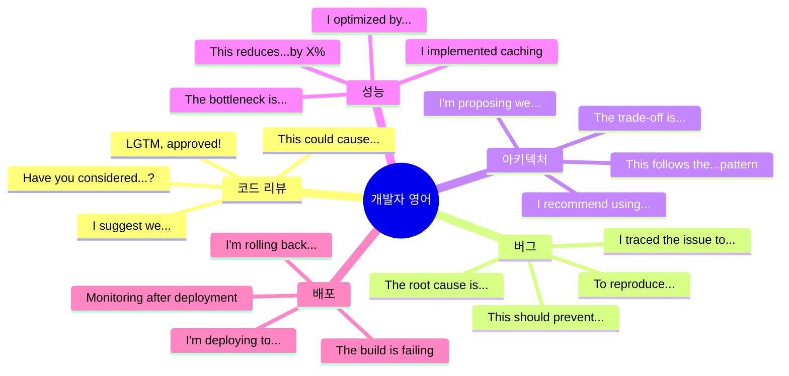

# 💻 개발자 영어 필수 패턴 200선

> **Full Stack + AI 개발자가 매일 쓰는 실전 표현**  
> 코드 리뷰, 기술 논의, 버그 리포트, 팀 소통 필수 패턴

---

## 📋 목차
1. [코드 작성 및 리뷰](#-코드-작성-및-리뷰-patterns-1-30)
2. [버그 및 디버깅](#-버그-및-디버깅-patterns-31-50)
3. [아키텍처 및 설계](#-아키텍처-및-설계-patterns-51-70)
4. [성능 및 최적화](#-성능-및-최적화-patterns-71-90)
5. [테스팅](#-테스팅-patterns-91-110)
6. [배포 및 DevOps](#-배포-및-devops-patterns-111-130)
7. [AI/ML 개발](#-aiml-개발-patterns-131-155)
8. [팀 협업](#-팀-협업-patterns-156-180)
9. [클라이언트 소통](#-클라이언트-소통-patterns-181-200)

---

## 💻 코드 작성 및 리뷰 (Patterns 1-30)

### 코드 작성 (1-15)

| No. | 패턴 | 예문 | 한국어 뜻 |
|:---:|------|------|----------|
| 1 | I'm implementing [기능]. | I'm implementing user authentication with JWT. | ~를 구현하고 있습니다. |
| 2 | I refactored [코드] to [목적]. | I refactored the API handler to improve readability. | ~를 리팩토링했습니다. |
| 3 | This uses the [패턴] pattern. | This uses the Factory pattern for object creation. | ~패턴을 사용합니다. |
| 4 | I added error handling for [시나리오]. | I added error handling for network timeouts. | ~에 대한 에러 처리를 추가했습니다. |
| 5 | I extracted [코드] into a separate [유형]. | I extracted the validation logic into a separate utility. | ~를 별도로 분리했습니다. |
| 6 | This prevents [문제]. | This prevents race conditions in concurrent requests. | ~를 방지합니다. |
| 7 | I optimized [부분] by [방법]. | I optimized the database query by adding an index. | ~를 최적화했습니다. |
| 8 | I followed the [원칙] principle. | I followed the Single Responsibility Principle. | ~원칙을 따랐습니다. |
| 9 | This is backward compatible with [버전]. | This is backward compatible with API v1. | ~와 하위 호환됩니다. |
| 10 | I added logging for [목적]. | I added logging for debugging purposes. | ~를 위한 로깅을 추가했습니다. |
| 11 | I'm using [라이브러리] for [목적]. | I'm using Redux for state management. | ~를 위해 ~를 사용합니다. |
| 12 | This handles [edge case]. | This handles the case when the user is offline. | ~를 처리합니다. |
| 13 | I implemented caching to reduce [문제]. | I implemented caching to reduce API calls. | 캐싱을 구현했습니다. |
| 14 | This function returns [타입]. | This function returns a Promise that resolves to a user object. | 이 함수는 ~를 반환합니다. |
| 15 | I added validation to ensure [조건]. | I added validation to ensure email format is correct. | 검증을 추가했습니다. |

### 코드 리뷰 (16-30)

| No. | 패턴 | 예문 | 한국어 뜻 |
|:---:|------|------|----------|
| 16 | Can you walk me through [부분]? | Can you walk me through your implementation approach? | ~를 설명해 주시겠어요? |
| 17 | Have you considered [대안]? | Have you considered using async/await instead? | ~를 고려해보셨나요? |
| 18 | This could cause [문제]. | This could cause a memory leak in long-running processes. | ~를 야기할 수 있습니다. |
| 19 | I suggest we [개선]. | I suggest we add input validation here. | ~를 제안합니다. |
| 20 | This looks good, but [피드백]. | This looks good, but we should add error handling. | 좋아 보이지만, ~해야 합니다. |
| 21 | Could you add tests for [케이스]? | Could you add tests for the error scenarios? | ~에 대한 테스트를 추가해주실 수 있나요? |
| 22 | This is missing [요소]. | This is missing type definitions. | ~가 빠져있습니다. |
| 23 | Let's extract this into a [유형]. | Let's extract this into a separate function. | 이것을 ~로 분리합시다. |
| 24 | This violates the [원칙] principle. | This violates the DRY (Don't Repeat Yourself) principle. | ~원칙을 위반합니다. |
| 25 | Could you explain why [결정]? | Could you explain why you chose this approach? | 왜 ~했는지 설명해주실 수 있나요? |
| 26 | This is a good start, but [제안]. | This is a good start, but we need more edge case handling. | 좋은 시작이지만, ~가 필요합니다. |
| 27 | I like how you [긍정]. | I like how you structured the error handling. | ~한 점이 좋습니다. |
| 28 | This would be clearer if [개선]. | This would be clearer if we renamed the variable. | ~하면 더 명확할 것 같습니다. |
| 29 | We should document [부분]. | We should document the API contract here. | ~를 문서화해야 합니다. |
| 30 | LGTM (Looks Good To Me), approved! | LGTM! Great work on the implementation. | 좋아 보입니다, 승인합니다! |

---

## 🐛 버그 및 디버깅 (Patterns 31-50)

### 버그 리포팅 (31-40)

| No. | 패턴 | 예문 | 한국어 뜻 |
|:---:|------|------|----------|
| 31 | I found a bug in [위치]. | I found a bug in the payment processing module. | ~에서 버그를 발견했습니다. |
| 32 | This is causing [문제]. | This is causing users to be logged out randomly. | ~를 야기하고 있습니다. |
| 33 | The root cause is [원인]. | The root cause is a race condition in the cache. | 근본 원인은 ~입니다. |
| 34 | To reproduce: [단계]. | To reproduce: 1) Log in, 2) Click checkout, 3) Error appears. | 재현 방법: ~. |
| 35 | This affects [영향 범위]. | This affects 15% of our user base on Safari. | ~에 영향을 줍니다. |
| 36 | The expected behavior is [기대]. | The expected behavior is to show a confirmation message. | 기대되는 동작은 ~입니다. |
| 37 | Instead, [실제 동작]. | Instead, the page crashes with a TypeError. | 대신, ~가 발생합니다. |
| 38 | This is a [심각도] bug. | This is a P1 (high priority) bug. | ~심각도 버그입니다. |
| 39 | I'm seeing [오류] in the logs. | I'm seeing "connection timeout" errors in the logs. | 로그에 ~가 보입니다. |
| 40 | This started happening after [이벤트]. | This started happening after yesterday's deployment. | ~이후부터 발생했습니다. |

### 디버깅 (41-50)

| No. | 패턴 | 예문 | 한국어 뜻 |
|:---:|------|------|----------|
| 41 | I'm debugging [문제]. | I'm debugging the memory leak issue. | ~를 디버깅하고 있습니다. |
| 42 | I traced the issue to [위치]. | I traced the issue to the authentication middleware. | ~로 문제를 추적했습니다. |
| 43 | The issue occurs when [조건]. | The issue occurs when users have special characters in their names. | ~일 때 문제가 발생합니다. |
| 44 | I added logging to [목적]. | I added logging to track the request flow. | ~를 위해 로깅을 추가했습니다. |
| 45 | The fix is to [해결책]. | The fix is to add null checking before accessing the property. | 해결책은 ~입니다. |
| 46 | I reproduced the issue locally. | I reproduced the issue on my local environment. | 로컬에서 문제를 재현했습니다. |
| 47 | The stack trace shows [정보]. | The stack trace shows the error originates in line 45. | 스택트레이스가 ~를 보여줍니다. |
| 48 | I tested the fix and [결과]. | I tested the fix and it resolves the issue. | 해결책을 테스트했고 ~입니다. |
| 49 | This should prevent [문제]. | This should prevent the crash from happening again. | ~를 방지할 것입니다. |
| 50 | I'll deploy the hotfix to [환경]. | I'll deploy the hotfix to production this afternoon. | ~에 핫픽스를 배포하겠습니다. |

---

## 🏗️ 아키텍처 및 설계 (Patterns 51-70)

### 아키텍처 논의 (51-60)

| No. | 패턴 | 예문 | 한국어 뜻 |
|:---:|------|------|----------|
| 51 | I'm proposing we [제안]. | I'm proposing we migrate to microservices architecture. | ~를 제안합니다. |
| 52 | The current architecture has [문제]. | The current architecture has scalability limitations. | 현재 아키텍처는 ~가 있습니다. |
| 53 | This design allows us to [이점]. | This design allows us to scale independently. | 이 설계는 ~를 가능하게 합니다. |
| 54 | The trade-off is [단점]. | The trade-off is increased complexity. | 트레이드오프는 ~입니다. |
| 55 | We should separate [부분]. | We should separate the business logic from the presentation layer. | ~를 분리해야 합니다. |
| 56 | This follows [패턴]. | This follows the Model-View-Controller pattern. | ~패턴을 따릅니다. |
| 57 | I recommend using [기술]. | I recommend using GraphQL for the API layer. | ~를 사용하는 것을 추천합니다. |
| 58 | This provides [이점]. | This provides better type safety and maintainability. | ~를 제공합니다. |
| 59 | We need to consider [요소]. | We need to consider the data consistency implications. | ~를 고려해야 합니다. |
| 60 | The system will consist of [구성]. | The system will consist of 5 microservices and an API gateway. | 시스템은 ~로 구성됩니다. |

### 기술 선택 (61-70)

| No. | 패턴 | 예문 | 한국어 뜻 |
|:---:|------|------|----------|
| 61 | I chose [기술] because [이유]. | I chose React because of its strong ecosystem. | ~때문에 ~를 선택했습니다. |
| 62 | [기술] is better suited for [용도]. | PostgreSQL is better suited for relational data. | ~는 ~에 더 적합합니다. |
| 63 | This integrates well with [시스템]. | This integrates well with our existing CI/CD pipeline. | ~와 잘 통합됩니다. |
| 64 | The learning curve for [기술] is [정도]. | The learning curve for Kubernetes is steep. | ~의 학습 곡선은 ~입니다. |
| 65 | [기술] has better performance for [용도]. | Redis has better performance for caching use cases. | ~는 ~에서 더 나은 성능을 보입니다. |
| 66 | We're already using [기술]. | We're already using TypeScript across the codebase. | 이미 ~를 사용하고 있습니다. |
| 67 | This is more cost-effective than [대안]. | This is more cost-effective than serverless functions. | ~보다 비용 효율적입니다. |
| 68 | [기술] provides [기능] out of the box. | Next.js provides server-side rendering out of the box. | ~는 ~를 기본 제공합니다. |
| 69 | The community support for [기술] is [정도]. | The community support for Vue is excellent. | ~의 커뮤니티 지원은 ~입니다. |
| 70 | This aligns with our tech stack. | This aligns with our JavaScript-first tech stack. | 우리 기술 스택과 일치합니다. |

---

## ⚡ 성능 및 최적화 (Patterns 71-90)

### 성능 분석 (71-80)

| No. | 패턴 | 예문 | 한국어 뜻 |
|:---:|------|------|----------|
| 71 | The performance bottleneck is [위치]. | The performance bottleneck is the database query. | 성능 병목은 ~입니다. |
| 72 | This endpoint takes [시간] on average. | This endpoint takes 2.5 seconds on average. | 이 엔드포인트는 평균 ~가 걸립니다. |
| 73 | We're seeing [수치] at [퍼센타일]. | We're seeing 3 seconds at P95 latency. | ~에서 ~를 보고 있습니다. |
| 74 | The response time increased by [수치]. | The response time increased by 40% last week. | 응답 시간이 ~만큼 증가했습니다. |
| 75 | This is causing [문제]. | This is causing high CPU usage on the server. | ~를 야기하고 있습니다. |
| 76 | The query is doing a full table scan. | The slow query is doing a full table scan on 2M rows. | 전체 테이블 스캔을 하고 있습니다. |
| 77 | We're hitting [리소스] limits. | We're hitting memory limits during peak hours. | ~한계에 도달하고 있습니다. |
| 78 | I profiled the code and found [발견]. | I profiled the code and found multiple N+1 queries. | 코드를 프로파일링해서 ~를 발견했습니다. |
| 79 | The page load time is [시간]. | The page load time is 4.2 seconds, which is too slow. | 페이지 로드 시간은 ~입니다. |
| 80 | This metric is [상태] our SLA. | This metric is exceeding our SLA of 200ms. | 이 메트릭은 SLA를 ~하고 있습니다. |

### 최적화 (81-90)

| No. | 패턴 | 예문 | 한국어 뜻 |
|:---:|------|------|----------|
| 81 | I optimized [부분] by [방법]. | I optimized the query by adding a composite index. | ~를 ~해서 최적화했습니다. |
| 82 | This reduces [메트릭] by [수치]. | This reduces API calls by 80%. | ~를 ~만큼 줄입니다. |
| 83 | I implemented [기법]. | I implemented lazy loading for images. | ~를 구현했습니다. |
| 84 | I'm using [기법] to improve [메트릭]. | I'm using memoization to improve render performance. | ~를 개선하기 위해 ~를 사용합니다. |
| 85 | This brings [메트릭] down to [수치]. | This brings response time down to 200ms. | ~를 ~로 낮춥니다. |
| 86 | I added caching at the [레벨] level. | I added caching at the CDN level. | ~레벨에서 캐싱을 추가했습니다. |
| 87 | I moved [작업] to [위치]. | I moved image processing to a background job. | ~를 ~로 이동했습니다. |
| 88 | This eliminates [문제]. | This eliminates unnecessary re-renders. | ~를 제거합니다. |
| 89 | I compressed [데이터]. | I compressed the API responses with gzip. | ~를 압축했습니다. |
| 90 | The optimization improved [메트릭] by [수치]. | The optimization improved page load by 60%. | 최적화가 ~를 ~만큼 개선했습니다. |

---

## 🧪 테스팅 (Patterns 91-110)

### 테스트 작성 (91-100)

| No. | 패턴 | 예문 | 한국어 뜻 |
|:---:|------|------|----------|
| 91 | I wrote tests for [기능]. | I wrote tests for the authentication flow. | ~에 대한 테스트를 작성했습니다. |
| 92 | The test coverage is [수치]. | The test coverage is 85% for this module. | 테스트 커버리지는 ~입니다. |
| 93 | I'm testing [시나리오]. | I'm testing the edge case where input is null. | ~를 테스트하고 있습니다. |
| 94 | I added unit tests for [부분]. | I added unit tests for the validation logic. | ~에 대한 유닛 테스트를 추가했습니다. |
| 95 | I'm mocking [의존성]. | I'm mocking the database calls in the test. | 테스트에서 ~를 모킹하고 있습니다. |
| 96 | This test verifies that [조건]. | This test verifies that errors are handled correctly. | 이 테스트는 ~를 검증합니다. |
| 97 | I need to add tests for [케이스]. | I need to add tests for the error scenarios. | ~에 대한 테스트를 추가해야 합니다. |
| 98 | The test suite runs in [시간]. | The test suite runs in under 30 seconds. | 테스트 스위트는 ~에 실행됩니다. |
| 99 | I'm using [도구] for testing. | I'm using Jest for unit testing. | 테스팅에 ~를 사용하고 있습니다. |
| 100 | All tests are passing. | All 47 tests are passing locally. | 모든 테스트가 통과합니다. |

### 테스트 관련 논의 (101-110)

| No. | 패턴 | 예문 | 한국어 뜻 |
|:---:|------|------|----------|
| 101 | We need better test coverage for [부분]. | We need better test coverage for API endpoints. | ~에 대한 더 나은 테스트 커버리지가 필요합니다. |
| 102 | This is hard to test because [이유]. | This is hard to test because of tight coupling. | ~때문에 테스트하기 어렵습니다. |
| 103 | Let's add integration tests for [기능]. | Let's add integration tests for the payment flow. | ~에 대한 통합 테스트를 추가합시다. |
| 104 | The test is failing because [원인]. | The test is failing because of a race condition. | ~때문에 테스트가 실패하고 있습니다. |
| 105 | I'll fix the flaky test. | I'll fix the flaky test that fails intermittently. | 불안정한 테스트를 수정하겠습니다. |
| 106 | We should test [시나리오]. | We should test the timeout scenario. | ~를 테스트해야 합니다. |
| 107 | I'm adding E2E tests for [flow]. | I'm adding E2E tests for the checkout flow. | ~에 대한 E2E 테스트를 추가하고 있습니다. |
| 108 | The tests caught a regression. | The tests caught a regression in the login flow. | 테스트가 회귀를 발견했습니다. |
| 109 | Let's run load tests to verify [메트릭]. | Let's run load tests to verify we can handle 10K users. | ~를 검증하기 위해 부하 테스트를 실행합시다. |
| 110 | I'm setting up CI to run tests automatically. | I'm setting up CI to run tests on every commit. | 자동으로 테스트를 실행하도록 CI를 설정하고 있습니다. |

---

## 🚀 배포 및 DevOps (Patterns 111-130)

### 배포 (111-120)

| No. | 패턴 | 예문 | 한국어 뜻 |
|:---:|------|------|----------|
| 111 | I'm deploying [변경] to [환경]. | I'm deploying the hotfix to production. | ~를 ~에 배포하고 있습니다. |
| 112 | The deployment is scheduled for [시간]. | The deployment is scheduled for Friday at 2 PM. | 배포가 ~로 예정되어 있습니다. |
| 113 | I'll merge this to [브랜치]. | I'll merge this to the main branch after approval. | 승인 후 ~에 머지하겠습니다. |
| 114 | The build is [상태]. | The build is failing due to linting errors. | 빌드가 ~입니다. |
| 115 | I'm rolling back [변경]. | I'm rolling back the deployment due to errors. | ~를 롤백하고 있습니다. |
| 116 | The deployment pipeline [동작]. | The deployment pipeline automatically runs tests. | 배포 파이프라인은 ~합니다. |
| 117 | I need to [작업] before deploying. | I need to run database migrations before deploying. | 배포 전에 ~해야 합니다. |
| 118 | The release includes [변경]. | The release includes 12 bug fixes and 3 new features. | 릴리즈에 ~가 포함됩니다. |
| 119 | I'll monitor [메트릭] after deployment. | I'll monitor error rates closely after deployment. | 배포 후 ~를 모니터링하겠습니다. |
| 120 | The deployment was successful. | The deployment was successful with zero downtime. | 배포가 성공했습니다. |

### DevOps (121-130)

| No. | 패턴 | 예문 | 한국어 뜻 |
|:---:|------|------|----------|
| 121 | I'm setting up [인프라]. | I'm setting up Docker containers for the services. | ~를 설정하고 있습니다. |
| 122 | I configured [도구] to [목적]. | I configured GitHub Actions to run tests automatically. | ~를 ~하도록 설정했습니다. |
| 123 | I'm using [도구] for [용도]. | I'm using Terraform for infrastructure as code. | ~를 위해 ~를 사용하고 있습니다. |
| 124 | The server is [상태]. | The server is experiencing high load. | 서버가 ~입니다. |
| 125 | I need to scale [리소스]. | I need to scale up the database instances. | ~를 스케일링해야 합니다. |
| 126 | I'm troubleshooting [문제]. | I'm troubleshooting the deployment failures. | ~를 트러블슈팅하고 있습니다. |
| 127 | The logs show [정보]. | The logs show connection timeout errors. | 로그가 ~를 보여줍니다. |
| 128 | I set up [모니터링]. | I set up alerting for API response times. | ~를 설정했습니다. |
| 129 | The infrastructure costs [금액]. | The infrastructure costs $2,000 per month. | 인프라 비용은 ~입니다. |
| 130 | I optimized [리소스] usage. | I optimized cloud resource usage to reduce costs. | ~사용량을 최적화했습니다. |

---

## 🤖 AI/ML 개발 (Patterns 131-155)

### 모델 개발 (131-140)

| No. | 패턴 | 예문 | 한국어 뜻 |
|:---:|------|------|----------|
| 131 | I'm training a [모델] for [목적]. | I'm training a BERT model for sentiment analysis. | ~를 위한 ~를 훈련하고 있습니다. |
| 132 | The model achieved [메트릭]. | The model achieved 89% accuracy on the test set. | 모델이 ~를 달성했습니다. |
| 133 | I'm using [데이터] as training data. | I'm using 100K labeled tweets as training data. | ~를 훈련 데이터로 사용하고 있습니다. |
| 134 | The model is [상태]. | The model is overfitting on the training data. | 모델이 ~하고 있습니다. |
| 135 | I tuned [하이퍼파라미터]. | I tuned the learning rate and batch size. | ~를 튜닝했습니다. |
| 136 | I'm experimenting with [기법]. | I'm experimenting with transfer learning. | ~를 실험하고 있습니다. |
| 137 | The training took [시간]. | The training took 6 hours on a GPU instance. | 훈련에 ~가 걸렸습니다. |
| 138 | I'm using [프레임워크]. | I'm using PyTorch for model development. | ~를 사용하고 있습니다. |
| 139 | The model performs well on [케이스]. | The model performs well on positive sentiment cases. | 모델이 ~에서 잘 작동합니다. |
| 140 | I need to improve [메트릭]. | I need to improve the model's precision. | ~를 개선해야 합니다. |

### 데이터 처리 (141-150)

| No. | 패턴 | 예문 | 한국어 뜻 |
|:---:|------|------|----------|
| 141 | I'm preprocessing [데이터]. | I'm preprocessing the text data with tokenization. | ~를 전처리하고 있습니다. |
| 142 | I cleaned the data by [방법]. | I cleaned the data by removing duplicates. | ~해서 데이터를 정제했습니다. |
| 143 | The dataset contains [수량]. | The dataset contains 500K training examples. | 데이터셋에 ~가 포함되어 있습니다. |
| 144 | I'm splitting the data into [비율]. | I'm splitting the data into 80-10-10 train-val-test. | 데이터를 ~로 분할하고 있습니다. |
| 145 | I'm handling [문제]. | I'm handling class imbalance with oversampling. | ~를 처리하고 있습니다. |
| 146 | I extracted [피처] from [데이터]. | I extracted TF-IDF features from the text data. | ~에서 ~를 추출했습니다. |
| 147 | The data pipeline [동작]. | The data pipeline processes 1M records per hour. | 데이터 파이프라인은 ~합니다. |
| 148 | I'm using [도구] for data processing. | I'm using Apache Spark for large-scale data processing. | 데이터 처리를 위해 ~를 사용하고 있습니다. |
| 149 | The data quality is [평가]. | The data quality is good with minimal missing values. | 데이터 품질은 ~입니다. |
| 150 | I need to [작업] the data. | I need to normalize the numerical features. | 데이터를 ~해야 합니다. |

### 모델 배포 및 모니터링 (151-155)

| No. | 패턴 | 예문 | 한국어 뜻 |
|:---:|------|------|----------|
| 151 | I'm deploying the model to [환경]. | I'm deploying the model to AWS SageMaker. | 모델을 ~에 배포하고 있습니다. |
| 152 | The inference time is [시간]. | The inference time is 50ms on GPU. | 추론 시간은 ~입니다. |
| 153 | I'm monitoring [메트릭]. | I'm monitoring model accuracy in production. | ~를 모니터링하고 있습니다. |
| 154 | The model is experiencing [문제]. | The model is experiencing data drift. | 모델이 ~를 겪고 있습니다. |
| 155 | I'll retrain the model [주기]. | I'll retrain the model weekly with new data. | ~마다 모델을 재훈련하겠습니다. |

---

## 👥 팀 협업 (Patterns 156-180)

### 스탠드업 (156-165)

| No. | 패턴 | 예문 | 한국어 뜻 |
|:---:|------|------|----------|
| 156 | Yesterday I [완료]. | Yesterday I completed the API integration. | 어제 ~를 완료했습니다. |
| 157 | Today I'm working on [작업]. | Today I'm working on the payment gateway. | 오늘 ~를 작업하고 있습니다. |
| 158 | I'm blocked by [차단 요소]. | I'm blocked by the missing API documentation. | ~때문에 막혀있습니다. |
| 159 | I finished [작업] ahead of schedule. | I finished the frontend refactor ahead of schedule. | ~를 일정보다 빨리 완료했습니다. |
| 160 | I need help with [작업]. | I need help with the database optimization. | ~에 대한 도움이 필요합니다. |
| 161 | I'll pair with [사람] on [작업]. | I'll pair with Sarah on the authentication module. | ~와 ~에 대해 페어 프로그래밍하겠습니다. |
| 162 | I'm on track to finish [작업] by [시간]. | I'm on track to finish testing by end of day. | ~를 ~까지 완료할 예정입니다. |
| 163 | I ran into [문제]. | I ran into some issues with the third-party API. | ~에 부딪혔습니다. |
| 164 | No blockers today. | No blockers today. Everything is going smoothly. | 오늘 차단 요소가 없습니다. |
| 165 | Can we sync on [주제] after standup? | Can we sync on the API design after standup? | 스탠드업 후 ~에 대해 동기화할 수 있나요? |

### 협업 요청 (166-175)

| No. | 패턴 | 예문 | 한국어 뜻 |
|:---:|------|------|----------|
| 166 | Could you review my [작업]? | Could you review my pull request when you have time? | 시간 나실 때 ~를 리뷰해주실 수 있나요? |
| 167 | Can you help me with [문제]? | Can you help me debug this memory leak? | ~를 도와주실 수 있나요? |
| 168 | I need your input on [주제]. | I need your input on the database schema design. | ~에 대한 의견이 필요합니다. |
| 169 | Could we pair program on [작업]? | Could we pair program on the complex refactor? | ~에 대해 페어 프로그래밍할 수 있을까요? |
| 170 | Do you have bandwidth to [작업]? | Do you have bandwidth to review the architecture doc? | ~할 여유가 있으신가요? |
| 171 | I'd appreciate your feedback on [작업]. | I'd appreciate your feedback on my implementation. | ~에 대한 피드백을 주시면 감사하겠습니다. |
| 172 | Can you take a look at [문제]? | Can you take a look at the failing tests? | ~를 한 번 봐주실 수 있나요? |
| 173 | I could use a second opinion on [주제]. | I could use a second opinion on this approach. | ~에 대한 두 번째 의견이 필요합니다. |
| 174 | Would you mind checking [작업]? | Would you mind checking if my logic is correct? | ~를 확인해주실 수 있나요? |
| 175 | Let's brainstorm [주제] together. | Let's brainstorm the API design together. | 함께 ~를 브레인스토밍합시다. |

### 정보 공유 (176-180)

| No. | 패턴 | 예문 | 한국어 뜻 |
|:---:|------|------|----------|
| 176 | FYI, [정보]. | FYI, the deployment is scheduled for 3 PM. | 참고로, ~입니다. |
| 177 | Just a heads up, [정보]. | Just a heads up, I'll be deploying to staging soon. | 알려드리자면, ~입니다. |
| 178 | I wanted to let you know that [정보]. | I wanted to let you know that the API is ready. | ~라는 것을 알려드리고 싶었습니다. |
| 179 | I documented [작업] in [위치]. | I documented the setup process in the README. | ~를 ~에 문서화했습니다. |
| 180 | I created a [문서] for [목적]. | I created a runbook for handling production incidents. | ~를 위한 ~를 만들었습니다. |

---

## 💼 클라이언트 소통 (Patterns 181-200)

### 기술 설명 (181-190)

| No. | 패턴 | 예문 | 한국어 뜻 |
|:---:|------|------|----------|
| 181 | In simple terms, [설명]. | In simple terms, this makes your website load faster. | 간단히 말하면, ~입니다. |
| 182 | What this means for you is [결과]. | What this means for you is lower hosting costs. | 이것이 의미하는 바는 ~입니다. |
| 183 | This will allow you to [기능]. | This will allow you to handle 10x more users. | ~를 할 수 있게 합니다. |
| 184 | The benefit is [이점]. | The benefit is improved user experience. | 이점은 ~입니다. |
| 185 | I recommend [제안] because [이유]. | I recommend cloud hosting because of better scalability. | ~때문에 ~를 추천합니다. |
| 186 | This approach has [장점]. | This approach has proven reliability. | 이 접근 방식은 ~가 있습니다. |
| 187 | The technical requirements are [요구사항]. | The technical requirements are minimal. | 기술 요구사항은 ~입니다. |
| 188 | This is more [형용사] than [대안]. | This is more secure than the previous solution. | 이것은 ~보다 더 ~합니다. |
| 189 | In business terms, [설명]. | In business terms, this reduces your operating costs. | 비즈니스 관점에서, ~입니다. |
| 190 | Think of it as [비유]. | Think of it as a fast lane for your data. | ~라고 생각하시면 됩니다. |

### 프로젝트 관리 (191-200)

| No. | 패턴 | 예문 | 한국어 뜻 |
|:---:|------|------|----------|
| 191 | The timeline is [기간]. | The timeline is 6 weeks for full implementation. | 일정은 ~입니다. |
| 192 | We're [상태] schedule. | We're ahead of schedule by one week. | 일정보다 ~입니다. |
| 193 | The project includes [범위]. | The project includes mobile app and web dashboard. | 프로젝트에 ~가 포함됩니다. |
| 194 | The estimated cost is [금액]. | The estimated cost is $50,000 including hosting. | 예상 비용은 ~입니다. |
| 195 | We've completed [진행률]. | We've completed 60% of the development. | ~를 완료했습니다. |
| 196 | The next milestone is [목표]. | The next milestone is user testing phase. | 다음 마일스톤은 ~입니다. |
| 197 | I'll send you [산출물] by [시간]. | I'll send you the demo link by end of week. | ~까지 ~를 보내드리겠습니다. |
| 198 | We're on track to launch [시간]. | We're on track to launch by the end of the month. | ~에 론칭할 예정입니다. |
| 199 | I'll keep you updated on [진행]. | I'll keep you updated on the progress weekly. | ~에 대해 계속 업데이트 드리겠습니다. |
| 200 | Please let me know if [조건]. | Please let me know if you have any questions. | ~하시면 알려주세요. |

---

## 📊 개발자 필수 표현 요약

### 상황별 TOP 10 표현

### 빈도 높은 동사 TOP 20

| 순위 | 동사 | 사용 예 |
|:---:|------|---------|
| 1 | implement | I implemented authentication |
| 2 | refactor | I refactored the module |
| 3 | optimize | I optimized the query |
| 4 | fix | I fixed the bug |
| 5 | deploy | I'm deploying to production |
| 6 | debug | I'm debugging the issue |
| 7 | test | I tested the functionality |
| 8 | integrate | I integrated the API |
| 9 | migrate | We're migrating to microservices |
| 10 | scale | We need to scale the database |
| 11 | monitor | I'm monitoring the metrics |
| 12 | configure | I configured the pipeline |
| 13 | propose | I'm proposing a new architecture |
| 14 | recommend | I recommend using TypeScript |
| 15 | improve | This improves performance |
| 16 | handle | This handles edge cases |
| 17 | prevent | This prevents race conditions |
| 18 | reduce | This reduces latency |
| 19 | increase | This increases throughput |
| 20 | achieve | The model achieved 90% accuracy |

---

## 💡 학습 팁

### 효과적인 개발자 영어 학습

1. **코드와 함께 배우기**
   - 영어 주석 작성 연습
   - GitHub 이슈/PR을 영어로 작성
   - 영어 기술 블로그 읽기

2. **실전 적용**
   - 팀 스탠드업에서 영어로 발표
   - 코드 리뷰 코멘트를 영어로
   - 기술 문서를 영어로 작성

3. **패턴 암기보다 이해**
   - 왜 이 표현을 쓰는지 맥락 이해
   - 같은 의미의 다양한 표현 학습
   - 공손함 레벨 이해

4. **기술 용어는 영어 그대로**
   - Refactoring, not "리팩토링"
   - Deploy, not "배포"
   - 기술 대화에서는 영어 용어 사용

### 📅 4주 학습 플랜

| 주차 | 학습 패턴 | 실전 적용 |
|:---:|----------|---------|
| 1주 | 코드 작성/리뷰 (1-30) | PR 코멘트 영어로 작성 |
| 2주 | 버그/디버깅 + 아키텍처 (31-70) | 버그 리포트 영어로 작성 |
| 3주 | 성능/테스팅 + 배포 (71-130) | 기술 문서 영어로 작성 |
| 4주 | AI/ML + 협업 + 클라이언트 (131-200) | 전체 복습 및 실전 적용 |

---

*Last Updated: 2026-01-10*

