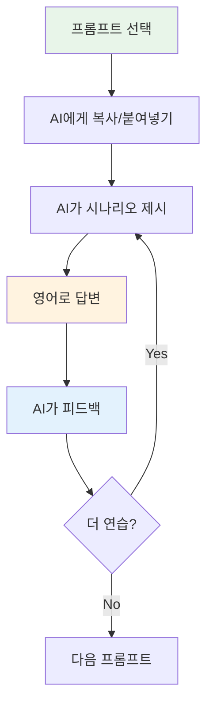

# 🤖 개발자를 위한 AI 학습 프롬프트 시스템

> **ChatGPT/Claude와 함께하는 개발자 영어 완벽 마스터**  
> Full Stack + AI 개발자를 위한 맞춤형 학습 프롬프트

---

## 📋 목차
1. [프롬프트 시스템 개요](#프롬프트-시스템-개요)
2. [코드 리뷰 영어 연습](#-코드-리뷰-영어-연습)
3. [기술 면접 시뮬레이션](#-기술-면접-시뮬레이션)
4. [프로젝트 발표 연습](#-프로젝트-발표-연습)
5. [버그 리포팅 연습](#-버그-리포팅-연습)
6. [아키텍처 논의 연습](#-아키텍처-논의-연습)
7. [AI/ML 프로젝트 설명](#-aiml-프로젝트-설명)
8. [클라이언트 소통 연습](#-클라이언트-소통-연습)
9. [이메일 작성 연습](#-이메일-작성-연습)
10. [발음 및 억양 교정](#-발음-및-억양-교정)

---

## 프롬프트 시스템 개요

### 사용 방법



### 레벨 선택 가이드

| 레벨 | 특징 | 추천 대상 |
|:---:|------|---------|
| 🟢 기본 | 간단한 문장, 기본 표현 | 영어 회화 초보자 |
| 🟡 중급 | 자연스러운 표현, 논리적 설명 | 기술 소통 가능자 |
| 🔴 고급 | 설득력 있는 발표, 복잡한 논의 | 영어 회의 참여자 |

---

## 💻 코드 리뷰 영어 연습

### 프롬프트 1: 코드 리뷰 피드백 연습

```
당신은 시니어 개발자이고, 저는 주니어 개발자의 PR(Pull Request)을 리뷰하는 상황입니다.

**역할:**
- 당신: 주니어 개발자 역할 (내 피드백을 듣고 질문)
- 저: 시니어 개발자 역할 (코드 리뷰 피드백 제공)

**시나리오:**
당신이 작성한 코드에 다음과 같은 문제들이 있습니다:
1. 보안 취약점 (SQL Injection 가능성)
2. 성능 문제 (N+1 query)
3. 에러 핸들링 부족
4. 테스트 커버리지 낮음

저에게 PR을 제출하고, 제가 리뷰 코멘트를 영어로 작성하겠습니다.

**제 목표:**
- 건설적인 피드백 영어로 작성
- 기술적으로 정확하게 설명
- 공손하지만 명확하게 전달
- 구체적인 개선 방안 제시

**피드백 받고 싶은 점:**
- 문법과 표현의 자연스러움
- 기술 용어 사용의 적절성
- 피드백의 명확성과 공손함
- 더 나은 표현 제안

준비되면 "I submitted my PR for review."라고 시작해주세요.
```

### 프롬프트 2: 코드 리뷰 수용 연습

```
당신은 시니어 개발자이고, 저는 주니어 개발자로서 코드 리뷰를 받는 상황입니다.

**역할:**
- 당신: 시니어 개발자 (제 코드에 피드백 제공)
- 저: 주니어 개발자 (피드백을 듣고 대응)

**시나리오:**
저의 PR에 여러 문제가 지적되었고, 이에 대해 설명하거나 질문하거나 수정 계획을 말해야 합니다.

**제 목표:**
- 피드백을 긍정적으로 수용하는 표현 연습
- 기술적 근거를 영어로 설명
- 추가 질문하기
- 수정 계획 명확히 전달

먼저 제 코드에 대해 3가지 피드백을 해주세요 (보안, 성능, 코드 품질).
각 피드백에 대해 제가 영어로 응답하고, 제 답변의 적절성을 평가해주세요.
```

---

## 🎤 기술 면접 시뮬레이션

### 프롬프트 3: 기술 면접 - 시스템 디자인

```
당신은 FAANG 기업의 시니어 엔지니어로 기술 면접을 진행하는 면접관입니다.

**면접 주제:** 
대규모 실시간 채팅 시스템 설계 (예: Slack, Discord)

**요구사항:**
- 1백만 동시 접속자 지원
- 실시간 메시지 전송 (<100ms latency)
- 메시지 히스토리 저장
- 파일 공유 기능
- 높은 가용성 (99.99% uptime)

**제 역할:**
저는 지원자로서 시스템을 설계하고 영어로 설명해야 합니다.

**평가 항목:**
1. 기술적 정확성
2. 설명의 명확성
3. 트레이드오프 이해도
4. 질문에 대한 응답
5. 영어 표현력

**진행 방식:**
1. 제가 시스템 디자인을 설명하면
2. 당신이 질문하고
3. 제가 답변하고
4. 마지막에 피드백 (기술 + 영어 표현)

준비되었습니다. 면접을 시작해주세요.
```

### 프롬프트 4: 기술 면접 - 경험 질문

```
당신은 기술 면접관이고, 저의 과거 프로젝트 경험에 대해 질문합니다.

**질문 카테고리:**
1. 가장 어려웠던 기술적 도전
2. 팀과의 갈등 해결 경험
3. 실패한 프로젝트와 교훈
4. 기술 선택의 근거
5. 성능 최적화 경험

**제 목표:**
- STAR 기법으로 답변 (Situation, Task, Action, Result)
- 구체적인 기술 세부사항 포함
- 배운 점 명확히 전달
- 자연스러운 영어로 설명

**피드백 요청:**
- 답변 구조의 명확성
- 기술 용어 사용의 적절성
- 영어 표현의 자연스러움
- 더 나은 답변 예시

첫 번째 질문으로 시작해주세요: "Tell me about a time when you faced a significant technical challenge."
```

---

## 📊 프로젝트 발표 연습

### 프롬프트 5: AI 프로젝트 발표

```
당신은 우리 회사의 CTO이고, 저는 엔지니어로서 AI 추천 엔진 프로젝트를 발표합니다.

**프로젝트 개요:**
- 기존 협업 필터링 → 딥러닝 기반 추천 엔진으로 업그레이드
- 정확도 72% → 89% 향상
- 클릭률 18% 증가
- 월 $45K 추가 매출

**청중:**
- CTO (기술+비즈니스 관심)
- PM (비즈니스 영향 관심)
- 엔지니어링 팀 (기술 세부사항 관심)

**제 목표:**
1. 오프닝: 프로젝트 소개 (2분)
2. 기술 설명: 아키텍처 및 모델 (5분)
3. 결과: 비즈니스 영향 (3분)
4. Q&A 대응

**요청:**
- 제 발표를 들으며 중간에 질문해주세요
- 기술적 질문과 비즈니스 질문 섞어서
- 발표 후 피드백:
  * 명확성
  * 설득력
  * 영어 표현
  * 개선점

준비됐습니다. "Good morning, everyone. Thank you for joining."로 시작하겠습니다.
```

### 프롬프트 6: 아키텍처 리뷰 발표

```
당신은 시니어 아키텍트이고, 저는 마이크로서비스 마이그레이션 계획을 발표합니다.

**상황:**
- 현재: 모놀리식 아키텍처
- 제안: 단계적 마이크로서비스 전환
- 기간: 6개월
- 예산: $150K

**발표 구조:**
1. 현재 문제점
2. 제안 솔루션
3. 단계별 계획
4. 리스크 및 완화 전략
5. 예상 ROI

**제 목표:**
- 기술적 근거를 명확히 설명
- 비즈니스 가치 강조
- 리스크를 솔직하게 공유
- 질문에 자신감 있게 답변

**피드백 요청:**
- 아키텍처 설명의 명확성
- 비즈니스 케이스 설득력
- 리스크 커뮤니케이션
- 영어 발표 스킬

제 발표를 들으며 비판적으로 질문해주세요.
시작하겠습니다: "I'd like to present our plan for migrating to microservices."
```

---

## 🐛 버그 리포팅 연습

### 프롬프트 7: 긴급 버그 보고

```
당신은 엔지니어링 매니저이고, 저는 프로덕션에서 발생한 긴급 버그를 보고합니다.

**시나리오:**
- 결제 시스템 장애 발생
- 모든 결제가 실패 중
- 고객 불만 급증
- 매출 손실 발생 중

**제가 보고해야 할 내용:**
1. 문제 요약 (무엇이, 언제, 얼마나 심각한지)
2. 영향 범위 (몇 명의 사용자, 얼마의 손실)
3. 근본 원인 (초기 분석)
4. 즉각적 조치 (이미 한 것)
5. 해결 계획 및 타임라인
6. 재발 방지 대책

**제 목표:**
- 침착하고 명확하게 상황 전달
- 책임감 있는 태도
- 구체적인 액션 아이템
- 적절한 긴급성 표현

**평가 기준:**
- 명확성과 간결성
- 중요 정보 누락 없이
- 프로페셔널한 태도
- 영어 표현의 정확성

제가 급히 Slack 메시지를 보내는 상황부터 시작하겠습니다.
```

### 프롬프트 8: 버그 트리아지 미팅

```
당신은 테크 리드이고, 저와 함께 버그 트리아지 미팅을 진행합니다.

**상황:**
오늘 아침 12개의 새로운 버그가 리포트되었습니다.

**제 역할:**
각 버그의 심각도와 우선순위를 평가하고 영어로 설명해야 합니다.

**평가 기준:**
- Severity: P0 (Critical) ~ P3 (Low)
- Impact: 영향받는 사용자 수
- Business impact: 매출/평판 영향
- Effort: 수정하는데 필요한 시간

**연습 목표:**
- 기술적 판단을 영어로 설명
- 우선순위 근거 제시
- 팀원과 의견 조율
- 결정 사항 명확히 정리

당신이 첫 번째 버그를 설명하면, 제가 평가하고 우선순위를 제안하겠습니다.
각 답변에 대해 피드백 주세요.
```

---

## 🏗️ 아키텍처 논의 연습

### 프롬프트 9: 기술 스택 선택 토론

```
당신은 경험 많은 풀스택 개발자이고, 저와 함께 새 프로젝트의 기술 스택을 논의합니다.

**프로젝트:**
실시간 협업 도구 (like Notion + Figma)

**논의 주제:**
1. Frontend: React vs Vue vs Svelte
2. Backend: Node.js vs Python vs Go
3. Database: PostgreSQL vs MongoDB
4. Real-time: WebSocket vs Server-Sent Events
5. Hosting: AWS vs GCP vs Azure

**제 목표:**
- 각 선택의 장단점을 영어로 설명
- 프로젝트 맥락에 맞는 근거 제시
- 반대 의견에 논리적으로 대응
- 최종 합의 도출

**토론 규칙:**
- 서로 다른 의견 가질 수 있음
- 근거 기반으로 주장
- 상대 의견 존중
- 최선의 솔루션 찾기

**피드백 요청:**
- 기술적 주장의 설득력
- 논리적 사고 표현
- 토론 에티켓
- 영어 표현력

첫 번째 주제부터 시작합시다: "What frontend framework should we use?"
```

### 프롬프트 10: RFC(Request for Comments) 발표

```
당신은 엔지니어링 팀이고, 저는 RFC(기술 제안서)를 발표합니다.

**RFC 주제:**
GraphQL API Gateway 도입 제안

**발표 구조:**
1. **Problem Statement:** 현재 REST API의 문제점
2. **Proposed Solution:** GraphQL로 해결하는 방법
3. **Alternatives Considered:** 다른 옵션들과 비교
4. **Implementation Plan:** 구현 계획 (6주)
5. **Risks & Mitigation:** 리스크와 대응 방안
6. **Success Metrics:** 성공 측정 기준

**제 목표:**
- 설득력 있게 제안 발표
- 기술적 근거 명확히 제시
- 질문에 자신감 있게 답변
- 팀의 합의 도출

**당신의 역할:**
- 비판적 질문 (기술, 비즈니스, 리스크)
- 대안 제시
- 우려 사항 공유

**피드백 영역:**
- 제안의 명확성
- 기술적 설득력
- 영어 프레젠테이션 스킬
- Q&A 대응 능력

시작하겠습니다: "I'd like to present an RFC for adopting GraphQL..."
```

---

## 🤖 AI/ML 프로젝트 설명

### 프롬프트 11: 비기술자에게 AI 설명

```
당신은 비기술적 배경의 CEO이고, 저는 AI 엔지니어로서 프로젝트를 설명합니다.

**상황:**
CEO에게 추천 시스템 개선 프로젝트를 설명하고 예산 승인을 받아야 합니다.

**CEO의 관심사:**
- 비즈니스 영향 (매출, 사용자 경험)
- ROI (투자 대비 수익)
- 리스크 (실패 가능성)
- 타임라인 (언제 결과를 볼 수 있나)
- 경쟁력 (경쟁사 대비 우위)

**제가 피해야 할 것:**
- 복잡한 기술 용어 (neural network, backpropagation 등)
- 수학적 설명
- 구현 세부사항

**제가 해야 할 것:**
- 비즈니스 가치로 번역
- 간단한 비유 사용
- 구체적인 숫자 제시
- 질문에 명확히 답변

**연습 목표:**
- 기술을 비즈니스 언어로 번역
- 설득력 있는 스토리텔링
- 신뢰감 있는 태도

CEO 역할로 회의적인 질문을 해주세요.
시작: "So, you want to invest in improving our recommendation system?"
```

### 프롬프트 12: ML 모델 성능 리뷰

```
당신은 ML 팀 리드이고, 저는 새로운 모델의 성능을 발표합니다.

**모델 정보:**
- Task: 감성 분석 (Sentiment Analysis)
- 이전 모델: Logistic Regression (78% accuracy)
- 새 모델: BERT fine-tuned (91% accuracy)

**발표 구조:**
1. **Problem & Motivation**
2. **Model Architecture**
3. **Training Process**
   - Dataset
   - Hyperparameters
   - Training time
4. **Results**
   - Accuracy, Precision, Recall, F1
   - Confusion matrix 해석
5. **Error Analysis**
6. **Production Readiness**
   - Inference time
   - Model size
   - Infrastructure requirements

**당신의 질문 (예상):**
- 데이터 품질은?
- Overfitting은 없나?
- Edge case는 어떻게 처리?
- Production latency는?
- 비용은 얼마나?

**피드백 요청:**
- ML 개념 설명의 명확성
- 기술 용어 사용
- 질문 대응
- 영어 발표 스킬

시작하겠습니다: "I'd like to present the results of our new sentiment analysis model."
```

---

## 👨‍💼 클라이언트 소통 연습

### 프롬프트 13: 기술 컨설팅 미팅

```
당신은 비기술적 배경의 창업자이고, 저는 기술 컨설턴트로서 조언을 제공합니다.

**클라이언트 상황:**
- 스타트업 초기 단계
- MVP를 만들고 싶음
- 예산 제한적 ($50K)
- 3개월 안에 론칭 필요
- 기술 지식 거의 없음

**클라이언트 질문:**
1. 어떤 기술 스택을 써야 하나요?
2. 개발자를 몇 명 고용해야 하나요?
3. 클라우드 비용은 얼마나 드나요?
4. MVP에 어떤 기능을 넣어야 하나요?
5. 보안은 어떻게 하나요?

**제 목표:**
- 전문 지식을 쉽게 설명
- 현실적인 조언 제공
- 예산과 시간 고려
- 신뢰 구축

**평가 기준:**
- 설명의 명확성
- 공감과 이해
- 실용적인 조언
- 프로페셔널한 태도

클라이언트로서 질문해주세요.
저는 컨설턴트로서 답변하고, 피드백을 받겠습니다.
```

### 프롬프트 14: 프로젝트 지연 소통

```
당신은 우리에게 프로젝트를 의뢰한 클라이언트이고, 저는 개발 팀 리드입니다.

**상황:**
- 원래 마감: 2주 후
- 실제: 1개월 더 필요
- 이유: 요구사항 변경 + 기술적 복잡성
- 클라이언트는 마감이 중요함

**제가 해야 할 것:**
1. 상황 솔직하게 설명
2. 지연 원인 명확히 전달
3. 새로운 타임라인 제시
4. 완화 방안 제안 (부분 배포 등)
5. 신뢰 회복

**피해야 할 것:**
- 변명
- 책임 전가
- 모호한 약속
- 감정적 대응

**연습 목표:**
- 어려운 소식을 전문적으로 전달
- 솔루션 중심 대화
- 클라이언트 우려 공감
- 신뢰 유지

**시나리오 시작:**
클라이언트로서 화난 톤으로 미팅을 시작해주세요.
제가 상황을 설명하고 대응하겠습니다.
```

---

## 📧 이메일 작성 연습

### 프롬프트 15: 기술 제안 이메일

```
제가 기술 제안 이메일을 영어로 작성하면, 당신이 평가하고 개선점을 알려주세요.

**시나리오:**
CTO에게 마이크로서비스 마이그레이션 제안 이메일 작성

**포함해야 할 내용:**
1. Subject line (명확하고 간결)
2. Opening (맥락 설정)
3. Problem statement
4. Proposed solution
5. Benefits & ROI
6. Timeline & resources
7. Call to action

**평가 기준:**
- 명확성과 간결성
- 설득력
- 전문성
- 문법과 표현
- 이메일 에티켓

**내가 원하는 피드백:**
- 구체적인 수정 제안
- 더 나은 표현 알려주기
- 문장 구조 개선
- 어색한 부분 지적

준비됐습니다. 이메일을 작성하겠습니다.
```

### 프롬프트 16: 버그 리포트 이메일

```
제가 프로덕션 버그 리포트 이메일을 작성하면, 평가해주세요.

**시나리오:**
매니저에게 긴급 버그 보고 이메일

**필수 요소:**
1. Subject: 긴급성과 문제 명확히
2. Summary: 한 문장 요약
3. Impact: 영향 범위와 심각성
4. Root cause: 원인 분석
5. Actions taken: 이미 한 조치
6. Resolution plan: 해결 계획
7. Prevention: 재발 방지

**톤:**
- 긴급하지만 패닉하지 않음
- 책임감 있음
- 명확하고 구체적
- 액션 지향적

**피드백 요청:**
- 정보의 완전성
- 표현의 적절성
- 긴급성 전달
- 프로페셔널함

이메일을 작성하겠습니다.
```

---

## 🗣️ 발음 및 억양 교정

### 프롬프트 17: 기술 프레젠테이션 스크립트 검토

```
당신은 영어 원어민 엔지니어입니다. 
제가 기술 프레젠테이션 스크립트를 작성하면, 발음하기 어려운 부분이나 더 자연스러운 표현을 알려주세요.

**프레젠테이션 주제:**
"Optimizing Database Performance with Indexing Strategies"

**검토 요청 사항:**
1. 발음하기 어려운 단어 → 더 쉬운 대체어 제안
2. 어색한 표현 → 자연스러운 표현으로
3. 긴 문장 → 짧고 명확하게
4. 억양 패턴 조언 (어디를 강조해야 하는지)

**예시 스크립트 (제가 작성):**
"Today, I'm going to talk about database performance optimization. 
Specifically, we'll explore various indexing strategies that can 
significantly improve query performance in large-scale applications."

**원하는 피드백 형식:**
- ✅ 좋은 부분
- ⚠️ 개선 필요 부분
- 💡 더 나은 대안
- 🔊 발음/억양 팁

스크립트를 작성하겠습니다.
```

---

## 🎯 맞춤형 학습 플랜

### 프롬프트 18: 개인화된 4주 학습 계획

```
저는 Full Stack + AI 개발자로 다음과 같은 상황입니다:

**현재 영어 레벨:**
- 읽기: [초급/중급/고급]
- 쓰기: [초급/중급/고급]
- 말하기: [초급/중급/고급]
- 듣기: [초급/중급/고급]

**업무 상황:**
- 주로 하는 일: [예: 백엔드 API 개발, ML 모델링]
- 영어 사용 빈도: [매일/주 3회/가끔]
- 주요 소통 방식: [이메일/회의/프레젠테이션/코드 리뷰]

**학습 목표:**
- 단기 (1개월): [예: 코드 리뷰 영어로 편하게]
- 중기 (3개월): [예: 기술 프레젠테이션 자신감]
- 장기 (6개월): [예: 해외 컨퍼런스 발표]

**가용 시간:**
- 하루: [30분/1시간/2시간]
- 일주일: [주 3일/주 5일/매일]

**선호 학습 방식:**
- [혼자 연습/AI와 대화/실전 적용]

위 정보를 바탕으로 4주간 구체적인 학습 플랜을 만들어주세요:
- 주차별 목표
- 일일 학습 활동
- 사용할 프롬프트
- 진도 체크 방법
- 예상 성과
```

---

## 📚 추가 학습 리소스

### 프롬프트 19: 실수 패턴 분석

```
당신은 영어 교정 전문가입니다.

저는 한국인 개발자로서 영어로 글을 쓸 때 자주 하는 실수가 있을 것 같습니다.

**분석 요청:**
제가 작성한 영어 문장들을 보고:
1. 반복되는 문법 실수
2. 어색한 표현 패턴
3. 한국어 직역 흔적
4. 개선이 필요한 영역

을 분석하고, 맞춤형 학습 조언을 해주세요.

**제가 쓴 예시 문장들:**
[여기에 최근 작성한 영어 문장 5-10개]

**원하는 피드백:**
- 패턴 분석
- 왜 틀렸는지 설명
- 올바른 표현
- 암기할 규칙
- 연습 방법
```

### 프롬프트 20: 기술 영단어 암기

```
당신은 제 영어 학습 파트너입니다.

**목표:**
개발자가 자주 쓰는 기술 영단어/표현 암기

**학습 방법:**
1. 당신이 시나리오를 제시
2. 제가 해당 상황에 맞는 영어 표현 사용
3. 피드백 및 더 나은 표현 제안
4. 3-5회 반복으로 자연스럽게 암기

**오늘의 학습 표현 (예시):**
- "implement", "refactor", "optimize"
- "bottleneck", "trade-off", "scalability"
- "deprecate", "legacy", "backward compatible"

**연습 방식:**
- 각 단어를 자연스럽게 쓰는 3가지 문장 만들기
- 실제 업무 맥락에서 사용
- 틀려도 괜찮음 (배우는 과정)

**피드백 형식:**
- ✅ 올바른 사용
- ⚠️ 어색하지만 이해 가능
- ❌ 잘못된 사용 (올바른 예시 제공)

오늘의 단어 3개를 알려주고 시작해주세요.
```

---

## 🎮 게임화 학습

### 프롬프트 21: 기술 영어 퀴즈

```
당신은 재미있는 기술 영어 퀴즈 마스터입니다.

**게임 규칙:**
1. 당신이 시나리오 기반 문제 출제
2. 제가 답변 (영어로)
3. 점수 부여 (10점 만점)
4. 설명과 더 나은 답변 예시
5. 10문제 후 총점과 레벨 평가

**문제 유형:**
- 상황에 맞는 표현 선택
- 빈칸 채우기
- 어색한 문장 고치기
- 역할극 (즉석 대답)

**난이도:**
초급 → 중급 → 고급 순서로 점진적 증가

**동기부여:**
- 점수와 레벨 시스템
- 틀려도 격려
- 재도전 기회
- 최종 성취 칭찬

**목표 점수:**
- 60점 이상: 합격
- 80점 이상: 우수
- 90점 이상: 탁월

준비됐습니다! 첫 번째 문제 주세요.
```

---

## 📊 학습 효과 측정

### 프롬프트 22: 진도 평가 테스트

```
저는 4주간 개발자 영어를 학습했습니다.

**학습 내용:**
- 코드 리뷰 영어
- 기술 프레젠테이션
- 버그 리포팅
- 이메일 작성

**평가 요청:**
종합 평가 시험을 만들어주세요:

**시험 구성:**
1. **듣기/이해** (시나리오 제시, 제가 응답)
   - 10분

2. **쓰기** (이메일 작성)
   - 15분

3. **말하기** (기술 설명)
   - 5분

4. **종합** (역할극)
   - 10분

**채점 기준:**
- 문법 정확성 (25점)
- 기술 용어 사용 (25점)
- 명확성 (25점)
- 자연스러움 (25점)

**평가 후:**
- 총점과 레벨
- 강점과 약점
- 다음 학습 방향
- 격려의 메시지

시험 시작해주세요!
```

---

## 💡 사용 팁

### 효과적인 프롬프트 활용법

1. **규칙적으로 연습**
   - 하루 30분씩
   - 같은 시간대에
   - 최소 주 3회

2. **다양한 프롬프트 섞어서**
   - 한 가지만 집중하지 말고
   - 여러 상황 경험
   - 약점 보완

3. **피드백 적극 수용**
   - AI 피드백을 메모
   - 반복되는 실수 정리
   - 개선점 체크리스트

4. **실전 적용**
   - 배운 표현 바로 사용
   - 실제 업무에 적용
   - 동료에게 피드백 요청

### 레벨별 추천 프롬프트

| 레벨 | 추천 프롬프트 | 주당 횟수 |
|:---:|-------------|:--------:|
| 🟢 초급 | 1, 2, 15, 16, 20 | 5회 |
| 🟡 중급 | 3, 5, 7, 9, 13 | 4회 |
| 🔴 고급 | 4, 6, 10, 12, 14 | 3회 |

---

*Last Updated: 2026-01-10*


