# 🧠 문장 연산 학습법 - ChatGPT 여행 영어 회화

> **"단어를 조합해서 문장을 만드는 것이 아니라, 문장 패턴을 통째로 외워서 바로 말한다!"**

---

# 🌟 왜 회화 중심으로 영어를 배워야 하는가?

## 📚 기존 영어 학습의 한계

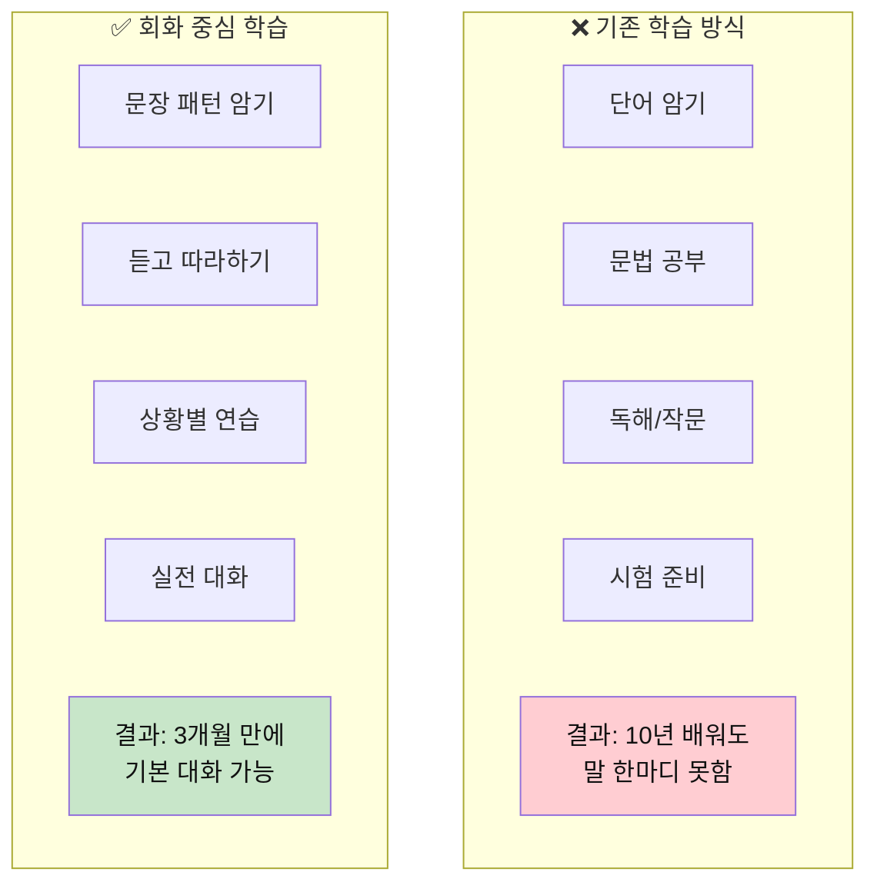
```mermaid
flowchart TB
    subgraph 기존학습["❌ 기존 학습 방식"]
        A[단어 암기] 
        B[문법 공부]
        C[독해/작문]
        D[시험 준비]
        E["결과: 10년 배워도<br/>말 한마디 못함"]
    end
    
    subgraph 회화중심["✅ 회화 중심 학습"]
        F[문장 패턴 암기] 
        G[듣고 따라하기]
        H[상황별 연습]
        I[실전 대화]
        J["결과: 3개월 만에<br/>기본 대화 가능"]
    end
    
    style E fill:#ffcdd2,color:#111
    style J fill:#c8e6c9,color:#111
```

### 😰 우리가 영어를 못하는 진짜 이유

| 문제 | 원인 | 결과 |
|:----:|------|------|
| **단어만 암기** | apple = 사과, book = 책... | 단어는 아는데 문장을 못 만듦 |
| **문법 위주** | 현재완료, 가정법, 관계대명사... | 문법은 아는데 입이 안 떨어짐 |
| **읽기 중심** | 독해 지문, 영자 신문... | 읽을 순 있는데 들리지 않음 |
| **시험 목적** | 토익, 수능, 공무원... | 점수는 높은데 회화는 0점 |

> **핵심 문제**: 우리는 "영어를 아는 것"에 집중했지, "영어로 말하는 것"을 연습하지 않았다.

---

## 💡 회화 중심 학습이 필요한 이유

### 1️⃣ 언어의 본질은 "소통"이다

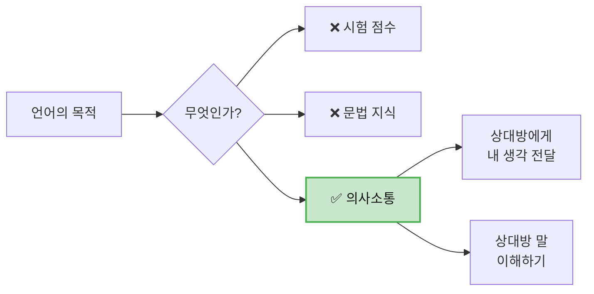
```mermaid
flowchart LR
    A[언어의 목적] --> B{무엇인가?}
    B --> C[❌ 시험 점수]
    B --> D[❌ 문법 지식]
    B --> E[✅ 의사소통]
    
    E --> F["상대방에게<br/>내 생각 전달"]
    E --> G["상대방 말<br/>이해하기"]
    
    style E fill:#c8e6c9,stroke:#4caf50,stroke-width:2px,color:#111
```

### 2️⃣ 뇌는 "덩어리"로 기억한다

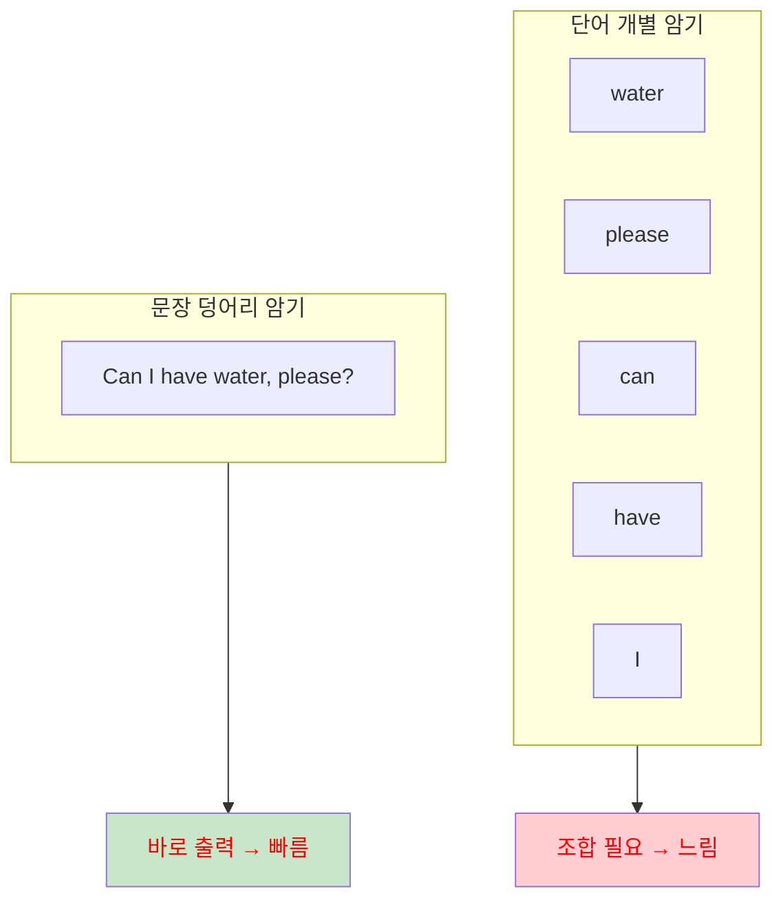
```mermaid
flowchart TB
    subgraph 단어암기["단어 개별 암기"]
        W1[water] 
        W2[please]
        W3[can]
        W4[have]
        W5[I]
    end
    
    subgraph 문장암기["문장 덩어리 암기"]
        S1["Can I have water, please?"]
    end
    
    단어암기 --> 결과1["조합 필요 → 느림"]
    문장암기 --> 결과2["바로 출력 → 빠름"]
    style 결과1 fill:#ffcdd2,color:#f00
    style 결과2 fill:#c8e6c9,color:#f00
```

**🧠 뇌과학적 근거:**
- 뇌는 개별 정보보다 **청킹(Chunking)** 된 정보를 더 잘 기억함
- "Can I have"를 하나의 덩어리로 저장하면 처리 속도 ↑
- 원어민도 문장을 단어 조합이 아닌 **패턴 덩어리**로 말함

### 3️⃣ 실전에서는 "생각할 시간"이 없다

| 상황 | 단어 조합 방식 | 패턴 방식 |
|:----:|:-------------:|:---------:|
| 카페에서 주문 | "음... water... I want... 아니 can I..." (5초) | "Can I have water, please?" (1초) |
| 택시에서 목적지 | "Go... hotel... please... to the..." (5초) | "To the hotel, please." (1초) |
| 호텔 체크인 | "I... reservation... have... under..." (5초) | "I have a reservation under Kim." (1초) |

> **현실**: 상대방은 기다려주지 않는다. 3초 안에 말해야 대화가 된다.

---

## 🎯 문장/패턴 학습의 5가지 장점

### 📊 장점 비교표

| 장점 | 설명 | 효과 |
|:----:|------|:----:|
| **속도** | 생각 없이 바로 출력 | ⭐⭐⭐⭐⭐ |
| **정확성** | 검증된 문장 사용 | ⭐⭐⭐⭐⭐ |
| **자연스러움** | 원어민 표현 그대로 | ⭐⭐⭐⭐⭐ |
| **자신감** | 확실한 문장이 있음 | ⭐⭐⭐⭐ |
| **확장성** | 단어만 바꾸면 무한 응용 | ⭐⭐⭐⭐⭐ |

### 🔍 각 장점 상세 설명

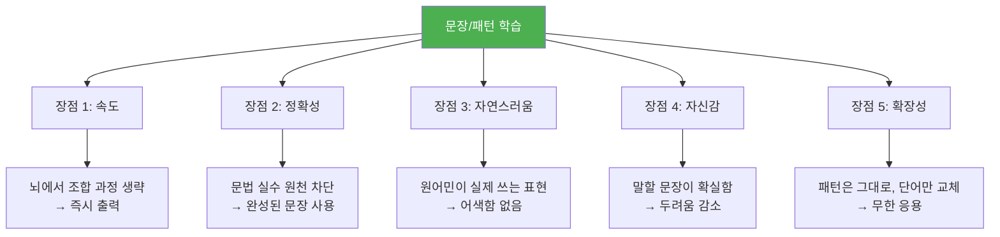
```mermaid
flowchart TB
    A[문장/패턴 학습] --> B[장점 1: 속도]
    A --> C[장점 2: 정확성]
    A --> D[장점 3: 자연스러움]
    A --> E[장점 4: 자신감]
    A --> F[장점 5: 확장성]
    
    B --> B1["뇌에서 조합 과정 생략<br/>→ 즉시 출력"]
    C --> C1["문법 실수 원천 차단<br/>→ 완성된 문장 사용"]
    D --> D1["원어민이 실제 쓰는 표현<br/>→ 어색함 없음"]
    E --> E1["말할 문장이 확실함<br/>→ 두려움 감소"]
    F --> F1["패턴은 그대로, 단어만 교체<br/>→ 무한 응용"]
    
    style A fill:#4CAF50,color:#fff
```

---

## 📖 단어도 문장 속에서 외워야 하는 이유

### ❌ 단어만 외우면 생기는 문제

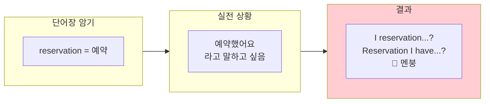
```mermaid
flowchart LR
    subgraph 단어암기["단어장 암기"]
        A["reservation = 예약"]
    end
    
    subgraph 실전["실전 상황"]
        B["예약했어요<br/>라고 말하고 싶음"]
    end
    
    subgraph 결과["결과"]
        C["I reservation...?<br/>Reservation I have...?<br/>🤯 멘붕"]
    end
    
    단어암기 --> 실전 --> 결과
    
    style 결과 fill:#ffcdd2
```

### ✅ 문장 속에서 외우면

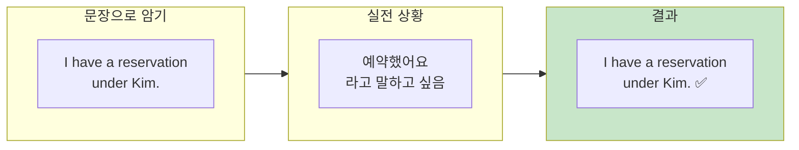
```mermaid
flowchart LR
    subgraph 문장암기["문장으로 암기"]
        A["I have a reservation<br/>under Kim."]
    end
    
    subgraph 실전["실전 상황"]
        B["예약했어요<br/>라고 말하고 싶음"]
    end
    
    subgraph 결과["결과"]
        C["I have a reservation<br/>under Kim. ✅"]
    end
    
    문장암기 --> 실전 --> 결과
    
    style 결과 fill:#c8e6c9
```

### 🧠 단어를 문장으로 외우는 방법

| 방식 | 예시 | 효과 |
|:----:|------|:----:|
| ❌ 단어만 | water = 물 | 단어는 아는데 못 씀 |
| ✅ 문장으로 | "Can I have water, please?" | water가 필요할 때 문장째로 나옴 |
| ❌ 단어만 | check-in = 체크인 | 어떻게 말하지? |
| ✅ 문장으로 | "I'd like to check in." | 바로 사용 가능 |

### 📝 단어 학습 비교

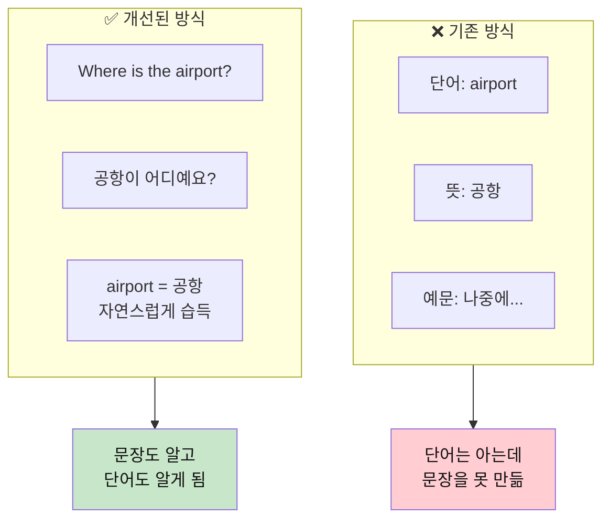
```mermaid
flowchart TB
    subgraph 기존["❌ 기존 방식"]
        A1[단어: airport]
        A2[뜻: 공항]
        A3[예문: 나중에...]
    end
    
    subgraph 개선["✅ 개선된 방식"]
        B1["Where is the airport?"]
        B2["공항이 어디예요?"]
        B3[airport = 공항<br/>자연스럽게 습득]
    end
    
    기존 --> R1["단어는 아는데<br/>문장을 못 만듦"]
    개선 --> R2["문장도 알고<br/>단어도 알게 됨"]
    
    style R1 fill:#ffcdd2,color:#111
    style R2 fill:#c8e6c9,color:#111
```

---

## 🎯 핵심 단어도 패턴과 함께 외우기

### 여행 필수 단어 + 패턴 조합

| 단어 | 단독 암기 (X) | 패턴과 함께 (O) |
|:----:|:------------:|:--------------:|
| **window** | window = 창문 | "Can I have a **window** seat?" |
| **check** | check = 확인하다 | "I'd like to **check** in." |
| **receipt** | receipt = 영수증 | "Could I have the **receipt**?" |
| **allergic** | allergic = 알레르기 | "I'm **allergic** to peanuts." |
| **recommend** | recommend = 추천하다 | "What do you **recommend**?" |

### 이렇게 외우면 얻는 것

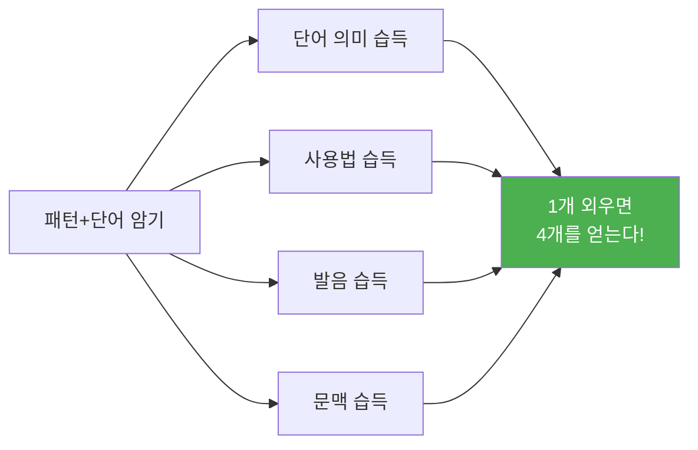
```mermaid
flowchart LR
    A[패턴+단어 암기] --> B[단어 의미 습득]
    A --> C[사용법 습득]
    A --> D[발음 습득]
    A --> E[문맥 습득]
    
    B --> F["1개 외우면<br/>4개를 얻는다!"]
    C --> F
    D --> F
    E --> F
    
    style F fill:#4CAF50,color:#fff
```

---

## 💪 회화 중심 학습의 실제 효과

### 📈 학습 곡선 비교

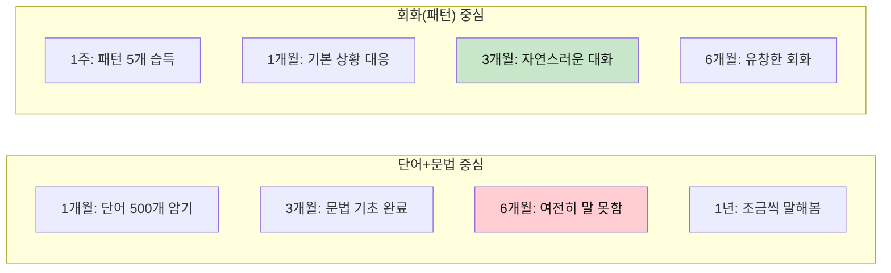
```mermaid
flowchart LR
    subgraph 단어문법["단어+문법 중심"]
        A1["1개월: 단어 500개 암기"]
        A2["3개월: 문법 기초 완료"]
        A3["6개월: 여전히 말 못함"]
        A4["1년: 조금씩 말해봄"]
    end
    
    subgraph 회화중심["회화(패턴) 중심"]
        B1["1주: 패턴 5개 습득"]
        B2["1개월: 기본 상황 대응"]
        B3["3개월: 자연스러운 대화"]
        B4["6개월: 유창한 회화"]
    end
    
    style A3 fill:#ffcdd2,color:#111
    style B3 fill:#c8e6c9,color:#111
```

### 📊 숫자로 보는 효과

| 항목 | 단어 중심 | 패턴 중심 |
|:----:|:--------:|:--------:|
| **1문장 말하기까지** | 6개월 | 1주 |
| **기본 대화까지** | 1년 | 1개월 |
| **자신감 생기기까지** | 2년+ | 3개월 |
| **필요 암기량** | 단어 3000+ 문법 100+ | 패턴 50개 |

---

## 🚀 결론: 왜 문장/패턴인가?

### 핵심 메시지

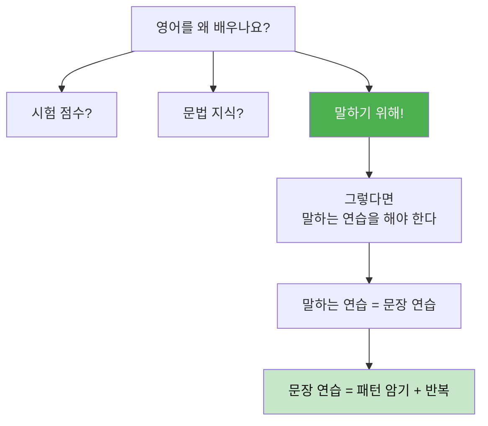
```mermaid
flowchart TB
    Q["영어를 왜 배우나요?"]
    Q --> A1["시험 점수?"]
    Q --> A2["문법 지식?"]
    Q --> A3["말하기 위해!"]
    
    A3 --> R["그렇다면<br/>말하는 연습을 해야 한다"]
    R --> S["말하는 연습 = 문장 연습"]
    S --> T["문장 연습 = 패턴 암기 + 반복"]
    
    style A3 fill:#4CAF50,color:#fff
    style T fill:#c8e6c9,color:#111
```

### ✨ 기억해야 할 것

> **"단어 100개를 아는 것보다, 문장 10개를 확실히 말할 수 있는 게 낫다."**

> **"문법을 분석하는 데 쓸 시간에, 문장을 10번 더 말하라."**

> **"영어는 지식이 아니라 기술이다. 기술은 반복으로만 는다."**

---

## 🎓 요약: 회화 중심 학습 3원칙

| 원칙 | 내용 |
|:----:|------|
| **1. 문장으로 외워라** | 단어 따로, 문법 따로 ❌ → 문장 통째로 ✅ |
| **2. 입으로 연습하라** | 눈으로 읽기 ❌ → 소리 내어 말하기 ✅ |
| **3. 반복하라** | 한 번 보고 넘기기 ❌ → 10번 반복 ✅ |

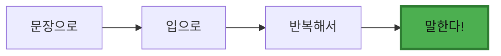
```mermaid
flowchart LR
    A[문장으로] --> B[입으로]
    B --> C[반복해서]
    C --> D[말한다!]
    
    style D fill:#4CAF50,color:#fff,stroke:#2E7D32,stroke-width:3px,color:#111
```

---

## 🎯 이 학습법의 핵심 철학

### 왜 문장 통째로 외우기가 효과적인가?

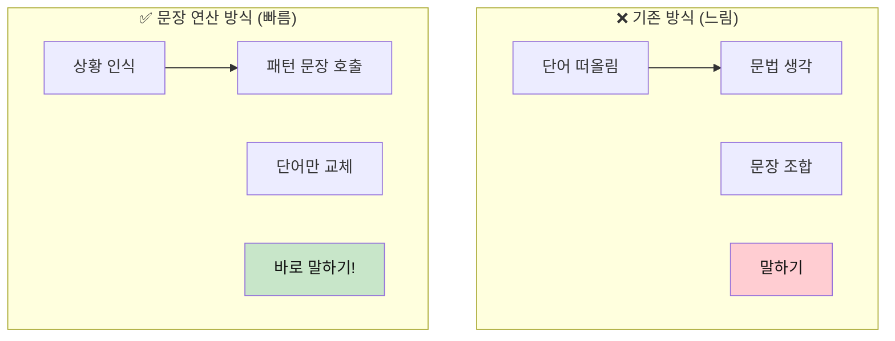
```mermaid
flowchart TB
    subgraph 기존방식["❌ 기존 방식 (느림)"]
        A1[단어 떠올림] --> A2[문법 생각]
        A3[문장 조합]
        A4[말하기]
    end
    
    subgraph 연산방식["✅ 문장 연산 방식 (빠름)"]
        B1[상황 인식] --> B2[패턴 문장 호출]
        B3[단어만 교체]
        B4[바로 말하기!]
    end
    
    style A4 fill:#ffcdd2,color:#111
    style B4 fill:#c8e6c9,color:#111
```

### 📊 학습 효과 비교

| 항목 | 단어 암기 방식 | 문장 연산 방식 |
|:----:|:-------------:|:-------------:|
| **말하기 속도** | 느림 (조합 필요) | 빠름 (즉시 출력) |
| **문법 오류** | 많음 | 거의 없음 |
| **자연스러움** | 어색함 | 원어민 표현 |
| **실전 활용도** | 낮음 | 높음 |
| **학습 부담** | 단어+문법 둘 다 | 문장만 |

### 🧠 뇌의 연산 작용

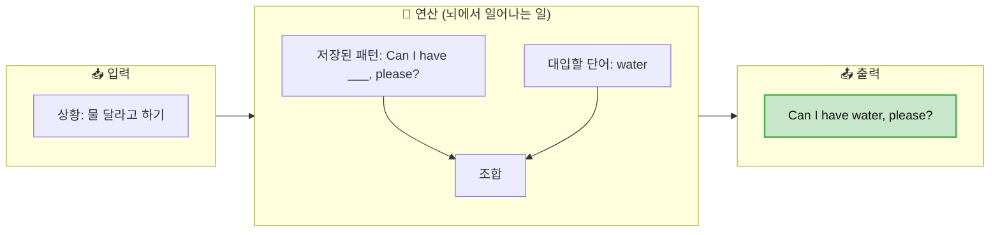
```mermaid
flowchart LR
    subgraph 입력["📥 입력"]
        A[상황: 물 달라고 하기]
    end
    
    subgraph 연산["🧮 연산 (뇌에서 일어나는 일)"]
        B[저장된 패턴: Can I have ___, please?]
        C[대입할 단어: water]
        B --> D[조합]
        C --> D
    end
    
    subgraph 출력["📤 출력"]
        E["Can I have water, please?"]
    end
    
    입력 --> 연산
    연산 --> 출력
    
    style E fill:#c8e6c9,stroke:#4caf50,stroke-width:2px,color:#111
```

---

## 📚 단계별 학습 구성

### 전체 학습 로드맵

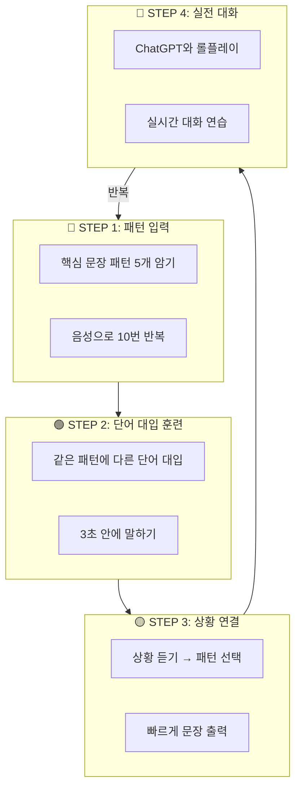
```mermaid
flowchart TB
    subgraph STEP1["🔵 STEP 1: 패턴 입력"]
        A1[핵심 문장 패턴 5개 암기]
        A2[음성으로 10번 반복]
    end
    
    subgraph STEP2["🟢 STEP 2: 단어 대입 훈련"]
        B1[같은 패턴에 다른 단어 대입]
        B2[3초 안에 말하기]
    end
    
    subgraph STEP3["🟡 STEP 3: 상황 연결"]
        C1[상황 듣기 → 패턴 선택]
        C2[빠르게 문장 출력]
    end
    
    subgraph STEP4["🔴 STEP 4: 실전 대화"]
        D1[ChatGPT와 롤플레이]
        D2[실시간 대화 연습]
    end
    
    STEP1 --> STEP2 --> STEP3 --> STEP4
    STEP4 -->|반복| STEP1
```

---

# 🎨 프롬프트 설계 가이드

## 프롬프트 유형 비교

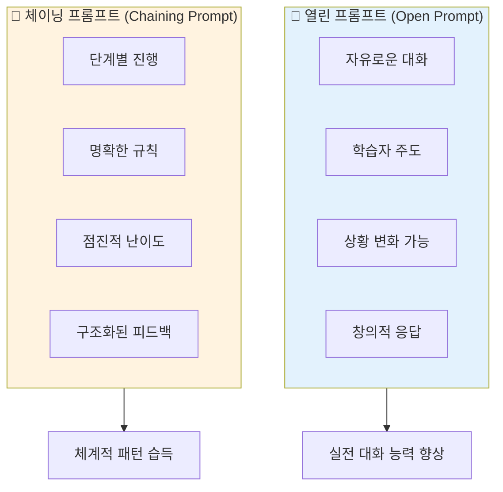
```mermaid
flowchart TB
    subgraph 열린프롬프트["🌊 열린 프롬프트 (Open Prompt)"]
        O1[자유로운 대화]
        O2[학습자 주도]
        O3[상황 변화 가능]
        O4[창의적 응답]
    end
    
    subgraph 체이닝프롬프트["🔗 체이닝 프롬프트 (Chaining Prompt)"]
        C1[단계별 진행]
        C2[명확한 규칙]
        C3[점진적 난이도]
        C4[구조화된 피드백]
    end
    
    열린프롬프트 --> 결과1["실전 대화 능력 향상"]
    체이닝프롬프트 --> 결과2["체계적 패턴 습득"]
    
    style 열린프롬프트 fill:#e3f2fd
    style 체이닝프롬프트 fill:#fff3e0
```

### 📊 언제 어떤 프롬프트를 사용할까?

| 상황 | 열린 프롬프트 | 체이닝 프롬프트 |
|:----:|:------------:|:--------------:|
| 새 패턴 학습 | ❌ | ✅ |
| 패턴 익숙해진 후 | ✅ | ❌ |
| 속도 향상 훈련 | ❌ | ✅ |
| 실전 대화 연습 | ✅ | ❌ |
| 복습/테스트 | ❌ | ✅ |
| 응용력 향상 | ✅ | ❌ |

---

# 🌊 열린 프롬프트 (Open Prompt)

> **특징**: 자유롭고 유연한 대화, 학습자가 주도권을 가짐

## 🎯 열린 프롬프트 설계 원칙

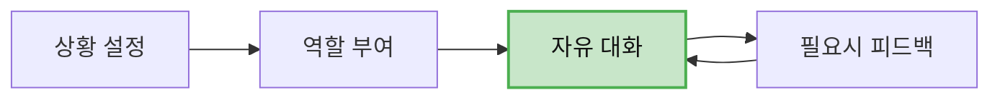
```mermaid
flowchart LR
    A[상황 설정] --> B[역할 부여]
    B --> C[자유 대화]
    C --> D[필요시 피드백]
    D --> C
    
    style C fill:#c8e6c9,stroke:#4caf50,stroke-width:2px,color:#111
```

---

## 📝 열린 프롬프트 템플릿

### Type 1: 자유 대화형

```
당신은 [역할]입니다.
저와 영어로 자유롭게 대화해주세요.

📍 상황: [간단한 배경]

📌 요청:
- 자연스러운 대화를 유지해주세요
- 제가 "help"라고 하면 힌트를 주세요
- 제가 "feedback"이라고 하면 교정해주세요
- 그 외에는 대화 흐름을 끊지 마세요

시작해주세요!
```

### Type 2: 상황 몰입형

```
[상황 설명]

저는 지금 [장소]에 있습니다.
당신은 [역할]입니다.

대화를 시작해주세요.
저는 상황에 맞게 영어로 응답하겠습니다.

💡 참고: 
- 저는 패턴 "___"을 연습 중입니다
- 이 패턴을 사용할 기회를 자연스럽게 만들어주세요
```

### Type 3: 탐험형 (Exploration)

```
오늘은 [주제]에 대해 영어로 대화하고 싶어요.

📌 규칙:
- 저한테 질문을 던져주세요
- 제 대답을 듣고 자연스럽게 대화를 이어가주세요
- 틀린 표현은 대화가 끝난 후 정리해주세요
- 새로운 표현이 나오면 자연스럽게 알려주세요

Let's talk!
```

---

## 🎬 열린 프롬프트 실전 예시

### 예시 1: 카페 자유 대화

```
당신은 외국 카페의 친절한 바리스타입니다.
저는 카페에 들어온 손님이에요.

자연스럽게 대화를 시작해주세요.
저는 배운 패턴들을 활용해서 주문하겠습니다.

특별한 순서 없이, 실제 카페처럼 대화해주세요.
대화가 끝나면 "피드백 주세요"라고 할게요.

시작!
```

### 예시 2: 여행 중 우연한 만남

```
상황: 저는 해외 여행 중 공원 벤치에 앉아있습니다.
당신은 옆에 앉은 친절한 현지인입니다.

가볍게 말을 걸어주세요.
날씨, 여행, 추천 장소 등 자유롭게 대화해요.

저는 영어로 최대한 자연스럽게 대화하겠습니다.
막히면 "How do I say...?"로 물어볼게요.

대화 시작해주세요!
```

### 예시 3: 문제 상황 즉흥 대응

```
당신은 다양한 역할을 맡아주세요.
저에게 여행 중 생길 수 있는 상황을 즉흥적으로 던져주세요.

예시 상황:
- 호텔 직원: "I'm sorry, but we don't have your reservation."
- 택시 기사: "Sorry, card machine is broken."
- 식당 직원: "That dish is sold out."

저는 그때그때 영어로 대응하겠습니다.
다양한 상황을 연속으로 주세요!
```

---

## 💡 열린 프롬프트 활용 팁

| 팁 | 설명 |
|:--:|------|
| **"help" 신호** | 막힐 때 힌트 요청용 키워드 설정 |
| **피드백 지연** | 대화 중엔 교정 없이, 끝나고 정리 |
| **역할 고정** | ChatGPT가 역할에서 벗어나지 않게 |
| **패턴 유도** | 특정 패턴을 쓸 기회를 만들어달라고 요청 |

---

# 🔗 구조적 체이닝 프롬프트 (Chaining Prompt)

> **특징**: 단계별로 연결된 체계적 학습, 점진적 난이도 상승

## 🎯 체이닝 프롬프트 설계 원칙

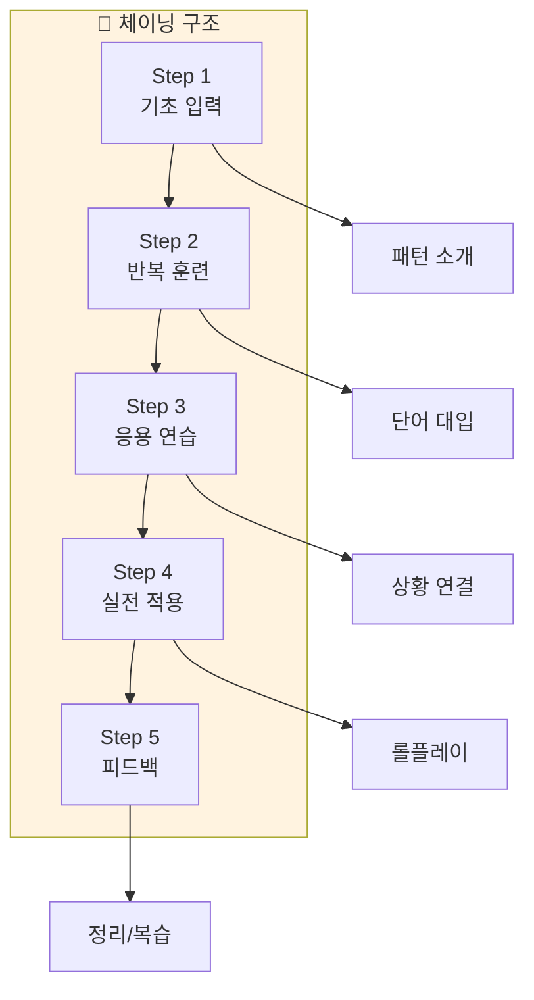
```mermaid
flowchart TB
    subgraph Chain["🔗 체이닝 구조"]
        direction LR
        S1["Step 1<br/>기초 입력"] --> S2["Step 2<br/>반복 훈련"]
        S2 --> S3["Step 3<br/>응용 연습"]
        S3 --> S4["Step 4<br/>실전 적용"]
        S4 --> S5["Step 5<br/>피드백"]
    end
    
    S1 --> R1["패턴 소개"]
    S2 --> R2["단어 대입"]
    S3 --> R3["상황 연결"]
    S4 --> R4["롤플레이"]
    S5 --> R5["정리/복습"]
    
    style Chain fill:#fff3e0
```

---

## 📝 체이닝 프롬프트 마스터 템플릿

### 🔥 완전체 체이닝 프롬프트 (5단계)

```
[패턴 학습 체이닝 세션]

오늘 학습할 패턴: "Can I have ___, please?"

📌 진행 규칙:
- 제가 "next"라고 하면 다음 단계로
- 제가 "again"이라고 하면 현재 단계 반복
- 각 단계 완료 시 "✅ Step X 완료!" 표시

━━━━━━━━━━━━━━━━━━━━━━━━━━━━━━

🔵 STEP 1: 패턴 입력 (3분)
━━━━━━━━━━━━━━━━━━━━━━━━━━━━━━
- 패턴의 의미와 사용 상황 설명
- 예문 5개 제시
- 각 예문을 천천히 읽어주세요 (음성 모드)
- 제가 따라하면 발음 피드백

━━━━━━━━━━━━━━━━━━━━━━━━━━━━━━

🟢 STEP 2: 단어 대입 드릴 (3분)
━━━━━━━━━━━━━━━━━━━━━━━━━━━━━━
- 한국어 단어를 하나씩 제시
- 저는 3초 안에 완성 문장을 말함
- 10개 연속 진행
- 맞으면 ✓ / 틀리면 교정

━━━━━━━━━━━━━━━━━━━━━━━━━━━━━━

🟡 STEP 3: 상황 연결 (3분)
━━━━━━━━━━━━━━━━━━━━━━━━━━━━━━
- 여행 상황을 한국어로 제시
- 저는 패턴을 활용해 영어로 말함
- 5개 상황 연속
- 다른 표현 가능하면 알려주기

━━━━━━━━━━━━━━━━━━━━━━━━━━━━━━

🔴 STEP 4: 미니 롤플레이 (5분)
━━━━━━━━━━━━━━━━━━━━━━━━━━━━━━
- 오늘 패턴을 활용할 수 있는 상황 설정
- 자연스러운 대화 3~5턴
- 대화 중 교정 없이 진행

━━━━━━━━━━━━━━━━━━━━━━━━━━━━━━

🟣 STEP 5: 정리 & 피드백 (1분)
━━━━━━━━━━━━━━━━━━━━━━━━━━━━━━
- 오늘 배운 패턴 정리
- 잘한 점 / 개선점
- 복습용 문장 3개 제시
- 오늘 점수 (10점 만점)

━━━━━━━━━━━━━━━━━━━━━━━━━━━━━━

Step 1부터 시작해주세요!
```

---

## 🎯 목적별 체이닝 프롬프트

### Chain A: 새 패턴 습득용

```
[새 패턴 습득 체인]

오늘의 새 패턴: "I'd like to ___"

📌 Chain 구조:

[1/4] 패턴 이해
→ 의미, 뉘앙스, vs 다른 표현 비교
→ "이해했어요" 하면 다음으로

[2/4] 듣고 따라하기
→ 예문 5개를 천천히 읽어주세요
→ 저는 따라 말합니다
→ 발음 피드백 후 "next"

[3/4] 만들어 말하기
→ 한국어 뜻을 주세요
→ 저는 영어로 만들어 말합니다
→ 5개 완료 후 "next"

[4/4] 실전 사용
→ 이 패턴이 필요한 상황을 만들어주세요
→ 저는 대화 속에서 사용합니다

시작!
```

### Chain B: 속도 향상용

```
[속도 향상 체인]

오늘 훈련할 패턴: "Could you ___?"

📌 Chain 구조 (점점 빨라짐):

[Round 1] 워밍업 - 5초 제한
→ 한국어 → 영어 변환 5문제
→ 정확성 중심

[Round 2] 스피드업 - 3초 제한
→ 같은 형식 5문제
→ 속도 + 정확성

[Round 3] 풀스피드 - 2초 제한
→ 연속 10문제
→ 막히면 패스, 나중에 정리

[Final] 결과 정리
→ 정확도: __/20
→ 평균 반응 시간
→ 틀린 문장 복습

"3, 2, 1, Round 1 시작!"으로 시작해주세요!
```

### Chain C: 복습 강화용

```
[복습 강화 체인]

복습할 패턴들:
1. Can I have ___?
2. Could you ___?
3. Where is ___?

📌 Chain 구조:

[1/3] 기억 테스트
→ 각 패턴의 예문 1개씩 말해보기
→ 기억 안 나면 힌트 요청 가능

[2/3] 랜덤 섞기
→ 상황을 주면 적절한 패턴 선택해서 말하기
→ 10문제 랜덤

[3/3] 연결 대화
→ 3개 패턴을 모두 사용하는 롤플레이
→ 자연스럽게 섞어서 사용

각 단계 완료 후 "done" 입력하면 다음으로!
```

### Chain D: 상황 완전 정복용

```
[상황 완전 정복 체인]

오늘 정복할 상황: 레스토랑

📌 Chain 구조:

[Phase 1] 필수 표현 입력
→ 레스토랑에서 쓰는 핵심 표현 10개
→ 하나씩 따라하기

[Phase 2] 상황별 매칭
→ 레스토랑 상황을 순서대로 제시
→ 입장 → 주문 → 식사 → 계산
→ 각 상황에 맞는 표현 말하기

[Phase 3] 변형 상황
→ 예상치 못한 상황 대응
→ "메뉴에 없는 거 요청" "음식 잘못 나옴" 등

[Phase 4] 전체 시뮬레이션
→ 처음부터 끝까지 롤플레이
→ 중간 교정 없이 진행

[Phase 5] 완전 분석
→ 대화 전체 리뷰
→ 잘한 점 / 개선점
→ 이 상황 마스터 점수

Phase 1부터 시작!
```

---

## 🔄 체이닝 프롬프트 연결 다이어그램

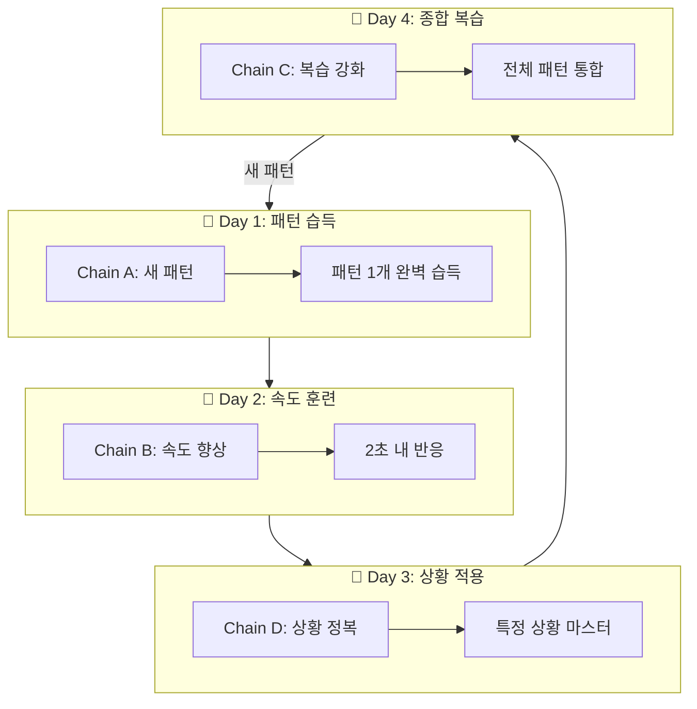
```mermaid
flowchart TB
    subgraph Day1["📅 Day 1: 패턴 습득"]
        A1[Chain A: 새 패턴] --> A2[패턴 1개 완벽 습득]
    end
    
    subgraph Day2["📅 Day 2: 속도 훈련"]
        B1[Chain B: 속도 향상] --> B2[2초 내 반응]
    end
    
    subgraph Day3["📅 Day 3: 상황 적용"]
        C1[Chain D: 상황 정복] --> C2[특정 상황 마스터]
    end
    
    subgraph Day4["📅 Day 4: 종합 복습"]
        D1[Chain C: 복습 강화] --> D2[전체 패턴 통합]
    end
    
    Day1 --> Day2 --> Day3 --> Day4
    Day4 -->|새 패턴| Day1
```

---

## 🎨 나만의 체이닝 프롬프트 만들기

### 템플릿 빌더

```
[나만의 체이닝 프롬프트]

📌 학습 목표: [목표 작성]
📌 오늘의 패턴: [패턴 작성]
📌 총 소요 시간: [시간]분

━━━━━━━━━━━━━━━━━━━━━━━━━━━━━━

[Step 1] _______________
목표: 
방법:
완료 조건:

[Step 2] _______________
목표:
방법:
완료 조건:

[Step 3] _______________
목표:
방법:
완료 조건:

... (필요한 만큼 추가)

━━━━━━━━━━━━━━━━━━━━━━━━━━━━━━

📌 진행 키워드:
- "next" = 다음 단계
- "again" = 현재 단계 반복
- "help" = 힌트 요청
- "done" = 종료

시작해주세요!
```

---

## 📊 프롬프트 유형별 효과 비교

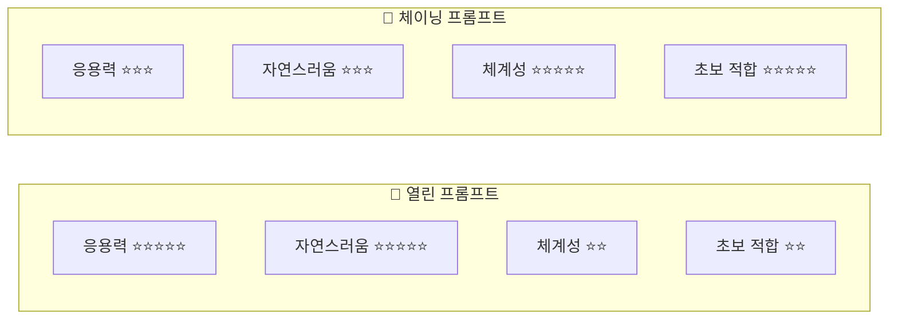
```mermaid
flowchart LR
    subgraph 열린["🌊 열린 프롬프트"]
        O1["응용력 ⭐⭐⭐⭐⭐"]
        O2["자연스러움 ⭐⭐⭐⭐⭐"]
        O3["체계성 ⭐⭐"]
        O4["초보 적합 ⭐⭐"]
    end
    
    subgraph 체이닝["🔗 체이닝 프롬프트"]
        C1["응용력 ⭐⭐⭐"]
        C2["자연스러움 ⭐⭐⭐"]
        C3["체계성 ⭐⭐⭐⭐⭐"]
        C4["초보 적합 ⭐⭐⭐⭐⭐"]
    end
```

| 평가 항목 | 열린 프롬프트 | 체이닝 프롬프트 |
|:--------:|:------------:|:--------------:|
| **학습 구조** | 자유로움 | 체계적 |
| **난이도 조절** | 어려움 | 쉬움 |
| **진도 파악** | 모호함 | 명확함 |
| **실전 감각** | 뛰어남 | 보통 |
| **초보자 추천** | △ | ◎ |
| **숙련자 추천** | ◎ | △ |

---

## 🚀 추천 학습 순서

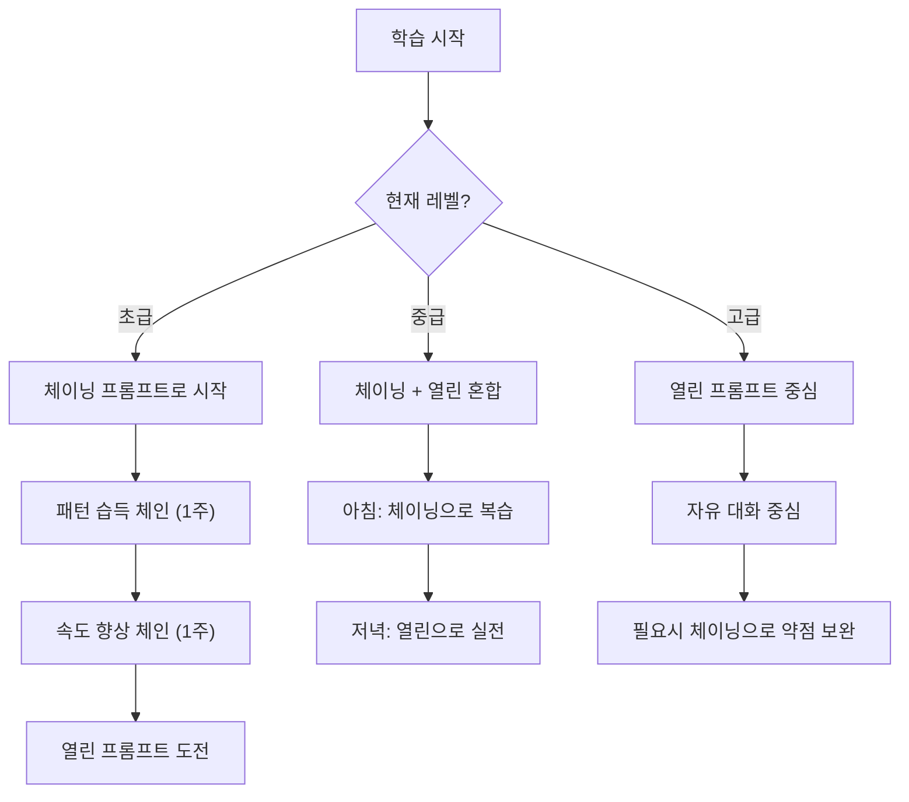
```mermaid
flowchart TB
    START[학습 시작] --> Q{현재 레벨?}
    
    Q -->|초급| A[체이닝 프롬프트로 시작]
    Q -->|중급| B[체이닝 + 열린 혼합]
    Q -->|고급| C[열린 프롬프트 중심]
    
    A --> A1["패턴 습득 체인 (1주)"]
    A1 --> A2["속도 향상 체인 (1주)"]
    A2 --> A3["열린 프롬프트 도전"]
    
    B --> B1["아침: 체이닝으로 복습"]
    B1 --> B2["저녁: 열린으로 실전"]
    
    C --> C1["자유 대화 중심"]
    C1 --> C2["필요시 체이닝으로 약점 보완"]
```

---

# 📋 STEP 1: 패턴 입력 프롬프트

## 🎙️ 오늘의 패턴 학습 시작

```
당신은 영어 회화 튜터입니다.

오늘 배울 핵심 패턴: "Can I have ___, please?"

다음 순서로 학습을 진행해주세요:

1️⃣ 이 패턴의 의미와 사용 상황을 설명해주세요
2️⃣ 여행에서 자주 쓰는 예문 5개를 알려주세요
3️⃣ 각 예문을 천천히 2번씩 읽어주세요 (음성 모드)
4️⃣ 제가 따라할 시간을 주세요

시작해주세요!
```

---

## 📖 여행 필수 5대 패턴 학습

### 패턴 1: Can I have ___?

```
[패턴 암기 세션]

패턴: "Can I have ___, please?"
뜻: "~를 주시겠어요?"

이 패턴으로 만들 수 있는 문장 10개를 알려주세요.
여행 상황별로 나눠서요:

- 기내 (3개)
- 식당 (3개)  
- 호텔 (2개)
- 카페 (2개)

각 문장을 읽어주시고, 제가 따라한 후 피드백 주세요.
```

### 패턴 2: Could you ___?

```
[패턴 암기 세션]

패턴: "Could you ___, please?"
뜻: "~해주시겠어요?" (정중한 요청)

이 패턴으로 만들 수 있는 여행 문장 10개를 알려주세요:

- 서비스 요청 (4개)
- 도움 요청 (3개)
- 정보 요청 (3개)

제가 말하면 발음 교정해주세요.
```

### 패턴 3: Where is ___?

```
[패턴 암기 세션]

패턴: "Where is ___?" / "Where can I find ___?"
뜻: "~가 어디에 있나요?"

여행에서 자주 찾는 장소로 문장 10개 만들어주세요:

- 공항에서 (3개)
- 호텔에서 (2개)
- 거리에서 (3개)
- 쇼핑몰에서 (2개)

하나씩 연습시켜주세요!
```

### 패턴 4: I'd like to ___

```
[패턴 암기 세션]

패턴: "I'd like to ___"
뜻: "~하고 싶어요" (공손한 표현)

여행 상황별 문장 10개 알려주세요:

- 예약/주문할 때 (4개)
- 요청할 때 (3개)
- 문의할 때 (3개)

음성으로 읽어주시면 따라하겠습니다.
```

### 패턴 5: How much is ___?

```
[패턴 암기 세션]

패턴: "How much is ___?" / "How much does ___ cost?"
뜻: "~는 얼마예요?"

쇼핑/서비스 관련 문장 10개 알려주세요:

- 물건 가격 (4개)
- 서비스 요금 (3개)
- 추가 비용 (3개)

연습 시작해주세요!
```

---

# 📋 STEP 2: 단어 대입 훈련 프롬프트

## ⚡ 빠른 문장 완성 게임

```
[단어 대입 훈련]

📌 규칙:
1. 패턴 문장을 보여주세요: "Can I have ___, please?"
2. 대입할 단어를 한국어로 알려주세요: "물"
3. 저는 3초 안에 완성된 영어 문장을 말합니다
4. 맞으면 "Perfect!" / 틀리면 교정

연속 10문제 진행해주세요.
시작!

예시:
패턴: Can I have ___, please?
단어: 물
→ (내 대답): "Can I have water, please?"
```

---

## 🔄 패턴 변환 훈련

```
[패턴 변환 훈련]

같은 의미를 다른 패턴으로 말하는 연습입니다.

📌 진행 방식:
1. 상황을 한국어로 알려주세요
2. 저는 배운 패턴 중 하나를 선택해서 영어로 말합니다
3. 다른 패턴으로도 말할 수 있으면 알려주세요

예시:
상황: "커피를 주문하고 싶어요"
→ 방법 1: "Can I have a coffee, please?"
→ 방법 2: "I'd like to have a coffee."
→ 방법 3: "Could you get me a coffee?"

10개 상황 연습 시작!
```

---

## 🎯 상황 → 문장 즉각 반응 훈련

```
[즉각 반응 훈련]

📌 규칙:
1. 여행 상황을 짧게 설명해주세요 (한국어)
2. 저는 5초 안에 적절한 영어 문장을 말합니다
3. 여러 정답이 가능하면 모두 알려주세요

난이도: 초급
주제: 공항 + 기내

예시:
상황: "창가 좌석을 원해요"
→ "Can I have a window seat, please?"

20문제 연속으로 진행해주세요!
타이머 느낌으로 긴장감 있게요!
```

---

# 📋 STEP 3: 상황 연결 프롬프트

## 🎭 상황별 문장 매칭

```
[상황-문장 매칭 훈련]

오늘 주제: 레스토랑

다음 상황들을 차례로 주세요:
1. 2명 자리 요청
2. 메뉴 요청
3. 추천 메뉴 질문
4. 주문하기
5. 물 더 달라
6. 계산서 요청
7. 카드 결제 가능?
8. 포장 요청

각 상황마다:
- 저는 배운 패턴으로 영어 문장을 말합니다
- 맞으면 "Good!" / 더 좋은 표현 있으면 알려주세요
- 틀리면 교정 후 다시 말해보게 해주세요

시작!
```

---

## 🔗 연속 상황 체인

```
[연속 상황 체인]

오늘 시나리오: 카페에서 주문하기

실제 카페에서 일어나는 순서대로 상황을 주세요.
저는 각 상황에 맞는 영어를 바로 말합니다.

📌 예상 흐름:
입장 → 주문 → 사이즈 선택 → 추가 요청 → 결제 → 받기

중간에 끊지 말고, 대화가 자연스럽게 이어지게 해주세요.
마지막에 피드백 주세요.

시작해주세요! (당신은 바리스타입니다)
```

---

# 📋 STEP 4: 실전 대화 프롬프트

## 🎬 롤플레이 - 공항

```
[실전 롤플레이: 공항 체크인]

🎭 당신의 역할: 항공사 체크인 카운터 직원
📍 상황: 저는 해외여행을 떠나는 승객입니다

📌 규칙:
1. 실제 직원처럼 자연스럽게 대화해주세요
2. 제가 말하면 바로 응답해주세요
3. 대화 중간에 교정하지 마세요
4. 대화 끝나면 제가 "피드백 주세요"라고 할게요

📌 진행할 상황:
- 체크인 요청
- 여권/티켓 제시
- 좌석 선택 (창가 요청)
- 수하물 체크
- 탑승구 확인

지금 제가 카운터에 도착했습니다.
"Next, please!" 로 시작해주세요!
```

---

## 🎬 롤플레이 - 호텔

```
[실전 롤플레이: 호텔 체크인]

🎭 당신의 역할: 호텔 프론트 데스크 직원
📍 상황: 저는 예약한 호텔에 도착했습니다
📌 예약자명: Kim

📌 규칙:
1. 실제 호텔 직원처럼 친절하게 응대해주세요
2. 자연스러운 대화를 유지해주세요
3. 대화가 끝나면 피드백을 요청할게요

📌 진행할 상황:
- 체크인 (예약 확인)
- 객실 정보 확인
- 와이파이 비밀번호 문의
- 조식 시간 문의
- 늦은 체크아웃 요청

"Good evening! Welcome to our hotel." 로 시작해주세요!
```

---

## 🎬 롤플레이 - 레스토랑

```
[실전 롤플레이: 레스토랑 식사]

🎭 당신의 역할: 레스토랑 웨이터/웨이트리스
📍 상황: 저는 현지 레스토랑에 왔습니다

📌 규칙:
1. 실제 웨이터처럼 응대해주세요
2. 메뉴 질문에 자연스럽게 대답해주세요
3. 대화 중 교정 없이 진행해주세요

📌 진행할 상황:
- 자리 안내 요청 (2명)
- 메뉴 받기
- 추천 메뉴 질문
- 음식 주문 (스테이크 - 미디엄 레어)
- 음료 주문
- 추가 요청 (물, 냅킨)
- 계산 요청

"Hi! Welcome! Table for how many?" 로 시작해주세요!
```

---

## 🎬 롤플레이 - 쇼핑

```
[실전 롤플레이: 쇼핑하기]

🎭 당신의 역할: 옷 가게 점원
📍 상황: 저는 외국 쇼핑몰에서 옷을 사려고 합니다

📌 규칙:
1. 친절한 점원처럼 응대해주세요
2. 자연스러운 대화 유지
3. 대화 후 피드백

📌 진행할 상황:
- 입장 (그냥 구경 중이라고 하기)
- 특정 옷 관심 표현
- 사이즈 문의 (M 사이즈)
- 다른 색상 문의 (검정색)
- 피팅룸 요청
- 가격 확인
- 구매 결정

"Hi there! Can I help you find something?" 로 시작해주세요!
```

---

## 🎬 롤플레이 - 택시

```
[실전 롤플레이: 택시 이용]

🎭 당신의 역할: 택시 기사
📍 상황: 저는 공항에서 호텔로 가려고 택시를 탔습니다

📌 규칙:
1. 실제 택시 기사처럼 대화해주세요
2. 간단하고 자연스럽게

📌 진행할 상황:
- 목적지 말하기 (Hilton Hotel)
- 소요 시간 문의
- 요금 문의
- 도착 후 결제
- 카드 결제 가능 여부
- 영수증 요청

"Where to?" 로 시작해주세요!
```

---

## 🎬 롤플레이 - 문제 상황

```
[실전 롤플레이: 문제 해결]

🎭 당신의 역할: 호텔 프론트 직원
📍 상황: 객실에 문제가 생겨서 프론트에 연락합니다

📌 진행할 상황들 (하나씩):

1. 에어컨이 작동하지 않아요
2. 뜨거운 물이 안 나와요
3. 옆방이 너무 시끄러워요

각 상황에서:
- 저는 문제를 설명합니다
- 당신은 해결책을 제시합니다
- 저는 요청사항을 말합니다

정중하지만 명확하게 말하는 연습입니다.
"Front desk, how may I help you?" 로 시작해주세요!
```

---

# 📋 발음 & 속도 훈련 프롬프트

## 🎤 섀도잉 연습

```
[섀도잉 연습]

📌 규칙:
1. 여행 영어 문장을 하나씩 읽어주세요
2. 저는 바로 따라 말합니다 (동시에 or 직후)
3. 10문장 연속으로 진행해주세요
4. 속도: 처음엔 천천히 → 점점 빠르게

오늘 연습할 패턴: "Can I have ___, please?"

관련 문장 10개로 섀도잉 시작해주세요!
```

---

## ⏱️ 속도 향상 드릴

```
[속도 향상 드릴]

📌 목표: 생각 없이 바로 나오게 만들기

📌 규칙:
1. 한국어 문장을 빠르게 보여주세요
2. 저는 2초 안에 영어로 말합니다
3. 틀리면 넘어가고, 나중에 정리해주세요
4. 20문장 연속!

난이도: 중급 (배운 패턴 활용)
주제: 여행 전체 상황 랜덤

"3, 2, 1, GO!" 로 시작해주세요!
```

---

## 🔁 반복 드릴 (같은 문장 10번)

```
[반복 드릴]

📌 목표: 한 문장을 완벽하게 익히기

오늘의 문장: "Could you speak more slowly, please?"

📌 진행:
1. 이 문장을 천천히 읽어주세요
2. 저는 10번 반복해서 말합니다
3. 매번 피드백 주세요 (발음, 억양, 속도)
4. 마지막엔 빠르고 자연스럽게!

시작해주세요!
```

---

# 📋 복습 & 테스트 프롬프트

## 📝 오늘 배운 것 정리

```
[학습 마무리]

오늘 학습을 마칩니다.

다음을 정리해주세요:

1. 오늘 연습한 핵심 패턴
2. 패턴별 대표 예문 3개씩
3. 제가 잘한 부분
4. 개선이 필요한 부분
5. 내일 복습할 문장 5개

마지막으로 오늘 학습 점수도 알려주세요! (10점 만점)
```

---

## 🎯 미니 테스트

```
[미니 테스트]

📌 규칙:
1. 여행 상황을 한국어로 주세요
2. 저는 영어로 대답합니다
3. 10문제 후 점수 알려주세요
4. 틀린 것은 정답과 함께 정리해주세요

난이도: 오늘 배운 내용
시간 제한: 문제당 5초

준비됐습니다. 시작!
```

---

## 📊 주간 실력 체크

```
[주간 테스트]

이번 주 배운 내용을 테스트합니다.

📌 테스트 구성:
- Part 1: 상황 → 문장 (10문제)
- Part 2: 롤플레이 대화 (5분)
- Part 3: 빠른 문장 완성 (10문제)

📌 평가 기준:
- 정확성 (40%)
- 속도 (30%)
- 자연스러움 (30%)

Part 1부터 시작해주세요!
```

---

# 📋 일일 학습 루틴 프롬프트

## ☀️ 아침 10분 루틴

```
[아침 10분 루틴]

오늘의 빠른 영어 연습을 시작합니다!

📌 진행 순서 (각 2분):
1. 어제 배운 패턴 복습 (5문장 빠르게)
2. 오늘의 새 패턴 소개
3. 단어 대입 연습 (5문장)
4. 상황 문장 연습 (5문장)
5. 마무리 섀도잉

총 10분 안에 끝내주세요.
타이머 느낌으로 빠르게!

시작!
```

---

## 🌙 저녁 15분 루틴

```
[저녁 15분 루틴]

오늘의 메인 영어 연습입니다!

📌 진행 순서:
1. 오늘의 패턴 심화 학습 (3분)
2. 단어 대입 드릴 (3분)
3. 상황별 문장 연습 (3분)
4. 미니 롤플레이 (5분)
5. 피드백 & 정리 (1분)

오늘 주제: [호텔]

시작해주세요!
```

---

## 🎯 Quick Start - 지금 바로 시작!

```
안녕하세요! 영어 회화 연습을 시작합니다.

저의 학습 스타일:
- 단어보다 문장을 통째로 외웁니다
- 패턴에 단어만 바꿔서 빠르게 말하는 연습을 합니다
- 문법 설명보다 반복 연습을 선호합니다

📌 오늘 목표:
- 핵심 패턴 3개 완벽 암기
- 각 패턴으로 5문장씩 즉각 말하기
- 간단한 롤플레이 1회

난이도: 초급
주제: 공항/기내

"자, 오늘의 첫 번째 패턴을 알려드릴게요!" 로 시작해주세요!
```

---

# 💡 이 학습법의 장점 요약

## 📈 왜 효과적인가?

```mermaid
flowchart TB
    A[문장 연산 학습법] --> B[빠른 말하기]
    A --> C[자연스러운 표현]
    A --> D[문법 오류 감소]
    A --> E[자신감 향상]
    A --> F[실전 대응력]
    
    B --> B1["생각→말 시간 단축"]
    C --> C1["원어민 패턴 그대로 사용"]
    D --> D1["검증된 문장 사용"]
    E --> E1["확실한 문장이 있으니 두렵지 않음"]
    F --> F1["단어만 바꾸면 모든 상황 대응"]
    
    style A fill:#4CAF50,color:#fff
    style B fill:#e8f5e9
    style C fill:#e8f5e9
    style D fill:#e8f5e9
    style E fill:#e8f5e9
    style F fill:#e8f5e9
```

## 📊 기대 효과

| 학습 기간 | 목표 | 성취 |
|:--------:|------|------|
| **1주차** | 5대 핵심 패턴 암기 | 기본 요청 가능 |
| **2주차** | 상황별 응용 | 대부분의 여행 상황 대응 |
| **3주차** | 속도 향상 | 2초 내 문장 출력 |
| **4주차** | 실전 대화 | 자연스러운 대화 가능 |

## 🎯 핵심 원리

> **"100개 단어를 아는 것보다, 10개 문장을 확실히 말할 수 있는 게 낫다"**

1. **패턴 = 말하기의 뼈대**
   - 검증된 문장 구조를 그대로 사용

2. **단어 = 살**
   - 상황에 맞는 단어만 교체

3. **반복 = 자동화**
   - 생각 없이 나올 때까지 연습

4. **롤플레이 = 실전**
   - 배운 것을 바로 써먹기

---

회화 중심 학습의 필요성과 패턴 학습의 장점에 대한 섹션을 추가하겠습니다!

[1 tool called]

회화 중심 학습의 필요성과 패턴 학습의 장점을 상세하게 추가했습니다! 📚

## 📋 추가된 내용 요약

### 🌟 왜 회화 중심으로 배워야 하는가?

#### 기존 학습의 한계

```mermaid
flowchart LR
    A[단어 암기] --> B[문법 공부]
    B --> C[독해/작문]
    C --> D["10년 배워도<br/>말 못함 😢"]
```

| 문제 | 결과 |
|:----:|------|
| 단어만 암기 | 단어는 아는데 문장 못 만듦 |
| 문법 위주 | 문법은 아는데 입이 안 떨어짐 |
| 시험 목적 | 점수는 높은데 회화는 0점 |

---

### 💡 문장/패턴 학습의 5가지 장점

| 장점 | 설명 |
|:----:|------|
| **속도** | 생각 없이 바로 출력 |
| **정확성** | 검증된 문장, 문법 실수 없음 |
| **자연스러움** | 원어민 표현 그대로 |
| **자신감** | 확실한 문장이 있어서 두렵지 않음 |
| **확장성** | 단어만 바꾸면 무한 응용 |

---

### 📖 단어도 문장 속에서 외워야 하는 이유

#### ❌ 단어만 외우면
```
"reservation = 예약"만 알면...
→ "I reservation...?" "Reservation I have...?" 🤯
```

#### ✅ 문장으로 외우면
```
"I have a reservation under Kim."
→ 바로 말할 수 있다! ✅
```

| 단어 | ❌ 단독 암기 | ✅ 패턴과 함께 |
|:----:|:-----------:|:-------------:|
| window | window = 창문 | "Can I have a **window** seat?" |
| receipt | receipt = 영수증 | "Could I have the **receipt**?" |

> **1개 외우면 4개를 얻는다**: 단어 의미 + 사용법 + 발음 + 문맥

---

### 📈 학습 효과 비교

| 항목 | 단어 중심 | 패턴 중심 |
|:----:|:--------:|:--------:|
| 1문장 말하기까지 | 6개월 | **1주** |
| 기본 대화까지 | 1년 | **1개월** |
| 자신감 생기기까지 | 2년+ | **3개월** |

---

### 🎓 핵심 3원칙

1. **문장으로 외워라** - 단어/문법 따로 ❌
2. **입으로 연습하라** - 눈으로만 읽기 ❌  
3. **반복하라** - 한 번 보고 넘기기 ❌

> **"단어 100개 아는 것보다, 문장 10개 확실히 말할 수 있는 게 낫다."**

이제 회화 중심 학습의 철학과 이유가 명확하게 정리되었습니다! 🚀

*"영어는 지식이 아니라 기술입니다. 기술은 반복으로만 늘어납니다."*

*Last Updated: 2026-01-10*

