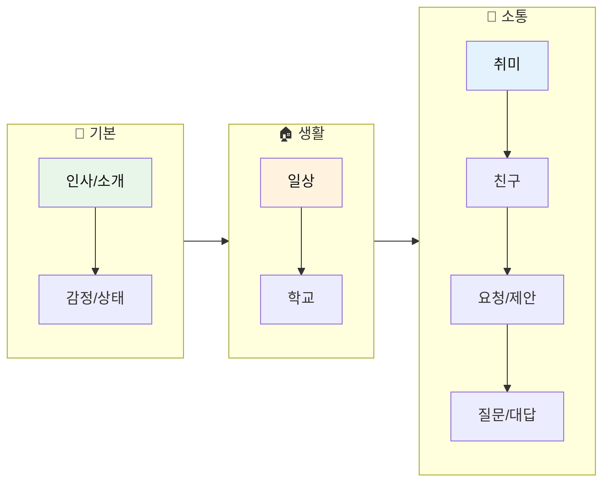
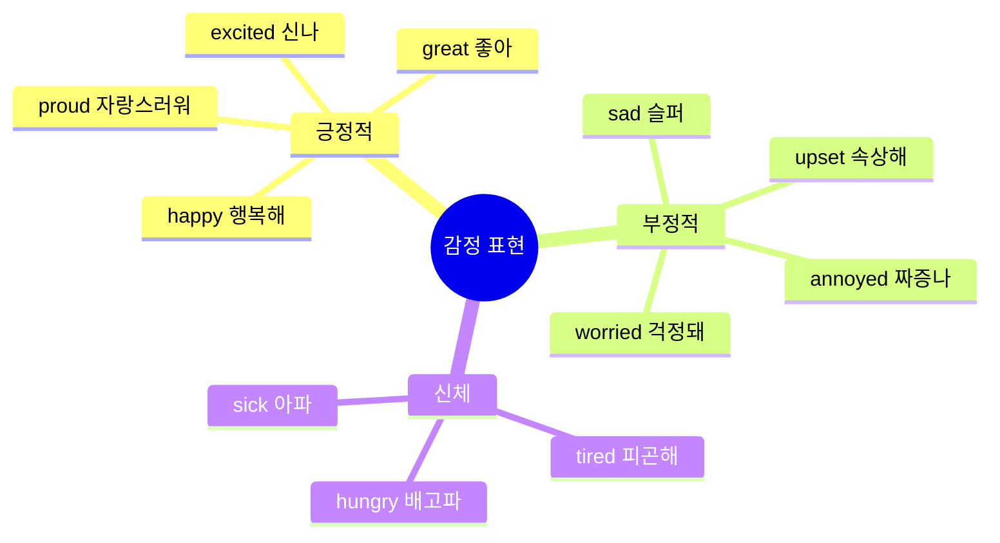
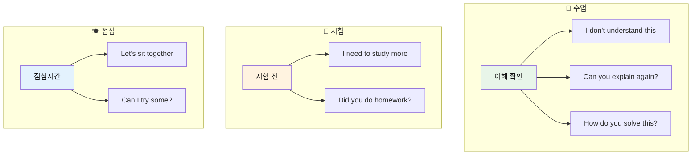
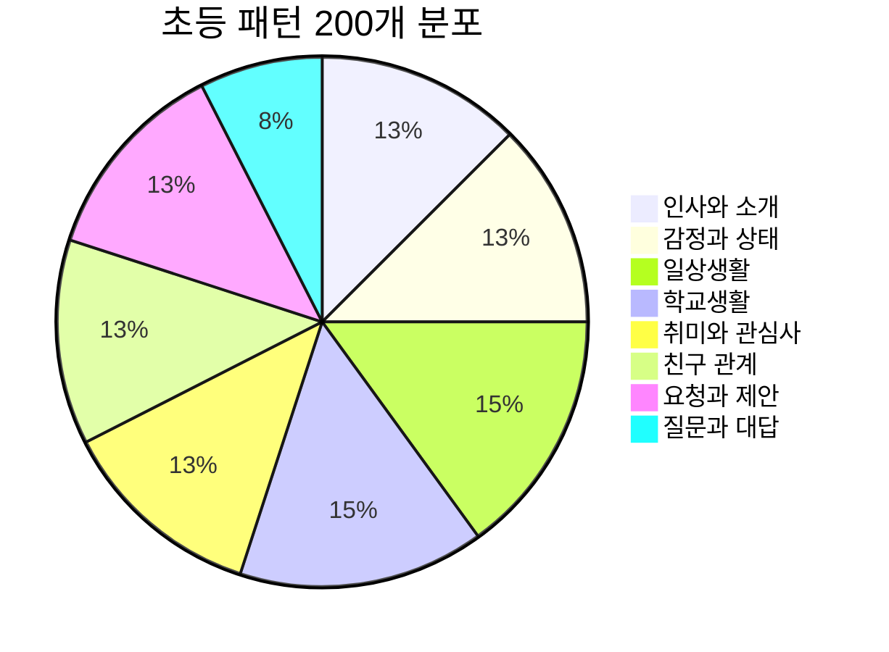
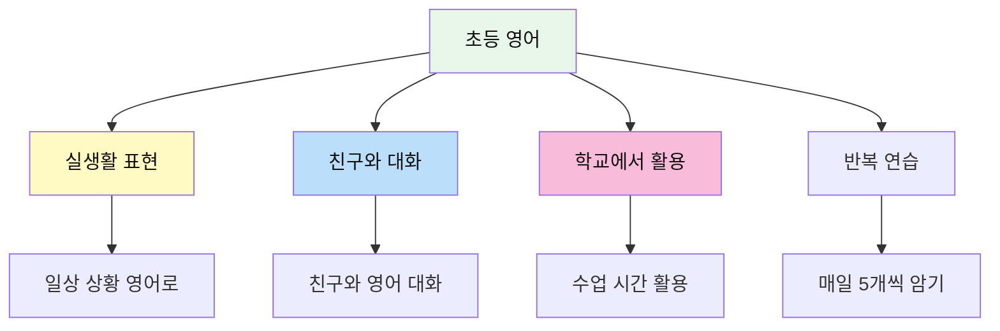

# 📚 초등 영어 회화 패턴 200선

> **영어권 초등학생들이 일상에서 자주 쓰는 실용 표현**  
> 8~13세 수준의 기본 회화 패턴 (초급~중급)

---

## 📋 목차
1. [인사와 소개](#-인사와-소개-patterns-1-25)
2. [감정과 상태](#-감정과-상태-patterns-26-50)
3. [일상생활](#-일상생활-patterns-51-80)
4. [학교생활](#-학교생활-patterns-81-110)
5. [취미와 관심사](#-취미와-관심사-patterns-111-135)
6. [친구 관계](#-친구-관계-patterns-136-160)
7. [요청과 제안](#-요청과-제안-patterns-161-185)
8. [질문과 대답](#-질문과-대답-patterns-186-200)

---

## 학습 흐름도

---

## 👋 인사와 소개 (Patterns 1-25)

### 기본 인사 (1-10)

| No. | 패턴 | 예문 | 한국어 뜻 |
|:---:|------|------|----------|
| 1 | Hi there! | Hi there! How's it going? | 안녕! |
| 2 | Hey! What's up? | Hey! What's up, dude? | 야! 뭐해? |
| 3 | Good to see you! | Good to see you again! | 다시 보니 좋다! |
| 4 | Long time no see! | Long time no see! Where have you been? | 오랜만이야! |
| 5 | How's it going? | Hey, how's it going? | 어떻게 지내? |
| 6 | What's new? | What's new with you? | 새로운 거 있어? |
| 7 | How was your day? | How was your day at school? | 하루 어땠어? |
| 8 | See you tomorrow! | See you tomorrow at school! | 내일 봐! |
| 9 | Take care! | Take care! See you later! | 잘 가! |
| 10 | Have a good one! | Have a good one! Bye! | 좋은 하루 보내! |

### 자기소개 (11-20)

| No. | 패턴 | 예문 | 한국어 뜻 |
|:---:|------|------|----------|
| 11 | I'm from [장소]. | I'm from Seoul, Korea. | 나는 ~에서 왔어. |
| 12 | I go to [학교]. | I go to Oak Elementary School. | 나는 ~에 다녀. |
| 13 | I'm in [학년]. | I'm in the 5th grade. | 나는 ~학년이야. |
| 14 | My favorite [것] is... | My favorite subject is math. | 내가 제일 좋아하는 ~는... |
| 15 | I'm good at [것]. | I'm good at drawing. | 나는 ~를 잘해. |
| 16 | I'm not good at [것]. | I'm not good at sports. | 나는 ~를 못해. |
| 17 | My hobby is [것]. | My hobby is reading books. | 내 취미는 ~야. |
| 18 | I have [가족]. | I have one older brother. | 나는 ~가 있어. |
| 19 | I was born in [년도]. | I was born in 2015. | 나는 ~년에 태어났어. |
| 20 | I've lived here for [기간]. | I've lived here for 3 years. | 나는 여기서 ~동안 살았어. |

### 타인 소개 (21-25)

| No. | 패턴 | 예문 | 한국어 뜻 |
|:---:|------|------|----------|
| 21 | This is my friend [이름]. | This is my friend, Jake. | 이쪽은 내 친구 ~야. |
| 22 | Let me introduce... | Let me introduce my classmate. | 소개할게... |
| 23 | Have you met [이름]? | Have you met Sarah before? | ~만난 적 있어? |
| 24 | [이름] is really cool. | Jake is really cool. He's funny. | ~는 정말 멋져. |
| 25 | We've been friends since... | We've been friends since kindergarten. | 우리는 ~부터 친구야. |

---

## 😊 감정과 상태 (Patterns 26-50)

### 기분 표현 (26-35)

| No. | 패턴 | 예문 | 한국어 뜻 |
|:---:|------|------|----------|
| 26 | I'm so happy! | I'm so happy I passed the test! | 너무 행복해! |
| 27 | I'm feeling great! | I'm feeling great today! | 기분 최고야! |
| 28 | I'm a little sad. | I'm a little sad. My pet is sick. | 좀 슬퍼. |
| 29 | I'm really upset. | I'm really upset about what happened. | 정말 속상해. |
| 30 | I'm so excited! | I'm so excited for the trip! | 너무 신나! |
| 31 | I'm kind of nervous. | I'm kind of nervous about the presentation. | 좀 긴장돼. |
| 32 | I'm super bored. | I'm super bored. There's nothing to do. | 너무 지루해. |
| 33 | I'm a bit worried. | I'm a bit worried about the test. | 좀 걱정돼. |
| 34 | I'm really tired. | I'm really tired. I stayed up late. | 정말 피곤해. |
| 35 | I'm feeling better now. | I was sick, but I'm feeling better now. | 이제 좀 나아졌어. |

### 신체 상태 (36-42)

| No. | 패턴 | 예문 | 한국어 뜻 |
|:---:|------|------|----------|
| 36 | I have a headache. | I have a headache. Can I rest? | 머리가 아파. |
| 37 | My [신체부위] hurts. | My stomach hurts. | ~가 아파. |
| 38 | I feel dizzy. | I feel dizzy. I need to sit down. | 어지러워. |
| 39 | I'm starving! | I'm starving! When's lunch? | 배고파 죽겠어! |
| 40 | I'm stuffed! | I'm stuffed! I ate too much. | 배불러 죽겠어! |
| 41 | I'm freezing! | I'm freezing! Turn off the AC! | 얼어 죽겠어! |
| 42 | I'm burning up! | I'm burning up! It's so hot! | 더워 죽겠어! |

### 감정 반응 (43-50)

| No. | 패턴 | 예문 | 한국어 뜻 |
|:---:|------|------|----------|
| 43 | That's awesome! | That's awesome! Good for you! | 대박이다! |
| 44 | That's so cool! | That's so cool! Show me more! | 엄청 멋지다! |
| 45 | No way! | No way! I can't believe it! | 말도 안 돼! |
| 46 | Are you kidding me? | Are you kidding me? That's crazy! | 장난해? |
| 47 | That's not fair! | That's not fair! He cheated! | 불공평해! |
| 48 | I can't believe it! | I can't believe it! We won! | 믿을 수가 없어! |
| 49 | That's so annoying! | That's so annoying! Make it stop! | 짜증나! |
| 50 | I'm so proud of you! | I'm so proud of you! Great job! | 정말 자랑스러워! |

---

## 🏠 일상생활 (Patterns 51-80)

### 아침 루틴 (51-60)

| No. | 패턴 | 예문 | 한국어 뜻 |
|:---:|------|------|----------|
| 51 | I woke up at [시간]. | I woke up at 7 AM. | ~에 일어났어. |
| 52 | I need to get ready. | I need to get ready for school. | 준비해야 해. |
| 53 | I'm running late! | I'm running late! Hurry up! | 늦었어! |
| 54 | I almost missed the bus. | I almost missed the bus today. | 버스 놓칠 뻔했어. |
| 55 | I had [음식] for breakfast. | I had cereal for breakfast. | 아침으로 ~먹었어. |
| 56 | I didn't have time to eat. | I didn't have time to eat breakfast. | 먹을 시간이 없었어. |
| 57 | I forgot my [것]. | I forgot my homework at home! | ~를 깜빡했어. |
| 58 | Can you drive me to...? | Can you drive me to school? | ~에 데려다 줄 수 있어요? |
| 59 | I'll walk to school. | I'll walk to school today. | 걸어서 학교 갈게. |
| 60 | My mom packed my lunch. | My mom packed my lunch today. | 엄마가 점심 싸줬어. |

### 저녁 루틴 (61-70)

| No. | 패턴 | 예문 | 한국어 뜻 |
|:---:|------|------|----------|
| 61 | I'm home! | I'm home! What's for dinner? | 나 왔어! |
| 62 | I'm back from school. | I'm back from school. It was tiring. | 학교 다녀왔어. |
| 63 | I have to do my homework. | I have to do my homework first. | 숙제해야 해. |
| 64 | Can I go outside? | Can I go outside and play? | 밖에 나가도 돼? |
| 65 | I need to practice [것]. | I need to practice piano. | ~연습해야 해. |
| 66 | What's for dinner? | What's for dinner tonight? | 저녁 뭐야? |
| 67 | I'll set the table. | I'll set the table for dinner. | 식탁 차릴게. |
| 68 | Can I stay up late? | Can I stay up late tonight? | 오늘 늦게 자도 돼? |
| 69 | I need to take a shower. | I need to take a shower before bed. | 샤워해야 해. |
| 70 | Good night, everyone! | Good night, everyone! See you tomorrow! | 다들 잘 자! |

### 주말 활동 (71-80)

| No. | 패턴 | 예문 | 한국어 뜻 |
|:---:|------|------|----------|
| 71 | What are you doing this weekend? | What are you doing this weekend? | 이번 주말에 뭐 해? |
| 72 | I'm going to [장소]. | I'm going to the movies. | ~에 갈 거야. |
| 73 | Do you want to come? | Do you want to come with us? | 같이 갈래? |
| 74 | I'm having a sleepover. | I'm having a sleepover at Jake's house. | 잠자리 파티 할 거야. |
| 75 | We went to [장소]. | We went to the amusement park. | ~에 갔었어. |
| 76 | It was so much fun! | It was so much fun! You should come next time. | 정말 재밌었어! |
| 77 | I stayed home all day. | I stayed home all day and played games. | 하루 종일 집에 있었어. |
| 78 | I hung out with my friends. | I hung out with my friends at the mall. | 친구들이랑 놀았어. |
| 79 | My family went on a trip. | My family went on a trip to Jeju. | 가족이랑 여행 갔었어. |
| 80 | I can't wait for the weekend! | I can't wait for the weekend! | 주말이 기다려져! |

---

## 🏫 학교생활 (Patterns 81-110)

### 수업 관련 (81-95)

| No. | 패턴 | 예문 | 한국어 뜻 |
|:---:|------|------|----------|
| 81 | What class do we have next? | What class do we have next? | 다음 수업 뭐야? |
| 82 | I have [과목] class. | I have science class after lunch. | ~수업 있어. |
| 83 | This class is so boring. | This class is so boring. I'm sleepy. | 이 수업 너무 지루해. |
| 84 | I don't understand this. | I don't understand this problem. | 이거 이해 안 돼. |
| 85 | Can you explain it again? | Can you explain it again, please? | 다시 설명해 줄 수 있어? |
| 86 | How do you solve this? | How do you solve this math problem? | 이거 어떻게 풀어? |
| 87 | Did you do the homework? | Did you do the homework? I forgot. | 숙제했어? |
| 88 | Can I borrow your [것]? | Can I borrow your eraser? | ~빌려도 돼? |
| 89 | I left mine at home. | I left mine at home by accident. | 집에 두고 왔어. |
| 90 | What page are we on? | What page are we on? I got lost. | 몇 페이지야? |
| 91 | The test was so hard! | The test was so hard! I think I failed. | 시험 너무 어려웠어! |
| 92 | I got a good grade! | I got a good grade on the test! | 성적 잘 받았어! |
| 93 | I need to study more. | I need to study more for the next test. | 더 공부해야겠어. |
| 94 | The teacher is nice. | The teacher is nice but strict. | 선생님 좋아. |
| 95 | Class is almost over. | Class is almost over. 5 more minutes! | 수업 거의 끝나. |

### 학교생활 (96-110)

| No. | 패턴 | 예문 | 한국어 뜻 |
|:---:|------|------|----------|
| 96 | It's lunchtime! | It's lunchtime! Let's go eat! | 점심시간이야! |
| 97 | Let's sit together. | Let's sit together at lunch! | 같이 앉자. |
| 98 | The cafeteria food is okay. | The cafeteria food is okay today. | 급식 괜찮아. |
| 99 | I brought my lunch. | I brought my lunch from home. | 점심 싸왔어. |
| 100 | Can I try some of that? | Can I try some of that? It looks good! | 그거 좀 먹어봐도 돼? |
| 101 | It's recess time! | It's recess time! Let's go play! | 쉬는 시간이야! |
| 102 | Let's play [게임]. | Let's play soccer at recess! | ~하자. |
| 103 | The bell is about to ring. | The bell is about to ring. Hurry! | 종 울릴 것 같아. |
| 104 | I have PE today. | I have PE today. I love it! | 오늘 체육 있어. |
| 105 | I joined the [동아리]. | I joined the art club. | ~에 가입했어. |
| 106 | There's a school event. | There's a school event next week. | 학교 행사 있어. |
| 107 | I'm in the school play. | I'm in the school play this year. | 학교 연극 해. |
| 108 | Field day is coming up! | Field day is coming up! I'm excited! | 체육대회 다가와! |
| 109 | We have a substitute teacher. | We have a substitute teacher today. | 오늘 대체 선생님이야. |
| 110 | School's out! | School's out! Finally! | 학교 끝났다! |

---

## 🎮 취미와 관심사 (Patterns 111-135)

### 좋아하는 것 (111-120)

| No. | 패턴 | 예문 | 한국어 뜻 |
|:---:|------|------|----------|
| 111 | I'm into [것]. | I'm into video games these days. | 요즘 ~에 빠졌어. |
| 112 | I'm really interested in [것]. | I'm really interested in science. | ~에 정말 관심 있어. |
| 113 | I love playing [것]. | I love playing basketball. | ~하는 거 좋아해. |
| 114 | My favorite [것] is... | My favorite game is Minecraft. | 내가 제일 좋아하는 ~는... |
| 115 | I've been [동사]-ing lately. | I've been reading a lot lately. | 요즘 ~하고 있어. |
| 116 | Have you tried [것]? | Have you tried this game? It's fun! | ~해봤어? |
| 117 | You should try [것]. | You should try this book. It's great! | ~해봐. |
| 118 | I'm learning [것]. | I'm learning to play guitar. | ~배우고 있어. |
| 119 | I'm pretty good at [것]. | I'm pretty good at drawing. | ~꽤 잘해. |
| 120 | I want to get better at [것]. | I want to get better at basketball. | ~더 잘하고 싶어. |

### 게임/미디어 (121-128)

| No. | 패턴 | 예문 | 한국어 뜻 |
|:---:|------|------|----------|
| 121 | Do you play [게임]? | Do you play Roblox? | ~해? |
| 122 | What level are you on? | What level are you on? I'm stuck. | 몇 레벨이야? |
| 123 | I beat the game! | I beat the game! It took forever! | 게임 깼어! |
| 124 | Let's play together online. | Let's play together online tonight! | 온라인으로 같이 하자. |
| 125 | Have you watched [영상]? | Have you watched this YouTube video? | ~봤어? |
| 126 | It's so funny/cool! | It's so funny! You have to watch it! | 엄청 웃겨/멋져! |
| 127 | I'm obsessed with [것]. | I'm obsessed with this TV show. | ~에 완전 빠졌어. |
| 128 | The new episode came out! | The new episode came out! No spoilers! | 새 에피소드 나왔어! |

### 스포츠/활동 (129-135)

| No. | 패턴 | 예문 | 한국어 뜻 |
|:---:|------|------|----------|
| 129 | I play on the [팀]. | I play on the school soccer team. | ~팀에서 해. |
| 130 | We have practice today. | We have practice today after school. | 오늘 연습 있어. |
| 131 | We won the game! | We won the game! It was close! | 경기 이겼어! |
| 132 | We lost, but it was fun. | We lost, but it was fun playing. | 졌지만 재밌었어. |
| 133 | I'm training for [것]. | I'm training for the marathon. | ~준비하고 있어. |
| 134 | I take [것] lessons. | I take piano lessons twice a week. | ~레슨 받아. |
| 135 | I've been doing this for [기간]. | I've been doing taekwondo for 2 years. | ~를 ~동안 해왔어. |

---

## 👫 친구 관계 (Patterns 136-160)

### 함께하기 (136-145)

| No. | 패턴 | 예문 | 한국어 뜻 |
|:---:|------|------|----------|
| 136 | Do you want to hang out? | Do you want to hang out after school? | 같이 놀래? |
| 137 | Let's do something fun! | Let's do something fun this weekend! | 재밌는 거 하자! |
| 138 | Are you free [시간]? | Are you free on Saturday? | ~에 시간 있어? |
| 139 | I'm busy [시간]. | I'm busy on Sunday. What about Monday? | ~에 바빠. |
| 140 | Maybe next time. | I can't today. Maybe next time! | 다음에 하자. |
| 141 | That sounds fun! | That sounds fun! Count me in! | 재밌겠다! |
| 142 | I'm in! | A sleepover? I'm in! | 나도 할래! |
| 143 | I'll ask my parents. | I'll ask my parents if I can go. | 부모님한테 여쭤볼게. |
| 144 | My mom said yes! | My mom said yes! I can come! | 엄마가 된대! |
| 145 | Sorry, I can't make it. | Sorry, I can't make it. Family thing. | 미안, 못 갈 것 같아. |

### 감정 표현 (146-152)

| No. | 패턴 | 예문 | 한국어 뜻 |
|:---:|------|------|----------|
| 146 | You're my best friend! | You're my best friend! Thanks for everything! | 넌 내 베프야! |
| 147 | Thanks for [동사]-ing. | Thanks for helping me with homework! | ~해줘서 고마워. |
| 148 | I owe you one! | I owe you one! I'll pay you back! | 신세 졌어! |
| 149 | That means a lot to me. | That means a lot to me. Thank you. | 정말 고마워. |
| 150 | I'm sorry about [것]. | I'm sorry about what I said. | ~에 대해 미안해. |
| 151 | It's okay, don't worry. | It's okay, don't worry about it. | 괜찮아, 걱정 마. |
| 152 | Let's make up. | We had a fight, but let's make up. | 화해하자. |

### 대화하기 (153-160)

| No. | 패턴 | 예문 | 한국어 뜻 |
|:---:|------|------|----------|
| 153 | Guess what! | Guess what! I got a puppy! | 있잖아! |
| 154 | Did you hear about [것]? | Did you hear about the new student? | ~에 대해 들었어? |
| 155 | I have something to tell you. | I have something to tell you. It's a secret. | 할 말 있어. |
| 156 | Don't tell anyone! | Don't tell anyone! It's between us. | 아무한테도 말하지 마! |
| 157 | I promise I won't tell. | I promise I won't tell anyone. | 아무한테도 안 말할게. |
| 158 | That's crazy! | You did what? That's crazy! | 대박이다! |
| 159 | For real? / Seriously? | For real? You're not joking? | 진짜? |
| 160 | I knew it! | I knew it! I told you so! | 그럴 줄 알았어! |

---

## 🙋 요청과 제안 (Patterns 161-185)

### 도움 요청 (161-170)

| No. | 패턴 | 예문 | 한국어 뜻 |
|:---:|------|------|----------|
| 161 | Can you help me with [것]? | Can you help me with this math problem? | ~좀 도와줄래? |
| 162 | Could you [동사]? | Could you lend me your pencil? | ~해줄 수 있어? |
| 163 | Would you mind [동사]-ing? | Would you mind moving over a bit? | ~해주실래요? |
| 164 | Do me a favor? | Can you do me a favor? | 부탁 하나 해도 돼? |
| 165 | I need your help. | I need your help with something. | 도움이 필요해. |
| 166 | Can you show me how to [동사]? | Can you show me how to do this? | 이거 어떻게 하는지 보여줄래? |
| 167 | Can I have [것]? | Can I have a piece of paper? | ~줄 수 있어? |
| 168 | Is it okay if I [동사]? | Is it okay if I sit here? | ~해도 괜찮아? |
| 169 | Do you mind if I [동사]? | Do you mind if I open the window? | ~해도 될까? |
| 170 | Sorry to bother you, but... | Sorry to bother you, but can you help? | 귀찮게 해서 미안한데... |

### 제안하기 (171-180)

| No. | 패턴 | 예문 | 한국어 뜻 |
|:---:|------|------|----------|
| 171 | Let's [동사]! | Let's go to the park! | ~하자! |
| 172 | Why don't we [동사]? | Why don't we watch a movie? | ~하는 게 어때? |
| 173 | How about [동사]-ing? | How about playing video games? | ~하는 건 어때? |
| 174 | What if we [동사]? | What if we have a party? | ~하면 어때? |
| 175 | We could [동사]. | We could go swimming later. | ~할 수 있어. |
| 176 | Do you want to [동사]? | Do you want to come over? | ~할래? |
| 177 | Would you like to [동사]? | Would you like to join us? | ~하실래요? |
| 178 | I think we should [동사]. | I think we should start now. | ~해야 할 것 같아. |
| 179 | It would be fun to [동사]. | It would be fun to go camping. | ~하면 재밌겠다. |
| 180 | We should definitely [동사]. | We should definitely try that! | 꼭 ~해야 해. |

### 수락/거절 (181-185)

| No. | 패턴 | 예문 | 한국어 뜻 |
|:---:|------|------|----------|
| 181 | Sure, no problem! | Sure, no problem! I'll help you. | 그럼, 문제없어! |
| 182 | Of course! | Of course! I'd love to! | 당연하지! |
| 183 | That sounds great! | That sounds great! Let's do it! | 좋은데! |
| 184 | I'd love to, but... | I'd love to, but I'm busy. | 그러고 싶은데... |
| 185 | Maybe another time. | I can't today. Maybe another time. | 다음에 하자. |

---

## ❓ 질문과 대답 (Patterns 186-200)

### 정보 질문 (186-193)

| No. | 패턴 | 예문 | 한국어 뜻 |
|:---:|------|------|----------|
| 186 | What time is it? | What time is it? I forgot my watch. | 몇 시야? |
| 187 | What day is it today? | What day is it today? Is it Friday? | 오늘 무슨 요일이야? |
| 188 | Where did you get [것]? | Where did you get that cool bag? | 그거 어디서 샀어? |
| 189 | How do you spell [단어]? | How do you spell "necessary"? | ~어떻게 써? |
| 190 | What does [단어] mean? | What does "appropriate" mean? | ~무슨 뜻이야? |
| 191 | How long does it take? | How long does it take to get there? | 얼마나 걸려? |
| 192 | When is [것]? | When is the school trip? | ~가 언제야? |
| 193 | Who's [동사]-ing? | Who's coming to the party? | 누가 ~해? |

### 의견 질문 (194-200)

| No. | 패턴 | 예문 | 한국어 뜻 |
|:---:|------|------|----------|
| 194 | What do you think? | What do you think about this idea? | 어떻게 생각해? |
| 195 | Do you like [것]? | Do you like K-pop? | ~좋아해? |
| 196 | Which one do you prefer? | Which one do you prefer, pizza or chicken? | 뭐가 더 좋아? |
| 197 | Have you ever [과거분사]? | Have you ever been to Japan? | ~해본 적 있어? |
| 198 | What's your favorite [것]? | What's your favorite movie? | 제일 좋아하는 ~가 뭐야? |
| 199 | Don't you think [것]? | Don't you think it's too hard? | ~라고 생각 안 해? |
| 200 | What should we do? | What should we do now? | 뭐 할까? |

---

## 📊 전체 패턴 분포

---

## 💡 학습 팁

### 🎯 초등 영어 학습 포인트

### ⭐ 가장 많이 쓰는 표현 TOP 15

| 순위 | 표현 | 사용 상황 |
|:---:|------|---------|
| 1 | Let's [동사]! | 제안할 때 |
| 2 | Can you help me? | 도움 요청할 때 |
| 3 | I don't understand. | 이해 못할 때 |
| 4 | That sounds fun! | 동의할 때 |
| 5 | I'm so excited! | 기대될 때 |
| 6 | What do you think? | 의견 물을 때 |
| 7 | Do you want to...? | 제안할 때 |
| 8 | I'm into [것]. | 관심사 말할 때 |
| 9 | Thanks for [동사]-ing! | 감사할 때 |
| 10 | Guess what! | 소식 전할 때 |
| 11 | That's awesome! | 감탄할 때 |
| 12 | I'm running late! | 급할 때 |
| 13 | What's up? | 인사할 때 |
| 14 | I forgot my... | 잊었을 때 |
| 15 | Can I borrow your...? | 빌릴 때 |

### 📅 주간 학습 계획

| 요일 | 학습 주제 | 목표 패턴 |
|:---:|----------|:--------:|
| 월 | 인사와 소개 | 1-25 |
| 화 | 감정과 상태 | 26-50 |
| 수 | 일상생활 | 51-80 |
| 목 | 학교생활 | 81-110 |
| 금 | 취미와 관심사 | 111-135 |
| 토 | 친구 관계 | 136-160 |
| 일 | 요청/제안/질문 | 161-200 + 복습 |

---

*Last Updated: 2026-01-10*

