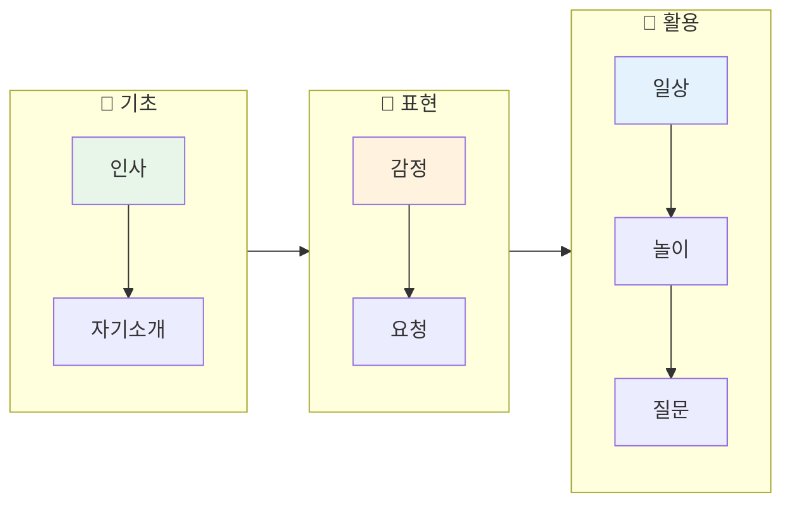
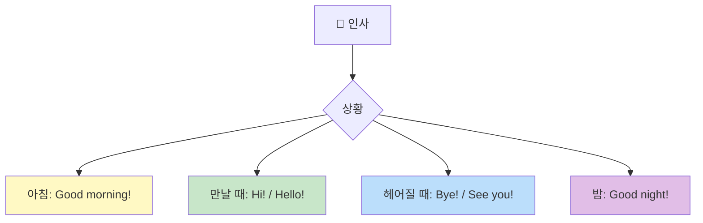
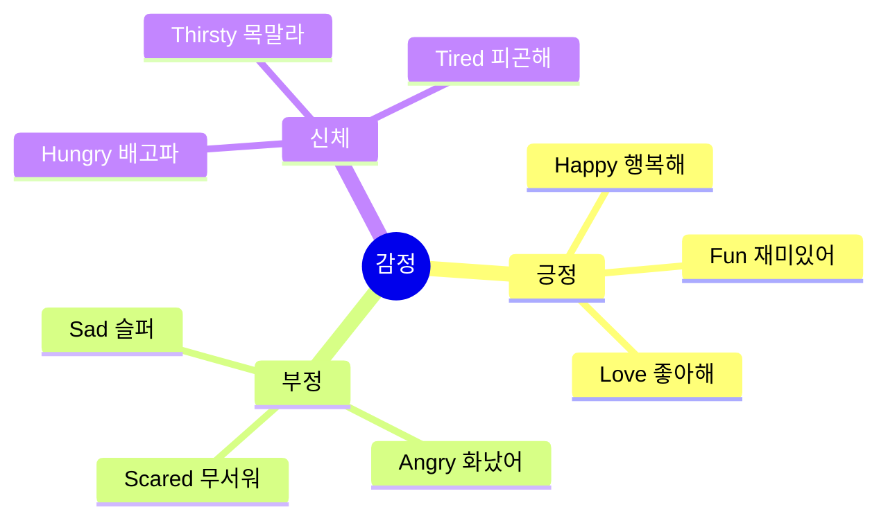
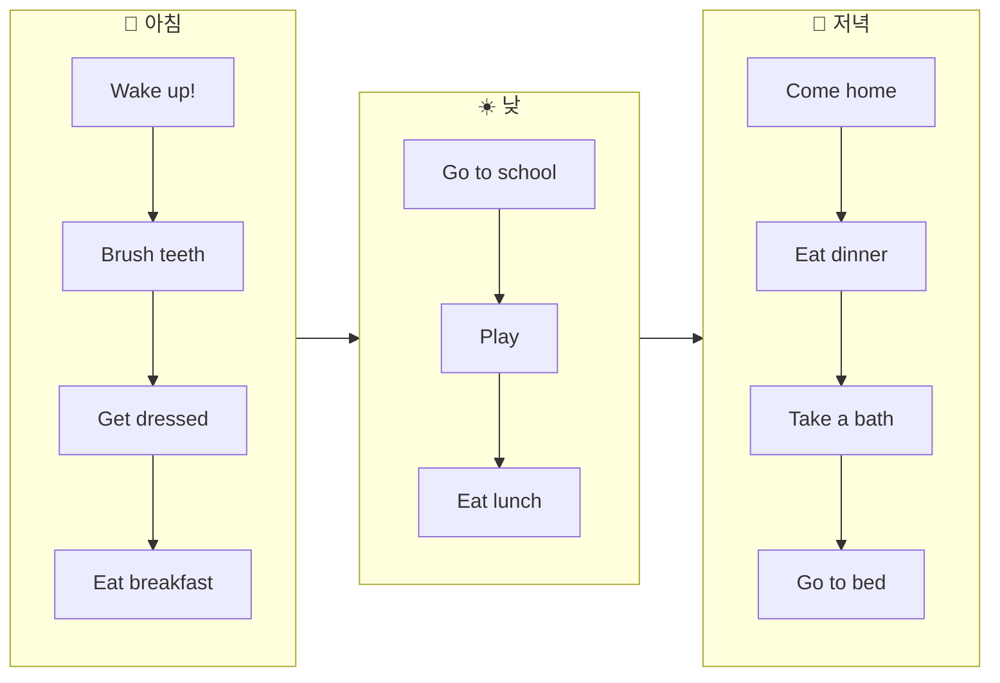
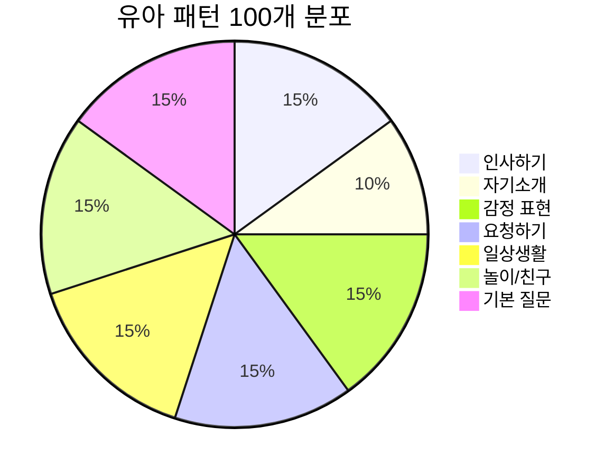
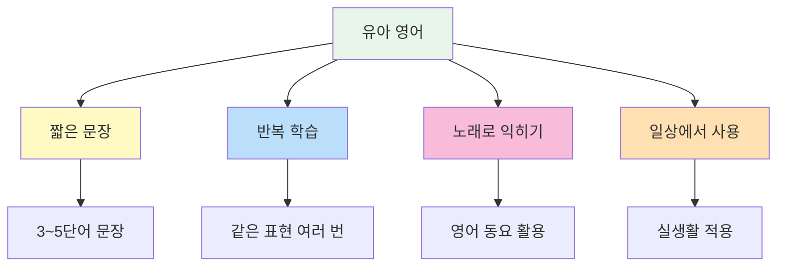

# 🧒 유아 영어 회화 패턴 100선

> **영어권 아이들이 일상에서 자주 쓰는 기초 표현**  
> 3~7세 수준의 간단하고 실용적인 회화 패턴

---

## 📋 목차
1. [인사하기](#-인사하기-patterns-1-15)
2. [자기소개](#-자기소개-patterns-16-25)
3. [감정 표현](#-감정-표현-patterns-26-40)
4. [요청하기](#-요청하기-patterns-41-55)
5. [일상생활](#-일상생활-patterns-56-70)
6. [놀이/친구](#-놀이친구-patterns-71-85)
7. [기본 질문](#-기본-질문-patterns-86-100)

---

## 학습 흐름도

---

## 👋 인사하기 (Patterns 1-15)

### 기본 인사

| No. | 패턴 | 예문 | 한국어 뜻 |
|:---:|------|------|----------|
| 1 | Hi! | Hi! How are you? | 안녕! |
| 2 | Hello! | Hello, everyone! | 안녕하세요! |
| 3 | Good morning! | Good morning, Mommy! | 좋은 아침이에요! |
| 4 | Good night! | Good night, Daddy! | 잘 자요! |
| 5 | Bye-bye! | Bye-bye, see you! | 잘 가! |

### 만남과 헤어짐

| No. | 패턴 | 예문 | 한국어 뜻 |
|:---:|------|------|----------|
| 6 | See you! | See you tomorrow! | 또 만나! |
| 7 | See you later! | See you later, friend! | 나중에 봐! |
| 8 | Nice to meet you! | Nice to meet you! I'm Tom. | 만나서 반가워! |
| 9 | How are you? | How are you today? | 어떻게 지내? |
| 10 | I'm fine! | I'm fine, thank you! | 나는 잘 지내! |

### 예의 바른 인사

| No. | 패턴 | 예문 | 한국어 뜻 |
|:---:|------|------|----------|
| 11 | Thank you! | Thank you so much! | 고마워! |
| 12 | You're welcome! | You're welcome! | 천만에! |
| 13 | Please! | Help me, please! | 제발! / 부탁해! |
| 14 | Sorry! | Sorry, I'm late! | 미안해! |
| 15 | Excuse me! | Excuse me, teacher! | 실례합니다! |

---

## 🙋 자기소개 (Patterns 16-25)

### 나를 소개해요

| No. | 패턴 | 예문 | 한국어 뜻 |
|:---:|------|------|----------|
| 16 | I'm [이름]. | I'm Jenny. | 나는 ~야. |
| 17 | My name is [이름]. | My name is Tom. | 내 이름은 ~야. |
| 18 | I'm [숫자] years old. | I'm five years old. | 나는 ~살이야. |
| 19 | I live in [장소]. | I live in Korea. | 나는 ~에 살아. |
| 20 | I like [것]. | I like ice cream. | 나는 ~를 좋아해. |

### 가족 소개

| No. | 패턴 | 예문 | 한국어 뜻 |
|:---:|------|------|----------|
| 21 | This is my [가족]. | This is my mom. | 이쪽은 내 ~야. |
| 22 | I have a [가족]. | I have a baby sister. | 나는 ~가 있어. |
| 23 | My [가족] is [형용사]. | My dad is tall. | 내 ~은 ~해. |
| 24 | I love my [가족]. | I love my grandma. | 나는 ~를 사랑해. |
| 25 | We are a family. | We are a happy family. | 우리는 가족이야. |

---

## 😊 감정 표현 (Patterns 26-40)

### 기분 말하기

| No. | 패턴 | 예문 | 한국어 뜻 |
|:---:|------|------|----------|
| 26 | I'm happy! | I'm so happy today! | 나 행복해! |
| 27 | I'm sad. | I'm sad. My toy broke. | 나 슬퍼. |
| 28 | I'm angry! | I'm angry! That's not fair! | 나 화났어! |
| 29 | I'm scared. | I'm scared of the dark. | 나 무서워. |
| 30 | I'm tired. | I'm tired. I want to sleep. | 나 피곤해. |

### 좋고 싫음

| No. | 패턴 | 예문 | 한국어 뜻 |
|:---:|------|------|----------|
| 31 | I like it! | I like it! It's yummy! | 이거 좋아! |
| 32 | I don't like it. | I don't like broccoli. | 이거 싫어. |
| 33 | I love it! | I love it! Thank you! | 이거 너무 좋아! |
| 34 | I hate it! | I hate spiders! | 이거 싫어! |
| 35 | It's fun! | It's so fun! | 재미있어! |

### 느낌 표현

| No. | 패턴 | 예문 | 한국어 뜻 |
|:---:|------|------|----------|
| 36 | I'm hungry! | I'm hungry! Can I eat? | 배고파! |
| 37 | I'm thirsty! | I'm thirsty! Water, please! | 목말라! |
| 38 | I'm cold! | I'm cold! Give me a blanket. | 추워! |
| 39 | I'm hot! | I'm hot! Turn on the fan. | 더워! |
| 40 | I feel sick. | I feel sick. My tummy hurts. | 아파. |

---

## 🙏 요청하기 (Patterns 41-55)

### 기본 요청

| No. | 패턴 | 예문 | 한국어 뜻 |
|:---:|------|------|----------|
| 41 | Can I have [것]? | Can I have some water? | ~를 줄 수 있어요? |
| 42 | I want [것]. | I want a cookie. | ~를 원해요. |
| 43 | Give me [것], please. | Give me the ball, please. | ~를 주세요. |
| 44 | Help me, please! | Help me, please! I can't reach it. | 도와주세요! |
| 45 | Wait for me! | Wait for me! I'm coming! | 나 기다려! |

### 허락 구하기

| No. | 패턴 | 예문 | 한국어 뜻 |
|:---:|------|------|----------|
| 46 | Can I go [장소]? | Can I go outside? | ~에 가도 돼요? |
| 47 | May I [동사]? | May I play? | ~해도 되나요? |
| 48 | Can I play with [것]? | Can I play with this? | ~로 놀아도 돼요? |
| 49 | Can I watch TV? | Can I watch TV now? | TV 봐도 돼요? |
| 50 | Can I eat [음식]? | Can I eat candy? | ~먹어도 돼요? |

### 필요 표현

| No. | 패턴 | 예문 | 한국어 뜻 |
|:---:|------|------|----------|
| 51 | I need [것]. | I need my teddy bear. | ~가 필요해요. |
| 52 | I need to go potty. | I need to go potty now! | 화장실 가야 해요. |
| 53 | Let me [동사]. | Let me try! | 내가 ~할게요. |
| 54 | One more, please! | One more cookie, please! | 하나 더요! |
| 55 | Not yet! | Not yet! Wait a minute! | 아직이요! |

---

## 🏠 일상생활 (Patterns 56-70)

### 아침 루틴

| No. | 패턴 | 예문 | 한국어 뜻 |
|:---:|------|------|----------|
| 56 | Wake up! | Wake up! It's morning! | 일어나! |
| 57 | Time to [동사]! | Time to eat breakfast! | ~할 시간이야! |
| 58 | I'm getting dressed. | I'm getting dressed now. | 옷 입고 있어. |
| 59 | I'm brushing my teeth. | I'm brushing my teeth. | 양치하고 있어. |
| 60 | Let's go! | Let's go to school! | 가자! |

### 식사 시간

| No. | 패턴 | 예문 | 한국어 뜻 |
|:---:|------|------|----------|
| 61 | I'm eating [음식]. | I'm eating an apple. | ~먹고 있어. |
| 62 | Yummy! / Delicious! | Yummy! I love pizza! | 맛있어! |
| 63 | I'm full. | I'm full. No more, please. | 배불러. |
| 64 | I'm done! | I'm done eating! | 다 먹었어! |
| 65 | Can I have more? | Can I have more juice? | 더 줄 수 있어요? |

### 집에서

| No. | 패턴 | 예문 | 한국어 뜻 |
|:---:|------|------|----------|
| 66 | I'm home! | I'm home! Where's Mom? | 나 왔어! |
| 67 | I'm playing. | I'm playing with blocks. | 놀고 있어. |
| 68 | I'm taking a bath. | I'm taking a bath now. | 목욕하고 있어. |
| 69 | I'm going to bed. | I'm going to bed. Good night! | 자러 갈게. |
| 70 | Where is my [것]? | Where is my toy car? | 내 ~어디 있어? |

---

## 🎮 놀이/친구 (Patterns 71-85)

### 같이 놀기

| No. | 패턴 | 예문 | 한국어 뜻 |
|:---:|------|------|----------|
| 71 | Let's play! | Let's play together! | 같이 놀자! |
| 72 | Can I play too? | Can I play too, please? | 나도 놀아도 돼? |
| 73 | It's my turn! | It's my turn now! | 내 차례야! |
| 74 | Your turn! | Your turn! Go ahead! | 네 차례야! |
| 75 | I won! | I won! Yay! | 내가 이겼어! |

### 친구와 대화

| No. | 패턴 | 예문 | 한국어 뜻 |
|:---:|------|------|----------|
| 76 | Be my friend! | Be my friend, please! | 내 친구가 되어줘! |
| 77 | You're my best friend! | You're my best friend! | 넌 내 베스트 프렌드야! |
| 78 | Don't push me! | Hey! Don't push me! | 밀지 마! |
| 79 | Share with me! | Share with me, please! | 나눠줘! |
| 80 | That's mine! | That's mine! Give it back! | 그거 내 거야! |

### 놀이 관련

| No. | 패턴 | 예문 | 한국어 뜻 |
|:---:|------|------|----------|
| 81 | I found it! | I found it! Look here! | 찾았다! |
| 82 | Hide and seek! | Let's play hide and seek! | 숨바꼭질 하자! |
| 83 | Ready or not! | Ready or not, here I come! | 준비됐든 안 됐든! |
| 84 | I'm it! | I'm it! I'll count to ten! | 내가 술래야! |
| 85 | Tag! You're it! | Tag! You're it now! | 잡았다! 네가 술래야! |

---

## ❓ 기본 질문 (Patterns 86-100)

### 무엇/누구

| No. | 패턴 | 예문 | 한국어 뜻 |
|:---:|------|------|----------|
| 86 | What is this? | What is this? Can I see? | 이게 뭐야? |
| 87 | What is that? | What is that over there? | 저게 뭐야? |
| 88 | Who is this? | Who is this in the picture? | 이 사람 누구야? |
| 89 | What color is it? | What color is this flower? | 이거 무슨 색이야? |
| 90 | What's your name? | Hi! What's your name? | 이름이 뭐야? |

### 어디/언제

| No. | 패턴 | 예문 | 한국어 뜻 |
|:---:|------|------|----------|
| 91 | Where is [것]? | Where is my backpack? | ~가 어디 있어? |
| 92 | Where are you? | Where are you, Mommy? | 어디 있어? |
| 93 | When is [것]? | When is my birthday? | ~가 언제야? |
| 94 | How old are you? | How old are you? | 몇 살이야? |
| 95 | How many? | How many cookies are there? | 몇 개야? |

### 기타 질문

| No. | 패턴 | 예문 | 한국어 뜻 |
|:---:|------|------|----------|
| 96 | Why? | Why can't I go? | 왜? |
| 97 | Why not? | Why not? I want to play! | 왜 안 돼? |
| 98 | Really? | Really? Is it true? | 진짜? |
| 99 | Are you okay? | Are you okay? Did you fall? | 괜찮아? |
| 100 | Do you like [것]? | Do you like chocolate? | ~좋아해? |

---

## 📊 전체 패턴 분포

---

## 💡 학습 팁

### 🎯 유아 영어 학습 포인트

### 📌 부모님 가이드

1. **자연스럽게** - 억지로 시키지 말고 놀이처럼
2. **칭찬하기** - "Great job!" "Well done!"
3. **반복하기** - 매일 같은 표현 사용
4. **따라하기** - 영상/노래 따라 말하기
5. **실생활 적용** - 일상에서 영어로 말해보기

### ⭐ 가장 많이 쓰는 표현 TOP 10

| 순위 | 표현 | 사용 상황 |
|:---:|------|---------|
| 1 | I want... | 원하는 것 말하기 |
| 2 | Can I have...? | 뭔가 달라고 할 때 |
| 3 | I like... | 좋아하는 것 말하기 |
| 4 | Let's play! | 같이 놀자고 할 때 |
| 5 | Help me! | 도움이 필요할 때 |
| 6 | What is this? | 궁금할 때 |
| 7 | I'm hungry/thirsty! | 배고프거나 목마를 때 |
| 8 | It's my turn! | 차례 말할 때 |
| 9 | Thank you! | 감사할 때 |
| 10 | I don't like... | 싫은 것 말할 때 |

---

*Last Updated: 2026-01-10*

