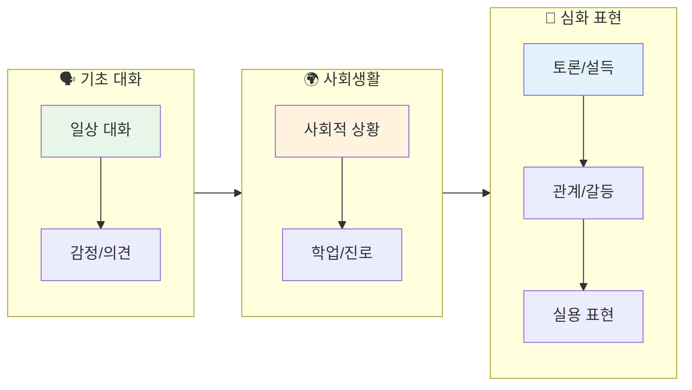
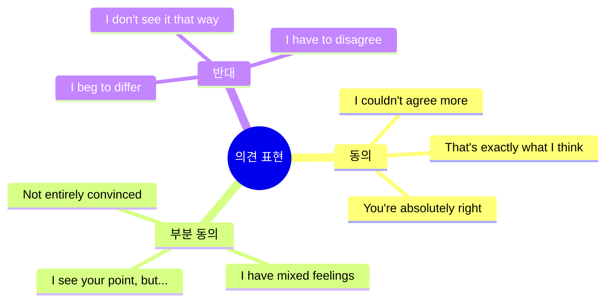
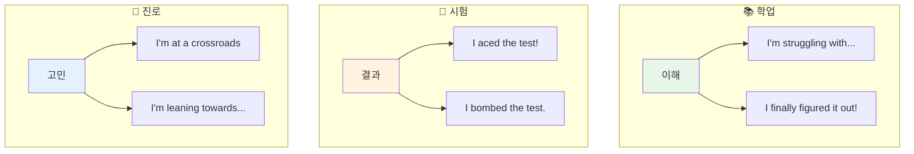
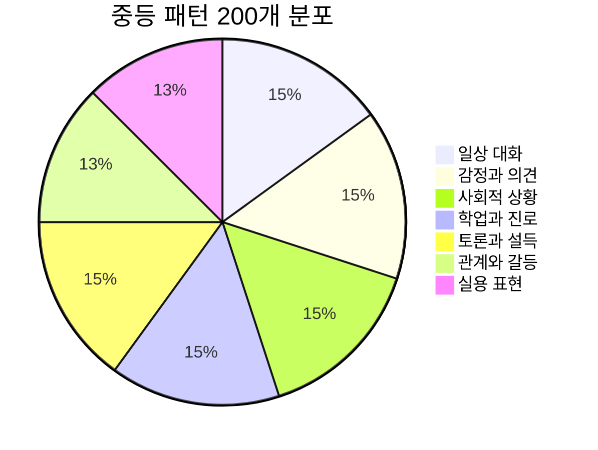
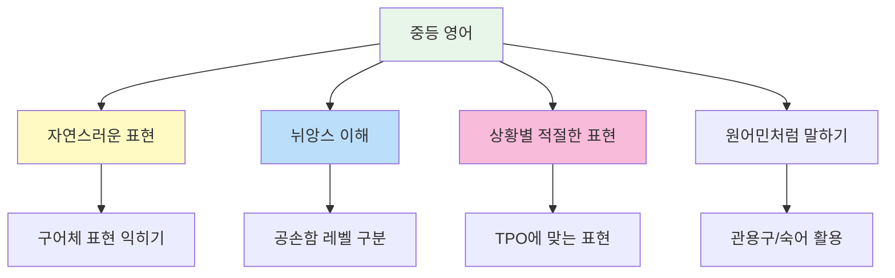

# 🎓 중등 영어 회화 패턴 200선

> **영어권 청소년들이 실제로 사용하는 자연스러운 표현**  
> 14~16세 수준의 중급 회화 패턴 (일상/사회/의견 표현)

---

## 📋 목차
1. [일상 대화](#-일상-대화-patterns-1-30)
2. [감정과 의견](#-감정과-의견-patterns-31-60)
3. [사회적 상황](#-사회적-상황-patterns-61-90)
4. [학업과 진로](#-학업과-진로-patterns-91-120)
5. [토론과 설득](#-토론과-설득-patterns-121-150)
6. [관계와 갈등](#-관계와-갈등-patterns-151-175)
7. [실용 표현](#-실용-표현-patterns-176-200)

---

## 학습 흐름도



---

## 💬 일상 대화 (Patterns 1-30)

### 인사와 안부 (1-12)

| No. | 패턴 | 예문 | 한국어 뜻 |
|:---:|------|------|----------|
| 1 | How have you been? | Hey! How have you been lately? | 어떻게 지냈어? |
| 2 | It's been a while! | It's been a while! What's new with you? | 오랜만이다! |
| 3 | What have you been up to? | What have you been up to these days? | 요즘 뭐 하고 지내? |
| 4 | Same old, same old. | How are things? - Same old, same old. | 뭐 그냥 그래. |
| 5 | Can't complain. | How's it going? - Can't complain. | 불만 없어. (괜찮아) |
| 6 | I've been busy with [것]. | I've been busy with finals lately. | ~로 바빴어. |
| 7 | Things have been crazy. | Things have been crazy at home. | 정신없이 지냈어. |
| 8 | I've been meaning to [동사]. | I've been meaning to call you. | ~하려고 했었어. |
| 9 | It's so good to see you! | It's so good to see you again! | 만나서 정말 반가워! |
| 10 | We should catch up sometime. | We should catch up sometime soon. | 언제 만나서 얘기하자. |
| 11 | Let's keep in touch. | Let's keep in touch, okay? | 연락하고 지내자. |
| 12 | Don't be a stranger! | Don't be a stranger! Text me anytime. | 연락 끊기지 말고! |

### 일상 표현 (13-22)

| No. | 패턴 | 예문 | 한국어 뜻 |
|:---:|------|------|----------|
| 13 | I'm kind of in a hurry. | Sorry, I'm kind of in a hurry right now. | 좀 바빠서. |
| 14 | I totally forgot about [것]. | I totally forgot about the meeting! | ~를 완전히 잊었어. |
| 15 | It completely slipped my mind. | Your birthday! It completely slipped my mind. | 완전히 깜빡했어. |
| 16 | I've got a lot on my plate. | I've got a lot on my plate right now. | 할 일이 너무 많아. |
| 17 | I'm swamped with [것]. | I'm swamped with homework this week. | ~로 바빠 죽겠어. |
| 18 | I could really use [것]. | I could really use some coffee right now. | ~가 정말 필요해. |
| 19 | I'm not in the mood for [것]. | I'm not in the mood for going out tonight. | ~할 기분이 아니야. |
| 20 | I'm thinking about [동사]-ing. | I'm thinking about joining the club. | ~할까 생각 중이야. |
| 21 | I'm having second thoughts. | I'm having second thoughts about this. | 다시 생각해보고 있어. |
| 22 | Let me sleep on it. | It's a big decision. Let me sleep on it. | 생각 좀 해볼게. |

### 반응과 맞장구 (23-30)

| No. | 패턴 | 예문 | 한국어 뜻 |
|:---:|------|------|----------|
| 23 | That makes sense. | Oh, that makes sense now. | 이해가 되네. |
| 24 | I see what you mean. | I see what you mean. Good point. | 무슨 말인지 알겠어. |
| 25 | I know, right? | The test was so hard! - I know, right? | 그러니까, 맞지? |
| 26 | Tell me about it! | Mondays are the worst. - Tell me about it! | 내 말이! |
| 27 | You can say that again! | Life is tough. - You can say that again! | 두 번 말하면 잔소리! |
| 28 | I couldn't agree more. | We need more time. - I couldn't agree more. | 완전 동의해. |
| 29 | That's exactly what I was thinking! | That's exactly what I was thinking! | 그게 바로 내 생각이야! |
| 30 | You took the words right out of my mouth. | You took the words right out of my mouth! | 내가 하려던 말이야. |

---

## 😤 감정과 의견 (Patterns 31-60)

### 감정 표현 (31-45)

| No. | 패턴 | 예문 | 한국어 뜻 |
|:---:|------|------|----------|
| 31 | I'm so stressed out. | I'm so stressed out about exams. | 스트레스 받아 죽겠어. |
| 32 | I'm under a lot of pressure. | I'm under a lot of pressure from my parents. | 압박이 심해. |
| 33 | I'm feeling overwhelmed. | I'm feeling overwhelmed with everything. | 감당이 안 돼. |
| 34 | I'm fed up with [것]. | I'm fed up with all this drama. | ~에 질렸어. |
| 35 | I'm sick and tired of [것]. | I'm sick and tired of studying. | ~에 지긋지긋해. |
| 36 | I'm frustrated because... | I'm frustrated because nothing is working. | ~라서 답답해. |
| 37 | It really gets on my nerves. | His attitude really gets on my nerves. | 정말 신경 거슬려. |
| 38 | It drives me crazy. | The noise drives me crazy. | 미치게 해. |
| 39 | I can't stand [것]. | I can't stand being lied to. | ~를 못 참겠어. |
| 40 | I'm kind of disappointed. | I'm kind of disappointed with the results. | 좀 실망했어. |
| 41 | I was hoping for [것]. | I was hoping for a better grade. | ~를 바랐는데. |
| 42 | I'm relieved that... | I'm relieved that it's finally over. | ~라서 다행이야. |
| 43 | That's a relief! | You passed? That's a relief! | 다행이다! |
| 44 | I'm over it. | We broke up, but I'm over it now. | 이제 괜찮아. |
| 45 | I've moved on. | It was hard, but I've moved on. | 극복했어. |

### 의견 표현 (46-60)

| No. | 패턴 | 예문 | 한국어 뜻 |
|:---:|------|------|----------|
| 46 | In my opinion... | In my opinion, this is unfair. | 내 생각엔... |
| 47 | If you ask me... | If you ask me, he's wrong. | 내 생각을 묻는다면... |
| 48 | The way I see it... | The way I see it, we have no choice. | 내가 보기엔... |
| 49 | From my point of view... | From my point of view, it's a good idea. | 내 관점에서는... |
| 50 | Personally, I think... | Personally, I think we should wait. | 개인적으로 ~라고 생각해. |
| 51 | I tend to think that... | I tend to think that it's too risky. | ~라고 생각하는 편이야. |
| 52 | I'm pretty sure that... | I'm pretty sure that she's right. | ~라고 확신해. |
| 53 | I strongly believe that... | I strongly believe that everyone deserves respect. | ~라고 강하게 믿어. |
| 54 | I have mixed feelings about [것]. | I have mixed feelings about this decision. | ~에 대해 복잡한 심정이야. |
| 55 | I'm not entirely convinced. | I'm not entirely convinced by his argument. | 완전히 납득이 안 돼. |
| 56 | I have my doubts about [것]. | I have my doubts about this plan. | ~가 의심스러워. |
| 57 | To be honest... | To be honest, I don't really like it. | 솔직히 말하면... |
| 58 | Between you and me... | Between you and me, I think he's lying. | 우리끼리 얘긴데... |
| 59 | Don't get me wrong, but... | Don't get me wrong, but I disagree. | 오해하지 마, 근데... |
| 60 | I hate to say this, but... | I hate to say this, but you're wrong. | 이런 말 하기 싫지만... |



---

## 🌍 사회적 상황 (Patterns 61-90)

### 초대와 약속 (61-72)

| No. | 패턴 | 예문 | 한국어 뜻 |
|:---:|------|------|----------|
| 61 | Are you doing anything [시간]? | Are you doing anything this Saturday? | ~에 뭐 해? |
| 62 | Would you be interested in [동사]-ing? | Would you be interested in going to a concert? | ~하는 거 관심 있어? |
| 63 | I was wondering if you'd like to... | I was wondering if you'd like to grab lunch. | ~하고 싶은지 궁금해서. |
| 64 | How does [시간] sound? | How does Friday evening sound? | ~는 어때? |
| 65 | Does [시간] work for you? | Does 3 PM work for you? | ~시 괜찮아? |
| 66 | Let me check my schedule. | Let me check my schedule and get back to you. | 스케줄 확인해 볼게. |
| 67 | I'll have to take a rain check. | I can't tonight. I'll have to take a rain check. | 다음에 하자. |
| 68 | Can we reschedule? | Something came up. Can we reschedule? | 일정 바꿀 수 있을까? |
| 69 | I'm running a bit late. | Sorry, I'm running a bit late. Be there in 10. | 좀 늦을 것 같아. |
| 70 | Sorry to keep you waiting. | Sorry to keep you waiting. Traffic was terrible. | 기다리게 해서 미안. |
| 71 | No worries, take your time. | No worries, take your time. | 괜찮아, 천천히 와. |
| 72 | Thanks for being patient. | Thanks for being patient with me. | 기다려줘서 고마워. |

### 사과와 용서 (73-82)

| No. | 패턴 | 예문 | 한국어 뜻 |
|:---:|------|------|----------|
| 73 | I owe you an apology. | I owe you an apology for what I said. | 사과해야 할 것 같아. |
| 74 | I shouldn't have [과거분사]. | I shouldn't have yelled at you. | ~하지 말았어야 했는데. |
| 75 | I didn't mean to [동사]. | I didn't mean to hurt your feelings. | ~하려던 게 아니었어. |
| 76 | It was wrong of me to [동사]. | It was wrong of me to lie to you. | ~한 건 내가 잘못했어. |
| 77 | I take full responsibility. | I messed up. I take full responsibility. | 내 책임이야. |
| 78 | How can I make it up to you? | I'm sorry. How can I make it up to you? | 어떻게 하면 용서해 줄래? |
| 79 | Apology accepted. | Apology accepted. Let's move on. | 사과 받아들일게. |
| 80 | Water under the bridge. | Don't worry about it. Water under the bridge. | 지나간 일이야. |
| 81 | Let's just forget about it. | Let's just forget about it and start fresh. | 그냥 잊어버리자. |
| 82 | No hard feelings. | No hard feelings. We're cool. | 감정 상한 거 없어. |

### 감사와 칭찬 (83-90)

| No. | 패턴 | 예문 | 한국어 뜻 |
|:---:|------|------|----------|
| 83 | I really appreciate [것]. | I really appreciate your help. | ~정말 감사해. |
| 84 | I can't thank you enough. | I can't thank you enough for everything. | 뭐라 감사해야 할지. |
| 85 | You're the best! | Thanks for helping. You're the best! | 넌 최고야! |
| 86 | That was so sweet of you! | That was so sweet of you to remember! | 정말 다정하다! |
| 87 | You've outdone yourself! | This is amazing! You've outdone yourself! | 대단하다! (기대 이상이야) |
| 88 | I'm impressed! | Wow, I'm impressed! Great job! | 감동받았어! |
| 89 | You should be proud of yourself. | You worked hard. You should be proud. | 자랑스러워해도 돼. |
| 90 | That means a lot coming from you. | Thank you. That means a lot coming from you. | 네가 그렇게 말해줘서 기뻐. |

---

## 📖 학업과 진로 (Patterns 91-120)

### 학업 관련 (91-105)

| No. | 패턴 | 예문 | 한국어 뜻 |
|:---:|------|------|----------|
| 91 | I'm struggling with [것]. | I'm struggling with this subject. | ~가 어려워. |
| 92 | I'm having trouble [동사]-ing. | I'm having trouble understanding this concept. | ~하는 게 힘들어. |
| 93 | I can't wrap my head around [것]. | I can't wrap my head around calculus. | ~를 이해할 수가 없어. |
| 94 | Could you walk me through [것]? | Could you walk me through this problem? | ~좀 설명해 줄래? |
| 95 | Let me get this straight. | Let me get this straight. So you mean...? | 정리해 보자면. |
| 96 | If I understand correctly... | If I understand correctly, the answer is A? | 제가 이해한 게 맞다면... |
| 97 | I finally figured it out! | I finally figured it out! It makes sense now! | 드디어 알았어! |
| 98 | It clicked! | After the explanation, it finally clicked! | 이해가 딱 됐어! |
| 99 | I need to step up my game. | My grades are slipping. I need to step up my game. | 더 노력해야겠어. |
| 100 | I'm falling behind in [과목]. | I'm falling behind in math. | ~에서 뒤처지고 있어. |
| 101 | I'm going to pull an all-nighter. | I have to pull an all-nighter for this project. | 밤샐 거야. |
| 102 | I crammed for the test. | I crammed for the test last night. | 벼락치기 했어. |
| 103 | I aced the test! | I studied hard and aced the test! | 시험 완전 잘 봤어! |
| 104 | I bombed the test. | I didn't study and bombed the test. | 시험 망했어. |
| 105 | I need to catch up on [것]. | I need to catch up on missed classes. | ~를 따라잡아야 해. |

### 진로와 목표 (106-120)

| No. | 패턴 | 예문 | 한국어 뜻 |
|:---:|------|------|----------|
| 106 | I'm considering [동사]-ing. | I'm considering studying abroad. | ~를 고려 중이야. |
| 107 | I've been thinking about [것]. | I've been thinking about my future career. | ~에 대해 생각 중이야. |
| 108 | I'm not sure what I want to do. | I'm not sure what I want to do after graduation. | 뭘 하고 싶은지 모르겠어. |
| 109 | I'm trying to figure out [것]. | I'm trying to figure out my strengths. | ~를 알아내려고 해. |
| 110 | I'm passionate about [것]. | I'm passionate about helping others. | ~에 열정이 있어. |
| 111 | I've always wanted to [동사]. | I've always wanted to become a doctor. | 항상 ~하고 싶었어. |
| 112 | My dream is to [동사]. | My dream is to travel the world. | 내 꿈은 ~하는 거야. |
| 113 | I'm aiming for [것]. | I'm aiming for a scholarship. | ~를 목표로 해. |
| 114 | I'm working towards [것]. | I'm working towards my goals every day. | ~를 위해 노력 중이야. |
| 115 | I've set my sights on [것]. | I've set my sights on that university. | ~를 목표로 삼았어. |
| 116 | I need to weigh my options. | I need to weigh my options carefully. | 선택지들을 잘 따져봐야 해. |
| 117 | I'm at a crossroads. | I'm at a crossroads in my life. | 인생의 갈림길에 있어. |
| 118 | I'm leaning towards [것]. | I'm leaning towards the science track. | ~쪽으로 마음이 기울어. |
| 119 | It's a tough decision. | Choosing a major is a tough decision. | 어려운 결정이야. |
| 120 | I'll figure it out eventually. | I'm confused now, but I'll figure it out. | 결국엔 알게 될 거야. |



---

## 🗣️ 토론과 설득 (Patterns 121-150)

### 동의와 반대 (121-135)

| No. | 패턴 | 예문 | 한국어 뜻 |
|:---:|------|------|----------|
| 121 | I totally agree with you. | I totally agree with you on this. | 완전 동의해. |
| 122 | You have a point there. | You have a point there. I didn't think of that. | 일리가 있네. |
| 123 | That's a valid argument. | That's a valid argument. I see your logic. | 타당한 주장이야. |
| 124 | I see where you're coming from. | I see where you're coming from, but... | 네 입장은 이해해, 근데... |
| 125 | I beg to differ. | I beg to differ. I think the opposite is true. | 의견이 달라. |
| 126 | I don't see it that way. | I don't see it that way at all. | 그렇게 생각 안 해. |
| 127 | I'm not so sure about that. | I'm not so sure about that. Any evidence? | 그건 잘 모르겠어. |
| 128 | I respectfully disagree. | I respectfully disagree with your opinion. | 정중히 반대해. |
| 129 | That's debatable. | That's debatable. There are other views. | 논쟁의 여지가 있어. |
| 130 | I'd argue that... | I'd argue that the opposite is true. | ~라고 주장하고 싶어. |
| 131 | On the other hand... | On the other hand, there are benefits. | 반면에... |
| 132 | It depends on [것]. | It depends on how you look at it. | ~에 따라 달라. |
| 133 | There are pros and cons. | There are pros and cons to both sides. | 장단점이 있어. |
| 134 | Let's agree to disagree. | We won't agree on this. Let's agree to disagree. | 의견 차이를 인정하자. |
| 135 | Fair enough. | Fair enough. I can accept that. | 그럴 수 있지. |

### 설득과 주장 (136-150)

| No. | 패턴 | 예문 | 한국어 뜻 |
|:---:|------|------|----------|
| 136 | Here's the thing... | Here's the thing - we need to act now. | 있잖아, 중요한 건... |
| 137 | The point is... | The point is, we can't ignore this issue. | 요점은... |
| 138 | What I'm trying to say is... | What I'm trying to say is we need change. | 내가 말하려는 건... |
| 139 | Let me put it this way... | Let me put it this way - it's now or never. | 이렇게 말할게... |
| 140 | Just hear me out. | Just hear me out before you decide. | 일단 내 말 좀 들어봐. |
| 141 | Think about it this way... | Think about it this way - what if you succeed? | 이렇게 생각해봐... |
| 142 | Consider the consequences. | Consider the consequences before you act. | 결과를 생각해봐. |
| 143 | You might want to reconsider. | You might want to reconsider your decision. | 다시 생각해보는 게 좋겠어. |
| 144 | It's worth a try, isn't it? | It's worth a try, isn't it? | 시도해볼 가치가 있지 않아? |
| 145 | What do you have to lose? | It's free. What do you have to lose? | 손해 볼 거 있어? |
| 146 | Trust me on this one. | Trust me on this one. It'll work out. | 이건 날 믿어. |
| 147 | You won't regret it. | Join us! You won't regret it. | 후회 안 할 거야. |
| 148 | Don't knock it till you try it. | Don't knock it till you try it. | 해보기 전에 판단하지 마. |
| 149 | Give it a chance. | Give it a chance. You might like it. | 한 번 기회를 줘봐. |
| 150 | Let's look at the facts. | Let's look at the facts objectively. | 사실을 보자. |

---

## 💔 관계와 갈등 (Patterns 151-175)

### 관계 표현 (151-162)

| No. | 패턴 | 예문 | 한국어 뜻 |
|:---:|------|------|----------|
| 151 | We've grown apart. | We were close, but we've grown apart. | 사이가 멀어졌어. |
| 152 | We've been through a lot together. | We've been through a lot together. | 함께 많은 걸 겪었어. |
| 153 | I can always count on you. | Thanks. I can always count on you. | 넌 항상 믿을 수 있어. |
| 154 | You've got my back. | I know you've got my back. | 네가 내 편이잖아. |
| 155 | I'm here for you. | No matter what, I'm here for you. | 내가 있잖아. |
| 156 | I've got your back. | Don't worry. I've got your back. | 내가 도와줄게. |
| 157 | We click really well. | She and I click really well. | 우리 정말 잘 맞아. |
| 158 | We're on the same page. | We're on the same page about this. | 우리 생각이 같아. |
| 159 | We don't see eye to eye. | We don't see eye to eye on politics. | 의견이 안 맞아. |
| 160 | We've had our differences. | We've had our differences, but we're okay. | 갈등이 있었어. |
| 161 | It's complicated. | Our relationship? It's complicated. | 복잡해. |
| 162 | We're just friends. | Nothing's going on. We're just friends. | 그냥 친구야. |

### 갈등 해결 (163-175)

| No. | 패턴 | 예문 | 한국어 뜻 |
|:---:|------|------|----------|
| 163 | We need to talk. | We need to talk about what happened. | 우리 얘기 좀 해야 해. |
| 164 | Can we clear the air? | Can we clear the air between us? | 오해 좀 풀자. |
| 165 | I think there's been a misunderstanding. | I think there's been a misunderstanding. | 오해가 있었던 것 같아. |
| 166 | I didn't mean it that way. | I didn't mean it that way. Let me explain. | 그런 뜻이 아니었어. |
| 167 | You took it the wrong way. | You took it the wrong way. | 잘못 받아들인 거야. |
| 168 | Let me explain my side. | Let me explain my side of the story. | 내 입장을 설명할게. |
| 169 | Can we start over? | Can we start over and forget the past? | 다시 시작할 수 있을까? |
| 170 | Let's put this behind us. | Let's put this behind us and move forward. | 이건 잊고 가자. |
| 171 | I'm willing to compromise. | I'm willing to compromise if you are. | 타협할 의향이 있어. |
| 172 | Meet me halfway. | I've tried. Now you meet me halfway. | 너도 양보해봐. |
| 173 | Let's find a middle ground. | Let's find a middle ground we both agree on. | 타협점을 찾자. |
| 174 | I need some space. | I need some space right now. | 혼자 있을 시간이 필요해. |
| 175 | Give me some time to cool down. | Give me some time to cool down first. | 진정할 시간을 줘. |

---

## 🛠️ 실용 표현 (Patterns 176-200)

### 상황 대처 (176-188)

| No. | 패턴 | 예문 | 한국어 뜻 |
|:---:|------|------|----------|
| 176 | I'm in a bit of a situation. | I'm in a bit of a situation. Can you help? | 좀 곤란한 상황이야. |
| 177 | This is getting out of hand. | This is getting out of hand. We need help. | 통제가 안 돼. |
| 178 | Let's not make a big deal out of it. | It's minor. Let's not make a big deal out of it. | 대수롭지 않게 넘기자. |
| 179 | Let's not jump to conclusions. | Let's not jump to conclusions before we know. | 성급하게 결론 내지 말자. |
| 180 | Let's take it one step at a time. | It's overwhelming. Let's take it one step at a time. | 하나씩 해결하자. |
| 181 | We'll cross that bridge when we get there. | Don't worry. We'll cross that bridge when we get there. | 그때 가서 생각하자. |
| 182 | There's no point in [동사]-ing. | There's no point in worrying about it now. | ~해봤자 소용없어. |
| 183 | It's out of my control. | I can't change it. It's out of my control. | 내가 어쩔 수 없어. |
| 184 | It can't be helped. | It happened. It can't be helped now. | 어쩔 수 없어. |
| 185 | What's done is done. | What's done is done. Let's move on. | 이미 지난 일이야. |
| 186 | There's no use crying over spilled milk. | It's over. There's no use crying over spilled milk. | 엎질러진 물이야. |
| 187 | Let's just play it by ear. | We don't have a plan. Let's just play it by ear. | 상황 봐서 하자. |
| 188 | I'll wing it. | I'm not prepared, but I'll wing it. | 즉흥적으로 할게. |

### 격려와 조언 (189-200)

| No. | 패턴 | 예문 | 한국어 뜻 |
|:---:|------|------|----------|
| 189 | Hang in there! | I know it's tough. Hang in there! | 힘내! |
| 190 | You've got this! | Don't be nervous. You've got this! | 넌 할 수 있어! |
| 191 | Keep your chin up! | Keep your chin up! Things will get better. | 기운 내! |
| 192 | Don't give up! | Don't give up! You're almost there! | 포기하지 마! |
| 193 | Stay positive! | Stay positive! Good things are coming. | 긍정적으로 생각해! |
| 194 | Everything will work out. | Don't worry. Everything will work out. | 다 잘 될 거야. |
| 195 | Take it easy. | You're stressed. Take it easy for a while. | 좀 쉬어. |
| 196 | Don't be so hard on yourself. | You tried your best. Don't be so hard on yourself. | 너무 자책하지 마. |
| 197 | It's not the end of the world. | You failed once. It's not the end of the world. | 세상이 끝난 게 아니야. |
| 198 | Every cloud has a silver lining. | You'll learn from this. Every cloud has a silver lining. | 전화위복이 될 거야. |
| 199 | When one door closes, another opens. | Don't be sad. When one door closes, another opens. | 한 문이 닫히면 다른 문이 열려. |
| 200 | Believe in yourself! | You can do anything. Believe in yourself! | 자신을 믿어! |

---

## 📊 전체 패턴 분포



---

## 💡 학습 팁

### 🎯 중등 영어 학습 포인트



### ⭐ 가장 많이 쓰는 표현 TOP 20

| 순위 | 표현 | 사용 상황 |
|:---:|------|---------|
| 1 | I know, right? | 강한 동의 |
| 2 | That makes sense. | 이해했을 때 |
| 3 | I'm stressed out. | 스트레스 표현 |
| 4 | In my opinion... | 의견 말할 때 |
| 5 | To be honest... | 솔직히 말할 때 |
| 6 | I see where you're coming from. | 상대 이해 |
| 7 | Let me sleep on it. | 결정 미룰 때 |
| 8 | I'm having second thoughts. | 고민될 때 |
| 9 | I totally forgot about... | 잊었을 때 |
| 10 | I've got a lot on my plate. | 바쁠 때 |
| 11 | Just hear me out. | 설득할 때 |
| 12 | Let's agree to disagree. | 의견 차이 인정 |
| 13 | We need to talk. | 진지한 대화 시작 |
| 14 | I didn't mean it that way. | 오해 풀 때 |
| 15 | Hang in there! | 격려할 때 |
| 16 | You've got this! | 응원할 때 |
| 17 | It's not the end of the world. | 위로할 때 |
| 18 | I'm at a crossroads. | 결정 앞두었을 때 |
| 19 | Fair enough. | 수긍할 때 |
| 20 | Let's play it by ear. | 계획 없이 갈 때 |

### 📅 4주 학습 계획

| 주차 | 학습 주제 | 목표 패턴 |
|:---:|----------|:--------:|
| 1주 | 일상 대화 + 감정/의견 | 1-60 |
| 2주 | 사회적 상황 + 학업/진로 | 61-120 |
| 3주 | 토론과 설득 | 121-150 |
| 4주 | 관계/갈등 + 실용 표현 | 151-200 + 전체 복습 |

### 📌 공손함 레벨 가이드

| 레벨 | 표현 예시 | 사용 상황 |
|:---:|---------|---------|
| 🔵 캐주얼 | I think..., I want... | 친한 친구 |
| 🟢 일반 | I believe..., Would you...? | 일반 대화 |
| 🟡 정중 | I was wondering if..., Would you mind...? | 어른, 선생님 |
| 🔴 매우 정중 | I was hoping you could..., I'd appreciate if... | 공식 상황 |

---

## 🎬 실전 연습 시나리오

### 시나리오 1: 친구와 의견 충돌

```
상황: 친구와 영화 선택에서 의견이 다를 때

A: I think we should watch an action movie.
B: I'm not so sure about that. I'd rather watch a comedy.
A: Here's the thing - action movies are more exciting.
B: I see where you're coming from, but I need to laugh today.
A: Fair enough. Let's find a middle ground.
B: How about an action-comedy? Best of both worlds!
A: That sounds great! Let's do it!
```

### 시나리오 2: 학업 고민 상담

```
상황: 친구에게 진로 고민 상담할 때

A: I'm at a crossroads about my future.
B: What's on your mind?
A: I'm having trouble deciding between science and arts.
B: I see. What are you passionate about?
A: I love both, but I'm leaning towards science.
B: Trust your gut. You've got this!
A: Thanks. That means a lot coming from you.
```

---

*Last Updated: 2026-01-10*

