# ✈️ 여행 영어 회화 기본 패턴 50선

## 📋 목차
1. [전체 흐름도](#전체-흐름도)
2. [기본 패턴 구조](#기본-패턴-구조)
3. [공항 (Airport)](#-공항-airport)
4. [호텔 (Hotel)](#-호텔-hotel)
5. [식당 (Restaurant)](#-식당-restaurant)
6. [쇼핑 (Shopping)](#-쇼핑-shopping)
7. [교통 (Transportation)](#-교통-transportation)
8. [관광지 (Sightseeing)](#-관광지-sightseeing)
9. [긴급 상황 (Emergency)](#-긴급-상황-emergency)

---

## 전체 흐름도

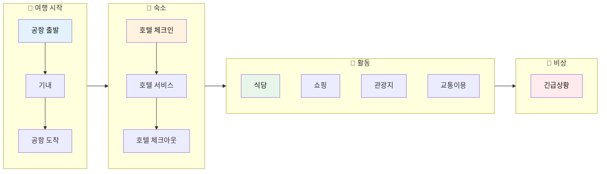

---

## 기본 패턴 구조

### 🎯 핵심 요청 패턴 5가지

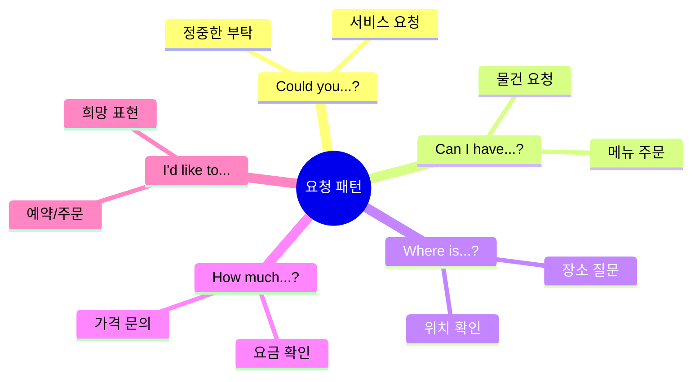

### 📊 패턴별 공손함 레벨

| 레벨 | 패턴 | 사용 상황 | 예시 |
|:---:|------|----------|------|
| ⭐ | Can I...? | 일반적 요청 | Can I have water? |
| ⭐⭐ | Could you...? | 정중한 요청 | Could you help me? |
| ⭐⭐⭐ | Would you mind...? | 매우 정중 | Would you mind waiting? |
| ⭐⭐⭐ | I'd like to... | 공식적 요청 | I'd like to check in. |
| ⭐⭐⭐⭐ | I was wondering if... | 최고 정중 | I was wondering if you could... |

---

## ✈️ 공항 (Airport)

### 공항 이용 흐름도

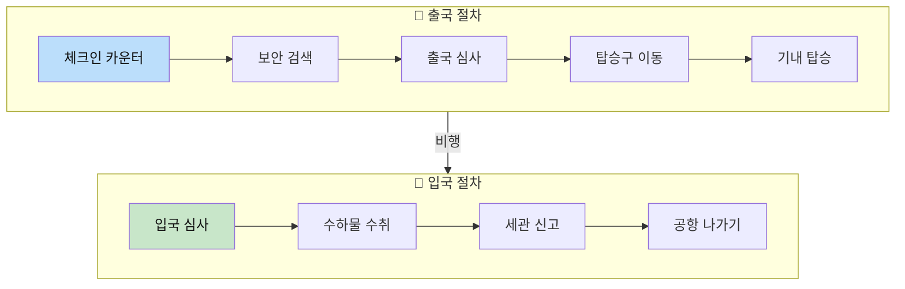

### 📋 공항 필수 표현 (패턴 1~10)

| No. | 상황 | 영어 표현 | 한국어 뜻 | 발음 가이드 |
|:---:|------|----------|----------|------------|
| 1 | 체크인 | I'd like to check in for my flight. | 비행기 체크인하고 싶어요. | 아이드 라이크 투 체킨 포 마이 플라잇 |
| 2 | 좌석 요청 | Could I get a window seat? | 창가 좌석 가능할까요? | 쿠다이 겟 어 윈도우 싯? |
| 3 | 수하물 | Where can I pick up my luggage? | 짐은 어디서 찾나요? | 웨어 캔 아이 픽업 마이 러기지? |
| 4 | 탑승구 | Where is the boarding gate? | 탑승구가 어디인가요? | 웨어 이즈 더 보딩 게이트? |
| 5 | 시간 확인 | What time does the flight depart? | 비행기가 몇 시에 출발하나요? | 왓 타임 더즈 더 플라잇 디파트? |
| 6 | 환승 | Where is the transfer counter? | 환승 카운터가 어디인가요? | 웨어 이즈 더 트랜스퍼 카운터? |
| 7 | 지연 확인 | Is the flight delayed? | 비행기가 지연됐나요? | 이즈 더 플라잇 딜레이드? |
| 8 | 입국심사 | I'm here for sightseeing. | 관광 목적으로 왔습니다. | 아임 히어 포 사이트씽 |
| 9 | 체류 기간 | I'll be staying for a week. | 일주일 머물 예정이에요. | 아일 비 스테잉 포 어 윅 |
| 10 | 세관 | I have nothing to declare. | 신고할 물건이 없습니다. | 아이 해브 나띵 투 디클레어 |

### ✈️ 기내 표현

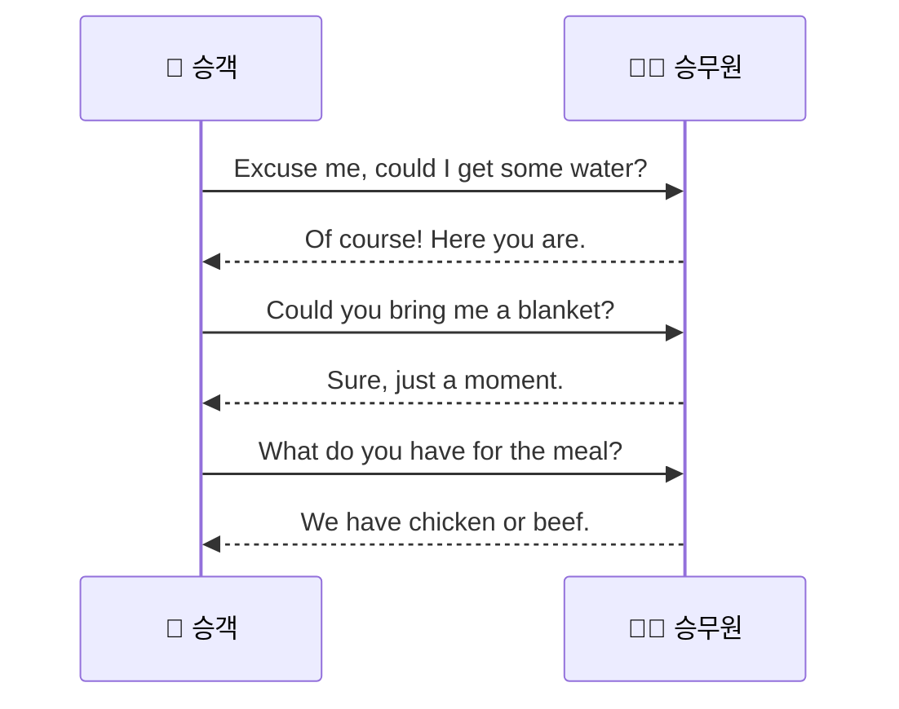

---

## 🏨 호텔 (Hotel)

### 호텔 이용 흐름도

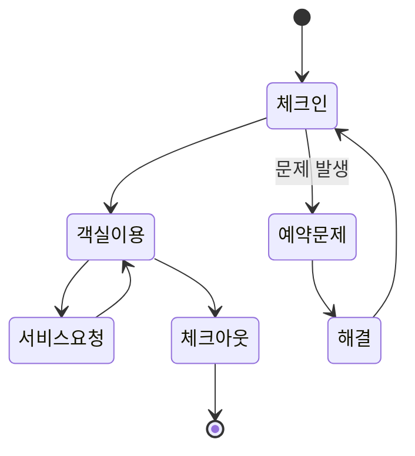

### 📋 호텔 필수 표현 (패턴 11~20)

| No. | 상황 | 영어 표현 | 한국어 뜻 |
|:---:|------|----------|----------|
| 11 | 체크인 | I have a reservation under [이름]. | [이름]으로 예약했어요. |
| 12 | 객실 확인 | What time is check-in? | 체크인 시간이 언제예요? |
| 13 | 짐 맡기기 | Could you keep my luggage? | 짐을 맡아주실 수 있나요? |
| 14 | 와이파이 | What's the Wi-Fi password? | 와이파이 비밀번호가 뭐예요? |
| 15 | 조식 | What time is breakfast served? | 조식은 몇 시부터예요? |
| 16 | 청소 요청 | Could you clean my room? | 객실 청소해 주시겠어요? |
| 17 | 물품 요청 | Could I get extra towels? | 수건 더 받을 수 있나요? |
| 18 | 문제 신고 | The air conditioner doesn't work. | 에어컨이 작동하지 않아요. |
| 19 | 체크아웃 | I'd like to check out. | 체크아웃하고 싶어요. |
| 20 | 영수증 | Could I have the receipt? | 영수증 주시겠어요? |

### 🔧 호텔 문제 해결 표현

| 문제 상황 | 영어 표현 |
|----------|----------|
| 열쇠 분실 | I lost my room key. |
| 뜨거운 물 안 나옴 | There's no hot water. |
| 소음 문제 | The room next door is too noisy. |
| 시설 고장 | The TV is not working. |

---

## 🍽️ 식당 (Restaurant)

### 식당 이용 흐름도

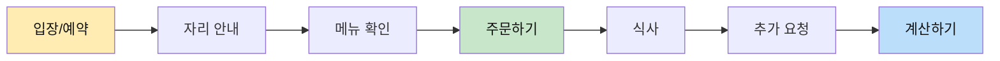

### 📋 식당 필수 표현 (패턴 21~30)

| No. | 단계 | 영어 표현 | 한국어 뜻 |
|:---:|------|----------|----------|
| 21 | 예약 | I'd like to make a reservation. | 예약하고 싶어요. |
| 22 | 인원 | Table for two, please. | 2명 자리 부탁해요. |
| 23 | 메뉴 질문 | What do you recommend? | 추천 메뉴가 뭐예요? |
| 24 | 주문 | I'll have this one, please. | 이걸로 할게요. |
| 25 | 음료 | Could I get a glass of water? | 물 한 잔 주시겠어요? |
| 26 | 맵기 조절 | Not too spicy, please. | 너무 맵지 않게 해주세요. |
| 27 | 알레르기 | I'm allergic to peanuts. | 땅콩 알레르기가 있어요. |
| 28 | 추가 요청 | Could I have some more bread? | 빵 좀 더 주시겠어요? |
| 29 | 계산 | Check, please. / Bill, please. | 계산서 주세요. |
| 30 | 포장 | Could I get this to go? | 포장해 주시겠어요? |

### 🥗 메뉴 관련 질문

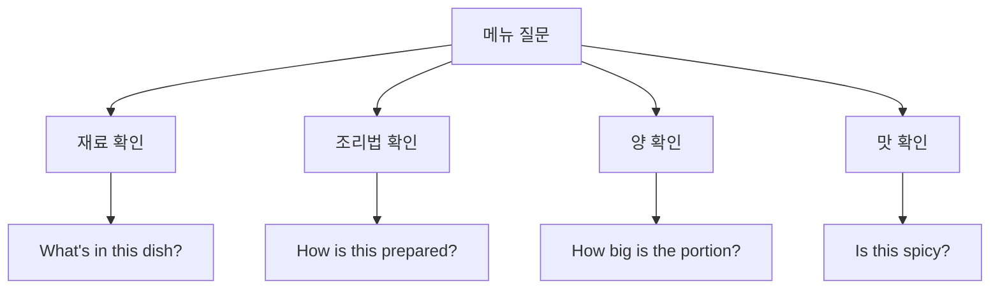

---

## 🛍️ 쇼핑 (Shopping)

### 쇼핑 흐름도

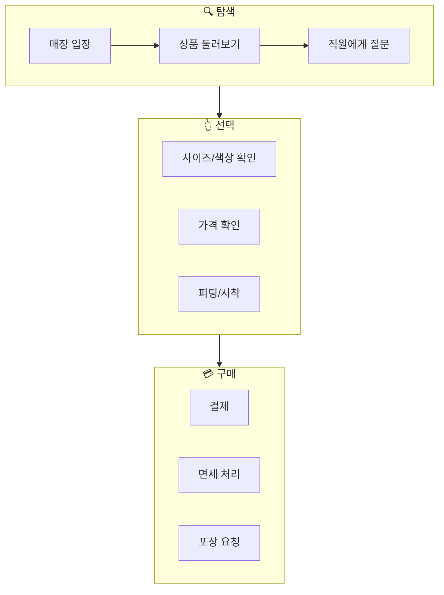

### 📋 쇼핑 필수 표현 (패턴 31~38)

| No. | 상황 | 영어 표현 | 한국어 뜻 |
|:---:|------|----------|----------|
| 31 | 둘러보기 | I'm just looking, thanks. | 그냥 구경하는 거예요. |
| 32 | 찾기 | I'm looking for a jacket. | 재킷을 찾고 있어요. |
| 33 | 사이즈 | Do you have this in medium? | 이거 M 사이즈 있나요? |
| 34 | 색상 | Do you have this in black? | 이거 검은색 있나요? |
| 35 | 가격 | How much is this? | 이거 얼마예요? |
| 36 | 피팅 | Can I try this on? | 이거 입어봐도 되나요? |
| 37 | 할인 | Is this on sale? | 이거 세일 중인가요? |
| 38 | 면세 | Can I get a tax refund? | 세금 환급 받을 수 있나요? |

### 💰 가격 흥정 표현

| 상황 | 영어 표현 |
|------|----------|
| 할인 요청 | Can you give me a discount? |
| 가격 비쌈 | That's too expensive. |
| 깎아달라 | Could you lower the price? |
| 현금 결제 | I'll pay in cash. |

---

## 🚌 교통 (Transportation)

### 교통수단 선택도

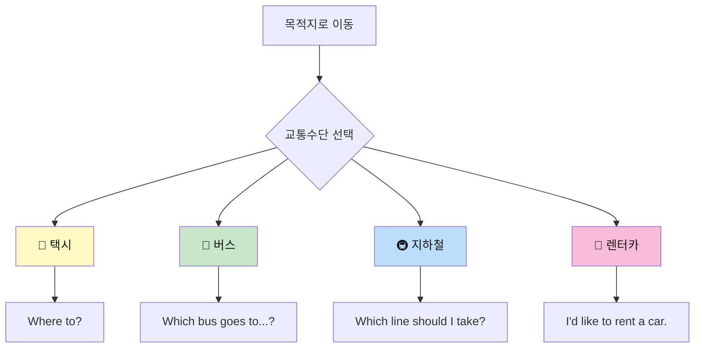

### 📋 교통 필수 표현 (패턴 39~44)

| No. | 교통수단 | 영어 표현 | 한국어 뜻 |
|:---:|---------|----------|----------|
| 39 | 택시 | Could you take me to this address? | 이 주소로 가주세요. |
| 40 | 택시 | How long will it take? | 얼마나 걸리나요? |
| 41 | 택시 | Keep the change. | 거스름돈은 가지세요. |
| 42 | 버스/지하철 | How do I get to downtown? | 시내로 어떻게 가나요? |
| 43 | 버스/지하철 | Where should I get off? | 어디서 내려야 하나요? |
| 44 | 렌터카 | I'd like to rent a car for 3 days. | 3일간 차를 빌리고 싶어요. |

### 🗺️ 길 묻기 표현

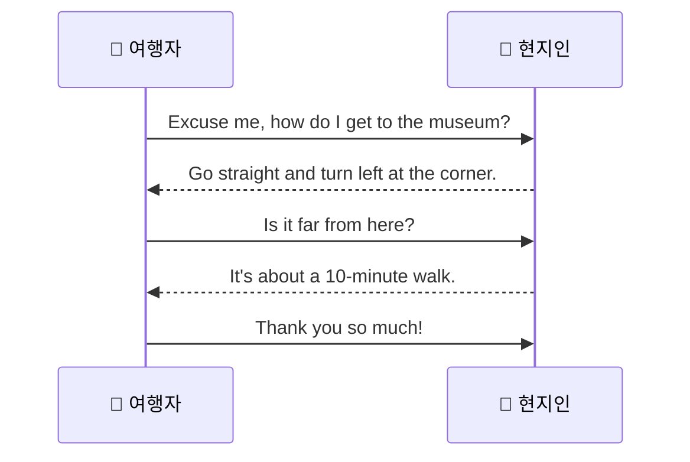

---

## 📸 관광지 (Sightseeing)

### 📋 관광 필수 표현 (패턴 45~47)

| No. | 상황 | 영어 표현 | 한국어 뜻 |
|:---:|------|----------|----------|
| 45 | 입장권 | Two tickets, please. | 티켓 2장 주세요. |
| 46 | 사진 부탁 | Could you take a picture of us? | 사진 찍어주시겠어요? |
| 47 | 정보 문의 | What time does it close? | 몇 시에 문 닫나요? |

### 📷 사진 요청 상세

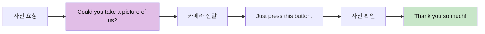

---

## 🚨 긴급 상황 (Emergency)

### 긴급 상황 대응도

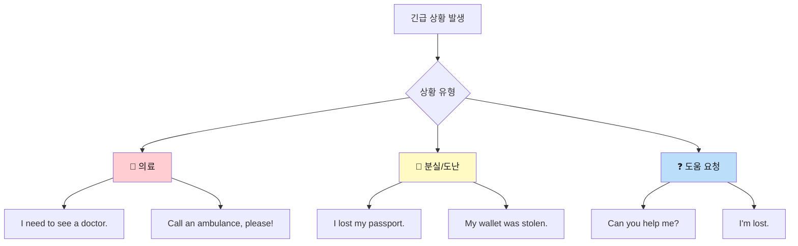

### 📋 긴급 상황 표현 (패턴 48~50)

| No. | 상황 | 영어 표현 | 한국어 뜻 | 중요도 |
|:---:|------|----------|----------|:------:|
| 48 | 도움 요청 | Can you help me, please? | 도와주시겠어요? | ⭐⭐⭐ |
| 49 | 분실 | I lost my passport. | 여권을 잃어버렸어요. | ⭐⭐⭐ |
| 50 | 의료 | I need to see a doctor. | 의사를 봐야 해요. | ⭐⭐⭐ |

### 🏥 의료 관련 추가 표현

| 상황 | 영어 표현 |
|------|----------|
| 약국 찾기 | Where is the nearest pharmacy? |
| 증상 설명 | I have a headache / stomachache. |
| 알레르기 | I'm allergic to penicillin. |
| 보험 | I have travel insurance. |

---

## 📊 전체 패턴 요약

### 상황별 패턴 분포

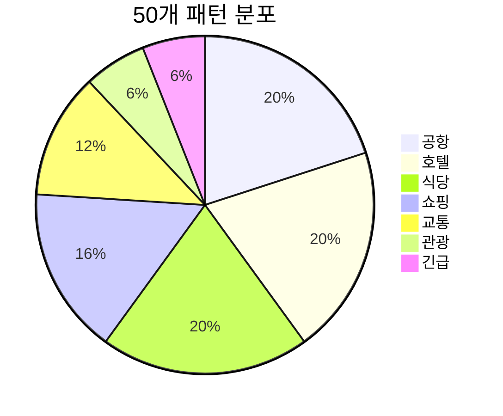

### 🎯 가장 많이 쓰이는 핵심 패턴 TOP 5

| 순위 | 패턴 | 사용 빈도 | 활용 예시 |
|:---:|------|:--------:|----------|
| 1 | Could you...? | ⭐⭐⭐⭐⭐ | Could you help me? |
| 2 | I'd like to... | ⭐⭐⭐⭐⭐ | I'd like to check in. |
| 3 | Where is...? | ⭐⭐⭐⭐ | Where is the bathroom? |
| 4 | How much...? | ⭐⭐⭐⭐ | How much is this? |
| 5 | Can I have...? | ⭐⭐⭐⭐ | Can I have the menu? |

---

## 💡 학습 팁

### 효과적인 암기법

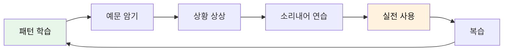

### 📌 기억해야 할 핵심 포인트

1. **"Please"** 를 붙이면 더 공손해집니다
2. **"Could you"** 는 **"Can you"** 보다 정중합니다
3. **"Excuse me"** 로 대화를 시작하세요
4. 모르면 **"Sorry?"** 또는 **"Pardon?"** 으로 다시 물어보세요
5. **"Thank you"** 는 항상 잊지 마세요!

---

*Last Updated: 2026-01-10*

