# ✈️ 여행 영어 회화 완벽 가이드
## 15가지 상황별 대화 & 레벨별 패턴 + 현대 표현

---

## 📋 목차
1. [학습 구조 개요](#학습-구조-개요)
2. [줄임말 & 현대 표현 마스터](#줄임말--현대-표현-마스터)
3. [공항 체크인](#1-공항-체크인-airport-check-in)
4. [기내 서비스](#2-기내-서비스-in-flight)
5. [입국 심사](#3-입국-심사-immigration)
6. [호텔](#4-호텔-hotel)
7. [식당](#5-식당-restaurant)
8. [카페](#6-카페-cafe)
9. [쇼핑](#7-쇼핑-shopping)
10. [교통 (택시/우버)](#8-교통-taxi--uber)
11. [관광지](#9-관광지-sightseeing)
12. [주유소](#10-주유소-gas-station)
13. [약국](#11-약국-pharmacy)
14. [편의점](#12-편의점-convenience-store)
15. [은행/환전소](#13-은행환전소-bankcurrency-exchange)
16. [미용실](#14-미용실-hair-salon)
17. [긴급상황](#15-긴급상황-emergency)

---

## 학습 구조 개요

### 전체 학습 흐름도

```mermaid
flowchart TB
    subgraph 레벨["📊 레벨 구조"]
        L1["🌱 초급<br/>기본 패턴"]
        L2["🌿 중급<br/>확장 패턴"]
        L3["🌳 고급<br/>네이티브 패턴"]
        L4["💬 현대<br/>줄임말 & 슬랭"]
    end
    
    subgraph 상황["🎯 15가지 상황"]
        direction LR
        S1[공항/기내] --> S2[입국/호텔]
        S2 --> S3[식당/카페]
        S3 --> S4[쇼핑/교통]
        S4 --> S5[일상생활]
    end
    
    레벨 --> 상황
```

### 레벨별 특징

| 레벨 | 특징 | 문장 구조 | 목표 |
|:---:|------|----------|------|
| 🌱 초급 | 짧고 단순한 문장 | 주어 + 동사 + 목적어 | 기본 의사소통 |
| 🌿 중급 | 정중하고 완성된 문장 | 조동사 + 부가 표현 | 자연스러운 대화 |
| 🌳 고급 | 관용적이고 세련된 표현 | 복합 문장 + 뉘앙스 | 네이티브처럼 |
| 💬 현대 | 줄임말, 캐주얼 표현 | 일상 회화체 | 친근한 소통 |

---

## 줄임말 & 현대 표현 마스터

### 🗣️ 필수 줄임말 (Contractions)

```mermaid
mindmap
  root((줄임말))
    gonna
      going to
      "I'm gonna go"
    wanna
      want to
      "I wanna try this"
    gotta
      got to / have to
      "I gotta run"
    kinda
      kind of
      "It's kinda expensive"
    lemme
      let me
      "Lemme check"
    gimme
      give me
      "Gimme a sec"
    dunno
      don't know
      "I dunno"
    y'all
      you all
      "Y'all ready?"
```

### 📊 줄임말 비교표

| 정식 표현 | 줄임말 | 발음 | 예문 |
|----------|-------|------|------|
| going to | gonna | 거나 | I'm gonna grab a coffee. |
| want to | wanna | 워나 | I wanna check out now. |
| got to / have to | gotta | 가타 | I gotta catch my flight. |
| kind of | kinda | 카인다 | It's kinda far from here. |
| let me | lemme | 레미 | Lemme see the menu. |
| give me | gimme | 기미 | Gimme a minute. |
| don't know | dunno | 더노 | I dunno where it is. |
| you all | y'all | 얄 | Y'all have a good one! |
| because | 'cause / cuz | 커즈 | I'm late 'cause of traffic. |
| probably | prob'ly | 프라블리 | It'll prob'ly take 20 mins. |

### 🔥 현대 필수 표현 TOP 20

| 표현 | 의미 | 사용 상황 | 예문 |
|------|------|----------|------|
| **No worries** | 괜찮아요 / 천만에요 | 감사, 사과에 대한 응답 | "Thanks!" - "No worries!" |
| **My bad** | 내 잘못이야 | 가벼운 실수 시 | "Oops, my bad!" |
| **You're good** | 괜찮아요 | 상대방 안심시킬 때 | "Am I in your way?" - "You're good." |
| **I'm good** | 괜찮아요 / 됐어요 | 거절할 때 | "Want some more?" - "I'm good, thanks." |
| **For sure** | 물론이죠 / 당연하죠 | 동의할 때 | "Can you help?" - "For sure!" |
| **Sounds good** | 좋아요 | 제안 수락 | "Meet at 7?" - "Sounds good!" |
| **Got it** | 알겠어요 | 이해했을 때 | "Turn left at the corner." - "Got it." |
| **That works** | 그게 좋겠네요 | 제안 수락 | "How about tomorrow?" - "That works." |
| **All set** | 준비 완료 | 다 됐을 때 | "You're all set!" |
| **Perfect** | 완벽해요 | 만족할 때 | "Here's your order." - "Perfect!" |
| **No prob** | 문제없어요 | 부탁 수락 | "Could you...?" - "No prob!" |
| **Sure thing** | 물론이죠 | 동의/수락 | "Can I get more water?" - "Sure thing!" |
| **You bet** | 물론이죠 | 강한 동의 | "Will you be there?" - "You bet!" |
| **Sweet** | 좋아 / 멋져 | 기쁠 때 | "It's 50% off!" - "Sweet!" |
| **Awesome** | 대단해 / 좋아 | 긍정 반응 | "Awesome, thanks!" |
| **Hang on** | 잠깐만요 | 기다려달라고 할 때 | "Hang on a sec." |
| **What's up?** | 무슨 일이야? / 안녕 | 인사 | "Hey, what's up?" |
| **I feel you** | 이해해 / 공감해 | 공감할 때 | "I'm so tired." - "I feel you." |
| **Same here** | 나도 마찬가지 | 동의할 때 | "I love this place!" - "Same here!" |
| **Totally** | 완전히 / 정말 | 강조할 때 | "Totally agree!" |

### 💬 상황별 현대 표현

```mermaid
flowchart LR
    subgraph 동의["👍 동의"]
        A1["For sure"]
        A2["Totally"]
        A3["You bet"]
        A4["100%"]
    end
    
    subgraph 거절["👎 거절"]
        B1["I'm good"]
        B2["I'll pass"]
        B3["Nah, I'm okay"]
        B4["Maybe next time"]
    end
    
    subgraph 감사["🙏 감사"]
        C1["Thanks a bunch"]
        C2["Appreciate it"]
        C3["You're the best"]
        C4["Cheers"]
    end
    
    subgraph 응답["💬 응답"]
        D1["No worries"]
        D2["No prob"]
        D3["Anytime"]
        D4["You got it"]
    end
```

---

## 1. 공항 체크인 (Airport Check-in)

### 🎯 상황 의도 & 목적 마인드맵

```mermaid
mindmap
  root((공항 체크인))
    목적
      여행 시작
      탑승권 받기
      짐 맡기기
      좌석 확보
    준비사항
      여권
      예약 확인서
      수하물
      신용카드
    주의점
      무게 제한
      위험물 확인
      시간 여유
      게이트 확인
    기대결과
      탑승권 획득
      좌석 배정
      짐 접수 완료
      게이트 정보
```

### 📊 상황 흐름도

```mermaid
flowchart LR
    A[카운터 도착] --> B[예약 확인]
    B --> C[여권 제시]
    C --> D[좌석 선택]
    D --> E[수하물 접수]
    E --> F[탑승권 수령]
    F --> G[게이트 확인]
    
    style A fill:#e3f2fd
    style D fill:#fff3e0
    style G fill:#e8f5e9
```

### 📝 핵심 단어 & 표현

| 카테고리 | 영어 | 한국어 | 중요도 |
|---------|------|--------|--------|
| **기본** | check in | 체크인하다 | ⭐⭐⭐ |
| | passport | 여권 | ⭐⭐⭐ |
| | boarding pass | 탑승권 | ⭐⭐⭐ |
| | confirmation | 예약 확인 | ⭐⭐⭐ |
| **좌석** | window seat | 창가 좌석 | ⭐⭐ |
| | aisle seat | 복도 좌석 | ⭐⭐ |
| | seat assignment | 좌석 배정 | ⭐⭐ |
| **수하물** | baggage / luggage | 수하물 | ⭐⭐⭐ |
| | check a bag | 짐을 맡기다 | ⭐⭐⭐ |
| | overweight | 무게 초과 | ⭐⭐ |
| | carry-on | 기내 수하물 | ⭐⭐ |
| **정보** | gate | 게이트 | ⭐⭐⭐ |
| | boarding time | 탑승 시간 | ⭐⭐⭐ |
| | flight number | 비행편 번호 | ⭐⭐ |
| | destination | 목적지 | ⭐⭐ |

### ⭐ 필수 암기 문장 (자주 사용)

| 상황 | 영어 표현 | 한국어 |
|------|----------|--------|
| 체크인 시작 | ⭐ **I'd like to check in, please.** | 체크인하고 싶습니다 |
| | ⭐ **I'm gonna check in for my flight.** | 비행기 체크인할게요 |
| 좌석 요청 | ⭐ **Can I get a window seat?** | 창가 좌석 받을 수 있어요? |
| | ⭐ **Any chance I could get an aisle?** | 혹시 복도 쪽 받을 수 있을까요? |
| 짐 관련 | ⭐ **Just this one bag.** | 이 가방 하나만요 |
| | ⭐ **Is it within the weight limit?** | 무게 제한 안에 드나요? |
| 정보 확인 | ⭐ **What gate am I at?** | 제 게이트가 어디예요? |
| | ⭐ **What time does boarding start?** | 탑승은 몇 시에 시작해요? |
| 감사 표현 | ⭐ **Thanks a bunch!** | 정말 감사해요! |
| | ⭐ **Appreciate your help!** | 도움 감사해요! |

### 💬 대화 시나리오 A: 일반 체크인

#### 🌱 초급 + 💬 현대 표현

| 턴 | 👤 승객 | 🇰🇷 한국어 (승객) | 👩‍✈️ 직원 | 🇰🇷 한국어 (직원) |
|:---:|--------|----------------|----------|----------------|
| 1 | Hey, check in please? | 안녕하세요, 체크인 할게요? | Hey! Passport? | 안녕하세요! 여권 주세요? |
| 2 | Here you go. | 여기요. | Cool. Flying to LA? | 좋아요. LA 가시나요? |
| 3 | Yep! | 네! | Window or aisle? | 창가 아니면 복도? |
| 4 | Window's good. | 창가 좋아요. | Got it. Any bags? | 알겠습니다. 맡길 짐 있어요? |
| 5 | Yeah, one. | 네, 하나요. | Pop it on the scale. | 저울에 올려주세요. |
| 6 | Is it okay? | 괜찮아요? | You're good. 20 kilos. | 괜찮아요. 20킬로요. |
| 7 | Sweet! | 좋아요! | Here's your boarding pass. | 여기 탑승권이요. |
| 8 | What gate? | 게이트 몇 번이에요? | Gate 22. It's that way. | 22번 게이트요. 저쪽이에요. |
| 9 | Thanks a bunch! | 정말 감사해요! | No prob! Have a good flight! | 천만에요! 좋은 비행 되세요! |
| 10 | You too... I mean, thanks! 😅 | 당신도요... 아니 감사해요! 😅 | Haha, you're good! | 하하, 괜찮아요! |
| 11 | Oh, one more thing. Boarding time? | 아, 한 가지 더요. 탑승 시간은요? | Starts at 10:15. Don't be late! | 10시 15분에 시작해요. 늦지 마세요! |
| 12 | Got it. Any food places nearby? | 알겠어요. 근처에 식당 있어요? | Yeah, tons! Past security. | 네, 많아요! 보안검색 지나서요. |
| 13 | Cool. Is security usually busy? | 좋아요. 보안검색 보통 붐비나요? | Kinda. Maybe 20-30 mins wait. | 좀요. 아마 20-30분 정도 기다릴 거예요. |
| 14 | I got time. Thanks! | 시간 있어요. 감사해요! | No worries! Oh, check gate changes. | 천만에요! 아, 게이트 변경 확인하세요. |
| 15 | Where do I check? | 어디서 확인해요? | The screens or our app. | 화면이나 저희 앱에서요. |
| 16 | I'll download the app now. | 지금 앱 다운받을게요. | Smart! You'll get updates too. | 좋아요! 업데이트도 받을 거예요. |
| 17 | Perfect. WiFi password? | 완벽해요. 와이파이 비밀번호는요? | It's "AIRPORT2026" - all caps. | "AIRPORT2026"이에요 - 대문자로요. |
| 18 | Awesome, got it! | 좋아요, 알겠어요! | Anything else I can help with? | 다른 도와드릴 거 있어요? |
| 19 | Nope, I'm all set. Thanks so much! | 아뇨, 다 됐어요. 정말 감사해요! | You're welcome! Safe travels! | 천만에요! 안전한 여행 되세요! |
| 20 | Thanks! Have a great day! | 감사해요! 좋은 하루 되세요! | You too! Enjoy LA! | 당신도요! LA 즐기세요! |

#### 🌿 중급 + 💬 현대 표현

| 턴 | 👤 승객 | 🇰🇷 한국어 (승객) | 👩‍✈️ 직원 | 🇰🇷 한국어 (직원) |
|:---:|--------|----------------|----------|----------------|
| 1 | Hi there! I'm gonna check in for my LA flight. | 안녕하세요! LA 비행기 체크인할게요. | Hey! Sure thing. Passport and confirmation? | 안녕하세요! 물론이죠. 여권하고 예약 확인서 주세요? |
| 2 | Here you go. The booking's under Kim. | 여기요. 예약은 Kim으로 되어있어요. | Perfect, got it right here. | 완벽해요, 여기 있네요. |
| 3 | Any chance I could get a window seat? | 혹시 창가 좌석 받을 수 있을까요? | Lemme check... Yeah, 14A works? | 확인해 볼게요... 네, 14A 괜찮아요? |
| 4 | That works! Is it near the front? | 좋아요! 앞쪽인가요? | Kinda in the middle. Best I got. | 중간쯤이요. 제가 드릴 수 있는 최선이에요. |
| 5 | No worries, I'll take it. | 괜찮아요, 그걸로 할게요. | Awesome. Checking any bags? | 좋아요. 맡길 짐 있어요? |
| 6 | Just this one. Hopefully it's not overweight! | 이것만요. 무게 초과 안 됐으면 좋겠네요! | You're good - 21 kilos. Limit's 23. | 괜찮아요 - 21킬로요. 한도가 23이에요. |
| 7 | Phew! What time's boarding? | 휴! 탑승 시간이 언제에요? | Starts at 10:30. Don't be late! | 10시 30분에 시작해요. 늦지 마세요! |
| 8 | Got it. Is there a lounge I can use? | 알겠어요. 이용할 수 있는 라운지 있어요? | Yeah, there's one on level 3. Show your pass. | 네, 3층에 있어요. 탑승권 보여주세요. |
| 9 | Sweet, appreciate it! | 좋아요, 감사해요! | You bet! Have a safe trip! | 물론이죠! 안전한 여행 되세요! |
| 10 | Thanks! Y'all have been super helpful! | 감사해요! 정말 도움 많이 주셨어요! | Aww, thanks! Safe travels! | 어머, 감사해요! 안전한 여행 되세요! |
| 11 | Oh, before I go - meal preferences? | 아, 가기 전에 - 기내식 선호 있어요? | Lemme add that. Vegetarian? Halal? | 추가할게요. 채식? 할랄? |
| 12 | Actually, do you have Korean meals? | 사실, 한국 식사 있어요? | Let me check... Yes! I can request one. | 확인해볼게요... 네! 요청할 수 있어요. |
| 13 | That'd be amazing! | 그거 정말 좋겠어요! | Done! It'll be on the flight. | 완료! 비행기에 있을 거예요. |
| 14 | You're the best. What about drinks? | 최고세요. 음료는요? | All included. Beer, wine, soft drinks. | 다 포함이요. 맥주, 와인, 소프트드링크. |
| 15 | Nice! Long flight, so that helps. | 좋아요! 긴 비행이라 도움 되네요. | Totally! Oh, want an exit row? | 완전요! 아, 비상구 열 원하세요? |
| 16 | Is there extra space? | 공간이 더 있어요? | Way more legroom. But you gotta help in emergencies. | 다리 공간이 훨씬 많아요. 하지만 비상시 도와야 해요. |
| 17 | I can do that. Let's switch! | 할 수 있어요. 바꿔요! | Perfect! You're now in 14F. | 완벽해요! 이제 14F예요. |
| 18 | Even better! Thanks for thinking of it. | 더 좋네요! 생각해 주셔서 감사해요. | No prob! Wanna pre-order duty free? | 천만에요! 면세품 미리 주문할래요? |
| 19 | Nah, I'll browse on the plane. | 아뇨, 비행기에서 볼게요. | Sounds good! Here's everything. Enjoy! | 좋아요! 여기 다 있어요. 즐기세요! |
| 20 | Thank you so much! You made this easy! | 정말 감사해요! 쉽게 만들어 주셨어요! | That's what we're here for! Have fun in LA! | 그게 저희 일이죠! LA에서 즐기세요! |

### 💬 대화 시나리오 B: 문제 상황 (오버부킹/지연)

| 턴 | 👤 승객 | 🇰🇷 한국어 (승객) | 👩‍✈️ 직원 | 🇰🇷 한국어 (직원) |
|:---:|--------|----------------|----------|----------------|
| 1 | Hey, I'm here for the 3 PM flight to NYC. | 안녕하세요, 뉴욕 가는 3시 비행기요. | Hi! Lemme pull that up... Oh no. | 안녕하세요! 찾아볼게요... 이런. |
| 2 | Uh oh. What's wrong? | 어머. 무슨 일이에요? | So, the flight's been delayed. | 그러니까, 비행기가 지연됐어요. |
| 3 | Seriously? For how long? | 진짜요? 얼마나요? | Looks like 2 hours. Sorry about that. | 2시간 같아요. 죄송해요. |
| 4 | Ugh, that sucks. Any reason? | 으, 짜증나네요. 이유가 뭐에요? | Weather issues in New York, apparently. | 뉴욕 날씨 문제래요. |
| 5 | Is there an earlier flight I can catch? | 더 이른 비행기 탈 수 있어요? | Lemme check... There's one at 4, but it's full. | 확인해볼게요... 4시 있는데, 만석이에요. |
| 6 | Can you put me on standby? | 대기 명단에 넣어주실 수 있어요? | For sure. I'll add you to the list. | 물론이죠. 명단에 추가할게요. |
| 7 | What are my chances? | 가능성이 어때요? | Pretty good, actually. Usually some no-shows. | 꽤 좋아요, 사실. 보통 안 오는 사람들 있어요. |
| 8 | Cool. Is there somewhere I can grab food? | 좋아요. 먹을 거 살 데 있어요? | Yeah, there's a food court past security. | 네, 보안검색 지나서 푸드코트 있어요. |
| 9 | Alright. You'll call me if something opens up? | 알겠어요. 자리 나면 전화 주실 거죠? | Definitely. What's your cell? | 확실히요. 전화번호가 어떻게 되세요? |
| 10 | 555-1234. Thanks for your help! | 555-1234요. 도와주셔서 감사해요! | No prob! Fingers crossed! 🤞 | 천만에요! 행운을 빌어요! 🤞 |
| 11 | Should I stay near the gate? | 게이트 근처에 있어야 해요? | Yeah, stay within earshot. I'll announce it too. | 네, 들을 수 있는 거리에 있으세요. 방송도 할게요. |
| 12 | Got it. What if I don't make it on? | 알겠어요. 못 타면 어떻게 해요? | Your original flight's still confirmed. | 원래 비행기는 여전히 확정이에요. |
| 13 | Okay, so I'm covered either way. | 알겠어요, 그럼 어느 쪽이든 괜찮네요. | Exactly. And we'll comp you a meal voucher. | 정확해요. 그리고 식사 바우처 드릴게요. |
| 14 | Oh really? How much? | 오 진짜요? 얼마어치요? | $15. Works at most places here. | 15달러요. 여기 대부분 장소에서 써요. |
| 15 | That's nice of you guys! | 친절하시네요! | Least we can do for the inconvenience. | 불편에 대한 최소한의 보상이에요. |
| 16 | Can I use the lounge while I wait? | 기다리는 동안 라운지 써도 돼요? | Hmm, not with economy. But seating area's comfy. | 음, 이코노미로는 안 돼요. 하지만 대기 공간은 편해요. |
| 17 | Fair enough. WiFi available? | 충분해요. 와이파이 돼요? | Yep! Free for 2 hours, then $5. | 네! 2시간 무료, 그 다음엔 5달러요. |
| 18 | Perfect. I'll just work then. | 완벽해요. 그럼 일이나 할게요. | Smart! Here's the voucher and my card. | 좋아요! 여기 바우처랑 제 명함이요. |
| 19 | Call directly if needed? | 필요하면 직접 전화할까요? | Yeah! I'm here till 6. Good luck! | 네! 6시까지 있어요. 행운을 빌어요! |
| 20 | Thanks! Hoping for that 4 PM flight! | 감사해요! 4시 비행기 타길 바래요! | Me too! I'll do my best! | 저도요! 최선을 다할게요! |

### 💬 대화 시나리오 C: 업그레이드 요청

| 턴 | 👤 승객 | 🇰🇷 한국어 (승객) | 👩‍✈️ 직원 | 🇰🇷 한국어 (직원) |
|:---:|--------|----------------|----------|----------------|
| 1 | Hi! Quick question - any upgrade deals today? | 안녕하세요! 간단한 질문인데 - 오늘 업그레이드 특가 있어요? | Hey! Let's see what we got. | 안녕하세요! 뭐가 있나 볼게요. |
| 2 | I'm kinda hoping for business class. | 비즈니스석 바라고 있는데요. | Hmm, it's pretty full today. | 음, 오늘 꽤 찼어요. |
| 3 | Dang. Worth a shot though, right? | 아쉽네요. 그래도 물어볼 만하죠? | Totally! Actually, wait... | 완전요! 사실, 잠깐... |
| 4 | Yeah? | 네? | There might be one seat left. Lemme check. | 자리 하나 남았을 수도 있어요. 확인해볼게요. |
| 5 | No way! How much extra? | 설마! 추가 비용이 얼마에요? | It'd be $350 for the upgrade. | 업그레이드에 350달러요. |
| 6 | Ooh, that's kinda steep. | 우, 좀 비싸네요. | I feel you. It's a 10-hour flight though. | 이해해요. 그래도 10시간 비행이에요. |
| 7 | You make a good point... Okay, I'll do it. | 좋은 지적이네요... 좋아요, 할게요. | Awesome! You're gonna love it. | 멋져요! 마음에 드실 거예요. |
| 8 | Does it come with lounge access? | 라운지 이용 포함이에요? | Yep! And priority boarding. | 네! 그리고 우선 탑승도요. |
| 9 | Sweet! Best decision ever. | 좋아요! 최고의 결정이네요. | Ha! You won't regret it. | 하! 후회 안 하실 거예요. |
| 10 | Thanks so much! You're the best! | 정말 감사해요! 최고세요! | Anytime! Enjoy the flight! | 언제든지요! 비행 즐기세요! |
| 11 | What's different in business class? | 비즈니스석은 뭐가 달라요? | Lie-flat seats, way better food, premium drinks. | 완전히 누울 수 있는 좌석, 훨씬 좋은 음식, 프리미엄 음료. |
| 12 | Lie-flat? That's amazing for sleeping! | 완전히 눕는다고요? 잠자기 완벽하네요! | Exactly! Plus noise-canceling headphones. | 정확해요! 게다가 노이즈 캔슬링 헤드폰도. |
| 13 | This keeps getting better! | 계속 좋아지네요! | Oh, and amenity kit with pajamas. | 아, 그리고 파자마 들어있는 어메니티 키트. |
| 14 | Pajamas on a flight?! I'm sold! | 비행기에서 파자마라니?! 완전 마음에 들어요! | Ha! Yeah, you can actually sleep comfortably. | 하! 네, 정말 편하게 잘 수 있어요. |
| 15 | How's the meal service different? | 식사 서비스는 어떻게 달라요? | Multi-course, real silverware, menu choices. | 여러 코스, 진짜 수저, 메뉴 선택. |
| 16 | Stop, you're making me too excited! | 그만해요, 너무 설레게 하잖아요! | Wait till you try the seats! They're huge. | 좌석 써보실 때까지 기다려요! 엄청 커요. |
| 17 | I usually can't sleep on planes. | 보통 비행기에서 잠 못 자는데요. | This'll change that. Trust me. | 이게 그걸 바꿀 거예요. 믿으세요. |
| 18 | Okay, process the upgrade! | 좋아요, 업그레이드 진행해요! | Done! You're in seat 2K. Window, front cabin. | 완료! 2K 좌석이에요. 창가, 앞쪽 객실. |
| 19 | 2K... that sounds fancy! | 2K... 멋지게 들리네요! | It is! You'll love it. Here's your new boarding pass. | 맞아요! 마음에 드실 거예요. 여기 새 탑승권이요. |
| 20 | This is gonna be the best flight ever! Thanks! | 최고의 비행이 될 거예요! 감사해요! | Enjoy every minute! You deserve it! | 매 순간 즐기세요! 충분히 받을 자격 있어요! |

### 💬 대화 시나리오 D: 온라인 체크인 후 수하물만 맡기기

| 턴 | 👤 승객 | 🇰🇷 한국어 (승객) | 👩‍✈️ 직원 | 🇰🇷 한국어 (직원) |
|:---:|--------|----------------|----------|----------------|
| 1 | Hi! I checked in online already. | 안녕하세요! 이미 온라인 체크인했어요. | ⭐ **Great! Just dropping off bags?** | 좋아요! 짐만 맡기는 거예요? |
| 2 | ⭐ **Yep, just this one.** | 네, 이것만요. | Perfect! Passport and boarding pass? | 완벽해요! 여권이랑 탑승권 있어요? |
| 3 | Here they are. | 여기요. | Thanks! Your seat is 12A, correct? | 감사해요! 좌석은 12A 맞죠? |
| 4 | ⭐ **That's right!** | 맞아요! | Cool. Let's get this bag tagged. | 좋아요. 이 가방에 태그 달게요. |
| 5 | How heavy is it? | 얼마나 무거워요? | ⭐ **21 kilos. You're good!** | 21킬로요. 괜찮아요! |
| 6 | Phew! I was worried. | 휴! 걱정했어요. | Nah, you got 2 kilos to spare. | 아뇨, 2킬로 여유 있어요. |
| 7 | ⭐ **That's a relief!** | 안심이에요! | Ha! Did you pack it full? | 하! 꽉 채웠어요? |
| 8 | Yeah, souvenirs for everyone! | 네, 모두를 위한 기념품이요! | Nice! Your bag will go straight to LA. | 좋아요! 가방은 LA로 바로 갈 거예요. |
| 9 | ⭐ **No transfers needed?** | 환승 필요 없어요? | Nope! Direct flight, direct baggage. | 아뇨! 직항, 직송이에요. |
| 10 | Perfect! Gate's still 22? | 완벽해요! 게이트 아직 22번이에요? | Yep! Check the board though, just in case. | 네! 그래도 만약을 위해 게시판 확인하세요. |
| 11 | ⭐ **Good idea!** | 좋은 생각이에요! | Yeah, gates can change last minute. | 네, 게이트가 막판에 바뀔 수 있어요. |
| 12 | Has that happened today? | 오늘 그런 일 있었어요? | Once this morning, actually. | 사실 오늘 아침 한 번 있었어요. |
| 13 | Wow, good to know! | 와, 알아두면 좋네요! | Yeah! Always double-check. | 네! 항상 재확인하세요. |
| 14 | How early should I be at the gate? | 게이트에 얼마나 일찍 가야 해요? | ⭐ **30 minutes before boarding is safe.** | 탑승 30분 전이 안전해요. |
| 15 | So around 10? | 그럼 10시쯤이요? | Exactly! You got time to grab food. | 정확히요! 음식 사먹을 시간 있어요. |
| 16 | ⭐ **Any recommendations?** | 추천해주실 거 있어요? | The food court past security is pretty good. | 보안검색 지나서 푸드코트 꽤 좋아요. |
| 17 | Sweet! I'll check it out. | 좋아요! 확인해볼게요. | Do that! Here's your bag tag receipt. | 그러세요! 여기 가방 태그 영수증이요. |
| 18 | ⭐ **Keep this safe?** | 이거 안전하게 보관해요? | Yep! You'll need it to claim your bag. | 네! 가방 찾을 때 필요해요. |
| 19 | Got it! Thanks for everything! | 알겠어요! 모든 것에 감사해요! | ⭐ **You're all set! Have a great flight!** | 다 준비됐어요! 좋은 비행 되세요! |
| 20 | Thanks! You too... wait, you're not flying! 😅 | 감사해요! 당신도... 잠깐, 당신은 안 타잖아요! 😅 | Ha! I get that a lot! Safe travels! | 하! 많이 들어요! 안전한 여행 되세요! |

### 💬 대화 시나리오 E: 마일리지 업그레이드 요청

| 턴 | 👤 승객 | 🇰🇷 한국어 (승객) | 👩‍✈️ 직원 | 🇰🇷 한국어 (직원) |
|:---:|--------|----------------|----------|----------------|
| 1 | ⭐ **Hi! I'm a frequent flyer member.** | 안녕하세요! 저 상용 고객 회원이에요. | Great! Let me pull up your account. | 좋아요! 계정 찾아볼게요. |
| 2 | My number is FF123456. | 제 번호는 FF123456이에요. | Got it! Wow, you fly a lot! | 찾았어요! 와, 정말 많이 타시네요! |
| 3 | Yeah, work travel mostly. | 네, 주로 출장이요. | ⭐ **You're Gold status! Nice!** | 골드 등급이시네요! 멋져요! |
| 4 | ⭐ **Can I use miles for an upgrade?** | 마일리지로 업그레이드할 수 있어요? | Let me check availability... Yes! | 가능 여부 확인할게요... 네! |
| 5 | Really? That's awesome! | 진짜요? 대단해요! | Business class seat available. 25,000 miles. | 비즈니스석 자리 있어요. 25,000 마일이요. |
| 6 | ⭐ **I have 40,000. Let's do it!** | 40,000 있어요. 해요! | Perfect! Processing now... Done! | 완벽해요! 처리 중... 됐어요! |
| 7 | Just like that? | 그렇게 간단해요? | Yep! You're now in seat 2K. | 네! 이제 2K 좌석이에요. |
| 8 | ⭐ **2K... that's front of the cabin?** | 2K... 그거 앞쪽이에요? | Exactly! Best seat in business. | 정확히요! 비즈니스에서 최고 좌석이에요. |
| 9 | This is amazing! | 이거 대단한데요! | You earned it with all that flying! | 비행 많이 해서 받을 자격 있어요! |
| 10 | ⭐ **Do I get lounge access too?** | 라운지 이용도 돼요? | With Gold status and business? Absolutely! | 골드 등급에 비즈니스로요? 당연하죠! |
| 11 | Where's the lounge? | 라운지 어디예요? | ⭐ **Level 3, turn right after security.** | 3층, 보안검색 후 오른쪽이요. |
| 12 | Can I bring a guest? | 손님 데려갈 수 있어요? | As Gold, yes! One guest allowed. | 골드로는요, 네! 손님 한 명 가능해요. |
| 13 | Perfect! My friend's flying with me. | 완벽해요! 제 친구가 같이 타요. |  Lucky friend! | 운 좋은 친구네요! |
| 14 | Ha! They'll be excited! | 하! 친구가 흥분할 거예요! | I bet! Anything else? | 그럴 거예요! 다른 거 있어요? |
| 15 | ⭐ **What about priority boarding?** | 우선 탑승은요? | Already included! You're Zone 1. | 이미 포함이에요! 1번 구역이에요. |
| 16 | This keeps getting better! | 계속 더 좋아지네요! | Ha! That's what status is for! | 하! 그게 등급의 목적이죠! |
| 17 | How many miles will I earn on this flight? | 이 비행으로 마일 얼마나 받아요? | Let me check... 5,000 base plus bonuses. | 확인할게요... 기본 5,000에 보너스요. |
| 18 | ⭐ **Getting close to Platinum!** | 플래티넘에 가까워지네요! | Only 10,000 more! You'll hit it soon. | 10,000만 더요! 곧 될 거예요. |
| 19 | That's my goal! Thanks for everything! | 그게 제 목표예요! 모든 것에 감사해요! | ⭐ **Enjoy your flight! You deserve it!** | 비행 즐기세요! 받을 자격 있어요! |
| 20 | Best check-in ever! | 최고의 체크인이에요! | Ha! Have a great trip! | 하! 좋은 여행 되세요! |

### 💬 대화 시나리오 F: 특별 지원 요청 (휠체어)

| 턴 | 👤 승객 | 🇰🇷 한국어 (승객) | 👩‍✈️ 직원 | 🇰🇷 한국어 (직원) |
|:---:|--------|----------------|----------|----------------|
| 1 | ⭐ **Hi, I need wheelchair assistance.** | 안녕하세요, 휠체어 도움 필요해요. | Of course! Let me arrange that right away. | 물론이죠! 바로 준비할게요. |
| 2 | I can walk short distances, but... | 짧은 거리는 걸을 수 있는데요... | No worries! We'll help you to the gate. | 걱정 마세요! 게이트까지 도와드릴게요. |
| 3 | ⭐ **Thank you so much!** | 정말 감사해요! | It's what we're here for! Traveling alone? | 그게 우리 일이에요! 혼자 여행하세요? |
| 4 | Yes, but my son is meeting me in LA. | 네, 하지만 제 아들이 LA에서 만나요. | Great! Let me put a note for arrival assistance too. | 좋아요! 도착 지원도 메모할게요. |
| 5 | ⭐ **You can do that?** | 그렇게 할 수 있어요? | Absolutely! They'll have someone waiting. | 당연하죠! 누군가 기다리고 있을 거예요. |
| 6 | That's so helpful! | 정말 도움이 돼요! | We want to make it easy for you. | 편하게 만들고 싶어요. |
| 7 | How long till someone comes? | 누군가 오려면 얼마나 걸려요? | About 10 minutes. You can sit here. | 약 10분이요. 여기 앉으셔도 돼요. |
| 8 | ⭐ **Should I check my bag?** | 가방 맡겨야 해요? | We can gate-check it if you prefer. | 원하시면 게이트 체크할 수 있어요. |
| 9 | What's the difference? | 차이가 뭐예요? | Gate-check means you get it right when you land. | 게이트 체크는 착륙하자마자 받는다는 거예요. |
| 10 | ⭐ **That's perfect for me!** | 그게 저한테 완벽해요! | Thought so! I'll tag it for gate check. | 그럴 줄 알았어요! 게이트 체크로 태그 달게요. |
| 11 | Do I need to do anything special? | 특별히 해야 할 거 있어요? | Nope! Just wait by the jet bridge after landing. | 아뇨! 착륙 후 제트 브리지에서 기다리기만 하세요. |
| 12 | Easy enough! | 충분히 쉽네요! | Exactly! Here's your boarding pass. | 정확히요! 여기 탑승권이요. |
| 13 | ⭐ **Will I board early?** | 일찍 탑승해요? | Yes! We board passengers needing assistance first. | 네! 도움 필요한 승객을 먼저 탑승시켜요. |
| 14 | That's nice. Less crowded. | 좋네요. 덜 붐비죠. | Exactly! More comfortable for you. | 정확히요! 더 편할 거예요. |
| 15 | (도우미 도착) Oh, someone's here! | (도우미 도착) 오, 누군가 왔네요! | Perfect timing! This is James, he'll help you. | 완벽한 타이밍이에요! 제임스예요, 도와드릴 거예요. |
| 16 | ⭐ **Hi James! Thank you!** | 안녕하세요 제임스! 감사해요! | **[James]** No problem! Ready to go? | **[제임스]** 문제없어요! 갈 준비됐어요? |
| 17 | Yes! But can we stop by the restroom? | 네! 하지만 화장실 들를 수 있어요? | **[James]** Of course! There's one on the way. | **[제임스]** 물론이죠! 가는 길에 있어요. |
| 18 | ⭐ **You're both so kind!** | 둘 다 정말 친절하시네요! | We take care of our passengers! | 승객들을 돌봐드려요! |
| 19 | It shows! I feel very comfortable. | 티가 나요! 매우 편안해요. | That's what matters! Have a great flight! | 그게 중요하죠! 좋은 비행 되세요! |
| 20 | Thank you! You've made this so easy! | 감사해요! 정말 쉽게 만들어 주셨어요! | ⭐ **That's our job! Enjoy LA!** | 그게 우리 일이에요! LA 즐기세요! |

### 📋 공항 핵심 패턴 & 현대 표현

| 상황 | 정식 표현 | 💬 현대/캐주얼 표현 | 필수도 |
|------|----------|-------------------|--------|
| 체크인 | I'd like to check in. | ⭐ I'm gonna check in. / Check in please? | ⭐⭐⭐ |
| 좌석 요청 | Could I get a window seat? | ⭐ Any chance I could get a window? | ⭐⭐⭐ |
| 확인 | Is that acceptable? | ⭐ Is that cool? / That works? | ⭐⭐ |
| 무게 확인 | Is it within the limit? | ⭐ Am I good? / Is it okay? | ⭐⭐⭐ |
| 감사 | Thank you for your help. | ⭐ Thanks a bunch! / Appreciate it! | ⭐⭐⭐ |
| 응답 | You're welcome. | ⭐ No prob! / You bet! / Anytime! | ⭐⭐⭐ |

---

## 2. 기내 서비스 (In-Flight)

### 🎯 상황 의도 & 목적 마인드맵

```mermaid
mindmap
  root((기내 서비스))
    목적
      편안한 비행
      식사 해결
      필요물품 요청
      문제 해결
    준비사항
      좌석 번호
      이어폰
      책/태블릿
      목 베개
    주의점
      승무원 호출
      정중한 요청
      안전벨트
      타 승객 배려
    기대결과
      만족스런 서비스
      편안한 휴식
      즐거운 비행
      안전한 착륙
```

### 📊 상황 흐름도

```mermaid
flowchart TB
    subgraph 이륙전["🛫 이륙 전"]
        A1[자리 찾기] --> A2[짐 정리]
        A2 --> A3[안전벨트]
    end
    
    subgraph 비행중["✈️ 비행 중"]
        B1[음료 서비스] --> B2[기내식]
        B2 --> B3[개인 요청]
    end
    
    이륙전 --> 비행중
```

### 📝 핵심 단어 & 표현

| 카테고리 | 영어 | 한국어 | 중요도 |
|---------|------|--------|--------|
| **호출** | call button | 호출 버튼 | ⭐⭐⭐ |
| | flight attendant | 승무원 | ⭐⭐⭐ |
| | excuse me | 실례합니다 | ⭐⭐⭐ |
| **음료** | beverage | 음료 | ⭐⭐⭐ |
| | still water | 일반 물 | ⭐⭐ |
| | sparkling water | 탄산수 | ⭐⭐ |
| | ice | 얼음 | ⭐⭐ |
| **식사** | meal service | 식사 서비스 | ⭐⭐⭐ |
| | chicken or pasta | 치킨 아니면 파스타 | ⭐⭐ |
| | vegetarian meal | 채식 식사 | ⭐⭐ |
| | special meal | 특별식 | ⭐⭐ |
| **편의** | blanket | 담요 | ⭐⭐⭐ |
| | pillow | 베개 | ⭐⭐⭐ |
| | headphones | 헤드폰 | ⭐⭐ |
| | eye mask | 안대 | ⭐⭐ |
| **문제** | not working | 작동 안 함 | ⭐⭐⭐ |
| | broken | 고장남 | ⭐⭐ |
| | uncomfortable | 불편한 | ⭐⭐ |

### ⭐ 필수 암기 문장 (자주 사용)

| 상황 | 영어 표현 | 한국어 |
|------|----------|--------|
| 주문하기 | ⭐ **Could I get some water?** | 물 좀 받을 수 있을까요? |
| | ⭐ **I'll go with the chicken.** | 치킨으로 할게요 |
| | ⭐ **Can I have a Coke, please?** | 콜라 주실 수 있어요? |
| 요청하기 | ⭐ **Could I get a blanket?** | 담요 받을 수 있을까요? |
| | ⭐ **Do you have any extra pillows?** | 추가 베개 있으세요? |
| 문제 신고 | ⭐ **My screen isn't working.** | 제 화면이 안 돼요 |
| | ⭐ **The headphones are broken.** | 헤드폰이 고장났어요 |
| 감사 표현 | ⭐ **You're a lifesaver!** | 생명의 은인이에요! |
| | ⭐ **Thanks so much!** | 정말 감사해요! |
| 정중한 거절 | ⭐ **I'm good, thanks.** | 괜찮아요, 감사해요 |
| | ⭐ **I'm all set.** | 다 됐어요 |

### 💬 대화 시나리오 A: 음료 & 식사

| 턴 | 👤 승객 | 🇰🇷 한국어 (승객) | 👩‍✈️ 승무원 | 🇰🇷 한국어 (승무원) |
|:---:|--------|----------------|----------|----------------|
| 1 | Excuse me! | 저기요! | Yes? What can I get ya? | 네? 뭘 드릴까요? |
| 2 | What drinks do y'all have? | 음료 뭐 있어요? | We got Coke, Sprite, juice, beer, wine... | 콜라, 스프라이트, 주스, 맥주, 와인... |
| 3 | I'll take a Coke. | 콜라 주세요. | Ice? | 얼음요? |
| 4 | Yeah, lots of ice please. | 네, 얼음 많이 주세요. | You got it! | 알겠습니다! |
| 5 | Oh, and what's for dinner? | 아, 그리고 저녁은 뭐에요? | Chicken or pasta. The chicken's pretty good. | 치킨이나 파스타요. 치킨이 꽤 좋아요. |
| 6 | I'll go with the chicken then. | 그럼 치킨으로 할게요. | Smart choice! Anything else? | 좋은 선택이에요! 다른 거 있어요? |
| 7 | Actually, could I get some water too? | 사실, 물도 받을 수 있을까요? | Sure thing! Still or sparkling? | 물론이죠! 일반이요 탄산이요? |
| 8 | Still's fine. | 일반으로요. | Here you go! | 여기요! |
| 9 | Thanks! Oh, do you have any snacks? | 감사해요! 아, 간식 있어요? | Yeah! Chips, cookies, or nuts? | 네! 칩, 쿠키, 아니면 견과류? |
| 10 | Cookies sound good. Thanks so much! | 쿠키 좋네요. 정말 감사해요! | No worries! Enjoy! | 천만에요! 즐기세요! |
| 11 | When does dinner service start? | 저녁 서비스는 언제 시작해요? | In about 30 minutes. After takeoff. | 약 30분 후요. 이륙하고요. |
| 12 | Perfect. I'm getting hungry! | 완벽해요. 배고파지고 있어요! | I'll bring you the cookies now then! | 그럼 지금 쿠키 가져다 드릴게요! |
| 13 | You're an angel! Thank you! | 천사세요! 감사해요! | Ha! Just keeping you happy. | 하! 그냥 만족시켜 드리는 거죠. |
| 14 | Is there a menu I can look at? | 볼 수 있는 메뉴판 있어요? | Sure! Here. We also have special meals. | 물론이죠! 여기요. 특별식도 있어요. |
| 15 | Oh yeah? Like what? | 오 그래요? 어떤 거요? | Vegetarian, gluten-free, kids meals... | 채식, 글루텐프리, 어린이식... |
| 16 | The chicken is regular though? | 치킨은 일반식이죠? | Yep! With rice and veggies. | 네! 밥이랑 야채 같이요. |
| 17 | Sounds good. Can I change my mind later? | 좋네요. 나중에 마음 바꿀 수 있어요? | Sure, if we have extras! | 물론이죠, 여분이 있으면요! |
| 18 | Fair enough. What time's breakfast? | 충분해요. 아침은 몇 시에요? | About 2 hours before landing. 6 AM local. | 착륙 약 2시간 전이요. 현지시각 6시요. |
| 19 | I'll probably sleep through that. | 아마 자면서 놓칠 거예요. | Want me to wake you? | 깨워드릴까요? |
| 20 | Actually, yes please! That'd be great! | 사실, 네 부탁해요! 좋을 것 같아요! | No problem! I'll remember you. | 문제없어요! 기억할게요. |

### 💬 대화 시나리오 B: 문제 해결

| 턴 | 👤 승객 | 🇰🇷 한국어 (승객) | 👩‍✈️ 승무원 | 🇰🇷 한국어 (승무원) |
|:---:|--------|----------------|----------|----------------|
| 1 | Hey, sorry to bother you... | 저기요, 방해해서 죄송한데요... | No bother! What's up? | 괜찮아요! 무슨 일이에요? |
| 2 | My screen's not working. | 제 화면이 안 돼요. | Oh no! Lemme take a look. | 이런! 제가 봐볼게요. |
| 3 | I tried turning it off and on. | 껐다 켜봤는데요. | Hmm, it's totally dead. My bad, let me fix this. | 음, 완전히 죽었네요. 죄송해요, 해결할게요. |
| 4 | Is there another seat maybe? | 혹시 다른 좌석 있어요? | Actually, yeah! 23C is empty. | 사실, 네! 23C가 비었어요. |
| 5 | Sweet! Is that an aisle seat? | 좋아요! 그게 복도 쪽이에요? | Yep! Window's taken but aisle's free. | 네! 창가는 찼는데 복도는 비었어요. |
| 6 | That works. Can I move now? | 좋아요. 지금 옮겨도 돼요? | For sure! Need help with your stuff? | 물론이죠! 짐 도와드릴까요? |
| 7 | Nah, I'm good. Just got my backpack. | 아뇨, 괜찮아요. 백팩만 있어요. | Perfect. I'll bring your meal there. | 완벽해요. 식사는 거기로 가져다 드릴게요. |
| 8 | You're a lifesaver! | 생명의 은인이에요! | Haha, just doing my job! | 하하, 제 일 하는 거죠! |
| 9 | Seriously though, appreciate it. | 진심으로, 감사해요. | Anytime! Anything else you need? | 언제든지요! 다른 필요한 거 있어요? |
| 10 | I think I'm all set. Thanks! | 다 된 것 같아요. 감사해요! | Cool! Just press the call button if you need me. | 좋아요! 필요하면 호출 버튼 눌러요. |
| 11 | Actually, the headphones don't work either. | 사실, 헤드폰도 안 돼요. | Oh man! Here, take mine from the spare set. | 이런! 여기, 여분에서 제 거 쓰세요. |
| 12 | Are you sure? | 괜찮아요? | Totally! We got extras. | 완전히요! 여분 있어요. |
| 13 | These look brand new! | 새 거 같은데요! | They are! Premium ones too. Better sound. | 맞아요! 프리미엄 제품이에요. 소리도 더 좋아요. |
| 14 | Wow, this seat's way better actually. | 와우, 이 좌석이 훨씬 좋네요 사실. | Yeah? More space? | 그래요? 공간 더 있어요? |
| 15 | Way more legroom! | 다리 공간이 훨씬 많아요! | Oh nice! That's the premium economy section. | 오 좋아요! 거기가 프리미엄 이코노미 섹션이에요. |
| 16 | Wait, I didn't pay for this! | 잠깐, 이거 돈 안 냈는데요! | Don't worry about it! Your screen broke. | 걱정 마세요! 화면이 고장났잖아요. |
| 17 | This is like a free upgrade! | 무료 업그레이드 같은데요! | Ha! Accidental upgrade. Enjoy it! | 하! 우연한 업그레이드죠. 즐기세요! |
| 18 | Best malfunction ever! | 최고의 고장이네요! | Ha! That's one way to look at it! | 하! 그렇게 볼 수도 있네요! |
| 19 | I feel bad though... | 그래도 미안한데요... | Don't! We want you comfortable. | 마세요! 편하시길 바래요. |
| 20 | You guys are amazing. Thank you! | 정말 대단하세요. 감사해요! | Just doing our best! Settle in and relax! | 최선을 다하는 거죠! 편히 쉬세요! |

### 💬 대화 시나리오 C: 특별 요청

| 턴 | 👤 승객 | 🇰🇷 한국어 (승객) | 👩‍✈️ 승무원 | 🇰🇷 한국어 (승무원) |
|:---:|--------|----------------|----------|----------------|
| 1 | Hi! I hate to be that person, but... | 안녕하세요! 폐 끼치기 싫은데요... | Ha! Go ahead, what do you need? | 하! 괜찮아요, 뭐가 필요하세요? |
| 2 | I'm freezing. Got any blankets? | 너무 추워요. 담요 있어요? | Oh totally! Here's one. Want two? | 오 물론이죠! 여기 하나요. 두 개 드릴까요? |
| 3 | One's probably fine. Thanks! | 하나면 될 것 같아요. 감사해요! | No prob! Pillow too? | 천만에요! 베개도요? |
| 4 | Ooh, yes please! | 우, 네 부탁해요! | Coming right up. | 바로 가져올게요. |
| 5 | You guys are so nice on this airline. | 이 항공사 정말 친절하시네요. | Aww! We try! Long flight, right? | 어머! 노력해요! 긴 비행이죠? |
| 6 | Yeah, 12 hours. I'm gonna try to sleep. | 네, 12시간이요. 자려고요. | Good call. Want me to skip you for meals? | 좋은 생각이에요. 식사 건너뛸까요? |
| 7 | Actually yeah, that'd be great. | 사실 네, 좋을 것 같아요. | I'll put a note. Just flag me when you wake up. | 메모할게요. 깨면 불러주세요. |
| 8 | Will do. Oh! What time do we land? | 그럴게요. 아! 몇 시에 도착해요? | Around 8 AM local time. | 현지 시각으로 약 8시요. |
| 9 | Cool. And when do they turn lights off? | 좋아요. 그리고 불은 언제 꺼요? | In about an hour. Perfect timing for sleep! | 약 한 시간 후요. 자기 완벽한 타이밍이에요! |
| 10 | Awesome. Thanks for everything! | 좋아요. 모든 것에 감사해요! | Sleep well! 😊 | 잘 주무세요! 😊 |
| 11 | One more thing - eye mask? | 한 가지 더 - 안대 있어요? | Oh yeah! Let me grab you one. | 오 네! 하나 가져다 드릴게요. |
| 12 | And earplugs if you have them? | 귀마개도 있으면요? | Yep! Whole sleep kit coming up! | 네! 수면 키트 전체 드릴게요! |
| 13 | You're reading my mind! | 제 마음을 읽으시네요! | Ha! I know what travelers need. | 하! 여행자들이 뭐가 필요한지 알아요. |
| 14 | Is it usually hard to sleep on planes? | 보통 비행기에서 자기 힘들어요? | For most people, yeah. Noise and lights. | 대부분은요, 네. 소음이랑 불빛 때문에. |
| 15 | That's why I wanted all this stuff. | 그래서 이런 거 다 원한 거예요. | Smart! You'll sleep great now. | 똑똑하시네요! 이제 잘 잘 거예요. |
| 16 | Hope so. Flying makes me so tired. | 그러길요. 비행기 타면 너무 피곤해요. | I feel you. Try to relax. | 이해해요. 편히 쉬세요. |
| 17 | Will you really wake me for breakfast? | 진짜 아침 때 깨워줄 거죠? | Promise! I'll write your seat number down. | 약속해요! 좌석 번호 적어둘게요. |
| 18 | You're so organized! | 정말 체계적이시네요! | Gotta be! 300 passengers to take care of. | 그래야죠! 승객 300명 돌봐야 해요. |
| 19 | Wow, that's a lot of people! | 와, 사람 많네요! | Yep! But we got this. Rest up! | 네! 하지만 괜찮아요. 푹 쉬세요! |
| 20 | Thanks! You're the best! Goodnight! | 감사해요! 최고세요! 잘 자요! | Sweet dreams! I'll check on you later! | 좋은 꿈 꾸세요! 나중에 확인할게요! |

### 💬 대화 시나리오 D: 알레르기/특별식 요청

| 턴 | 👤 승객 | 🇰🇷 한국어 (승객) | 👩‍✈️ 승무원 | 🇰🇷 한국어 (승무원) |
|:---:|--------|----------------|----------|----------------|
| 1 | ⭐ **Excuse me, I have a food allergy.** | 실례합니다, 음식 알레르기가 있어요. | Oh! What are you allergic to? | 오! 뭐에 알레르기 있으세요? |
| 2 | Shellfish. I need to be really careful. | 갑각류요. 정말 조심해야 해요. | ⭐ **Absolutely! Let me check your meal.** | 당연하죠! 식사 확인할게요. |
| 3 | I pre-ordered a special meal. | 특별식을 미리 주문했어요. | Perfect! Let me find it... Here! Vegetarian? | 완벽해요! 찾아볼게요... 여기요! 채식이요? |
| 4 | ⭐ **Yes, that's mine!** | 네, 제 거예요! | Great! This is completely shellfish-free. | 좋아요! 이건 완전히 갑각류 없어요. |
| 5 | You're sure? | 확실해요? | ⭐ **100%. It's specially prepared.** | 100%. 특별히 준비된 거예요. |
| 6 | Thank you! That's such a relief. | 감사해요! 정말 안심이에요. | Of course! Your safety is our priority. | 물론이죠! 안전이 최우선이에요. |
| 7 | What about snacks later? | 나중에 간식은요? | Let me check the snacks... Pretzels are safe! | 간식 확인할게요... 프레첼은 안전해요! |
| 8 | ⭐ **Perfect! Can I have some now?** | 완벽해요! 지금 좀 받을 수 있어요? | Absolutely! Here you go. | 당연하죠! 여기요. |
| 9 | You guys are so careful! | 정말 조심스러우시네요! | We have to be! Many passengers have allergies. | 그래야 해요! 많은 승객이 알레르기 있어요. |
| 10 | ⭐ **It shows! I feel safe.** | 티가 나요! 안전하다고 느껴요. | That's what matters! Enjoy your meal! | 그게 중요하죠! 식사 즐기세요! |
| 11 | What if I need something during the flight? | 비행 중에 뭔가 필요하면요? | Just press the call button. I'll come right away. | 호출 버튼만 누르세요. 바로 갈게요. |
| 12 | ⭐ **You're so reassuring!** | 정말 안심이 돼요! | That's my job! Your comfort matters. | 그게 제 일이에요! 편안함이 중요해요. |
| 13 | Do other passengers know I have allergies? | 다른 승객들이 제 알레르기 알아요? | Only the crew. It's confidential. | 승무원들만요. 기밀이에요. |
| 14 | Good! I don't like making a fuss. | 좋아요! 소란 피우기 싫어요. | You're not! This is important. | 아니에요! 이건 중요해요. |
| 15 | ⭐ **Thanks for understanding!** | 이해해 주셔서 감사해요! | Always! Let me know if you need anything. | 항상요! 필요한 거 있으면 알려주세요. |
| 16 | Actually, can I see the ingredient list? | 사실, 성분 목록 볼 수 있어요? | ⭐ **Of course! Let me get that for you.** | 물론이죠! 가져다 드릴게요. |
| 17 | (확인 후) Perfect! Everything looks safe. | (확인 후) 완벽해요! 다 안전해 보여요. | Wonderful! Enjoy! | 훌륭해요! 즐기세요! |
| 18 | This is the best service I've had! | 최고의 서비스예요! | Aww, thank you! That means a lot! | 어머, 감사해요! 정말 의미 있어요! |
| 19 | ⭐ **I'll fly this airline again!** | 이 항공사 다시 탈 거예요! | We'd love to have you back! | 다시 모시고 싶어요! |
| 20 | Thanks for making me feel safe! | 안전하게 느끼게 해주셔서 감사해요! | ⭐ **That's what we're here for!** | 그게 우리가 여기 있는 이유예요! |

### 💬 대화 시나리오 E: 긴 비행 중 편의 요청

| 턴 | 👤 승객 | 🇰🇷 한국어 (승객) | 👩‍✈️ 승무원 | 🇰🇷 한국어 (승무원) |
|:---:|--------|----------------|----------|----------------|
| 1 | ⭐ **Excuse me, this is a 14-hour flight, right?** | 실례합니다, 14시간 비행 맞죠? | Yep! Long one. Need something? | 네! 긴 거죠. 뭔가 필요해요? |
| 2 | I'm trying to sleep the whole way. | 내내 자려고요. | ⭐ **Smart! Let me help with that.** | 똑똑하시네요! 도와드릴게요. |
| 3 | What do you recommend? | 뭘 추천하세요? | Blanket, pillow, eye mask, earplugs? | 담요, 베개, 안대, 귀마개요? |
| 4 | ⭐ **All of that sounds perfect!** | 다 완벽하게 들려요! | Ha! I'll get you the sleep kit! | 하! 수면 키트 드릴게요! |
| 5 | There's a sleep kit? | 수면 키트 있어요? | Yep! We have them for long flights. | 네! 장거리 비행용으로 있어요. |
| 6 | ⭐ **This airline thinks of everything!** | 이 항공사는 모든 걸 생각하네요! | We try! Here you go. | 노력해요! 여기요. |
| 7 | Should I skip all meals? | 식사 다 건너뛸까요? | ⭐ **I can wake you for breakfast before landing.** | 착륙 전 아침에 깨워드릴 수 있어요. |
| 8 | That'd be perfect! | 완벽하겠네요! | No problem! I'll make a note. | 문제없어요! 메모할게요. |
| 9 | What if I wake up and need something? | 깨서 뭔가 필요하면요? | Just press the call button. We're here 24/7. | 호출 버튼 누르세요. 24시간 있어요. |
| 10 | ⭐ **You guys never sleep?** | 당신들은 안 자요? | Ha! We take turns. Someone's always awake. | 하! 교대로요. 항상 누군가 깨어있어요. |
| 11 | That must be exhausting! | 피곤하겠어요! | Part of the job! We're used to it. | 일의 일부예요! 익숙해요. |
| 12 | ⭐ **I appreciate you all so much!** | 정말 감사해요! | Aww! That's sweet! Get some rest now. | 어머! 다정하시네요! 이제 쉬세요. |
| 13 | One more thing - is it okay to recline? | 한 가지 더 - 리클라인해도 돼요? | Let me check behind you... Yeah, they're asleep too! | 뒤 확인할게요... 네, 그 분도 자요! |
| 14 | Perfect! Thanks for checking! | 완벽해요! 확인해 주셔서 감사해요! | ⭐ **Always! Sweet dreams!** | 항상요! 좋은 꿈 꾸세요! |
| 15 | Oh wait! What about the lights? | 아 잠깐! 불은요? | They'll dim in 20 minutes for sleep mode. | 20분 후에 수면 모드로 어두워져요. |
| 16 | ⭐ **This is perfect timing!** | 완벽한 타이밍이에요! | Right? We planned it that way! | 그죠? 그렇게 계획했어요! |
| 17 | You really do think of everything! | 정말 모든 걸 생각하시네요! | Trying to make it comfortable for everyone! | 모두를 편하게 만들려고 해요! |
| 18 | It's working! I feel so relaxed already. | 되고 있어요! 벌써 편안해요. | Wonderful! Goodnight! | 훌륭해요! 안녕히 주무세요! |
| 19 | ⭐ **Goodnight! See you for breakfast!** | 잘 자요! 아침에 봐요! | Ha! I'll be here! | 하! 여기 있을게요! |
| 20 | Best flight experience ever! | 최고의 비행 경험이에요! | ⭐ **Sleep well! You deserve it!** | 잘 주무세요! 받을 자격 있어요! |

### 📋 기내 핵심 패턴 & 현대 표현

| 상황 | 정식 표현 | 💬 현대/캐주얼 표현 | 필수도 |
|------|----------|-------------------|--------|
| 주문 | May I have some water? | ⭐ Could I get some water? / Water please? | ⭐⭐⭐ |
| 선택 | I'll have the chicken. | ⭐ I'll go with the chicken. | ⭐⭐⭐ |
| 문제 신고 | It's not working. | ⭐ It's totally dead. / It's busted. | ⭐⭐ |
| 감사 | Thank you very much. | ⭐ You're a lifesaver! / Appreciate it! | ⭐⭐⭐ |
| 괜찮다고 | I'm fine, thank you. | ⭐ I'm good. / I'm all set. | ⭐⭐⭐ |
| 사과 | I'm sorry to bother you. | ⭐ Sorry to bug you. / Hate to be that person, but... | ⭐⭐ |

---

## 3. 입국 심사 (Immigration)

### 🎯 상황 의도 & 목적 마인드맵

```mermaid
mindmap
  root((입국 심사))
    목적
      입국 허가
      신원 확인
      방문 목적 확인
      체류 기간 확정
    준비사항
      여권
      비자 (필요시)
      왕복 티켓
      숙소 정보
      초청장 (비즈니스)
    주의점
      정직한 답변
      간결한 답변
      서류 준비
      침착함 유지
    기대결과
      입국 승인
      입국 스탬프
      안전한 입국
      여행 시작
```

### 📝 핵심 단어 & 표현

| 카테고리 | 영어 | 한국어 | 중요도 |
|---------|------|--------|--------|
| **기본** | passport | 여권 | ⭐⭐⭐ |
| | immigration | 입국 심사 | ⭐⭐⭐ |
| | customs | 세관 | ⭐⭐⭐ |
| | visa | 비자 | ⭐⭐⭐ |
| **목적** | purpose of visit | 방문 목적 | ⭐⭐⭐ |
| | tourism / vacation | 관광 / 휴가 | ⭐⭐⭐ |
| | business | 비즈니스 | ⭐⭐⭐ |
| | visiting friends | 친구 방문 | ⭐⭐ |
| **체류** | how long | 얼마나 오래 | ⭐⭐⭐ |
| | staying | 체류하다 | ⭐⭐⭐ |
| | return ticket | 왕복 티켓 | ⭐⭐⭐ |
| | accommodation | 숙소 | ⭐⭐⭐ |
| **기타** | first time | 처음 | ⭐⭐ |
| | occupation | 직업 | ⭐⭐ |
| | traveling alone | 혼자 여행 | ⭐⭐ |

### ⭐ 필수 암기 문장 (자주 사용)

| 상황 | 영어 표현 | 한국어 |
|------|----------|--------|
| 목적 | ⭐ **I'm here for vacation.** | 휴가로 왔어요 |
| | ⭐ **Just traveling / sightseeing.** | 그냥 여행이요 / 관광이요 |
| | ⭐ **Business trip.** | 출장이요 |
| 기간 | ⭐ **About a week.** | 약 일주일이요 |
| | ⭐ **Two weeks.** | 2주요 |
| 숙소 | ⭐ **I'm staying at a hotel.** | 호텔에 묵어요 |
| | ⭐ **Got an Airbnb.** | 에어비앤비 잡았어요 |
| 확인 | ⭐ **Here's my return ticket.** | 여기 왕복 티켓이요 |
| | ⭐ **First time here.** | 여기 처음이에요 |

## 3. 입국 심사 (Immigration)

### 💬 대화 시나리오 A: 관광 목적

| 턴 | 👮 심사관 | 🇰🇷 한국어 (심사관) | 👤 여행자 | 🇰🇷 한국어 (여행자) |
|:---:|----------|----------------|----------|----------------|
| 1 | Next! Passport. | 다음! 여권. | Here you go. | 여기요. |
| 2 | Purpose of your visit? | 방문 목적이? | Just traveling. Vacation. | 그냥 여행이요. 휴가. |
| 3 | How long you staying? | 얼마나 머물 거야? | About a week. | 약 일주일이요. |
| 4 | Where you staying at? | 어디 묵어? | Got an Airbnb downtown. | 다운타운에 에어비앤비 잡았어요. |
| 5 | First time here? | 처음 와? | Nah, second time actually. | 아뇨, 사실 두 번째예요. |
| 6 | What do you do for work? | 직업이 뭐야? | I'm in tech. Software stuff. | 기술 쪽이요. 소프트웨어요. |
| 7 | Got a return ticket? | 돌아가는 표 있어? | Yep, right here on my phone. | 네, 여기 폰에요. |
| 8 | Traveling alone? | 혼자 여행해? | Yeah, solo trip this time. | 네, 이번엔 혼자요. |
| 9 | Alright, you're good. | 알았어, 됐어. | Thanks! | 감사해요! |
| 10 | Enjoy your stay. | 잘 지내. | Thanks, will do! | 감사해요, 그럴게요! |
| 11 | Any food or plants? | 음식이나 식물 있어? | Nope, nothing like that. | 아뇨, 그런 거 없어요. |
| 12 | Cash over $10,000? | 현금 만 달러 넘어? | No, just brought my cards. | 아뇨, 카드만 가져왔어요. |
| 13 | How much cash you got? | 현금 얼마나 있어? | Maybe $300? | 한 300달러요? |
| 14 | That's fine. What you gonna see? | 괜찮아. 뭐 볼 건데? | Museums, landmarks, the usual tourist stuff. | 박물관, 명소, 보통 관광객 코스요. |
| 15 | Been to the Statue of Liberty? | 자유의 여신상 가봤어? | Last time, yeah. Amazing! | 지난번에요, 네. 대단했어요! |
| 16 | Going again? | 또 갈 거야? | Prob'ly not. Wanna try new places. | 아마 아니요. 새 곳 가보고 싶어요. |
| 17 | Good idea. Brooklyn's cool. | 좋은 생각이야. 브루클린 괜찮아. | Yeah? I'll check it out! | 그래요? 가봐야겠어요! |
| 18 | Got health insurance? | 건강보험 있어? | Yeah, travel insurance. | 네, 여행자 보험요. |
| 19 | Smart. Okay, welcome back. | 똑똑하네. 좋아, 다시 환영해. | Thanks! Good to be here! | 감사해요! 여기 와서 좋아요! |
| 20 | Stamp's in. Have fun. | 도장 찍었어. 재밌게 놀아. | Will do! Thanks! | 그럴게요! 감사해요! |

### 💬 대화 시나리오 B: 비즈니스 목적

| 턴 | 👮 심사관 | 🇰🇷 한국어 (심사관) | 👤 여행자 | 🇰🇷 한국어 (여행자) |
|:---:|----------|----------------|----------|----------------|
| 1 | Passport and documents. | 여권이랑 서류. | Here's everything. | 여기 다 있어요. |
| 2 | Business or pleasure? | 비즈니스야 관광이야? | Business. Got meetings this week. | 비즈니스요. 이번 주 미팅 있어요. |
| 3 | What kind of business? | 무슨 비즈니스? | Tech conference, plus some client visits. | 기술 컨퍼런스요, 그리고 고객 방문도요. |
| 4 | How long's the trip? | 여행 기간 얼마야? | Five days total. | 총 5일이요. |
| 5 | Where's the conference? | 컨퍼런스 어디서 해? | Convention center downtown. | 다운타운 컨벤션 센터요. |
| 6 | Hotel? | 호텔은? | Yeah, staying at the Marriott. | 네, 메리어트에 묵어요. |
| 7 | Got an invitation letter? | 초청장 있어? | Yep, it's in there. | 네, 거기 있어요. |
| 8 | Who's your company? | 회사가 어디야? | Samsung. Been there 3 years. | 삼성이요. 3년째 다니고 있어요. |
| 9 | Looks good. Welcome. | 좋아 보여. 환영해. | Appreciate it. | 감사해요. |
| 10 | Have a good trip. | 잘 다녀와. | Thanks! You have a good day! | 감사해요! 좋은 하루 되세요! |
| 11 | What's your position there? | 거기서 직책이 뭐야? | Senior software engineer. | 시니어 소프트웨어 엔지니어요. |
| 12 | You presenting at the conference? | 컨퍼런스에서 발표해? | Yeah, on AI and machine learning. | 네, AI랑 머신러닝에 대해요. |
| 13 | Interesting. First time presenting? | 흥미롭네. 발표 처음이야? | Nah, done it a few times before. | 아뇨, 전에 몇 번 했어요. |
| 14 | Which clients you visiting? | 어느 고객 방문해? | Google and Microsoft. | 구글이랑 마이크로소프트요. |
| 15 | Big names. Who invited you? | 큰 회사들이네. 누가 초청했어? | Their tech leads. We're partners. | 그쪽 기술 리드들이요. 파트너거든요. |
| 16 | You bring any equipment? | 장비 가져왔어? | Just my laptop and some samples. | 노트북이랑 샘플 좀요. |
| 17 | Samples of what? | 무슨 샘플? | Hardware prototypes. Small chips. | 하드웨어 프로토타입이요. 작은 칩들요. |
| 18 | Those declared? | 신고했어? | Yeah, in the customs form. | 네, 세관 신고서에요. |
| 19 | Okay. Ever been denied entry? | 알았어. 입국 거부당한 적 있어? | No, never. | 아뇨, 한 번도요. |
| 20 | Good. You're all set. Gate 5. | 좋아. 다 됐어. 5번 게이트. | Perfect. Thanks for your time! | 완벽해요. 시간 내주셔서 감사해요! |

### 💬 대화 시나리오 C: 추가 질문 상황

| 턴 | 👮 심사관 | 🇰🇷 한국어 (심사관) | 👤 여행자 | 🇰🇷 한국어 (여행자) |
|:---:|----------|----------------|----------|----------------|
| 1 | Hmm, you've been here 3 times this year. | 음, 올해만 세 번 왔네. | Yeah, I really love it here. | 네, 여기 정말 좋아해요. |
| 2 | That's a lot. Any specific reason? | 많네. 특별한 이유 있어? | Just vacation mostly. Got friends here too. | 대부분 휴가요. 친구들도 있고요. |
| 3 | What friends? | 무슨 친구들? | College buddies. They live in Brooklyn. | 대학 친구들이요. 브루클린에 살아요. |
| 4 | You visiting them? | 그들 만나러 가? | Yeah, gonna crash at their place for a few days. | 네, 거기서 며칠 묵을 거예요. |
| 5 | Got their address? | 주소 있어? | Uh, lemme check my phone... Here. | 어, 폰 확인할게요... 여기요. |
| 6 | What do they do? | 그들 직업이 뭐야? | One's a teacher, other one's in finance. | 한 명은 교사고, 다른 한 명은 금융이요. |
| 7 | And what do you do back home? | 너는 본국에서 뭐 해? | Marketing manager. | 마케팅 매니저요. |
| 8 | Bringing any gifts? | 선물 가져왔어? | Just some snacks from Korea. Nothing major. | 한국 과자 좀요. 별 거 아니에요. |
| 9 | Alright. Don't overstay your welcome. | 알았어. 체류 기간 지키고. | Ha! I won't. Got work to get back to. | 하! 안 그럴게요. 일 돌아가야 해요. |
| 10 | Okay, you're good. Next! | 좋아, 됐어. 다음! | Thanks! | 감사해요! |
| 11 | Wait, how long each visit? | 잠깐, 방문할 때마다 얼마나 있었어? | Usually just a week each time. | 보통 매번 일주일이요. |
| 12 | So three weeks total this year? | 그럼 올해 총 3주? | Yeah, about that. Is that okay? | 네, 그 정도요. 괜찮아요? |
| 13 | Just checking. You working remotely? | 확인하는 거야. 원격 근무해? | No, I use my vacation days. | 아뇨, 휴가 써요. |
| 14 | Your company knows you come here a lot? | 회사에서 자주 온다는 거 알아? | Yeah, it's all official vacation time. | 네, 다 정식 휴가 기간이에요. |
| 15 | Got proof of employment? | 재직증명서 있어? | Yeah, actually. Here's my company ID. | 네, 사실요. 여기 회사 신분증이요. |
| 16 | And you're going back when? | 언제 돌아가? | In 10 days. Got the return ticket here. | 10일 후요. 여기 왕복 표 있어요. |
| 17 | Ever thought about moving here? | 여기 이사 생각해본 적 있어? | Honestly? Yeah. But just visiting for now. | 솔직히? 네. 하지만 지금은 그냥 방문이요. |
| 18 | Would need a work visa for that. | 그러려면 취업 비자 필요해. | I know. That's why I'm still just visiting. | 알아요. 그래서 아직 방문만 하는 거예요. |
| 19 | Okay. Just making sure. | 알았어. 확인하는 거야. | Totally understand! | 완전히 이해해요! |
| 20 | Alright, enjoy. Next! | 좋아, 즐겨. 다음! | Thank you! Have a good one! | 감사해요! 좋은 하루 되세요! |

---

## 4. 호텔 (Hotel)

### 🎯 상황 의도 & 목적 마인드맵

```mermaid
mindmap
  root((호텔))
    목적
      숙박
      휴식
      짐 보관
      편의시설 이용
    준비사항
      예약 확인서
      신용카드
      신분증
      여행 일정
    주의점
      체크인 시간
      체크아웃 시간
      추가 요금
      보증금
    기대결과
      편안한 숙박
      좋은 서비스
      안전한 보관
      만족스런 경험
```

### 📝 핵심 단어 & 표현

| 카테고리 | 영어 | 한국어 | 중요도 |
|---------|------|--------|--------|
| **기본** | check in / out | 체크인 / 아웃 | ⭐⭐⭐ |
| | reservation | 예약 | ⭐⭐⭐ |
| | room key | 객실 키 | ⭐⭐⭐ |
| | confirmation number | 확인 번호 | ⭐⭐⭐ |
| **객실** | room type | 객실 타입 | ⭐⭐ |
| | single / double | 싱글 / 더블 | ⭐⭐⭐ |
| | view | 전망 | ⭐⭐ |
| | floor | 층 | ⭐⭐ |
| **시설** | Wi-Fi | 와이파이 | ⭐⭐⭐ |
| | breakfast | 아침 식사 | ⭐⭐⭐ |
| | gym | 체육관 | ⭐⭐ |
| | pool | 수영장 | ⭐⭐ |
| | room service | 룸서비스 | ⭐⭐⭐ |
| **문제** | not working | 작동 안 함 | ⭐⭐⭐ |
| | noisy | 시끄러운 | ⭐⭐ |
| | dirty | 더러운 | ⭐⭐ |
| | change room | 방 바꾸기 | ⭐⭐ |

### ⭐ 필수 암기 문장 (자주 사용)

| 상황 | 영어 표현 | 한국어 |
|------|----------|--------|
| 체크인 | ⭐ **I have a reservation under Kim.** | Kim으로 예약했어요 |
| | ⭐ **Checking in for tonight.** | 오늘 밤 체크인이요 |
| 요청 | ⭐ **What floor am I on?** | 몇 층이에요? |
| | ⭐ **Is Wi-Fi free?** | 와이파이 무료예요? |
| | ⭐ **Can I get a late checkout?** | 늦게 체크아웃 할 수 있어요? |
| 문제 | ⭐ **The AC isn't working.** | 에어컨이 안 돼요 |
| | ⭐ **Can I change rooms?** | 방 바꿀 수 있어요? |
| 서비스 | ⭐ **Can I order room service?** | 룸서비스 주문할 수 있어요? |
| | ⭐ **Where's the gym?** | 헬스장 어디예요? |

## 4. 호텔 (Hotel)

### 💬 대화 시나리오 A: 체크인

| 턴 | 👤 손님 | 🇰🇷 한국어 (손님) | 👨‍💼 직원 | 🇰🇷 한국어 (직원) |
|:---:|--------|----------------|---------|----------------|
| 1 | Hey! Checking in. Name's Kim. | 안녕하세요! 체크인이요. 이름은 Kim이에요. | Hey! Lemme find you... Got it! | 안녕하세요! 찾아볼게요... 있네요! |
| 2 | Sweet. What floor am I on? | 좋아요. 몇 층이에요? | 8th floor, room 812. Nice view! | 8층, 812호실이요. 전망 좋아요! |
| 3 | Awesome! Is Wi-Fi free? | 멋져요! 와이파이 무료에요? | Yep! Password's on this card. | 네! 비밀번호는 이 카드에요. |
| 4 | What about breakfast? | 아침 식사는요? | It's included. 7 to 10 in the lobby. | 포함이에요. 7시부터 10시까지 로비에서요. |
| 5 | Cool. Where's the gym? | 좋아요. 헬스장은 어디에요? | 3rd floor. Open 24/7. | 3층이요. 24시간 오픈이에요. |
| 6 | Nice! Oh, can I get a late checkout? | 좋아요! 아, 늦게 체크아웃 할 수 있어요? | Usually it's noon, but I can do 2 PM. | 보통 정오인데, 2시로 해드릴 수 있어요. |
| 7 | That'd be perfect. | 완벽하겠네요. | No prob! Anything else? | 문제없어요! 다른 거 있어요? |
| 8 | Nah, I think I'm good. | 아뇨, 괜찮을 것 같아요. | Alright! Here's your key. | 좋아요! 여기 키예요. |
| 9 | Just one key? | 키 하나만이요? | Want two? In case you lose one? | 두 개 드릴까요? 하나 잃어버릴 경우에? |
| 10 | Ha! Good thinking. Thanks! | 하! 좋은 생각이에요. 감사해요! | Enjoy your stay! | 편히 머무세요! |
| 11 | Oh, is there a safe in the room? | 아, 방에 금고 있어요? | Yep! In the closet. Easy to use. | 네! 옷장에요. 쓰기 쉬워요. |
| 12 | Perfect. And room service? | 완벽해요. 룸서비스는요? | 24 hours. Menu's by the phone. | 24시간이요. 메뉴는 전화기 옆에요. |
| 13 | Awesome. What time's housekeeping? | 좋아요. 청소는 몇 시에요? | Usually around 10 AM. Want a different time? | 보통 오전 10시쯤이요. 다른 시간 원하세요? |
| 14 | Nah, 10's fine. I'll be out. | 아뇨, 10시 괜찮아요. 나갈 거예요. | Perfect! Wanna leave the "clean room" sign? | 완벽해요! "청소해주세요" 표지판 두고 가세요? |
| 15 | Will do. Is there a pool? | 그럴게요. 수영장 있어요? | Yeah, rooftop! Amazing view up there. | 네, 옥상에요! 전망 대단해요. |
| 16 | Oh nice! What time does it close? | 오 좋아요! 몇 시에 닫아요? | 10 PM. Towels are provided. | 오후 10시요. 수건은 제공돼요. |
| 17 | You guys thought of everything! | 모든 걸 생각하셨네요! | We try! Oh, need help with luggage? | 노력해요! 아, 짐 도와드릴까요? |
| 18 | Nah, I got it. Just a backpack. | 아뇨, 괜찮아요. 백팩만 있어요. | Light traveler! I like it. | 가볍게 여행하시네요! 좋아요. |
| 19 | Yeah, keeps things simple. | 네, 간단하게 유지하죠. | Smart! Elevators are to your right. | 똑똑하시네요! 엘리베이터는 오른쪽이에요. |
| 20 | Got it! Thanks for everything! | 알겠어요! 모든 것에 감사해요! | Anytime! Call if you need anything! | 언제든지요! 필요하면 전화하세요! |

### 💬 대화 시나리오 B: 문제 신고

| 턴 | 👤 손님 | 🇰🇷 한국어 (손님) | 👨‍💼 직원 | 🇰🇷 한국어 (직원) |
|:---:|--------|----------------|---------|----------------|
| 1 | Hey, got a problem with my room. | 저기요, 방에 문제가 있어요. | Oh no! What's going on? | 이런! 무슨 일이에요? |
| 2 | The AC's not working. It's super hot. | 에어컨이 안 돼요. 엄청 더워요. | Ugh, sorry about that! Lemme send someone. | 으, 죄송해요! 사람 보낼게요. |
| 3 | How long will it take? | 얼마나 걸려요? | Probably 15-20 mins? | 아마 15-20분? |
| 4 | Is there another room I could move to? | 옮길 수 있는 다른 방 있어요? | Lemme check... Actually yeah, 910's available. | 확인해볼게요... 사실 네, 910호 가능해요. |
| 5 | Same type? | 같은 타입이에요? | Yep, same deal. Better view actually! | 네, 같은 거예요. 사실 전망이 더 좋아요! |
| 6 | Sweet! I'll take it. | 좋아요! 그걸로 할게요. | Cool, I'll have someone help with your bags. | 좋아요, 짐 도와줄 사람 보낼게요. |
| 7 | Nah, I can handle it. Just got a backpack. | 아뇨, 괜찮아요. 백팩만 있어요. | You sure? | 확실해요? |
| 8 | Yeah, I'm good. Just need the new key. | 네, 괜찮아요. 새 키만 필요해요. | Here you go! So sorry for the trouble. | 여기요! 불편을 끼쳐 죄송해요. |
| 9 | No worries, stuff happens. | 걱정 마세요, 일어날 수 있는 일이죠. | We'll comp your breakfast tomorrow. | 내일 아침 무료로 드릴게요. |
| 10 | Oh wow, thanks! That's really nice of you. | 오 와우, 감사해요! 정말 친절하시네요. | It's the least we can do! | 최소한 할 수 있는 거예요! |
| 11 | Appreciate you fixing this so fast. | 이렇게 빨리 해결해 주셔서 감사해요. | Of course! Want me to check the new room first? | 물론이죠! 새 방 먼저 확인해 드릴까요? |
| 12 | That'd be great actually. | 사실 그럼 좋겠어요. | Let's go up together. I'll make sure it's perfect. | 같이 올라가요. 완벽한지 확인할게요. |
| 13 | You're going above and beyond! | 정말 친절하시네요! | (방에서) Here we are. AC working? | (방에서) 여기예요. 에어컨 되나요? |
| 14 | (checking) Yeah, it's nice and cool! | (확인하며) 네, 시원하고 좋아요! | Perfect! Everything else look okay? | 완벽해요! 다른 건 괜찮아요? |
| 15 | Wow, this view is way better! | 와우, 이 전망이 훨씬 좋네요! | Right? You can see the whole city! | 그죠? 도시 전체가 보여요! |
| 16 | This is an upgrade! | 업그레이드네요! | Ha! Happy accident then. | 하! 좋은 우연이네요. |
| 17 | Best problem I ever had! | 제가 겪은 최고의 문제예요! | Ha! That's the spirit! | 하! 그런 마음이죠! |
| 18 | Seriously though, thanks for handling this. | 진심으로, 처리해 주셔서 감사해요. | Our pleasure. Here's my card. Call if anything else. | 우리의 기쁨이에요. 여기 제 명함이요. 다른 일 있으면 전화해요. |
| 19 | Will do. You've been amazing. | 그럴게요. 정말 대단하세요. | Just doing my job! Enjoy the new room! | 제 일 하는 거죠! 새 방 즐기세요! |
| 20 | I will! Thanks again! | 그럴게요! 다시 감사해요! | Anytime! Let us know if you need anything! | 언제든지요! 필요한 거 있으면 알려주세요! |

### 💬 대화 시나리오 C: 룸서비스 & 요청

| 턴 | 👤 손님 (전화) | 🇰🇷 한국어 (손님) | 📞 프론트 | 🇰🇷 한국어 (프론트) |
|:---:|--------------|----------------|----------|----------------|
| 1 | Hey, can I order room service? | 안녕하세요, 룸서비스 주문할 수 있어요? | Sure thing! Whatcha want? | 물론이죠! 뭘 원하세요? |
| 2 | What's good? Any recommendations? | 뭐가 좋아요? 추천해주세요? | The burger's pretty fire. 🔥 | 버거가 정말 끝내줘요. 🔥 |
| 3 | Ha! Okay, I'll try that. | 하! 좋아요, 그걸로 해볼게요. | Fries with it? | 감자튀김도요? |
| 4 | Yeah, and maybe a beer? | 네, 그리고 맥주도요? | We got local craft and imports. | 로컬 수제 맥주랑 수입 맥주 있어요. |
| 5 | Whatever's popular. | 인기 있는 걸로요. | I'll send up the IPA. It's really good. | IPA 보내드릴게요. 정말 좋아요. |
| 6 | Sounds good. Oh, and extra towels? | 좋네요. 아, 그리고 수건 더요? | No prob! How many? | 문제없어요! 몇 개요? |
| 7 | Like two or three? | 한 2-3개요? | Got it. Anything else? | 알겠어요. 다른 거 있어요? |
| 8 | Actually, what time's checkout? | 사실, 체크아웃 몇 시에요? | 11 AM, but we can extend to 2 if you need. | 오전 11시인데, 필요하면 2시까지 연장 가능해요. |
| 9 | Nah, 11's fine. How long for the food? | 아뇨, 11시 괜찮아요. 음식은 얼마나 걸려요? | About 30 minutes. | 약 30분이요. |
| 10 | Perfect. Thanks! | 완벽해요. 감사해요! | You got it! | 알겠습니다! |
| 11 | Oh wait, got any desserts? | 아 잠깐, 디저트 있어요? | Yeah! Cheesecake, ice cream, brownies... | 네! 치즈케이크, 아이스크림, 브라우니... |
| 12 | Ooh, the cheesecake sounds good. | 우, 치즈케이크 좋네요. | Great choice! New York style. | 좋은 선택이에요! 뉴욕 스타일이요. |
| 13 | Perfect! Add that to my order. | 완벽해요! 주문에 추가해주세요. | Done! Anything to drink besides the beer? | 완료! 맥주 말고 다른 음료는요? |
| 14 | Maybe water? | 물이요? | Still or sparkling? | 일반이요 탄산이요? |
| 15 | Still, with ice please. | 일반, 얼음 넣어주세요. | You got it! What room number? | 알겠습니다! 방 번호가요? |
| 16 | 812. | 812호요. | Perfect. Total's $45. Bill to room? | 완벽해요. 총 45달러요. 방으로 청구할까요? |
| 17 | Yeah, that's easier. | 네, 그게 더 쉬워요. | Done! We'll knock when we arrive. | 완료! 도착하면 노크할게요. |
| 18 | Awesome. Can't wait! | 좋아요. 기다려지네요! | Ha! You're gonna love that burger. | 하! 그 버거 정말 좋아하실 거예요. |
| 19 | You're making me more excited! | 더 기대하게 만드시네요! | That's my job! See you in 30! | 그게 제 일이죠! 30분 후에 봐요! |
| 20 | Thanks! You've been super helpful! | 감사해요! 정말 도움 많이 주셨어요! | Anytime! Enjoy your meal! | 언제든지요! 식사 즐기세요! |

---

## 5. 식당 (Restaurant)

### 🎯 상황 의도 & 목적 마인드맵

```mermaid
mindmap
  root((식당))
    목적
      식사 해결
      현지 음식 체험
      사교 활동
      휴식
    준비사항
      예산 확인
      식당 위치
      메뉴 선호도
      알레르기 정보
    주의점
      팁 문화
      예약 필요성
      드레스 코드
      영업 시간
    기대결과
      만족스런 식사
      좋은 서비스
      문화 경험
      즐거운 시간
```

### 📝 핵심 단어 & 표현

| 카테고리 | 영어 | 한국어 | 중요도 |
|---------|------|--------|--------|
| **기본** | table for two | 2인 테이블 | ⭐⭐⭐ |
| | reservation | 예약 | ⭐⭐⭐ |
| | menu | 메뉴 | ⭐⭐⭐ |
| | order | 주문 | ⭐⭐⭐ |
| **주문** | appetizer | 애피타이저 | ⭐⭐ |
| | main course | 메인 요리 | ⭐⭐⭐ |
| | dessert | 디저트 | ⭐⭐ |
| | beverage | 음료 | ⭐⭐⭐ |
| **요청** | recommendation | 추천 | ⭐⭐⭐ |
| | popular | 인기 있는 | ⭐⭐ |
| | spicy | 매운 | ⭐⭐ |
| | allergy | 알레르기 | ⭐⭐⭐ |
| **계산** | check / bill | 계산서 | ⭐⭐⭐ |
| | split the bill | 나눠 내기 | ⭐⭐⭐ |
| | tip | 팁 | ⭐⭐⭐ |
| | card / cash | 카드 / 현금 | ⭐⭐⭐ |

### ⭐ 필수 암기 문장 (자주 사용)

| 상황 | 영어 표현 | 한국어 |
|------|----------|--------|
| 입장 | ⭐ **Table for two, please.** | 2명 자리 주세요 |
| | ⭐ **Do you have a table available?** | 빈 테이블 있어요? |
| 주문 | ⭐ **What do you recommend?** | 뭘 추천하세요? |
| | ⭐ **I'll have the salmon.** | 연어로 할게요 |
| | ⭐ **Can I get this without onions?** | 양파 빼고 받을 수 있어요? |
| 문제 | ⭐ **This isn't what I ordered.** | 이거 제가 주문한 게 아니에요 |
| | ⭐ **Could we get some more water?** | 물 더 받을 수 있어요? |
| 계산 | ⭐ **Can we get the check?** | 계산서 받을 수 있어요? |
| | ⭐ **Can we split this?** | 나눠 낼 수 있어요? |
| | ⭐ **Is tip included?** | 팁 포함인가요? |

## 5. 식당 (Restaurant)

### 💬 대화 시나리오 A: 캐주얼 다이닝

| 턴 | 👤 손님 | 🇰🇷 한국어 (손님) | 🍽️ 서버 | 🇰🇷 한국어 (서버) |
|:---:|--------|----------------|---------|----------------|
| 1 | Hi! Table for two? | 안녕하세요! 두 명 자리 있어요? | Hey! Sure, follow me. | 안녕하세요! 물론이죠, 따라오세요. |
| 2 | Can we sit by the window? | 창가에 앉을 수 있어요? | That one's taken, but this one's got a nice view too. | 거긴 찼는데, 이쪽도 전망 좋아요. |
| 3 | Works for me! | 좋아요! | Cool. Here's the menu. Drinks? | 좋아요. 여기 메뉴요. 음료는요? |
| 4 | What beers do you have? | 맥주 뭐 있어요? | We got local stuff and the usual - Bud, Corona... | 로컬 거랑 일반적인 거 있어요 - 버드, 코로나... |
| 5 | I'll try a local one. | 로컬로 해볼게요. | Good choice! And for you, miss? | 좋은 선택이에요! 그리고 손님은요? |
| 6 | Just water for now. | 지금은 물만요. | Got it. Know what you wanna eat? | 알겠어요. 뭐 먹을지 알아요? |
| 7 | What's popular here? | 여기 인기 메뉴가 뭐에요? | The tacos are kinda famous. | 타코가 좀 유명해요. |
| 8 | Ooh! We'll do that then. | 우! 그럼 그걸로 할게요. | How many? They're pretty big. | 몇 개요? 꽤 커요. |
| 9 | Maybe 4 to share? | 나눠먹을 거 4개요? | Perfect. Coming right up! | 완벽해요. 바로 가져올게요! |
| 10 | Thanks! Oh, any good desserts? | 감사해요! 아, 디저트 좋은 거 있어요? | The churros are insane. Save room! | 츄러스가 미쳤어요. 배 남겨두세요! |
| 11 | Insane good or insane bad? | 좋은 미친 거예요 나쁜 미친 거예요? | Ha! Insane good! People order them all the time. | 하! 좋은 미친 거죠! 사람들이 항상 주문해요. |
| 12 | Okay, we're definitely getting those! | 좋아요, 우린 확실히 그거 먹을게요! | Smart! I'll remind you after the tacos. | 똑똑하시네요! 타코 후에 상기시켜드릴게요. |
| 13 | Perfect. How spicy are the tacos? | 완벽해요. 타코 얼마나 매워요? | Medium. Want mild instead? | 중간이요. 순한 걸로 할까요? |
| 14 | Nah, medium's good. We like spicy. | 아뇨, 중간이 좋아요. 매운 거 좋아해요. | My kind of people! | 제 스타일이시네요! |
| 15 | Do they come with sides? | 사이드 같이 와요? | Yeah, beans and rice. Want chips too? | 네, 콩이랑 밥이요. 칩도 원하세요? |
| 16 | Ooh, chips and salsa? | 우, 칩이랑 살사요? | Yep! Salsa's homemade. Really fresh. | 네! 살사는 수제예요. 정말 신선해요. |
| 17 | Let's add that. We're hungry! | 추가해요. 배고파요! | Ha! I can tell. I'll rush your chips out. | 하! 알 수 있어요. 칩 빨리 갖다 드릴게요. |
| 18 | You're awesome! | 최고세요! | Just taking care of you guys! Be right back! | 그냥 돌보는 거죠! 바로 올게요! |
| 19 | Take your time! | 천천히요! | (돌아와서) Here's the chips! Tacos in 10. | (돌아와서) 여기 칩이요! 타코는 10분 후요. |
| 20 | This salsa is amazing! | 이 살사 대단한데요! | Right? Told ya! Secret recipe. | 그죠? 말했죠! 비밀 레시피예요. |

### 💬 대화 시나리오 B: 특별 요청 & 알레르기

| 턴 | 👤 손님 | 🇰🇷 한국어 (손님) | 🍽️ 서버 | 🇰🇷 한국어 (서버) |
|:---:|--------|----------------|---------|----------------|
| 1 | Hey, quick question - I got allergies. | 저기요, 간단한 질문인데 - 알레르기 있어요. | Oh for sure! What are you allergic to? | 오 물론이죠! 뭐에 알레르기 있으세요? |
| 2 | Peanuts. Like, really allergic. | 땅콩이요. 진짜, 심각하게요. | Okay, I'll make sure the kitchen knows. | 알겠어요, 주방에 확실히 알릴게요. |
| 3 | Appreciate it. What's safe to order? | 감사해요. 뭐가 안전해요? | The salmon's totally peanut-free. | 연어는 완전히 땅콩 없어요. |
| 4 | Is the sauce okay too? | 소스도 괜찮아요? | Lemme double-check... Yep, you're good! | 재확인할게요... 네, 괜찮아요! |
| 5 | Awesome, I'll have that. | 좋아요, 그걸로 할게요. | How do you want it cooked? | 어떻게 익혀드릴까요? |
| 6 | Medium? Is that a thing for salmon? | 미디엄이요? 연어도 그게 되나요? | Ha! Yeah, we can do that. | 하! 네, 할 수 있어요. |
| 7 | Cool. And a salad to start? | 좋아요. 그리고 샐러드 먼저요? | The Caesar's great, but it has nuts. | 시저가 좋은데, 견과류 있어요. |
| 8 | Oh, good catch. What about the garden salad? | 오, 잘 짚었네요. 가든 샐러드는요? | That one's totally safe. Want that? | 그건 완전히 안전해요. 그걸로 할래요? |
| 9 | Yeah, perfect. Thanks for being so careful. | 네, 완벽해요. 조심해 주셔서 감사해요. | Of course! We take allergies super seriously. | 물론이죠! 알레르기는 정말 심각하게 다뤄요. |
| 10 | You're awesome. Thanks! | 최고세요. 감사해요! | Anytime! I'll put this in right away. | 언제든지요! 바로 주문 넣을게요. |
| 11 | One more thing - cross contamination? | 한 가지 더 - 교차 오염은요? | Great question! We'll use separate cutting boards. | 좋은 질문이에요! 별도 도마 쓸게요. |
| 12 | Wow, you really do take this seriously. | 와우, 정말 심각하게 다루시네요. | Yeah! We've had training. Your safety matters. | 네! 교육 받았어요. 안전이 중요하죠. |
| 13 | That makes me feel so much better. | 훨씬 안심이 돼요. | Good! Any other allergies I should know? | 좋아요! 다른 알레르기도 있어요? |
| 14 | Nope, just peanuts. Tree nuts are fine. | 아뇨, 땅콩만요. 다른 견과류는 괜찮아요. |  Got it! So walnuts, almonds, those are okay? | 알겠어요! 그럼 호두, 아몬드, 그런 건 괜찮아요? |
| 15 | Yep, exactly! | 네, 정확해요! | Perfect. I'll make a note for the chef. | 완벽해요. 셰프한테 메모할게요. |
| 16 | Do you carry an EpiPen here? | 여기 에피펜 있어요? | We do! Behind the bar. Just in case. | 있어요! 바 뒤에요. 만약을 위해. |
| 17 | Hopefully won't need it, but good to know! | 필요 없길 바라지만, 알아두면 좋네요! | Exactly! We're prepared. | 정확해요! 준비돼있어요. |
| 18 | This is the most careful restaurant I've been to. | 여기가 제가 가본 레스토랑 중 가장 조심스러워요. | We try our best! Had a owner with allergies. | 최선을 다해요! 주인이 알레르기 있었거든요. |
| 19 | That explains it! Personal experience. | 그래서 그렇구나! 개인 경험이시네요. | Yep! Makes us extra careful. | 네! 더 조심하게 만들어요. |
| 20 | Well, you've earned a loyal customer! | 음, 충성 고객을 얻으셨네요! | Ha! That's what we like to hear! | 하! 그게 듣고 싶은 말이에요! |

### 💬 대화 시나리오 C: 계산 & 문제

| 턴 | 👤 손님 | 🇰🇷 한국어 (손님) | 🍽️ 서버 | 🇰🇷 한국어 (서버) |
|:---:|--------|----------------|---------|----------------|
| 1 | Hey, can we get the check? | 저기요, 계산서 받을 수 있어요? | Sure thing! How was everything? | 물론이죠! 다 어땠어요? |
| 2 | Really good! But, um, small issue. | 정말 좋았어요! 근데, 음, 작은 문제가요. | Oh no, what's up? | 이런, 뭐가요? |
| 3 | I think we got charged twice for drinks. | 음료를 두 번 계산한 것 같아요. | Lemme look... Oh shoot, you're right! | 볼게요... 오 이런, 맞네요! |
| 4 | No biggie, mistakes happen. | 별 거 아니에요, 실수 일어나죠. | So sorry! I'll fix it right now. | 정말 죄송해요! 바로 고칠게요. |
| 5 | Can we split the bill? | 계산서 나눌 수 있어요? | Yeah! Two cards? | 네! 카드 두 개요? |
| 6 | Yep. Just split it 50-50. | 네. 그냥 반반으로요. | Easy. Here you go. | 쉬워요. 여기요. |
| 7 | Do you add tip automatically? | 팁 자동으로 추가돼요? | Nope, tip's up to you! | 아뇨, 팁은 당신 마음이에요! |
| 8 | What's standard here? | 여기 표준이 뭐에요? | Usually 18-20% for good service. | 보통 좋은 서비스면 18-20%요. |
| 9 | Cool, we'll do 20. You were great! | 좋아요, 20으로 할게요. 정말 좋았어요! | Aww, thanks! Y'all are sweet. | 어머, 감사해요! 정말 친절하시네요. |
| 10 | Thanks for everything! | 모든 것에 감사해요! | Come back soon! | 곧 다시 오세요! |
| 11 | We definitely will! Can we pay now? | 확실히 올게요! 지금 계산할 수 있어요? | Yep! Whenever you're ready. | 네! 준비되면 언제든지요. |
| 12 | (카드 내며) Both cards ready. | (카드 내며) 두 카드 다 준비됐어요. | Perfect! I'll run these. One sec. | 완벽해요! 처리할게요. 잠깐만요. |
| 13 | Take your time! | 천천히요! | (돌아와서) Okay, sign here please. | (돌아와서) 좋아요, 여기 서명해주세요. |
| 14 | Do we tip on the original or corrected amount? | 원래 금액에 팁 주나요 수정된 금액에요? | Great question! On the corrected amount. | 좋은 질문이에요! 수정된 금액에요. |
| 15 | Fair enough. Here you go. | 충분히 공평해요. 여기요. | Thank you so much! Really appreciate it. | 정말 감사해요! 정말 고마워요. |
| 16 | You made our experience great! | 우리 경험을 멋지게 만들었어요! | That's so nice to hear! | 그 말 들으니 정말 좋아요! |
| 17 | Is this your restaurant or do you work here? | 여기 당신 레스토랑이에요 아니면 일하는 거예요? | I just work here, but I love it! | 그냥 일해요, 하지만 여기 좋아해요! |
| 18 | Well, you're doing an amazing job! | 음, 정말 훌륭하게 일하시네요! | Thanks! That means a lot! | 감사해요! 정말 의미 있어요! |
| 19 | We'll leave a review online too. | 온라인 리뷰도 남길게요. | Oh wow! That'd be awesome! | 오 와우! 대단할 거예요! |
| 20 | You deserve it! Have a great night! | 받을 자격 있어요! 좋은 밤 되세요! | You too! Thanks for coming! | 당신들도요! 와주셔서 감사해요! |

### 💬 대화 시나리오 D: 예약 없이 방문

| 턴 | 👤 손님 | 🇰🇷 한국어 (손님) | 🍽️ 서버 | 🇰🇷 한국어 (서버) |
|:---:|--------|----------------|---------|----------------|
| 1 | ⭐ **Hi! Do you have any tables available?** | 안녕하세요! 빈 테이블 있어요? | Let me check... How many? | 확인할게요... 몇 분이세요? |
| 2 | Just two of us. | 둘이요. | ⭐ **Actually, we just had a cancellation!** | 사실, 막 취소가 났어요! |
| 3 | Oh perfect! How lucky! | 오 완벽해요! 운 좋네요! | Right? Follow me! | 그죠? 따라오세요! |
| 4 | ⭐ **Is this booth okay?** | 이 부스 괜찮아요? | Yeah! Cozy and private. | 네! 아늑하고 프라이빗해요. |
| 5 | Perfect! We'll take it. | 완벽해요! 여기 할게요. | Great! Here's the menu. Drinks to start? | 좋아요! 여기 메뉴요. 먼저 음료요? |
| 6 | ⭐ **What do you have on tap?** | 생맥주 뭐 있어요? | Local IPA, lager, and a seasonal brew. | 로컬 IPA, 라거, 계절 맥주요. |
| 7 | I'll try the seasonal! What is it? | 계절 맥주 해볼게요! 뭐예요? | Pumpkin ale. It's really popular right now. | 펌킨 에일이요. 지금 정말 인기예요. |
| 8 | ⭐ **Sounds interesting! I'm in!** | 흥미롭네요! 할게요! | Nice! And for you? | 좋아요! 그리고 당신은요? |
| 9 | Just sparkling water for me. | 저는 탄산수만요. | Got it! Need a few minutes? | 알겠어요! 몇 분 필요해요? |
| 10 | ⭐ **Actually, what's your specialty?** | 사실, 특선 요리가 뭐예요? | Our steaks are amazing. Aged 28 days. | 스테이크가 대단해요. 28일 숙성이요. |
| 11 | Wow! How do you recommend it cooked? | 와! 어떻게 익히는 걸 추천해요? | Medium-rare lets you taste the aging. | 미디엄 레어가 숙성을 맛볼 수 있어요. |
| 12 | ⭐ **I trust you! Medium-rare it is!** | 믿을게요! 미디엄 레어로요! | Perfect choice! Sides? | 완벽한 선택이에요! 사이드는요? |
| 13 | What comes with it? | 뭐가 같이 와요? | Mashed potatoes and seasonal veggies. | 으깬 감자랑 계절 채소요. |
| 14 | ⭐ **Can I swap for fries?** | 감자튀김으로 바꿀 수 있어요? | Absolutely! For both of you? | 당연하죠! 둘 다요? |
| 15 | Yes please! | 네 부탁해요! | Done! This'll be about 20 minutes. | 완료! 약 20분 걸릴 거예요. |
| 16 | Perfect! Not too long. | 완벽해요! 너무 길지 않네요. | Yeah! Kitchen's on point tonight! | 네! 오늘 주방이 딱이에요! |
| 17 | ⭐ **You seem busy but managing well!** | 바쁜데 잘 관리하시네요! | Ha! Friday night! But we got this! | 하! 금요일 밤이죠! 하지만 괜찮아요! |
| 18 | Impressive! We almost didn't come. | 인상적이에요! 거의 안 올 뻔했어요. | Glad you did! You got the last table! | 와주셔서 다행이에요! 마지막 테이블 받으셨어요! |
| 19 | ⭐ **Timing is everything!** | 타이밍이 전부죠! | Exactly! Enjoy your evening! | 정확히요! 저녁 즐기세요! |
| 20 | Thanks! This is already great! | 감사해요! 벌써 훌륭해요! | ⭐ **Just wait till you taste the food!** | 음식 맛보실 때까지 기다려요! |

### 💬 대화 시나리오 E: 특별한 날 (기념일/생일)

| 턴 | 👤 손님 | 🇰🇷 한국어 (손님) | 🍽️ 서버 | 🇰🇷 한국어 (서버) |
|:---:|--------|----------------|---------|----------------|
| 1 | ⭐ **Hi! We have a reservation under Park.** | 안녕하세요! Park으로 예약했어요. | Perfect! Anniversary, right? | 완벽해요! 기념일이죠? |
| 2 | Yes! How did you know? | 네! 어떻게 알았어요? | I see the note here. Congratulations! | 여기 메모 봤어요. 축하해요! |
| 3 | ⭐ **Thank you! Five years!** | 감사해요! 5년이에요! | Wow! That's wonderful! Special table for you. | 와! 훌륭해요! 특별한 테이블 드릴게요. |
| 4 | Oh you didn't have to! | 안 그러셔도 되는데요! | We love celebrating with our guests! | 손님들과 축하하는 걸 좋아해요! |
| 5 | ⭐ **This is so sweet!** | 정말 다정하시네요! | Here! Window view, candle, the works! | 여기요! 창가 전망, 촛불, 다요! |
| 6 | It's beautiful! | 아름다워요! | For a beautiful couple! Now, champagne? | 아름다운 커플을 위해요! 이제, 샴페인요? |
| 7 | ⭐ **Oh that would be perfect!** | 오 그거 완벽하겠어요! | We have a great one. On the house tonight! | 좋은 거 있어요. 오늘 밤 서비스예요! |
| 8 | No way! Really? | 설마! 진짜요? | Absolutely! Anniversaries are special! | 당연하죠! 기념일은 특별해요! |
| 9 | ⭐ **You're making this unforgettable!** | 잊을 수 없게 만드시네요! | That's the goal! Let me get that champagne. | 그게 목표예요! 샴페인 가져올게요. |
| 10 | (샴페인 후) This is amazing! | (샴페인 후) 대단해요! | Cheers to five more years! And many more! | 5년 더, 그리고 더 많이! 건배! |
| 11 | ⭐ **Cheers! Thank you so much!** | 건배! 정말 감사해요! | Now, for dinner. Our chef recommends... | 이제, 저녁으로요. 셰프 추천은... |
| 12 | We're all ears! | 다 들을 준비됐어요! | The lobster for two. It's spectacular. | 2인 랍스터요. 장관이에요. |
| 13 | ⭐ **That sounds perfect for tonight!** | 오늘 밤에 완벽하게 들려요! | Excellent choice! Any allergies? | 훌륭한 선택이에요! 알레르기 있어요? |
| 14 | None! We're good! | 없어요! 괜찮아요! | Perfect! Any special requests? | 완벽해요! 특별한 요청 있어요? |
| 15 | ⭐ **Actually... could we get a photo?** | 사실... 사진 찍어주실 수 있어요? | Of course! I'd love to! | 물론이죠! 기꺼이요! |
| 16 | (사진 후) You're so good at this! | (사진 후) 정말 잘하시네요! | Ha! Lots of practice! | 하! 연습 많이 했어요! |
| 17 | This is the best anniversary dinner! | 최고의 기념일 저녁이에요! | And we haven't even served dinner yet! | 그리고 아직 저녁도 안 나왔어요! |
| 18 | ⭐ **Can't wait to see the lobster!** | 랍스터 보는 게 기대돼요! | It'll be worth it! Chef's working on it now. | 가치 있을 거예요! 셰프가 지금 작업 중이에요. |
| 19 | Take your time! We're savoring this moment. | 천천히요! 이 순간을 음미하고 있어요. | That's what it's all about! | 그게 전부죠! |
| 20 | ⭐ **Best restaurant experience ever!** | 최고의 레스토랑 경험이에요! | And the night's just getting started! | 그리고 밤은 이제 시작이에요! |

### 📋 식당 핵심 패턴 & 현대 표현

| 상황 | 정식 표현 | 💬 현대/캐주얼 표현 | 필수도 |
|------|----------|-------------------|--------|
| 자리 요청 | Table for two, please. | ⭐ Table for two? / Got room for two? | ⭐⭐⭐ |
| 추천 요청 | What do you recommend? | ⭐ What's good here? / What's popular? | ⭐⭐⭐ |
| 주문 | I'll have the salmon. | ⭐ I'll go with the salmon. / Gimme the salmon. | ⭐⭐⭐ |
| 계산 | May I have the check? | ⭐ Can we get the check? / Check please? | ⭐⭐⭐ |
| 문제 | There seems to be an error. | ⭐ I think there's a mistake. / Small issue... | ⭐⭐ |

---

## 6. 카페 (Cafe)

### 🎯 상황 의도 & 목적 마인드맵

```mermaid
mindmap
  root((카페))
    목적
      음료 구매
      휴식
      업무/공부
      간식
    준비사항
      주문 메뉴
      예산
      선호도
      알레르기 확인
    주의점
      사이즈 선택
      커스터마이징
      이름 확인
      픽업 위치
    기대결과
      원하는 음료
      빠른 서비스
      편안한 공간
      만족
```

### 📝 핵심 단어 & 표현

| 카테고리 | 영어 | 한국어 | 중요도 |
|---------|------|--------|--------|
| **기본** | order | 주문 | ⭐⭐⭐ |
| | size | 사이즈 | ⭐⭐⭐ |
| | name | 이름 | ⭐⭐⭐ |
| | for here / to go | 여기서 / 가져갈래요 | ⭐⭐⭐ |
| **음료** | latte | 라떼 | ⭐⭐⭐ |
| | cappuccino | 카푸치노 | ⭐⭐ |
| | iced / hot | 아이스 / 핫 | ⭐⭐⭐ |
| **커스텀** | extra shot | 샷 추가 | ⭐⭐⭐ |
| | milk type | 우유 종류 | ⭐⭐⭐ |
| | sugar / sweetener | 설탕 / 감미료 | ⭐⭐ |
| | whipped cream | 휘핑크림 | ⭐⭐ |

### ⭐ 필수 암기 문장 (자주 사용)

| 상황 | 영어 표현 | 한국어 |
|------|----------|--------|
| 주문 | ⭐ **Can I get an iced latte?** | 아이스 라떼 주세요 |
| | ⭐ **What sizes do you have?** | 사이즈 뭐 있어요? |
| | ⭐ **I'll take a grande.** | 그란데로 할게요 |
| 커스텀 | ⭐ **With oat milk, please.** | 오트 우유로 주세요 |
| | ⭐ **Extra shot, please.** | 샷 추가요 |
| | ⭐ **No whip, thanks.** | 휘핑 빼고요 |
| 기타 | ⭐ **For here.** | 여기서 먹을게요 |
| | ⭐ **Name's Kim.** | 이름은 Kim이요 |

## 6. 카페 (Cafe)

### 💬 대화 시나리오 A: 기본 주문

| 턴 | 👤 손님 | 🇰🇷 한국어 (손님) | ☕ 바리스타 | 🇰🇷 한국어 (바리스타) |
|:---:|--------|----------------|----------|----------------|
| 1 | Hey! | 안녕하세요! | What's up! What can I get ya? | 안녕하세요! 뭘 드릴까요? |
| 2 | Can I get an iced latte? | 아이스 라떼 받을 수 있어요? | Sure! What size? | 물론이죠! 사이즈는요? |
| 3 | Uh, medium I guess? | 음, 미디엄이요? | We call it "grande" here. | 여기선 "그란데"라고 불러요. |
| 4 | Ha, right. Yeah, grande. | 하, 맞아요. 네, 그란데요. | What milk? We got oat, almond, regular... | 우유는요? 오트, 아몬드, 일반... |
| 5 | Oat milk sounds good. | 오트 우유 좋네요. | Nice choice! Extra shot? | 좋은 선택이에요! 샷 추가요? |
| 6 | Yeah, why not. I need it today. | 네, 왜 안 돼요. 오늘 필요해요. | Long day? | 긴 하루예요? |
| 7 | You have no idea. 😅 | 상상도 못 해요. 😅 | Been there! Name? | 저도 그랬어요! 이름이요? |
| 8 | Kim. K-I-M. | 김이요. K-I-M. | Got it! Anything else? | 알겠어요! 다른 거 있어요? |
| 9 | Nah, that's it. | 아뇨, 그게 다예요. | That'll be $6.50. | 6달러 50센트예요. |
| 10 | Here you go. Thanks! | 여기요. 감사해요! | Thanks! It'll be ready at the end! | 감사해요! 끝에서 준비될 거예요! |
| 11 | Oh wait, got any pastries? | 아 잠깐, 페이스트리 있어요? | Yeah! Croissants, muffins, scones... | 네! 크루아상, 머핀, 스콘... |
| 12 | What's fresh? | 뭐가 신선해요? | Croissants just came out! Still warm. | 크루아상 막 나왔어요! 아직 따뜻해요. |
| 13 | Ooh, sold! I'll take one. | 우, 완전 살게요! 하나 주세요. | Nice! Wanna warm it up more? | 좋아요! 더 데울까요? |
| 14 | Nah, warm is perfect. | 아뇨, 따뜻한 게 완벽해요. | Cool! Total's $10.50 now. | 좋아요! 이제 총 10달러 50센트예요. |
| 15 | Can I tap my card? | 카드 탭 할 수 있어요? | Yep! Right here. | 네! 바로 여기요. |
| 16 | (탭하며) Done! | (탭하며) 됐어요! | Perfect! Kim, right? Your drink's coming up! | 완벽해요! 김이죠? 음료 나올 거예요! |
| 17 | How long usually? | 보통 얼마나 걸려요? | Like 3-5 minutes. Not busy right now. | 한 3-5분이요. 지금 안 바빠요. |
| 18 | Great! Can I sit anywhere? | 좋아요! 아무 데나 앉아도 돼요? | Totally! WiFi password's on the receipt. | 완전요! 와이파이 비밀번호는 영수증에 있어요. |
| 19 | You're ahead of me! Thanks! | 미리 생각하시네요! 감사해요! | Ha! Everyone asks! Enjoy! | 하! 다들 물어봐요! 즐기세요! |
| 20 | Will do! Thanks again! | 그럴게요! 다시 감사해요! | Anytime! | 언제든지요! |

### 💬 대화 시나리오 B: 복잡한 주문

| 턴 | 👤 손님 | 🇰🇷 한국어 (손님) | ☕ 바리스타 | 🇰🇷 한국어 (바리스타) |
|:---:|--------|----------------|----------|----------------|
| 1 | Okay, I have a complicated order. Sorry in advance! | 좋아요, 복잡한 주문 있어요. 미리 죄송해요! | Ha! Hit me. I've heard it all. | 하! 말해보세요. 다 들어봤어요. |
| 2 | Iced caramel macchiato, extra caramel... | 아이스 카라멜 마끼아또, 카라멜 추가... | Got it so far. | 여기까지 알겠어요. |
| 3 | With oat milk, no whip... | 오트 우유로, 휘핑 빼고... | Yep. | 네. |
| 4 | Two extra shots, and light ice. | 샷 두 개 추가, 그리고 얼음 적게요. | Ooh, you mean business! | 우, 진심이시네요! |
| 5 | And could you do half sweet? | 그리고 덜 달게 할 수 있어요? | So like, half the pumps of syrup? | 그러니까, 시럽 펌프 절반이요? |
| 6 | Yeah exactly. Is that okay? | 네 정확히요. 괜찮아요? | Totally! We do custom orders all day. | 완전요! 하루 종일 커스텀 주문 받아요. |
| 7 | Amazing. Oh, can I add a pastry? | 대단해요. 아, 페이스트리 추가할 수 있어요? | Sure! Croissants are fresh today. | 물론이죠! 오늘 크루아상 신선해요. |
| 8 | I'll take one! Warm it up? | 하나 주세요! 데워주실래요? | You got it! For here or to go? | 알겠습니다! 여기서 드세요 가져가세요? |
| 9 | To go. Running late. 😬 | 가져갈게요. 늦었어요. 😬 | I feel you. Coming right up! | 이해해요. 바로 준비할게요! |
| 10 | You're the best! Thanks! | 최고세요! 감사해요! | Anytime! Have a good one! | 언제든지요! 좋은 하루 되세요! |
| 11 | Wait, can you repeat that back? | 잠깐, 다시 말해줄 수 있어요? | Sure! Iced caramel macchiato... | 물론이죠! 아이스 카라멜 마끼아또... |
| 12 | Yeah? | 네? | Extra caramel, oat milk, no whip, two extra shots, light ice, half sweet. | 카라멜 추가, 오트 우유, 휘핑 빼고, 샷 두 개 추가, 얼음 적게, 덜 달게요. |
| 13 | Perfect! You got it all! | 완벽해요! 다 맞았어요! | I'm good at this! 😄 | 이거 잘해요! 😄 |
| 14 | Clearly! How much? | 확실히요! 얼마에요? | With the pastry, $12.75. | 페이스트리 포함해서, 12달러 75센트요. |
| 15 | Here's my card. | 여기 제 카드요. | Thanks! Name for the order? | 감사해요! 주문 이름이요? |
| 16 | Kim. | 김이요. | Got it! Should be 5-7 minutes. | 알겠어요! 5-7분 정도 걸릴 거예요. |
| 17 | That's fine! I'll wait over there. | 괜찮아요! 저쪽에서 기다릴게요. | Cool! We'll call your name! | 좋아요! 이름 부를게요! |
| 18 | Perfect. You're handling this like a pro! | 완벽해요. 프로처럼 처리하시네요! | Ha! This isn't even my most complex today! | 하! 이거 오늘 가장 복잡한 것도 아니에요! |
| 19 | No way! What was? | 설마! 뭐였어요? | 10-ingredient smoothie. Took me 5 tries to remember! | 10가지 재료 스무디요. 기억하는 데 5번 걸렸어요! |
| 20 | Ha! Mine feels easy now! Thanks! | 하! 제 거 이제 쉽게 느껴져요! 감사해요! | You're welcome! I'll get this started! | 천만에요! 시작할게요! |

### 💬 대화 시나리오 C: 문제 & 리메이크

| 턴 | 👤 손님 | 🇰🇷 한국어 (손님) | ☕ 바리스타 | 🇰🇷 한국어 (바리스타) |
|:---:|--------|----------------|----------|----------------|
| 1 | Hey, sorry... I think this is wrong? | 저기요, 죄송한데... 이거 잘못된 것 같아요? | Oh no! What happened? | 이런! 무슨 일이에요? |
| 2 | I ordered oat milk but this tastes like regular. | 오트 우유 주문했는데 일반 우유 맛 같아요. | Ugh, my bad! Let me remake it. | 으, 제 실수예요! 다시 만들게요. |
| 3 | Sorry to be annoying... | 귀찮게 해서 미안해요... | No, you're totally fine! We messed up. | 아뇨, 완전 괜찮아요! 저희가 실수했어요. |
| 4 | It happens, no worries. | 일어날 수 있어요, 걱정 마세요. | Okay, oat milk latte, right? | 좋아요, 오트 우유 라떼 맞죠? |
| 5 | Yeah, with an extra shot. | 네, 샷 추가로요. | Coming right up. Two minutes. | 바로 할게요. 2분이요. |
| 6 | Take your time! | 천천히요! | Here you go! On the house this time. | 여기요! 이번엔 서비스예요. |
| 7 | What? No, I can pay! | 뭐요? 아뇨, 제가 낼 수 있어요! | Nope! Our mistake, our treat. | 아뇨! 저희 실수, 저희가 내요. |
| 8 | That's so nice of you guys! | 정말 친절하시네요! | It's the least we can do! | 최소한 할 수 있는 거예요! |
| 9 | I'll definitely come back. | 확실히 다시 올게요. | Please do! And sorry again! | 꼭요! 그리고 다시 죄송해요! |
| 10 | No worries at all. Y'all are great! | 전혀 걱정 마세요. 정말 훌륭해요! | Thanks! Have an awesome day! | 감사해요! 멋진 하루 되세요! |
| 11 | Actually, this tastes perfect now! | 사실, 이제 맛이 완벽해요! | Oh good! I was worried! | 오 좋아요! 걱정했어요! |
| 12 | No, really. Much better! | 아뇨, 진짜요. 훨씬 나아요! | Glad we fixed it! | 고쳐서 다행이에요! |
| 13 | Do mistakes happen often? | 실수 자주 일어나요? | Not really. We're usually pretty good! | 별로요. 보통 꽤 잘해요! |
| 14 | I can tell! Everyone seems focused. | 알 수 있어요! 다들 집중하는 것 같아요. | Yeah, we're a good team! | 네, 좋은 팀이에요! |
| 15 | How long have you worked here? | 여기서 얼마나 일하셨어요? | About 2 years now. Love this place! | 약 2년이요. 여기 좋아해요! |
| 16 | It shows! Great atmosphere. | 티가 나요! 분위기 좋아요. | Thanks! We try to keep it chill. | 감사해요! 편안하게 유지하려고 해요. |
| 17 | You're succeeding! Very welcoming. | 성공하고 있어요! 매우 환영받는 느낌이에요. | That's what we aim for! | 그게 저희 목표예요! |
| 18 | Well, you've got a new regular! | 음, 새로운 단골 생겼어요! | Yay! That makes my day! | 야호! 기분 좋아지네요! |
| 19 | See you tomorrow probably! | 아마 내일 봐요! | Ha! I'll be here! Same drink? | 하! 여기 있을게요! 같은 음료요? |
| 20 | You know it! Thanks again! | 알잖아요! 다시 감사해요! | Anytime! See ya tomorrow! | 언제든지요! 내일 봐요! |

---

## 7. 쇼핑 (Shopping)

### 🎯 상황 의도 & 목적 마인드맵

```mermaid
mindmap
  root((쇼핑))
    목적
      물건 구매
      기념품
      쇼핑 즐기기
      가격 비교
    준비사항
      예산
      사이즈 확인
      결제 수단
      쇼핑 리스트
    주의점
      환불 정책
      세금
      사이즈 차이
      정품 확인
    기대결과
      만족스런 구매
      좋은 가격
      품질 확인
      즐거운 경험
```

### 📝 핵심 단어 & 표현

| 카테고리 | 영어 | 한국어 | 중요도 |
|---------|------|--------|--------|
| **기본** | shopping | 쇼핑 | ⭐⭐⭐ |
| | browsing | 둘러보기 | ⭐⭐⭐ |
| | looking for | 찾고 있다 | ⭐⭐⭐ |
| **상품** | size | 사이즈 | ⭐⭐⭐ |
| | color | 색상 | ⭐⭐⭐ |
| | price | 가격 | ⭐⭐⭐ |
| | sale / discount | 세일 / 할인 | ⭐⭐⭐ |
| **시도** | try on | 입어보다 | ⭐⭐⭐ |
| | fitting room | 피팅룸 | ⭐⭐⭐ |
| **결제** | cash / card | 현금 / 카드 | ⭐⭐⭐ |
| | receipt | 영수증 | ⭐⭐⭐ |
| | return / exchange | 반품 / 교환 | ⭐⭐⭐ |

### ⭐ 필수 암기 문장 (자주 사용)

| 상황 | 영어 표현 | 한국어 |
|------|----------|--------|
| 둘러보기 | ⭐ **Just browsing, thanks.** | 그냥 둘러볼게요 |
| | ⭐ **Do you have this in black?** | 이거 검정색 있어요? |
| 사이즈 | ⭐ **Do you have a medium?** | 미디엄 있어요? |
| | ⭐ **Can I try this on?** | 입어봐도 돼요? |
| 가격 | ⭐ **How much is this?** | 이거 얼마예요? |
| | ⭐ **Is it on sale?** | 세일이에요? |
| 구매 | ⭐ **I'll take it.** | 살게요 |
| | ⭐ **Can I pay with card?** | 카드로 낼 수 있어요? |

## 7. 쇼핑 (Shopping)

### 💬 대화 시나리오 A: 의류 쇼핑

| 턴 | 👤 손님 | 🇰🇷 한국어 (손님) | 🛍️ 점원 | 🇰🇷 한국어 (점원) |
|:---:|--------|----------------|---------|----------------|
| 1 | Hey! Just browsing. | 안녕하세요! 그냥 둘러봐요. | Cool! Lemme know if you need anything. | 좋아요! 필요한 거 있으면 알려주세요. |
| 2 | Actually, where are your jackets? | 사실, 재킷은 어디 있어요? | Back wall, to the right. | 뒤쪽 벽, 오른쪽에요. |
| 3 | Thanks! (잠시 후) Do you have this in black? | 감사해요! (잠시 후) 이거 검정색 있어요? | Lemme check... Yeah, one left! | 확인할게요... 네, 하나 남았어요! |
| 4 | What size? | 사이즈는요? | Medium. Lucky you! | 미디엄이요. 운 좋으시네요! |
| 5 | Sweet! Can I try it on? | 좋아요! 입어봐도 돼요? | For sure! Fitting rooms are over there. | 물론이죠! 피팅룸은 저쪽이에요. |
| 6 | (피팅 후) It's a bit big. Got a small? | (피팅 후) 좀 커요. 스몰 있어요? | We're out of small in black. Navy though? | 검정색 스몰은 없어요. 네이비는요? |
| 7 | Hmm, navy could work. Lemme try. | 음, 네이비도 괜찮을 것 같아요. 입어볼게요. | Here you go! | 여기요! |
| 8 | (피팅 후) This is perfect! How much? | (피팅 후) 이거 완벽해요! 얼마에요? | It's $89, but it's 30% off today. | 89달러인데, 오늘 30% 할인이에요. |
| 9 | Oh nice! So like $62? | 오 좋아요! 그럼 62달러요? | Yep! Good deal, right? | 네! 좋은 거래죠? |
| 10 | Totally! I'll take it. | 완전요! 살게요. | Awesome! Cash or card? | 멋져요! 현금이요 카드요? |
| 11 | Card. Do you take international cards? | 카드요. 외국 카드 받아요? | Yep! Visa and Mastercard. | 네! 비자랑 마스터카드요. |
| 12 | Perfect! I have Visa. | 완벽해요! 비자 있어요. | Great! Any other shopping today? | 좋아요! 오늘 다른 쇼핑도요? |
| 13 | Might look at shoes later. | 나중에 신발 볼지도요. | We got a shoe sale upstairs! | 위층에 신발 세일 있어요! |
| 14 | Really? What's the discount? | 진짜요? 할인이 얼마예요? | Buy one, get one 50% off! | 하나 사면, 하나 50% 할인이에요! |
| 15 | That's tempting! I'll check it out. | 솔깃하네요! 확인해볼게요. | Cool! Keep your receipt. | 좋아요! 영수증 보관하세요. |
| 16 | Why's that? | 왜요? | If you buy shoes, I can combine the discounts! | 신발 사시면, 할인 합쳐드릴 수 있어요! |
| 17 | Oh wow! That's even better! | 오 와우! 더 좋네요! | Yeah! Just come back to this register. | 네! 이 계산대로 다시 오세요. |
| 18 | Will do! You're super helpful! | 그럴게요! 정말 도움 되시네요! | Thanks! That's my job! | 감사해요! 제 일이죠! |
| 19 | See you in a bit! | 조금 후에 봐요! | Take your time! Shoe section's on the 2nd floor! | 천천히요! 신발 코너는 2층이에요! |
| 20 | Got it! Thanks so much! | 알겠어요! 정말 감사해요! | Anytime! Enjoy shopping! | 언제든지요! 쇼핑 즐기세요! |

### 💬 대화 시나리오 B: 기술 제품 쇼핑

| 턴 | 👤 손님 | 🇰🇷 한국어 (손님) | 🛍️ 점원 | 🇰🇷 한국어 (점원) |
|:---:|--------|----------------|---------|----------------|
| 1 | Hey, I'm looking for earbuds. | 안녕하세요, 이어버드 찾아요. | Cool! What's your budget? | 좋아요! 예산이 어떻게 돼요? |
| 2 | Like, under $150? | 한 150달러 이하요? | Got some good options. Noise canceling? | 좋은 옵션 있어요. 노이즈 캔슬링요? |
| 3 | Yeah, that'd be nice. | 네, 좋겠어요. | These Sony ones are fire. Super popular. | 이 소니 제품 끝내줘요. 엄청 인기 있어요. |
| 4 | How's the battery life? | 배터리 수명은요? | About 8 hours. 24 with the case. | 약 8시간이요. 케이스 포함하면 24시간. |
| 5 | That's solid. Can I try them? | 괜찮네요. 써봐도 돼요? | For sure! Let me open a demo. | 물론이죠! 데모 열어볼게요. |
| 6 | (테스트 후) Wow, the sound's great! | (테스트 후) 와우, 소리 좋은데요! | Right? They're honestly the best at this price. | 그죠? 솔직히 이 가격에 최고예요. |
| 7 | Do they work with iPhone? | 아이폰이랑 되나요? | Yep! Bluetooth, so they work with everything. | 네! 블루투스라 다 돼요. |
| 8 | Any warranty? | 보증 있어요? | One year. We also sell extended for $20. | 1년이요. 연장도 20달러에 팔아요. |
| 9 | Nah, I'm good with the standard. | 아뇨, 기본으로 괜찮아요. | Totally. Ready to check out? | 완전요. 계산할 준비됐어요? |
| 10 | Yeah, let's do it! | 네, 하죠! | Sweet! Follow me. | 좋아요! 따라오세요. |
| 11 | Do you have different colors? | 다른 색 있어요? | Black, white, or silver. What's your vibe? | 검정, 흰색, 실버요. 어떤 느낌 좋아해요? |
| 12 | Black's classic. I'll go with that. | 검정이 클래식이죠. 그걸로 할게요. | Good choice! Matches everything. | 좋은 선택이에요! 뭐든 잘 어울려요. |
| 13 | Exactly! Can I return if there's an issue? | 정확히요! 문제 있으면 반품돼요? | Yeah, 30 days with receipt. | 네, 영수증 있으면 30일이요. |
| 14 | Perfect. Any other accessories I need? | 완벽해요. 다른 필요한 액세서리 있어요? | Maybe a case? Protects them. | 케이스요? 보호해줘요. |
| 15 | How much? | 얼마에요? | $15. Silicone, pretty durable. | 15달러요. 실리콘, 꽤 튼튼해요. |
| 16 | Sure, throw that in too. | 좋아요, 그것도 넣어주세요. | Nice! Anything else? | 좋아요! 다른 거 있어요? |
| 17 | Nope, that's everything. | 아뇨, 그게 다예요. | Cool! Total's $163.50 with tax. | 좋아요! 세금 포함 163달러 50센트요. |
| 18 | Card okay? | 카드 괜찮아요? | Yep! Insert right here. | 네! 여기 넣으세요. |
| 19 | (processing) Done! | (처리 중) 됐어요! | Perfect! Here's your bag. Enjoy! | 완벽해요! 여기 가방이요. 즐기세요! |
| 20 | Thanks for the help! | 도와주셔서 감사해요! | Anytime! Come back if you need anything! | 언제든지요! 필요한 거 있으면 다시 오세요! |

### 💬 대화 시나리오 C: 환불 & 교환

| 턴 | 👤 손님 | 🇰🇷 한국어 (손님) | 🛍️ 점원 | 🇰🇷 한국어 (점원) |
|:---:|--------|----------------|---------|----------------|
| 1 | Hey, I need to return this. | 안녕하세요, 이거 반품해야 해요. | Sure! What's wrong with it? | 물론이죠! 뭐가 문제예요? |
| 2 | Doesn't fit. Too small. | 안 맞아요. 너무 작아요. | Got your receipt? | 영수증 있어요? |
| 3 | Yeah, here. | 네, 여기요. | Cool. Want to exchange or refund? | 좋아요. 교환할래요 환불받을래요? |
| 4 | Do you have a larger size? | 더 큰 사이즈 있어요? | Lemme check... Shoot, we're out. | 확인할게요... 이런, 없어요. |
| 5 | Ugh, really? | 으, 진짜요? | Yeah, sorry! I can order one though. | 네, 죄송해요! 주문은 할 수 있어요. |
| 6 | How long would that take? | 얼마나 걸려요? | Usually 3-5 days. We can ship to you. | 보통 3-5일이요. 배송해드릴 수 있어요. |
| 7 | Hmm, I'm leaving in 2 days. | 음, 2일 후에 떠나요. | Oh. In that case, maybe a refund? | 오. 그럼, 환불이요? |
| 8 | Yeah, I guess so. | 네, 그럴 것 같아요. | No problem! Same card? | 문제없어요! 같은 카드요? |
| 9 | Yeah. How long till it shows up? | 네. 얼마나 걸려서 나타나요? | 3-5 business days usually. | 보통 3-5 영업일이요. |
| 10 | Alright. Thanks anyway! | 알겠어요. 어쨌든 감사해요! | Sorry we couldn't help more! Come back anytime! | 더 도와드리지 못해 죄송해요! 언제든 다시 오세요! |
| 11 | It's not your fault. | 당신 잘못 아니에요. | Appreciate you understanding! | 이해해 주셔서 감사해요! |
| 12 | Can I look for something else? | 다른 거 찾아봐도 돼요? | Of course! Everything's on sale today. | 물론이죠! 오늘 다 세일이에요. |
| 13 | Really? How much off? | 진짜요? 얼마나 할인이에요? | 20-40% depending on the item. | 품목마다 20-40%요. |
| 14 | That's tempting. What section? | 솔깃하네요. 어느 코너요? | Everywhere! Red tags are bigger discounts. | 전체요! 빨간 태그가 더 큰 할인이에요. |
| 15 | Cool! I'll browse for a bit. | 좋아요! 좀 둘러볼게요. | Take your time! I'll process this refund. | 천천히요! 이 환불 처리할게요. |
| 16 | How long will that take? | 얼마나 걸려요? | Just 2 minutes. Wait here? | 그냥 2분이요. 여기서 기다려요? |
| 17 | Yeah, I'll stay. | 네, 있을게요. | (처리 후) All done! Here's your receipt. | (처리 후) 다 됐어요! 여기 영수증이요. |
| 18 | That was fast! | 빨랐네요! | We try to make it easy! | 쉽게 만들려고 해요! |
| 19 | Well, it worked. Thanks! | 음, 잘 됐어요. 감사해요! | No prob! Enjoy shopping! | 문제없어요! 쇼핑 즐기세요! |
| 20 | Will do! See you in a bit! | 그럴게요! 조금 후에 봐요! | Cool! I'll be here! | 좋아요! 여기 있을게요! |

---

## 8. 교통 (Taxi / Uber)

### 🎯 상황 의도 & 목적 마인드맵

```mermaid
mindmap
  root((교통))
    목적
      목적지 이동
      시간 절약
      편리한 이동
      안전한 이동
    준비사항
      목적지 주소
      예상 요금
      결제 수단
      앱 다운로드
    주의점
      미터기 확인
      길 확인
      안전 벨트
      요금 확인
    기대결과
      빠른 이동
      정확한 요금
      안전 도착
      친절한 서비스
```

### 📝 핵심 단어 & 표현

| 카테고리 | 영어 | 한국어 | 중요도 |
|---------|------|--------|--------|
| **기본** | taxi / cab | 택시 | ⭐⭐⭐ |
| | Uber / Lyft | 우버 / 리프트 | ⭐⭐⭐ |
| | driver | 기사 | ⭐⭐⭐ |
| **목적지** | destination | 목적지 | ⭐⭐⭐ |
| | address | 주소 | ⭐⭐⭐ |
| | directions | 길 안내 | ⭐⭐ |
| **요금** | fare | 요금 | ⭐⭐⭐ |
| | meter | 미터기 | ⭐⭐ |
| | tip | 팁 | ⭐⭐⭐ |
| | change | 거스름돈 | ⭐⭐ |

### ⭐ 필수 암기 문장 (자주 사용)

| 상황 | 영어 표현 | 한국어 |
|------|----------|--------|
| 목적지 | ⭐ **To the airport, please.** | 공항으로 주세요 |
| | ⭐ **How long will it take?** | 얼마나 걸려요? |
| | ⭐ **How much will it be?** | 얼마 정도 할까요? |
| 요청 | ⭐ **Can you take the highway?** | 고속도로로 갈 수 있어요? |
| | ⭐ **Is this the fastest way?** | 이게 가장 빠른 길이에요? |
| 결제 | ⭐ **Keep the change.** | 거스름돈 가지세요 |
| | ⭐ **Can I pay by card?** | 카드로 낼 수 있어요? |

## 8. 교통 (Taxi / Uber)

### 💬 대화 시나리오 A: 일반 택시

| 턴 | 👤 승객 | 🇰🇷 한국어 (승객) | 🚕 기사 | 🇰🇷 한국어 (기사) |
|:---:|--------|----------------|---------|----------------|
| 1 | Hey! Downtown, please. | 안녕하세요! 다운타운으로요. | Sure thing. Whereabouts? | 물론이죠. 어디쯤이요? |
| 2 | The Hilton on 5th Street. | 5번가 힐튼이요. | Got it. Know the fastest way? | 알겠어요. 가장 빠른 길 아세요? |
| 3 | Nah, you're the expert! | 아뇨, 당신이 전문가죠! | Ha! I'll take the highway then. | 하! 그럼 고속도로로 갈게요. |
| 4 | How long you think? | 얼마나 걸릴 것 같아요? | Maybe 20, depends on traffic. | 한 20분, 교통 상황에 따라서요. |
| 5 | Cool. Rough estimate on price? | 좋아요. 대략 가격은요? | Prob'ly around $25-30. | 아마 25-30달러 정도요. |
| 6 | That works. First time here. | 괜찮아요. 여기 처음이에요. | Oh yeah? Where you from? | 오 그래요? 어디서 왔어요? |
| 7 | Korea. Seoul. | 한국이요. 서울. | Nice! Here for vacation? | 좋네요! 휴가로요? |
| 8 | Yeah, got a week. Any tips? | 네, 일주일 있어요. 팁 있어요? | Def check out the food market downtown. | 확실히 다운타운 푸드마켓 가보세요. |
| 9 | Oh for sure! (도착) Here good? | 오 확실히요! (도착) 여기 괜찮아요? | Yep! That's $27.50. | 네! 27달러 50센트예요. |
| 10 | Here's $35. Keep the change! | 여기 35달러요. 거스름돈 가지세요! | Thanks so much! Enjoy! | 정말 감사해요! 즐기세요! |
| 11 | Best way to get around the city? | 도시 돌아다니기 가장 좋은 방법은요? | Subway's cheap. Uber's convenient. | 지하철이 싸요. 우버가 편해요. |
| 12 | Which do you recommend? | 뭘 추천하세요? | Subway during rush hour. Uber otherwise. | 러시아워엔 지하철이요. 아니면 우버요. |
| 13 | That makes sense. Is it safe at night? | 말이 되네요. 밤에 안전해요? | Downtown? Yeah, pretty safe. | 다운타운요? 네, 꽤 안전해요. |
| 14 | Good to know! | 알아두면 좋네요! | Just be aware, like anywhere. | 어디서든 그렇듯 그냥 조심하세요. |
| 15 | Of course. (도착) Perfect spot! | 물론이죠. (도착) 완벽한 자리네요! | Right at the entrance! | 입구 바로 앞이에요! |
| 16 | You're a pro! | 프로시네요! | Ha! 10 years doing this! | 하! 10년째 이거 해요! |
| 17 | Wow! You must know everything! | 와! 다 알겠네요! | Pretty much! Need my number? | 거의요! 제 번호 필요해요? |
| 18 | Actually, yeah! For tomorrow maybe? | 사실, 네! 내일 쯤요? | Sure! Here's my card. Call anytime. | 물론이죠! 여기 제 명함이요. 언제든 전화해요. |
| 19 | Awesome! I'll call if I need a ride. | 좋아요! 차 필요하면 전화할게요. | Please do! I know all the spots. | 꼭요! 모든 장소 알아요. |
| 20 | Will do! Thanks for everything! | 그럴게요! 모든 것에 감사해요! | My pleasure! Enjoy your stay! | 제 기쁨이에요! 편히 머무세요! |

### 💬 대화 시나리오 B: 우버 (Uber)

| 턴 | 👤 승객 | 🇰🇷 한국어 (승객) | 🚗 기사 | 🇰🇷 한국어 (기사) |
|:---:|--------|----------------|---------|----------------|
| 1 | Hey, you're my Uber? | 안녕하세요, 제 우버세요? | Yep! You Kim? | 네! 김이세요? |
| 2 | That's me! | 저예요! | Cool, hop in! Going to the airport? | 좋아요, 타세요! 공항 가세요? |
| 3 | Yeah, Terminal 2. | 네, 2터미널이요. | Got it. Flight soon? | 알겠어요. 비행기 곧이요? |
| 4 | In like 3 hours. Should be fine, right? | 한 3시간 후요. 괜찮죠? | Oh yeah, plenty of time. | 오 네, 시간 충분해요. |
| 5 | Phew! Mind if I plug in my phone? | 휴! 폰 충전해도 돼요? | Go for it! Chargers in the back. | 하세요! 충전기 뒤에 있어요. |
| 6 | You're a lifesaver. Phone's at 5%. | 생명의 은인이네요. 폰이 5%예요. | Ha! Been there! | 하! 저도 그랬어요! |
| 7 | Is there traffic usually at this hour? | 이 시간에 보통 막혀요? | Nah, we should cruise right through. | 아뇨, 쭉 갈 수 있을 거예요. |
| 8 | Sweet. | 좋아요. | (도착) Alright, here we are! | (도착) 좋아요, 도착했어요! |
| 9 | Thanks for the smooth ride! | 편한 차 타기 감사해요! | No prob! I'll help with your bags. | 문제없어요! 짐 도와드릴게요. |
| 10 | You're awesome. I'll give you 5 stars! | 정말 멋지세요. 별 5개 줄게요! | Thanks! Safe travels! | 감사해요! 안전한 여행 되세요! |
| 11 | How long have you been driving Uber? | 우버 얼마나 운전하셨어요? | About 2 years now. Love it! | 약 2년이요. 좋아해요! |
| 12 | Yeah? What do you like about it? | 그래요? 뭐가 좋아요? | Meeting people. Every ride's different. | 사람 만나는 거요. 매번 달라요. |
| 13 | That's cool! Meet interesting people? | 멋지네요! 흥미로운 사람들 만나요? | All the time! Tourists, locals, everyone. | 항상요! 관광객, 현지인, 모두요. |
| 14 | I bet you have good stories! | 좋은 이야기 많겠어요! | Ha! Yeah, could write a book! | 하! 네, 책을 쓸 수 있어요! |
| 15 | What's the craziest ride you've had? | 가장 미친 차 타기가 뭐였어요? | Once drove a guy to propose at the beach! | 한 번은 해변에서 프러포즈하러 가는 남자 태웠어요! |
| 16 | No way! Did she say yes? | 설마! 그녀가 네라고 했어요? | Yeah! I was the witness! | 네! 제가 증인이었어요! |
| 17 | That's amazing! What a story! | 대단해요! 무슨 이야기예요! | Right? Made my whole month! | 그죠? 한 달 내내 기분 좋았어요! |
| 18 | I love that! (near airport) Almost there? | 좋아요! (공항 근처) 거의 다 왔어요? | Yep! Which airline? | 네! 어느 항공사요? |
| 19 | Korean Air. | 대한항공이요. | Perfect! I'll drop you right at the door. | 완벽해요! 문 앞에 내려드릴게요. |
| 20 | You're the best! Thanks again! | 최고세요! 다시 감사해요! | Have a great flight! Come back soon! | 좋은 비행 되세요! 곧 다시 오세요! |

### 💬 대화 시나리오 C: 길 묻기

| 턴 | 👤 여행자 | 🇰🇷 한국어 (여행자) | 🚶 현지인 | 🇰🇷 한국어 (현지인) |
|:---:|---------|----------------|---------|----------------|
| 1 | Hey, sorry! Quick question? | 저기요, 죄송해요! 간단한 질문이요? | Yeah, what's up? | 네, 뭐예요? |
| 2 | How do I get to the train station? | 기차역에 어떻게 가요? | Oh, it's like 10 minutes that way. | 오, 저쪽으로 한 10분이요. |
| 3 | Walking? | 걸어서요? | Yeah. Straight down this street. | 네. 이 길로 쭉 가요. |
| 4 | Then what? | 그 다음엔요? | Turn left at the Starbucks. Can't miss it. | 스타벅스에서 왼쪽으로요. 놓칠 수 없어요. |
| 5 | Is it the big building? | 큰 건물이에요? | Yep! Big glass thing. | 네! 큰 유리 건물이요. |
| 6 | Could I Uber there? | 우버로 갈 수 있어요? | I mean, you could, but it's super close. | 그럴 수는 있는데, 엄청 가까워요. |
| 7 | True. Is the area safe? | 맞아요. 이 지역 안전해요? | Oh yeah, totally safe. Even at night. | 오 네, 완전 안전해요. 밤에도요. |
| 8 | Good to know! Where's a good place to eat around there? | 알아두면 좋네요! 거기 근처 먹을 데 좋은 곳 있어요? | There's this taco spot next to the station. Bomb! | 역 옆에 타코 집 있어요. 끝내줘요! |
| 9 | Bomb? | 끝내준다고요? | Sorry - means really good! Slang. 😅 | 죄송해요 - 정말 좋다는 뜻이에요! 슬랭이에요. 😅 |
| 10 | Ha! Got it. Thanks so much! | 하! 알겠어요. 정말 감사해요! | No worries! Have fun! | 걱정 마세요! 재밌게 놀아요! |
| 11 | Oh, one more thing - ATMs nearby? | 아, 한 가지 더 - 근처에 ATM 있어요? | Yeah, there's one in the station. | 네, 역 안에 하나 있어요. |
| 12 | Perfect! Is there a fee? | 완벽해요! 수수료 있어요? | Prob'ly. Most do around $3. | 아마요. 대부분 3달러 정도요. |
| 13 | That's okay. I need cash anyway. | 괜찮아요. 어쨌든 현금 필요해요. | Cool! You staying nearby? | 좋아요! 근처에 머무르세요? |
| 14 | Yeah, hotel's a few blocks away. | 네, 호텔이 몇 블록 떨어져 있어요. | Nice! This area's great for tourists. | 좋아요! 이 지역 관광객들한테 좋아요. |
| 15 | Yeah? What else should I see? | 그래요? 다른 뭐 봐야 해요? | The park's beautiful. Two blocks north. | 공원이 아름다워요. 북쪽으로 두 블록이요. |
| 16 | Ooh! I love parks! | 우! 공원 좋아해요! | You'll love it! Great for photos. | 좋아하실 거예요! 사진 찍기 좋아요. |
| 17 | Adding it to my list now! | 지금 리스트에 추가해요! | Ha! You're organized! | 하! 체계적이시네요! |
| 18 | Trying to be! Visiting for the first time. | 노력해요! 처음 방문이거든요. | Welcome! You'll have a great time! | 환영해요! 좋은 시간 보낼 거예요! |
| 19 | Thanks to people like you! | 당신 같은 사람들 덕분이에요! | Aww! Enjoy our city! | 어머! 우리 도시 즐기세요! |
| 20 | I will! Thanks for all the help! | 그럴게요! 모든 도움에 감사해요! | Anytime! Safe travels! | 언제든지요! 안전한 여행 되세요! |

---

## 9. 관광지 (Sightseeing)

### 🎯 상황 의도 & 목적 마인드맵

```mermaid
mindmap
  root((관광지))
    목적
      관광
      사진 촬영
      문화 체험
      휴식
    준비사항
      티켓
      카메라
      편한 신발
      물/간식
    주의점
      영업시간
      입장료
      사진 규칙
      금지 사항
    기대결과
      즐거운 경험
      좋은 사진
      지식 습득
      추억 만들기
```

### 📝 핵심 단어 & 표현

| 카테고리 | 영어 | 한국어 | 중요도 |
|---------|------|--------|--------|
| **기본** | ticket | 티켓 | ⭐⭐⭐ |
| | admission | 입장 | ⭐⭐⭐ |
| | exhibit | 전시 | ⭐⭐ |
| | tour | 투어 | ⭐⭐⭐ |
| **정보** | hours | 영업시간 | ⭐⭐⭐ |
| | map | 지도 | ⭐⭐ |
| | audio guide | 오디오 가이드 | ⭐⭐ |
| **할인** | student discount | 학생 할인 | ⭐⭐ |
| | senior discount | 노인 할인 | ⭐⭐ |

### ⭐ 필수 암기 문장

| 상황 | 영어 표현 | 한국어 |
|------|----------|--------|
| 티켓 | ⭐ **Two tickets, please.** | 티켓 두 장 주세요 |
| | ⭐ **Any discounts available?** | 할인 있어요? |
| 정보 | ⭐ **What time does it close?** | 몇 시에 닫아요? |
| | ⭐ **Can we take photos?** | 사진 찍어도 돼요? |

## 9. 관광지 (Sightseeing)

### 💬 대화 시나리오 A: 티켓 구매

| 턴 | 👤 관광객 | 🇰🇷 한국어 (관광객) | 🎫 직원 | 🇰🇷 한국어 (직원) |
|:---:|---------|----------------|---------|----------------|
| 1 | Hey! Two tickets? | 안녕하세요! 티켓 두 장이요? | Adults? | 성인이요? |
| 2 | Yep! How much? | 네! 얼마예요? | $25 each, so $50 total. | 각 25달러, 총 50달러요. |
| 3 | Any discounts? | 할인 있어요? | Got a student ID? | 학생증 있어요? |
| 4 | Oh! Actually yes! | 오! 사실 네! | Sweet! Then it's $18 each. | 좋아요! 그럼 각 18달러예요. |
| 5 | Nice! What's included? | 좋아요! 뭐가 포함이에요? | The main exhibit and the garden. | 메인 전시랑 정원이요. |
| 6 | What about the special exhibit? | 특별 전시는요? | That's $10 extra. Worth it though. | 10달러 추가예요. 그래도 가치 있어요. |
| 7 | Yeah? What's showing? | 그래요? 뭐 보여줘요? | This Van Gogh immersive thing. It's insane. | 반 고흐 몰입형 거요. 미쳤어요. |
| 8 | Ooh! We'll add that then. | 우! 그럼 추가할게요. | Smart choice! Photos allowed? | 좋은 선택이에요! 사진 돼요? |
| 9 | Can we take pics? | 사진 찍어도 돼요? | Yeah! Just no flash. | 네! 플래시만 안 돼요. |
| 10 | Perfect. Thanks! | 완벽해요. 감사해요! | Enjoy! It closes at 6 by the way. | 즐기세요! 참고로 6시에 닫아요. |
| 11 | When should we go to the special exhibit? | 특별 전시는 언제 가야 해요? | Anytime! But mornings are less crowded. | 언제든지요! 하지만 아침이 덜 붐벼요. |
| 12 | Good to know! How long does it take? | 알아두면 좋네요! 얼마나 걸려요? | The whole thing? Maybe 2-3 hours. | 전체요? 한 2-3시간이요. |
| 13 | Perfect! We have time. | 완벽해요! 시간 있어요. | Great! Here are your tickets and map. | 좋아요! 여기 티켓이랑 지도예요. |
| 14 | Map's helpful! Where do we start? | 지도 도움 되네요! 어디서 시작해요? | Most people start with the main hall. | 대부분 메인 홀에서 시작해요. |
| 15 | Then garden, then special exhibit? | 그 다음 정원, 그 다음 특별 전시요? | Exactly! You got it! | 정확히요! 알겠네요! |
| 16 | Is there a cafe inside? | 안에 카페 있어요? | Yep! Between the main hall and garden. | 네! 메인 홀이랑 정원 사이에요. |
| 17 | Perfect for a break! | 쉬기 완벽하겠네요! | Yeah! Their coffee's actually pretty good. | 네! 커피가 사실 꽤 좋아요. |
| 18 | Awesome! Can we re-enter if we leave? | 좋아요! 나갔다가 다시 들어올 수 있어요? | With same-day tickets? Yeah, just show them. | 당일 티켓으로요? 네, 보여주기만 하면 돼요. |
| 19 | Great! Thanks for all the info! | 좋아요! 모든 정보 감사해요! | No problem! Have a great visit! | 문제없어요! 좋은 관람 되세요! |
| 20 | We will! Excited now! | 그럴게요! 이제 흥분돼요! | Enjoy! It's really beautiful! | 즐기세요! 정말 아름다워요! |

### 💬 대화 시나리오 B: 사진 부탁

| 턴 | 👤 관광객 | 📸 다른 관광객 |
|:---:|---------|--------------|
| 1 | Excuse me! Could you take our pic? | Yeah, sure! |
| 2 | Just press this button. | Got it. Ready? |
| 3 | Wait, can you get the whole building in? | Lemme back up... How's this? |
| 4 | Perfect! | Okay, 1, 2, 3! |
| 5 | One more? Vertical this time? | No prob! |
| 6 | And maybe one silly one? 😄 | Ha! Love it. Ready? |
| 7 | (확인) These are great! Thanks! | Lemme see! Aw, cute! |
| 8 | Want me to take yours? | Oh, would you? |
| 9 | For sure! Same spot? | Yeah! Just get the fountain. |
| 10 | Got it! Great pics! | Thanks! Where y'all from? |

### 💬 대화 시나리오 C: 투어 가이드

| 턴 | 👤 관광객 | 🎯 가이드 |
|:---:|---------|---------|
| 1 | Is this the 2 PM tour? | Yep! You're in the right place. |
| 2 | How long is it? | About 90 minutes. |
| 3 | Can we take breaks? | For sure! There's a rest stop halfway. |
| 4 | Cool. What's the highlight? | The rooftop view is *chef's kiss* 👨‍🍳 |
| 5 | Ha! Can't wait! | Alright everyone, let's get started! |
| 6 | (투어 중) Can I ask questions? | Please! Love questions. |
| 7 | How old is this building? | Built in 1850. One of the oldest! |
| 8 | Wow! That's amazing. | Right? So much history here. |
| 9 | (투어 후) That was awesome! | Glad you liked it! |
| 10 | Where's good to eat around here? | Oh! Try the cafe downstairs. Their pasta's 🔥 |

---

## 10. 주유소 (Gas Station)

### 🎯 상황 의도 & 목적 마인드맵

```mermaid
mindmap
  root((주유소))
    목적
      연료 보충
      차량 점검
      휴식
      간식 구매
    준비사항
      결제 수단
      차량 위치
      연료 종류
    주의점
      셀프/풀서비스
      연료 등급
      영수증 보관
    기대결과
      가득 찬 연료
      빠른 서비스
      휴식
      안전 운전
```

### 📝 핵심 단어 & 표현

| 카테고리 | 영어 | 한국어 | 중요도 |
|---------|------|--------|--------|
| **기본** | gas / fuel | 연료 | ⭐⭐⭐ |
| | pump | 주유기 | ⭐⭐⭐ |
| | fill up | 가득 채우다 | ⭐⭐⭐ |
| **종류** | regular | 일반 | ⭐⭐⭐ |
| | premium | 프리미엄 | ⭐⭐ |
| | diesel | 디젤 | ⭐⭐ |

### ⭐ 필수 암기 문장

| 상황 | 영어 표현 | 한국어 |
|------|----------|--------|
| 주유 | ⭐ **Fill it up, please.** | 가득 채워주세요 |
| | ⭐ **Regular or premium?** | 일반이요 프리미엄이요? |
| | ⭐ **How much is gas?** | 휘발유 얼마예요? |

## 10. 주유소 (Gas Station)

### 상황 흐름도

```mermaid
flowchart LR
    A[도착] --> B[주유기 선택]
    B --> C[결제]
    C --> D[주유]
    D --> E[기타 구매]
    E --> F[출발]
    
    style C fill:#fff9c4
    style D fill:#90caf9
```

### 💬 대화 시나리오 A: 셀프 주유

| 턴 | 👤 운전자 | 🇰🇷 한국어 (운전자) | ⛽ 직원 | 🇰🇷 한국어 (직원) |
|:---:|---------|----------------|---------|----------------|
| 1 | Hey, how does this pump work? | 안녕하세요, 이 주유기 어떻게 써요? | First time? Let me show you. | 처음이세요? 보여드릴게요. |
| 2 | Yeah, we don't have these in Korea. | 네, 한국엔 이런 거 없어요. | No worries! Insert your card first. | 걱정 마세요! 먼저 카드 넣으세요. |
| 3 | Credit or debit? | 신용이요 체크요? | Either works. Then select your grade. | 둘 다 돼요. 그 다음 등급 선택하세요. |
| 4 | What's regular vs premium? | 일반이랑 프리미엄이 뭐가 달라요? | Regular's fine for most cars. Cheaper too. | 일반이 대부분 차에 괜찮아요. 더 싸고요. |
| 5 | I'll go with regular then. | 그럼 일반으로 할게요. | Cool. Just lift the nozzle and squeeze. | 좋아요. 노즐 들고 쥐면 돼요. |
| 6 | Does it stop automatically? | 자동으로 멈춰요? | Yep! When it's full, it clicks off. | 네! 가득 차면, 딱 소리 나요. |
| 7 | That's convenient! | 편하네요! | Right? Let me know if you need help. | 그죠? 도움 필요하면 알려주세요. |
| 8 | (주유 후) All done! Thanks! | (주유 후) 다 됐어요! 감사해요! | No prob! Receipt? | 문제없어요! 영수증요? |
| 9 | Yeah, please. | 네, 주세요. | Just press the button on the screen. | 화면에 버튼 누르면 돼요. |
| 10 | Got it. Thanks so much! | 알겠어요. 정말 감사해요! | You bet! Safe travels! | 물론이죠! 안전한 여행 되세요! |
| 11 | Can I pay cash instead? | 대신 현금으로 낼 수 있어요? | Sure! Come inside after. | 물론이죠! 후에 안으로 오세요. |
| 12 | Okay, starting now! | 좋아요, 지금 시작할게요! | Take your time! | 천천히요! |
| 13 | (주유 중) How much does it usually take? | (주유 중) 보통 얼마나 들어가요? | For that car? Maybe 40-50 bucks to fill. | 그 차요? 가득 채우면 한 40-50달러요. |
| 14 | That's not bad! | 나쁘지 않네요! | Yeah, prices are decent right now. | 네, 지금 가격 괜찮아요. |
| 15 | (완료) Done! $48 total. | (완료) 됐어요! 총 48달러네요. | Perfect! Come on in. | 완벽해요! 들어오세요. |
| 16 | (안에서) Here's $50. | (안에서) 여기 50달러요. | Thanks! Here's your change. | 감사해요! 여기 거스름돈이요. |
| 17 | Do you have a restroom? | 화장실 있어요? | Yeah, around back. Key's on the counter. | 네, 뒤쪽에요. 키는 카운터에요. |
| 18 | Thanks! Need coffee too. | 감사해요! 커피도 필요해요. | Fresh pot just brewed! Help yourself. | 갓 내린 거 있어요! 마음껏 드세요. |
| 19 | You're a lifesaver! | 생명의 은인이에요! | Ha! Long drive ahead? | 하! 긴 드라이브 앞두고 있어요? |
| 20 | Yeah, 3 more hours! Thanks for everything! | 네, 3시간 더요! 모든 것에 감사해요! | No prob! Drive safe! | 문제없어요! 안전 운전하세요! |

### 💬 대화 시나리오 B: 풀 서비스 (Full Service)

| 턴 | 👤 운전자 | ⛽ 직원 |
|:---:|---------|---------|
| 1 | Fill it up, please! | Regular or premium? |
| 2 | Regular's fine. | You got it. Pop the tank? |
| 3 | Oh right! (열기) There you go. | Thanks! Want me to check the oil? |
| 4 | Nah, I'm good. | How about windshield? |
| 5 | Sure, it's kinda dirty. | I got you. (청소) |
| 6 | Thanks! This is great service. | We try! Where you headed? |
| 7 | Road trip up the coast. | Nice! Long drive? |
| 8 | About 6 hours. | Wow! Make sure to take breaks. |
| 9 | Will do! How much? | That's $45.60. |
| 10 | Here's $50. Keep the change! | Thanks! Drive safe! |

### 💬 대화 시나리오 C: 편의시설 이용

| 턴 | 👤 운전자 | ⛽ 직원 |
|:---:|---------|---------|
| 1 | Hey, where's the bathroom? | Around the side. Key's on the counter. |
| 2 | Oh, I need a key? | Yeah, just bring it back after. |
| 3 | Got it! (돌아와서) Thanks! | No prob! Need anything else? |
| 4 | Do you guys have snacks? | Yeah, inside! Chips, candy, drinks... |
| 5 | Got any coffee? | Yep! Fresh pot just brewed. |
| 6 | Perfect. I'm dying for caffeine. | Ha! Road trip survival, right? |
| 7 | Totally. And maybe some gum? | Next to the register. |
| 8 | Cool. That's everything. | Alright, $8.50 for everything. |
| 9 | Here you go. | Thanks! Long drive ahead? |
| 10 | Yeah, another 4 hours. Wish me luck! | You got this! ☕🚗 |

---

## 11. 약국 (Pharmacy)

### 🎯 상황 의도 & 목적 마인드맵

```mermaid
mindmap
  root((약국))
    목적
      약 구매
      증상 완화
      건강 관리
      응급 처치
    준비사항
      증상 설명
      알레르기 정보
      복용 중인 약
      처방전 (필요시)
    주의점
      복용법 확인
      부작용 주의
      용량 확인
      유통기한
    기대결과
      적절한 약
      증상 완화
      안전한 복용
      빠른 회복
```

### 📝 핵심 단어 & 표현

| 카테고리 | 영어 | 한국어 | 중요도 |
|---------|------|--------|--------|
| **증상** | headache | 두통 | ⭐⭐⭐ |
| | cold | 감기 | ⭐⭐⭐ |
| | fever | 열 | ⭐⭐⭐ |
| | pain | 통증 | ⭐⭐⭐ |
| **약** | medicine | 약 | ⭐⭐⭐ |
| | painkiller | 진통제 | ⭐⭐⭐ |
| | allergy medicine | 알레르기 약 | ⭐⭐ |
| | prescription | 처방전 | ⭐⭐⭐ |

### ⭐ 필수 암기 문장

| 상황 | 영어 표현 | 한국어 |
|------|----------|--------|
| 증상 | ⭐ **I have a headache.** | 두통이 있어요 |
| | ⭐ **I need something for a cold.** | 감기약 필요해요 |
| 확인 | ⭐ **How do I take this?** | 이거 어떻게 먹어요? |
| | ⭐ **Any side effects?** | 부작용 있어요? |

## 11. 약국 (Pharmacy)

### 상황 흐름도

```mermaid
flowchart LR
    A[증상 설명] --> B[약 추천]
    B --> C[복용법 확인]
    C --> D[구매]
    
    style A fill:#ffcdd2
    style B fill:#c8e6c9
```

### 💬 대화 시나리오 A: 감기약 구매

| 턴 | 👤 손님 | 🇰🇷 한국어 (손님) | 💊 약사 | 🇰🇷 한국어 (약사) |
|:---:|--------|----------------|---------|----------------|
| 1 | Hey, I need something for a cold. | 안녕하세요, 감기약 필요해요. | Sure! What are your symptoms? | 물론이죠! 증상이 뭐예요? |
| 2 | Runny nose, sore throat, the works. | 콧물, 목 아픔, 다요. | Sounds rough! Fever? | 힘들겠네요! 열은요? |
| 3 | Maybe a little? I feel warm. | 조금요? 따뜻한 느낌이에요. | Got it. Try this - it covers everything. | 알겠어요. 이거 드세요 - 다 커버해요. |
| 4 | Is it drowsy? I got stuff to do. | 졸려요? 할 일이 있어요. | We have non-drowsy too. Want that? | 안 졸린 것도 있어요. 그걸로 할래요? |
| 5 | Yeah, that'd be better. | 네, 그게 더 좋겠어요. | Here you go. Take 2 every 6 hours. | 여기요. 6시간마다 2알 드세요. |
| 6 | Can I take it with food? | 음식이랑 먹어도 돼요? | Yep! Actually, better with food. | 네! 사실, 음식이랑 더 좋아요. |
| 7 | Cool. Anything else help? | 좋아요. 다른 도움 될 거 있어요? | Hot tea, rest, lots of fluids. | 뜨거운 차, 휴식, 수분 많이요. |
| 8 | I'll grab some tea too then. | 그럼 차도 살게요. | Smart! Aisle 5. | 똑똑하시네요! 5번 통로요. |
| 9 | Thanks! How much for the meds? | 감사해요! 약값 얼마예요? | $12.99. Feel better! | 12달러 99센트요. 나아지세요! |
| 10 | Thanks! I really appreciate the help. | 감사해요! 도움 정말 고마워요. | No prob! Come back if it doesn't get better. | 문제없어요! 안 나아지면 다시 오세요. |
| 11 | How long till it kicks in? | 얼마나 있어야 효과 나요? | Usually 30-45 minutes. | 보통 30-45분이요. |
| 12 | Not too long. That's good! | 길지 않네요. 좋아요! | Yeah! And it lasts 6 hours. | 네! 그리고 6시간 지속돼요. |
| 13 | Perfect. Can I take it now? | 완벽해요. 지금 먹어도 돼요? | Sure! Want some water? | 물론이죠! 물 드릴까요? |
| 14 | That'd be great, thanks! | 그럼 좋겠어요, 감사해요! | (물 주며) Here you go. | (물 주며) 여기요. |
| 15 | (먹으며) Thanks! You're so helpful! | (먹으며) 감사해요! 정말 도움 되시네요! | That's what I'm here for! | 그게 제 일이죠! |
| 16 | Should I avoid anything while taking this? | 이거 먹는 동안 피해야 할 거 있어요? | No alcohol. And don't drive if you feel tired. | 술 안 돼요. 그리고 피곤하면 운전 마세요. |
| 17 | Got it. No alcohol! | 알겠어요. 술 안 돼요! | Right! Other than that, you're good. | 맞아요! 그 외엔 괜찮아요. |
| 18 | How long should I take it? | 얼마나 오래 먹어야 해요? | 3-5 days usually. Stop if you feel better. | 보통 3-5일이요. 나아지면 멈추세요. |
| 19 | Makes sense. I'll do that! | 말이 되네요. 그럴게요! | Great! Hope you feel better soon! | 좋아요! 빨리 나아지길 바래요! |
| 20 | Me too! Thanks for everything! | 저도요! 모든 것에 감사해요! | Anytime! Take care of yourself! | 언제든지요! 몸 조심하세요! |

### 💬 대화 시나리오 B: 두통약 & 진통제

| 턴 | 👤 손님 | 💊 약사 |
|:---:|--------|---------|
| 1 | Got anything for a killer headache? | Ooh, how bad? |
| 2 | Pretty bad. Like a 7 out of 10. | Okay. Ibuprofen or Tylenol? |
| 3 | What's the difference? | Ibuprofen's anti-inflammatory. Tylenol's gentler. |
| 4 | Which works faster? | Ibuprofen, usually. |
| 5 | I'll take that. | How many pills? 24 or 50 count? |
| 6 | Just 24. I'm only here for a week. | Makes sense. Anything else? |
| 7 | Maybe eye drops? Dry eyes from the flight. | These are good - preservative free. |
| 8 | Perfect. That's everything. | Okay, $18.50 total. |
| 9 | Card okay? | Yep! Here's your receipt. |
| 10 | Thanks so much! | Feel better! Drink lots of water! |

### 💬 대화 시나리오 C: 처방전 받기

| 턴 | 👤 손님 | 💊 약사 |
|:---:|--------|---------|
| 1 | Hey, I have a prescription from the clinic. | Sure! Let me see. |
| 2 | Here you go. | Okay, antibiotics. Any allergies? |
| 3 | Nope, none that I know of. | Good. This'll take about 15 minutes. |
| 4 | Can I wait? | Yeah! Or I can text you when it's ready. |
| 5 | Text would be great. My number's 555-1234. | Got it! |
| 6 | (돌아와서) Hey, got your text! | Perfect timing. Here's your prescription. |
| 7 | How do I take this? | One pill twice a day. Finish all of them. |
| 8 | Even if I feel better? | Yep! Super important. Don't skip. |
| 9 | Got it. Any side effects? | Maybe upset stomach. Take with food. |
| 10 | Will do. Thanks for explaining! | Of course! Feel better soon! |

---

## 12. 편의점 (Convenience Store)

### 🎯 상황 의도 & 목적 마인드맵

```mermaid
mindmap
  root((편의점))
    목적
      간식 구매
      음료 구매
      생필품 구매
      긴급 구매
    준비사항
      결제 수단
      필요 물품
      예산
    주의점
      가격 확인
      유통기한
      영수증 보관
    기대결과
      빠른 구매
      필요물품 확보
      편리한 쇼핑
```

### 📝 핵심 단어 & 표현

| 카테고리 | 영어 | 한국어 | 중요도 |
|---------|------|--------|--------|
| **기본** | convenience store | 편의점 | ⭐⭐⭐ |
| | snack | 간식 | ⭐⭐⭐ |
| | drink | 음료 | ⭐⭐⭐ |
| **위치** | aisle | 통로 | ⭐⭐ |
| | shelf | 선반 | ⭐⭐ |

### ⭐ 필수 암기 문장

| 상황 | 영어 표현 | 한국어 |
|------|----------|--------|
| 찾기 | ⭐ **Where can I find...?** | ...어디 있어요? |
| | ⭐ **Do you have...?** | ...있어요? |
| 결제 | ⭐ **Just this, please.** | 이것만요 |

## 12. 편의점 (Convenience Store)

### 💬 대화 시나리오 A: 빠른 구매

| 턴 | 👤 손님 | 🇰🇷 한국어 (손님) | 🏪 직원 | 🇰🇷 한국어 (직원) |
|:---:|--------|----------------|---------|----------------|
| 1 | Hey! | 안녕하세요! | What's up! Find everything? | 안녕하세요! 다 찾았어요? |
| 2 | Yeah, just this. | 네, 이것만요. | Cool. That's $3.50. | 좋아요. 3달러 50센트예요. |
| 3 | Can I pay with card? | 카드로 낼 수 있어요? | For sure! Tap or insert? | 물론이죠! 탭이요 넣기요? |
| 4 | Tap. | 탭이요. | Perfect. Receipt? | 완벽해요. 영수증요? |
| 5 | Nah, I'm good. | 아뇨, 괜찮아요. | Alright! Have a good one! | 좋아요! 좋은 하루 되세요! |
| 6 | Oh wait! Do you have phone chargers? | 아 잠깐! 폰 충전기 있어요? | Yeah, over there by the batteries. | 네, 배터리 옆에 있어요. |
| 7 | Sweet, lemme grab one. | 좋아요, 하나 가져올게요. | Take your time. | 천천히요. |
| 8 | (돌아와서) This too. | (돌아와서) 이것도요. | Nice. $15.50 total now. | 좋아요. 이제 총 15달러 50센트예요. |
| 9 | Here you go. | 여기요. | Thanks! Anything else? | 감사해요! 다른 거 있어요? |
| 10 | Nope, that's it. Thanks! | 아뇨, 그게 다예요. 감사해요! | You got it! | 알겠습니다! |
| 11 | Actually, do you have snacks? | 사실, 간식 있어요? | Tons! What kind? | 엄청 많아요! 어떤 거요? |
| 12 | Something chocolate? | 초콜릿 뭐 있어요? | Candy bars are right there. | 캔디바가 바로 저기요. |
| 13 | Perfect! I'll grab a few. | 완벽해요! 몇 개 가져올게요. | Go for it! Impulse buy section! | 하세요! 충동구매 코너예요! |
| 14 | Ha! You know your customers! | 하! 손님들 잘 아시네요! | Ha! Been here 5 years! | 하! 5년 됐어요! |
| 15 | (돌아와서) These three. | (돌아와서) 이 세 개요. | Nice picks! Total's $21.50. | 좋은 선택이에요! 총 21달러 50센트요. |
| 16 | Card again? | 다시 카드로요? | Yep! No problem. | 네! 문제없어요. |
| 17 | (결제 후) Done! Thanks! | (결제 후) 됐어요! 감사해요! | Enjoy your snacks! | 간식 즐기세요! |
| 18 | Will do! Do you close late? | 그럴게요! 늦게 닫아요? | We're 24 hours! | 24시간이에요! |
| 19 | Really? That's awesome! | 진짜요? 대단해요! | Yep! Come back anytime! | 네! 언제든 다시 오세요! |
| 20 | Definitely will! Thanks again! | 확실히 올게요! 다시 감사해요! | No prob! See ya! | 문제없어요! 또 봐요! |

### 💬 대화 시나리오 B: 길 묻기 & 추천

| 턴 | 👤 손님 | 🏪 직원 |
|:---:|--------|---------|
| 1 | Hey, is there an ATM around here? | Yeah, there's one in the back. |
| 2 | Oh, in here? Nice! | Yep! $3 fee though. |
| 3 | That's fine. (사용 후) Thanks! Also, I'm starving. | We got sandwiches, hot dogs, pizza... |
| 4 | What's good? | Honestly? The taquitos are fire. |
| 5 | For real? | Yeah, I eat them on my break all the time. |
| 6 | Sold! I'll try two. | Good choice! They're 2 for $3. |
| 7 | What a deal! And a Coke. | Slurpee instead? Same price. |
| 8 | Ooh! Yeah, let's do that. | Mix flavors if you want. |
| 9 | You can do that?! | Ha! Yeah, everyone does! |
| 10 | This is amazing. Thanks for the tips! | No prob! Come back anytime! |

### 💬 대화 시나리오 C: 새벽 시간 방문

| 턴 | 👤 손님 | 🏪 직원 |
|:---:|--------|---------|
| 1 | Hey... you guys are open 24/7? | Yep! Never close. |
| 2 | Thank god. I just got off a flight. | Oh man, jet lag? |
| 3 | So bad. Got anything with lots of caffeine? | Energy drinks are back there. Red Bull, Monster... |
| 4 | Which one's strongest? | Bang's pretty intense. |
| 5 | I'll take two. | Ha! Rough night ahead? |
| 6 | Gotta stay up to fix my sleep schedule. | Smart! Good luck with that. |
| 7 | Also, any instant noodles? | Yeah! Cup noodles, ramen... |
| 8 | Perfect. I miss Korean convenience stores. | Ours don't have those cool ones, huh? |
| 9 | Not really. But these work! | We got hot water if you wanna eat here. |
| 10 | Oh sweet! Thanks! | No prob! Microwave's over there too. |

---

## 13. 은행/환전소 (Bank/Currency Exchange)

### 🎯 상황 의도 & 목적 마인드맵

```mermaid
mindmap
  root((은행/환전))
    목적
      환전
      현금 인출
      송금
      환율 확인
    준비사항
      여권
      현금/카드
      금액 확인
      수수료 확인
    주의점
      환율 비교
      수수료
      영수증 보관
      한도 확인
    기대결과
      필요 현금
      좋은 환율
      안전한 거래
      빠른 처리
```

### 📝 핵심 단어 & 표현

| 카테고리 | 영어 | 한국어 | 중요도 |
|---------|------|--------|--------|
| **기본** | exchange | 환전 | ⭐⭐⭐ |
| | currency | 화폐 | ⭐⭐⭐ |
| | rate | 환율 | ⭐⭐⭐ |
| | fee | 수수료 | ⭐⭐⭐ |
| **거래** | ATM | 현금인출기 | ⭐⭐⭐ |
| | withdraw | 인출하다 | ⭐⭐⭐ |
| | cash | 현금 | ⭐⭐⭐ |

### ⭐ 필수 암기 문장

| 상황 | 영어 표현 | 한국어 |
|------|----------|--------|
| 환전 | ⭐ **I'd like to exchange money.** | 환전하고 싶어요 |
| | ⭐ **What's the rate today?** | 오늘 환율이 어떻게 돼요? |
| | ⭐ **Is there a fee?** | 수수료 있어요? |

## 13. 은행/환전소 (Bank/Currency Exchange)

### 💬 대화 시나리오 A: 환전

| 턴 | 👤 손님 | 🇰🇷 한국어 (손님) | 💰 직원 | 🇰🇷 한국어 (직원) |
|:---:|--------|----------------|---------|----------------|
| 1 | Hey, I need to exchange some money. | 안녕하세요, 환전해야 해요. | Sure! What currency? | 물론이죠! 무슨 화폐요? |
| 2 | Korean won to dollars. | 한국 원을 달러로요. | How much? | 얼마요? |
| 3 | Like 500,000 won? | 한 50만 원이요? | Okay, today's rate is about 1,350 to 1. | 좋아요, 오늘 환율이 약 1,350 대 1이에요. |
| 4 | So that's around... $370? | 그럼 약... 370달러요? | Exactly! $370.37 to be precise. | 정확히요! 정확하게는 370달러 37센트요. |
| 5 | Is there a fee? | 수수료 있어요? | $5 flat fee. | 5달러 정액이요. |
| 6 | That's not bad. Let's do it. | 나쁘지 않네요. 할게요. | ID please? | 신분증 주세요? |
| 7 | Here's my passport. | 여기 여권이요. | Perfect. How do you want it? | 완벽해요. 어떻게 받을래요? |
| 8 | Mix of 20s and some smaller bills? | 20달러 섞어서 작은 지폐도요? | Good idea. Easier to use. | 좋은 생각이에요. 쓰기 쉬워요. |
| 9 | Yeah, I hate breaking 100s. | 네, 100달러 부수기 싫어요. | Same! Here you go. Count it? | 저도요! 여기요. 세어볼래요? |
| 10 | (세기) All good! Thanks! | (세기) 다 좋아요! 감사해요! | You're welcome! Safe travels! | 천만에요! 안전한 여행 되세요! |
| 11 | Should I exchange more for later? | 나중을 위해 더 환전할까요? | Depends. You using cards mostly? | 경우에 따라요. 주로 카드 써요? |
| 12 | Yeah, but some places are cash only. | 네, 하지만 어떤 곳은 현금만 돼요. | True. Maybe $100-200 more? | 맞아요. 100-200달러 더요? |
| 13 | That makes sense. Let's do $150 more. | 말이 되네요. 150달러 더 할게요. | Got it! Same breakdown? | 알겠어요! 같은 구성으로요? |
| 14 | Yes please. Mostly small bills. | 네 부탁해요. 대부분 작은 지폐로요. | Smart traveler! | 똑똑한 여행자시네요! |
| 15 | Learned from experience! | 경험으로 배웠어요! | Ha! The best teacher! | 하! 최고의 선생님이죠! |
| 16 | (환전 후) Perfect! All set now. | (환전 후) 완벽해요! 이제 다 됐어요. | Awesome! Keep the receipt. | 좋아요! 영수증 보관하세요. |
| 17 | Why's that? | 왜요? | For changing back unused cash later. | 나중에 안 쓴 현금 다시 바꿀 때요. |
| 18 | Oh smart! How long is it valid? | 오 똑똑하네요! 얼마나 유효해요? | 90 days from today. | 오늘부터 90일이요. |
| 19 | Perfect! I'll be back before then. | 완벽해요! 그 전에 돌아올 거예요. | Great! Enjoy your trip! | 좋아요! 여행 즐기세요! |
| 20 | Thanks for all the help! | 모든 도움에 감사해요! | Anytime! Have fun! | 언제든지요! 재밌게 보내세요! |

### 💬 대화 시나리오 B: 문제 해결

| 턴 | 👤 손님 | 💰 직원 |
|:---:|--------|---------|
| 1 | Hey, I'm having trouble with my card. | Oh no! What's happening? |
| 2 | It got declined. But I have money! | Hmm, did you tell your bank you're traveling? |
| 3 | Shoot. I forgot. | That's prob'ly it. They blocked it. |
| 4 | Can I unblock it somehow? | You'd have to call your bank. |
| 5 | Ugh, that's gonna be expensive. | Do you have your banking app? |
| 6 | Yeah! | Try unblocking it there. Most apps let you. |
| 7 | Oh! Lemme check... It worked! | Nice! Try the ATM again. |
| 8 | (시도 후) Yes! It worked! | Awesome! |
| 9 | You're a genius. Thank you! | Ha! Just been there before. |
| 10 | Seriously, lifesaver. | No worries! Enjoy your trip! |

---

## 14. 미용실 (Hair Salon)

### 🎯 상황 의도 & 목적 마인드맵

```mermaid
mindmap
  root((미용실))
    목적
      머리 자르기
      스타일 변경
      이발
      미용
    준비사항
      원하는 스타일
      사진 준비
      예산
      시간
    주의점
      정확한 설명
      길이 확인
      가격 확인
      팁 문화
    기대결과
      만족스런 스타일
      전문적 서비스
      좋은 경험
```

### 📝 핵심 단어 & 표현

| 카테고리 | 영어 | 한국어 | 중요도 |
|---------|------|--------|--------|
| **기본** | haircut | 이발 | ⭐⭐⭐ |
| | trim | 다듬기 | ⭐⭐⭐ |
| | style | 스타일 | ⭐⭐⭐ |
| **서비스** | wash | 감기다 | ⭐⭐ |
| | blow dry | 드라이 | ⭐⭐ |
| **설명** | shorter | 더 짧게 | ⭐⭐⭐ |
| | longer | 더 길게 | ⭐⭐ |
| | same style | 같은 스타일 | ⭐⭐⭐ |

### ⭐ 필수 암기 문장

| 상황 | 영어 표현 | 한국어 |
|------|----------|--------|
| 예약 | ⭐ **Do you take walk-ins?** | 예약 없이도 돼요? |
| | ⭐ **I need a haircut.** | 머리 잘라야 해요 |
| 설명 | ⭐ **Just a trim, please.** | 다듬기만요 |
| | ⭐ **Same style, just shorter.** | 같은 스타일, 짧게만요 |

## 14. 미용실 (Hair Salon)

### 💬 대화 시나리오 A: 커트

| 턴 | 👤 손님 | 🇰🇷 한국어 (손님) | ✂️ 미용사 | 🇰🇷 한국어 (미용사) |
|:---:|--------|----------------|---------|----------------|
| 1 | Hey! Do you have walk-ins? | 안녕하세요! 예약 없이도 돼요? | Yeah! Actually perfect timing. | 네! 사실 완벽한 타이밍이에요. |
| 2 | Sweet! I need a haircut. | 좋아요! 머리 잘라야 해요. | Cool, have a seat! What are we doing? | 좋아요, 앉으세요! 뭐 할 거예요? |
| 3 | Just a trim. Like an inch? | 그냥 다듬기요. 한 인치요? | You got it. Any style in mind? | 알겠어요. 스타일 있어요? |
| 4 | Same style, just shorter. | 같은 스타일, 그냥 짧게요. | Easy! Wash first? | 쉬워요! 먼저 감겨요? |
| 5 | Yeah, please. | 네, 부탁해요. | (샴푸 후) Pressure okay? | (샴푸 후) 압력 괜찮아요? |
| 6 | Perfect. This is so relaxing. | 완벽해요. 정말 편안해요. | Ha! People always fall asleep! | 하! 사람들 항상 잠들어요! |
| 7 | I could totally nap right now. | 지금 완전히 낮잠 잘 수 있어요. | (커트 중) So what brings you to town? | (커트 중) 무슨 일로 오셨어요? |
| 8 | Vacation! Here for a week. | 휴가요! 일주일 있어요. | Nice! Having fun so far? | 좋아요! 지금까지 재밌어요? |
| 9 | Yeah, loving it! | 네, 정말 좋아요! | Alright, what do you think? | 좋아요, 어때요? |
| 10 | It's perfect! Exactly what I wanted. | 완벽해요! 정확히 원한 거예요. | Yay! That'll be $35. Tips appreciated! | 야호! 35달러예요. 팁 환영이에요! |
| 11 | How much tip is normal? | 팁 보통 얼마예요? | Whatever you feel! Usually 15-20%. | 마음대로요! 보통 15-20%요. |
| 12 | I'll do 20. You did great! | 20으로 할게요. 정말 잘했어요! | Aww thanks! That's so nice! | 어머 감사해요! 정말 친절하시네요! |
| 13 | Can I pay with card? | 카드로 낼 수 있어요? | Yep! Right at the front desk. | 네! 프론트 데스크에서요. |
| 14 | Perfect! Do you take appointments? | 완벽해요! 예약 받아요? | Yeah! Want to book for next time? | 네! 다음에 예약할래요? |
| 15 | I'm leaving in 3 days. | 3일 후에 떠나요. | Oh! Well, if you come back! | 오! 음, 다시 오면요! |
| 16 | Definitely will! You're really good. | 확실히 올게요! 정말 잘해요. | Thank you! That means a lot! | 감사해요! 정말 의미 있어요! |
| 17 | How long have you been cutting hair? | 얼마나 머리 잘라왔어요? | About 10 years now. Love it! | 약 10년이요. 좋아해요! |
| 18 | It shows! Very professional. | 티가 나요! 매우 전문적이에요. | Thanks! I try my best! | 감사해요! 최선을 다해요! |
| 19 | Well, you succeeded! Thanks again! | 음, 성공했어요! 다시 감사해요! | My pleasure! Enjoy the rest of your trip! | 제 기쁨이에요! 남은 여행 즐기세요! |
| 20 | I will! See you next time! | 그럴게요! 다음에 봐요! | Can't wait! Take care! | 기대돼요! 잘 지내세요! |

### 💬 대화 시나리오 B: 스타일 변화

| 턴 | 👤 손님 | ✂️ 미용사 |
|:---:|--------|---------|
| 1 | I want something different. Kinda scared though. | Totally get it. Got pics for inspo? |
| 2 | Yeah, something like this? (사진 보여줌) | Ooh! That'd look great on you! |
| 3 | You think so? | Hundred percent. Your face shape is perfect for it. |
| 4 | Okay let's do it! I trust you. | Love it! Let's go! |
| 5 | How long will it take? | About 45 minutes? |
| 6 | Cool. (중간에) How's it looking? | So good! You're gonna freak out. |
| 7 | In a good way?! | Ha! Yes, good way! |
| 8 | (완료) Oh my god! | Right?! It's so you! |
| 9 | I love it! This is exactly what I needed. | Vacation glow-up! |
| 10 | Totally! Thank you so much! | Anytime! Take lots of pics! |

---

## 15. 긴급상황 (Emergency)

### 🎯 상황 의도 & 목적 마인드맵

```mermaid
mindmap
  root((긴급상황))
    목적
      도움 요청
      문제 해결
      신고
      안전 확보
    준비사항
      긴급 연락처
      보험 정보
      여권 사본
      대사관 정보
    주의점
      침착함 유지
      정확한 설명
      증거 보관
      공식 신고
    기대결과
      빠른 도움
      문제 해결
      안전 확보
      피해 최소화
```

### 📝 핵심 단어 & 표현

| 카테고리 | 영어 | 한국어 | 중요도 |
|---------|------|--------|--------|
| **긴급** | emergency | 긴급 | ⭐⭐⭐ |
| | help | 도움 | ⭐⭐⭐ |
| | police | 경찰 | ⭐⭐⭐ |
| | ambulance | 구급차 | ⭐⭐⭐ |
| **문제** | lost | 잃어버린 | ⭐⭐⭐ |
| | stolen | 도난당한 | ⭐⭐⭐ |
| | accident | 사고 | ⭐⭐⭐ |
| **대응** | report | 신고 | ⭐⭐⭐ |
| | hospital | 병원 | ⭐⭐⭐ |

### ⭐ 필수 암기 문장

| 상황 | 영어 표현 | 한국어 |
|------|----------|--------|
| 도움 | ⭐ **I need help!** | 도움 필요해요! |
| | ⭐ **Call the police!** | 경찰 불러주세요! |
| | ⭐ **It's an emergency!** | 긴급이에요! |
| 분실 | ⭐ **I lost my wallet.** | 지갑을 잃어버렸어요 |
| | ⭐ **My passport was stolen.** | 여권을 도난당했어요 |
| 의료 | ⭐ **I need a doctor.** | 의사가 필요해요 |
| | ⭐ **Where's the hospital?** | 병원이 어디예요? |

## 15. 긴급상황 (Emergency)

### 💬 대화 시나리오 A: 분실 신고

| 턴 | 👤 여행자 | 🇰🇷 한국어 (여행자) | 👮 경찰/직원 | 🇰🇷 한국어 (경찰/직원) |
|:---:|---------|----------------|------------|----------------|
| 1 | Hey, I need help. I lost my wallet. | 저기요, 도움 필요해요. 지갑을 잃어버렸어요. | Oh no! When did you last have it? | 이런! 마지막으로 언제 있었어요? |
| 2 | Like an hour ago at the market. | 한 시간 전 시장에서요. | Did you check with the market office? | 시장 사무실 확인했어요? |
| 3 | Not yet. I panicked and came here. | 아직요. 당황해서 여기 왔어요. | That's okay. Let's file a report first. | 괜찮아요. 먼저 신고서 작성해요. |
| 4 | What do I need? | 뭐가 필요해요? | Just your info. Name, what was in it... | 정보만요. 이름, 안에 뭐 있었는지... |
| 5 | My credit cards are in there! | 신용카드가 거기 있어요! | You should call to cancel those ASAP. | 빨리 취소 전화해야 해요. |
| 6 | Right, right. Can I use your phone? | 맞아요, 맞아요. 전화 써도 돼요? | Sure, or use the computer over there. | 물론이죠, 아니면 저기 컴퓨터 쓰세요. |
| 7 | Thanks. (취소 후) Okay, done. | 감사해요. (취소 후) 좋아요, 됐어요. | Good. Any cash in the wallet? | 좋아요. 지갑에 현금 있었어요? |
| 8 | Like $200. | 한 200달러요. | Ugh, I'm sorry. | 으, 죄송해요. |
| 9 | It's okay. Lesson learned. | 괜찮아요. 교훈 얻었어요. | Here's your report number. Call if it turns up. | 여기 신고 번호예요. 나타나면 전화해요. |
| 10 | Thanks for the help. I appreciate it. | 도와주셔서 감사해요. 고마워요. | Hope you find it! Good luck! | 찾길 바래요! 행운을 빌어요! |
| 11 | What are my chances of finding it? | 찾을 가능성이 어떻게 돼요? | Honestly? Not great, but it happens. | 솔직히요? 크진 않지만, 일어나요. |
| 12 | I figured. What should I do now? | 그럴 줄 알았어요. 지금 뭐 해야 해요? | Get a police report for insurance. | 보험을 위한 경찰 신고서 받으세요. |
| 13 | Good idea. How do I do that? | 좋은 생각이에요. 어떻게 해요? | I'm writing it now. Take this copy. | 지금 쓰고 있어요. 이 사본 가지세요. |
| 14 | What about my passport? Was that in there? | 여권은요? 거기 있었어요? | I hope not! That's way more complicated. | 아니길 바래요! 그건 훨씬 복잡해요. |
| 15 | No, thank god. That's in my hotel. | 아뇨, 다행히요. 호텔에 있어요. | Smart! Always keep those separate. | 똑똑하시네요! 항상 따로 보관하세요. |
| 16 | Learned that tip on Reddit! | 레딧에서 배웠어요! | Ha! Good source! | 하! 좋은 출처네요! |
| 17 | So now I just wait? | 그럼 이제 그냥 기다려요? | Yeah. Check back in 48 hours. | 네. 48시간 후에 다시 확인하세요. |
| 18 | Will do. Thanks for being so patient. | 그럴게요. 인내심 가져주셔서 감사해요. | No prob! This happens all the time. | 문제없어요! 이거 항상 일어나요. |
| 19 | That's comforting... I guess? | 위안이 되네요... 그런가요? | Ha! I mean, you're not alone! | 하! 제 말은, 혼자가 아니라는 거죠! |
| 20 | Thanks again. I'll try not to panic. | 다시 감사해요. 당황하지 않으려 할게요. | You're doing great! Stay safe! | 잘 하고 있어요! 안전하게 지내세요! |

### 💬 대화 시나리오 B: 의료 긴급

| 턴 | 👤 환자 | 👨‍⚕️ 의료진 |
|:---:|--------|----------|
| 1 | I don't feel good. Really dizzy. | Sit down, sit down. When did it start? |
| 2 | Like 20 minutes ago. Out of nowhere. | Did you eat today? |
| 3 | Um... I skipped breakfast? | That might be it. Any other symptoms? |
| 4 | Kinda nauseous too. | Okay, we're gonna check your blood sugar. |
| 5 | Is it serious? | Prob'ly just low blood sugar. Common thing. |
| 6 | Phew. I got scared. | Understandable! Here, drink this juice. |
| 7 | (마시고) Okay, feeling a little better. | Good! Your color's coming back too. |
| 8 | I should've eaten, huh. | Yeah, don't skip meals! Especially traveling. |
| 9 | Lesson learned. Thanks for helping. | No prob! Rest here for a bit. |
| 10 | Can I go in like 10 minutes? | Yeah, just take it easy. And eat something! |

### 💬 대화 시나리오 C: 길을 잃었을 때

| 턴 | 👤 여행자 | 🚶 현지인 |
|:---:|---------|---------|
| 1 | Hey, sorry! I'm totally lost. | No worries! Where you trying to go? |
| 2 | Back to my hotel. The Marriott? | Ooh, you're pretty far from there. |
| 3 | I know, I walked the wrong way for like an hour. | Ha! Been there. You need a cab or Uber. |
| 4 | Yeah prob'ly. How do I get one? | There's a taxi stand around the corner. |
| 5 | Or should I just use the app? | App's easier. They come right to you. |
| 6 | True. Is this area safe? | Yeah, totally fine. Even at night. |
| 7 | Good to know. My phone's almost dead though. | Oh! There's a cafe right there. They have outlets. |
| 8 | You're a lifesaver! | No prob! Happens to everyone. |
| 9 | I feel so dumb. | Don't! Cities are confusing. |
| 10 | Thanks so much! | Good luck finding your way! |

---

## 📊 전체 요약

### 현대 표현 & 줄임말 총정리

```mermaid
mindmap
  root((현대 영어))
    줄임말
      gonna
      wanna
      gotta
      kinda
      lemme
      gimme
    응답
      No worries
      No prob
      You bet
      For sure
      You got it
    동의
      Totally
      Same here
      100%
      Sounds good
    감정
      Sweet!
      Awesome!
      Fire! 🔥
      That sucks
```

### 상황별 필수 현대 표현 TOP 3

| 상황 | TOP 1 | TOP 2 | TOP 3 |
|------|-------|-------|-------|
| 공항 | I'm gonna check in. | Any chance I could...? | Appreciate it! |
| 기내 | Could I get...? | You're a lifesaver! | I'm all set. |
| 호텔 | That works for me. | No worries! | Sweet! |
| 식당 | What's good here? | We're ready for the check. | Split it 50-50. |
| 카페 | What can I get ya? | On the house. | Have a good one! |
| 쇼핑 | Just browsing. | That's a deal! | I'll take it. |
| 교통 | How long you think? | Keep the change! | You got this! |
| 긴급 | I need help. | What do I do? | Appreciate the help. |

### 🎯 네이티브처럼 들리는 팁

```mermaid
flowchart LR
    A[줄임말 사용] --> B[자연스러운 대화]
    B --> C[리액션 표현]
    C --> D[캐주얼 인사]
    D --> E[감사/응답]
    
    style A fill:#c8e6c9
    style E fill:#bbdefb
```

1. **"What's up?"** 으로 인사하기
2. **"No worries"** 로 자연스럽게 응답
3. **"Gonna/Wanna"** 적극 사용
4. **"Sweet/Awesome"** 으로 리액션
5. **"You got it!"** 으로 확인

---

## 💡 학습 팁

### ✅ 현대 표현 학습법

1. **넷플릭스/유튜브** - 미국 드라마, 브이로그에서 자연스러운 표현 습득
2. **줄임말 먼저** - gonna, wanna, gotta 는 꼭 익히기
3. **리액션 연습** - Sweet! Awesome! 같은 감탄사 연습
4. **상황 상상** - 실제 상황을 머릿속으로 시뮬레이션

### ❌ 주의할 점

1. **너무 격식체만 쓰지 말 것** - 오히려 어색할 수 있음
2. **상황에 맞게** - 입국심사는 좀 더 정중하게
3. **슬랭 남용 금지** - 기본 표현부터 확실히

---

## 📚 전체 섹션 핵심 요약

### 🎯 상황별 최우선 필수 문장 TOP 3

| 상황 | 1순위 ⭐⭐⭐ | 2순위 ⭐⭐⭐ | 3순위 ⭐⭐⭐ |
|------|------------|------------|------------|
| **공항** | I'm gonna check in | Any chance I could get a window? | What gate am I at? |
| **기내** | Could I get some water? | I'll go with the chicken | You're a lifesaver! |
| **입국** | I'm here for vacation | About a week | Got an Airbnb |
| **호텔** | I have a reservation under... | Is Wi-Fi free? | Can I get a late checkout? |
| **식당** | Table for two? | What's good here? | Can we get the check? |
| **카페** | Can I get an iced latte? | With oat milk, please | Name's Kim |
| **쇼핑** | Just browsing | Can I try this on? | I'll take it |
| **교통** | To the airport, please | How long will it take? | Keep the change |
| **관광** | Two tickets, please | Can we take photos? | What time does it close? |
| **주유소** | Fill it up, please | Regular or premium? | How much is gas? |
| **약국** | I need something for a cold | How do I take this? | Any side effects? |
| **편의점** | Where can I find...? | Do you have...? | Just this, please |
| **은행** | I'd like to exchange money | What's the rate today? | Is there a fee? |
| **미용실** | Do you take walk-ins? | Just a trim, please | Same style, just shorter |
| **긴급** | I need help! | I lost my wallet | Where's the hospital? |

### 📊 전체 상황별 준비 체크리스트

```mermaid
flowchart TD
    A[여행 전 준비] --> B{출발}
    B --> C[공항 체크인]
    C --> D[기내 서비스]
    D --> E[입국 심사]
    E --> F{현지 생활}
    
    F --> G[호텔]
    F --> H[식당/카페]
    F --> I[쇼핑]
    F --> J[교통]
    F --> K[관광]
    
    G --> L{필요시}
    H --> L
    I --> L
    J --> L
    K --> L
    
    L --> M[주유소]
    L --> N[약국]
    L --> O[편의점]
    L --> P[은행]
    L --> Q[미용실]
    L --> R[긴급상황]
    
    style A fill:#e1f5ff
    style F fill:#fff9c4
    style L fill:#ffecb3
    style R fill:#ffcdd2
```

### ⭐ 절대 외워야 할 핵심 표현 20개

1. ⭐ **I'm gonna...** (나는 ~할 거예요)
2. ⭐ **Can I get...?** (~받을 수 있어요?)
3. ⭐ **Could I have...?** (~가질 수 있을까요?)
4. ⭐ **I'll go with...** (~로 할게요)
5. ⭐ **I'll take it.** (그걸로 할게요)
6. ⭐ **How much is it?** (얼마예요?)
7. ⭐ **Where is...?** (어디 있어요?)
8. ⭐ **What's good here?** (여기 뭐가 좋아요?)
9. ⭐ **Do you have...?** (~있어요?)
10. ⭐ **I need...** (~필요해요)
11. ⭐ **Thanks a bunch!** (정말 감사해요!)
12. ⭐ **No worries!** (걱정 마세요!)
13. ⭐ **I'm good.** (괜찮아요)
14. ⭐ **For sure!** (물론이죠!)
15. ⭐ **Got it!** (알겠어요!)
16. ⭐ **That works!** (그게 좋겠어요!)
17. ⭐ **Sounds good!** (좋아요!)
18. ⭐ **Just browsing.** (그냥 둘러볼게요)
19. ⭐ **Can we split this?** (나눠 낼 수 있어요?)
20. ⭐ **Appreciate it!** (감사해요!)

### 🎓 학습 전략

#### 단계별 학습 방법

```mermaid
graph LR
    A[1단계: 핵심 20개 암기] --> B[2단계: 상황별 TOP 3]
    B --> C[3단계: 각 섹션 필수 문장]
    C --> D[4단계: 전체 대화 연습]
    D --> E[5단계: 실전 시뮬레이션]
    
    style A fill:#c8e6c9
    style E fill:#bbdefb
```

#### 효과적인 암기 팁

1. **매일 5개씩** - 하루 5개 문장만 완벽히 외우기
2. **상황 상상** - 실제 상황을 머릿속으로 시뮬레이션
3. **소리내어 읽기** - 발음과 함께 몸으로 익히기
4. **롤플레이** - 친구와 함께 역할극 연습
5. **실전 준비** - 여행 전 각 상황별 카드 만들기

### 💡 여행 전 최종 체크

- [ ] 핵심 20개 표현 완벽 암기
- [ ] 각 상황별 TOP 3 문장 암기
- [ ] 긴급상황 표현 숙지
- [ ] 발음 연습 완료
- [ ] 실전 시뮬레이션 완료

---

## 🌟 여행 영어 성공 공식

> **준비 (Preparation) + 자신감 (Confidence) + 실전 (Practice) = 완벽한 여행!**

### Remember:
- ✅ 완벽한 문법보다 **의사소통**이 중요
- ✅ **친절한 태도**가 언어보다 강력
- ✅ **실수해도 괜찮아요** - 네이티브도 실수해요!
- ✅ **⭐ 표시된 문장**만 외워도 80% 해결
- ✅ **짧고 간단한 문장**이 가장 효과적

### 여행 영어의 3대 원칙

1. **Keep it Simple** (간단하게)
2. **Be Polite** (정중하게)  
3. **Don't Worry** (걱정하지 말기)

---

*Last Updated: 2026-01-11*  
*Total Sections: 15 | Total Scenarios: 45+ | Essential Phrases: 200+*

**✈️ Happy Travels! 즐거운 여행 되세요! 🌍**

