```mermaid
flowchart LR
    A[줄서기] --> B[여권 제시]
    B --> C[방문 목적]
    C --> D[체류 기간]
    D --> E[숙소 정보]
    E --> F[심사 완료]
    
    C --> C1{문제 발생?}
    C1 --> |Yes| C2[추가 질문]
    C2 --> D
    C1 --> |No| D
    
    style A fill:#ffebee
    style F fill:#e8f5e9
```

```mermaid
flowchart LR
    A[입장] --> B[줄서기]
    B --> C[메뉴 확인]
    C --> D[주문]
    D --> E[옵션 선택]
    E --> F[결제]
    F --> G[음료 수령]
    
    style D fill:#d7ccc8
    style G fill:#a1887f
```

```mermaid
flowchart LR
    A[도착] --> B[티켓 구매]
    B --> C[입장]
    C --> D[관람/체험]
    D --> E[사진 촬영]
    E --> F[기념품샵]
    F --> G[나가기]
    
    style B fill:#fff9c4
    style E fill:#e1bee7
```

# ✈️ 여행 영어 회화 완벽 가이드
## 10가지 상황별 대화 & 레벨별 패턴

---

## 📋 목차
1. [학습 구조 개요](#학습-구조-개요)
2. [핵심 패턴 마스터](#핵심-패턴-마스터)
3. [상황 1: 공항 체크인](#1-공항-체크인-airport-check-in)
4. [상황 2: 기내 서비스](#2-기내-서비스-in-flight)
5. [상황 3: 입국 심사](#3-입국-심사-immigration)
6. [상황 4: 호텔](#4-호텔-hotel)
7. [상황 5: 식당](#5-식당-restaurant)
8. [상황 6: 카페](#6-카페-cafe)
9. [상황 7: 쇼핑](#7-쇼핑-shopping)
10. [상황 8: 교통](#8-교통-transportation)
11. [상황 9: 관광지](#9-관광지-sightseeing)
12. [상황 10: 긴급상황](#10-긴급상황-emergency)

---

## 학습 구조 개요

### 전체 학습 흐름도

```mermaid
flowchart TB
    subgraph 레벨["📊 레벨 구조"]
        L1["🌱 초급<br/>기본 패턴"]
        L2["🌿 중급<br/>확장 패턴"]
        L3["🌳 고급<br/>네이티브 패턴"]
    end
    
    subgraph 상황["🎯 10가지 상황"]
        S1[공항] --> S2[기내]
        S2 --> S3[입국심사]
        S3 --> S4[호텔]
        S4 --> S5[식당]
        S5 --> S6[카페]
        S6 --> S7[쇼핑]
        S7 --> S8[교통]
        S8 --> S9[관광지]
        S9 --> S10[긴급상황]
    end
    
    subgraph 학습["📚 학습 방법"]
        M1[패턴 학습] --> M2[대화 연습]
        M2 --> M3[역할극]
        M3 --> M4[실전 적용]
    end
    
    레벨 --> 상황
    상황 --> 학습
```

### 레벨별 특징

| 레벨 | 특징 | 문장 구조 | 목표 |
|:---:|------|----------|------|
| 🌱 초급 | 짧고 단순한 문장 | 주어 + 동사 + 목적어 | 기본 의사소통 |
| 🌿 중급 | 정중하고 완성된 문장 | 조동사 + 부가 표현 | 자연스러운 대화 |
| 🌳 고급 | 관용적이고 세련된 표현 | 복합 문장 + 뉘앙스 | 네이티브처럼 |

---

## 핵심 패턴 마스터

### 🎯 요청/부탁 패턴 (Request Patterns)

```mermaid
flowchart LR
    subgraph 초급["🌱 초급"]
        A1["Can I...?"]
        A2["I want..."]
        A3["Give me..."]
    end
    
    subgraph 중급["🌿 중급"]
        B1["Could you...?"]
        B2["I'd like..."]
        B3["May I...?"]
    end
    
    subgraph 고급["🌳 고급"]
        C1["Would you mind...?"]
        C2["I was wondering if..."]
        C3["Would it be possible...?"]
    end
    
    초급 --> 중급 --> 고급
```

| 상황 | 🌱 초급 | 🌿 중급 | 🌳 고급 |
|------|--------|--------|--------|
| 물 달라고 할 때 | Can I have water? | Could I get some water? | Would you mind bringing me some water? |
| 도움 요청 | Help me. | Could you help me? | I was wondering if you could help me. |
| 자리 요청 | I want a window seat. | I'd like a window seat. | Would it be possible to get a window seat? |
| 사진 부탁 | Take a picture. | Could you take a picture? | Would you mind taking a picture of us? |

### 🎯 질문 패턴 (Question Patterns)

```mermaid
flowchart TB
    subgraph 위치["📍 위치 질문"]
        W1["🌱 Where is...?"]
        W2["🌿 Could you tell me where...?"]
        W3["🌳 I was wondering where... might be?"]
    end
    
    subgraph 방법["🔧 방법 질문"]
        H1["🌱 How do I...?"]
        H2["🌿 Could you show me how to...?"]
        H3["🌳 Would you mind explaining how...?"]
    end
    
    subgraph 가격["💰 가격 질문"]
        P1["🌱 How much?"]
        P2["🌿 How much does this cost?"]
        P3["🌳 Could you tell me the price of this?"]
    end
    
    subgraph 시간["⏰ 시간 질문"]
        T1["🌱 What time...?"]
        T2["🌿 When does... start/close?"]
        T3["🌳 Would you happen to know what time...?"]
    end
```

| 유형 | 🌱 초급 | 🌿 중급 | 🌳 고급 |
|------|--------|--------|--------|
| 위치 | Where is the bathroom? | Could you tell me where the bathroom is? | Excuse me, I was wondering where the restroom might be? |
| 방법 | How do I get there? | Could you show me how to get there? | Would you mind explaining how I might get there? |
| 가격 | How much? | How much does this cost? | Could you tell me the price of this item? |
| 시간 | What time? | When does it close? | Would you happen to know what time it closes? |

### 🎯 의견/감정 패턴 (Opinion/Emotion Patterns)

| 유형 | 🌱 초급 | 🌿 중급 | 🌳 고급 |
|------|--------|--------|--------|
| 좋아함 | I like it. | I really enjoy this. | This is absolutely wonderful. |
| 싫어함 | I don't like it. | I'm not a fan of this. | This isn't quite what I had in mind. |
| 동의 | Yes. OK. | I agree. | I couldn't agree more. |
| 거절 | No. | I'm afraid I can't. | I appreciate the offer, but I'll have to pass. |
| 감사 | Thanks. | Thank you so much. | I really appreciate your help. |
| 사과 | Sorry. | I'm sorry about that. | I sincerely apologize for the inconvenience. |

---

## 1. 공항 체크인 (Airport Check-in)

### 상황 흐름도



```mermaid
flowchart LR
    A[카운터 도착] --> B[예약 확인]
    B --> C[여권 제시]
    C --> D[좌석 선택]
    D --> E[수하물 접수]
    E --> F[탑승권 수령]
    F --> G[게이트 확인]
    
    style A fill:#e3f2fd
    style D fill:#fff3e0
    style G fill:#e8f5e9
```

### 💬 10턴 대화 (초급/중급/고급 버전)

#### 🌱 초급 버전



```mermaid
sequenceDiagram
    participant P as 👤 승객
    participant S as 👩‍✈️ 직원
    
    P->>S: Hi. Check in, please.
    S-->>P: Hello! May I see your passport?
    P->>S: Here. (여권 전달)
    S-->>P: Where are you flying to?
    P->>S: Tokyo.
    S-->>P: Window or aisle seat?
    P->>S: Window, please.
    S-->>P: Any bags to check?
    P->>S: Yes, one bag.
    S-->>P: Here's your boarding pass. Gate 15.
    P->>S: Thank you!
```

| 턴 | 👤 승객 (초급) | 👩‍✈️ 직원 |
|:---:|--------------|----------|
| 1 | Hi. Check in, please. | Hello! May I see your passport? |
| 2 | Here. | Where are you flying to? |
| 3 | Tokyo. | Do you have a reservation? |
| 4 | Yes. Kim. K-I-M. | Thank you. Window or aisle seat? |
| 5 | Window, please. | Any bags to check? |
| 6 | Yes, one bag. | Please put it on the scale. |
| 7 | OK. | It's 18 kilos. That's fine. |
| 8 | Good. | Here's your boarding pass. |
| 9 | What gate? | Gate 15. Boarding at 10:30. |
| 10 | Thank you! | Have a nice flight! |

#### 🌿 중급 버전

| 턴 | 👤 승객 (중급) | 👩‍✈️ 직원 |
|:---:|--------------|----------|
| 1 | Good morning. I'd like to check in for my flight to Tokyo. | Good morning! May I see your passport and booking confirmation? |
| 2 | Here you go. I have a reservation under Kim. | Thank you, Mr. Kim. Let me pull up your reservation. |
| 3 | Could I get a window seat, please? | Certainly. I have 12A available. Is that okay? |
| 4 | That sounds perfect. | Do you have any luggage to check in? |
| 5 | Yes, I have one suitcase. | Please place it on the scale. |
| 6 | Is this within the weight limit? | It's 20 kilos. You're allowed 23, so that's fine. |
| 7 | Great. Could you tell me where the gate is? | Your gate is 15. It's in Terminal 2. |
| 8 | What time does boarding start? | Boarding begins at 10:30. |
| 9 | Is there a lounge I can use? | Yes, there's a lounge on the 3rd floor. |
| 10 | Thank you for your help! | You're welcome. Have a pleasant flight! |

#### 🌳 고급 버전

| 턴 | 👤 승객 (고급) | 👩‍✈️ 직원 |
|:---:|--------------|----------|
| 1 | Good morning. I was wondering if I could check in for the 11:45 flight to Tokyo? | Good morning, sir. I'd be happy to help you with that. May I see your passport and confirmation number? |
| 2 | Absolutely. Here's my passport, and I believe my booking reference is ABC123. | Perfect. I've got your reservation right here, Mr. Kim. |
| 3 | Would it be possible to get a window seat, preferably towards the front? | Let me see what's available. I can offer you 8A or 12A. |
| 4 | 8A would be wonderful. I appreciate you checking. | My pleasure. Will you be checking any luggage today? |
| 5 | Yes, just the one suitcase. I hope it's not over the limit. | It's showing 21 kilos, well within the allowance. |
| 6 | That's a relief. By the way, is there any chance of an upgrade? | I'm afraid business class is fully booked today, but I'll put you on the waitlist. |
| 7 | I'd really appreciate that. Could you tell me the fastest way to the gate? | Take the escalator to the 2nd floor, then follow signs to Terminal 2. |
| 8 | Would you happen to know if there's a lounge I could access? | With your ticket class, you have access to the Sky Lounge on level 3. |
| 9 | That's fantastic. I wasn't expecting that! | It's our pleasure. Is there anything else I can help you with? |
| 10 | No, that's everything. You've been incredibly helpful. Thank you! | Thank you for flying with us, Mr. Kim. Have a wonderful trip! |

### 📋 핵심 패턴 정리

| 기능 | 🌱 초급 | 🌿 중급 | 🌳 고급 |
|------|--------|--------|--------|
| 체크인 요청 | Check in, please. | I'd like to check in. | I was wondering if I could check in. |
| 좌석 요청 | Window, please. | Could I get a window seat? | Would it be possible to get a window seat? |
| 무게 확인 | Is this OK? | Is this within the limit? | I hope it's not over the limit. |
| 게이트 질문 | What gate? | Could you tell me the gate? | Would you happen to know where the gate is? |
| 감사 | Thanks. | Thank you for your help. | You've been incredibly helpful. |

---

## 2. 기내 서비스 (In-Flight)

### 상황 흐름도

```mermaid
flowchart TB
    subgraph 이륙전["🛫 이륙 전"]
        A1[자리 찾기] --> A2[짐 정리]
        A2 --> A3[안전벨트]
    end
    
    subgraph 비행중["✈️ 비행 중"]
        B1[음료 서비스] --> B2[기내식]
        B2 --> B3[면세품]
        B3 --> B4[개인 요청]
    end
    
    subgraph 착륙전["🛬 착륙 전"]
        C1[입국서류] --> C2[착륙 안내]
    end
    
    이륙전 --> 비행중 --> 착륙전
```

### 💬 10턴 대화 (레벨별)

#### 🌱 초급 버전

| 턴 | 👤 승객 | 👩‍✈️ 승무원 |
|:---:|--------|----------|
| 1 | Excuse me. Where is 12A? | Right this way. It's by the window. |
| 2 | Can I put this here? | Yes, in the overhead bin. |
| 3 | Water, please. | Here you are. |
| 4 | What food do you have? | Chicken or beef. |
| 5 | Chicken, please. | Here's your meal. |
| 6 | Can I have a blanket? | Of course. Here you go. |
| 7 | Where is the bathroom? | At the back of the plane. |
| 8 | I need help. (이어폰 고장) | Let me get you a new one. |
| 9 | Do you have the form? | Yes, here's the arrival card. |
| 10 | Thank you for everything. | You're welcome. Enjoy your trip! |

#### 🌿 중급 버전

| 턴 | 👤 승객 | 👩‍✈️ 승무원 |
|:---:|--------|----------|
| 1 | Excuse me, could you help me find seat 12A? | Certainly. Follow me, it's three rows ahead on your left. |
| 2 | Would you mind helping me with my bag? It's quite heavy. | Of course. Let me put it in the overhead bin for you. |
| 3 | Could I get something to drink when you have a moment? | Absolutely. What would you like? |
| 4 | I'd like some orange juice, please. | Here's your juice. Would you like some ice? |
| 5 | Yes, please. What are the meal options today? | We have chicken with rice or beef with pasta. |
| 6 | I'll have the chicken, please. Could I also get a vegetarian option? | I'm sorry, we don't have vegetarian today. How about a salad instead? |
| 7 | That would be great. Could I trouble you for a blanket? | No trouble at all. Here you are. |
| 8 | I'm having trouble with my entertainment screen. It's not working. | Let me reset it for you. If that doesn't work, I'll move you to another seat. |
| 9 | Could I get the customs form for Japan? | Here you go. Do you need help filling it out? |
| 10 | No, I think I can manage. Thank you so much for your help! | My pleasure. Let me know if you need anything else. |

#### 🌳 고급 버전

| 턴 | 👤 승객 | 👩‍✈️ 승무원 |
|:---:|--------|----------|
| 1 | Excuse me, I was wondering if you could point me to seat 12A? | Absolutely. If you'd follow me, it's just a few rows up on the left-hand side. |
| 2 | Would you mind terribly helping me with this bag? It's heavier than I expected. | Not at all. Allow me to stow that for you in the overhead compartment. |
| 3 | I don't suppose I could trouble you for a drink when you get a chance? | Of course. What can I get for you? |
| 4 | I'd love some sparkling water if you have it. | We certainly do. Would you prefer it with or without lemon? |
| 5 | With lemon would be lovely, thank you. By the way, what's on the menu today? | For your dining pleasure, we're offering a choice of grilled chicken or beef tenderloin. |
| 6 | The chicken sounds wonderful. I was also wondering if you might have any lighter options? | Absolutely. We have a fresh garden salad that pairs beautifully with the chicken. |
| 7 | That would be perfect. Would it be possible to get an extra pillow as well? | Certainly. I'll bring that right over along with a blanket in case you'd like one. |
| 8 | That's so thoughtful of you. I hate to be a bother, but my screen seems to be malfunctioning. | No bother at all. Let me see if I can sort that out for you. |
| 9 | I don't suppose you'd have the Japanese customs declaration form handy? | I do indeed. Would you like me to walk you through it? |
| 10 | That's very kind, but I should be fine. I can't thank you enough for all your help today. | It's been my absolute pleasure. Please don't hesitate to call if you need anything else. |

### 📋 핵심 패턴 정리

| 기능 | 🌱 초급 | 🌿 중급 | 🌳 고급 |
|------|--------|--------|--------|
| 부탁하기 | Can I have...? | Could I get...? | I don't suppose I could trouble you for...? |
| 도움 요청 | Help me. | Would you mind helping me? | Would you mind terribly helping me? |
| 선택하기 | Chicken, please. | I'll have the chicken. | The chicken sounds wonderful. |
| 문제 알리기 | This doesn't work. | I'm having trouble with... | ...seems to be malfunctioning. |
| 감사 | Thank you. | Thank you so much for your help. | I can't thank you enough for all your help. |

---

## 3. 입국 심사 (Immigration)

### 상황 흐름도



### 💬 10턴 대화 (레벨별)

#### 🌱 초급 버전

| 턴 | 👮 심사관 | 👤 여행자 (초급) |
|:---:|----------|--------------|
| 1 | Passport, please. | Here you are. |
| 2 | What's the purpose of your visit? | Sightseeing. / Travel. |
| 3 | How long will you stay? | One week. / Seven days. |
| 4 | Where will you stay? | Hilton Hotel. |
| 5 | What's the address? | I don't know. Here's the paper. |
| 6 | Is this your first time here? | Yes. / No, second time. |
| 7 | What do you do? | I'm a teacher. |
| 8 | Do you have a return ticket? | Yes, here. |
| 9 | How much money do you have? | About 2,000 dollars. |
| 10 | Okay, enjoy your stay. | Thank you! |

#### 🌿 중급 버전

| 턴 | 👮 심사관 | 👤 여행자 (중급) |
|:---:|----------|--------------|
| 1 | Good afternoon. May I see your passport? | Good afternoon. Here's my passport. |
| 2 | What's the purpose of your visit? | I'm here for sightseeing and vacation. |
| 3 | How long do you plan to stay? | I'll be staying for about a week, until the 20th. |
| 4 | Where will you be staying? | I have a reservation at the Hilton Hotel downtown. |
| 5 | Do you have the hotel confirmation? | Yes, I have it right here on my phone. |
| 6 | Have you visited our country before? | Yes, I came here about two years ago. |
| 7 | What do you do for a living? | I work as a software engineer. |
| 8 | Do you have a return ticket? | Yes, I'm flying back on the 20th. Here's my itinerary. |
| 9 | Are you traveling alone? | Yes, this is a solo trip. |
| 10 | Everything looks good. Welcome and enjoy your stay. | Thank you very much. I'm really looking forward to it. |

#### 🌳 고급 버전

| 턴 | 👮 심사관 | 👤 여행자 (고급) |
|:---:|----------|--------------|
| 1 | Good afternoon. Passport and any relevant documents, please. | Good afternoon. Here's my passport along with my hotel confirmation and return ticket. |
| 2 | I see you're from Korea. What brings you here today? | I'm here primarily for leisure. I've always wanted to explore this part of the country. |
| 3 | How long are you planning to stay? | I'll be here for approximately ten days. I fly out on the morning of the 20th. |
| 4 | And where will you be staying during your visit? | I'll be spending the first few nights at the Grand Hyatt, then moving to an Airbnb in the old town. |
| 5 | Do you have confirmation for both accommodations? | Absolutely. I have everything saved on my phone if you'd like to take a look. |
| 6 | That won't be necessary. What line of work are you in? | I'm a project manager at a tech company. I've been there for about five years now. |
| 7 | Have you been here before? | Yes, actually. I visited briefly about three years ago and fell in love with the place. |
| 8 | What are your plans while you're here? | I'm hoping to visit some historical sites, try the local cuisine, and maybe take a day trip to the coast. |
| 9 | Sounds like you've done your research. Are you carrying more than $10,000? | No, nothing close to that. Just enough for expenses during my stay. |
| 10 | Everything seems to be in order. Welcome back, and enjoy your trip. | Thank you so much. I really appreciate your time. |

### 📋 핵심 패턴 정리

| 질문 유형 | 🌱 초급 답변 | 🌿 중급 답변 | 🌳 고급 답변 |
|----------|------------|------------|------------|
| 방문 목적 | Sightseeing. | I'm here for sightseeing. | I'm here primarily for leisure. |
| 체류 기간 | One week. | I'll be staying for a week. | I'll be here for approximately ten days. |
| 숙소 | Hilton Hotel. | I have a reservation at the Hilton. | I'll be spending the first few nights at... |
| 직업 | Teacher. | I work as a teacher. | I'm a project manager at a tech company. |
| 재방문 | Second time. | I came here two years ago. | I visited briefly about three years ago. |

---

## 4. 호텔 (Hotel)

### 상황 흐름도



```mermaid
stateDiagram-v2
    [*] --> 체크인
    체크인 --> 객실이용
    객실이용 --> 서비스요청: 룸서비스, 청소 등
    서비스요청 --> 객실이용
    객실이용 --> 문제해결: 시설 문제
    문제해결 --> 객실이용
    객실이용 --> 체크아웃
    체크아웃 --> [*]
```

### 💬 체크인 10턴 대화

#### 🌱 초급 버전

| 턴 | 👤 손님 | 👨‍💼 직원 |
|:---:|--------|---------|
| 1 | Hi. Check in, please. | Hello! Do you have a reservation? |
| 2 | Yes. Kim. | Let me check. Yes, here it is. |
| 3 | ID, please? | Here's my passport. |
| 4 | What floor? | You're on the 5th floor, room 512. |
| 5 | Where is elevator? | It's right around the corner. |
| 6 | What time is breakfast? | 7 to 10 AM. |
| 7 | Where? | In the restaurant on the 1st floor. |
| 8 | Wi-Fi password? | It's on this card. |
| 9 | OK. How many keys? | Here are two key cards. |
| 10 | Thank you! | Enjoy your stay! |

#### 🌿 중급 버전

| 턴 | 👤 손님 | 👨‍💼 직원 |
|:---:|--------|---------|
| 1 | Good evening. I'd like to check in. I have a reservation under Kim. | Good evening, Mr. Kim. Let me pull up your reservation. |
| 2 | I requested a room with a view. Is that available? | Yes, I have you in a deluxe room facing the city. |
| 3 | That's perfect. What floor will I be on? | You'll be on the 12th floor, room 1208. |
| 4 | Great. Could you tell me about the hotel facilities? | We have a gym on the 3rd floor and a pool on the rooftop. |
| 5 | What are the hours for the pool? | The pool is open from 6 AM to 10 PM. |
| 6 | Is breakfast included in my booking? | Yes, breakfast is included. It's served from 6:30 to 10:30 AM. |
| 7 | Where is the breakfast area? | It's in our restaurant on the 2nd floor. |
| 8 | Could I get a wake-up call at 7 AM? | Certainly. I'll set that up for you. |
| 9 | One more thing - could I get an extra pillow? | Of course. I'll have housekeeping bring one up. |
| 10 | Thank you so much for your help. | My pleasure. If you need anything, dial 0 from your room. |

#### 🌳 고급 버전

| 턴 | 👤 손님 | 👨‍💼 직원 |
|:---:|--------|---------|
| 1 | Good evening. I have a reservation for three nights under the name Kim. I believe I also requested an early check-in. | Good evening, Mr. Kim. Welcome to the Grand Hotel. I see your reservation right here, and I'm pleased to say your room is ready. |
| 2 | That's wonderful. I was hoping for a quiet room away from the elevator if possible. | Absolutely. I've actually assigned you to a corner room with stunning city views. It's one of our quietest rooms. |
| 3 | I really appreciate that. Would you mind telling me a bit about the hotel amenities? | Of course. We have a state-of-the-art fitness center, an infinity pool, and a spa. There's also a Michelin-starred restaurant on the top floor. |
| 4 | The spa sounds lovely. How would I go about booking a treatment? | You can either call the spa directly from your room or I can make a reservation for you right now. |
| 5 | Would you mind booking me a massage for tomorrow afternoon, say around 3? | I'd be happy to. A 60-minute Swedish massage at 3 PM. Shall I charge it to your room? |
| 6 | Yes, please. By the way, I'm expecting a package to arrive tomorrow. How will I be notified? | We'll call your room the moment it arrives, or we can send you a text message if you prefer. |
| 7 | A text would be perfect. I also wanted to ask about your concierge services. | Our concierge team is available 24/7. They can arrange anything from restaurant reservations to private tours. |
| 8 | Excellent. I'm hoping to get tickets to a show tomorrow night. Would they be able to help? | Absolutely. Just stop by the concierge desk or call extension 100. They're miracle workers. |
| 9 | One last thing - would it be possible to have a late checkout on my last day? | Let me make a note of that. We can typically extend checkout to 2 PM. I'll confirm closer to your departure date. |
| 10 | You've been incredibly helpful. I can already tell this is going to be a wonderful stay. | That's so kind of you to say, Mr. Kim. We're here to make your stay exceptional. Please don't hesitate to reach out anytime. |

### 📋 서비스 요청 패턴

| 요청 | 🌱 초급 | 🌿 중급 | 🌳 고급 |
|------|--------|--------|--------|
| 청소 요청 | Clean my room. | Could you clean my room? | Would it be possible to have housekeeping come by? |
| 물품 요청 | More towels. | Could I get extra towels? | I was wondering if I could trouble you for some extra towels. |
| 문제 신고 | AC not working. | The AC doesn't seem to work. | I'm having a bit of trouble with the air conditioning. |
| 연장 요청 | Stay one more night. | I'd like to extend my stay. | Would it be possible to extend my reservation? |

---

## 5. 식당 (Restaurant)

### 상황 흐름도

```mermaid
flowchart TB
    subgraph 입장["🚪 입장"]
        A1[예약 확인] --> A2[자리 안내]
    end
    
    subgraph 주문["📋 주문"]
        B1[메뉴 확인] --> B2[질문]
        B2 --> B3[주문]
        B3 --> B4[음료/추가]
    end
    
    subgraph 식사["🍽️ 식사"]
        C1[음식 받기] --> C2[추가 요청]
        C2 --> C3[문제 해결]
    end
    
    subgraph 마무리["💳 마무리"]
        D1[계산 요청] --> D2[결제]
        D2 --> D3[팁/퇴장]
    end
    
    입장 --> 주문 --> 식사 --> 마무리
```

### 💬 10턴 대화 (레벨별)

#### 🌱 초급 버전

| 턴 | 👤 손님 | 👨‍🍳 직원 |
|:---:|--------|---------|
| 1 | Hi. Table for two. | Do you have a reservation? |
| 2 | No. | No problem. This way, please. |
| 3 | Menu, please. | Here you are. |
| 4 | What is good? | The steak is very popular. |
| 5 | OK. Two steaks. | How would you like them cooked? |
| 6 | Medium, please. | And to drink? |
| 7 | Two Cokes. | Anything else? |
| 8 | No, thank you. | (음식 서빙 후) Enjoy your meal! |
| 9 | Check, please. | Here's your bill. |
| 10 | Card, please. | Sure. Thank you for coming! |

#### 🌿 중급 버전

| 턴 | 👤 손님 | 👨‍🍳 직원 |
|:---:|--------|---------|
| 1 | Good evening. I'd like a table for two, please. | Good evening! Do you have a reservation? |
| 2 | Unfortunately not. Do you have anything available? | Let me check. Yes, we have a table near the window. Would that work? |
| 3 | That would be perfect. Could we see the menu? | Of course. Here are the menus. Can I get you started with drinks? |
| 4 | I'll have a glass of red wine. What do you recommend? | Our house Merlot is excellent. |
| 5 | I'll try that. What are today's specials? | We have grilled salmon and a ribeye steak. |
| 6 | The salmon sounds good. How is it prepared? | It's grilled with herbs and served with vegetables. |
| 7 | I'll have that. And could we get some bread to start? | Absolutely. I'll bring that right out. |
| 8 | (식사 중) Excuse me, could I get some more water? | Of course. Would you like sparkling or still? |
| 9 | Still, please. We're ready for the check when you have a moment. | I'll bring it right over. How was everything? |
| 10 | It was delicious. Can I pay by card? | Absolutely. Thank you for dining with us tonight! |

#### 🌳 고급 버전

| 턴 | 👤 손님 | 👨‍🍳 직원 |
|:---:|--------|---------|
| 1 | Good evening. I was wondering if you might have a table for two available? We don't have a reservation, I'm afraid. | Good evening! Let me see what we can do. We do have a lovely table that just opened up by the garden. Would that suit you? |
| 2 | That sounds absolutely wonderful. We're celebrating our anniversary, actually. | Congratulations! In that case, let me seat you at our best table. Right this way, please. |
| 3 | This is beautiful. Would you mind telling us about the chef's specialties? | Our chef is known for the aged beef tenderloin and the seared sea bass. Both are exceptional. |
| 4 | The sea bass sounds intriguing. How is it prepared? | It's seared to perfection with a lemon butter sauce, served on a bed of risotto. |
| 5 | I'll have that. My partner here has a shellfish allergy. What would you recommend? | The filet mignon would be perfect. I'll make sure to inform the kitchen about the allergy. |
| 6 | That's very thoughtful. We'd also love a wine pairing if you could suggest something. | For the sea bass, I'd recommend our Sancerre. For the beef, perhaps a Cabernet Sauvignon? |
| 7 | That sounds perfect. You clearly know your wines. | Thank you. I'll have those brought out. Is there anything else I can start you with? |
| 8 | Would it be possible to have a dessert menu for later? We'd like to save room. | Absolutely. I'll bring one over with your main course. |
| 9 | (식사 후) That was one of the best meals we've had. Compliments to the chef. | I'll be sure to pass that along. He'll be thrilled. Shall I bring the check? |
| 10 | Yes, please. And we'd love to leave a generous tip for the wonderful service tonight. | That's so kind of you. It's been a pleasure serving you. Happy anniversary! |

### 📋 식당 핵심 패턴

| 상황 | 🌱 초급 | 🌿 중급 | 🌳 고급 |
|------|--------|--------|--------|
| 자리 요청 | Table for two. | I'd like a table for two. | I was wondering if you might have a table available. |
| 추천 요청 | What is good? | What do you recommend? | Would you mind telling us about the specialties? |
| 조리법 질문 | How? | How is it prepared? | Would you be able to tell me how this is prepared? |
| 추가 요청 | More water. | Could I get more water? | Would it be possible to have some more water? |
| 계산 요청 | Check, please. | We're ready for the check. | Shall I ask you to bring the check? |

---

## 6. 카페 (Cafe)

### 상황 흐름도



### 💬 10턴 대화 (레벨별)

#### 🌱 초급 버전

| 턴 | 👤 손님 | ☕ 바리스타 |
|:---:|--------|----------|
| 1 | Hi! | Hi! What can I get for you? |
| 2 | One coffee, please. | What kind? Americano, latte? |
| 3 | Americano. | Hot or iced? |
| 4 | Iced, please. | What size? Small, medium, or large? |
| 5 | Medium. | Anything else? |
| 6 | One muffin. | Which one? Blueberry or chocolate? |
| 7 | Blueberry. | For here or to go? |
| 8 | For here. | That's $7.50. |
| 9 | Card, please. | Sure. Your name? |
| 10 | Kim. | Got it. We'll call you when it's ready! |

#### 🌿 중급 버전

| 턴 | 👤 손님 | ☕ 바리스타 |
|:---:|--------|----------|
| 1 | Good morning! | Good morning! Welcome to Blue Bottle. What can I get started for you? |
| 2 | I'd like an iced latte, please. | Sure! What size would you like? |
| 3 | A large, please. What milk options do you have? | We have whole, skim, oat, almond, and soy. |
| 4 | Could I get that with oat milk? | Absolutely. Would you like any flavor shots? Vanilla or caramel? |
| 5 | Vanilla sounds good. How much extra is that? | It's 50 cents extra. |
| 6 | That's fine. Could I also get a pastry? What do you recommend? | Our almond croissant is really popular. It's baked fresh every morning. |
| 7 | I'll try that. Is it possible to warm it up? | Of course! Would you like it heated? |
| 8 | Yes, please. Can I pay by card? | Absolutely. Would you like to add a tip? |
| 9 | Sure, I'll add 20%. | Thank you! Your order will be ready at the end of the counter. |
| 10 | Thanks! Oh, where's the restroom? | It's in the back, past the seating area on your left. |

#### 🌳 고급 버전

| 턴 | 👤 손님 | ☕ 바리스타 |
|:---:|--------|----------|
| 1 | Good morning! I'm not entirely sure what I'm in the mood for. Any suggestions? | Good morning! Are you in the mood for something strong, or more on the mellow side? |
| 2 | Something balanced, I think. Not too strong but with good flavor. | In that case, I'd recommend our single-origin pour-over. It has lovely fruity notes with a smooth finish. |
| 3 | That sounds intriguing. What's the origin? | Today we're featuring beans from Ethiopia. They're washed-process with hints of bergamot and stone fruit. |
| 4 | I'd love to try that. How long does it take to prepare? | About 4 minutes. It's worth the wait, I promise. |
| 5 | I'm in no rush. Would you happen to have anything to pair with it? | Our lemon poppy seed cake would complement it beautifully. The citrus notes really bring out the coffee's brightness. |
| 6 | You've sold me. I'll take a slice. Is there somewhere quiet I could sit and enjoy it? | There's a lovely corner by the window that just opened up. I'll bring everything over when it's ready. |
| 7 | That's so thoughtful. I was also wondering - do you sell your beans by the bag? | We do! Would you like me to set one aside for you? |
| 8 | Please. What's the best way to brew it at home? | For this particular bean, I'd recommend a 1:16 ratio with water just off the boil. Do you have a pour-over setup? |
| 9 | I do! Thanks for the tip. Your coffee knowledge is impressive. | Thank you! I'm actually a certified barista. It's my passion. |
| 10 | It shows. I'll definitely be coming back. | I'd love that. I'll make sure to save you some of next week's special roast! |

### 📋 카페 핵심 패턴

| 상황 | 🌱 초급 | 🌿 중급 | 🌳 고급 |
|------|--------|--------|--------|
| 주문 시작 | One coffee. | I'd like an iced latte. | I'm not entirely sure what I'm in the mood for. |
| 옵션 질문 | What milk? | What milk options do you have? | Would you happen to have any alternatives? |
| 추천 요청 | What is good? | What do you recommend? | Any suggestions? |
| 추가 질문 | How much? | How much extra is that? | I was also wondering about... |
| 감사 | Thanks! | Thank you so much! | Your expertise is impressive. |

---

## 7. 쇼핑 (Shopping)

### 상황 흐름도

```mermaid
flowchart TB
    subgraph 탐색["🔍 탐색 단계"]
        A1[매장 입장] --> A2[둘러보기]
        A2 --> A3[상품 발견]
    end
    
    subgraph 선택["👆 선택 단계"]
        B1[사이즈 확인] --> B2[색상 확인]
        B2 --> B3[피팅]
        B3 --> B4[결정]
    end
    
    subgraph 구매["💳 구매 단계"]
        C1[가격 확인] --> C2[할인 문의]
        C2 --> C3[결제]
        C3 --> C4[면세/포장]
    end
    
    탐색 --> 선택 --> 구매
```

### 💬 10턴 대화 (레벨별)

#### 🌱 초급 버전

| 턴 | 👤 손님 | 🛍️ 점원 |
|:---:|--------|---------|
| 1 | Hi. | Hello! Can I help you? |
| 2 | Just looking. | OK. Let me know if you need help. |
| 3 | This jacket. Size? | What size do you need? |
| 4 | Medium. | Here's a medium. |
| 5 | Can I try it? | Sure. The fitting room is over there. |
| 6 | (피팅 후) Too small. Large? | Let me get a large for you. |
| 7 | (피팅 후) Good. How much? | It's $120. |
| 8 | Discount? | It's 20% off today. So $96. |
| 9 | OK, I'll take it. | Great! Cash or card? |
| 10 | Card. Tax refund? | Yes, I'll give you the form. |

#### 🌿 중급 버전

| 턴 | 👤 손님 | 🛍️ 점원 |
|:---:|--------|---------|
| 1 | Good afternoon. I'm looking for a winter jacket. | Good afternoon! We have a great selection. What style are you looking for? |
| 2 | Something warm but not too bulky. | I'd recommend our down jackets. They're lightweight but very warm. |
| 3 | That sounds perfect. Do you have this in black? | Let me check. Yes, we have it in black. What size do you need? |
| 4 | I usually wear a medium. Could I try it on? | Absolutely. The fitting room is right this way. |
| 5 | (피팅 후) It fits well, but the sleeves feel a bit short. | Would you like to try a large? The body might be looser, but the sleeves will be longer. |
| 6 | Yes, please. (피팅 후) This one's better. How much is it? | It's originally $200, but it's 30% off this week. |
| 7 | So that's $140? | Exactly. And you can get a tax refund at the airport. |
| 8 | That's great. Do you have matching gloves? | We do! They're $35, or $25 if you buy them with the jacket. |
| 9 | I'll take both. Can I pay by card? | Of course. Would you like me to wrap them as a gift? |
| 10 | No, that's okay. Just the tax refund form, please. | Here you go. Thank you for shopping with us! |

#### 🌳 고급 버전

| 턴 | 👤 손님 | 🛍️ 점원 |
|:---:|--------|---------|
| 1 | Good afternoon. I'm in the market for a quality winter coat that I can wear for years. | Good afternoon! I'd be happy to help. Are you looking for something formal or more casual? |
| 2 | Something versatile that works for both business and casual settings. | In that case, I'd recommend our wool-cashmere blend coats. They're timeless and incredibly well-made. |
| 3 | That sounds like exactly what I need. What colors do you have available? | We have charcoal, navy, and camel. The charcoal is particularly popular for its versatility. |
| 4 | I'd love to see the charcoal. Do you carry it in a 40 regular? | Let me check our inventory. We have one left in that size, actually. |
| 5 | Perfect timing! Would it be possible to try it on? | Absolutely. Right this way to our fitting area. |
| 6 | (피팅 후) The fit is impeccable, but I'm wondering about alterations. Are the sleeves adjustable? | Our tailor can shorten or lengthen the sleeves by up to an inch at no extra charge. |
| 7 | That's excellent service. What's the price point for this piece? | It's $450, though we're running a promotion this week - 25% off all outerwear. |
| 8 | So roughly $337? That's quite reasonable for the quality. Does that include the alterations? | It does. And as an international visitor, you're eligible for an additional tax refund. |
| 9 | Wonderful. I'm sold. Is there anything you'd recommend to complete the look? | Our cashmere scarves complement this coat beautifully. We can bundle it for an extra 15% off. |
| 10 | You've been incredibly helpful. I'll take the coat and the scarf. | Excellent choices. I'll have everything ready for you, including all the refund documentation. Thank you for choosing us today. |

### 📋 쇼핑 핵심 패턴

| 상황 | 🌱 초급 | 🌿 중급 | 🌳 고급 |
|------|--------|--------|--------|
| 둘러보기 | Just looking. | I'm just browsing, thanks. | I'm in the market for something specific. |
| 찾기 | I want a jacket. | I'm looking for a jacket. | I'm hoping to find a quality jacket. |
| 피팅 | Can I try? | Could I try this on? | Would it be possible to try this on? |
| 가격 문의 | How much? | What's the price? | What's the price point for this piece? |
| 구매 결정 | I'll take it. | I'll take this one. | You've sold me. I'm sold. |

---

## 8. 교통 (Transportation)

### 상황 흐름도

```mermaid
flowchart TB
    subgraph 택시["🚕 택시"]
        T1[탑승] --> T2[목적지 안내]
        T2 --> T3[요금 확인]
        T3 --> T4[결제/하차]
    end
    
    subgraph 대중교통["🚌 대중교통"]
        P1[노선 확인] --> P2[탑승]
        P2 --> P3[하차 확인]
        P3 --> P4[하차]
    end
    
    subgraph 렌터카["🚗 렌터카"]
        R1[예약 확인] --> R2[차량 선택]
        R2 --> R3[보험/옵션]
        R3 --> R4[서류 작성]
    end
```

### 💬 택시 10턴 대화 (레벨별)

#### 🌱 초급 버전

| 턴 | 👤 승객 | 🚕 기사 |
|:---:|--------|---------|
| 1 | Hi. Downtown, please. | Sure. What address? |
| 2 | Hilton Hotel. | OK, got it. |
| 3 | How long? | About 20 minutes. |
| 4 | How much? | Around $25. |
| 5 | OK. | (운행 중) First time here? |
| 6 | Yes. Nice city. | Thanks! You'll love it. |
| 7 | Stop here? | No, a little further. |
| 8 | Here is good. | OK, $23.50. |
| 9 | Card OK? | Yes, of course. |
| 10 | Keep the change. Thank you! | Thank you! Enjoy your stay! |

#### 🌿 중급 버전

| 턴 | 👤 승객 | 🚕 기사 |
|:---:|--------|---------|
| 1 | Good afternoon. Could you take me to the Hilton Hotel downtown? | Absolutely. Would you like me to take the highway or local streets? |
| 2 | Which way is faster? | The highway should be quicker this time of day. Maybe 15 minutes. |
| 3 | Let's go that way then. About how much will it cost? | It should be around $25-30, depending on traffic. |
| 4 | That's fine. Is it possible to pay by card? | Yes, we accept all major cards. |
| 5 | Great. Is there a lot of traffic usually at this hour? | Not too bad right now. Rush hour starts around 5. |
| 6 | Good timing then. Could you turn up the air conditioning a bit? | Sure, no problem. Is that better? |
| 7 | Perfect, thank you. Are we getting close? | Yes, about 5 more minutes. |
| 8 | Could you drop me off at the main entrance? | Of course. Right in front of the lobby. |
| 9 | Here's my card. How much is the total? | $27.50. Would you like a receipt? |
| 10 | Yes, please. Thank you for the smooth ride! | Thank you! Have a great stay! |

#### 🌳 고급 버전

| 턴 | 👤 승객 | 🚕 기사 |
|:---:|--------|---------|
| 1 | Good afternoon. I need to get to the Grand Hyatt downtown. I'm not in a huge rush, but I'd prefer to avoid heavy traffic if possible. | Good afternoon! I know just the route. There's a scenic way that avoids the highway congestion. Sound good? |
| 2 | That sounds perfect. I'd love to see a bit of the city. How long do you think it'll take? | About 25 minutes. You'll get to see the waterfront and the old town along the way. |
| 3 | Wonderful. I'm hoping to explore some of those areas later. Any recommendations? | The old town is fantastic for walking. There's an amazing seafood restaurant there called Ocean Blue. Highly recommend it. |
| 4 | I'll definitely check it out. Speaking of which, is it easy to get around by public transport here? | The subway system is excellent. Very clean and efficient. Though taxis are convenient too, of course. |
| 5 | Good to know. Would you mind if I opened the window a bit? It's such a beautiful day. | Not at all. Let me turn down the AC and you can enjoy the fresh air. |
| 6 | This view is incredible. I can see why people love this city. | It really is something special. Have you visited before, or is this your first time? |
| 7 | First time, actually. I've been wanting to come for years. | Well, you picked a great time. The weather's been perfect all week. |
| 8 | I'm already glad I came. Are we getting close to the hotel? | Just around this corner, actually. Would you prefer the main entrance or the side entrance near the lobby? |
| 9 | The main entrance would be great. What do I owe you? | It's $32.50. But honestly, with the scenic route and the great conversation, I should be paying you! |
| 10 | Ha! Here's $40. Please keep the change - the recommendations alone were worth it. | That's very generous. Thank you so much. Enjoy your time here, and don't forget Ocean Blue! |

### 📋 교통 핵심 패턴

| 상황 | 🌱 초급 | 🌿 중급 | 🌳 고급 |
|------|--------|--------|--------|
| 목적지 안내 | Hilton Hotel. | Could you take me to the Hilton? | I need to get to the Hilton. |
| 시간 질문 | How long? | How long will it take? | How long do you think it'll take? |
| 요금 질문 | How much? | About how much will it cost? | What do I owe you? |
| 요청 | Stop here. | Could you drop me off here? | Would you mind dropping me off here? |
| 팁 | Keep the change. | Please keep the change. | Here's $40. Please keep the change. |

---

## 9. 관광지 (Sightseeing)

### 상황 흐름도



### 💬 10턴 대화 (레벨별)

#### 🌱 초급 버전

| 턴 | 👤 관광객 | 🎫 직원/현지인 |
|:---:|---------|--------------|
| 1 | Hi. Two tickets, please. | Adults? |
| 2 | Yes, two adults. | That's $30. |
| 3 | Card OK? | Yes. Here you go. |
| 4 | What time does it close? | 6 PM. |
| 5 | Where is the main exhibit? | Straight ahead, then turn left. |
| 6 | Can I take pictures? | Yes, but no flash. |
| 7 | (관광객에게) Photo, please? | Sure! |
| 8 | Press here. Thank you! | Nice! One more? |
| 9 | Yes, please. Perfect! | You're welcome! |
| 10 | Where is the gift shop? | Exit, then on your right. |

#### 🌿 중급 버전

| 턴 | 👤 관광객 | 🎫 직원/현지인 |
|:---:|---------|--------------|
| 1 | Good morning. I'd like two adult tickets, please. | Good morning! Would you like regular admission or the guided tour package? |
| 2 | What's included in the guided tour? | It includes a 1-hour tour with an expert guide and priority access to special exhibits. |
| 3 | That sounds great. How much is the difference? | Regular is $15 each, the tour package is $25 each. |
| 4 | We'll take the guided tour. When does the next tour start? | The next one starts in 20 minutes, at 10:30. |
| 5 | Perfect. Where should we wait? | Right by the main entrance. Look for the guide with the blue flag. |
| 6 | Is photography allowed inside? | Yes, but flash photography and tripods are not permitted. |
| 7 | Understood. Is there an audio guide available in Korean? | Yes, we have audio guides in 10 languages. It's $5 extra. |
| 8 | We'll take two, please. What are the must-see exhibits? | Definitely the ancient artifacts on the 3rd floor and the special Van Gogh exhibition. |
| 9 | Oh, I love Van Gogh! Is that included in our ticket? | Yes, it's included. Don't miss the Starry Night reproduction. |
| 10 | Thank you so much for all the information. | My pleasure. Enjoy your visit! |

#### 🌳 고급 버전

| 턴 | 👤 관광객 | 🎫 직원/현지인 |
|:---:|---------|--------------|
| 1 | Good morning. I was hoping you could help me figure out the best way to experience this museum. We have about 3 hours. | Good morning! Three hours is perfect. I'd recommend starting with our highlights tour, then exploring at your own pace. |
| 2 | That sounds ideal. What sets this museum apart from others in the city? | We have the largest collection of Impressionist works outside of France, and our modern art wing just opened last year. |
| 3 | The Impressionist collection sounds fascinating. Is there a particular piece I shouldn't miss? | Monet's "Water Lilies" series is here, and we have an original Renoir that many people travel specifically to see. |
| 4 | I've always wanted to see those in person. Is there a less crowded time to view them? | If you head there right after the tour, around 11:30, it tends to be quieter. Most people are at lunch by then. |
| 5 | Excellent tip. I was also wondering if there's anywhere to get a nice coffee and collect my thoughts? | Our rooftop café has stunning views of the city skyline. The coffee is actually quite good too. |
| 6 | That sounds like the perfect way to end the visit. What about the gift shop - any unique finds? | Our shop carries exclusive prints that you won't find anywhere else, and all proceeds support the museum's conservation efforts. |
| 7 | I love that. One more question - I'm a bit of a photography enthusiast. Any restrictions I should know about? | Professional cameras are fine in permanent collections, but the special exhibitions have stricter rules. I can give you a guide. |
| 8 | That would be wonderful. I promise to be respectful with my camera. | I can tell you appreciate art. Here's a map with the best photo spots marked - it's something we give to photography enthusiasts. |
| 9 | This is incredibly helpful. You've made me even more excited for this visit. | That's what I love about this job. There's something magical about seeing people connect with art for the first time. |
| 10 | I can see your passion. Thank you for sharing your knowledge so generously. | It's been my pleasure. If you have any questions during your visit, don't hesitate to ask any of our staff. Enjoy! |

### 📋 관광 핵심 패턴

| 상황 | 🌱 초급 | 🌿 중급 | 🌳 고급 |
|------|--------|--------|--------|
| 티켓 구매 | Two tickets. | I'd like two tickets. | I was hoping to get tickets for two. |
| 정보 요청 | What time close? | What time does it close? | Could you tell me when it closes? |
| 추천 요청 | What is good? | What are the must-see exhibits? | What sets this place apart? |
| 사진 부탁 | Photo, please? | Could you take a picture? | Would you mind taking a picture of us? |
| 감사 | Thank you! | Thank you so much! | You've been incredibly helpful. |

---

## 10. 긴급상황 (Emergency)

### 상황 흐름도

```mermaid
flowchart TB
    subgraph 의료["🏥 의료 긴급"]
        M1[증상 발생] --> M2[약국/병원]
        M2 --> M3[증상 설명]
        M3 --> M4[치료/처방]
    end
    
    subgraph 분실["📱 분실/도난"]
        L1[분실 인지] --> L2[경찰서/대사관]
        L2 --> L3[상황 설명]
        L3 --> L4[서류 발급]
    end
    
    subgraph 도움["🆘 일반 도움"]
        H1[문제 발생] --> H2[도움 요청]
        H2 --> H3[상황 설명]
        H3 --> H4[해결]
    end
    
    style M1 fill:#ffcdd2
    style L1 fill:#fff9c4
    style H1 fill:#bbdefb
```

### 💬 의료 상황 10턴 대화

#### 🌱 초급 버전

| 턴 | 👤 환자 | 👨‍⚕️ 의사/약사 |
|:---:|--------|------------|
| 1 | Help. I'm sick. | What's wrong? |
| 2 | My stomach hurts. | How long? |
| 3 | Two days. | Did you eat something bad? |
| 4 | Maybe. Street food. | Any fever? |
| 5 | Yes, a little. | Let me check. |
| 6 | Is it serious? | No, probably food poisoning. |
| 7 | What should I do? | Take this medicine. Rest and drink water. |
| 8 | How many times a day? | Three times, after meals. |
| 9 | For how long? | For three days. |
| 10 | Thank you, doctor. | Get well soon. Come back if you don't feel better. |

#### 🌿 중급 버전

| 턴 | 👤 환자 | 👨‍⚕️ 의사 |
|:---:|--------|---------|
| 1 | Good afternoon. I've been feeling unwell and need some help. | Good afternoon. Can you describe your symptoms? |
| 2 | I have a bad stomachache and I've been feeling nauseous since yesterday. | I see. Have you had any vomiting or diarrhea? |
| 3 | Yes, both. I think it might be from something I ate. | That's very possible. What did you eat recently? |
| 4 | I had some seafood at a street market two nights ago. | That could definitely be the cause. Any fever? |
| 5 | I felt warm last night, but I didn't check my temperature. | Let me take your vitals. You do have a mild fever. |
| 6 | Is it food poisoning? Should I be worried? | It appears to be a mild case. Nothing too serious. |
| 7 | What do you recommend for treatment? | I'll prescribe some antibiotics and anti-nausea medication. |
| 8 | How should I take them? | The antibiotic twice daily with food, the other as needed. |
| 9 | Is there anything else I should do? | Stay hydrated, stick to bland foods, and rest as much as possible. |
| 10 | Thank you so much, doctor. I really appreciate it. | You're welcome. If symptoms persist beyond 3 days, please come back. |

#### 🌳 고급 버전

| 턴 | 👤 환자 | 👨‍⚕️ 의사 |
|:---:|--------|---------|
| 1 | Good afternoon, doctor. I hate to bother you, but I've been experiencing some concerning symptoms since yesterday. | Good afternoon. Please, it's no bother at all. Tell me what's been going on. |
| 2 | I've had persistent stomach cramps and nausea. It started mildly but has gotten progressively worse over the past 24 hours. | I understand. Have you experienced any other symptoms - fever, vomiting, changes in appetite? |
| 3 | I've had both vomiting and diarrhea, I'm afraid. My appetite is completely gone, and I felt feverish last night. | I'm sorry you're going through this. Can you think of anything that might have triggered it? |
| 4 | I suspect it might be something I ate. I had oysters at a restaurant two nights ago, and I'm starting to regret that decision. | Raw or cooked? And were you the only one who ate them, or were you with others? |
| 5 | They were raw. My friend had them too, but she seems to be fine. Perhaps my system is just more sensitive. | That's certainly possible. Everyone's tolerance is different. Let me examine you. |
| 6 | (검사 후) What's your assessment, doctor? I'm supposed to fly home in two days and I'm getting a bit worried. | You have a moderate case of food poisoning. With proper treatment, you should be well enough to travel. |
| 7 | That's a relief to hear. What treatment would you recommend? | I'm prescribing a course of antibiotics and medication for the nausea. I'll also give you electrolyte packets. |
| 8 | Should I follow any particular diet while I'm recovering? | Absolutely. Stick to the BRAT diet - bananas, rice, applesauce, and toast. Avoid dairy and anything greasy. |
| 9 | That's very helpful. Is there anything I should watch out for that would require me to come back? | If you develop a high fever, see blood in your stool, or if symptoms worsen significantly, please return immediately. |
| 10 | I truly appreciate your thorough care, doctor. You've put my mind at ease. | It's my pleasure. I hope you feel better soon and that the rest of your trip is more enjoyable. |

### 📋 분실/도난 상황 대화

| 상황 | 🌱 초급 | 🌿 중급 | 🌳 고급 |
|------|--------|--------|--------|
| 도움 요청 | Help me! | I need help, please. | I'm in a bit of a situation and really need some assistance. |
| 상황 설명 | I lost my passport. | I've lost my passport somewhere. | I'm afraid I've misplaced my passport. |
| 발생 시점 | Today. This morning. | I think I lost it this morning. | I believe it might have happened sometime this morning. |
| 발생 장소 | At the hotel, maybe. | I think I left it at the hotel. | The last time I remember having it was at the hotel. |
| 다음 단계 | What do I do? | What should I do next? | Could you advise me on the best course of action? |

---

## 📊 전체 요약

### 레벨별 핵심 패턴 총정리

```mermaid
mindmap
  root((영어 패턴))
    🌱 초급
      Can I...?
      Where is...?
      How much...?
      I want...
      ...please.
    🌿 중급
      Could you...?
      I'd like to...
      Would it be possible...?
      Could you tell me...?
      I'm looking for...
    🌳 고급
      I was wondering if...
      Would you mind...?
      I don't suppose...?
      Would you happen to know...?
      I'd really appreciate it if...
```



### 상황별 가장 중요한 패턴 TOP 3

| 상황 | TOP 1 | TOP 2 | TOP 3 |
|------|-------|-------|-------|
| 공항 | I'd like to check in. | Could I get a window seat? | Where is the gate? |
| 기내 | Could I get some water? | I'll have the chicken. | Could I have a blanket? |
| 입국심사 | I'm here for sightseeing. | I'll be staying for a week. | I'm staying at (호텔). |
| 호텔 | I have a reservation under... | Could I get a wake-up call? | I'd like to check out. |
| 식당 | Table for two, please. | I'll have this one. | Check, please. |
| 카페 | I'd like an iced latte. | Could I get this with oat milk? | For here / To go. |
| 쇼핑 | I'm looking for... | Can I try this on? | I'll take it. |
| 교통 | Could you take me to...? | How long will it take? | Keep the change. |
| 관광지 | Two tickets, please. | Could you take a picture? | What time does it close? |
| 긴급 | I need help. | I lost my passport. | I need to see a doctor. |

### 🎯 학습 로드맵

```mermaid
flowchart LR
    subgraph Week1["1주차"]
        A1[기본 패턴 암기] --> A2[초급 대화 연습]
    end
    
    subgraph Week2["2주차"]
        B1[중급 패턴 확장] --> B2[역할극 연습]
    end
    
    subgraph Week3["3주차"]
        C1[고급 패턴 학습] --> C2[자유 대화]
    end
    
    subgraph Week4["4주차"]
        D1[전체 복습] --> D2[실전 적용]
    end
    
    Week1 --> Week2 --> Week3 --> Week4
    
    style A1 fill:#c8e6c9
    style B1 fill:#fff9c4
    style C1 fill:#ffccbc
    style D1 fill:#b3e5fc
```



---

## 💡 학습 팁

### ✅ 효과적인 학습 방법

1. **패턴 먼저, 단어 나중** - 패턴을 익힌 후 단어만 바꿔서 연습
2. **소리내어 연습** - 혼자서도 대화 상대방 역할까지 연습
3. **상황 상상하기** - 실제 상황을 머릿속으로 그리며 연습
4. **녹음해서 듣기** - 자신의 발음을 객관적으로 확인
5. **매일 10분** - 짧더라도 매일 꾸준히 연습

### ❌ 피해야 할 것들

1. 문법에 너무 집착하지 말 것
2. 완벽한 발음을 기대하지 말 것
3. 틀리는 것을 두려워하지 말 것
4. 한국어로 먼저 생각하고 번역하지 말 것

---

*Last Updated: 2026-01-10*

