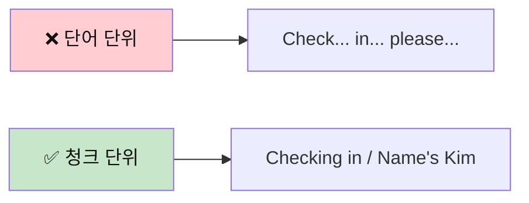
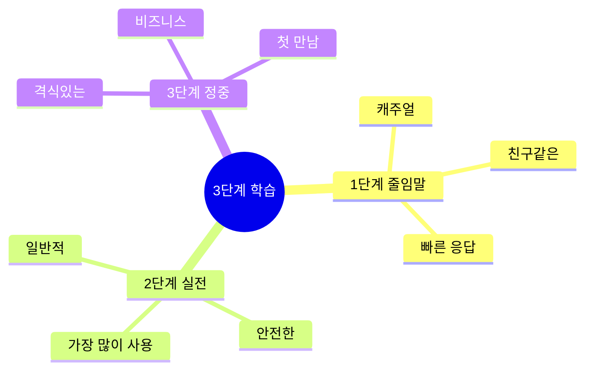
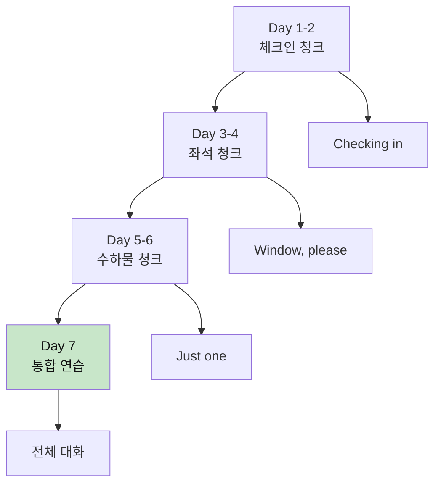
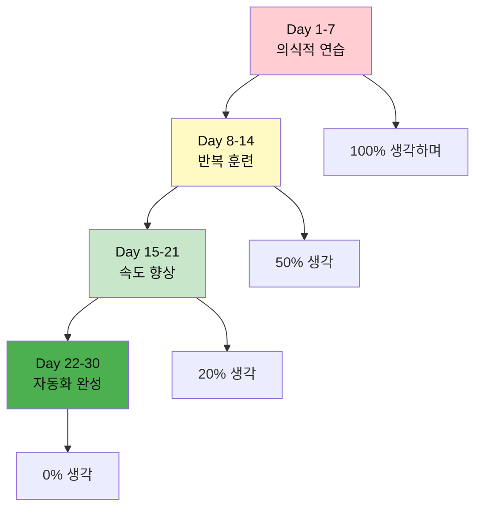
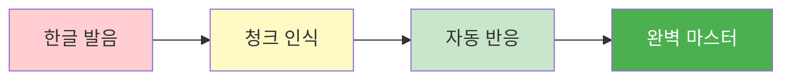

# ✈️ 공항 체크인 청크 실전 가이드
## 생각하고 말하는 청크 기반 학습법

---

## 📋 이 가이드의 특별한 점

### 🧠 청크(Chunk) 학습이란?
> **청크(Chunk)** = 의미 있는 언어 덩어리
> 
> 단어 하나하나가 아닌, **의미 단위로 묶어서** 생각하고 말하는 방법입니다.



### 💡 왜 청크로 배워야 하나?

1. **빠른 반응**: 생각하지 않고 자동으로 나옴
2. **자연스러움**: 원어민처럼 들림
3. **기억력 향상**: 덩어리로 외우면 잊어버리지 않음
4. **실수 감소**: 문법 걱정 없이 말할 수 있음

---

## 🎯 3단계 응용 시스템

모든 표현을 **3가지 레벨**로 학습합니다:



| 단계 | 상황 | 느낌 | 예시 |
|:---:|------|------|------|
| **1단계<br/>줄임말** | 친구, 캐주얼 | 편함 😊 | "Wanna window?" |
| **2단계<br/>실전** | 일반적 상황 | 안전 👍 | "Window seat, please." |
| **3단계<br/>정중** | 격식, 비즈니스 | 공손 🎩 | "Could I get a window seat?" |

---

## 📚 핵심 청크 마스터하기

### 청크 #1: 체크인 시작하기

#### 🧩 청크 구조 분석
```
청크 = [동작] + [목적]
예: "Checking in" = [체크인하는 중] + [이라는 목적]
```

#### 🎭 3단계 응용

**🔹 1단계: 줄임말 (Casual)**
```
상황: 친근한 분위기, 젊은 직원
청크: "Hey! / Checking in."

🗣️ 말하는 순서:
1. Hey! (인사)
2. Checking in (목적)

💭 생각 과정:
"안녕하세요" → "Hey!"
"체크인 할게요" → "Checking in"
```

**🔹 2단계: 실전 (Standard)**
```
상황: 일반적인 상황, 가장 안전
청크: "Hi! / I'd like to check in."

🗣️ 말하는 순서:
1. Hi! (인사)
2. I'd like to (원하는 것)
3. check in (목적)

💭 생각 과정:
"안녕하세요" → "Hi!"
"체크인 하고 싶어요" → "I'd like to check in"
```

**🔹 3단계: 정중 (Formal)**
```
상황: 격식 있는 상황, 비즈니스 클래스
청크: "Good morning. / I'd like to check in, please."

🗣️ 말하는 순서:
1. Good morning (정중한 인사)
2. I'd like to (예의 있는 요청)
3. check in, please (공손한 마무리)

💭 생각 과정:
"좋은 아침입니다" → "Good morning"
"체크인 하고 싶습니다" → "I'd like to check in, please"
```

#### 📊 청크 비교표

| 레벨 | 청크 | 길이 | 느낌 | 추천도 |
|:---:|------|:---:|:---:|:-----:|
| 1단계 | "Hey! Checking in." | ⚡ 짧음 | 😊 편함 | ⭐⭐⭐⭐ |
| 2단계 | "Hi! I'd like to check in." | 📏 보통 | 👍 안전 | ⭐⭐⭐⭐⭐ |
| 3단계 | "Good morning. I'd like to check in, please." | 📖 김 | 🎩 격식 | ⭐⭐⭐ |

#### 🎬 실전 대화 - 3가지 버전

**버전 A: 줄임말 (20대 배낭여행자)**
```
👤 손님: "Hey! Checking in."
👔 직원: "Hey! Passport?"
👤 손님: "Here."
👔 직원: "Cool. Kim, right?"
👤 손님: "Yep!"

⏱️ 시간: 5초
💭 느낌: 빠르고 편함
```

**버전 B: 실전 (일반 여행자) ⭐ 추천**
```
👤 손님: "Hi! I'd like to check in."
👔 직원: "Sure! May I see your passport?"
👤 손님: "Here you go."
👔 직원: "Thank you, Mr. Kim."
👤 손님: "Thanks!"

⏱️ 시간: 8초
💭 느낌: 가장 자연스러움
```

**버전 C: 정중 (비즈니스 여행자)**
```
👤 손님: "Good morning. I'd like to check in, please."
👔 직원: "Good morning! Of course. May I have your passport?"
👤 손님: "Certainly. Here it is."
👔 직원: "Thank you very much, Mr. Kim."
👤 손님: "Thank you."

⏱️ 시간: 12초
💭 느낌: 매우 공손함
```

---

### 청크 #2: 좌석 선택하기

#### 🧩 청크 구조 분석
```
청크 = [원하는 것] + [구체적 내용]
예: "Window seat" = [창가] + [좌석]
```

#### 🎭 3단계 응용

**🔹 1단계: 줄임말 (Casual)**
```
청크: "Window?"

🗣️ 말하는 순서:
1. Window? (원하는 것만)

💭 생각 과정:
"창가요?" → "Window?"

🎯 포인트:
- 한 단어로 끝냄
- 올림 억양 ↗️
- 표정으로 도움 (창문 가리키기)
```

**🔹 2단계: 실전 (Standard) ⭐ 추천**
```
청크: "Window seat, please."

🗣️ 말하는 순서:
1. Window seat (무엇을)
2. please (공손하게)

💭 생각 과정:
"창가 좌석" → "Window seat"
"주세요" → "please"

🎯 포인트:
- 완전한 청크
- 명확한 의사 전달
- 자연스러운 속도
```

**🔹 3단계: 정중 (Formal)**
```
청크: "Could I get / a window seat, / please?"

🗣️ 말하는 순서:
1. Could I get (공손한 요청)
2. a window seat (무엇을)
3. please (예의)

💭 생각 과정:
"받을 수 있을까요?" → "Could I get"
"창가 좌석을" → "a window seat"
"부탁드립니다" → "please"

🎯 포인트:
- 가장 예의 바름
- 청크를 나눠서 말하기
- 부드러운 톤
```

#### 📍 상황별 실전 청크

**상황 1: 직원이 먼저 물을 때**
```
👔 직원: "Window or aisle?"

✅ 1단계: "Window."
✅ 2단계: "Window, please."
✅ 3단계: "Window would be great."

💡 팁: 짧은 대답이 자연스러움!
```

**상황 2: 내가 먼저 요청할 때**
```
✅ 1단계: "Wanna window."
✅ 2단계: "I'd like a window seat."
✅ 3단계: "Could I possibly get a window seat?"

💡 팁: 2단계가 가장 무난!
```

**상황 3: 좌석이 없을 때 대응**
```
👔 직원: "Sorry, no window seats left."

✅ 1단계: "Aisle's cool."
✅ 2단계: "Aisle is fine too."
✅ 3단계: "That's alright, I'll take an aisle seat."

💡 팁: 유연한 태도 중요!
```

#### 🎬 청크 조합 실전

**시나리오: 완벽한 좌석 요청**
```
👔 직원: "Checking in?"
👤 손님: "Yep! Kim."
👔 직원: "Got it. Window or aisle?"
👤 손님: "Window, please. / Near the front / if possible?"
         [청크1]      [청크2]        [청크3]
👔 직원: "Lemme see... / 8A. / Perfect spot!"
         [생각하는 중]  [결과] [평가]

💭 청크로 생각하기:
손님 마음: "창가석 + 앞쪽 + 가능하면"
       → 3개 청크로 나눠서 말하기
```

---

### 청크 #3: 수하물 처리하기

#### 🧩 청크 구조 분석
```
청크 = [개수] + [행동]
예: "Just one" = [하나만] + [있어요]
```

#### 🎭 3단계 응용 - 수하물 있을 때

**🔹 1단계: 줄임말**
```
👔 직원: "Bags?"
👤 손님: "One."

청크: "One."
⏱️ 0.5초
💭 생각: "하나" → "One"
```

**🔹 2단계: 실전 ⭐**
```
👔 직원: "Any bags to check?"
👤 손님: "Yeah, / just one."
         [확인] [개수]

청크: "Yeah, just one."
⏱️ 1초
💭 생각: "네" → "Yeah"
         "하나만" → "just one"
```

**🔹 3단계: 정중**
```
👔 직원: "Do you have any bags to check?"
👤 손님: "Yes, / I have one bag / to check."
         [확인] [무엇을]      [목적]

청크: "Yes, I have one bag to check."
⏱️ 2초
💭 생각: "네" → "Yes"
         "가방 하나" → "I have one bag"
         "부치려고요" → "to check"
```

#### 🎭 3단계 응용 - 수하물 없을 때

**🔹 1단계: 줄임말**
```
청크: "Nah. / Carry-on only."
      [거절] [이유]

💭 생각: "아니요" → "Nah"
         "기내용만" → "Carry-on only"
```

**🔹 2단계: 실전 ⭐**
```
청크: "No, / just carry-on."
      [거절] [이유]

💭 생각: "아니요" → "No"
         "기내용만" → "just carry-on"
```

**🔹 3단계: 정중**
```
청크: "No thank you, / I only have carry-on."
      [공손한 거절]  [이유 설명]

💭 생각: "아니요 괜찮습니다" → "No thank you"
         "기내용만 있어요" → "I only have carry-on"
```

#### 📊 무게 확인 청크

**상황: 저울에 올린 후**
```
👔 직원: "Pop it on the scale."
👤 손님: [짐을 올림]
👤 손님: "Is it okay?"
         [확인 청크]

💭 청크 분석:
"Is it" = 확인하는 청크
"okay" = 괜찮은지 묻는 청크
```

**3단계 무게 확인 청크**
```
✅ 1단계: "Okay?" (초간단)
✅ 2단계: "Is it okay?" (표준)
✅ 3단계: "Is the weight alright?" (정중)

💡 실전에서는 2단계가 가장 자연스러움!
```

---

### 청크 #4: 게이트 & 탑승 시간 확인

#### 🧩 청크 구조 분석
```
청크 = [의문사] + [명사]?
예: "What gate?" = [무엇] + [게이트]?
```

#### 🎭 3단계 질문 청크

**질문 1: 게이트 번호**
```
✅ 1단계: "Gate?"
   - 한 단어
   - 올림 억양
   - 빠름 ⚡

✅ 2단계: "What gate?" ⭐ 추천
   - 완전한 질문
   - 명확함
   - 자연스러움

✅ 3단계: "Which gate am I at?"
   - 완전한 문장
   - 정중함
   - 비즈니스 OK
```

**질문 2: 탑승 시간**
```
✅ 1단계: "Boarding time?"
✅ 2단계: "When's boarding?" ⭐
✅ 3단계: "What time does boarding start?"
```

**질문 3: 게이트 위치**
```
✅ 1단계: "Where?"
✅ 2단계: "Where's gate 15?" ⭐
✅ 3단계: "Could you tell me where gate 15 is?"
```

#### 🎬 청크 조합 - 완벽한 마무리

**시나리오: 모든 정보 확인하기**
```
상황: 탑승권을 받은 직후

👔 직원: "Here's your boarding pass."
👤 손님: "Thanks! / What gate?"
         [감사]   [질문1]
👔 직원: "Gate 22."
👤 손님: "And boarding time?"
         [추가 질문]
👔 직원: "2:30 PM."
👤 손님: "Perfect. / Where is it?"
         [확인]    [위치]
👔 직원: "That way, / past security."
         [방향]      [상세]
👤 손님: "Got it. / Thanks!"
         [이해]    [감사]

💭 청크 분석:
- 각 질문을 짧은 청크로
- 한 번에 하나씩
- 명확하고 빠르게
```

---

## 🧠 청크 사고 훈련법

### 방법 1: 거울 앞 청크 연습

```
1단계: 한국어로 생각
"체크인하고 싶어요"

2단계: 청크로 나누기
"체크인" + "하고 싶어요"
↓
"Check in" + "I'd like to"

3단계: 순서 바꾸기 (영어식)
"I'd like to" + "check in"

4단계: 소리 내어 말하기
"I'd like to check in."

5단계: 자동화될 때까지 반복
10번, 20번, 50번...
```

### 방법 2: 청크 속도 훈련

```
느리게 (청크 구분하며):
"I'd like to / check in."
  [원하는 것]  [행동]

보통 속도:
"I'd like to check in."

빠르게 (자동으로):
"I'dliketocheckin."
↓
들리는 건: "아일라이크투체킨"

💡 목표: 생각 없이 자동으로 나올 때까지!
```

### 방법 3: 상황 시뮬레이션

```
상황 카드를 만들어서 연습:

📇 카드 1: 공항 도착
→ "Hey! Checking in."
→ [3초 안에 자동으로 나와야 함]

📇 카드 2: 좌석 물어볼 때
→ "Window, please."
→ [2초 안에 자동으로]

📇 카드 3: 짐 물어볼 때
→ "Yeah, just one."
→ [1초 안에 자동으로]

🎯 목표: 생각하는 시간 0초!
```

---

## 📊 청크 마스터 로드맵

### 1주차: 기본 청크 암기



**Day 1-2: 체크인 청크**
```
□ "Checking in" 100번 말하기
□ "I'd like to check in" 50번
□ "Name's Kim" 50번
□ 거울 보며 연습 10분 × 2
```

**Day 3-4: 좌석 청크**
```
□ "Window, please" 100번
□ "Aisle is fine" 50번
□ "Near the front if possible" 30번
□ 상황 시뮬레이션 3회
```

**Day 5-6: 수하물 청크**
```
□ "Just one" 100번
□ "Is it okay?" 50번
□ "What gate?" 50번
□ 전체 연결 연습
```

**Day 7: 통합 테스트**
```
□ 10턴 대화 5회 연습
□ 녹음해서 듣기
□ 친구와 역할극
□ 실전 준비 완료!
```

### 2주차: 속도 & 자동화

```
Week 2 목표: 생각 없이 자동으로!

Day 8-9: 속도 올리기
□ 1.5배속으로 연습
□ 3초 → 2초 → 1초
□ 빠른 응답 훈련

Day 10-11: 변형 연습
□ 다른 이름으로
□ 다른 좌석으로
□ 다른 상황으로

Day 12-13: 실전 시뮬레이션
□ 예상치 못한 질문 대응
□ 문제 상황 연습
□ 자신감 UP!

Day 14: 최종 점검
□ 전체 복습
□ 약점 보강
□ 실전 투입 준비!
```

---

## 🎯 실전 청크 대화 - 완벽한 체크인

### 시나리오 1: 순조로운 체크인 (줄임말 버전)

```
상황: 20대 배낭여행자, 친근한 분위기
목표: 빠르고 효율적인 체크인

턴 1 - 체크인 시작
👤 손님: "Hey! / Checking in."
        [인사] [목적]

🔊 실제 발음: "헤이! / 체킨인"
🎯 청크 분석: [Hey!] + [Checking in]
💭 생각 흐름: "안녕하세요" → "Hey!" 
             "체크인이요" → "Checking in"
⚡ 반응 속도: 0.8초
📝 발음 포인트: "Checking"은 "체킹"이 아니라 "체킨" 처럼 들림

턴 2 - 여권 요청
👔 직원: "Hey! / Passport?"
        [인사] [요청]
🔊 직원 발음: "헤이! / 패스포트?"

👤 손님: "Here."
        [건네기]
🔊 실제 발음: "히얼" (짧고 명확하게)
🎯 청크 분석: [Here] (한 단어 청크)
💭 생각 흐름: "여기요" → "Here" (짧게!)
⚡ 반응 속도: 0.3초
📝 발음 포인트: "Here"의 'H' 소리를 확실하게

턴 3 - 이름 확인
👔 직원: "Cool. / Kim, / right?"
        [OK]  [이름] [확인]
🔊 직원 발음: "쿨. / 킴, / 라잇?"

👤 손님: "Yep!"
        [긍정]
🔊 실제 발음: "옙!" (경쾌하게)
🎯 청크 분석: [Yep!] (초단축형 - Yes의 캐주얼 버전)
💭 생각 흐름: "네" → "Yep!" (캐주얼하게)
⚡ 반응 속도: 0.2초
📝 발음 포인트: 짧고 경쾌하게, 미소와 함께

턴 4 - 좌석 선택
👔 직원: "Window / or aisle?"
        [창가]   [통로]
🔊 직원 발음: "윈도우 / 오얼 / 아일?"

👤 손님: "Window."
        [선택]
🔊 실제 발음: "윈도우" (명확하게)
🎯 청크 분석: [Window] (명사 하나로 충분)
💭 생각 흐름: "창가요" → "Window" (한 단어로!)
⚡ 반응 속도: 0.5초
📝 발음 포인트: "Win-dow" 두 음절 명확히

턴 5 - 수하물 확인
👔 직원: "Got it. / Any bags?"
        [확인]   [질문]
🔊 직원 발음: "갓잇. / 에니 백스?"

👤 손님: "One."
        [개수]
🔊 실제 발음: "원" (숫자 명확히)
🎯 청크 분석: [One] (숫자 청크)
💭 생각 흐름: "하나요" → "One" (최소한으로!)
⚡ 반응 속도: 0.3초
📝 발음 포인트: "원"이 아니라 "완" 에 가깝게

턴 6 - 무게 확인
👔 직원: "Pop it / on the scale."
        [올려요]  [저울에]
🔊 직원 발음: "팝잇 / 온 더 / 스케일"

👤 손님: [짐을 올림]
👤 손님: "Okay?"
        [확인]
🔊 실제 발음: "오케이?" (올림 억양 ↗️)
🎯 청크 분석: [Okay?] (확인 청크)
💭 생각 흐름: "괜찮아요?" → "Okay?" (간단하게!)
⚡ 반응 속도: 0.4초
📝 발음 포인트: 끝을 올려서 질문 표시

턴 7 - 무게 OK
👔 직원: "You're good. / 20 kilos."
        [괜찮아요]   [무게]
🔊 직원 발음: "유얼 굿. / 트웬티 킬로스"

👤 손님: "Sweet!"
        [만족]
🔊 실제 발음: "스윗!" (기쁘게)
🎯 청크 분석: [Sweet!] (감탄 청크)
💭 생각 흐름: "좋아요!" → "Sweet!" (기뻐하는 표현)
⚡ 반응 속도: 0.3초
📝 발음 포인트: "스위-트" 길게 발음하면 더 감탄스러움

턴 8 - 탑승권 수령
👔 직원: "Here's your pass. / Gate 22."
        [탑승권]          [게이트]
🔊 직원 발음: "히얼즈 유얼 패스. / 게이트 트웬티투"

👤 손님: "When's / boarding?"
        [언제]   [탑승]
🔊 실제 발음: "웬즈 / 보딩?"
🎯 청크 분석: [When's] + [boarding?]
💭 생각 흐름: "탑승이 언제예요?" → "When's boarding?"
⚡ 반응 속도: 0.6초
📝 발음 포인트: "When's"는 "웬즈"로 빠르게 연결

턴 9 - 시간 & 방향 안내
👔 직원: "2:30. / That way."
        [시간]  [방향]
🔊 직원 발음: "투 써티. / 댓 웨이"

👤 손님: "Perfect. / Thanks!"
        [만족]   [감사]
🔊 실제 발음: "퍼펙트. / 땡스!"
🎯 청크 분석: [Perfect] + [Thanks!]
💭 생각 흐름: "완벽해요" → "Perfect"
             "고마워요" → "Thanks!"
⚡ 반응 속도: 0.7초
📝 발음 포인트: "Perfect"의 't' 소리 약하게

턴 10 - 마무리 인사
👔 직원: "No prob! / Have a good flight!"
        [천만에]  [좋은 여행 되세요]
🔊 직원 발음: "노 프랍! / 해브 어 굿 플라잇!"

👤 손님: "You too!"
        [답례]
🔊 실제 발음: "유 투!" (밝게)
🎯 청크 분석: [You too!] (관용 청크)
💭 생각 흐름: "당신도요!" → "You too!"
⚡ 반응 속도: 0.4초
📝 발음 포인트: "You"와 "too"를 빠르게 연결

⏱️ 총 소요시간: 약 45초
🎯 청크 개수: 18개
💡 느낌: 빠르고 효율적!
📊 평균 반응속도: 0.5초
🎤 발음 난이도: ⭐⭐ (쉬움)
```

### 시나리오 2: 표준 체크인 (실전 버전) ⭐ 추천

```
상황: 일반 여행자, 가장 보편적이고 안전한 방법
목표: 명확하고 정중한 의사소통

턴 1 - 체크인 시작 (정중하게)
👤 손님: "Hi! / I'd like to / check in."
        [인사] [원합니다] [체크인]

🔊 실제 발음: "하이! / 아일 라익 투 / 체킨"
🎯 청크 분석: [Hi!] + [I'd like to] + [check in]
💭 생각 흐름: "안녕하세요" → "Hi!"
             "체크인하고 싶어요" → "I'd like to check in"
⚡ 반응 속도: 1.2초
📝 발음 포인트: "I'd like to"는 "아일 라익 투"로 빠르게 연결
             "I would like to"의 축약형

턴 2 - 여권 요청
👔 직원: "Sure! / May I see / your passport?"
        [물론] [봐도 될까요] [여권]
🔊 직원 발음: "슈얼! / 메이 아이 씨 / 유얼 패스포트?"

👤 손님: "Here you go."
        [건네는 청크]
🔊 실제 발음: "히얼 유 고우"
🎯 청크 분석: [Here you go] (공손한 건네기 청크)
💭 생각 흐름: "여기 있어요" → "Here you go" (공손하게)
⚡ 반응 속도: 0.7초
📝 발음 포인트: "Here you"를 "히얼유"로 빠르게 연결
             "Here"보다 더 공손한 표현

턴 3 - 목적지 확인
👔 직원: "Thank you, / Mr. Kim. / Flying to LA?"
        [감사]      [호칭]     [확인]
🔊 직원 발음: "땡큐, / 미스터 킴. / 플라잉 투 엘에이?"

👤 손님: "Yes, / that's right."
        [네]  [맞습니다]
🔊 실제 발음: "예스, / 댓츠 라잇"
🎯 청크 분석: [Yes] + [that's right]
💭 생각 흐름: "네" → "Yes"
             "맞아요" → "that's right"
⚡ 반응 속도: 0.8초
📝 발음 포인트: "that's"는 "댓츠"로 빠르게
             "right"의 't'는 약하게

턴 4 - 좌석 선택 (상세 요청)
👔 직원: "Perfect. / Window or aisle?"
        [좋아요]  [창가 통로]
🔊 직원 발음: "퍼펙트. / 윈도우 오얼 아일?"

👤 손님: "Window, please. / Near the front / if possible?"
        [창가 주세요]    [앞쪽]         [가능하면]
🔊 실제 발음: "윈도우, 플리즈. / 니얼 더 프론트 / 이프 파서블?"
🎯 청크 분석: [Window, please] + [Near the front] + [if possible?]
💭 생각 흐름: "창가석 주세요" → "Window, please"
             "앞쪽으로" → "Near the front"
             "가능하면요?" → "if possible?"
⚡ 반응 속도: 1.5초
📝 발음 포인트: 3개 청크로 나눠서 말하기
             "Near the"는 "니얼더"로 연결
             "possible"은 "파서블"

턴 5 - 좌석 배정 완료
👔 직원: "Let me check... / I have 8A. / Good spot!"
        [확인할게요]      [8A 있어요]  [좋은 자리]
🔊 직원 발음: "렛 미 체크... / 아이 해브 에잇에이. / 굿 스팟!"

👤 손님: "That's great! / Thank you."
        [좋아요!]     [감사합니다]
🔊 실제 발음: "댓츠 그레잇! / 땡큐"
🎯 청크 분석: [That's great!] + [Thank you]
💭 생각 흐름: "좋네요!" → "That's great!"
             "감사합니다" → "Thank you"
⚡ 반응 속도: 0.9초
📝 발음 포인트: "That's"는 "댓츠"
             감탄을 담아서 "Great!" 강조

턴 6 - 수하물 확인
👔 직원: "Any bags / to check?"
        [짐]      [부칠]
🔊 직원 발음: "에니 백스 / 투 체크?"

👤 손님: "Yes, / just one."
        [네]  [하나만]
🔊 실제 발음: "예스, / 저스트 원"
🎯 청크 분석: [Yes] + [just one]
💭 생각 흐름: "네" → "Yes"
             "하나만요" → "just one"
⚡ 반응 속도: 0.6초
📝 발음 포인트: "just"는 "저스트"
             "one"은 "원"이 아니라 "완"

턴 7 - 무게 측정
👔 직원: "Please / put it / on the scale."
        [부탁]   [올려요] [저울에]
🔊 직원 발음: "플리즈 / 풋잇 / 온 더 스케일"

👤 손님: [짐을 올림]
👤 손님: "Is it / okay?"
        [그것이] [괜찮나요]
🔊 실제 발음: "이즈잇 / 오케이?"
🎯 청크 분석: [Is it] + [okay?]
💭 생각 흐름: "괜찮나요?" → "Is it okay?"
⚡ 반응 속도: 0.7초
📝 발음 포인트: "Is it"은 "이즈잇"으로 빠르게 연결
             끝을 올려서 질문 표시 ↗️

턴 8 - 무게 확인 완료
👔 직원: "Perfect! / 22 kilos. / You're all set."
        [완벽]    [22킬로]   [다 됐어요]
🔊 직원 발음: "퍼펙트! / 트웬티투 킬로스. / 유얼 올 셋"

👤 손님: "Wonderful!"
        [훌륭해요]
🔊 실제 발음: "원더풀!"
🎯 청크 분석: [Wonderful!] (기쁨 표현 청크)
💭 생각 흐름: "좋아요!" → "Wonderful!" (안도감)
⚡ 반응 속도: 0.5초
📝 발음 포인트: "Won-der-ful" 세 음절 명확히
             기쁜 감정을 담아서

턴 9 - 게이트 정보 확인
👤 손님: "What gate / am I at?"
        [무슨 게이트] [제가 있는]
🔊 실제 발음: "왓 게이트 / 앰 아이 앳?"
🎯 청크 분석: [What gate] + [am I at?]
💭 생각 흐름: "몇 번 게이트예요?" → "What gate am I at?"
⚡ 반응 속도: 1.0초
📝 발음 포인트: "What"의 't'는 약하게
             "am I"는 "앰아이"로 연결

👔 직원: "Gate 15. / Boarding starts / at 2:30."
        [게이트 15] [탑승 시작]    [2시 30분]
🔊 직원 발음: "게이트 피프틴. / 보딩 스타츠 / 앳 투 써티"

턴 10 - 게이트 위치 확인
👤 손님: "Got it. / Where is / gate 15?"
        [알겠어요] [어디예요] [게이트 15]
🔊 실제 발음: "갓잇. / 웨얼 이즈 / 게이트 피프틴?"
🎯 청크 분석: [Got it] + [Where is] + [gate 15?]
💭 생각 흐름: "알겠어요" → "Got it"
             "어디예요?" → "Where is gate 15?"
⚡ 반응 속도: 1.1초
📝 발음 포인트: "Got it"은 "갓잇"으로 빠르게
             "Where is"는 "웨얼이즈"로 연결

👔 직원: "Down the hall, / to your left."
        [복도 따라]      [왼쪽으로]
🔊 직원 발음: "다운 더 홀, / 투 유얼 레프트"

👤 손님: "Thank you / so much!"
        [감사합니다] [정말]
🔊 실제 발음: "땡큐 / 쏘 머치!"
🎯 청크 분석: [Thank you] + [so much!]
💭 생각 흐름: "정말 감사합니다!" → "Thank you so much!"
⚡ 반응 속도: 0.8초
📝 발음 포인트: "so much"로 감사 강조
             진심을 담아서

⏱️ 총 소요시간: 약 90초
🎯 청크 개수: 28개
💡 느낌: 명확하고 정중!
📊 평균 반응속도: 0.9초
🎤 발음 난이도: ⭐⭐⭐ (보통)
✅ 추천도: ⭐⭐⭐⭐⭐ (가장 안전하고 자연스러움)
```

### 시나리오 3: 격식 체크인 (정중 버전)

```
상황: 비즈니스 여행자, 프리미엄 서비스 (비즈니스 클래스)
목표: 매우 정중하고 전문적인 의사소통

턴 1 - 격식 있는 체크인 시작
👤 손님: "Good morning. / I'd like to / check in, / please."
        [격식 인사]   [원합니다] [체크인]  [공손]

🔊 실제 발음: "굿 모닝. / 아일 라익 투 / 체킨, / 플리즈"
🎯 청크 분석: [Good morning] + [I'd like to] + [check in] + [please]
💭 생각 흐름: "좋은 아침입니다" → "Good morning"
             "체크인하고 싶습니다" → "I'd like to check in"
             "부탁드립니다" → "please"
⚡ 반응 속도: 1.8초
📝 발음 포인트: "Good morning"은 시간대별 인사 (오전용)
             "I'd like to"는 "I would like to"의 격식 있는 축약
             끝에 "please" 추가로 더욱 공손하게

턴 2 - 서류 요청 (복수)
👔 직원: "Good morning, sir. / May I have / your passport / and booking confirmation?"
        [격식 인사]        [여쭤봐도]  [여권]      [예약 확인서]
🔊 직원 발음: "굿 모닝, 써. / 메이 아이 해브 / 유얼 패스포트 / 앤 부킹 컨펌메이션?"

👤 손님: "Certainly. / Here they are."
        [물론입니다] [여기 있습니다]
🔊 실제 발음: "써튼리. / 히얼 데이 아"
🎯 청크 분석: [Certainly] + [Here they are]
💭 생각 흐름: "물론입니다" → "Certainly" (매우 격식)
             "여기 있습니다" → "Here they are" (복수)
⚡ 반응 속도: 1.0초
📝 발음 포인트: "Certainly"는 "써튼리" (격식 있는 동의)
             "they are"는 "데이아"로 연결
             "Here it is" (단수) vs "Here they are" (복수)

턴 3 - 예약 확인
👔 직원: "Thank you / very much. / Mr. Kim, / business class / to Tokyo?"
        [감사]      [매우]      [호칭]     [비즈니스]    [도쿄]
🔊 직원 발음: "땡큐 / 베리 머치. / 미스터 킴, / 비즈니스 클래스 / 투 토쿄?"

👤 손님: "Yes, / that's correct."
        [네]  [맞습니다]
🔊 실제 발음: "예스, / 댓츠 커렉트"
🎯 청크 분석: [Yes] + [that's correct]
💭 생각 흐름: "네" → "Yes"
             "맞습니다" → "that's correct" (격식)
⚡ 반응 속도: 0.9초
📝 발음 포인트: "correct"는 "커렉트"
             "that's right"보다 더 격식 있음

턴 4 - 좌석 선호도 질문
👔 직원: "Wonderful. / For seating, / would you prefer / window or aisle?"
        [훌륭합니다] [좌석은]     [선호하시나요]   [창가 통로]
🔊 직원 발음: "원더풀. / 포 시팅, / 우쥬 프리퍼 / 윈도우 오얼 아일?"

👤 손님: "I'd prefer / a window seat, / if available. / Ideally / near the front."
        [선호합니다] [창가석]       [가능하다면]  [이상적으로] [앞쪽]
🔊 실제 발음: "아일 프리퍼 / 어 윈도우 싯, / 이프 어베일러블. / 아이디얼리 / 니얼 더 프론트"
🎯 청크 분석: [I'd prefer] + [a window seat] + [if available] + [Ideally] + [near the front]
💭 생각 흐름: "선호합니다" → "I'd prefer" (격식)
             "창가석을" → "a window seat"
             "가능하다면" → "if available"
             "이상적으로는" → "Ideally"
             "앞쪽에" → "near the front"
⚡ 반응 속도: 2.5초
📝 발음 포인트: 5개 청크로 나눠서 천천히 정중하게
             "I'd prefer"는 "I would prefer"의 축약
             "available"은 "어베일러블"
             "Ideally"는 "아이디얼리"

턴 5 - 좌석 배정 (최선 노력)
👔 직원: "Let me see / what I can do. / ... / Yes, / I can offer you / seat 2A. / That's / right at the front."
        [확인할게요] [제가 할 수 있는] [확인] [제안합니다]  [2A]     [그건]  [바로 앞]
🔊 직원 발음: "렛 미 씨 / 왓 아이 캔 두. / ... / 예스, / 아이 캔 오퍼 유 / 싯 투에이. / 댓츠 / 라잇 앳 더 프론트"

👤 손님: "That would be / perfect. / Thank you."
        [그것은 ~일 것입니다] [완벽]    [감사합니다]
🔊 실제 발음: "댓 우드 비 / 퍼펙트. / 땡큐"
🎯 청크 분석: [That would be] + [perfect] + [Thank you]
💭 생각 흐름: "그것은 완벽할 것입니다" → "That would be perfect"
             "감사합니다" → "Thank you"
⚡ 반응 속도: 1.3초
📝 발음 포인트: "would be"는 "우드 비"
             가정법으로 더욱 공손한 표현
             "That's perfect"보다 더 격식

턴 6 - 수하물 & 무게 한도 확인
👔 직원: "My pleasure. / Do you have / any bags / to check / today?"
        [제 기쁨입니다] [있으신가요] [짐]      [부칠]   [오늘]
🔊 직원 발음: "마이 플레저. / 두 유 해브 / 에니 백스 / 투 체크 / 투데이?"

👤 손님: "Yes, / I have / two bags. / Could you / confirm / the weight allowance?"
        [네]  [있습니다] [2개]      [해주실 수] [확인]   [무게 허용량]
🔊 실제 발음: "예스, / 아이 해브 / 투 백스. / 쿠쥬 / 컨펌 / 더 웨잇 얼라운스?"
🎯 청크 분석: [Yes] + [I have] + [two bags] + [Could you] + [confirm] + [the weight allowance?]
💭 생각 흐름: "네" → "Yes"
             "2개 있습니다" → "I have two bags"
             "확인해주실 수 있나요?" → "Could you confirm"
             "무게 허용량" → "the weight allowance"
⚡ 반응 속도: 2.2초
📝 발음 포인트: "Could you"는 "쿠쥬"로 빠르게
             "allowance"는 "얼라운스"
             사전에 확인하는 프로페셔널한 태도

턴 7 - 무게 한도 안내
👔 직원: "Of course. / Business class / allows / two bags / up to / 32 kilos / each."
        [물론입니다]  [비즈니스 클래스] [허용]  [2개]      [최대]   [32킬로]   [각각]
🔊 직원 발음: "오브 코스. / 비즈니스 클래스 / 얼라우즈 / 투 백스 / 업 투 / 써티투 킬로스 / 이치"

👤 손님: "Excellent. / These should be / within the limit."
        [훌륭합니다] [이것들은 ~일 것입니다] [한도 내]
🔊 실제 발음: "엑설런트. / 디즈 슈드 비 / 위딘 더 리밋"
🎯 청크 분석: [Excellent] + [These should be] + [within the limit]
💭 생각 흐름: "훌륭합니다" → "Excellent"
             "이것들은 ~일 것입니다" → "These should be"
             "한도 내" → "within the limit"
⚡ 반응 속도: 1.5초
📝 발음 포인트: "Excellent"는 "엑설런트"
             "should be"로 예상 표현
             "within"은 "위딘"

턴 8 - 무게 측정 & 확인
👔 직원: "Let's check. / Please place them / on the scale."
        [확인합시다]  [올려주세요]      [저울에]
🔊 직원 발음: "렛츠 체크. / 플리즈 플레이스 뎀 / 온 더 스케일"

👤 손님: [짐을 차례로 올림]

👔 직원: "21 and 23 kilos. / All good."
        [21과 23킬로]       [다 좋습니다]
🔊 직원 발음: "트웬티원 앤 트웬티쓰리 킬로스. / 올 굿"

👤 손님: "Wonderful. / Thank you."
        [훌륭합니다] [감사합니다]
🔊 실제 발음: "원더풀. / 땡큐"
🎯 청크 분석: [Wonderful] + [Thank you]
💭 생각 흐름: "훌륭합니다" → "Wonderful"
             "감사합니다" → "Thank you"
⚡ 반응 속도: 0.8초
📝 발음 포인트: "Wonderful"로 만족 표현
             간결하게 감사

턴 9 - 탑승 정보 & 라운지 문의
👔 직원: "Here's / your boarding pass. / You're at / gate 7. / Boarding will begin / at 14:30, / approximately / 45 minutes / before departure."
        [여기]   [탑승권]          [~에 있습니다] [게이트7] [탑승 시작]       [14시30분]  [약]          [45분]        [출발 전]
🔊 직원 발음: "히얼즈 / 유얼 보딩 패스. / 유얼 앳 / 게이트 세븐. / 보딩 윌 비긴 / 앳 포틴 써티, / 어프록시멀리 / 포티파이브 미닛츠 / 비포 디파춰"

👤 손님: "I understand. / Could you / direct me / to the lounge?"
        [이해했습니다] [해주실 수] [안내]     [라운지로]
🔊 실제 발음: "아이 언더스탠드. / 쿠쥬 / 디렉트 미 / 투 더 라운지?"
🎯 청크 분석: [I understand] + [Could you] + [direct me] + [to the lounge?]
💭 생각 흐름: "이해했습니다" → "I understand"
             "안내해주실 수 있나요?" → "Could you direct me"
             "라운지로" → "to the lounge"
⚡ 반응 속도: 1.7초
📝 발음 포인트: "understand"는 "언더스탠드"
             "direct me"는 "디렉트 미"
             "lounge"는 "라운지"
             비즈니스 클래스 라운지 이용 계획

턴 10 - 라운지 안내 & 마무리
👔 직원: "Certainly. / The business lounge / is on / the second floor, / past security. / Enjoy your flight, / Mr. Kim."
        [물론입니다]  [비즈니스 라운지]  [있습니다] [2층]            [보안 통과 후]  [좋은 여행]       [호칭]
🔊 직원 발음: "써튼리. / 더 비즈니스 라운지 / 이즈 온 / 더 세컨드 플로어, / 패스트 시큐리티. / 인조이 유얼 플라잇, / 미스터 킴"

👤 손님: "Thank you / for your / excellent service."
        [감사합니다] [~에 대해]  [훌륭한 서비스]
🔊 실제 발음: "땡큐 / 포 유얼 / 엑설런트 서비스"
🎯 청크 분석: [Thank you] + [for your] + [excellent service]
💭 생각 흐름: "감사합니다" → "Thank you"
             "훌륭한 서비스에 대해" → "for your excellent service"
⚡ 반응 속도: 1.4초
📝 발음 포인트: "for your"는 "포 유얼"로 연결
             "excellent"는 "엑설런트"
             서비스에 대한 칭찬으로 마무리

⏱️ 총 소요시간: 약 150초
🎯 청크 개수: 45개
💡 느낌: 매우 정중하고 전문적!
📊 평균 반응속도: 1.5초
🎤 발음 난이도: ⭐⭐⭐⭐ (어려움 - 긴 문장)
✅ 추천도: ⭐⭐⭐⭐ (비즈니스 클래스, 고급 호텔 등)
💼 사용 상황: 비즈니스 여행, 프리미엄 서비스, 격식 필요 시
```

---

## 📝 청크 셀프 테스트

### 테스트 1: 청크 속도 테스트

```
다음 상황에 3초 안에 반응하세요:

1. 직원: "Can I help you?"
   나: _________________ (체크인)

2. 직원: "Window or aisle?"
   나: _________________ (창가)

3. 직원: "Any bags?"
   나: _________________ (하나)

4. 직원: "Pop it on the scale."
   나: [짐 올린 후] _________________ (괜찮은지)

5. 직원: "Here's your boarding pass."
   나: _________________ (게이트 번호)

⏱️ 시간 제한: 각 3초
🎯 목표: 생각 없이 자동으로!
```

<details>
<summary>✅ 모범 답안</summary>

1. **"Checking in."** (1초)
2. **"Window, please."** (1초)
3. **"Just one."** (1초)
4. **"Is it okay?"** (1초)
5. **"What gate?"** (1초)

💡 만약 3초 이상 걸린다면:
→ 해당 청크를 100번 더 연습!

</details>

### 테스트 2: 청크 조합 테스트

```
다음 청크들을 조합하여 자연스러운 문장 만들기:

청크 은행:
[Checking in] [Name's Kim] [Window, please] 
[Just one] [Is it okay?] [What gate?]

상황 1: 체크인 시작
→ _________________

상황 2: 좌석 요청
→ _________________

상황 3: 짐 확인
→ _________________

상황 4: 게이트 확인
→ _________________
```

<details>
<summary>✅ 모범 답안</summary>

**상황 1: 체크인 시작**
"Checking in. Name's Kim."

**상황 2: 좌석 요청**
"Window, please."

**상황 3: 짐 확인**
"Just one. Is it okay?"

**상황 4: 게이트 확인**
"What gate?"

💡 청크를 조합하는 순서:
1. 짧은 청크부터
2. 관련 있는 것끼리
3. 자연스러운 흐름으로

</details>

### 테스트 3: 3단계 변환 테스트

```
다음 문장을 3단계로 변환하세요:

원문: "I want to check in."

1단계 (줄임말): _________________
2단계 (실전): _________________
3단계 (정중): _________________
```

<details>
<summary>✅ 모범 답안</summary>

**1단계 (줄임말):**
"Checking in."

**2단계 (실전):**
"I'd like to check in."

**3단계 (정중):**
"I'd like to check in, please."

**또는:**
"Good morning. I'd like to check in, please."

💡 변환 요령:
- 짧게 → 표준 → 길게
- 캐주얼 → 중립 → 격식
- 빠르게 → 보통 → 천천히

</details>

---

## 💡 청크 마스터 비법

### 비법 1: 청크 노트 만들기

```
📓 나만의 청크 노트

페이지 1: 체크인 청크
┌─────────────────────┐
│ Checking in         │ ⭐⭐⭐⭐⭐
│ Name's Kim          │ ⭐⭐⭐⭐
│ I'd like to check in│ ⭐⭐⭐⭐⭐
└─────────────────────┘

페이지 2: 좌석 청크
┌─────────────────────┐
│ Window, please      │ ⭐⭐⭐⭐⭐
│ Aisle is fine       │ ⭐⭐⭐⭐
│ Near the front      │ ⭐⭐⭐
└─────────────────────┘

💡 별표는 자신있는 정도!
```

### 비법 2: 청크 음성 메모

```
📱 스마트폰 활용법

1. 음성 메모 앱 열기
2. 청크 10번씩 녹음
3. 출퇴근길에 듣기
4. 따라 말하기
5. 자동화까지!

🎧 플레이리스트 예시:
- Track 1: 체크인 청크 × 10
- Track 2: 좌석 청크 × 10
- Track 3: 수하물 청크 × 10
- Track 4: 전체 대화 × 3
```

### 비법 3: 청크 플래시카드

```
🃏 앞면: 한국어 상황
"체크인하고 싶어요"

🃏 뒷면: 영어 청크 3단계
1단계: "Checking in."
2단계: "I'd like to check in."
3단계: "I'd like to check in, please."

📚 카드 세트:
- 체크인 세트: 10장
- 좌석 세트: 10장
- 수하물 세트: 10장
- 질문 세트: 10장
```

---

## 🎯 최종 목표: 청크 자동화

### 자동화 레벨 체크

```
레벨 1: 의식적 청크 (초보)
"음... 체크인은 영어로... Checking in!"
⏱️ 반응 시간: 3-5초

레벨 2: 빠른 청크 (중급)
"Checking in" [생각 → 말]
⏱️ 반응 시간: 1-2초

레벨 3: 자동 청크 (고급)
[생각 = 말] "Checking in!"
⏱️ 반응 시간: 0.5초

레벨 4: 무의식 청크 (원어민급) 🏆
상황 보자마자 자동으로!
⏱️ 반응 시간: 0초 (즉각)

🎯 목표: 레벨 3 이상!
```

### 자동화 달성 로드맵



---

## 📚 다음 학습

청크 기반 학습을 마스터했다면:
- 👉 [호텔 & 식당 청크 가이드](../숙박_식사/07_호텔_식당_청크_실전_가이드.md)
- 👉 [쇼핑 & 교통 청크 가이드](../쇼핑_교통/10_쇼핑_교통_청크_실전_가이드.md)

---

## 🏆 학습 완료 체크리스트

### 청크 이해도 ✅
- [ ] 청크가 무엇인지 설명할 수 있다
- [ ] 3단계 응용 시스템을 이해한다
- [ ] 청크로 생각하는 방법을 안다
- [ ] 청크 조합 원리를 안다

### 청크 암기도 ✅
- [ ] 체크인 청크 10개 암기
- [ ] 좌석 청크 10개 암기
- [ ] 수하물 청크 10개 암기
- [ ] 질문 청크 10개 암기

### 청크 속도 ✅
- [ ] 3초 안에 반응 가능
- [ ] 1초 안에 반응 가능 (목표)
- [ ] 생각 없이 자동으로 나옴
- [ ] 10턴 대화 유창하게 가능

### 실전 준비도 🔥
- [ ] 3가지 버전 모두 연습
- [ ] 상황별 청크 선택 가능
- [ ] 예상치 못한 상황 대응 OK
- [ ] 실전 투입 자신감 100%!

---

**💪 청크 마스터가 되는 비결:**
> "생각하지 말고, 느껴라!" - 브루스 리
> 
> 청크는 생각하는 게 아니라, 
> 자동으로 나오는 것!

---

## 🎤 발음 중심 청크 자동화 훈련

### 발음 청크 마스터 시스템



### 핵심 발음 청크 TOP 20

| 순위 | 청크 | 실제 발음 | 연결음 | 속도 | 빈도 |
|:---:|------|---------|--------|:---:|:---:|
| 1 | Checking in | 체킨인 | 체크+인 → 체킨 | 0.8초 | ⭐⭐⭐⭐⭐ |
| 2 | Here you go | 히얼유고우 | 히얼+유 → 히얼유 | 0.7초 | ⭐⭐⭐⭐⭐ |
| 3 | Window, please | 윈도우플리즈 | 윈도우+플리즈 | 0.9초 | ⭐⭐⭐⭐⭐ |
| 4 | Just one | 저스트원 | 저스트+원 → 저스트완 | 0.5초 | ⭐⭐⭐⭐⭐ |
| 5 | Is it okay? | 이즈잇오케이 | 이즈+잇 → 이즈잇 | 0.7초 | ⭐⭐⭐⭐⭐ |
| 6 | What gate? | 왓게이트 | 왓+게이트 | 0.6초 | ⭐⭐⭐⭐⭐ |
| 7 | Thank you | 땡큐 | 땡+큐 → 땡큐 | 0.4초 | ⭐⭐⭐⭐⭐ |
| 8 | I'd like to | 아일라익투 | 아일+라익+투 | 1.0초 | ⭐⭐⭐⭐ |
| 9 | That's right | 댓츠라잇 | 댓츠+라잇 | 0.7초 | ⭐⭐⭐⭐ |
| 10 | Near the front | 니얼더프론트 | 니얼+더 → 니얼더 | 1.2초 | ⭐⭐⭐⭐ |
| 11 | if possible | 이프파서블 | 이프+파서블 | 1.0초 | ⭐⭐⭐⭐ |
| 12 | You're good | 유얼굿 | 유얼+굿 | 0.6초 | ⭐⭐⭐⭐ |
| 13 | Got it | 갓잇 | 갓+잇 → 가릿 | 0.4초 | ⭐⭐⭐⭐ |
| 14 | How much | 하우머치 | 하우+머치 | 0.7초 | ⭐⭐⭐⭐ |
| 15 | That works | 댓워크스 | 댓+워크스 | 0.7초 | ⭐⭐⭐⭐ |
| 16 | Let me check | 렛미체크 | 렛+미 → 레미 | 0.9초 | ⭐⭐⭐ |
| 17 | Pop it on | 팝잇온 | 팝+잇+온 → 파피톤 | 0.8초 | ⭐⭐⭐ |
| 18 | You bet | 유벳 | 유+벳 | 0.5초 | ⭐⭐⭐ |
| 19 | For sure | 포슈얼 | 포+슈얼 | 0.6초 | ⭐⭐⭐⭐ |
| 20 | No worries | 노워리스 | 노+워리스 | 0.7초 | ⭐⭐⭐⭐⭐ |

### 발음 연결 훈련법

#### 1단계: 개별 청크 발음 (1-7일)

```
매일 20분 훈련

청크 1: "Checking in" (체킨인)
- 천천히: "체크-킹-인" (3음절)
- 보통: "체-킨-인" (3음절)
- 빠르게: "체킨" (2음절처럼)
- 반복: 100번

발음 포인트:
✅ "Check"의 'ck'는 'k' 소리
✅ "ing"는 "잉"이 아니라 "인"
✅ 빠르게 말하면 "체킨" 처럼 들림
```

#### 2단계: 청크 연결 훈련 (8-14일)

```
매일 30분 훈련

연결 청크: "I'd like to check in"
- 분리: "아일 / 라익 / 투 / 체크 / 인"
- 연결: "아일라익투 / 체킨"
- 자동: "아일라익투체킨" (한 호흡에)
- 반복: 50번

발음 포인트:
✅ "I'd"는 "아이드"가 아니라 "아일"
✅ "like to"는 "라익투"로 빠르게
✅ 전체를 2개 청크로: [아일라익투] + [체킨]
```

#### 3단계: 실전 속도 훈련 (15-21일)

```
매일 40분 훈련

실전 문장: "Hi! I'd like to check in. Window, please."
- 느리게 (3초): "하이! / 아일 라익 투 체크 인. / 윈도우, 플리즈."
- 보통 (2초): "하이! / 아일라익투 체킨. / 윈도우플리즈."
- 빠르게 (1초): "하이! 아일라익투체킨. 윈도우플리즈."
- 반복: 30번

발음 포인트:
✅ 3개 청크로 나누기
✅ 각 청크 사이 짧은 쉼
✅ 자연스러운 리듬
```

### 발음 청크 자동화 테스트

```
🎯 레벨 테스트

레벨 1: 3초 반응 (초보)
- 한국어 듣고 → 영어 청크 말하기
- 예: "체크인이요" → (3초 생각) → "Checking in"

레벨 2: 2초 반응 (중급)
- 한국어 듣고 → 영어 청크 말하기
- 예: "체크인이요" → (2초 생각) → "Checking in"

레벨 3: 1초 반응 (고급)
- 한국어 듣고 → 영어 청크 말하기
- 예: "체크인이요" → (1초) → "Checking in"

레벨 4: 0.5초 반응 (마스터) 🏆
- 한국어 듣고 → 즉시 영어 청크
- 예: "체크인이요" → "Checking in" (즉각!)

🎯 목표: 레벨 4 달성!
```

### 발음 청크 조합 훈련

```
시나리오 연습: 공항 체크인 (발음 중심)

👤: "하이! 아일라익투 체킨."
    (Hi! I'd like to check in.)
    
👔: "슈얼! 패스포트 플리즈?"
    (Sure! Passport please?)
    
👤: "히얼유고우."
    (Here you go.)
    
👔: "윈도우 오얼 아일?"
    (Window or aisle?)
    
👤: "윈도우 플리즈."
    (Window, please.)
    
👔: "애니 백스?"
    (Any bags?)
    
👤: "저스트 원."
    (Just one.)
    
👔: "팝잇 온더 스케일."
    (Pop it on the scale.)
    
👤: "이즈잇 오케이?"
    (Is it okay?)
    
👔: "유얼 굿! 땡큐!"
    (You're good! Thank you!)

⏱️ 목표: 30초 안에 완료
🎤 발음: 자연스럽게 연결
💪 반복: 10회 이상
```

### 발음 실수 교정

```
자주 하는 발음 실수:

❌ "체크 인" (띄어서) → ✅ "체킨" (붙여서)
❌ "아이 우드 라이크" → ✅ "아일라익"
❌ "히어 유 고" → ✅ "히얼유고우"
❌ "윈도우 씨트" → ✅ "윈도우 싯"
❌ "저스트 원" (원) → ✅ "저스트 완" (완)
❌ "이즈 잇" (띄어서) → ✅ "이즈잇" (붙여서)

💡 핵심: 영어는 연결해서 말하기!
```

---

## 🏆 최종 마스터 체크리스트

### 청크 마스터 레벨

```
□ 레벨 1: 청크 인식 (1-7일)
  - 20개 핵심 청크 암기
  - 발음 정확히 알기
  - 의미 완벽히 이해

□ 레벨 2: 청크 반응 (8-14일)
  - 3초 안에 반응
  - 상황별 청크 선택
  - 자연스러운 발음

□ 레벨 3: 청크 자동화 (15-21일)
  - 1초 안에 반응
  - 생각 없이 나옴
  - 연결음 자연스러움

□ 레벨 4: 청크 마스터 (22-30일) 🏆
  - 0.5초 즉각 반응
  - 완벽한 발음
  - 실전 투입 가능
```

### 실전 준비도

```
□ 시나리오 1 (순조로운 체크인) - 10회 연습
□ 시나리오 2 (표준 체크인) - 10회 연습
□ 시나리오 3 (격식 체크인) - 5회 연습
□ 발음 청크 20개 - 완벽 마스터
□ 0.5초 반응 속도 - 달성
□ 실전 시뮬레이션 - 10회 완료
□ 자신감 - 100%!
```

**Last Updated: 2026-02-04**

