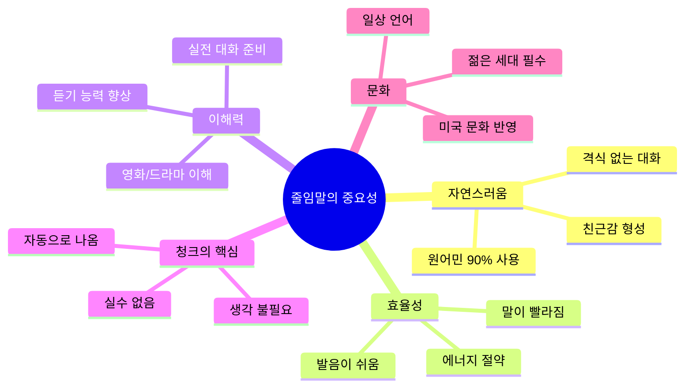
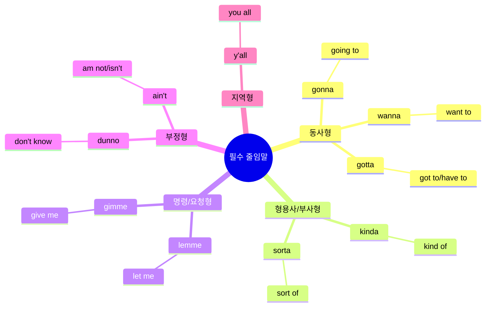
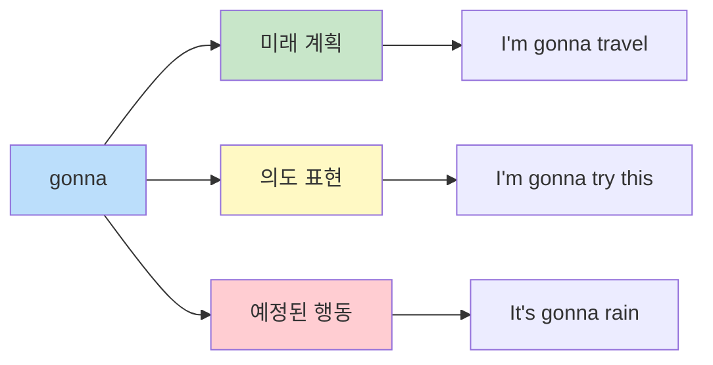
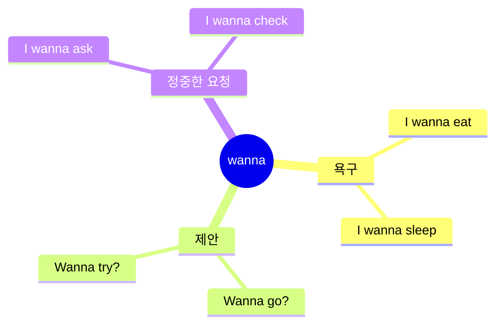
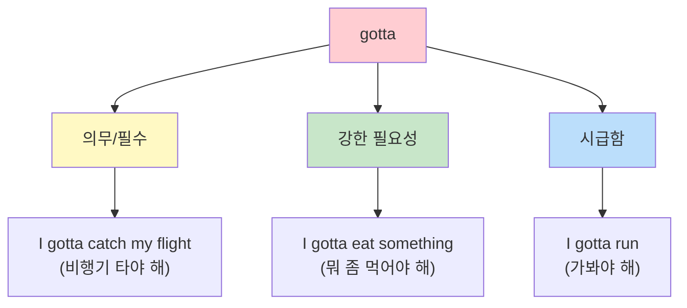
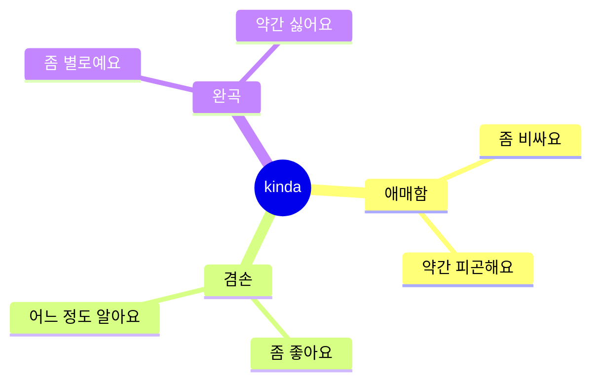
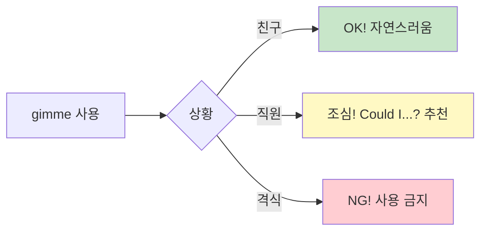
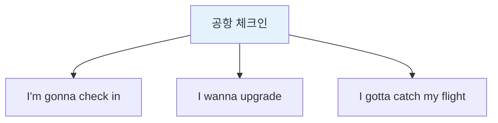
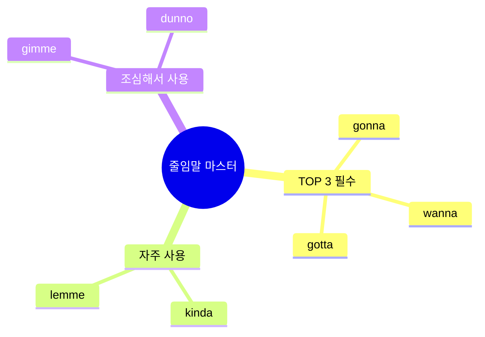

# 🗣️ 줄임말 청크 완벽 마스터
## 네이티브처럼 말하는 핵심 비법 + 청크 학습

---

## 🆕 청크 학습 업데이트!

**줄임말은 최고의 청크(Chunk)입니다!**

```
✅ 왜 줄임말 = 청크인가?
- 짧고 빠름 ⚡
- 자동으로 나옴 🧠
- 원어민이 실제로 사용 🎯
- 문법 걱정 없음 ✅

예: "I'm gonna go" 
    = 하나의 청크로 자동 발사!
```

---

## 📋 목차
1. [줄임말이란?](#줄임말이란)
2. [줄임말 청크 3단계 시스템](#줄임말-청크-3단계-시스템)
3. [필수 줄임말 TOP 10](#필수-줄임말-top-10)
4. [상황별 줄임말 청크 활용](#상황별-줄임말-청크-활용)
5. [발음 완벽 가이드](#발음-완벽-가이드)
6. [청크 자동화 훈련](#청크-자동화-훈련)
7. [연습 문제](#연습-문제)

---

## 줄임말이란?

### 정의
**줄임말(Contractions)**은 두 단어 이상을 합쳐서 짧게 발음하는 표현입니다.  
원어민들이 일상 대화에서 가장 많이 사용하며, 자연스럽고 친근한 느낌을 줍니다.

**청크 관점:**
줄임말은 가장 강력한 청크입니다. 짧고, 빠르고, 자동으로 나오기 때문에 여행 영어의 핵심입니다!

### 왜 중요한가?



---

## 줄임말 청크 3단계 시스템

### 시스템 개요

```mermaid
flowchart TB
    A[한국어 상황<br/>"~할 거예요"] --> B{누구한테?<br/>무슨 상황?}
    
    B -->|친구/편함| C[1단계: 줄임말 청크]
    B -->|일반| D[2단계: 중간 표현]
    B -->|격식/조심| E[3단계: 정식 표현]
    
    C --> C1["Gonna go<br/>(초간단)"]
    D --> D1["I'm gonna go<br/>(일반)"]
    E --> E1["I'm going to go<br/>(정중)"]
    
    style C fill:#ffcdd2
    style D fill:#c8e6c9
    style E fill:#e3f2fd
```

### 3단계 상세 설명

#### 1단계: 줄임말만 (Super Casual)

```
특징:
- 초간단, 초고속 ⚡⚡⚡
- 친구한테만
- 위험: 상황 잘못 쓰면 무례

예시:
"Gonna." → "갈 거야."
"Wanna." → "원해."
"Gotta." → "해야 해."

✅ 좋은 경우: 친한 친구와 문자
❌ 나쁜 경우: 호텔 직원한테
```

#### 2단계: 줄임말 + 주어 (Standard) ⭐ 추천!

```
특징:
- 자연스러움 + 명확함
- 여행 중 90% 사용
- 가장 안전한 선택

예시:
"I'm gonna go." → "갈 거예요."
"I wanna try this." → "이거 먹어보고 싶어요."
"I gotta leave." → "가야 해요."

✅ 추천 이유:
- 누구한테나 OK
- 자연스러움
- 실수 확률 낮음
```

#### 3단계: 정식 표현 (Formal)

```
특징:
- 매우 격식
- 비즈니스/고급 상황
- 조금 딱딱함

예시:
"I'm going to go." → "가겠습니다."
"I want to try this." → "이것을 시도하고 싶습니다."
"I have to leave." → "떠나야 합니다."

✅ 사용 시기:
- 5성급 호텔
- 비즈니스 미팅
- 첫 만남
```

### 📊 3단계 비교표 (줄임말 청크)

| 줄임말 | 1단계<br/>Super Casual | 2단계<br/>Standard ⭐ | 3단계<br/>Formal |
|--------|----------------------|-------------------|----------------|
| gonna | "Gonna go" | **"I'm gonna go"** | "I'm going to go" |
| wanna | "Wanna eat" | **"I wanna eat"** | "I want to eat" |
| gotta | "Gotta run" | **"I gotta run"** | "I have to run" |
| kinda | "Kinda busy" | **"I'm kinda busy"** | "I'm kind of busy" |
| lemme | "Lemme see" | **"Lemme see that"** | "Let me see that" |

💡 **핵심:** 여행에서는 2단계를 90% 사용하세요!

---

## 필수 줄임말 TOP 10

### 전체 구조 마인드맵



---

## 1️⃣ GONNA (going to)

### 📖 기본 정보

| 항목 | 내용 |
|------|------|
| **정식 표현** | going to |
| **줄임말** | gonna |
| **발음** | 거너 (guh-nuh) |
| **한국어** | ~할 거예요 / ~할 것이다 |
| **사용 빈도** | ⭐⭐⭐⭐⭐ (가장 많이 사용) |

### 🎯 의미와 뉘앙스



#### 핵심 의미
- **미래 행동** 표현할 때 사용
- **계획이나 의도**를 나타냄
- **will**보다 캐주얼하고 일상적

#### 뉘앙스 차이
| 표현 | 뉘앙스 | 사용 상황 |
|------|--------|----------|
| I **will** go | 격식적, 확정적 | 공식 약속, 서면 |
| I **am going to** go | 중립적, 정식 | 일반 대화 |
| I**'m gonna** go | 캐주얼, 친근 | 친구/일상 대화 |

### 💬 실전 예문

#### 기본 활용
```
✅ I'm gonna check in now.
   (아임 거너 체크인 나우)
   → 지금 체크인할게요.

✅ I'm gonna grab some coffee.
   (아임 거너 그랩 썸 커피)
   → 커피 좀 사올게요.

✅ We're gonna leave at 7.
   (위얼 거너 리브 앳 세븐)
   → 우리 7시에 출발할 거예요.
```

#### 여행 상황 활용
```
🏨 호텔: "I'm gonna check out tomorrow."
         (내일 체크아웃할 거예요)

🍴 식당: "I'm gonna try the salmon."
         (연어 먹어볼게요)

✈️ 공항: "I'm gonna miss my flight!"
         (비행기 놓치겠어요!)

🛍️ 쇼핑: "I'm gonna take this one."
         (이거 살게요)
```

### ⚠️ 주의사항

#### ❌ 흔한 실수
```
❌ I'm gonna to go. (to 중복!)
✅ I'm gonna go.

❌ I gonna go. (be 동사 빠짐!)
✅ I'm gonna go.

❌ I going to go. (너무 격식적인 발음)
✅ I'm gonna go. (자연스럽게!)
```

#### 📌 사용 팁
- **글로 쓸 때**: "going to" 사용 (격식)
- **말할 때**: "gonna" 사용 (자연스러움)
- **중요한 약속**: "will" 사용 (더 확정적)

---

## 2️⃣ WANNA (want to)

### 📖 기본 정보

| 항목 | 내용 |
|------|------|
| **정식 표현** | want to |
| **줄임말** | wanna |
| **발음** | 워너 (wah-nuh) |
| **한국어** | ~하고 싶어요 / ~하길 원해요 |
| **사용 빈도** | ⭐⭐⭐⭐⭐ |

### 🎯 의미와 뉘앙스



#### 핵심 의미
- **원하는 것** 표현
- **하고 싶은 것** 말할 때
- **제안할 때** 사용

### 💬 실전 예문

#### 기본 활용
```
✅ I wanna try this.
   (아이 워너 트라이 디스)
   → 이거 먹어보고 싶어요.

✅ Do you wanna sit here?
   (두 유 워너 싯 히얼?)
   → 여기 앉으실래요?

✅ I don't wanna be late.
   (아이 돈 워너 비 레잇)
   → 늦고 싶지 않아요.
```

#### 여행 상황 활용
```
🍽️ 식당: "I wanna order the steak."
         (스테이크 주문하고 싶어요)

🏨 호텔: "I wanna check out early."
         (일찍 체크아웃하고 싶어요)

🛍️ 쇼핑: "I wanna try this on."
         (입어보고 싶어요)

✈️ 공항: "I wanna upgrade my seat."
         (좌석 업그레이드하고 싶어요)
```

### ⚠️ 주의사항

```
❌ I wanna to go. (to 중복!)
✅ I wanna go.

❌ Do you wanna going? (동사 형태 틀림!)
✅ Do you wanna go?
```

---

## 3️⃣ GOTTA (got to / have to)

### 📖 기본 정보

| 항목 | 내용 |
|------|------|
| **정식 표현** | got to / have to |
| **줄임말** | gotta |
| **발음** | 가러 (gah-tuh) |
| **한국어** | ~해야 해요 / ~해야 한다 |
| **사용 빈도** | ⭐⭐⭐⭐⭐ |

### 🎯 의미와 뉘앙스



#### 핵심 의미
- **반드시 해야 할 것**
- **의무감** 표현
- **시급한 상황**

### 💬 실전 예문

#### 기본 활용
```
✅ I gotta go now.
   (아이 가러 고 나우)
   → 이제 가봐야 해요.

✅ You gotta try this!
   (유 가러 트라이 디스)
   → 이거 꼭 먹어봐야 해!

✅ I gotta catch my bus.
   (아이 가러 캐치 마이 버스)
   → 버스 타야 해요.
```

#### 여행 상황 활용
```
✈️ 공항: "I gotta catch my flight in 30 minutes!"
         (30분 안에 비행기 타야 해요!)

🏨 호텔: "I gotta check out by 11."
         (11시까지 체크아웃해야 해요)

💊 약국: "I gotta take this medicine."
         (이 약 먹어야 해요)

🚕 택시: "I gotta get to the airport fast."
         (공항에 빨리 가야 해요)
```

---

## 4️⃣ KINDA (kind of)

### 📖 기본 정보

| 항목 | 내용 |
|------|------|
| **정식 표현** | kind of |
| **줄임말** | kinda |
| **발음** | 카인더 (kin-duh) |
| **한국어** | 약간 / 좀 / 어느 정도 |
| **사용 빈도** | ⭐⭐⭐⭐ |

### 🎯 의미와 뉘앙스



#### 핵심 의미
- **확실하지 않을 때**
- **겸손하게 말할 때**
- **부드럽게 표현**할 때

### 💬 실전 예문

```
✅ It's kinda expensive.
   (잇츠 카인더 익스펜시브)
   → 좀 비싸요.

✅ I'm kinda tired.
   (아임 카인더 타이얼드)
   → 약간 피곤해요.

✅ It's kinda far from here.
   (잇츠 카인더 파 프럼 히얼)
   → 여기서 좀 멀어요.
```

---

## 5️⃣ LEMME (let me)

### 📖 기본 정보

| 항목 | 내용 |
|------|------|
| **정식 표현** | let me |
| **줄임말** | lemme |
| **발음** | 레미 (leh-me) |
| **한국어** | ~할게요 / ~하자 / ~해보자 |
| **사용 빈도** | ⭐⭐⭐⭐ |

### 💬 실전 예문

```
✅ Lemme check.
   (레미 체크)
   → 확인해볼게요.

✅ Lemme see the menu.
   (레미 씨 더 메뉴)
   → 메뉴 좀 볼게요.

✅ Lemme help you with that.
   (레미 헬프 유 위드 댓)
   → 도와드릴게요.
```

---

## 6️⃣ GIMME (give me)

### 📖 기본 정보

| 항목 | 내용 |
|------|------|
| **정식 표현** | give me |
| **줄임말** | gimme |
| **발음** | 기미 (gih-me) |
| **한국어** | ~주세요 / ~줘 |
| **사용 빈도** | ⭐⭐⭐ |

### ⚠️ 주의: 상황에 따라 무례할 수 있음!



### 💬 실전 예문

```
✅ Gimme a minute. (친구한테)
   (기미 어 미닛)
   → 1분만 줘.

⚠️ Could you gimme a sec? (직원한테는 이렇게)
   (쿠쥬 기미 어 섹?)
   → 잠깐만 주실 수 있나요?

❌ Gimme water. (너무 직접적! 무례함)
✅ Could I get some water? (이렇게!)
```

---

## 7️⃣ DUNNO (don't know)

### 📖 기본 정보

| 항목 | 내용 |
|------|------|
| **정식 표현** | don't know |
| **줄임말** | dunno |
| **발음** | 더노 (duh-no) |
| **한국어** | 모르겠어요 / 몰라요 |
| **사용 빈도** | ⭐⭐⭐⭐ |

### 💬 실전 예문

```
✅ I dunno where it is.
   (아이 더노 웨얼 잇 이즈)
   → 어디 있는지 모르겠어요.

✅ I dunno, maybe?
   (아이 더노, 메이비?)
   → 글쎄요, 아마도?

✅ Dunno. Let me check.
   (더노. 렛 미 체크)
   → 모르겠네요. 확인해볼게요.
```

---

## 8️⃣ Y'ALL (you all)

### 📖 기본 정보

| 항목 | 내용 |
|------|------|
| **정식 표현** | you all |
| **줄임말** | y'all |
| **발음** | 얄 (yawl) |
| **한국어** | 여러분 / 너희들 |
| **사용 빈도** | ⭐⭐⭐ (지역마다 다름) |
| **지역** | 주로 남부 지역 |

### 💬 실전 예문

```
✅ Y'all ready?
   (얄 레디?)
   → 다들 준비됐어요?

✅ Thanks, y'all!
   (땡스, 얄!)
   → 고마워요, 여러분!

✅ Where are y'all from?
   (웨얼 아 얄 프롬?)
   → 어디서 오셨어요?
```

---

## 발음 완벽 가이드

### 발음 비교표

| 줄임말 | 정식 발음 | 줄임말 발음 | 한글 발음 | 난이도 |
|--------|----------|------------|---------|:------:|
| gonna | 고잉 투 | 거너 | 거너 | ⭐ |
| wanna | 원트 투 | 워너 | 워너 | ⭐ |
| gotta | 갓 투 | 가러 | 가러 | ⭐ |
| kinda | 카인드 오브 | 카인더 | 카인더 | ⭐⭐ |
| lemme | 렛 미 | 레미 | 레미 | ⭐ |
| gimme | 기브 미 | 기미 | 기미 | ⭐ |
| dunno | 돈트 노우 | 더노 | 더노 | ⭐ |
| y'all | 유 올 | 얄 | 얄 | ⭐⭐ |

### 🎤 발음 연습 문장

```
1. I'm gonna wanna kinda check.
   (아임 거너 워너 카인더 체크)
   → 확인해보고 싶을 것 같아요.

2. Lemme see, I gotta go.
   (레미 씨, 아이 가러 고)
   → 어디 보자, 가봐야 해.

3. I dunno, gimme a sec.
   (아이 더노, 기미 어 섹)
   → 모르겠는데, 잠깐만요.
```

---

## 상황별 줄임말 활용

### 공항에서



```
"I'm gonna check in now."
(지금 체크인할게요)

"I wanna get a window seat."
(창가 자리를 원해요)

"I gotta catch my flight in 30 minutes."
(30분 후에 비행기 타야 해요)
```

### 호텔에서

```
"I'm gonna check out tomorrow."
(내일 체크아웃할 거예요)

"I wanna extend my stay."
(숙박을 연장하고 싶어요)

"It's kinda noisy."
(좀 시끄러워요)
```

### 식당에서

```
"I'm gonna try the salmon."
(연어로 할게요)

"I wanna split the bill."
(계산 나눠서 할게요)

"This is kinda spicy."
(이거 좀 매워요)
```

---

## 연습 문제

### 문제 1: 정식 표현을 줄임말로 바꾸기

```
1. I am going to go now.
   → I'm _______ go now.

2. I want to try this.
   → I _______ try this.

3. I have got to leave.
   → I _______ leave.

4. It is kind of expensive.
   → It's _______ expensive.

5. Let me check.
   → _______ check.
```

<details>
<summary>정답 보기</summary>

1. gonna
2. wanna
3. gotta
4. kinda
5. Lemme

</details>

### 문제 2: 상황에 맞는 줄임말 선택

```
1. 공항에서 비행기 시간이 촉박할 때:
   "I _______ catch my flight!"
   a) wanna  b) gonna  c) gotta

2. 식당에서 메뉴를 고르며:
   "I _______ try the pasta."
   a) gotta  b) wanna  c) dunno

3. 가격이 조금 비쌀 때:
   "It's _______ expensive."
   a) kinda  b) lemme  c) gimme

4. 확인이 필요할 때:
   "_______ check that."
   a) Gimme  b) Lemme  c) Y'all
```

<details>
<summary>정답 보기</summary>

1. c) gotta (의무/시급함)
2. b) wanna (원하는 것)
3. a) kinda (약간/좀)
4. b) Lemme (할게요)

</details>

---

## 핵심 정리

### ✅ 반드시 기억할 것



1. **gonna/wanna/gotta** - 이 3개는 필수!
2. **말할 때만** 사용 (글쓰기는 정식 표현)
3. **친근한 상황**에서 적극 사용
4. **격식 있는 상황**에서는 자제

### 📚 다음 단계

줄임말을 익혔다면, 다음은:
- 👉 [감사/응답 표현 체계](./02_감사_응답_표현_체계.md)
- 👉 [공항 체크인 표현](../공항_기내/04_공항_체크인_표현_분석.md)

---

**학습 목표 달성 체크리스트**

- [ ] 8개 필수 줄임말 의미 이해
- [ ] 각 줄임말 발음 연습 완료
- [ ] 연습 문제 80% 이상 정답
- [ ] 실제 문장에 적용 가능
- [ ] 상황별 활용법 숙지

---

*이 가이드로 여러분도 네이티브처럼 자연스럽게 말할 수 있습니다!*

---

## 🎯 전설의 10턴 대화 마스터

### 상황 1: 공항 체크인 (줄임말 활용)

```
턴 1 - 손님: "Hey! I'm gonna check in for my LA flight."
턴 2 - 직원: "Sure thing! Lemme see your passport."
턴 3 - 손님: "Here you go. I wanna get a window seat if possible?"
턴 4 - 직원: "Lemme check... Yeah, I got one! You're lucky."
턴 5 - 손님: "Sweet! I gotta ask - any bags to check?"
턴 6 - 직원: "Got any bags to check?"
턴 7 - 손님: "Just one. It's kinda heavy though."
턴 8 - 직원: "No worries! Pop it on the scale... You're good, 22 kilos."
턴 9 - 손님: "Awesome! What gate am I gonna be at?"
턴 10 - 직원: "Gate 15. Boarding's gonna start at 2:30. Have a great flight!"

🇰🇷 한국어 번역:
턴 1 - 손님: 안녕하세요! LA행 비행기 체크인할게요.
턴 2 - 직원: 물론이죠! 여권 볼게요.
턴 3 - 손님: 여기요. 가능하면 창가석 받고 싶은데요?
턴 4 - 직원: 확인해볼게요... 네, 하나 있네요! 운이 좋으시네요.
턴 5 - 손님: 좋아요! 질문 하나만 - 부칠 짐 있나요?
턴 6 - 직원: 부칠 짐 있으세요?
턴 7 - 손님: 하나요. 근데 좀 무거워요.
턴 8 - 직원: 괜찮아요! 저울에 올려주세요... 괜찮네요, 22킬로예요.
턴 9 - 손님: 좋아요! 몇 번 게이트예요?
턴 10 - 직원: 15번 게이트요. 탑승은 2시 30분에 시작할 거예요. 좋은 여행 되세요!

📝 사용된 줄임말:
• I'm gonna (going to) - 5회
• Lemme (let me) - 2회
• wanna (want to) - 1회
• gotta (got to) - 1회
• kinda (kind of) - 1회
```

### 상황 2: 호텔 체크인 (자연스러운 대화)

```
턴 1 - 손님: "Hey! I'm gonna check in. Name's under Kim."
턴 2 - 직원: "Welcome! Lemme find you... Got it! Room 512."
턴 3 - 손님: "Nice! I wanna ask - is breakfast included?"
턴 4 - 직원: "Yep! It's gonna be served from 7 to 10."
턴 5 - 손님: "Perfect. I gotta check out by noon, right?"
턴 6 - 직원: "Normally yes, but I can extend it till 2 if you wanna?"
턴 7 - 손님: "That'd be awesome! I'm gonna be kinda tired tomorrow."
턴 8 - 직원: "No prob! Lemme note that for you. Anything else?"
턴 9 - 손님: "Where's the gym? I wanna work out in the morning."
턴 10 - 직원: "2nd floor! It's gonna be open 24/7. Enjoy your stay!"

🇰🇷 한국어 번역:
턴 1 - 손님: 안녕하세요! 체크인할게요. 김으로 예약했어요.
턴 2 - 직원: 환영합니다! 찾아볼게요... 찾았어요! 512호실이에요.
턴 3 - 손님: 좋네요! 질문 있는데요 - 조식 포함인가요?
턴 4 - 직원: 네! 7시부터 10시까지 제공될 거예요.
턴 5 - 손님: 완벽해요. 정오까지 체크아웃해야 하죠?
턴 6 - 직원: 보통 그렇지만, 원하시면 2시까지 연장해드릴 수 있어요?
턴 7 - 손님: 그거 좋겠네요! 내일 좀 피곤할 것 같아요.
턴 8 - 직원: 문제없어요! 메모해둘게요. 다른 거 필요하세요?
턴 9 - 손님: 헬스장이 어디예요? 아침에 운동하고 싶어서요.
턴 10 - 직원: 2층이에요! 24시간 열려있을 거예요. 편히 쉬세요!

📝 사용된 줄임말:
• I'm gonna (going to) - 4회
• Lemme (let me) - 2회
• wanna (want to) - 3회
• gotta (got to) - 1회
• kinda (kind of) - 1회
```

### 상황 3: 식당 주문 (친근한 대화)

```
턴 1 - 손님: "Hey! Table for two, please?"
턴 2 - 직원: "Sure! Lemme grab you a nice spot by the window."
턴 3 - 손님: "Perfect! I gotta ask - what's good here?"
턴 4 - 직원: "The pasta's kinda famous. You're gonna love it!"
턴 5 - 손님: "Sounds great! I wanna try that then."
턴 6 - 직원: "Awesome choice! Lemme tell the kitchen. Any drinks?"
턴 7 - 손님: "I'm gonna have water for now. My friend's gonna order when he gets here."
턴 8 - 직원: "No prob! I'll bring water. You're gonna wanna try our bread too - it's fresh!"
턴 9 - 손님: "Ooh, I gotta have that! Thanks for the tip!"
턴 10 - 직원: "You bet! Lemme know if you need anything else. Enjoy!"

🇰🇷 한국어 번역:
턴 1 - 손님: 안녕하세요! 2명 자리 있나요?
턴 2 - 직원: 네! 창가 좋은 자리로 안내해드릴게요.
턴 3 - 손님: 완벽해요! 질문 있는데 - 여기 뭐가 맛있어요?
턴 4 - 직원: 파스타가 좀 유명해요. 정말 좋아하실 거예요!
턴 5 - 손님: 좋네요! 그럼 그걸로 먹어볼게요.
턴 6 - 직원: 훌륭한 선택이에요! 주방에 알려드릴게요. 음료는요?
턴 7 - 손님: 일단 물로 할게요. 제 친구가 도착하면 주문할 거예요.
턴 8 - 직원: 문제없어요! 물 가져다드릴게요. 빵도 드셔보세요 - 갓 구웠어요!
턴 9 - 손님: 오, 그것도 먹어야겠네요! 추천해주셔서 감사해요!
턴 10 - 직원: 당연하죠! 필요한 거 있으면 말씀하세요. 맛있게 드세요!

📝 사용된 줄임말:
• I'm gonna (going to) - 4회
• Lemme (let me) - 3회
• wanna (want to) - 2회
• gotta (got to / have to) - 2회
• kinda (kind of) - 1회
```

---

## 📝 줄임말 마스터 테스트

### 테스트 1: 줄임말 변환 (10문제)

```
다음 문장을 줄임말을 사용해서 자연스럽게 바꾸세요.

1. I am going to check in now.
   답: _______________________

2. I want to try the pasta.
   답: _______________________

3. I have got to catch my flight.
   답: _______________________

4. It is kind of expensive.
   답: _______________________

5. Let me see the menu.
   답: _______________________

6. I am going to get a coffee.
   답: _______________________

7. Do you want to sit here?
   답: _______________________

8. I have got to go now.
   답: _______________________

9. It is kind of far from here.
   답: _______________________

10. Let me check my bag.
    답: _______________________
```

<details>
<summary>✅ 정답 확인</summary>

1. **I'm gonna check in now.**
2. **I wanna try the pasta.**
3. **I gotta catch my flight.**
4. **It's kinda expensive.**
5. **Lemme see the menu.**
6. **I'm gonna get a coffee.**
7. **Do you wanna sit here?** / **Wanna sit here?**
8. **I gotta go now.**
9. **It's kinda far from here.**
10. **Lemme check my bag.**

</details>

---

### 테스트 2: 상황별 줄임말 활용 (5문제)

```
각 상황에 맞는 줄임말 표현을 선택하세요.

1. 공항에서 비행기 시간이 촉박할 때:
   a) I wanna catch my flight.
   b) I gotta catch my flight!
   c) I'm gonna catch my flight.
   
2. 식당에서 메뉴를 보고 싶을 때:
   a) Gotta see the menu.
   b) Lemme see the menu.
   c) Wanna see the menu.
   
3. 호텔에서 체크아웃 예정을 말할 때:
   a) I gotta check out tomorrow.
   b) I wanna check out tomorrow.
   c) I'm gonna check out tomorrow.
   
4. 가격이 좀 비쌀 때:
   a) It's gonna expensive.
   b) It's kinda expensive.
   c) It's gotta expensive.
   
5. 친구에게 커피 마실지 물을 때:
   a) You gonna get coffee?
   b) You gotta get coffee?
   c) You wanna get coffee?
```

<details>
<summary>✅ 정답 확인</summary>

1. **b) I gotta catch my flight!**  
   (의무/시급함 → gotta)

2. **b) Lemme see the menu.**  
   (허락/요청 → lemme)

3. **c) I'm gonna check out tomorrow.**  
   (미래 계획 → gonna)

4. **b) It's kinda expensive.**  
   (약간/좀 → kinda)

5. **c) You wanna get coffee?**  
   (원하는 것/제안 → wanna)

</details>

---

### 테스트 3: 대화 완성하기 (5문제)

```
빈칸에 적절한 줄임말을 넣으세요.

대화 1: 공항
직원: "What can I do for you?"
손님: "Hey! I _______ check in."
직원: "Sure! _______ see your passport."

대화 2: 호텔
손님: "Is breakfast included?"
직원: "Yep! It _______ be served from 7 to 10."
손님: "Great! I _______ eat early anyway."

대화 3: 식당
손님: "What's good here?"
직원: "The burger's _______ famous."
손님: "Okay, I _______ try that!"
```

<details>
<summary>✅ 정답 확인</summary>

**대화 1: 공항**
- 손님: "Hey! I **'m gonna** check in."
- 직원: "Sure! **Lemme** see your passport."

**대화 2: 호텔**
- 직원: "Yep! It **'s gonna** be served from 7 to 10."
- 손님: "Great! I **gotta** eat early anyway."

**대화 3: 식당**
- 직원: "The burger's **kinda** famous."
- 손님: "Okay, I **'ll / wanna** try that!"

</details>

---

### 테스트 4: 듣기 연습 (발음 구별)

```
다음 중 올바른 발음 표기는?

1. gonna
   a) 고잉 투
   b) 거너
   c) 고나

2. wanna
   a) 원트 투
   b) 워너
   c) 와나

3. gotta
   a) 갓 투
   b) 가러
   c) 고타

4. kinda
   a) 카인드 오브
   b) 킨다
   c) 카인더

5. lemme
   a) 렛 미
   b) 레미
   c) 렘미
```

<details>
<summary>✅ 정답 확인</summary>

1. **b) 거너** (guh-nuh)
2. **b) 워너** (wah-nuh)
3. **b) 가러** (gah-tuh)
4. **c) 카인더** (kin-duh)
5. **b) 레미** (leh-me)

</details>

---

### 테스트 5: 실전 응용 (종합)

```
다음 상황에서 자연스러운 대화를 만드세요.
(줄임말을 최소 3개 이상 사용할 것)

상황: 식당에서 친구와 주문하기

나: _________________________________
친구: _________________________________
나: _________________________________
직원: _________________________________
나: _________________________________
```

<details>
<summary>💡 모범 답안 예시</summary>

**나:** "Hey! I'm gonna get the pasta. What do you wanna order?"

**친구:** "I dunno... Lemme see the menu again."

**나:** "The burger's kinda famous here. You gotta try it!"

**직원:** "Ready to order?"

**나:** "Yeah! I wanna get the pasta and he's gonna have the burger."

**분석:**
- gonna (going to) - 3회
- wanna (want to) - 2회
- lemme (let me) - 1회
- kinda (kind of) - 1회
- gotta (got to) - 1회
- dunno (don't know) - 1회

총 9개의 줄임말 사용! 🎉

</details>

---

## 🎓 학습 완료 체크리스트

### 기본 이해도 ✅
- [ ] 8개 필수 줄임말의 의미를 정확히 알고 있다
- [ ] 각 줄임말의 발음을 익혔다
- [ ] 정식 표현과 줄임말의 차이를 안다
- [ ] 줄임말 사용 시기를 안다 (말 vs 글)

### 실전 활용도 ✅
- [ ] 테스트 1 (변환) - 8/10 이상 정답
- [ ] 테스트 2 (상황별) - 4/5 이상 정답
- [ ] 테스트 3 (대화) - 정답률 80% 이상
- [ ] 테스트 4 (발음) - 4/5 이상 정답
- [ ] 테스트 5 (응용) - 3개 이상 줄임말 자연스럽게 사용

### 고급 활용도 🔥
- [ ] 10턴 대화를 읽고 이해할 수 있다
- [ ] 비슷한 상황에서 줄임말을 자연스럽게 사용할 수 있다
- [ ] 원어민 속도의 줄임말을 듣고 이해할 수 있다
- [ ] 여러 줄임말을 한 문장에 조합할 수 있다

---

**Last Updated: 2026-01-11**

