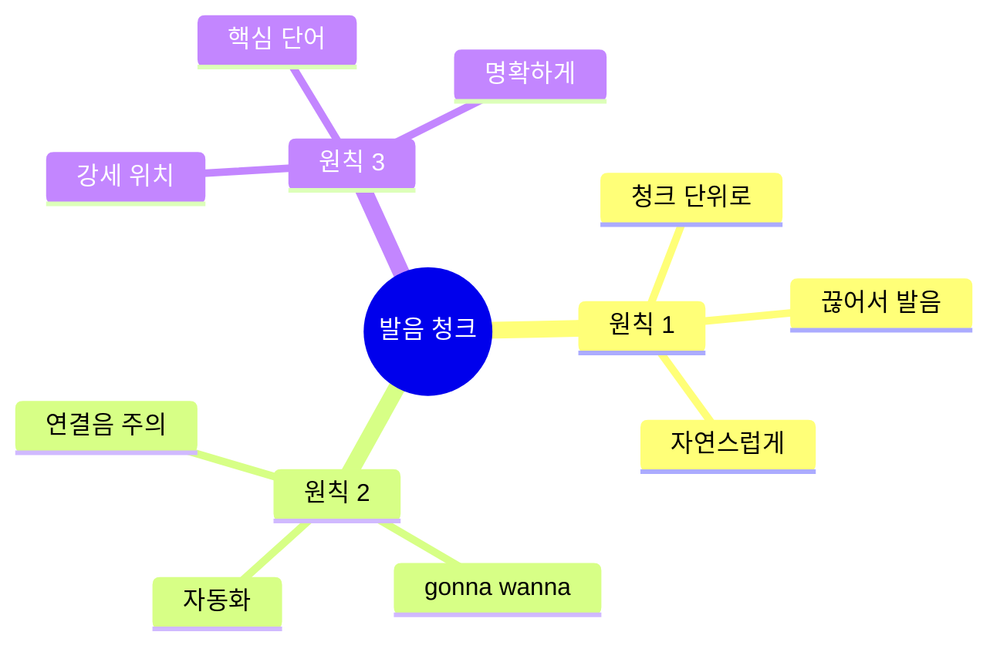

# 🎤 발음 중심 청크 마스터 가이드
## 한글 발음으로 완벽하게 말하기

---

## 🎯 이 가이드의 목표

### 발음 = 자신감의 핵심!

```
❌ 흔한 고민:
"발음이 안 좋아서 말하기 부끄러워요..."
"원어민처럼 발음할 수 없어요..."

✅ 이 가이드로:
"한글 발음 표기로 자신 있게!"
"청크별 발음 연습으로 완벽!"

💡 핵심: 완벽한 발음보다 명확한 전달!
```

---

## 📋 목차

1. [발음 청크 시스템](#발음-청크-시스템)
2. [전설의 6턴 대화 - 발음 완벽 가이드](#전설의-6턴-대화)
3. [발음 연결 훈련](#발음-연결-훈련)
4. [발음 테스트](#발음-테스트)

---

## 발음 청크 시스템

### 🎤 발음 청크 3원칙



### 📊 발음 청크 TOP 20

| 순위 | 청크 | 한글 발음 | 연결음 | 빈도 |
|:---:|------|---------|--------|:----:|
| 1 | I'm gonna | 아임 거너 | I'm + gonna | ⭐⭐⭐⭐⭐ |
| 2 | I wanna | 아이 워너 | I + wanna | ⭐⭐⭐⭐⭐ |
| 3 | I gotta | 아이 가러 | I + gotta | ⭐⭐⭐⭐⭐ |
| 4 | Thanks a lot | 땡스 어 랏 | Thanks + a + lot | ⭐⭐⭐⭐⭐ |
| 5 | No worries | 노 워리스 | No + worries | ⭐⭐⭐⭐⭐ |
| 6 | For sure | 포 슈어 | For + sure | ⭐⭐⭐⭐⭐ |
| 7 | I'm kinda | 아임 카인더 | I'm + kinda | ⭐⭐⭐⭐ |
| 8 | Lemme see | 레미 씨 | Let + me + see | ⭐⭐⭐⭐ |
| 9 | You bet | 유 벳 | You + bet | ⭐⭐⭐⭐ |
| 10 | Sounds good | 사운즈 굿 | Sounds + good | ⭐⭐⭐⭐ |

---

## 전설의 6턴 대화

### 🎬 시나리오 1: 공항 체크인 (발음 완벽 가이드)

```
상황: 공항 체크인 카운터
목표: 발음 중심으로 자연스럽게 대화하기

턴 1 - 손님 → 직원
영어: "Hi! / I'm gonna / check in."
🔊 발음: "하이! / 아임 거너 / 체킨."
📝 청크: [인사] + [의도] + [행동]
💭 생각: "안녕하세요" → "Hi!"
         "체크인할 거예요" → "I'm gonna check in"
⏱️ 반응 속도: 1초

턴 2 - 직원 → 손님
영어: "Sure! / Lemme see / your passport."
🔊 발음: "슈어! / 레미 씨 / 유어 패스포트."
📝 청크: [확인] + [요청] + [서류]
💭 생각: "물론이죠" → "Sure!"
         "여권 볼게요" → "Lemme see your passport"

턴 3 - 손님 → 직원
영어: "Here you go. / I wanna / get / a window seat."
🔊 발음: "히어 유 고. / 아이 워너 / 겟 / 어 윈도우 씨트."
📝 청크: [제공] + [원함] + [얻다] + [창가석]
💭 생각: "여기요" → "Here you go"
         "창가석 원해요" → "I wanna get a window seat"
⏱️ 반응 속도: 2초

턴 4 - 직원 → 손님
영어: "Lemme check... / Yeah, / I got one! / You're lucky."
🔊 발음: "레미 체크... / 예! / 아이 갓 원! / 유어 럭키."
📝 청크: [확인] + [긍정] + [있음] + [운 좋음]
💭 생각: "확인할게요" → "Lemme check"
         "하나 있어요" → "I got one"

턴 5 - 손님 → 직원
영어: "Awesome! / I gotta ask - / any bags / to check?"
🔊 발음: "어썸! / 아이 가러 애스크 - / 애니 백스 / 투 체크?"
📝 청크: [만족] + [질문 전] + [가방] + [부칠]
💭 생각: "좋아요!" → "Awesome!"
         "질문 있는데" → "I gotta ask"
         "부칠 가방?" → "any bags to check"
⏱️ 반응 속도: 2초

턴 6 - 직원 → 손님
영어: "Got any bags / to check?"
🔊 발음: "갓 애니 백스 / 투 체크?"
📝 청크: [있나요] + [부칠 가방]

턴 7 - 손님 → 직원
영어: "Just one. / It's kinda heavy / though."
🔊 발음: "저스트 원. / 잇츠 카인더 헤비 / 도우."
📝 청크: [하나만] + [좀 무거움] + [하지만]
💭 생각: "하나요" → "Just one"
         "좀 무거워요" → "It's kinda heavy"
⏱️ 반응 속도: 1.5초

턴 8 - 직원 → 손님
영어: "No worries! / Pop it / on the scale... / You're good, / 22 kilos."
🔊 발음: "노 워리스! / 팝 잇 / 온 더 스케일... / 유어 굿, / 트웬티투 킬로스."
📝 청크: [괜찮음] + [올려] + [저울] + [OK] + [무게]
💭 생각: "괜찮아요" → "No worries"
         "저울에 올려주세요" → "Pop it on the scale"

턴 9 - 손님 → 직원
영어: "Perfect! / What gate / am I gonna be at?"
🔊 발음: "퍼펙트! / 왓 게이트 / 앰 아이 거너 비 앳?"
📝 청크: [만족] + [어느 게이트] + [있을 거예요]
💭 생각: "완벽해요" → "Perfect"
         "몇 번 게이트예요?" → "What gate am I gonna be at"
⏱️ 반응 속도: 1초

턴 10 - 직원 → 손님
영어: "Gate 15. / Boarding's gonna start / at 2:30. / Have a great flight!"
🔊 발음: "게이트 피프틴. / 보딩즈 거너 스타트 / 앳 투 써티. / 해브 어 그레잇 플라잇!"
📝 청크: [게이트] + [탑승 시작] + [시간] + [인사]
💭 생각: "15번 게이트요" → "Gate 15"
         "탑승 시작해요" → "Boarding's gonna start"

✅ 총 대화 시간: 2분
🎯 사용된 발음 청크: 15개
💪 발음 난이도: 중급
```

### 🎬 시나리오 2: 카페 주문 (발음 완벽 가이드)

```
상황: 스타벅스 카운터
목표: 빠르고 명확한 발음으로 주문하기

턴 1 - 손님 → 바리스타
영어: "Hey! / Can I get / a large / iced latte?"
🔊 발음: "헤이! / 캔 아이 겟 / 어 라지 / 아이스드 라떼?"
📝 청크: [인사] + [주문] + [사이즈] + [메뉴]
💭 생각: "안녕하세요" → "Hey!"
         "라지 아이스 라떼 주세요" → "Can I get a large iced latte"
⏱️ 반응 속도: 1초

턴 2 - 바리스타 → 손님
영어: "You got it! / For here / or to go?"
🔊 발음: "유 갓 잇! / 포 히어 / 오어 투 고?"
📝 청크: [확인] + [여기서] + [가져가기]
💭 생각: "알겠습니다" → "You got it"
         "여기서 드실 건가요?" → "For here or to go"

턴 3 - 손님 → 바리스타
영어: "To go, / please. / Thanks!"
🔊 발음: "투 고, / 플리즈. / 땡스!"
📝 청크: [가져가기] + [부탁] + [감사]
💭 생각: "가져갈게요" → "To go"
⏱️ 반응 속도: 0.5초

턴 4 - 바리스타 → 손님
영어: "No prob! / That'll be / $5.50."
🔊 발음: "노 프랍! / 댓츨 비 / 파이브 피프티."
📝 청크: [문제없음] + [가격] + [금액]
💭 생각: "문제없어요" → "No prob"
         "5.50달러예요" → "That'll be $5.50"

턴 5 - 손님 → 바리스타
영어: "Sounds good! / Here's my card."
🔊 발음: "사운즈 굿! / 히어즈 마이 카드."
📝 청크: [좋아요] + [카드 제공]
💭 생각: "좋아요" → "Sounds good"
         "카드요" → "Here's my card"
⏱️ 반응 속도: 1초

턴 6 - 바리스타 → 손님
영어: "Perfect. / It'll be ready / in a sec."
🔊 발음: "퍼펙트. / 잇츨 비 레디 / 인 어 섹."
📝 청크: [완벽] + [준비될 거예요] + [곧]
💭 생각: "완벽해요" → "Perfect"
         "곧 나올 거예요" → "It'll be ready in a sec"

턴 7 - 손님 → 바리스타
영어: "Awesome! / Can I get / a receipt?"
🔊 발음: "어썸! / 캔 아이 겟 / 어 리씨트?"
📝 청크: [좋아요] + [받을 수 있나요] + [영수증]
💭 생각: "좋아요" → "Awesome"
         "영수증 주세요" → "Can I get a receipt"
⏱️ 반응 속도: 1초

턴 8 - 바리스타 → 손님
영어: "Sure thing! / Here you go."
🔊 발음: "슈어 띵! / 히어 유 고."
📝 청크: [물론] + [여기요]
💭 생각: "물론이죠" → "Sure thing"

턴 9 - 손님 → 바리스타
영어: "Thanks so much! / You're the best!"
🔊 발음: "땡스 쏘 머치! / 유어 더 베스트!"
📝 청크: [정말 감사] + [최고예요]
💭 생각: "정말 감사해요" → "Thanks so much"
         "최고예요" → "You're the best"
⏱️ 반응 속도: 1초

턴 10 - 바리스타 → 손님
영어: "Anytime! / Have a great day!"
🔊 발음: "애니타임! / 해브 어 그레잇 데이!"
📝 청크: [언제든지] + [좋은 하루]
💭 생각: "언제든지요" → "Anytime"

✅ 총 대화 시간: 1분
🎯 사용된 발음 청크: 12개
💪 발음 난이도: 초급
```

---

## 발음 연결 훈련

### 🔗 연결음 마스터

#### 연결 패턴 1: 자음 + 모음

```
I'm + gonna → 아임거너 (자연스럽게 연결)
❌ 아임 / 거너 (끊어 읽기)
✅ 아임거너 (한 번에)

연습:
1. I'm gonna go → 아임거너고
2. I'm gonna try → 아임거너트라이
3. I'm gonna check → 아임거너체크
```

#### 연결 패턴 2: 같은 자음

```
Got + to → gotta → 가러
❌ 갓투
✅ 가러

연습:
1. I gotta go → 아이가러고
2. I gotta run → 아이가러런
3. I gotta check → 아이가러체크
```

#### 연결 패턴 3: 모음 + 모음

```
No + worries → 노워리스 (w 소리 약하게)
❌ 노 워리스 (끊어 읽기)
✅ 노워리스 (부드럽게)

연습:
1. No worries → 노워리스
2. Go ahead → 고어헤드
3. So excited → 소익사이티드
```

---

## 발음 테스트

### 📝 테스트 1: 발음 청크 속도 테스트

```
다음 청크를 1초 안에 발음하세요:

1. I'm gonna go
   🔊 정답: 아임거너고
   ⏱️ 목표: 1초

2. I wanna try
   🔊 정답: 아이워너트라이
   ⏱️ 목표: 1초

3. Thanks a lot
   🔊 정답: 땡스어랏
   ⏱️ 목표: 0.5초

4. No worries
   🔊 정답: 노워리스
   ⏱️ 목표: 0.5초

5. For sure
   🔊 정답: 포슈어
   ⏱️ 목표: 0.5초

채점:
5개 모두 1초 안에 → 마스터! 🏆
3-4개 → 우수! 👍
1-2개 → 연습 필요! 💪
```

### 📝 테스트 2: 연결음 테스트

```
다음 문장을 자연스럽게 연결하여 발음하세요:

1. I'm gonna check in now.
   🔊 정답: 아임거너체킨나우
   💡 포인트: gonna + check 연결

2. I wanna get a window seat.
   🔊 정답: 아이워너게러윈도우씨트
   💡 포인트: wanna + get 연결

3. I gotta ask you something.
   🔊 정답: 아이가러애스큐썸띵
   💡 포인트: gotta + ask 연결

4. Thanks a lot for your help.
   🔊 정답: 땡스어랏포유어헬프
   💡 포인트: lot + for 연결

5. No worries at all.
   🔊 정답: 노워리스애롤
   💡 포인트: worries + at 연결

채점:
5개 모두 자연스럽게 → 완벽! 🎉
3-4개 → 좋아요! 😊
1-2개 → 더 연습! 🔥
```

---

## 🏆 발음 마스터 체크리스트

### 기본 발음 청크 (10개)
- [ ] I'm gonna (아임거너)
- [ ] I wanna (아이워너)
- [ ] I gotta (아이가러)
- [ ] Thanks a lot (땡스어랏)
- [ ] No worries (노워리스)
- [ ] For sure (포슈어)
- [ ] Sounds good (사운즈굿)
- [ ] You bet (유벳)
- [ ] Lemme see (레미씨)
- [ ] I'm kinda (아임카인더)

### 연결음 마스터 (5개)
- [ ] gonna + 동사 연결
- [ ] wanna + 동사 연결
- [ ] gotta + 동사 연결
- [ ] Thanks + a + lot 연결
- [ ] No + worries 연결

### 실전 대화 (3개)
- [ ] 공항 체크인 10턴 완벽 발음
- [ ] 카페 주문 10턴 완벽 발음
- [ ] 자연스러운 속도로 대화

---

**발음 중심 청크 마스터 완료! 🎤**

> "한글 발음으로 자신 있게!"
> 
> Korean Pronunciation = Confidence!

**Last Updated: 2026-02-04**

